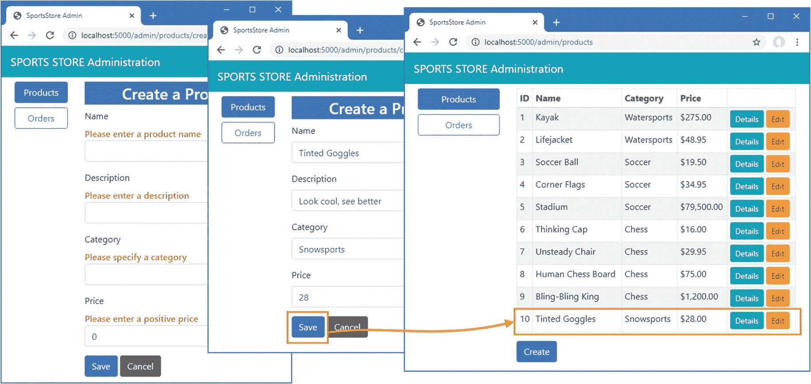

# 十、SportsStore：管理

在本章中，我将继续构建 SportsStore 应用，以便为站点管理员提供一种管理订单和产品的方法。在本章中，我使用 Blazor 来创建管理特性。Blazor 是 ASP.NET Core 的新成员，它结合了客户端 JavaScript 代码和由 ASP.NET Core 执行的服务器端代码，通过持久的 HTTP 连接进行连接。我在第[32](32.html)–[35](35.html)章中详细描述了 Blazor，但是理解 Blazor 模型并不适用于所有项目是很重要的。(我在本章中使用的是 Blazor 服务器，它是 ASP.NET Core 平台支持的一部分。还有 Blazor WebAssembly，在撰写本文时，它还处于试验阶段，完全在浏览器中运行。我在第 36 章[中描述了 Blazor WebAssembly。)](36.html)

Tip

你可以从 [`https://github.com/apress/pro-asp.net-core-3`](https://github.com/apress/pro-asp.net-core-3) 下载本章以及本书其他章节的示例项目。如果在运行示例时遇到问题，请参见第 [1](01.html) 章获取帮助。

## 正在准备 Blazor 服务器

第一步是为 Blazor 启用服务和中间件，如清单 [10-1](#PC1) 所示。

```cs
using System;
using System.Collections.Generic;
using System.Linq;
using System.Threading.Tasks;
using Microsoft.AspNetCore.Builder;
using Microsoft.AspNetCore.Hosting;
using Microsoft.AspNetCore.Http;
using Microsoft.Extensions.DependencyInjection;
using Microsoft.Extensions.Hosting;
using Microsoft.Extensions.Configuration;
using Microsoft.EntityFrameworkCore;
using SportsStore.Models;

namespace SportsStore {
    public class Startup {

        public Startup(IConfiguration config) {
            Configuration = config;
        }

        private IConfiguration Configuration { get; set; }

        public void ConfigureServices(IServiceCollection services) {
            services.AddControllersWithViews();
            services.AddDbContext<StoreDbContext>(opts => {
                opts.UseSqlServer(
                    Configuration["ConnectionStrings:SportsStoreConnection"]);
            });
            services.AddScoped<IStoreRepository, EFStoreRepository>();
            services.AddScoped<IOrderRepository, EFOrderRepository>();
            services.AddRazorPages();
            services.AddDistributedMemoryCache();
            services.AddSession();
            services.AddScoped<Cart>(sp => SessionCart.GetCart(sp));
            services.AddSingleton<IHttpContextAccessor, HttpContextAccessor>();
            services.AddServerSideBlazor();
        }

        public void Configure(IApplicationBuilder app, IWebHostEnvironment env) {
            app.UseDeveloperExceptionPage();
            app.UseStatusCodePages();
            app.UseStaticFiles();
            app.UseSession();
            app.UseRouting();

            app.UseEndpoints(endpoints => {
                endpoints.MapControllerRoute("catpage",
                    "{category}/Page{productPage:int}",
                    new { Controller = "Home", action = "Index" });

                endpoints.MapControllerRoute("page", "Page{productPage:int}",
                    new { Controller = "Home", action = "Index", productPage = 1 });

                endpoints.MapControllerRoute("category", "{category}",
                    new { Controller = "Home", action = "Index", productPage = 1 });

                endpoints.MapControllerRoute("pagination",
                    "Products/Page{productPage}",
                    new { Controller = "Home", action = "Index", productPage = 1 });
                endpoints.MapDefaultControllerRoute();
                endpoints.MapRazorPages();
                endpoints.MapBlazorHub();
                endpoints.MapFallbackToPage("/admin/{*catchall}", "/Admin/Index");
            });

            SeedData.EnsurePopulated(app);
        }
    }
}

Listing 10-1.Enabling Blazor in the Startup.cs File in the SportsStore Folder

```

`AddServerSideBlazor`方法创建 Blazor 使用的服务，`MapBlazorHub`方法注册 Blazor 中间件组件。最后一点是改进路由系统，确保 Blazor 与应用的其他部分无缝协作。

### 创建导入文件

Blazor 需要自己的导入文件来指定它使用的名称空间。创建`Pages/Admin`文件夹，添加一个名为`_Imports.razor`的文件，内容如清单 [10-2](#PC2) 所示。(如果您使用的是 Visual Studio，您可以使用 Razor 组件模板来创建这个文件。)

Note

Blazor 文件的传统位置是在`Pages`文件夹中，但是 Blazor 文件可以在项目中的任何地方定义。例如，在第 4 部分，我使用了一个名为`Blazor`的文件夹来帮助强调哪些特性是由 Blazor 提供的，哪些是由 Razor Pages 提供的。

```cs
@using Microsoft.AspNetCore.Components
@using Microsoft.AspNetCore.Components.Forms
@using Microsoft.AspNetCore.Components.Routing
@using Microsoft.AspNetCore.Components.Web
@using Microsoft.EntityFrameworkCore
@using SportsStore.Models

Listing 10-2.The Contents of the _Imports.razor File in the SportsStore/Pages/Admin Folder

```

前四个`@using`表达式用于 Blazor 所需的名称空间。最后两个表达式是为了方便后面的例子，因为它们允许我使用实体框架核心和`Models`名称空间中的类。

### 创建启动 Razor 页面

Blazor 依靠 Razor 页面向浏览器提供初始内容，其中包括连接到服务器并呈现 Blazor HTML 内容的 JavaScript 代码。在`Pages/Admin`文件夹中添加一个名为`Index.cshtml`的 Razor 页面，内容如清单 [10-3](#PC3) 所示。

```cs
@page "/admin"
@{  Layout = null; }

<!DOCTYPE html>
<html>
<head>
    <title>SportsStore Admin</title>
    <link href="/lib/twitter-bootstrap/css/bootstrap.min.css" rel="stylesheet" />
    <base href="/" />
</head>
<body>
    <component type="typeof(Routed)" render-mode="Server" />
    <script src="/_framework/blazor.server.js"></script>
</body>
</html>

Listing 10-3.The Contents of the Index.cshtml File in the SportsStore/Pages/Admin Folder

```

`component`元素用于在 Razor 页面的输出中插入 Razor 组件。Razor 组件是容易混淆的 Blazor 构建块，在清单 [10-3](#PC3) 中应用的`component`元素被命名为`Routed`，不久将被创建。Razor 页面还包含一个`script`元素，告诉浏览器加载 Blazor 服务器使用的 JavaScript 文件。对该文件的请求被 Blazor 服务器中间件截获，您不需要显式地将 JavaScript 文件添加到项目中。

### 创建布线和布局组件

在`Pages/Admin`文件夹中添加一个名为`Routed.razor`的 Razor 组件，并添加清单 [10-4](#PC4) 中所示的内容。

```cs
<Router AppAssembly="typeof(Startup).Assembly">
    <Found>
        <RouteView RouteData="@context" DefaultLayout="typeof(AdminLayout)" />
    </Found>
    <NotFound>
        <h4 class="bg-danger text-white text-center p-2">
            No Matching Route Found
        </h4>
    </NotFound>
</Router>

Listing 10-4.The Contents of the Routed.razor File in the SportsStore/Pages/Admin Folder

```

这个组件的内容在本书的第 4 部分有详细的描述，但是，对于本章来说，知道这个组件将使用浏览器的当前 URL 来定位一个可以显示给用户的 Razor 组件就足够了。如果找不到匹配的组件，则会显示一条错误消息。

布拉佐有自己的布局系统。为了创建管理工具的布局，将一个名为`AdminLayout.razor`的 Razor 组件添加到`Pages/Admin`文件夹中，其内容如清单 [10-5](#PC5) 所示。

```cs
@inherits LayoutComponentBase

<div class="bg-info text-white p-2">
    <span class="navbar-brand ml-2">SPORTS STORE Administration</span>
</div>
<div class="container-fluid">
    <div class="row p-2">
        <div class="col-3">
            <NavLink class="btn btn-outline-primary btn-block"
                        href="/admin/products"
                        ActiveClass="btn-primary text-white"
                        Match="NavLinkMatch.Prefix">
                Products
            </NavLink>
            <NavLink class="btn btn-outline-primary btn-block"
                        href="/admin/orders"
                        ActiveClass="btn-primary text-white"
                        Match="NavLinkMatch.Prefix">
                Orders
            </NavLink>
        </div>
        <div class="col">
            @Body
        </div>
    </div>
</div>

Listing 10-5.The Contents of the AdminLayout.razor File in the SportsStore/Pages/Admin Folder

```

Blazor 使用 Razor 语法生成 HTML，但引入了自己的指令和特性。这个布局呈现了一个带有`Product`和`Order`导航按钮的两列显示，这些按钮是使用`NavLink`元素创建的。这些元素应用了一个内置的 Razor 组件，该组件在不触发新的 HTTP 请求的情况下更改 URL，这使得 Blazor 可以在不丢失应用状态的情况下响应用户交互。

### 创建剃须刀组件

为了完成初始设置，我需要添加将提供管理工具的组件，尽管它们最初将包含占位符消息。将名为`Products.razor`的 Razor 组件添加到`Pages/Admin`文件夹中，内容如清单 [10-6](#PC6) 所示。

```cs
@page "/admin/products"
@page "/admin"

<h4>This is the products component</h4>

Listing 10-6.The Contents of the Products.razor File in the SportsStore/Pages/Admin Folder

```

`@page`指令指定了该组件将被显示的 URL，即`/admin/products`和`/admin`。接下来，将一个名为`Orders.razor`的 Razor 组件添加到`Pages/Admin`文件夹中，其内容如清单 [10-7](#PC7) 所示。

```cs
@page "/admin/orders"

<h4>This is the orders component</h4>

Listing 10-7.The Contents of the Orders.razor File in the SportsStore/Pages/Admin Folder

```

### 检查 Blazor 设置

为了确保 Blazor 正常工作，启动 ASP.NET Core 并请求`http://localhost:5000/admin`。这个请求将由`Pages/Admin`文件夹中的`Index` Razor 页面处理，它将在发送给浏览器的内容中包含 Blazor JavaScript 文件。JavaScript 代码将打开一个到 ASP.NET Core 服务器的持久 HTTP 连接，初始 Blazor 内容将被呈现，如图 [10-1](#Fig1) 所示。

Note

微软还没有发布测试 Razor 组件所需的工具，这也是本章没有单元测试例子的原因。


图 10-1。

Blazor 应用

点击订单按钮，将显示订单 Razor 组件生成的内容，如图 [10-2](#Fig2) 所示。与我在前面章节中使用的其他 ASP.NET Core 应用框架不同，即使浏览器显示的 URL 发生了变化，新内容也不会发送新的 HTTP 请求。


图 10-2。

在 Blazor 应用中导航

## 管理订单

既然 Blazor 已经安装并测试完毕，我将开始实现管理特性。在前一章中，我添加了对从客户那里接收订单并将它们存储在数据库中的支持。在本节中，我将创建一个简单的管理工具，让我查看已经收到的订单，并将它们标记为已发货。

### 增强模型

我需要做的第一个更改是增强数据模型，这样我就可以记录已经发货的订单。清单 [10-8](#PC8) 展示了向`Order`类添加一个新属性，该属性在`Models`文件夹的`Order.cs`文件中定义。

```cs
using System.Collections.Generic;
using System.ComponentModel.DataAnnotations;
using Microsoft.AspNetCore.Mvc.ModelBinding;

namespace SportsStore.Models {

    public class Order {

        [BindNever]
        public int OrderID { get; set; }
        [BindNever]
        public ICollection<CartLine> Lines { get; set; }

        [Required(ErrorMessage = "Please enter a name")]
        public string Name { get; set; }

        [Required(ErrorMessage = "Please enter the first address line")]
        public string Line1 { get; set; }
        public string Line2 { get; set; }
        public string Line3 { get; set; }

        [Required(ErrorMessage = "Please enter a city name")]
        public string City { get; set; }

        [Required(ErrorMessage = "Please enter a state name")]
        public string State { get; set; }

        public string Zip { get; set; }

        [Required(ErrorMessage = "Please enter a country name")]
        public string Country { get; set; }

        public bool GiftWrap { get; set; }

        [BindNever]
        public bool Shipped { get; set; }
    }
}

Listing 10-8.Adding a Property in the Order.cs File in the SportsStore/Models Folder

```

这种扩展和修改数据模型以支持不同特性的迭代方法是 ASP.NET Core 开发的典型特征。在理想的情况下，您将能够在项目开始时完全定义数据模型，并围绕它构建应用，但这仅发生在最简单的项目中，并且在实践中，随着对所需内容的理解的发展和演变，迭代开发是可以预期的。

实体框架核心迁移使这一过程变得更加容易，因为您不必通过编写自己的 SQL 命令来手动保持数据库模式与模型类同步。要更新数据库以反映向`Order`类添加了`Shipped`属性，请打开一个新的 PowerShell 窗口并运行 SportsStore 项目中清单 [10-9](#PC9) 中所示的命令。

```cs
dotnet ef migrations add ShippedOrders

Listing 10-9.Creating a New Migration

```

当应用启动并且`SeedData`类调用实体框架核心提供的`Migrate`方法时，迁移将被自动应用。

### 向管理员显示订单

我将显示两个表，其中一个显示等待发货的订单，另一个显示已发货的订单。每个订单都有一个按钮，可以改变发货状态。这并不完全现实，因为订单处理通常比简单地更新数据库中的字段更复杂，但是与仓库和履行系统的集成远远超出了本书的范围。

为了避免重复的代码和内容，我将创建一个 Razor 组件来显示一个表，而不知道它正在处理哪一类订单。将名为`OrderTable.razor`的 Razor 组件添加到`Pages/Admin`文件夹中，内容如清单 [10-10](#PC10) 所示。

```cs
<table class="table table-sm table-striped table-bordered">
    <thead>
        <tr><th colspan="5" class="text-center">@TableTitle</th></tr>
    </thead>
    <tbody>
        @if (Orders?.Count() > 0) {
            @foreach (Order o in Orders) {
                <tr>
                    <td>@o.Name</td><td>@o.Zip</td><th>Product</th><th>Quantity</th>
                <td>
                    <button class="btn btn-sm btn-danger"
                            @onclick="@(e => OrderSelected.InvokeAsync(o.OrderID))">
                        @ButtonLabel
                    </button>
                </td>
            </tr>
                @foreach (CartLine line in o.Lines) {
                    <tr>
                        <td colspan="2"></td>
                        <td>@line.Product.Name</td><td>@line.Quantity</td>
                        <td></td>
                    </tr>
                }
            }
        } else {
            <tr><td colspan="5" class="text-center">No Orders</td></tr>
        }
    </tbody>
</table>

@code {

    [Parameter]
    public string TableTitle { get; set; } = "Orders";

    [Parameter]
    public IEnumerable<Order> Orders { get; set; }

    [Parameter]
    public string ButtonLabel { get; set; } = "Ship";

    [Parameter]
    public EventCallback<int> OrderSelected{ get; set; }
}

Listing 10-10.The Contents of the OrderTable.razor File in the SportsStore/Pages/Admin Folder

```

顾名思义，Razor 组件依赖 Razor 方法来处理带注释的 HTML 元素。组件的视图部分由`@code`部分的语句支持。该组件中的`@code`部分定义了四个用`Parameter`属性修饰的属性，这意味着这些值将在运行时由父组件提供，我将很快创建父组件。为参数提供的值用于组件的视图部分，以显示一系列`Order`对象的详细信息。

Blazor 向 Razor 语法添加了表达式。这个组件的视图部分包括这个`button`元素，它有一个`@onclick`属性。

```cs
...
<button class="btn btn-sm btn-danger"
        @onclick="@(e => OrderSelected.InvokeAsync(o.OrderID))">
    @ButtonLabel
</button>
...

```

这告诉 Blazor 当用户点击按钮时如何反应。在这种情况下，表达式告诉 Razor 调用`OrderSelected`属性的`InvokeAsync`方法。这就是该表如何与 Blazor 应用的其余部分进行通信，并且随着我构建更多的功能，它会变得更加清晰。

Tip

我在本书的第 4 部分中深入描述了 Blazor，所以如果本章中的 Razor 组件没有直接意义，请不要担心。SportsStore 示例的目的是展示整个开发过程，即使不了解个别功能。

下一步是创建一个组件，该组件将从数据库中获取`Order`数据，并使用`OrderTable`组件将其显示给用户。删除`Orders`组件中的占位符内容，并替换为清单 [10-11](#PC12) 中所示的代码和内容。

```cs
@page "/admin/orders"
@inherits OwningComponentBase<IOrderRepository>

<OrderTable TableTitle="Unshipped Orders"
        Orders="UnshippedOrders" ButtonLabel="Ship" OrderSelected="ShipOrder" />
<OrderTable TableTitle="Shipped Orders"
       Orders="ShippedOrders" ButtonLabel="Reset" OrderSelected="ResetOrder" />
<button class="btn btn-info" @onclick="@(e => UpdateData())">Refresh Data</button>

@code {

    public IOrderRepository Repository => Service;

    public IEnumerable<Order> AllOrders { get; set; }
    public IEnumerable<Order> UnshippedOrders { get; set; }
    public IEnumerable<Order> ShippedOrders { get; set; }

    protected async override Task OnInitializedAsync() {
        await UpdateData();
    }

    public async Task UpdateData() {
        AllOrders = await Repository.Orders.ToListAsync();
        UnshippedOrders = AllOrders.Where(o => !o.Shipped);
        ShippedOrders = AllOrders.Where(o => o.Shipped);
    }

    public void ShipOrder(int id) => UpdateOrder(id, true);
    public void ResetOrder(int id) => UpdateOrder(id, false);

    private void UpdateOrder(int id, bool shipValue) {
        Order o = Repository.Orders.FirstOrDefault(o => o.OrderID == id);
        o.Shipped = shipValue;
        Repository.SaveOrder(o);
    }
}

Listing 10-11.The Revised Contents of the Orders.razor File in the SportsStore/Pages/Admin Folder

```

Blazor 组件不同于用于 SportsStore 应用面向用户部分的其他应用框架构建块。与处理单个请求不同，组件可以是长寿的，可以在更长的时间内处理多个用户交互。这需要不同的开发风格，尤其是在使用实体框架核心处理数据时。`@inherits`表达式确保该组件获得它自己的存储库对象，这确保它的操作与显示给同一用户的其他组件所执行的操作相分离。为了避免重复查询数据库——正如我在第 4 部分中解释的那样，这可能是 Blazor 中的一个严重问题——只有在组件初始化、Blazor 调用`OnInitializedAsync`方法或用户单击刷新数据按钮时才使用存储库。

为了向用户显示数据，使用了`OrderTable`组件，它作为 HTML 元素应用，如下所示:

```cs
...
<OrderTable TableTitle="Unshipped Orders"
        Orders="UnshippedOrders" ButtonLabel="Ship" OrderSelected="ShipOrder" />
...

```

分配给`OrderTable`元素属性的值用于设置清单 [10-10](#PC10) 中用`Parameter`属性修饰的属性。这样，单个组件可以被配置为呈现两组不同的数据，而不需要复制代码和内容。

`ShipOrder`和`ResetOrder`方法被用作`OrderSelected`属性的值，这意味着当用户单击`OrderTable`组件提供的按钮之一时，它们被调用，通过存储库更新数据库中的数据。

要查看新功能，请重启 ASP.NET Core，请求`http://localhost:5000`，并创建一个订单。一旦您在数据库中至少有一个订单，请求`http://localhost:5000/admin/orders`，您将看到您创建的订单摘要显示在未发货订单表中。点击发货按钮，订单将被更新并移动到发货订单表，如图 [10-3](#Fig3) 所示。


图 10-3。

管理订单

## 添加目录管理

管理更复杂的项目集合的惯例是向用户呈现两个界面:一个*列表*界面和一个*编辑*界面，如图 [10-4](#Fig4) 所示。


图 10-4。

产品目录的 CRUD 用户界面草图

总之，这些接口允许用户创建、读取、更新和删除集合中的项目。这些行为统称为*积垢*。在本节中，我将使用 Blazor 实现这些接口。

Tip

开发人员经常需要实现 CRUD，以至于 Visual Studio 脚手架包括创建 CRUD 控制器或 Razor 页面的场景。但是，像所有的 Visual Studio 脚手架一样，我认为最好是学习如何直接创建这些功能，这就是为什么我在后面的章节中演示所有 ASP.NET Core 应用框架的 CRUD 操作。

### 扩展存储库

第一步是向存储库添加特性，允许创建、修改和删除`Product`对象。清单 [10-12](#PC14) 向`IStoreRepository`接口添加了新方法。

```cs
using System.Linq;

namespace SportsStore.Models {
    public interface IStoreRepository {

        IQueryable<Product> Products { get; }

        void SaveProduct(Product p);
        void CreateProduct(Product p);
        void DeleteProduct(Product p);
    }
}

Listing 10-12.Adding Methods in the IStoreRepository.cs File in the SportsStore/Models Folder

```

清单 [10-13](#PC15) 将这些方法的实现添加到实体框架核心存储库类中。

```cs
using System.Linq;

namespace SportsStore.Models {
    public class EFStoreRepository : IStoreRepository {
        private StoreDbContext context;

        public EFStoreRepository(StoreDbContext ctx) {
            context = ctx;
        }

        public IQueryable<Product> Products => context.Products;

        public void CreateProduct(Product p) {
            context.Add(p);
            context.SaveChanges();
        }

        public void DeleteProduct(Product p) {
            context.Remove(p);
            context.SaveChanges();
        }

        public void SaveProduct(Product p) {
            context.SaveChanges();
        }
    }
}

Listing 10-13.Implementing Methods in the EFStoreRepository.cs File in the SportsStore/Models Folder

```

### 将验证属性应用于数据模型

我想验证用户在编辑或创建`Product`对象时提供的值，就像我对客户结账过程所做的那样。在清单 [10-14](#PC16) 中，我向`Product`数据模型类添加了验证属性。

```cs
using System.ComponentModel.DataAnnotations.Schema;
using System.ComponentModel.DataAnnotations;

namespace SportsStore.Models {

    public class Product {
        public long ProductID { get; set; }

        [Required(ErrorMessage = "Please enter a product name")]
        public string Name { get; set; }

        [Required(ErrorMessage = "Please enter a description")]
        public string Description { get; set; }

        [Required]
        [Range(0.01, double.MaxValue,
            ErrorMessage = "Please enter a positive price")]
        [Column(TypeName = "decimal(8, 2)")]
        public decimal Price { get; set; }

        [Required(ErrorMessage = "Please specify a category")]
        public string Category { get; set; }
    }
}

Listing 10-14.Adding Validation Attributes in the Product.cs File in the SportsStore/Models Folder

```

Blazor 使用与 ASP.NET Core 的其他部分相同的验证方法，但是，正如您将看到的，它以不同的方式处理 Razor 组件的交互性。

### 创建列表组件

首先，我将创建一个表格，向用户展示一个产品表格和链接，允许用户查看和编辑这些产品。用清单 [10-15](#PC17) 中显示的内容替换`Products.razor`文件的内容。

```cs
@page "/admin/products"
@page "/admin"
@inherits OwningComponentBase<IStoreRepository>

<table class="table table-sm table-striped table-bordered">
    <thead>
        <tr>
            <th>ID</th><th>Name</th>
            <th>Category</th><th>Price</th><td/>
        </tr>
    </thead>
    <tbody>
        @if (ProductData?.Count() > 0) {
            @foreach (Product p in ProductData) {
                <tr>
                    <td>@p.ProductID</td>
                    <td>@p.Name</td>
                    <td>@p.Category</td>
                    <td>@p.Price.ToString("c")</td>
                    <td>
                        <NavLink class="btn btn-info btn-sm"
                                 href="@GetDetailsUrl(p.ProductID)">
                            Details
                        </NavLink>
                        <NavLink class="btn btn-warning btn-sm"
                                 href="@GetEditUrl(p.ProductID)">
                            Edit
                        </NavLink>
                    </td>
                </tr>
            }
        } else {
            <tr>
                <td colspan="5" class="text-center">No Products</td>
            </tr>
        }
    </tbody>
</table>

<NavLink class="btn btn-primary" href="/admin/products/create">Create</NavLink>

@code {

    public IStoreRepository Repository => Service;

    public IEnumerable<Product> ProductData { get; set; }

    protected async override Task OnInitializedAsync() {
        await UpdateData();
    }

    public async Task UpdateData() {
        ProductData = await Repository.Products.ToListAsync();
    }

    public string GetDetailsUrl(long id) => $"/admin/products/details/{id}";
    public string GetEditUrl(long id) => $"/admin/products/edit/{id}";
}

Listing 10-15.The Revised Contents of the Products.razor File in the SportsStore/Pages/Admin Folder

```

该组件将存储库中的每个`Product`对象呈现在带有`NavLink`组件的表格行中，这些组件将导航到提供详细视图和编辑器的组件。还有一个按钮可以导航到组件，该组件允许创建新的`Product`对象并存储在数据库中。重启 ASP.NET Core 并请求`http://localhost:5000/admin/products`，您将会看到如图 [10-5](#Fig5) 所示的内容，尽管`Products`组件所显示的按钮目前都不起作用，因为我还没有创建它们的目标组件。


图 10-5。

展示产品列表

### 创建详图构件

细节组件的工作是显示单个`Product`对象的所有字段。将名为`Details.razor`的 Razor 组件添加到`Pages/Admin`文件夹中，内容如清单 [10-16](#PC18) 所示。

```cs
@page "/admin/products/details/{id:long}"

<h3 class="bg-info text-white text-center p-1">Details</h3>

<table class="table table-sm table-bordered table-striped">
    <tbody>
        <tr><th>ID</th><td>@Product.ProductID</td></tr>
        <tr><th>Name</th><td>@Product.Name</td></tr>
        <tr><th>Description</th><td>@Product.Description</td></tr>
        <tr><th>Category</th><td>@Product.Category</td></tr>
        <tr><th>Price</th><td>@Product.Price.ToString("C")</td></tr>
    </tbody>
</table>

<NavLink class="btn btn-warning" href="@EditUrl">Edit</NavLink>
<NavLink class="btn btn-secondary" href="/admin/products">Back</NavLink>

@code {

    [Inject]
    public IStoreRepository Repository { get; set; }

    [Parameter]
    public long Id { get; set; }

    public Product Product { get; set; }

    protected override void OnParametersSet() {
        Product = Repository.Products.FirstOrDefault(p => p.ProductID == Id);
    }

    public string EditUrl => $"/admin/products/edit/{Product.ProductID}";
}

Listing 10-16.The Contents of the Details.razor File in the SportsStore/Pages/Admin Folder

```

组件使用`Inject`属性来声明它需要一个`IStoreRepository`接口的实现，这是 Blazor 提供访问应用服务的方法之一。`Id`属性的值将由用于导航到组件的 URL 填充，该组件用于从数据库中检索`Product`对象。要查看细节视图，重启 ASP.NET Core，请求`http://localhost:5000/admin/products`，点击其中一个细节按钮，如图 [10-6](#Fig6) 所示。


图 10-6。

展示产品的详细信息

### 创建编辑器组件

创建和编辑数据的操作将由同一个组件处理。将名为`Editor.razor`的 Razor 组件添加到`Pages/Admin`文件夹中，内容如清单 [10-17](#PC19) 所示。

```cs
@page "/admin/products/edit/{id:long}"
@page "/admin/products/create"
@inherits OwningComponentBase<IStoreRepository>

<style>
    div.validation-message { color: rgb(220, 53, 69); font-weight: 500 }
</style>

<h3 class="bg-@ThemeColor text-white text-center p-1">@TitleText a Product</h3>
<EditForm Model="Product" OnValidSubmit="SaveProduct">
    <DataAnnotationsValidator />
    @if(Product.ProductID != 0) {
        <div class="form-group">
            <label>ID</label>
            <input class="form-control" disabled value="@Product.ProductID" />
        </div>
    }
    <div class="form-group">
        <label>Name</label>
        <ValidationMessage For="@(() => Product.Name)" />
        <InputText class="form-control" @bind-Value="Product.Name" />
    </div>
    <div class="form-group">
        <label>Description</label>
        <ValidationMessage For="@(() => Product.Description)" />
        <InputText class="form-control" @bind-Value="Product.Description" />
    </div>
    <div class="form-group">
        <label>Category</label>
        <ValidationMessage For="@(() => Product.Category)" />
        <InputText class="form-control" @bind-Value="Product.Category" />
    </div>
    <div class="form-group">
        <label>Price</label>
        <ValidationMessage For="@(() => Product.Price)" />
        <InputNumber class="form-control" @bind-Value="Product.Price" />
    </div>
    <button type="submit" class="btn btn-@ThemeColor">Save</button>
    <NavLink class="btn btn-secondary" href="/admin/products">Cancel</NavLink>
</EditForm>

@code {

    public IStoreRepository Repository => Service;

    [Inject]
    public NavigationManager NavManager { get; set; }

    [Parameter]
    public long Id { get; set; } = 0;

    public Product Product { get; set; } = new Product();

    protected override void OnParametersSet() {
        if (Id != 0) {
            Product = Repository.Products.FirstOrDefault(p => p.ProductID == Id);
        }
    }

    public void SaveProduct() {
        if (Id == 0) {
            Repository.CreateProduct(Product);
        } else {
            Repository.SaveProduct(Product);
        }
        NavManager.NavigateTo("/admin/products");
    }

    public string ThemeColor => Id == 0 ? "primary" : "warning";
    public string TitleText => Id == 0 ? "Create" : "Edit";
}

Listing 10-17.The Contents of the Editor.razor File in the SportsStore/Pages/Admin Folder

```

Blazor 提供了一组用于显示和验证表单的内置 Razor 组件，这很重要，因为浏览器不能在 Blazor 组件中使用`POST`请求提交数据。`EditForm`组件用于呈现 Blazor 友好的表单，`InputText`和`InputNumber`组件呈现接受字符串和数字值的`input`元素，当用户做出更改时，这些元素会自动更新模型属性。

数据验证被集成到这些内置组件中，`EditForm`组件上的`OnValidSubmit`属性用于指定一个方法，只有当输入到表单中的数据符合验证属性定义的规则时，才会调用该方法。

Blazor 还提供了`NavigationManager`类，用于以编程方式在组件之间导航，而不会触发新的 HTTP 请求。在数据库更新后，`Editor`组件使用作为服务获得的`NavigationManager`返回到`Products`组件。

要查看编辑器，重启 ASP.NET Core，请求`http://localhost:5000/admin`，并点击创建按钮。在没有填写表单字段的情况下点击保存按钮，你会看到 Blazor 自动产生的验证错误，如图 [10-7](#Fig7) 所示。填写表格，再次点击保存，您将看到您创建的产品显示在表格中，也如图 [10-7](#Fig7) 所示。



图 10-7。

使用编辑器组件

单击其中一个产品的编辑按钮，相同的组件将用于编辑所选`Product`对象的属性。点击保存按钮，您所做的任何更改——如果通过验证——将被保存在数据库中，如图 [10-8](#Fig8) 所示。


图 10-8。

编辑产品

### 删除产品

最后一个 CRUD 特性是删除产品，这很容易在`Products`组件中实现，如清单 [10-18](#PC20) 所示。

```cs
@page "/admin/products"
@page "/admin"
@inherits OwningComponentBase<IStoreRepository>

<table class="table table-sm table-striped table-bordered">
    <thead>
        <tr>
            <th>ID</th><th>Name</th>
            <th>Category</th><th>Price</th><td/>
        </tr>
    </thead>
    <tbody>
        @if (ProductData?.Count() > 0) {
            @foreach (Product p in ProductData) {
                <tr>
                    <td>@p.ProductID</td>
                    <td>@p.Name</td>
                    <td>@p.Category</td>
                    <td>@p.Price.ToString("c")</td>
                    <td>
                        <NavLink class="btn btn-info btn-sm"
                                 href="@GetDetailsUrl(p.ProductID)">
                            Details
                        </NavLink>
                        <NavLink class="btn btn-warning btn-sm"
                                 href="@GetEditUrl(p.ProductID)">
                            Edit
                        </NavLink>
                        <button class="btn btn-danger btn-sm"
                                 @onclick="@(e => DeleteProduct(p))">
                            Delete
                        </button>
                    </td>
                </tr>
            }
        } else {
            <tr>
                <td colspan="5" class="text-center">No Products</td>
            </tr>
        }
    </tbody>
</table>

<NavLink class="btn btn-primary" href="/admin/products/create">Create</NavLink>

@code {

    public IStoreRepository Repository => Service;

    public IEnumerable<Product> ProductData { get; set; }

    protected async override Task OnInitializedAsync() {
        await UpdateData();
    }

    public async Task UpdateData() {
        ProductData = await Repository.Products.ToListAsync();
    }

    public async Task DeleteProduct(Product p) {
        Repository.DeleteProduct(p);
        await UpdateData();
    }

    public string GetDetailsUrl(long id) => $"/admin/products/details/{id}";
    public string GetEditUrl(long id) => $"/admin/products/edit/{id}";
}

Listing 10-18.Adding Delete Support in the Products.razor File in the SportsStore/Pages/Admin Folder

```

新的`button`元素配置有`@onclick`属性，该属性调用`DeleteProduct`方法。选中的`Product`对象从数据库中删除，组件显示的数据被更新。重启 ASP.NET Core，请求`http://localhost:5000/admin/products`，点击删除按钮从数据库中删除一个对象，如图 [10-9](#Fig9) 所示。


图 10-9。

从数据库中删除对象

## 摘要

在本章中，我介绍了管理功能，并向您展示了如何使用 Blazor Server 来实现 CRUD 操作，这些操作允许管理员从存储库中创建、读取、更新和删除产品，并将订单标记为已发货。在下一章中，我将向您展示如何保护管理功能，使它们对所有用户都不可用，并且我将准备将 SportsStore 应用部署到生产环境中。