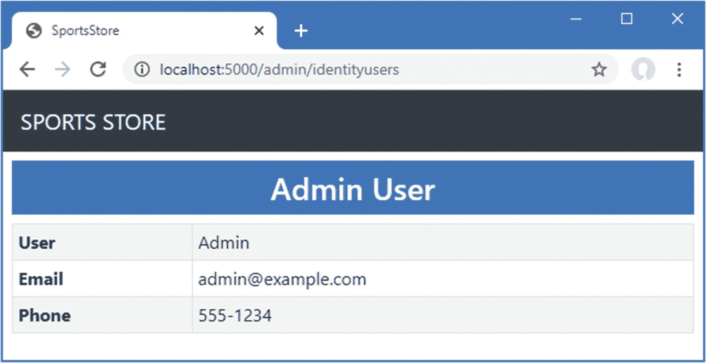
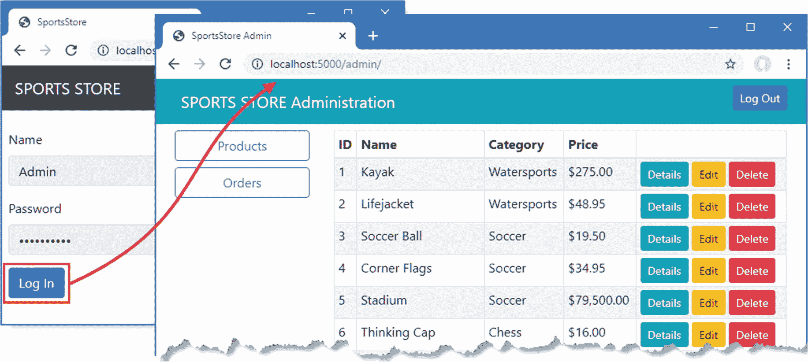
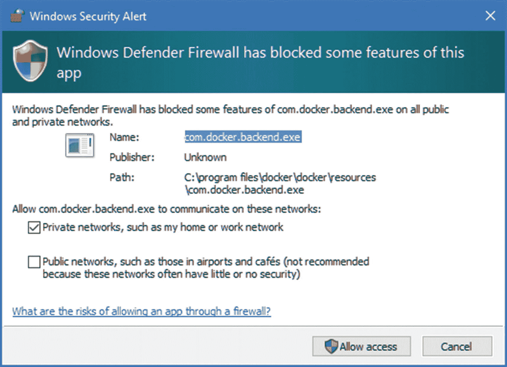
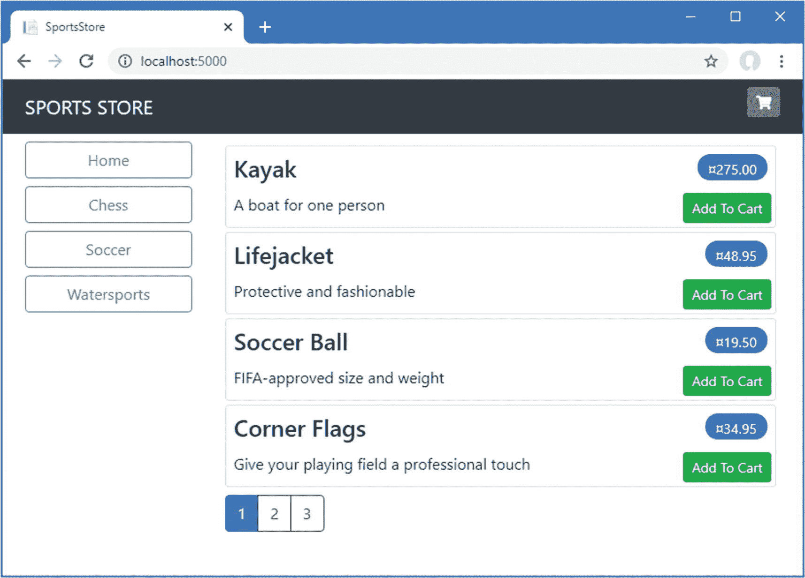

# 十一、SportsStore：安全性和部署

## 保护管理功能

认证和授权由 ASP.NET Core Identity 系统提供，该系统巧妙地集成到 ASP.NET Core 平台和各个应用框架中。在接下来的小节中，我将创建一个基本的安全设置，允许一个名为`Admin`的用户验证和访问应用中的管理特性。ASP.NET Core Identity 提供了更多功能来验证用户并授权访问应用功能和数据，您可以在第 [37](37.html) 和 [38](38.html) 章节中找到更多信息，在这些章节中，我将向您展示如何创建和管理用户帐户以及如何使用角色执行授权。但是，正如我之前提到的，ASP.NET Core Identity 本身就是一个大框架，我在本书中只涉及基本特征。

我在这一章中的目标只是获得足够的功能，以防止客户能够访问 SportsStore 应用的敏感部分，并通过这样做，让您了解认证和授权是如何融入 ASP.NET Core 应用的。

Tip

你可以从 [`https://github.com/apress/pro-asp.net-core-3`](https://github.com/apress/pro-asp.net-core-3) 下载本章以及本书其他章节的示例项目。如果在运行示例时遇到问题，请参见第 [1](01.html) 章获取帮助。

### 创建身份数据库

ASP.NET 身份系统可无限配置和扩展，并支持多种用户数据存储方式。我将使用最常见的方法，即使用实体框架核心访问 Microsoft SQL Server 来存储数据。

#### 安装实体框架核心的身份包

要添加包含实体框架核心的 ASPASP.NET Core Identity 支持的包，请使用 PowerShell 命令提示符来运行清单 [11-1](#PC1) 中的命令。

```cs
dotnet add package Microsoft.AspNetCore.Identity.EntityFrameworkCore --version 3.1.0

Listing 11-1.Installing the Entity Framework Core Package

```

#### 创建上下文类

我需要创建一个数据库上下文文件，作为数据库和它提供访问的身份模型对象之间的桥梁。我在`Models`文件夹中添加了一个名为`AppIdentityDbContext.cs`的类文件，并用它来定义清单 [11-2](#PC2) 中所示的类。

```cs
using Microsoft.AspNetCore.Identity;
using Microsoft.AspNetCore.Identity.EntityFrameworkCore;
using Microsoft.EntityFrameworkCore;

namespace SportsStore.Models {

    public class AppIdentityDbContext : IdentityDbContext<IdentityUser> {

        public AppIdentityDbContext(DbContextOptions<AppIdentityDbContext> options)
            : base(options) { }
    }
}

Listing 11-2.The Contents of the AppIdentityDbContext.cs File in the SportsStore/Models Folder

```

`AppIdentityDbContext`类是从`IdentityDbContext`派生出来的，它为实体框架核心提供了特定于身份的特性。对于类型参数，我使用了`IdentityUser`类，这是用于表示用户的内置类。

#### 定义连接字符串

下一步是定义数据库的连接字符串。清单 [11-3](#PC3) 显示了 SportsStore 项目的`appsettings.json`文件的连接字符串，它遵循与我为产品数据库定义的连接字符串相同的格式。

```cs
{
  "Logging": {
    "LogLevel": {
      "Default": "Information",
      "Microsoft": "Warning",
      "Microsoft.Hosting.Lifetime": "Information"
    }
  },
  "AllowedHosts": "*",
  "ConnectionStrings": {
    "SportsStoreConnection": "Server=(localdb)\\MSSQLLocalDB;Database=SportsStore;MultipleActiveResultSets=true",
    "IdentityConnection": "Server=(localdb)\\MSSQLLocalDB;Database=Identity;MultipleActiveResultSets=true"
  }
}

Listing 11-3.Defining a Connection String in the appsettings.json File in the SportsStore Folder

```

请记住，连接字符串必须在`appsettings.json`文件中定义在一个完整的行中，并且在列表中跨多行显示，这只是因为书籍页面的宽度是固定的。清单中的附加内容定义了一个名为`IdentityConnection`的连接字符串，它指定了一个名为`Identity`的 LocalDB 数据库。

#### 配置应用

像其他 ASP.NET Core 特性一样，身份是在`Startup`类中配置的。清单 [11-4](#PC4) 展示了我使用先前定义的上下文类和连接字符串在 SportsStore 项目中设置身份的附加内容。

```cs
using System;
using System.Collections.Generic;
using System.Linq;
using System.Threading.Tasks;
using Microsoft.AspNetCore.Builder;
using Microsoft.AspNetCore.Hosting;
using Microsoft.AspNetCore.Http;
using Microsoft.Extensions.DependencyInjection;
using Microsoft.Extensions.Hosting;
using Microsoft.Extensions.Configuration;
using Microsoft.EntityFrameworkCore;
using SportsStore.Models;
using Microsoft.AspNetCore.Identity;

namespace SportsStore {
    public class Startup {

        public Startup(IConfiguration config) {
            Configuration = config;
        }

        private IConfiguration Configuration { get; set; }

        public void ConfigureServices(IServiceCollection services) {
            services.AddControllersWithViews();
            services.AddDbContext<StoreDbContext>(opts => {
                opts.UseSqlServer(
                    Configuration["ConnectionStrings:SportsStoreConnection"]);
            });
            services.AddScoped<IStoreRepository, EFStoreRepository>();
            services.AddScoped<IOrderRepository, EFOrderRepository>();
            services.AddRazorPages();
            services.AddDistributedMemoryCache();
            services.AddSession();
            services.AddScoped<Cart>(sp => SessionCart.GetCart(sp));
            services.AddSingleton<IHttpContextAccessor, HttpContextAccessor>();
            services.AddServerSideBlazor();

            services.AddDbContext<AppIdentityDbContext>(options =>
                options.UseSqlServer(
                    Configuration["ConnectionStrings:IdentityConnection"]));

            services.AddIdentity<IdentityUser, IdentityRole>()
                .AddEntityFrameworkStores<AppIdentityDbContext>();
        }

        public void Configure(IApplicationBuilder app, IWebHostEnvironment env) {
            app.UseDeveloperExceptionPage();
            app.UseStatusCodePages();
            app.UseStaticFiles();
            app.UseSession();
            app.UseRouting();

            app.UseAuthentication();
            app.UseAuthorization();

            app.UseEndpoints(endpoints => {
                endpoints.MapControllerRoute("catpage",
                    "{category}/Page{productPage:int}",
                    new { Controller = "Home", action = "Index" });

                endpoints.MapControllerRoute("page", "Page{productPage:int}",
                    new { Controller = "Home", action = "Index", productPage = 1 });

                endpoints.MapControllerRoute("category", "{category}",
                    new { Controller = "Home", action = "Index", productPage = 1 });

                endpoints.MapControllerRoute("pagination",
                    "Products/Page{productPage}",
                    new { Controller = "Home", action = "Index", productPage = 1 });
                endpoints.MapDefaultControllerRoute();
                endpoints.MapRazorPages();
                endpoints.MapBlazorHub();
                endpoints.MapFallbackToPage("/admin/{*catchall}", "/Admin/Index");
            });

            SeedData.EnsurePopulated(app);
        }
    }
}

Listing 11-4.Configuring Identity in the Startup.cs File in the SportsStore Folder

```

在`ConfigureServices`方法中，我扩展了实体框架核心配置来注册上下文类，并使用`AddIdentity`方法来设置身份服务，使用内置类来表示用户和角色。

在`Configure`方法中，我调用了`UseAuthentication`和`UseAuthorization`方法来设置实现安全策略的中间件组件。这些方法必须出现在`UseRouting`和`UseEndpoints`方法之间。

#### 创建和应用数据库迁移

基本配置已经就绪，现在可以使用实体框架核心迁移特性来定义模式并将其应用于数据库。打开一个新的命令提示符或 PowerShell 窗口，运行`SportsStore`文件夹中清单 [11-5](#PC5) 所示的命令，为身份数据库创建一个新的迁移。

```cs
dotnet ef migrations add Initial --context AppIdentityDbContext

Listing 11-5.Creating the Identity Migration

```

与前面的数据库命令的重要区别在于，我使用了`-context`参数来指定与我想要使用的数据库相关联的上下文类的名称，即`AppIdentityDbContext`。当应用中有多个数据库时，确保使用正确的上下文类非常重要。

一旦实体框架核心生成了初始迁移，运行`SportsStore`文件夹中清单 [11-6](#PC6) 所示的命令来创建数据库并应用迁移。

```cs
dotnet ef database update --context AppIdentityDbContext

Listing 11-6.Applying the Identity Migration

```

结果是一个名为`Identity`的新 LocalDB 数据库，您可以使用 Visual Studio SQL Server 对象资源管理器对其进行检查。

#### 定义种子数据

我将通过在应用启动时植入数据库来显式创建`Admin`用户。我在`Models`文件夹中添加了一个名为`IdentitySeedData.cs`的类文件，并定义了清单 [11-7](#PC7) 中所示的静态类。

```cs
using Microsoft.AspNetCore.Builder;
using Microsoft.AspNetCore.Identity;
using Microsoft.Extensions.DependencyInjection;
using Microsoft.EntityFrameworkCore;
using System.Linq;

namespace SportsStore.Models {

    public static class IdentitySeedData {
        private const string adminUser = "Admin";
        private const string adminPassword = "Secret123$";

        public static async void EnsurePopulated(IApplicationBuilder app) {

            AppIdentityDbContext context = app.ApplicationServices
                .CreateScope().ServiceProvider
                .GetRequiredService<AppIdentityDbContext>();
            if (context.Database.GetPendingMigrations().Any()) {
                context.Database.Migrate();
            }

            UserManager<IdentityUser> userManager = app.ApplicationServices
                .CreateScope().ServiceProvider
                .GetRequiredService<UserManager<IdentityUser>>();

            IdentityUser user = await userManager.FindByIdAsync(adminUser);
            if (user == null) {
                user = new IdentityUser("Admin");
                user.Email = "admin@example.com";
                user.PhoneNumber = "555-1234";
                await userManager.CreateAsync(user, adminPassword);
            }
        }
    }
}

Listing 11-7.The Contents of the IdentitySeedData.cs File in the SportsStore/Models Folder

```

该代码确保数据库已创建且是最新的，并使用`UserManager<T>`类，该类由 ASP.NET Core Identity 认证作为服务提供，用于管理用户，如第 [38 章](38.html)所述。在数据库中搜索`Admin`用户账户，如果不存在的话，这个账户是用密码`Secret123$`创建的。在此示例中，不要更改硬编码的密码，因为 Identity 的验证策略要求密码包含一定数量和范围的字符。有关如何更改验证设置的详细信息，请参见第 [38](38.html) 章。

Caution

通常需要对管理员帐户的详细信息进行硬编码，以便您可以在应用部署后登录并开始管理它。执行此操作时，您必须记住更改您创建的帐户的密码。有关如何使用身份更改密码的详细信息，请参见第 [38](38.html) 章。参见第 [15](15.html) 章了解如何将敏感数据，如默认密码，置于源代码控制之外。

为了确保身份数据库在应用启动时被植入，我将清单 [11-8](#PC8) 中所示的语句添加到了`Startup`类的`Configure`方法中。

```cs
...
public void Configure(IApplicationBuilder app, IWebHostEnvironment env) {
    app.UseDeveloperExceptionPage();
    app.UseStatusCodePages();
    app.UseStaticFiles();
    app.UseSession();
    app.UseAuthentication();
    app.UseRouting();

    app.UseEndpoints(endpoints => {
        endpoints.MapControllerRoute("catpage",
            "{category}/Page{productPage:int}",
            new { Controller = "Home", action = "Index" });

        endpoints.MapControllerRoute("page", "Page{productPage:int}",
            new { Controller = "Home", action = "Index", productPage = 1 });

        endpoints.MapControllerRoute("category", "{category}",
            new { Controller = "Home", action = "Index", productPage = 1 });

        endpoints.MapControllerRoute("pagination",
            "Products/Page{productPage}",
            new { Controller = "Home", action = "Index", productPage = 1 });
        endpoints.MapDefaultControllerRoute();
        endpoints.MapRazorPages();
        endpoints.MapBlazorHub();
        endpoints.MapFallbackToPage("/admin/{*catchall}", "/Admin/Index");
    });

    SeedData.EnsurePopulated(app);
    IdentitySeedData.EnsurePopulated(app);
}
...

Listing 11-8.Seeding the Identity Database in the Startup.cs File in the SportsStore Folder

```

Deleting And Re-Creating The ASP.NET Core Identity Database

如果需要重置身份数据库，请运行以下命令:

```cs
dotnet ef database drop --force --context AppIdentityDbContext

```

重新启动应用，数据库将被重新创建并填充种子数据。

### 添加传统管理功能

在清单 [11-9](#PC10) 中，我使用 Blazor 创建了管理特性，这样我就可以在 SportsStore 项目中演示 ASP.NET 的各种核心特性。尽管 Blazor 很有用，但它并不适合所有项目——正如我在第 4 部分中解释的那样——而且大多数项目都可能使用控制器或 Razor 页面作为其管理特性。我在第 38 章中描述了 ASP.NET Core Identity 与所有应用框架协同工作的方式，但是为了平衡第 10 章[中创建的所有 Blazor 工具，我将创建一个 Razor 页面，显示 ASP.NET Core Identity 数据库中的用户列表。我在第](10.html) [38](38.html) 章中更详细地描述了如何管理身份数据库，这个 Razor 页面只是给 SportsStore 应用添加了一个敏感的特性，这个特性不是用 Blazor 创建的。将名为`IdentityUsers.cshtml`的 Razor 页面添加到`SportsStore/Pages/Admin`文件夹中，内容如清单 [11-9](#PC10) 所示。

```cs
@page
@model IdentityUsersModel
@using Microsoft.AspNetCore.Identity

<h3 class="bg-primary text-white text-center p-2">Admin User</h3>

<table class="table table-sm table-striped table-bordered">
    <tbody>
        <tr><th>User</th><td>@Model.AdminUser.UserName</td></tr>
        <tr><th>Email</th><td>@Model.AdminUser.Email</td></tr>
        <tr><th>Phone</th><td>@Model.AdminUser.PhoneNumber</td></tr>
    </tbody>
</table>

@functions{

    public class IdentityUsersModel: PageModel {
        private UserManager<IdentityUser> userManager;

        public IdentityUsersModel(UserManager<IdentityUser> mgr) {
            userManager = mgr;
        }

        public IdentityUser AdminUser{ get; set; }

        public async Task OnGetAsync() {
            AdminUser = await userManager.FindByNameAsync("Admin");
        }
    }
}

Listing 11-9.The Contents of the IdentityUsers.cshtml File in the SportsStore/Pages/Admin Folder

```

重启 ASP.NET Core，请求`http://localhost:5000/admin/identityusers`查看 Razor 页面生成的内容，如图 [11-1](#Fig1) 所示。



图 11-1。

Razor 页面管理功能

### 应用基本授权策略

现在我已经配置了 ASP.NET Core Identity，我可以将授权策略应用到我想要保护的应用部分。我将使用尽可能最基本的授权策略，即允许任何经过认证的用户访问。虽然这在实际应用中也是一个有用的策略，但也有创建更细粒度授权控制的选项，如第 [37](37.html) 和 [38](38.html) 章所述，但由于 SportsStore 应用只有一个用户，区分匿名和认证请求就足够了。

对于控制器和 Razor 页面，`Authorize`属性用于限制访问，如清单 [11-10](#PC11) 所示。

```cs
@page
@model IdentityUsersModel
@using Microsoft.AspNetCore.Identity
@using Microsoft.AspNetCore.Authorization

<h3 class="bg-primary text-white text-center p-2">Admin User</h3>

<table class="table table-sm table-striped table-bordered">
    <tbody>
        <tr><th>User</th><td>@Model.AdminUser.UserName</td></tr>
        <tr><th>Email</th><td>@Model.AdminUser.Email</td></tr>
        <tr><th>Phone</th><td>@Model.AdminUser.PhoneNumber</td></tr>
    </tbody>
</table>

@functions{

    [Authorize]
    public class IdentityUsersModel: PageModel {
        private UserManager<IdentityUser> userManager;

        public IdentityUsersModel(UserManager<IdentityUser> mgr) {
            userManager = mgr;
        }

        public IdentityUser AdminUser{ get; set; }

        public async Task OnGetAsync() {
            AdminUser = await userManager.FindByNameAsync("Admin");
        }
    }
}

Listing 11-10.Restricting Access in the IdentityUsers.cshtml File in the SportsStore/Pages/Admin Folder

```

当只有授权和未授权用户时，`Authorize`属性可以应用于 Razor 页面，作为应用 Blazor 部分的入口点，如清单 [11-11](#PC12) 所示。

```cs
@page "/admin"
@{  Layout = null; }
@using Microsoft.AspNetCore.Authorization
@attribute [Authorize]

<!DOCTYPE html>
<html>
<head>
    <title>SportsStore Admin</title>
    <link href="/lib/twitter-bootstrap/css/bootstrap.min.css" rel="stylesheet" />
    <base href="/" />
</head>
<body>
    <component type="typeof(Routed)" render-mode="Server" />
    <script src="/_framework/blazor.server.js"></script>
</body>
</html>

Listing 11-11.Applying Authorization in the Index.cshtml File in the SportsStore/Pages/Admin Folder

```

因为这个 Razor 页面已经配置了一个页面模型类，所以我可以用一个`@attribute`表达式来应用这个属性。

### 创建帐户控制器和视图

当一个未经认证的用户发送一个需要授权的请求时，用户被重定向到`/Account/Login` URL，应用可以用它来提示用户输入他们的凭证。在清单 [11-12](#PC13) 中，我向您展示了如何使用 Razor 页面处理认证，因此，为了多样化，我将使用 SportsStore 的控制器和视图。在准备过程中，我添加了一个视图模型来表示用户的凭证，方法是将一个名为`LoginModel.cs`的类文件添加到`Models/ViewModels`文件夹中，并使用它来定义清单 [11-12](#PC13) 中所示的类。

```cs
using System.ComponentModel.DataAnnotations;

namespace SportsStore.Models.ViewModels {

    public class LoginModel {

        [Required]
        public string Name { get; set; }

        [Required]
        public string Password { get; set; }

        public string ReturnUrl { get; set; } = "/";
    }
}

Listing 11-12.The Contents of the LoginModel.cs File in the SportsStore/Models/ViewModels Folder

```

`Name`和`Password`属性已经用`Required`属性修饰过，该属性使用模型验证来确保已经提供了值。接下来，我在`Controllers`文件夹中添加了一个名为`AccountController.cs`的类文件，并用它来定义清单 [11-13](#PC14) 中所示的控制器。这是将响应对`/Account/Login` URL 的请求的控制器。

```cs
using System.Threading.Tasks;
using Microsoft.AspNetCore.Authorization;
using Microsoft.AspNetCore.Identity;
using Microsoft.AspNetCore.Mvc;
using SportsStore.Models.ViewModels;

namespace SportsStore.Controllers {

    public class AccountController : Controller {
        private UserManager<IdentityUser> userManager;
        private SignInManager<IdentityUser> signInManager;

        public AccountController(UserManager<IdentityUser> userMgr,
                SignInManager<IdentityUser> signInMgr) {
            userManager = userMgr;
            signInManager = signInMgr;
        }

        public ViewResult Login(string returnUrl) {
            return View(new LoginModel {
                ReturnUrl = returnUrl
            });
        }

        [HttpPost]
        [ValidateAntiForgeryToken]
        public async Task<IActionResult> Login(LoginModel loginModel) {
            if (ModelState.IsValid) {
                IdentityUser user =
                    await userManager.FindByNameAsync(loginModel.Name);
                if (user != null) {
                    await signInManager.SignOutAsync();
                    if ((await signInManager.PasswordSignInAsync(user,
                            loginModel.Password, false, false)).Succeeded) {
                        return Redirect(loginModel?.ReturnUrl ?? "/Admin");
                    }
                }
            }
            ModelState.AddModelError("", "Invalid name or password");
            return View(loginModel);
        }

        [Authorize]
        public async Task<RedirectResult> Logout(string returnUrl = "/") {
            await signInManager.SignOutAsync();
            return Redirect(returnUrl);
        }
    }
}

Listing 11-13.The Contents of the AccountController.cs File in the SportsStore/Controllers Folder

```

当用户被重定向到`/Account/Login` URL 时，`Login` action 方法的 GET 版本呈现页面的默认视图，提供一个视图模型对象，该对象包括如果认证请求成功，浏览器应该被重定向到的 URL。

认证凭证被提交给 POST 版本的`Login`方法，该方法使用通过控制器的构造函数接收到的`UserManager<IdentityUser>`和`SignInManager<IdentityUser>`服务来认证用户并将其登录到系统中。我在第 [37](37.html) 和 [38](38.html) 章解释了这些类是如何工作的，但是现在，知道如果有一个认证失败，那么我创建一个模型验证错误并呈现默认视图就足够了；但是，如果认证成功，那么在提示用户输入凭据之前，我会将用户重定向到他们想要访问的 URL。

Caution

一般来说，使用客户端数据验证是一个好主意。它从你的服务器上卸下一些工作，并给用户提供关于他们所提供的数据的即时反馈。但是，您不应该尝试在客户端执行认证，因为这通常涉及到向客户端发送有效的凭据，以便它们可以用于检查用户输入的用户名和密码，或者至少信任客户端关于他们是否已成功通过认证的报告。认证应该总是在服务器上进行。

为了给`Login`方法提供要呈现的视图，我创建了`Views/Account`文件夹并添加了一个名为`Login.cshtml`的 Razor 视图文件，其内容如清单 [11-14](#PC15) 所示。

```cs
@model LoginModel
@{ Layout = null; }
<!DOCTYPE html>
<html>
<head>
    <meta name="viewport" content="width=device-width" />
    <title>SportsStore</title>
    <link href="/lib/twitter-bootstrap/css/bootstrap.min.css" rel="stylesheet" />
</head>
<body>
    <div class="bg-dark text-white p-2">
        <span class="navbar-brand ml-2">SPORTS STORE</span>
    </div>
    <div class="m-1 p-1">
        <div class="text-danger" asp-validation-summary="All"></div>

        <form asp-action="Login" asp-controller="Account" method="post">
            <input type="hidden" asp-for="ReturnUrl" />
            <div class="form-group">
                <label asp-for="Name"></label>
                <div asp-validation-for="Name" class="text-danger"></div>
                <input asp-for="Name" class="form-control" />
            </div>
            <div class="form-group">
                <label asp-for="Password"></label>
                <div asp-validation-for="Password" class="text-danger"></div>
                <input asp-for="Password" type="password" class="form-control" />
            </div>
            <button class="btn btn-primary" type="submit">Log In</button>
        </form>
    </div>
</body>
</html>

Listing 11-14.The Contents of the Login.cshtml File in the SportsStore/Views/Account Folder

```

最后一步是对共享管理布局进行更改，添加一个按钮，通过向`Logout`动作发送请求来注销当前用户，如清单 [11-15](#PC16) 所示。这是一个有用的特性，它使得测试应用变得更加容易，如果没有它，您将需要清除浏览器的 cookies 以返回到未经认证的状态。

```cs
@inherits LayoutComponentBase

<div class="bg-info text-white p-2">
    <div class="container-fluid">
        <div class="row">
            <div class="col">
                <span class="navbar-brand ml-2">SPORTS STORE Administration</span>
            </div>
            <div class="col-2 text-right">
                <a class="btn btn-sm btn-primary" href="/account/logout">Log Out</a>
            </div>
        </div>
    </div>
</div>
<div class="container-fluid">
    <div class="row p-2">
        <div class="col-3">
            <NavLink class="btn btn-outline-primary btn-block"
                        href="/admin/products"
                        ActiveClass="btn-primary text-white"
                        Match="NavLinkMatch.Prefix">
                Products
            </NavLink>
            <NavLink class="btn btn-outline-primary btn-block"
                        href="/admin/orders"
                        ActiveClass="btn-primary text-white"
                        Match="NavLinkMatch.Prefix">
                Orders
            </NavLink>
        </div>
        <div class="col">
            @Body
        </div>
    </div>
</div>

Listing 11-15.Adding a Logout Button in the AdminLayout.razor File in the SportsStore/Pages/Admin Folder

```

### 测试安全策略

一切就绪，您可以通过重启 ASP.NET Core 并请求`http://localhost:5000/admin`或`http://localhost:5000/admin/identityusers`来测试安全策略。

由于您目前未经认证，并且您正试图针对一个需要授权的操作，您的浏览器将被重定向到`/Account/Login` URL。输入 **Admin** 和 **Secret123$** 作为用户名和密码并提交表单。`Account`控制器将检查您提供的凭证以及添加到身份数据库中的种子数据，并且——假设您输入了正确的详细信息——验证您的身份并将您重定向到您请求的 URL，您现在可以访问该 URL。图 [11-2](#Fig2) 说明了该过程。



图 11-2。

管理认证/授权过程

## 准备部署 ASP.NET Core

在本节中，我将准备 SportsStore 并创建一个可以部署到生产中的容器。ASP.NET Core 应用有多种部署模式，但我选择了 Docker 容器，因为它们可以在大多数托管平台上运行，也可以部署到私有数据中心。这不是一个完整的部署指南，但它将让您了解准备应用的过程。

### 配置错误处理

目前，应用被配置为使用开发人员友好的错误页面，这些页面在出现问题时提供有用的信息。这不是最终用户应该看到的信息，所以我在`Pages`文件夹中添加了一个名为`Error.cshtml`的 Razor 页面，内容如清单 [11-16](#PC17) 所示。

```cs
@page "/error"
@{ Layout = null; }
<!DOCTYPE html>
<html>
<head>
    <meta name="viewport" content="width=device-width" />
    <link href="/lib/twitter-bootstrap/css/bootstrap.min.css" rel="stylesheet" />
    <title>Error</title>
</head>
<body class="text-center">
    <h2 class="text-danger">Error.</h2>
    <h3 class="text-danger">An error occurred while processing your request</h3>
</body>
</html>

Listing 11-16.The Contents of the Error.cshtml File in the Pages Folder

```

这种错误页面是最后一招，最好尽量保持简单，不要依赖共享视图、视图组件或其他丰富的特性。在这种情况下，我禁用了共享布局，并定义了一个简单的 HTML 文档，解释出现了一个错误，但没有提供任何关于发生了什么的信息。

在清单 [11-17](#PC18) 中，我重新配置了应用，这样当应用在生产环境中时，`Error`页面用于未处理的异常。

```cs
...
public void Configure(IApplicationBuilder app, IWebHostEnvironment env) {

    if (env.IsProduction()) {
        app.UseExceptionHandler("/error");
    } else {
        app.UseDeveloperExceptionPage();
        app.UseStatusCodePages();
    }

    app.UseStaticFiles();
    app.UseSession();

    app.UseRouting();

    app.UseAuthentication();
    app.UseAuthorization();

    app.UseEndpoints(endpoints => {
        endpoints.MapControllerRoute("catpage",
            "{category}/Page{productPage:int}",
            new { Controller = "Home", action = "Index" });

        endpoints.MapControllerRoute("page", "Page{productPage:int}",
            new { Controller = "Home", action = "Index", productPage = 1 });

        endpoints.MapControllerRoute("category", "{category}",
            new { Controller = "Home", action = "Index", productPage = 1 });

        endpoints.MapControllerRoute("pagination",
            "Products/Page{productPage}",
            new { Controller = "Home", action = "Index", productPage = 1 });
        endpoints.MapDefaultControllerRoute();
        endpoints.MapRazorPages();
        endpoints.MapBlazorHub();
        endpoints.MapFallbackToPage("/admin/{*catchall}", "/Admin/Index");
    });

    SeedData.EnsurePopulated(app);
    IdentitySeedData.EnsurePopulated(app);
}
...

Listing 11-17.Configuring Error Handling in the Startup.cs File in the SportsStore Folder

```

正如我在第 [12 章](12.html)中解释的，由`Configure`方法定义的`IWebHostEnvironment`参数描述了应用运行的环境。这些变化意味着在应用生产时调用`UseExceptionHandler`方法，但在其他情况下使用开发人员友好的错误页面。

### 创建生产配置设置

可以创建用于定义连接字符串等设置的 JSON 配置文件，以便它们仅在应用处于特定环境(如开发、试运行或生产)时适用。我在第 [7](07.html) 章中用来创建 SportsStore 项目的模板创建了`appsettings.json`和`appsettings.Development.json`文件，这两个文件旨在作为默认设置，它们会被开发专用的设置所覆盖。在本章中，我将采用相反的方法，定义一个只包含那些特定于生产的设置的文件。将一个名为`appsettings.Production.json`的 JSON 文件添加到`SportsStore`文件夹中，内容如清单 [11-18](#PC19) 所示。

Caution

不要在实际项目中使用这些连接字符串。您必须正确描述到生产数据库的连接，这不太可能与清单中的连接相同。

```cs
{
  "ConnectionStrings": {
    "SportsStoreConnection": "Server=sqlserver;Database=SportsStore;MultipleActiveResultSets=true;User=sa;Password=MyDatabaseSecret123",
    "IdentityConnection": "Server=sqlserver;Database=Identity;MultipleActiveResultSets=true;User=sa;Password=MyDatabaseSecret123"
  }
}

Listing 11-18.The Contents of the appsettings.Production.json File in the SportsStore Folder

```

这些连接字符串(每一个都在一行中定义)描述了与运行在`sqlserver`上的 SQL Server 的连接，这是另一个运行 SQL Server 的 Docker 容器。

### 创建 Docker 图像

在接下来的小节中，我将为应用配置和创建 Docker 映像，该应用可以部署到一个容器环境中，比如 Microsoft Azure 或 Amazon Web Services。请记住，容器只是一种部署方式，如果这种方式不适合您，还有许多其他方式。

Note

请记住，我将连接到运行在开发机器上的数据库，这不是大多数真正的应用的配置方式。确保配置数据库连接字符串和容器网络设置，以匹配您的生产环境。

#### 安装 Docker 桌面

去 Docker.com 下载并安装 Docker 桌面软件包。按照安装过程，重新启动您的 Windows 机器，运行清单 [11-19](#PC20) 中所示的命令，检查 Docker 是否已经安装并位于您的路径中。(Docker 安装过程似乎经常变化，这也是我一直没有更具体说明过程的原因。)

Note

你必须在 Docker.com 上创建一个帐户来下载安装程序。

```cs
docker --version

Listing 11-19.Checking the Docker Desktop Installation

```

#### 创建 Docker 配置文件

Docker 是使用名为`Dockerfile`的文件配置的。该文件没有 Visual Studio 项模板，因此使用文本文件模板将名为`Dockerfile.text`的文件添加到项目中，然后将该文件重命名为`Dockerfile`。如果您使用的是 Visual Studio 代码，那么您可以创建一个名为`Dockerfile`的不带扩展名的文件。使用清单 [11-20](#PC21) 中所示的配置设置作为新文件的内容。

```cs
FROM mcr.microsoft.com/dotnet/core/aspnet:3.1
FROM mcr.microsoft.com/dotnet/core/sdk:3.1

COPY /bin/Release/netcoreapp3.1/publish/ SportsStore/

ENV ASPNETCORE_ENVIRONMENT Production

EXPOSE 5000
WORKDIR /SportsStore
ENTRYPOINT ["dotnet", "SportsStore.dll",  "--urls=http://0.0.0.0:5000"]

Listing 11-20.The Contents of the Dockerfile File in the SportsStore Folder

```

这些指令将 SportsStore 应用复制到 Docker 映像中，并配置其执行。接下来，创建一个名为`docker-compose.yml`的文件，内容如清单 [11-21](#PC22) 所示。Visual Studio 没有这种类型文件的模板，但是如果您选择文本文件模板并输入完整的文件名，它将创建该文件。Visual Studio 代码用户可以简单地创建一个名为`docker-compose.yml`的文件。

```cs
version: "3"
services:
    sportsstore:
        build: .
        ports:
            - "5000:5000"
        environment:
            - ASPNETCORE_ENVIRONMENT=Production
        depends_on:
            - sqlserver
    sqlserver:
        image: "mcr.microsoft.com/mssql/server"
        environment:
            SA_PASSWORD: "MyDatabaseSecret123"
            ACCEPT_EULA: "Y"

Listing 11-21.The Contents of the docker-compose.yml File in the SportsStore Folder

```

YML 文件对格式和缩进特别敏感，严格按照所示创建该文件非常重要。如果你有问题，那么使用 GitHub 资源库中的`docker-compose.yml`文件来找本书， [`https://github.com/apress/pro-asp.net-core-3`](https://github.com/apress/pro-asp.net-core-3) 。

#### 发布和映像应用

通过使用 PowerShell 提示符运行在`SportsStore`文件夹中列出 [11-22](#PC23) 的命令来准备 SportsStore 应用。

```cs
dotnet publish -c Release

Listing 11-22.Preparing the Application

```

接下来，运行清单 [11-23](#PC24) 中所示的命令，为 SportsStore 应用创建 Docker 图像。该命令第一次运行时需要一些时间才能完成，因为它将下载 ASP.NET Core 的 Docker 映像。

```cs
docker-compose build

Listing 11-23.Performing the Docker Build

```

第一次运行该命令时，可能会提示您允许 Docker 使用网络，如图 [11-3](#Fig3) 所示。



图 11-3。

授予网络访问权限

单击 Allow 按钮，返回 PowerShell 提示符，使用 Control+C 终止 Docker 容器，并再次运行清单 [11-23](#PC24) 中的命令。

### 运行容器化应用

运行`SportsStore`文件夹中清单 [11-24](#PC25) 所示的命令，启动 SportsStore 应用和 SQL Server 的 Docker 容器。此命令第一次运行时需要一些时间才能完成，因为它将下载 SQL Server 的 Docker 映像。

```cs
docker-compose up

Listing 11-24.Starting the Containers

```

两个容器启动可能需要一些时间。有很多输出，大部分来自 SQL Server，但是当您看到如下输出时，应用已经准备好了:

```cs
...
sportsstore_1  | info: Microsoft.Hosting.Lifetime[0]
sportsstore_1  |       Now listening on: http://0.0.0.0:5000
sportsstore_1  | info: Microsoft.Hosting.Lifetime[0]
sportsstore_1  |       Application started. Press Ctrl+C to shut down.
sportsstore_1  | info: Microsoft.Hosting.Lifetime[0]
sportsstore_1  |       Hosting environment: Production
sportsstore_1  | info: Microsoft.Hosting.Lifetime[0]
sportsstore_1  |       Content root path: /SportsStore
...

```

打开一个新的浏览器窗口，请求`http://localhost:5000`，你会收到来自 SportsStore 容器化版本的响应，如图 [11-4](#Fig4) 所示，现在已经可以部署了。在 PowerShell 命令提示符下使用 Control+C 来终止 Docker 容器。



图 11-4。

在容器中运行 SportsStore 应用

## 摘要

在本章和前面的章节中，我展示了如何使用 ASP.NET Core 来创建一个真实的电子商务应用。这个扩展的例子引入了许多关键特性:控制器、动作方法、视图、Razor 页面、Blazor、路由、验证、认证等等。您还了解了一些与如何使用 ASP.NET Core 相关的关键技术。这些包括实体框架核心、ASP.NET Core 标识和单元测试。这就是 SportsStore 应用的结尾。在这本书的下一部分，我开始挖掘 ASP.NET Core 的细节。