# 十二、了解 ASP.NET Core 平台

ASP.NET Core 平台是创建 web 应用的基础，并提供了允许使用 MVC 和 Blazor 等框架的特性。在这一章中，我将解释 ASP.NET Core 的基本特性是如何工作的，描述 ASP.NET Core 项目中文件的用途，解释 ASP.NET Core 请求管道是如何被用来处理 HTTP 请求的，并演示不同的定制方法。

如果这一章中的内容并不都有直接的意义，或者似乎适用于您打算创建的应用，也不要担心。我在本章中描述的功能是 ASP.NET Core 所做的一切的基础，了解它们如何工作有助于为理解您将在日常基础上使用的功能提供背景，并在您没有获得预期行为时为您提供诊断问题所需的知识。表 [12-1](#Tab1) 给出了 ASP.NET Core 平台的背景。

表 12-1。

将 ASP.NET Core 平台置于背景中

<colgroup><col class="tcol1 align-left"> <col class="tcol2 align-left"></colgroup> 
| 

问题

 | 

回答

 |
| --- | --- |
| 这是什么？ | ASP.NET Core 平台是构建 web 应用的基础，并提供处理 HTTP 请求的功能。 |
| 为什么有用？ | ASP.NET Core 平台负责 web 应用的底层细节，以便开发人员能够专注于为最终用户提供的功能。 |
| 如何使用？ | 关键的构建块是服务和中间件组件，两者都可以在`Startup`类中创建。 |
| 有什么陷阱或限制吗？ | 使用`Startup`类可能会引起混淆，必须密切注意它所包含的语句的顺序。 |
| 还有其他选择吗？ | ASP.NET Core 应用需要 ASP.NET Core 平台，但您可以选择不直接使用该平台，而只依赖更高级的 ASP.NET Core 功能，这些功能将在后面的章节中介绍。 |

表 [12-2](#Tab2) 总结了本章内容。

表 12-2。

章节总结

<colgroup><col class="tcol1 align-left"> <col class="tcol2 align-left"> <col class="tcol3 align-left"></colgroup> 
| 

问题

 | 

解决办法

 | 

列表

 |
| --- | --- | --- |
| 创建中间件组件 | 调用`Use`或`UseMiddleware`方法向请求管道添加一个函数或类 | 4–6 |
| 修改响应 | 编写一个使用返回管道路径的中间件组件 | seven |
| 阻止其他组件处理请求 | 缩短请求管道或创建终端中间件 | 8, 11, 12 |
| 使用不同的中间件集 | 创建管道分支 | nine |
| 配置中间件组件 | 使用选项模式 | 13–16 |

## 为本章做准备

为了准备本章，我将创建一个名为 Platform 的新项目，使用提供最小 ASP.NET Core 设置的模板。从 Windows 开始菜单打开一个新的 PowerShell 命令提示符，并运行清单 [12-1](#PC1) 中所示的命令。

Tip

你可以从 [`https://github.com/apress/pro-asp.net-core-3`](https://github.com/apress/pro-asp.net-core-3) 下载本章以及本书其他章节的示例项目。如果在运行示例时遇到问题，请参见第 [1](01.html) 章获取帮助。

```cs
dotnet new globaljson --sdk-version 3.1.101 --output Platform
dotnet new web --no-https --output Platform --framework netcoreapp3.1
dotnet new sln -o Platform

dotnet sln Platform add Platform

Listing 12-1.Creating the Project

```

如果您使用的是 Visual Studio，请打开`Platform`文件夹中的`Platform.sln`文件。选择项目➤平台属性，导航到调试页面，将 App URL 字段更改为 **http://localhost:5000** ，如图 [12-1](#Fig1) 所示。这将更改用于接收 HTTP 请求的端口。选择文件➤保存全部保存配置更改。

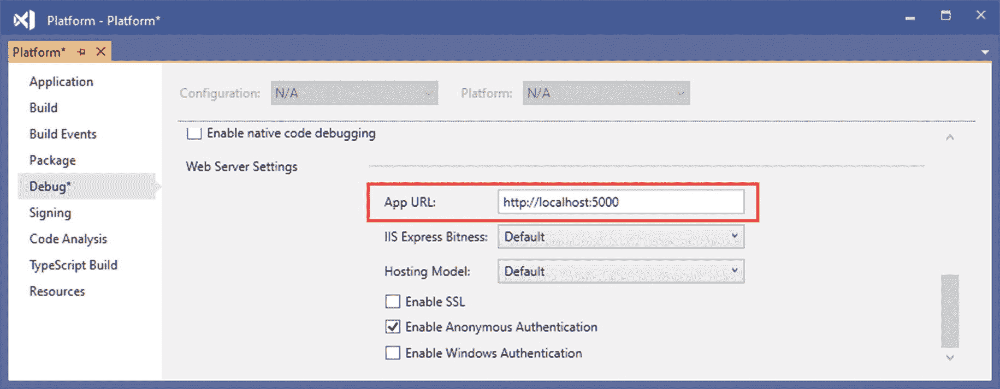

图 12-1。

更改 HTTP 端口

如果您使用的是 Visual Studio 代码，请打开`Platform`文件夹。当系统提示添加构建和调试项目所需的资产时，点击是按钮，如图 [12-2](#Fig2) 所示。

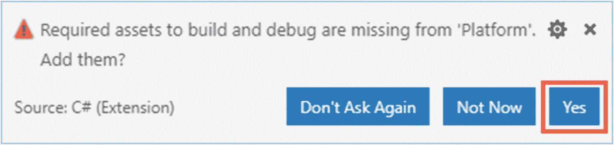

图 12-2。

添加项目资产

### 运行示例应用

通过从“调试”菜单中选择“启动而不调试”或“运行而不调试”来启动示例应用。如果您使用的是 Visual Studio 代码，请选择。当提示选择一个环境时。这是仅在项目首次启动时做出的选择。一个新的浏览器窗口将会打开，您将会看到如图 [12-3](#Fig3) 所示的输出。

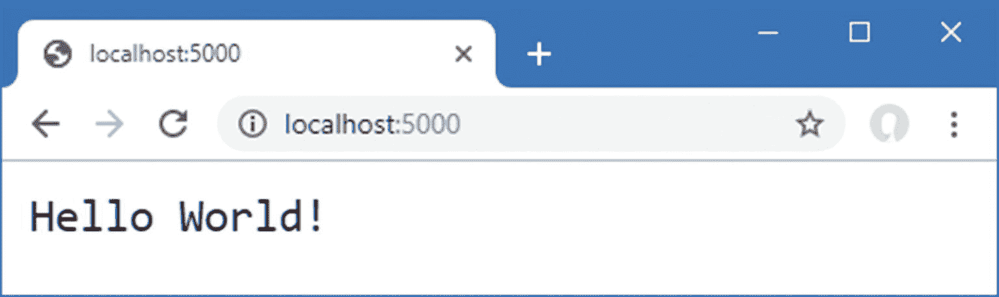

图 12-3。

运行示例应用

您也可以通过运行在`Platform`文件夹中的清单 [12-2](#PC2) 中显示的命令从命令行启动应用。

```cs
dotnet run

Listing 12-2.Starting the Example Application

```

该命令不会打开新的浏览器窗口，您必须手动导航到`http://localhost:5000`才能看到图 [12-3](#Fig3) 所示的输出。

## 了解 ASP.NET Core 平台

为了理解 ASP.NET Core，只关注关键特性是有帮助的:请求管道、中间件和服务。理解这些特征是如何结合在一起的——即使不涉及细节——为理解 ASP.NET Core 项目的内容和 ASP.NET Core 平台的形状提供了有用的背景。

### 理解中间件和请求管道

ASP.NET Core 平台的目的是接收 HTTP 请求并发送响应，ASP.NET Core 将其委托给*中间件组件*。中间件组件被排列成一个链，称为*请求管道*。

当一个新的 HTTP 请求到达时，ASP.NET Core 平台创建一个描述它的对象和一个描述将被返回的响应的相应对象。这些对象被传递给链中的第一个中间件组件，该组件检查请求并修改响应。然后，请求被传递给链中的下一个中间件组件，每个组件检查请求并添加到响应中。一旦请求通过管道，ASP.NET Core 平台发送响应，如图 [12-4](#Fig4) 所示。

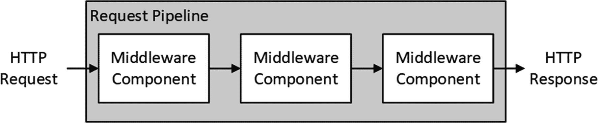

图 12-4。

ASP.NET Core 请求管道

一些组件侧重于为请求生成响应，但其他组件提供支持功能，如格式化特定的数据类型或读写 cookies。ASP.NET Core 包括解决常见问题的中间件组件，如第 [15](15.html) 和 [16](16.html) 章所述，我将在本章后面展示如何创建定制的中间件组件。如果中间件组件没有生成响应，那么 ASP.NET Core 将返回一个带有 HTTP 404 Not Found 状态代码的响应。

### 了解服务

服务是在 web 应用中提供功能的对象。任何类都可以作为服务使用，并且对服务提供的特性没有任何限制。服务的特殊之处在于它们由 ASP.NET Core 管理，一个名为*依赖注入*的特性使得在应用中的任何地方轻松访问服务成为可能，包括中间件组件。

依赖注入可能是一个很难理解的话题，我在第 [14](14.html) 章中详细描述了它。现在，只要知道 ASP.NET Core 平台管理的对象可以被中间件组件共享就足够了，要么在组件之间进行协调，要么避免重复公共功能，例如记录或加载配置数据，如图 [12-5](#Fig5) 所示。

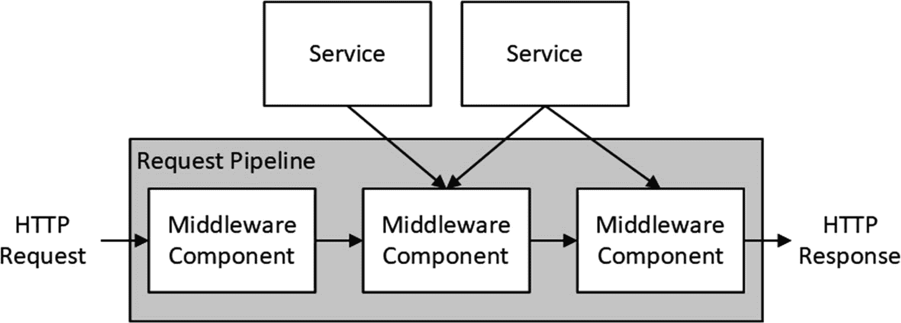

图 12-5。

ASP.NET Core 平台中的服务

如图所示，中间件组件只使用它们完成工作所需的服务。您将在后面的章节中了解到，ASP.NET Core 提供了一些基本服务，这些服务可以由特定于应用的附加服务来补充。

## 了解 ASP.NET Core 项目

空模板生成一个项目，该项目的代码和配置刚好足以启动带有一些基本服务和中间件组件的 ASP.NET Core 运行时。图 [12-6](#Fig6) 显示了模板添加到项目中的文件。

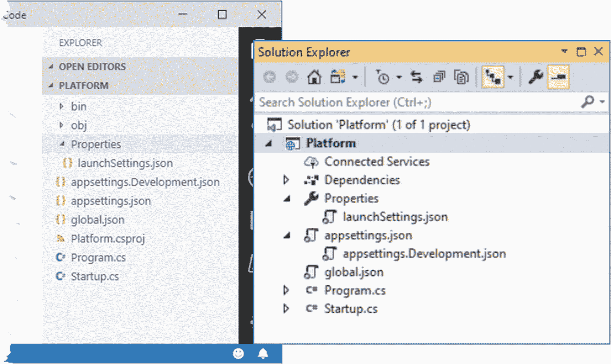

图 12-6。

示例项目中的文件

Visual Studio 和 Visual Studio 代码采用不同的方法来显示文件和文件夹。Visual Studio 隐藏开发中不常用的项，并将相关项嵌套在一起，而 Visual Studio 代码显示所有内容。

这就是图中所示的两个项目视图不同的原因:Visual Studio 隐藏了`bin`和`obj`文件夹，并将`appsettings.Development.json`文件嵌套在`appsettings.json`文件中。解决方案资源管理器窗口顶部的按钮可用于防止嵌套和显示项目中的所有文件。

虽然项目中的文件很少，但它们支撑着 ASP.NET Core 开发，如表 [12-3](#Tab3) 所述。

表 12-3。

示例项目中的文件和文件夹

<colgroup><col class="tcol1 align-left"> <col class="tcol2 align-left"></colgroup> 
| 

名字

 | 

描述

 |
| --- | --- |
| `appsettings.json` | 该文件用于配置应用，如第 [15](15.html) 章所述。 |
| `appsettings.Development.json` | 该文件用于定义特定于开发的配置设置，如第 [15](15.html) 章所述。 |
| `bin` | 该文件夹包含已编译的应用文件。Visual Studio 隐藏此文件夹。 |
| `global.json` | 该文件用于选择特定版本的。NET Core SDK。 |
| `Properties/launchSettings.json` | 该文件用于在应用启动时对其进行配置。Visual Studio 隐藏该文件夹和文件。 |
| `obj` | 该文件夹包含编译器的中间输出。Visual Studio 隐藏此文件夹。 |
| `Platform.csproj` | 该文件向描述项目。NET 核心工具，包括包依赖项和构建指令，如“理解项目文件”一节中所述。Visual Studio 隐藏该文件，但可以通过在解决方案资源管理器中右击项目项并从弹出菜单中选择“编辑项目文件”来编辑该文件。 |
| `Program.cs` | 这个文件是 ASP.NET Core 平台的入口点。 |
| `Startup.cs` | 该文件用于配置 ASP.NET Core 运行时及其相关框架，如“理解启动类”一节所述。 |

### 了解入口点

。NET 核心应用定义了一个`main`方法，当应用执行时调用这个方法，这个方法被称为应用的*入口点*。对于 ASP.NET Core，主方法由`Program.cs`文件中的`Program`类定义。下面是示例项目中`Program.cs`的内容:

```cs
using System;
using System.Collections.Generic;
using System.Linq;
using System.Threading.Tasks;
using Microsoft.AspNetCore.Hosting;
using Microsoft.Extensions.Configuration;
using Microsoft.Extensions.Hosting;
using Microsoft.Extensions.Logging;

namespace Platform {
    public class Program {

        public static void Main(string[] args) {
            CreateHostBuilder(args).Build().Run();
        }

        public static IHostBuilder CreateHostBuilder(string[] args) =>
            Host.CreateDefaultBuilder(args)
                .ConfigureWebHostDefaults(webBuilder => {
                    webBuilder.UseStartup<Startup>();
                });
    }
}

```

那个。NET Core 运行时调用`Main`方法，后者调用`CreateHostBuilder`方法。设置过程的第一步是调用`Host.CreateDefaultBuilder`方法。

```cs
...
public static IHostBuilder CreateHostBuilder(string[] args) =>
    Host.CreateDefaultBuilder(args)
        .ConfigureWebHostDefaults(webBuilder => {
            webBuilder.UseStartup<Startup>();
    });
...

```

该方法负责设置 ASP.NET Core 平台的基本特性，包括创建负责配置数据和日志记录的服务，这两者都在第 [15](15.html) 章中描述。此方法还设置名为 Kestrel 的 HTTP 服务器，用于接收 HTTP 请求并添加对使用 Internet 信息服务(IIS)的支持。

来自`CreateDefaultBuilder`方法的结果被传递给`ConfigureWebHostDefaults`方法，后者选择`Startup`类作为启动过程的下一步。

```cs
...
public static IHostBuilder CreateHostBuilder(string[] args) =>
    Host.CreateDefaultBuilder(args)
        .ConfigureWebHostDefaults(webBuilder => {
            webBuilder.UseStartup<Startup>();
    });
...

```

由`Empty`模板添加到`Program`类的语句适用于大多数 ASP.NET Core 项目，但是如果应用有特定的需求，您可以更改它们。

### 了解启动类

`Startup`类是执行应用所需的大部分设置的地方，使用创建项目时添加到该类的两个方法。

```cs
using System;
using System.Collections.Generic;
using System.Linq;
using System.Threading.Tasks;
using Microsoft.AspNetCore.Builder;
using Microsoft.AspNetCore.Hosting;
using Microsoft.AspNetCore.Http;
using Microsoft.Extensions.DependencyInjection;
using Microsoft.Extensions.Hosting;

namespace Platform {
    public class Startup {

        public void ConfigureServices(IServiceCollection services) {
        }

        public void Configure(IApplicationBuilder app, IWebHostEnvironment env) {

            if (env.IsDevelopment()) {
                app.UseDeveloperExceptionPage();
            }

            app.UseRouting();

            app.UseEndpoints(endpoints => {
                endpoints.MapGet("/", async context => {
                    await context.Response.WriteAsync("Hello World!");
                });
            });
        }
    }
}

```

`ConfigureServices`方法用于定义应用需要的服务。默认情况下，只有由`Program`类创建的服务是可用的，但是你会在后面的章节中看到不同类型的服务的例子，第 [14 章](14.html)详细描述了使用服务的机制。

`Configure`方法用于为请求管道注册中间件组件。当使用空模板创建项目时，三个中间件组件被默认添加到管道中，每个组件在表 [12-4](#Tab4) 中描述。

表 12-4。

通过空模板添加到管道中的中间件

<colgroup><col class="tcol1 align-left"> <col class="tcol2 align-left"></colgroup> 
| 

中间件方法

 | 

描述

 |
| --- | --- |
| `UseDeveloperExceptionPage` | 此方法添加了一个中间件组件，其中包含未处理异常的详细信息。如第 [16 章](16.html)所述，`IsDevelopment`方法用于确保这些信息不会呈现给用户。 |
| `UseRouting` | 该方法将端点路由中间件组件添加到管道中，该组件负责确定如何处理一些请求，并与 ASP.NET Core 的其他部分(如 MVC 框架)一起使用。第 [13](13.html) 章详细描述了路由。 |
| `UseEndpoints` | 该方法为通过`UseRouting`方法添加的端点路由中间件提供配置。配置在第 [13 章](13.html)中描述。 |

微软提供了其他中间件作为 ASP.NET Core 的一部分，处理 web 应用所需的最常见的特性，我在第 [15](15.html) 和 [16](16.html) 章中描述了这些特性。当内置特性不能满足您的需求时，您也可以创建自己的中间件，如“创建定制中间件”一节所述。

### 了解项目文件

被称为*项目文件*的`Platform.csproj`文件包含以下信息。NET Core 用来构建项目和跟踪依赖关系。下面是创建项目时由空模板添加到文件中的内容:

```cs
<Project Sdk="Microsoft.NET.Sdk.Web">

  <PropertyGroup>
    <TargetFramework>netcoreapp3.1</TargetFramework>
  </PropertyGroup>

</Project>

```

使用 Visual Studio 时，`csproj`文件是隐藏的；您可以通过在解决方案资源管理器中右击平台项目项并从弹出式菜单中选择“编辑项目文件”来编辑它。

项目文件包含向 MSBuild(Microsoft 生成引擎)描述项目的 XML 元素。MSBuild 可用于创建复杂的构建过程，在 [`https://docs.microsoft.com/en-gb/visualstudio/msbuild/msbuild`](https://docs.microsoft.com/en-gb/visualstudio/msbuild/msbuild) 中有详细描述。

在大多数项目中，不需要直接编辑项目文件。对文件最常见的更改是添加对其他文件的依赖。NET 包，但这些包通常是使用命令行工具或通过 Visual Studio 提供的界面添加的。

要使用命令行向项目添加包，请打开一个新的 PowerShell 命令提示符，导航到`Platform`项目文件夹(包含`csproj`文件的文件夹)，并运行清单 [12-3](#PC8) 中所示的命令。

```cs
dotnet add package Swashbuckle.AspNetCore --version 5.0.0-rc2

Listing 12-3.Adding a Package to the Project

```

该命令将`Swashbuckle.AspNetCore`包添加到项目中。你会在第 20 章[中看到这个包，但是现在，重要的是`dotnet add package`命令的效果。](20.html)

如果您使用的是 Visual Studio，则可以通过右击解决方案资源管理器中的平台项并从弹出菜单中选择“管理 NuGet 包”来添加包。点击浏览，输入 **Swashbuckle。AspNetCore** 到搜索文本框中。选择十字带扣。AspNetCore 包，从版本下拉列表中选择 5.0.0-rc2 版本，点击安装按钮，如图 [12-7](#Fig7) 所示。系统将提示您接受软件包及其依赖项的许可。

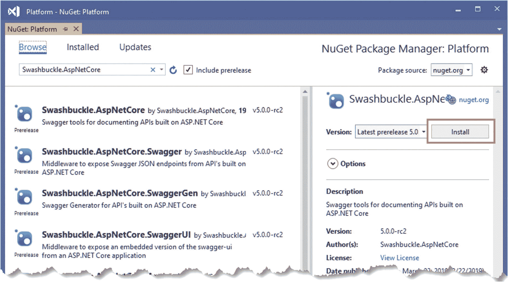

图 12-7。

在 Visual Studio 中安装包

新的依赖项将显示在`Platform.csproj`文件中，不管您使用哪种方法来安装包。

```cs
<Project Sdk="Microsoft.NET.Sdk.Web">

  <PropertyGroup>
    <TargetFramework>netcoreapp3.1</TargetFramework>
  </PropertyGroup>

  <ItemGroup>
    <PackageReference Include="Swashbuckle.AspNetCore" Version="5.0.0-rc2" />
  </ItemGroup>

</Project>

```

## 创建定制中间件

如前所述，微软为 ASP.NET Core 提供了各种中间件组件，用于处理 web 应用最常需要的特性。您还可以创建自己的中间件，这是理解 ASP.NET Core 如何工作的一种有用的方式，即使您在项目中只使用标准组件。创建中间件的关键方法是`Use`，如清单 [12-4](#PC10) 所示。

```cs
using System;
using System.Collections.Generic;
using System.Linq;
using System.Threading.Tasks;
using Microsoft.AspNetCore.Builder;
using Microsoft.AspNetCore.Hosting;
using Microsoft.AspNetCore.Http;
using Microsoft.Extensions.DependencyInjection;
using Microsoft.Extensions.Hosting;

namespace Platform {
    public class Startup {

        public void ConfigureServices(IServiceCollection services) {
        }

        public void Configure(IApplicationBuilder app, IWebHostEnvironment env) {

            if (env.IsDevelopment()) {
                app.UseDeveloperExceptionPage();
            }

            app.Use(async (context, next) => {
                if (context.Request.Method == HttpMethods.Get
                        && context.Request.Query["custom"] == "true") {
                    await context.Response.WriteAsync("Custom Middleware \n");
                }
                await next();
            });

            app.UseRouting();

            app.UseEndpoints(endpoints => {
                endpoints.MapGet("/", async context => {
                    await context.Response.WriteAsync("Hello World!");
                });
            });
        }
    }
}

Listing 12-4.Creating Custom Middleware in the Startup.cs File in the Platform Folder

```

`Use`方法注册了一个中间件组件，该组件通常被表示为一个 lambda 函数，该函数在请求通过管道时接收每个请求(还有另一个用于类的方法，下一节将对此进行描述)。

lambda 函数的参数是一个`HttpContext`对象和一个被调用来告诉 ASP.NET Core 将请求传递给管道中下一个中间件组件的函数。

`HttpContext`对象描述 HTTP 请求和 HTTP 响应，并提供额外的上下文，包括与请求相关的用户的详细信息。表 [12-5](#Tab5) 描述了`HttpContext`类提供的最有用的成员，它是在`Microsoft.AspNetCore.Http`命名空间中定义的。

表 12-5。

有用的 HttpContext 成员

<colgroup><col class="tcol1 align-left"> <col class="tcol2 align-left"></colgroup> 
| 

名字

 | 

描述

 |
| --- | --- |
| `Connection` | 该属性返回一个`ConnectionInfo`对象，该对象提供有关 HTTP 请求的网络连接的信息，包括本地和远程 IP 地址和端口的详细信息。 |
| `Request` | 该属性返回一个描述正在处理的 HTTP 请求的`HttpRequest`对象。 |
| `RequestServices` | 该属性提供对请求可用服务的访问，如第 [14](14.html) 章所述。 |
| `Response` | 该属性返回一个用于创建对 HTTP 请求的响应的`HttpResponse`对象。 |
| `Session` | 此属性返回与请求相关联的会话数据。第 [16](16.html) 章描述了会话数据功能。 |
| `User` | 该属性返回与请求相关的用户的详细信息，如第 [37](37.html) 和 [38](38.html) 章所述。 |
| `Features` | 此属性提供对请求功能的访问，这些功能允许访问请求处理的低级方面。参见第 [16](16.html) 章，了解使用请求功能的示例。 |

ASP.NET Core 平台负责处理 HTTP 请求以创建`HttpRequest`对象，这意味着中间件和端点不必担心原始请求数据。表 [12-6](#Tab6) 描述了`HttpRequest`类中最有用的成员。

表 12-6。

有用的 HttpRequest 成员

<colgroup><col class="tcol1 align-left"> <col class="tcol2 align-left"></colgroup> 
| 

名字

 | 

描述

 |
| --- | --- |
| `Body` | 此属性返回可用于读取请求正文的流。 |
| `ContentLength` | 这个属性返回`Content-Length`头的值。 |
| `ContentType` | 这个属性返回`Content-Type`头的值。 |
| `Cookies` | 该属性返回请求 cookies。 |
| `Form` | 此属性以表单形式返回请求正文的表示形式。 |
| `Headers` | 此属性返回请求头。 |
| `IsHttps` | 如果请求是使用 HTTPS 发出的，该属性返回`true`。 |
| `Method` | 此属性返回用于请求的 HTTP 谓词。 |
| `Path` | 此属性返回请求 URL 的路径部分。 |
| `Query` | 该属性以键/值对的形式返回请求 URL 的查询字符串部分。 |

`HttpResponse`对象描述了当请求通过管道时将被发送回客户机的 HTTP 响应。表 [12-7](#Tab7) 描述了`HttpResponse`类中最有用的成员。ASP.NET Core 平台使处理响应变得尽可能容易，自动设置标题，并使向客户端发送内容变得容易。

表 12-7。

有用的 HttpResponse 成员

<colgroup><col class="tcol1 align-left"> <col class="tcol2 align-left"></colgroup> 
| 

名字

 | 

描述

 |
| --- | --- |
| `ContentLength` | 该属性设置`Content-Length`头的值。 |
| `ContentType` | 该属性设置`Content-Type`头的值。 |
| `Cookies` | 此属性允许 cookies 与请求相关联。 |
| `HasStarted` | 如果 ASP.NET Core 已经开始向客户端发送响应头，则该属性返回`true`，在此之后就不能再进行更改。 |
| `Headers` | 此属性允许设置响应头。 |
| `StatusCode` | 此属性设置响应的状态代码。 |
| `WriteAsync(data)` | 这个异步方法将数据字符串写入响应体。 |
| `Redirect(url)` | 此方法发送重定向响应。 |

当创建定制中间件时，直接使用`HttpContext`、`HttpRequest`和`HttpResponse`对象，但是，正如您将在后面的章节中了解到的，当使用更高级的 ASP.NET Core 特性，如 MVC 框架和 Razor Pages 时，通常不需要这样做。

我在清单 [12-4](#PC10) 中定义的中间件函数使用`HttpRequest`对象来检查 HTTP 方法和查询字符串，以识别在查询字符串中具有值为`true`的`custom`参数的 GET 请求，如下所示:

```cs
...
if (context.Request.Method == HttpMethods.Get
    && context.Request.Query["custom"] == "true") {
...

```

`HttpMethods`类为每个 HTTP 方法定义了静态字符串。对于带有预期查询字符串的 GET 请求，中间件函数使用`WriteAsync`方法将一个字符串添加到响应的正文中。

```cs
...
await context.Response.WriteAsync("Custom Middleware \n");
...

```

Note

在本书的这一部分，所有的例子都向浏览器发送简单的字符串结果。在第 3 部分中，我将向您展示如何创建返回 JSON 数据的 web 服务，并介绍 ASP.NET Core 生成 HTML 结果的不同方式。

中间件的第二个参数是通常称为`next`的函数，它告诉 ASP.NET Core 将请求传递给请求管道中的下一个组件。

```cs
...
if (context.Request.Method == HttpMethods.Get
        && context.Request.Query["custom"] == "true") {
    await context.Response.WriteAsync("Custom Middleware \n");
}
await next();
...

```

调用下一个中间件组件时不需要参数，因为 ASP.NET Core 负责为组件提供`HttpContext`对象和它自己的`next`函数，以便它可以处理请求。`next`函数是异步的，这就是为什么要使用`await`关键字，为什么用`async`关键字定义 lambda 函数。

Tip

你可能会遇到调用`next.Invoke()`而不是`next()`的中间件。这些是等价的，而`next()`是由编译器提供的，以方便生成简洁的代码。

重启 ASP.NET Core 并导航至`http://localhost:5000/?custom=true`。您将看到新的中间件功能在将请求传递给下一个中间件组件之前将其消息附加到响应体，如图 [12-8](#Fig8) 所示。删除查询字符串，或者将`true`改为`false`，中间件组件将传递请求而不添加响应。

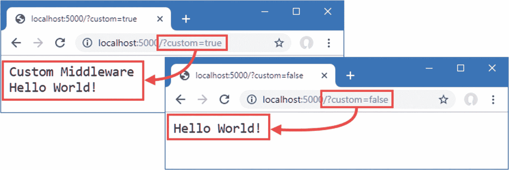

图 12-8。

创建定制中间件

### 使用类定义中间件

使用 lambda 函数定义中间件很方便，但是它会导致在`Startup`类中使用一个冗长而复杂的`Configure`方法，并且很难在不同的项目中重用中间件。中间件也可以使用类来定义。将名为`Middleware.cs`的类文件添加到`Platform`文件夹中，并添加清单 [12-5](#PC14) 中所示的代码。

```cs
using Microsoft.AspNetCore.Http;
using System.Threading.Tasks;

namespace Platform {

    public class QueryStringMiddleWare {
        private RequestDelegate next;

        public QueryStringMiddleWare(RequestDelegate nextDelegate) {
            next = nextDelegate;
        }

        public async Task Invoke(HttpContext context) {
            if (context.Request.Method == HttpMethods.Get
                        && context.Request.Query["custom"] == "true") {
                await context.Response.WriteAsync("Class-based Middleware \n");
            }
            await next(context);
        }
    }
}

Listing 12-5.The Contents of the Middleware.cs File in the Platform Folder

```

中间件类接收一个`RequestDelegate`作为构造函数参数，用于将请求转发给管道中的下一个组件。当收到请求时，`Invoke`方法由 ASP.NET Core 调用，并接收一个`HttpContext`对象，该对象使用 lambda 函数中间件接收的相同类提供对请求和响应的访问。`RequestDelegate`返回一个`Task`，允许它异步工作。

基于类的中间件的一个重要区别是，在调用`RequestDelete`转发请求时，必须使用`HttpContext`对象作为参数，如下所示:

```cs
...
await next(context);
...

```

使用`UseMiddleware`方法将基于类的中间件组件添加到管道中，该方法接受中间件作为类型参数，如清单 [12-6](#PC16) 所示。

```cs
using System;
using System.Collections.Generic;
using System.Linq;
using System.Threading.Tasks;
using Microsoft.AspNetCore.Builder;
using Microsoft.AspNetCore.Hosting;
using Microsoft.AspNetCore.Http;
using Microsoft.Extensions.DependencyInjection;
using Microsoft.Extensions.Hosting;

namespace Platform {
    public class Startup {

        public void ConfigureServices(IServiceCollection services) {
        }

        public void Configure(IApplicationBuilder app, IWebHostEnvironment env) {

            if (env.IsDevelopment()) {
                app.UseDeveloperExceptionPage();
            }

            app.Use(async (context, next) => {
                if (context.Request.Method == HttpMethods.Get
                        && context.Request.Query["custom"] == "true") {
                    await context.Response.WriteAsync("Custom Middleware \n");
                }
                await next();
            });

            app.UseMiddleware<QueryStringMiddleWare>();

            app.UseRouting();

            app.UseEndpoints(endpoints => {
                endpoints.MapGet("/", async context => {
                    await context.Response.WriteAsync("Hello World!");
                });
            });
        }
    }
}

Listing 12-6.Adding a Class-Based Middleware Component in the Startup.cs File in the Platform Folder

```

当 ASP.NET 内核启动时，`QueryStringMiddleware`类将被实例化，它的`Invoke`方法将被调用来处理收到的请求。

Caution

单个中间件对象被用来处理所有请求，这意味着`Invoke`方法中的代码必须是线程安全的。

从调试菜单中选择启动而不调试，或使用`dotnet run`命令重启 ASP.NET Core。导航到`http://localhost:5000?custom=true`，您将看到两个中间件组件的输出，如图 [12-9](#Fig9) 所示。

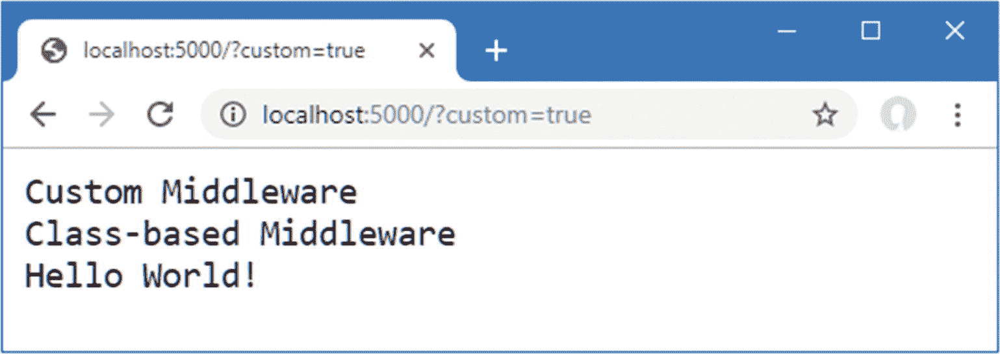

图 12-9。

使用基于类的中间件组件

### 了解返回管道路径

中间件组件可以在调用`next`函数后修改`HTTPResponse`对象，如清单 [12-7](#PC17) 中的新中间件所示。

```cs
using System;
using System.Collections.Generic;
using System.Linq;
using System.Threading.Tasks;
using Microsoft.AspNetCore.Builder;
using Microsoft.AspNetCore.Hosting;
using Microsoft.AspNetCore.Http;
using Microsoft.Extensions.DependencyInjection;
using Microsoft.Extensions.Hosting;

namespace Platform {
    public class Startup {

        public void ConfigureServices(IServiceCollection services) {
        }

        public void Configure(IApplicationBuilder app, IWebHostEnvironment env) {

            if (env.IsDevelopment()) {
                app.UseDeveloperExceptionPage();
            }

            app.Use(async (context, next) => {
                await next();
                await context.Response
                    .WriteAsync($"\nStatus Code: { context.Response.StatusCode}");
            });

            app.Use(async (context, next) => {
                if (context.Request.Method == HttpMethods.Get
                        && context.Request.Query["custom"] == "true") {
                    await context.Response.WriteAsync("Custom Middleware \n");
                }
                await next();
            });

            app.UseMiddleware<QueryStringMiddleWare>();

            app.UseRouting();

            app.UseEndpoints(endpoints => {
                endpoints.MapGet("/", async context => {
                    await context.Response.WriteAsync("Hello World!");
                });
            });
        }
    }
}

Listing 12-7.Adding New Middleware in the Startup.cs File in the Platform Folder

```

新的中间件立即调用`next`方法沿着管道传递请求，然后使用`WriteAsync`方法向响应体添加一个字符串。这似乎是一种奇怪的方法，但它允许中间件通过在调用下一个函数之前和之后定义语句，在响应沿着请求管道传递之前和之后对响应进行更改，如图 [12-10](#Fig10) 所示。

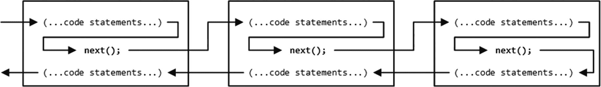

图 12-10。

通过 ASP.NET Core 管道传递请求和响应

中间件可以在请求被传递之前运行，也可以在请求被其他组件处理之后运行，或者两者兼有。其结果是，几个中间件组件共同对生成的响应做出贡献，每个组件提供响应的某个方面，或者提供稍后在管道中使用的某些特性或数据。

在调试菜单中选择不调试启动，或者使用`dotnet`查看清单 [12-7](#PC17) 中定义的中间件的效果，如图 [12-11](#Fig11) 所示。如果您正在使用命令行，使用`dotnet run`命令启动 ASP.NET Core 并导航到`http://localhost:5000`。

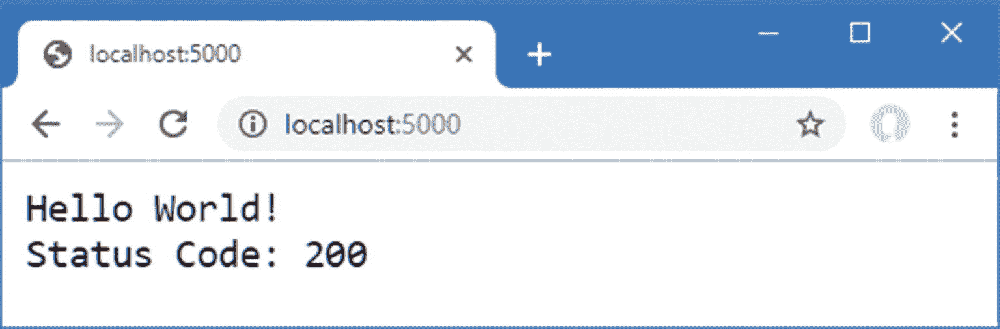

图 12-11。

修改返回路径中的响应

Note

在 ASP.NET Core 开始向客户端发送响应后，中间件组件不得对`HttpResponse`对象进行更改。表 [12-7](#Tab7) 中描述的`HasStarted`属性可以被检查以避免异常。

### 使请求管道短路

生成完整响应的组件可以选择不调用`next`函数，这样请求就不会被传递。不传递请求的组件被称为*使管道*短路，这就是清单 [12-8](#PC18) 中所示的新中间件组件对以`/short` URL 为目标的请求所做的。

```cs
using System;
using System.Collections.Generic;
using System.Linq;
using System.Threading.Tasks;
using Microsoft.AspNetCore.Builder;
using Microsoft.AspNetCore.Hosting;
using Microsoft.AspNetCore.Http;
using Microsoft.Extensions.DependencyInjection;
using Microsoft.Extensions.Hosting;

namespace Platform {
    public class Startup {

        public void ConfigureServices(IServiceCollection services) {
        }

        public void Configure(IApplicationBuilder app, IWebHostEnvironment env) {

            if (env.IsDevelopment()) {
                app.UseDeveloperExceptionPage();
            }

            app.Use(async (context, next) => {
                await next();
                await context.Response
                    .WriteAsync($"\nStatus Code: { context.Response.StatusCode}");
            });

            app.Use(async (context, next) => {
                if (context.Request.Path == "/short") {
                    await context.Response
                        .WriteAsync($"Request Short Circuited");
                } else {
                    await next();
                }
            });

            app.Use(async (context, next) => {
                if (context.Request.Method == HttpMethods.Get
                        && context.Request.Query["custom"] == "true") {
                    await context.Response.WriteAsync("Custom Middleware \n");
                }
                await next();
            });

            app.UseMiddleware<QueryStringMiddleWare>();

            app.UseRouting();

            app.UseEndpoints(endpoints => {
                endpoints.MapGet("/", async context => {
                    await context.Response.WriteAsync("Hello World!");
                });
            });
        }
    }
}

Listing 12-8.Short-Circuiting the Request Pipeline in the Startup.cs File in the Platform Folder

```

新的中间件检查`HttpRequest`对象的`Path`属性，以查看该请求是否针对`/short`URL；如果是，它调用`WriteAsync`方法而不调用`next`函数。要查看效果，重启 ASP.NET Core 并导航到`http://localhost:5000/short?custom=true` URL，这将产生如图 [12-12](#Fig12) 所示的输出。

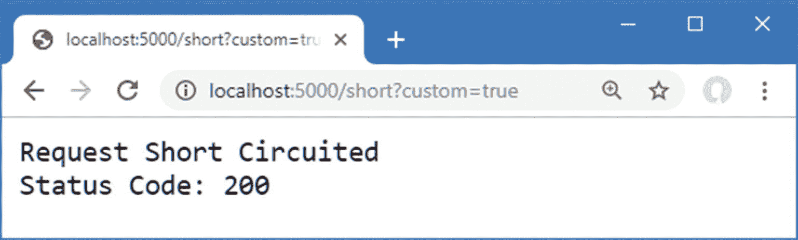

图 12-12。

使请求管道短路

即使 URL 具有管道中下一个组件所期望的查询字符串参数，请求也不会被转发，因此中间件不会被使用。但是，请注意，管道中的前一个组件已经将其消息添加到了响应中。这是因为短路只会阻止管道中更远的组件被使用，而不会影响更早的组件，如图 [12-13](#Fig13) 所示。

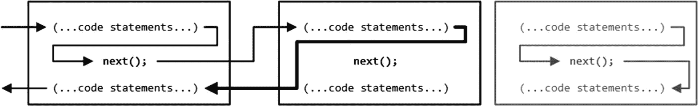

图 12-13。

使请求管道短路

### 创建管道分支

`Map`方法用于创建一段管道，用于处理对特定 URL 的请求，创建一个单独的中间件组件序列，如清单 [12-9](#PC19) 所示。

```cs
using System;
using System.Collections.Generic;
using System.Linq;
using System.Threading.Tasks;
using Microsoft.AspNetCore.Builder;
using Microsoft.AspNetCore.Hosting;
using Microsoft.AspNetCore.Http;
using Microsoft.Extensions.DependencyInjection;
using Microsoft.Extensions.Hosting;

namespace Platform {
    public class Startup {

        public void ConfigureServices(IServiceCollection services) {
        }

        public void Configure(IApplicationBuilder app, IWebHostEnvironment env) {

            if (env.IsDevelopment()) {
                app.UseDeveloperExceptionPage();
            }

            app.Map("/branch", branch => {

                branch.UseMiddleware<QueryStringMiddleWare>();

                branch.Use(async (context, next) => {
                    await context.Response.WriteAsync($"Branch Middleware");
                });
            });

            app.UseMiddleware<QueryStringMiddleWare>();

            app.UseRouting();

            app.UseEndpoints(endpoints => {
                endpoints.MapGet("/", async context => {
                    await context.Response.WriteAsync("Hello World!");
                });
            });
        }
    }
}

Listing 12-9.Creating a Pipeline Branch

```

`Map`方法的第一个参数指定用于匹配 URL 的字符串。第二个参数是管道的分支，使用`Use`和`UseMiddleware`方法将中间件组件添加到其中。清单 [12-9](#PC19) 中的语句创建了一个分支，该分支用于以`/branch`开头的 URL，并通过清单 [12-9](#PC19) 中定义的`QueryStringMiddleware`类传递请求，这些语句定义了一个中间件 lambda 表达式，该表达式将消息添加到响应中。图 [12-14](#Fig14) 显示了分支对请求管道的影响。

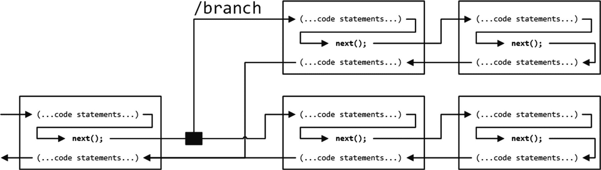

图 12-14。

向请求管道添加分支

当一个 URL 被`Map`方法匹配时，它跟随分支，不再通过管道的主路径上的中间件组件。相同的中间件可以在管道的不同部分使用，这可以在清单 [12-9](#PC19) 中看到，其中`QueryStringMiddleWare`类同时用于管道的主要部分和分支。

要查看处理请求的不同方式，请重启 ASP.NET Core 并请求`http://localhost:5000?custom=true` URL，这将在管道的主要部分进行处理，并将产生如图 [12-15](#Fig15) 左侧所示的输出。导航到`http://localhost:5000/branch?custom=true`，请求将被转发到分支中的中间件，产生如图 [12-15](#Fig15) 右图所示的输出。

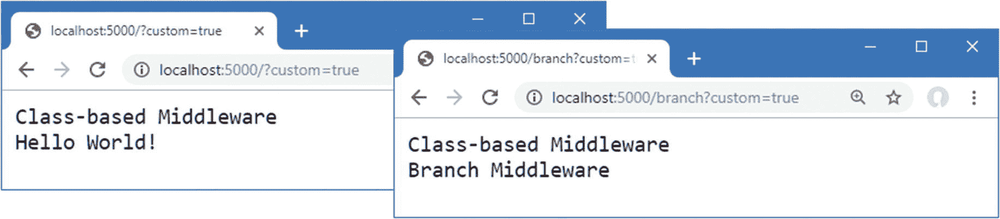

图 12-15

分支请求管道的效果

Branching with a Predicate

ASP.NET Core 还支持`MapWhen`方法，该方法可用于使用谓词匹配请求，允许根据标准(而不仅仅是 URL)为管道分支选择请求。

`MapWhen`方法的参数是一个谓词函数，它接收一个`HttpContext`并为应该跟随分支的请求返回`true`，还有一个函数接收一个代表管道分支的`IApplicationBuilder`对象，中间件被添加到该管道分支中。下面是一个使用`MapWhen`方法来分支管道的例子:

```cs
...
app.MapWhen(context => context.Request.Query.Keys.Contains("branch"),
   branch => {
        // ...add middleware components here...
});
...

```

对于查询字符串包含名为`branch`的参数的请求，谓词函数返回`true`进行分支。

### 创建终端中间件

终端中间件从不将请求转发给其他组件，并且总是标记请求管道的结束。`Startup`类中有一个终端中间件组件，如下图所示:

```cs
...
branch.Use(async (context, next) => {
    await context.Response.WriteAsync($"Branch Middleware");
});
...

```

ASP.NET Core 支持`Run`方法，作为创建终端中间件的一个便利特性，这使得中间件组件不会转发请求，并且特意决定不调用`next`函数。在清单 [12-10](#PC22) 中，我为管道分支中的终端中间件使用了`Run`方法。

```cs
...
app.Map("/branch", branch => {

    branch.UseMiddleware<QueryStringMiddleWare>();

    branch.Run(async (context) => {
        await context.Response.WriteAsync($"Branch Middleware");
    });
});
...

Listing 12-10.Using the Run Method in the Startup.cs File in the Platform Folder

```

传递给`Run`方法的中间件函数只接收一个`HttpContext`对象，不需要定义一个不使用的参数。在幕后，`Run`方法是通过`Use`方法实现的，提供这个特性只是为了方便。

Caution

在终端组件之后添加到管道中的中间件永远不会接收请求。如果您在管线结束前添加终端组件，ASP.NET Core 不会警告您。

可以编写基于类的组件，这样它们既可以用作常规中间件，也可以用作终端中间件，如清单 [12-11](#PC23) 所示。

```cs
using Microsoft.AspNetCore.Http;
using System.Threading.Tasks;

namespace Platform {

    public class QueryStringMiddleWare {
        private RequestDelegate next;

        public QueryStringMiddleWare() {
            // do nothing
        }

        public QueryStringMiddleWare(RequestDelegate nextDelegate) {
            next = nextDelegate;
        }

        public async Task Invoke(HttpContext context) {
            if (context.Request.Method == HttpMethods.Get
                        && context.Request.Query["custom"] == "true") {
                await context.Response.WriteAsync("Class-based Middleware \n");
            }
            if (next != null) {
                await next(context);
            }
        }
    }
}

Listing 12-11.Adding Terminal Support in the Middleware.cs File in the Platform Folder

```

只有当构造函数已经为`nextDelegate`参数提供了非`null`值时，组件才会转发请求。清单 [12-12](#PC24) 显示了标准和终端形式的组件应用。

```cs
using System;
using System.Collections.Generic;
using System.Linq;
using System.Threading.Tasks;
using Microsoft.AspNetCore.Builder;
using Microsoft.AspNetCore.Hosting;
using Microsoft.AspNetCore.Http;
using Microsoft.Extensions.DependencyInjection;
using Microsoft.Extensions.Hosting;

namespace Platform {
    public class Startup {

        public void ConfigureServices(IServiceCollection services) {
        }

        public void Configure(IApplicationBuilder app, IWebHostEnvironment env) {

            if (env.IsDevelopment()) {
                app.UseDeveloperExceptionPage();
            }

            app.Map("/branch", branch => {
                branch.Run(new QueryStringMiddleWare().Invoke);
            });

            app.UseMiddleware<QueryStringMiddleWare>();

            app.UseRouting();

            app.UseEndpoints(endpoints => {
                endpoints.MapGet("/", async context => {
                    await context.Response.WriteAsync("Hello World!");
                });
            });
        }
    }
}

Listing 12-12.Applying Class-Based Middleware in the Startup.cs File in the Platform Folder

```

终端中间件没有与`UseMiddleware`方法等效的方法，因此必须通过创建中间件类的新实例并选择其`Invoke`方法来使用`Run`方法。使用`Run`方法不会改变中间件的输出，这可以通过重启 ASP.NET Core 并导航到`http://localhost:5000/branch?custom=true` URL 来看到，这会产生如图 [12-16](#Fig16) 所示的内容。

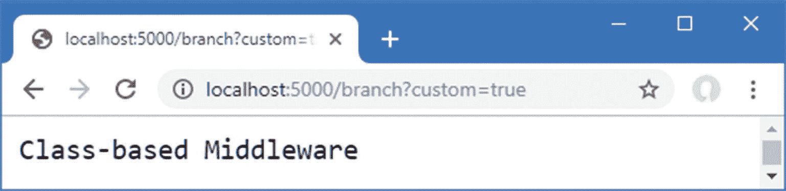

图 12-16。

使用 Run 方法创建终端中间件

## 配置中间件

有一个配置中间件的通用模式，称为*选项模式*，它被后面章节中描述的一些内置中间件组件所使用。

起点是定义一个包含中间件组件配置选项的类。将名为`MessageOptions.cs`的类文件添加到`Platform`文件夹中，代码如清单 [12-13](#PC25) 所示。

```cs
namespace Platform {

    public class MessageOptions {

        public string CityName { get; set; } = "New York";
        public string CountryName{ get; set; } = "USA";
    }
}

Listing 12-13.The Contents of the MessageOptions.cs File in the Platform Folder

```

`MessageOptions`类定义了详细描述城市和国家的属性。在清单 [12-14](#PC26) 中，我使用 options 模式创建了一个定制的中间件组件，它依赖于`MessageOptions`类进行配置。为了简洁起见，我还从前面的例子中删除了一些中间件。

```cs
using System;
using System.Collections.Generic;
using System.Linq;
using System.Threading.Tasks;
using Microsoft.AspNetCore.Builder;
using Microsoft.AspNetCore.Hosting;
using Microsoft.AspNetCore.Http;
using Microsoft.Extensions.DependencyInjection;
using Microsoft.Extensions.Hosting;
using Microsoft.Extensions.Options;

namespace Platform {
    public class Startup {

        public void ConfigureServices(IServiceCollection services) {
            services.Configure<MessageOptions>(options => {
                options.CityName= "Albany";
            });
        }

        public void Configure(IApplicationBuilder app, IWebHostEnvironment env,
                IOptions<MessageOptions> msgOptions) {

            if (env.IsDevelopment()) {
                app.UseDeveloperExceptionPage();
            }

            app.Use(async (context, next) => {
                if (context.Request.Path == "/location") {
                    MessageOptions opts = msgOptions.Value;
                    await context.Response
                        .WriteAsync($"{opts.CityName}, {opts.CountryName}");
                } else {
                    await next();
                }
            });

            app.UseRouting();

            app.UseEndpoints(endpoints => {
                endpoints.MapGet("/", async context => {
                    await context.Response.WriteAsync("Hello World!");
                });
            });
        }
    }
}

Listing 12-14Using the Options Pattern in the Startup.cs File in the Platform Folder

```

使用`ConfigureServices`方法中的`IServiceCollection.Configure`设置选项。泛型类型参数用于指定`options`类，如下所示:

```cs
...
services.Configure<MessageOptions>(options => {
    options.CityName= "Albany";
});
...

```

该语句使用`MessageOptions`类创建选项，并更改`CityName`属性的值。当应用启动时，ASP.NET Core 平台将创建一个`options`类的新实例，并将其传递给作为参数提供给`Configure`方法的函数，允许更改默认选项值。

通过向`Startup.Configure`方法添加一个`IOptions<T>`参数来访问这些选项，其中泛型类型参数指定了`options`类，如下所示:

```cs
...
public void Configure(IApplicationBuilder app,IWebHostEnvironment env,
    CounterService counter, IOptions<MessageOptions> msgOptions) {
...

```

`IOptions<T>`接口定义了一个`Value`属性，该属性返回由 ASP.NET Core 平台创建的`options`对象，允许中间件组件和端点使用选项，如下所示:

```cs
...
app.Use(async (context, next) => {
    if (context.Request.Path == "/location") {
        MessageOptions opts = msgOptions.Value;
        await context.Response.WriteAsync($"{opts.CityName}, {opts.CountryName}");
    } else {
        await next();
    }
});
...

```

您可以通过重启 ASP.NET Core 并使用浏览器导航到`http://localhost:5000/location`来查看结果。中间件组件使用选项产生如图 [12-17](#Fig17) 所示的输出。

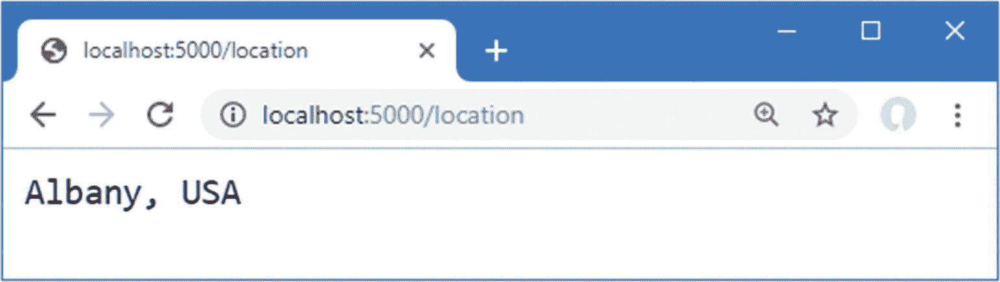

图 12-17。

使用选项模式

### 对基于类的中间件使用选项模式

尽管 options 模式可以与 lambda 函数中间件一起使用，但你通常会看到它被应用于基于类的中间件，比如在第 [15](15.html) 和 [16](16.html) 章节中描述的内置特性。当与基于类的中间件一起使用时，配置选项不必通过`Startup.Configure`方法参数来访问，这将产生更优雅的结果。

将清单 [12-15](#PC30) 中所示的语句添加到`Middleware.cs`文件中，以定义一个使用`MessageOptions`类进行配置的基于类的中间件组件。

```cs
using Microsoft.AspNetCore.Http;
using System.Threading.Tasks;
using Microsoft.Extensions.Options;

namespace Platform {

    public class QueryStringMiddleWare {
        private RequestDelegate? next;

        // ...statements omitted for brevity...
    }

    public class LocationMiddleware {
        private RequestDelegate next;
        private MessageOptions options;

        public LocationMiddleware(RequestDelegate nextDelegate,
                IOptions<MessageOptions> opts) {
            next = nextDelegate;
            options = opts.Value;
        }

        public async Task Invoke(HttpContext context) {
            if (context.Request.Path == "/location") {
                await context.Response
                    .WriteAsync($"{options.CityName}, {options.CountryName}");
            } else {
                await next(context);
            }
        }
    }
}

Listing 12-15.Defining a Middleware Component in the Middleware.cs File in the Platform Folder

```

`LocationMiddleware`类定义了一个`IOptions<MessageOptions>`构造函数参数。在清单 [12-16](#PC31) 中，我用清单 [12-15](#PC30) 中的类替换了 lambda 函数中间件组件，并移除了`IOptions<MessageOptions>`参数。

```cs
using System;
using System.Collections.Generic;
using System.Linq;
using System.Threading.Tasks;
using Microsoft.AspNetCore.Builder;
using Microsoft.AspNetCore.Hosting;
using Microsoft.AspNetCore.Http;
using Microsoft.Extensions.DependencyInjection;
using Microsoft.Extensions.Hosting;
using Microsoft.Extensions.Options;

namespace Platform {
    public class Startup {

        public void ConfigureServices(IServiceCollection services) {
            services.Configure<MessageOptions>(options => {
                options.CityName= "Albany";
            });
        }

        public void Configure(IApplicationBuilder app, IWebHostEnvironment env) {

            if (env.IsDevelopment()) {
                app.UseDeveloperExceptionPage();
            }

            app.UseMiddleware<LocationMiddleware>();

            app.UseRouting();

            app.UseEndpoints(endpoints => {
                endpoints.MapGet("/", async context => {
                    await context.Response.WriteAsync("Hello World!");
                });
            });
        }
    }
}

Listing 12-16Using Class-Based Middleware in the Startup.cs File in the Platform Folder

```

当执行`UseMiddleware`语句时，将检查`LocationMiddleware`构造函数，并且将使用在`ConfigureServices`方法中创建的对象来解析其`IOptions<MessageOptions>`参数。这是使用第 [14 章](14.html)中描述的依赖注入特性来完成的，但是直接的效果是 options 模式可以用来轻松地配置基于类的中间件。重启 ASP.NET Core 并请求`http://localhost:5000/location`测试新的中间件，这将产生如图 [12-17](#Fig17) 所示的相同输出。

## 摘要

在这一章中，我把重点放在了 ASP.NET Core 平台上，介绍了请求管道、中间件组件以及简单的服务。我描述了使用空模板时添加到项目中的文件，并解释了`Program`和`Startup`类的作用。在下一章中，我将描述 ASP.NET Core URL 路由功能。