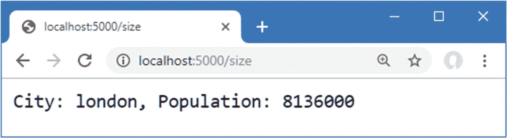
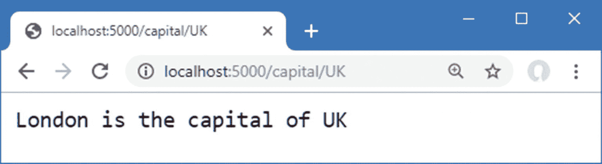

# 十三、使用 URL 路由

URL 路由特性是由一对中间件组件提供的，通过整合请求 URL 的处理和匹配，使得生成响应变得更加容易。在这一章中，我将解释 ASP.NET Core 平台是如何支持 URL 路由的，展示它的用途，并解释为什么它比创建你自己的定制中间件组件更好。表 [13-1](#Tab1) 将 URL 路由放在上下文中。

表 13-1。

将 URL 路由置于上下文中

<colgroup><col class="tcol1 align-left"> <col class="tcol2 align-left"></colgroup> 
| 

问题

 | 

回答

 |
| --- | --- |
| 这是什么？ | URL 路由合并了 URL 的处理和匹配，允许称为*端点*的组件生成响应。 |
| 为什么有用？ | URL 路由消除了每个中间件组件处理 URL 以查看请求是否将被处理或沿着管道传递的需要。结果是效率更高，维护更容易。 |
| 如何使用？ | URL 路由中间件组件被添加到请求管道中，并配置了一组路由。每个路由都包含一个 URL 路径和一个委托，该委托将在收到具有匹配路径的请求时生成响应。 |
| 有什么陷阱或限制吗？ | 很难定义与复杂应用支持的所有 URL 相匹配的路由集。 |
| 有其他选择吗？ | URL 路由是可选的，也可以使用定制的中间件组件。 |

Note

本章重点介绍 ASP.NET Core 平台的 URL 路由。请参阅第 3 部分，了解 ASP.NET Core 的高级部分如何构建本章中描述的特性。

表 [13-2](#Tab2) 总结了本章内容。

表 13-2。

章节总结

<colgroup><col class="tcol1 align-left"> <col class="tcol2 align-left"> <col class="tcol3 align-left"></colgroup> 
| 

问题

 | 

解决办法

 | 

列表

 |
| --- | --- | --- |
| 处理对一组特定 URL 的请求 | 使用匹配所需 URL 的模式定义路由 | 1–6 |
| 从 URL 中提取值 | 使用分段变量 | 7–10, 14 |
| 生成 URL | 使用链接生成器从路线生成 URL | 11–13, 15 |
| 匹配具有不同段数的 URL | 在 URL 路由模式中使用可选段或全部段 | 16–18 |
| 限制匹配 | 在 URL 路由模式中使用约束 | 19–21, 23–26 |
| 匹配未以其他方式处理的请求 | 定义后备路线 | Twenty-two |
| 查看哪个端点将处理请求 | 使用路由上下文数据 | Twenty-seven |

## 为本章做准备

在本章中，我继续使用第 [12 章](12.html)中的`Platform`项目。为了准备本章，将一个名为`Population.cs`的文件添加到`Platform`文件夹中，代码如清单 [13-1](#PC1) 所示。

Tip

你可以从 [`https://github.com/apress/pro-asp.net-core-3`](https://github.com/apress/pro-asp.net-core-3) 下载本章以及本书其他章节的示例项目。如果在运行示例时遇到问题，请参见第 [1](01.html) 章获取帮助。

```cs
using Microsoft.AspNetCore.Http;
using System;
using System.Threading.Tasks;

namespace Platform {
    public class Population {
        private RequestDelegate next;

        public Population() { }

        public Population(RequestDelegate nextDelegate) {
            next = nextDelegate;
        }

        public async Task Invoke(HttpContext context) {
            string[] parts = context.Request.Path.ToString()
                .Split("/", StringSplitOptions.RemoveEmptyEntries);
            if (parts.Length == 2 && parts[0] == "population") {
                string city = parts[1];
                int? pop = null;
                switch (city.ToLower()) {
                    case "london":
                        pop = 8_136_000;
                        break;
                    case "paris":
                        pop = 2_141_000;
                        break;
                    case "monaco":
                        pop = 39_000;
                        break;
                }
                if (pop.HasValue) {
                    await context.Response
                        .WriteAsync($"City: {city}, Population: {pop}");
                    return;
                }
            }
            if (next != null) {
                await next(context);
            }
        }
    }
}

Listing 13-1.The Contents of the Population.cs File in the Platform Folder

```

这个中间件组件响应对`/population/<city>`的请求，其中`<city>`是`london`、`paris`或`monaco`。中间件组件分割 URL 路径字符串，检查它是否具有预期的长度，并使用一个`switch`语句来确定它是一个可以响应的 URL 请求。如果 URL 匹配中间件正在寻找的模式，则生成响应；否则，请求将沿着管道传递。

将名为`Capital.cs`的类文件添加到`Platform`文件夹中，代码如清单 [13-2](#PC2) 所示。

```cs
using Microsoft.AspNetCore.Http;
using System;
using System.Threading.Tasks;

namespace Platform {
    public class Capital {
        private RequestDelegate next;

        public Capital() { }

        public Capital(RequestDelegate nextDelegate) {
            next = nextDelegate;
        }

        public async Task Invoke(HttpContext context) {
            string[] parts = context.Request.Path.ToString()
                .Split("/", StringSplitOptions.RemoveEmptyEntries);
            if (parts.Length == 2 && parts[0] == "capital") {
                string capital = null;
                string country = parts[1];
                switch (country.ToLower()) {
                    case "uk":
                        capital= "London";
                        break;
                    case "france":
                        capital = "Paris";
                        break;
                    case "monaco":
                        context.Response.Redirect($"/population/{country}");
                        return;
                }
                if (capital != null) {
                    await context.Response
                        .WriteAsync($"{capital} is the capital of {country}");
                    return;
                }
            }
            if (next != null) {
                await next(context);
            }
        }
    }
}

Listing 13-2.The Contents of the Capital.cs File in the Platform Folder

```

这个中间件组件正在寻找对`/capital/<country>`的请求，其中`<country>`是`uk`、`france`或`monaco`。显示了英国和法国的首都，但是对摩纳哥的请求被重定向到`/population/monaco`，摩纳哥是一个城市，也是一个州。

清单 [13-3](#PC3) 替换了前一章的中间件示例，并向请求管道添加了新的中间件组件。

```cs
using Microsoft.AspNetCore.Builder;
using Microsoft.AspNetCore.Hosting;
using Microsoft.AspNetCore.Http;
using Microsoft.Extensions.DependencyInjection;

namespace Platform {
    public class Startup {

        public void ConfigureServices(IServiceCollection services) {
        }

        public void Configure(IApplicationBuilder app, IWebHostEnvironment env) {
            app.UseDeveloperExceptionPage();
            app.UseMiddleware<Population>();
            app.UseMiddleware<Capital>();
            app.Use(async (context, next) => {
                await context.Response.WriteAsync("Terminal Middleware Reached");
            });
        }
    }
}

Listing 13-3.Replacing the Contents of the Startup.cs File in the Platform Folder

```

通过从调试菜单中选择启动而不调试或运行而不调试来启动应用，或者通过打开新的 PowerShell 命令提示符，导航到`Platform`项目文件夹(包含`Platform.csproj`文件)，并运行清单 [13-4](#PC4) 中所示的命令。

```cs
dotnet run

Listing 13-4.Starting the ASP.NET Core Runtime

```

导航到`http://localhost:5000/population/london`，您将在图 [13-1](#Fig1) 的左侧看到输出。导航到`http://localhost:5000/capital/France`查看另一个中间件组件的输出，显示在图 [13-1](#Fig1) 的右侧。


图 13-1。

运行示例应用

### 了解 URL 路由

每个中间件组件决定是否在请求通过管道时对其采取行动。一些组件寻找特定的头或查询字符串值，但是大多数组件——尤其是端子和短路组件——试图匹配 URL。

当请求沿着管道前进时，每个中间件组件都必须重复相同的一组步骤。您可以在预览部分定义的中间件中看到这一点，其中两个组件经历相同的过程:分割 URL、检查部分的数量、检查第一部分，等等。

这种方法效率很低，很难维护，并且在更改时很容易损坏。这是低效的，因为相同的操作集被重复来处理 URL。这很难维护，因为每个组件寻找的 URL 都隐藏在其代码中。它很容易被打破，因为改变必须在多个地方小心翼翼地完成。例如，`Capital`组件将请求重定向到一个路径以`/population`开头的 URL，这由`Population`组件处理。如果将`Population`组件修改为支持`/size` URL，那么这一变化也必须反映在`Capital`组件中。真正的应用可以支持复杂的 URL 集合，并且完全通过单独的中间件组件进行工作更改可能很困难。

URL 路由通过引入中间件来解决这些问题，中间件负责匹配请求 URL，以便被称为*端点*的组件可以专注于响应。端点和它们需要的 URL 之间的映射用一个*路由*表示。路由中间件处理 URL，检查路由集，并找到处理请求的端点，这个过程被称为*路由*。

### 添加路由中间件并定义端点

使用两种不同的方法添加路由中间件:`UseRouting`和`UseEndpoints`。`UseRouting`方法将负责处理请求的中间件添加到管道中。`UseEndpoints`方法用于定义将 URL 匹配到端点的路由。使用与请求 URL 的路径相比较的模式来匹配 URL，并且每个路由在一个 URL 模式和一个端点之间创建一个关系。清单 [13-5](#PC5) 展示了路由中间件的使用，并包含一个简单的路由。

Tip

我在“访问中间件组件中的端点”一节中解释了为什么有两种路由方法。

```cs
using Microsoft.AspNetCore.Builder;
using Microsoft.AspNetCore.Hosting;
using Microsoft.AspNetCore.Http;
using Microsoft.Extensions.DependencyInjection;

namespace Platform {
    public class Startup {

        public void ConfigureServices(IServiceCollection services) {
        }

        public void Configure(IApplicationBuilder app, IWebHostEnvironment env) {
            app.UseDeveloperExceptionPage();
            app.UseMiddleware<Population>();
            app.UseMiddleware<Capital>();

            app.UseRouting();

            app.UseEndpoints(endpoints => {
                endpoints.MapGet("routing", async context => {
                    await context.Response.WriteAsync("Request Was Routed");
                });
            });

            app.Use(async (context, next) => {
                await context.Response.WriteAsync("Terminal Middleware Reached");
            });
        }
    }
}

Listing 13-5.Using the Routing Middleware in the Startup.cs File in the Platform Folder

```

`UseRouting`方法没有参数。`UseEndpoints`方法接收一个函数，该函数接受一个`IEndpointRouteBuilder`对象，并使用表 [13-3](#Tab3) 中描述的扩展方法来创建路线。

表 13-3。

IEndpointRouteBuilder 扩展方法

<colgroup><col class="tcol1 align-left"> <col class="tcol2 align-left"></colgroup> 
| 

名字

 | 

描述

 |
| --- | --- |
| `MapGet(pattern, endpoint)` | 该方法将匹配 URL 模式的 HTTP GET 请求路由到端点。 |
| `MapPost(pattern, endpoint)` | 该方法将与 URL 模式匹配的 HTTP POST 请求路由到端点。 |
| `MapPut(pattern, endpoint)` | 该方法将匹配 URL 模式的 HTTP PUT 请求路由到端点。 |
| `MapDelete(pattern, endpoint)` | 此方法将匹配 URL 模式的 HTTP 删除请求路由到端点。 |
| `MapMethods(pattern, methods, endpoint)` | 此方法将使用与 URL 模式匹配的指定 HTTP 方法之一发出的请求路由到端点。 |
| `Map(pattern, endpoint)` | 此方法将所有匹配 URL 模式的 HTTP 请求路由到端点。 |

Tip

还有一些扩展方法为 ASP.NET Core 的其他部分设置端点，比如 MVC 框架，如第 3 部分所解释的。

端点是使用`RequestDelegate`定义的，它与传统中间件使用的委托相同，因此端点是接收`HttpContext`对象并使用它生成响应的异步方法。这意味着前面章节中描述的中间件组件的所有特性也可以在端点中使用。

重启 ASP.NET Core 并导航至`http://localhost:5000/routing`以测试新路线。匹配请求时，路由中间件将路由的 URL 模式应用到 URL 的 path 部分。路径和主机名之间用`/`字符隔开，如图 [13-2](#Fig2) 所示。


图 13-2。

URL 路径

URL 中的路径与路由中指定的模式匹配。

```cs
...
endpoints.MapGet("routing", async context => {
...

```

URL 模式没有前导字符`/`，它不是 URL 路径的一部分。当请求 URL 路径匹配 URL 模式时，请求将被转发到端点函数，端点函数生成如图 [13-3](#Fig3) 所示的响应。


图 13-3。

使用端点生成响应

当一个路由匹配一个 URL 时，路由中间件会使管道短路，以便仅由路由的端点生成响应。请求不会被转发到请求管道中稍后出现的其他端点或中间件组件。

如果没有任何路由匹配请求 URL，那么路由中间件将请求传递给请求管道中的下一个中间件组件。为了测试这种行为，请求`http://localhost:5000/notrouted` URL，它的路径与清单 [13-5](#PC5) 中定义的路由模式不匹配。

路由中间件无法将 URL 路径匹配到路由，转发请求，到达终端中间件，产生如图 [13-4](#Fig4) 所示的响应。


图 13-4。

请求没有匹配路由的 URL

端点生成响应的方式与前面章节中演示的中间件组件相同:它们接收一个`HttpContext`对象，该对象通过`HttpRequest`和`HttpResponse`对象提供对请求和响应的访问。这意味着任何中间件组件也可以用作端点。清单 [13-6](#PC7) 添加了一个使用`Capital`和`Population`中间件组件作为端点的路由。

```cs
using Microsoft.AspNetCore.Builder;
using Microsoft.AspNetCore.Hosting;
using Microsoft.AspNetCore.Http;
using Microsoft.Extensions.DependencyInjection;

namespace Platform {
    public class Startup {

        public void ConfigureServices(IServiceCollection services) {
        }

        public void Configure(IApplicationBuilder app, IWebHostEnvironment env) {
            app.UseDeveloperExceptionPage();
            // app.UseMiddleware<Population>();
            // app.UseMiddleware<Capital>();

            app.UseRouting();

            app.UseEndpoints(endpoints => {
                endpoints.MapGet("routing", async context => {
                    await context.Response.WriteAsync("Request Was Routed");
                });
                endpoints.MapGet("capital/uk", new Capital().Invoke);
                endpoints.MapGet("population/paris", new Population().Invoke);
            });

            app.Use(async (context, next) => {
                await context.Response.WriteAsync("Terminal Middleware Reached");
            });
        }
    }
}

Listing 13-6.Using Middleware Components as Endpoints in the Startup.cs File in the Platform Folder

```

像这样使用中间件组件很尴尬，因为我需要创建类的新实例来选择`Invoke`方法作为端点。路由使用的 URL 模式只支持中间件组件支持的一些 URL，但是理解端点依赖于前面章节中熟悉的特性是很有用的。为了测试新路线，重启 ASP.NET Core 并导航到`http://localhost:5000/capital/uk`和`http://localhost:5000/population/paris`，这将产生如图 [13-5](#Fig5) 所示的结果。


图 13-5。

使用中间件组件作为端点

### 了解 URL 模式

使用中间件组件作为端点表明 URL 路由功能建立在标准的 ASP.NET Core 平台上。尽管通过检查路由可以看到应用处理的 URL，但并不是所有被`Capital`和`Population`类理解的 URL 都被路由，而且由于 URL 被路由中间件处理一次以选择路由，然后又被`Capital`或`Population`类处理一次以提取它们需要的数据值，所以效率并没有提高。

做出改进需要更多地了解 URL 模式是如何使用的。当请求到达时，路由中间件处理 URL 以从其路径中提取片段，这些片段是由`/`字符分隔的路径部分，如图 [13-6](#Fig6) 所示。


图 13-6。

URL 段

路由中间件也从 URL 路由模式中提取段，如图 [13-7](#Fig7) 所示。


图 13-7。

URL 模式段

为了路由请求，来自 URL 模式的数据段与来自请求的数据段进行比较，看它们是否匹配。如表 [13-4](#Tab4) 中所总结的，如果请求的路径包含相同数量的段，并且每个段具有与 URL 模式中相同的内容，则请求被路由到端点。

表 13-4。

匹配 URL 段

<colgroup><col class="tcol1 align-left"> <col class="tcol2 align-left"></colgroup> 
| 

path

 | 

描述

 |
| --- | --- |
| `/capital` | 不匹配-线段太少 |
| `/capital/europe/uk` | 不匹配-分段太多 |
| `/name/uk` | 不匹配—第一段不是`capital` |
| `/capital/uk` | 比赛 |

### 在 URL 模式中使用段变量

清单 [13-6](#PC7) 中使用的 URL 模式使用*文字段*，也称为*静态段*，它们使用固定字符串匹配请求。例如，模式中的第一个段将只匹配那些路径以`capital`作为第一个段的请求，而模式中的第二个段将只匹配那些第二个段是`uk`的请求。将这些放在一起，您可以看到为什么路由只匹配那些路径为`/capital/uk`的请求。

*段变量*，也称为*路由参数*，扩展了一个模式段匹配的路径段范围，允许更灵活的路由。段变量有一个名字，用花括号表示(字符`{`和`}`，如清单 [13-7](#PC8) 所示。

```cs
using Microsoft.AspNetCore.Builder;
using Microsoft.AspNetCore.Hosting;
using Microsoft.AspNetCore.Http;
using Microsoft.Extensions.DependencyInjection;

namespace Platform {
    public class Startup {

        public void ConfigureServices(IServiceCollection services) {
        }

        public void Configure(IApplicationBuilder app, IWebHostEnvironment env) {
            app.UseDeveloperExceptionPage();
            app.UseRouting();

            app.UseEndpoints(endpoints => {
                endpoints.MapGet("{first}/{second}/{third}", async context => {
                    await context.Response.WriteAsync("Request Was Routed\n");
                    foreach (var kvp in context.Request.RouteValues) {
                        await context.Response
                            .WriteAsync($"{kvp.Key}: {kvp.Value}\n");
                    }
                });
                endpoints.MapGet("capital/uk", new Capital().Invoke);
                endpoints.MapGet("population/paris", new Population().Invoke);
            });

            app.Use(async (context, next) => {
                await context.Response.WriteAsync("Terminal Middleware Reached");
            });
        }
    }
}

Listing 13-7.Using Segment Variables in the Startup.cs File in the Platform Folder

```

URL 模式`{first}/{second}/{third}`匹配路径包含三段的 URL，而不管这些段包含什么。当使用段变量时，路由中间件向端点提供它们匹配的 URL 路径段的内容。这些内容可以通过`HttpRequest.RouteValues`属性获得，该属性返回一个`RouteValuesDictionary`对象。表 [13-5](#Tab5) 描述了最有用的`RouteValuesDictionary`成员。

表 13-5。

有用的路由值字典成员

<colgroup><col class="tcol1 align-left"> <col class="tcol2 align-left"></colgroup> 
| 

名字

 | 

描述

 |
| --- | --- |
| `[key]` | 类定义了一个索引器，该索引器允许通过键检索值。 |
| `Keys` | 此属性返回段变量名的集合。 |
| `Values` | 此属性返回段变量值的集合。 |
| `Count` | 此属性返回段变量的数量。 |
| `ContainsKey(key)` | 如果路由数据包含指定键的值，该方法返回`true`。 |

Tip

有一些保留字不能用作段变量的名称:`action`、`area`、`controller`、`handler`、`page`。

`RouteValuesDictionary`类是可枚举的，这意味着可以在`foreach`循环中使用它来生成一系列`KeyValuePair<string, object>`对象，每个对象对应于一个段变量的名称和从请求 URL 中提取的相应值。清单 [13-7](#PC8) 中的端点枚举`HttpRequest.RouteValues`属性以生成一个响应，该响应列出了 URL 模式匹配的段变量的名称和值。

段变量的名字是`first`、`second`、`third`，重启 ASP.NET Core，请求任意三段 URL，比如`http://localhost:5000/apples/oranges/cherries`，可以看到从 URL 中提取的值，产生如图 [13-8](#Fig8) 所示的响应。


图 13-8。

使用段变量

Understanding Route Selection

当处理一个请求时，中间件找到所有能够匹配该请求的路由，并给每个路由一个分数，分数最低的路由被选择来处理该路由。评分过程很复杂，但效果是最具体的路由接收请求。这意味着文字段优先于段变量，带约束的段变量优先于不带约束的段变量(约束在本章后面的“约束段匹配”一节中描述)。评分系统会产生令人惊讶的结果，您应该检查以确保您的应用支持的 URL 与您期望的路由相匹配。

如果两个路由具有相同的分数，这意味着它们同样适合于路由请求，那么将抛出一个异常，指示一个不明确的路由选择。有关如何避免不明确路由的详细信息，请参阅本章后面的“避免不明确路由异常”一节。

#### 将中间件重构为端点

端点通常依靠路由中间件来提供特定的段变量，而不是枚举所有的段变量。通过依赖 URL 模式来提供特定的值，我可以重构`Capital`和`Population`类来依赖于路线数据，如清单 [13-8](#PC9) 所示。

```cs
using Microsoft.AspNetCore.Http;
using System;
using System.Threading.Tasks;
using Microsoft.AspNetCore.Routing;

namespace Platform {
    public static class Capital {

        public static async Task Endpoint(HttpContext context) {
            string capital = null;
            string country = context.Request.RouteValues["country"] as string;
            switch ((country ?? "").ToLower()) {
                case "uk":
                    capital = "London";
                    break;
                case "france":
                    capital = "Paris";
                    break;
                case "monaco":
                    context.Response.Redirect($"/population/{country}");
                    return;
            }
            if (capital != null) {
                await context.Response
                    .WriteAsync($"{capital} is the capital of {country}");
            } else {
                context.Response.StatusCode = StatusCodes.Status404NotFound;
            }
        }
    }
}

Listing 13-8.Depending on the Route Data in the Capital.cs File in the Platform Folder

```

中间件组件可以用作端点，但是一旦存在对路由中间件提供的数据的依赖，情况就不一样了。在清单 [13-8](#PC9) 中，我使用路由数据通过由`RouteValuesDictionary`类定义的索引器获得名为`country`的段变量的值。

```cs
...
string country = context.Request.RouteValues["country"] as string;
...

```

索引器返回一个使用`as`关键字转换为`string`的`object`值。该清单删除了沿管道传递请求的语句，路由中间件代表端点处理这些语句。

segment 变量的使用意味着请求可能会被路由到具有不支持的值的端点，所以我添加了一个语句，为端点不理解的国家返回 404 状态代码。

我还删除了构造函数，用名为`Endpoint`的`static`方法替换了`Invoke`实例方法，这更符合端点在路由中的使用方式。清单 [13-9](#PC11) 对`Population`类应用了相同的修改，将它从一个标准的中间件组件转换成一个依赖路由中间件来处理 URL 的端点。

```cs
using Microsoft.AspNetCore.Http;
using System;
using System.Threading.Tasks;

namespace Platform {
    public class Population {

        public static async Task Endpoint(HttpContext context) {
            string city = context.Request.RouteValues["city"] as string;
            int? pop = null;
            switch ((city ?? "").ToLower()) {
                case "london":
                    pop = 8_136_000;
                    break;
                case "paris":
                    pop = 2_141_000;
                    break;
                case "monaco":
                    pop = 39_000;
                    break;
            }
            if (pop.HasValue) {
                await context.Response
                    .WriteAsync($"City: {city}, Population: {pop}");
            } else {
                context.Response.StatusCode = StatusCodes.Status404NotFound;
            }
        }
    }
}

Listing 13-9.Depending on Route Data in the Population.cs File in the Platform Folder

```

静态方法的改变整理了定义路由时端点的使用，如清单 [13-10](#PC12) 所示。

```cs
...
app.UseEndpoints(endpoints => {
    endpoints.MapGet("{first}/{second}/{third}", async context => {
        await context.Response.WriteAsync("Request Was Routed\n");
        foreach (var kvp in context.Request.RouteValues) {
            await context.Response.WriteAsync($"{kvp.Key}: {kvp.Value}\n");
        }
    });
    endpoints.MapGet("capital/{country}", Capital.Endpoint);
    endpoints.MapGet("population/{city}", Population.Endpoint);
});
...

Listing 13-10.Updating Routes in the Startup.cs File in the Platform Folder

```

新路由匹配路径有两段的 URL，第一段是`capital`或`population`。第二段的内容被分配给名为`country`和`city`的段变量，允许端点支持本章开始时处理的全套 URL，而不需要直接处理 URL。为了测试新路由，重启 ASP.NET Core 并请求`http://localhost:5000/capital/uk`和`http://localhost:5000/population/london`，这将产生如图 [13-9](#Fig9) 所示的响应。


图 13-9。

在端点中使用段变量

这些变化解决了我在本章开始时描述的两个问题。效率提高了，因为 URL 只被路由中间件处理一次，而不是被多个组件处理。而且更容易看到每个端点支持的 URL，因为 URL 模式显示了请求将如何匹配。

### 从路由生成 URL

最后一个问题是难以做出改变。`Capital`端点仍然依赖于`Population`端点支持的 URL。为了打破这种依赖性，路由系统允许通过为段变量提供数据值来生成 URL。第一步是给路由分配一个名称，这个名称将成为生成的 URL 的目标，如清单 [13-11](#PC13) 所示。

```cs
using Microsoft.AspNetCore.Builder;
using Microsoft.AspNetCore.Hosting;
using Microsoft.AspNetCore.Http;
using Microsoft.Extensions.DependencyInjection;
using Microsoft.AspNetCore.Routing;

namespace Platform {
    public class Startup {

        public void ConfigureServices(IServiceCollection services) {
        }

        public void Configure(IApplicationBuilder app, IWebHostEnvironment env) {
            app.UseDeveloperExceptionPage();
            app.UseRouting();

            app.UseEndpoints(endpoints => {
                endpoints.MapGet("{first}/{second}/{third}", async context => {
                    await context.Response.WriteAsync("Request Was Routed\n");
                    foreach (var kvp in context.Request.RouteValues) {
                        await context.Response
                            .WriteAsync($"{kvp.Key}: {kvp.Value}\n");
                    }
                });
                endpoints.MapGet("capital/{country}", Capital.Endpoint);
                endpoints.MapGet("population/{city}", Population.Endpoint)
                    .WithMetadata(new RouteNameMetadata("population"));
            });

            app.Use(async (context, next) => {
                await context.Response.WriteAsync("Terminal Middleware Reached");
            });
        }
    }
}

Listing 13-11.Naming a Route in the Startup.cs File in the Platform Folder

```

对来自`MapGet`方法的结果使用`WithMetadata`方法，以将元数据分配给路线。生成 URL 所需的唯一元数据是一个名称，它是通过传递一个新的`RouteNameMetadata`对象来分配的，该对象的构造函数参数指定了用于引用路由的名称。在清单 [13-11](#PC13) 中，我已经将路线命名为`population`。

Tip

命名路由有助于避免生成以非预期路由为目标的链接，但它们可以被省略，在这种情况下，路由系统将尝试找到最佳匹配路由。你可以在第 [17](17.html) 章看到这种方法的例子。

在清单 [13-12](#PC14) 中，我修改了`Capital`端点，删除了对`/population` URL 的直接依赖，依靠路由特性来生成 URL。

```cs
using Microsoft.AspNetCore.Http;
using System;
using System.Threading.Tasks;
using Microsoft.AspNetCore.Routing;
using Microsoft.Extensions.DependencyInjection;

namespace Platform {
    public static class Capital {
        public static async Task Endpoint(HttpContext context) {
            string capital = null;
            string country = context.Request.RouteValues["country"] as string;
            switch ((country ?? "").ToLower()) {
                case "uk":
                    capital= "London";
                    break;
                case "france":
                    capital = "Paris";
                    break;
                case "monaco":
                    LinkGenerator generator =
                        context.RequestServices.GetService<LinkGenerator>();
                    string url = generator.GetPathByRouteValues(context,
                        "population", new { city = country });
                    context.Response.Redirect(url);
                    return;
            }
            if (capital != null) {
                await context.Response
                    .WriteAsync($"{capital} is the capital of {country}");
            } else {
                context.Response.StatusCode = StatusCodes.Status404NotFound;
            }
        }
    }
}

Listing 13-12.Generating a URL in the Capital.cs File in the Platform Folder

```

使用`LinkGenerator`类生成 URL。您不能仅仅创建一个新的`LinkGenerator`实例；必须使用第 [14 章](14.html)中描述的依赖注入特性获得一个。出于本章的目的，知道该语句获得端点将使用的`LinkGenerator`对象就足够了:

```cs
...
LinkGenerator generator = context.RequestServices.GetService<LinkGenerator>();
...

```

`LinkGenerator`类提供了`GetPathByRouteValues`方法，用于生成将在重定向中使用的 URL。

```cs
...
generator.GetPathByRouteValues(context, "population", new { city = country });
...

```

`GetPathByRouteValues`方法的参数是端点的`HttpContext`对象、将用于生成链接的路线名称以及用于为段变量提供值的对象。`GetPathByRouteValues`方法返回一个将被路由到`Population`端点的 URL，这可以通过重启 ASP.NET Core 并请求`http://localhost:5000/capital/monaco` URL 来确认。该请求将被路由到`Capital`端点，端点将生成 URL 并使用它来重定向浏览器，产生如图 [13-10](#Fig10) 所示的结果。


图 13-10。

生成 URL

这种方法的好处是，URL 是根据命名路由中的 URL 模式生成的，这意味着 URL 模式的变化会反映在生成的 URL 中，而不需要对端点进行更改。为了演示，清单 [13-13](#PC17) 改变了 URL 模式。

```cs
...
app.UseEndpoints(endpoints => {
    endpoints.MapGet("{first}/{second}/{third}", async context => {
        await context.Response.WriteAsync("Request Was Routed\n");
        foreach (var kvp in context.Request.RouteValues) {
            await context.Response.WriteAsync($"{kvp.Key}: {kvp.Value}\n");
        }
    });
    endpoints.MapGet("capital/{country}", Capital.Endpoint);
    endpoints.MapGet("size/{city}", Population.Endpoint)
        .WithMetadata(new RouteNameMetadata("population"));
});
...

Listing 13-13.Changing a URL Pattern in the Startup.cs File in the Platform Folder

```

分配给路由的名称保持不变，这确保了生成的 URL 指向同一个端点。要查看新模式的效果，重启 ASP.NET Core 并再次请求`http://localhost:5000/capital/monaco` URL。重定向到与修改后的模式匹配的 URL，如图 [13-11](#Fig11) 所示。这个特性解决了我在本章开始时描述的最后一个问题，使得更改应用支持的 URL 变得容易。


图 13-11。

更改 URL 模式

URL ROUTING AND AREAS

URL 路由系统支持一个名为 *areas* 的特性，它允许应用的不同部分拥有自己的控制器、视图和 Razor 页面。我没有在本书中描述 areas 特性，因为它没有被广泛使用，而且当它被使用时，它会导致更多的问题。如果您想分解一个应用，那么我建议您创建单独的项目。

## 管理 URL 匹配

上一节介绍了基本的 URL 路由功能，但大多数应用需要做更多的工作来确保 URL 被正确路由，以增加或限制路由匹配的 URL 的范围。在接下来的小节中，我将向您展示调整 URL 模式以微调匹配过程的不同方法。

### 匹配单个 URL 段中的多个值

大多数段变量直接对应于 URL 路径中的一个段，但是路由中间件能够执行更复杂的匹配，允许单个段与一个变量匹配，同时丢弃不需要的字符。清单 [13-14](#PC18) 定义了一个只将 URL 段的一部分匹配到变量的路由。

```cs
...
app.UseEndpoints(endpoints => {
    endpoints.MapGet("files/{filename}.{ext}", async context => {
        await context.Response.WriteAsync("Request Was Routed\n");
        foreach (var kvp in context.Request.RouteValues) {
            await context.Response.WriteAsync($"{kvp.Key}: {kvp.Value}\n");
        }
    });
    endpoints.MapGet("capital/{country}", Capital.Endpoint);
    endpoints.MapGet("size/{city}", Population.Endpoint)
        .WithMetadata(new RouteNameMetadata("population"));
});
...

Listing 13-14.Matching Part of a Segment in the Startup.cs File in the Platform Folder

```

一个 URL 模式可以包含任意多的段变量，只要它们由静态字符串分隔。对静态分隔符的要求是，路由中间件知道一个变量的内容在哪里结束，下一个变量的内容在哪里开始。清单 [13-14](#PC18) 中的模式匹配名为`filename`和`ext`的段变量，它们由句点分隔；这种模式通常由进程文件名使用。要查看模式如何匹配 URL，重启 ASP.NET Core 并请求`http://localhost:5000/files/myfile.txt` URL，这将产生如图 [13-12](#Fig12) 所示的响应。


图 13-12。

匹配单个路径段中的多个值

Avoiding The Complex Pattern Mismatching Pitfall

图 [13-12](#Fig12) 所示的段变量的顺序显示包含多个变量的图形段从右到左匹配。这在大多数情况下并不重要，因为端点不能依赖于特定的键顺序，但它确实表明复杂的 URL 模式以不同的方式处理，这反映了匹配它们的难度。

事实上，匹配过程非常困难，可能会出现意想不到的匹配失败。随着匹配过程被调整以解决问题，特定的故障随着 ASP.NET Core 的每个版本而改变，但是调整经常引入新的问题。在撰写本文时，URL 模式存在一个问题，即应该由第一个变量匹配的内容也作为文字字符串出现在一个段的开头。这通过一个示例更容易理解，如下所示:

```cs
...
endpoints.MapGet("example/red{color}", async context => {
...

```

这个模式有一个以字符串`red`开始的段，后面跟着一个名为`color`的段变量。路由中间件将根据 URL 路径`example/redgreen`正确匹配模式，并且`color`路由变量的值将是`green`。然而，URL 路径`example/redredgreen`不会匹配，因为匹配过程混淆了文字内容的位置和应该分配给`color`变量的内容的第一部分。当你阅读这本书的时候，这个问题可能已经解决了，但是对于复杂的模式，还会有其他的问题。尽可能简单地保持 URL 模式是一个好主意，并确保得到您期望的匹配结果。

### 使用段变量的默认值

当 URL 不包含相应段的值时，可以使用默认值来定义模式，从而增加路由可以匹配的 URL 的范围。清单 [13-15](#PC20) 显示了缺省值在模式中的使用。

```cs
...
app.UseEndpoints(endpoints => {
    endpoints.MapGet("files/{filename}.{ext}", async context => {
        await context.Response.WriteAsync("Request Was Routed\n");
        foreach (var kvp in context.Request.RouteValues) {
            await context.Response.WriteAsync($"{kvp.Key}: {kvp.Value}\n");
        }
    });
    endpoints.MapGet("capital/{country=France}", Capital.Endpoint);
    endpoints.MapGet("size/{city}", Population.Endpoint)
        .WithMetadata(new RouteNameMetadata("population"));
});
...

Listing 13-15.Using Default Values in the Startup.cs File in the Platform Folder

```

默认值使用等号和要使用的值来定义。当 URL 路径中没有第二段时，清单中的默认值使用值`France`。结果是该路由可以匹配的 URL 范围增加了，如表 [13-6](#Tab6) 所述。

表 13-6。

匹配 URL

<colgroup><col class="tcol1 align-left"> <col class="tcol2 align-left"></colgroup> 
| 

path

 | 

描述

 |
| --- | --- |
| `/` | 不匹配-线段太少 |
| `/city` | 不匹配—第一段不是`capital` |
| `/capital` | 匹配时，`country`变量是`France` |
| `/capital/uk` | 匹配时，`country`变量是`uk` |
| `/capital/europe/italy` | 不匹配-分段太多 |

为了测试默认值，重启 ASP.NET Core 并导航到`http://localhost:5000/capital`，这将产生如图 [13-13](#Fig13) 所示的结果。


图 13-13。

使用段变量的默认值

### 在 URL 模式中使用可选的段

默认值允许 URL 匹配更少的段，但是默认值的使用对于端点来说并不明显。一些端点定义自己的响应来处理省略段的 URL，为此使用了*可选段*。为了做好准备，清单 [13-16](#PC21) 更新了`Population`端点，以便在路由数据中没有可用的`city`值时使用默认值。

```cs
using Microsoft.AspNetCore.Http;
using System;
using System.Threading.Tasks;

namespace Platform {
    public class Population {

        public static async Task Endpoint(HttpContext context) {
            string city = context.Request.RouteValues["city"] as string ?? "london";
            int? pop = null;
            switch (city.ToLower()) {
                case "london":
                    pop = 8_136_000;
                    break;
                case "paris":
                    pop = 2_141_000;
                    break;
                case "monaco":
                    pop = 39_000;
                    break;
            }
            if (pop.HasValue) {
                await context.Response
                    .WriteAsync($"City: {city}, Population: {pop}");
            } else {
                context.Response.StatusCode = StatusCodes.Status404NotFound;
            }
        }
    }
}

Listing 13-16.Using a Default Value in the Population.cs File in the Platform Folder

```

更改使用`london`作为默认值，因为没有可用的`city`段变量。清单 [13-17](#PC22) 更新了`Population`端点的路线，使第二段可选。

```cs
...
app.UseEndpoints(endpoints => {
    endpoints.MapGet("files/{filename}.{ext}", async context => {
        await context.Response.WriteAsync("Request Was Routed\n");
        foreach (var kvp in context.Request.RouteValues) {
            await context.Response.WriteAsync($"{kvp.Key}: {kvp.Value}\n");
        }
    });
    endpoints.MapGet("capital/{country=France}", Capital.Endpoint);
    endpoints.MapGet("size/{city?}", Population.Endpoint)
        .WithMetadata(new RouteNameMetadata("population"));
});
...

Listing 13-17.Using an Optional Segment in the Startup.cs File in the Platform Folder

```

可选段用变量名后的问号(`?`字符)表示，允许路由匹配没有相应路径段的 URL，如表 [13-7](#Tab7) 所述。

表 13-7。

匹配 URL

<colgroup><col class="tcol1 align-left"> <col class="tcol2 align-left"></colgroup> 
| 

path

 | 

描述

 |
| --- | --- |
| `/` | 不匹配-线段太少。 |
| `/city` | 不匹配—第一段不是`size`。 |
| `/size` | 火柴。没有为端点提供变量`city`的值。 |
| `/size/paris` | 匹配时，`city`变量是`paris`。 |
| `/size/europe/italy` | 不匹配-分段太多。 |

为了测试可选部分，重启 ASP.NET Core 并导航到`http://localhost:5000/size`，这将产生如图 [13-14](#Fig14) 所示的响应。



图 13-14。

使用可选段

### 使用总括段变量

可选段允许模式匹配较短的 URL 路径。一个 *catchall* 段做相反的事情，允许路由匹配包含比模式更多段的 URL。一个总括段在变量名前用星号表示，如清单 [13-18](#PC23) 所示。

```cs
...
app.UseEndpoints(endpoints => {
    endpoints.MapGet("{first}/{second}/{*catchall}", async context => {
        await context.Response.WriteAsync("Request Was Routed\n");
        foreach (var kvp in context.Request.RouteValues) {
            await context.Response.WriteAsync($"{kvp.Key}: {kvp.Value}\n");
        }
    });
    endpoints.MapGet("capital/{country=France}", Capital.Endpoint);
    endpoints.MapGet("size/{city?}", Population.Endpoint)
        .WithMetadata(new RouteNameMetadata("population"));
});
...

Listing 13-18.Using a Catchall Segment in the Startup.cs File in the Platform Folder

```

新模式包含两段变量和一个总括变量，结果是该路由将匹配其路径包含两段或更多段的任何 URL。这个路由中的 URL 模式匹配的段数没有上限，任何附加段的内容都被分配给名为`catchall`的段变量。重启 ASP.NET Core 并导航至`http://localhost:5000/one/two/three/four`，产生如图 [13-15](#Fig15) 所示的响应。

Tip

请注意，由 catchall 捕获的段以*段* / *段* / *段*的形式呈现，端点负责处理字符串以分解各个段。


图 13-15。

使用总括段变量

### 约束片段匹配

默认值、可选线段和总括线段都增加了路径匹配的 URL 范围。约束具有相反的效果，并限制匹配。如果一个端点只能处理特定的段内容，或者如果您希望区分匹配不同端点的密切相关的 URL，这将非常有用。约束由一个冒号(`:`字符)和一个段变量名后的约束类型应用，如清单 [13-19](#PC24) 所示。

```cs
...
app.UseEndpoints(endpoints => {
    endpoints.MapGet("{first:int}/{second:bool}", async context => {
        await context.Response.WriteAsync("Request Was Routed\n");
        foreach (var kvp in context.Request.RouteValues) {
            await context.Response.WriteAsync($"{kvp.Key}: {kvp.Value}\n");
        }
    });
    endpoints.MapGet("capital/{country=France}", Capital.Endpoint);
    endpoints.MapGet("size/{city?}", Population.Endpoint)
        .WithMetadata(new RouteNameMetadata("population"));
});
...

Listing 13-19.Applying Constraints in the Startup.cs File in the Platform Folder

```

这个例子约束了第一个段变量，使它只匹配可以解析为`int`值的路径段，约束了第二个段变量，使它只匹配可以解析为`bool`值的路径段。路径不会匹配与约束条件不匹配的值。表 [13-8](#Tab8) 描述了 URL 模式约束。

表 13-8。

URL 模式约束

<colgroup><col class="tcol1 align-left"> <col class="tcol2 align-left"></colgroup> 
| 

限制

 | 

描述

 |
| --- | --- |
| `alpha` | 该约束匹配字母 *a* 到 *z* (并且不区分大小写)。 |
| `bool` | 该约束匹配`true`和`false`(并且不区分大小写)。 |
| `datetime` | 此约束匹配以非本地化不变区域性格式表示的`DateTime`值。 |
| `decimal` | 此约束匹配在非本地化不变区域性中格式化的`decimal`值。 |
| `double` | 此约束匹配在非本地化不变区域性中格式化的`double`值。 |
| `file` | 该约束匹配其内容代表文件名的段，形式为`name.ext`。未验证文件是否存在。 |
| `float` | 此约束匹配在非本地化不变区域性中格式化的`float`值。 |
| `guid` | 该约束匹配`GUID`值。 |
| `int` | 该约束匹配`int`值。 |
| `length(len)` | 此约束匹配具有指定字符数的路径段。 |
| `length(min, max)` | 该约束匹配长度介于指定的上限值和下限值之间的路径段。 |
| `long` | 该约束匹配`long`值。 |
| `max(val)` | 该约束匹配可解析为小于或等于指定值的`int`值的路径段。 |
| `maxlength(len)` | 此约束匹配长度等于或小于指定值的路径段。 |
| `min(val)` | 该约束匹配可解析为大于或等于指定值的`int`值的路径段。 |
| `minlength(len)` | 此约束匹配长度等于或大于指定值的路径段。 |
| `nonfile` | 该约束匹配不代表文件名的段，即与`file`约束不匹配的值。 |
| `range(min, max)` | 该约束匹配可被解析为落在指定的包含范围内的`int`值的路径段。 |
| `regex(expression)` | 此约束应用正则表达式来匹配路径段。 |

Note

某些约束匹配的类型的格式可能因区域设置而异。路由中间件不处理本地化格式，只匹配那些以固定区域性格式表达的值。

为了测试约束，重启 ASP.NET Core 并请求`http://localhost:5000/100/true`，这是一个 URL，其路径段符合清单 [13-19](#PC24) 中的约束，并产生图 [13-16](#Fig16) 左侧所示的结果。请求`http://localhost:5000/apples/oranges`，它具有正确的段数，但是包含不符合约束的值。没有一条路由与请求匹配，请求被转发到终端中间件，如图 [13-16](#Fig16) 右图所示。


图 13-16。

测试约束

可以组合约束来进一步限制匹配，如清单 [13-20](#PC25) 所示。

```cs
...
app.UseEndpoints(endpoints => {
    endpoints.MapGet("{first:alpha:length(3)}/{second:bool}", async context => {
        await context.Response.WriteAsync("Request Was Routed\n");
        foreach (var kvp in context.Request.RouteValues) {
            await context.Response.WriteAsync($"{kvp.Key}: {kvp.Value}\n");
        }
    });
    endpoints.MapGet("capital/{country=France}", Capital.Endpoint);
    endpoints.MapGet("size/{city?}", Population.Endpoint)
        .WithMetadata(new RouteNameMetadata("population"));
});
...

Listing 13-20.Combining URL Pattern Constraints in the Startup.cs File in the Platform Folder

```

约束被组合，并且只有能够满足所有约束的路径段将被匹配。清单 [13-20](#PC25) 中的组合约束了 URL 模式，这样第一个片段将只匹配三个字母字符。为了测试该模式，重启 ASP.NET Core 并请求`http://localhost:5000/dog/true`，这将产生如图 [13-17](#Fig17) 所示的输出。请求 URL `http://localhost:5000/dogs/true`与路线不匹配，因为第一段包含四个字符。


图 13-17。

组合约束

#### 将匹配约束到一组特定的值

`regex`约束应用了一个正则表达式，它为一个最常见的约束提供了基础:只匹配一组特定的值。在清单 [13-21](#PC26) 中，我对`Capital`端点的路由应用了 regex 约束，因此它将只接收对它能够处理的值的请求。

```cs
...
app.UseEndpoints(endpoints => {
    endpoints.MapGet("{first:alpha:length(3)}/{second:bool}", async context => {
        await context.Response.WriteAsync("Request Was Routed\n");
        foreach (var kvp in context.Request.RouteValues) {
            await context.Response.WriteAsync($"{kvp.Key}: {kvp.Value}\n");
        }
    });

    endpoints.MapGet("capital/{country:regex(^uk|france|monaco$)}",
        Capital.Endpoint);
    endpoints.MapGet("size/{city?}", Population.Endpoint)
        .WithMetadata(new RouteNameMetadata("population"));
});
...

Listing 13-21.Matching Specific Values in the Startup.cs File in the Platform Folder

```

该路由将只匹配那些具有两个段的 URL。第一段必须是`capital`，第二段必须是`uk`、`france`或`monaco`。正则表达式是不区分大小写的，你可以通过重启 ASP.NET Core 并请求`http://localhost:5000/capital/UK`来确认，这将产生如图 [13-18](#Fig18) 所示的结果。

Tip

你可能会发现你的浏览器请求`/capital/uk`，用小写的`uk`。如果发生这种情况，请清除您的浏览器历史记录，然后重试。



图 13-18。

用正则表达式匹配特定值

### 定义回退路线

仅当没有其他路由与请求匹配时，回退路由才会将请求定向到端点。回退路由通过确保路由系统总是生成响应来防止请求沿着请求管道进一步传递，如清单 [13-22](#PC27) 所示。

```cs
...
app.UseEndpoints(endpoints => {
    endpoints.MapGet("{first:alpha:length(3)}/{second:bool}", async context => {
        await context.Response.WriteAsync("Request Was Routed\n");
        foreach (var kvp in context.Request.RouteValues) {
            await context.Response.WriteAsync($"{kvp.Key}: {kvp.Value}\n");
        }
    });

    endpoints.MapGet("capital/{country:regex(^uk|france|monaco$)}",
        Capital.Endpoint);
    endpoints.MapGet("size/{city?}", Population.Endpoint)
        .WithMetadata(new RouteNameMetadata("population"));

    endpoints.MapFallback(async context => {
        await context.Response.WriteAsync("Routed to fallback endpoint");
    });
});
...

Listing 13-22.Using a Fallback Route in the Startup.cs File in the Platform Folder

```

`MapFallback`方法创建一条路由，它将被用作最后的手段，并且将匹配任何请求。创建回退路线的方法在表 [13-9](#Tab9) 中描述。(还有一些创建回退路由的方法，这些方法特定于 ASP.NET Core 网的其他部分，将在第 3 部分中介绍。)

表 13-9。

创建回退路由的方法

<colgroup><col class="tcol1 align-left"> <col class="tcol2 align-left"></colgroup> 
| 

名字

 | 

描述

 |
| --- | --- |
| `MapFallback(endpoint)` | 此方法创建将请求路由到终结点的回退。 |
| `MapFallbackToFile(path)` | 此方法创建将请求路由到文件的回退。 |

添加了清单 [13-22](#PC27) 中的路由后，路由中间件将处理所有请求，包括那些与常规路由都不匹配的请求。重启 ASP.NET Core 并导航到任何路由都不匹配的 URL，例如`http://localhost:5000/notmatched`，您将看到如图 [13-19](#Fig19) 所示的响应。


图 13-19。

使用后备路线

回退路线没有魔力。回退使用的 URL 模式是`{path:nofile}`，它们依赖于`Order`属性来确保只有在没有其他合适的路由时才使用该路由，这是“避免不明确的路由异常”一节中描述的一个特性。

## 高级路由功能

前面几节中描述的路由特性解决了大多数项目的需求，特别是因为它们通常是通过更高级的特性来访问的，比如第 3 部分中描述的 MVC 框架。对于有不寻常的路由需求的项目，有一些高级特性，我将在下面的部分中描述。

### 创建自定义约束

如果表 [13-8](#Tab8) 中描述的约束不够充分，你可以通过实现`IRouteConstraint`接口来定义你自己的自定义约束。要创建一个定制约束，将一个名为`CountryRouteConstraint.cs`的文件添加到`Platform`文件夹中，并添加清单 [13-23](#PC28) 中所示的代码。

```cs
using System;
using Microsoft.AspNetCore.Http;
using Microsoft.AspNetCore.Routing;

namespace Platform {

    public class CountryRouteConstraint: IRouteConstraint {
        private static string[] countries = { "uk", "france", "monaco" };

        public bool Match(HttpContext httpContext, IRouter route, string routeKey,
                RouteValueDictionary values, RouteDirection routeDirection) {
            string segmentValue = values[routeKey] as string ?? "";
            return Array.IndexOf(countries, segmentValue.ToLower()) > -1;
        }
    }
}

Listing 13-23.The Contents of the CountryRouteConstraint.cs File in the Platform Folder

```

`IRouteConstraint`接口定义了`Match`方法，该方法被调用以允许约束决定请求是否应该由路由匹配。`Match`方法的参数为请求提供了`HttpContext`对象、路由、段的名称、从 URL 提取的段变量，以及请求是检查传入还是传出的 URL。如果请求满足约束条件，则`Match`方法返回`true`，否则返回`false`。清单 [13-23](#PC28) 中的约束定义了一组国家，这些国家与应用了约束的段变量的值进行比较。如果段匹配其中一个国家，则满足约束。使用选项模式设置定制约束，如清单 [13-24](#PC29) 所示。(选项模式在第 [12 章](12.html)中描述。)

```cs
using Microsoft.AspNetCore.Builder;
using Microsoft.AspNetCore.Hosting;
using Microsoft.AspNetCore.Http;
using Microsoft.Extensions.DependencyInjection;
using Microsoft.AspNetCore.Routing;

namespace Platform {
    public class Startup {

        public void ConfigureServices(IServiceCollection services) {
            services.Configure<RouteOptions>(opts => {
               opts.ConstraintMap.Add("countryName",
                   typeof(CountryRouteConstraint));
            });
        }

        public void Configure(IApplicationBuilder app, IWebHostEnvironment env) {
            app.UseDeveloperExceptionPage();
            app.UseRouting();

            app.UseEndpoints(endpoints => {
                endpoints.MapGet("{first:alpha:length(3)}/{second:bool}",
                    async context => {
                        await context.Response.WriteAsync("Request Was Routed\n");
                        foreach (var kvp in context.Request.RouteValues) {
                            await context.Response
                                .WriteAsync($"{kvp.Key}: {kvp.Value}\n");
                        }
                    });

                endpoints.MapGet("capital/{country:countryName}", Capital.Endpoint);

                endpoints.MapGet("size/{city?}", Population.Endpoint)
                    .WithMetadata(new RouteNameMetadata("population"));

                endpoints.MapFallback(async context => {
                    await context.Response.WriteAsync("Routed to fallback endpoint");
                });
            });

            app.Use(async (context, next) => {
                await context.Response.WriteAsync("Terminal Middleware Reached");
            });
        }
    }
}

Listing 13-24.Using a Custom Constraint in the Startup.cs File in the Platform Folder

```

options 模式应用于定义了`ConstraintMap`属性的`RouteOptions`类。每个约束都注册了一个键，允许它应用于 URL 模式。在清单 [13-24](#PC29) 中，`CountryRouteConstraint`类的键是`countyName`，它允许我像这样约束一条路线:

```cs
...
endpoints.MapGet("capital/{country:countryName}", Capital.Endpoint);
...

```

只有当 URL 的第一段是`capital`并且第二段是清单 [13-23](#PC28) 中定义的国家之一时，请求才会通过此路由匹配。

### 避免不明确的路由异常

当试图路由一个请求时，路由中间件给每条路由分配一个分数。正如本章前面所解释的，优先级给予更具体的路由，路由选择通常是一个简单的过程，其行为是可预测的，尽管如果您没有仔细考虑和测试应用将支持的全部 URL，偶尔会有意外。

如果两条路由具有相同的分数，路由系统不能在它们之间进行选择，并抛出异常，表明这些路由是不明确的。在大多数情况下，最好的方法是通过引入文字段或约束来修改不明确的路由以增加特异性。在某些情况下，这是不可能的，需要做一些额外的工作来让路由系统按预期工作。清单 [13-25](#PC31) 用两条不明确的新路由替换了前一个例子中的路由，但只针对某些请求。

```cs
using Microsoft.AspNetCore.Builder;
using Microsoft.AspNetCore.Hosting;
using Microsoft.AspNetCore.Http;
using Microsoft.Extensions.DependencyInjection;
using Microsoft.AspNetCore.Routing;

namespace Platform {
    public class Startup {

        public void ConfigureServices(IServiceCollection services) {
            services.Configure<RouteOptions>(opts => {
               opts.ConstraintMap.Add("countryName",
                   typeof(CountryRouteConstraint));
            });
        }

        public void Configure(IApplicationBuilder app, IWebHostEnvironment env) {
            app.UseDeveloperExceptionPage();
            app.UseRouting();

            app.UseEndpoints(endpoints => {
                endpoints.Map("{number:int}", async context => {
                    await context.Response.WriteAsync("Routed to the int endpoint");
                });
                endpoints.Map("{number:double}", async context => {
                    await context.Response
                        .WriteAsync("Routed to the double endpoint");
                });
            });

            app.Use(async (context, next) => {
                await context.Response.WriteAsync("Terminal Middleware Reached");
            });
        }
    }
}

Listing 13-25.Defining Ambiguous Routes in the Startup.cs File in the Platform Folder

```

这些路由仅在某些值上是不明确的。只有一个路由匹配 URL，其中第一个路径段可以被解析为 double，但是两个路由都匹配 URL，其中段可以被解析为`int`或`double`。要查看问题，请重启 ASP.NET Core 并请求`http://localhost:5000/23.5`。路径段`23.5`可被解析为`double`，并产生如图 [13-20](#Fig20) 左侧所示的响应。请求`http://localhost:5000/23`，您将看到图 [13-20](#Fig20) 右侧所示的异常。段`23`可以被解析为`int`和`double`，这意味着路由系统不能识别一个单独的路由来处理请求。


图 13-20。

偶尔不明确的路由配置

对于这些情况，可以通过定义一个路由相对于其他匹配路由的顺序来优先选择该路由，如清单 [13-26](#PC32) 所示。

```cs
...
app.UseEndpoints(endpoints => {
    endpoints.Map("{number:int}", async context => {
        await context.Response.WriteAsync("Routed to the int endpoint");
    }).Add(b => ((RouteEndpointBuilder)b).Order = 1);

    endpoints.Map("{number:double}", async context => {
        await context.Response.WriteAsync("Routed to the double endpoint");
    }).Add(b => ((RouteEndpointBuilder)b).Order = 2);
});
...

Listing 13-26.Breaking Route Ambiguity in the Startup.cs File in the Platform Folder

```

这个过程很笨拙，需要调用`Add`方法，转换为`RouteEndpointBuilder`并设置`Order`属性的值。优先级被给予具有最低`Order`值的路由，这意味着清单 [13-26](#PC32) 中的更改告诉路由系统使用第一个路由来处理两个路由都可以处理的 URL。重启 ASP.NET Core，再次请求`http://localhost:5000/23` URL，你会看到第一个路由处理请求，如图 [13-21](#Fig21) 所示。


图 13-21。

避免不明确的路线

### 访问中间件组件中的端点

正如前面的章节所展示的，并不是所有的中间件都会产生响应。一些组件提供稍后在请求管道中使用的特性，比如会话中间件，或者以某种方式增强响应，比如状态代码中间件。

普通请求管道的一个限制是，管道开始处的中间件组件不能判断后面的哪个组件将生成响应。路由中间件做一些不同的事情。虽然路由是在`UseEndpoints`方法中注册的，但是路由的选择是在`UseRouting`方法中完成的，端点在`UseEndpoints`方法中执行以生成响应。添加到`UseRouting`方法和`UseEndpoints`方法之间的请求管道中的任何中间件组件都可以在响应生成之前看到哪个端点已经被选择，并相应地改变其行为。

在清单 [13-27](#PC33) 中，我添加了一个中间件组件，它根据处理请求所选择的路由向响应添加不同的消息。

```cs
using Microsoft.AspNetCore.Builder;
using Microsoft.AspNetCore.Hosting;
using Microsoft.AspNetCore.Http;
using Microsoft.Extensions.DependencyInjection;
using Microsoft.AspNetCore.Routing;

namespace Platform {
    public class Startup {

        public void ConfigureServices(IServiceCollection services) {
            services.Configure<RouteOptions>(opts => {
               opts.ConstraintMap.Add("countryName",
                   typeof(CountryRouteConstraint));
            });
        }

        public void Configure(IApplicationBuilder app, IWebHostEnvironment env) {
            app.UseDeveloperExceptionPage();
            app.UseRouting();

            app.Use(async (context, next) => {
                Endpoint end = context.GetEndpoint();
                if (end != null) {
                    await context.Response
                        .WriteAsync($"{end.DisplayName} Selected \n");
                } else {
                    await context.Response.WriteAsync("No Endpoint Selected \n");
                }
                await next();
            });

            app.UseEndpoints(endpoints => {
                endpoints.Map("{number:int}", async context => {
                    await context.Response.WriteAsync("Routed to the int endpoint");
                })
                .WithDisplayName("Int Endpoint")
                .Add(b => ((RouteEndpointBuilder)b).Order = 1);

                endpoints.Map("{number:double}", async context => {
                    await context.Response
                        .WriteAsync("Routed to the double endpoint");
                })
                .WithDisplayName("Double Endpoint")
                .Add(b => ((RouteEndpointBuilder)b).Order = 2);
            });

            app.Use(async (context, next) => {
                await context.Response.WriteAsync("Terminal Middleware Reached");
            });
        }
    }
}

Listing 13-27.Adding a Middleware Component in the Startup.cs File in the Platform Folder

```

`HttpContext`类上的`GetEndpoint`扩展方法返回被选择来处理请求的端点，通过一个`Endpoint`对象描述。`Endpoint`类定义了表 [13-10](#Tab10) 中描述的属性。

表 13-10。

端点类定义的属性

<colgroup><col class="tcol1 align-left"> <col class="tcol2 align-left"></colgroup> 
| 

名字

 | 

描述

 |
| --- | --- |
| `DisplayName` | 该属性返回与端点相关联的显示名称，可以在创建路由时使用`WithDisplayName`方法设置。 |
| `Metadata` | 此属性返回与终结点关联的元数据集合。 |
| `RequestDelegate` | 此属性返回将用于生成响应的委托。 |

Caution

还有一个`SetEndpoint`方法，允许在响应生成之前更改路由中间件选择的端点。应该谨慎使用这种方法，并且只有在迫切需要干扰正常的路由选择过程时才使用。

为了更容易地识别路由中间件选择的端点，我使用了`WithDisplayName`方法给清单 [13-27](#PC33) 中的路由分配名称。新的中间件组件将消息添加到响应中，报告已经选择的端点。重启 ASP.NET Core 并请求`http://localhost:5000/23` URL 以查看中间件的输出，该输出显示在将路由中间件添加到请求管道的两种方法之间选择了端点，如图 [13-22](#Fig22) 所示。


图 13-22。

确定终点

## 摘要

在这一章中，我介绍了端点路由系统，并解释了它如何处理常规中间件中出现的一些常见问题。我向您展示了如何定义路由，如何匹配和生成 URL，以及如何使用约束来限制路由的使用。我还向您展示了路由系统的一些高级用途，包括自定义约束和避免路由歧义。在下一章，我将解释 ASP.NET Core 服务是如何工作的。