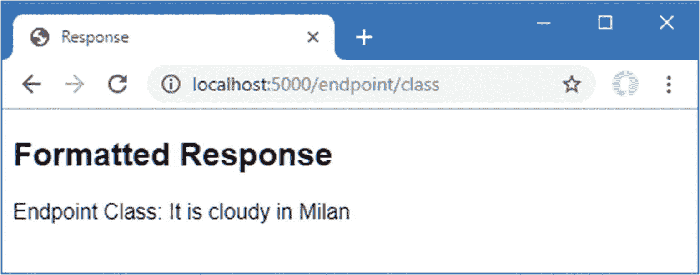

# 十四、使用依赖注入

服务是在中间件组件和端点之间共享的对象。对服务可以提供的特性没有限制，但是它们通常用于应用的多个部分需要的任务，例如日志记录或数据库访问。

ASP.NET Core*依赖注入*特性用于创建和消费服务。这是一个会引起混乱并且很难理解的话题。在这一章中，我描述了依赖注入解决的问题，并解释了 ASP.NET Core 平台是如何支持依赖注入的。表 [14-1](#Tab1) 将依赖注入放在上下文中。

表 14-1。

将依赖注入放在上下文中

<colgroup><col class="tcol1 align-left"> <col class="tcol2 align-left"></colgroup> 
| 

问题

 | 

回答

 |
| --- | --- |
| 这是什么？ | 依赖注入使得创建松散耦合的组件变得容易，这通常意味着组件使用由接口定义的功能，而不需要任何关于正在使用的实现类的第一手知识。 |
| 为什么有用？ | 依赖注入通过更改实现定义应用功能的接口的组件，使更改应用的行为变得更加容易。这也导致了单元测试中更容易隔离的组件。 |
| 如何使用？ | `Startup`类用于指定哪些实现类用于交付应用使用的接口所指定的功能。可以通过`IServiceProvider`接口或者通过声明构造函数或方法参数来显式请求服务。 |
| 有什么陷阱或限制吗？ | 中间件组件和端点的处理方式以及具有不同生命周期的服务的访问方式存在一些差异。 |
| 有其他选择吗？ | 您不必在自己的代码中使用依赖注入，但了解它的工作原理是有帮助的，因为 ASP.NET Core 平台使用它来向开发人员提供功能。 |

表 [14-2](#Tab2) 总结了本章内容。

表 14-2。

章节总结

<colgroup><col class="tcol1 align-left"> <col class="tcol2 align-left"> <col class="tcol3 align-left"></colgroup> 
| 

问题

 | 

解决办法

 | 

列表

 |
| --- | --- | --- |
| 获取`Startup`类中的服务 | 向`Configure`方法添加一个参数 | Thirteen |
| 在中间件组件中获得服务 | 定义构造函数参数 | 14, 33–35 |
| 在端点中获取服务 | 通过上下文对象获取一个`IServiceProvider`对象 | 15–18 |
| 实例化具有构造函数依赖关系的类 | 使用`ActivatorUtilities`类 | 19–21 |
| 定义为每个依赖项实例化的服务 | 定义临时服务 | 22–27 |
| 定义为每个请求实例化的服务 | 定义范围服务 | 28–32 |
| 在`Startup.ConfigureServices`方法中访问服务 | 定义一个`Startup`构造函数参数，并将该值赋给属性 | Thirty-six |
| 管理服务实例化 | 使用服务工厂 | 37, 38 |
| 为一个服务定义多个实现 | 定义多个具有相同范围的服务，并通过`GetServices`方法消费它们 | 39–41 |
| 使用支持泛型类型参数的服务 | 使用未绑定类型的服务 | forty-two |

## 为本章做准备

在本章中，我继续使用第 13 章[中的平台项目。新的课程需要为本章做准备。首先创建`Platform/Services`文件夹，并向其中添加一个名为`IResponseFormatter.cs`的类文件，代码如清单](13.html) [14-1](#PC1) 所示。

Tip

你可以从 [`https://github.com/apress/pro-asp.net-core-3`](https://github.com/apress/pro-asp.net-core-3) 下载本章以及本书其他章节的示例项目。如果在运行示例时遇到问题，请参见第 [1](01.html) 章获取帮助。

```cs
using Microsoft.AspNetCore.Http;
using System.Threading.Tasks;

namespace Platform.Services {
    public interface IResponseFormatter {

        Task Format(HttpContext context, string content);
    }
}

Listing 14-1.The Contents of the IResponseFormatter.cs File in the Services Folder

```

`IResponseFormatter`接口定义了一个接收`HttpContext`对象和`string`的方法。要创建接口的实现，用清单 [14-2](#PC2) 中所示的代码将名为`TextResponseFormatter.cs`的类添加到`Platform/Services`文件夹中。

```cs
using System.Threading.Tasks;
using Microsoft.AspNetCore.Http;

namespace Platform.Services {
    public class TextResponseFormatter : IResponseFormatter {
        private int responseCounter = 0;

        public async Task Format(HttpContext context, string content) {
            await context.Response.
                WriteAsync($"Response {++responseCounter}:\n{content}");
        }
    }
}

Listing 14-2.The Contents of the TextResponseFormatter.cs File in the Services Folder

```

`TextResponseFormatter`类实现了接口，并将内容作为一个简单的字符串写入响应，该字符串带有一个前缀，以便在使用该类时显而易见。

### 创建中间件组件和端点

本章中的一些例子展示了在使用中间件和端点时如何不同地应用特性。将名为`WeatherMiddleware.cs`的文件添加到`Platform`文件夹中，代码如清单 [14-3](#PC3) 所示。

```cs
using Microsoft.AspNetCore.Http;
using System.Threading.Tasks;

namespace Platform {
    public class WeatherMiddleware {
        private RequestDelegate next;

        public WeatherMiddleware(RequestDelegate nextDelegate) {
            next = nextDelegate;
        }

        public async Task Invoke(HttpContext context) {
            if (context.Request.Path == "/middleware/class") {
                await context.Response
                    .WriteAsync("Middleware Class: It is raining in London");
            } else {
                await next(context);
            }
        }
    }
}

Listing 14-3.The Contents of the WeatherMiddleware.cs File in the Platform Folder

```

要创建一个产生类似于中间件组件的结果的端点，用清单 [14-4](#PC4) 所示的代码将一个名为`WeatherEndpoint.cs`的文件添加到`Platform`文件夹中。

```cs
using Microsoft.AspNetCore.Http;
using System.Threading.Tasks;

namespace Platform {
    public class WeatherEndpoint {

        public static async Task Endpoint(HttpContext context) {
            await context.Response
                .WriteAsync("Endpoint Class: It is cloudy in Milan");
        }
    }
}

Listing 14-4.The Contents of the WeatherEndpoint.cs File in the Platform Folder

```

### 配置请求管道

用清单 [14-5](#PC5) 中显示的内容替换`Startup.cs`文件的内容。上一节定义的类与 lambda 函数一起应用，产生类似的结果。

```cs
using Microsoft.AspNetCore.Builder;
using Microsoft.AspNetCore.Hosting;
using Microsoft.AspNetCore.Http;
using Microsoft.Extensions.DependencyInjection;
using Microsoft.AspNetCore.Routing;
using Platform.Services;

namespace Platform {
    public class Startup {

        public void ConfigureServices(IServiceCollection services) {
        }

        public void Configure(IApplicationBuilder app, IWebHostEnvironment env) {
            app.UseDeveloperExceptionPage();
            app.UseRouting();
            app.UseMiddleware<WeatherMiddleware>();

            IResponseFormatter formatter = new TextResponseFormatter();
            app.Use(async (context, next) => {
                if (context.Request.Path == "/middleware/function") {
                    await formatter.Format(context,
                        "Middleware Function: It is snowing in Chicago");
                } else {
                    await next();
                }
            });

            app.UseEndpoints(endpoints => {

                endpoints.MapGet("/endpoint/class", WeatherEndpoint.Endpoint);

                endpoints.MapGet("/endpoint/function", async context => {
                    await context.Response
                        .WriteAsync("Endpoint Function: It is sunny in LA");
                });
            });
        }
    }
}

Listing 14-5.Replacing the Contents of the Startup.cs File in the Platform Folder

```

通过从调试菜单中选择启动而不调试或运行而不调试来启动应用，或者通过打开新的 PowerShell 命令提示符，导航到`Platform`项目文件夹(包含`Platform.csproj`文件，并运行清单 [14-6](#PC6) 中所示的命令。

```cs
dotnet run

Listing 14-6.Starting the ASP.NET Core Runtime

```

用浏览器请求`http://localhost:5000/middleware/function`，会看到如图 [14-1](#Fig1) 所示的响应。每次重新加载浏览器时，响应中显示的计数器都会增加。


图 14-1。

运行示例应用

## 理解服务位置和紧耦合

要理解依赖注入，重要的是从它解决的两个问题开始。在接下来的部分中，我将描述依赖注入解决的两个问题。

Taking a View on Dependency Injection

依赖注入是读者联系我最多的话题之一。大约一半的电子邮件抱怨我在“强迫”他们接受 DI。奇怪的是，另一半是抱怨我没有足够强烈地强调 DI 的好处，其他读者可能没有意识到它有多么有用。

依赖注入可能是一个很难理解的话题，它的价值是有争议的。DI 可能是一个有用的工具，但是不是每个人都喜欢它——或者需要它。

如果您不进行单元测试，或者如果您正在进行一个小型的、独立的和稳定的项目，那么 DI 提供的好处是有限的。理解 DI 是如何工作的仍然是有帮助的，因为 DI 被用于访问在前面章节中描述的一些重要的 ASP.NET Core 特性，但是你并不总是需要在你编写的定制类中包含 DI。创建共享特性还有其他方法——其中两种我将在下面的章节中介绍——如果您不喜欢 DI，使用这些方法是完全可以接受的。

我在自己的应用中依赖于 DI，因为我发现项目经常朝着意想不到的方向发展，能够轻松地用新的实现替换一个组件可以为我节省大量繁琐且容易出错的更改。我宁愿在项目开始时付出一些努力，而不是在后来做一系列复杂的编辑。

但是我并不武断依赖注入，你也不应该如此。依赖注入解决了一个并不是每个项目都会出现的问题，只有你才能决定你的项目是否需要依赖注入。

### 理解服务定位问题

大多数项目都有需要在应用的不同部分使用的特性，这些特性被称为*服务*。常见的例子包括日志工具和配置设置，但可以扩展到任何共享的特性，包括清单 [14-2](#PC2) 中定义的由一个中间件组件使用的`TextResponseFormatter`类。

每个`TextResponseFormatter`对象都维护一个计数器，该计数器包含在发送给浏览器的响应中，如果我想将同一个计数器合并到其他端点生成的响应中，我需要有一种方法使单个`TextResponseFormatter`对象可用，以便在生成响应的每个点都能容易地找到和使用它。

有许多方法可以使服务可定位，但是除了本章的主题之外，还有两种主要的方法。第一种方法是创建一个对象，并将其作为构造函数或方法参数传递给应用中需要它的部分。另一种方法是向服务类添加一个静态属性，提供对共享实例的直接访问，如清单 [14-7](#PC7) 所示。这被称为*单例模式*，在依赖注入广泛使用之前，这是一种常见的方法。

```cs
using System.Threading.Tasks;
using Microsoft.AspNetCore.Http;

namespace Platform.Services {
    public class TextResponseFormatter : IResponseFormatter {
        private int responseCounter = 0;
        private static TextResponseFormatter shared;

        public async Task Format(HttpContext context, string content) {
            await context.Response.
                WriteAsync($"Response {++responseCounter}:\n{content}");
        }

        public static TextResponseFormatter Singleton {
            get {
                if (shared == null) {
                    shared = new TextResponseFormatter();
                }
                return shared;
            }
        }
    }
}

Listing 14-7.Creating a Singleton in the TextResponseFormatter.cs File in the Services Folder

```

这是单例模式的一个基本实现，还有许多变体更加关注诸如安全并发访问之类的问题。本章重要的是清单 [14-7](#PC7) 中的变化依赖于`TextResponseFormatter`服务的消费者通过静态`Singleton`属性获得一个共享对象，如清单 [14-8](#PC8) 所示。

```cs
using Microsoft.AspNetCore.Builder;
using Microsoft.AspNetCore.Hosting;
using Microsoft.AspNetCore.Http;
using Microsoft.Extensions.DependencyInjection;
using Microsoft.AspNetCore.Routing;
using Platform.Services;

namespace Platform {
    public class Startup {

        public void ConfigureServices(IServiceCollection services) {
        }

        public void Configure(IApplicationBuilder app, IWebHostEnvironment env) {
            app.UseDeveloperExceptionPage();
            app.UseRouting();
            app.UseMiddleware<WeatherMiddleware>();

            app.Use(async (context, next) => {
                if (context.Request.Path == "/middleware/function") {
                    await TextResponseFormatter.Singleton.Format(context,
                        "Middleware Function: It is snowing in Chicago");
                } else {
                    await next();
                }
            });

            app.UseEndpoints(endpoints => {

                endpoints.MapGet("/endpoint/class", WeatherEndpoint.Endpoint);

                endpoints.MapGet("/endpoint/function", async context => {
                    await TextResponseFormatter.Singleton.Format(context,
                        "Endpoint Function: It is sunny in LA");
                });
            });
        }
    }
}

Listing 14-8.Using a Service in the Startup.cs File in the Platform Folder

```

singleton 模式允许我共享一个单独的`TextResponseFormatter`,因此它被一个中间件组件和一个端点使用，结果是一个单独的计数器随着对两个不同 URL 的请求而增加。要查看单例模式的效果，重启 ASP.NET Core 并请求`http://localhost:5000/middleware/function`和`http://localhost:5000/endpoint/function`URL。为两个 URL 更新一个计数器，如图 [14-2](#Fig2) 所示。


图 14-2。

实现单例模式来创建共享服务

单例模式易于理解和使用，但是服务如何定位的知识在整个应用中传播，每个服务类和每个服务消费者都需要理解如何访问共享对象。随着新服务的创建，这会导致单例模式的变化，并在代码中产生许多点，当有变化时，这些点必须更新。这种模式也可能是僵化的，不允许在如何管理服务方面有任何灵活性，因为每个消费者总是共享一个服务对象。

### 理解紧耦合组件问题

虽然我在清单 [14-1](#PC1) 中定义了一个接口，但是我使用单例模式的方式意味着消费者总是知道他们正在使用的实现类，因为这个类的静态属性被用来获取共享对象。如果我想切换到`IResponseFormatter`接口的不同实现，我必须定位服务的每一次使用，并用新的实现类替换现有的实现类。也有解决这个问题的模式，比如*类型代理*模式，其中一个类通过它们的接口提供对单例对象的访问。将名为`TypeBroker.cs`的类文件添加到`Platform/Services`文件夹中，并使用它来定义清单 [14-9](#PC9) 中所示的代码。

```cs
namespace Platform.Services {
    public static class TypeBroker {
        private static IResponseFormatter formatter = new TextResponseFormatter();

        public static IResponseFormatter Formatter => formatter;
    }
}

Listing 14-9.The Contents of the TypeBroker.cs File in the Services Folder

```

`Formatter`属性提供对实现`IResponseFormatter`接口的共享服务对象的访问。服务的消费者需要知道`TypeBroker`类负责选择将要使用的实现，但是这种模式意味着服务消费者可以通过接口而不是具体的类工作，如清单 [14-10](#PC10) 所示。

```cs
using Microsoft.AspNetCore.Builder;
using Microsoft.AspNetCore.Hosting;
using Microsoft.AspNetCore.Http;
using Microsoft.Extensions.DependencyInjection;
using Microsoft.AspNetCore.Routing;
using Platform.Services;

namespace Platform {
    public class Startup {

        public void ConfigureServices(IServiceCollection services) {
        }

        public void Configure(IApplicationBuilder app, IWebHostEnvironment env) {
            app.UseDeveloperExceptionPage();
            app.UseRouting();
            app.UseMiddleware<WeatherMiddleware>();

            app.Use(async (context, next) => {
                if (context.Request.Path == "/middleware/function") {
                    await TypeBroker.Formatter.Format(context,
                        "Middleware Function: It is snowing in Chicago");
                } else {
                    await next();
                }
            });

            app.UseEndpoints(endpoints => {

                endpoints.MapGet("/endpoint/class", WeatherEndpoint.Endpoint);

                endpoints.MapGet("/endpoint/function", async context => {
                    await TypeBroker.Formatter.Format(context,
                        "Endpoint Function: It is sunny in LA");
                });
            });
        }
    }
}

Listing 14-10.Using a TypeBroker in the Startup.cs File in the Platform Folder

```

这种方法只需修改`TypeBroker`类就可以轻松切换到不同的实现类，并防止服务消费者创建对特定实现的依赖。这也意味着服务类可以专注于它们提供的功能，而不必处理这些功能将如何定位。为了演示，用清单 [14-11](#PC11) 中所示的代码将一个名为`HtmlResponseFormatter.cs`的类文件添加到`Platform/Services`文件夹中。

```cs
using System.Threading.Tasks;
using Microsoft.AspNetCore.Http;

namespace Platform.Services {
    public class HtmlResponseFormatter : IResponseFormatter {

        public async Task Format(HttpContext context, string content) {
            context.Response.ContentType = "text/html";
            await context.Response.WriteAsync($@"
                <!DOCTYPE html>
                <html lang=""en"">
                <head><title>Response</title></head>
                <body>
                    <h2>Formatted Response</h2>
                    <span>{content}</span>
                </body>
                </html>");
        }
    }
}

Listing 14-11.The Contents of the HtmlResponseFormatter.cs File in the Services Folder

```

这个`IResponseFormatter`的实现设置了`HttpResponse`对象的`ContentType`属性，并将内容插入到 HTML 模板字符串中。要使用新的格式化程序类，我只需要改变`TypeBroker`，如清单 [14-12](#PC12) 所示。

```cs
namespace Platform.Services {
    public static class TypeBroker {
        private static IResponseFormatter formatter = new HtmlResponseFormatter();

        public static IResponseFormatter Formatter => formatter;
    }
}

Listing 14-12.Changing Implementation in the TypeBroker.cs File in the Platform/Services Folder

```

为了确保新的格式化程序工作，重启 ASP.NET Core 并请求`http://localhost:5000/endpoint/function`，这将产生如图 [14-3](#Fig3) 所示的结果。


图 14-3。

使用不同的服务实现类

## 使用依赖注入

依赖注入提供了一种替代的方法来提供服务，这些服务整理了单例模式和类型代理模式中出现的粗糙边缘，并且它与其他 ASP.NET Core 特性集成在一起。清单 [14-13](#PC13) 展示了使用 ASP.NET Core 依赖注入来替换上一节中的类型代理。

```cs
using Microsoft.AspNetCore.Builder;
using Microsoft.AspNetCore.Hosting;
using Microsoft.AspNetCore.Http;
using Microsoft.Extensions.DependencyInjection;
using Microsoft.AspNetCore.Routing;
using Platform.Services;

namespace Platform {
    public class Startup {

        public void ConfigureServices(IServiceCollection services) {
            services.AddSingleton<IResponseFormatter, HtmlResponseFormatter>();
        }

        public void Configure(IApplicationBuilder app, IWebHostEnvironment env,
                IResponseFormatter formatter) {

            app.UseDeveloperExceptionPage();
            app.UseRouting();
            app.UseMiddleware<WeatherMiddleware>();

            app.Use(async (context, next) => {
                if (context.Request.Path == "/middleware/function") {
                    await formatter.Format(context,
                        "Middleware Function: It is snowing in Chicago");
                } else {
                    await next();
                }
            });

            app.UseEndpoints(endpoints => {

                endpoints.MapGet("/endpoint/class", WeatherEndpoint.Endpoint);

                endpoints.MapGet("/endpoint/function", async context => {
                    await formatter.Format(context,
                        "Endpoint Function: It is sunny in LA");
                });
            });
        }
    }
}

Listing 14-13.Using Dependency Injection in the Startup.cs File in the Platform Folder

```

服务注册在`Startup`类的`ConfigureServices`方法中，使用`IServiceCollection`参数上的扩展方法。在清单 [14-13](#PC13) 中，我使用了一个扩展方法来为`IResponseFormatter`接口创建一个服务。

```cs
...
public void ConfigureServices(IServiceCollection services) {
    services.AddSingleton<IResponseFormatter, HtmlResponseFormatter>();
}
...

```

`AddSingleton`方法是服务可用的扩展方法之一，它告诉 ASP.NET Core 应该使用单个对象来满足服务需求(其他扩展方法在“使用服务生命周期”一节中有描述)。接口和实现类被指定为泛型类型参数。为了消费服务，我向`Configure`方法添加了一个参数。

```cs
...
public void Configure(IApplicationBuilder app, IWebHostEnvironment env,
    IResponseFormatter formatter) {
...

```

新参数声明了对`IResponseFormatter`接口的依赖，方法被称为依赖于接口。在调用`Configure`方法之前，检查其参数，检测依赖性，并检查应用的服务以确定是否有可能解决依赖性。`ConfigureServices`方法中的语句告诉依赖注入系统，`IResponseFormatter`接口上的依赖可以用`HtmlResponseFormatter`对象来解决。创建对象并将其用作调用方法的参数。因为解析依赖关系的对象是从使用它的类或函数外部提供的，所以说它是被注入的，这也是这个过程被称为*依赖注入*的原因。

### 使用中间件类中的服务

在`ConfigureServices`方法中定义服务并在`Configure`方法中消费它可能看起来并不令人印象深刻，但是一旦服务被定义，它几乎可以在 ASP.NET Core 应用中的任何地方使用。清单 [14-14](#PC16) 在本章开始定义的中间件类中声明了对`IResponseFormatter`接口的依赖。

```cs
using Microsoft.AspNetCore.Http;
using System.Threading.Tasks;
using Platform.Services;

namespace Platform {
    public class WeatherMiddleware {
        private RequestDelegate next;
        private IResponseFormatter formatter;

        public WeatherMiddleware(RequestDelegate nextDelegate,
                IResponseFormatter respFormatter) {
            next = nextDelegate;
            formatter = respFormatter;
        }

        public async Task Invoke(HttpContext context) {
            if (context.Request.Path == "/middleware/class") {
                await formatter.Format(context,
                    "Middleware Class: It is raining in London");
            } else {
                await next(context);
            }
        }
    }
}

Listing 14-14.Declaring a Dependency in the WeatherMiddleware.cs File in the Services Folder

```

为了声明依赖关系，我添加了一个构造函数参数。要查看结果，重启 ASP.NET Core 并请求`http://localhost:5000/middleware/class` URL，这将产生如图 [14-4](#Fig4) 所示的响应。


图 14-4。

在中间件类中声明依赖关系

当建立请求管道时，ASP.NET Core 平台到达添加了作为组件的`WeatherMiddleware`类的`Configure`方法的语句。

```cs
...
app.UseMiddleware<WeatherMiddleware>();
...

```

平台知道它需要创建一个`WeatherMiddleware`类的实例，并检查构造函数。检测对`IResponseFormatter`接口的依赖性，检查服务以查看依赖性是否可以解决，并且在调用构造函数时使用共享服务对象。

关于这个例子，有两个要点需要理解。第一个是`WeatherMiddleware`不知道哪个实现类将被用来解析它对`IResponseFormatter`接口的依赖——它只知道它将通过其构造函数参数接收一个符合该接口的对象。第二，`WeatherMiddleware`类不知道依赖性是如何解决的——它只是声明了一个构造函数参数。这是一个比我在本章前面的 singleton 和 type broker 模式的实现更优雅的方法，我可以通过改变在`Startup.ConfigureServices`方法中使用的泛型类型参数来改变用于解析服务的实现类。

### 在端点中使用服务

在`WeatherEndpoint`类中情况更复杂，它是静态的，没有可以声明依赖关系的构造函数。有几种方法可以解决端点类的依赖关系，下面的小节将对此进行描述。

#### 从 HttpContext 对象获取服务

服务可以通过在请求被路由到端点时接收的`HttpContext`对象来访问，如清单 [14-15](#PC18) 所示。

```cs
using Microsoft.AspNetCore.Http;
using System.Threading.Tasks;
using Platform.Services;
using Microsoft.Extensions.DependencyInjection;

namespace Platform {
    public class WeatherEndpoint {

        public static async Task Endpoint(HttpContext context) {
            IResponseFormatter formatter =
                context.RequestServices.GetRequiredService<IResponseFormatter>();
            await formatter.Format(context, "Endpoint Class: It is cloudy in Milan");
        }
    }
}

Listing 14-15.Using a Service in the WeatherEndpoint.cs File in the Platform Folder

```

`HttpContext.RequestServices`属性返回一个实现`IServiceProvider`接口的对象，该接口提供对已经在应用的`Start.ConfigureServices`方法中配置的服务的访问。清单 [14-15](#PC18) 中使用的`Microsoft.Extensions.DependencyInjection`名称空间包含了`IServiceProvider`接口的扩展方法，这些方法允许获得单独的服务，如表 [14-3](#Tab3) 中所述。

表 14-3。

获取服务的 IServiceProvider 扩展方法

<colgroup><col class="tcol1 align-left"> <col class="tcol2 align-left"></colgroup> 
| 

名字

 | 

描述

 |
| --- | --- |
| `GetService<T>()` | 该方法返回由泛型类型参数指定的类型的服务，如果没有定义这样的服务，则返回`null`。 |
| `GetService(type)` | 该方法返回指定类型的服务，如果没有定义这样的服务，则返回`null`。 |
| `GetRequiredService<T>()` | 此方法返回由泛型类型参数指定的服务，如果服务不可用，则引发异常。 |
| `GetRequiredService(type)` | 该方法返回指定类型的服务，如果服务不可用，则抛出异常。 |

当调用`Endpoint`方法时，`GetRequiredService<T>`方法用于获得一个`IResponseFormatter`对象，该对象用于格式化响应。要查看效果，重启 ASP.NET Core 并使用浏览器请求`http://localhost:5000/endpoint/class`，这将产生如图 [14-5](#Fig5) 所示的格式化响应。



图 14-5。

在端点类中使用服务

#### 使用适配器功能

使用`HttpContext.RequestServices`方法的缺点是必须为路由到端点的每个请求解析服务。正如您将在本章后面了解到的，对于某些服务来说，这是必需的，因为它们提供了特定于单个请求或响应的功能。这不是`IResponseFormatter`服务的情况，在这里一个对象可以用来格式化多个响应。

更好的方法是在创建端点路由时获取服务，而不是针对每个请求。清单 [14-16](#PC19) 更改了静态`Endpoint`方法，这样它声明了对`IResponseFormatter`接口的依赖。

```cs
using Microsoft.AspNetCore.Http;
using System.Threading.Tasks;
using Platform.Services;

namespace Platform {
    public class WeatherEndpoint {

        public static async Task Endpoint(HttpContext context,
                IResponseFormatter formatter) {
            await formatter.Format(context, "Endpoint Class: It is cloudy in Milan");
        }
    }
}

Listing 14-16.Defining an Adapter Function in the WeatherEndpoint.cs File in the Platform Folder

```

将名为`EndPointExtensions.cs`的文件添加到`Platform/Services`文件夹中，并添加清单 [14-17](#PC20) 中所示的代码。

```cs
using Microsoft.AspNetCore.Routing;
using Microsoft.Extensions.DependencyInjection;
using Platform.Services;

namespace Microsoft.AspNetCore.Builder {

    public static class EndpointExtensions {
        public static void MapWeather(this IEndpointRouteBuilder app, string path) {
            IResponseFormatter formatter =
                app.ServiceProvider.GetService<IResponseFormatter>();
            app.MapGet(path, context => Platform.WeatherEndpoint
                .Endpoint(context, formatter));
        }
    }
}

Listing 14-17.The Contents of the EndpointExtensions.cs File in the Services Folder

```

新文件为`IEndpointRouterBuilder`接口创建了一个扩展方法，用于在`Startup`类中创建路由。该接口定义了一个`ServiceProvider`属性，该属性返回一个`IServiceProvider`对象，通过该对象可以获得服务。扩展方法获得服务并使用`MapGet`方法注册一个`RequestDelegate`，该方法将`HttpContext`对象和`IResponseFormatter`对象传递给`WeatherEndpoint.Endpoint`方法。在清单 [14-18](#PC21) 中，我使用了扩展方法来为端点创建路由。

```cs
...
app.UseEndpoints(endpoints => {

    //endpoints.MapGet("/endpoint/class", WeatherEndpoint.Endpoint);
    endpoints.MapWeather("/endpoint/class");

    endpoints.MapGet("/endpoint/function", async context => {
        await formatter.Format(context,
            "Endpoint Function: It is sunny in LA");
    });
});
...

Listing 14-18.Creating a Route in the Startup.cs File in the Platform Folder

```

`MapWeather`扩展方法设置路由，并围绕端点类创建适配器。要查看结果，重启 ASP.NET Core 并请求`http://localhost:5000/endpoint/class` URL，这将产生与前一示例相同的结果，如图 [14-5](#Fig5) 所示。

#### 使用激活实用程序类

我在第 13 章[中为端点类使用了静态方法，因为这使得它们在创建路由时更容易使用。但是对于需要服务的端点，使用可实例化的类通常会更容易，因为它允许更通用的方法来处理服务。清单](13.html) [14-19](#PC22) 用构造函数修改了端点，并从`Endpoint`方法中删除了`static`关键字。

```cs
using Microsoft.AspNetCore.Http;
using System.Threading.Tasks;
using Platform.Services;

namespace Platform {
    public class WeatherEndpoint {
        private IResponseFormatter formatter;

        public WeatherEndpoint(IResponseFormatter responseFormatter) {
            formatter = responseFormatter;
        }

        public async Task Endpoint(HttpContext context) {
            await formatter.Format(context, "Endpoint Class: It is cloudy in Milan");
        }
    }
}

Listing 14-19.Revising the Endpoint in the WeatherEndpoint.cs File in the Platform Folder

```

在 ASP.NET Core 应用中，依赖注入最常见的用途是在类构造函数中。通过方法注入，例如为中间件类执行的方法，是一个复杂的重新创建过程，但是有一些有用的内置工具负责检查构造函数并使用服务解决依赖关系，如清单 [14-20](#PC23) 所示。

```cs
using Microsoft.AspNetCore.Http;
using Microsoft.AspNetCore.Routing;
using Microsoft.Extensions.DependencyInjection;
using Platform.Services;
using System.Reflection;
using System.Threading.Tasks;

namespace Microsoft.AspNetCore.Builder {

    public static class EndpointExtensions {

        public static void MapEndpoint<T> (this IEndpointRouteBuilder app,
                string path, string methodName = "Endpoint") {

            MethodInfo methodInfo = typeof(T).GetMethod(methodName);
            if (methodInfo == null || methodInfo.ReturnType != typeof(Task)) {
                throw new System.Exception("Method cannot be used");
            }
            T endpointInstance =
                ActivatorUtilities.CreateInstance<T>(app.ServiceProvider);
            app.MapGet(path,  (RequestDelegate)methodInfo
                .CreateDelegate(typeof(RequestDelegate), endpointInstance));
        }
    }
}

Listing 14-20.Resolving Dependencies in the EndpointExtensions.cs File in the Services Folder

```

扩展方法接受一个泛型类型参数，该参数指定将要使用的端点类。其他参数是将用于创建路由的路径和处理请求的端点类方法的名称。

创建 endpoint 类的新实例，并使用指定方法的委托来创建路由。就像任何使用。NET 反射，清单 [14-20](#PC23) 中的扩展方法可能很难读懂，但是本章的关键语句是:

```cs
...
T endpointInstance = ActivatorUtilities.CreateInstance<T>(app.ServiceProvider);
...

```

在`Microsoft.Extensions.DependencyInjection`名称空间中定义的`ActivatorUtilities`类提供了实例化类的方法，这些类通过它们的构造函数声明了依赖关系。表 [14-4](#Tab4) 显示了最有用的`ActivatorUtilities`方法。

表 14-4。

ActivatorUtilities 方法

<colgroup><col class="tcol1 align-left"> <col class="tcol2 align-left"></colgroup> 
| 

名字

 | 

描述

 |
| --- | --- |
| `CreateInstance<T>(services, args)` | 此方法创建由类型参数指定的类的新实例，使用服务和附加(可选)参数解析依赖关系。 |
| `CreateInstance(services, type, args)` | 此方法创建由参数指定的类的新实例，使用服务和附加(可选)参数解析依赖项。 |
| `GetServiceOrCreateInstance<T>(services, args)` | 此方法返回指定类型的服务(如果有)，如果没有服务，则创建新的实例。 |
| `GetServiceOrCreateInstance(services, type, args)` | 此方法返回指定类型的服务(如果有)，如果没有服务，则创建新的实例。 |

这两种方法都使用服务通过一个`IServiceProvider`对象和一个可选的参数数组来解析构造函数的依赖关系，这些参数用于不是服务的依赖关系。这些方法使得将依赖注入应用到定制类变得容易，并且使用`CreateInstance`方法会产生一个扩展方法，该方法可以使用消费服务的端点类来创建路由。清单 [14-21](#PC25) 使用新的扩展方法创建一条路线。

```cs
...
app.UseEndpoints(endpoints => {

    endpoints.MapEndpoint<WeatherEndpoint>("/endpoint/class");

    endpoints.MapGet("/endpoint/function", async context => {
        await formatter.Format(context,
            "Endpoint Function: It is sunny in LA");
    });
});
...

Listing 14-21.Creating a Route Using an Extension Method in the Startup.cs File in the Platform Folder

```

这种类型的扩展方法使得处理端点类变得容易，并且提供了与第 [12](12.html) 章中描述的`UseMiddleware`方法相似的体验。为了确保请求被路由到端点，重启 ASP.NET Core 并请求`http://localhost:5000/endpoint/class` URL，这将产生如图 [14-5](#Fig5) 所示的响应。

## 使用服务生命周期

当我在前一节中创建服务时，我使用了`AddSingleton`扩展方法，如下所示:

```cs
...
public void ConfigureServices(IServiceCollection services) {
    services.AddSingleton<IResponseFormatter, HtmlResponseFormatter>();
}
...

```

`AddSingleton`方法产生一个服务，该服务在第一次用于解析依赖关系时被实例化，然后在每个后续的依赖关系中被重用。这意味着任何对`IResponseFormatter`对象的依赖都将使用同一个`HtmlResponseFormatter`对象来解决。

单件是开始使用服务的好方法，但是有一些问题它们不适合，所以 ASP.NET Core 支持*范围服务*，它为被创建来解决依赖性的对象提供生命周期。表 [14-5](#Tab5) 描述了用于创建服务的一组方法。这些方法有接受类型作为常规参数的版本，如本章后面的“在服务中使用未绑定类型”一节所述。

表 14-5。

创建服务的扩展方法

<colgroup><col class="tcol1 align-left"> <col class="tcol2 align-left"></colgroup> 
| 

名字

 | 

描述

 |
| --- | --- |
| `AddSingleton<T, U>()` | 该方法创建一个类型为`U`的对象，用于解析对类型`T`的所有依赖。 |
| `AddTransient<T, U>()` | 这个方法创建一个类型为`U`的新对象来解析对类型`T`的每个依赖。 |
| `AddScoped<T, U>()` | 这个方法创建了一个类型为`U`的新对象，用于解析单个范围内对`T`的依赖，比如 request。 |

表 [14-5](#Tab5) 中的方法版本有一个单一的类型参数，它允许创建一个服务来解决服务位置问题，而不解决紧耦合问题。你可以在第 24 章[中看到这种服务的例子，在这里我共享一个简单的数据源，它不是通过一个接口来访问的。](24.html)

### 创建临时服务

`AddTransient`方法与`AddSingleton`方法相反，为每个被解析的依赖项创建一个实现类的新实例。为了创建一个服务来演示服务生命周期的使用，将一个名为`GuidService.cs`的文件添加到`Platform/Services`文件夹中，代码如清单 [14-22](#PC27) 所示。

```cs
using System;
using System.Threading.Tasks;
using Microsoft.AspNetCore.Http;

namespace Platform.Services {

    public class GuidService : IResponseFormatter {
        private Guid guid = Guid.NewGuid();

        public async Task Format(HttpContext context, string content) {
            await context.Response.WriteAsync($"Guid: {guid}\n{content}");
        }
    }
}

Listing 14-22.The Contents of the GuidService.cs File in the Services Folder

```

`Guid`结构生成一个唯一的标识符，当使用不同的实例来解析对`IResponseFormatter`接口的依赖时，这个标识符将变得显而易见。在清单 [14-23](#PC28) 中，我已经将创建`IResponseFormatter`服务的语句改为使用`AddTransient`方法和`GuidService`实现类。

```cs
...
public void ConfigureServices(IServiceCollection services) {
    services.AddTransient<IResponseFormatter, GuidService>();
}
...

Listing 14-23.Creating a Transient Service in the Startup.cs File in the Platform Folder

```

如果您重启 ASP.NET Core 并请求`http://localhost:5000/endpoint/class`和`http://localhost:5000/middleware/class`URL，您将收到如图 [14-6](#Fig6) 所示的响应。每个响应都将显示一个不同的 GUID 值，以确认瞬态服务对象已经用于解决端点和中间件组件对`IResponseFormatter`服务的依赖。(GUIDs 的性质意味着您将在您的响应中看到不同的值。重要的是，您不会看到两个响应使用相同的值。)


图 14-6。

使用临时服务

### 避免短暂的服务重用陷阱

前面的例子演示了当创建不同的服务对象时，效果并不像您所期望的那样，您可以通过单击 reload 按钮来看到这一点。响应包含相同的值，而不是看到新的 GUID 值，如图 [14-7](#Fig7) 所示。


图 14-7。

响应中出现相同的 GUID 值

新的服务对象仅在依赖关系被解析时创建，而不是在使用服务时创建。示例应用中的组件和端点只有在应用启动并且调用了`Startup.Configure`方法时才解析它们的依赖关系。每一个都接收一个单独的服务对象，该对象随后被处理的每个请求重用。

为了解决中间件组件的这个问题，服务的依赖可以转移到`Invoke`方法，如清单 [14-24](#PC29) 所示。

```cs
using Microsoft.AspNetCore.Http;
using System.Threading.Tasks;
using Platform.Services;

namespace Platform {
    public class WeatherMiddleware {
        private RequestDelegate next;
        //private IResponseFormatter formatter;

        public WeatherMiddleware(RequestDelegate nextDelegate) {
            next = nextDelegate;
            //formatter = respFormatter;
        }

        public async Task Invoke(HttpContext context, IResponseFormatter formatter) {
            if (context.Request.Path == "/middleware/class") {
                await formatter.Format(context,
                    "Middleware Class: It is raining in London");
            } else {
                await next(context);
            }
        }
    }
}

Listing 14-24.Moving a Dependency in the WeatherMiddleware.cs File in the Platform Folder

```

ASP.NET Core 平台将在每次处理请求时解析由`Invoke`方法声明的依赖关系，这确保了新的瞬态服务对象被创建。

`ActivatorUtilities`类不处理方法依赖的解析，ASP.NET Core 只为中间件组件提供这个特性。对于端点来说，解决这个问题的最简单的方法是在处理每个请求时显式地请求服务，这是我在前面展示如何使用服务时使用的方法。还可以增强扩展方法来代表端点请求服务，如清单 [14-25](#PC30) 所示。

```cs
using Microsoft.AspNetCore.Http;
using Microsoft.AspNetCore.Routing;
using Microsoft.Extensions.DependencyInjection;
using Platform.Services;
using System.Reflection;
using System.Threading.Tasks;
using System.Linq;

namespace Microsoft.AspNetCore.Builder {

    public static class EndpointExtensions {

        public static void MapEndpoint<T>(this IEndpointRouteBuilder app,
                string path, string methodName = "Endpoint") {

            MethodInfo methodInfo = typeof(T).GetMethod(methodName);
            if (methodInfo == null || methodInfo.ReturnType != typeof(Task)) {
                throw new System.Exception("Method cannot be used");
            }

            T endpointInstance =
                ActivatorUtilities.CreateInstance<T>(app.ServiceProvider);

            ParameterInfo[] methodParams = methodInfo.GetParameters();
            app.MapGet(path, context => (Task)methodInfo.Invoke(endpointInstance,
                methodParams.Select(p => p.ParameterType == typeof(HttpContext)
                ? context
                : app.ServiceProvider.GetService(p.ParameterType)).ToArray()));
        }
    }
}

Listing 14-25.Requesting Services in the EndpointExtensions.cs File in the Services Folder

```

清单 [14-25](#PC30) 中的代码没有 ASP.NET 中间件核心平台所采用的方法高效。由处理请求的方法定义的所有参数都被视为要解析的服务，除了`HttpContext`参数。路由是用一个委托创建的，该委托为每个请求解析服务，并调用处理请求的方法。清单 [14-26](#PC31) 修改了`WeatherEndpoint`类，将对`IResponseFormatter`的依赖转移到`Endpoint`方法，这样每个请求都会收到一个新的服务对象。

```cs
using Microsoft.AspNetCore.Http;
using System.Threading.Tasks;
using Platform.Services;

namespace Platform {
    public class WeatherEndpoint {
        //private IResponseFormatter formatter;

        //public WeatherEndpoint(IResponseFormatter responseFormatter) {
        //    formatter = responseFormatter;
        //}

        public async Task Endpoint(HttpContext context,
                IResponseFormatter formatter) {
            await formatter.Format(context, "Endpoint Class: It is cloudy in Milan");
        }
    }
}

Listing 14-26.Moving the Dependency in the WeatherEndpoint.cs File in the Platform Folder

```

清单 [14-24](#PC29) 到清单 [14-26](#PC31) 的变化确保了瞬态服务为每个请求解析，这意味着创建了一个新的`GuidService`对象，并且每个响应包含一个惟一的 ID。

对于定义为 lambda 表达式的中间件和端点，必须在处理每个请求时获得服务，因为由`Configure`方法参数声明的依赖关系只在配置请求管道时解析一次。清单 [14-27](#PC32) 显示了获得一个新服务对象所需的更改。

```cs
using Microsoft.AspNetCore.Builder;
using Microsoft.AspNetCore.Hosting;
using Microsoft.AspNetCore.Http;
using Microsoft.Extensions.DependencyInjection;
using Microsoft.AspNetCore.Routing;
using Platform.Services;

namespace Platform {
    public class Startup {

        public void ConfigureServices(IServiceCollection services) {
            services.AddTransient<IResponseFormatter, GuidService>();
        }

        public void Configure(IApplicationBuilder app, IWebHostEnvironment env) {
            app.UseDeveloperExceptionPage();
            app.UseRouting();
            app.UseMiddleware<WeatherMiddleware>();

            app.Use(async (context, next) => {
                if (context.Request.Path == "/middleware/function") {
                    IResponseFormatter formatter
                        = app.ApplicationServices.GetService<IResponseFormatter>();
                    await formatter.Format(context,
                        "Middleware Function: It is snowing in Chicago");
                } else {
                    await next();
                }
            });

            app.UseEndpoints(endpoints => {

                endpoints.MapEndpoint<WeatherEndpoint>("/endpoint/class");

                endpoints.MapGet("/endpoint/function", async context => {
                    IResponseFormatter formatter
                        = app.ApplicationServices.GetService<IResponseFormatter>();
                    await formatter.Format(context,
                        "Endpoint Function: It is sunny in LA");
                });
            });
        }
    }
}

Listing 14-27.Using a Transient Service in the Startup.cs File in the Platform Folder

```

重启 ASP.NET Core，导航到应用支持的四个 URL 中的任意一个(`http://localhost:5000/middleware/class`、`/middleware/function`、`/endpoint/class`和`/endpoint/function`，点击浏览器的重新加载按钮。每次重新加载时，一个新的请求被发送到 ASP.NET Core，处理该请求的组件或端点接收一个新的服务对象，这样每个响应中显示一个不同的 GUID，如图 [14-8](#Fig8) 所示。


图 14-8。

使用临时服务

### 使用作用域服务

作用域服务在单例服务和瞬态服务之间取得了平衡。在一个范围内，依赖关系是用同一个对象来解析的。每个 HTTP 请求都有一个新的作用域，这意味着一个服务对象将由处理该请求的所有组件共享。为了准备一个限定范围的服务，清单 [14-28](#PC33) 修改了`WeatherMiddleware`类来声明同一个服务的三个依赖项。

```cs
using Microsoft.AspNetCore.Http;
using System.Threading.Tasks;
using Platform.Services;

namespace Platform {
    public class WeatherMiddleware {
        private RequestDelegate next;

        public WeatherMiddleware(RequestDelegate nextDelegate) {
            next = nextDelegate;
        }

        public async Task Invoke(HttpContext context, IResponseFormatter formatter1,
                IResponseFormatter formatter2, IResponseFormatter formatter3) {
            if (context.Request.Path == "/middleware/class") {
                await formatter1.Format(context, string.Empty);
                await formatter2.Format(context, string.Empty);
                await formatter3.Format(context, string.Empty);
            } else {
                await next(context);
            }
        }
    }
}

Listing 14-28.Adding Dependencies in the WeatherMiddleware.cs File in the Platform Folder

```

在实际项目中并不需要在同一个服务上声明几个依赖项，但是对于这个例子来说这是很有用的，因为每个依赖项都是独立解析的。因为`IResponseFormatter`服务是用`AddTransient`方法创建的，所以每个依赖项都用不同的对象来解析。重启 ASP.NET Core 并请求`http://localhost:5000/middleware/class`，你会看到写入响应的三条消息中的每一条都使用了不同的 GUID，如图 [14-9](#Fig9) 所示。当您重新加载浏览器时，会显示一组新的三个 GUIDs。


图 14-9。

解决对临时服务的依赖

清单 [14-29](#PC34) 将`IResponseFormatter`服务更改为使用带有`AddScoped`方法的作用域生命周期。

Tip

您可以通过`IServiceProvider`接口的`CreateScope`扩展方法创建自己的作用域。结果是一个与新范围相关联的`IServiceProvider`,它将拥有自己的范围服务实现对象。

```cs
...
public void ConfigureServices(IServiceCollection services) {
    services.AddScoped<IResponseFormatter, GuidService>();
}
...

Listing 14-29.Using a Scoped Service in the Startup.cs File in the Platform Folder

```

重启 ASP.NET Core，再次请求`http://localhost:5000/middleware/class`，你会看到同一个 GUID 被用来解析中间件组件声明的所有三个依赖关系，如图 [14-10](#Fig10) 所示。当浏览器重新加载时，发送到 ASP.NET Core 的 HTTP 请求创建一个新的范围和一个新的服务对象。


图 14-10

使用限定范围的服务

#### 避免作用域服务验证陷阱

服务消费者不知道为单一服务和瞬态服务选择的生命周期:他们声明一个依赖项或请求一个服务并获得他们需要的对象。

作用域服务只能在作用域内使用。为收到的每个请求自动创建一个新的范围。在作用域之外请求作用域服务会导致异常。要查看问题，请求`http://localhost:5000/endpoint/class`，这将生成如图 [14-11](#Fig11) 所示的异常响应。


图 14-11。

请求限定范围的服务

配置端点的扩展方法通过从路由中间件获得的`IServiceProvider`对象解析服务，如下所示:

```cs
...
app.MapGet(path, context => (Task)methodInfo.Invoke(endpointInstance,
    methodParams.Select(p => p.ParameterType == typeof(HttpContext)
    ? context : app.ServiceProvider.GetService(p.ParameterType)).ToArray()));
...

```

这被称为*根提供者*，它不提供对作用域服务的访问，以防止意外使用不打算在作用域之外使用的服务。

#### 通过上下文对象访问范围服务

`HttpContext`类定义了一个`RequestServices`属性，该属性返回一个`IServiceProvider`对象，该对象允许访问作用域服务以及单例服务和瞬态服务。这非常符合作用域服务的最常见用法，即对每个 HTTP 请求使用单个服务对象。清单 [14-30](#PC36) 修改了端点扩展方法，以便使用通过`HttpContext`提供的服务来解决依赖性。

```cs
using Microsoft.AspNetCore.Http;
using Microsoft.AspNetCore.Routing;
using Microsoft.Extensions.DependencyInjection;
using Platform.Services;
using System.Reflection;
using System.Threading.Tasks;
using System.Linq;

namespace Microsoft.AspNetCore.Builder {

    public static class EndpointExtensions {

        public static void MapEndpoint<T>(this IEndpointRouteBuilder app,
                string path, string methodName = "Endpoint") {

            MethodInfo methodInfo = typeof(T).GetMethod(methodName);
            if (methodInfo == null || methodInfo.ReturnType != typeof(Task)) {
                throw new System.Exception("Method cannot be used");
            }

            T endpointInstance =
                ActivatorUtilities.CreateInstance<T>(app.ServiceProvider);

            ParameterInfo[] methodParams = methodInfo.GetParameters();
            app.MapGet(path, context => (Task)methodInfo.Invoke(endpointInstance,
                methodParams.Select(p => p.ParameterType == typeof(HttpContext)
                ? context
                : context.RequestServices.GetService(p.ParameterType)).ToArray()));
        }
    }
}

Listing 14-30.Using a Scoped Service in the EndpointExtensions.cs File in the Services Folder

```

只有由处理请求的方法声明的依赖关系才使用`HttpContext.RequestServices`属性进行解析。由端点类构造函数声明的服务仍然使用`IEndpointRouteBuilder.ServiceProvider`属性进行解析，这确保端点不会不适当地使用范围服务。

##### 为每个请求创建新的处理程序

扩展方法的问题在于，它要求端点类知道它们所依赖的服务的生命周期。`WeatherEndpoint`类依赖于`IResponseFormatter`服务，并且必须知道依赖关系只能通过`Endpoint`方法而不是构造函数来声明。

为了消除对这种知识的需求，可以创建一个端点类的新实例来处理每个请求，如清单 [14-31](#PC37) 所示，这允许解析构造函数和方法依赖，而不需要知道哪些服务是限定范围的。

```cs
using Microsoft.AspNetCore.Http;
using Microsoft.AspNetCore.Routing;
using Microsoft.Extensions.DependencyInjection;
using Platform.Services;
using System.Reflection;
using System.Threading.Tasks;
using System.Linq;

namespace Microsoft.AspNetCore.Builder {

    public static class EndpointExtensions {

        public static void MapEndpoint<T>(this IEndpointRouteBuilder app,
                string path, string methodName = "Endpoint") {

            MethodInfo methodInfo = typeof(T).GetMethod(methodName);
            if (methodInfo == null || methodInfo.ReturnType != typeof(Task)) {
                throw new System.Exception("Method cannot be used");
            }

            ParameterInfo[] methodParams = methodInfo.GetParameters();
            app.MapGet(path, context => {
                T endpointInstance =
                    ActivatorUtilities.CreateInstance<T>(context.RequestServices);
                return (Task)methodInfo.Invoke(endpointInstance,
                    methodParams.Select(p =>
                     p.ParameterType == typeof(HttpContext) ? context :
                     context.RequestServices.GetService(p.ParameterType)).ToArray());
            });
        }
    }
}

Listing 14-31.Instantiating Endpoints in the EndpointExtensions.cs File in the Services Folder

```

这种方法需要端点类的一个新实例来处理每个请求，但它确保不需要了解服务生命周期。

##### 在 Lambda 表达式中使用作用域服务

`HttpContext`类也可以用于定义为 lambda 表达式的中间件组件和端点，如清单 [14-32](#PC38) 所示。

```cs
using Microsoft.AspNetCore.Builder;
using Microsoft.AspNetCore.Hosting;
using Microsoft.AspNetCore.Http;
using Microsoft.Extensions.DependencyInjection;
using Microsoft.AspNetCore.Routing;
using Platform.Services;

namespace Platform {
    public class Startup {

        public void ConfigureServices(IServiceCollection services) {
            services.AddScoped<IResponseFormatter, GuidService>();
        }

        public void Configure(IApplicationBuilder app, IWebHostEnvironment env) {
            app.UseDeveloperExceptionPage();
            app.UseRouting();
            app.UseMiddleware<WeatherMiddleware>();

            app.Use(async (context, next) => {
                if (context.Request.Path == "/middleware/function") {
                    IResponseFormatter formatter
                        = context.RequestServices.GetService<IResponseFormatter>();
                    await formatter.Format(context,
                        "Middleware Function: It is snowing in Chicago");
                } else {
                    await next();
                }
            });

            app.UseEndpoints(endpoints => {

                endpoints.MapEndpoint<WeatherEndpoint>("/endpoint/class");

                endpoints.MapGet("/endpoint/function", async context => {
                    IResponseFormatter formatter
                        = context.RequestServices.GetService<IResponseFormatter>();
                    await formatter.Format(context,
                        "Endpoint Function: It is sunny in LA");
                });
            });
        }
    }
}

Listing 14-32.Using a Scoped Service in the Startup.cs File in the Platform Folder

```

重启 ASP.NET Core 并请求指向 lambda 函数的 URL:`http://localhost:5000/endpoint/function`和`/middleware/function`。作用域服务将被无例外地获得，产生如图 [14-12](#Fig12) 所示的响应。


图 14-12。

在 lambda 函数中使用作用域服务

## 其他依赖注入特性

在接下来的部分中，我将描述使用依赖注入时的一些额外特性。这些并不是所有项目都需要的，但是它们是值得理解的，因为它们提供了依赖注入如何工作的背景，并且在标准特性不是项目所需要的时候会很有帮助。

### 创建依赖关系链

当一个类被实例化以解析服务依赖时，它的构造函数被检查，并且任何对服务的依赖被解析。这允许一个服务声明对另一个服务的依赖，创建一个自动解析的链。为了演示，用清单 [14-33](#PC39) 中所示的代码将名为`TimeStamping.cs`的类文件添加到`Platform/Services`文件夹中。

```cs
using System;

namespace Platform.Services {

    public interface ITimeStamper {
        string TimeStamp { get; }
    }

    public class DefaultTimeStamper : ITimeStamper {

        public string TimeStamp {
            get => DateTime.Now.ToShortTimeString();
        }
    }
}

Listing 14-33.The Contents of the TimeStamping.cs File in the Services Folder

```

类文件定义了一个名为`ITimeStamper`的接口和一个名为`DefaultTimeStamper`的实现类。接下来，用清单 [14-34](#PC40) 所示的代码将一个名为`TimeResponseFormatter.cs`的文件添加到`Platform/Services`文件夹中。

```cs
using System.Threading.Tasks;
using Microsoft.AspNetCore.Http;

namespace Platform.Services {
    public class TimeResponseFormatter : IResponseFormatter {
        private ITimeStamper stamper;

        public TimeResponseFormatter(ITimeStamper timeStamper) {
            stamper = timeStamper;
        }

        public async Task Format(HttpContext context, string content) {
            await context.Response.WriteAsync($"{stamper.TimeStamp}: {content}");
        }
    }
}

Listing 14-34.The Contents of the TimeResponseFormatter.cs File in the Services Folder

```

`TimeResponseFormatter`类是`IResponseFormatter`接口的实现，它用构造函数参数声明了对`ITimeStamper`接口的依赖。清单 [14-35](#PC41) 为`Startup`类的`ConfigureServices`方法中的两个接口定义了服务。

Note

服务不需要和它们的依赖项有相同的生命周期，但是如果你混合生命周期，你可能会有奇怪的结果。生命周期仅在依赖关系被解决时应用，这意味着例如，如果一个作用域服务依赖于一个瞬态服务，那么瞬态对象的行为就好像它被分配了作用域生命周期一样。

```cs
...
public void ConfigureServices(IServiceCollection services) {
    services.AddScoped<IResponseFormatter, TimeResponseFormatter>();
    services.AddScoped<ITimeStamper, DefaultTimeStamper>();
}
...

Listing 14-35.Configuring Services in the Startup.cs File in the Platform Folder

```

当解决了对`IResponseFormatter`服务的依赖时，将检查`TimeResponseFormatter`构造函数，并检测它对`ITimeStamper`服务的依赖。一个`DefaultTimeStamper`对象将被创建并注入到`TimeResponseFormatter`构造函数中，这允许原始的依赖关系被解析。要查看运行中的依赖链，重启 ASP.NET Core 并请求`http://localhost:5000/middleware/function`，您将看到由`TimeResponseFormatter`类产生的响应中包含由`DefaultTimeStamper`类产生的时间戳，如图 [14-13](#Fig13) 所示。


图 14-13。

创建依赖关系链

### 在 ConfigureServices 方法中访问服务

依赖注入特性是在实例化`Startup`类和调用`ConfigureServices`方法之前由`Platform`类设置的。在设置过程中，会创建 ASP.NET Core 平台所需的服务，以及提供给应用的基本服务，如配置数据、日志记录和环境设置，所有这些都在前面的章节中进行了描述。

`Startup`类可以通过定义一个构造函数来声明对这些服务的依赖。当在应用启动期间实例化`Startup`类时，将检查构造函数，并解析它声明的依赖项。注入到构造函数中的对象可以分配给属性，并在`ConfigureService`方法中访问，该方法添加了特定于应用的服务。然后，`Configure`方法、中间件组件和处理请求的端点就可以使用组合的服务集了。

Note

由`Startup`类定义的方法不会以同样的方式处理。`Configure`方法可以使用参数声明依赖关系，但是如果您向`ConfigureServices`方法添加参数，您将会收到一个异常。本节描述的技术是声明在`ConfigureServices`方法中使用的服务依赖性的唯一方法。

`Startup`构造函数最常见的用途是声明对`IConfiguration`服务的依赖，该服务提供对应用配置数据的访问，如清单 [14-36](#PC42) 所示。配置数据在第 [15 章](15.html)中有详细描述。

```cs
using Microsoft.AspNetCore.Builder;
using Microsoft.AspNetCore.Hosting;
using Microsoft.AspNetCore.Routing;
using Microsoft.Extensions.DependencyInjection;
using Platform.Services;
using Microsoft.Extensions.Configuration;

namespace Platform {

    public class Startup {

        public Startup(IConfiguration config) {
            Configuration = config;
        }

        private IConfiguration Configuration;

        public void ConfigureServices(IServiceCollection services) {
            services.AddScoped<IResponseFormatter, TimeResponseFormatter>();
            services.AddScoped<ITimeStamper, DefaultTimeStamper>();
        }

        public void Configure(IApplicationBuilder app, IWebHostEnvironment env) {

            // ...statements omitted for brevity...
        }
    }
}

Listing 14-36.Declaring a Dependency in the Startup.cs File in the Platform Folder

```

通过构造函数接收`IConfiguration`服务，并将其分配给一个名为`Configuration`的属性，然后这个属性可以被`ConfigureServices`方法使用。这个例子没有改变应用产生的响应，但是您可以在下一节看到如何使用配置数据来配置服务。

### 使用服务工厂函数

工厂函数允许您控制服务实现对象的创建方式，而不是依赖 ASP.NET Core 为您创建实例。有工厂版本的`AddSingleton`、`AddTransient`和`AddScoped`方法，它们都与接收`IServiceProvider`对象并返回服务实现对象的函数一起使用。

工厂函数的一个用途是将服务的实现类定义为配置设置，通过`IConfguration`服务读取。这需要前一节中描述的模式，以便可以在`ConfigureServices`方法中访问配置数据。清单 [14-37](#PC43) 为`IResponseFormatter`服务添加了一个工厂函数，它从配置数据中获取实现类。

```cs
using Microsoft.AspNetCore.Builder;
using Microsoft.AspNetCore.Hosting;
using Microsoft.AspNetCore.Http;
using Microsoft.Extensions.DependencyInjection;
using Microsoft.AspNetCore.Routing;
using Platform.Services;
using Microsoft.Extensions.Configuration;
using System;

namespace Platform {
    public class Startup {

        public Startup(IConfiguration config) {
            Configuration = config;
        }

        private IConfiguration Configuration;

        public void ConfigureServices(IServiceCollection services) {
            services.AddScoped<IResponseFormatter>(serviceProvider => {
                string typeName = Configuration["services:IResponseFormatter"];
                return (IResponseFormatter)ActivatorUtilities
                    .CreateInstance(serviceProvider, typeName == null
                        ? typeof(GuidService) : Type.GetType(typeName, true));
            });
            services.AddScoped<ITimeStamper, DefaultTimeStamper>();
        }

        public void Configure(IApplicationBuilder app, IWebHostEnvironment env) {

            // ...statements omitted for brevity...
        }
    }
}

Listing 14-37.Using a Factory Function in the Startup.cs File in the Platform Folder

```

工厂函数从配置数据中读取一个值，该值被转换成一个类型并传递给`ActivatorUtilities.CreateInstance`方法。清单 [14-38](#PC44) 向`appsettings.Development.json`文件添加了一个配置设置，它选择`HtmlResponseFormatter`类作为`IResponseFormatter`服务的实现。JSON 配置文件在第 [15 章](15.html)中有详细描述。

```cs
{
  "Logging": {
    "LogLevel": {
      "Default": "Information",
      "Microsoft": "Warning",
      "Microsoft.Hosting.Lifetime": "Information"
    }
  },
  "services": {
    "IResponseFormatter": "Platform.Services.HtmlResponseFormatter"
  }
}

Listing 14-38.Defining a Setting in the appsettings.Development.json File in the Platform Folder

```

当解决了对`IResponseFormatter`服务的依赖时，工厂函数创建一个配置文件中指定类型的实例。重启 ASP.NET Core 并请求`http://localhost:5000/middleware/function` URL，这将产生如图 [14-14](#Fig14) 所示的响应。


图 14-14。

使用服务工厂

### 创建具有多个实现的服务

服务可以用多种实现来定义，这允许消费者选择最适合特定问题的实现。当服务接口提供对每个实现类的能力的洞察时，这是一个最有效的特性。为了提供关于`IResponseFormatter`实现类的能力的信息，将清单 [14-39](#PC45) 中所示的默认属性添加到接口中。

```cs
using Microsoft.AspNetCore.Http;
using System.Threading.Tasks;

namespace Platform.Services {
    public interface IResponseFormatter {

        Task Format(HttpContext context, string content);

        public bool RichOutput => false;
    }
}

Listing 14-39.Adding a Property in the IResponseFormatter.cs File in the Services Folder

```

对于不覆盖默认值的实现类，这个`RichOutput`属性将是`false`。为了确保有一个实现返回`true`，将清单 [14-40](#PC46) 中所示的属性添加到`HtmlResponseFormatter`类中。

```cs
using System.Threading.Tasks;
using Microsoft.AspNetCore.Http;

namespace Platform.Services {
    public class HtmlResponseFormatter : IResponseFormatter {

        public async Task Format(HttpContext context, string content) {
            context.Response.ContentType = "text/html";
            await context.Response.WriteAsync($@"
                <!DOCTYPE html>
                <html lang=""en"">
                <head><title>Response</title></head>
                <body>
                    <h2>Formatted Response</h2>
                    <span>{content}</span>
                </body>
                </html>");
        }

        public bool RichOutput => true;
    }
}

Listing 14-40.Overriding a Property in the HtmlResponseFormatter.cs File in the Services Folder

```

清单 [14-41](#PC47) 为`IResponseFormatter`服务注册了多个实现，这是通过重复调用`Add<lifecycle>`方法来完成的。该清单还用两条路由替换了现有的请求管道，展示了如何使用该服务。

```cs
using Microsoft.AspNetCore.Builder;
using Microsoft.AspNetCore.Hosting;
using Microsoft.AspNetCore.Http;
using Microsoft.Extensions.DependencyInjection;
using Microsoft.AspNetCore.Routing;
using Platform.Services;
using Microsoft.Extensions.Configuration;
using System;
using System.Linq;

namespace Platform {
    public class Startup {

        public Startup(IConfiguration config) {
            Configuration = config;
        }

        private IConfiguration Configuration;

        public void ConfigureServices(IServiceCollection services) {
            services.AddScoped<ITimeStamper, DefaultTimeStamper>();
            services.AddScoped<IResponseFormatter, TextResponseFormatter>();
            services.AddScoped<IResponseFormatter, HtmlResponseFormatter>();
            services.AddScoped<IResponseFormatter, GuidService>();
        }

        public void Configure(IApplicationBuilder app, IWebHostEnvironment env) {
            app.UseDeveloperExceptionPage();
            app.UseRouting();
            app.UseEndpoints(endpoints => {
                endpoints.MapGet("/single", async context => {
                    IResponseFormatter formatter = context.RequestServices
                        .GetService<IResponseFormatter>();
                    await formatter.Format(context, "Single service");
                });

                endpoints.MapGet("/", async context => {
                    IResponseFormatter formatter = context.RequestServices
                        .GetServices<IResponseFormatter>().First(f => f.RichOutput);
                    await formatter.Format(context, "Multiple services");
                });
            });
        }
    }
}

Listing 14-41.Defining and Using a Service in the Startup.cs File in the Platform Folder

```

`AddScoped`语句为`IResponseFormatter`接口注册了三个服务，每个服务都有不同的实现类。`/single` URL 的路由使用`IServiceProvider.GetService<T>`方法请求服务，如下所示:

```cs
...
context.RequestServices.GetService<IResponseFormatter>();
...

```

这是一个不知道有多种实现可用的服务消费者。使用最近注册的实现，即`GuidService`类来解析服务。重启 ASP.NET Core 并请求`http://localhost:5000/single`，你会在图 [14-15](#Fig15) 左侧看到输出。


图 14-15。

使用多个服务实现

另一个端点是服务消费者，它知道可能有多种实现，并使用`IServiceProvider.GetServices<T>`方法请求服务。

```cs
...
context.RequestServices.GetServices<IResponseFormatter>().First(f => f.RichOutput);
...

```

这个方法返回一个`IEnumerable<IResponseFormatter>`来枚举可用的实现。使用 LINQ `First`方法对这些进行过滤，以选择其`RichOutput`属性返回`true`的实现。如果您请求`http://localhost:5000`，您将看到图 [14-15](#Fig15) 右侧的输出，显示端点已经选择了最适合其需求的服务实现。

### 在服务中使用未绑定类型

当服务被请求时，可以用绑定到特定类型的通用类型参数来定义服务，如清单 [14-42](#PC50) 所示。

```cs
using Microsoft.AspNetCore.Builder;
using Microsoft.AspNetCore.Hosting;
using Microsoft.AspNetCore.Http;
using Microsoft.Extensions.DependencyInjection;
using Microsoft.AspNetCore.Routing;
using Platform.Services;
using Microsoft.Extensions.Configuration;
using System;
using System.Linq;
using System.Collections.Generic;

namespace Platform {
    public class Startup {

        public Startup(IConfiguration config) {
            Configuration = config;
        }

        private IConfiguration Configuration;

        public void ConfigureServices(IServiceCollection services) {
            services.AddSingleton(typeof(ICollection<>), typeof(List<>));
        }

        public void Configure(IApplicationBuilder app, IWebHostEnvironment env) {
            app.UseDeveloperExceptionPage();
            app.UseRouting();
            app.UseEndpoints(endpoints => {
                endpoints.MapGet("/string", async context => {
                    ICollection<string> collection
                        = context.RequestServices.GetService<ICollection<string>>();
                    collection.Add($"Request: { DateTime.Now.ToLongTimeString() }");
                    foreach (string str in collection) {
                        await context.Response.WriteAsync($"String: {str}\n");
                    }
                });

                endpoints.MapGet("/int", async context => {
                    ICollection<int> collection
                        = context.RequestServices.GetService<ICollection<int>>();
                    collection.Add(collection.Count() + 1);
                    foreach (int val in collection) {
                        await context.Response.WriteAsync($"Int: {val}\n");
                    }
                });
            });
        }
    }
}

Listing 14-42.Using an Unbound Type in the Startup.cs File in the Platform Folder

```

这个特性依赖于`AddSIngleton`、`AddScoped`和`AddTransient`方法的版本，这些方法接受类型作为常规参数，不能使用泛型类型参数来执行。清单 [14-42](#PC50) 中的服务是用未绑定类型创建的，就像这样:

```cs
...
services.AddSingleton(typeof(ICollection<>), typeof(List<>));
...

```

当对一个`ICollection<T>`服务的依赖被解析时，一个`List<T>`对象将被创建，例如，对`ICollection<string>`的依赖将使用一个`List<string>`对象被解析。非绑定服务允许创建所有泛型类型的映射，而不是要求每种类型都有单独的服务。

清单 [14-42](#PC50) 中的两个端点请求`ICollection<string>`和`ICollection<int>`服务，每个服务都将由不同的`List<T>`对象解析。为了定位端点，重启 ASP.NET Core 并请求`http://localhost:5000/string`和`http://localhost:5000/int`。该服务被定义为单例服务，这意味着相同的`List<string>`和`List<int>`对象将被用于解析对`ICollection<string>`和`ICollection<int>`的所有请求。每个请求都会向集合中添加一个新项目，您可以通过重新加载 web 浏览器来查看，如图 [14-16](#Fig16) 所示。


图 14-16。

使用未绑定类型的单例服务

## 摘要

在这一章中，我描述了依赖注入，它用于定义易于使用、易于更改和易于消费的服务。我向您展示了消费服务的不同方式，解释了服务可以被赋予的不同生命周期，并解释了一些不太常用的特性，比如依赖链和未绑定的服务类型。在下一章中，我将描述 ASP.NET Core 平台提供的内置特性。