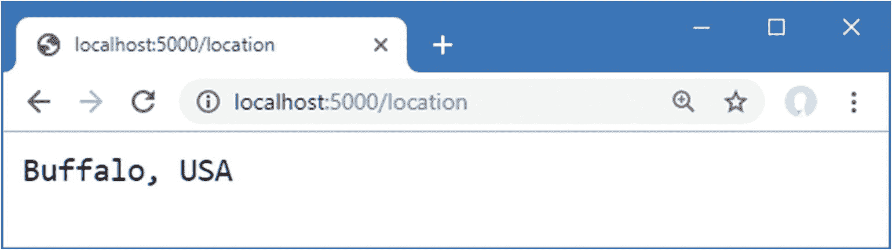

# 十五、使用平台特性：第 1 部分

ASP.NET Core 包括一组内置服务和中间件组件，提供 web 应用通常需要的功能。在这一章中，我描述了三个最重要和最广泛使用的特性:应用配置、日志记录和提供静态内容。在第 [16](16.html) 章中，我继续描述平台特性，重点是更高级的内置服务和中间件。表 [15-1](#Tab1) 将这一章放在上下文中。

表 15-1。

将平台特性放在上下文中

<colgroup><col class="tcol1 align-left"> <col class="tcol2 align-left"></colgroup> 
| 

问题

 | 

回答

 |
| --- | --- |
| 它们是什么？ | 平台特性处理常见的 web 应用需求，如配置、日志、静态文件、会话、认证和数据库访问。 |
| 它们为什么有用？ | 使用这些特性意味着您不必在自己的项目中重新创建它们的功能。 |
| 它们是如何使用的？ | 使用名称以`Use`开头的扩展方法将内置中间件组件添加到`Startup.Configure`方法的请求管道中。使用以`Add`开始的方法在`Startup.ConfigureServices`方法中建立服务。 |
| 有什么陷阱或限制吗？ | 最常见的问题与中间件组件添加到请求管道的顺序有关。记住中间件组件形成了一个请求传递的链条，如第 [12](12.html) 章所述。 |
| 还有其他选择吗？ | 您不必使用 ASP.NET Core 提供的任何服务或中间件组件。 |

表 [15-2](#Tab2) 总结了本章内容。

表 15-2。

章节总结

<colgroup><col class="tcol1 align-left"> <col class="tcol2 align-left"> <col class="tcol3 align-left"></colgroup> 
| 

问题

 | 

解决办法

 | 

列表

 |
| --- | --- | --- |
| 访问配置数据 | 使用`IConfiguration`服务 | 4–7 |
| 设置应用环境 | 使用启动设置文件 | Eleven |
| 确定应用环境 | 使用`IWebHostEnvironment`服务 | Twelve |
| 将敏感数据保留在项目之外 | 创建用户机密 | 13–19 |
| 记录消息 | 使用`ILogger<T>`服务 | 20–22 |
| 交付静态内容 | 启用静态内容中间件 | 23–26 |
| 交付客户端包 | 用 LibMan 安装这个包，并用静态内容中间件交付它 | 27–30 |

## 为本章做准备

在本章中，我继续使用在第 [14 章](14.html)中创建的平台项目。为了准备本章，更新`Startup`类以移除中间件和服务，如清单 [15-1](#PC1) 所示。

```cs
using System;
using System.Collections.Generic;
using System.Linq;
using System.Threading.Tasks;
using Microsoft.AspNetCore.Builder;
using Microsoft.AspNetCore.Hosting;
using Microsoft.AspNetCore.Http;
using Microsoft.Extensions.DependencyInjection;
using Microsoft.Extensions.Hosting;
using Microsoft.Extensions.Options;

namespace Platform {
    public class Startup {

        public void ConfigureServices(IServiceCollection services) {
        }

        public void Configure(IApplicationBuilder app, IWebHostEnvironment env) {
            app.UseDeveloperExceptionPage();
            app.UseRouting();
            app.UseEndpoints(endpoints => {
                endpoints.MapGet("/", async context => {
                    await context.Response.WriteAsync("Hello World!");
                });
            });
        }
    }
}

Listing 15-1.Removing Middleware and Services in the Startup.cs File in the Platform Folder

```

本章的主题之一是配置数据。用清单 [15-2](#PC2) 的内容替换`appsettings.Development.json`文件的内容，删除第 [14 章](14.html)中添加的设置。

```cs
{
  "Logging": {
    "LogLevel": {
      "Default": "Debug",
      "System": "Information",
      "Microsoft": "Information"
    }
  }
}

Listing 15-2.Replacing the Contents of the appsettings.Development.json File in the Platform Folder

```

通过从调试菜单中选择启动而不调试或运行而不调试来启动应用，或者通过打开新的 PowerShell 命令提示符，导航到`Platform`项目文件夹(包含`Platform.csproj`文件)，并运行清单 [15-3](#PC3) 中所示的命令。

Tip

你可以从 [`https://github.com/apress/pro-asp.net-core-3`](https://github.com/apress/pro-asp.net-core-3) 下载本章以及本书其他章节的示例项目。如果在运行示例时遇到问题，请参见第 [1](01.html) 章获取帮助。

```cs
dotnet run

Listing 15-3.Starting the ASP.NET Core Runtime

```

如果应用是使用 Visual Studio 或 Visual Studio 代码启动的，一个新的浏览器窗口将会打开并显示如图 [15-1](#Fig1) 所示的内容。如果应用是从命令行启动的，打开一个新的浏览器选项卡并导航到`http://localhost:5000`；您将看到如图 [15-1](#Fig1) 所示的内容。


图 15-1。

运行示例应用

## 使用配置服务

ASP.NET Core 提供的内置功能之一是访问应用的配置设置，然后以服务的形式呈现。

配置数据的主要来源是`appsettings.json`文件。由空模板创建的`appsettings.json`文件包含以下设置:

```cs
{
  "Logging": {
    "LogLevel": {
      "Default": "Information",
      "Microsoft": "Warning",
      "Microsoft.Hosting.Lifetime": "Information"
    }
  },
  "AllowedHosts": "*"
}

```

配置服务将处理 JSON 配置文件，并创建包含单独设置的嵌套配置节。对于示例应用中的`appsettings.json`文件，配置服务将创建一个包含`LogLevel`部分的`Logging`配置部分。`LogLevel`部分将包含`Default`、`Microsoft`和`Microsoft.Hosting.Lifetime`设置。还有一个`AllowedHosts`设置，它不是配置部分的一部分，其值是一个星号(`*`字符)。

配置服务不理解`appsettings.json`文件中配置部分或设置的含义，只负责处理 JSON 数据文件，并将配置设置与从其他来源(如环境变量或命令行参数)获得的值合并。结果是一组分层的配置属性，如图 [15-2](#Fig2) 所示。


图 15-2。

appsettings.json 文件中配置属性的层次结构

### 了解特定于环境的配置文件

大多数项目包含不止一个 JSON 配置文件，允许为开发周期的不同部分定义不同的设置。有三个预定义的环境，名为`Development`、`Staging`和`Production`，每一个都对应于一个常用的开发阶段。在启动过程中，配置服务会查找一个名称包含当前环境的 JSON 文件。默认环境是`Development`，这意味着配置服务将加载`appsettings.Development.json`文件，并使用其内容来补充主`appsettings.json`文件的内容。

Note

Visual Studio 解决方案资源管理器将`appsettings.Development.json`文件嵌套在`appsettings.json`项中。您可以展开`appsettings.json`文件来查看和编辑嵌套条目，或者单击解决方案资源管理器顶部的按钮来禁用嵌套功能。

下面是添加到清单 [15-2](#PC2) 中的`appsettings.Development.json`文件的配置设置:

```cs
{
  "Logging": {
    "LogLevel": {
      "Default": "Debug",
      "System": "Information",
      "Microsoft": "Information"
    }
  }
}

```

如果在两个文件中定义了相同的设置，`appsettings.Development.json`文件中的值将替换`appsettings.json`文件中的值，这意味着两个 JSON 文件的内容将产生如图 [15-3](#Fig3) 所示的配置设置层次。


图 15-3。

合并 JSON 配置设置

附加配置设置的作用是提高日志消息的详细程度，我将在“使用日志服务”一节中对此进行更详细的描述。

### 访问配置设置

通过服务访问配置数据。如果您只需要配置数据来配置中间件，那么可以使用`Configure`方法的一个参数来声明对配置服务的依赖，如清单 [15-4](#PC6) 所示。

```cs
using System;
using System.Collections.Generic;
using System.Linq;
using System.Threading.Tasks;
using Microsoft.AspNetCore.Builder;
using Microsoft.AspNetCore.Hosting;
using Microsoft.AspNetCore.Http;
using Microsoft.Extensions.DependencyInjection;
using Microsoft.Extensions.Hosting;
using Microsoft.Extensions.Options;
using Microsoft.Extensions.Configuration;

namespace Platform {
    public class Startup {

        public void ConfigureServices(IServiceCollection services) {
        }

        public void Configure(IApplicationBuilder app, IWebHostEnvironment env,
                IConfiguration config ) {

            app.UseDeveloperExceptionPage();
            app.UseRouting();

            app.Use(async (context, next) => {
                string defaultDebug = config["Logging:LogLevel:Default"];
                await context.Response
                    .WriteAsync($"The config setting is: {defaultDebug}");
            });

            app.UseEndpoints(endpoints => {
                endpoints.MapGet("/", async context => {
                    await context.Response.WriteAsync("Hello World!");
                });
            });
        }
    }
}

Listing 15-4.Accessing Configuration Data in the Startup.cs File in the Platform Folder

```

通过`IConfiguration`接口提供配置数据；这个接口是在`Microsoft.Extensions.Configuration`名称空间中定义的，它提供了一个 API 来浏览配置层次结构和读取配置设置。为了接收`Startup`类中的配置数据，一个`IConfiguration`参数被添加到`Configure`方法中。可以通过指定配置部分的路径来读取配置设置，如下所示:

```cs
...
string defaultDebug = config["Logging:LogLevel:Default"];
...

```

该语句读取`Default`设置的值，该值在配置的`Logging`部分的`LogLevel`部分中定义。配置部分和配置设置的名称由冒号(`:`字符)分隔。

清单 [15-4](#PC6) 中读取的配置设置值用于为处理`/config` URL 的中间件组件提供结果。通过在命令提示符下选择德固➤启动而不调试或使用 Control+C 并运行`Platform`文件夹中清单 [15-5](#PC8) 所示的命令来重启 ASP.NET Core 平台。

```cs
dotnet run

Listing 15-5.Starting the ASP.NET Core Platform

```

一旦运行时重新启动，导航到`http://localhost:5000/config` URL，您将看到浏览器选项卡中显示的配置设置值，如图 [15-4](#Fig4) 所示。


图 15-4。

正在读取配置数据

### 使用服务中的配置数据

在`ConfigureServices`方法中访问配置数据需要一个稍微不同的方法，这里不支持添加参数来接收`IConfiguration`对象。正如第 [14](14.html) 章所解释的，一些服务是在`Startup`类被实例化之前创建的，这允许使用构造函数参数来声明对它们的依赖。清单 [15-6](#PC9) 向`Startup`类添加了一个构造函数参数，该参数声明了对`IConfiguration`服务的依赖，并将用于解析依赖的对象分配给一个属性，该属性可以在`ConfigureServices`和`Configure`方法中访问。

```cs
using System;
using System.Collections.Generic;
using System.Linq;
using System.Threading.Tasks;
using Microsoft.AspNetCore.Builder;
using Microsoft.AspNetCore.Hosting;
using Microsoft.AspNetCore.Http;
using Microsoft.Extensions.DependencyInjection;
using Microsoft.Extensions.Hosting;
using Microsoft.Extensions.Options;
using Microsoft.Extensions.Configuration;

namespace Platform {
    public class Startup {

        public Startup(IConfiguration configService) {
            Configuration = configService;
        }

        private IConfiguration Configuration { get; set; }

        public void ConfigureServices(IServiceCollection services) {

            // configuration data can be accessed here
        }

        public void Configure(IApplicationBuilder app, IWebHostEnvironment env) {
            app.UseDeveloperExceptionPage();
            app.UseRouting();

            app.Use(async (context, next) => {
                string defaultDebug = Configuration["Logging:LogLevel:Default"];
                await context.Response
                    .WriteAsync($"The config setting is: {defaultDebug}");
            });

            app.UseEndpoints(endpoints => {
                endpoints.MapGet("/", async context => {
                    await context.Response.WriteAsync("Hello World!");
                });
            });
        }
    }
}

Listing 15-6.Using Configuration Data in the Startup.cs File in the Platform Folder

```

构造函数将通过`IConfiguration`参数接收的对象分配给名为`Configuration`的属性，该属性允许在`Configure`和`ConfigureServices`方法中访问配置数据。

#### 通过选项模式使用配置数据

`ConfigureServices`方法中的配置数据与我在第 [14 章](14.html)中描述的选项模式一起使用。在那一章中，我向您展示了如何使用 lambda 函数来更改默认选项值。另一种方法是使用配置设置来设置选项。

准备时，将清单 [15-7](#PC10) 中所示的配置设置添加到`appsettings.json`文件中。

```cs
{
  "Location": {
      "CityName": "Buffalo"
  },
  "Logging": {
    "LogLevel": {
      "Default": "Information",
      "Microsoft": "Warning",
      "Microsoft.Hosting.Lifetime": "Information"
    }
  },
  "AllowedHosts": "*"
}

Listing 15-7.Adding Configuration Data in the appsettings.json File in the Platform Folder

```

在清单 [15-8](#PC11) 中，我使用了选项模式来配置在第 [14 章](14.html)中创建的`LocationMiddleware`组件，使用清单 [15-7](#PC10) 中定义的配置数据。

```cs
using System;
using System.Collections.Generic;
using System.Linq;
using System.Threading.Tasks;
using Microsoft.AspNetCore.Builder;
using Microsoft.AspNetCore.Hosting;
using Microsoft.AspNetCore.Http;
using Microsoft.Extensions.DependencyInjection;
using Microsoft.Extensions.Hosting;
using Microsoft.Extensions.Options;
using Microsoft.Extensions.Configuration;

namespace Platform {
    public class Startup {

        public Startup(IConfiguration configService) {
            Configuration = configService;
        }

        private IConfiguration Configuration { get; set; }

        public void ConfigureServices(IServiceCollection services) {
            services.Configure<MessageOptions>(Configuration.GetSection("Location"));
        }

        public void Configure(IApplicationBuilder app, IWebHostEnvironment env) {
            app.UseDeveloperExceptionPage();
            app.UseRouting();

            app.UseMiddleware<LocationMiddleware>();

            app.Use(async (context, next) => {
                string defaultDebug = Configuration["Logging:LogLevel:Default"];
                await context.Response
                    .WriteAsync($"The config setting is: {defaultDebug}");
            });

            app.UseEndpoints(endpoints => {
                endpoints.MapGet("/", async context => {
                    await context.Response.WriteAsync("Hello World!");
                });
            });
        }
    }
}

Listing 15-8.Using Configuration Data in the Startup.cs File in the Platform Folder

```

使用`GetSection`方法获得配置数据部分，并在创建选项时传递给`Configure`方法。检查所选部分中的配置值，并将其用于替换 options 类中具有相同名称的默认值。要看到效果，重启 ASP.NET Core，并使用浏览器导航到`http://localhost:5000/location`网址。您将看到如图 [15-5](#Fig5) 所示的结果，其中`CityName`选项取自配置数据，`CountryName`选项取自选项类的默认值。



图 15-5。

在选项模式中使用配置数据

### 了解启动设置文件

`Properties`文件夹中的`launchSettings.json`文件包含启动 ASP.NET Core 平台的配置设置，包括用于监听 HTTP 和 HTTPS 请求的 TCP 端口，以及用于选择附加 JSON 配置文件的环境。

Tip

Visual Studio 通常默认隐藏`Properties`文件夹。单击 Solution Explorer 顶部的 Show All Files 按钮，显示文件夹和`launchSettings.json`文件。

以下是使用空模板创建项目时添加到`launchSettings.json`文件的内容:

```cs
{
  "iisSettings": {
    "windowsAuthentication": false,
    "anonymousAuthentication": true,
    "iisExpress": {
      "applicationUrl": "http://localhost:5000",
      "sslPort": 0
    }
  },
  "profiles": {
    "IIS Express": {
      "commandName": "IISExpress",
      "launchBrowser": true,
      "environmentVariables": {
        "ASPNETCORE_ENVIRONMENT": "Development"
      }
    },
    "Platform": {
      "commandName": "Project",
      "launchBrowser": true,
      "applicationUrl": "http://localhost:5000",
      "environmentVariables": {
        "ASPNETCORE_ENVIRONMENT": "Development"
      }
    }
  }
}

```

`iisSettings`部分用于配置 ASP.NET Core 平台通过 IIS Express 启动时使用的 HTTP 和 HTTPS 端口，这发生在使用 Visual Studio 时。

这些设置由`IIS Express`部分补充，它指定当应用启动时是否应该打开一个新的浏览器窗口，它包含`environmentVariables`，用于定义添加到应用配置数据中的环境变量。

`Platform`部分包含使用 Visual Studio 代码或直接在命令提示符下使用`dotnet run`命令启动应用时使用的配置，该部分指定 ASP.NET Core Kestrel HTTP 服务器的设置。

这两个部分最重要的部分是`environmentVariables`部分，它定义了`ASPNETCORE_ENVIRONMENT`设置。在启动过程中，`ASPNETCORE_ENVIRONMENT`设置的值用于选择额外的 JSON 配置文件，例如，`Development`的值将导致加载`appsettings.Development.json`文件。

如果您使用的是 Visual Studio 代码，`ASPNETCORE_ENVIRONMENT`被设置在不同的文件中。选择“调试➤打开配置”以打开`.vscode`文件夹中的`launch.json`文件，该文件夹是在使用 Visual Studio 代码编辑项目时创建的。下面是示例项目的默认配置，显示了当前的`ASPNETCORE_ENVIRONMENT`值:

```cs
{
    "version": "0.2.0",
    "configurations": [
        {
            "name": ".NET Core Launch (web)",
            "type": "coreclr",
            "request": "launch",
            "preLaunchTask": "build",
            "program": "${workspaceFolder}/bin/Debug/netcoreapp3.0/Platform.dll",
            "args": [],
            "cwd": "${workspaceFolder}",
            "stopAtEntry": false,
            "serverReadyAction": {
                "action": "openExternally",
                "pattern": "^\\s*Now listening on:\\s+(https?://\\S+)"
            },
            "env": {
                "ASPNETCORE_ENVIRONMENT": "Development"
            },
            "sourceFileMap": {
                "/Views": "${workspaceFolder}/Views"
            }
        },
        {
            "name": ".NET Core Attach",
            "type": "coreclr",
            "request": "attach",
            "processId": "${command:pickProcess}"
        }
    ]
}

```

为了显示`ASPNETCORE_ENVIRONMENT`设置的值，向响应`/config` URL 的中间件组件添加语句，如清单 [15-9](#PC14) 所示。

```cs
using System;
using System.Collections.Generic;
using System.Linq;
using System.Threading.Tasks;
using Microsoft.AspNetCore.Builder;
using Microsoft.AspNetCore.Hosting;
using Microsoft.AspNetCore.Http;
using Microsoft.Extensions.DependencyInjection;
using Microsoft.Extensions.Hosting;
using Microsoft.Extensions.Options;
using Microsoft.Extensions.Configuration;

namespace Platform {
    public class Startup {

        public Startup(IConfiguration configService) {
            Configuration = configService;
        }

        private IConfiguration Configuration { get; set; }

        public void ConfigureServices(IServiceCollection services) {
            services.Configure<MessageOptions>(Configuration.GetSection("Location"));
        }

        public void Configure(IApplicationBuilder app, IWebHostEnvironment env) {
            app.UseDeveloperExceptionPage();
            app.UseRouting();

            app.UseMiddleware<LocationMiddleware>();

            app.Use(async (context, next) => {
                string defaultDebug = Configuration["Logging:LogLevel:Default"];
                await context.Response
                    .WriteAsync($"The config setting is: {defaultDebug}");
                string environ = Configuration["ASPNETCORE_ENVIRONMENT"];
                await context.Response
                    .WriteAsync($"\nThe env setting is: {environ}");
            });

            app.UseEndpoints(endpoints => {
                endpoints.MapGet("/", async context => {
                    await context.Response.WriteAsync("Hello World!");
                });
            });
        }
    }
}

Listing 15-9.Displaying the Configuration Setting in the Startup.cs File in the Platform Folder

```

重启 ASP.NET Core 并导航到`http://localhost:5000/config`，你会看到`ASPNETCORE_ENVIRONMENT`设置的值，如图 [15-6](#Fig6) 所示。


图 15-6。

显示环境配置设置

要查看`ASPNETCORE_ENVIRONMENT`设置对整体配置的影响，更改`launchSettings.json`文件中的值，如清单 [15-10](#PC15) 所示。

```cs
{
  "iisSettings": {
    "windowsAuthentication": false,
    "anonymousAuthentication": true,
    "iisExpress": {
      "applicationUrl": "http://localhost:5000",
      "sslPort": 0
    }
  },
  "profiles": {
    "IIS Express": {
      "commandName": "IISExpress",
      "launchBrowser": true,
      "environmentVariables": {
        "ASPNETCORE_ENVIRONMENT": "Production"
      }
    },
    "Platform": {
      "commandName": "Project",
      "launchBrowser": true,
      "applicationUrl": "http://localhost:5000",
      "environmentVariables": {
        "ASPNETCORE_ENVIRONMENT": "Production"
      }
    }
  }
}

Listing 15-10.Changing the Environment in the launchSettings.json File in the Platform/Properties Folder

```

如果您使用的是 Visual Studio，则可以通过选择“项目➤平台属性”并导航到“调试”选项卡来更改环境变量。双击 ASPNETCORE_ENVIRONMENT 变量的值，可以将该值改为 **Production** ，如图 [15-7](#Fig7) 所示。


图 15-7。

使用 Visual Studio 更改环境变量

如果您正在使用 Visual Studio 代码，请选择 Debug ➤开放配置并更改`env`部分中的值，如清单 [15-11](#PC16) 所示。

```cs
{
    "version": "0.2.0",
    "configurations": [
        {
            "name": ".NET Core Launch (web)",
            "type": "coreclr",
            "request": "launch",
            "preLaunchTask": "build",
            "program": "${workspaceFolder}/bin/Debug/netcoreapp3.0/Platform.dll",
            "args": [],
            "cwd": "${workspaceFolder}",
            "stopAtEntry": false,
            "serverReadyAction": {
                "action": "openExternally",
                "pattern": "^\\s*Now listening on:\\s+(https?://\\S+)"
            },
            "env": {
                "ASPNETCORE_ENVIRONMENT": "Production"
            },
            "sourceFileMap": {
                "/Views": "${workspaceFolder}/Views"
            }
        },
        {
            "name": ".NET Core Attach",
            "type": "coreclr",
            "request": "attach",
            "processId": "${command:pickProcess}"
        }
    ]
}

Listing 15-11.Changing the Environment in the launch.json File in the Platform/.vscode Folder

```

保存对属性页或配置文件的更改，然后重新启动 ASP.NET Core。导航到`http://localhost:5000/config`，你会看到环境变化的效果，如图 [15-8](#Fig8) 所示。


图 15-8。

更改环境配置设置的效果

请注意，浏览器中显示的两个配置值都已更改。不再加载`appsettings.Development.json`文件，项目中也没有`appsettings.Production.json`文件，所以只使用`appsettings.json`文件中的配置设置。

### 确定启动类中的环境

ASP.NET Core 平台提供了用于确定当前环境的`IWebHostEnvironment`服务，避免了手动获取配置设置的需要。`IWebHostEnvironment`服务定义了表 [15-3](#Tab3) 中所示的方法。这些方法是在`Microsoft.Extensions.Hosting`名称空间中定义的扩展方法，在使用它们之前必须用一个`using`语句导入。

表 15-3。

IWebHostEnvironment 扩展方法

<colgroup><col class="tcol1 align-left"> <col class="tcol2 align-left"></colgroup> 
| 

名字

 | 

描述

 |
| --- | --- |
| `IsDevelopment()` | 当选择了`Development`环境时，该方法返回`true`。 |
| `IsStaging()` | 当选择了`Staging`环境时，该方法返回`true`。 |
| `IsProduction()` | 当选择了`Production`环境时，该方法返回`true`。 |
| `IsEnvironment(env)` | 当选择了参数指定的环境时，该方法返回`true`。 |

`Startup`类中的`Configure`方法已经有了一个`IWebHostEnvironment`参数，它是在第 [14 章](14.html)中使用空模板创建项目时添加的。这通常与表 [15-3](#Tab3) 中描述的方法一起使用，以选择添加到请求管道中的中间件组件。最常见的例子是确定是否使用了`UseDeveloperExceptionPage`方法，因为`UseDeveloperExceptionPage`添加了生成响应的中间件，这些响应应该只在开发中使用。为了确保中间件只在开发期间使用，清单 [15-12](#PC17) 使用了`IWebHostEnvironment`服务和`IsDevelopment`方法。

```cs
...
public void Configure(IApplicationBuilder app, IWebHostEnvironment env) {

    if (env.IsDevelopment()) {
        app.UseDeveloperExceptionPage();
    }
    app.UseRouting();

    app.UseMiddleware<LocationMiddleware>();

    app.Use(async (context, next) => {
        string defaultDebug = Configuration["Logging:LogLevel:Default"];
        await context.Response
            .WriteAsync($"The config setting is: {defaultDebug}");
        string environ = Configuration["ASPNETCORE_ENVIRONMENT"];
        await context.Response
            .WriteAsync($"\nThe env setting is: {environ}");
    });

    app.UseEndpoints(endpoints => {
        endpoints.MapGet("/", async context => {
            await context.Response.WriteAsync("Hello World!");
        });
    });
}
...

Listing 15-12.Selecting Middleware in the Startup.cs File in the Platform Folder

```

这个中间件捕获处理请求时抛出的异常，并显示详细的堆栈跟踪，这是应用部署后不应该看到的。我在第 [16](16.html) 章演示了错误处理中间件。

Tip

服务还定义了一些属性，这些属性可以用来获取应用文件位置的详细信息，如第 16 章所示。

### 存储用户机密

在开发过程中，经常需要使用敏感数据来处理应用所依赖的服务。这些数据可以包括 API 密钥、数据库连接密码或默认管理帐户，它既用于访问服务，也用于重新初始化服务，以便用全新的数据库或用户配置测试应用的更改。

如果敏感数据包含在 C# 类或 JSON 配置文件中，它将被签入源代码版本控制存储库，并对所有开发人员和任何可以看到代码的人可见，这可能意味着对具有开放存储库或安全性差的存储库的项目可见。

用户机密服务允许将敏感数据存储在不属于项目的文件中，并且不会签入到版本控制中，从而允许每个开发人员拥有自己的敏感数据，这些数据不会通过版本控制签入而意外公开。

#### 存储用户机密

第一步是准备将用于存储敏感数据的文件。打开一个新的 PowerShell 命令提示符，运行`Platform`文件夹(包含`Platform.csproj`文件的文件夹)中的清单 [15-13](#PC18) 中所示的命令。

```cs
dotnet tool uninstall  --global dotnet-user-secrets
dotnet tool install --global dotnet-user-secrets --version 3.0.0-preview-18579-0056

Listing 15-13.Installing the User Secrets Tool Package

```

这些命令会删除之前已安装的软件包，并安装本章要求的版本。接下来，运行`Platform`文件夹中清单 [15-14](#PC19) 所示的命令。

Note

如果您在运行本节中的命令时遇到问题，请关闭 PowerShell 提示符，并在安装全局工具包后打开一个新的提示符。

```cs
dotnet user-secrets init

Listing 15-14.Initializing User Secrets

```

该命令向`Platform.csproj`项目文件添加一个元素，该元素包含项目的惟一 ID，该 ID 将与每个开发人员机器上的秘密相关联。接下来，运行`Platform`文件夹中清单 [15-15](#PC20) 所示的命令。

```cs
dotnet user-secrets set "WebService:Id" "MyAccount"

dotnet user-secrets set "WebService:Key" "MySecret123$"

Listing 15-15.Storing a User Secret

```

每个秘密都有一个键和值，相关的秘密可以通过使用一个公共前缀，后跟一个冒号(`:`字符)，再后跟秘密名称来分组。清单 [15-15](#PC20) 中的命令创建带有`WebService`前缀的相关`Id`和`Key`秘密。

在每个命令之后，您将看到一条消息，确认一个秘密已被添加到秘密存储中。为了检查这个项目的秘密，使用命令提示符运行在`Platform`文件夹中的清单 [15-16](#PC21) 中显示的命令。

```cs
dotnet user-secrets list

Listing 15-16.Listing the User Secrets

```

该命令产生以下输出:

```cs
WebService:Key = MySecret123$
WebService:Id = MyAccount

```

在幕后，已经在`%APPDATA%\Microsoft\UserSecrets`文件夹(或者 Linux 的`~/.microsoft/usersecrets`文件夹)中创建了一个 JSON 文件来存储秘密。每个项目都有自己的文件夹(其名称对应于清单 [15-14](#PC19) 中的`init`命令创建的唯一 ID)。

Tip

如果您使用的是 Visual Studio，则可以通过在解决方案资源管理器中右击项目并从弹出式菜单中选择“管理用户机密”来直接创建和编辑 JSON 文件。

#### 读取用户机密

用户机密与正常配置设置合并，并以相同的方式访问。在清单 [15-17](#PC23) 中，我添加了一条语句，显示处理`/config` URL 的中间件组件的秘密。

```cs
...
app.Use(async (context, next) => {
    string defaultDebug = Configuration["Logging:LogLevel:Default"];
    await context.Response
        .WriteAsync($"The config setting is: {defaultDebug}");
    string environ = Configuration["ASPNETCORE_ENVIRONMENT"];
    await context.Response
        .WriteAsync($"\nThe env setting is: {environ}");
    string wsID = Configuration["WebService:Id"];
    string wsKey = Configuration["WebService:Key"];
    await context.Response.WriteAsync($"\nThe secret ID is: {wsID}");
    await context.Response.WriteAsync($"\nThe secret Key is: {wsKey}");
});
...

Listing 15-17.Using User Secrets in the Startup.cs File in the Platform Folder

```

仅当应用被设置为`Development`环境时，才加载用户机密。编辑`launchSettings.json`文件，将环境更改为`Development`，如清单 [15-18](#PC24) 所示。(如果您愿意，可以通过选择“项目➤平台属性”来使用 Visual Studio 界面。)

```cs
{
  "iisSettings": {
    "windowsAuthentication": false,
    "anonymousAuthentication": true,
    "iisExpress": {
      "applicationUrl": "http://localhost:5000",
      "sslPort": 0
    }
  },
  "profiles": {
    "IIS Express": {
      "commandName": "IISExpress",
      "launchBrowser": true,
      "environmentVariables": {
        "ASPNETCORE_ENVIRONMENT": "Development"
      }
    },
    "Platform": {
      "commandName": "Project",
      "launchBrowser": true,
      "applicationUrl": "http://localhost:5000",
      "environmentVariables": {
        "ASPNETCORE_ENVIRONMENT": "Development"
      }
    }
  }
}

Listing 15-18.Changing the Environment in the launchSettings.json File in the Platform/Properties Folder

```

如果您从 Visual Studio 代码中启动应用，您还必须通过选择调试➤开放配置并更改`env`部分中的值来编辑环境，如清单 [15-19](#PC25) 所示。

```cs
{
    "version": "0.2.0",
    "configurations": [
        {
            "name": ".NET Core Launch (web)",
            "type": "coreclr",
            "request": "launch",
            "preLaunchTask": "build",
            "program": "${workspaceFolder}/bin/Debug/netcoreapp3.0/Platform.dll",
            "args": [],
            "cwd": "${workspaceFolder}",
            "stopAtEntry": false,
            "serverReadyAction": {
                "action": "openExternally",
                "pattern": "^\\s*Now listening on:\\s+(https?://\\S+)"
            },
            "env": {
                "ASPNETCORE_ENVIRONMENT": "Development"
            },
            "sourceFileMap": {
                "/Views": "${workspaceFolder}/Views"
            }
        },
        {
            "name": ".NET Core Attach",
            "type": "coreclr",
            "request": "attach",
            "processId": "${command:pickProcess}"
        }
    ]
}

Listing 15-19.Changing the Environment in the launch.json File in the .vscode Folder

```

保存更改，重启 ASP.NET Core 运行时，请求`http://localhost:5000/config` URL 查看用户机密，如图 [15-9](#Fig9) 所示。


图 15-9。

显示用户机密

## 使用日志服务

ASP.NET Core 提供日志记录服务，可用于记录描述应用状态的消息，以跟踪错误、监控性能并帮助诊断问题。

日志消息被发送到日志提供程序，日志提供程序负责将消息转发到可以查看、存储和处理消息的位置。有用于基本日志记录的内置提供程序，也有一系列第三方提供程序可用于将消息提供给日志记录框架，以便对消息进行整理和分析。

默认情况下启用三个内置提供程序:控制台提供程序、调试提供程序和 EventSource 提供程序。调试提供程序转发消息，以便可以通过`System.Diagnostics.Debug`类处理它们，事件源提供程序为事件跟踪工具转发消息，例如 PerfView ( [`https://github.com/Microsoft/perfview`](https://github.com/Microsoft/perfview) )。我在本章中使用控制台提供程序，因为它很简单，不需要任何额外的配置来显示日志消息。

Tip

您可以在 [`https://docs.microsoft.com/en-gb/aspnet/core/fundamentals/logging`](https://docs.microsoft.com/en-gb/aspnet/core/fundamentals/logging) 查看可用提供商列表和启用说明。

### 生成日志消息

使用未绑定的`ILogger<T>`服务生成日志消息。清单 [15-20](#PC26) 在`Startup.Configure`方法中声明了对服务的依赖，为了简洁起见，从前面的例子中删除了中间件。

```cs
using System;
using System.Collections.Generic;
using System.Linq;
using System.Threading.Tasks;
using Microsoft.AspNetCore.Builder;
using Microsoft.AspNetCore.Hosting;
using Microsoft.AspNetCore.Http;
using Microsoft.Extensions.DependencyInjection;
using Microsoft.Extensions.Hosting;
using Microsoft.Extensions.Options;
using Microsoft.Extensions.Configuration;
using Microsoft.Extensions.Logging;

namespace Platform {
    public class Startup {

        public Startup(IConfiguration configService) {
            Configuration = configService;
        }

        private IConfiguration Configuration { get; set; }

        public void ConfigureServices(IServiceCollection services) {
            services.Configure<MessageOptions>(Configuration.GetSection("Location"));
        }

        public void Configure(IApplicationBuilder app,
                IWebHostEnvironment env, ILogger<Startup> logger) {

            if (env.IsDevelopment()) {
                app.UseDeveloperExceptionPage();
            }
            app.UseRouting();

            app.UseMiddleware<LocationMiddleware>();

            app.UseEndpoints(endpoints => {
                endpoints.MapGet("/", async context => {
                    logger.LogDebug("Response for / started");
                    await context.Response.WriteAsync("Hello World!");
                    logger.LogDebug("Response for / completed");
                });
            });
        }
    }
}

Listing 15-20.Generating a Logging Message in the Startup.cs File in the Platform Folder

```

日志服务根据分配给消息的类别将日志消息组合在一起。日志消息是使用`ILogger<T>`接口编写的，其中通用参数`T`用于指定类别。惯例是使用生成消息的类的类型作为类别类型，这就是为什么清单 [15-20](#PC26) 使用`Startup`作为类型参数来声明对未绑定服务的依赖，如下所示:

```cs
...
public void Configure(IApplicationBuilder app,
                IWebHostEnvironment env, ILogger<Startup> logger) {
...

```

这确保了在`Configure`方法中生成的日志消息将被分配类别`Startup`。使用表 [15-4](#Tab4) 中所示的扩展方法创建日志消息。

表 15-4。

ILogger <t>扩展方法</t>

<colgroup><col class="tcol1 align-left"> <col class="tcol2 align-left"></colgroup> 
| 

名字

 | 

描述

 |
| --- | --- |
| `LogTrace` | 该方法生成一个`Trace`级消息，用于开发过程中的低级调试。 |
| `LogDebug` | 该方法生成一个`Debug`级消息，用于开发或生产问题解决过程中的低级调试。 |
| `LogInformation` | 该方法生成一个`Information`级别的消息，用于提供关于应用一般状态的信息。 |
| `LogError` | 该方法生成一个`Error`级别的消息，用于记录应用没有处理的异常或错误。 |
| `LogCritical` | 该方法生成一个`Critical`级消息，用于记录严重故障。 |

日志消息被分配一个反映其重要性和详细程度的级别。级别范围从用于详细诊断的`Trace`到用于需要立即响应的最重要信息的`Critical`。每个方法都有重载版本，允许使用字符串或异常生成日志消息。在清单 [15-20](#PC26) 中，我使用了`LogDebug`方法在处理请求时生成日志消息。

```cs
...
logger.LogDebug("Response for / started");
...

```

结果是在响应开始和完成时生成的`Debug`级别的日志消息。要查看日志消息，请选择调试➤启动而不调试。如果您正在使用命令行，使用 Control+C 来停止 ASP.NET Core 运行时，并使用清单 [15-21](#PC34) 中的命令再次启动它。

```cs
dotnet run

Listing 15-21.Starting the Example Application

```

一旦应用启动，使用浏览器选项卡请求`http://localhost:5000` URL。如果您正在使用命令行，您将会在应用的输出中看到日志记录消息，如下所示:

```cs
...
info: Microsoft.AspNetCore.Hosting.Diagnostics[1]
      Request starting HTTP/1.1 GET http://localhost:5000/
info: Microsoft.AspNetCore.Routing.EndpointMiddleware[0]
      Executing endpoint '/ HTTP: GET'
dbug: Platform.Startup[0]
      Response for / started
dbug: Platform.Startup[0]
      Response for / completed
info: Microsoft.AspNetCore.Routing.EndpointMiddleware[1]
      Executed endpoint '/ HTTP: GET'
info: Microsoft.AspNetCore.Hosting.Diagnostics[2]
      Request finished in 23.022100000000002ms 200
...

```

如果使用的是 Visual Studio，应用的输出将显示在“输出”窗口中，可以从“视图”菜单中选择该窗口。从下拉菜单中选择 ASP.NET Core Web 服务器查看输出，如图 [15-10](#Fig10) 所示。


图 15-10。

在 Visual Studio 输出窗口中选择日志记录消息

如果您使用的是 Visual Studio 代码，日志消息将显示在调试控制台窗口中，如图 [15-11](#Fig11) 所示，可以从视图菜单中选择。


图 15-11。

在 Visual Studio 代码调试控制台窗口中查看日志记录消息

### 配置最低日志记录级别

在第 14 章[中，我向你展示了`appsettings.json`和`appsettings.Development.json`文件的默认内容，并解释了它们是如何被合并以创建应用的配置设置的。JSON 文件中的设置用于配置日志服务，ASP.NET Core 提供该服务来记录关于应用状态的消息。](14.html)

`appsettings.json`文件的`Logging:LogLevel`部分用于设置记录消息的最低级别。低于最低级别的日志消息将被丢弃。`appsettings.json`文件包含以下几个层次:

```cs
...
"Default": "Information",
"Microsoft": "Warning",
"Microsoft.Hosting.Lifetime": "Information",
...

```

日志消息的类别——使用清单 [15-20](#PC26) 中的通用类型参数设置——用于选择最低过滤级别。例如，对于由启动类生成的日志消息，类别将是`Platform.Startup`，这意味着它们可以通过向`appsettings.json`文件添加一个`Platform.Startup`条目来直接匹配，或者通过只指定`Platform`名称空间来间接匹配。没有最低日志级别的任何类别都与设置为`Information`的`Default`条目相匹配。

在开发过程中，通常会增加日志消息的细节，这就是为什么`appsettings.Development.json`文件中的级别指定了更详细的日志级别，如下所示:

```cs
...
"Default": "Debug",
"System": "Information",
"Microsoft": "Information"
...

```

当应用被配置用于`Development`环境时，默认的日志记录级别是`Debug`。`System`和`Microsoft`类别的级别被设置为`Information`，这影响了由 ASP.NET Core 和微软提供的其他包和框架生成的日志消息。

通过将级别设置为`Trace`、`Debug`、`Information`、`Error`或`Critical`，您可以定制日志级别，将日志集中在应用中感兴趣的部分。使用`None`值可以禁用某个类别的日志消息。

在清单 [15-22](#PC38) 中，我向`appsettings.Development.json`文件添加了一个新的日志级别，它将禁用报告响应请求所用时间的消息。我还将`Microsoft`设置的级别增加到了`Trace`，这将增加 ASP.NET Core 平台中的类的显示细节。

Tip

如果您使用的是 Visual Studio，您可能需要在解决方案资源管理器中展开`appsettings.json`项来查看`appsettings.Development.json`文件。

```cs
{
  "Logging": {
    "LogLevel": {
      "Default": "Debug",
      "System": "Information",
      "Microsoft": "Trace",
      "Microsoft.AspnetCore.Hosting.Diagnostics": "None"
    }
  }
}

Listing 15-22.Selecting a Log Level in the appsettings.Development.json File in the Platform Folder

```

重启 ASP.NET Core 并请求`http://localhost:5000` URL，您将会看到为每个请求显示的细节数量发生了变化。详细程度取决于应用的运行方式。如果您正在使用 Visual Studio 代码或使用`dotnet run`命令，您可能会看到关于 HTTP/2 响应生成的更多细节。如果您使用 Visual Studio，您将不会看到这些消息，因为该应用将使用 IIS Express 运行，IIS Express 代表 ASP.NET Core 平台处理传入的 HTTP 请求。但是，总会看到一些消息:

```cs
...
dbug: Microsoft.AspNetCore.HostFiltering.HostFilteringMiddleware[0]
      Wildcard detected, all requests with hosts will be allowed.
trce: Microsoft.AspNetCore.HostFiltering.HostFilteringMiddleware[2]
      All hosts are allowed.
...

```

这些消息由主机过滤中间件生成，该中间件用于根据`Hosts`报头限制请求，如第 [16 章](16.html)所述。

## 使用静态内容和客户端包

大多数 web 应用依赖于动态生成和静态内容的混合。动态内容由应用基于用户的身份和操作生成，例如购物车的内容或特定产品的详细信息，并且是针对每个请求全新生成的。我在第 3 部分描述了使用 ASP.NET Core 创建动态内容的不同方式。

静态内容不变，用于提供图像、CSS 样式表、JavaScript 文件和应用所依赖的任何其他内容，但不必为每个请求都生成这些内容。ASP.NET Core 项目中静态内容的传统位置是`wwwroot`文件夹。

为了准备在本节的例子中使用的静态内容，创建`Platform/wwwroot`文件夹并向其中添加一个名为`static.html`的文件，其内容如清单 [15-23](#PC40) 所示。如果您使用的是 Visual Studio，则可以用 HTML 页模板创建该文件。

```cs
<!DOCTYPE html>
<html lang="en">
<head>
    <title>Static Content</title>
</head>
<body>
    <h3>This is static content</h3>
</body>
</html>

Listing 15-23.The Contents of the static.html File in the wwwroot Folder

```

该文件包含一个基本的 HTML 文档，其中包含在浏览器中显示消息所需的基本元素。

### 添加静态内容中间件

ASP.NET Core 提供了一个处理静态内容请求的中间件组件，它被添加到清单 [15-24](#PC41) 中的请求管道中。

```cs
using System;
using System.Collections.Generic;
using System.Linq;
using System.Threading.Tasks;
using Microsoft.AspNetCore.Builder;
using Microsoft.AspNetCore.Hosting;
using Microsoft.AspNetCore.Http;
using Microsoft.Extensions.DependencyInjection;
using Microsoft.Extensions.Hosting;
using Microsoft.Extensions.Options;
using Microsoft.Extensions.Configuration;
using Microsoft.Extensions.Logging;

namespace Platform {
    public class Startup {

        public Startup(IConfiguration configService) {
            Configuration = configService;
        }

        private IConfiguration Configuration { get; set; }

        public void ConfigureServices(IServiceCollection services) {
            services.Configure<MessageOptions>(Configuration.GetSection("Location"));
        }

        public void Configure(IApplicationBuilder app,
                IWebHostEnvironment env, ILogger<Startup> logger) {

            if (env.IsDevelopment()) {
                app.UseDeveloperExceptionPage();
            }
            app.UseStaticFiles();
            app.UseRouting();

            app.UseMiddleware<LocationMiddleware>();

            app.UseEndpoints(endpoints => {
                endpoints.MapGet("/", async context => {
                    logger.LogDebug("Response for / started");
                    await context.Response.WriteAsync("Hello World!");
                    logger.LogDebug("Response for / completed");
                });
            });
        }
    }
}

Listing 15-24.Adding Middleware in the Startup.cs File in the Platform Folder

```

`UseStaticFiles`扩展方法将静态文件中间件添加到请求管道中。这个中间件响应与磁盘文件名称相对应的请求，并将所有其他请求传递给管道中的下一个组件。这个中间件通常被添加在请求管道的开始处，这样其他组件就不会处理针对静态文件的请求。

重启 ASP.NET Core 并导航至`http://localhost:5000/static.html`。静态文件中间件将接收请求，并以`wwwroot`文件夹中`static.html`文件的内容进行响应，如图 [15-12](#Fig12) 所示。


图 15-12。

提供静态内容

中间件组件返回所请求文件的内容，并设置响应头，如`Content-Type`和`Content-Length`，向浏览器描述内容。

#### 更改静态内容中间件的默认选项

当不带参数调用`UseStaticFiles`方法时，中间件将使用`wwwroot`文件夹来定位与所请求 URL 的路径相匹配的文件。

这种行为可以通过将一个`StaticFileOptions`对象传递给`UseStaticFiles`方法来调整。表 [15-5](#Tab5) 描述了由`StaticFileOptions`类定义的属性。

表 15-5。

由 StaticFileOptions 类定义的属性

<colgroup><col class="tcol1 align-left"> <col class="tcol2 align-left"></colgroup> 
| 

名字

 | 

描述

 |
| --- | --- |
| `ContentTypeProvider` | 该属性用于获取或设置负责为文件生成 MIME 类型的`IContentTypeProvider`对象。接口的默认实现使用文件扩展名来确定内容类型，并支持最常见的文件类型。 |
| `DefaultContentType` | 如果`IContentTypeProvider`不能确定文件的类型，该属性用于设置默认的内容类型。 |
| `FileProvider` | 该属性用于定位请求的内容，如下所示。 |
| `OnPrepareResponse` | 此属性可用于注册在生成静态内容响应之前将被调用的操作。 |
| `RequestPath` | 该属性用于指定中间件将响应的 URL 路径，如下所示。 |
| `ServeUnknownFileTypes` | 默认情况下，静态内容中间件不会为内容类型不能由`IContentTypeProvider`确定的文件提供服务。通过将该属性设置为`true`来改变这种行为。 |

`FileProvider`和`RequestPath`属性是最常用的。`FileProvider`属性用于为静态内容选择不同的位置，而`RequestPath`属性用于指定表示静态上下文请求的 URL 前缀。清单 [15-25](#PC42) 使用这两个属性来配置`Startup`类中的静态文件中间件。

Tip

还有一个版本的`UseStaticFiles`方法接受单个字符串参数，用于设置`RequestPath`配置属性。这是一种添加 URL 支持的便捷方式，无需创建 options 对象。

```cs
using System;
using System.Collections.Generic;
using System.Linq;
using System.Threading.Tasks;
using Microsoft.AspNetCore.Builder;
using Microsoft.AspNetCore.Hosting;
using Microsoft.AspNetCore.Http;
using Microsoft.Extensions.DependencyInjection;
using Microsoft.Extensions.Hosting;
using Microsoft.Extensions.Options;
using Microsoft.Extensions.Configuration;
using Microsoft.Extensions.Logging;
using Microsoft.Extensions.FileProviders;

namespace Platform {
    public class Startup {

        public Startup(IConfiguration configService) {
            Configuration = configService;
        }

        private IConfiguration Configuration { get; set; }

        public void ConfigureServices(IServiceCollection services) {
            services.Configure<MessageOptions>(Configuration.GetSection("Location"));
        }

        public void Configure(IApplicationBuilder app,
                IWebHostEnvironment env, ILogger<Startup> logger) {

            if (env.IsDevelopment()) {
                app.UseDeveloperExceptionPage();
            }
            app.UseStaticFiles();

            app.UseStaticFiles(new StaticFileOptions {
                FileProvider = new
                    PhysicalFileProvider($"{env.ContentRootPath}/staticfiles"),
                RequestPath = "/files"
            });

            app.UseRouting();

            app.UseMiddleware<LocationMiddleware>();

            app.UseEndpoints(endpoints => {
                endpoints.MapGet("/", async context => {
                    logger.LogDebug("Response for / started");
                    await context.Response.WriteAsync("Hello World!");
                    logger.LogDebug("Response for / completed");
                });
            });
        }
    }
}

Listing 15-25.Configuring the Static File Middleware in the Startup.cs File in the Platform Folder

```

可以将中间件组件的多个实例添加到管道中，每个实例处理 URL 和文件位置之间的单独映射。在清单中，静态文件中间件的第二个实例被添加到请求管道中，以便使用名为`staticfiles`的文件夹中的文件来处理对以`/files`开头的 URL 的请求。从文件夹中读取文件是由负责读取磁盘文件的`PhysicalFileProvider`类的实例完成的。`PhysicalFileProvider`类需要一个绝对路径来工作，我基于由`IWebHostEnvironment`接口定义的`ContentRootPath`属性的值，该接口用于确定应用是在`Development`还是`Production`环境中运行。

为了给新的中间件组件提供内容，创建`Platform/staticfiles`文件夹，并向其中添加一个名为`hello.html`的 HTML 文件，其内容如清单 [15-26](#PC43) 所示。

```cs
<!DOCTYPE html>
<html lang="en">
<head>
    <title>Static Content</title>
</head>
<body>
    <h3>This is additional static content</h3>
</body>
</html>

Listing 15-26.The Contents of the hello.html File in the Platform/staticfiles Folder

```

重启 ASP.NET Core 并使用浏览器请求`http://localhost:5000/files/hello.html` URL。对以`/files`开头并对应于`staticfiles`文件夹中文件的 URL 的请求由新的中间件处理，如图 [15-13](#Fig13) 所示。


图 15-13。

配置静态文件中间件

### 使用客户端包

大多数 web 应用依赖客户端包来支持它们生成的内容，使用 CSS 框架来设计内容的样式，或者使用 JavaScript 包在浏览器中创建丰富的功能。微软提供了库管理器工具，称为 LibMan，用于下载和管理客户端软件包。

What Happened To Bower?

ASP.NET Core 的早期版本依赖于一个名为 Bower 的工具来管理客户端包。Bower 在 JavaScript 开发中被广泛使用，直到它的创建者撤销了这个项目并推荐移植到其他工具。微软引入的 Library Manager 是一个. NET 核心应用，应该有助于提供一致的处理客户端包的体验，并避免在动态(有时是混乱的)JavaScript 开发世界中围绕工具出现的混乱。

#### 为客户端包准备项目

使用命令提示符运行清单 [15-27](#PC44) 中所示的命令，该命令将 LibMan 安装为一个全局。NET 核心工具(虽然你可能会发现已经安装了 LibMan)。

```cs
dotnet tool install --global Microsoft.Web.LibraryManager.Cli --version 2.0.96

Listing 15-27.Installing LibMan

```

下一步是创建 LibMan 配置文件，该文件指定将用于获取客户端包的存储库以及包将被下载到的目录。打开一个 PowerShell 命令提示符，运行`Platform`文件夹中清单 [15-28](#PC45) 所示的命令。

```cs
libman init -p cdnjs

Listing 15-28.Initialzing LibMan

```

`-p`参数指定将获得包的提供者。我用过`cdnjs`，它选择了`cdnjs.com`。另一个选项是`unpkg`，选择`unpkg.com`。如果您没有使用软件包仓库的经验，那么您应该从`cdnjs`选项开始。

清单 [15-28](#PC45) 中的命令在`Platform`文件夹中创建一个名为`libman.json`的文件；该文件包含以下设置:

```cs
...
{
  "version": "1.0",
  "defaultProvider": "cdnjs",
  "libraries": []
}
...

```

如果您正在使用 Visual Studio，您可以通过选择项目➤管理客户端库来直接创建和编辑`libman.json`文件。

#### 安装客户端软件包

如果您使用的是 Visual Studio，则可以通过在解决方案资源管理器中右击平台项目项并从弹出菜单中选择“添加➤客户端库”来安装客户端包。Visual Studio 将提供一个简单的用户界面，允许将包放在存储库中并安装到项目中。当您在库文本字段中键入内容时，会在存储库中查询具有匹配名称的包。在文本栏中输入 **twitter-bootstrap** ，将选择流行的 Bootstrap CSS 框架，如图 [15-14](#Fig14) 所示。


图 15-14。

在 Visual Studio 中选择客户端包

选择了软件包的最新版本，在编写本文时是 4.3.1。单击 Install 按钮下载并安装引导软件包。

Package Names And Repositories

同一个包在不同的存储库中可能有不同的名称。如果你习惯于使用 Bower 或节点包管理器工具(NPM)来安装包，那么你可能习惯于把引导 CSS 框架仅仅称为`bootstrap`。CDNJS 存储库引用了与`twitter-bootstrap`相同的包，即使这个包及其内容是相同的。确定您需要什么包的最好方法是访问存储库网站并直接执行搜索。对于我在本章中使用的 LibMan 配置，这意味着要去`cdnjs.com`。

软件包也可以从命令行安装。如果你使用 Visual Studio 代码(或者像我一样喜欢命令行)，那么运行清单 [15-29](#PC47) 中的命令来安装引导包。

```cs
libman install twitter-bootstrap@4.3.1 -d wwwroot/lib/twitter-bootstrap

Listing 15-29.Installing the Bootstrap Package

```

所需的版本由`@`字符与包名分开，并且`-d`参数用于指定包将被安装的位置。在 ASP.NET Core 项目中，`wwwroot/lib`文件夹是安装客户端软件包的常规位置。

无论您采用哪种方法来安装客户端包，结果都将是包含 CSS 样式表和 JavaScript 文件的`wwwroot/lib/twitter-boostrap`文件夹，这些 CSS 样式表和 JavaScript 文件是由引导 CSS 框架提供的。

#### 使用客户端包

一旦安装了客户端包，它的文件就可以被`script`或`link` HTML 元素引用，或者通过使用后面章节中描述的更高级的 ASP.NET Core 特性来引用。

为了简化本章，清单 [15-30](#PC48) 向本节前面创建的静态 HTML 文件添加了一个`link`元素。

```cs
<!DOCTYPE html>
<html lang="en">
<head>
    <link rel="stylesheet" href="/lib/twitter-bootstrap/css/bootstrap.min.css" />
    <title>Static Content</title>
</head>
<body>
    <h3 class="p-2 bg-primary text-white">This is static content</h3>
</body>
</html>

Listing 15-30.Using a Client-Side Package in the static.html File in the Platform/wwwroot Folder

```

重启 ASP.NET Core 并请求`http://localhost:5000/static.html`。当浏览器接收并处理`static.html`文件的内容时，它将遇到`link`元素，并向 ASP.NET Core 运行时发送一个针对`/lib/twitter-bootstrap/css/bootstrap.min.css` URL 的 HTTP 请求。清单 [15-24](#PC41) 中添加的原始静态文件中间件组件将接收这个请求，确定它对应于`wwwroot`文件夹中的一个文件，并返回其内容，为浏览器提供引导 CSS 样式表。引导样式通过分配了`h3`元素的类来应用，产生如图 [15-15](#Fig15) 所示的结果。


图 15-15。

使用客户端包

## 摘要

在这一章中，我描述了 ASP.NET Core 为 web 应用提供的一些最重要和最有用的特性。我向您展示了如何配置 ASP.NET Core 应用，如何生成和管理日志消息，以及如何提供静态内容，包括客户端包的内容。在下一章中，我将继续描述 ASP.NET Core 平台的特性。