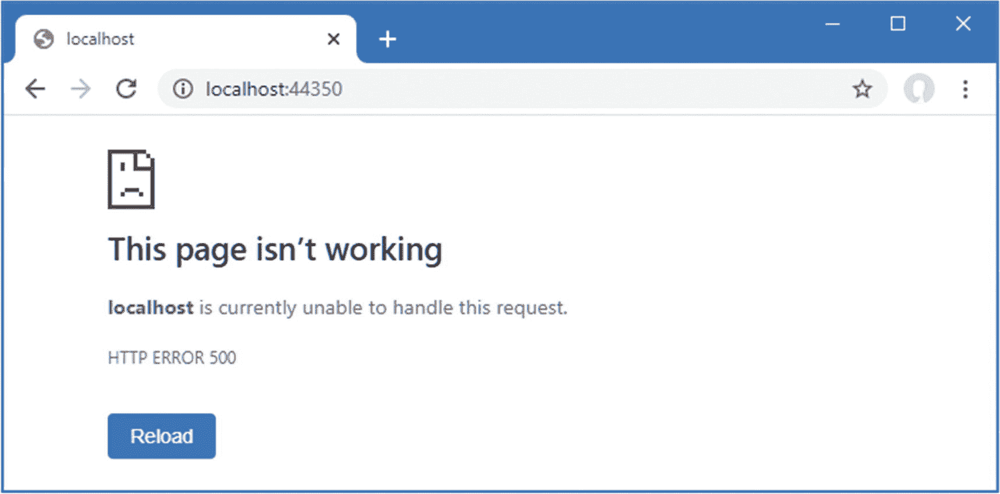

# 十六、使用平台特性：第 2 部分

在本章中，我将继续介绍 ASP.NET Core 平台提供的基本功能。我解释了如何使用 cookie，以及如何管理用户对跟踪 cookie 的同意。我描述了会话如何提供对基本 cookies 的健壮替代，如何使用和执行 HTTPS 请求，如何处理错误，以及如何基于`Host`头过滤请求。表 [16-1](#Tab1) 总结了这一章。

表 16-1。

章节总结

<colgroup><col class="tcol1 align-left"> <col class="tcol2 align-left"> <col class="tcol3 align-left"></colgroup> 
| 

问题

 | 

解决办法

 | 

列表

 |
| --- | --- | --- |
| 使用 cookies | 使用上下文对象来读写 cookies | 1–3 |
| 管理 cookie 同意 | 使用同意中间件 | 4–6 |
| 跨请求存储数据 | 使用会话 | 7, 8 |
| 保护 HTTP 请求 | 使用 HTTPS 中间件 | 9–13 |
| 处理错误 | 使用错误和状态代码中间件 | 14–19 |
| 使用主机标头限制请求 | 设置`AllowedHosts`配置设置 | Twenty |

## 为本章做准备

在这一章中，我继续使用第 15 章中的平台项目。为了准备本章，用清单 [16-1](#PC1) 的内容替换`Startup.cs`文件的内容，它删除了前一章中的中间件和服务。

```cs
using Microsoft.AspNetCore.Builder;
using Microsoft.AspNetCore.Http;
using Microsoft.Extensions.DependencyInjection;

namespace Platform {
    public class Startup {

        public void ConfigureServices(IServiceCollection services) {
        }

        public void Configure(IApplicationBuilder app) {
            app.UseDeveloperExceptionPage();
            app.UseRouting();
            app.UseEndpoints(endpoints => {
                endpoints.MapFallback(async context =>
                    await context.Response.WriteAsync("Hello World!"));
            });
        }
    }
}

Listing 16-1.Replacing the Contents of the Startup.cs File in the Platform Folder

```

通过从调试菜单中选择启动而不调试或运行而不调试来启动应用，或者通过打开新的 PowerShell 命令提示符，导航到包含`Platform.csproj`文件的文件夹，并运行清单 [16-2](#PC2) 中所示的命令。

Tip

你可以从 [`https://github.com/apress/pro-asp.net-core-3`](https://github.com/apress/pro-asp.net-core-3) 下载本章以及本书其他章节的示例项目。如果在运行示例时遇到问题，请参见第 [1](01.html) 章获取帮助。

```cs
dotnet run

Listing 16-2.Starting the ASP.NET Core Runtime

```

如果应用是使用 Visual Studio 或 Visual Studio 代码启动的，一个新的浏览器窗口将会打开并显示如图 [16-1](#Fig1) 所示的内容。如果应用是从命令行启动的，打开一个新的浏览器选项卡并导航到`http://localhost:5000`；您将看到如图 [16-1](#Fig1) 所示的内容。


图 16-1。

运行示例应用

## 使用 Cookies

Cookies 是添加到浏览器在后续请求中包含的响应中的少量文本。cookie 对 web 应用很重要，因为它们允许开发跨越一系列 HTTP 请求的功能，每个请求都可以通过浏览器发送给服务器的 cookie 来识别。

ASP.NET Core 通过提供给中间件组件的`HttpRequest`和`HttpResponse`对象来支持使用 cookies。为了演示，清单 [16-3](#PC3) 更改了示例应用中的路由配置，以添加实现计数器的端点。

```cs
using Microsoft.AspNetCore.Builder;
using Microsoft.AspNetCore.Http;
using Microsoft.Extensions.DependencyInjection;
using System;
using System.Threading.Tasks;

namespace Platform {
    public class Startup {

        public void ConfigureServices(IServiceCollection services) {
        }

        public void Configure(IApplicationBuilder app) {
            app.UseDeveloperExceptionPage();
            app.UseRouting();

            app.UseEndpoints(endpoints => {

                endpoints.MapGet("/cookie", async context => {
                    int counter1 =
                        int.Parse(context.Request.Cookies["counter1"] ?? "0") + 1;
                    context.Response.Cookies.Append("counter1", counter1.ToString(),
                        new CookieOptions {
                            MaxAge = TimeSpan.FromMinutes(30)
                        });
                    int counter2 =
                        int.Parse(context.Request.Cookies["counter2"] ?? "0") + 1;
                    context.Response.Cookies.Append("counter2", counter1.ToString(),
                        new CookieOptions {
                            MaxAge = TimeSpan.FromMinutes(30)
                        });
                    await context.Response
                        .WriteAsync($"Counter1: {counter1}, Counter2: {counter2}");
                });

                endpoints.MapGet("clear", context => {
                    context.Response.Cookies.Delete("counter1");
                    context.Response.Cookies.Delete("counter2");
                    context.Response.Redirect("/");
                    return Task.CompletedTask;
                });

                endpoints.MapFallback(async context =>
                    await context.Response.WriteAsync("Hello World!"));
            });
        }
    }
}

Listing 16-3.Using Cookies in the Startup.cs File in the Platform Folder

```

新的端点依赖于名为`counter1`和`counter2`的 cookies。当`/cookie` URL 被请求时，中间件寻找 cookies 并将值解析到`int`。如果没有 cookie，则使用回退零。

```cs
...
int counter1 = int.Parse(context.Request.Cookies["counter1"] ?? "0") + 1;
...

```

cookie 是通过`HttpRequest.Cookies`属性访问的，其中 cookie 的名称被用作键。从 cookie 中检索的值会递增，并用于在响应中设置 cookie，如下所示:

```cs
...
context.Response.Cookies.Append("counter1", counter1.ToString(),
    new CookieOptions {
        MaxAge = TimeSpan.FromMinutes(30)
});
...

```

cookie 通过`HttpResponse.Cookies`属性设置，`Append`方法在响应中创建和替换 cookie。`Append`方法的参数是 cookie 的名称、值和一个用于配置 cookie 的`CookieOptions`对象。`CookieOptions`类定义了表 [16-2](#Tab2) 中描述的属性，每个属性对应一个 cookie 字段。

表 16-2。

CookieOptions 属性

<colgroup><col class="tcol1 align-left"> <col class="tcol2 align-left"></colgroup> 
| 

名字

 | 

描述

 |
| --- | --- |
| `Domain` | 此属性指定浏览器将向其发送 cookie 的主机。默认情况下，cookie 将仅发送给创建该 cookie 的主机。 |
| `Expires` | 此属性设置 cookie 的过期时间。 |
| `HttpOnly` | 当`true`时，该属性告诉浏览器不要在 JavaScript 代码发出的请求中包含 cookie。 |
| `IsEssential` | 该属性用于指示 cookie 是必不可少的，如“管理 Cookie 同意”一节中所述。 |
| `MaxAge` | 此属性指定 cookie 过期前的秒数。旧的浏览器不支持这种设置的 cookies。 |
| `Path` | 此属性用于设置浏览器发送 cookie 之前请求中必须存在的 URL 路径。 |
| `SameSite` | 此属性用于指定 cookie 是否应包含在跨站点请求中。这些值是`Lax`、`Strict`和`None`(默认值)。 |
| `Secure` | 当`true`时，该属性告诉浏览器仅使用 HTTPS 发送 cookie。 |

清单 [16-3](#PC3) 中设置的唯一 cookie 选项是`MaxAge`，它告诉浏览器 cookie 在 30 分钟后过期。清单 [16-3](#PC3) 中的中间件在请求`/clear` URL 时删除 cookies，这是使用`HttpResponse.Cookie.Delete`方法完成的，之后浏览器被重定向到`/` URL。

```cs
...
} else if (context.Request.Path == "/clear") {
    context.Response.Cookies.Delete("counter1");
    context.Response.Cookies.Delete("counter2");
    context.Response.Redirect("/");
}
...

```

重启 ASP.NET Core 并导航至`http://localhost:5000/cookie`。响应将包含后续请求中包含的 cookies，并且每次浏览器重新加载时计数器都会增加，如图 [16-2](#Fig2) 所示。对`http://localhost:5000/clear`的请求将删除 cookies，并且计数器将被重置。


图 16-2。

使用饼干

### 启用 Cookie 同意检查

欧盟通用数据保护条例(GDPR)要求在使用不必要的 cookies 之前必须得到用户的同意。ASP.NET Core 为获得同意提供支持，并在未获得同意时防止不必要的 cookies 被发送到浏览器。options 模式用于为 cookies 创建一个策略，该策略由一个中间件组件应用，如清单 [16-4](#PC7) 所示。

Caution

饼干同意只是 GDPR 的一部分。请参见 [`https://en.wikipedia.org/wiki/General_Data_Protection_Regulation`](https://en.wikipedia.org/wiki/General_Data_Protection_Regulation) 了解该法规的概况。

```cs
using Microsoft.AspNetCore.Builder;
using Microsoft.AspNetCore.Http;
using Microsoft.Extensions.DependencyInjection;
using System;
using System.Threading.Tasks;

namespace Platform {
    public class Startup {

        public void ConfigureServices(IServiceCollection services) {
            services.Configure<CookiePolicyOptions>(opts => {
                opts.CheckConsentNeeded = context => true;
            });
        }

        public void Configure(IApplicationBuilder app) {
            app.UseDeveloperExceptionPage();
            app.UseCookiePolicy();
            app.UseRouting();

            app.UseEndpoints(endpoints => {

                endpoints.MapGet("/cookie", async context => {
                    int counter1 =
                        int.Parse(context.Request.Cookies["counter1"] ?? "0") + 1;
                    context.Response.Cookies.Append("counter1", counter1.ToString(),
                        new CookieOptions {
                            MaxAge = TimeSpan.FromMinutes(30),
                            IsEssential = true
                        });
                    int counter2 =
                        int.Parse(context.Request.Cookies["counter2"] ?? "0") + 1;
                    context.Response.Cookies.Append("counter2", counter1.ToString(),
                        new CookieOptions {
                            MaxAge = TimeSpan.FromMinutes(30)
                        });
                    await context.Response
                        .WriteAsync($"Counter1: {counter1}, Counter2: {counter2}");
                });

                endpoints.MapGet("clear", context => {
                    context.Response.Cookies.Delete("counter1");
                    context.Response.Cookies.Delete("counter2");
                    context.Response.Redirect("/");
                    return Task.CompletedTask;
                });

                endpoints.MapFallback(async context =>
                    await context.Response.WriteAsync("Hello World!"));
            });
        }
    }
}

Listing 16-4.Enabling Cookie Consent in the Startup.cs File in the Platform Folder

```

选项模式用于配置一个`CookiePolicyOptions`对象，该对象使用表 [16-3](#Tab3) 中描述的属性为应用中的 cookies 设置整体策略。

表 16-3。

CookiePolicyOptions 属性

<colgroup><col class="tcol1 align-left"> <col class="tcol2 align-left"></colgroup> 
| 

**名称**

 | 

**描述**

 |
| --- | --- |
| `CheckConsentNeeded` | 该属性被赋予一个函数，该函数接收一个`HttpContext`对象，如果它表示一个需要 cookie 同意的请求，则返回`true`。每个请求都会调用这个函数，默认函数总是返回`false`。 |
| `ConsentCookie` | 此属性返回一个对象，该对象用于配置发送到浏览器的 cookie，以记录用户的 cookie 同意。 |
| `HttpOnly` | 该属性设置`HttpOnly`属性的默认值，如表 [16-2](#Tab2) 所述。 |
| `MinimumSameSitePolicy` | 该属性为`SameSite`属性设置最低安全级别，如表 [16-2](#Tab2) 所述。 |
| `Secure` | 该属性设置`Secure`属性的默认值，如表 [16-2](#Tab2) 所述。 |

为了启用同意检查，我给总是返回`true`的`CheckConsentNeeded`属性分配了一个新函数。ASP.NET Core 收到的每个请求都会调用该函数，这意味着可以定义复杂的规则来选择需要同意的请求。对于这个应用，我采取了最谨慎的方法，并要求所有请求的同意。

使用`UseCookiePolicy`方法将实施 cookie 策略的中间件添加到请求管道中。结果是只有那些`IsEssential`属性为`true`的 cookies 才会被添加到响应中。清单 [16-4](#PC7) 只在`cookie1`上设置了`IsEssential`属性，你可以通过重启 ASP.NET Core，请求`http://localhost:5000/cookie`，重新加载浏览器来看到效果。只有 cookie 被标记为重要更新的计数器，如图 [16-3](#Fig3) 所示。


图 16-3。

使用 cookie 许可

### 管理 Cookie 同意

除非用户同意，否则只允许对 web 应用的核心功能至关重要的 cookies。同意是通过一个*请求特性*来管理的，该特性为中间件组件提供了对 ASP.NET Core 如何处理请求和响应的实现细节的访问。特性是通过`HttpRequest.Features`属性访问的，每个特性都由一个接口表示，接口的属性和方法处理低级请求处理的一个方面。

特性处理请求处理中很少需要改变的方面，比如响应的结构。cookie 同意的管理是个例外，它是通过`ITrackingConsentFeature`接口处理的，该接口定义了表 [16-4](#Tab4) 中描述的方法和属性。

表 16-4。

ITrackingConsentFeature 成员

<colgroup><col class="tcol1 align-left"> <col class="tcol2 align-left"></colgroup> 
| 

名字

 | 

描述

 |
| --- | --- |
| `CanTrack` | 如果不重要的 cookies 可以添加到当前请求中，该属性返回`true`,因为用户已经同意或者因为不需要同意。 |
| `CreateConsentCookie()` | 这个方法返回一个 cookie，JavaScript 客户机可以使用它来表示同意。 |
| `GrantConsent()` | 调用此方法会将一个 cookie 添加到响应中，该响应授予对不重要 cookie 的许可。 |
| `HasConsent` | 如果用户同意不必要的 cookies，该属性返回`true`。 |
| `IsConsentNeeded` | 如果当前请求需要对不重要的 cookies 的同意，则该属性返回`true`。 |
| `WithdrawConsent()` | 此方法删除同意 cookie。 |

为了处理同意，将名为`ConsentMiddleware.cs`的类文件添加到`Platform`文件夹中，代码如清单 [16-5](#PC8) 所示。管理 cookie 同意可以使用 lambda 表达式来完成，但是我在这个例子中使用了一个类来保持`Configure`方法的整洁。

```cs
using Microsoft.AspNetCore.Http;
using Microsoft.AspNetCore.Http.Features;
using System.Threading.Tasks;

namespace Platform {
    public class ConsentMiddleware {
        private RequestDelegate next;

        public ConsentMiddleware(RequestDelegate nextDelgate) {
            next = nextDelgate;
        }

        public async Task Invoke(HttpContext context) {
            if (context.Request.Path == "/consent") {
                ITrackingConsentFeature consentFeature
                    = context.Features.Get<ITrackingConsentFeature>();
                if (!consentFeature.HasConsent) {
                    consentFeature.GrantConsent();
                } else {
                    consentFeature.WithdrawConsent();
                }
                await context.Response.WriteAsync(consentFeature.HasConsent
                    ? "Consent Granted \n" : "Consent Withdrawn\n");
            }
            await next(context);
        }
    }
}

Listing 16-5.The Contents of the ConsentMiddleware.cs File in the Platform Folder

```

使用`Get`方法获得请求特性，其中泛型类型参数指定所需的特性接口，如下所示:

```cs
...
ITrackingConsentFeature consentFeature
    = context.Features.Get<ITrackingConsentFeature>();
...

```

使用表 [16-4](#Tab4) 中描述的属性和方法，新的中间件组件响应`/consent` URL 以确定和更改 cookie 同意。清单 [16-6](#PC10) 将新的中间件添加到请求管道中。

```cs
...
public void Configure(IApplicationBuilder app) {
    app.UseDeveloperExceptionPage();
    app.UseCookiePolicy();
    app.UseMiddleware<ConsentMiddleware>();
    app.UseRouting();

    // ...statments omitted for brevity...
}
...

Listing 16-6.Adding Middleware in the Startup.cs File in the Platform Folder

```

要查看效果，请重启 ASP.NET Core 并请求`http://localhost:5000/consent`，然后请求`http://localhost:5000/cookie`。当同意被授予时，不必要的 cookies 被允许，示例中的两个计数器都将工作，如图 [16-4](#Fig4) 所示。重复撤销同意的过程，您会发现只有 cookie 被标记为必需的计数器才起作用。


图 16-4。

管理 cookie 同意

## 使用会话

上一节中的示例使用 cookies 来存储应用的状态数据，为中间件组件提供所需的数据。这种方法的问题是，cookie 的内容存储在客户机上，可以在客户机上操作和使用它来改变应用的行为。

更好的方法是使用 ASP.NET Core 会话功能。会话中间件将 cookie 添加到响应中，这允许识别相关的请求，并且还与存储在服务器上的数据相关联。

当接收到包含会话 cookie 的请求时，会话中间件组件检索与会话相关联的服务器端数据，并通过`HttpContext`对象将其提供给其他中间件组件。使用会话意味着应用的数据保留在服务器上，只有会话的标识符被发送到浏览器。

### 配置会话服务和中间件

设置会话需要配置服务并向请求管道添加中间件组件。清单 [16-7](#PC11) 将语句添加到`Startup`类中，为示例应用设置会话，并从上一节中删除端点。

```cs
using Microsoft.AspNetCore.Builder;
using Microsoft.AspNetCore.Http;
using Microsoft.Extensions.DependencyInjection;
using System;
using System.Threading.Tasks;

namespace Platform {
    public class Startup {

        public void ConfigureServices(IServiceCollection services) {
            services.Configure<CookiePolicyOptions>(opts => {
                opts.CheckConsentNeeded = context => true;
            });

            services.AddDistributedMemoryCache();

            services.AddSession(options => {
                options.IdleTimeout = TimeSpan.FromMinutes(30);
                options.Cookie.IsEssential = true;
            });
        }

        public void Configure(IApplicationBuilder app) {
            app.UseDeveloperExceptionPage();
            app.UseCookiePolicy();
            app.UseMiddleware<ConsentMiddleware>();
            app.UseSession();
            app.UseRouting();

            app.UseEndpoints(endpoints => {
                endpoints.MapFallback(async context =>
                    await context.Response.WriteAsync("Hello World!"));
            });
        }
    }
}

Listing 16-7.Configuring Sessions in the Startup.cs File in the Platform Folder

```

使用会话时，必须决定如何存储相关数据。ASP.NET Core 为会话数据存储提供了三个选项，每个选项都有自己的方法在`Startup`类的`ConfigureServices`方法中注册服务，如表 [16-5](#Tab5) 所述。

表 16-5。

会话存储方法

<colgroup><col class="tcol1 align-left"> <col class="tcol2 align-left"></colgroup> 
| 

名字

 | 

描述

 |
| --- | --- |
| `AddDistributedMemoryCache` | 此方法设置内存中的缓存。尽管名称如此，缓存并不是分布式的，它只负责为创建它的 ASP.NET Core 运行时实例存储数据。 |
| `AddDistributedSqlServerCache` | 该方法设置一个缓存，在 SQL Server 中存储数据，并且在安装了`Microsoft.Extensions.Caching.SqlServer`包时可用。这个缓存在第 17 章中使用。 |
| `AddStackExchangeRedisCache` | 这个方法设置了一个 Redis 缓存，并且在安装了`Microsoft.Extensions.Caching.Redis`包时可用。 |

缓存在第 [17 章](17.html)中有详细描述，但是对于这一章，我使用了内存中的缓存，它是在`ConfigureServices`方法中设置的:

```cs
...
services.AddDistributedMemoryCache();
...

```

尽管名字如此，由`AddDistributedMemoryCache`方法创建的缓存服务并不是分布式的，它为 ASP.NET Core 运行时的单个实例存储会话数据。如果您通过部署多个运行时实例来扩展应用，那么您应该使用其他缓存之一，例如 SQL Server 缓存，这将在第 [17 章](17.html)中演示。

下一步是使用选项模式来配置会话中间件，如下所示:

```cs
...
services.AddSession(options => {
    options.IdleTimeout = TimeSpan.FromMinutes(30);
    options.Cookie.IsEssential = true;
});
...

```

表 [16-6](#Tab6) 显示会话的选项类是`SessionOptions`，并描述了它定义的关键属性。

表 16-6。

由 SessionOptions 类定义的属性

<colgroup><col class="tcol1 align-left"> <col class="tcol2 align-left"></colgroup> 
| 

名字

 | 

描述

 |
| --- | --- |
| `Cookie` | 此属性用于配置会话 cookie。 |
| `IdleTimeout` | 此属性用于配置会话过期后的时间跨度。 |

属性返回一个可以用来配置会话 cookie 的对象。表 [16-7](#Tab7) 描述了对会话数据最有用的 cookie 配置属性。

表 16-7。

Cookie 配置属性

<colgroup><col class="tcol1 align-left"> <col class="tcol2 align-left"></colgroup> 
| 

名字

 | 

描述

 |
| --- | --- |
| `HttpOnly` | 此属性指定浏览器是否会阻止 cookie 包含在 JavaScript 代码发送的 HTTP 请求中。对于使用 JavaScript 应用的项目，该属性应该设置为`true`，该应用的请求应该包含在会话中。默认值为`true`。 |
| `IsEssential` | 此属性指定 cookie 是否是应用运行所必需的，并且即使用户已经指定他们不希望应用使用 cookie，也应该使用 cookie。默认值为`false`。有关更多详细信息，请参见“管理 Cookie 许可”一节。 |
| `SecurityPolicy` | 该属性使用来自`CookieSecurePolicy`枚举的值设置 cookie 的安全策略。这些值是`Always`(将 cookie 限于 HTTPS 请求)、`SameAsRequest`(如果最初的请求是使用 HTTPS 发出的，则将 cookie 限于 HTTPS)和`None`(允许 cookie 用于 HTTP 和 HTTPS 请求)。默认值为`None`。 |

清单 [16-7](#PC11) 中设置的选项允许将会话 cookie 包含在由 JavaScript 启动的请求中，并将 cookie 标记为必需的，这样即使用户表示不使用 Cookie 也可以使用它(有关必需 Cookie 的更多详细信息，请参见“管理 Cookie 同意”一节)。设置了`IdleTimeout`选项，如果 30 分钟内没有收到包含会话 cookie 的请求，会话就会过期。

Caution

默认情况下，会话 cookie 不是必需的，这在使用 cookie 许可时会导致问题。清单 [16-7](#PC11) 将`IsEssential`属性设置为`true`以确保会话总是工作。如果您发现会话不像预期的那样工作，那么这可能是原因，您必须将`IsEssential`设置为`true`，或者修改您的应用来处理不同意和不接受会话 cookies 的用户。

最后一步是将会话中间件组件添加到请求管道中，这是用`UseSession`方法完成的。当中间件处理包含会话 cookie 的请求时，它从缓存中检索会话数据，并通过`HttpContext`对象使其可用，然后沿着请求管道传递请求，并将其提供给其他中间件组件。当没有会话 cookie 的请求到达时，会启动一个新的会话，并在响应中添加一个 cookie，以便可以将后续请求标识为会话的一部分。

### 使用会话数据

会话中间件通过`HttpContext`对象的`Session`属性提供对与请求相关的会话细节的访问。`Session`属性返回一个实现`ISession`接口的对象，该接口提供了表 [16-8](#Tab8) 所示的访问会话数据的方法。

表 16-8。

有用的会话方法和扩展方法

<colgroup><col class="tcol1 align-left"> <col class="tcol2 align-left"></colgroup> 
| 

名字

 | 

描述

 |
| --- | --- |
| `Clear()` | 此方法删除会话中的所有数据。 |
| `CommitAsync()` | 此异步方法将更改的会话数据提交到缓存。 |
| `GetString(key)` | 此方法使用指定的键检索字符串值。 |
| `GetInt32(key)` | 此方法使用指定的键检索整数值。 |
| `Id` | 此属性返回会话的唯一标识符。 |
| `IsAvailable` | 加载完会话数据后，返回`true`。 |
| `Keys` | 这将枚举会话数据项的密钥。 |
| `Remove(key)` | 此方法移除与指定键关联的值。 |
| `SetString(key, val)` | 此方法使用指定的键存储字符串。 |
| `SetInt32(key, val)` | 此方法使用指定的键存储一个整数。 |

会话数据存储在键/值对中，其中键是字符串，值是字符串或整数。这种简单的数据结构允许表 [16-6](#Tab6) 中列出的每个缓存轻松存储会话数据。需要存储更复杂数据的应用可以使用序列化，这是我为 SportsStore 采用的方法。清单 [16-8](#PC14) 使用会话数据来重新创建计数器示例。

```cs
...
public void Configure(IApplicationBuilder app) {
    app.UseDeveloperExceptionPage();
    app.UseCookiePolicy();
    app.UseMiddleware<ConsentMiddleware>();
    app.UseSession();
    app.UseRouting();

    app.UseEndpoints(endpoints => {

        endpoints.MapGet("/cookie", async context => {
            int counter1 = (context.Session.GetInt32("counter1") ?? 0) + 1;
            int counter2 = (context.Session.GetInt32("counter2") ?? 0) + 1;
            context.Session.SetInt32("counter1", counter1);
            context.Session.SetInt32("counter2", counter2);
            await context.Session.CommitAsync();
            await context.Response
                .WriteAsync($"Counter1: {counter1}, Counter2: {counter2}");
        });

        endpoints.MapFallback(async context =>
            await context.Response.WriteAsync("Hello World!"));
    });
}
...

Listing 16-8.Using Session Data in the Startup.cs File in the Platform Folder

```

`GetInt32`方法用于读取与键`counter1`和`counter2`相关的值。如果这是会话中的第一个请求，则没有可用的值，null 合并运算符用于提供初始值。该值递增，然后使用`SetInt32`方法存储，并用于为客户端生成一个简单的结果。

使用`CommitAsync`方法是可选的，但是使用它是一个好习惯，因为如果会话数据不能存储在缓存中，它将抛出一个异常。默认情况下，如果存在缓存问题，不会报告任何错误，这可能会导致不可预知的混乱行为。

对会话数据的所有更改都必须在响应发送到客户端之前进行，这就是为什么我在调用清单 [16-8](#PC14) 中的`Response.WriteAsync`方法之前读取、更新和存储会话数据。

注意，清单 [16-8](#PC14) 中的新语句不必处理会话 cookie、检测过期的会话或从缓存中加载会话数据。所有这些工作都是由会话中间件自动完成的，它通过`HttpContext.Session`属性呈现结果。这种方法的一个结果是，直到会话中间件处理完一个请求之后，`HttpContext.Session`属性才填充数据，这意味着您应该只尝试访问在调用`UseSession`方法之后添加到请求管道中的中间件或端点中的会话数据。

重启 ASP.NET Core 并导航到`http://localhost:5000/cookie` URL，您将看到计数器的值。重新加载浏览器，计数器值将递增，如图 [16-5](#Fig5) 所示。当 ASP.NET Core 停止时，会话和会话数据将会丢失，因为我选择了内存缓存。其他存储选项在 ASP.NET Core 运行时之外运行，并且在应用重启后仍然存在。


图 16-5。

使用会话数据

## 使用 HTTPS 连接

用户越来越希望 web 应用使用 HTTPS 连接，即使是不包含或不返回敏感数据的请求。ASP.NET Core 支持 HTTP 和 HTTPS 连接，并提供可以强制 HTTP 客户端使用 HTTPS 的中间件。

HTTPS vs SSL vs TLS

HTTPS 是 HTTP 和传输层安全性(TLS)或安全套接字层(SSL)的结合。TLS 已经取代了过时的 SSL 协议，但是术语 SSL 已经成为安全网络的同义词，并且经常在实际使用 TLS 时使用。如果你对安全和密码学感兴趣，那么 HTTPS 的细节值得探索， [`https://en.wikipedia.org/wiki/HTTPS`](https://en.wikipedia.org/wiki/HTTPS) 是一个很好的起点。

### 启用 HTTP 连接

如果您使用的是 Visual Studio，选择项目➤平台属性，导航到调试部分，并选中启用 SSL 选项，如图 [16-6](#Fig6) 所示。选中该选项后，选择文件➤全部保存以保存配置更改。


图 16-6。

在 Visual Studio 中启用 HTTPS

用于接收 HTTPS 的端口是随机分配的。要更改端口，单击解决方案资源管理器顶部的 Show All 按钮以显示`Properties`文件夹和`launchSettings.json`文件(如果它们还不可见的话)。编辑文件以更改应用使用的 HTTPS 端口，如清单 [16-9](#PC15) 所示。

```cs
{
  "iisSettings": {
    "windowsAuthentication": false,
    "anonymousAuthentication": true,
    "iisExpress": {
      "applicationUrl": "http://localhost:5000",
      "sslPort": 44350
    }
  },
  "profiles": {
    "IIS Express": {
      "commandName": "IISExpress",
      "launchBrowser": true,
      "environmentVariables": {
        "ASPNETCORE_ENVIRONMENT": "Development"
      }
    },
    "Platform": {
      "commandName": "Project",
      "launchBrowser": true,
      "environmentVariables": {
        "ASPNETCORE_ENVIRONMENT": "Development"
      },
      "applicationUrl": "https://localhost:44350;http://localhost:5000"
    }
  }
}

Listing 16-9.Changing the HTTPS Port in the launchSettings.json File in the Platform/Properties Folder

```

在 Visual Studio 中启动应用时，`sslPort`设置的新值会更改所使用的端口。新的`applicationUrl`设置设置从命令行或 Visual Studio 启动应用时使用的端口。

Note

IIS Express 仅在 4400 和 44399 之间的端口号上支持 HTTPS。

那个。NET 核心运行时包括一个用于 HTTPS 请求的测试证书。运行`Platform`文件夹中清单 [16-10](#PC16) 中所示的命令，重新生成并信任测试证书。

```cs
dotnet dev-certs https --clean

dotnet dev-certs https --trust

Listing 16-10.Regenerating the Development Certificates

```

当提示删除已经信任的现有证书时选择是，选择是信任新证书，如图 [16-7](#Fig7) 所示。


图 16-7。

重新生成 HTTPS 证书

### 检测 HTTPS 请求

使用 HTTPS 发出的请求可以通过`HttpRequest.IsHttps`属性来检测。在清单 [16-11](#PC17) 中，我向请求管道添加了一个新的中间件组件，当使用 HTTPS 发出请求时，它会向响应添加一条消息。

```cs
...
public void Configure(IApplicationBuilder app) {
    app.UseDeveloperExceptionPage();
    app.UseCookiePolicy();
    app.UseMiddleware<ConsentMiddleware>();
    app.UseSession();
    app.UseRouting();

    app.Use(async (context, next) => {
        await context.Response
            .WriteAsync($"HTTPS Request: {context.Request.IsHttps} \n");
        await next();
    });

    app.UseEndpoints(endpoints => {

        endpoints.MapGet("/cookie", async context => {
            int counter1 = (context.Session.GetInt32("counter1") ?? 0) + 1;
            int counter2 = (context.Session.GetInt32("counter2") ?? 0) + 1;
            context.Session.SetInt32("counter1", counter1);
            context.Session.SetInt32("counter2", counter2);
            await context.Session.CommitAsync();
            await context.Response
                .WriteAsync($"Counter1: {counter1}, Counter2: {counter2}");
        });

        endpoints.MapFallback(async context =>
            await context.Response.WriteAsync("Hello World!"));
    });
}
...

Listing 16-11.Detecting HTTPS in the Startup.cs File in the Platform Folder

```

要测试 HTTPS，重启 ASP.NET Core 并导航至`http://localhost:5000`。这是一个常规的 HTTP 请求，将产生如图 [16-8](#Fig8) 左侧所示的结果。接下来，导航到`https://localhost:44350`，密切注意 URL 方案，它是`https`，而不是前面例子中的`http`。新的中间件将检测 HTTPS 连接，并产生图 [16-8](#Fig8) 右侧的输出。


图 16-8。

提出 HTTPS 请求

### 强制执行 HTTPS 请求

ASP.NET Core 提供了一个中间件组件，通过为通过 HTTP 到达的请求发送重定向响应来强制使用 HTTPS。清单 [16-12](#PC18) 将这个中间件添加到请求管道中。

```cs
...
public void Configure(IApplicationBuilder app) {
    app.UseDeveloperExceptionPage();
    app.UseHttpsRedirection();
    app.UseCookiePolicy();
    app.UseMiddleware<ConsentMiddleware>();
    app.UseSession();
    app.UseRouting();

    app.Use(async (context, next) => {
        await context.Response
            .WriteAsync($"HTTPS Request: {context.Request.IsHttps} \n");
        await next();
    });

    app.UseEndpoints(endpoints => {

        endpoints.MapGet("/cookie", async context => {
            int counter1 = (context.Session.GetInt32("counter1") ?? 0) + 1;
            int counter2 = (context.Session.GetInt32("counter2") ?? 0) + 1;
            context.Session.SetInt32("counter1", counter1);
            context.Session.SetInt32("counter2", counter2);
            await context.Session.CommitAsync();
            await context.Response
                .WriteAsync($"Counter1: {counter1}, Counter2: {counter2}");
        });

        endpoints.MapFallback(async context =>
            await context.Response.WriteAsync("Hello World!"));
    });
}
...

Listing 16-12.Enforcing HTTPS in the Startup.cs File in the Platform Folder

```

`UseHttpsRedirection`方法添加了中间件组件，它出现在请求管道的开始，以便在任何其他组件可以缩短管道并使用常规 HTTP 产生响应之前重定向到 HTTPS。

Configuring HTTPS Redirection

通过调用`ConfigureServices`方法中的`AddHttpsRedirection`方法，可以使用 options 模式配置 HTTPS 重定向中间件，如下所示:

```cs
...
services.AddHttpsRedirection(opts => {
    opts.RedirectStatusCode = StatusCodes.Status307TemporaryRedirect;
    opts.HttpsPort = 443;
});
...

```

这个片段中只显示了两个配置选项，它设置了重定向响应中使用的状态代码(客户端被重定向到的端口),覆盖了从配置文件加载的值。在部署应用时，指定 HTTPS 端口可能很有用，但是在更改重定向状态代码时应该小心。

重启 ASP.NET Core 并请求`http://localhost:5000`，这是应用的 HTTP URL。HTTPS 重定向中间件将拦截该请求，并将浏览器重定向到 HTTPS URL，如图 [16-9](#Fig9) 所示。

Tip

现代浏览器通常隐藏 URL 方案，这就是为什么您应该注意显示的端口号。为了显示图中的 URL 方案，我必须单击 URL 栏，这样浏览器就会显示完整的 URL。


图 16-9。

迫使 HTTPS 提出要求

### 启用 HTTP 严格传输安全性

HTTPS 重定向的一个限制是，在被重定向到安全连接之前，用户可以使用 HTTP 发出初始请求，这带来了安全风险。

HTTP 严格传输安全(HSTS)协议旨在帮助降低这种风险，其工作原理是在响应中包含一个标头，告知浏览器仅在向 web 应用的主机发送请求时使用 HTTPS。收到 HSTS 报头后，即使用户指定了 HTTP URL，支持 HSTS 的浏览器也会使用 HTTPS 向应用发送请求。清单 [16-13](#PC20) 展示了向请求管道添加 HSTS 中间件。

```cs
using Microsoft.AspNetCore.Builder;
using Microsoft.AspNetCore.Http;
using Microsoft.Extensions.DependencyInjection;
using System;
using System.Threading.Tasks;
using Microsoft.AspNetCore.Hosting;
using Microsoft.Extensions.Hosting;

namespace Platform {
    public class Startup {

        public void ConfigureServices(IServiceCollection services) {
            services.Configure<CookiePolicyOptions>(opts => {
                opts.CheckConsentNeeded = context => true;
            });

            services.AddDistributedMemoryCache();

            services.AddSession(options => {
                options.IdleTimeout = TimeSpan.FromMinutes(30);
                options.Cookie.IsEssential = true;
            });

            services.AddHsts(opts => {
                opts.MaxAge = TimeSpan.FromDays(1);
                opts.IncludeSubDomains = true;
            });
        }

        public void Configure(IApplicationBuilder app, IWebHostEnvironment env) {
            app.UseDeveloperExceptionPage();
            if (env.IsProduction()) {
                app.UseHsts();
            }
            app.UseHttpsRedirection();
            app.UseCookiePolicy();
            app.UseMiddleware<ConsentMiddleware>();
            app.UseSession();
            app.UseRouting();

            app.Use(async (context, next) => {
                await context.Response
                    .WriteAsync($"HTTPS Request: {context.Request.IsHttps} \n");
                await next();
            });

            app.UseEndpoints(endpoints => {

                endpoints.MapGet("/cookie", async context => {
                    int counter1 = (context.Session.GetInt32("counter1") ?? 0) + 1;
                    int counter2 = (context.Session.GetInt32("counter2") ?? 0) + 1;
                    context.Session.SetInt32("counter1", counter1);
                    context.Session.SetInt32("counter2", counter2);
                    await context.Session.CommitAsync();
                    await context.Response
                        .WriteAsync($"Counter1: {counter1}, Counter2: {counter2}");
                });

                endpoints.MapFallback(async context =>
                    await context.Response.WriteAsync("Hello World!"));
            });
        }
    }
}

Listing 16-13.Enabling HSTS in the Startup.cs File in the Platform Folder

```

使用`UseHsts`方法将中间件添加到请求管道中。HSTS 中间件可以用`AddHsts`方法配置，使用表 [16-9](#Tab9) 中描述的属性。

表 16-9。

HSTS 配置属性

<colgroup><col class="tcol1 align-left"> <col class="tcol2 align-left"></colgroup> 
| 

名字

 | 

描述

 |
| --- | --- |
| `ExcludeHosts` | 该属性返回一个`List<string>`，它包含中间件不会为其发送 HSTS 报头的主机。默认不包括 IP 版本 4 和版本 6 的`localhost`和环回地址。 |
| `IncludeSubDomains` | 当`true`时，浏览器将对子域应用 HSTS 设置。默认值为`false`。 |
| `MaxAge` | 此属性指定浏览器应该只发出 HTTPS 请求的时间段。默认值为 30 天。 |
| `Preload` | 对于属于 HSTS 预加载方案的域，该属性被设置为`true`。这些域被硬编码到浏览器中，这避免了最初的不安全请求，并确保只使用 HTTPS。详见 [`hstspreload.org`](http://hstspreload.org) 。 |

HSTS 在开发过程中被禁用，仅在生产中启用，这就是为什么只在该环境中调用`UseHsts`方法。

```cs
...
if (env.IsProduction()) {
    app.UseHsts();
}
...

```

必须小心使用 HSTS，因为它很容易造成客户端无法访问应用的情况，特别是当非标准端口用于 HTTP 和 HTTPS 时。

例如，如果示例应用被部署到名为`myhost`的服务器上，并且用户请求`http://myhost:5000`，浏览器将被发送 HSTS 报头并被重定向到`https://myhost:5001`，应用将按预期工作。但是下一次用户请求`http://myhost:5000`时，他们会收到一个错误，指出无法建立安全连接。

出现这个问题是因为浏览器对 HSTS 采取了一种简单化的方法，并假设 HTTP 请求在端口 80 上处理，HTTPS 请求在端口 443 上处理。

当用户请求`http://myhost:5000`时，浏览器检查它的 HSTS 数据，发现它以前接收到了`myhost`的 HSTS 报头。浏览器向`https://myhost:5000`发送请求，而不是用户输入的 HTTP URL。ASP.NET Core 不处理用于 HTTP 的端口上的 HTTPS，请求失败。浏览器不记得或不理解它以前收到的端口 5001 的重定向。

当端口 80 用于 HTTP 而 443 用于 HTTPS 时，这不是问题。URL `http://myhost`相当于`http://myhost:80`,`https://myhost`相当于`https://myhost:443`，意味着改变方案针对的是正确的端口。

一旦浏览器接收到 HSTS 标头，它将在标头的`MaxAge`属性持续期间继续接受它。当您第一次部署应用时，将 HSTS `MaxAge`属性设置为相对较短的持续时间是一个好主意，直到您确信您的 HTTPS 基础设施正常工作，这就是为什么我在清单 [16-13](#PC20) 中将`MaxAge`设置为一天。一旦确定客户机不需要发出 HTTP 请求，就可以增加`MaxAge`属性。通常使用一年的`MaxAge`值。

Tip

如果你正在用谷歌浏览器测试 HSTS，你可以通过导航到`chrome://net-internals/#hsts`来检查和编辑应用 HSTS 的域名列表。

## 处理异常和错误

如果在处理请求时出现异常，ASP.NET Core 将使用状态代码 500 返回一个响应，告诉浏览器发生了错误。

一个简单的 500 结果在开发过程中是没有用的，因为它没有揭示问题的任何情况。`UseDeveloperExceptionPage`方法添加了一个中间件组件，该组件拦截异常并提供更有用的响应。

为了演示处理异常的方式，清单 [16-14](#PC22) 用一个故意抛出异常的新组件替换了早期示例中使用的中间件和端点。

```cs
using Microsoft.AspNetCore.Builder;
using Microsoft.AspNetCore.Http;
using Microsoft.Extensions.DependencyInjection;
using System;
using System.Threading.Tasks;
using Microsoft.AspNetCore.Hosting;
using Microsoft.Extensions.Hosting;

namespace Platform {
    public class Startup {

        public void ConfigureServices(IServiceCollection services) {
            services.Configure<CookiePolicyOptions>(opts => {
                opts.CheckConsentNeeded = context => true;
            });

            services.AddDistributedMemoryCache();

            services.AddSession(options => {
                options.IdleTimeout = TimeSpan.FromMinutes(30);
                options.Cookie.IsEssential = true;
            });

            services.AddHsts(opts => {
                opts.MaxAge = TimeSpan.FromDays(1);
                opts.IncludeSubDomains = true;
            });
        }

        public void Configure(IApplicationBuilder app, IWebHostEnvironment env) {
            app.UseDeveloperExceptionPage();
            if (env.IsProduction()) {
                app.UseHsts();
            }
            app.UseHttpsRedirection();
            app.UseCookiePolicy();
            app.UseMiddleware<ConsentMiddleware>();
            app.UseSession();

            app.Run(context => {
                throw new Exception("Something has gone wrong");
            });
        }
    }
}

Listing 16-14.Adding a Middleware Component in the Startup.cs File in the Platform Folder

```

重启 ASP.NET Core，导航到`https://localhost:44350`查看中间件组件产生的响应，如图 [16-10](#Fig10) 所示。该页面显示了一个堆栈跟踪和关于请求的详细信息，包括它所包含的头和 cookies 的详细信息。


图 16-10。

开发人员例外页面

Managing Development and Production Middleware

图 [16-10](#Fig10) 中显示的细节应该只向开发人员透露，这就是为什么中间件只在开发期间添加到管道中。一种常见的模式是使用`IWebHostEnvironment`服务检查环境，在`Development`中调用`UseDeveloperExceptionPage`方法，在其他环境中调用`UseHsts`方法，如下所示:

```cs
...
public void Configure(IApplicationBuilder app, IWebHostEnvironment env) {
    if (env.IsDevelopment()) {
        app.UseDeveloperExceptionPage();
    } else {
        app.UseHsts();
    }
    app.UseHttpsRedirection();
    app.UseCookiePolicy();
    app.UseMiddleware<ConsentMiddleware>();
    app.UseSession();

     app.Run(context => {
        throw new Exception("Something has gone wrong");
    });
}
...

```

这种组合确保了异常处理中间件只在开发中添加，而 HSTS 中间件只在开发之外添加。

### 返回 HTML 错误响应

当开发人员异常中间件被禁用时，正如应用在生产中应该被禁用一样，ASP.NET Core 通过发送仅包含错误代码的响应来处理未处理的异常。清单 [16-15](#PC24) 禁用开发异常中间件，以便可以看到默认行为。

```cs
...
public void Configure(IApplicationBuilder app, IWebHostEnvironment env) {
    //app.UseDeveloperExceptionPage();
    if (env.IsProduction()) {
        app.UseHsts();
    }
    app.UseHttpsRedirection();
    app.UseCookiePolicy();
    app.UseMiddleware<ConsentMiddleware>();
    app.UseSession();

     app.Run(context => {
        throw new Exception("Something has gone wrong");
    });
}
...

Listing 16-15.Disabling Middleware in the Startup.cs File in the Platform Folder

```

重启 ASP.NET Core 并导航至`https://localhost:44350`。您看到的响应将取决于您的浏览器，因为 ASP.NET Core 仅向其提供了包含状态代码 500 的响应，没有任何内容可显示。图 [16-11](#Fig11) 显示了谷歌 Chrome 是如何处理这个问题的。



图 16-11。

返回错误响应

作为仅返回状态代码的替代方法，ASP.NET Core 提供了中间件，该中间件拦截未处理的异常并改为向浏览器发送重定向，这可用于显示比原始状态代码更友好的响应。用`UseExceptionHandler`方法添加异常重定向中间件，如清单 [16-16](#PC25) 所示。

```cs
...
public void Configure(IApplicationBuilder app, IWebHostEnvironment env) {
    //app.UseDeveloperExceptionPage();
    app.UseExceptionHandler("/error.html");
    if (env.IsProduction()) {
        app.UseHsts();
    }
    app.UseHttpsRedirection();
    app.UseCookiePolicy();
    app.UseStaticFiles();
    app.UseMiddleware<ConsentMiddleware>();
    app.UseSession();

     app.Run(context => {
        throw new Exception("Something has gone wrong");
    });
}
...

Listing 16-16.Returning an HTML Error Response in the Startup.cs File in the Platform Folder

```

当抛出一个异常时，异常处理器中间件将拦截响应，并将浏览器重定向到作为参数提供给`UseExceptionHandler`方法的 URL。对于这个例子，重定向到一个将由静态文件处理的 URL，所以中间件`UseStaticFiles`也被添加到管道中。

要添加浏览器将接收的文件，在`wwwroot`文件夹中创建一个名为`error.html`的 HTML 文件，并添加清单 [16-17](#PC26) 中所示的内容。

```cs
<!DOCTYPE html>
<html lang="en">
<head>
    <link rel="stylesheet" href="/lib/twitter-bootstrap/css/bootstrap.min.css" />
    <title>Error</title>
</head>
<body class="text-center">
    <h3 class="p-2">Something went wrong...</h3>
    <h6>You can go back to the <a href="/">homepage</a> and try again</h6>
</body>
</html>

Listing 16-17.The Contents of the error.html File in the Platform/wwwroot Folder

```

重启 ASP.NET Core 并导航到`https://localhost:44350`以查看新中间件的效果。代替原始状态代码，浏览器将被发送到`/error.html` URL 的重定向，如图 [16-12](#Fig12) 所示。


图 16-12。

显示 HTML 错误

有一些版本的`UseExceptionHandler`方法允许组成更复杂的响应，但是我的建议是尽可能简单地处理错误，因为您无法预料应用可能遇到的所有问题，并且当您试图处理触发处理程序的异常时，您可能会遇到另一个异常，从而导致混乱的响应或根本没有响应。

### 丰富状态代码响应

并非所有错误响应都是未捕获异常的结果。有些请求因软件缺陷以外的原因而无法处理，例如对不支持的 URL 的请求或要求认证的请求。对于这种类型的问题，将客户端重定向到不同的 URL 可能会有问题，因为一些客户端依赖错误代码来检测问题。在后面的章节中，当我向您展示如何创建和使用 RESTful web 应用时，您将会看到这样的例子。

ASP.NET Core 提供中间件，无需重定向即可将用户友好的内容添加到错误响应中。这保留了错误状态代码，同时提供了帮助用户理解问题的可读消息。

最简单的方法是定义一个字符串作为响应的主体。这比简单地指向一个文件更笨拙，但是这是一种更可靠的技术，并且通常，在处理错误时，简单可靠的技术是更可取的。为了创建示例项目的字符串响应，使用清单 [16-18](#PC27) 中所示的代码将名为`ResponseStrings.cs`的类文件添加到`Platform`文件夹中。

```cs
namespace Platform {

public static class Responses {

    public static string DefaultResponse = @"
        <!DOCTYPE html>
            <html lang=""en"">
            <head>
                <link rel=""stylesheet""
                   href=""/lib/twitter-bootstrap/css/bootstrap.min.css"" />
                <title>Error</title>
            </head>
            <body class=""text-center"">
                <h3 class=""p-2"">Error {0}</h3>
                <h6>
                    You can go back to the <a href=""/"">homepage</a> and try again
                </h6>
            </body>
        </html>";
    }
}

Listing 16-18.The Contents of the ResponseStrings.cs File in the Platform Folder

```

`Responses`类定义了一个`DefaultResponse`属性，我给它分配了一个包含简单 HTML 文档的多行字符串。有一个占位符——`{0}`——当响应被发送到客户机时，响应状态代码将被插入其中。

清单 [16-19](#PC28) 将状态代码中间件添加到请求管道中，并添加一个新的中间件组件，该组件将返回 404 状态代码，表明没有找到请求的 URL。

```cs
...
public void Configure(IApplicationBuilder app, IWebHostEnvironment env) {
    //app.UseDeveloperExceptionPage();
    app.UseExceptionHandler("/error.html");
    if (env.IsProduction()) {
        app.UseHsts();
    }
    app.UseStaticFiles();
    app.UseHttpsRedirection();
    app.UseStatusCodePages("text/html", Responses.DefaultResponse);
    app.UseCookiePolicy();
    app.UseMiddleware<ConsentMiddleware>();
    app.UseSession();

    app.Use(async (context, next) => {
        if (context.Request.Path == "/error") {
            context.Response.StatusCode = StatusCodes.Status404NotFound;
            await Task.CompletedTask;
        } else {
            await next();
        }
    });

     app.Run(context => {
        throw new Exception("Something has gone wrong");
    });
}
...

Listing 16-19.Adding Status Code Middleware in the Startup.cs File in the Platform Folder

```

`UseStatusCodePages`方法将响应丰富中间件添加到请求管道中。第一个参数是将用于响应的`Content-Type`头的值，在本例中是`text/html`。第二个参数是将用作响应主体的字符串，它是清单 [16-18](#PC27) 中的 HTML 字符串。

定制中间件组件使用由`StatusCode`类定义的值设置`HttpResponse.StatusCode`属性来指定响应的状态代码。中间件组件需要返回一个`Task`，所以我使用了`Task.CompletedTask`属性，因为这个中间件组件不需要做任何工作。

要查看 404 状态码是如何处理的，重启 ASP.NET Core 并请求`https://localhost:44350/error`。状态码中间件将截取结果，并将图 [16-13](#Fig13) 所示的内容添加到响应中。用作`UseStatusCodePages`的第二个参数的字符串使用状态代码进行插值，以解析占位符。


图 16-13。

使用状态代码中间件

状态代码中间件只响应 400 到 600 之间的状态代码，不会改变已经包含内容的响应，这意味着如果在另一个中间件组件开始生成响应后出现错误，您将看不到图中的响应。状态代码中间件不会响应未处理的异常，因为异常中断了通过管道的请求流，这意味着状态代码中间件没有机会在响应被发送到客户端之前检查响应。因此，`UseStatusCodePages`方法通常与`UseExceptionHandler`或`UseDeveloperExceptionPage`方法结合使用。

Note

有两个相关的方法，`UseStatusCodePagesWithRedirects`和`UseStatusCodePagesWithReExecute`，它们通过将客户端重定向到不同的 URL 或者通过具有不同 URL 的管道重新运行请求来工作。在这两种情况下，原始状态代码可能会丢失。

## 使用主机头过滤请求

HTTP 规范要求请求包含一个`Host`头，指定请求的目标主机名，这使得支持虚拟服务器成为可能，在虚拟服务器中，一个 HTTP 服务器在单个端口上接收请求，并根据所请求的主机名对它们进行不同的处理。

由`Program`类添加到请求管道中的缺省中间件集包括基于`Host`头过滤请求的中间件，以便只处理以一组批准的主机名为目标的请求，而拒绝所有其他请求。

`Hosts`头中间件的默认配置包含在`appsettings.json`文件中，如下所示:

```cs
...
{
  "Location": {
      "CityName": "Buffalo"
  },
  "Logging": {
    "LogLevel": {
      "Default": "Information",
      "Microsoft": "Warning",
      "Microsoft.Hosting.Lifetime": "Information"
    }
  },
  "AllowedHosts": "*"
}
...

```

在创建项目时,`AllowedHosts`配置属性被添加到 JSON 文件中，默认值接受请求，而不管`Host`头的值。您可以通过编辑 JSON 文件来更改配置。也可以使用选项模式来改变配置，如清单 [16-20](#PC30) 所示。

Note

中间件已经被`Program`类添加到管道中，但是如果您需要显式地添加中间件，您可以使用`UseHostFiltering`方法。

```cs
using Microsoft.AspNetCore.Builder;
using Microsoft.AspNetCore.Http;
using Microsoft.Extensions.DependencyInjection;
using System;
using System.Threading.Tasks;
using Microsoft.AspNetCore.Hosting;
using Microsoft.Extensions.Hosting;
using Microsoft.AspNetCore.HostFiltering;

namespace Platform {
    public class Startup {

        public void ConfigureServices(IServiceCollection services) {
            services.Configure<CookiePolicyOptions>(opts => {
                opts.CheckConsentNeeded = context => true;
            });

            services.AddDistributedMemoryCache();

            services.AddSession(options => {
                options.IdleTimeout = TimeSpan.FromMinutes(30);
                options.Cookie.IsEssential = true;
            });

            services.AddHsts(opts => {
                opts.MaxAge = TimeSpan.FromDays(1);
                opts.IncludeSubDomains = true;
            });

            services.Configure<HostFilteringOptions>(opts => {
                opts.AllowedHosts.Clear();
                opts.AllowedHosts.Add("*.example.com");
            });
        }

        public void Configure(IApplicationBuilder app, IWebHostEnvironment env) {

            // ...statements omitted for brevity...
        }
    }
}

Listing 16-20.Configuring Host Header Filtering in the Startup.cs File in the Platform Folder

```

`HostFilteringOptions`类用于使用表 [16-10](#Tab10) 中描述的属性配置主机过滤中间件。

表 16-10。

HostFilteringOptions 属性

<colgroup><col class="tcol1 align-left"> <col class="tcol2 align-left"></colgroup> 
| 

名字

 | 

描述

 |
| --- | --- |
| `AllowedHosts` | 该属性返回一个包含允许请求的域的`List<string>`。允许使用通配符，以便`*.` [`example.com`](http://example.com) 接受 [`example.com`](http://example.com) 域中的所有名称，而`*`接受所有头值。 |
| `AllowEmptyHosts` | 当`false`时，该属性告诉中间件拒绝不包含`Host`头的请求。默认值为`true`。 |
| `IncludeFailureMessage` | 当`true`时，该属性在响应中包含一条消息，指出错误的原因。默认值为`true`。 |

在清单 [16-20](#PC30) 中，我调用了`Clear`方法来删除已经从`appsettings.json`文件中加载的通配符条目，然后调用了`Add`方法来接受 [`example.com`](http://example.com) 域中的所有主机。从浏览器发送到本地主机的请求将不再包含可接受的`Host`头。您可以通过重启 ASP.NET Core 并使用浏览器请求`http://localhost:5000`来查看发生了什么。`Host`标头中间件检查请求中的`Host`标头，确定请求主机名与`AllowedHosts`列表不匹配，并使用 400 状态代码终止请求，这表明请求不正确。图 [16-14](#Fig14) 显示了错误信息。


图 16-14。

根据主机标头拒绝的请求

Tip

注意，浏览器没有被重定向到使用 HTTPS，因为在 HTTPS 重定向中间件之前，`Host`头中间件被添加到请求管道中。

## 摘要

在本章中，我继续描述了 ASP.NET Core 平台提供的基本功能。我向您展示了如何管理 cookie 和跟踪 cookie 同意，如何使用会话，如何使用和执行 HTTPS，如何处理未处理的异常和状态代码响应，最后，如何基于`Host`头过滤请求。在下一章，我将解释 ASP.NET Core 是如何支持数据处理的。