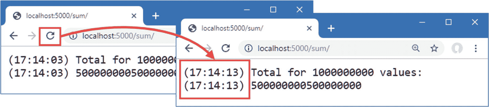

# 十七、使用数据

本书这一部分前面章节中的所有例子都为每个请求生成了新的响应，这在处理简单的字符串或小的 HTML 片段时很容易做到。大多数真实项目处理的数据生产成本很高，需要尽可能高效地使用。在这一章中，我将描述 ASP.NET Core 提供的缓存数据和缓存整个响应的特性。我还将向您展示如何使用 Entity Framework Core 创建和配置访问数据库中的数据所需的服务。表 [17-1](#Tab1) 将 ASP.NET 处理数据的核心特性放在上下文中。

表 17-1。

将 ASP.NET Core 数据特征置于背景中

<colgroup><col class="tcol1 align-left"> <col class="tcol2 align-left"></colgroup> 
| 

问题

 | 

回答

 |
| --- | --- |
| 它们是什么？ | 本章中描述的功能允许使用以前创建的数据生成响应，这些数据可能是为以前的请求创建的，也可能是存储在数据库中的。 |
| 它们为什么有用？ | 大多数 web 应用处理的数据都需要为每个请求重新创建，代价很高。本章中的功能允许以更少的资源更有效地产生响应。 |
| 它们是如何使用的？ | 使用服务缓存数据值。中间件组件基于`Cache-Control`头缓存响应。通过将 LINQ 查询翻译成 SQL 语句的服务来访问数据库。 |
| 有什么陷阱或限制吗？ | 对于缓存，在部署应用之前测试缓存策略的效果非常重要，这样可以确保在效率和响应性之间找到合适的平衡点。对于 Entity Framework Core，关注发送到数据库的查询以确保它们不会检索应用处理后丢弃的大量数据是很重要的。 |
| 有其他选择吗？ | 本章描述的所有功能都是可选的。您可以选择不缓存数据或响应，或者使用外部缓存。您可以选择不使用数据库，或者使用除实体框架核心之外的框架来访问数据库。 |

Note

本章中的示例依赖于在第 [2](02.html) 章中安装的 SQL Server LocalDB 功能。如果没有安装 LocalDB 和所需的更新，您将会遇到错误。

表 [17-2](#Tab2) 总结了本章内容。

表 17-2。

章节总结

<colgroup><col class="tcol1 align-left"> <col class="tcol2 align-left"> <col class="tcol3 align-left"></colgroup> 
| 

问题

 | 

解决办法

 | 

列表

 |
| --- | --- | --- |
| 缓存数据值 | 设置缓存服务，并在端点和中间件组件中使用它来存储数据值 | 7, 8 |
| 创建永久缓存 | 使用数据库支持的缓存 | 9–14 |
| 缓存整个响应 | 启用缓存中间件并在响应中设置`Cache-Control`头 | 15, 16 |
| 存储应用数据 | 使用实体框架核心 | 17–23, 26–28 |
| 创建数据库模式 | 创建和应用迁移 | 24, 25 |
| 访问端点中的数据 | 使用数据库上下文服务 | Twenty-nine |
| 在日志消息中包含所有请求的详细信息 | 启用敏感数据记录功能 | Thirty |

## 为本章做准备

在这一章中，我继续使用第 16 章中的平台项目。为了准备本章，用清单 [17-1](#PC1) 中所示的代码替换`Startup.cs`文件的内容。

Tip

你可以从 [`https://github.com/apress/pro-asp.net-core-3`](https://github.com/apress/pro-asp.net-core-3) 下载本章以及本书其他章节的示例项目。如果在运行示例时遇到问题，请参见第 [1](01.html) 章获取帮助。

```cs
using Microsoft.AspNetCore.Builder;
using Microsoft.AspNetCore.Http;
using Microsoft.Extensions.DependencyInjection;

namespace Platform {
    public class Startup {

        public void ConfigureServices(IServiceCollection services) {
        }

        public void Configure(IApplicationBuilder app) {
            app.UseDeveloperExceptionPage();
            app.UseStaticFiles();
            app.UseRouting();
            app.UseEndpoints(endpoints => {
                endpoints.MapGet("/", async context => {
                    await context.Response.WriteAsync("Hello World!");
                });
            });
        }
    }
}

Listing 17-1.Replacing the Contents of the Startup.cs File in the Platform Folder

```

为了降低应用显示的日志消息的详细程度，对`appsettings.Development.json`文件进行清单 [17-2](#PC2) 所示的更改。

```cs
{
    "Logging": {
      "LogLevel": {
        "Default": "Debug",
        "System": "Information",
        "Microsoft": "Information",
        "Microsoft.AspnetCore.Hosting.Diagnostics": "None"
      }
    }
}

Listing 17-2.Changing the Log Detail in the appsettings.Development.json File in the Platform Folder

```

如果您使用的是 Visual Studio，请选择项目➤平台属性，导航到调试选项卡，取消选中启用 SSL 选项(如图 [17-1](#Fig1) 所示)，然后选择文件➤全部保存。


图 17-1。

禁用 HTTPS

如果您使用的是 Visual Studio 代码，打开`Properties/launchSettings.json`文件删除 HTTPS URL，如清单 [17-3](#PC3) 所示。

```cs
{
  "iisSettings": {
    "windowsAuthentication": false,
    "anonymousAuthentication": true,
    "iisExpress": {
      "applicationUrl": "http://localhost:5000",
      "sslPort": 0
    }
  },
  "profiles": {
    "IIS Express": {
      "commandName": "IISExpress",
      "launchBrowser": true,
      "environmentVariables": {
        "ASPNETCORE_ENVIRONMENT": "Development"
      }
    },
    "Platform": {
      "commandName": "Project",
      "launchBrowser": true,
      "environmentVariables": {
        "ASPNETCORE_ENVIRONMENT": "Development"
      },
      "applicationUrl": "http://localhost:5000"
    }
  }
}

Listing 17-3.Disabling SSL in the launchSettings.json File in the Platform/Properties Folder

```

通过从调试菜单中选择启动而不调试或运行而不调试来启动应用，或者通过打开新的 PowerShell 命令提示符，导航到`Platform`项目文件夹(包含`Platform.csproj`文件)，并运行清单 [17-4](#PC4) 中所示的命令。

```cs
dotnet run

Listing 17-4.Starting the ASP.NET Core Runtime

```

如果应用是使用 Visual Studio 或 Visual Studio 代码启动的，一个新的浏览器窗口将会打开并显示如图 [17-2](#Fig2) 所示的内容。如果应用是从命令行启动的，打开一个新的浏览器选项卡并导航到`https://localhost:5000`；您将看到如图 [17-2](#Fig2) 所示的内容。


图 17-2。

运行示例应用

## 缓存数据

在大多数 web 应用中，会有一些数据项的生成成本相对较高，但是需要重复使用。数据的确切性质因每个项目而异，但重复执行同一组计算会增加托管应用所需的资源，并推高托管成本。为了表示一个昂贵的响应，用清单 [17-5](#PC5) 中所示的代码将一个名为`SumEndpoint.cs`的类文件添加到`Platform`文件夹中。

```cs
using Microsoft.AspNetCore.Http;
using System;
using System.Threading.Tasks;

namespace Platform {

    public class SumEndpoint {

        public async Task Endpoint(HttpContext context) {
            int count = int.Parse((string)context.Request.RouteValues["count"]);
            long total = 0;
            for (int i = 1; i <= count; i++) {
                total += i;
            }
            string totalString = $"({ DateTime.Now.ToLongTimeString() }) {total}";
            await context.Response.WriteAsync(
                $"({DateTime.Now.ToLongTimeString()}) Total for {count}"
                + $" values:\n{totalString}\n");
        }
    }
}

Listing 17-5.The Contents of the SumEndpoint.cs File in the Platform Folder

```

清单 [17-6](#PC6) 创建了一个使用端点的路由，它是使用第 [13 章](13.html)中创建的`MapEndpoint`扩展方法应用的。

```cs
using Microsoft.AspNetCore.Builder;
using Microsoft.AspNetCore.Http;
using Microsoft.Extensions.DependencyInjection;

namespace Platform {
    public class Startup {

        public void ConfigureServices(IServiceCollection services) {
        }

        public void Configure(IApplicationBuilder app) {
            app.UseDeveloperExceptionPage();
            app.UseStaticFiles();
            app.UseRouting();
            app.UseEndpoints(endpoints => {

                endpoints.MapEndpoint<SumEndpoint>("/sum/{count:int=1000000000}");

                endpoints.MapGet("/", async context => {
                    await context.Response.WriteAsync("Hello World!");
                });
            });
        }
    }
}

Listing 17-6.Adding an Endpoint in the Startup.cs File in the Platform Folder

```

重启 ASP.NET Core 并使用浏览器请求`https://localhost:5000/sum`。端点将对 1，000，000，000 个整数值求和，并产生如图 [17-3](#Fig3) 所示的结果。

重新加载浏览器窗口，端点将重复计算。如图所示，响应中的两个时间戳都发生了变化，表明响应的每个部分都是为每个请求重新生成的。

Tip

您可能需要根据机器的性能增加或减少 route 参数的默认值。试着找出一个需要两三秒钟才能得出结果的值——足够长的时间让你知道计算是在什么时候进行的，但不要长到让你能在计算发生的时候出去喝咖啡。



图 17-3。

昂贵的回应

### 缓存数据值

ASP.NET Core 提供了一种服务，可以通过`IDistributedCache`接口缓存数据值。清单 [17-7](#PC7) 修改端点以声明对服务的依赖，并使用它来缓存计算值。

```cs
using Microsoft.AspNetCore.Http;
using System;
using System.Threading.Tasks;
using Microsoft.Extensions.Caching.Distributed;

namespace Platform {

    public class SumEndpoint {

        public async Task Endpoint(HttpContext context, IDistributedCache cache) {
            int count = int.Parse((string)context.Request.RouteValues["count"]);
            string cacheKey = $"sum_{count}";
            string totalString = await cache.GetStringAsync(cacheKey);
            if (totalString == null) {
                long total = 0;
                for (int i = 1; i <= count; i++) {
                    total += i;
                }
                totalString = $"({ DateTime.Now.ToLongTimeString() }) {total}";
                await cache.SetStringAsync(cacheKey, totalString,
                    new DistributedCacheEntryOptions {
                        AbsoluteExpirationRelativeToNow = TimeSpan.FromMinutes(2)
                    });
            }
            await context.Response.WriteAsync(
                $"({DateTime.Now.ToLongTimeString()}) Total for {count}"
                + $" values:\n{totalString}\n");
        }
    }
}

Listing 17-7.Using the Cache Service in the SumEndpoint.cs File in the Platform Folder

```

缓存服务只能存储字节数组，这可能是限制性的，但允许使用一系列的`IDistributedCache`实现。有一些扩展方法允许使用字符串，这是缓存大多数数据的一种更方便的方式。表 [17-3](#Tab3) 描述了使用缓存的最有用的方法。

表 17-3。

有用的分布式缓存方法

<colgroup><col class="tcol1 align-left"> <col class="tcol2 align-left"></colgroup> 
| 

名字

 | 

描述

 |
| --- | --- |
| `GetString(key)` | 该方法返回与指定键相关联的缓存字符串，如果没有这样的项，则返回`null`。 |
| `GetStringAsync(key)` | 该方法返回一个产生与键相关联的缓存字符串的`Task<string>`，如果没有这样的项，则返回`null`。 |
| `SetString(key, value, options)` | 此方法使用指定的键将字符串存储在缓存中。缓存条目可以用可选的`DistributedCacheEntryOptions`对象进行配置。 |
| `SetStringAsync(key, value, options)` | 此方法使用指定的键将字符串异步存储在缓存中。缓存条目可以用可选的`DistributedCacheEntryOptions`对象进行配置。 |
| `Refresh(key)` | 此方法重置与键关联的值的过期间隔，防止它从缓存中被刷新。 |
| `RefreshAsync(key)` | 此方法异步重置与键关联的值的过期间隔，防止它从缓存中被刷新。 |
| `Remove(key)` | 此方法移除与键关联的缓存项。 |
| `RemoveAsync(key)` | 此方法异步移除与键关联的缓存项。 |

默认情况下，条目会无限期地保留在缓存中，但是`SetString`和`SetStringAsync`方法接受一个可选的`DistributedCacheEntryOptions`参数，该参数用于设置过期策略，告知缓存何时弹出条目。表 [17-4](#Tab4) 显示了由`DistributedCacheEntryOptions`类定义的属性。

表 17-4。

DistributedCacheEntryOptions 属性

<colgroup><col class="tcol1 align-left"> <col class="tcol2 align-left"></colgroup> 
| 

名字

 | 

描述

 |
| --- | --- |
| `AbsoluteExpiration` | 该属性用于指定绝对到期日期。 |
| `AbsoluteExpirationRelativeToNow` | 此属性用于指定相对到期日期。 |
| `SlidingExpiration` | 此属性用于指定一段不活动的时间，在此时间后，如果该项未被读取，将从缓存中弹出。 |

在清单 [17-7](#PC7) 中，端点使用`GetStringAsync`来查看是否有来自先前请求的缓存结果。如果没有缓存的值，端点执行计算并使用`SetStringAsync`方法缓存结果，用`AbsoluteExpirationRelativeToNow`属性告诉缓存在两分钟后弹出该项。

```cs
...
await cache.SetStringAsync(cacheKey, totalStr,
    new DistributedCacheEntryOptions {
        AbsoluteExpirationRelativeToNow = TimeSpan.FromMinutes(2)
    });
...

```

下一步是在`Startup`类中设置缓存服务，如清单 [17-8](#PC9) 所示。

```cs
using Microsoft.AspNetCore.Builder;
using Microsoft.AspNetCore.Http;
using Microsoft.Extensions.DependencyInjection;

namespace Platform {
    public class Startup {

        public void ConfigureServices(IServiceCollection services) {
            services.AddDistributedMemoryCache(opts => {
                opts.SizeLimit = 200;
            });
        }

        public void Configure(IApplicationBuilder app) {
            app.UseDeveloperExceptionPage();
            app.UseStaticFiles();
            app.UseRouting();
            app.UseEndpoints(endpoints => {

                endpoints.MapEndpoint<SumEndpoint>("/sum/{count:int=1000000000}");

                endpoints.MapGet("/", async context => {
                    await context.Response.WriteAsync("Hello World!");
                });
            });
        }
    }
}

Listing 17-8.Adding a Service in the Startup.cs File in the Platform Folder

```

`AddDistributedMemoryCache`是我在第 [16 章](16.html)中使用的为会话数据提供数据存储的相同方法。这是用于选择`IDistributedCache`服务实现的三种方法之一，如表 [17-5](#Tab5) 所述。

表 17-5。

缓存服务的实现方法

<colgroup><col class="tcol1 align-left"> <col class="tcol2 align-left"></colgroup> 
| 

名字

 | 

描述

 |
| --- | --- |
| `AddDistributedMemoryCache` | 此方法设置内存中的缓存。 |
| `AddDistributedSqlServerCache` | 该方法设置一个缓存，在 SQL Server 中存储数据，并且在安装了`Microsoft.Extensions.Caching.SqlServer`包时可用。有关详细信息，请参见“缓存响应”一节。 |
| `AddStackExchangeRedisCache` | 这个方法设置了一个 Redis 缓存，并且在安装了`Microsoft.Extensions.Caching.Redis`包时可用。 |

清单 [17-8](#PC9) 使用`AddDistributedMemoryCache`方法创建一个内存缓存作为`IDistributedCache`服务的实现。该缓存使用`MemoryCacheOptions`类进行配置，其最有用的属性在表 [17-6](#Tab6) 中描述。

表 17-6。

有用的 MemoryCacheOptions 属性

<colgroup><col class="tcol1 align-left"> <col class="tcol2 align-left"></colgroup> 
| 

名字

 | 

描述

 |
| --- | --- |
| `ExpirationScanFrequency` | 该属性用于设置一个`TimeSpan`,该值决定缓存扫描过期项目的频率。 |
| `SizeLimit` | 此属性指定缓存中的最大项数。当达到该大小时，缓存将弹出项目。 |
| `CompactionPercentage` | 该属性指定当达到`SizeLimit`时，缓存大小减少的百分比。 |

清单 [17-8](#PC9) 中的语句使用`SizeLimit`属性将缓存限制为 200 项。当使用内存缓存时，必须注意在为缓存分配足够的内存和不耗尽服务器资源之间找到适当的平衡。

要查看缓存的效果，重启 ASP.NET Core 并请求`http://localhost:5000/sum` URL。重新加载浏览器，你会看到只有一个时间戳会改变，如图 [17-4](#Fig4) 所示。这是因为缓存已经提供了计算响应，这允许端点产生结果而不必重复计算。


图 17-4。

缓存数据值

如果您等待两分钟，然后重新加载浏览器，那么两个时间戳都将改变，因为缓存的结果将被弹出，并且端点将必须执行计算以产生结果。

### 使用共享和持久的数据缓存

由`AddDistributedMemoryCache`方法创建的缓存并不是分布式的，尽管有这个名字。这些项目作为 ASP.NET Core 进程的一部分存储在内存中，这意味着在多个服务器或容器上运行的应用不会共享缓存数据。这也意味着当 ASP.NET Core 停止时，缓存的内容会丢失。

`AddDistributedSqlServerCache`方法将缓存数据存储在一个 SQL Server 数据库中，该数据库可以在多个 ASP.NET Core 服务器之间共享，并永久存储数据。

第一步是创建一个用于存储缓存数据的数据库。您可以将缓存的数据与应用的其他数据存储在一起，但是对于本章，我将使用一个单独的数据库，它将被命名为`CacheDb`。您可以使用 Azure Data Studio 或 SQL Server Management Studio 创建数据库，这两个工具都可以从微软免费获得。也可以使用`sqlcmd`从命令行创建数据库。打开一个新的 PowerShell 命令提示符并运行清单 [17-9](#PC10) 中所示的命令来连接到 LocalDB 服务器。

Tip

`sqlcmd`工具应该已经作为 Visual Studio 工作负载的一部分或 SQL Server Express 安装的一部分安装。如果还没有安装，那么你可以从 [`https://docs.microsoft.com/en-us/sql/tools/sqlcmd-utility?view=sql-server-2017`](https://docs.microsoft.com/en-us/sql/tools/sqlcmd-utility%253Fview%253Dsql-server-2017) 下载一个安装程序。

```cs
sqlcmd -S "(localdb)\MSSQLLocalDB"

Listing 17-9.Connecting to the Database

```

请密切注意指定数据库的参数。有一个反斜杠，后面是`MSSQLLocalDB`。很难找出重复的字母:M**S**-**S**Q**L**-**L**ocalDB(但没有连字符)。

当连接建立后，您将看到一个`1>`提示。输入清单 [17-10](#PC11) 中所示的命令，并在每个命令后按回车键。

Caution

如果您使用的是 Visual Studio，您必须应用第 [2](02.html) 章中描述的 SQL Server 更新。安装 Visual Studio 时默认安装的 SQL Server 版本无法创建 LocalDB 数据库。

```cs
CREATE DATABASE CacheDb
GO

Listing 17-10.Creating the Database

```

如果没有报告错误，则输入`exit`并按回车键终止连接。下一步是运行清单 [17-11](#PC12) 中所示的命令，在新数据库中创建一个表，它使用一个全局。NET 核心工具编写的数据库。

Tip

如果需要重置缓存数据库，使用清单 [17-9](#PC10) 中的命令打开一个连接，并使用命令`DROP DATABASE CacheDB`。然后，您可以使用清单 [17-10](#PC11) 中的命令重新创建数据库。

```cs
dotnet sql-cache create "Server=(localdb)\MSSQLLocalDB;Database=CacheDb" dbo DataCache

Listing 17-11.Creating the Cache Database Table

```

该命令的参数是指定数据库的连接字符串、模式以及将用于存储缓存数据的表的名称。在一行中输入命令，然后按 Enter 键。该工具需要几秒钟时间才能连接到数据库。如果该过程成功，您将看到以下消息:

```cs
Table and index were created successfully.

```

#### 创建持久缓存服务

现在数据库已经准备好了，我可以创建使用它来存储缓存数据的服务。要添加 SQL Server 缓存支持所需的 NuGet 包，请打开一个新的 PowerShell 命令提示符，导航到`Platform`项目文件夹，并运行清单 [17-12](#PC14) 中所示的命令。(如果您使用的是 Visual Studio，可以通过选择“项目➤管理 Nuget 包”来添加包。)

```cs
dotnet add package Microsoft.Extensions.Caching.SqlServer --version 3.1.1

Listing 17-12.Adding a Package to the Project

```

下一步是定义一个连接字符串，它描述了 JSON 配置文件中的数据库连接，如清单 [17-13](#PC15) 所示。

Note

由`AddDistributedSqlServerCache`方法创建的缓存是分布式的，这意味着多个应用可以使用同一个数据库并共享缓存数据。如果您将同一个应用部署到多个服务器或容器，所有实例将能够共享缓存的数据。如果您在不同的应用之间共享缓存，那么您应该密切注意您使用的键，以确保应用接收到它们期望的数据类型。

```cs
{
    "Location": {
        "CityName": "Buffalo"
    },
    "Logging": {
      "LogLevel": {
        "Default": "Information",
        "Microsoft": "Warning",
        "Microsoft.Hosting.Lifetime": "Information"
      }
    },
    "AllowedHosts": "*",
    "ConnectionStrings": {
        "CacheConnection": "Server=(localdb)\\MSSQLLocalDB;Database=CacheDb"
      }
  }

Listing 17-13.Defining a Connection String in the appsettings.json File in the Platform Folder

```

注意，连接字符串使用两个反斜杠字符(`\\`)来转义 JSON 文件中的字符。清单 [17-14](#PC16) 将`Startup`类中缓存服务的实现改为使用 SQL Server 和清单 [17-13](#PC15) 中的连接字符串。

```cs
using Microsoft.AspNetCore.Builder;
using Microsoft.AspNetCore.Http;
using Microsoft.Extensions.DependencyInjection;
using Microsoft.Extensions.Configuration;

namespace Platform {
    public class Startup {

        public Startup(IConfiguration config) {
            Configuration = config;
        }

        private IConfiguration Configuration {get; set;}

        public void ConfigureServices(IServiceCollection services) {

            services.AddDistributedSqlServerCache(opts => {
                opts.ConnectionString
                    = Configuration["ConnectionStrings:CacheConnection"];
                opts.SchemaName = "dbo";
                opts.TableName = "DataCache";
            });
        }

        public void Configure(IApplicationBuilder app) {
            app.UseDeveloperExceptionPage();
            app.UseStaticFiles();
            app.UseRouting();
            app.UseEndpoints(endpoints => {

                endpoints.MapEndpoint<SumEndpoint>("/sum/{count:int=1000000000}");

                endpoints.MapGet("/", async context => {
                    await context.Response.WriteAsync("Hello World!");
                });
            });
        }
    }
}

Listing 17-14.Using a Persistent Data Cache in the Startup.cs File in the Platform Folder

```

`IConfiguration`服务用于从应用的配置数据中访问连接字符串。缓存服务使用`AddDistributedSqlServerCache`方法创建，并使用`SqlServerCacheOptions`类的实例进行配置，其最有用的属性在表 [17-7](#Tab7) 中描述。

表 17-7。

有用的 SqlServerCacheOptions 属性

<colgroup><col class="tcol1 align-left"> <col class="tcol2 align-left"></colgroup> 
| 

名字

 | 

描述

 |
| --- | --- |
| `ConnectionString` | 该属性指定连接字符串，它通常存储在 JSON 配置文件中，通过`IConfguration`服务访问。 |
| `SchemaName` | 此属性指定高速缓存表的模式名称。 |
| `TableName` | 此属性指定缓存表的名称。 |
| `ExpiredItemsDeletionInterval` | 此属性指定扫描表中过期项目的频率。默认值为 30 分钟。 |
| `DefaultSlidingExpiration` | 此属性指定项目过期前在缓存中保持未读状态的时间。默认值为 20 分钟。 |

清单使用`ConnectionString`、`SchemaName`和`TableName`属性来配置缓存中间件，以使用数据库表。重启 ASP.NET Core 并使用浏览器请求`http://localhost:5000/sum` URL。应用产生的响应没有变化，如图 [17-4](#Fig4) 所示，但是你会发现缓存的响应是持久的，甚至当你重启 ASP.NET Core 时也会被使用。

Caching Session-Specific Data Values

当您使用`IDistributedCache`服务时，数据值在所有请求之间共享。如果你想为每个用户缓存不同的数据值，那么你可以使用第 [16 章](16.html)中描述的会话中间件。会话中间件依赖于`IDistributedCache`服务来存储它的数据，这意味着当使用`AddDistributedSqlServerCache`方法时，会话数据将被持久地存储并可供分布式应用使用。

## 缓存响应

缓存单个数据项的另一种方法是缓存整个响应，如果一个响应的编写成本很高并且可能会重复，这种方法会很有用。缓存响应需要添加服务和中间件组件，如清单 [17-15](#PC17) 所示。

```cs
using Microsoft.AspNetCore.Builder;
using Microsoft.AspNetCore.Http;
using Microsoft.Extensions.DependencyInjection;
using Microsoft.Extensions.Configuration;
using Platform.Services;

namespace Platform {
    public class Startup {

        public Startup(IConfiguration config) {
            Configuration = config;
        }

        private IConfiguration Configuration {get; set;}

        public void ConfigureServices(IServiceCollection services) {
            services.AddDistributedSqlServerCache(opts => {
                opts.ConnectionString
                    = Configuration["ConnectionStrings:CacheConnection"];
                opts.SchemaName = "dbo";
                opts.TableName = "DataCache";
            });
            services.AddResponseCaching();
            services.AddSingleton<IResponseFormatter, HtmlResponseFormatter>();
        }

        public void Configure(IApplicationBuilder app) {
            app.UseDeveloperExceptionPage();
            app.UseResponseCaching();
            app.UseStaticFiles();
            app.UseRouting();
            app.UseEndpoints(endpoints => {

                endpoints.MapEndpoint<SumEndpoint>("/sum/{count:int=1000000000}");

                endpoints.MapGet("/", async context => {
                    await context.Response.WriteAsync("Hello World!");
                });
            });
        }
    }
}

Listing 17-15.Configuring Response Caching in the Startup.cs File in the Platform Folder

```

在`ConfigureServices`方法中使用了`AddResponseCaching`方法来设置缓存使用的服务。中间件组件添加了`UseResponseCaching`方法，该方法应该在任何需要缓存其响应的端点或中间件之前被调用。

我还定义了`IResponseFormatter`服务，在第 [14 章](14.html)中，我用它来解释依赖注入是如何工作的。响应缓存只在某些情况下使用，正如我简短解释的那样，演示该特性需要 HTML 响应。

Note

响应缓存特性不使用`IDistributedCache`服务。响应被缓存在内存中，不会被分发。

在清单 [17-16](#PC18) 中，我已经更新了`SumEndpoint`类，以便它请求响应缓存，而不是只缓存一个数据值。

```cs
using Microsoft.AspNetCore.Http;
using System;
using System.Threading.Tasks;
using Microsoft.Extensions.Caching.Distributed;
using Microsoft.AspNetCore.Routing;
using Platform.Services;

namespace Platform {

    public class SumEndpoint {

        public async Task Endpoint(HttpContext context, IDistributedCache cache,
                IResponseFormatter formatter, LinkGenerator generator) {
            int count = int.Parse((string)context.Request.RouteValues["count"]);
            long total = 0;
            for (int i = 1; i <= count; i++) {
                total += i;
            }
            string totalString = $"({ DateTime.Now.ToLongTimeString() }) {total}";

            context.Response.Headers["Cache-Control"] = "public, max-age=120";

            string url = generator.GetPathByRouteValues(context, null,
                new { count = count });

            await formatter.Format(context,
                $"<div>({DateTime.Now.ToLongTimeString()}) Total for {count}"
                + $" values:</div><div>{totalString}</div>"
                + $"<a href={url}>Reload</a>");
        }
    }
}

Listing 17-16.Using Response Caching in the SumEndpoint.cs File in the Platform Folder

```

对端点的一些更改启用了响应缓存，但其他更改只是为了证明它正在工作。要启用响应缓存，重要的语句是向响应添加一个头，如下所示:

```cs
...
context.Response.Headers["Cache-Control"] = "public, max-age=120";
...

```

`Cache-Control`头用于控制响应缓存。中间件将只缓存具有包含`public`指令的`Cache-Control`报头的响应。`max-age`指令用于指定响应可以被缓存的时间，以秒为单位。清单 [17-16](#PC18) 中使用的`Cache-Control`头启用缓存，并指定响应可以被缓存两分钟。

启用响应缓存很简单，但是检查它是否工作需要小心。当您重新加载浏览器窗口或在 URL 栏中按 Return 键时，浏览器会在请求中包含一个`Cache-Control`头，将`max-age`指令设置为零，这将绕过响应缓存并导致端点生成新的响应。请求没有`Cache-Control`头的 URL 的唯一可靠方法是使用 HTML 锚元素导航，这就是为什么清单 [17-16](#PC18) 中的端点使用`IResponseFormatter`服务生成 HTML 响应，并使用`LinkGenerator`服务创建可以在锚元素的`href`属性中使用的 URL。

要检查响应缓存，重启 ASP.NET Core 并使用浏览器请求`http://localhost:5000/sum`。生成响应后，单击 Reload 链接请求相同的 URL。您将看到响应中的时间戳都没有改变，这表明整个响应都已被缓存，如图 [17-5](#Fig5) 所示。


图 17-5。

缓存响应

可以将`Cache-Control`头与`Vary`头结合起来，以提供对缓存哪些请求的细粒度控制。请参见 [`https://developer.mozilla.org/en-US/docs/Web/HTTP/Headers/Cache-Control`](https://developer.mozilla.org/en-US/docs/Web/HTTP/Headers/Cache-Control) 和 [`https://developer.mozilla.org/en-US/docs/Web/HTTP/Headers/Vary`](https://developer.mozilla.org/en-US/docs/Web/HTTP/Headers/Vary) 了解两种接头提供的功能详情。

Compressing Responses

ASP.NET Core 包括中间件，将压缩浏览器的响应，表明他们可以处理压缩数据。使用`UseResponseCompression`方法将中间件添加到管道中。压缩是压缩所需的服务器资源和向客户端传送内容所需的带宽之间的一种权衡，在没有测试以确定性能影响之前，不应启用压缩。

## 使用实体框架核心

并非所有的数据值都是由应用直接生成的，大多数项目都需要访问数据库中的数据。实体框架核心很好地集成到 ASP.NET Core 平台中，很好地支持从 C# 类创建数据库，以及创建 C# 类来表示现有的数据库。在接下来的小节中，我将演示创建一个简单数据模型的过程，使用它来创建一个数据库，并在端点中查询该数据库。

Working With Entity Framework Core

关于实体框架核心最常见的抱怨是糟糕的性能。当我审查有实体框架核心性能问题的项目时，问题几乎总是因为开发团队将实体框架核心视为黑盒，而没有注意发送到数据库的 SQL 查询。并非所有的 LINQ 功能都可以转换为 SQL，最常见的问题是从数据库中检索大量数据的查询，这些数据在被简化为单个值后会被丢弃。

使用 Entity Framework Core 需要很好地理解 SQL，并确保应用所做的 LINQ 查询被翻译成高效的 SQL 查询。很少有应用具有实体框架核心无法满足的高性能数据需求，但大多数典型的 web 应用并非如此。

这并不是说实体框架核心是完美的。它有自己的怪癖，需要投入时间才能精通。如果你不喜欢实体框架核心的工作方式，那么你可能更喜欢使用一个替代品，比如 Dapper ( [`https://github.com/StackExchange/Dapper`](https://github.com/StackExchange/Dapper) )。但是如果您的问题是查询执行得不够快，那么您应该花一些时间探索这些查询是如何被处理的，这可以使用本章剩余部分中描述的技术来完成。

### 安装实体框架核心

实体框架核心需要一个全局工具包，用于从命令行管理数据库以及管理提供数据访问的项目包。要安装工具包，请打开一个新的 PowerShell 命令提示符，并运行清单 [17-17](#PC20) 中所示的命令。

```cs
dotnet tool uninstall --global dotnet-ef
dotnet tool install --global dotnet-ef --version 3.1.1

Listing 17-17.Installing the Entity Framework Core Global Tool Package

```

第一个命令删除`dotnet-ef`包的任何现有版本，第二个命令安装本书中示例所需的版本。这个包提供了您将在后面的例子中看到的`dotnet ef`命令。为了确保软件包按预期工作，运行清单 [17-18](#PC21) 中所示的命令。

```cs
dotnet ef --help

Listing 17-18.Testing the Entity Framework Core Global Tool

```

此命令显示全局工具的帮助消息，并产生以下输出:

```cs
Entity Framework Core .NET Command-line Tools 3.1.1
Usage: dotnet ef [options] [command]
Options:
  --version        Show version information
  -h|--help        Show help information
  -v|--verbose     Show verbose output.
  --no-color       Don't colorize output.
  --prefix-output  Prefix output with level.
Commands:
  database    Commands to manage the database.
  dbcontext   Commands to manage DbContext types.
  migrations  Commands to manage migrations.
Use "dotnet ef [command] --help" for more information about a command.

```

实体框架核心还要求将包添加到项目中。如果您正在使用 Visual Studio 代码或者喜欢从命令行工作，导航到`Platform`项目文件夹(包含`Platform.csproj`文件的文件夹)并运行清单 [17-19](#PC23) 中所示的命令。

```cs
dotnet add package Microsoft.EntityFrameworkCore.Design --version 3.1.1
dotnet add package Microsoft.EntityFrameworkCore.SqlServer --version 3.1.1

Listing 17-19.Adding Entity Framework Core Packages to the Project

```

### 创建数据模型

对于这一章，我将使用 C# 类定义数据模型，并使用实体框架核心创建数据库和模式。创建`Platform/Models`文件夹，并在其中添加一个名为`Calculation.cs`的类文件，其内容如清单 [17-20](#PC24) 所示。

```cs
namespace Platform.Models {

    public class Calculaton {
        public long Id { get; set; }
        public int Count { get; set; }
        public long Result { get; set; }
    }
}

Listing 17-20.The Contents of the Calculation.cs File in the Platform/Models Folder

```

您可以在其他章节中看到更复杂的数据模型，但是对于这个示例，我将继续讨论本章的主题，并对前面示例中执行的计算进行建模。`Id`属性将用于为存储在数据库中的每个对象创建一个唯一的键，而`Count`和`Result`属性将描述一个计算及其结果。

实体框架核心使用一个提供数据库访问的上下文类。在`Platform/Models`文件夹中添加一个名为`CalculationContext.cs`的文件，内容如清单 [17-21](#PC25) 所示。

```cs
using Microsoft.EntityFrameworkCore;

namespace Platform.Models {

    public class CalculationContext: DbContext {

        public CalculationContext(DbContextOptions<CalculationContext> opts)
            : base(opts) {}

        public DbSet<Calculaton> Calculations { get; set; }
    }
}

Listing 17-21.The Contents of the CalculationContext.cs File in the Platform/Models Folder

```

`CalculationContext`类定义了一个构造函数，用于接收传递给基本构造函数的 options 对象。`Calculations`属性提供对实体框架核心将从数据库中检索的`Calculation`对象的访问。

### 配置数据库服务

对数据库的访问是通过在`Startup`类中配置的服务提供的，如清单 [17-22](#PC26) 所示。

```cs
using Microsoft.AspNetCore.Builder;
using Microsoft.AspNetCore.Http;
using Microsoft.Extensions.DependencyInjection;
using Microsoft.Extensions.Configuration;
using Platform.Services;
using Microsoft.EntityFrameworkCore;
using Platform.Models;

namespace Platform {
    public class Startup {

        public Startup(IConfiguration config) {
            Configuration = config;
        }

        private IConfiguration Configuration {get; set;}

        public void ConfigureServices(IServiceCollection services) {
            services.AddDistributedSqlServerCache(opts => {
                opts.ConnectionString
                    = Configuration["ConnectionStrings:CacheConnection"];
                opts.SchemaName = "dbo";
                opts.TableName = "DataCache";
            });
            services.AddResponseCaching();
            services.AddSingleton<IResponseFormatter, HtmlResponseFormatter>();

            services.AddDbContext<CalculationContext>(opts => {
                opts.UseSqlServer(Configuration["ConnectionStrings:CalcConnection"]);
            });
        }

        public void Configure(IApplicationBuilder app) {
            app.UseDeveloperExceptionPage();
            app.UseResponseCaching();
            app.UseStaticFiles();
            app.UseRouting();
            app.UseEndpoints(endpoints => {

                endpoints.MapEndpoint<SumEndpoint>("/sum/{count:int=1000000000}");

                endpoints.MapGet("/", async context => {
                    await context.Response.WriteAsync("Hello World!");
                });
            });
        }
    }
}

Listing 17-22.Configuring the Data Service in the Startup.cs File in the Platform Folder

```

`AddDbContext`方法为实体框架核心上下文类创建服务。该方法接收一个用于选择数据库提供者的 options 对象，这是通过`UseSqlServer`方法完成的。`IConfiguration`服务用于获取数据库的连接字符串，这在清单 [17-23](#PC27) 中定义。

```cs
{
    "Location": {
        "CityName": "Buffalo"
    },
    "Logging": {
      "LogLevel": {
        "Default": "Information",
        "Microsoft": "Warning",
        "Microsoft.Hosting.Lifetime": "Information",
        "Microsoft.EntityFrameworkCore": "Information"
      }
    },
    "AllowedHosts": "*",
    "ConnectionStrings": {
        "CacheConnection": "Server=(localdb)\\MSSQLLocalDB;Database=CacheDb",
        "CalcConnection": "Server=(localdb)\\MSSQLLocalDB;Database=CalcDb"
      }
  }

Listing 17-23.Defining a Connection String in the appsettings.json File in the Platform Folder

```

该清单还为`Microsoft.EntityFrameworkCore`类别设置了日志记录级别，这将显示实体框架核心用来查询数据库的 SQL 语句。

Tip

将用于查询多个结果集的连接字符串的`MultipleActiveResultSets`选项设置为`True`。您可以在第 [7](07.html) 章的 SportsStore 项目的连接字符串中看到该选项设置的示例。

### 创建和应用数据库迁移

实体框架核心使用一个称为*迁移*的特性来管理数据模型类和数据库之间的关系。当对模型类进行更改时，会创建一个新的迁移，该迁移会修改数据库以匹配这些更改。为了创建初始迁移，这将创建一个新的数据库并准备好存储`Calculation`对象，打开一个新的 PowerShell 命令提示符，导航到包含`Platform.csproj`文件的文件夹，并运行清单 [17-24](#PC28) 中所示的命令。

```cs
dotnet ef migrations add Initial

Listing 17-24.Creating a Migration

```

`dotnet ef`命令与实体框架核心相关。清单 [17-24](#PC28) 中的命令创建了一个名为`Initial`的新迁移，这是一个项目的第一个迁移的传统名称。您将会看到一个`Migrations`文件夹已经被添加到项目中，并且它包含了一些类文件，这些类文件的语句准备好了数据库，以便它能够存储数据模型中的对象。要应用迁移，运行`Platform`项目文件夹中清单 [17-25](#PC29) 中所示的命令。

```cs
dotnet ef database update

Listing 17-25.Applying a Migration

```

该命令执行在清单 [17-24](#PC28) 中创建的迁移中的命令，并使用它们来准备数据库，这可以在写入命令提示符的 SQL 语句中看到。

### 为数据库设定种子

大多数应用需要一些种子数据，尤其是在开发期间。Entity Framework Core 确实提供了一个数据库种子特性，但是对于大多数项目来说，它的用途是有限的，因为它不允许在数据库为其存储的对象分配唯一键的情况下将数据作为种子。这在大多数数据模型中是一个重要的特性，因为这意味着应用不必担心分配唯一的键值。

更灵活的方法是使用常规的实体框架核心特性向数据库添加种子数据。在`Platform/Models`文件夹中创建一个名为`SeedData.cs`的文件，代码如清单 [17-26](#PC30) 所示。

```cs
using Microsoft.EntityFrameworkCore;
using Microsoft.Extensions.Logging;
using System.Collections.Generic;
using System.Linq;

namespace Platform.Models {
    public class SeedData {
        private CalculationContext context;
        private ILogger<SeedData> logger;

        private static Dictionary<int, long> data
            = new Dictionary<int, long>() {
                {1, 1}, {2, 3}, {3, 6}, {4, 10}, {5, 15},
                {6, 21}, {7, 28}, {8, 36}, {9, 45}, {10, 55}
            };

        public SeedData(CalculationContext dataContext, ILogger<SeedData> log) {
            context = dataContext;
            logger = log;
        }

        public void SeedDatabase() {
            context.Database.Migrate();
            if (context.Calculations.Count() == 0) {
                logger.LogInformation("Preparing to seed database");
                context.Calculations!.AddRange(data.Select(kvp => new Calculaton() {
                    Count = kvp.Key, Result = kvp.Value
                }));
                context.SaveChanges();
                logger.LogInformation("Database seeded");
            } else {
                logger.LogInformation("Database not seeded");
            }
        }
    }
}

Listing 17-26.The Contents of the SeedData.cs File in the Platform/Models Folder

```

`SeedData`类声明了对`CalculationContext`和`ILogger<T>`类型的构造函数依赖，它们在`SeedDatabase`方法中用来准备数据库。上下文的`Database.Migrate`方法用于将任何挂起的迁移应用到数据库，而`Calculations`属性用于使用`AddRange`方法存储新数据，该方法接受一系列`Calculation`对象。

使用`SaveChanges`方法将新对象存储在数据库中。要使用`SeedData`类，对`Startup`类进行清单 [17-27](#PC31) 所示的修改。

```cs
using Microsoft.AspNetCore.Builder;
using Microsoft.AspNetCore.Http;
using Microsoft.Extensions.DependencyInjection;
using Microsoft.Extensions.Configuration;
using Platform.Services;
using Microsoft.EntityFrameworkCore;
using Platform.Models;
using Microsoft.Extensions.Hosting;
using Microsoft.AspNetCore.Hosting;

namespace Platform {
    public class Startup {

        public Startup(IConfiguration config) {
            Configuration = config;
        }

        private IConfiguration Configuration {get; set;}

        public void ConfigureServices(IServiceCollection services) {
            services.AddDistributedSqlServerCache(opts => {
                opts.ConnectionString
                    = Configuration["ConnectionStrings:CacheConnection"];
                opts.SchemaName = "dbo";
                opts.TableName = "DataCache";
            });
            services.AddResponseCaching();
            services.AddSingleton<IResponseFormatter, HtmlResponseFormatter>();

            services.AddDbContext<CalculationContext>(opts => {
                opts.UseSqlServer(Configuration["ConnectionStrings:CalcConnection"]);
            });
            services.AddTransient<SeedData>();
        }

        public void Configure(IApplicationBuilder app,
                IHostApplicationLifetime lifetime, IWebHostEnvironment env,
                SeedData seedData) {
            app.UseDeveloperExceptionPage();
            app.UseResponseCaching();
            app.UseStaticFiles();
            app.UseRouting();
            app.UseEndpoints(endpoints => {

                endpoints.MapEndpoint<SumEndpoint>("/sum/{count:int=1000000000}");

                endpoints.MapGet("/", async context => {
                    await context.Response.WriteAsync("Hello World!");
                });
            });

            bool cmdLineInit = (Configuration["INITDB"] ?? "false") == "true";
            if (env.IsDevelopment() || cmdLineInit) {
                seedData.SeedDatabase();
                if (cmdLineInit) {
                    lifetime.StopApplication();
                }
            }
        }
    }
}

Listing 17-27.Enabling Database Seeding in the Startup.cs File in the Platform Folder

```

`ConfigureServices`方法中的语句创建了一个`SeedData`服务。尽管服务通常是使用接口定义的，如第 [14 章](14.html)中所述，但是有一些版本的`AddSingleton`、`AddScoped`和`AddTransient`方法使用单一类型参数创建服务。这使得实例化具有构造函数依赖关系的类变得容易，并且允许使用服务生命周期。清单 [17-27](#PC31) 中的语句创建了一个瞬态服务，这意味着将创建一个新的`SeedData`对象来解析服务上的每个依赖项。

对`Configure`方法的补充允许数据库在两种情况下被播种。如果托管环境是`Development`，当应用启动时，数据库将被自动植入。显式植入数据库也很有用，尤其是在为试运行或生产测试设置应用时。该语句检查名为`INITDB`的配置设置:

```cs
...
bool cmdLineInit = (Configuration["INITDB"] ?? "false") == "true";
...

```

可以在命令行上提供该设置来播种数据库，之后使用`IHostApplicationLifetime`服务终止应用。这是一个很少使用的服务，但是它提供了应用启动和停止时触发的事件，并且它提供了终止应用的`StopApplication`方法。要查看数据库，打开一个新的 PowerShell 命令提示符，导航到项目文件夹，并运行清单 [17-28](#PC33) 中所示的命令。

```cs
dotnet run INITDB=true

Listing 17-28.Seeding the Database

```

应用将启动，数据库将植入由`SeedData`类定义的十次计算的结果，之后应用将终止。在播种过程中，您将看到发送到数据库的 SQL 语句，这些语句检查是否有任何挂起的迁移，计算用于存储`Calculation`数据的表中的行数，如果表为空，则添加种子数据。

如果您不想使用命令行，那么您可以通过选择 debug➤start without debug 来设定数据库种子。只要环境为`Development`，数据库将作为正常 ASP.NET Core 启动序列的一部分被植入。

Note

如果需要重置数据库，可以使用`dotnet ef database drop --force`命令。然后，您可以使用`dotnet run INITDB=true`重新创建数据库并再次播种。

### 在端点中使用数据

端点和中间件组件通过声明对上下文类的依赖并使用其`DbSet<T>`属性执行 LINQ 查询来访问实体框架核心数据。LINQ 查询被翻译成 SQL 并发送到数据库。从数据库接收的表格数据用于创建数据模型对象，这些对象用于产生响应。清单 [17-29](#PC34) 更新了`SumEndpoint`类以使用实体框架核心。

```cs
using Microsoft.AspNetCore.Http;
using System;
using System.Threading.Tasks;
using Microsoft.Extensions.Caching.Distributed;
using Microsoft.AspNetCore.Routing;
using Platform.Services;
using Platform.Models;
using System.Linq;

namespace Platform {

    public class SumEndpoint {

        public async Task Endpoint(HttpContext context,
                CalculationContext dataContext) {
            int count = int.Parse((string)context.Request.RouteValues["count"]);
            long total = dataContext.Calculations
                .FirstOrDefault(c => c.Count == count)?.Result ?? 0;
            if (total == 0) {
                for (int i = 1; i <= count; i++) {
                    total += i;
                }
                dataContext.Calculations!
                    .Add(new Calculaton() { Count = count, Result = total});
                await dataContext.SaveChangesAsync();
            }
            string totalString = $"({ DateTime.Now.ToLongTimeString() }) {total}";
            await context.Response.WriteAsync(
                $"({DateTime.Now.ToLongTimeString()}) Total for {count}"
                + $" values:\n{totalString}\n");
        }
    }
}

Listing 17-29.Using a Database in the SumEndpoint.cs File in the Platform Folder

```

端点使用 LINQ `FirstOrDefault`来搜索存储的`Calculation`对象，以进行如下请求的计算:

```cs
...
dataContext.Calculations.FirstOrDefault(c => c.Count == count)?.Result ?? 0;
...

```

如果一个对象已经被存储，它被用来准备响应。如果不是，则执行计算，并通过这些语句存储一个新的`Calculation`对象:

```cs
...
dataContext.Calculations!.Add(new Calculaton() { Count = count, Result = total});
await dataContext.SaveChangesAsync();
...

```

`Add`方法用于告诉实体框架核心对象应该被存储，但是直到`SaveChangesAsync`方法被调用时更新才被执行。要查看更改的效果，重启 ASP.NET Core MVC(如果使用命令行，不要使用`INITDB`参数)并请求`http://localhost:5000/sum/10` URL。这是数据库被植入的计算之一，您将能够在应用生成的日志消息中看到发送到数据库的查询。

```cs
...
Executing DbCommand [Parameters=[@__count_0='?' (DbType = Int32)],
   CommandType='Text', CommandTimeout="30"]
SELECT TOP(1) [c].[Id], [c].[Count], [c].[Result]
FROM [Calculations] AS [c]
WHERE ([c].[Count] = @__count_0) AND @__count_0 IS NOT NULL
...

```

如果您请求`http://localhost:5000/sum/100`，将查询数据库，但不会找到任何结果。在产生图 [17-6](#Fig6) 所示的结果之前，端点执行计算并将结果存储在数据库中。


图 17-6。

执行计算

一旦结果被存储在数据库中，对相同 URL 的后续请求将使用存储的数据来满足。您可以在 Entity Framework Core 生成的日志输出中看到用于存储数据的 SQL 语句。

```cs
...
Executing DbCommand [Parameters=[@p0='?' (DbType = Int32), @p1='?' (DbType = Int64)],
    CommandType='Text', CommandTimeout="30"]
SET NOCOUNT ON;
INSERT INTO [Calculations] ([Count], [Result])
VALUES (@p0, @p1);
SELECT [Id]
FROM [Calculations]
WHERE @@ROWCOUNT = 1 AND [Id] = scope_identity();
...

```

Note

请注意，从数据库中检索的数据没有被缓存，每个请求都会导致一个新的 SQL 查询。根据所需查询的频率和复杂性，您可能希望使用本章前面介绍的技术来缓存数据值或响应。

#### 启用敏感数据记录

实体框架核心在其生成的日志消息中不包含参数值，这就是日志输出包含问号的原因，如下所示:

```cs
...
Executing DbCommand [Parameters=[@__count_0='?' (DbType = Int32)], CommandType="Text", CommandTimeout="30"]
...

```

作为一种预防措施，该数据被省略，以防止敏感数据存储在日志中。如果查询有问题，需要查看发送到数据库的值，那么在配置数据库上下文时可以使用`EnableSensitiveDataLogging`方法，如清单 [17-30](#PC40) 所示。

```cs
...
services.AddDbContext<CalculationContext>(opts => {
    opts.UseSqlServer(Configuration["ConnectionStrings:CalcConnection"]);
    opts.EnableSensitiveDataLogging(true);
});
...

Listing 17-30.Enabling Sensitive Data Logging in the Startup.cs File in the Platform Folder

```

重启 ASP.NET Core MVC 并再次请求`http://localhost:5000/sum/100` URL。处理请求时，实体框架核心将在它创建的日志消息中包含参数值，以显示 SQL 查询，如下所示:

```cs
...
Executing DbCommand [Parameters=[@__count_0='100'], CommandType="Text",
    CommandTimeout='30']
SELECT TOP(1) [c].[Id], [c].[Count], [c].[Result]
FROM [Calculations] AS [c]
WHERE ([c].[Count] = @__count_0) AND @__count_0 IS NOT NULL
...

```

这是一个应该谨慎使用的特性，因为日志经常会被那些通常无法访问应用处理的敏感数据(如信用卡号和帐户详细信息)的人访问。

## 摘要

在这一章中，我展示了 ASP.NET Core 平台对处理数据有用的特性。我向您展示了如何在本地和共享数据库中缓存单个数据值。我还向您展示了如何缓存响应，以及如何使用 Entity Framework Core 在数据库中读写数据。在本书的第 3 部分，我解释了如何在 ASP.NET Core 平台上创建 web 应用。