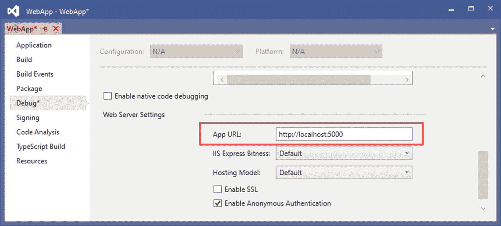
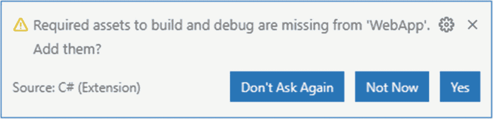
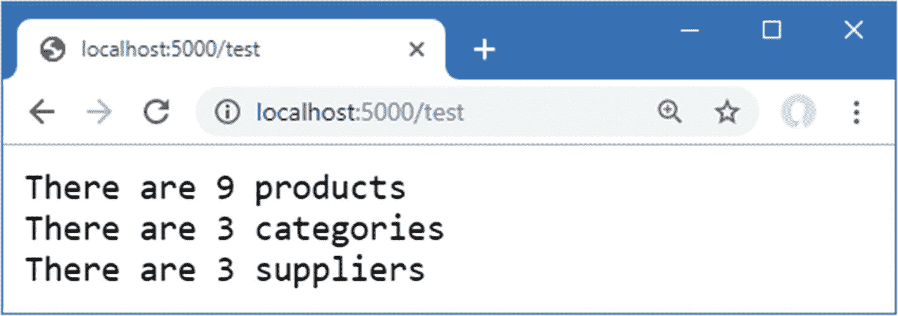

# 十八、创建示例项目

在本章中，您将创建贯穿本书这一部分的示例项目。该项目包含一个简单的数据模型、一个用于格式化 HTML 内容的客户端包和一个简单的请求管道。

## 创建项目

从 Windows 开始菜单打开一个新的 PowerShell 命令提示符，并运行清单 [18-1](#PC1) 中所示的命令。

Tip

你可以从 [`https://github.com/apress/pro-asp.net-core-3`](https://github.com/apress/pro-asp.net-core-3) 下载本章以及本书其他章节的示例项目。如果在运行示例时遇到问题，请参见第 [1](01.html) 章获取帮助。

```cs
dotnet new globaljson --sdk-version 3.1.101 --output WebApp
dotnet new web --no-https --output WebApp --framework netcoreapp3.1
dotnet new sln -o WebApp

dotnet sln WebApp add WebApp

Listing 18-1.Creating the Project

```

如果您使用的是 Visual Studio，请打开`WebApp`文件夹中的`WebApp.sln`文件。选择项目➤平台属性，导航到调试页面，将 App URL 字段更改为`http://localhost:5000`，如图 [18-1](#Fig1) 所示。这将更改用于接收 HTTP 请求的端口。选择文件➤保存全部保存配置更改。



图 18-1。

更改 HTTP 端口

如果您使用的是 Visual Studio 代码，请打开`WebApp`文件夹。当系统提示添加构建和调试项目所需的资产时，点击是按钮，如图 [18-2](#Fig2) 所示。



图 18-2。

添加项目资产

## 添加数据模型

数据模型有助于演示使用 ASP.NET Core 构建 web 应用的不同方式，展示复杂的响应是如何组成的，以及用户是如何提交数据的。在接下来的小节中，我将创建一个简单的数据模型，并使用它来创建用于存储应用数据的数据库模式。

### 将 NuGet 包添加到项目中

该数据模型将使用实体框架核心来存储和查询 SQL Server LocalDB 数据库中的数据。要添加实体框架核心的 NuGet 包，使用 PowerShell 命令提示符来运行在`WebApp`项目文件夹中的清单 [18-2](#PC2) 中显示的命令。

```cs
dotnet add package Microsoft.EntityFrameworkCore.Design --version 3.1.1
dotnet add package Microsoft.EntityFrameworkCore.SqlServer --version 3.1.1

Listing 18-2.Adding Packages to the Project

```

如果您使用的是 Visual Studio，则可以通过选择“项目➤管理 NuGet 包”来添加包。注意选择要添加到项目中的包的正确版本。

如果您没有遵循前面章节中的示例，您将需要安装用于创建和管理实体框架核心迁移的全局工具包。运行清单 [18-3](#PC3) 中所示的命令，删除软件包的任何现有版本，并安装本书所需的版本。(如果您在前面的章节中安装了这个版本的工具包，您可以跳过这些命令。)

```cs
dotnet tool uninstall --global dotnet-ef
dotnet tool install --global dotnet-ef --version 3.1.1

Listing 18-3.Installing a Global Tool Package

```

### 创建数据模型

本书这一部分的数据模型将由三个相关的类组成:`Product`、`Supplier`和`Category`。新建一个名为`Models`的文件夹，并在其中添加一个名为`Category.cs`的类文件，内容如清单 [18-4](#PC4) 所示。

```cs
using System.Collections.Generic;

namespace WebApp.Models {
    public class Category {

        public long CategoryId { get; set; }
        public string Name { get; set; }

        public IEnumerable<Product> Products { get; set; }
    }
}

Listing 18-4.The Contents of the Category.cs File in the Models Folder

```

将名为`Supplier.cs`的类添加到`Models`文件夹中，并使用它来定义清单 [18-5](#PC5) 中所示的类。

```cs
using System.Collections.Generic;

namespace WebApp.Models {
    public class Supplier {

        public long SupplierId { get; set; }
        public string Name { get; set; }
        public string City { get; set; }

        public IEnumerable<Product> Products { get; set; }
    }
}

Listing 18-5.The Contents of the Supplier.cs File in the Models Folder

```

接下来，将名为`Product.cs`的类添加到`Models`文件夹中，并使用它来定义清单 [18-6](#PC6) 中所示的类。

```cs
using System.ComponentModel.DataAnnotations.Schema;

namespace WebApp.Models {
    public class Product {

        public long ProductId { get; set; }

        public string Name { get; set; }
        [Column(TypeName = "decimal(8, 2)")]
        public decimal Price { get; set; }

        public long CategoryId { get; set; }
        public Category Category { get; set; }

        public long SupplierId { get; set; }
        public Supplier Supplier { get; set; }
    }
}

Listing 18-6.The Contents of the Product.cs File in the Models Folder

```

三个数据模型类中的每一个都定义了一个键属性，当存储新对象时，数据库将分配该属性的值。还有导航属性将用于查询相关数据，例如，可以查询特定类别中的所有产品。

`Price`属性已经用`Column`属性修饰过，该属性指定了将存储在数据库中的值的精度。C# 和 SQL 数值类型之间没有一对一的映射，并且`Column`属性告诉实体框架核心应该在数据库中使用哪种 SQL 类型来存储`Price`值。在这种情况下，`decimal(8, 2)`类型将允许总共八位数字，包括小数点后两位。

为了创建将提供对数据库的访问的实体框架核心上下文类，将一个名为`DataContext.cs`的文件添加到`Models`文件夹中，并添加清单 [18-7](#PC7) 中所示的代码。

```cs
using Microsoft.EntityFrameworkCore;

namespace WebApp.Models {
    public class DataContext: DbContext {

        public DataContext(DbContextOptions<DataContext> opts)
            : base(opts) { }

        public DbSet<Product> Products { get; set; }
        public DbSet<Category> Categories { get; set; }
        public DbSet<Supplier> Suppliers { get; set; }
    }
}

Listing 18-7.The Contents of the DataContext.cs File in the Models Folder

```

上下文类定义了用于查询数据库中的`Product`、`Category`和`Supplier`数据的属性。

### 准备种子数据

将名为`SeedData.cs`的类添加到`Models`文件夹中，并添加清单 [18-8](#PC8) 中所示的代码，以定义将用于填充数据库的种子数据。

```cs
using Microsoft.EntityFrameworkCore;
using System.Linq;

namespace WebApp.Models {
    public static class SeedData {

        public static void SeedDatabase(DataContext context) {
            context.Database.Migrate();
            if (context.Products.Count() == 0 && context.Suppliers.Count() == 0
                    && context.Categories.Count() == 0) {

                Supplier s1 = new Supplier
                    { Name = "Splash Dudes", City = "San Jose"};
                Supplier s2 = new Supplier
                    { Name = "Soccer Town", City = "Chicago"};
                Supplier s3 = new Supplier
                    { Name = "Chess Co", City = "New York"};

                Category c1 = new Category { Name = "Watersports" };
                Category c2 = new Category { Name = "Soccer" };
                Category c3 = new Category { Name = "Chess" };

                context.Products.AddRange(
                    new Product {  Name = "Kayak", Price = 275,
                        Category = c1, Supplier = s1},
                    new Product {  Name = "Lifejacket", Price = 48.95m,
                        Category = c1, Supplier = s1},
                    new Product {  Name = "Soccer Ball", Price = 19.50m,
                        Category = c2, Supplier = s2},
                    new Product {  Name = "Corner Flags", Price = 34.95m,
                        Category = c2, Supplier = s2},
                    new Product {  Name = "Stadium", Price = 79500,
                        Category = c2, Supplier = s2},
                    new Product {  Name = "Thinking Cap", Price = 16,
                        Category = c3, Supplier = s3},
                    new Product {  Name = "Unsteady Chair", Price = 29.95m,
                        Category = c3, Supplier = s3},
                    new Product {  Name = "Human Chess Board", Price = 75,
                        Category = c3, Supplier = s3},
                    new Product {  Name = "Bling-Bling King", Price = 1200,
                        Category = c3, Supplier = s3}
                );
                context.SaveChanges();
            }
        }
    }
}

Listing 18-8.The Contents of the SeedData.cs File in the Models Folder

```

静态`SeedDatabase`方法确保所有挂起的迁移都已经应用到数据库。如果数据库是空的，它会植入类别、供应商和产品。实体框架核心将负责将对象映射到数据库的表中，并且在存储数据时将自动分配关键属性。

### 配置实体框架核心服务和中间件

对清单 [18-9](#PC9) 中所示的`Startup`类进行修改，该类配置实体框架核心并设置本书这一部分用来访问数据库的`DataContext`服务。

```cs
using System;
using System.Collections.Generic;
using System.Linq;
using System.Threading.Tasks;
using Microsoft.AspNetCore.Builder;
using Microsoft.AspNetCore.Hosting;
using Microsoft.AspNetCore.Http;
using Microsoft.Extensions.DependencyInjection;
using Microsoft.Extensions.Hosting;
using Microsoft.Extensions.Configuration;
using Microsoft.EntityFrameworkCore;
using WebApp.Models;

namespace WebApp {
    public class Startup {

        public Startup(IConfiguration config) {
            Configuration = config;
        }

        public IConfiguration Configuration { get; set; }

        public void ConfigureServices(IServiceCollection services) {
            services.AddDbContext<DataContext>(opts => {
                opts.UseSqlServer(Configuration[
                    "ConnectionStrings:ProductConnection"]);
                opts.EnableSensitiveDataLogging(true);
            });
        }

        public void Configure(IApplicationBuilder app, DataContext context) {

            app.UseDeveloperExceptionPage();
            app.UseRouting();

            app.UseEndpoints(endpoints => {
                endpoints.MapGet("/", async context => {
                    await context.Response.WriteAsync("Hello World!");
                });
            });

            SeedData.SeedDatabase(context);
        }
    }
}

Listing 18-9.Preparing Services and Middleware in the Startup.cs File in the WebApp Folder

```

为了定义将用于应用数据的连接字符串，在`appsettings.json`文件中添加清单 [18-10](#PC10) 所示的配置设置。连接字符串应该在一行中输入。

```cs
{
  "Logging": {
    "LogLevel": {
      "Default": "Information",
      "Microsoft": "Warning",
      "Microsoft.Hosting.Lifetime": "Information",
      "Microsoft.EntityFrameworkCore": "Information"
    }
  },
  "AllowedHosts": "*",
  "ConnectionStrings": {
    "ProductConnection": "Server=(localdb)\\MSSQLLocalDB;Database=Products;MultipleActiveResultSets=True"
  }
}

Listing 18-10.Defining a Connection String in the appsettings.json File in the WebApp Folder

```

除了连接字符串之外，清单 [18-10](#PC10) 增加了实体框架核心的日志细节，以便发送到数据库的 SQL 查询被记录。

### 创建和应用迁移

为了创建将建立数据库模式的迁移，使用 PowerShell 命令提示符来运行在`WebApp`项目文件夹中的清单 [18-11](#PC11) 中所示的命令。

```cs
dotnet ef migrations add Initial

Listing 18-11.Creating an Entity Framework Core Migration

```

创建迁移后，使用清单 [18-12](#PC12) 中所示的命令将其应用于数据库。

```cs
dotnet ef database update

Listing 18-12.Applying the Migration to the Database

```

应用显示的日志消息将显示发送到数据库的 SQL 命令。

Note

如果需要重置数据库，那么运行`dotnet ef database drop --force`命令，然后运行清单 [18-12](#PC12) 中的命令。

## 添加 CSS 框架

后面的章节将展示 HTML 响应的不同生成方式。运行清单 [18-13](#PC13) 中所示的命令，删除 LibMan 包的任何现有版本，并安装本书中使用的版本。(如果您在前面的章节中安装了这个版本的 LibMan，您可以跳过这些命令。)

```cs
dotnet tool uninstall --global Microsoft.Web.LibraryManager.Cli
dotnet tool install --global Microsoft.Web.LibraryManager.Cli --version 2.0.96

Listing 18-13.Installing the LibMan Tool Package

```

要添加引导 CSS 框架以便可以设计 HTML 响应，运行在`WebApp`项目文件夹中的清单 [18-14](#PC14) 中显示的命令。

```cs
libman init -p cdnjs
libman install twitter-bootstrap@4.3.1 -d wwwroot/lib/twitter-bootstrap

Listing 18-14.Installing the Bootstrap CSS Framework

```

## 配置请求管道

为了定义一个简单的中间件组件来确保示例项目已经被正确设置，将一个名为`TestMiddleware.cs`的类文件添加到`WebApp`文件夹中，并添加清单 [18-15](#PC15) 中所示的代码。

```cs
using Microsoft.AspNetCore.Http;
using System.Linq;
using System.Threading.Tasks;
using WebApp.Models;

namespace WebApp {
    public class TestMiddleware {
        private RequestDelegate nextDelegate;

        public TestMiddleware(RequestDelegate next) {
            nextDelegate = next;
        }

        public async Task Invoke(HttpContext context, DataContext dataContext) {
            if (context.Request.Path == "/test") {
                await context.Response.WriteAsync(
                    $"There are {dataContext.Products.Count()} products\n");
                await context.Response.WriteAsync(
                    $"There are {dataContext.Categories.Count()} categories\n");
                await context.Response.WriteAsync(
                    $"There are {dataContext.Suppliers.Count()} suppliers\n");
            } else {
                await nextDelegate(context);
            }
        }
    }
}

Listing 18-15.The Contents of the TestMiddleware.cs File in the WebApp Folder

```

将中间件组件添加到请求管道的`Startup`类中，如清单 [18-16](#PC16) 所示。

```cs
using System;
using System.Collections.Generic;
using System.Linq;
using System.Threading.Tasks;
using Microsoft.AspNetCore.Builder;
using Microsoft.AspNetCore.Hosting;
using Microsoft.AspNetCore.Http;
using Microsoft.Extensions.DependencyInjection;
using Microsoft.Extensions.Hosting;
using Microsoft.Extensions.Configuration;
using Microsoft.EntityFrameworkCore;
using WebApp.Models;

namespace WebApp {
    public class Startup {

        public Startup(IConfiguration config) {
            Configuration = config;
        }

        public IConfiguration Configuration { get; set; }

        public void ConfigureServices(IServiceCollection services) {
            services.AddDbContext<DataContext>(opts => {
                opts.UseSqlServer(Configuration[
                    "ConnectionStrings:ProductConnection"]);
                opts.EnableSensitiveDataLogging(true);
            });
        }

        public void Configure(IApplicationBuilder app, DataContext context) {

            app.UseDeveloperExceptionPage();
            app.UseStaticFiles();
            app.UseRouting();
            app.UseMiddleware<TestMiddleware>();
            app.UseEndpoints(endpoints => {
                endpoints.MapGet("/", async context => {
                    await context.Response.WriteAsync("Hello World!");
                });
            });

            SeedData.SeedDatabase(context);
        }
    }
}

Listing 18-16.Adding a Middleware Component in the Startup.cs File in the WebApp Folder

```

## 运行示例应用

通过从调试菜单中选择启动而不调试或运行而不调试，或者通过运行在`WebApp`项目文件夹中的清单 [18-17](#PC17) 中显示的命令，启动应用。

```cs
dotnet run

Listing 18-17.Running the Example Application

```

使用新的浏览器选项卡并请求`http://localhost:5000/test`，您将看到如图 [18-3](#Fig3) 所示的响应。



图 18-3。

运行示例应用

## 摘要

在这一章中，我创建了在本书的这一部分中使用的示例应用。该项目是用空模板创建的，包含一个依赖于实体框架核心的数据模型，并配置了一个包含简单测试中间件组件的请求管道。在下一章，我将向您展示如何使用 ASP.NET Core 创建 web 服务。