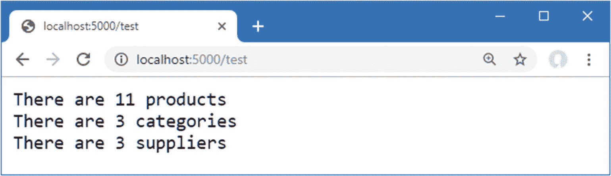
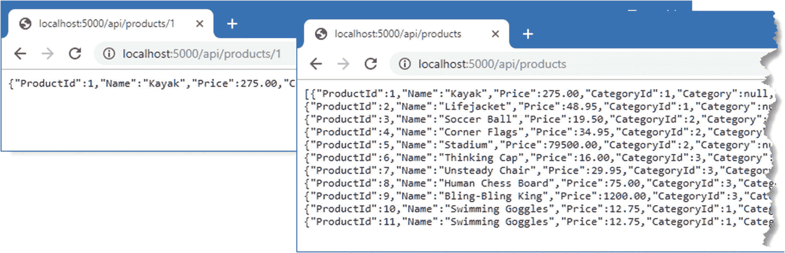
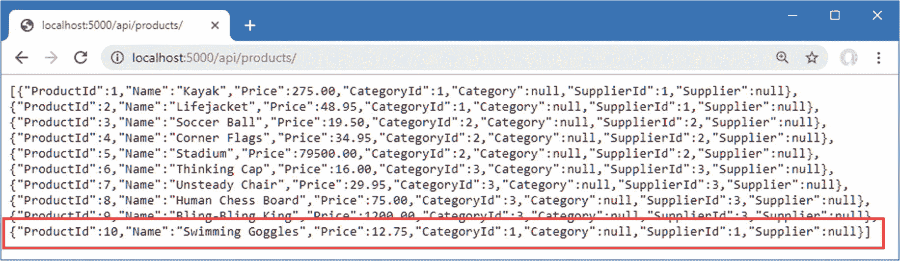
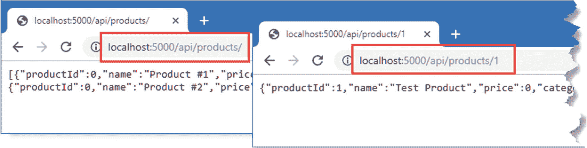
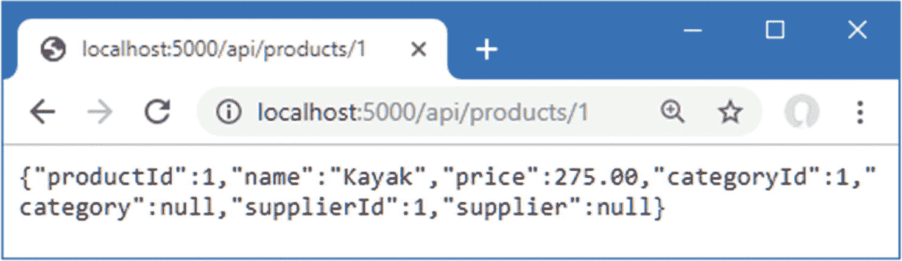
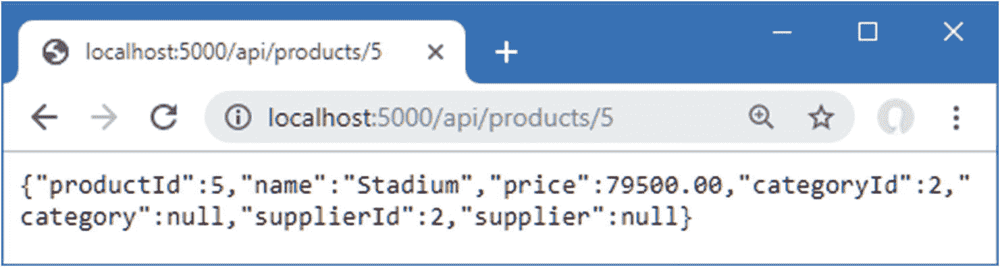
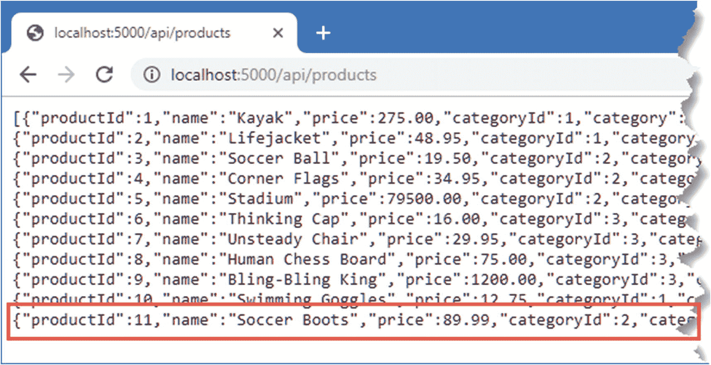
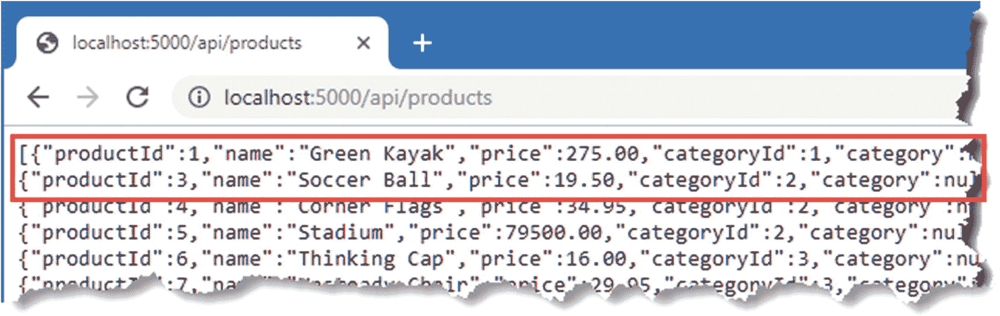
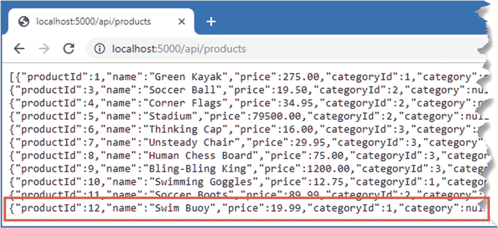
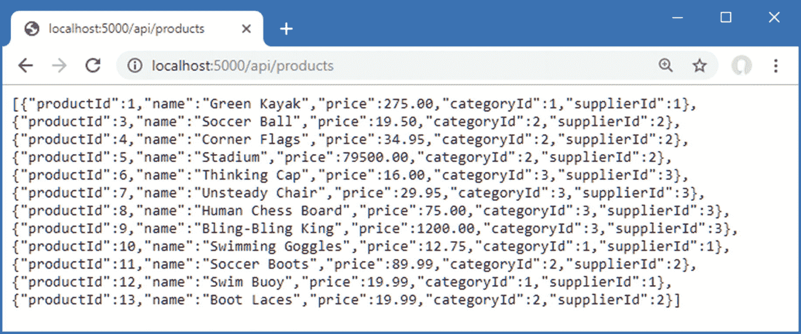

# 十九、创建 RESTful Web 服务

Web 服务接受 HTTP 请求并生成包含数据的响应。在这一章中，我将解释 MVC 框架提供的特性，它是 ASP.NET Core 不可分割的一部分，如何被用来建立在第 2 部分中描述的能力之上来创建 web 服务。

web 服务的性质意味着本章中的一些示例是使用 PowerShell 提供的命令行工具进行测试的，严格按照所示输入命令非常重要。第 20 章介绍了使用 web 服务的更复杂的工具，但是命令行方式更适合于跟随书中章节的例子，即使当你键入它们的时候它们会感觉有点笨拙。表 [19-1](#Tab1) 将 RESTful web 服务放在上下文中。

表 19-1。

将 RESTful Web 服务放在上下文中

<colgroup><col class="tcol1 align-left"> <col class="tcol2 align-left"></colgroup> 
| 

问题

 | 

回答

 |
| --- | --- |
| 它们是什么？ | Web 服务提供对应用数据的访问，通常以 JSON 格式表示。 |
| 它们为什么有用？ | Web 服务最常用于为富客户端应用提供数据。 |
| 它们是如何使用的？ | URL 和 HTTP 方法的组合描述了由 ASP.NET Core 控制器定义的动作方法处理的操作。 |
| 有什么陷阱或限制吗？ | 关于 web 服务应该如何实现，还没有达成广泛的共识，必须注意只产生客户期望的数据。 |
| 有其他选择吗？ | 虽然 RESTful web 服务是最常见的，但是有许多不同的方法可以向客户端提供数据。 |

表 [19-2](#Tab2) 总结了本章内容。

表 19-2。

章节总结

<colgroup><col class="tcol1 align-left"> <col class="tcol2 align-left"> <col class="tcol3 align-left"></colgroup> 
| 

问题

 | 

解决办法

 | 

列表

 |
| --- | --- | --- |
| 定义 web 服务 | 创建一个控制器，其动作方法对应于您需要的操作 | 1–14 |
| 随着时间的推移生成数据序列 | 使用`IAsyncEnumerable<T>`响应，这将防止请求线程在结果生成时被阻塞。 | Fifteen |
| 防止请求值用于敏感数据属性 | 使用绑定目标将模型绑定过程限制为只绑定安全属性 | 16–18 |
| 表达非数据结果 | 使用行动结果描述 ASP.NET Core 应发送的响应 | 19–24 |
| 验证数据 | 使用 ASP.NET Core 模型绑定和模型验证功能 | 25–27 |
| 自动验证请求 | 使用`ApiController`属性 | Twenty-eight |
| 从数据响应中省略空值 | 映射数据对象以过滤属性，或者配置 JSON 序列化程序以忽略空属性 | 29–31 |

## 为本章做准备

在本章中，我继续使用在第 [18 章](18.html)中创建的 WebApp 项目。为了准备本章，通过打开一个新的 PowerShell 命令提示符，导航到包含`WebApp.csproj`文件的文件夹，并运行清单 [19-1](#PC1) 中所示的命令来删除数据库。

Tip

你可以从 [`https://github.com/apress/pro-asp.net-core-3`](https://github.com/apress/pro-asp.net-core-3) 下载本章以及本书其他章节的示例项目。如果在运行示例时遇到问题，请参见第 [1](01.html) 章获取帮助。

```cs
dotnet ef database drop --force

Listing 19-1.Dropping the Database

```

通过从调试菜单中选择启动而不调试或运行而不调试，或者通过运行项目文件夹中清单 [19-2](#PC2) 中所示的命令来启动应用。

```cs
dotnet run

Listing 19-2.Starting the Example Application

```

一旦 ASP.NET Core 启动，请求 URL `http://localhost:5000/test`，您将看到如图 [19-1](#Fig1) 所示的响应。



图 19-1。

运行示例应用

## 理解 RESTful Web 服务

Web 服务使用客户端可以使用的数据来响应 HTTP 请求，例如 JavaScript 应用。对于 web 服务应该如何工作，没有严格的规则，但是最常见的方法是采用表述性状态转移(REST)模式。REST 没有权威的规范，关于 RESTful web 服务的构成也没有一致的意见，但是有一些通用的主题被广泛用于 web 服务。缺乏详细的规范导致了关于 REST 的含义和如何创建 RESTful web 服务的无休止的争论，如果您创建的 web 服务适用于您的项目，所有这些都可以安全地忽略。

### 了解请求 URL 和方法

REST 的核心前提——也是唯一达成广泛共识的方面——是 web 服务通过 URL 和 HTTP 方法(如 GET 和 POST，也称为 HTTP *动词*)的组合来定义 API。方法指定操作的类型，而 URL 指定操作应用到的数据对象。

举例来说，下面是一个 URL，它可以在示例应用中标识一个`Product`对象:

```cs
/api/products/1

```

该 URL 可以标识其`ProductId`属性的值为`1`的`Product`对象。URL 标识了`Product`，但是是 HTTP 方法指定了应该如何处理它。表 [19-3](#Tab3) 列出了 web 服务中常用的 HTTP 方法以及它们通常表示的操作。

表 19-3。

HTTP 方法和操作

<colgroup><col class="tcol1 align-left"> <col class="tcol2 align-left"></colgroup> 
| 

HTTP 方法

 | 

描述

 |
| --- | --- |
| `GET` | 此方法用于检索一个或多个数据对象。 |
| `POST` | 此方法用于创建新的对象。 |
| `PUT` | 此方法用于更新现有对象。 |
| `PATCH` | 此方法用于更新现有对象的一部分。 |
| `DELETE` | 此方法用于删除对象。 |

### 了解 JSON

大多数 RESTful web 服务使用 JavaScript 对象符号(JSON)格式格式化响应数据。JSON 变得流行是因为它简单并且容易被 JavaScript 客户端使用。JSON 在 [`www.json.org`](http://www.json.org) 有详细描述，但是你不需要理解 JSON 的每个方面来创建 web 服务，因为 ASP.NET Core 提供了创建 JSON 响应所需的所有特性。

Understanding the Alternatives to Restful Web Services

REST 不是设计 web 服务的唯一方法，还有一些流行的替代方法。 *GraphQL* 与 React JavaScript 框架联系最紧密，但它可以被更广泛地使用。与通过 URL 和 HTTP 方法的单独组合提供特定查询的 REST web 服务不同，GraphQL 提供对所有应用数据的访问，并允许客户端以他们需要的格式查询他们需要的数据。GraphQL 的设置可能很复杂，并且可能需要更复杂的客户端，但结果是一个更灵活的 web 服务，使客户端的开发人员能够控制他们使用的数据。ASP.NET Core 不直接支持 GraphQL，但是有。NET 实现可用。详见 [`https://graphql.org`](https://graphql.org) 。

一个新的选择是 gRPC，这是一个完全的远程过程调用框架，专注于速度和效率。在撰写本文时，gRPC 不能在 web 浏览器中使用，比如 Angular 或 React 框架，因为浏览器不提供 gRPC 制定 HTTP 请求所需的细粒度访问。

## 使用自定义端点创建 Web 服务

当您了解 ASP.NET Core 为 web 服务提供的设施时，很容易忘记它们是建立在第 2 部分描述的特性之上的。要创建一个简单的 web 服务，将一个名为`WebServiceEndpoint.cs`的文件添加到`WebApp`文件夹中，并使用它来定义清单 [19-3](#PC4) 中所示的类。

```cs
using Microsoft.AspNetCore.Http;
using Microsoft.AspNetCore.Routing;
using Microsoft.Extensions.DependencyInjection;
using System.Collections.Generic;
using System.Text.Json;
using WebApp.Models;

namespace Microsoft.AspNetCore.Builder {

    public static class WebServiceEndpoint {
        private static string BASEURL = "api/products";

        public static void MapWebService(this IEndpointRouteBuilder app) {

            app.MapGet($"{BASEURL}/{{id}}", async context => {
                long key = long.Parse(context.Request.RouteValues["id"] as string);
                DataContext data = context.RequestServices.GetService<DataContext>();
                Product p = data.Products.Find(key);
                if (p == null) {
                    context.Response.StatusCode = StatusCodes.Status404NotFound;
                } else {
                    context.Response.ContentType = "application/json";
                    await context.Response
                        .WriteAsync(JsonSerializer.Serialize<Product>(p));
                }
            });

            app.MapGet(BASEURL, async context => {
                DataContext data = context.RequestServices.GetService<DataContext>();
                context.Response.ContentType = "application/json";
                await context.Response.WriteAsync(JsonSerializer
                    .Serialize<IEnumerable<Product>>(data.Products));
            });

            app.MapPost(BASEURL, async context => {
                DataContext data = context.RequestServices.GetService<DataContext>();
                Product p = await
                    JsonSerializer.DeserializeAsync<Product>(context.Request.Body);
                await data.AddAsync(p);
                await data.SaveChangesAsync();
                context.Response.StatusCode = StatusCodes.Status200OK;
            });
        }
    }
}

Listing 19-3.The Contents of the WebServiceEndpoint.cs File in the WebApp Folder

```

`MapWebService`扩展方法创建了三个路由，它们构成了一个基本的 web 服务，只使用了前面章节中描述的特性。这些路由匹配以`/api`开头的 URL，这是 web 服务的传统 URL 前缀。第一条路线的端点从分段变量接收一个值，该变量用于在数据库中定位单个`Product`对象。第二条路由的端点检索数据库中的所有`Product`对象。第三个端点处理 POST 请求并读取请求体，以获取一个新对象的 JSON 表示，并将其添加到数据库中。

创建 web 服务有更好的 ASP.NET Core 特性，您很快就会看到，但是清单 [19-3](#PC4) 中的代码显示了如何将 HTTP 方法和 URL 结合起来描述一个操作。清单 [19-4](#PC5) 使用`MapWebService`扩展方法将端点添加到示例应用的路由配置中。

```cs
...
public void Configure(IApplicationBuilder app, DataContext context) {
    app.UseDeveloperExceptionPage();
    app.UseRouting();
    app.UseMiddleware<TestMiddleware>();
    app.UseEndpoints(endpoints => {
        endpoints.MapGet("/", async context => {
            await context.Response.WriteAsync("Hello World!");
        });
        endpoints.MapWebService();
    });
    SeedData.SeedDatabase(context);
}
...

Listing 19-4.Adding Routes in the Startup.cs File in the WebApp Folder

```

为了测试 web 服务，重启 ASP.NET Core 并请求`http://localhost:5000/api/products/1`。该请求将与清单 [19-4](#PC5) 中定义的第一条路由相匹配，并将产生如图 [19-2](#Fig2) 左侧所示的响应。接下来，请求`http://localhost:5000/api/products`，它将被第二个路由匹配，并产生图 [19-2](#Fig2) 右侧所示的响应。



图 19-2。

Web 服务响应

Note

图中显示的响应包含`Supplier`和`Category`属性的`null`值，因为 LINQ 查询不包含相关数据。详见第 20 章。

测试第三条路由需要不同的方法，因为不可能使用浏览器发送 HTTP POST 请求。打开一个新的 PowerShell 命令提示符，运行清单 [19-5](#PC6) 中所示的命令。严格按照所示输入命令很重要，因为`Invoke-RestMethod`命令对其参数的语法很挑剔。

Tip

如果您没有执行 Microsoft Edge 或 Internet Explorer 的初始设置，当您使用`Invoke-RestMethod`或`Invoke-WebRequest`命令测试本章中的示例时，您可能会收到错误。这个问题可以通过运行 IE 并选择您需要的初始配置来解决。

```cs
Invoke-RestMethod http://localhost:5000/api/products -Method POST -Body  (@{ Name="Swimming Goggles"; Price=12.75; CategoryId=1; SupplierId=1} | ConvertTo-Json) -ContentType "application/json"

Listing 19-5.Sending a POST Request

```

该命令发送一个 HTTP POST 命令，该命令与清单 [19-5](#PC6) 中定义的第三条路由相匹配。请求的主体是一个 JSON 格式的对象，解析后创建一个`Product`，然后存储在数据库中。请求中包含的 JSON 对象包含了`Name`、`Price`、`CategoryId`和`SupplierId`属性的值。与`ProductId`属性相关联的对象的唯一键是在存储对象时由数据库分配的。使用浏览器再次请求`http://localhost:5000/api/products` URL，你会看到 JSON 响应包含了新的对象，如图 [19-3](#Fig3) 所示。



图 19-3。

使用 web 服务存储新数据

## 使用控制器创建 Web 服务

使用端点创建 web 服务的缺点是，每个端点都必须重复一组类似的步骤来生成响应:获取实体框架核心服务，以便它可以查询数据库，设置响应的`Content-Type`头，将对象序列化到 JSON 中，等等。因此，用端点创建的 web 服务很难理解，也很难维护。

更好的方法是使用一个*控制器*，它允许在一个类中定义一个 web 服务。控制器是 MVC 框架的一部分，它构建在 ASP.NET Core 平台上，负责处理数据，就像端点负责处理 URL 一样。

The Rise and Fall of the MVC Pattern in ASP.NET Core

MVC 框架是模型-视图-控制器模式的实现，它描述了一种构建应用的方法。本章中的例子使用了模式三个支柱中的两个:数据模型(MVC 中的 *M* )和控制器(MVC 中的 *C* )。第 21 章[提供了缺失的部分，并解释了如何使用 Razor 用视图创建 HTML 响应。](21.html)

MVC 模式是 ASP.NET 发展过程中的重要一步，它让平台脱离了之前的 Web 表单模型。Web 表单应用很容易启动，但是很快就变得难以管理，并且隐藏了开发人员的 HTTP 请求和响应的细节。相比之下，遵循 MVC 模式为用 MVC 框架编写的应用提供了一个强大的、可伸缩的结构，对开发人员没有任何隐瞒。MVC 框架振兴了 ASP.NET，并为后来的 ASP.NET Core 提供了基础，后者放弃了对 Web 表单的支持，只专注于使用 MVC 模式。

随着 ASP.NET Core 的发展，其他风格的 web 应用已经被接受，MVC 框架只是创建应用的一种方式。这并没有削弱 MVC 模式的效用，但是它不再像过去那样在 ASP.NET Core 开发中发挥核心作用，而且过去 MVC 框架独有的功能现在可以通过其他方法访问，比如 Razor Pages 和 Blazor。

这种发展的结果是理解 MVC 模式不再是有效的 ASP.NET Core 开发的先决条件。如果你有兴趣了解 MVC 模式，那么 [`https://en.wikipedia.org/wiki/Model–view–controller`](https://en.wikipedia.org/wiki/Model%25E2%2580%2593view%25E2%2580%2593controller) 是一个很好的起点。但是对于这本书来说，理解 MVC 框架提供的特性是如何在 ASP.NET Core 平台上构建的，这是所需要的全部内容。

### 启用 MVC 框架

使用控制器创建 web 服务的第一步是配置 MVC 框架，这需要一个服务和一个端点，如清单 [19-6](#PC7) 所示。

```cs
using System;
using System.Collections.Generic;
using System.Linq;
using System.Threading.Tasks;
using Microsoft.AspNetCore.Builder;
using Microsoft.AspNetCore.Hosting;
using Microsoft.AspNetCore.Http;
using Microsoft.Extensions.DependencyInjection;
using Microsoft.Extensions.Hosting;
using Microsoft.Extensions.Configuration;
using Microsoft.EntityFrameworkCore;
using WebApp.Models;

namespace WebApp {
    public class Startup {

        public Startup(IConfiguration config) {
            Configuration = config;
        }

        public IConfiguration Configuration { get; set; }

        public void ConfigureServices(IServiceCollection services) {
            services.AddDbContext<DataContext>(opts => {
                opts.UseSqlServer(Configuration[
                    "ConnectionStrings:ProductConnection"]);
                opts.EnableSensitiveDataLogging(true);
            });

            services.AddControllers();
        }

        public void Configure(IApplicationBuilder app, DataContext context) {
            app.UseDeveloperExceptionPage();
            app.UseRouting();
            app.UseMiddleware<TestMiddleware>();
            app.UseEndpoints(endpoints => {
                endpoints.MapGet("/", async context => {
                    await context.Response.WriteAsync("Hello World!");
                });
                //endpoints.MapWebService();
                endpoints.MapControllers();
            });
            SeedData.SeedDatabase(context);
        }
    }
}

Listing 19-6.Enabling the MVC Framework in the Startup.cs File in the WebApp Folder

```

`AddControllers`方法定义了 MVC 框架所需的服务，而`MapControllers`方法定义了允许控制器处理请求的路由。在后面的章节中，你会看到用于配置 MVC 框架的其他方法，这些方法提供了对不同特性的访问，但是清单 [19-6](#PC7) 中使用的方法是为 web 服务配置 MVC 框架的方法。

### 创建控制器

*控制器*是一些类，它们的方法被称为*动作*，可以处理 HTTP 请求。当应用启动时，会自动发现控制器。基本的发现过程很简单:任何名称以`Controller`结尾的公共类都是控制器，控制器定义的任何`public`方法都是动作。为了演示控制器有多简单，创建`WebApp/Controllers`文件夹，并添加一个名为`ProductsController.cs`的文件，代码如清单 [19-7](#PC8) 所示。

Tip

控制器通常被定义在`Controllers`文件夹中，但是它们可以被定义在项目中的任何地方，并且它们仍然会被发现。

```cs
using Microsoft.AspNetCore.Mvc;
using System.Collections.Generic;
using WebApp.Models;

namespace WebApp.Controllers {

    [Route("api/[controller]")]
    public class ProductsController: ControllerBase {

        [HttpGet]
        public IEnumerable<Product> GetProducts() {
            return new Product[] {
                new Product() { Name = "Product #1" },
                new Product() { Name = "Product #2" },
            };
        }

        [HttpGet("{id}")]
        public Product GetProduct() {
            return new Product() {
                ProductId = 1, Name = "Test Product"
            };
        }
    }
}

Listing 19-7.The Contents of the ProductsController.cs File in the Controllers Folder

```

`ProductsController`类符合 MVC 框架在控制器中寻找的标准。它定义了名为`GetProducts`和`GetProduct`的公共方法，这些方法将被视为动作。

#### 了解基类

控制器是从`ControllerBase`类派生出来的，它提供了对 MVC 框架和底层 ASP.NET Core 平台所提供的特性的访问。表 [19-4](#Tab4) 描述了`ControllerBase`类提供的最有用的属性。

表 19-4。

有用的 ControllerBase 属性

<colgroup><col class="tcol1 align-left"> <col class="tcol2 align-left"></colgroup> 
| 

名字

 | 

描述

 |
| --- | --- |
| `HttpContext` | 该属性返回当前请求的`HttpContext`对象。 |
| `ModelState` | 该属性返回数据验证过程的详细信息，这将在本章后面的“验证数据”一节中演示，并在第 [29](29.html) 章中详细描述。 |
| `Request` | 该属性返回当前请求的`HttpRequest`对象。 |
| `Response` | 该属性返回当前响应的`HttpResponse`对象。 |
| `RouteData` | 该属性返回路由中间件从请求 URL 中提取的数据，如第 [13](13.html) 章所述。 |
| `User` | 该属性返回一个对象，该对象描述与当前请求相关联的用户，如第 [38](38.html) 章所述。 |

Note

尽管控制器通常是从`ControllerBase`或`Controller`类派生的(在第 [21 章](21.html)中有描述)，但这只是惯例，MVC 框架将接受任何名称以`Controller`结尾的类，从名称以`Controller`结尾的类派生的类，或者用`Controller`属性修饰的类。将`NonController`属性应用于满足这些条件但不应该接收 HTTP 请求的类。

每当控制器类的一个动作被用于处理一个请求时，控制器类的一个新实例被创建，这意味着表 [19-4](#Tab4) 中的属性仅描述当前的请求。

#### 了解控制器属性

动作方法支持的 HTTP 方法和 URL 由应用于控制器的属性组合决定。控制器的 URL 由应用于类的`Route`属性指定，如下所示:

```cs
...
[Route("api/[controller]")]
public class ProductsController: ControllerBase {
...

```

属性参数的`[controller]`部分用于从控制器类的名称中导出 URL。类名的`Controller`部分被删除，这意味着清单 [19-7](#PC8) 中的属性将控制器的 URL 设置为`/api/products`。

每个操作都用一个属性来修饰，该属性指定它支持的 HTTP 方法，如下所示:

```cs
...
[HttpGet]
public Product[] GetProducts() {
...

```

在用于 web 服务的控制器中，动作方法的名称并不重要。在第 [21 章](21.html)中描述了控制器的其他用途，其中名称很重要，但是对于 web 服务来说，HTTP 方法属性和路由模式才是重要的。

`HttpGet`属性告诉 MVC 框架,`GetProducts`动作方法将处理 HTTP GET 请求。表 [19-5](#Tab5) 描述了可应用于指定 HTTP 方法的动作的全套属性。

表 19-5。

HTTP 方法属性

<colgroup><col class="tcol1 align-left"> <col class="tcol2 align-left"></colgroup> 
| 

名字

 | 

描述

 |
| --- | --- |
| `HttpGet` | 此属性指定该操作只能由使用 GET 谓词的 HTTP 请求调用。 |
| `HttpPost` | 此属性指定该操作只能由使用 POST 谓词的 HTTP 请求调用。 |
| `HttpDelete` | 此属性指定该操作只能由使用删除谓词的 HTTP 请求调用。 |
| `HttpPut` | 此属性指定该操作只能由使用 PUT 谓词的 HTTP 请求调用。 |
| `HttpPatch` | 此属性指定该操作只能由使用修补谓词的 HTTP 请求调用。 |
| `HttpHead` | 该属性指定该操作只能由使用中心谓词的 HTTP 请求调用。 |
| `AcceptVerbs` | 此属性用于指定多个 HTTP 谓词。 |

应用于指定 HTTP 方法的动作的属性也可以用于构建控制器的基本 URL。

```cs
...
[HttpGet("{id}")]
public Product GetProduct() {
...

```

这个属性告诉 MVC 框架，`GetProduct`动作方法处理 URL 模式`api/products/{id}`的 GET 请求。在发现过程中，应用于控制器的属性用于构建控制器可以处理的 URL 模式集，如表 [19-6](#Tab6) 中所概述。

Tip

编写控制器时，确保控制器支持的 HTTP 方法和 URL 模式的每种组合只映射到一个动作方法是很重要的。当一个请求可以由多个动作处理时，会抛出一个异常，因为 MVC 框架无法决定使用哪个动作。

表 19-6。

URL 模式

<colgroup><col class="tcol1 align-left"> <col class="tcol2 align-left"> <col class="tcol3 align-left"></colgroup> 
| 

HTTP 方法

 | 

URL 模式

 | 

操作方法名称

 |
| --- | --- | --- |
| `GET` | `api/products` | `GetProducts` |
| `GET` | `api/products/{id}` | `GetProduct` |

您可以看到属性的组合如何等同于我在本章前面使用端点创建 web 服务时对相同 URL 模式使用的`MapGet`方法。

Get and Post: Pick The Right One

根据经验，GET 请求应该用于所有的只读信息检索，而 POST 请求应该用于任何改变应用状态的操作。在符合标准的术语中，GET 请求是针对*安全的*交互(除了信息检索之外没有副作用)，POST 请求是针对*不安全的*交互(做出决定或改变某事)。这些约定由万维网联盟(W3C)制定，在 [`www.w3.org/Protocols/rfc2616/rfc2616-sec9.html`](http://www.w3.org/Protocols/rfc2616/rfc2616-sec9.html) 。

GET 请求是*可寻址的*:所有信息都包含在 URL 中，所以可以标记并链接到这些地址。不要对改变状态的操作使用 GET 请求。2005 年，当 Google web Accelerator 向公众发布时，许多 Web 开发人员经历了惨痛的教训。这个应用预取每个页面链接的所有内容，这在 HTTP 中是合法的，因为 GET 请求应该是安全的。不幸的是，许多 web 开发人员忽略了 HTTP 约定，在他们的应用中放置了指向“删除项目”或“添加到购物车”的简单链接。混乱随之而来。

#### 了解行动方法结果

控制器提供的一个主要好处是，MVC 框架负责设置响应头并序列化发送给客户端的数据对象。您可以在操作方法定义的结果中看到这一点，如下所示:

```cs
...
[HttpGet("{id}")]
public Product GetProduct() {
...

```

当我使用端点时，我必须直接使用 JSON 序列化程序来创建一个可以写入响应的字符串，并设置`Content-Type`头来告诉客户端响应包含 JSON 数据。action 方法返回一个`Product`对象，该对象被自动处理。

要查看如何处理来自动作方法的结果，重启 ASP.NET Core 并请求`http://localhost:5000/api/products`，这将产生图 [19-4](#Fig4) 左侧所示的响应，该响应由`GetProducts`动作方法产生。接下来，请求`http://localhost:5000/api/products/1`，该请求将由`GetProduct`方法处理，并产生如图 [19-4](#Fig4) 右侧所示的结果。



图 19-4。

使用控制器

#### 在控制器中使用依赖注入

每次使用 controller 类的一个操作来处理请求时，都会创建一个新的 controller 类实例。应用的服务用于解析控制器通过其构造函数声明的任何依赖关系以及操作方法定义的任何依赖关系。这允许所有动作所需的服务通过构造函数来处理，同时仍然允许单个动作声明它们自己的依赖关系，如清单 [19-8](#PC13) 所示。

```cs
using Microsoft.AspNetCore.Mvc;
using WebApp.Models;
using System.Collections.Generic;
using Microsoft.Extensions.Logging;
using System.Linq;

namespace WebApp.Controllers {

    [Route("api/[controller]")]
    public class ProductsController: ControllerBase {
        private DataContext context;

        public ProductsController(DataContext ctx) {
            context = ctx;
        }

        [HttpGet]
        public IEnumerable<Product> GetProducts() {
            return context.Products;
        }

        [HttpGet("{id}")]
        public Product GetProduct([FromServices]
                ILogger<ProductsController> logger) {
            logger.LogDebug("GetProduct Action Invoked");
            return context.Products.FirstOrDefault();
        }
    }
}

Listing 19-8.Using Services in the ProductsController.cs File in the Controllers Folder

```

构造函数声明了对`DataContext`服务的依赖，该服务提供对应用数据的访问。使用请求范围来解析服务，这意味着控制器可以请求所有服务，而不需要了解它们的生命周期。

The Entity Framework Core Context Service Lifecycle

为每个控制器创建一个新的实体框架核心上下文对象。一些开发人员会试图拒绝上下文对象，以此来提高性能，但这会导致问题，因为来自一个查询的数据会影响后续的查询，如第 [20](20.html) 章所述。在后台，Entity Framework Core 有效地管理到数据库的连接，并且您不应该试图在为其创建上下文对象的控制器之外存储或重用上下文对象。

`GetProducts`动作方法使用`DataContext`请求数据库中所有的`Product`对象。`GetProduct`方法也使用`DataContext`服务，但是它声明了对`ILogger<T>`的依赖，T5 是第 [15 章](15.html)中描述的日志服务。由动作方法声明的依赖关系必须用`FromServices`属性来修饰，就像这样:

```cs
...
public Product GetProduct([FromServices] ILogger<ProductsController> logger) {
...

```

默认情况下，MVC 框架试图从请求 URL 中寻找动作方法参数的值，而`FromServices`属性覆盖了这一行为。要查看控制器中服务的使用，重启 ASP.NET Core 并请求`http://localhost:5000/api/products/1`，这将产生如图 [19-5](#Fig5) 所示的响应。您还会在应用的输出中看到以下日志消息:



图 19-5。

在控制器中使用服务

```cs
...
dbug: WebApp.Controllers.ProductsController[0]
      GetProduct Action Invoked
...

```

Caution

控制器生命周期的一个结果是，您不能依赖于以特定顺序调用方法所导致的副作用。因此，举例来说，我不能将清单 [19-8](#PC13) 中的`GetProduct`方法接收的`ILogger<T>`对象分配给一个属性，该属性可以被后面请求中的`GetProducts`动作读取。每个控制器对象用于处理一个请求，MVC 框架只为每个对象调用一个动作方法。

#### 使用模型绑定访问路由数据

在上一节中，我注意到 MVC 框架使用请求 URL 来查找动作方法参数的值，这个过程被称为*模型绑定*。模型绑定在第 [28](28.html) 章中有详细描述，但是清单 [19-9](#PC16) 给出了一个简单的例子。

```cs
using Microsoft.AspNetCore.Mvc;
using WebApp.Models;
using System.Collections.Generic;
using Microsoft.Extensions.Logging;
using System.Linq;

namespace WebApp.Controllers {

    [Route("api/[controller]")]
    public class ProductsController: ControllerBase {
        private DataContext context;

        public ProductsController(DataContext ctx) {
            context = ctx;
        }

        [HttpGet]
        public IEnumerable<Product> GetProducts() {
            return context.Products;
        }

        [HttpGet("{id}")]
        public Product GetProduct(long id,
                [FromServices] ILogger<ProductsController> logger) {
            logger.LogDebug("GetProduct Action Invoked");
            return context.Products.Find(id);
        }
    }
}

Listing 19-9.Using Model Binding in the ProductsController.cs File in the Controllers Folder

```

清单向`GetProduct`方法添加了一个名为`id`的`long`参数。当调用动作方法时，MVC 框架从路由数据中注入同名的值，自动将其转换为一个`long`值，动作使用该值通过 LINQ `Find`方法查询数据库。结果是 action 方法响应 URL，你可以通过重启 ASP.NET Core 并请求`http://localhost:5000/api/products/5`看到，这将产生如图 [19-6](#Fig6) 所示的响应。



图 19-6。

在动作中使用模型绑定

#### 来自请求体的模型绑定

模型绑定特性也可以用在请求体中的数据上，这允许客户端发送易于被操作方法接收的数据。清单 [19-10](#PC17) 添加了一个新的动作方法来响应 POST 请求，并允许客户端在请求体中提供一个`Product`对象的 JSON 表示。

```cs
using Microsoft.AspNetCore.Mvc;
using WebApp.Models;
using System.Collections.Generic;
using Microsoft.Extensions.Logging;
using System.Linq;

namespace WebApp.Controllers {

    [Route("api/[controller]")]
    public class ProductsController: ControllerBase {
        private DataContext context;

        public ProductsController(DataContext ctx) {
            context = ctx;
        }

        [HttpGet]
        public IEnumerable<Product> GetProducts() {
            return context.Products;
        }

        [HttpGet("{id}")]
        public Product GetProduct(long id,
                [FromServices] ILogger<ProductsController> logger) {
            logger.LogDebug("GetProduct Action Invoked");
            return context.Products.Find(id);
        }

        [HttpPost]
        public void SaveProduct([FromBody]Product product) {
            context.Products.Add(product);
            context.SaveChanges();
        }
    }
}

Listing 19-10.Adding an Action in the ProductsController.cs File in the Controllers Folder

```

新动作依赖于两个属性。`HttpPost`属性应用于 action 方法，并告诉 MVC 框架该动作可以处理 POST 请求。`FromBody`属性应用于动作的参数，它指定这个参数的值应该通过解析请求体获得。当动作方法被调用时，MVC 框架将创建一个新的`Product`对象，并用请求体中的值填充它的属性。模型绑定过程可能很复杂，并且通常与数据验证结合在一起，如第 [29 章](29.html)中所述，但是为了进行简单的演示，重启 ASP.NET Core，打开一个新的 PowerShell 命令提示符，并运行清单 [19-11](#PC18) 中所示的命令。

```cs
Invoke-RestMethod http://localhost:5000/api/products -Method POST -Body  (@{ Name="Soccer Boots"; Price=89.99; CategoryId=2; SupplierId=2} | ConvertTo-Json) -ContentType "application/json"

Listing 19-11.Sending a POST Request to the Example Application

```

一旦命令被执行，使用网络浏览器请求`http://localhost:5000/api/products`，你将会看到已经被存储在数据库中的新对象，如图 [19-7](#Fig7) 所示。



图 19-7。

使用控制器存储新数据

#### 添加附加操作

既然基本特性已经就绪，我可以添加一些动作，允许客户端使用 HTTP PUT 和 delete 方法替换和删除`Product`对象，如清单 [19-12](#PC19) 所示。

```cs
using Microsoft.AspNetCore.Mvc;
using WebApp.Models;
using System.Collections.Generic;
using Microsoft.Extensions.Logging;
using System.Linq;

namespace WebApp.Controllers {

    [Route("api/[controller]")]
    public class ProductsController: ControllerBase {
        private DataContext context;

        public ProductsController(DataContext ctx) {
            context = ctx;
        }

        [HttpGet]
        public IEnumerable<Product> GetProducts() {
            return context.Products;
        }

        [HttpGet("{id}")]
        public Product GetProduct(long id,
                [FromServices] ILogger<ProductsController> logger) {
            logger.LogDebug("GetProduct Action Invoked");
            return context.Products.Find(id);
        }

        [HttpPost]
        public void SaveProduct([FromBody]Product product) {
            context.Products.Add(product);
            context.SaveChanges();
        }

        [HttpPut]
        public void UpdateProduct([FromBody]Product product) {
            context.Products.Update(product);
            context.SaveChanges();
        }

        [HttpDelete("{id}")]
        public void DeleteProduct(long id) {
            context.Products.Remove(new Product() { ProductId = id });
            context.SaveChanges();
        }
    }
}

Listing 19-12.Adding Actions in the ProductsController.cs File in the Controllers Folder

```

`UpdateProduct`动作类似于`SaveProduct`动作，使用模型绑定从请求体接收一个`Product`对象。`DeleteProduct`动作从 URL 接收一个主键值，并使用它来创建一个仅具有`ProductId`属性值的`Product`，这是必需的，因为实体框架核心仅处理对象，但是 web 服务客户端通常希望能够仅使用一个键值来删除对象。

重启 ASP.NET Core，然后使用不同的 PowerShell 命令提示符运行清单 [19-13](#PC20) 中所示的命令，测试`UpdateProduct`动作。

```cs
Invoke-RestMethod http://localhost:5000/api/products -Method PUT -Body  (@{ ProductId=1; Name="Green Kayak"; Price=275; CategoryId=1; SupplierId=1} | ConvertTo-Json) -ContentType "application/json"

Listing 19-13.Updating an Object

```

该命令发送一个 HTTP PUT 请求，其主体包含一个替换对象。动作方法通过模型绑定特性接收对象并更新数据库。接下来，运行清单 [19-14](#PC21) 中所示的命令来测试`DeleteProduct`动作。

```cs
Invoke-RestMethod http://localhost:5000/api/products/2 -Method DELETE

Listing 19-14.Deleting an Object

```

该命令发送一个 HTTP DELETE 请求，该请求将删除`ProductId`属性为 2 的对象。要查看更改的效果，使用浏览器请求`http://localhost:5000/api/products`，它将发送一个由`GetProducts`操作处理的 GET 请求，并产生如图 [19-8](#Fig8) 所示的响应。



图 19-8。

更新和删除对象

## 改善网络服务

清单 [19-14](#PC21) 中的控制器重新创建了由独立端点提供的所有功能，但仍有可以改进的地方，如以下部分所述。

Supporting Cross-Origin Requests

如果您支持第三方 JavaScript 客户端，您可能需要启用对跨来源请求的支持(CORS)。浏览器通过仅允许 JavaScript 代码在同一来源内发出 HTTP 请求来保护用户，这意味着 URL 与用于加载 JavaScript 代码的 URL 具有相同的方案、主机和端口。CORS 通过执行初始 HTTP 请求来检查服务器是否允许来自特定 URL 的请求，从而放松了这一限制，这有助于防止恶意代码在未经用户同意的情况下使用您的服务。

ASP.NET Core 提供了一个处理 CORS 的内置服务，这是通过向`Startup`类中的`ConfigureServices`方法添加以下语句来实现的:

```cs
...
Services.AddCors();
...

```

options 模式用于用在`Microsoft.AspNetCore.Cors.Infrastructure`名称空间中定义的`CorsOptions`类配置 CORS。详见 [`https://docs.microsoft.com/en-gb/aspnet/core/security/cors?view=aspnetcore-3.1`](https://docs.microsoft.com/en-gb/aspnet/core/security/cors%253Fview%253Daspnetcore-3.1) 。

### 使用异步操作

ASP.NET Core 平台通过从池中分配一个线程来处理每个请求。可以并发处理的请求数量受限于池的大小，并且在等待操作产生结果时，线程不能用于处理任何其他请求。

依赖外部资源的操作可能会导致请求线程等待更长时间。例如，数据库服务器可能有自己的并发限制，并且可能将查询排队，直到它们可以被执行。ASP.NET Core 请求线程不可用于处理任何其他请求，直到数据库产生该操作的结果，然后产生可以发送到 HTTP 客户端的响应。

这个问题可以通过定义异步操作来解决，异步操作允许 ASP.NET Core 线程在被阻塞时处理其他请求，从而增加应用可以同时处理的 HTTP 请求的数量。清单 [19-15](#PC23) 修改了控制器以使用异步动作。

Note

异步操作不会更快地产生响应，其好处只是增加了可以并发处理的请求数量。

```cs
using Microsoft.AspNetCore.Mvc;
using WebApp.Models;
using System.Collections.Generic;
using Microsoft.Extensions.Logging;
using System.Linq;
using System.Threading.Tasks;

namespace WebApp.Controllers {

    [Route("api/[controller]")]
    public class ProductsController: ControllerBase {
        private DataContext context;

        public ProductsController(DataContext ctx) {
            context = ctx;
        }

        [HttpGet]
        public IAsyncEnumerable<Product> GetProducts() {
            return context.Products;
        }

        [HttpGet("{id}")]
        public async Task<Product> GetProduct(long id) {
            return await context.Products.FindAsync(id);
        }

        [HttpPost]
        public async Task SaveProduct([FromBody]Product product) {
            await context.Products.AddAsync(product);
            await context.SaveChangesAsync();
        }

        [HttpPut]
        public async Task UpdateProduct([FromBody]Product product) {
            context.Update(product);
            await context.SaveChangesAsync();
        }

        [HttpDelete("{id}")]
        public async Task DeleteProduct(long id) {
            context.Products.Remove(new Product() { ProductId = id });
            await context.SaveChangesAsync();
        }
    }
}

Listing 19-15.Asynchronous Actions in the ProductsController.cs File in the Controllers Folder

```

实体框架核心提供了一些方法的异步版本，比如`FindAsync`、`AdddAsync`和`SaveChangesAsync`，我已经将这些与`await`关键字一起使用。不是所有的操作都可以异步执行，这就是为什么`Update`和`Remove`方法不变的原因。

对于一些操作，包括对数据库的 LINQ 查询，可以使用`IAsyncEnumerable<T>`接口，它表示应该异步枚举的对象序列，并防止 ASP.NET Core 请求线程等待数据库产生每个对象，如第 [5 章](05.html)中所述。

控制器产生的响应没有变化，但是 ASP.NET Core 分配来处理每个请求的线程不一定被动作方法阻塞。

### 防止过度装订

一些操作方法使用模型绑定特性从响应体获取数据，以便可以使用它来执行数据库操作。`SaveProduct`动作有一个问题，通过使用 PowerShell 提示符运行清单 [19-16](#PC24) 中所示的命令可以发现这个问题。

```cs
Invoke-RestMethod http://localhost:5000/api/products -Method POST -Body  (@{ ProductId=100; Name="Swim Buoy"; Price=19.99; CategoryId=1; SupplierId=1} | ConvertTo-Json) -ContentType "application/json"

Listing 19-16.Saving a Product

```

与清单 [19-11](#PC18) 中用于测试 POST 方法的命令不同，这个命令包含了一个`ProductId`属性的值。当实体框架核心将数据发送到数据库时，会引发以下异常:

```cs
...
Microsoft.Data.SqlClient.SqlException (0x80131904): Cannot insert explicit value for identity column in table 'Products' when IDENTITY_INSERT is set to OFF.
...

```

默认情况下，存储新对象时，Entity Framework Core 会将数据库配置为分配主键值。这意味着应用不必担心跟踪已经分配了哪些键值，并且允许多个应用共享同一个数据库，而无需协调键分配。`Product`数据模型类需要一个`ProductId`属性，但是模型绑定过程不理解该属性的重要性，并且将客户端提供的任何值添加到它创建的对象中，这导致了`SaveProduct`操作方法中的异常。

这被称为*过度绑定*，当客户提供开发人员没有预料到的值时，这可能会导致严重的问题。在最好的情况下，应用的行为会出乎意料，但这种技术已经被用来破坏应用的安全性，并授予用户比他们应该拥有的更多的访问权限。

防止过度绑定的最安全的方法是创建单独的数据模型类，这些类仅用于通过模型绑定过程接收数据。将名为`ProductBindingTarget.cs`的类文件添加到`WebApp/Models`文件夹中，并使用它来定义清单 [19-17](#PC26) 中所示的类。

```cs
namespace WebApp.Models {
    public class ProductBindingTarget {

        public string Name { get; set; }

        public decimal Price { get; set; }

        public long CategoryId { get; set; }

        public long SupplierId { get; set; }

        public Product ToProduct() => new Product() {
            Name = this.Name, Price = this.Price,
            CategoryId = this.CategoryId, SupplierId = this.SupplierId
        };
    }
}

Listing 19-17.The Contents of the ProductBindingTarget.cs File in the WebApp/Models Folder

```

`ProductBindingTarget`类只定义应用在存储新对象时希望从客户端接收的属性。`ToProduct`方法创建了一个可用于应用其余部分的`Product`，确保客户端只能为`Name`、`Price`、`CategoryId`和`SupplierId`属性提供属性。清单 [19-18](#PC27) 在`SaveProduct`动作中使用绑定目标类来防止过度绑定。

```cs
...
[HttpPost]
public async Task SaveProduct([FromBody]ProductBindingTarget target) {
    await context.Products.AddAsync(target.ToProduct());
    await context.SaveChangesAsync();
}
...

Listing 19-18.Using a Binding Target in the ProductsController.cs File in the Controllers Folder

```

重启 ASP.NET Core 并重复清单 [19-16](#PC24) 中的命令，您将看到如图 [19-9](#Fig9) 所示的响应。客户端已经包含了`ProductId`值，但是它被模型绑定过程忽略，该过程丢弃只读属性的值。(当您运行此示例时，您可能会看到不同的`ProductId`属性值，这取决于您在运行命令之前对数据库所做的更改。)



图 19-9。

丢弃不需要的数据值

### 使用行动结果

MVC 框架会自动设置响应的状态代码，但是您不会总是得到您想要的结果，部分原因是 RESTful web 服务没有固定的规则，并且 Microsoft 做出的假设可能不符合您的期望。要查看示例，请使用 PowerShell 命令提示符运行清单 [19-19](#PC28) 中所示的命令，该命令向 web 服务发送 GET 请求。

```cs
Invoke-WebRequest http://localhost:5000/api/products/1000 |Select-Object StatusCode

Listing 19-19.Sending a GET Request

```

`Invoke-WebRequest`命令类似于前面例子中使用的`Invoke-RestMethod`命令，但是更容易从响应中获得状态代码。清单 [19-19](#PC28) 中请求的 URL 将由`GetProduct`动作方法处理，该方法将在数据库中查询一个`ProductId`值为`1000`的对象，该命令产生以下输出:

```cs
StatusCode
----------
       204

```

数据库中没有匹配的对象，这意味着`GetProduct`动作方法返回`null`。当 MVC 框架从一个动作方法接收到`null`时，它返回 204 状态码，这表明一个成功的请求没有产生任何数据。并不是所有的 web 服务都是这样的，一个常见的替代方法是返回 404 响应，表明没有找到。

类似地，`SaveProducts`动作在存储一个对象时将返回 200 响应，但是因为主键直到数据被存储后才生成，所以客户机不知道分配了什么键值。

Note

对于这些类型的 web 服务实现细节，没有对错之分，您应该选择最适合您的项目和个人偏好的方法。本节是如何更改默认行为的示例，而不是遵循任何特定 web 服务风格的方向。

动作方法可以通过返回一个实现`IActionResult`接口的对象来指导 MVC 框架发送一个特定的响应，这个对象被称为一个*动作结果*。这允许 action 方法指定所需的响应类型，而不必直接使用`HttpResponse`对象产生响应。

`ControllerBase`类提供了一组用于创建动作结果对象的方法，这些对象可以从动作方法中返回。表 [19-7](#Tab7) 描述了最有用的行动结果方法。

表 19-7。

有用的 ControllerBase 操作结果方法

<colgroup><col class="tcol1 align-left"> <col class="tcol2 align-left"></colgroup> 
| 

名字

 | 

描述

 |
| --- | --- |
| `Ok` | 这个方法返回的`IActionResult`产生一个 200 OK 状态码，并在响应体中发送一个可选的数据对象。 |
| `NoContent` | 这个方法返回的`IActionResult`产生一个 204 无内容状态码。 |
| `BadRequest` | 这个方法返回的`IActionResult`产生一个 400 错误请求状态代码。该方法接受一个向客户端描述问题的可选模型状态对象，如“验证数据”一节中所示。 |
| `File` | 这个方法返回的`IActionResult`产生一个 200 OK 响应，将`Content-Type`头设置为指定的类型，并将指定的文件发送给客户端。 |
| `NotFound` | 这个方法返回的`IActionResult`产生一个 404 NOT FOUND 状态代码。 |
| `RedirectRedirectPermanent` | 这些方法返回的`IActionResult`将客户端重定向到指定的 URL。 |
| `RedirectToRoute``RedirectToRoutePermanent` | 这些方法返回的`IActionResult`使用约定路由将客户端重定向到使用路由系统创建的指定 URL，如“使用路由值重定向”侧栏中所述。 |
| `LocalRedirectLocalRedirectPermanent` | 这些方法返回的`IActionResult`将客户端重定向到应用本地的指定 URL。 |
| `RedirectToActionRedirectToActionPermanent` | 这些方法返回的`IActionResult`将客户端重定向到一个动作方法。使用 URL 路由系统创建重定向的 URL。 |
| `RedirectToPageRedirectToPagePermanent` | 这些方法返回的`IActionResult`将客户端重定向到一个 Razor 页面，如第 [23 章](23.html)所述。 |
| `StatusCode` | 这个方法返回的`IActionResult`产生一个带有特定状态代码的响应。 |

当一个 action 方法返回一个对象时，相当于将对象传递给`Ok`方法并返回结果。当一个动作返回`null`时，相当于从`NoContent`方法返回结果。清单 [19-20](#PC30) 修改了`GetProduct`和`SaveProduct`动作的行为，因此它们使用表 [19-7](#Tab7) 中的方法来覆盖 web 服务控制器的默认行为。

```cs
using Microsoft.AspNetCore.Mvc;
using WebApp.Models;
using System.Collections.Generic;
using Microsoft.Extensions.Logging;
using System.Linq;
using System.Threading.Tasks;

namespace WebApp.Controllers {

    [Route("api/[controller]")]
    public class ProductsController : ControllerBase {
        private DataContext context;

        public ProductsController(DataContext ctx) {
            context = ctx;
        }

        [HttpGet]
        public IAsyncEnumerable<Product> GetProducts() {
            return context.Products;
        }

        [HttpGet("{id}")]
        public async Task<IActionResult> GetProduct(long id) {
            Product p = await context.Products.FindAsync(id);
            if (p == null) {
                return NotFound();

            }
            return Ok(p);
        }

        [HttpPost]
        public async Task<IActionResult>
                SaveProduct([FromBody]ProductBindingTarget target) {
            Product p = target.ToProduct();
            await context.Products.AddAsync(p);
            await context.SaveChangesAsync();
            return Ok(p);
        }

        [HttpPut]
        public async Task UpdateProduct([FromBody]Product product) {
            context.Update(product);
            await context.SaveChangesAsync();
        }

        [HttpDelete("{id}")]
        public async Task DeleteProduct(long id) {
            context.Products.Remove(new Product() { ProductId = id });
            await context.SaveChangesAsync();
        }
    }
}

Listing 19-20.Using Action Results in the ProductsController.cs File in the Controllers Folder

```

重启 ASP.NET Core 并重复清单 [19-19](#PC28) 中的命令，您将会看到一个异常，这是`Invoke-WebRequest`命令如何响应错误状态代码，例如由`GetProduct`操作方法返回的 404 Not Found。

要查看对`SaveProduct`动作方法的更改的效果，使用 PowerShell 命令提示符运行清单 [19-21](#PC31) 中所示的命令，该命令向 web 服务发送 POST 请求。

```cs
Invoke-RestMethod http://localhost:5000/api/products -Method POST -Body  (@{Name="Boot Laces"; Price=19.99; CategoryId=2; SupplierId=2} | ConvertTo-Json) -ContentType "application/json"

Listing 19-21.Sending a POST Request

```

该命令将产生以下输出，显示从 web 服务接收的 JSON 数据中解析的值:

```cs
productId  : 13
name       : Boot Laces
price      : 19.99
categoryId : 2
category   :
supplierId : 2
supplier   :

```

#### 执行重定向

表 [19-7](#Tab7) 中的许多动作结果方法都与重定向有关，重定向将客户端指向另一个 URL。执行方向最基本的方法是调用重定向方法，如清单 [19-22](#PC33) 所示。

Tip

如果控制器试图执行到任何非本地 URL 的重定向，`LocalRedirect`和`LocalRedirectPermanent`方法会抛出异常。当您重定向到用户提供的 URL 时，这很有用，此时*开放重定向攻击*试图将另一个用户重定向到不可信的站点。

```cs
using Microsoft.AspNetCore.Mvc;
using WebApp.Models;
using System.Collections.Generic;
using Microsoft.Extensions.Logging;
using System.Linq;
using System.Threading.Tasks;

namespace WebApp.Controllers {

    [Route("api/[controller]")]
    public class ProductsController : ControllerBase {
        private DataContext context;

        public ProductsController(DataContext ctx) {
            context = ctx;
        }

        // ...other action methods omitted for brevity...

        [HttpGet("redirect")]
        public IActionResult Redirect() {
            return Redirect("/api/products/1");
        }
    }
}

Listing 19-22.Redirecting in the ProductsController.cs File in the Controllers Folder

```

重定向 URL 被表示为 Redirect 方法的一个字符串参数，它产生一个临时重定向。重启 ASP.NET Core 并使用 PowerShell 命令提示符运行清单 [19-23](#PC34) 中所示的命令，该命令发送一个 GET 请求，该请求将由新的操作方法处理。

```cs
Invoke-RestMethod http://localhost:5000/api/products/redirect

Listing 19-23.Testing Redirection

```

`Invoke-RestMethod`命令将从 web 服务接收重定向响应，并向给定的 URL 发送一个新请求，产生以下响应:

```cs
productId  : 1
name       : GreenKayak
price      : 275.00
categoryId : 1
category   :
supplierId : 1
supplier   :

```

#### 重定向到操作方法

您可以使用 RedirectToAction 方法(用于临时重定向)或 RedirectToActionPermanent 方法(用于永久重定向)重定向到另一个操作方法。清单 [19-24](#PC36) 改变`Redirect`动作方法，这样客户端将被重定向到控制器定义的另一个动作方法。

```cs
using Microsoft.AspNetCore.Mvc;
using WebApp.Models;
using System.Collections.Generic;
using Microsoft.Extensions.Logging;
using System.Linq;
using System.Threading.Tasks;

namespace WebApp.Controllers {

    [Route("api/[controller]")]
    public class ProductsController : ControllerBase {
        private DataContext context;

        public ProductsController(DataContext ctx) {
            context = ctx;
        }

        // ...other action methods omitted for brevity...

        [HttpGet("redirect")]
        public IActionResult Redirect() {
            return RedirectToAction(nameof(GetProduct), new { Id = 1 });
        }
    }
}

Listing 19-24.Redirecting to an Action the ProductsController.cs File in the Controllers Folder

```

动作方法被指定为一个字符串，尽管可以使用`nameof`表达式来选择一个动作方法，而没有输入错误的风险。创建路线所需的任何附加值都是使用匿名对象提供的。重启 ASP.NET Core 并使用 PowerShell 命令提示符重复清单 [19-23](#PC34) 中的命令。路由系统将用于创建以指定操作方法为目标的 URL，并产生以下响应:

```cs
productId  : 1
name       : Kayak
price      : 100.00
categoryId : 1
category   :
supplierId : 1
supplier   :

```

如果您只指定一个动作方法名称，那么重定向将针对当前控制器。接受动作和控制器名称的`RedirectToAction`方法有一个重载。

Redirecting Using Route Values

`RedirectToRoute`和`RedirectToRoutePermanent`方法将客户端重定向到一个 URL，该 URL 是通过向路由系统提供段变量值并允许它选择要使用的路由而创建的。这对于具有复杂路由配置的应用很有用，应该小心使用，因为很容易创建到错误 URL 的重定向。下面是一个使用`RedirectToRoute`方法重定向的例子:

```cs
...
[HttpGet("redirect")]
public IActionResult Redirect() {
    return RedirectToRoute(new {
        controller = "Products", action = "GetProduct", Id = 1
    });
}
...

```

这个重定向中的值集依赖于约定路由来选择控制器和动作方法。常规路由通常用于产生 HTML 响应的控制器，如第 [21](21.html) 章所述。

### 验证数据

当您接受来自客户端的数据时，您必须假设大量数据将是无效的，并准备过滤掉应用无法使用的值。为 MVC 框架控制器提供的数据验证特性在第 [29 章](29.html)中有详细描述，但是对于这一章，我将只关注一个问题:确保客户端为在数据库中存储数据所需的属性提供值。模型绑定的第一步是将属性应用于数据模型类的属性，如清单 [19-25](#PC39) 所示。

```cs
using System.ComponentModel.DataAnnotations;

namespace WebApp.Models {
    public class ProductBindingTarget {

        [Required]
        public string Name { get; set; }

        [Range(1, 1000)]
        public decimal Price { get; set; }

        [Range(1, long.MaxValue)]
        public long CategoryId { get; set; }

        [Range(1, long.MaxValue)]
        public long SupplierId { get; set; }

        public Product ToProduct() => new Product() {
            Name = this.Name, Price = this.Price,
            CategoryId = this.CategoryId, SupplierId = this.SupplierId
        };
    }
}

Listing 19-25.Applying Attributes in the ProductBindingTarget.cs File in the Models Folder

```

`Required`属性表示客户端必须为其提供值的属性，当请求中没有值时，该属性可以应用于分配给`null`的属性。`Range`属性需要一个介于上限和下限之间的值，用于当请求中没有值时默认为零的原始类型。

清单 [19-26](#PC40) 更新了`SaveProduct`动作，以便在存储由模型绑定过程创建的对象之前执行验证，确保只有包含所有四个属性的值的对象才使用验证属性进行修饰。

```cs
...
[HttpPost]
public async Task<IActionResult> SaveProduct([FromBody]ProductBindingTarget target) {
    if (ModelState.IsValid) {
        Product p = target.ToProduct();
        await context.Products.AddAsync(p);
        await context.SaveChangesAsync();
        return Ok(p);
    }
    return BadRequest(ModelState);
}
...

Listing 19-26.Applying Validation in the ProductsController.cs File in the Controllers Folder

```

`ModelState`属性继承自`ControllerBase`类，如果模型绑定过程产生了符合验证标准的数据，`IsValid`属性返回`true`。如果从客户端收到的数据是有效的，那么从`Ok`方法返回动作结果。如果客户端发送的数据没有通过验证检查，那么`IsValid`属性将为`false`，而使用`BadRequest`方法的动作结果。`BadRequest`方法接受由`ModelState`属性返回的对象，该对象用于向客户端描述验证错误。(没有描述验证错误的标准方法，因此客户端可能只依赖 400 状态代码来确定是否有问题。)

为了测试验证，重启 ASP.NET Core 并使用新的 PowerShell 命令提示符运行清单 [19-27](#PC41) 中所示的命令。

```cs
Invoke-WebRequest http://localhost:5000/api/products -Method POST -Body  (@{Name="Boot Laces"} | ConvertTo-Json) -ContentType "application/json"

Listing 19-27.Testing Validation

```

该命令将抛出一个异常，显示 web 服务返回了一个 400 错误请求响应。没有显示验证错误的细节，因为`Invoke-WebRequest`命令和`Invoke-RestMethod`命令都没有提供对错误响应主体的访问。虽然您看不到它，但是主体包含一个 JSON 对象，该对象包含每个未通过验证的数据属性的属性，如下所示:

```cs
{
 "Price":["The field Price must be between 1 and 1000."],
 "CategoryId":["The field CategoryId must be between 1 and 9.223372036854776E+18."],
 "SupplierId":["The field SupplierId must be between 1 and 9.223372036854776E+18."]
}

```

你可以在第 [29](29.html) 章看到使用验证信息的例子，其中详细描述了验证功能。

### 应用 API 控制器属性

可以将`ApiController`属性应用于 web 服务控制器类，以改变模型绑定和验证特性的行为。在用`ApiController`属性修饰的控制器中，不需要使用`FromBody`属性从请求体中选择数据并显式检查`ModelState.IsValid`属性。从主体获取数据和验证数据在 web 服务中是如此常见，以至于当属性被使用时它们会被自动应用，从而将控制器动作中的代码焦点恢复到处理应用特性，如清单 [19-28](#PC43) 所示。

```cs
using Microsoft.AspNetCore.Mvc;
using WebApp.Models;
using System.Collections.Generic;
using Microsoft.Extensions.Logging;
using System.Linq;
using System.Threading.Tasks;

namespace WebApp.Controllers {

    [ApiController]
    [Route("api/[controller]")]
    public class ProductsController : ControllerBase {
        private DataContext context;

        public ProductsController(DataContext ctx) {
            context = ctx;
        }

        [HttpGet]
        public IAsyncEnumerable<Product> GetProducts() {
            return context.Products;
        }

        [HttpGet("{id}")]
        public async Task<IActionResult> GetProduct(long id) {
            Product p = await context.Products.FindAsync(id);
            if (p == null) {
                return NotFound();
            }
            return Ok(p);
        }

        [HttpPost]
        public async Task<IActionResult> SaveProduct(ProductBindingTarget target) {
            Product p = target.ToProduct();
            await context.Products.AddAsync(p);
            await context.SaveChangesAsync();
            return Ok(p);
        }

        [HttpPut]
        public async Task UpdateProduct(Product product) {
            context.Update(product);
            await context.SaveChangesAsync();
        }

        [HttpDelete("{id}")]
        public async Task DeleteProduct(long id) {
            context.Products.Remove(new Product() { ProductId = id });
            await context.SaveChangesAsync();
        }

        [HttpGet("redirect")]
        public IActionResult Redirect() {
            return RedirectToAction(nameof(GetProduct), new { Id = 1 });
        }
    }
}

Listing 19-28.Using ApiController in the ProductsController.cs File in the Controllers Folder

```

使用`ApiController`属性是可选的，但是它有助于生成简洁的 web 服务控制器。

### 省略空属性

在本章中，我要做的最后一个改变是从 web 服务返回的数据中删除`null`值。数据模型类包含导航属性，实体框架核心使用这些属性在复杂查询中关联相关数据，如第 [20 章](20.html)所述。对于本章中执行的简单查询，没有为这些导航属性分配任何值，这意味着客户端收到的属性的值永远都不可用。要查看问题，请使用 PowerShell 命令提示符运行清单 [19-29](#PC44) 中所示的命令。

```cs
Invoke-WebRequest http://localhost:5000/api/products/1 | Select-Object Content

Listing 19-29.Sending a GET Request

```

该命令发送一个 GET 请求，并显示来自 web 服务的响应正文，产生以下输出:

```cs
Content
-------
{"productId":1,"name":"Green Kayak","price":275.00,"categoryId":1,"category":null,"supplierId":1,"supplier":null}

```

该请求由`GetProduct`动作方法处理，响应中的`category`和`supplier`值将始终是`null`，因为该动作不要求实体框架核心填充这些属性。

#### 投影选定的属性

第一种方法是只返回客户机需要的属性。这使您可以完全控制每个响应，但是如果每个操作返回一组不同的值，这可能会变得难以管理，并使客户端开发人员感到困惑。清单 [19-30](#PC46) 展示了从数据库中获得的`Product`对象是如何被投影的，这样导航属性就被省略了。

```cs
...
[HttpGet("{id}")]
public async Task<IActionResult> GetProduct(long id) {
    Product p = await context.Products.FindAsync(id);
    if (p == null) {
        return NotFound();
    }
    return Ok(new {
        ProductId = p.ProductId, Name = p.Name,
        Price = p.Price, CategoryId = p.CategoryId,
        SupplierId = p.SupplierId
    });
}
...

Listing 19-30.Omitting Properties in the ProductsController.cs File in the Controllers Folder

```

客户机需要的属性被选择并添加到一个传递给`Ok`方法的对象中。重启 ASP.NET Core 并运行清单 [19-30](#PC46) 中的命令，您将收到一个忽略导航属性及其`null`值的响应，如下所示:

```cs
Content
-------
{"productId":1,"name":"Green Kayak","price":275.00,"categoryId":1,"supplierId":1}

```

#### 配置 JSON 序列化程序

JSON 序列化器可以配置为在序列化对象时省略值为`null`的属性。使用`Startup`类中的选项模式配置序列化程序，如清单 [19-31](#PC48) 所示。

```cs
using System;
using System.Collections.Generic;
using System.Linq;
using System.Threading.Tasks;
using Microsoft.AspNetCore.Builder;
using Microsoft.AspNetCore.Hosting;
using Microsoft.AspNetCore.Http;
using Microsoft.Extensions.DependencyInjection;
using Microsoft.Extensions.Hosting;
using Microsoft.Extensions.Configuration;
using Microsoft.EntityFrameworkCore;
using WebApp.Models;
using Microsoft.AspNetCore.Mvc;

namespace WebApp {
    public class Startup {

        public Startup(IConfiguration config) {
            Configuration = config;
        }

        public IConfiguration Configuration { get; set; }

        public void ConfigureServices(IServiceCollection services) {
            services.AddDbContext<DataContext>(opts => {
                opts.UseSqlServer(Configuration[
                    "ConnectionStrings:ProductConnection"]);
                opts.EnableSensitiveDataLogging(true);
            });

            services.AddControllers();
            services.Configure<JsonOptions>(opts => {
                opts.JsonSerializerOptions.IgnoreNullValues = true;
            });
        }

        public void Configure(IApplicationBuilder app, DataContext context) {
            app.UseDeveloperExceptionPage();
            app.UseRouting();
            app.UseMiddleware<TestMiddleware>();
            app.UseEndpoints(endpoints => {
                endpoints.MapGet("/", async context => {
                    await context.Response.WriteAsync("Hello World!");
                });
                endpoints.MapControllers();
            });
            SeedData.SeedDatabase(context);
        }
    }
}

Listing 19-31.Configuring the JSON Serializer in the Startup.cs File in the WebApp Folder

```

JSON 序列化器是使用`JsonOptions`类的`JsonSerializerOptions`属性配置的，当`IgnoreNullValues`属性为`true`时，`null`值被丢弃。

这种配置更改会影响所有 JSON 响应，应该谨慎使用，尤其是当您的任何数据模型类使用`null`值向客户端传递信息时。要查看更改的效果，重启 ASP.NET Core 并使用浏览器请求`http://localhost:5000/api/products`，这将产生如图 [19-10](#Fig10) 所示的响应。



图 19-10。

配置 JSON 序列化程序

## 摘要

在这一章中，我向你展示了如何使用 MVC 框架来创建 RESTful web 服务。我解释了 MVC 框架是建立在 ASP.NET Core 平台之上的，并向您展示了一个控制器类如何定义多个动作方法，每个动作方法可以处理 URL 和 HTTP 方法的不同组合。我向您展示了如何使用依赖注入来消费服务，如何使用模型绑定来访问请求数据，如何验证请求数据，以及如何控制返回给客户端的响应。在下一章中，我将描述 ASP.NET Core 为 web 服务提供的高级特性。