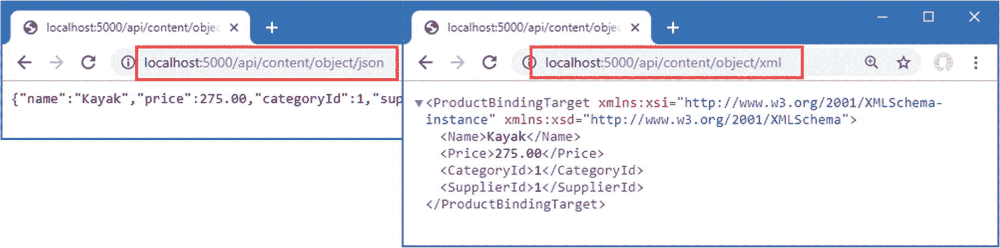

# 二十、高级 Web 服务功能

在这一章中，我描述了可以用来创建 RESTful web 服务的高级特性。我解释了如何处理实体框架核心查询中的相关数据，如何添加对 HTTP PATCH 方法的支持，如何使用内容否定，以及如何使用 OpenAPI 来描述您的 web 服务。表 [20-1](#Tab1) 将本章放在上下文中。

表 20-1。

将高级 Web 服务功能放在上下文中

<colgroup><col class="tcol1 align-left"> <col class="tcol2 align-left"></colgroup> 
| 

问题

 | 

回答

 |
| --- | --- |
| 它们是什么？ | 本章中描述的功能可以更好地控制 ASP.NET Core web 服务的工作方式，包括管理发送到客户端的数据和数据格式。 |
| 它们为什么有用？ | ASP.NET Core 提供的默认行为不能满足每个项目的需求，本章描述的特性允许 web 服务被重新调整以适应特定的需求。 |
| 它们是如何使用的？ | 本章特征的共同主题是改变动作方法产生的反应。 |
| 有什么陷阱或限制吗？ | 很难决定如何实现 web 服务，尤其是当它们由第三方客户端使用时。一旦客户端开始使用 web 服务，web 服务的行为就变得固定，这意味着在使用本章描述的功能时需要仔细考虑。 |
| 还有其他选择吗？ | 本章描述的特性是可选的，您可以依赖 ASP.NET Core web 服务的默认行为。 |

表 [20-2](#Tab2) 总结了本章内容。

表 20-2。

章节总结

<colgroup><col class="tcol1 align-left"> <col class="tcol2 align-left"> <col class="tcol3 align-left"></colgroup> 
| 

问题

 | 

解决办法

 | 

列表

 |
| --- | --- | --- |
| 使用关系数据 | 在 LINQ 查询中使用`Include`和`ThenInclude`方法 | four |
| 打破循环引用 | 将导航属性显式设置为 null | five |
| 允许客户端有选择地更新数据 | 支持 HTTP 补丁方法 | 6–9 |
| 支持一系列响应数据类型 | 支持内容格式化和协商 | 10–24 |
| 记录 web 服务 | 使用 OpenAPI 描述 web 服务 | 25–29 |

## 为本章做准备

本章使用在第 [18](18.html) 章创建并在第 [19](19.html) 章修改的 WebApp 项目。为了准备本章，将一个名为`SuppliersController.cs`的文件添加到`WebApp/Controllers`文件夹中，其内容如清单 [20-1](#PC1) 所示。

```cs
using Microsoft.AspNetCore.Mvc;
using WebApp.Models;
using System.Threading.Tasks;

namespace WebApp.Controllers {

    [ApiController]
    [Route("api/[controller]")]
    public class SuppliersController: ControllerBase {
        private DataContext context;

        public SuppliersController(DataContext ctx) {
            context = ctx;
        }

        [HttpGet("{id}")]
        public async Task<Supplier> GetSupplier(long id) {
            return await context.Suppliers.FindAsync(id);
        }
    }
}

Listing 20-1.The Contents of the SuppliersController.cs File in the Controllers Folder

```

控制器扩展了`ControllerBase`类，声明了对`DataContext`服务的依赖，并定义了一个名为`GetSupplier`的动作来处理对`/api/[controller]/{id}` URL 模式的 GET 请求。

### 正在删除数据库

打开一个新的 PowerShell 命令提示符，导航到包含`WebApp.csproj`文件的文件夹，运行清单 [20-2](#PC2) 中所示的命令来删除数据库。

Tip

你可以从 [`https://github.com/apress/pro-asp.net-core-3`](https://github.com/apress/pro-asp.net-core-3) 下载本章以及本书其他章节的示例项目。如果在运行示例时遇到问题，请参见第 [1](01.html) 章获取帮助。

```cs
dotnet ef database drop --force

Listing 20-2.Dropping the Database

```

### 运行示例应用

删除数据库后，从 Debug 菜单中选择 Start Without Debugging 或 Run Without Debugging，或者使用 PowerShell 命令提示符运行清单 [20-3](#PC3) 中所示的命令。

```cs
dotnet run

Listing 20-3.Running the Example Application

```

数据库将作为应用启动的一部分被植入。一旦 ASP.NET Core 正在运行，使用 web 浏览器请求`http://localhost:5000/api/suppliers/1`，这将产生如图 [20-1](#Fig1) 所示的响应。


图 20-1。

运行示例应用

响应显示了主键与请求 URL 的最后一段匹配的`Supplier`对象。在第 [19 章](19.html)中，JSON 序列化程序被配置为忽略带有`null`值的属性，这就是为什么响应不包括由`Supplier`数据模型类定义的导航属性。

## 处理相关数据

虽然这不是一本关于实体框架核心的书，但有一个方面是大多数 web 服务都会遇到的数据查询。第 [18 章](18.html)中定义的数据模型类包括导航属性，当使用`Include`方法时，实体框架核心可以通过数据库中的下列关系来填充这些属性，如清单 [20-4](#PC4) 所示。

```cs
using Microsoft.AspNetCore.Mvc;
using WebApp.Models;
using System.Threading.Tasks;
using Microsoft.EntityFrameworkCore;

namespace WebApp.Controllers {

    [ApiController]
    [Route("api/[controller]")]
    public class SuppliersController: ControllerBase {
        private DataContext context;

        public SuppliersController(DataContext ctx) {
            context = ctx;
        }

        [HttpGet("{id}")]
        public async Task<Supplier> GetSupplier(long id) {
            return await context.Suppliers
                .Include(s => s.Products)
                .FirstAsync(s => s.SupplierId == id);
        }
    }
}

Listing 20-4.Requesting Related Data in the SuppliersController.cs File in the Controllers Folder

```

`Include`方法告诉实体框架核心遵循数据库中的关系并加载相关数据。在这种情况下，`Include`方法选择由`Supplier`类定义的`Products`导航属性，这使得实体框架核心加载与所选的`Supplier`相关联的`Product`对象，并将它们分配给`Products`属性。

重启 ASP.NET Core，使用浏览器请求`http://localhost:5000/api/suppliers/1`，它将针对`GetSupplier`动作方法。请求失败，您将看到如图 [20-2](#Fig2) 所示的异常。


图 20-2。

查询相关数据导致的异常

JSON 序列化程序报告了一个“对象循环”，这意味着正在为响应序列化的数据中存在循环引用。

查看清单 [20-4](#PC4) 中的代码，您可能很难理解为什么使用`Include`方法会创建一个循环引用。该问题是由一个实体框架核心功能引起的，该功能试图最小化从数据库读取的数据量，但却导致 ASP.NET Core 应用出现问题。

当实体框架核心创建对象时，它用已经由相同数据库上下文创建的对象填充导航属性。这在某些类型的应用中可能是一个有用的特性，比如桌面应用，其中数据库上下文对象具有很长的生命周期，用于随着时间的推移发出许多请求。它对 ASP.NET Core 应用没有用，在那里为每个 HTTP 请求创建一个新的上下文对象。

实体框架核心在数据库中查询与所选的`Supplier`相关联的`Product`对象，并将它们分配给`Supplier.Products`导航属性。问题是，实体框架核心然后查看它创建的每个`Product`对象，并使用查询响应来填充`Product.Supplier`导航属性。对于 ASP.NET Core 应用来说，这是一个无用的步骤，因为它在`Supplier`和`Product`对象的导航属性之间创建了一个循环引用，如图 [20-3](#Fig3) 所示。


图 20-3。

了解实体框架核心如何使用相关数据

当控制器的 action 方法返回`Supplier`对象时，JSON 序列化程序遍历这些属性，并跟踪对`Product`对象的引用，每个对象都有一个对`Supplier`对象的引用，它循环跟踪这个引用，直到达到最大深度，并抛出图 [20-2](#Fig2) 中所示的异常。

### 打破相关数据中的循环引用

没有办法阻止实体框架核心在其加载到数据库中的数据中创建循环引用。防止异常意味着向 JSON 序列化程序呈现不包含循环引用的数据，这是最容易做到的，在实体框架核心创建对象之后、序列化之前更改对象，如清单 [20-5](#PC5) 所示。

```cs
using Microsoft.AspNetCore.Mvc;
using WebApp.Models;
using System.Threading.Tasks;
using Microsoft.EntityFrameworkCore;

namespace WebApp.Controllers {

    [ApiController]
    [Route("api/[controller]")]
    public class SuppliersController: ControllerBase {
        private DataContext context;

        public SuppliersController(DataContext ctx) {
            context = ctx;
        }

        [HttpGet("{id}")]
        public async Task<Supplier> GetSupplier(long id) {
            Supplier supplier = await context.Suppliers.Include(s => s.Products)
                .FirstAsync(s => s.SupplierId == id);
            foreach (Product p in supplier.Products) {
                p.Supplier = null;
            };
            return supplier;
        }
    }
}

Listing 20-5.Breaking References in the SuppliersController.cs File in the Controllers Folder

```

`foreach`循环将每个`Product`对象的`Supplier`属性设置为`null`，这打破了循环引用。重启 ASP.NET Core，请求`http://localhost:5000/api/suppliers/1`查询供应商及其相关产品，产生如图 [20-4](#Fig4) 所示的响应。


图 20-4。

查询相关数据

## 支持 HTTP 补丁方法

对于简单的数据类型，编辑操作可以通过使用 PUT 方法替换现有对象来处理，这是我在第 19 章[中采用的方法。例如，即使您只需要更改`Product`类中的一个属性值，使用 PUT 方法并包含所有其他`Product`属性的值也不会太麻烦。](19.html)

并不是所有的数据类型都很容易处理，要么是因为它们定义了太多的属性，要么是因为客户端只接收了选定属性的值。解决方案是使用一个补丁请求，它只将更改发送给 web 服务，而不是一个完整的替换对象。

### 了解 JSON 补丁

ASP.NET Core 支持使用 JSON 补丁标准，该标准允许以统一的方式指定变更。JSON 补丁标准允许描述一组复杂的变化，但是在本章中，我将只关注改变属性值的能力。

我不打算深入 JSON 补丁标准的细节，您可以在 [`https://tools.ietf.org/html/rfc6902`](https://tools.ietf.org/html/rfc6902) 阅读，但是客户端将在其 HTTP 补丁请求中发送这样的 web 服务 JSON 数据:

```cs
[
 { "op": "replace", "path": "Name", "value": "Surf Co"},
 { "op": "replace", "path": "City", "value": “Los Angeles”},
]

```

JSON 补丁文档被表示为一组操作。每个操作都有一个指定操作类型的`op`属性和一个指定操作应用位置的`path`属性。

对于示例应用——事实上，对于大多数应用——只需要`replace`操作，它用于更改属性值。这个 JSON 补丁文档为`Name`和`City`属性设置了新值。JSON 补丁文档中没有提到的由`Supplier`类定义的属性将不会被修改。

### 安装和配置 JSON 补丁包

使用空模板创建项目时，不会安装对 JSON 补丁的支持。要安装 JSON 补丁包，打开一个新的 PowerShell 命令提示符，导航到包含`WebApp.csproj`文件的文件夹，运行清单 [20-6](#PC7) 中所示的命令。如果您使用的是 Visual Studio，可以通过选择“项目➤管理 NuGet 包”来安装该包。

```cs
dotnet add package Microsoft.AspNetCore.Mvc.NewtonsoftJson --version 3.1.1

Listing 20-6.Installing the JSON Patch Package

```

JSON 补丁的微软实现依赖于 ASP.NET Core 2 . x 中使用的第三方 Newton soft JSON.NET 序列化程序，但它已被 ASP.NET Core 3 . x 中的定制 JSON 序列化程序所取代。将清单 [20-7](#PC8) 中显示的语句添加到`Startup`类的`ConfigureServices`方法中，以启用旧的序列化程序。

```cs
...
public void ConfigureServices(IServiceCollection services) {
    services.AddDbContext<DataContext>(opts => {
        opts.UseSqlServer(Configuration[
            "ConnectionStrings:ProductConnection"]);
        opts.EnableSensitiveDataLogging(true);
    });

    services.AddControllers().AddNewtonsoftJson();

    services.Configure<MvcNewtonsoftJsonOptions>(opts => {
        opts.SerializerSettings.NullValueHandling
            = Newtonsoft.Json.NullValueHandling.Ignore;
    });

    //services.Configure<JsonOptions>(opts => {
    //    opts.JsonSerializerOptions.IgnoreNullValues = true;
    //});
}
...

Listing 20-7.Enabling the JSON.NET Serializer in the Startup.cs File in the WebApp Folder

```

`AddNewtonsoftJson`方法启用 JSON.NET 串行器，它取代了标准的 ASP.NET Core 串行器。JSON.NET 序列化程序有自己的配置类`MvcNewtonsoftJsonOptions`，它是通过 options 模式应用的。清单 [20-7](#PC8) 设置了`NullValueHandling`值，它告诉序列化器丢弃带有`null`值的属性。

Tip

参见 [`https://www.newtonsoft.com/json`](https://www.newtonsoft.com/json) 了解 JSON.NET 串行器可用的其他配置选项的详细信息。

### 定义行动方法

为了增加对补丁方法的支持，将清单 [20-8](#PC9) 中所示的动作方法添加到`SuppliersController`类中。

```cs
using Microsoft.AspNetCore.Mvc;
using WebApp.Models;
using System.Threading.Tasks;
using Microsoft.EntityFrameworkCore;
using Microsoft.AspNetCore.JsonPatch;

namespace WebApp.Controllers {

    [ApiController]
    [Route("api/[controller]")]
    public class SuppliersController : ControllerBase {
        private DataContext context;

        public SuppliersController(DataContext ctx) {
            context = ctx;
        }

        [HttpGet("{id}")]
        public async Task<Supplier> GetSupplier(long id) {
            Supplier supplier = await context.Suppliers.Include(s => s.Products)
                .FirstAsync(s => s.SupplierId == id);
            foreach (Product p in supplier.Products) {
                p.Supplier = null;
            };
            return supplier;
        }

        [HttpPatch("{id}")]
        public async Task<Supplier> PatchSupplier(long id,
                JsonPatchDocument<Supplier> patchDoc) {
            Supplier s = await context.Suppliers.FindAsync(id);
            if (s != null) {
                patchDoc.ApplyTo(s);
                await context.SaveChangesAsync();
            }
            return s;
        }
    }
}

Listing 20-8.Adding an Action in the SuppliersController.cs File in the Controller Folder

```

action 方法用`HttpPatch`属性修饰，这表示它将处理 HTTP 请求。模型绑定特性用于通过一个`JsonPatchDocument<T>`方法参数处理 JSON 补丁文档。`JsonPatchDocument<T>`类定义了一个`ApplyTo`方法，将每个操作应用于一个对象。清单 [20-8](#PC9) 中的 action 方法从数据库中检索一个`Supplier`对象，应用 JSON 补丁，并存储修改后的对象。

重启 ASP.NET Core 并使用 PowerShell 命令提示符运行清单 [20-9](#PC10) 中所示的命令，该命令发送一个 HTTP 补丁请求，其中包含一个 JSON 补丁文档，该文档将`City`属性的值更改为`Los Angeles`。

```cs
Invoke-RestMethod http://localhost:5000/api/suppliers/1 -Method PATCH -ContentType "application/json" -Body '[{"op":"replace","path":"City","value":"Los Angeles"}]'

Listing 20-9.Sending an HTTP PATCH Request

```

`PatchSupplier`动作方法返回修改后的`Supplier`对象作为结果，该结果被序列化并在 HTTP 响应中发送给客户端。您还可以通过使用 web 浏览器请求`http://localhost:5000/suppliers/1`来查看更改的效果，这会产生如图 [20-5](#Fig5) 所示的响应。


图 20-5。

使用修补程序请求更新

## 了解内容格式

到目前为止，web 服务示例已经产生了 JSON 结果，但是这并不是 action 方法可以产生的唯一数据格式。为操作结果选择的内容格式取决于四个因素:客户端将接受的格式、应用可以生成的格式、操作方法指定的内容策略以及操作方法返回的类型。弄清楚所有的东西是如何组合在一起的可能是令人生畏的，但是好消息是默认策略对于大多数应用来说工作得很好，并且您只需要理解当您需要做出改变或者当您没有以您期望的格式得到结果时在幕后发生了什么。

### 了解默认内容策略

熟悉内容格式的最好方法是了解当客户端和操作方法都没有对可以使用的格式应用任何限制时会发生什么。在这种情况下，结果是简单且可预测的。

1.  如果 action 方法返回一个`string`，该字符串将被不加修改地发送给客户端，并且响应的`Content-Type`头被设置为`text/plain`。

2.  对于所有其他数据类型，包括其他简单类型如`int`，数据被格式化为 JSON，响应的`Content-Type`头被设置为`application/json`。

字符串得到特殊处理，因为当它们被编码为 JSON 时会引起问题。当你编码其他简单类型时，比如 C# `int`值`2`，那么结果就是一个带引号的字符串，比如`"2"`。当你对一个字符串进行编码时，你会得到两组引号，这样`"Hello"`就变成了`""Hello""`。不是所有的客户端都能很好地处理这种双重编码，所以使用`text/plain`格式并完全回避这个问题更可靠。这很少成为问题，因为很少有应用发送`string`值；更常见的是以 JSON 格式发送对象。要查看默认策略，使用清单 [20-10](#PC11) 中所示的代码将名为`ContentController.cs`的类文件添加到`WebApps/Controllers`文件夹中。

```cs
using Microsoft.AspNetCore.Mvc;
using Microsoft.EntityFrameworkCore;
using System.Threading.Tasks;
using WebApp.Models;

namespace WebApp.Controllers {

    [ApiController]
    [Route("/api/[controller]")]
    public class ContentController : ControllerBase {
        private DataContext context;

        public ContentController(DataContext dataContext) {
            context = dataContext;
        }

        [HttpGet("string")]
        public string GetString() => "This is a string response";

        [HttpGet("object")]
        public async Task<Product> GetObject() {
            return await context.Products.FirstAsync();
        }
    }
}

Listing 20-10.The Contents of the ContentController.cs File in the Controllers Folder

```

控制器定义了返回字符串和对象结果的操作。重启 ASP.NET Core 并使用 PowerShell 提示符运行清单 [20-11](#PC12) 中所示的命令；该命令发送一个调用`GetString`动作方法的请求，该方法返回一个字符串。

```cs
Invoke-WebRequest http://localhost:5000/api/content/string | select @{n='Content-Type';e={ $_.Headers."Content-Type" }}, Content

Listing 20-11.Requesting a String Response

```

这个命令向`/api/content/string` URL 发送一个 GET 请求，并处理响应以显示`Content-Type`头和响应的内容。该命令产生以下输出，显示了响应的`Content-Type`标题:

```cs
Content-Type              Content
------------              -------
text/plain; charset=utf-8 This is a string response

```

接下来，运行清单 [20-12](#PC14) 中所示的命令，它发送一个将由`GetObject`动作方法处理的请求。

```cs
Invoke-WebRequest http://localhost:5000/api/content/object | select @{n='Content-Type';e={ $_.Headers."Content-Type" }}, Content

Listing 20-12.Requesting an Object Response

```

该命令产生以下输出，为了清楚起见，对输出进行了格式化，显示响应已经被编码为 JSON:

```cs
Content-Type                    Content
------------                    -------
application/json; charset=utf-8 {"productId":1,"name":"Kayak",
                                 "price":275.00,"categoryId":1,"supplierId":1}

```

### 了解内容协商

大多数客户机在请求中包含一个`Accept`头，它指定了它们希望在响应中接收的一组格式，表示为一组 MIME 类型。以下是 Google Chrome 在请求中发送的`Accept`头:

```cs
Accept: text/html,application/xhtml+xml,application/xml;q=0.9,image/webp,image/apng,
        */*;q=0.8

```

这个头表明 Chrome 可以处理 HTML 和 XHTML 格式(XHTML 是 HTML 的一种 XML 兼容方言)、XML 和 WEBP 图像格式(这是一种动画 PNG 图像格式)。

标题中的`q`值指定相对优先级，缺省值为 1.0。为`application/xml`指定 0.9 的`q`值告诉服务器 Chrome 将接受 XML 数据，但更喜欢处理 HTML 或 XHTML。`*/*`项告诉服务器 Chrome 将接受任何格式，但是它的`q`值指定它是指定类型中最低的首选项。将这些放在一起意味着 Chrome 发送的`Accept`头向服务器提供了以下信息:

1.  Chrome 更喜欢接收 HTML 或 XHTML 数据或 WEBP 和 APNG 图像。

2.  如果这些格式都不可用，那么下一个最受欢迎的格式就是 XML。

3.  如果首选格式都不可用，那么 Chrome 将接受任何格式。

您可能由此认为，您可以通过设置`Accept`头来更改 ASP.NET Core 应用生成的格式，但是它并不是这样工作的——或者说，它还不是那样工作的，因为需要一些准备工作。

要查看当`Accept`头被更改时会发生什么，使用 PowerShell 提示符运行清单 [20-13](#PC17) 中所示的命令，该命令设置`Accept`头来告诉 ASP.NET Core，客户端愿意只接收 XML 数据。

```cs
Invoke-WebRequest http://localhost:5000/api/content/object -Headers @{Accept="application/xml"} | select @{n='Content-Type';e={ $_.Headers."Content-Type" }}, Content

Listing 20-13.Requesting XML Data

```

下面是结果，显示应用已经发送了一个`application/json`响应:

```cs
Content-Type                    Content
------------                    -------
application/json; charset=utf-8 {"productId":1,"name":"Kayak",
                                 "price":275.00,"categoryId":1,"supplierId":1}

```

包含`Accept`头对格式没有影响，即使 ASP.NET Core 应用向客户端发送了一种它没有指定的格式。问题是，默认情况下，MVC 框架被配置为只使用 JSON。MVC 框架不是返回一个错误，而是发送 JSON 数据，希望客户机能够处理它，即使它不是 request `Accept`头指定的格式之一。

#### 启用 XML 格式

为了使内容协商能够工作，必须对应用进行配置，以便在可以使用的格式中有一些选择。虽然 JSON 已经成为 web 应用的默认格式，但是 MVC 框架也可以支持将数据编码为 XML，如清单 [20-14](#PC19) 所示。

Tip

您可以通过从`Microsoft.AspNetCore.Mvc.Formatters.OutputFormatter`类派生来创建自己的内容格式。这很少使用，因为创建自定义数据格式并不是在应用中公开数据的有用方式，而且最常见的格式—JSON 和 XML—已经实现了。

```cs
...
public void ConfigureServices(IServiceCollection services) {
    services.AddDbContext<DataContext>(opts => {
        opts.UseSqlServer(Configuration[
            "ConnectionStrings:ProductConnection"]);
        opts.EnableSensitiveDataLogging(true);
    });

    services.AddControllers().AddNewtonsoftJson().AddXmlSerializerFormatters();

    services.Configure<MvcNewtonsoftJsonOptions>(opts => {
        opts.SerializerSettings.NullValueHandling
            = Newtonsoft.Json.NullValueHandling.Ignore;
    });
}
...

Listing 20-14.Enabling XML Formatting in the Startup.cs File in the WebApp Folder

```

XML 序列化程序有一些限制，包括无法处理实体框架核心导航属性，因为它们是通过接口定义的。为了创建一个可以序列化的对象，清单 [20-15](#PC20) 使用了第 [19 章](19.html)中定义的`ProductBindingTarget`。

```cs
using Microsoft.AspNetCore.Mvc;
using Microsoft.EntityFrameworkCore;
using System.Threading.Tasks;
using WebApp.Models;

namespace WebApp.Controllers {

    [ApiController]
    [Route("/api/[controller]")]
    public class ContentController : ControllerBase {
        private DataContext context;

        public ContentController(DataContext dataContext) {
            context = dataContext;
        }

        [HttpGet("string")]
        public string GetString() => "This is a string response";

        [HttpGet("object")]
        public async Task<ProductBindingTarget> GetObject() {
            Product p = await context.Products.FirstAsync();
            return new ProductBindingTarget() {
                Name = p.Name, Price = p.Price, CategoryId = p.CategoryId,
                SupplierId = p.SupplierId
            };
        }
    }
}

Listing 20-15.Creating a Serializable Object in the ContentController.cs File in the Controllers Folder

```

当 MVC 框架只有 JSON 格式可用时，它别无选择，只能将响应编码为 JSON。现在有了一个选择，您可以看到内容协商过程工作得更充分了。重启 ASP.NET Core MVC 并再次运行清单 [20-13](#PC17) 中的命令来请求 XML 数据，您将看到以下输出(为了简洁起见，我省略了其中的名称空间属性):

```cs
Content-Type                   Content
------------                   -------
application/xml; charset=utf-8 <ProductBindingTarget>
                                 <Name>Kayak</Name>
                                 <Price>275.00</Price>
                                 <CategoryId>1</CategoryId>
                                 <SupplierId>1</SupplierId>
                               </ProductBindingTarget>

```

#### 完全遵守接受标头

如果`Accept`头包含`*/*`，表示任何格式，MVC 框架将总是使用 JSON 格式，即使有其他更高优先级的支持格式。这是一个奇怪的特性，旨在一致地处理来自浏览器的请求，尽管它可能会引起混淆。运行清单 [20-16](#PC22) 中所示的命令，发送一个带有`Accept`头的请求，请求 XML，但如果 XML 不可用，将接受任何其他格式。

```cs
Invoke-WebRequest http://localhost:5000/api/content/object -Headers @{Accept="application/xml,*/*;q=0.8"} | select @{n='Content-Type';e={ $_.Headers."Content-Type" }}, Content

Listing 20-16.Requesting an XML Response with a Fallback

```

尽管`Accept`头告诉 MVC 框架客户端更喜欢 XML，但是`*/*`回退的存在意味着发送了一个 JSON 响应。一个相关的问题是，当客户端请求一种 MVC 框架没有配置为产生的格式时，将会发送一个 JSON 响应，这可以通过运行清单 [20-17](#PC23) 中所示的命令看到。

```cs
Invoke-WebRequest http://localhost:5000/api/content/object -Headers @{Accept="img/png"} | select @{n='Content-Type';e={ $_.Headers."Content-Type" }}, Content

Listing 20-17.Requesting a PNG Response

```

清单 [20-16](#PC22) 和清单 [20-17](#PC23) 中的命令都会产生以下响应:

```cs
Content-Type                    Content
------------                    -------
application/json; charset=utf-8 {"name":"Kayak","price":275.00,
                                 "categoryId":1,"supplierId":1}

```

在这两种情况下，MVC 框架都返回 JSON 数据，这可能不是客户机所期望的。两个配置设置用于告诉 MVC 框架尊重客户端发送的`Accept`设置，默认情况下不发送 JSON 数据。要更改配置，将清单 [20-18](#PC25) 中所示的语句添加到`Startup`类中。

```cs
...
public void ConfigureServices(IServiceCollection services) {
    services.AddDbContext<DataContext>(opts => {
        opts.UseSqlServer(Configuration[
            "ConnectionStrings:ProductConnection"]);
        opts.EnableSensitiveDataLogging(true);
    });

    services.AddControllers().AddNewtonsoftJson().AddXmlSerializerFormatters();

    services.Configure<MvcNewtonsoftJsonOptions>(opts => {
        opts.SerializerSettings.NullValueHandling
            = Newtonsoft.Json.NullValueHandling.Ignore;
    });

    services.Configure<MvcOptions>(opts => {
        opts.RespectBrowserAcceptHeader = true;
        opts.ReturnHttpNotAcceptable = true;
    });
}
...

Listing 20-18.Configuring Content Negotiation in the Startup.cs File in the WebApp Folder

```

选项模式用于设置一个`MvcOptions`对象的属性。当`Accept`头包含`*/*`时，将`RespectBrowserAcceptHeader`设置为`true`会禁止回退到 JSON。当客户端请求不支持的数据格式时，将`ReturnHttpNotAcceptable`设置为`true`会禁止回退到 JSON。

重启 ASP.NET Core 并重复清单 [20-16](#PC22) 中的命令。代替 JSON 响应，将遵循由`Accept`头指定的格式首选项，并将发送一个 XML 响应。重复清单 [20-17](#PC23) 中的命令，您将收到带有 406 状态代码的响应。

```cs
...
Invoke-WebRequest : The remote server returned an error: (406) Not Acceptable.
...

```

发送 406 代码表明客户机可以处理的格式和 MVC 框架可以产生的格式之间没有重叠，确保客户机不会收到它不能处理的数据格式。

### 指定操作结果格式

MVC 框架可以用于动作方法结果的数据格式可以使用`Produces`属性来约束，如清单 [20-19](#PC27) 所示。

Tip

`Produces`属性是过滤器的一个例子，它允许属性改变请求和响应。详见第 30 章。

```cs
using Microsoft.AspNetCore.Mvc;
using Microsoft.EntityFrameworkCore;
using System.Threading.Tasks;
using WebApp.Models;

namespace WebApp.Controllers {

    [ApiController]
    [Route("/api/[controller]")]
    public class ContentController : ControllerBase {
        private DataContext context;

        public ContentController(DataContext dataContext) {
            context = dataContext;
        }

        [HttpGet("string")]
        public string GetString() => "This is a string response";

        [HttpGet("object")]
        [Produces("application/json")]
        public async Task<ProductBindingTarget> GetObject() {
            Product p = await context.Products.FirstAsync();
            return new ProductBindingTarget() {
                Name = p.Name, Price = p.Price, CategoryId = p.CategoryId,
                SupplierId = p.SupplierId
            };
        }
    }
}

Listing 20-19.Specifying a Data Format in the ContentController.cs File in the Controllers Folder

```

属性的参数指定将用于操作结果的格式，并且可以指定多种类型。`Produces`属性限制了 MVC 框架在处理`Accept`头时考虑的类型。要查看`Produces`属性的效果，请使用 PowerShell 提示符运行清单 [20-20](#PC28) 中所示的命令。

```cs
Invoke-WebRequest http://localhost:5000/api/content/object -Headers @{Accept="application/xml,application/json;q=0.8"} | select @{n='Content-Type';e={ $_.Headers."Content-Type" }}, Content

Listing 20-20.Requesting Data

```

`Accept`头告诉 MVC 框架，客户机更喜欢 XML 数据，但会接受 JSON。`Produces`属性意味着 XML 数据不能作为`GetObject`操作方法的数据格式，因此选择了 JSON 序列化程序，它产生以下响应:

```cs
Content-Type                    Content
------------                    -------
application/json; charset=utf-8 {"name":"Kayak","price":275.00,
                                 "categoryId":1,"supplierId":1}

```

### 请求 URL 中的格式

`Accept`头并不总是在编写客户端的程序员的控制之下。在这种情况下，允许使用 URL 请求响应的数据格式会很有帮助。这个特性是通过用`FormatFilter`属性修饰一个动作方法并确保在动作方法的路径中有一个`format`段变量来实现的，如清单 [20-21](#PC30) 所示。

```cs
using Microsoft.AspNetCore.Mvc;
using Microsoft.EntityFrameworkCore;
using System.Threading.Tasks;
using WebApp.Models;

namespace WebApp.Controllers {

    [ApiController]
    [Route("/api/[controller]")]
    public class ContentController : ControllerBase {
        private DataContext context;

        public ContentController(DataContext dataContext) {
            context = dataContext;
        }

        [HttpGet("string")]
        public string GetString() => "This is a string response";

        [HttpGet("object/{format?}")]
        [FormatFilter]
        [Produces("application/json", "application/xml")]
        public async Task<ProductBindingTarget> GetObject() {
            Product p = await context.Products.FirstAsync();
            return new ProductBindingTarget() {
                Name = p.Name, Price = p.Price, CategoryId = p.CategoryId,
                SupplierId = p.SupplierId
            };
        }
    }
}

Listing 20-21.Enabling Formatting in the ContentController.cs File in the Controllers Folder

```

属性`FormatFilter`是过滤器的一个例子，它是一个可以修改请求和响应的属性，如第 [30 章](30.html)所述。这个过滤器从匹配请求的路由中获取`format`段变量的值，并使用它来覆盖客户端发送的`Accept`报头。我还扩展了由`Produces`属性指定的类型范围，以便 action 方法可以返回 JSON 和 XML 响应。

应用支持的每种数据格式都有一个简写:`xml`表示 XML 数据，`json`表示 JSON 数据。当包含这些简写名称之一的 URL 指向动作方法时，会忽略`Accept`头，并使用指定的格式。要查看效果，重启 ASP.NET Core 并使用浏览器请求`http://localhost:5000/api/content/object/json`和`http://localhost:5000/api/content/object/xml`，它们产生如图 [20-6](#Fig6) 所示的响应。



图 20-6。

请求 URL 中的数据格式

### 限制动作方法接收的格式

大多数内容格式化决策都集中在 ASP.NET Core 应用发送给客户端的数据格式上，但是处理结果的相同的序列化程序也用于反序列化客户端在请求正文中发送的数据。反序列化过程是自动发生的，大多数应用会乐于接受它们被配置为发送的所有格式的数据。示例应用被配置为发送 JSON 和 XML 数据，这意味着客户端可以在请求中发送 JSON 和 XML 数据。

`Consumes`属性可以应用于动作方法，以限制它将处理的数据类型，如清单 [20-22](#PC31) 所示。

```cs
using Microsoft.AspNetCore.Mvc;
using Microsoft.EntityFrameworkCore;
using System.Threading.Tasks;
using WebApp.Models;

namespace WebApp.Controllers {

    [ApiController]
    [Route("/api/[controller]")]
    public class ContentController : ControllerBase {
        private DataContext context;

        public ContentController(DataContext dataContext) {
            context = dataContext;
        }

        [HttpGet("string")]
        public string GetString() => "This is a string response";

        [HttpGet("object/{format?}")]
        [FormatFilter]
        [Produces("application/json", "application/xml")]
        public async Task<ProductBindingTarget> GetObject() {
            Product p = await context.Products.FirstAsync();
            return new ProductBindingTarget() {
                Name = p.Name, Price = p.Price, CategoryId = p.CategoryId,
                SupplierId = p.SupplierId
            };
        }

        [HttpPost]
        [Consumes("application/json")]
        public string SaveProductJson(ProductBindingTarget product) {
            return $"JSON: {product.Name}";
        }

        [HttpPost]
        [Consumes("application/xml")]
        public string SaveProductXml(ProductBindingTarget product) {
            return $"XML: {product.Name}";
        }
    }
}

Listing 20-22.Adding Action Methods in the ContentController.cs File in the Controllers Folder

```

新的动作方法用`Consumes`属性修饰，限制了每个方法可以处理的数据类型。属性的组合意味着`Content-Type`头为`application/json`的 HTTP POST 属性将由`SaveProductJson`动作方法处理。其`Content-Type`头为`application/xml`的 HTTP POST 请求将由`SaveProductXml`操作方法处理。重启 ASP.NET Core，使用 PowerShell 命令提示符运行清单 [20-23](#PC32) 中所示的命令，将 JSON 数据发送到示例应用。

```cs
Invoke-RestMethod http://localhost:5000/api/content -Method POST -Body  (@{ Name="Swimming Goggles"; Price=12.75; CategoryId=1; SupplierId=1} | ConvertTo-Json) -ContentType "application/json"

Listing 20-23.Sending JSON Data

```

请求被自动路由到正确的操作方法，该方法产生以下响应:

```cs
JSON: Swimming Goggles

```

运行清单 [20-24](#PC34) 中所示的命令，将 XML 数据发送到示例应用。

```cs
Invoke-RestMethod http://localhost:5000/api/content -Method POST -Body  "<ProductBindingTarget><Name>Kayak</Name><Price>275.00</Price><CategoryId>1</CategoryId><SupplierId>1</SupplierId></ProductBindingTarget>" -ContentType "application/xml"

Listing 20-24.Sending XML Data

```

请求被路由到`SaveProductXml`动作方法，并产生以下响应:

```cs
XML: Kayak

```

如果发送的请求带有与应用支持的数据类型不匹配的`Content-Type`头，MVC 框架将发送一个`415 - Unsupported Media Type`响应。

## 记录和探索 Web 服务

当您同时负责开发 web 服务及其客户端时，每个操作的目的及其结果都是显而易见的，并且通常是同时编写的。如果您负责由第三方开发人员使用的 web 服务，那么您可能需要提供描述 web 服务如何工作的文档。OpenAPI 规范，也称为 Swagger，以一种其他程序员可以理解并以编程方式使用的方式描述 web 服务。在这一节中，我将演示如何使用 OpenAPI 来描述 web 服务，并向您展示如何对描述进行微调。

### 解决动作冲突

OpenAPI 发现过程需要 HTTP 方法和 URL 模式的唯一组合用于每个操作方法。该流程不支持`Consumes`属性，因此需要对`ContentController`进行更改，以删除接收 XML 和 JSON 数据的单独操作，如清单 [20-25](#PC36) 所示。

```cs
using Microsoft.AspNetCore.Mvc;
using Microsoft.EntityFrameworkCore;
using System.Threading.Tasks;
using WebApp.Models;

namespace WebApp.Controllers {

    [ApiController]
    [Route("/api/[controller]")]
    public class ContentController : ControllerBase {
        private DataContext context;

        public ContentController(DataContext dataContext) {
            context = dataContext;
        }

        [HttpGet("string")]
        public string GetString() => "This is a string response";

        [HttpGet("object/{format?}")]
        [FormatFilter]
        [Produces("application/json", "application/xml")]
        public async Task<ProductBindingTarget> GetObject() {
            Product p = await context.Products.FirstAsync();
            return new ProductBindingTarget() {
                Name = p.Name, Price = p.Price, CategoryId = p.CategoryId,
                SupplierId = p.SupplierId
            };
        }

        [HttpPost]
        [Consumes("application/json")]
        public string SaveProductJson(ProductBindingTarget product) {
            return $"JSON: {product.Name}";
        }

        //[HttpPost]
        //[Consumes("application/xml")]
        //public string SaveProductXml(ProductBindingTarget product) {
        //    return $"XML: {product.Name}";
        //}
    }
}

Listing 20-25.Removing an Action in the ContentController.cs File in the Controllers Folder

```

注释掉其中一个操作方法可以确保每个剩余的操作都有一个 HTTP 方法和 URL 的唯一组合。

### 安装和配置 Swashbuckle 软件包

Swashbuckle 包是 OpenAPI 规范最流行的 ASP.NET Core 实现，它将在 ASP.NET Core 应用中自动生成 web 服务的描述。该包还包括使用该描述的工具，以允许对 web 服务进行检查和测试。

打开一个新的 PowerShell 命令提示符，导航到包含`WebApp.csproj`文件的文件夹，运行清单 [20-26](#PC37) 中所示的命令来安装 NuGet 包。如果您使用的是 Visual Studio，可以选择“项目➤管理 Nuget 包”并通过 Visual Studio 包用户界面安装该包。

```cs
dotnet add package Swashbuckle.AspNetCore --version 5.0.0-rc2

Listing 20-26.Adding a Package to the Project

```

将清单 [20-27](#PC38) 中显示的语句添加到`Startup`类中，以添加 Swashbuckle 包提供的服务和中间件。

```cs
using System;
using System.Collections.Generic;
using System.Linq;
using System.Threading.Tasks;
using Microsoft.AspNetCore.Builder;
using Microsoft.AspNetCore.Hosting;
using Microsoft.AspNetCore.Http;
using Microsoft.Extensions.DependencyInjection;
using Microsoft.Extensions.Hosting;
using Microsoft.Extensions.Configuration;
using Microsoft.EntityFrameworkCore;
using WebApp.Models;
using Microsoft.AspNetCore.Mvc;
using Microsoft.OpenApi.Models;

namespace WebApp {
    public class Startup {

        public Startup(IConfiguration config) {
            Configuration = config;
        }

        public IConfiguration Configuration { get; set; }

        public void ConfigureServices(IServiceCollection services) {
            services.AddDbContext<DataContext>(opts => {
                opts.UseSqlServer(Configuration[
                    "ConnectionStrings:ProductConnection"]);
                opts.EnableSensitiveDataLogging(true);
            });

            services.AddControllers()
                .AddNewtonsoftJson().AddXmlSerializerFormatters();

            services.Configure<MvcNewtonsoftJsonOptions>(opts => {
                opts.SerializerSettings.NullValueHandling
                    = Newtonsoft.Json.NullValueHandling.Ignore;
            });

            services.Configure<MvcOptions>(opts => {
                opts.RespectBrowserAcceptHeader = true;
                opts.ReturnHttpNotAcceptable = true;
            });

            services.AddSwaggerGen(options => {
                options.SwaggerDoc("v1",
                    new OpenApiInfo { Title = "WebApp", Version = "v1" });
            });
        }

        public void Configure(IApplicationBuilder app, DataContext context) {
            app.UseDeveloperExceptionPage();
            app.UseRouting();
            app.UseMiddleware<TestMiddleware>();
            app.UseEndpoints(endpoints => {
                endpoints.MapGet("/", async context => {
                    await context.Response.WriteAsync("Hello World!");
                });;
                endpoints.MapControllers();
            });
            app.UseSwagger();
            app.UseSwaggerUI(options => {
                options.SwaggerEndpoint("/swagger/v1/swagger.json", "WebApp");
            });
            SeedData.SeedDatabase(context);
        }
    }
}

Listing 20-27.Configuring Swashbuckle in the Startup.cs File in the WebApp Folder

```

清单 [20-27](#PC38) 中的语句设置了两个特性。该特性生成应用包含的 web 服务的 OpenAPI 描述。您可以通过重启 ASP.NET Core 并使用浏览器请求 URL `http://localhost:5000/swagger/v1/swagger.json`来查看描述，这会产生如图 [20-7](#Fig7) 所示的响应。OpenAPI 格式是冗长的，但是您可以看到 web 服务控制器支持的每个 URL，以及每个控制器期望接收的数据的细节和它将生成的响应的范围。


图 20-7。

web 服务的 OpenAPI 描述

第二个特性是一个 UI，它使用 web 服务的 OpenAPI 描述，并以更容易理解的方式呈现信息，同时支持测试每个动作。用浏览器请求`http://localhost:5000/swagger`，会看到如图 [20-8](#Fig8) 所示的界面。您可以展开每个操作来查看详细信息，包括请求中预期的数据以及客户端可能预期的不同响应。


图 20-8。

OpenAPI 资源管理器接口

### 微调 API 描述

依赖于 API 发现过程会产生一个不能真正捕获 web 服务的结果。您可以通过检查 Products 部分中描述由`/api/Product/{id}` URL 模式匹配的 GET 请求的条目来看到这一点。展开此项并检查 response 部分，您将看到只有一个返回的状态码响应，如图 [20-9](#Fig9) 所示。


图 20-9。

OpenAPI web 服务描述中列出的数据格式

API 发现过程对动作方法产生的响应做出假设，并不总是反映实际可能发生的情况。在这种情况下，`ProductController`类中的`GetProduct`动作方法可以返回发现过程没有检测到的另一个响应。

```cs
...
[HttpGet("{id}")]
public async Task<IActionResult> GetProduct(long id) {
    Product p = await context.Products.FindAsync(id);
    if (p == null) {
        return NotFound();
    }
    return Ok(new {
        ProductId = p.ProductId, Name = p.Name,
        Price = p.Price, CategoryId = p.CategoryId,
        SupplierId = p.SupplierId
    });
}
...

```

如果第三方开发人员试图使用 OpenAPI 数据实现 web 服务的客户端，他们不会期望当动作在数据库中找不到对象时发送 404 - Not Found 响应。

#### 运行 API 分析器

ASP.NET Core 包括一个分析器，它检查 web 服务控制器并突出显示类似于上一节中描述的问题。要启用分析器，将清单 [20-28](#PC40) 中所示的元素添加到`WebApp.cspoj`文件中。(如果您使用的是 Visual Studio，请在解决方案资源管理器中右击 WebApp 项目项，并从弹出菜单中选择“编辑项目文件”。)

```cs
<Project Sdk="Microsoft.NET.Sdk.Web">

  <PropertyGroup>
    <TargetFramework>netcoreapp3.1</TargetFramework>
  </PropertyGroup>

  <ItemGroup>
    <PackageReference Include="Microsoft.AspNetCore.Mvc.NewtonsoftJson"
        Version="3.1.1" />
    <PackageReference Include="Microsoft.EntityFrameworkCore.Design" Version="3.1.1">
      <IncludeAssets>runtime; build; native; contentfiles; analyzers;
           buildtransitive</IncludeAssets>
      <PrivateAssets>all</PrivateAssets>
    </PackageReference>
    <PackageReference Include="Microsoft.EntityFrameworkCore.SqlServer"
         Version="3.1.1" />
    <PackageReference Include="Swashbuckle.AspNetCore" Version="5.0.0-rc2" />
  </ItemGroup>

  <PropertyGroup>
    <IncludeOpenAPIAnalyzers>true</IncludeOpenAPIAnalyzers>
  </PropertyGroup>

</Project>

Listing 20-28.Enabling the Analyzer in the WebApp.csproj File in the WebApp Folder

```

如果你使用的是 Visual Studio，你会看到控制器类文件中显示的 API 分析器检测到的任何问题，如图 [20-10](#Fig10) 所示。


图 20-10。

API 分析器检测到的问题

如果您使用的是 Visual Studio 代码，那么无论是使用`dotnet build`命令编译项目，还是使用`dotnet run`命令执行项目，您都会看到警告消息。当项目被编译时，您会看到这条消息，它描述了`ProductController`类中的问题:

```cs
Controllers\ProductsController.cs(28,9): warning API1000: Action method returns undeclared status code '404'. [C:\WebApp\WebApp.csproj]
    1 Warning(s)
    0 Error(s)

```

#### 声明操作方法结果类型

为了修复分析器检测到的问题，`ProducesResponseType`属性可以用来声明动作方法可以产生的每个响应类型，如清单 [20-29](#PC42) 所示。

```cs
using Microsoft.AspNetCore.Mvc;
using WebApp.Models;
using System.Collections.Generic;
using Microsoft.Extensions.Logging;
using System.Linq;
using System.Threading.Tasks;
using Microsoft.AspNetCore.Http;

namespace WebApp.Controllers {

    [ApiController]
    [Route("api/[controller]")]
    public class ProductsController : ControllerBase {
        private DataContext context;

        public ProductsController(DataContext ctx) {
            context = ctx;
        }

        [HttpGet]
        public IAsyncEnumerable<Product> GetProducts() {
            return context.Products;
        }

        [HttpGet("{id}")]
        [ProducesResponseType(StatusCodes.Status200OK)]
        [ProducesResponseType(StatusCodes.Status404NotFound)]
        public async Task<IActionResult> GetProduct(long id) {
            Product p = await context.Products.FindAsync(id);
            if (p == null) {
                return NotFound();
            }
            return Ok(new {
                ProductId = p.ProductId, Name = p.Name,
                Price = p.Price, CategoryId = p.CategoryId,
                SupplierId = p.SupplierId
            });
        }

        // ...action methods omitted for brevity...
    }
}

Listing 20-29.Declaring the Result in the ProductsController.cs File in the Controllers Folder

```

重启 ASP.NET Core，使用浏览器请求`http://localhost:5000/swagger`，你会看到动作方法的描述已经更新，以反映 404 响应，如图 [20-11](#Fig11) 所示。


图 20-11。

反映动作方法产生的所有状态代码

## 摘要

在本章中，我描述了一些可用于创建 web 服务的高级特性。我解释了如何处理实体框架核心查询中的相关数据，如何支持处理选择性更新的 HTTP 补丁方法，内容协商如何工作，以及如何使用 OpenAPI 来描述您创建的 web 服务。在下一章，我将描述控制器如何生成 HTML 响应。