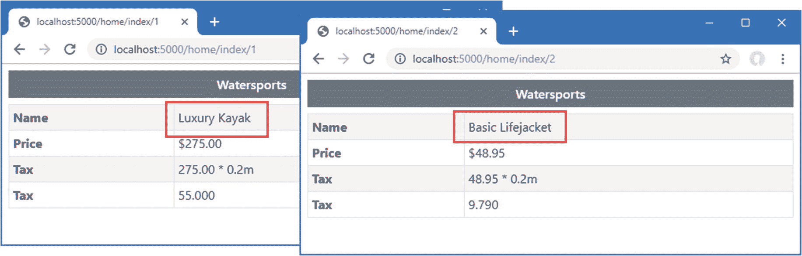

# 二十一、使用视图和控制器：第一部分

在本章中，我介绍了 *Razor 视图引擎*，它负责生成可以直接显示给用户的 HTML 响应(与 JSON 和 XML 响应相反，它们通常由其他应用使用)。*视图*是包含 C# 表达式和 HTML 片段的文件，由视图引擎处理以生成 HTML 响应。我展示了视图是如何工作的，解释了如何在动作方法中使用它们，并描述了它们包含的不同类型的 C# 表达式。在第 22 章中，我描述了视图支持的一些其他特性。表 [21-1](#Tab1) 将 Razor 视图放在上下文中。

表 21-1。

将尖锐的观点放在上下文中

<colgroup><col class="tcol1 align-left"> <col class="tcol2 align-left"></colgroup> 
| 

问题

 | 

回答

 |
| --- | --- |
| 它们是什么？ | 视图是混合了静态 HTML 内容和 C# 表达式的文件。 |
| 它们为什么有用？ | 视图用于为 HTTP 请求创建 HTML 响应。计算 C# 表达式，并将其与 HTML 内容结合以创建响应。 |
| 它们是如何使用的？ | 由`Controller`类定义的`View`方法创建一个使用视图的动作响应。 |
| 有什么陷阱或限制吗？ | 适应视图文件的语法以及它们组合代码和内容的方式可能需要一点时间。 |
| 有其他选择吗？ | 有许多第三方视图引擎可以在 ASP.NET Core MVC 中使用，但是它们的使用是有限的。 |

表 [21-2](#Tab2) 总结了本章内容。

表 21-2。

章节总结

<colgroup><col class="tcol1 align-left"> <col class="tcol2 align-left"> <col class="tcol3 align-left"></colgroup> 
| 

问题

 | 

解决办法

 | 

列表

 |
| --- | --- | --- |
| 启用视图 | 使用`AddControllersWithViews`和`MapControllerRoute`方法来设置所需的服务和端点 | 1–5 |
| 从控制器动作方法返回 HTML 响应 | 使用`View`方法创建一个`ViewResult` | six |
| 创建动态 HTML 内容 | 创建一个使用动态内容表达式的 Razor 视图 | 7–9, 20, 21 |
| 按名称选择视图 | 将视图名称作为参数提供给`View`方法 | 10, 11 |
| 创建可由多个控制器使用的视图 | 创建共享视图 | 12–14 |
| 指定视图的模型类型 | 使用一个`@model`表达式 | 15–19 |
| 选择性地生成内容 | 使用`@if`、`@switch`或`@foreach`表情 | 22–26 |
| 在视图中包含 C# 代码 | 使用代码块 | Twenty-seven |

## 为本章做准备

本章使用了第 20 章中的 WebApp 项目。为了准备这一章，打开一个新的 PowerShell 命令提示符并运行清单 [21-1](#PC1) 中的命令来安装一个新的包。如果您使用的是 Visual Studio，可以通过选择“项目➤管理 NuGet 包”来安装该包。

```cs
dotnet add package Microsoft.AspNetCore.Mvc.Razor.RuntimeCompilation --version 3.1.1

Listing 21-1.Adding a Package to the Example Project

```

接下来，用清单 [21-2](#PC2) 中的语句替换`Startup`类的内容，这些语句删除了前面章节中使用的一些服务和中间件。

Tip

你可以从 [`https://github.com/apress/pro-asp.net-core-3`](https://github.com/apress/pro-asp.net-core-3) 下载本章以及本书其他章节的示例项目。如果在运行示例时遇到问题，请参见第 [1](01.html) 章获取帮助。

```cs
using System;
using System.Collections.Generic;
using System.Linq;
using Microsoft.AspNetCore.Builder;
using Microsoft.Extensions.DependencyInjection;
using Microsoft.Extensions.Configuration;
using Microsoft.EntityFrameworkCore;
using WebApp.Models;

namespace WebApp {
    public class Startup {

        public Startup(IConfiguration config) {
            Configuration = config;
        }

        public IConfiguration Configuration { get; set; }

        public void ConfigureServices(IServiceCollection services) {
            services.AddDbContext<DataContext>(opts => {
                opts.UseSqlServer(Configuration[
                    "ConnectionStrings:ProductConnection"]);
                opts.EnableSensitiveDataLogging(true);
            });
            services.AddControllers();
        }

        public void Configure(IApplicationBuilder app, DataContext context) {
            app.UseDeveloperExceptionPage();
            app.UseStaticFiles();
            app.UseRouting();
            app.UseEndpoints(endpoints => {
                endpoints.MapControllers();
            });
            SeedData.SeedDatabase(context);
        }
    }
}

Listing 21-2.Replacing the Contents of the Startup.cs File in the WebApp Folder

```

### 正在删除数据库

打开一个新的 PowerShell 命令提示符，导航到包含`WebApp.csproj`文件的文件夹，运行清单 [21-3](#PC3) 中所示的命令来删除数据库。

```cs
dotnet ef database drop --force

Listing 21-3.Dropping the Database

```

### 运行示例应用

从 Debug 菜单中选择 Start Without Debugging 或 Run Without Debugging，或者使用 PowerShell 命令提示符运行清单 [21-4](#PC4) 中所示的命令。

```cs
dotnet run

Listing 21-4.Running the Example Application

```

数据库将作为应用启动的一部分被植入。一旦 ASP.NET Core 正在运行，使用 web 浏览器请求`http://localhost:5000/api/products`，这将产生如图 [21-1](#Fig1) 所示的响应。


图 21-1。

运行示例应用

## 视图入门

我用一个 web 服务控制器开始了这一章，以展示与使用视图的控制器的相似性。很容易认为 web 服务和视图控制器是分开的，但是理解两种类型的响应使用相同的底层特性是很重要的。在接下来的小节中，我将应用配置为支持 HTML 应用，并重新调整`Home`控制器的用途，使其产生 HTML 响应。

### 配置应用

第一步是配置 ASP.NET Core 来启用 HTML 响应，如清单 [21-5](#PC5) 所示。

```cs
using System;
using System.Collections.Generic;
using System.Linq;
using Microsoft.AspNetCore.Builder;
using Microsoft.Extensions.DependencyInjection;
using Microsoft.Extensions.Configuration;
using Microsoft.EntityFrameworkCore;
using WebApp.Models;

namespace WebApp {
    public class Startup {

        public Startup(IConfiguration config) {
            Configuration = config;
        }

        public IConfiguration Configuration { get; set; }

        public void ConfigureServices(IServiceCollection services) {
            services.AddDbContext<DataContext>(opts => {
                opts.UseSqlServer(Configuration[
                    "ConnectionStrings:ProductConnection"]);
                opts.EnableSensitiveDataLogging(true);
            });
            services.AddControllersWithViews().AddRazorRuntimeCompilation();
        }

        public void Configure(IApplicationBuilder app, DataContext context) {
            app.UseDeveloperExceptionPage();
            app.UseStaticFiles();
            app.UseRouting();
            app.UseEndpoints(endpoints => {
                endpoints.MapControllers();
                endpoints.MapControllerRoute("Default",
                    "{controller=Home}/{action=Index}/{id?}");
            });
            SeedData.SeedDatabase(context);
        }
    }
}

Listing 21-5.Changing the Configuration in the Startup.cs File in the WebApp Folder

```

HTML 响应是使用视图创建的，视图是包含 HTML 元素和 C# 表达式的混合文件。我在第 [19 章](19.html)中使用的用于启用 MVC 框架的`AddControllers`方法只支持 web 服务控制器。为了支持视图，使用了`AddControllersWithViews`方法。`AddRazorRuntimeCompilation`方法用于启用清单 [21-1](#PC1) 中安装的包所提供的特性，这使得在开发过程中使用视图变得更加容易，下面将对此进行简要说明。

第二个变化是在端点路由配置中添加了`MapControllerRoute`方法。生成 HTML 响应的控制器不使用应用于 web 服务控制器的相同路由属性，而是依赖于一个名为*约定路由、*的特性，我将在下一节中描述这个特性。

### 创建 HTML 控制器

HTML 应用的控制器类似于 web 服务的控制器，但是有一些重要的区别。要创建一个 HTML 控制器，用清单 [21-6](#PC6) 中所示的语句将一个名为`HomeController.cs`的类文件添加到`Controllers`文件夹中。

```cs
using Microsoft.AspNetCore.Mvc;
using System.Threading.Tasks;
using WebApp.Models;

namespace WebApp.Controllers {

    public class HomeController: Controller {
        private DataContext context;

        public HomeController(DataContext ctx) {
            context = ctx;
        }

        public async Task<IActionResult> Index(long id = 1) {
            return View(await context.Products.FindAsync(id));
        }
    }
}

Listing 21-6.The Contents of the HomeController.cs File in the Controllers Folder

```

HTML 控制器的基类是`Controller`，它是从用于 web 服务控制器的`ControllerBase`类中派生出来的，并提供了特定于使用视图的附加方法。

```cs
...
public class HomeController:Controller {
...

```

HTML 控制器中的动作方法返回实现`IActionResult`接口的对象，该接口与第 [19 章](19.html)中用于返回特定状态代码响应的结果类型相同。`Controller`基类提供了`View`方法，该方法用于选择将用于创建响应的视图。

```cs
...
return View(await context.Products.FindAsync(id));
...

```

Tip

注意清单 [21-6](#PC6) 中的控制器没有用属性修饰。`ApiController`属性仅适用于 web 服务控制器，不应用于 HTML 控制器。不需要`Route`和 HTTP 方法属性，因为 HTML 控制器依赖于基于约定的路由，这在清单 [21-5](#PC5) 中进行了配置，稍后将对其进行介绍。

`View`方法创建了一个`ViewResult`类的实例，它实现了`IActonResult`接口，并告诉 MVC 框架应该使用一个视图来为客户端产生响应。`View`方法的参数被称为*视图模型*，为视图提供生成响应所需的数据。

目前没有可供 MVC 框架使用的视图，但是如果你重启 ASP.NET Core 并使用浏览器请求`http://localhost:5000`，你会看到一条错误消息，显示 MVC 框架如何响应它从`Index`动作方法收到的`ViewResult`，如图 [21-2](#Fig2) 所示。


图 21-2。

使用查看结果

在幕后，有两个重要的约定在起作用，下面几节将对此进行描述。

Note

有两个功能可以扩大搜索位置的范围。如果项目使用 Razor 页面，搜索将包括`/Pages/Shared`文件夹，如第 [23 章](23.html)所述。

#### 了解约定路由

HTML 控制器依赖于*约定路由*而不是`Route`属性。该术语中的约定指的是用于配置路由系统的控制器类名和动作方法名的使用，这在清单 [21-6](#PC6) 中通过将以下语句添加到端点路由配置中来完成:

```cs
...
endpoints.MapControllerRoute("Default", "{controller=Home}/{action=Index}/{id?}");
...

```

该语句设置的路由匹配两段和三段 URL。第一段的值被用作控制器类的名称，不带`Controller`后缀，因此`Home`指的是`HomeController`类。第二段是动作方法的名称，可选的第三段允许动作方法接收一个名为`id`的参数。默认值用于为不包含所有段的 URL 选择`Home`控制器上的`Index`动作方法。这是一个非常常见的约定，可以设置相同的路由配置，而不必指定 URL 模式，如清单 [21-7](#PC10) 所示。

```cs
...
public void Configure(IApplicationBuilder app, DataContext context) {
    app.UseDeveloperExceptionPage();
    app.UseStaticFiles();
    app.UseRouting();
    app.UseEndpoints(endpoints => {
        endpoints.MapControllers();
        endpoints.MapDefaultControllerRoute();
    });
    SeedData.SeedDatabase(context);
}
...

Listing 21-7.Using the Default Routing Convention in the Startup.cs File in the WebApp Folder

```

`MapDefaultControllerRoute`方法避免了错误输入 URL 模式的风险，并设置了基于约定的路由。在本章中我已经配置了一个路由，但是一个应用可以根据需要定义任意多的路由，后面的章节将扩展路由配置以使示例更容易理解。

Tip

MVC 框架假设任何由 HTML 控制器定义的`public`方法都是一个动作方法，并且动作方法支持所有的 HTTP 方法。如果你需要在一个控制器中定义一个不是动作的方法，你可以把它做成`private`，或者，如果不可能的话，用`NonAction`属性来修饰这个方法。您可以通过应用属性来限制操作方法支持特定的 HTTP 方法，这样,`HttpGet`属性表示处理 GET 请求的操作,`HttpPost`方法表示处理 POST 请求的操作，等等。

#### 理解 Razor 视图约定

当调用由`Home`控制器定义的`Index`动作方法时，它使用`id`参数的值从数据库中检索一个对象，并将其传递给`View`方法。

```cs
...
public async Task<IActionResult> Index(long id = 1) {
    return View(await context.Products.FindAsync(id));
}
...

```

当一个动作方法调用`View`方法时，它会创建一个`ViewResult`，告知 MVC 框架使用默认约定来定位视图。Razor 视图引擎查找与操作方法同名的视图，并添加了`cshtml`文件扩展名，这是 Razor 视图引擎使用的文件类型。视图存储在`Views`文件夹中，按照与它们相关的控制器进行分组。搜索的第一个位置是`Views/Home`文件夹，因为动作方法是由`Home`控制器定义的(其名称是从控制器类的名称中去掉`Controller`)。如果在`Views/Home`文件夹中找不到`Index.cshtml`文件，则检查`Views/Shared`文件夹，这是存储控制器之间共享的视图的位置。

虽然大多数控制器都有自己的视图，但是视图也可以共享，这样就不必复制通用的功能，如“使用共享视图”一节中所示。

图 [21-2](#Fig2) 中的异常响应显示了两种约定的结果。路由约定用于使用由`Home`控制器定义的`Index`动作方法来处理请求，该方法告诉 Razor 视图引擎使用视图搜索约定来定位视图。视图引擎使用动作方法和控制器的名称来构建其搜索模式，并检查`Views/Home/Index.cshtml`和`Views/Shared/Index.cshtml`文件。

### 创建 Razor 视图

为了给 MVC 框架提供一个视图来显示，创建`Views/Home`文件夹并添加一个名为`Index.cshtml`的文件，其内容如清单 [21-8](#PC12) 所示。如果您使用的是 Visual Studio，通过右键单击`Views/Home`文件夹，从弹出菜单中选择添加➤新项目，并在 ASP.NET Core➤网页类别中选择 Razor 视图项目来创建视图，如图 [21-3](#Fig3) 所示。

Tip

“添加”弹出菜单中有一个用于创建视图的菜单项，但这依赖于 Visual Studio 脚手架功能，该功能添加模板内容来创建不同类型的视图。我不依赖本书中的脚手架，而是向您展示如何从头开始创建视图。


图 21-3。

使用 Visual Studio 创建视图

```cs
<!DOCTYPE html>
<html>
<head>
    <link href="/lib/twitter-bootstrap/css/bootstrap.min.css" rel="stylesheet" />
</head>
<body>
    <h6 class="bg-primary text-white text-center m-2 p-2">Product Table</h6>
    <div class="m-2">
        <table class="table table-sm table-striped table-bordered">
            <tbody>
                <tr><th>Name</th><td>@Model.Name</td></tr>
                <tr><th>Price</th><td>@Model.Price.ToString("c")</td></tr>
            </tbody>
        </table>
    </div>
</body>
</html>

Listing 21-8.The Contents of the Index.cshtml File in the Views/Home Folder

```

视图文件包含使用 Bootstrap CSS 框架设计的标准 HTML 元素，该框架通过`class`属性应用。关键的视图特性是能够使用 C# 表达式生成内容，如下所示:

```cs
...
<tr><th>Name</th><td>@Model.Name</td></tr>
<tr><th>Price</th><td>@Model.Price.ToString("c")</td></tr>
...

```

我在“理解 Razor 语法”一节中解释了这些表达式是如何工作的，但是现在，只要知道这些表达式插入了来自清单 [21-6](#PC6) 中的动作方法传递给`View`方法的`Product`视图模型的`Name`和`Price`属性的值就足够了。重启 ASP.NET Core，用浏览器请求`http://localhost:5000`，会看到如图 [21-4](#Fig4) 所示的 HTML 响应。


图 21-4。

视图响应

#### 修改 Razor 视图

我在清单 [21-1](#PC1) 中添加并在清单 [21-5](#PC5) 中配置的包自动检测并重新编译 Razor 视图，这意味着 ASP.NET Core 运行时不必重启。为了演示重新编译过程，清单 [21-9](#PC14) 向`Index`视图添加了新元素。

```cs
<!DOCTYPE html>
<html>
<head>
    <link href="/lib/twitter-bootstrap/css/bootstrap.min.css" rel="stylesheet" />
</head>
<body>
    <h6 class="bg-primary text-white text-center m-2 p-2">Product Table</h6>
    <div class="m-2">
        <table class="table table-sm table-striped table-bordered">
            <tbody>
                <tr><th>Name</th><td>@Model.Name</td></tr>
                <tr><th>Price</th><td>@Model.Price.ToString("c")</td></tr>
                <tr><th>Category ID</th><td>@Model.CategoryId</td></tr>
            </tbody>
        </table>
    </div>
</body>
</html>

Listing 21-9.Adding Elements in the Index.cshtml File in the Views/Home Folder

```

保存对视图的更改并重新加载浏览器窗口，而无需重新启动 ASP.NET Core。将检测到对视图的更改，在编译视图时会有短暂的停顿，之后将显示图 [21-5](#Fig5) 所示的响应。

Note

此功能仅适用于视图，不适用于项目中的 C# 类。如果您对某个类文件进行了更改，那么您必须重新启动 ASP.NET Core，以使更改生效。


图 21-5。

修改 Razor 视图

### 按名称选择视图

清单 [21-6](#PC6) 中的动作方法完全依赖于惯例，让 Razor 选择用于生成响应的视图。动作方法可以通过向`View`方法提供一个名称作为参数来选择一个视图，如清单 [21-10](#PC15) 所示。

```cs
using Microsoft.AspNetCore.Mvc;
using System.Threading.Tasks;
using WebApp.Models;

namespace WebApp.Controllers {

    public class HomeController: Controller {
        private DataContext context;

        public HomeController(DataContext ctx) {
            context = ctx;
        }

        public async Task<IActionResult> Index(long id = 1) {
            Product prod = await context.Products.FindAsync(id);
            if (prod.CategoryId == 1) {
                return View("Watersports", prod);
            } else {
                return View(prod);
            }
        }
    }
}

Listing 21-10.Selecting a View in the HomeController.cs File in the Controllers Folder

```

action 方法基于从数据库中检索的`Product`对象的`CategoryId`属性选择视图。如果`CategoryId`为 1，那么 action 方法调用带有附加参数的`View`方法，该参数选择名为`Watersports`的视图。

```cs
...
return View("Watersports", prod);
...

```

请注意，action 方法没有指定文件扩展名或视图的位置。视图引擎的工作是将`Watersports`翻译成视图文件。为了创建视图，将一个名为`Watersports.cshtml`的 Razor 视图文件添加到`Views/Home`文件夹中，其内容如清单 [21-11](#PC17) 所示。

```cs
<!DOCTYPE html>
<html>
<head>
    <link href="/lib/twitter-bootstrap/css/bootstrap.min.css" rel="stylesheet" />
</head>
<body>
    <h6 class="bg-secondary text-white text-center m-2 p-2">Watersports</h6>
    <div class="m-2">
        <table class="table table-sm table-striped table-bordered">
            <tbody>
                <tr><th>Name</th><td>@Model.Name</td></tr>
                <tr><th>Price</th><td>@Model.Price.ToString("c")</td></tr>
                <tr><th>Category ID</th><td>@Model.CategoryId</td></tr>
            </tbody>
        </table>
    </div>
</body>
</html>

Listing 21-11.The Contents of the Watersports.cshtml File in the Views/Home Folder

```

新视图遵循与`Index`视图相同的模式，但是在表格上方有一个不同的标题。由于`HomeController`类已经更改，重启 ASP.NET Core 并请求`http://localhost:5000/home/index/1`和`http://localhost:5000/home/index/4`。动作方法为第一个 URL 选择了`Watersports`视图，为第二个 URL 选择了默认视图，产生了如图 [21-6](#Fig6) 所示的两个响应。


图 21-6。

选择视图

#### 使用共享视图

当 Razor 视图引擎定位一个视图时，它先在`View/[controller]`文件夹中查找，然后在`Views/Shared`文件夹中查找。这种搜索模式意味着包含共同内容的视图可以在控制器之间共享，从而避免重复。为了查看这个过程是如何工作的，将一个名为`Common.cshtml`的 Razor 视图文件添加到`Views/Shared`文件夹中，其内容如清单 [21-12](#PC18) 所示。

```cs
<!DOCTYPE html>
<html>
<head>
    <link href="/lib/twitter-bootstrap/css/bootstrap.min.css" rel="stylesheet" />
</head>
<body>
    <h6 class="bg-secondary text-white text-center m-2 p-2">Shared View</h6>
</body>
</html>

Listing 21-12.The Contents of the Common.cshtml File in the Views/Shared Folder

```

接下来，向使用新视图的`Home`控制器添加一个动作方法，如清单 [21-13](#PC19) 所示。

```cs
using Microsoft.AspNetCore.Mvc;
using System.Threading.Tasks;
using WebApp.Models;

namespace WebApp.Controllers {

    public class HomeController: Controller {
        private DataContext context;

        public HomeController(DataContext ctx) {
            context = ctx;
        }

        public async Task<IActionResult> Index(long id = 1) {
            Product prod = await context.Products.FindAsync(id);
            if (prod.CategoryId == 1) {
                return View("Watersports", prod);
            } else {
                return View(prod);
            }
        }

        public IActionResult Common() {
            return View();
        }
    }
}

Listing 21-13.Adding an Action in the HomeController.cs File in the Controllers Folder

```

新动作依赖于使用方法名作为视图名的惯例。当视图不需要向用户显示任何数据时，可以不带参数调用`View`方法。接下来，通过向`Controllers`文件夹添加一个名为`SecondController.cs`的类文件来创建一个新的控制器，代码如清单 [21-14](#PC20) 所示。

```cs
using Microsoft.AspNetCore.Mvc;

namespace WebApp.Controllers {

    public class SecondController : Controller {

        public IActionResult Index() {
            return View("Common");
        }
    }
}

Listing 21-14.The Contents of the SecondController.cs File in the Controllers Folder

```

新的控制器定义了一个名为`Index`的动作，该动作调用`View`方法来选择`Common`视图。重启 ASP.NET Core 并导航到`http://localhost:5000/home/common`和`http://localhost:5000/second`，两者都将呈现`Common`视图，产生如图 [21-7](#Fig7) 所示的响应。


图 21-7。

使用共享视图

Specifying a View Location

Razor 视图引擎将在共享视图之前寻找特定于控制器的视图。您可以通过指定视图文件的完整路径来更改这种行为，如果您希望选择一个共享视图，而该共享视图由于有一个控制器特定的同名视图而被忽略，这将非常有用。

```cs
...
public IActionResult Index() {
    return View("/Views/Shared/Common.cshtml");
}
...

```

当指定视图时，必须指定相对于项目文件夹的路径，以`/`字符开始。请注意，使用了文件的完整名称，包括文件扩展名。

这是一种应该谨慎使用的技术，因为它创建了对特定文件的依赖，而不是允许视图引擎选择文件。

## 使用 Razor 视图

Razor 视图包含 HTML 元素和 C# 表达式。表达式与 HTML 元素混合在一起，并用`@`字符表示，如下所示:

```cs
...
<tr><th>Name</th><td>@Model.Name</td></tr>
...

```

当视图用于生成响应时，表达式被求值，结果被包含在发送给客户机的内容中。该表达式获取 action 方法提供的`Product`视图模型对象的名称，并产生如下输出:

```cs
...
<tr><th>Name</th><td>Corner Flags</td></tr>
...

```

这种转变看起来像魔术，但 Razor 比它第一次出现时要简单。Razor 视图被转换成继承自`RazorPage`类的 C# 类，然后像任何其他 C# 类一样被编译。

Tip

您可以通过使用 Windows 文件资源管理器检查`obj/Debug/netcoreapp3.0/Razor/Views`文件夹的内容来查看生成的视图类。

例如，清单 [21-11](#PC17) 中的视图将被转换成这样一个类:

```cs
using Microsoft.AspNetCore.Mvc.Razor;
using System.Threading.Tasks;
using Microsoft.AspNetCore.Mvc.Rendering;
using Microsoft.AspNetCore.Mvc;
using Microsoft.AspNetCore.Mvc.ViewFeatures;

namespace AspNetCore {

    public class Views_Home_Watersports : RazorPage<dynamic> {

        public async override Task ExecuteAsync() {
            WriteLiteral("<!DOCTYPE html>\r\n<html>\r\n");
            WriteLiteral("<head>");
            WriteLiteral(@"<link
                href=""/lib/twitter-bootstrap/css/bootstrap.min.css""
                rel=""stylesheet"" />");
            WriteLiteral("</head>");
            WriteLiteral("<body>");
            WriteLiteral(@"<h6 class=""bg-secondary text-white text-center
                m-2 p-2"">Watersports</h6>\r\n<div class=""m-2"">\r\n<table
                class=""table table-sm table-striped table-bordered"">\r\n
                <tbody>\r\n>");
            WriteLiteral("<th>Name</th><td>");
            Write(Model.Name);
            WriteLiteral("</td></tr>");
            WriteLiteral("<tr><th>Price</th><td>");
            Write(Model.Price.ToString("c"));
            WriteLiteral("</td></tr>\r\n<tr><th>Category ID</th><td>");
            Write(Model.CategoryId);
            WriteLiteral("</td></tr>\r\n</tbody>\r\n</table>\r\n</div>");
            WriteLiteral("</body></html>");
        }

        public IUrlHelper Url { get; private set; }
        public IViewComponentHelper Component { get; private set; }
        public IJsonHelper Json { get; private set; }
        public IHtmlHelper<dynamic> Html { get; private set; }
        public IModelExpressionProvider ModelExpressionProvider { get; private set; }
    }
}

```

这个类是对生成的代码的简化，这样我就可以专注于本章最重要的特性。要注意的第一点是，从视图生成的类继承自`RazorPage<T>`类。

```cs
...
public class Views_Home_Watersports : RazorPage<dynamic> {
...

```

表 [21-3](#Tab3) 描述了`RazorPage<T>`定义的最有用的属性和方法。

Caching Responses

来自视图的响应可以通过将`ResponseCache`属性应用到动作方法(或者应用到控制器类，它缓存来自所有动作方法的响应)来缓存。参见第 [17 章](17.html)了解如何启用响应缓存的细节。

表 21-3。

RazorPage <t>成员</t>

<colgroup><col class="tcol1 align-left"> <col class="tcol2 align-left"></colgroup> 
| 

名字

 | 

描述

 |
| --- | --- |
| `Context` | 该属性返回当前请求的`HttpContext`对象。 |
| `Layout` | 该属性用于设置视图布局，如第 [22](22.html) 章所述。 |
| `Model` | 该属性返回由操作传递给`View`方法的视图模型。 |
| `RenderBody()` | 这种方法在布局中用于包含来自视图的内容，如第 [22](22.html) 章所述。 |
| `RenderSection()` | 该方法用于布局中，以在视图中包含某一部分的内容，如第 [22](22.html) 章所述。 |
| `TempData` | 该属性用于访问第 [22](22.html) 章中描述的临时数据功能。 |
| `ViewBag` | 该属性用于访问视图包，如第 [22](22.html) 章所述。 |
| `ViewContext` | 该属性返回一个提供上下文数据的`ViewContext`对象。 |
| `ViewData` | 该属性返回视图数据，我在 SportsStore 应用中使用该数据对控制器进行单元测试。 |
| `Write(str)` | 此方法写入一个字符串，该字符串将被安全地编码以便在 HTML 中使用。 |
| `WriteLiteral(str)` | 为了在 HTML 中安全使用，此方法写入一个字符串，但不对其进行编码。 |

视图中的表达式被翻译成对`Write`方法的调用，该方法对表达式的结果进行编码，以便可以安全地包含在 HTML 文档中。`WriteLiteral`方法用于处理视图的静态 HTML 区域，不需要进一步编码。

Tip

参见第 22 章了解更多关于 HTML 编码的细节。

结果是来自`CSHTML`文件的这样一个片段:

```cs
...
<tr><th>Name</th><td>@Model.Name</td></tr>
...

```

这在`ExecuteAsync`方法中被转换成一系列 C# 语句:

```cs
...
WriteLiteral("<th>Name</th><td>");
Write(Model.Name);
WriteLiteral("</td></tr>");
...

```

当调用`ExecuteAsync`方法时，生成的响应混合了静态 HTML 和视图中包含的表达式。当执行生成的类中的语句时，HTML 片段和表达式求值结果的组合被写入响应，生成如下所示的 HTML:

```cs
...
<th>Name</th><td>Kayak</td></tr>
...

```

除了从`RazorPage<T>`类继承的属性和方法，生成的视图类还定义了表 [21-4](#Tab4) 中描述的属性，其中一些用于后面章节中描述的特性。

表 21-4。

其他视图类属性

<colgroup><col class="tcol1 align-left"> <col class="tcol2 align-left"></colgroup> 
| 

名字

 | 

描述

 |
| --- | --- |
| `Component` | 该属性返回一个用于处理视图组件的助手，该助手通过第 [25 章](25.html)中描述的`vc`标签助手来访问。 |
| `Html` | 该属性返回`IHtmlHelper`接口的实现。该属性用于管理 HTML 编码，如第 [22 章](22.html)所述。 |
| `Json` | 该属性返回一个`IJsonHelper`接口的实现，该接口用于将数据编码为 JSON，如第 [22 章](22.html)所述。 |
| `ModelExpressionProvider` | 该属性提供了对从模型中选择属性的表达式的访问，该模型通过标签帮助器使用，在第[25](25.html)–[27](27.html)章中有描述。 |
| `Url` | 这个属性返回一个使用 URL 的助手，如第 [26](26.html) 章所述。 |

### 设置视图模型类型

为`Watersports.cshtml`文件生成的类是从`RazorPage<T>`派生的，但是 Razor 不知道视图模型的动作方法将使用什么类型，所以它选择了`dynamic`作为泛型类型参数。这意味着`@Model`表达式可以与任何属性或方法名称一起使用，这将在运行时生成响应时进行评估。为了演示在异常中使用不存在的成员时会发生什么，将清单 [21-15](#PC29) 中所示的内容添加到`Watersports.cshtml`文件中。

```cs
<!DOCTYPE html>
<html>
<head>
    <link href="/lib/twitter-bootstrap/css/bootstrap.min.css" rel="stylesheet" />
</head>
<body>
    <h6 class="bg-secondary text-white text-center m-2 p-2">Watersports</h6>
    <div class="m-2">
        <table class="table table-sm table-striped table-bordered">
            <tbody>
                <tr><th>Name</th><td>@Model.Name</td></tr>
                <tr><th>Price</th><td>@Model.Price.ToString("c")</td></tr>
                <tr><th>Category ID</th><td>@Model.CategoryId</td></tr>
                <tr><th>Tax Rate</th><td>@Model.TaxRate</td></tr>
            </tbody>
        </table>
    </div>
</body>
</html>

Listing 21-15.Adding Content in the Watersports.cshtml File in the Views/Home Folder

```

使用浏览器请求`http://localhost:5000`，会看到如图 [21-8](#Fig8) 所示的异常。


图 21-8。

在视图表达式中使用不存在的属性

为了在开发过程中检查表达式，可以使用关键字`model`指定`Model`对象的类型，如清单 [21-16](#PC30) 所示。

Tip

这两个术语很容易混淆。大写`M`的`Model`用于表达式中访问 action 方法提供的视图模型对象，小写`m`的`model`用于指定视图模型的类型。

```cs
@model WebApp.Models.Product
<!DOCTYPE html>
<html>
<head>
    <link href="/lib/twitter-bootstrap/css/bootstrap.min.css" rel="stylesheet" />
</head>
<body>
    <h6 class="bg-secondary text-white text-center m-2 p-2">Watersports</h6>
    <div class="m-2">
        <table class="table table-sm table-striped table-bordered">
            <tbody>
                <tr><th>Name</th><td>@Model.Name</td></tr>
                <tr><th>Price</th><td>@Model.Price.ToString("c")</td></tr>
                <tr><th>Category ID</th><td>@Model.CategoryId</td></tr>
                <tr><th>Tax Rate</th><td>@Model.TaxRate</td></tr>
            </tbody>
        </table>
    </div>
</body>
</html>

Listing 21-16.Declaring the Model Type in the Watersports.cshtml File in the Views/Home Folder

```

几秒钟后，当 Visual Studio 或 Visual Studio 代码在后台检查视图时，编辑器中会出现一条错误警告，如图 [21-9](#Fig9) 所示。如果您构建项目或使用`dotnet build`或`dotnet run`命令，编译器也会报告错误。


图 21-9。

视图文件中的错误警告

当生成视图的 C# 类时，视图模型类型用作基类的泛型类型参数，如下所示:

```cs
...
public class Views_Home_Watersports : RazorPage<Product> {
...

```

指定视图模型类型允许 Visual Studio 和 Visual Studio 代码在编辑视图时建议属性和方法名称。用清单 [21-17](#PC32) 中显示的属性替换不存在的属性。

```cs
@model WebApp.Models.Product
<!DOCTYPE html>
<html>
<head>
    <link href="/lib/twitter-bootstrap/css/bootstrap.min.css" rel="stylesheet" />
</head>
<body>
    <h6 class="bg-secondary text-white text-center m-2 p-2">Watersports</h6>
    <div class="m-2">
        <table class="table table-sm table-striped table-bordered">
            <tbody>
                <tr><th>Name</th><td>@Model.Name</td></tr>
                <tr><th>Price</th><td>@Model.Price.ToString("c")</td></tr>
                <tr><th>Category ID</th><td>@Model.CategoryId</td></tr>
                <tr><th>Supplier ID</th><td>@Model.SupplierId</td></tr>
            </tbody>
        </table>
    </div>
</body>
</html>

Listing 21-17.Replacing a Property in the Watersports.cshtml File in the Views/Home Folder

```

当你输入时，编辑器会提示你由视图模型类定义的可能的成员名，如图 [21-10](#Fig10) 所示。此图显示了 Visual Studio 代码编辑器，但是 Visual Studio 代码具有类似的功能。


图 21-10。

使用视图模型类型时的编辑器建议

#### 使用视图导入文件

当我在`Watersports.cshtml`文件的开头声明视图模型对象时，我必须包含包含该类的名称空间，如下所示:

```cs
...
@model WebApp.Models.Product
...

```

默认情况下，Razor 视图中引用的所有类型都必须用名称空间限定。当唯一的类型引用是针对模型对象时，这没什么大不了的，但是当编写更复杂的 Razor 表达式时，比如我在本章后面描述的那些表达式，这会使视图更难阅读。

您可以通过向项目添加一个*视图导入*文件来指定一组名称空间，应该在这些名称空间中搜索类型。视图导入文件放在`Views`文件夹中，命名为`_ViewImports.cshtml`。

Note

名称以下划线(`_`字符)开头的`Views`文件夹中的文件不会返回给用户，这允许文件名区分您想要渲染的视图和支持它们的文件。View imports 文件和布局(我将简要介绍)以下划线为前缀。

如果使用的是 Visual Studio，在解决方案资源管理器中右键单击`Views`文件夹，从弹出菜单中选择添加➤新项，从 ASP.NET Core 类别中选择 Razor 视图导入模板，如图 [21-11](#Fig11) 所示。


图 21-11。

创建视图导入文件

Visual Studio 会自动设置文件名为`_ViewImports.cshtml`，点击添加按钮会创建文件，文件为空。如果您使用的是 Visual Studio 代码，只需选择`Views`文件夹并添加一个名为`_ViewImports.cshtml`的新文件。

不管您使用哪种编辑器，添加清单 [21-18](#PC34) 所示的表达式。

```cs
@using WebApp.Models

Listing 21-18.The Contents of the _ViewImports.cshtml File in the Views Folder

```

应该在名称空间中搜索 Razor 视图中使用的类，使用`@using`表达式指定名称空间，后跟名称空间。在清单 [21-18](#PC34) 中，我为`WebApp.Models`名称空间添加了一个条目，它包含了在`Watersports.cshtml`视图中使用的视图模型类。

既然名称空间包含在视图导入文件中，我可以从视图中移除名称空间，如清单 [21-19](#PC35) 所示。

Tip

您还可以向单个视图文件添加一个`@using`表达式，这允许在单个视图中使用没有名称空间的类型。

```cs
@model Product
<!DOCTYPE html>
<html>
<head>
    <link href="/lib/twitter-bootstrap/css/bootstrap.min.css" rel="stylesheet" />
</head>
<body>
    <h6 class="bg-secondary text-white text-center m-2 p-2">Watersports</h6>
    <div class="m-2">
        <table class="table table-sm table-striped table-bordered">
            <tbody>
                <tr><th>Name</th><td>@Model.Name</td></tr>
                <tr><th>Price</th><td>@Model.Price.ToString("c")</td></tr>
                <tr><th>Category ID</th><td>@Model.CategoryId</td></tr>
                <tr><th>Supplier ID</th><td>@Model.SupplierId</td></tr>
            </tbody>
        </table>
    </div>
</body>
</html>

Listing 21-19.Simplifying the Model Type in the Watersports.cshtml File in the Views/Home Folder

```

保存视图文件，用浏览器请求`http://localhost:5000`，会看到如图 [21-12](#Fig12) 所示的响应。


图 21-12。

使用视图导入文件

## 理解 Razor 语法

Razor 编译器将 HTML 的静态片段从 C# 表达式中分离出来，然后在生成的类文件中单独处理。视图中可以包含几种类型的表达式，我将在接下来的章节中对其进行描述。

### 理解指令

指令是向 Razor 视图引擎给出指令的表达式。例如，`@model`表达式是一个指令，它告诉视图引擎使用视图模型的特定类型，而`@using`指令告诉视图引擎导入一个名称空间。表 [21-5](#Tab5) 描述了最有用的 Razor 指令。

表 21-5。

有用的 Razor 指令

<colgroup><col class="tcol1 align-left"> <col class="tcol2 align-left"></colgroup> 
| 

名字

 | 

描述

 |
| --- | --- |
| `@model` | 该指令指定视图模型的类型。 |
| `@using` | 此指令导入一个命名空间。 |
| `@page` | 该指令表示 Razor 页，在第 [23](23.html) 章中描述。 |
| `@section` | 该指令表示布局部分，如第 [22](22.html) 章所述。 |
| `@addTagHelper` | 该指令向视图添加标签助手，如第 [25](25.html) 章所述。 |
| `@namespace` | 该指令为从视图生成的 C# 类设置命名空间。 |
| `@functions` | 该指令将 C# 属性和方法添加到从视图生成的 C# 类中，通常用于 Razor 页面，如第 [23](23.html) 章所述。 |
| `@attribute` | 该指令向从视图生成的 C# 类添加一个属性。我使用这个特性来应用第 [38](38.html) 章中的授权限制。 |
| `@implements` | 该指令声明从视图生成的 C# 类继承一个接口或从基类派生。该特性在第 [33 章](33.html)中进行了演示。 |
| `@inherits` | 该指令为从视图生成的 C# 类设置基类。该特性在第 [33 章](33.html)中进行了演示。 |
| `@inject` | 该指令通过依赖注入为视图提供了对服务的直接访问。该功能在第 [23 章](23.html)中进行了演示。 |

### 理解内容表达式

Razor 内容表达式产生的内容包含在视图生成的输出中。表 [21-6](#Tab6) 描述了最有用的内容表达式，这将在接下来的章节中演示。

表 21-6。

有用的 Razor 内容表达式

<colgroup><col class="tcol1 align-left"> <col class="tcol2 align-left"></colgroup> 
| 

名字

 | 

描述

 |
| --- | --- |
| `@<expression>` | 这是基本的 Razor 表达式，它被求值，并且它产生的结果被插入到响应中。 |
| `@if` | 该表达式用于根据表达式的结果选择内容区域。有关示例，请参见“使用条件表达式”一节。 |
| `@switch` | 该表达式用于根据表达式的结果选择内容区域。有关示例，请参见“使用条件表达式”一节。 |
| `@foreach` | 该表达式为序列中的每个元素生成相同的内容区域。有关示例，请参见“枚举序列”。 |
| `@{ ... }` | 这个表达式定义了一个代码块。参见“使用 Razor 代码块”一节中的例子。 |
| `@:` | 这个表达式表示没有包含在 HTML 元素中的一部分内容。请参见“使用条件表达式”一节中的示例。 |
| `@try` | 该表达式用于捕捉异常。 |
| `@await` | 该表达式用于执行异步操作，其结果被插入到响应中。参见第 [24 章](24.html)中的示例。 |

### 设置元素内容

对最简单的表达式进行计算以产生一个值，该值用作发送给客户端的响应中 HTML 元素的内容。最常见的表达式类型是从视图模型对象插入一个值，就像这些来自`Watersports.cshtml`视图文件的表达式:

```cs
...
<tr><th>Name</th><td>@Model.Name</td></tr>
<tr><th>Price</th><td>@Model.Price.ToString("c")</td></tr>
...

```

这种类型的表达式可以读取属性值或调用方法，如这些示例所示。视图可以包含更复杂的表达式，但是这些表达式需要用括号括起来，以便 Razor 编译器能够区分代码和静态内容，如清单 [21-20](#PC37) 所示。

```cs
@model Product
<!DOCTYPE html>
<html>
<head>
    <link href="/lib/twitter-bootstrap/css/bootstrap.min.css" rel="stylesheet" />
</head>
<body>
    <h6 class="bg-secondary text-white text-center m-2 p-2">Watersports</h6>
    <div class="m-2">
        <table class="table table-sm table-striped table-bordered">
            <tbody>
                <tr><th>Name</th><td>@Model.Name</td></tr>
                <tr><th>Price</th><td>@Model.Price.ToString("c")</td></tr>
                <tr><th>Tax</th><td>@Model.Price * 0.2m</td></tr>
                <tr><th>Tax</th><td>@(Model.Price * 0.2m)</td></tr>
            </tbody>
        </table>
    </div>
</body>
</html>

Listing 21-20.Adding Expressions in the Watersports.cshtml File in the Views/Home Folder

```

用浏览器请求`http://localhost:5000`；如图 [21-13](#Fig13) 所示的响应显示了括号的重要性。


图 21-13。

带括号和不带括号的表达式

Razor view 编译器保守地匹配表达式，并假设第一个表达式中的星号和数值是静态内容。第二个表达式的括号避免了这个问题。

### 设置属性值

表达式可以用来设置元素属性的值，如清单 [21-21](#PC38) 所示。

```cs
@model Product
<!DOCTYPE html>
<html>
<head>
    <link href="/lib/twitter-bootstrap/css/bootstrap.min.css" rel="stylesheet" />
</head>
<body>
    <h6 class="bg-secondary text-white text-center m-2 p-2">Watersports</h6>
    <div class="m-2">
        <table class="table table-sm table-striped table-bordered"
               data-id="@Model.ProductId">
            <tbody>
                <tr><th>Name</th><td>@Model.Name</td></tr>
                <tr><th>Price</th><td>@Model.Price.ToString("c")</td></tr>
                <tr><th>Tax</th><td>@Model.Price * 0.2m</td></tr>
                <tr><th>Tax</th><td>@(Model.Price * 0.2m)</td></tr>
            </tbody>
        </table>
    </div>
</body>
</html>

Listing 21-21.Setting an Attribute in the Watersports.cshtml File in the Views/Home Folder

```

我使用 Razor 表达式来设置`table`元素上某些`data`属性的值。

Tip

数据属性是名称以`data-`为前缀的属性，多年来一直是创建定制属性的非正式方式，并作为 HTML5 的一部分成为正式标准的一部分。它们最常被应用，以便 JavaScript 代码可以定位特定的元素，或者 CSS 样式可以被更精确地应用。

如果您请求`http://localhost:5000`并查看发送到浏览器的 HTML 源代码，您将看到 Razor 已经设置了该属性的值，如下所示:

```cs
...
<table class="table table-sm table-striped table-bordered" data-id="1">
    <tbody>
        <tr><th>Name</th><td>Kayak</td></tr>
        <tr><th>Price</th><td>$275.00</td></tr>
        <tr><th>Tax</th><td>275.00 * 0.2m</td></tr>
        <tr><th>Tax</th><td>55.000</td></tr>
    </tbody>
</table>
...

```

### 使用条件表达式

Razor 支持条件表达式，这意味着可以基于视图模型定制输出。这项技术是 Razor 的核心，允许您从易于阅读和维护的视图中创建复杂和流畅的响应。在清单 [21-22](#PC40) 中，我给`Watersports`视图添加了一个条件语句。

```cs
@model Product
<!DOCTYPE html>
<html>
<head>
    <link href="/lib/twitter-bootstrap/css/bootstrap.min.css" rel="stylesheet" />
</head>
<body>
    <h6 class="bg-secondary text-white text-center m-2 p-2">Watersports</h6>
    <div class="m-2">
        <table class="table table-sm table-striped table-bordered"
               data-id="@Model.ProductId">
            <tbody>
                @if (Model.Price > 200) {
                    <tr><th>Name</th><td>Luxury @Model.Name</td></tr>
                } else {
                    <tr><th>Name</th><td>Basic @Model.Name</td></tr>
                }
                <tr><th>Price</th><td>@Model.Price.ToString("c")</td></tr>
                <tr><th>Tax</th><td>@Model.Price * 0.2m</td></tr>
                <tr><th>Tax</th><td>@(Model.Price * 0.2m)</td></tr>
            </tbody>
        </table>
    </div>
</body>
</html>

Listing 21-22.Using an If Expression in the Watersports.cshtml File in the Views/Home Folder

```

`@`字符后面是`if`关键字和一个将在运行时计算的条件。`if`表达式支持可选的`else`和`elseif`子句，并以右括号(`}`字符)结束。如果满足条件，则将`if`子句中的内容插入到响应中；否则，将使用`else`子句中的内容。

注意，在条件中访问一个`Model`属性不需要前缀`@`。

```cs
...
@if (Model.Price > 200) {
...

```

但是在`if`和`else`子句中需要前缀`@`，就像这样:

```cs
...
<tr><th>Name</th><td>Luxury @Model.Name</td></tr>
...

```

要查看条件语句的效果，使用浏览器请求`http://localhost:5000/home/index/1`和`http://localhost:5000/home/index/2`。条件语句将为这些 URL 产生不同的 HTML 元素，如图 [21-14](#Fig14) 所示。



图 21-14。

使用条件语句

Razor 还支持`@switch`表达式，这是一种更简洁的处理多个条件的方式，如清单 [21-23](#PC43) 所示。

```cs
@model Product
<!DOCTYPE html>
<html>
<head>
    <link href="/lib/twitter-bootstrap/css/bootstrap.min.css" rel="stylesheet" />
</head>
<body>
    <h6 class="bg-secondary text-white text-center m-2 p-2">Watersports</h6>
    <div class="m-2">
        <table class="table table-sm table-striped table-bordered"
               data-id="@Model.ProductId">
            <tbody>
                @switch (Model.Name) {
                    case "Kayak":
                        <tr><th>Name</th><td>Small Boat</td></tr>
                        break;
                    case "Lifejacket":
                        <tr><th>Name</th><td>Flotation Aid</td></tr>
                        break;
                    default:
                        <tr><th>Name</th><td>@Model.Name</td></tr>
                        break;
                }
                <tr><th>Price</th><td>@Model.Price.ToString("c")</td></tr>
                <tr><th>Tax</th><td>@Model.Price * 0.2m</td></tr>
                <tr><th>Tax</th><td>@(Model.Price * 0.2m)</td></tr>
            </tbody>
        </table>
    </div>
</body>
</html>

Listing 21-23.Using a Switch Expression in the Watersports.cshtml File in the Views/Home Folder

```

条件表达式可能导致为每个结果子句复制相同的内容块。例如，在`switch`表达式中，每个`case`子句仅在`td`元素的内容上有所不同，而`tr`和`th`元素保持不变。为了消除这种重复，可以在元素中使用条件表达式，如清单 [21-24](#PC44) 所示。

```cs
@model Product
<!DOCTYPE html>
<html>
<head>
    <link href="/lib/twitter-bootstrap/css/bootstrap.min.css" rel="stylesheet" />
</head>
<body>
    <h6 class="bg-secondary text-white text-center m-2 p-2">Watersports</h6>
    <div class="m-2">
        <table class="table table-sm table-striped table-bordered"
               data-id="@Model.ProductId">
            <tbody>
                <tr><th>Name</th><td>
                @switch (Model.Name) {
                    case "Kayak":
                        @:Small Boat
                        break;
                    case "Lifejacket":
                        @:Flotation Aid
                        break;
                    default:
                        @Model.Name
                        break;
                }
                </td></tr>
                <tr><th>Price</th><td>@Model.Price.ToString("c")</td></tr>
                <tr><th>Tax</th><td>@Model.Price * 0.2m</td></tr>
                <tr><th>Tax</th><td>@(Model.Price * 0.2m)</td></tr>
            </tbody>
        </table>
    </div>
</body>
</html>

Listing 21-24.Setting Content in the Watersports.cshtml File in the Views/Home Folder

```

Razor 编译器需要帮助处理未包含在 HTML 元素中的文字值，需要使用`@:`前缀，如下所示:

```cs
...
@:Small Boat
...

```

编译器处理 HTML 元素是因为它检测到了开始标记，但是对于文本内容来说，这种额外的帮助是必需的。要查看`switch`语句的效果，使用 web 浏览器请求`http://localhost:5000/home/index/2`，它会产生如图 [21-15](#Fig15) 所示的响应。


图 21-15。

使用带有文字内容的开关表达式

### 枚举序列

Razor `@foreach`表达式为数组或集合中的每个对象生成内容，这是处理数据时的常见需求。清单 [21-25](#PC46) 向`Home`控制器添加一个动作方法，该方法产生一系列对象。

```cs
using Microsoft.AspNetCore.Mvc;
using System.Threading.Tasks;
using WebApp.Models;

namespace WebApp.Controllers {

    public class HomeController : Controller {
        private DataContext context;

        public HomeController(DataContext ctx) {
            context = ctx;
        }

        public async Task<IActionResult> Index(long id = 1) {
            Product prod = await context.Products.FindAsync(id);
            if (prod.CategoryId == 1) {
                return View("Watersports", prod);
            } else {
                return View(prod);
            }
        }

        public IActionResult Common() {
            return View();
        }

        public IActionResult List() {
            return View(context.Products);
        }
    }
}

Listing 21-25.Adding an Action in the HomeController.cs File in the Controllers Folder

```

这个新动作被称为`List`，它为视图提供了从实体框架核心数据上下文中获得的一系列`Product`对象。在`Views/Home`文件夹中添加一个名为`List.cshtml`的 Razor 视图文件，并添加清单 [21-26](#PC47) 所示的内容。

```cs
@model IEnumerable<Product>
<!DOCTYPE html>
<html>
<head>
    <link href="/lib/twitter-bootstrap/css/bootstrap.min.css" rel="stylesheet" />
</head>
<body>
    <h6 class="bg-secondary text-white text-center m-2 p-2">Products</h6>
    <div class="m-2">
        <table class="table table-sm table-striped table-bordered">
            <thead>
                <tr><th>Name</th><th>Price</th></tr>
            </thead>
            <tbody>
                @foreach (Product p in Model) {
                    <tr><td>@p.Name</td><td>@p.Price</td></tr>
                }
            </tbody>
        </table>
    </div>
</body>
</html>

Listing 21-26.The Contents of the List.cshtml File in the Views/Home Folder

```

`foreach`表达式遵循与 C# `foreach`语句相同的格式。在这个例子中，变量`p`被分配给动作方法提供的序列中的每个对象。表达式中的内容将为每个对象复制，并在对其包含的表达式求值后插入到响应中。在这种情况下，`foreach`表达式中的内容生成一个表格行，其中的单元格有自己的表达式。

```cs
...
<tr><td>@p.Name</td><td>@p.Price</td></tr>
...

```

重启 ASP.NET Core 以便新的动作方法可用，并使用浏览器请求`http://localhost:5000/home/list`，产生如图 [21-16](#Fig16) 所示的结果，显示了`foreach`表达式如何填充表体。


图 21-16。

使用 foreach 表达式

### 使用 Razor 代码块

代码块是不生成内容的 C# 内容区域，但对于执行支持生成内容的表达式的任务来说，代码块是有用的。清单 [21-27](#PC49) 添加了一个计算平均值的代码块。

Tip

代码块最常见的用途是选择一个布局，详见第 [21](21.html) 章。

```cs
@model IEnumerable<Product>
@{
    decimal average = Model.Average(p => p.Price);
}
<!DOCTYPE html>
<html>
<head>
    <link href="/lib/twitter-bootstrap/css/bootstrap.min.css" rel="stylesheet" />
</head>
<body>
    <h6 class="bg-secondary text-white text-center m-2 p-2">Products</h6>
    <div class="m-2">
        <table class="table table-sm table-striped table-bordered">
            <thead>
                <tr><th>Name</th><th>Price</th><th></th></tr>
            </thead>
            <tbody>
                @foreach (Product p in Model) {
                    <tr>
                        <td>@p.Name</td><td>@p.Price</td>
                        <td>@((p.Price / average * 100).ToString("F1"))
                                % of average</td>
                    </tr>
                }
            </tbody>
        </table>
    </div>
</body>
</html>

Listing 21-27.Using a Code Block in the List.cshtml File in the Views/Home Folder

```

代码块由`@{`和`}`表示，包含标准 C# 语句。清单 [21-27](#PC49) 中的代码块使用 LINQ 来计算分配给名为`average`的变量的值，该变量在表达式中用于设置表格单元格的内容，避免了对视图模型序列中的每个对象重复平均计算的需要。用浏览器请求`http://localhost:5000/home/list`，会看到如图 [21-17](#Fig17) 所示的响应。

Note

如果代码块包含的语句多于几条，那么它们会变得难以管理。对于更复杂的任务，考虑使用第 [22](22.html) 章中描述的视图包，或者给控制器增加一个非动作方法。


图 21-17。

使用代码块

## 摘要

在这一章中，我介绍了 Razor 视图，它用于从动作方法创建 HTML 响应。我解释了如何定义视图，如何将视图转换成 C# 类，以及如何使用视图包含的表达式来生成动态内容。在下一章，我将继续描述控制器如何与视图一起使用。