# 二十二、使用视图和控制器：第二部分

在这一章中，我将描述 Razor 视图提供的更多特性。我将向您展示如何使用 view bang 向视图传递额外的数据，以及如何使用布局和布局部分来减少重复。我还解释了如何对表达式的结果进行编码，以及如何禁用编码过程。表 [22-1](#Tab1) 总结了本章内容。

表 22-1。

章节总结

<colgroup><col class="tcol1 align-left"> <col class="tcol2 align-left"> <col class="tcol3 align-left"></colgroup> 
| 

问题

 | 

解决办法

 | 

列表

 |
| --- | --- | --- |
| 向视图提供非结构化数据 | 使用观察袋 | 5, 6 |
| 向视图提供临时数据 | 使用临时数据 | 7, 8 |
| 在多个视图中使用相同的内容 | 使用布局 | 9–12, 15–18 |
| 选择视图的默认布局 | 使用视图开始文件 | 13, 14 |
| 交织独特和共同的内容 | 使用布局节 | 19–24 |
| 创建可重复使用的内容部分 | 使用局部视图 | 25–29 |
| 使用 Razor 表达式将 HTML 插入到响应中 | 编码 HTML | 30–32 |
| 在视图中包含 JSON | 使用 JSON 编码器 | Thirty-three |

## 为本章做准备

本章使用了第 21 章中的 WebApp 项目。为了准备本章，用清单 [22-1](#PC1) 中所示的代码替换`HomeController.cs`文件的内容。

```cs
using Microsoft.AspNetCore.Mvc;
using System.Threading.Tasks;
using WebApp.Models;

namespace WebApp.Controllers {

    public class HomeController: Controller {
        private DataContext context;

        public HomeController(DataContext ctx) {
            context = ctx;
        }

        public async Task<IActionResult> Index(long id = 1) {
            return View(await context.Products.FindAsync(id));
        }

        public IActionResult List() {
            return View(context.Products);
        }
    }
}

Listing 22-1.The Contents of the HomeController.cs File in the Controllers Folder

```

本章使用的功能之一需要会话功能，这在第 [16 章](16.html)中有所描述。要启用会话，将清单 [22-2](#PC2) 中所示的语句添加到`Startup`类中。

```cs
using System;
using System.Collections.Generic;
using System.Linq;
using Microsoft.AspNetCore.Builder;
using Microsoft.Extensions.DependencyInjection;
using Microsoft.Extensions.Configuration;
using Microsoft.EntityFrameworkCore;
using WebApp.Models;

namespace WebApp {
    public class Startup {

        public Startup(IConfiguration config) {
            Configuration = config;
        }

        public IConfiguration Configuration { get; set; }

        public void ConfigureServices(IServiceCollection services) {
            services.AddDbContext<DataContext>(opts => {
                opts.UseSqlServer(Configuration[
                    "ConnectionStrings:ProductConnection"]);
                opts.EnableSensitiveDataLogging(true);
            });
            services.AddControllersWithViews().AddRazorRuntimeCompilation();

            services.AddDistributedMemoryCache();
            services.AddSession(options => {
                options.Cookie.IsEssential = true;
            });
        }

        public void Configure(IApplicationBuilder app, DataContext context) {
            app.UseDeveloperExceptionPage();
            app.UseStaticFiles();
            app.UseSession();
            app.UseRouting();
            app.UseEndpoints(endpoints => {
                endpoints.MapControllers();
                endpoints.MapDefaultControllerRoute();
            });
            SeedData.SeedDatabase(context);
        }
    }
}

Listing 22-2.Enabling Sessions in the Startup.cs File in the WebApp Folder

```

### 正在删除数据库

打开一个新的 PowerShell 命令提示符，导航到包含`WebApp.csproj`文件的文件夹，运行清单 [22-3](#PC3) 中所示的命令来删除数据库。

Tip

你可以从 [`https://github.com/apress/pro-asp.net-core-3`](https://github.com/apress/pro-asp.net-core-3) 下载本章以及本书其他章节的示例项目。如果在运行示例时遇到问题，请参见第 [1](01.html) 章获取帮助。

```cs
dotnet ef database drop --force

Listing 22-3.Dropping the Database

```

### 运行示例应用

一旦数据库被删除，从 Debug 菜单中选择 Start Without Debugging 或 Run Without Debugging，或者使用 PowerShell 命令提示符运行清单 [22-4](#PC4) 中所示的命令。

```cs
dotnet run

Listing 22-4.Running the Example Application

```

数据库将作为应用启动的一部分被植入。一旦 ASP.NET Core 正在运行，使用 web 浏览器请求`http://localhost:5000`，这将产生如图 [22-1](#Fig1) 所示的响应。

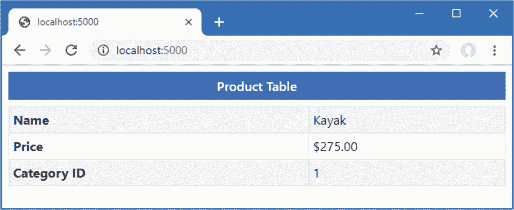

图 22-1。

运行示例应用

## 使用视窗袋

动作方法为视图提供了与视图模型一起显示的数据，但有时还需要附加信息。动作方法可以使用*视图包*来提供带有额外数据的视图，如清单 [22-5](#PC5) 所示。

```cs
using Microsoft.AspNetCore.Mvc;
using System.Threading.Tasks;
using WebApp.Models;
using Microsoft.EntityFrameworkCore;

namespace WebApp.Controllers {

    public class HomeController: Controller {
        private DataContext context;

        public HomeController(DataContext ctx) {
            context = ctx;
        }

        public async Task<IActionResult> Index(long id = 1) {
            ViewBag.AveragePrice = await context.Products.AverageAsync(p => p.Price);
            return View(await context.Products.FindAsync(id));
        }

        public IActionResult List() {
            return View(context.Products);
        }
    }
}

Listing 22-5.Using the View Bag in the HomeController.cs File in the Controllers Folder

```

`ViewBag`属性继承自`Controller`基类并返回一个`dynamic`对象。这允许动作方法通过给它们赋值来创建新的属性，如清单所示。由 action 方法分配给属性`ViewBag`的值可以通过一个也叫做`ViewBag`的属性提供给视图，如清单 [22-6](#PC6) 所示。

```cs
<!DOCTYPE html>
<html>
<head>
    <link href="/lib/twitter-bootstrap/css/bootstrap.min.css" rel="stylesheet" />
</head>
<body>
    <h6 class="bg-primary text-white text-center m-2 p-2">Product Table</h6>
    <div class="m-2">
        <table class="table table-sm table-striped table-bordered">
            <tbody>
                <tr><th>Name</th><td>@Model.Name</td></tr>
                <tr>
                    <th>Price</th>
                    <td>
                        @Model.Price.ToString("c")
                        (@(((Model.Price / ViewBag.AveragePrice)
                            * 100).ToString("F2"))% of average price)
                    </td>
                </tr>
                <tr><th>Category ID</th><td>@Model.CategoryId</td></tr>
            </tbody>
        </table>
    </div>
</body>
</html>

Listing 22-6.Using the View Bag in the Index.cshtml File in the Views/Home Folder

```

`ViewBag`属性将对象从动作传递到视图，与视图模型对象并排。在清单中，action 方法查询数据库中`Product.Price`属性的平均值，并将其分配给名为`AveragePrice`的视图包属性，视图在表达式中使用该属性。重启 ASP.NET Core，使用浏览器请求`http://localhost:5000`，产生如图 [22-2](#Fig2) 所示的响应。

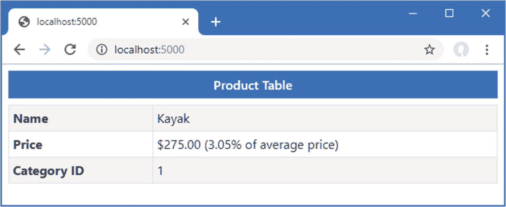

图 22-2。

使用视窗袋

When to use the View Bag

当视图包用于为视图提供少量的补充数据，而不必为每个操作方法创建新的视图模型类时，它的效果最好。视图包的问题是编译器不能检查动态对象上属性的使用，很像不使用`@model`表达式的视图。很难判断何时应该使用一个新的视图模型类，我的经验是，当多个操作使用同一个视图模型属性时，或者当一个操作方法向视图包添加了两个或三个以上的属性时，创建一个新的视图模型类。

## 使用临时数据

临时数据功能允许控制器保留从一个请求到另一个请求的数据，这在执行重定向时很有用。除非在将临时数据存储为会话数据时启用了会话状态，否则将使用 cookie 存储临时数据。与会话数据不同，临时数据值在被读取时被标记为删除，并在请求被处理后被移除。

将名为`CubedController.cs`的类文件添加到`WebApp/Controllers`文件夹中，并使用它来定义清单 [22-7](#PC7) 中所示的控制器。

```cs
using Microsoft.AspNetCore.Mvc;
using System;

namespace WebApp.Controllers {
    public class CubedController: Controller {

        public IActionResult Index() {
            return View("Cubed");
        }

        public IActionResult Cube(double num) {
            TempData["value"] = num.ToString();
            TempData["result"] = Math.Pow(num, 3).ToString();
            return RedirectToAction(nameof(Index));
        }
    }
}

Listing 22-7.The Contents of the CubedController.cs File in the Controllers Folder

```

`Cubed`控制器定义了一个选择名为`Cubed`的视图的`Index`方法。还有一个`Cube`动作，它依靠模型绑定过程从请求中获取其`num`参数的值(在第 [28](28.html) 章中详细描述了该过程)。`Cubed`动作方法执行其计算，并使用`TempData`属性存储`num`值和计算结果，该属性返回一个用于存储键/值对的字典。由于临时数据特性是建立在会话特性之上的，所以只能存储可以序列化为字符串的值，这也是我在清单 [22-7](#PC7) 中将两个双精度值都转换为字符串的原因。一旦值被存储为临时数据，`Cube`方法就执行到`Index`方法的重定向。为了给控制器提供一个视图，将一个名为`Cubed.cshtml`的 Razor 视图文件添加到`WebApp/Views/Shared`文件夹中，其内容如清单 [22-8](#PC8) 所示。

```cs
<!DOCTYPE html>
<html>
<head>
    <link href="/lib/twitter-bootstrap/css/bootstrap.min.css" rel="stylesheet" />
</head>
<body>
    <h6 class="bg-secondary text-white text-center m-2 p-2">Cubed</h6>
    <form method="get" action="/cubed/cube" class="m-2">
        <div class="form-group">
            <label>Value</label>
            <input name="num" class="form-control" value="@(TempData["value"])" />
        </div>
        <button class="btn btn-primary" type="submit">Submit</button>
    </form>
    @if (TempData["result"] != null) {
        <div class="bg-info text-white m-2 p-2">
            The cube of @TempData["value"] is @TempData["result"]
        </div>
    }
</body>
</html>

Listing 22-8.The Contents of the Cubed.cshtml File in the Views/Shared Folder

```

Razor 视图使用的基类通过一个`TempData`属性提供对临时数据的访问，允许在表达式中读取值。在这种情况下，临时数据用于设置`input`元素的内容并显示结果摘要。读取临时数据值不会立即删除它，这意味着可以在同一视图中重复读取这些值。只有在处理完请求后，标记的值才会被删除。

要查看效果，重新启动 ASP.NET Core，使用浏览器导航到`http://localhost:5000/cubed`，在表单字段中输入一个值，然后单击提交按钮。浏览器将发送一个设置临时数据并触发重定向的请求。为新请求保留临时数据值，并将结果显示给用户。但是读取数据值会将它们标记为删除，如果重新加载浏览器，则不再显示`input`元素的内容和结果摘要，如图 [22-3](#Fig3) 所示。

Tip

由`TempData`属性返回的对象提供了一个`Peek`方法和一个`Keep`方法，前者允许您获取一个数据值而不将其标记为删除，后者可用于防止先前读取的值被删除。`Keep`方法不会永远保护一个值。如果再次读取该值，它将被再次标记为删除。如果您希望存储项目，以便在处理请求时不会删除它们，请使用会话数据。

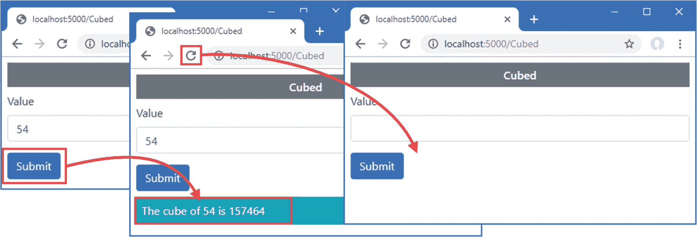

图 22-3。

使用临时数据

Using the Temp Data Attribute

控制器可以定义用`TempData`属性修饰的属性，这是使用`TempData`属性的替代方法，如下所示:

```cs
using Microsoft.AspNetCore.Mvc;
using System;

namespace WebApp.Controllers {
    public class CubedController: Controller {

        public IActionResult Index() {
            return View("Cubed");
        }

        public IActionResult Cube(double num) {
            Value = num.ToString();
            Result = Math.Pow(num, 3).ToString();
            return RedirectToAction(nameof(Index));
        }

        [TempData]
        public string Value { get; set; }

        [TempData]
        public string Result { get; set; }
    }
}

```

分配给这些属性的值会自动添加到临时数据存储中，并且在视图中访问它们的方式没有区别。我的偏好是使用`TempData`字典来存储值，因为它使 action 方法的意图对其他开发人员来说显而易见。然而，这两种方法都是完全有效的，选择哪一种是个人喜好的问题。

## 使用布局

示例应用中的视图包含重复的元素，用于设置 HTML 文档、定义`head`部分、加载引导 CSS 文件等等。Razor 支持*布局*，它通过将公共内容合并到一个可以被任何视图使用的文件中来避免这种重复。

布局通常存储在`Views/Shared`文件夹中，因为它们通常被多个控制器的动作方法使用。如果使用的是 Visual Studio，右击`Views/Shared`文件夹，从弹出菜单中选择添加➤新项，选择 Razor 布局模板，如图 [22-4](#Fig4) 所示。确保文件名为`_Layout.cshtml`,点击添加按钮创建新文件。用清单 [22-9](#PC10) 中所示的元素替换 Visual Studio 添加到文件中的内容。

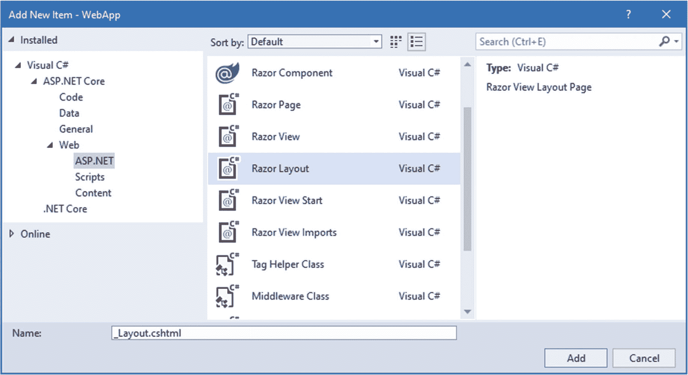

图 22-4。

创建布局

如果您使用的是 Visual Studio 代码，在`Views/Shared`文件夹中创建一个名为`_Layout.cshtml`的文件，并添加清单 [22-9](#PC10) 中所示的内容。

```cs
<!DOCTYPE html>
<html>
<head>
    <link href="/lib/twitter-bootstrap/css/bootstrap.min.css" rel="stylesheet" />
</head>
<body>
    <h6 class="bg-primary text-white text-center m-2 p-2">Shared View</h6>
    @RenderBody()
</body>
</html>

Listing 22-9.The Contents of the _Layout.cshtml File in the Views/Shared Folder

```

布局包含将被多个视图使用的公共内容。每个视图特有的内容通过调用由`RazorPage<T>`类继承的`RenderBody`方法插入到响应中，如第 [21 章](21.html)所述。使用布局的视图可以只关注它们独特的内容，如清单 [22-10](#PC11) 所示。

```cs
@model Product
@{
    Layout = "_Layout";
}
<div class="m-2">
    <table class="table table-sm table-striped table-bordered">
        <tbody>
            <tr><th>Name</th><td>@Model.Name</td></tr>
            <tr>
                <th>Price</th>
                <td>
                    @Model.Price.ToString("c")
                    (@(((Model.Price / ViewBag.AveragePrice)
                        * 100).ToString("F2"))% of average price)
                </td>
            </tr>
            <tr><th>Category ID</th><td>@Model.CategoryId</td></tr>
        </tbody>
    </table>
</div>

Listing 22-10.Using a Layout in the Index.cshtml File in the Views/Home Folder

```

通过添加由`@{`和`}`字符表示的代码块来选择布局，该代码块设置从`RazorPage<T>`类继承的`Layout`属性。在这种情况下，`Layout`属性被设置为布局文件的名称。与普通视图一样，布局是在没有路径或文件扩展名的情况下指定的，Razor 引擎将在`/Views/[controller]`和`/Views/Shared`文件夹中搜索以找到匹配的文件。使用浏览器请求`http://localhost:5000`，会看到如图 [22-5](#Fig5) 所示的响应。

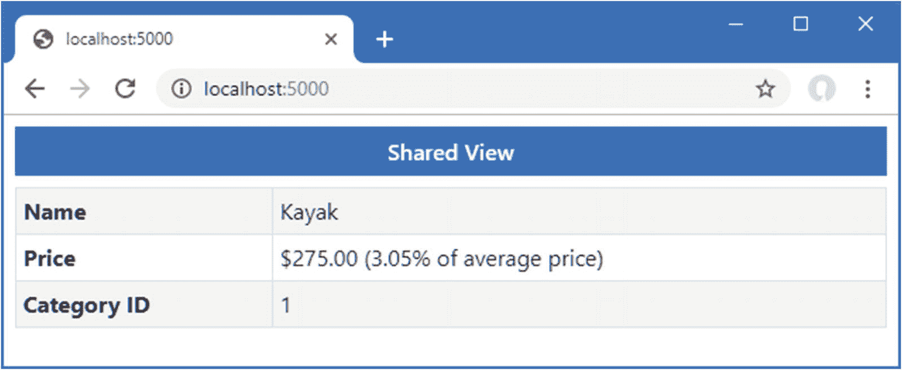

图 22-5。

使用布局

### 使用视图包配置布局

视图可以为布局提供数据值，允许定制视图提供的公共内容。视图包属性在选择布局的代码块中定义，如清单 [22-11](#PC12) 所示。

```cs
@model Product
@{
    Layout = "_Layout";
    ViewBag.Title = "Product Table";
}
<div class="m-2">
    <table class="table table-sm table-striped table-bordered">
        <tbody>
            <tr><th>Name</th><td>@Model.Name</td></tr>
            <tr>
                <th>Price</th>
                <td>
                    @Model.Price.ToString("c")
                    (@(((Model.Price / ViewBag.AveragePrice)
                        * 100).ToString("F2"))% of average price)
                </td>
            </tr>
            <tr><th>Category ID</th><td>@Model.CategoryId</td></tr>
        </tbody>
    </table>
</div>

Listing 22-11.Setting a View Bag Property in the Index.cshtml File in the Views/Home Folder

```

视图设置了一个`Title`属性，可以在布局中使用，如清单 [22-12](#PC13) 所示。

```cs
<!DOCTYPE html>
<html>
<head>
    <title>@ViewBag.Title</title>
    <link href="/lib/twitter-bootstrap/css/bootstrap.min.css" rel="stylesheet" />
</head>
<body>
    <h6 class="bg-primary text-white text-center m-2 p-2">
        @(ViewBag.Title ?? "Layout")
    </h6>
    @RenderBody()
</body>
</html>

Listing 22-12.Using a View Bag Property in the _Layout.cshtml File in the Views/Shared Folder

```

`Title`属性用于设置`body`节中`title`元素和`h6`元素的内容。布局不能依赖于正在定义的视图包属性，这就是为什么如果视图没有定义一个`Title`属性，`h6`元素中的表达式会提供一个后备值。要查看 view bag 属性的效果，使用浏览器请求`http://localhost:5000`，这会产生如图 [22-6](#Fig6) 所示的响应。

Understanding View Bag Precedence

如果视图和操作方法定义了相同的视图包属性，则视图定义的值优先。如果希望允许操作覆盖视图中定义的值，请在视图代码块中使用如下语句:

```cs
...
@{
    Layout = "_Layout";
    ViewBag.Title = ViewBag.Title ?? "Product Table";
}
...

```

只有在 action 方法尚未定义的情况下，该语句才会为`Title`属性设置值。

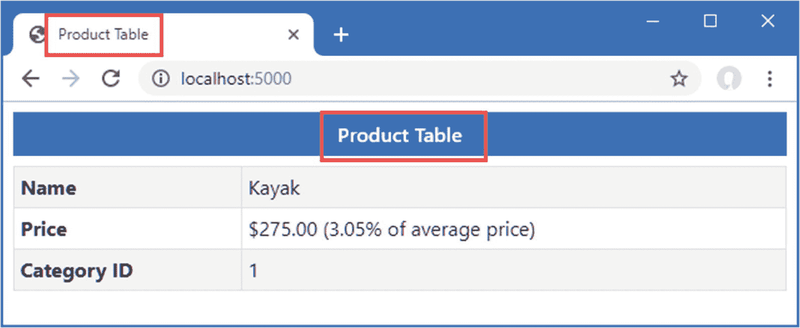

图 22-6。

使用视图包特性配置布局

### 使用视图开始文件

不用在每个视图中设置`Layout`属性，您可以添加一个*视图开始*文件到项目中，提供一个默认的`Layout`值。如果使用的是 Visual Studio，在解决方案浏览器中右键单击`Views`文件夹项，选择添加➤新项，定位 Razor 视图启动模板，如图 [22-7](#Fig7) 所示。确保文件名为`_ViewStart.cshtml`并点击 Add 按钮创建文件，该文件的内容如清单 [22-13](#PC15) 所示。

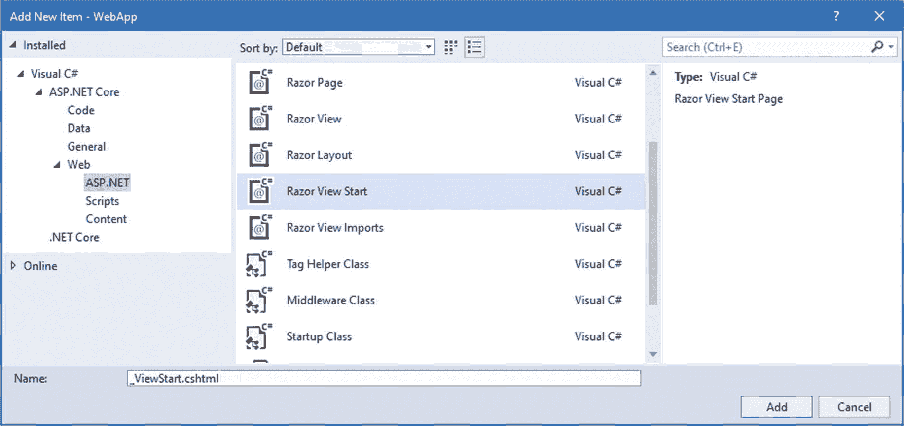

图 22-7。

创建视图开始文件

如果您使用的是 Visual Studio 代码，那么在`Views`文件夹中添加一个名为`_ViewStart.cshtml`的文件，并添加清单 [22-13](#PC15) 中所示的内容。

```cs
@{
    Layout = "_Layout";
}

Listing 22-13.The Contents of the _ViewStart.cshtml File in the Views Folder

```

该文件包含设置的`Layout`属性，该值将被用作默认值。清单 [22-14](#PC16) 从包含在布局中的`Common.cshtml`文件中删除内容。

```cs
<h6 class="bg-secondary text-white text-center m-2 p-2">Shared View</h6>

Listing 22-14.Removing Content in the Common.cshtml File in the Views/Shared Folder

```

视图没有定义视图模型类型，也不需要设置`Layout`属性，因为项目包含一个视图开始文件。结果是清单 [22-14](#PC16) 中的内容将被添加到响应的 HTML 内容的`body`部分。使用浏览器导航到`http://localhost:5000/second`，您将看到图 [22-8](#Fig8) 中的响应。

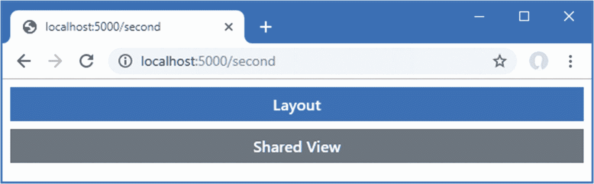

图 22-8。

使用视图开始文件

### 覆盖默认布局

在两种情况下，您可能需要在视图中定义一个`Layout`属性，即使项目中有一个视图开始文件。在第一种情况下，视图需要与视图开始文件指定的布局不同的布局。为了演示，将一个名为`_ImportantLayout.cshtml`的 Razor 布局文件添加到`Views/Shared`文件夹中，其内容如清单 [22-15](#PC17) 所示。

```cs
<!DOCTYPE html>
<html>
<head>
    <title>@ViewBag.Title</title>
    <link href="/lib/twitter-bootstrap/css/bootstrap.min.css" rel="stylesheet" />
</head>
<body>
    <h3 class="bg-warning text-white text-center p-2 m-2">Important</h3>
    @RenderBody()
</body>
</html>

Listing 22-15.The Contents of the _ImportantLayout.cshtml File in the Views/Shared Folder

```

除了 HTML 文档结构之外，该文件还包含一个 header 元素，以大文本显示`Important`。视图可以通过将其名称分配给属性`Layout`来选择这个布局，如清单 [22-16](#PC18) 所示。

Tip

如果您需要为单个控制器的所有动作使用不同的布局，那么添加一个视图开始文件到选择您需要的视图的`Views/[controller]`文件夹。Razor 引擎将使用由特定于控制器的视图开始文件指定的布局。

```cs
@model Product
@{
    Layout = "_ImportantLayout";
    ViewBag.Title = ViewBag.Title ?? "Product Table";
}
<div class="m-2">
    <table class="table table-sm table-striped table-bordered">
        <tbody>
            <tr><th>Name</th><td>@Model.Name</td></tr>
            <tr>
                <th>Price</th>
                <td>
                    @Model.Price.ToString("c")
                    (@(((Model.Price / ViewBag.AveragePrice)
                        * 100).ToString("F2"))% of average price)
                </td>
            </tr>
            <tr><th>Category ID</th><td>@Model.CategoryId</td></tr>
        </tbody>
    </table>
</div>

Listing 22-16.Using a Specific Layout in the Index.cshtml File in the Views/Home Folder

```

视图开始文件中的`Layout`值被视图中的值覆盖，允许应用不同的布局。使用浏览请求`http://localhost:5000`，响应将使用新的布局产生，如图 [22-9](#Fig9) 所示。

Selecting a Layout Programmatically

视图分配给`Layout`属性的值可以是允许视图选择布局的表达式的结果，类似于操作方法选择视图的方式。以下是根据视图模型对象定义的属性选择布局的示例:

```cs
...
@model Product
@{
    Layout = Model.Price > 100 ? "_ImportantLayout" : "_Layout";
    ViewBag.Title = ViewBag.Title ?? "Product Table";
}
...

```

当视图模型对象的`Price`属性值大于 100 时，选择名为`_ImportantLayout`的布局；否则，就用`_Layout`。

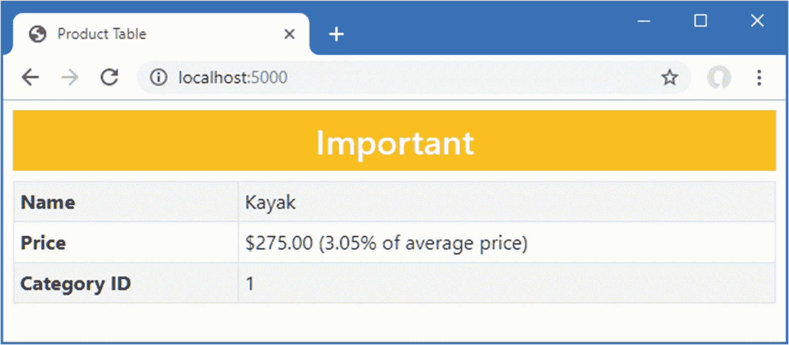

图 22-9。

在视图中指定布局

需要`Layout`属性的第二种情况是当一个视图包含一个完整的 HTML 文档并且根本不需要布局的时候。要查看问题，请打开一个新的 PowerShell 命令提示符，并运行清单 [22-17](#PC20) 中所示的命令。

```cs
Invoke-WebRequest http://localhost:5000/home/list | Select-Object  -expand Content

Listing 22-17.Sending an HTTP Request

```

该命令发送一个 HTTP GET 请求，其响应将使用`Views/Home`文件夹中的`List.cshtml`文件产生。这个视图包含一个完整的 HTML 文档，它与视图开始文件指定的视图中的内容相结合，产生一个格式错误的 HTML 文档，如下所示:

```cs
<!DOCTYPE html>
<html>
<head>
    <title></title>
    <link href="/lib/twitter-bootstrap/css/bootstrap.min.css" rel="stylesheet" />
</head>
<body>
    <h6 class="bg-primary text-white text-center m-2 p-2">
        Layout
    </h6>
    <!DOCTYPE html>
<html>
<head>
    <link href="/lib/twitter-bootstrap/css/bootstrap.min.css" rel="stylesheet" />
</head>
<body>
    <h6 class="bg-secondary text-white text-center m-2 p-2">Products</h6>
    <div class="m-2">
        <table class="table table-sm table-striped table-bordered">
            <thead>
                <tr><th>Name</th><th>Price</th></tr>
            </thead>
            <tbody>
                    <tr><td>Kayak</td><td>275.00</td></tr>
                    <tr><td>Lifejacket</td><td>48.95</td></tr>
                    <tr><td>Soccer Ball</td><td>19.50</td></tr>
                    <tr><td>Corner Flags</td><td>34.95</td></tr>
                    <tr><td>Stadium</td><td>79500.00</td></tr>
                    <tr><td>Thinking Cap</td><td>16.00</td></tr>
                    <tr><td>Unsteady Chair</td><td>29.95</td></tr>
                    <tr><td>Human Chess Board</td><td>75.00</td></tr>
                    <tr><td>Bling-Bling King</td><td>1200.00</td></tr>
            </tbody>
        </table>
    </div>
</body>
</html>
</body>
</html>

```

HTML 文档的结构元素是重复的，因此有两个`html`、`head`、`body`和`link`元素。浏览器擅长处理格式错误的 HTML，但并不总能处理结构不良的内容。当一个视图包含一个完整的 HTML 文档时，`Layout`属性可以设置为 null，如清单 [22-18](#PC22) 所示。

```cs
@model IEnumerable<Product>
@{
    Layout = null;
}
<!DOCTYPE html>
<html>
<head>
    <link href="/lib/twitter-bootstrap/css/bootstrap.min.css" rel="stylesheet" />
</head>
<body>
    <h6 class="bg-secondary text-white text-center m-2 p-2">Products</h6>
    <div class="m-2">
        <table class="table table-sm table-striped table-bordered">
            <thead>
                <tr><th>Name</th><th>Price</th></tr>
            </thead>
            <tbody>
                @foreach (Product p in Model) {
                    <tr><td>@p.Name</td><td>@p.Price</td></tr>
                }
            </tbody>
        </table>
    </div>
</body>
</html>

Listing 22-18.Disabling Layouts in the List.cshtml File in the Views/Home Folder

```

保存视图并再次运行清单 [22-17](#PC20) 中所示的命令，您将看到响应只包含视图中的元素，并且布局已经被禁用。

```cs
<!DOCTYPE html>
<html>
<head>
    <link href="/lib/twitter-bootstrap/css/bootstrap.min.css" rel="stylesheet" />
</head>
<body>
    <h6 class="bg-secondary text-white text-center m-2 p-2">Products</h6>
    <div class="m-2">
        <table class="table table-sm table-striped table-bordered">
            <thead>
                <tr><th>Name</th><th>Price</th></tr>
            </thead>
            <tbody>
                    <tr><td>Kayak</td><td>275.00</td></tr>
                    <tr><td>Lifejacket</td><td>48.95</td></tr>
                    <tr><td>Soccer Ball</td><td>19.50</td></tr>
                    <tr><td>Corner Flags</td><td>34.95</td></tr>
                    <tr><td>Stadium</td><td>79500.00</td></tr>
                    <tr><td>Thinking Cap</td><td>16.00</td></tr>
                    <tr><td>Unsteady Chair</td><td>29.95</td></tr>
                    <tr><td>Human Chess Board</td><td>75.00</td></tr>
                    <tr><td>Bling-Bling King</td><td>1200.00</td></tr>
            </tbody>
        </table>
    </div>
</body>
</html>

```

### 使用布局部分

Razor 视图引擎支持*部分*的概念，它允许你在一个布局中提供内容区域。Razor 部分可以更好地控制视图的哪些部分被插入到布局中，以及它们被放置在哪里。为了演示 sections 特性，我编辑了`/Views/Home/Index.cshtml`文件，如清单 [22-19](#PC24) 所示。

```cs
@model Product
@{
    Layout = "_Layout";
    ViewBag.Title = ViewBag.Title ?? "Product Table";
}

@section Header {
    Product Information
}

<tr><th>Name</th><td>@Model.Name</td></tr>
<tr>
    <th>Price</th>
    <td>@Model.Price.ToString("c")</td>
</tr>
<tr><th>Category ID</th><td>@Model.CategoryId</td></tr>

@section Footer {
    @(((Model.Price / ViewBag.AveragePrice)
        * 100).ToString("F2"))% of average price
}

Listing 22-19.Defining Sections in the Index.cshtml File in the Views/Home Folder

```

使用 Razor `@section`表达式后跟一个节名来定义节。清单 [22-19](#PC24) 定义了名为`Header`和`Footer`的节，节可以包含 HTML 内容和表达式的混合，就像视图的主要部分一样。用`@RenderSection`表达式在布局中应用部分，如清单 [22-20](#PC25) 所示。

```cs
<!DOCTYPE html>
<html>
<head>
    <title>@ViewBag.Title</title>
    <link href="/lib/twitter-bootstrap/css/bootstrap.min.css" rel="stylesheet" />
</head>
<body>
    <div class="bg-info text-white m-2 p-1">
        This is part of the layout
    </div>

    <h6 class="bg-primary text-white text-center m-2 p-2">
        @RenderSection("Header")
    </h6>

    <div class="bg-info text-white m-2 p-1">
        This is part of the layout
    </div>

    <div class="m-2">
        <table class="table table-sm table-striped table-bordered">
            <tbody>
                @RenderBody()
            </tbody>
        </table>
    </div>

    <div class="bg-info text-white m-2 p-1">
        This is part of the layout
    </div>

    <h6 class="bg-primary text-white text-center m-2 p-2">
        @RenderSection("Footer")
    </h6>

    <div class="bg-info text-white m-2 p-1">
        This is part of the layout
    </div>
</body>
</html>

Listing 22-20.Using Sections in the _Layout.cshtml File in the Views/Shared Folder

```

当应用布局时，`RenderSection`表达式将指定部分的内容插入到响应中。通过`RenderBody`方法将不包含在部分中的视图区域插入到响应中。要查看这些部分是如何应用的，使用浏览器请求`http://localhost:5000`，它会提供如图 [22-10](#Fig10) 所示的响应。

Note

视图只能定义布局中引用的部分。如果您在视图中定义的部分在布局中没有对应的`@RenderSection`表达式，视图引擎会抛出异常。

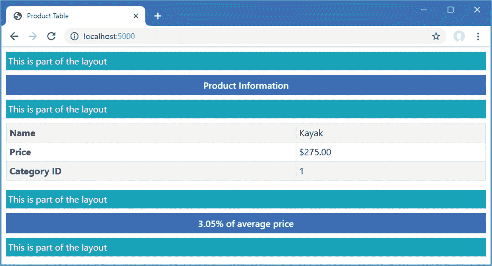

图 22-10。

在布局中使用剖面

节允许视图向布局提供内容片段，而无需指定如何使用它们。例如，清单 [22-21](#PC26) 重新定义了布局，将主体和部分合并到一个 HTML 表格中。

```cs
<!DOCTYPE html>
<html>
<head>
    <title>@ViewBag.Title</title>
    <link href="/lib/twitter-bootstrap/css/bootstrap.min.css" rel="stylesheet" />
</head>
<body>
    <div class="m-2">
        <table class="table table-sm table-striped table-bordered">
            <thead>
                <tr>
                    <th class="bg-primary text-white text-center" colspan="2">
                        @RenderSection("Header")
                    </th>
                </tr>
            </thead>
            <tbody>
                @RenderBody()
            </tbody>
            <tfoot>
                <tr>
                    <th class="bg-primary text-white text-center" colspan="2">
                        @RenderSection("Footer")
                    </th>
                </tr>
            </tfoot>
        </table>
    </div>
</body>
</html>

Listing 22-21.Using a Table in the _Layout.cshtml File in the Views/Shared Folder

```

要查看视图更改的效果，使用浏览器请求`http://localhost:5000`，这将产生如图 [22-11](#Fig11) 所示的响应。

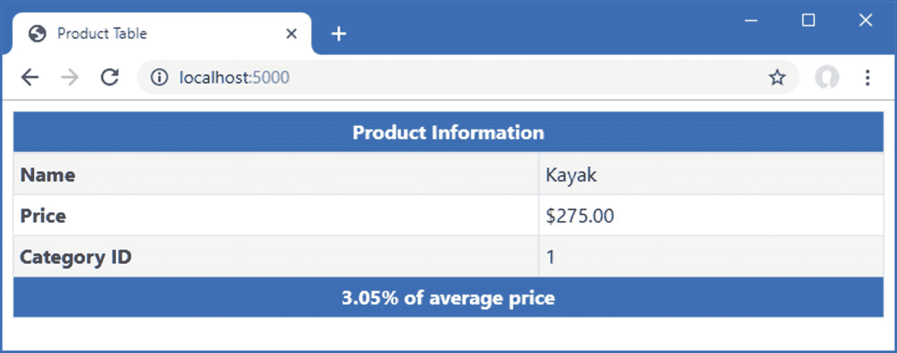

图 22-11。

更改剖面在布局中的显示方式

#### 使用可选布局部分

默认情况下，视图必须包含布局中有`RenderSection`调用的所有部分，如果布局需要视图没有定义的部分，将会抛出异常。清单 [22-22](#PC27) 添加了对`RenderSection`方法的调用，该方法需要一个名为`Summary`的部分。

```cs
<!DOCTYPE html>
<html>
<head>
    <title>@ViewBag.Title</title>
    <link href="/lib/twitter-bootstrap/css/bootstrap.min.css" rel="stylesheet" />
</head>
<body>
    <div class="m-2">
        <table class="table table-sm table-striped table-bordered">
            <thead>
                <tr>
                    <th class="bg-primary text-white text-center" colspan="2">
                        @RenderSection("Header")
                    </th>
                </tr>
            </thead>
            <tbody>
                @RenderBody()
            </tbody>
            <tfoot>
                <tr>
                    <th class="bg-primary text-white text-center" colspan="2">
                        @RenderSection("Footer")
                    </th>
                </tr>
            </tfoot>
        </table>
    </div>
    @RenderSection("Summary")
</body>
</html>

Listing 22-22.Adding a Section in the _Layout.cshtml File in the Views/Shared Folder

```

使用浏览器请求`http://localhost:5000`，你会看到如图 [22-12](#Fig12) 所示的异常。

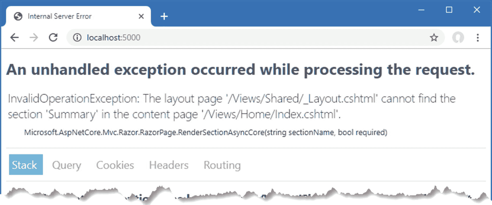

图 22-12。

试图呈现不存在的视图部分

有两种方法可以解决这个问题。第一个是创建一个可选的部分，只有当它被视图定义时才会被呈现。可选部分通过向`RenderSection`方法传递第二个参数来创建，如清单 [22-23](#PC28) 所示。

```cs
<!DOCTYPE html>
<html>
<head>
    <title>@ViewBag.Title</title>
    <link href="/lib/twitter-bootstrap/css/bootstrap.min.css" rel="stylesheet" />
</head>
<body>
    <div class="m-2">
        <table class="table table-sm table-striped table-bordered">
            <thead>
                <tr>
                    <th class="bg-primary text-white text-center" colspan="2">
                        @RenderSection("Header", false)
                    </th>
                </tr>
            </thead>
            <tbody>
                @RenderBody()
            </tbody>
            <tfoot>
                <tr>
                    <th class="bg-primary text-white text-center" colspan="2">
                        @RenderSection("Footer", false)
                    </th>
                </tr>
            </tfoot>
        </table>
    </div>
    @RenderSection("Summary", false)
</body>
</html>

Listing 22-23.Defining an Optional Section in the _Layout.cshtml File in the Views/Shared Folder

```

第二个参数指定一个节是否是必需的，当视图没有定义该节时，使用`false`可以防止出现异常。

#### 布局部分的测试

`IsSectionDefined`方法用于确定一个视图是否定义了一个指定的部分，并且可以用在一个`if`表达式中来呈现回退内容，如清单 [22-24](#PC29) 所示。

```cs
<!DOCTYPE html>
<html>
<head>
    <title>@ViewBag.Title</title>
    <link href="/lib/twitter-bootstrap/css/bootstrap.min.css" rel="stylesheet" />
</head>
<body>
    <div class="m-2">
        <table class="table table-sm table-striped table-bordered">
            <thead>
                <tr>
                    <th class="bg-primary text-white text-center" colspan="2">
                        @RenderSection("Header", false)
                    </th>
                </tr>
            </thead>
            <tbody>
                @RenderBody()
            </tbody>
            <tfoot>
                <tr>
                    <th class="bg-primary text-white text-center" colspan="2">
                        @RenderSection("Footer", false)
                    </th>
                </tr>
            </tfoot>
        </table>
    </div>
    @if (IsSectionDefined("Summary")) {
        @RenderSection("Summary", false)
    } else {
        <div class="bg-info text-center text-white m-2 p-2">
            This is the default summary
        </div>
    }
</body>
</html>

Listing 22-24.Checking for a Section in the _Layout.cshtml File in the Views/Shared Folder

```

使用您想要检查的部分的名称调用`IsSectionDefined`方法，如果视图定义了该部分，则返回`true`。在这个例子中，当视图没有定义`Summary`部分时，我使用这个助手来呈现回退内容。要查看回退内容，使用浏览器请求`http://localhost:5000`，产生如图 [22-13](#Fig13) 所示的响应。

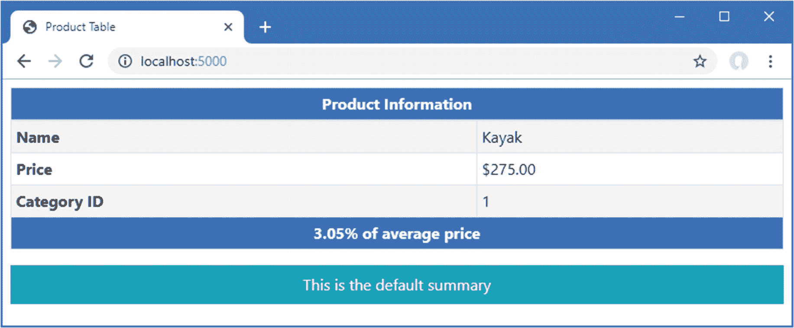

图 22-13。

显示视图节的回退内容

## 使用局部视图

你经常需要在几个不同的地方使用相同的 HTML 元素和表达式。*部分视图*是包含内容片段的视图，这些片段将被包含在其他视图中，以产生复杂的响应，而不会重复。

### 启用局部视图

使用一个叫做*标签助手*的特性来应用局部视图，这在第 [25 章](25.html)中有详细描述；标签助手在视图导入文件中配置，该文件在第 [21 章](21.html)中添加到项目中。为了启用局部视图所需的特性，将清单 [22-25](#PC30) 中所示的语句添加到`_ViewImports.cshtml`文件中。

```cs
@using WebApp.Models
@addTagHelper *, Microsoft.AspNetCore.Mvc.TagHelpers

Listing 22-25.Enabling Tag Helpers in the _ViewImports.cshtml File in the Views Folder

```

### 创建局部视图

局部视图只是普通的 CSHTML 文件，只是它们的使用方式不同于标准视图。如果您使用的是 Visual Studio，右键单击`Views/Home`文件夹，选择添加➤新项目，并使用 Razor 视图模板创建一个名为`_RowPartial.cshtml`的文件。一旦文件被创建，用清单 [22-26](#PC31) 中所示的内容替换它。如果您使用的是 Visual Studio 代码，将名为`_RowPartial.cshtml`的文件添加到`Views/Home`文件夹中，并将清单 [22-26](#PC31) 中所示的内容添加到其中。

Tip

Visual Studio 为创建预先填充的局部视图提供了一些工具支持，但创建局部视图的最简单方法是使用 Razor 视图项模板创建常规视图。

```cs
@model Product

<tr>
    <td>@Model.Name</td>
    <td>@Model.Price</td>
</tr>

Listing 22-26.The Contents of the _RowPartial.cshtml File in the Views/Home Folder

```

`model`表达式用于定义局部视图的视图模型类型，它包含与常规视图相同的表达式和 HTML 元素的混合。这个局部视图的内容创建了一个表格行，使用一个`Product`对象的`Name`和`Price`属性来填充表格单元格。

### 应用局部视图

通过在另一个视图或布局中添加一个`partial`元素来应用局部视图。在清单 [22-27](#PC32) 中，我已经将元素添加到了`List.cshtml`文件中，因此局部视图用于生成表中的行。

```cs
@model IEnumerable<Product>
@{
    Layout = null;
}
<!DOCTYPE html>
<html>
<head>
    <link href="/lib/twitter-bootstrap/css/bootstrap.min.css" rel="stylesheet" />
</head>
<body>
    <h6 class="bg-secondary text-white text-center m-2 p-2">Products</h6>
    <div class="m-2">
        <table class="table table-sm table-striped table-bordered">
            <thead>
                <tr><th>Name</th><th>Price</th></tr>
            </thead>
            <tbody>
                @foreach (Product p in Model) {
                    <partial name="_RowPartial" model="p" />
                }
            </tbody>
        </table>
    </div>
</body>
</html>

Listing 22-27.Using a Partial View in the List.cshtml File in the Views/Home Folder

```

应用于`partial`元素的属性控制局部视图的选择和配置，如表 [22-2](#Tab2) 所述。

表 22-2。

部分元素属性

<colgroup><col class="tcol1 align-left"> <col class="tcol2 align-left"></colgroup> 
| 

名字

 | 

描述

 |
| --- | --- |
| `name` | 此属性指定局部视图的名称，局部视图使用与常规视图相同的搜索过程定位。 |
| `model` | 此属性指定将用作局部视图的视图模型对象的值。 |
| `for` | 该属性用于定义一个表达式，该表达式为局部视图选择视图模型对象，如下所述。 |
| `view-data` | 此属性用于为局部视图提供附加数据。 |

清单 [22-27](#PC32) 中的`partial`元素使用`name`属性选择`_RowPartial`视图，使用`model`属性选择将被用作视图模型对象的`Product`对象。在`@foreach`表达式中应用了`partial`元素，这意味着它将用于生成表中的每一行，您可以通过使用浏览器来请求`http://localhost:5000/home/list`产生如图 [22-14](#Fig14) 所示的响应。

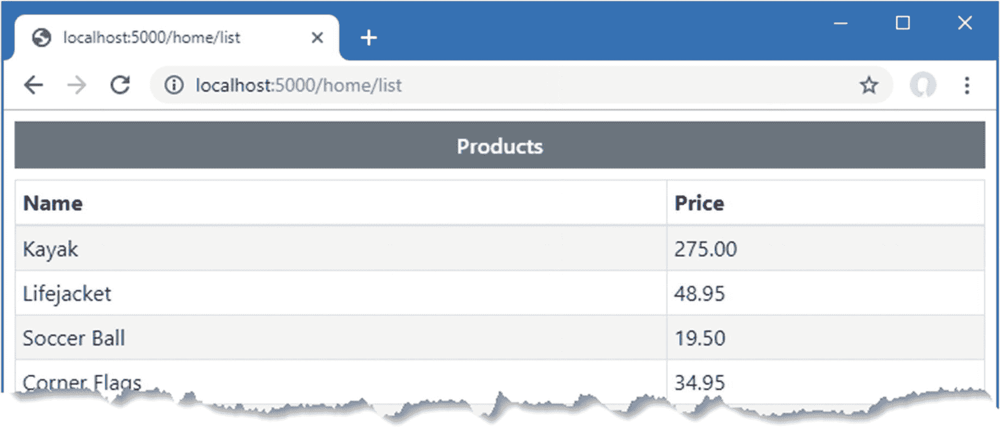

图 22-14。

使用局部视图

Using the HTML Helper to Apply Partial Views

在 ASP.NET Core 的早期版本中，使用添加到从视图生成的 C# 类中的`Html`属性来应用部分视图，如第 [21 章](21.html)中所述。由`Html`属性返回的对象实现了`IHtmlHelper`接口，通过该接口可以应用视图，如下所示:

```cs
...
@Html.Partial("_RowPartial")
...

```

这种类型的表达式是可行的，并且仍然受到支持，但是`partial`元素提供了一种更优雅的方法，与视图中的其他 HTML 元素保持一致。

#### 使用表达式选择局部视图模型

`for`属性用于使用应用于视图模型的表达式来设置局部视图的模型，这是一个比描述更容易演示的特性。将名为`_CellPartial.cshtml`的局部视图添加到`Views/Home`文件夹中，内容如清单 [22-28](#PC34) 所示。

```cs
@model string

<td class="bg-info text-white">@Model</td>

Listing 22-28.The Contents of the _CellPartial.cshtml File in the Views/Home Folder

```

这个局部视图有一个字符串视图模型对象，它将这个对象用作表格单元格元素的内容；表格单元格元素使用引导 CSS 框架进行样式化。在清单 [22-29](#PC35) 中，我在`_RowPartial.cshtml`文件中添加了一个`partial`元素，它使用`_CellPartial`局部视图来显示`Product`对象名称的表格单元格。

```cs
@model Product

<tr>
    <partial name="_CellPartial" for="Name" />
    <td>@Model.Price</td>
</tr>

Listing 22-29.Using a Partial View in the _RowPartial.cshtml File in the Views/Home Folder

```

`for`属性选择`Name`属性作为`_CellPartial`局部视图的模型。要查看效果，使用浏览器请求`http://localhost:5000/home/list`，将产生如图 [22-15](#Fig15) 所示的响应。

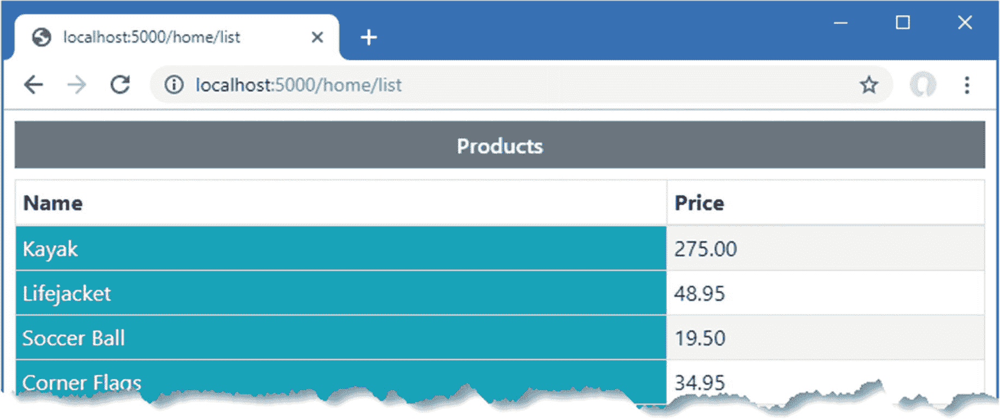

图 22-15。

选择在局部视图中使用的模型特性

Using Templated Delegates

模板委托是避免视图重复的另一种方法。模板化委托在代码块中定义，如下所示:

```cs
...
@{
    Func<Product, object> row
        = @<tr><td>@item.Name</td><td>@item.Price</td></tr>;
}
...

```

模板是一个接受`Product`输入对象并返回动态结果的函数。在模板表达式中，输入对象在表达式中被称为`item`。模板化委托作为方法表达式被调用以生成内容。

```cs
...
<tbody>
    @foreach (Product p in Model) {
        @row(p)
    }
</tbody>
...

```

我发现这个特性很笨拙，我更喜欢使用局部视图，尽管这是一个偏好和习惯问题，而不是模板化代理工作方式的任何客观问题。

## 了解内容编码

Razor 视图为内容编码提供了两个有用的特性。HTML 内容编码特性确保表达式响应不会改变发送给浏览器的响应的结构，这是一个重要的安全特性。JSON 编码特性将对象编码为 JSON，并将其插入到响应中，这是一个有用的调试特性，在向 JavaScript 应用提供数据时也很有用。这两种编码功能将在以下部分中进行描述。

### 理解 HTML 编码

Razor 视图引擎对表达式结果进行编码，使它们可以安全地包含在 HTML 文档中，而不会改变其结构。在处理用户提供的内容时，这是一个重要的特性，用户可能会试图破坏应用或意外输入危险的内容。清单 [22-30](#PC38) 向`Home`控制器添加了一个动作方法，该方法将一段 HTML 传递给`View`方法。

```cs
using Microsoft.AspNetCore.Mvc;
using System.Threading.Tasks;
using WebApp.Models;
using Microsoft.EntityFrameworkCore;

namespace WebApp.Controllers {

    public class HomeController: Controller {
        private DataContext context;

        public HomeController(DataContext ctx) {
            context = ctx;
        }

        public async Task<IActionResult> Index(long id = 1) {
            ViewBag.AveragePrice = await context.Products.AverageAsync(p => p.Price);
            return View(await context.Products.FindAsync(id));
        }

        public IActionResult List() {
            return View(context.Products);
        }

        public IActionResult Html() {
            return View((object)"This is a <h3><i>string</i></h3>");
        }
    }
}

Listing 22-30.Adding an Action in the HomeController.cs File in the Controllers Folder

```

新操作传递一个包含 HTML 元素的字符串。为了创建新动作方法的视图，将一个名为`Html.cshtml`的 Razor 视图文件添加到`Views/Home`文件夹中，其内容如清单 [22-31](#PC39) 所示。

Tip

注意，我将传递给`View`方法的字符串转换为一个对象，如果没有这个对象，字符串将被假定为视图的名称，而不是视图模型对象。

```cs
@model string
@{
    Layout = null;
}
<!DOCTYPE html>
<html>
<head>
    <link href="/lib/twitter-bootstrap/css/bootstrap.min.css" rel="stylesheet" />
</head>
<body>
    <div class="bg-secondary text-white text-center m-2 p-2">@Model</div>
</body>
</html>

Listing 22-31.The Contents of the Html.cshtml File in the Views/Home Folder

```

重启 ASP.NET Core 并使用浏览器请求`http://localhost:5000/home/html`。图 [22-17](#Fig17) 左侧显示的响应显示了视图模型字符串中潜在的危险字符是如何被转义的。

要包含没有安全编码的表达式的结果，可以调用`Html.Raw`方法。`Html`属性是添加到生成的视图类中的属性之一，在第 [21 章](21.html)中有描述，它返回一个实现`IHtmlHelper`接口的对象，如清单 [22-32](#PC40) 所示。

```cs
@model string
@{
    Layout = null;
}
<!DOCTYPE html>
<html>
<head>
    <link href="/lib/twitter-bootstrap/css/bootstrap.min.css" rel="stylesheet" />
</head>
<body>
    <div class="bg-secondary text-white text-center m-2 p-2">@Html.Raw(Model)</div>
</body>
</html>

Listing 22-32.Disabling Encoding in the Html.cshtml File in the Views/Home Folder

```

再次请求`http://localhost:5000/home/html` URL，你会看到视图模型字符串没有被编码就被传递，然后被浏览器解释为 HTML 文档的一部分，如图 [22-16](#Fig16) 的右边所示。

Caution

不要禁用安全编码，除非您完全确信没有恶意内容会传递到视图。不小心使用这个特性会给应用和用户带来安全风险。

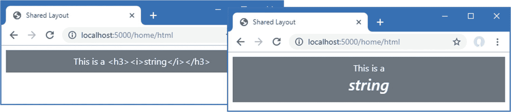

图 22-16。

HTML 结果编码

### 理解 JSON 编码

如第 [21](21.html) 章所述，添加到视图生成的类中的`Json`属性可用于将对象编码为 JSON。JSON 数据最常见的用途是在 RESTful web 服务中，如前几章所述，但是我发现 Razor JSON 编码特性在我没有从视图中得到我期望的输出时作为调试工具很有用。清单 [22-33](#PC41) 将视图模型对象的 JSON 表示添加到由`Index`视图产生的输出中。

```cs
@model Product
@{
    Layout = "_Layout";
    ViewBag.Title = ViewBag.Title ?? "Product Table";
}

@section Header {
    Product Information
}

<tr><th>Name</th><td>@Model.Name</td></tr>
<tr>
    <th>Price</th>
    <td>@Model.Price.ToString("c")</td>
</tr>
<tr><th>Category ID</th><td>@Model.CategoryId</td></tr>

@section Footer {
    @(((Model.Price / ViewBag.AveragePrice)
        * 100).ToString("F2"))% of average price
}

@section Summary {
    <div class="bg-info text-white m-2 p-2">
        @Json.Serialize(Model)
    </div>
}

Listing 22-33.Using JSON Encoding in the Index.cshtml File in the Views/Home Folder

```

属性返回接口的实现，接口的方法产生一个对象的 JSON 表示。用浏览器请求`http://localhost:5000`，会看到如图 [22-17](#Fig17) 所示的响应，在视图的`Summary`部分包含 JSON。

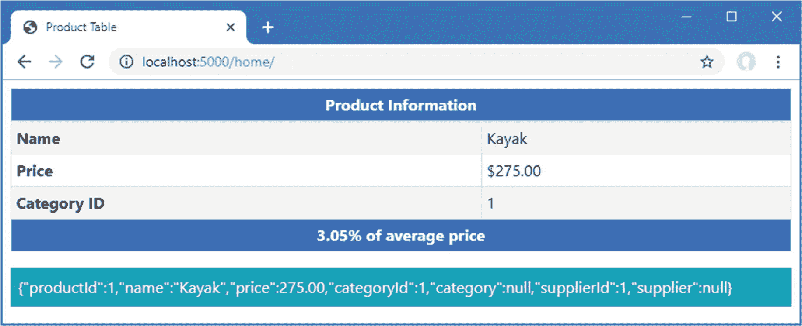

图 22-17。

将表达式结果编码为 JSON

## 摘要

在这一章中，我继续描述 Razor 视图中可用的特性。我向您展示了如何使用视图包，如何使用布局和局部视图来处理公共内容，以及如何管理表达式结果的编码过程。在下一章，我将介绍 Razor Pages，它提供了一种生成 HTML 响应的替代方法。