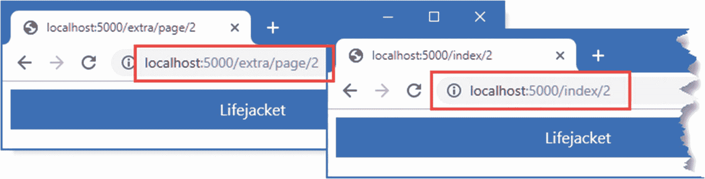

# 二十三、使用 Razor 页面

在这一章中，我将介绍 Razor Pages，这是一种更简单的生成 HTML 内容的方法，旨在抓住人们对遗留的 ASP.NET 网页框架的热情。我解释了 Razor 页面是如何工作的，解释了它们与 MVC 框架所采用的控制器和视图方法有何不同，并向您展示了它们如何适应更广泛的 ASP.NET Core 平台。

解释 Razor 页面如何工作的过程可以最小化与前面章节中描述的控制器和视图的差异。您可能会认为 Razor 页面只是 MVC-lite，并对其不屑一顾，这将是一种耻辱。Razor 页面之所以有趣，是因为开发人员的体验，而不是它们的实现方式。

我的建议是给 Razor Pages 一个机会，尤其是如果你是一个有经验的 MVC 开发人员。虽然使用的技术是熟悉的，但是创建应用特性的过程是不同的，并且非常适合于不需要控制器和视图的规模和复杂性的小型和紧密集中的特性。自从 MVC 框架被首次引入以来，我就一直在使用它，我承认忽略了 Razor Pages 的早期版本。然而，现在我发现自己在大多数项目中混合了 Razor 页面和 MVC 框架，就像我在第 1 部分的 SportsStore 例子中所做的那样。表 [23-1](#Tab1) 将 Razor 页面放在上下文中。

表 23-1。

把 Razor 页放在上下文中

<colgroup><col class="tcol1 align-left"> <col class="tcol2 align-left"></colgroup> 
| 

问题

 | 

回答

 |
| --- | --- |
| 它们是什么？ | Razor 页面是生成 HTML 响应的一种简化方式。 |
| 它们为什么有用？ | Razor Pages 的简单性意味着您可以比使用 MVC 框架更快地获得结果，MVC 框架可能需要相对复杂的准备过程。对于缺乏经验的 web 开发人员来说，Razor 页面也更容易理解，因为代码和内容之间的关系更明显。 |
| 它们是如何使用的？ | Razor 页面将单个视图与为其提供特性的类相关联，并使用基于文件的路由系统来匹配 URL。 |
| 有什么陷阱或限制吗？ | Razor 页面没有 MVC 框架灵活，这使得它们不适合复杂的应用。Razor 页面只能用来生成 HTML 响应，不能用来创建 RESTful web 服务。 |
| 还有其他选择吗？ | MVC 框架的控制器和视图方法可以用来代替 Razor 页面。 |

表 [23-2](#Tab2) 总结了本章内容。

表 23-2。

章节总结

<colgroup><col class="tcol1 align-left"> <col class="tcol2 align-left"> <col class="tcol3 align-left"></colgroup> 
| 

问题

 | 

解决办法

 | 

列表

 |
| --- | --- | --- |
| 启用 Razor 页面 | 使用`AddRazorPages`和`MapRazorPages`设置所需的服务和中间件 | three |
| 创建自包含端点 | 创建 Razor 页面 | 4, 26, 27 |
| 将请求路由到 Razor 页面 | 使用页面的名称或使用`@page`指令指定一个路径 | 5–8 |
| 提供逻辑来支持 Razor 页面的视图部分 | 使用页面模型类 | 9–12 |
| 创建不使用 Razor 页面的视图部分呈现的结果 | 定义返回操作结果的处理程序方法 | 13–15 |
| 处理多个 HTTP 方法 | 在页面模型类中定义处理程序 | 16–18 |
| 避免内容重复 | 使用布局或局部视图 | 19–25 |

## 为本章做准备

本章使用第 [22 章](22.html)中的`WebApp`项目。打开一个新的 PowerShell 命令提示符，导航到包含`WebApp.csproj`文件的文件夹，运行清单 [23-1](#PC1) 中所示的命令来删除数据库。

Tip

你可以从 [`https://github.com/apress/pro-asp.net-core-3`](https://github.com/apress/pro-asp.net-core-3) 下载本章以及本书其他章节的示例项目。如果在运行示例时遇到问题，请参见第 [1](01.html) 章获取帮助。

```cs
dotnet ef database drop --force

Listing 23-1.Dropping the Database

```

### 运行示例应用

一旦数据库被删除，从 Debug 菜单中选择 Start Without Debugging 或 Run Without Debugging，或者使用 PowerShell 命令提示符运行清单 [23-2](#PC2) 中所示的命令。

```cs
dotnet run

Listing 23-2.Running the Example Application

```

数据库将作为应用启动的一部分被植入。一旦 ASP.NET Core 正在运行，使用 web 浏览器请求`http://localhost:5000`，这将产生如图 [23-1](#Fig1) 所示的响应。


图 23-1。

运行示例应用

## 理解 Razor 页面

当您学习 Razor 页面如何工作时，您将看到它们与 MVC 框架共享共同的功能。事实上，Razor 页面通常被描述为 MVC 框架的简化——这是真的——但这并没有解释 Razor 页面为什么有用。

MVC 框架以同样的方式解决每一个问题:控制器定义选择视图产生响应的动作方法。这是一个可行的解决方案，因为它非常灵活:控制器可以定义多个动作方法来响应不同的请求，动作方法可以决定在处理请求时将使用哪个视图，视图可以依赖私有或共享的局部视图来产生它的响应。

并不是 web 应用中的每个特性都需要 MVC 框架的灵活性。对于许多特性来说，一个单一的动作方法将被用来处理各种各样的请求，所有这些请求都使用同一个视图来处理。Razor Pages 提供了一种更集中的方法，将标记和 C# 代码联系在一起，牺牲了灵活性。

但是 Razor 页有局限性。Razor 页面开始时倾向于专注于单一功能，但随着功能的增强，慢慢变得无法控制。而且，与 MVC 控制器不同，Razor 页面不能用来创建 web 服务。

你不必只选择一种模型，因为 MVC 框架和 Razor 页面是共存的，正如本章所演示的。这意味着自包含的特性可以很容易地用 Razor Pages 来开发，而应用中更复杂的部分可以用 MVC 控制器和动作来实现。

在接下来的部分中，我将向您展示如何配置和使用 Razor 页面，然后我将解释它们是如何工作的，并展示它们与 MVC 控制器和动作共享的公共基础。

### 配置 Razor 页面

为了准备 Razor 页面的应用，必须在`Startup`类中添加语句来设置服务和配置端点路由系统，如清单 [23-3](#PC3) 所示。

```cs
using System;
using System.Collections.Generic;
using System.Linq;
using Microsoft.AspNetCore.Builder;
using Microsoft.Extensions.DependencyInjection;
using Microsoft.Extensions.Configuration;
using Microsoft.EntityFrameworkCore;
using WebApp.Models;

namespace WebApp {
    public class Startup {

        public Startup(IConfiguration config) {
            Configuration = config;
        }

        public IConfiguration Configuration { get; set; }

        public void ConfigureServices(IServiceCollection services) {
            services.AddDbContext<DataContext>(opts => {
                opts.UseSqlServer(Configuration[
                    "ConnectionStrings:ProductConnection"]);
                opts.EnableSensitiveDataLogging(true);
            });
            services.AddControllersWithViews().AddRazorRuntimeCompilation();
            services.AddRazorPages().AddRazorRuntimeCompilation();

            services.AddDistributedMemoryCache();
            services.AddSession(options => {
                options.Cookie.IsEssential = true;
            });
        }

        public void Configure(IApplicationBuilder app, DataContext context) {
            app.UseDeveloperExceptionPage();
            app.UseStaticFiles();
            app.UseSession();
            app.UseRouting();
            app.UseEndpoints(endpoints => {
                endpoints.MapControllers();
                endpoints.MapDefaultControllerRoute();
                endpoints.MapRazorPages();
            });
            SeedData.SeedDatabase(context);
        }
    }
}

Listing 23-3.Configuring the Application in the Startup.cs File in the WebApp Folder

```

`AddRazorPages`方法设置了使用 Razor 页面所需的服务，而可选的`AddRazorRuntimeCompilation`方法支持运行时重新编译，使用在第 [21 章](21.html)中添加到项目中的包。`MapRazorPages`方法创建将 URL 与页面匹配的路由配置，这将在本章后面解释。

### 创建 Razor 页面

Razor 页面在`Pages`文件夹中定义。如果使用的是 Visual Studio，创建`WebApp/Pages`文件夹，在解决方案浏览器中右键单击，在弹出菜单中选择添加➤新项，选择 Razor 页面模板，如图 [23-2](#Fig2) 所示。将 Name 字段设置为`Index.cshtml`并点击 Add 按钮创建文件，并将文件内容替换为清单 [23-4](#PC4) 中所示的内容。


图 23-2。

创建 Razor 页面

如果您使用的是 Visual Studio 代码，创建`WebApp/Pages`文件夹并向其中添加一个名为`Index.cshtml`的新文件，其内容如清单 [23-4](#PC4) 所示。

```cs
@page
@model IndexModel
@using Microsoft.AspNetCore.Mvc.RazorPages
@using WebApp.Models;

<!DOCTYPE html>
<html>
<head>
    <link href="/lib/twitter-bootstrap/css/bootstrap.min.css" rel="stylesheet" />
</head>
<body>
    <div class="bg-primary text-white text-center m-2 p-2">@Model.Product.Name</div>
</body>
</html>

@functions {

    public class IndexModel: PageModel {
        private DataContext context;

        public Product Product { get; set; }

        public IndexModel(DataContext ctx) {
            context = ctx;
        }

        public async Task OnGetAsync(long id = 1) {
            Product = await context.Products.FindAsync(id);
        }
    }
}

Listing 23-4.The Contents of the Index.cshtml File in the Pages Folder

```

Razor 页面使用我在第 21 章[和第 22 章](21.html)[中描述的 Razor 语法，Razor 页面甚至使用相同的 CSHTML 文件扩展名。但是有一些重要的区别。](22.html)

指令必须是 Razor 页面中的第一件事，这确保文件不会被误认为是与控制器相关联的视图。但是最重要的区别是,`@functions`指令用于定义支持同一文件中 Razor 内容的 C# 代码。我很快解释了 Razor 页面是如何工作的，但是要查看 Razor 页面生成的输出，重启 ASP.NET Core 并使用浏览器请求`http://localhost:5000/index`，这将产生如图 [23-3](#Fig3) 所示的响应。


图 23-3。

使用 Razor 页

#### 了解 URL 路由约定

Razor 页面的 URL 路由基于文件名和位置，相对于`Pages`文件夹。清单 [23-4](#PC4) 中的 Razor 页面位于`Pages`文件夹中一个名为`Index.cshtml`的文件中，这意味着它将处理对`/index`的请求。路由约定可以被覆盖，如“理解 Razor 页面路由”一节所述，但是，默认情况下，是 Razor 页面文件的位置决定它响应的 URL。

#### 了解页面模型

在 Razor 页面中，`@model`指令用于选择一个*页面模型*类，而不是识别一个动作方法提供的对象的类型。清单 [23-4](#PC4) 中的`@model`指令选择了`IndexModel`类。

```cs
...
@model IndexModel
...

```

页面模型是在`@functions`指令中定义的，并且是从`PageModel`类中派生出来的，如下所示:

```cs
...
@functions {
    public class IndexModel: PageModel {
...

```

当 Razor 页面被选择来处理一个 HTTP 请求时，页面模型类的一个新实例被创建，依赖注入被用来解析任何依赖关系，这些依赖关系是使用构造函数参数声明的，使用第 [14 章](14.html)中描述的特性。`IndexModel`类声明了对第 [18 章](18.html)中创建的`DataContext`服务的依赖，这允许它访问数据库中的数据。

```cs
...
public IndexModel(DataContext ctx) {
    context = ctx;
}
...

```

创建页面模型对象后，将调用一个处理程序方法。处理程序方法的名称是`On`，后跟请求的 HTTP 方法，这样当选择 Razor 页面来处理 HTTP GET 请求时，就会调用`OnGet`方法。处理程序方法可以是异步的，在这种情况下，GET 请求将调用由`IndexModel`类实现的`OnGetAsync`方法。

```cs
...
public async Task OnGetAsync(long id = 1) {
    Product = await context.Products.FindAsync(id);
}
...

```

使用模型绑定过程从 HTTP 请求中获得处理程序方法参数的值，这在第 [28](28.html) 章中有详细描述。`OnGetAsync`方法从模型绑定器接收其`id`参数的值，它使用该值查询数据库并将结果分配给其`Product`属性。

#### 了解页面视图

Razor 页面使用 HTML 片段和代码表达式的相同混合来生成内容，这定义了呈现给用户的视图。页面模型的方法和属性可以通过`@Model`表达式在 Razor 页面中访问。由`IndexModel`类定义的`Product`属性用于设置 HTML 元素的内容，如下所示:

```cs
...
<div class="bg-primary text-white text-center m-2 p-2">@Model.Product.Name</div>
...

```

`@Model`表达式返回一个`IndexModel`对象，这个表达式读取由`Product`属性返回的对象的`Name`属性。

#### 理解生成的 C# 类

在幕后，Razor 页面被转换成 C# 类，就像常规的 Razor 视图一样。下面是清单 [23-4](#PC4) 中 Razor 页面产生的 C# 类的简化版本:

```cs
using System;
using System.Collections.Generic;
using System.Linq;
using System.Threading.Tasks;
using Microsoft.AspNetCore.Mvc;
using Microsoft.AspNetCore.Mvc.Rendering;
using Microsoft.AspNetCore.Mvc.ViewFeatures;
using Microsoft.AspNetCore.Mvc.Razor.TagHelpers;
using Microsoft.AspNetCore.Mvc.ViewFeatures;
using Microsoft.AspNetCore.Mvc.Rendering;
using Microsoft.AspNetCore.Mvc.RazorPages;
using Microsoft.AspNetCore.Razor.Runtime.TagHelpers;
using Microsoft.AspNetCore.Razor.TagHelpers;
using WebApp.Models;

namespace AspNetCore {

    public class Pages_Index : Page {
        public <IndexModel> ViewData => (<IndexModel>)PageContext?.ViewData;
        public IndexModel Model => ViewData.Model;

        public async override Task ExecuteAsync() {
            WriteLiteral("\r\n<!DOCTYPE html>\r\n<html>\r\n");
            WriteLiteral("<head>");
            WriteLiteral("@<link
                href=\"/lib/twitter-bootstrap/css/bootstrap.min.css\"
                rel=\"stylesheet\" />");
            WriteLiteral("</head>");
            WriteLiteral("<body>");
            WriteLiteral("<div class=\"bg-primary text-white text-center m-2 p-2\">")
            Write(Model.Product.Name);
            WriteLiteral("</div>");
            WriteLiteral("</body></html>\r\n\r\n");
        }

        public class IndexModel: PageModel {
            private DataContext context;
            public Product Product { get; set; }

            public IndexModel(DataContext ctx) {
                context = ctx;
            }

            public async Task OnGetAsync(long id = 1) {
                Product = await context.Products.FindAsync(id);
            }
        }

        public IUrlHelper Url { get; private set; }
        public IViewComponentHelper Component { get; private set; }
        public IJsonHelper Json { get; private set; }
        public IHtmlHelper<IndexModel> Html { get; private set; }
        public IModelExpressionProvider ModelExpressionProvider { get; private set; }
    }
}

```

如果你将这段代码与第 21 章[中的代码进行比较，你会发现 Razor 页面是如何依赖于 MVC 框架所使用的相同特性的。HTML 片段和视图表达式被转换成对`WriteLiteral`和`Write`方法的调用。](21.html)

Tip

您可以通过使用 Windows 文件资源管理器检查`obj/Debug/netcoreapp3.0/Razor/Pages`文件夹的内容来查看生成的类。

## 了解 Razor 页面路由

Razor 页面依赖于 CSHTML 文件的位置进行路由，因此对`http://localhost:5000/index`的请求由`Pages/Index.cshtml`文件处理。为应用添加更复杂的 URL 结构是通过添加文件夹来完成的，这些文件夹的名称代表您想要支持的 URL 中的段。例如，创建`WebApp/Pages/Suppliers`文件夹并添加一个名为`List.cshtml`的 Razor 页面，内容如清单 [23-5](#PC11) 所示。

```cs
@page
@model ListModel
@using Microsoft.AspNetCore.Mvc.RazorPages
@using WebApp.Models;

<!DOCTYPE html>
<html>
<head>
    <link href="/lib/twitter-bootstrap/css/bootstrap.min.css" rel="stylesheet" />
</head>
<body>
    <h5 class="bg-primary text-white text-center m-2 p-2">Suppliers</h5>
    <ul class="list-group m-2">
        @foreach (string s in Model.Suppliers) {
            <li class="list-group-item">@s</li>
        }
    </ul>
</body>
</html>

@functions {

    public class ListModel : PageModel {
        private DataContext context;

        public IEnumerable<string> Suppliers { get; set; }

        public ListModel(DataContext ctx) {
            context = ctx;
        }

        public void OnGet() {
            Suppliers = context.Suppliers.Select(s => s.Name);
        }
    }
}

Listing 23-5.The Contents of the List.cshtml File in the Pages/Suppliers Folder

```

新的页面模型类定义了一个`Suppliers`属性，该属性被设置为数据库中`Supplier`对象的`Name`值序列。本例中的数据库操作是同步的，所以页面模型类定义了`OnGet`方法，而不是`OnGetAsync`。供应商名称使用`@foreach`表达式显示在列表中。要使用新的 Razor 页面，使用浏览器请求`http://localhost:5000/suppliers/list`，这将产生如图 [23-4](#Fig4) 所示的响应。请求 URL 的路径段对应于`List.cshtml` Razor 页面的文件夹和文件名。


图 23-4。

使用文件夹结构路由请求

Understanding the Default URL Handling

`MapRazorPages`方法为`Index.cshtml` Razor 页面的默认 URL 设置了一个路由，遵循 MVC 框架使用的类似约定。正是因为这个原因，添加到项目中的第一个 Razor 页面通常被称为`Index.cshtml`。然而，当应用将 Razor 页面和 MVC 框架混合在一起时，默认路由是由先配置的那个来设置的，这就是为什么示例应用对`http://localhost:5000`的请求是由`Home` MVC 控制器的`Index`动作来处理的。如果您想让`Index.cshtml`文件处理默认的 URL，那么您可以改变端点路由语句的顺序，以便首先设置 Razor Pages，如下所示:

```cs
...
app.UseEndpoints(endpoints => {
    endpoints.MapRazorPages();
    endpoints.MapControllers();
    endpoints.MapDefaultControllerRoute();
});
...

```

在我自己的项目中，我混合了 Razor 页面和 MVC 控制器，我倾向于依赖 MVC 框架来处理默认 URL，并且我避免创建`Index.cshtml` Razor 页面以避免混淆。

### 在 Razor 页面中指定路由模式

使用文件夹和文件结构来执行路由意味着没有段变量可供模型绑定过程使用。相反，请求处理程序方法的值是从 URL 查询字符串中获得的，您可以通过使用浏览器请求`http://localhost:5000/index?id=2`来查看该字符串，这会产生如图 [23-5](#Fig5) 所示的响应。


图 23-5。

使用查询字符串参数

查询字符串提供了一个名为`id`的参数，模型绑定过程使用它来满足由`Index` Razor 页面中的`OnGetAsync`方法定义的`id`参数。

```cs
...
public async Task OnGetAsync(long id = 1) {
...

```

我在第 [28](28.html) 章中详细解释了模型绑定是如何工作的，但是现在，知道请求 URL 中的查询字符串参数用于在调用`OnGetAsync`方法时提供`id`参数就足够了，该方法用于查询产品的数据库。

`@page`指令可以和路由模式一起使用，允许定义段变量，如清单 [23-6](#PC14) 所示。

```cs
@page "{id:long?}"
@model IndexModel
@using Microsoft.AspNetCore.Mvc.RazorPages
@using WebApp.Models;

<!DOCTYPE html>
<html>
<head>
    <link href="/lib/twitter-bootstrap/css/bootstrap.min.css" rel="stylesheet" />
</head>
<body>
    <div class="bg-primary text-white text-center m-2 p-2">@Model.Product.Name</div>
</body>
</html>

@functions {

    // ...statements omitted for brevity...
}

Listing 23-6.Defining a Segment Variable in the Index.cshtml File in the Pages Folder

```

第 [13 章](13.html)中描述的所有 URL 模式特性都可以与`@page`指令一起使用。清单 [23-6](#PC14) 中使用的路由模式添加了一个名为`id`的可选段变量，该变量被限制为只匹配那些可以解析为`long`值的段。要查看更改，请重启 ASP.NET Core(自动重新编译不会检测路由更改)，并使用浏览器请求`http://localhost:5000/index/4`，这将产生图 [23-6](#Fig6) 左侧所示的响应。

`@page`指令也可以用于覆盖 Razor 页面基于文件的路由约定，如清单 [23-7](#PC15) 所示。

```cs
@page "/lists/suppliers"
@model ListModel
@using Microsoft.AspNetCore.Mvc.RazorPages
@using WebApp.Models;

<!DOCTYPE html>
<html>
<head>
    <link href="/lib/twitter-bootstrap/css/bootstrap.min.css" rel="stylesheet" />
</head>
<body>
    <h5 class="bg-primary text-white text-center m-2 p-2">Suppliers</h5>
    <ul class="list-group m-2">
        @foreach (string s in Model.Suppliers) {
            <li class="list-group-item">@s</li>
        }
    </ul>
</body>
</html>

@functions {

    // ...statements omitted for brevity...
}

Listing 23-7.Changing the Route in the List.cshtml File in the Pages/Suppliers Folder

```

该指令改变了`List`页面的路由，使其匹配路径为`/lists/suppliers`的 URL。要查看更改的效果，请重启 ASP.NET Core 并请求`http://localhost:5000/lists/suppliers`，这将产生如图 [23-6](#Fig6) 右侧所示的响应。


图 23-6。

使用@page 指令更改路由

### 为 Razor 页面添加路线

使用`@page`指令替换 Razor 页面的默认基于文件的路径。如果您想要为一个页面定义多个路由，那么可以将配置语句添加到`Startup`类中，如清单 [23-8](#PC16) 所示。

```cs
using System;
using System.Collections.Generic;
using System.Linq;
using Microsoft.AspNetCore.Builder;
using Microsoft.Extensions.DependencyInjection;
using Microsoft.Extensions.Configuration;
using Microsoft.EntityFrameworkCore;
using WebApp.Models;
using Microsoft.AspNetCore.Mvc.RazorPages;

namespace WebApp {
    public class Startup {

        public Startup(IConfiguration config) {
            Configuration = config;
        }

        public IConfiguration Configuration { get; set; }

        public void ConfigureServices(IServiceCollection services) {
            services.AddDbContext<DataContext>(opts => {
                opts.UseSqlServer(Configuration[
                    "ConnectionStrings:ProductConnection"]);
                opts.EnableSensitiveDataLogging(true);
            });
            services.AddControllersWithViews().AddRazorRuntimeCompilation();
            services.AddRazorPages().AddRazorRuntimeCompilation();

            services.AddDistributedMemoryCache();
            services.AddSession(options => {
                options.Cookie.IsEssential = true;
            });

            services.Configure<RazorPagesOptions>(opts => {
                opts.Conventions.AddPageRoute("/Index", "/extra/page/{id:long?}");
            });
        }

        public void Configure(IApplicationBuilder app, DataContext context) {
            app.UseDeveloperExceptionPage();
            app.UseStaticFiles();
            app.UseSession();
            app.UseRouting();
            app.UseEndpoints(endpoints => {
                endpoints.MapControllers();
                endpoints.MapDefaultControllerRoute();
                endpoints.MapRazorPages();
            });
            SeedData.SeedDatabase(context);
        }
    }
}

Listing 23-8.Adding Razor Page Routes in the Startup.cs File in the WebApp Folder

```

options 模式用于使用`RazorPageOptions`类为 Razor 页面添加额外的路由。在`Conventions`属性上调用了`AddPageRoute`扩展方法来为页面添加一个路由。第一个参数是页面的路径，没有文件扩展名，相对于`Pages`文件夹。第二个参数是要添加到路由配置中的 URL 模式。为了测试新路由，重启 ASP.NET Core 并使用浏览器请求`http://localhost:5000/extra/page/2`，它与清单 [23-8](#PC16) 中添加的 URL 模式相匹配，并产生如图 [23-7](#Fig7) 左侧所示的响应。在清单 [23-8](#PC16) 中添加的路线补充了由`@page`属性定义的路线，您可以通过请求`http://localhost:5000/index/2`对其进行测试，这将产生如图 [23-7](#Fig7) 右侧所示的响应。



图 23-7。

为 Razor 页面添加路线

## 了解页面模型类

页面模型来自于`PageModel`类，它提供了 ASP.NET Core 的其余部分和 Razor 页面的视图部分之间的链接。`PageModel`类提供了管理如何处理请求的方法和提供上下文数据的属性，其中最有用的在表 [23-3](#Tab3) 中描述。为了完整起见，我列出了这些属性，但是在 Razor 页面开发中并不经常需要它们，因为 Razor 页面开发更侧重于选择呈现页面视图部分所需的数据。

表 23-3。

上下文数据的选定页面模型属性

<colgroup><col class="tcol1 align-left"> <col class="tcol2 align-left"></colgroup> 
| 

名字

 | 

描述

 |
| --- | --- |
| `HttpContext` | 这个属性返回一个`HttpContext`对象，在第 [12 章](12.html)中有描述。 |
| `ModelState` | 该属性提供对第 [28](28.html) 和 [29](29.html) 章中描述的模型绑定和验证特性的访问。 |
| `PageContext` | 该属性返回一个`PageContext`对象，该对象提供对由`PageModel`类定义的许多相同属性的访问，以及关于当前页面选择的附加信息。 |
| `Request` | 该属性返回一个描述当前 HTTP 请求的`HttpRequest`对象，如第 [12 章](12.html)所述。 |
| `Response` | 该属性返回一个代表当前响应的`HttpResponse`对象，如第 [12 章](12.html)所述。 |
| `RouteData` | 该属性提供对路由系统匹配的数据的访问，如第 [13](13.html) 章所述。 |
| `TempData` | 此属性提供对临时数据功能的访问，该功能用于存储数据，直到后续请求可以读取该数据。详见第 [22](22.html) 章。 |
| `User` | 该属性返回一个描述与请求相关的用户的对象，如第 [38](38.html) 章所述。 |

### 使用代码隐藏类文件

`@function`指令允许在同一个文件中定义页面隐藏类和 Razor 内容，这是流行的客户端框架(如 React 或 Vue.js)使用的开发方法。

在同一个文件中定义代码和标记很方便，但是对于更复杂的应用来说，管理起来会变得很困难。Razor 页面也可以分割成单独的视图和代码文件，这类似于前几章中的 MVC 示例，让人想起 split 网页，它在称为*代码隐藏文件*的文件中定义 C# 类。第一步是从 CSHTML 文件中移除页面模型类，如清单 [23-9](#PC17) 所示。

```cs
@page "{id:long?}"
@model WebApp.Pages.IndexModel

<!DOCTYPE html>
<html>
<head>
    <link href="/lib/twitter-bootstrap/css/bootstrap.min.css" rel="stylesheet" />
</head>
<body>
    <div class="bg-primary text-white text-center m-2 p-2">@Model.Product.Name</div>
</body>
</html>

Listing 23-9.Removing the Page Model Class in the Index.cshtml File in the Pages Folder

```

命名 Razor Pages 代码隐藏文件的约定是将文件扩展名`.cs`附加到视图文件的名称上。如果您使用的是 Visual Studio，当`Index.cshtml`文件被添加到项目中时，代码隐藏文件是由 Razor 页面模板创建的。在解决方案浏览器中展开`Index.cshtml`项，你会看到代码隐藏文件，如图 [23-8](#Fig8) 所示。打开文件进行编辑，并用清单 [23-10](#PC18) 中所示的语句替换内容。


图 23-8。

在 Visual Studio 解决方案资源管理器中显示代码隐藏文件

如果您使用的是 Visual Studio 代码，将一个名为`Index.cshtml.cs`的文件添加到`WebApp/Pages`文件夹中，其内容如清单 [23-10](#PC18) 所示。

```cs
using System.Threading.Tasks;
using Microsoft.AspNetCore.Mvc.RazorPages;
using WebApp.Models;

namespace WebApp.Pages {

    public class IndexModel: PageModel {
        private DataContext context;

        public Product Product { get; set; }

        public IndexModel(DataContext ctx) {
            context = ctx;
        }

        public async Task OnGetAsync(long id = 1) {
            Product = await context.Products.FindAsync(id);
        }
    }
}

Listing 23-10.The Contents of the Index.cshtml.cs File in the Pages Folder

```

在定义单独的页面模型类时，我在`WebApp.Pages`名称空间中定义了该类。这不是一个要求，但它使 C# 类与应用的其余部分保持一致。

使用代码隐藏文件的一个缺点是，自动重新编译仅适用于 CSHTML 文件，这意味着在应用重新启动之前，不会应用对类文件的更改。重启 ASP.NET Core 并请求`http://localhost:5000/index`确保使用代码隐藏文件，产生如图 [23-9](#Fig9) 所示的响应。


图 23-9。

使用代码隐藏文件

#### 添加视图导入文件

一个视图导入文件可以用来避免在视图文件中使用页面模型类的全限定名，执行与我在第 [22](22.html) 章中使用的 MVC 框架相同的角色。如果您使用的是 Visual Studio，使用 Razor View Imports 模板将一个名为`_ViewImports.cshtml`的文件添加到`WebApp/Pages`文件夹中，其内容如清单 [23-11](#PC19) 所示。如果您使用的是 Visual Studio 代码，请直接添加该文件。

```cs
@namespace WebApp.Pages
@using WebApp.Models

Listing 23-11.The Contents of the _ViewImports.cshtml File in the WebApp/Pages Folder

```

`@namespace`指令为视图生成的 C# 类设置名称空间，在视图导入文件中使用该指令为应用中的所有 Razor 页面设置默认名称空间，结果是视图及其页面模型类在同一个名称空间中，`@model`指令不需要完全限定的类型，如清单 [23-12](#PC20) 所示。

```cs
@page "{id:long?}"
@model IndexModel

<!DOCTYPE html>
<html>
<head>
    <link href="/lib/twitter-bootstrap/css/bootstrap.min.css" rel="stylesheet" />
</head>
<body>
    <div class="bg-primary text-white text-center m-2 p-2">@Model.Product.Name</div>
</body>
</html>

Listing 23-12.Removing the Page Model Namespace in the Index.cshtml File in the Pages Folder

```

使用浏览器请求`http://localhost:5000/index`，这将触发视图的重新编译。Razor 页面产生的响应没有区别，如图 [23-9](#Fig9) 所示。

### 理解行动的结果在 Razor 页

尽管不明显，Razor 页面处理程序方法使用相同的`IActionResult`接口来控制它们生成的响应。为了使页面模型类更容易开发，处理程序方法有一个显示页面视图部分的隐含结果。清单 [23-13](#PC21) 让结果变得清晰。

```cs
using System.Threading.Tasks;
using Microsoft.AspNetCore.Mvc.RazorPages;
using WebApp.Models;
using Microsoft.AspNetCore.Mvc;

namespace WebApp.Pages {

    public class IndexModel : PageModel {
        private DataContext context;

        public Product Product { get; set; }

        public IndexModel(DataContext ctx) {
            context = ctx;
        }

        public async Task<IActionResult> OnGetAsync(long id = 1) {
            Product = await context.Products.FindAsync(id);
            return Page();
        }
    }
}

Listing 23-13.Using an Explicit Result in the Index.cshtml.cs File in the Pages Folder

```

`Page`方法继承自`PageModel`类并创建一个`PageResult`对象，该对象告诉框架呈现页面的视图部分。与 MVC 动作方法中使用的`View`方法不同，Razor Pages `Page`方法不接受参数，总是呈现页面中被选择来处理请求的视图部分。

`PageModel`类提供了创建不同动作结果以产生不同结果的其他方法，如表 [23-4](#Tab4) 中所述。

表 23-4。

页面模型操作结果方法

<colgroup><col class="tcol1 align-left"> <col class="tcol2 align-left"></colgroup> 
| 

名字

 | 

描述

 |
| --- | --- |
| `Page()` | 这个方法返回的这个`IActionResult`产生一个 200 OK 状态代码，并呈现 Razor 页面的视图部分。 |
| `NotFound()` | 这个方法返回的`IActionResult`产生一个 404 NOT FOUND 状态代码。 |
| `BadRequest(state)` | 这个方法返回的`IActionResult`产生一个 400 错误请求状态代码。该方法接受一个向客户端描述问题的可选模型状态对象，如第 [19 章](19.html)所示。 |
| `File(name, type)` | 这个方法返回的`IActionResult`产生一个 200 OK 响应，将`Content-Type`头设置为指定的类型，并将指定的文件发送给客户端。 |
| `Redirect(path)RedirectPermanent(path)` | 这些方法返回的`IActionResult`产生 302 FOUND 和 301 MOVED PERMANENTLY 响应，将客户端重定向到指定的 URL。 |
| `RedirectToAction(name)RedirectToActionPermanent(name)` | 这些方法返回的`IActionResult`产生 302 FOUND 和 301 MOVED PERMANENTLY 响应，这些响应将客户端重定向到指定的操作方法。使用第 [13 章](13.html)中描述的路由功能生成用于重定向客户端的 URL。 |
| `RedirectToPage(name)RedirectToPagePermanent(name)` | 这些方法返回的`IActionResult`产生 302 FOUND 和 301 MOVED PERMANENTLY 响应，将客户端重定向到另一个 Razor 页面。如果没有提供名称，客户端将被重定向到当前页面。 |
| `StatusCode(code)` | 这个方法返回的`IActionResult`产生一个带有特定状态代码的响应。 |

#### 使用操作结果

除`Page`方法外，表 [23-4](#Tab4) 中的方法与动作方法中的方法相同。但是，必须小心使用这些方法，因为在 Razor 页面中发送状态代码响应是没有用的，因为它们只在客户端需要视图内容时使用。

例如，当无法找到请求的数据时，不要使用`NotFound`方法，更好的方法是将客户端重定向到另一个可以为用户显示 HTML 消息的 URL。重定向可以是到一个静态 HTML 文件，到另一个 Razor 页面，或者到一个由控制器定义的动作。在`Pages`文件夹中添加一个名为`NotFound.cshtml`的 Razor 页面，并添加清单 [23-14](#PC22) 中所示的内容。

```cs
@page "/noid"
@model NotFoundModel
@using Microsoft.AspNetCore.Mvc.RazorPages
@using WebApp.Models;

<!DOCTYPE html>
<html>
<head>
    <link href="/lib/twitter-bootstrap/css/bootstrap.min.css" rel="stylesheet" />
    <title>Not Found</title>
</head>
<body>
    <div class="bg-primary text-white text-center m-2 p-2">No Matching ID</div>
    <ul class="list-group m-2">
        @foreach (Product p in Model.Products) {
            <li class="list-group-item">@p.Name (ID: @p.ProductId)</li>
        }
    </ul>
</body>
</html>

@functions {

    public class NotFoundModel: PageModel {
        private DataContext context;

        public IEnumerable<Product> Products { get; set; }

        public NotFoundModel(DataContext ctx) {
            context = ctx;
        }

        public void OnGetAsync(long id = 1) {
            Products = context.Products;
        }
    }
}

Listing 23-14.The Contents of the NotFound.cshtml File in the Pages Folder

```

`@page`指令覆盖了路由约定，因此这个 Razor 页面将处理`/noid` URL 路径。页面模型类使用实体框架核心上下文对象来查询数据库，并显示数据库中产品名称和键值的列表。

在清单 [23-15](#PC23) 中，我已经更新了`IndexModel`类的 handle 方法，以便在收到与数据库中的`Product`对象不匹配的请求时，将用户重定向到`NotFound`页面。

```cs
using System.Threading.Tasks;
using Microsoft.AspNetCore.Mvc.RazorPages;
using WebApp.Models;
using Microsoft.AspNetCore.Mvc;

namespace WebApp.Pages {

    public class IndexModel : PageModel {
        private DataContext context;

        public Product Product { get; set; }

        public IndexModel(DataContext ctx) {
            context = ctx;
        }

        public async Task<IActionResult> OnGetAsync(long id = 1) {
            Product = await context.Products.FindAsync(id);
            if (Product == null) {
                return RedirectToPage("NotFound");
            }
            return Page();
        }
    }
}

Listing 23-15.Using a Redirection in the Index.cshtml.cs File in the Pages Folder

```

`RedirectToPage`方法产生一个动作结果，将客户端重定向到一个不同的 Razor 页面。目标页面的名称不带文件扩展名，任何文件夹结构都是相对于`Pages`文件夹指定的。为了测试重定向，重启 ASP.NET Core 并请求`http://localhost:5000/index/500`，它为`id`段变量提供值 500，并且不匹配数据库中的任何内容。浏览器将被重定向并产生如图 [23-10](#Fig10) 所示的结果。


图 23-10。

重定向到不同的 Razor 页面

请注意，路由系统用于产生客户端被重定向到的 URL，它使用由`@page`指令指定的路由模式。在这个例子中，`RedirectToPage`方法的参数是`NotFound`，但是这已经被翻译成重定向到清单 [23-14](#PC22) 中的`@page`指令指定的`/noid`路径。

### 处理多个 HTTP 方法

Razor 页面可以定义响应不同 HTTP 方法的处理程序方法。最常见的组合是支持允许用户查看和编辑数据的 GET 和 POST 方法。为了演示，将名为`Editor.cshtml`的 Razor 页面添加到`Pages`文件夹中，并添加清单 [23-16](#PC24) 中所示的内容。

Note

我尽可能保持这个例子的简单，但是有很好的 ASP.NET Core 特性来创建 HTML 表单和接收提交的数据，如第 31 章所述。

```cs
@page "{id:long}"
@model EditorModel

<!DOCTYPE html>
<html>
<head>
    <link href="/lib/twitter-bootstrap/css/bootstrap.min.css" rel="stylesheet" />
</head>
<body>
    <div class="bg-primary text-white text-center m-2 p-2">Editor</div>
    <div class="m-2">
        <table class="table table-sm table-striped table-bordered">
            <tbody>
                <tr><th>Name</th><td>@Model.Product.Name</td></tr>
                <tr><th>Price</th><td>@Model.Product.Price</td></tr>
            </tbody>
        </table>
        <form method="post">
            @Html.AntiForgeryToken()
            <div class="form-group">
                <label>Price</label>
                <input name="price" class="form-control"
                       value="@Model.Product.Price" />
            </div>
            <button class="btn btn-primary" type="submit">Submit</button>
        </form>
    </div>
</body>
</html>

Listing 23-16.The Contents of the Editor.cshtml File in the WebApps/Pages Folder

```

Razor 页面视图中的元素创建了一个简单的 HTML 表单，向用户呈现一个 input 元素，该元素包含一个`Product`对象的`Price`属性值。`form`元素定义时没有 action 属性，这意味着当用户点击提交按钮时，浏览器将向 Razor 页面的 URL 发送 POST 请求。

Note

清单 [23-16](#PC24) 中的`@Html.AntiForgeryToken()`表达式向 HTML 表单添加了一个隐藏的表单字段，ASP.NET Core 使用它来防范跨站点请求伪造(CSRF)攻击。我在第 27 章中解释了这个特性是如何工作的，但是对于本章来说，知道不包含这个表单域的 POST 请求将被拒绝就足够了。

如果您使用的是 Visual Studio，请在解决方案资源管理器中展开`Editor.cshtml`项以显示`Editor.cshtml.cs`类文件，并用清单 [23-17](#PC25) 中所示的代码替换其内容。如果你正在使用 Visual Studio 代码，添加一个名为`Editor.cshtml.cs`的文件到`WebApp/Pages`文件夹，并使用它来定义清单 [23-17](#PC25) 中所示的类。

```cs
using System.Threading.Tasks;
using Microsoft.AspNetCore.Mvc;
using Microsoft.AspNetCore.Mvc.RazorPages;
using WebApp.Models;

namespace WebApp.Pages {
    public class EditorModel : PageModel {
        private DataContext context;

        public Product Product { get; set; }

        public EditorModel(DataContext ctx) {
            context = ctx;
        }

        public async Task OnGetAsync(long id) {
            Product = await context.Products.FindAsync(id);
        }

        public async Task<IActionResult> OnPostAsync(long id, decimal price) {
            Product p = await context.Products.FindAsync(id);
            p.Price = price;
            await context.SaveChangesAsync();
            return RedirectToPage();
        }
    }
}

Listing 23-17.The Contents of the Editor.cshtml.cs File in the Pages Folder

```

页面模型类定义了两个处理程序方法，方法的名称告诉 Razor Pages 框架每个处理哪个 HTTP 方法。`OnGetAsync`方法用于处理 GET 请求，这是通过定位一个`Product`来实现的，它的细节由视图显示。

`OnPostAsync`方法用于处理 POST 请求，当用户提交 HTML 表单时，浏览器会发送这些请求。`OnPostAsync`方法的参数从请求中获得，因此`id`值从 URL 路由中获得，而`price`值从表单中获得。(从表单中提取数据的模型绑定特性在第 [28 章](28.html)中描述。)

Understanding the Post Redirection

请注意，`OnPostAsync`方法中的最后一条语句不带参数地调用了`RedirectToPage`方法，该方法将客户端重定向到 Razor 页面的 URL。这可能看起来很奇怪，但是它的作用是告诉浏览器向它用于 POST 请求的 URL 发送 GET 请求。这种类型的重定向意味着，如果用户重新加载浏览器，浏览器不会重新提交 POST 请求，从而防止同一操作被意外执行多次。

要查看页面模型类如何处理不同的 HTTP 方法，重启 ASP.NET Core 并使用浏览器导航到`http://localhost:5000/editor/1`。编辑该字段，将价格设置为 100，然后单击提交按钮。浏览器将发送一个 POST 请求，该请求由`OnPostAsync`方法处理。数据库将被更新，浏览器将被重定向以显示更新后的数据，如图 [23-11](#Fig11) 所示。


图 23-11。

处理多个 HTTP 方法

### 选择处理程序方法

页面模型类可以定义多个处理程序方法，允许请求使用`handler`查询字符串参数或路由段变量来选择方法。为了演示这个特性，向`Pages`文件夹添加一个名为`HandlerSelector.cshtml`的 Razor 页面文件，其内容如清单 [23-18](#PC26) 所示。

```cs
@page
@model HandlerSelectorModel
@using Microsoft.AspNetCore.Mvc.RazorPages
@using Microsoft.EntityFrameworkCore

<!DOCTYPE html>
<html>
<head>
    <link href="/lib/twitter-bootstrap/css/bootstrap.min.css" rel="stylesheet" />
</head>
<body>
    <div class="bg-primary text-white text-center m-2 p-2">Selector</div>
    <div class="m-2">
        <table class="table table-sm table-striped table-bordered">
            <tbody>
                <tr><th>Name</th><td>@Model.Product.Name</td></tr>
                <tr><th>Price</th><td>@Model.Product.Name</td></tr>
                <tr><th>Category</th><td>@Model.Product.Category?.Name</td></tr>
                <tr><th>Supplier</th><td>@Model.Product.Supplier?.Name</td></tr>
            </tbody>
        </table>
        <a href="/handlerselector" class="btn btn-primary">Standard</a>
        <a href="/handlerselector?handler=related" class="btn btn-primary">
            Related
        </a>
    </div>
</body>
</html>

@functions{

    public class HandlerSelectorModel: PageModel {
        private DataContext context;

        public Product Product { get; set; }

        public HandlerSelectorModel(DataContext ctx) {
            context = ctx;
        }

        public async Task OnGetAsync(long id = 1) {
            Product = await context.Products.FindAsync(id);
        }

        public async Task OnGetRelatedAsync(long id = 1) {
            Product = await context.Products
                .Include(p => p.Supplier)
                .Include(p => p.Category)
                .FirstOrDefaultAsync(p => p.ProductId == id);
            Product.Supplier.Products = null;
            Product.Category.Products = null;
        }
    }
}

Listing 23-18.The Contents of the HandlerSelector.cshtml File in the Pages Folder

```

本例中的页面模型类定义了两个处理程序方法:`OnGetAsync`和`OnGetRelatedAsync`。默认情况下使用`OnGetAsync`方法，您可以通过使用浏览器请求`http://localhost:5000/handlerselector`来查看。handler 方法查询数据库并将结果呈现给用户，如图 [23-12](#Fig12) 左图所示。


图 23-12。

选择处理程序方法

由页面呈现的锚元素之一以具有处理程序查询字符串参数的 URL 为目标，如下所示:

```cs
...
<a href="/handlerselector?handler=related" class="btn btn-primary">Related</a>
...

```

指定处理程序方法的名称时没有前缀`On[method]`和后缀`Async`，因此使用处理程序值`related`选择`OnGetRelatedAsync`方法。这种可选的处理程序方法在其查询中包含相关数据，并向用户呈现附加数据，如图 [23-12](#Fig12) 右侧所示。

## 了解 Razor 页面视图

Razor 页面的视图部分使用与控制器使用的视图相同的语法和特性。Razor 页面可以使用所有的表达式和特性，比如会话、临时数据和布局。除了使用`@page`指令和页面模型类之外，惟一的区别是配置特性(如布局和局部视图)需要一定量的重复，这将在下面的章节中描述。

### 为 Razor 页面创建布局

Razor 页面的布局创建方式与控制器视图相同，但在`Pages/Shared`文件夹中。如果您使用的是 Visual Studio，创建`Pages/Shared`文件夹，并使用 Razor 布局模板向其中添加一个名为`_Layout.cshtml`的文件，其内容如清单 [23-19](#PC28) 所示。如果您使用的是 Visual Studio 代码，创建`Pages/Shared`文件夹，在新文件夹中创建 _ `Layout.cshtml`文件，并添加清单 [23-19](#PC28) 中所示的内容。

Note

布局可以在使用它们的 Razor 页面所在的文件夹中创建，在这种情况下，它们将优先于`Shared`文件夹中的文件使用。

```cs
<!DOCTYPE html>
<html>
<head>
    <link href="/lib/twitter-bootstrap/css/bootstrap.min.css" rel="stylesheet" />
    <title>@ViewBag.Title</title>
</head>
<body>
    <h5 class="bg-secondary text-white text-center m-2 p-2">
        Razor Page
    </h5>
    @RenderBody()
</body>
</html>

Listing 23-19.The Contents of the _Layout.cshtml File in the Pages/Shared Folder

```

该布局没有使用任何特定于 Razor 页面的特性，并且包含了我在第 [22](22.html) 章为控制器视图创建布局时使用的相同元素和表达式。

接下来，使用 Razor 视图开始模板将名为`_ViewStart.cshtml`的文件添加到`Pages`文件夹中。Visual Studio 将创建清单 [23-20](#PC29) 所示内容的文件。如果您使用 Visual Studio 代码，创建`_ViewStart.cshtml`文件并添加清单 [23-20](#PC29) 中所示的内容。

```cs
@{
    Layout = "_Layout";
}

Listing 23-20.The Contents of the _ViewStart.cshtml File in the Pages Folder

```

Razor 页面生成的 C# 类是从`Page`类派生而来的，它提供了视图开始文件使用的`Layout`属性，该属性与控制器视图使用的属性具有相同的用途。在清单 [23-21](#PC30) 中，我已经更新了`Index`页面，删除了将由布局提供的元素。

```cs
@page "{id:long?}"
@model IndexModel

<div class="bg-primary text-white text-center m-2 p-2">@Model.Product.Name</div>

Listing 23-21.Removing Elements in the Index.cshtml File in the Pages Folder

```

使用视图开始文件将布局应用于所有不覆盖分配给`Layout`属性的值的页面。在清单 [23-22](#PC31) 中，我向`Editor`页面添加了一个代码块，这样它就不会使用布局。

```cs
@page "{id:long}"
@model EditorModel
@{
    Layout = null;
}

<!DOCTYPE html>
<html>
<head>
    <link href="/lib/twitter-bootstrap/css/bootstrap.min.css" rel="stylesheet" />
</head>
<body>

    <! ...elements omitted for brevity ... />

</body>
</html>

Listing 23-22.Disabling Layouts in the Editor.cshtml File in the Pages Folder

```

用浏览器请求`http://localhost:5000/index`，你会看到新布局的效果，如图 [23-13](#Fig13) 左侧所示。使用浏览器请求`http://localhost:5000/editor/1`，会收到没有布局生成的内容，如图 [23-13](#Fig13) 右图所示。


图 23-13。

在 Razor 页面中使用布局

### 在 Razor 页面中使用局部视图

Razor 页面可以使用局部视图，这样就不会出现重复的公共内容。本节中的例子依赖于标记助手特性，我在第 [25](25.html) 章中对此进行了详细描述。对于本章，将清单 [23-23](#PC32) 中所示的指令添加到视图导入文件中，这将启用用于应用局部视图的定制 HTML 元素。

```cs
@namespace WebApp.Pages
@using WebApp.Models
@addTagHelper *, Microsoft.AspNetCore.Mvc.TagHelpers

Listing 23-23.Enabling Tag Helpers in the _ViewImports.cshtml File in the Pages Folder

```

接下来，在`Pages/Shared`文件夹中添加一个名为`_ProductPartial.cshtml`的 Razor 视图，并添加清单 [23-24](#PC33) 中所示的内容。

```cs
@model Product

<div class="m-2">
    <table class="table table-sm table-striped table-bordered">
        <tbody>
            <tr><th>Name</th><td>@Model.Name</td></tr>
            <tr><th>Price</th><td>@Model.Price</td></tr>
        </tbody>
    </table>
</div>

Listing 23-24.The Contents of the _ProductPartial.cshtml File in the Pages/Shared Folder

```

请注意，在局部视图中没有特定于 Razor 页面的内容。局部视图使用`@model`指令来接收视图模型对象，不使用`@page`指令或页面模型，这两者都是特定于 Razor 页面的。这允许 Razor 页面与 MVC 控制器共享部分视图，如侧栏中所述。

Understanding the Partial Method Search Path

Razor 视图引擎开始在使用它的 Razor 页面所在的文件夹中查找局部视图。如果没有匹配的文件，则在每个父目录中继续搜索，直到到达`Pages`文件夹。例如，对于在`Pages/App/Data`文件夹中定义的 Razor 页面所使用的局部视图，视图引擎查看`Pages/App/Data`文件夹、`Page/App`文件夹，然后是`Pages`文件夹。如果没有找到文件，搜索将继续到`Pages/Shared`文件夹，最后到`Views/Shared`文件夹。

最后一个搜索位置允许 Razor 页面使用为控制器定义的部分视图，这是一个有用的特性，可以避免在同时使用 MVC 控制器和 Razor 页面的应用中出现重复内容。

使用`partial`元素应用部分视图，如清单 [23-25](#PC34) 所示，其中`name`属性指定视图的名称，`model`属性提供视图模型。

Caution

部分视图通过它们的`@model`指令接收视图模型，而不是页面模型。正是由于这个原因，模型属性的值是`Model.Product`，而不仅仅是`Model`。

```cs
@page "{id:long?}"
@model IndexModel

<div class="bg-primary text-white text-center m-2 p-2">@Model.Product.Name</div>
<partial name="_ProductPartial" model="Model.Product" />

Listing 23-25.Using a Partial View in the Index.cshtml File in the Pages Folder

```

当 Razor 页面用于处理响应时，局部视图的内容被合并到响应中。使用浏览器请求`http://localhost:5000/index`，响应包含局部视图中定义的表格，如图 [23-14](#Fig14) 所示。


图 23-14。

使用局部视图

### 创建没有页面模型的 Razor 页面

如果 Razor 页面只是向用户呈现数据，那么结果可能是一个页面模型类，它只是声明一个构造函数依赖项来设置一个在视图中使用的属性。为了理解这种模式，向`WebApp/Pages`文件夹添加一个名为`Data.cshtml`的 Razor 页面，内容如清单 [23-26](#PC35) 所示。

```cs
@page
@model DataPageModel
@using Microsoft.AspNetCore.Mvc.RazorPages

<h5 class="bg-primary text-white text-center m-2 p-2">Categories</h5>
<ul class="list-group m-2">
    @foreach (Category c in Model.Categories) {
        <li class="list-group-item">@c.Name</li>
    }
</ul>

@functions {

    public class DataPageModel : PageModel {
        private DataContext context;

        public IEnumerable<Category> Categories { get; set; }

        public DataPageModel(DataContext ctx) {
            context = ctx;
        }

        public void OnGet() {
            Categories = context.Categories;
        }
    }
}

Listing 23-26.The Contents of the Data.cshtml File in the Pages Folder

```

本例中的页面模型不转换数据，不执行计算，也不做除了通过依赖注入让视图访问数据之外的任何事情。为了避免这种模式，页面模型类仅用于访问服务，可以使用`@inject`指令来获取视图中的服务，而不需要页面模型，如清单 [23-27](#PC36) 所示。

Caution

只有当页面模型类除了提供对服务的访问之外不增加任何价值时，才应该谨慎地使用`@inject`指令。在所有其他情况下，使用页面模型类更容易管理和维护。

```cs
@page
@inject DataContext context;

<h5 class="bg-primary text-white text-center m-2 p-2">Categories</h5>
<ul class="list-group m-2">
    @foreach (Category c in context.Categories) {
        <li class="list-group-item">@c.Name</li>
    }
</ul>

Listing 23-27.Accessing a Service in the Data.cshtml File in the Pages Folder

```

`@inject`表达式指定服务类型和访问服务所用的名称。在这个例子中，服务类型是`DataContext`，它被访问的名字是`context`。在视图中，`@foreach`表达式为由`DataContext.Categories`属性返回的每个对象生成元素。因为在这个例子中没有页面模型，我已经删除了`@page`和`@using`指令。使用浏览器导航到`http://localhost:5000/data`，您将看到如图 [23-15](#Fig15) 所示的响应。


图 23-15。

使用没有页面模型的 Razor 页面

## 摘要

在这一章中，我介绍了 Razor 页面，并解释了它们与控制器和视图的区别。我向您展示了如何在同一个文件中定义内容和代码，如何使用代码隐藏文件，以及页面模型如何为最重要的 Razor Pages 特性提供基础。在下一章中，我将描述视图组件特性。