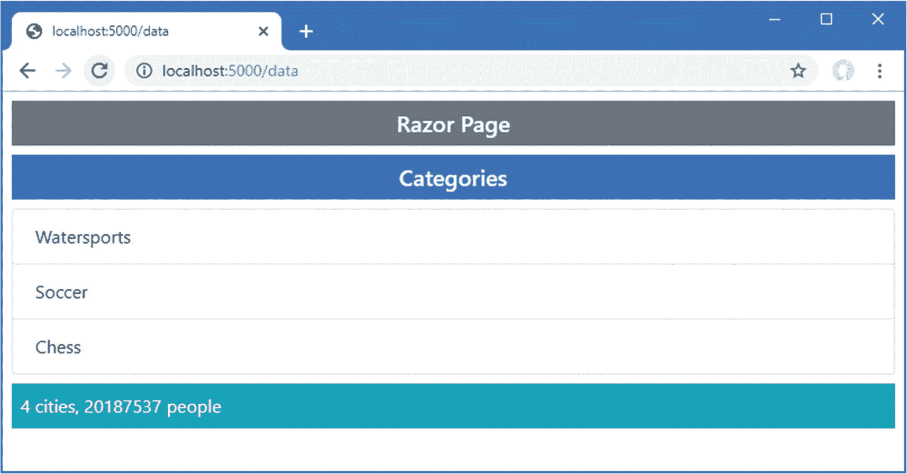

# 二十四、使用视图组件

我在本章中描述了*视图组件*，它们是提供动作风格逻辑来支持局部视图的类；这意味着视图组件提供嵌入视图的复杂内容，同时允许支持它的 C# 代码易于维护。表 [24-1](#Tab1) 将视图组件放在上下文中。

表 24-1。

将视图组件放入上下文中

<colgroup><col class="tcol1 align-left"> <col class="tcol2 align-left"></colgroup> 
| 

问题

 | 

回答

 |
| --- | --- |
| 它们是什么？ | 视图组件是提供应用逻辑的类，以支持局部视图或将 HTML 或 JSON 数据的小片段注入父视图。 |
| 它们为什么有用？ | 如果没有视图组件，就很难以易于维护的方式创建嵌入式功能，如购物篮或登录面板。 |
| 它们是如何使用的？ | 视图组件通常派生自`ViewComponent`类，并使用定制的`vc` HTML 元素或`@await Component.InvokeAsync`表达式应用于父视图。 |
| 有什么陷阱或限制吗？ | 视图组件是一个简单且可预测的特性。主要的缺陷是没有使用它们，并试图在难以测试和维护的视图中包含应用逻辑。 |
| 有其他选择吗？ | 您可以将数据访问和处理逻辑直接放在局部视图中，但是结果很难处理和维护。 |

表 [24-2](#Tab2) 总结了本章内容。

表 24-2。

章节总结

<colgroup><col class="tcol1 align-left"> <col class="tcol2 align-left"> <col class="tcol3 align-left"></colgroup> 
| 

问题

 | 

解决办法

 | 

列表

 |
| --- | --- | --- |
| 创建可重用的代码和内容单元 | 定义视图组件 | 7–13 |
| 从视图组件创建响应 | 使用其中一个`IViewComponentResult`实现类 | 14–18 |
| 获取上下文数据 | 使用从基类继承的属性或使用`Invoke`或`InvokeAsync`方法的参数 | 19–23 |
| 异步生成视图组件响应 | 覆盖`InvokeAsync`方法 | 24–26 |
| 将视图组件集成到另一个端点 | 创建混合控制器或 Razor 页面 | 27–34 |

## 为本章做准备

本章使用了第 23 章[中的 WebApp 项目。为了准备本章，在`WebApp/Models`文件夹中添加一个名为`City.cs`的类文件，其内容如清单](23.html) [24-1](#PC1) 所示。

Tip

你可以从 [`https://github.com/apress/pro-asp.net-core-3`](https://github.com/apress/pro-asp.net-core-3) 下载本章以及本书其他章节的示例项目。如果在运行示例时遇到问题，请参见第 [1](01.html) 章获取帮助。

```cs
namespace WebApp.Models {

    public class City {
        public string Name { get; set; }
        public string Country { get; set; }
        public int Population { get; set; }
    }
}

Listing 24-1.The Contents of the City.cs File in the Models Folder

```

将名为`CitiesData.cs`的类添加到`WebApp/Models`文件夹中，内容如清单 [24-2](#PC2) 所示。

```cs
using System.Collections.Generic;

namespace WebApp.Models {

    public class CitiesData {

        private List<City> cities = new List<City> {
            new City { Name = "London", Country = "UK", Population = 8539000},
            new City { Name = "New York", Country = "USA", Population = 8406000 },
            new City { Name = "San Jose", Country = "USA", Population = 998537 },
            new City { Name = "Paris", Country = "France", Population = 2244000 }
        };

        public IEnumerable<City> Cities => cities;

        public void AddCity(City newCity) {
            cities.Add(newCity);
        }
    }
}

Listing 24-2.The Contents of the CitiesData.cs File in the WebApp/Models Folder

```

`CitiesData`类提供了对`City`对象集合的访问，并提供了一个向集合中添加新对象的`AddCity`方法。将清单 [24-3](#PC3) 中所示的语句添加到`Startup`类的`ConfigureServices`方法中，为`CitiesData`类创建一个服务。

```cs
using System;
using System.Collections.Generic;
using System.Linq;
using Microsoft.AspNetCore.Builder;
using Microsoft.Extensions.DependencyInjection;
using Microsoft.Extensions.Configuration;
using Microsoft.EntityFrameworkCore;
using WebApp.Models;
using Microsoft.AspNetCore.Mvc.RazorPages;

namespace WebApp {
    public class Startup {

        public Startup(IConfiguration config) {
            Configuration = config;
        }

        public IConfiguration Configuration { get; set; }

        public void ConfigureServices(IServiceCollection services) {
            services.AddDbContext<DataContext>(opts => {
                opts.UseSqlServer(Configuration[
                    "ConnectionStrings:ProductConnection"]);
                opts.EnableSensitiveDataLogging(true);
            });
            services.AddControllersWithViews().AddRazorRuntimeCompilation();
            services.AddRazorPages().AddRazorRuntimeCompilation();

            services.AddDistributedMemoryCache();
            services.AddSession(options => {
                options.Cookie.IsEssential = true;
            });

            services.Configure<RazorPagesOptions>(opts => {
                opts.Conventions.AddPageRoute("/Index", "/extra/page/{id:long?}");
            });

            services.AddSingleton<CitiesData>();
        }

        public void Configure(IApplicationBuilder app, DataContext context) {
            app.UseDeveloperExceptionPage();
            app.UseStaticFiles();
            app.UseSession();
            app.UseRouting();
            app.UseEndpoints(endpoints => {
                endpoints.MapControllers();
                endpoints.MapDefaultControllerRoute();
                endpoints.MapRazorPages();
            });
            SeedData.SeedDatabase(context);
        }
    }
}

Listing 24-3.Defining a Service in the Startup.cs File in the WebApp Folder

```

新语句使用`AddSingleton`方法创建一个`CitiesData`服务。在这个服务中没有接口/实现分离，我创建它是为了方便地分发一个共享的`CitiesData`对象。在`WebApp/Pages`文件夹中添加一个名为`Cities.cshtml`的 Razor 页面，并添加清单 [24-4](#PC4) 中所示的内容。

```cs
@page
@inject CitiesData Data

<div class="m-2">
    <table class="table table-sm table-striped table-bordered">
        <tbody>
            @foreach (City c in Data.Cities) {
                <tr>
                    <td>@c.Name</td>
                    <td>@c.Country</td>
                    <td>@c.Population</td>
                </tr>
            }
        </tbody>
    </table>
</div>

Listing 24-4.The Contents of the Cities.cshtml File in the Pages Folder

```

### 正在删除数据库

打开一个新的 PowerShell 命令提示符，导航到包含`WebApp.csproj`文件的文件夹，运行清单 [24-5](#PC5) 中所示的命令来删除数据库。

```cs
dotnet ef database drop --force

Listing 24-5.Dropping the Database

```

### 运行示例应用

从 Debug 菜单中选择 Start Without Debugging 或 Run Without Debugging，或者使用 PowerShell 命令提示符运行清单 [24-6](#PC6) 中所示的命令。

```cs
dotnet run

Listing 24-6.Running the Example Application

```

数据库将作为应用启动的一部分被植入。一旦 ASP.NET Core 正在运行，使用 web 浏览器请求`http://localhost:5000/cities`，这将产生如图 [24-1](#Fig1) 所示的响应。


图 24-1。

运行示例应用

## 了解视图组件

应用通常需要在视图中嵌入与应用的主要目的无关的内容。常见的例子包括站点导航工具和认证面板，让用户无需访问单独的页面即可登录。

这种类型特性的数据不是从动作方法或页面模型传递到视图的模型数据的一部分。正是因为这个原因，我在示例项目中创建了两个数据源:我将显示一些使用`City`数据生成的内容，这在一个从实体框架核心存储库及其包含的产品、类别和供应商对象接收数据的视图中不容易做到。

部分视图用于创建视图中所需的可重用标记，避免了在应用的多个位置复制相同内容的需要。局部视图是一个有用的特性，但是它们只包含 HTML 和 Razor 指令的片段，它们操作的数据是从父视图接收的。如果您需要显示不同的数据，那么就会遇到问题。您可以直接从局部视图中访问您需要的数据，但是这破坏了开发模型，并且产生了难以理解和维护的应用。或者，您可以扩展应用使用的视图模型，以便它包含您需要的数据，但是这意味着您必须更改每个操作方法，这使得很难隔离操作方法的功能以进行有效的维护和测试。

这就是视图组件的用武之地。视图组件是一个 C# 类，它独立于操作方法或 Razor 页面，为局部视图提供所需的数据。在这方面，视图组件可以被认为是一个专门的动作或页面，但它仅用于提供带有数据的局部视图；它不能接收 HTTP 请求，它提供的内容将总是包含在父视图中。

## 创建和使用视图组件

视图组件是名称以`ViewComponent`结尾并定义了`Invoke`或`InvokeAsync`方法的任何类，或者是从`ViewComponent`基类派生的或用`ViewComponent`属性修饰的任何类。我在“获取上下文数据”一节中演示了属性的用法，但是本章中的其他示例依赖于基类。

可以在项目中的任何地方定义视图组件，但是惯例是将它们分组到一个名为`Components`的文件夹中。创建`WebApp/Components`文件夹，并在其中添加一个名为`CitySummary.cs`的类文件，其内容如清单 [24-7](#PC7) 所示。

```cs
using Microsoft.AspNetCore.Mvc;
using System.Linq;
using WebApp.Models;

namespace WebApp.Components {

    public class CitySummary: ViewComponent {
        private CitiesData data;

        public CitySummary(CitiesData cdata) {
            data = cdata;
        }

        public string Invoke() {
            return $"{data.Cities.Count()} cities, "
            + $"{data.Cities.Sum(c => c.Population)} people";
        }
    }
}

Listing 24-7.The Contents of the CitySummary.cs File in the Components Folder

```

视图组件可以利用依赖注入来接收它们需要的服务。在本例中，视图组件声明了对`CitiesData`类的依赖，然后在`Invoke`方法中使用它来创建包含城市数量和人口总数的`string`。

### 应用视图组件

视图组件有两种不同的应用方式。第一种技术是使用添加到从视图和 Razor 页面生成的 C# 类中的`Component`属性。该属性返回一个实现了`IViewComponentHelper`接口的对象，该接口提供了`InvokeAsync`方法。清单 [24-8](#PC8) 使用这种技术来应用`Views/Home`文件夹中的`Index.cshtml`文件中的视图组件。

```cs
@model Product
@{
    Layout = "_Layout";
    ViewBag.Title = ViewBag.Title ?? "Product Table";
}

@section Header { Product Information }

<tr><th>Name</th><td>@Model.Name</td></tr>
<tr>
    <th>Price</th>
    <td>@Model.Price.ToString("c")</td>
</tr>
<tr><th>Category ID</th><td>@Model.CategoryId</td></tr>

@section Footer {
    @(((Model.Price / ViewBag.AveragePrice)
        * 100).ToString("F2"))% of average price
}

@section Summary {
    <div class="bg-info text-white m-2 p-2">
        @await Component.InvokeAsync("CitySummary")
    </div>
}

Listing 24-8.Using a View Component in the Index.cshtml File in the Views/Index Folder

```

使用`Component.InvokeAsync`方法应用视图组件，使用视图组件类的名称作为参数。这种技术的语法可能会令人困惑。视图组件类定义了一个`Invoke`或`InvokeAsync`方法，这取决于它们的工作是同步执行还是异步执行。但是总是使用`Component.InvokeAsync`方法，甚至应用定义了`Invoke`方法的视图组件，并且其操作是完全同步的。

为了将视图组件的名称空间添加到包含在视图中的列表中，我将清单 [24-9](#PC9) 中所示的语句添加到了`Views`文件夹中的`_ViewImports.json`文件中。

```cs
@using WebApp.Models
@addTagHelper *, Microsoft.AspNetCore.Mvc.TagHelpers
@using WebApp.Components

Listing 24-9.Adding a Namespace in the _ViewImports.json File in the Views Folder

```

重启 ASP.NET Core，用浏览器请求`http://localhost:5000/home/index/1`，会产生如图 [24-2](#Fig2) 所示的结果。


图 24-2。

使用视图组件

#### 使用标签助手应用视图组件

Razor 视图和页面可以包含标记帮助器，这些标记帮助器是由 C# 类管理的自定义 HTML 元素。我会在第 25 章[详细解释标签助手是如何工作的，但是视图组件可以使用一个 HTML 元素来应用，这个元素是作为标签助手来实现的。要启用这个特性，将清单](25.html) [24-10](#PC10) 中所示的指令添加到`Views`文件夹中的`_ViewImports.cshtml`文件中。

Note

视图组件只能在控制器视图或 Razor 页面中使用，不能用于直接处理请求。

```cs
@using WebApp.Models
@addTagHelper *, Microsoft.AspNetCore.Mvc.TagHelpers
@using WebApp.Components
@addTagHelper *, WebApp

Listing 24-10.Configuring a Tag Helper in the _ViewImports.cshtml File in the Views Folder

```

新指令为示例项目添加了标记助手支持，该支持由名称指定。(您必须将`WebApp`改为项目的名称。)在清单 [24-11](#PC11) 中，我使用了定制的 HTML 元素来应用视图组件。

```cs
@model Product
@{
    Layout = "_Layout";
    ViewBag.Title = ViewBag.Title ?? "Product Table";
}

@section Header { Product Information }

<tr><th>Name</th><td>@Model.Name</td></tr>
<tr>
    <th>Price</th>
    <td>@Model.Price.ToString("c")</td>
</tr>
<tr><th>Category ID</th><td>@Model.CategoryId</td></tr>

@section Footer {
    @(((Model.Price / ViewBag.AveragePrice)
        * 100).ToString("F2"))% of average price
}

@section Summary {
    <div class="bg-info text-white m-2 p-2">
        <vc:city-summary />
    </div>
}

Listing 24-11.Applying a View Component in the Index.cshtml File in the Views/Home Folder

```

定制元素的标签是`vc`，后面是一个冒号，后面是视图组件类的名称，它被转换成 kebab-case。类名中的每个大写单词都被转换成小写，并用连字符隔开，这样`CitySummary`就变成了`city-summary`，并且使用`vc:city-summary`元素应用了`CitySummary`视图组件。

#### 在 Razor 页面中应用视图组件

Razor 页面以同样的方式使用视图组件，要么通过`Component`属性，要么通过定制的 HTML 元素。因为 Razor 页面有自己的视图导入文件，所以需要一个单独的`@addTagHelper`指令，如清单 [24-12](#PC12) 所示。

```cs
@namespace WebApp.Pages
@using WebApp.Models
@addTagHelper *, Microsoft.AspNetCore.Mvc.TagHelpers
@addTagHelper *, WebApp

Listing 24-12.Adding a Directive in the _ViewImports.cshtml File in the Pages Folder

```

清单 [24-13](#PC13) 将`CitySummary`视图组件应用到`Data`页面。

```cs
@page
@inject DataContext context;

<h5 class="bg-primary text-white text-center m-2 p-2">Categories</h5>
<ul class="list-group m-2">
    @foreach (Category c in context.Categories) {
        <li class="list-group-item">@c.Name</li>
    }
</ul>

<div class="bg-info text-white m-2 p-2">
    <vc:city-summary />
</div>

Listing 24-13.Using a View Component in the Data.cshtml File in the Pages Folder

```

使用浏览器请求`http://localhost:5000/data`，您将会看到如图 [24-3](#Fig3) 所示的响应，其中显示了城市数据以及数据库中的类别。



图 24-3。

在 Razor 页面中使用视图组件

## 了解视图组件结果

将简单的字符串值插入视图或页面的能力并不是特别有用，但幸运的是，视图组件有更多的能力。更复杂的效果可以通过让`Invoke`或`InvokeAsync`方法返回一个实现`IViewComponentResult`接口的对象来实现。有三个实现`IViewComponentResult`接口的内置类，它们在表 [24-3](#Tab3) 中描述，以及由`ViewComponent`基类提供的创建它们的方便方法。在接下来的小节中，我将描述每种结果类型的用法。

表 24-3。

内置的 IViewComponentResult 实现类

<colgroup><col class="tcol1 align-left"> <col class="tcol2 align-left"></colgroup> 
| 

名字

 | 

描述

 |
| --- | --- |
| `ViewViewComponentResult` | 这个类用于指定 Razor 视图，带有可选的视图模型数据。这个类的实例是使用`View`方法创建的。 |
| `ContentViewComponentResult` | 该类用于指定一个文本结果，该结果将被安全地编码以包含在 HTML 文档中。这个类的实例是使用`Content`方法创建的。 |
| `HtmlContentViewComponentResult` | 这个类用于指定一个 HTML 片段，该片段将包含在 HTML 文档中，无需进一步编码。没有`ViewComponent`方法来创建这种类型的结果。 |

有两种结果类型的特殊处理。如果一个视图组件返回一个`string`，那么它被用来创建一个`ContentViewComponentResult`对象，这就是我在前面的例子中所依赖的。如果一个视图组件返回一个`IHtmlContent`对象，那么它被用来创建一个`HtmlContentViewComponentResult`对象。

### 返回局部视图

最有用的响应是笨拙地命名的`ViewViewComponentResult`对象，它告诉 Razor 呈现部分视图并将结果包含在父视图中。`ViewComponent`基类提供了创建`ViewViewComponentResult`对象的`View`方法，该方法有四个版本，如表 [24-4](#Tab4) 所述。

表 24-4。

视图组件。查看方法

<colgroup><col class="tcol1 align-left"> <col class="tcol2 align-left"></colgroup> 
| 

名字

 | 

描述

 |
| --- | --- |
| `View()` | 使用此方法为视图组件选择默认视图，但不提供视图模型。 |
| `View(model)` | 使用方法选择默认视图，并将指定的对象用作视图模型。 |
| `View(viewName)` | 使用此方法选择指定的视图，但不提供视图模型。 |
| `View(viewName, model)` | 使用此方法选择指定的视图，并将指定的对象用作视图模型。 |

这些方法对应于那些由`Controller`基类提供的方法，并且以几乎相同的方式使用。为了创建一个视图组件可以使用的视图模型类，添加一个名为`CityViewModel.cs`的类文件到`WebApp/Models`文件夹，并使用它来定义清单 [24-14](#PC14) 中所示的类。

```cs
namespace WebApp.Models {

    public class CityViewModel {
        public int Cities { get; set; }
        public int Population { get; set; }
    }
}

Listing 24-14.The Contents of the CityViewModel.cs File in the Models Folder

```

清单 [24-15](#PC15) 修改了`CitySummary`视图组件的`Invoke`方法，因此它使用`View`方法选择局部视图，并使用`CityViewModel`对象提供视图数据。

```cs
using Microsoft.AspNetCore.Mvc;
using System.Linq;
using WebApp.Models;

namespace WebApp.Components {

    public class CitySummary: ViewComponent {
        private CitiesData data;

        public CitySummary(CitiesData cdata) {
            data = cdata;
        }

        public IViewComponentResult Invoke() {
            return View(new CityViewModel {
                Cities = data.Cities.Count(),
                Population = data.Cities.Sum(c => c.Population)
            });
        }
    }
}

Listing 24-15.Selecting a View in the CitySummary.cs File in the Components Folder

```

视图组件当前没有可用的视图，但由此产生的错误消息揭示了所搜索的位置。重启 ASP.NET Core 并使用浏览器请求`http://localhost:5000/home/index/1`查看当视图组件与控制器一起使用时所搜索的位置。当视图组件与 Razor 页面一起使用时，请求`http://localhost:5000/data`查看搜索到的位置。图 [24-4](#Fig4) 显示了两种响应。


图 24-4。

视图零部件视图的搜索位置

当视图组件在没有指定名称的情况下调用`View`方法时，Razor 搜索名为`Default.cshtml`的视图。如果视图组件与控制器一起使用，则搜索位置如下:

*   `/Views/[controller]/Components/[viewcomponent]/Default.cshtml`

*   `/Views/Shared/Components/[viewcomponent]/Default.cshtml`

*   `/Pages/Shared/Components/[viewcomponent]/Default.cshtml`

当`CitySummary`组件被通过`Home`控制器选择的视图渲染时，例如`[controller]`是`Home`,`[viewcomponent]`是`CitySummary`，这意味着第一个搜索位置是`/Views/Home/Components/CitySummary/Default.cshtml`。如果视图组件与 Razor 页面一起使用，则搜索位置如下:

*   `/Pages/Components/[viewcomponent]/Default.cshtml`

*   `/Pages/Shared/Components/[viewcomponent]/Default.cshtml`

*   `/Views/Shared/Components/[viewcomponent]/Default.cshtml`

如果 Razor 页面的搜索路径不包括页面名称，但是在子文件夹中定义了 Razor 页面，那么 Razor 视图引擎将在相对于定义 Razor 页面的位置的`Components/[viewcomponent]`文件夹中寻找视图，沿着文件夹层次向上工作，直到找到视图或到达`Pages`文件夹。

Tip

注意，Razor 页面中使用的视图组件将找到在`Views/Shared/Components`文件夹中定义的视图，而控制器中定义的视图组件将找到在`Pages/Shared/Components`文件夹中的视图。这意味着当控制器和 Razor 页面使用视图组件时，您不必复制视图。

创建`WebApp/Views/Shared/Components/CitySummary`文件夹并添加一个名为`Default.cshtml`的 Razor 视图，内容如清单 [24-16](#PC16) 所示。

```cs
@model CityViewModel

<table class="table table-sm table-bordered text-white bg-secondary">
    <thead>
        <tr><th colspan="2">Cities Summary</th></tr>
    </thead>
    <tbody>
        <tr>
            <td>Cities:</td>
            <td class="text-right">
                @Model.Cities
            </td>
        </tr>
        <tr>
            <td>Population:</td>
            <td class="text-right">
                @Model.Population.ToString("#,###")
            </td>
        </tr>
    </tbody>
</table>

Listing 24-16.The Default.cshtml File in the Views/Shared/Components/CitySummary Folder

```

视图组件的视图类似于局部视图，并使用`@model`指令来设置视图模型对象的类型。该视图从其视图组件接收一个`CityViewModel`对象，用于填充 HTML 表格中的单元格。使用浏览器请求`http://localhost:5000/home/index/1`和`http://localhost:5000/data`，你会看到视图被合并到响应中，如图 [24-5](#Fig5) 所示。


图 24-5。

使用带有视图组件的视图

### 返回 HTML 片段

`ContentViewComponentResult`类用于在父视图中包含 HTML 片段，而不使用视图。使用从接受一个`string`值的`ViewComponent`基类继承的`Content`方法创建`ContentViewComponentResult`类的实例。清单 [24-17](#PC17) 展示了`Content`方法的使用。

Tip

除了`Content`方法之外，`Invoke`方法还可以返回一个`string`，它会自动转换成一个`ContentViewComponentResult`。这是我在视图组件第一次被定义时采用的方法。

```cs
using Microsoft.AspNetCore.Mvc;
using System.Linq;
using WebApp.Models;

namespace WebApp.Components {

    public class CitySummary: ViewComponent {
        private CitiesData data;

        public CitySummary(CitiesData cdata) {
            data = cdata;
        }

        public IViewComponentResult Invoke() {
            return Content("This is a <h3><i>string</i></h3>");
        }
    }
}

Listing 24-17.Using the Content Method in the CitySummary.cs File in the Components Folder

```

由`Content`方法接收的字符串被编码，使其可以安全地包含在 HTML 文档中。这在处理由用户或外部系统提供的内容时尤其重要，因为它可以防止 JavaScript 内容嵌入到应用生成的 HTML 中。

在这个例子中，我传递给`Content`方法的`string`包含一些基本的 HTML 标签。重启 ASP.NET Core 并使用浏览器请求`http://localhost:5000/home/index/1`。响应将包括编码的 HTML 片段，如图 [24-6](#Fig6) 所示。


图 24-6。

使用视图组件返回编码的 HTML 片段

如果您查看视图组件生成的 HTML，您会看到尖括号已被替换，这样浏览器就不会将内容解释为 HTML 元素，如下所示:

```cs
...
<div class="bg-info text-white m-2 p-2">
    This is a <h3><i>string</i></h3>
</div>
...

```

如果您信任内容的来源并希望它被解释为 HTML，那么您不需要对内容进行编码。`Content`方法总是对其参数进行编码，因此您必须直接创建`HtmlContentViewComponentResult`对象，并为其构造函数提供一个`HtmlString`对象，该对象代表一个您知道可以安全显示的字符串，因为它来自您信任的来源，或者因为您确信它已经被编码，如清单 [24-18](#PC19) 所示。

```cs
using Microsoft.AspNetCore.Mvc;
using System.Linq;
using WebApp.Models;
using Microsoft.AspNetCore.Mvc.ViewComponents;
using Microsoft.AspNetCore.Html;

namespace WebApp.Components {

    public class CitySummary: ViewComponent {
        private CitiesData data;

        public CitySummary(CitiesData cdata) {
            data = cdata;
        }

        public IViewComponentResult Invoke() {
            return new HtmlContentViewComponentResult(
                new HtmlString("This is a <h3><i>string</i></h3>"));
        }
    }
}

Listing 24-18.Returning an HTML Fragment in the CitySummary.cs File in the Components Folder

```

这种技术应该谨慎使用，并且只能用于不能被篡改并且执行自己的编码的内容源。重启 ASP.NET Core，使用浏览器请求`http://localhost:5000/home/index/1`，你会看到响应没有被编码，而是被解释为 HTML 元素，如图 [24-7](#Fig7) 所示。


图 24-7。

使用视图组件返回未编码的 HTML 片段

## 获取上下文数据

有关当前请求和父视图的详细信息通过由`ViewComponent`基类定义的属性提供给视图组件，如表 [24-5](#Tab5) 中所述。

表 24-5。

ViewComponentContext 属性

<colgroup><col class="tcol1 align-left"> <col class="tcol2 align-left"></colgroup> 
| 

名字

 | 

描述

 |
| --- | --- |
| `HttpContext` | 该属性返回一个描述当前请求和正在准备的响应的`HttpContext`对象。 |
| `Request` | 该属性返回一个描述当前 HTTP 请求的`HttpRequest`对象。 |
| `User` | 该属性返回一个描述当前用户的`IPrincipal`对象，如章节 [37](37.html) 和 [38](38.html) 所述。 |
| `RouteData` | 该属性返回一个描述当前请求的路由数据的`RouteData`对象。 |
| `ViewBag` | 该属性返回`dynamic`视图包对象，该对象可用于在视图组件和视图之间传递数据，如第 [22 章](22.html)所述。 |
| `ModelState` | 该属性返回一个`ModelStateDictionary`，它提供了模型绑定过程的细节，如第 [29 章](29.html)所述。 |
| `ViewData` | 该属性返回一个`ViewDataDictionary`，它提供对视图组件的视图数据的访问。 |

可以以任何方式使用上下文数据来帮助视图组件完成工作，包括改变选择数据的方式或呈现不同的内容或视图。很难设计出一个在视图组件中使用上下文数据的典型例子，因为它解决的问题是特定于每个项目的。在清单 [24-19](#PC20) 中，我检查了请求的路由数据，以确定路由模式是否包含控制器段变量，该变量表示将由控制器和视图处理的请求。

```cs
using Microsoft.AspNetCore.Mvc;
using System.Linq;
using WebApp.Models;
using Microsoft.AspNetCore.Mvc.ViewComponents;
using Microsoft.AspNetCore.Html;

namespace WebApp.Components {

    public class CitySummary: ViewComponent {
        private CitiesData data;

        public CitySummary(CitiesData cdata) {
            data = cdata;
        }

        public string Invoke() {
            if (RouteData.Values["controller"] != null) {
                return "Controller Request";
            } else {
                return "Razor Page Request";
            }
        }
    }
}

Listing 24-19.Using Request Data in the CitySummary.cs File in the Components Folder

```

重启 ASP.NET Core，用浏览器请求`http://localhost:5000/home/index/1`和`http://localhost:5000/data`，你会看到视图组件改变了它的输出，如图 [24-8](#Fig8) 所示。


图 24-8。

在视图组件中使用上下文数据

### 使用参数从父视图提供上下文

父视图可以为视图组件提供额外的上下文数据，为它们提供关于应该生成的内容的数据或指导。通过`Invoke`或`InvokeAsync`方法接收上下文数据，如清单 [24-20](#PC21) 所示。

```cs
using Microsoft.AspNetCore.Mvc;
using System.Linq;
using WebApp.Models;
using Microsoft.AspNetCore.Mvc.ViewComponents;
using Microsoft.AspNetCore.Html;

namespace WebApp.Components {

    public class CitySummary: ViewComponent {
        private CitiesData data;

        public CitySummary(CitiesData cdata) {
            data = cdata;
        }

        public IViewComponentResult Invoke(string themeName) {
            ViewBag.Theme = themeName;

            return View(new CityViewModel {
                Cities = data.Cities.Count(),
                Population = data.Cities.Sum(c => c.Population)
            });
        }
    }
}

Listing 24-20.Receiving a Value in the CitySummary.cs File in the Components Folder

```

`Invoke`方法定义了一个`themeName`参数，该参数使用视图包传递给局部视图，这在第 [22 章](22.html)中有描述。清单 [24-21](#PC22) 更新了`Default`视图，使用接收到的值来样式化它生成的内容。

```cs
@model CityViewModel

<table class="table table-sm table-bordered text-white bg-@ViewBag.Theme">
    <thead>
        <tr><th colspan="2">Cities Summary</th></tr>
    </thead>
    <tbody>
        <tr>
            <td>Cities:</td>
            <td class="text-right">
                @Model.Cities
            </td>
        </tr>
        <tr>
            <td>Population:</td>
            <td class="text-right">
                @Model.Population.ToString("#,###")
            </td>
        </tr>
    </tbody>
</table>

Listing 24-21.Styling Content in the Default.cshtml File in the Views/Shared/Components/CitySummary Folder

```

必须始终提供由视图组件的`Invoke`或`InvokeAsync`方法定义的所有参数的值。列表 [24-22](#PC23) 为`Home`控制器选择的视图中的`themeName`参数提供一个值。

Tip

如果没有为视图组件定义的所有参数提供值，则不会使用该组件，但不会显示错误消息。如果您没有从视图组件中看到任何内容，那么可能的原因是缺少参数值。

```cs
@model Product
@{
    Layout = "_Layout";
    ViewBag.Title = ViewBag.Title ?? "Product Table";
}

@section Header { Product Information }

<tr><th>Name</th><td>@Model.Name</td></tr>
<tr>
    <th>Price</th>
    <td>@Model.Price.ToString("c")</td>
</tr>
<tr><th>Category ID</th><td>@Model.CategoryId</td></tr>

@section Footer {
    @(((Model.Price / ViewBag.AveragePrice)
        * 100).ToString("F2"))% of average price
}

@section Summary {
    <div class="bg-info text-white m-2 p-2">
        <vc:city-summary theme-name="secondary" />
    </div>
}

Listing 24-22.Supplying a Value in the Index.cshtml File in the Views/Home Folder

```

每个参数的名称用 kebab-case 表示为一个属性，因此,`theme-name`属性为`themeName`参数提供一个值。清单 [24-23](#PC24) 在`Data.cshtml` Razor 页面中设置一个值。

```cs
@page
@inject DataContext context;

<h5 class="bg-primary text-white text-center m-2 p-2">Categories</h5>
<ul class="list-group m-2">
    @foreach (Category c in context.Categories) {
        <li class="list-group-item">@c.Name</li>
    }
</ul>

<div class="bg-info text-white m-2 p-2">
    <vc:city-summary theme-name="danger" />
</div>

Listing 24-23.Supplying a Value in the Data.cshtml File in the Pages Folder

```

重启 ASP.NET Core 并使用浏览器请求`http://localhost:5000/home/index/1`和`http://localhost:5000/data`。视图组件为`themeName`参数提供不同的值，产生如图 [24-9](#Fig9) 所示的响应。


图 24-9。

在视图组件中使用上下文数据

Providing Values Using the Component Helper

如果您喜欢使用`Component.InvokeAsync`助手来应用视图组件，那么您可以使用方法参数来提供上下文，如下所示:

```cs
...
<div class="bg-info text-white m-2 p-2">
    @await Component.InvokeAsync("CitySummary", new { themeName = "danger" })
</div>
...

```

方法的第一个参数是视图组件类的名称。第二个参数是一个对象，其名称对应于视图组件定义的参数。

### 创建异步视图组件

到目前为止，本章中的所有例子都是同步视图组件，它们可以被识别，因为它们定义了`Invoke`方法。如果您的视图组件依赖于异步 API，那么您可以通过定义一个返回`Task`的`InvokeAsync`方法来创建一个异步视图组件。当 Razor 从`InvokeAsync`方法接收到`Task`时，它将等待它完成，然后将结果插入主视图。要创建一个新的组件，将名为`PageSize.cs`的类文件添加到`Components`文件夹中，并使用它来定义清单 [24-24](#PC26) 中所示的类。

```cs
using Microsoft.AspNetCore.Mvc;
using System.Net.Http;
using System.Threading.Tasks;

namespace WebApp.Components {

    public class PageSize : ViewComponent {

        public async Task<IViewComponentResult> InvokeAsync() {
            HttpClient client = new HttpClient();
            HttpResponseMessage response
                = await client.GetAsync("http://apress.com");
            return View(response.Content.Headers.ContentLength);
        }
    }
}

Listing 24-24.The Contents of the PageSize.cs File in the Components Folder

```

`InvokeAsync`方法使用`async`和`await`关键字来消费`HttpClient`类提供的异步 API，并通过向 Apress.com 发送 get 请求来获取返回内容的长度。长度被传递给`View`方法，该方法选择与视图组件相关联的默认局部视图。

创建`Views/Shared/Components/PageSize`文件夹并添加一个名为`Default.cshtml`的 Razor 视图，内容如清单 [24-25](#PC27) 所示。

```cs
@model long
<div class="m-1 p-1 bg-light text-dark">Page size: @Model</div>

Listing 24-25.The Contents of the Default.cshtml File in the Views/Shared/Components/PageSize Folder

```

最后一步是使用组件，我已经在`Home`控制器使用的`Index`视图中完成了，如清单 [24-26](#PC28) 所示。异步视图组件的使用方式不需要改变。

```cs
@model Product
@{
    Layout = "_Layout";
    ViewBag.Title = ViewBag.Title ?? "Product Table";
}

@section Header { Product Information }

<tr><th>Name</th><td>@Model.Name</td></tr>
<tr>
    <th>Price</th>
    <td>@Model.Price.ToString("c")</td>
</tr>
<tr><th>Category ID</th><td>@Model.CategoryId</td></tr>

@section Footer {
    @(((Model.Price / ViewBag.AveragePrice)
        * 100).ToString("F2"))% of average price
}

@section Summary {
    <div class="bg-info text-white m-2 p-2">
        <vc:city-summary theme-name="secondary" />
        <vc:page-size />
    </div>
}

Listing 24-26.Using an Asynchronous Component in the Index.cshtml File in the Views/Home Folder

```

重启 ASP.NET Core，用浏览器请求`http://localhost:5000/home/index/1`，会产生一个包含 Apress.com 主页大小的响应，如图 [24-10](#Fig10) 所示。由于 press 网站经常更新，您可能会看到不同的显示号码。

Note

当需要创建几个不同的内容区域时，异步视图组件非常有用，每个区域都可以并发执行。直到所有的内容都准备好了，响应才被发送到浏览器。如果您想动态更新呈现给用户的内容，那么您可以使用 Blazor，如第 4 部分所述。


图 24-10。

使用异步组件

## 创建视图组件类

视图组件通常提供由控制器或 Razor 页面深入处理的功能的摘要或快照。例如，对于汇总购物篮的视图组件，通常会有一个链接指向一个控制器，该控制器提供购物篮中产品的详细列表，可用于结帐和完成购买。

在这种情况下，您可以创建一个既是视图组件又是控制器或 Razor 页面的类。如果您使用的是 Visual Studio，请在解决方案资源管理器中展开`Cities.cshtml`项以显示`Cities.cshtml.cs`文件，并用清单 [24-27](#PC29) 中显示的内容替换其内容。如果您使用的是 Visual Studio 代码，将一个名为`Cities.cshtml.cs`的文件添加到`Pages`文件夹中，其内容如清单 [24-27](#PC29) 所示。

```cs
using System.Linq;
using Microsoft.AspNetCore.Mvc;
using Microsoft.AspNetCore.Mvc.RazorPages;
using Microsoft.AspNetCore.Mvc.ViewComponents;
using Microsoft.AspNetCore.Mvc.ViewFeatures;
using WebApp.Models;

namespace WebApp.Pages {

    [ViewComponent(Name = "CitiesPageHybrid")]
    public class CitiesModel : PageModel {

        public CitiesModel(CitiesData cdata) {
            Data = cdata;
        }

        public CitiesData Data { get; set; }

        [ViewComponentContext]
        public ViewComponentContext Context { get; set; }

        public IViewComponentResult Invoke() {
            return new ViewViewComponentResult() {
                ViewData = new ViewDataDictionary<CityViewModel>(
                    Context.ViewData,
                    new CityViewModel {
                        Cities = Data.Cities.Count(),
                        Population = Data.Cities.Sum(c => c.Population)
                    })
            };
        }
    }
}

Listing 24-27.The Contents of the Cities.cshtml.cs File in the Pages Folder

```

这个页面模型类是用`ViewComponent`属性修饰的，这允许它被用作视图组件。`Name`参数指定了视图组件将被应用的名称。由于页面模型不能从`ViewComponent`基类继承，类型为`ViewComponentContext`的属性用`ViewComponentContext`属性修饰，这表明在调用`Invoke`或`InvokeAsync`方法之前，应该给它分配一个定义表 [24-5](#Tab5) 中描述的属性的对象。`View`方法不可用，所以我必须创建一个`ViewViewComponentResult`对象，它依赖于通过修饰属性接收的上下文对象。清单 [24-28](#PC30) 更新页面的视图部分以使用新的页面模型类。

```cs
@page
@model WebApp.Pages.CitiesModel

<div class="m-2">
    <table class="table table-sm table-striped table-bordered">
        <tbody>
            @foreach (City c in Model.Data.Cities) {
                <tr>
                    <td>@c.Name</td>
                    <td>@c.Country</td>
                    <td>@c.Population</td>
                </tr>
            }
        </tbody>
    </table>
</div>

Listing 24-28.Updating the View in the Cities.cshtml File in the Pages Folder

```

这些更改更新了指令以使用页面模型类。为了创建混合视图组件的视图，创建`Pages/Shared/Components/CitiesPageHybrid`文件夹并添加一个名为`Default.cshtml`的 Razor 视图，其内容如清单 [24-29](#PC31) 所示。

```cs
@model CityViewModel

<table class="table table-sm table-bordered text-white bg-dark">
    <thead><tr><th colspan="2">Hybrid Page Summary</th></tr></thead>
    <tbody>
        <tr>
            <td>Cities:</td>
            <td class="text-right">@Model.Cities</td>
        </tr>
        <tr>
            <td>Population:</td>
            <td class="text-right">
                @Model.Population.ToString("#,###")
            </td>
        </tr>
    </tbody>
</table>

Listing 24-29.The Default.cshtml File in the Pages/Shared/Components/CitiesPageHybrid Folder

```

清单 [24-30](#PC32) 在另一个页面中应用了混合类的视图组件部分。

```cs
@page
@inject DataContext context;

<h5 class="bg-primary text-white text-center m-2 p-2">Categories</h5>
<ul class="list-group m-2">
    @foreach (Category c in context.Categories) {
        <li class="list-group-item">@c.Name</li>
    }
</ul>

<div class="bg-info text-white m-2 p-2">
    <vc:cities-page-hybrid  />
</div>

Listing 24-30.Using a View Component in the Data.cshtml File in the Pages Folder

```

混合就像任何其他视图组件一样被应用。重启 ASP.NET Core 并请求`http://localhost:5000/cities`和`http://localhost:5000/data`。两个 URL 由同一个类处理。对于第一个 URL，该类充当页面模型；对于第二个 URL，该类充当视图组件。图 [24-11](#Fig11) 显示了两个 URL 的输出。


图 24-11。

一个混合页面模型和视图组件类

### 创建混合控制器类

同样的技术可以应用于控制器。将名为`CitiesController.cs`的类文件添加到`Controllers`文件夹中，并添加清单 [24-31](#PC33) 中所示的语句。

```cs
using Microsoft.AspNetCore.Mvc;
using Microsoft.AspNetCore.Mvc.ViewComponents;
using Microsoft.AspNetCore.Mvc.ViewFeatures;
using System.Linq;
using WebApp.Models;

namespace WebApp.Controllers {

    [ViewComponent(Name = "CitiesControllerHybrid")]
    public class CitiesController: Controller {
        private CitiesData data;

        public CitiesController(CitiesData cdata) {
            data = cdata;
        }

        public IActionResult Index() {
            return View(data.Cities);
        }

        public IViewComponentResult Invoke() {
            return new ViewViewComponentResult() {
                ViewData = new ViewDataDictionary<CityViewModel>(
                    ViewData,
                    new CityViewModel {
                        Cities = data.Cities.Count(),
                        Population = data.Cities.Sum(c => c.Population)
                    })
            };
        }
    }
}

Listing 24-31.The Contents of the CitiesController.cs File in the Controllers Folder

```

控制器实例化方式的一个奇怪之处在于，不需要用`ViewComponentContext`属性修饰的属性，从`Controller`基类继承的`ViewData`属性可以用来创建视图组件结果。

为了给动作方法提供一个视图，创建`Views/Cities`文件夹并添加一个名为`Index.cshtml`的文件，其内容如清单 [24-32](#PC34) 所示。

```cs
@model IEnumerable<City>
@{
    Layout = "_ImportantLayout";
}

<div class="m-2">
    <table class="table table-sm table-striped table-bordered">
        <tbody>
            @foreach (City c in Model) {
                <tr>
                    <td>@c.Name</td>
                    <td>@c.Country</td>
                    <td>@c.Population</td>
                </tr>
            }
        </tbody>
    </table>
</div>

Listing 24-32.The Contents of the Index.cshtml File in the Views/Cities Folder

```

为了给视图组件提供一个视图，创建`Views/Shared/Components/CitiesControllerHybrid`文件夹并添加一个名为`Default.cshtml`的 Razor 视图，其内容如清单 [24-33](#PC35) 所示。

```cs
@model CityViewModel

<table class="table table-sm table-bordered text-white bg-dark">
    <thead><tr><th colspan="2">Hybrid Controller Summary</th></tr></thead>
    <tbody>
        <tr>
            <td>Cities:</td>
            <td class="text-right">@Model.Cities</td>
        </tr>
        <tr>
            <td>Population:</td>
            <td class="text-right">
                @Model.Population.ToString("#,###")
            </td>
        </tr>
    </tbody>
</table>

Listing 24-33.The Default.cshtml File in the Views/Shared/Components/CitiesControllerHybrid Folder

```

清单 [24-34](#PC36) 在`Data.cshtml` Razor 页面中应用了混合视图组件，替换了上一节中创建的混合类。

```cs
@page
@inject DataContext context;

<h5 class="bg-primary text-white text-center m-2 p-2">Categories</h5>
<ul class="list-group m-2">
    @foreach (Category c in context.Categories) {
        <li class="list-group-item">@c.Name</li>
    }
</ul>

<div class="bg-info text-white m-2 p-2">
    <vc:cities-controller-hybrid  />
</div>

Listing 24-34.Applying the View Component in the Data.cshtml File in the Pages Folder

```

重启 ASP.NET Core 并使用浏览器请求`http://localhost:5000/cities/index`和`http://localhost:5000/data`。对于第一个 URL，清单 [24-34](#PC36) 中的类被用作控制器；对于第二个 URL，该类用作视图组件。图 [24-12](#Fig12) 显示了两个 URL 的响应。


图 24-12。

一个混合的控制器和视图组件类

## 摘要

在这一章中，我描述了视图组件特性，它允许在控制器或 Razor 页面使用的视图中包含正交特性。我解释了视图组件的工作原理和应用方式，并展示了它们产生的不同类型的结果。我已经向您展示了如何创建既是视图组件又是控制器或 Razor 页面的类，从而完成了这一章。在下一章，我将介绍标签助手。用于转换 HTML 元素。