# 二十五、使用标签助手

标签助手是 C# 类，用于转换视图或页面中的 HTML 元素。标记助手的常见用途包括使用应用的路由配置为表单生成 URL，确保特定类型的元素样式一致，以及用常用的内容片段替换自定义的速记元素。在这一章中，我将描述标签助手如何工作，以及如何创建和应用自定义标签助手。在第 [26](26.html) 章，我描述了内置的标签助手，在第 [27](27.html) 章，我使用标签助手来解释 HTML 表单是如何创建的。表 [25-1](#Tab1) 将标签助手放在上下文中。

表 25-1。

将标签助手放在上下文中

<colgroup><col class="tcol1 align-left"> <col class="tcol2 align-left"></colgroup> 
| 

问题

 | 

回答

 |
| --- | --- |
| 它们是什么？ | 标签助手是操纵 HTML 元素的类，要么以某种方式改变它们，用附加内容补充它们，要么用新内容完全替换它们。 |
| 它们为什么有用？ | 标记助手允许使用 C# 逻辑生成或转换视图内容，确保发送到客户端的 HTML 反映应用的状态。 |
| 它们是如何使用的？ | 标签助手所应用到的 HTML 元素是基于类名或使用`HTMLTargetElement`属性来选择的。当呈现一个视图时，元素由标记助手转换，并包含在发送给客户机的 HTML 中。 |
| 有什么陷阱或限制吗？ | 使用标签助手可以很容易地得到控制并生成 HTML 内容的复杂部分，这是使用视图组件更容易实现的事情，在第 [24](24.html) 章中有描述。 |
| 有其他选择吗？ | 你不必使用标签助手，但是它们使得在 ASP.NET Core 应用中生成复杂的 HTML 变得容易。 |

表 [25-2](#Tab2) 总结了本章内容。

表 25-2。

章节总结

<colgroup><col class="tcol1 align-left"> <col class="tcol2 align-left"> <col class="tcol3 align-left"></colgroup> 
| 

问题

 | 

解决办法

 | 

列表

 |
| --- | --- | --- |
| 创建标签助手 | 定义一个从`TagHelper`类派生的类 | 1–7 |
| 控制标记助手的范围 | 改变由`HtmlTargetElement`属性指定的元素范围 | 8–11 |
| 创建用内容替换的自定义 HTML 元素 | 使用速记元素 | 12, 13 |
| 以编程方式创建元素 | 使用`TagBuilder`类 | Fourteen |
| 控制内容的插入位置 | 使用前置和附加功能 | 15–18 |
| 获取上下文数据 | 使用上下文对象 | 19, 20 |
| 在视图模型或页面模型上操作 | 使用模型表达式 | 21–24 |
| 创建协调标签助手 | 使用`Items`属性 | 25–26 |
| 隐藏内容 | 使用`SuppressOutput`方法 | 27, 28 |
| 将标记助手定义为服务 | 创建标签助手组件 | 29–32 |

## 为本章做准备

本章使用了第 24 章中的 WebApp 项目。为了准备本章，用清单 [25-1](#PC1) 中的内容替换`Startup.cs`文件的内容，删除前面章节中使用的一些配置语句。

Tip

你可以从 [`https://github.com/apress/pro-asp.net-core-3`](https://github.com/apress/pro-asp.net-core-3) 下载本章以及本书其他章节的示例项目。如果在运行示例时遇到问题，请参见第 [1](01.html) 章获取帮助。

```cs
using Microsoft.AspNetCore.Builder;
using Microsoft.Extensions.DependencyInjection;
using Microsoft.Extensions.Configuration;
using Microsoft.EntityFrameworkCore;
using WebApp.Models;

namespace WebApp {
    public class Startup {

        public Startup(IConfiguration config) {
            Configuration = config;
        }

        public IConfiguration Configuration { get; set; }

        public void ConfigureServices(IServiceCollection services) {
            services.AddDbContext<DataContext>(opts => {
                opts.UseSqlServer(Configuration[
                    "ConnectionStrings:ProductConnection"]);
                opts.EnableSensitiveDataLogging(true);
            });
            services.AddControllersWithViews().AddRazorRuntimeCompilation();
            services.AddRazorPages().AddRazorRuntimeCompilation();
            services.AddSingleton<CitiesData>();
        }

        public void Configure(IApplicationBuilder app, DataContext context) {
            app.UseDeveloperExceptionPage();
            app.UseStaticFiles();
            app.UseRouting();
            app.UseEndpoints(endpoints => {
                endpoints.MapControllers();
                endpoints.MapDefaultControllerRoute();
                endpoints.MapRazorPages();
            });
            SeedData.SeedDatabase(context);
        }
    }
}

Listing 25-1.The Contents of the Startup.cs File in the WebApp Folder

```

接下来，用清单 [25-2](#PC2) 中显示的内容替换`Views/Home`文件夹中`Index.cshtml`文件的内容。

```cs
@model Product
@{
    Layout = "_SimpleLayout";
}

<table class="table table-striped table-bordered table-sm">
    <thead>
        <tr>
            <th colspan="2">Product Summary</th>
        </tr>
    </thead>
    <tbody>
        <tr><th>Name</th><td>@Model.Name</td></tr>
        <tr>
            <th>Price</th>
            <td>@Model.Price.ToString("c")</td>
        </tr>
        <tr><th>Category ID</th><td>@Model.CategoryId</td></tr>
    </tbody>
</table>

Listing 25-2.The Contents of the Index.cshtml File in the Views/Home Folder

```

清单 [25-2](#PC2) 中的视图依赖于新的布局。在`Views/Shared`文件夹中添加一个名为`_SimpleLayout.cshtml`的 Razor 视图文件，内容如清单 [25-3](#PC3) 所示。

```cs
<!DOCTYPE html>
<html>
<head>
    <title>@ViewBag.Title</title>
    <link href="/lib/twitter-bootstrap/css/bootstrap.min.css" rel="stylesheet" />
</head>
<body>
    <div class="m-2">
        @RenderBody()
    </div>
</body>
</html>

Listing 25-3.The Contents of the _SimpleLayout.cshtml File in the Views/Shared Folder

```

### 正在删除数据库

打开一个新的 PowerShell 命令提示符，导航到包含`WebApp.csproj`文件的文件夹，运行清单 [25-4](#PC4) 中所示的命令来删除数据库。

```cs
dotnet ef database drop --force

Listing 25-4.Dropping the Database

```

### 运行示例应用

从 Debug 菜单中选择 Start Without Debugging 或 Run Without Debugging，或者使用 PowerShell 命令提示符运行清单 [25-5](#PC5) 中所示的命令。

```cs
dotnet run

Listing 25-5.Running the Example Application

```

使用浏览器请求`http://localhost:5000/home`，将产生如图 [25-1](#Fig1) 所示的响应。

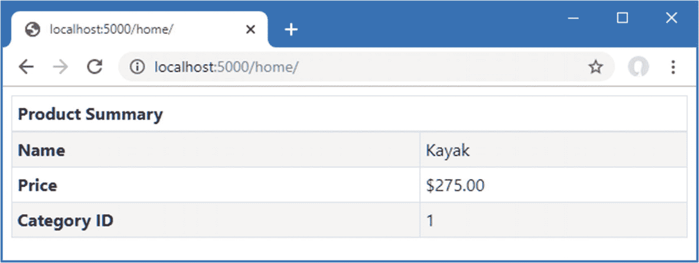

图 25-1。

运行示例应用

## 创建标签助手

理解标记助手的最好方法是创建一个，它揭示了它们是如何操作的，以及它们如何适应 ASP.NET Core 应用。在接下来的小节中，我将介绍创建和应用标记助手的过程，该助手将为一个`tr`元素设置引导 CSS 类，以便像这样的元素:

```cs
...
<tr tr-color="primary">
    <th colspan="2">Product Summary</th>
</tr>
...

```

会变成这样:

```cs
...
<tr class="bg-primary text-white text-center">
    <th colspan="2">Product Summary</th>
</tr>
...

```

标签助手将识别`tr-color`属性，并使用它的值在发送到浏览器的元素上设置`class`属性。这不是最引人注目或者最有用的转换，但是它为解释标签助手如何工作提供了基础。

### 定义标签助手类

可以在项目中的任何地方定义标记助手，但是将它们放在一起会有所帮助，因为在使用它们之前需要对它们进行注册。创建`WebApp/TagHelpers`文件夹，并添加一个名为`TrTagHelper.cs`的类文件，代码如清单 [25-6](#PC8) 所示。

```cs
using Microsoft.AspNetCore.Razor.TagHelpers;

namespace WebApp.TagHelpers {

    public class TrTagHelper: TagHelper {

        public string BgColor { get; set; } = "dark";
        public string TextColor { get; set; } = "white";

        public override void Process(TagHelperContext context,
                TagHelperOutput output) {
            output.Attributes.SetAttribute("class",
                $"bg-{BgColor} text-center text-{TextColor}");
        }
    }
}

Listing 25-6.The Contents of the TrTagHelper.cs File in the TagHelpers Folder

```

标签助手是从`TagHelper`类派生的，该类是在`Microsoft.AspNetCore.Razor.TagHelpers`名称空间中定义的。`TagHelper`类定义了一个`Process`方法，它被子类覆盖以实现转换元素的行为。

标记辅助对象的名称由它所转换的元素的名称加上`TagHelper`组成。在这个例子中，类名`TrTagHelper`表明这是一个标签助手，它对`tr`元素进行操作。可以应用标签助手的元素范围可以使用属性来扩大或缩小，如本章后面所述，但是默认行为是由类名定义的。

Tip

异步标记帮助器可以通过覆盖`ProcessAsync`方法而不是`Process`方法来创建，但是对于大多数帮助器来说这不是必需的，它们倾向于对 HTML 元素进行小的和集中的更改。在“高级标记助手功能”一节中，您可以看到一个异步标记助手的示例。

#### 接收上下文数据

标签助手通过`TagHelperContext`类的实例接收关于它们正在转换的元素的信息，该信息作为`Process`方法的参数接收，并定义了表 [25-3](#Tab3) 中描述的属性。

表 25-3。

TagHelperContext 属性

<colgroup><col class="tcol1 align-left"> <col class="tcol2 align-left"></colgroup> 
| 

名字

 | 

描述

 |
| --- | --- |
| `AllAttributes` | 此属性返回应用于被转换元素的属性的只读字典，按名称和索引进行索引。 |
| `Items` | 该属性返回一个字典，用于在标记帮助器之间进行协调，如“在标记帮助器之间进行协调”一节中所述。 |
| `UniqueId` | 此属性返回被转换元素的唯一标识符。 |

虽然您可以通过`AllAttributes`字典访问元素属性的细节，但是更方便的方法是定义一个属性，其名称对应于您感兴趣的属性，如下所示:

```cs
...
public string BgColor { get; set; } = "dark";
public string TextColor { get; set; } = "white";
...

```

当使用 tag helper 时，它定义的属性被检查，并被赋予其名称与应用于 HTML 元素的属性相匹配的任何值。作为此过程的一部分，属性值将被转换为与 C# 属性的类型相匹配，这样,`bool`属性可用于接收`true`和`false`属性值，而`int`属性可用于接收数值属性值，如`1`和`2`。

没有相应 HTML 元素属性的属性没有被设置，这意味着您应该检查以确保您没有处理`null`或提供默认值，这是清单 [25-6](#PC8) 中采用的方法。

属性的名称会自动从默认的 HTML 样式`bg-color`转换为 C# 样式`BgColor`。您可以使用任何属性前缀，除了`asp-`(微软使用的)和`data-`(保留给发送给客户端的自定义属性)。示例标签助手将使用`bg-color`和`text-color`属性进行配置，这将为`BgColor`和`TextColor`属性提供值，并用于配置`Process`方法中的`tr`元素，如下所示:

```cs
...
output.Attributes.SetAttribute("class",
    $"bg-{BgColor} text-center text-{TextColor}");
...

```

Tip

将 HTML 属性名称用于标记助手属性并不总是会产生可读或可理解的类。您可以使用`HtmlAttributeName`属性来断开属性名称和它所代表的属性之间的链接，该属性可用于指定属性所代表的 HTML 属性。

#### 生产产量

`Process`方法通过配置作为参数接收的`TagHelperOutput`对象来转换元素。`TagHelperOuput`对象从描述视图中出现的 HTML 元素开始，并通过表 [25-4](#Tab4) 中描述的属性和方法进行修改。

表 25-4。

TagHelperOutput 属性和方法

<colgroup><col class="tcol1 align-left"> <col class="tcol2 align-left"></colgroup> 
| 

名字

 | 

描述

 |
| --- | --- |
| `TagName` | 此属性用于获取或设置输出元素的标记名。 |
| `Attributes` | 此属性返回包含输出元素属性的字典。 |
| `Content` | 该属性返回一个用于设置元素内容的`TagHelperContent`对象。 |
| `GetChildContentAsync()` | 这个异步方法提供了对将要转换的元素内容的访问，如“创建速记元素”一节中所演示的。 |
| `PreElement` | 该属性返回一个`TagHelperContext`对象，用于在输出元素之前插入视图中的内容。请参见“预先计划和追加内容和元素”一节。 |
| `PostElement` | 该属性返回一个`TagHelperContext`对象，该对象用于在输出元素之后的视图中插入内容。请参见“预先计划和追加内容和元素”一节。 |
| `PreContent` | 该属性返回一个`TagHelperContext`对象，用于在输出元素的内容之前插入内容。请参见“预先计划和追加内容和元素”一节。 |
| `PostContent` | 该属性返回一个`TagHelperContext`对象，用于在输出元素的内容之后插入内容。请参见“预先计划和追加内容和元素”一节。 |
| `TagMode` | 该属性指定如何使用来自`TagMode`枚举的值来编写输出元素。请参见“创建速记元素”一节。 |
| `SupressOuput()` | 调用此方法会从视图中排除一个元素。请参见“抑制输出元素”一节。 |

在`TrTagHelper`类中，我使用了`Attributes`字典将一个`class`属性添加到指定引导样式的 HTML 元素中，包括`BgColor`和`TextColor`属性的值。效果是`tr`元素的背景颜色可以通过将`bg-color`和`text-color`属性设置为引导名来指定，例如`primary`、`info`和`danger`。

### 注册标签助手

标签助手类必须用`@addTagHelper`指令注册才能使用。标签助手可以应用到的一组视图或页面取决于在哪里使用了`@addTagHelper`指令。

对于单个视图或页面，该指令出现在 CSHTML 文件本身中。为了使标记辅助对象更广泛地可用，可以将它添加到视图导入文件中，该文件在控制器的`Views`文件夹和 Razor 页面的`Pages`文件夹中定义。

我希望我在本章中创建的标签助手在应用中的任何地方都可用，这意味着`@addTagHelper`指令被添加到`Views`和`Pages`文件夹中的`_ViewImports.cshtml`文件中。第 [24](24.html) 章中用于应用视图组件的`vc`元素是一个标签助手，这就是为什么启用标签助手所需的指令已经在`_ViewImports.cshtml`文件中了。

```cs
@using WebApp.Models
@addTagHelper *, Microsoft.AspNetCore.Mvc.TagHelpers
@using WebApp.Components
@addTagHelper *, WebApp

```

参数的第一部分指定标记辅助类的名称，支持通配符，第二部分指定定义它们的程序集的名称。这个`@addTagHelper`指令使用通配符来选择`WebApp`程序集中的所有名称空间，结果是在项目中任何地方定义的标签助手都可以在任何控制器视图中使用。在`Pages`文件夹中的 Razor Pages `_ViewImports.cshtml`文件中有一个相同的声明。

```cs
@namespace WebApp.Pages
@using WebApp.Models
@addTagHelper *, Microsoft.AspNetCore.Mvc.TagHelpers
@addTagHelper *, WebApp

```

另一个`@addTagHelper`指令启用微软提供的内置标签助手，这在第 [26 章](26.html)中有描述。

### 使用标签助手

最后一步是使用标签助手来转换元素。在清单 [25-7](#PC13) 中，我将属性添加到了`tr`元素中，这将应用标签助手。

```cs
@model Product
@{
    Layout = "_SimpleLayout";
}

<table class="table table-striped table-bordered table-sm">
    <thead>
        <tr bg-color="info" text-color="white">
            <th colspan="2">Product Summary</th>
        </tr>
    </thead>
    <tbody>
        <tr><th>Name</th><td>@Model.Name</td></tr>
        <tr>
            <th>Price</th>
            <td>@Model.Price.ToString("c")</td>
        </tr>
        <tr><th>Category ID</th><td>@Model.CategoryId</td></tr>
    </tbody>
</table>

Listing 25-7.Using a Tag Helper in the Index.cshtml File in the Views/Home Folder

```

重启 ASP.NET Core，使用浏览器请求`http://localhost:5000/home`，产生如图 [25-2](#Fig2) 所示的响应。

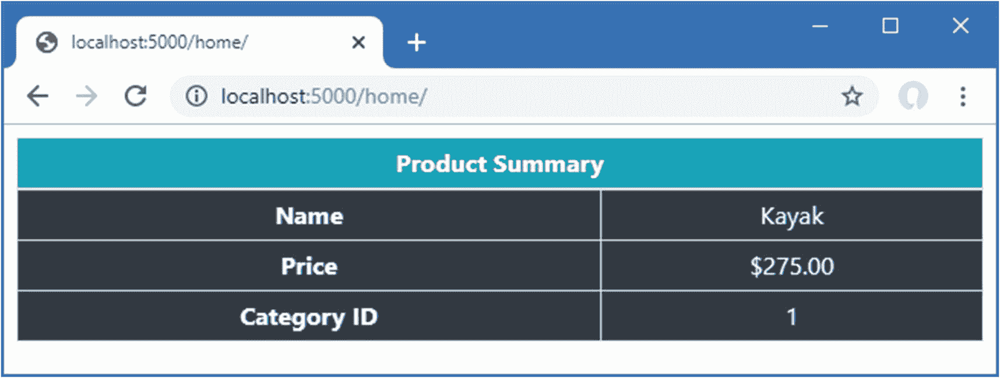

图 25-2。

使用标签助手

清单 [25-7](#PC13) 中应用了属性的`tr`元素已经被转换，但这并不是图中显示的唯一变化。默认情况下，标记助手应用于特定类型的所有元素，这意味着视图中的所有`tr`元素都已经使用标记助手类中定义的默认值进行了转换，因为没有定义任何属性。

事实上，问题更严重，因为视图导入文件中的`@addTagHelper`指令意味着示例标签助手应用于控制器和 Razor 页面呈现的任何视图中使用的所有`tr`元素。例如用浏览器请求`http://localhost:5000/cities`，你会看到城市 Razor 页面响应中的`tr`元素也被转换了，如图 [25-3](#Fig3) 所示。

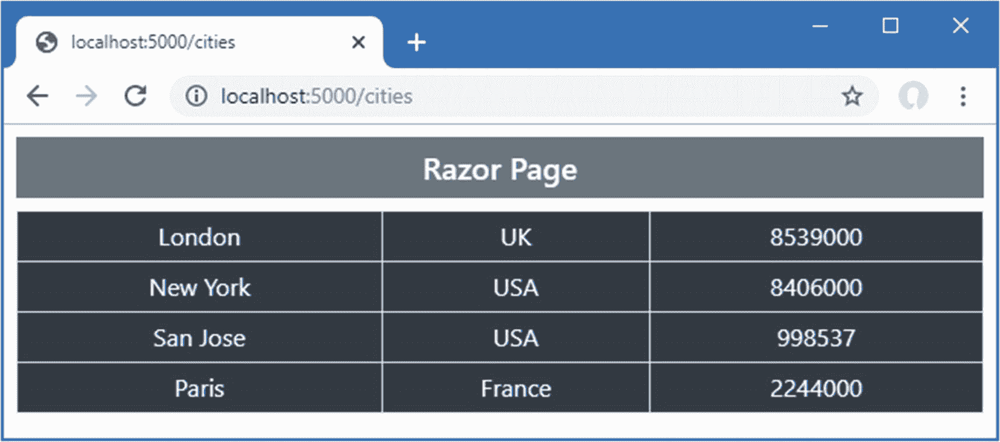

图 25-3。

使用标签助手意外修改元素

### 缩小标记助手的范围

标签助手转换的元素范围可以使用`HtmlTargetElement`元素来控制，如清单 [25-8](#PC14) 所示。

```cs
using Microsoft.AspNetCore.Razor.TagHelpers;

namespace WebApp.TagHelpers {

    [HtmlTargetElement("tr", Attributes = "bg-color,text-color", ParentTag ="thead")]
    public class TrTagHelper: TagHelper {

        public string BgColor { get; set; } = "dark";
        public string TextColor { get; set; } = "white";

        public override void Process(TagHelperContext context,
                TagHelperOutput output) {
            output.Attributes.SetAttribute("class",
                $"bg-{BgColor} text-center text-{TextColor}");
        }
    }
}

Listing 25-8.Narrowing Scope in the TrTagHelper.cs File in the TagHelpers Folder

```

`HtmlTargetElement`属性描述了标签助手所应用的元素。第一个参数指定元素类型并支持表 [25-5](#Tab5) 中描述的附加命名属性。

表 25-5。

HtmlTargetElement 属性

<colgroup><col class="tcol1 align-left"> <col class="tcol2 align-left"></colgroup> 
| 

名字

 | 

描述

 |
| --- | --- |
| `Attributes` | 此属性用于指定标记帮助器应仅应用于具有给定属性集(以逗号分隔列表的形式提供)的元素。以星号结尾的属性名将被视为前缀，这样`bg-*`将匹配`bg-color`、`bg-size`等等。 |
| `ParentTag` | 此属性用于指定标记帮助器应仅应用于给定类型的元素中包含的元素。 |
| `TagStructure` | 该属性用于指定标记助手应该只应用于其标记结构对应于来自`TagStructure`枚举的给定值的元素，该枚举定义了`Unspecified`、`NormalOrSelfClosing`和`WithoutEndTag`。 |

`Attributes`属性支持 CSS 属性选择器语法，因此`[bg-color]`匹配具有`bg-color`属性的元素，`[bg-color=primary]`匹配具有值为`primary`的`bg-color`属性的元素，`[bg-color^=p]`匹配具有值以`p`开始的`bg-color`属性的元素。清单 [25-8](#PC14) 中应用于标签助手的属性将`tr`元素与作为`thead`元素子元素的`bg-color`和`text-color`属性相匹配。重启 ASP.NET Core，用浏览器请求`http://localhost:5000/home/index/1`，会看到 tag helper 的范围缩小了，如图 [25-4](#Fig4) 所示。

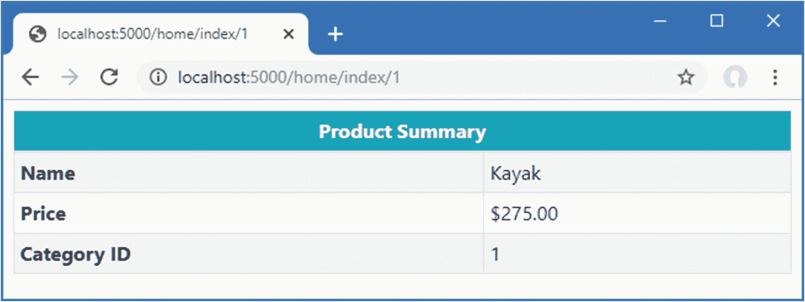

图 25-4。

缩小标记助手的范围

### 扩大标记助手的范围

`HtmlTargetElement`属性也可以用来扩大标签助手的范围，使其匹配更大范围的元素。这是通过将属性的第一个参数设置为星号(`*`字符)来实现的，它匹配任何元素。清单 [25-9](#PC15) 更改应用于示例标签助手的属性，以便它匹配任何具有`bg-color`和`text-color`属性的元素。

```cs
using Microsoft.AspNetCore.Razor.TagHelpers;

namespace WebApp.TagHelpers {

    [HtmlTargetElement("*", Attributes = "bg-color,text-color")]
    public class TrTagHelper: TagHelper {

        public string BgColor { get; set; } = "dark";
        public string TextColor { get; set; } = "white";

        public override void Process(TagHelperContext context,
                TagHelperOutput output) {
            output.Attributes.SetAttribute("class",
                $"bg-{BgColor} text-center text-{TextColor}");
        }
    }
}

Listing 25-9.Widening Scope in the TrTagHelper.cs File in the TagHelpers Folder

```

使用星号时必须小心，因为它很容易匹配范围太广，并选择不应该转换的元素。一个更安全的折中方法是对每种类型的元素应用`HtmlTargetElement`属性，如清单 [25-10](#PC16) 所示。

```cs
using Microsoft.AspNetCore.Razor.TagHelpers;

namespace WebApp.TagHelpers {

    [HtmlTargetElement("tr", Attributes = "bg-color,text-color")]
    [HtmlTargetElement("td", Attributes = "bg-color")]
    public class TrTagHelper: TagHelper {

        public string BgColor { get; set; } = "dark";
        public string TextColor { get; set; } = "white";

        public override void Process(TagHelperContext context,
                TagHelperOutput output) {
            output.Attributes.SetAttribute("class",
                $"bg-{BgColor} text-center text-{TextColor}");
        }
    }
}

Listing 25-10.Balancing Scope in the TrTagHelper.cs File in the TagHelpers Folder

```

属性的每个实例可以使用不同的选择标准。这个标签助手将`tr`元素与`bg-color`和`text-color`属性相匹配，并将`td`元素与`bg-color`属性相匹配。清单 [25-11](#PC17) 向`Index`视图添加了一个要转换的元素，以展示修改后的范围。

```cs
@model Product
@{
    Layout = "_SimpleLayout";
}

<table class="table table-striped table-bordered table-sm">
    <thead>
        <tr bg-color="info" text-color="white">
            <th colspan="2">Product Summary</th>
        </tr>
    </thead>
    <tbody>
        <tr><th>Name</th><td>@Model.Name</td></tr>
        <tr>
            <th>Price</th>
            <td bg-color="dark">@Model.Price.ToString("c")</td>
        </tr>
        <tr><th>Category ID</th><td>@Model.CategoryId</td></tr>
    </tbody>
</table>

Listing 25-11.Adding Attributes in the Index.cshtml File in the Views/Home Folder

```

重启 ASP.NET Core 并使用浏览器请求`http://localhost:5000/home/index/1`。响应将包含两个转换后的元素，如图 [25-5](#Fig5) 所示。

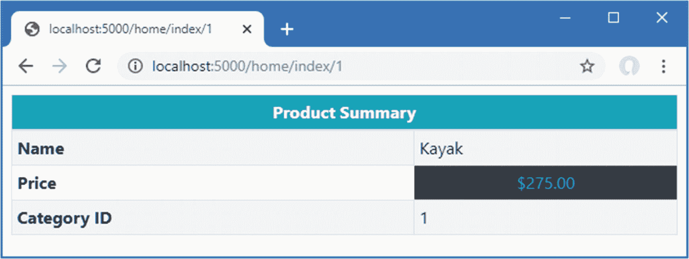

图 25-5。

管理标记助手的范围

Ordering Tag Helper Execution

如果需要对一个元素应用多个标签助手，可以通过设置从`TagHelper`基类继承的`Order`属性来控制它们的执行顺序。管理序列可以帮助最小化标记帮助器之间的冲突，尽管仍然很容易遇到问题。

## 高级标签助手功能

上一节演示了如何创建一个基本的标记辅助对象，但这只是触及到了可能的事情的表面。在接下来的小节中，我将展示标记助手的更高级的用法以及它们提供的特性。

### 创建速记元素

标签助手并不局限于转换标准的 HTML 元素，还可以用来将定制元素替换为常用的内容。这是一个有用的特性，可以使视图更简洁，意图更明显。为了演示，清单 [25-12](#PC18) 用一个定制的 HTML 元素替换了`Index`视图中的`thead`元素。

```cs
@model Product
@{
    Layout = "_SimpleLayout";
}

<table class="table table-striped table-bordered table-sm">
    <tablehead bg-color="dark">Product Summary</tablehead>
    <tbody>
        <tr><th>Name</th><td>@Model.Name</td></tr>
        <tr>
            <th>Price</th>
            <td bg-color="dark">@Model.Price.ToString("c")</td>
        </tr>
        <tr><th>Category ID</th><td>@Model.CategoryId</td></tr>
    </tbody>
</table>

Listing 25-12.Adding a Custom HTML Element in the Index.cshtml File in the Views/Home Folder

```

元素不是 HTML 规范的一部分，不会被浏览器理解。相反，我将使用这个元素作为生成 HTML 表的`thead`元素及其内容的简写。将名为`TableHeadTagHelper.cs`的类添加到`TagHelpers`文件夹中，并使用它来定义清单 [25-13](#PC19) 中所示的类。

Tip

当处理不属于 HTML 规范的定制元素时，您必须应用`HtmlTargetElement`属性并指定元素名称，如清单 [25-13](#PC19) 所示。根据类名对元素应用标记助手的约定只适用于标准元素名。

```cs
using Microsoft.AspNetCore.Razor.TagHelpers;
using System.Threading.Tasks;

namespace WebApp.TagHelpers {

    [HtmlTargetElement("tablehead")]
    public class TableHeadTagHelper: TagHelper {

        public string BgColor { get; set; } = "light";

        public override async Task ProcessAsync(TagHelperContext context,
                TagHelperOutput output) {

            output.TagName = "thead";
            output.TagMode = TagMode.StartTagAndEndTag;
            output.Attributes.SetAttribute("class",
                $"bg-{BgColor} text-white text-center");

            string content = (await output.GetChildContentAsync()).GetContent();
            output.Content
                .SetHtmlContent($"<tr><th colspan=\"2\">{content}</th></tr>");
        }
    }
}

Listing 25-13.The Contents of TableHeadTagHelper.cs in the TagHelpers Folder

```

这个标签助手是异步的，它覆盖了`ProcessAsync`方法，这样它就可以访问它所转换的元素的现有内容。`ProcessAsync`方法使用`TagHelperOuput`对象的属性生成一个完全不同的元素:`TagName`属性用于指定一个`thead`元素，`TagMode`属性用于指定该元素是使用开始和结束标签编写的，`Attributes.SetAttribute`方法用于定义一个`class`属性，`Content`属性用于设置元素内容。

元素的现有内容是通过异步的`GetChildContentAsync`方法获得的，该方法返回一个`TagHelperContent`对象。这是由`TagHelperOutput.Content`属性返回的同一个对象，并允许使用相同的类型通过表 [25-6](#Tab6) 中描述的方法检查和更改元素的内容。

表 25-6。

有用的 TagHelperContent 方法

<colgroup><col class="tcol1 align-left"> <col class="tcol2 align-left"></colgroup> 
| 

名字

 | 

描述

 |
| --- | --- |
| `GetContent()` | 该方法以字符串形式返回 HTML 元素的内容。 |
| `SetContent(text)` | 此方法设置输出元素的内容。对参数`string`进行了编码，因此它可以安全地包含在 HTML 元素中。 |
| `SetHtmlContent(html)` | 此方法设置输出元素的内容。`string`参数被认为是安全编码的。小心使用。 |
| `Append(text)` | 该方法安全地对指定的`string`进行编码，并将其添加到输出元素的内容中。 |
| `AppendHtml(html)` | 该方法将指定的`string`添加到输出元素的内容中，而不执行任何编码。小心使用。 |
| `Clear()` | 此方法移除输出元素的内容。 |

在清单 [25-13](#PC19) 中，元素的现有内容通过`GetContent`元素读取，然后使用`SetHtmlContent`方法进行设置。其效果是将已转换元素中的现有内容包装在`tr`和`th`元素中。

重启 ASP.NET Core，导航到`http://localhost:5000/home/index/1`，你会看到标签帮助器的效果，如图 [25-6](#Fig6) 所示。

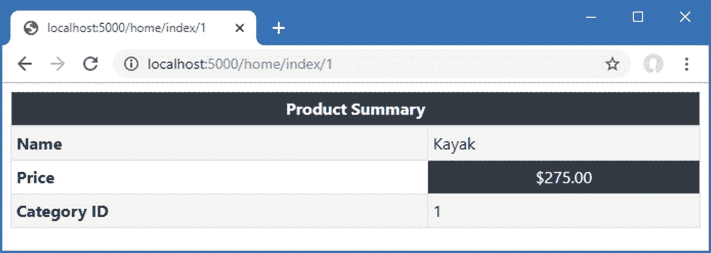

图 25-6。

使用速记元素

标记帮助器转换这个速记元素:

```cs
...
<tablehead bg-color="dark">Product Summary</tablehead>
...

```

这些元素:

```cs
...
<thead class="bg-dark text-white text-center">
    <tr>
        <th colspan="2">Product Summary</th>
    </tr>
</thead>
...

```

注意，转换后的元素不包括`bg-color`属性。与 tag helper 定义的属性相匹配的属性将从输出元素中删除，如果需要，必须显式重新定义这些属性。

### 以编程方式创建元素

当生成新的 HTML 元素时，您可以使用标准的 C# 字符串格式来创建您需要的内容，这是我在清单 [25-13](#PC19) 中采用的方法。这是可行的，但是可能会很尴尬，需要密切注意以避免输入错误。更健壮的方法是使用`TagBuilder`类，它在`Microsoft.AspNetCore.Mvc.Rendering`名称空间中定义，允许以更结构化的方式创建元素。表 [25-6](#Tab6) 中描述的`TagHelperContent`方法接受`TagBuilder`对象，这使得在标签助手中创建 HTML 内容变得容易，如清单 [25-14](#PC22) 所示。

```cs
using Microsoft.AspNetCore.Razor.TagHelpers;
using System.Threading.Tasks;
using Microsoft.AspNetCore.Mvc.Rendering;

namespace WebApp.TagHelpers {

    [HtmlTargetElement("tablehead")]
    public class TableHeadTagHelper: TagHelper {

        public string BgColor { get; set; } = "light";

        public override async Task ProcessAsync(TagHelperContext context,
                TagHelperOutput output) {

            output.TagName = "thead";
            output.TagMode = TagMode.StartTagAndEndTag;
            output.Attributes.SetAttribute("class",
                $"bg-{BgColor} text-white text-center");

            string content = (await output.GetChildContentAsync()).GetContent();

            TagBuilder header = new TagBuilder("th");
            header.Attributes["colspan"] = "2";
            header.InnerHtml.Append(content);

            TagBuilder row = new TagBuilder("tr");
            row.InnerHtml.AppendHtml(header);

            output.Content.SetHtmlContent(row);
        }
    }
}

Listing 25-14.Creating HTML Elements in the TableHeadTagHelper.cs File in the TagHelpers Folder

```

这个例子使用一个`TagBuilder`对象创建每个新元素，并组合它们以产生与清单 [25-13](#PC19) 中基于字符串的版本相同的 HTML 结构。

### 预先计划和追加内容和元素

`TagHelperOutput`类提供了四个属性，使得向视图注入新内容变得容易，这样它就可以围绕一个元素或元素的内容，如表 [25-7](#Tab7) 中所述。在接下来的小节中，我将解释如何在目标元素的周围和内部插入内容。

表 25-7。

用于追加上下文和元素的 TagHelperOutput 属性

<colgroup><col class="tcol1 align-left"> <col class="tcol2 align-left"></colgroup> 
| 

名字

 | 

描述

 |
| --- | --- |
| `PreElement` | 该属性用于将元素插入到视图中的目标元素之前。 |
| `PostElement` | 该属性用于将元素插入到视图中的目标元素之后。 |
| `PreContent` | 此属性用于在任何现有内容之前将内容插入目标元素。 |
| `PostContent` | 此属性用于将内容插入到目标元素中任何现有内容之后。 |

#### 在输出元素周围插入内容

第一个`TagHelperOuput`属性是`PreElement`和`PostElement`，它们用于在输出元素之前和之后向视图中插入元素。为了演示这些属性的使用，向`WebApp/TagHelpers`文件夹添加一个名为`ContentWrapperTagHelper.cs`的类文件，其内容如清单 [25-15](#PC23) 所示。

```cs
using Microsoft.AspNetCore.Mvc.Rendering;
using Microsoft.AspNetCore.Razor.TagHelpers;

namespace WebApp.TagHelpers {

    [HtmlTargetElement("*", Attributes = "[wrap=true]")]
    public class ContentWrapperTagHelper: TagHelper {

        public override void Process(TagHelperContext context,
                TagHelperOutput output) {
            TagBuilder elem = new TagBuilder("div");
            elem.Attributes["class"] = "bg-primary text-white p-2 m-2";
            elem.InnerHtml.AppendHtml("Wrapper");

            output.PreElement.AppendHtml(elem);
            output.PostElement.AppendHtml(elem);
        }
    }
}

Listing 25-15.The Contents of the WrapperTagHelper.cs File in the TagHelpers Folder

```

这个标签助手转换具有值为`true`的`wrap`属性的元素，它使用`PreElement`和`PostElement`属性在输出元素之前和之后添加一个`div`元素。清单 [25-16](#PC24) 向`Index`视图添加了一个元素，该元素由标签助手转换。

```cs
@model Product
@{
    Layout = "_SimpleLayout";
}

<div class="m-2" wrap="true">Inner Content</div>

<table class="table table-striped table-bordered table-sm">
    <tablehead bg-color="dark">Product Summary</tablehead>
    <tbody>
        <tr><th>Name</th><td>@Model.Name</td></tr>
        <tr>
            <th>Price</th>
            <td bg-color="dark">@Model.Price.ToString("c")</td>
        </tr>
        <tr><th>Category ID</th><td>@Model.CategoryId</td></tr>
    </tbody>
</table>

Listing 25-16.Adding an Element in the Index.cshtml File in the Views/Index Folder

```

重启 ASP.NET Core 并使用浏览器请求`http://localhost:5000/home/index/1`。响应包括转换后的元素，如图 [25-7](#Fig7) 所示。

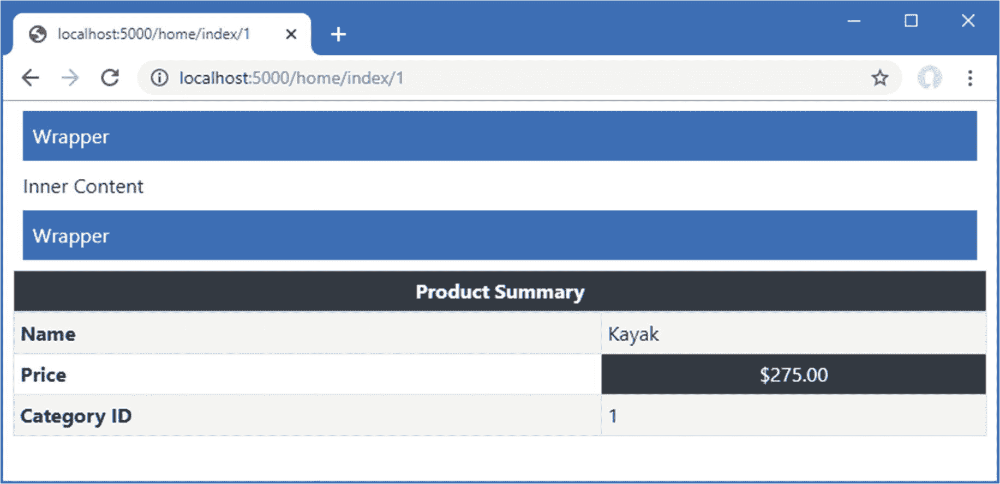

图 25-7。

在输出元素周围插入内容

如果您检查发送到浏览器的 HTML，您会看到这个元素:

```cs
...
<div class="m-2" wrap="true">Inner Content</div>
...

```

已经转化成了这些元素:

```cs
...
<div class="bg-primary text-white p-2 m-2">Wrapper</div>
<div class="m-2" wrap="true">Inner Content</div>
<div class="bg-primary text-white p-2 m-2">Wrapper</div>
...

```

注意,`wrap`属性被留在了输出元素上。这是因为我没有在 tag helper 类中定义与该属性对应的属性。如果您想防止属性包含在输出中，那么在 tag helper 类中为它们定义一个属性，即使您不使用属性值。

#### 在输出元素中插入内容

`PreContent`和`PostContent`属性用于在输出元素中插入内容，围绕原始内容。为了演示这个特性，将一个名为`HighlightTagHelper.cs`的类文件添加到`TagHelpers`文件夹中，并使用它来定义清单 [25-17](#PC27) 中所示的标签助手。

```cs
using Microsoft.AspNetCore.Razor.TagHelpers;

namespace WebApp.TagHelpers {

    [HtmlTargetElement("*", Attributes = "[highlight=true]")]
    public class HighlightTagHelper: TagHelper {

        public override void Process(TagHelperContext context,
                TagHelperOutput output) {

            output.PreContent.SetHtmlContent("<b><i>");
            output.PostContent.SetHtmlContent("</i></b>");
        }
    }
}

Listing 25-17.The Contents of the HighlightTagHelper.cs File in the TagHelpers Folder

```

这个标签助手在输出元素的内容周围插入`b`和`i`元素。清单 [25-18](#PC28) 为`Index`视图中的一个表格单元格添加了换行属性。

```cs
@model Product
@{
    Layout = "_SimpleLayout";
}

<div class="m-2" wrap="true">Inner Content</div>

<table class="table table-striped table-bordered table-sm">
    <tablehead bg-color="dark">Product Summary</tablehead>
    <tbody>
        <tr><th>Name</th><td highlight="true">@Model.Name</td></tr>
        <tr>
            <th>Price</th>
            <td bg-color="dark">@Model.Price.ToString("c")</td>
        </tr>
        <tr><th>Category ID</th><td>@Model.CategoryId</td></tr>
    </tbody>
</table>

Listing 25-18.Adding an Attribute in the Index.cshtml File in the Views/Home Folder

```

重启 ASP.NET Core 并使用浏览器请求`http://localhost:5000/home/index/1`。响应包括转换后的元素，如图 [25-8](#Fig8) 所示。

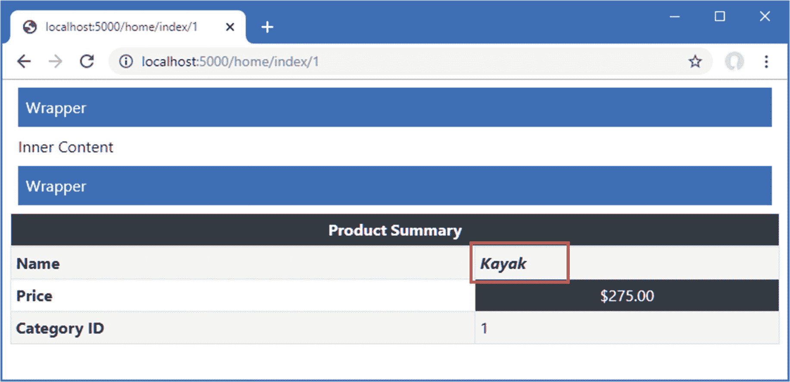

图 25-8。

在元素中插入内容

如果您检查发送到浏览器的 HTML，您会看到这个元素:

```cs
...
<td highlight="true">@Model.Name</td>
...

```

已经转化成了这些元素:

```cs
...
<td highlight="true"><b><i>Kayak</i></b></td>
...

```

### 获取视图上下文数据

标记助手的一个常见用途是转换元素，使它们包含当前请求或视图模型/页面模型的细节，这需要访问上下文数据。要创建这种类型的标记助手，需要在`TagHelpers`文件夹中添加一个名为`RouteDataTagHelper.cs`的文件，其内容如清单 [25-19](#PC31) 所示。

```cs
using Microsoft.AspNetCore.Mvc.Rendering;
using Microsoft.AspNetCore.Mvc.ViewFeatures;
using Microsoft.AspNetCore.Razor.TagHelpers;
using Microsoft.AspNetCore.Routing;

namespace WebApp.TagHelpers {

    [HtmlTargetElement("div", Attributes="[route-data=true]")]
    public class RouteDataTagHelper: TagHelper {

        [ViewContext]
        [HtmlAttributeNotBound]
        public ViewContext Context { get; set; }

        public override void Process(TagHelperContext context,
                TagHelperOutput output) {

            output.Attributes.SetAttribute("class", "bg-primary m-2 p-2");

            TagBuilder list = new TagBuilder("ul");
            list.Attributes["class"] = "list-group";
            RouteValueDictionary rd = Context.RouteData.Values;
            if (rd.Count > 0) {
                foreach (var kvp in rd) {
                    TagBuilder item = new TagBuilder("li");
                    item.Attributes["class"] = "list-group-item";
                    item.InnerHtml.Append($"{kvp.Key}: {kvp.Value}");
                    list.InnerHtml.AppendHtml(item);
                }
                output.Content.AppendHtml(list);
            } else {
                output.Content.Append("No route data");
            }
        }
    }
}

Listing 25-19.The Contents of the RouteDataTagHelper.cs File in the WebApps/TagHelpers Folder

```

标签助手转换具有值为`true`的`route-data`属性的`div`元素，并用路由系统获得的段变量列表填充输出元素。

为了获得路线数据，我添加了一个名为`Context`的属性，并用两个属性来修饰它，如下所示:

```cs
...
[ViewContext]
[HtmlAttributeNotBound]
public ViewContext Context { get; set; }
...

```

`ViewContext`属性表示当标签助手类的一个新实例被创建时，这个属性的值应该被分配一个`ViewContext`对象，它提供被渲染的视图的细节，包括路由数据，如第 [13 章](13.html)所述。

如果在`div`元素上定义了一个匹配的属性，那么`HtmlAttributeNotBound`属性会阻止为该属性赋值。这是一个很好的实践，尤其是如果您正在编写供其他开发人员使用的标记助手。

Tip

标签助手可以在它们的构造函数中声明对服务的依赖，这可以使用第 [14](14.html) 章中描述的依赖注入特性来解决。

清单 [25-20](#PC33) 向`Home`控制器的`Index`视图中添加了一个元素，该元素将被新的标签助手转换。

```cs
@model Product
@{
    Layout = "_SimpleLayout";
}

<div route-data="true"></div>

<table class="table table-striped table-bordered table-sm">
    <tablehead bg-color="dark">Product Summary</tablehead>
    <tbody>
        <tr><th>Name</th><td highlight="true">@Model.Name</td></tr>
        <tr>
            <th>Price</th>
            <td bg-color="dark">@Model.Price.ToString("c")</td>
        </tr>
        <tr><th>Category ID</th><td>@Model.CategoryId</td></tr>
    </tbody>
</table>

Listing 25-20.Adding an Element in the Index.cshtml File in the Views/Home Folder

```

重启 ASP.NET Core 并使用浏览器请求`http://localhost:5000/home/index/1`。响应将包括路由系统匹配的段变量列表，如图 [25-9](#Fig9) 所示。

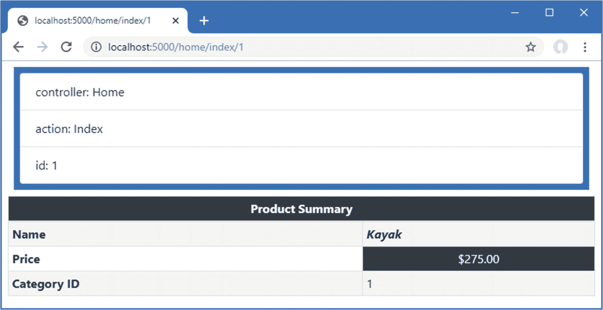

图 25-9。

用标签助手显示上下文数据

### 使用模型表达式

标记助手可以操作视图模型，定制它们执行的转换或它们创建的输出。要查看这个特性是如何工作的，添加一个名为`ModelRowTagHelper.cs`的类文件到`TagHelpers`文件夹，代码如清单 [25-21](#PC34) 所示。

```cs
using Microsoft.AspNetCore.Mvc.Rendering;
using Microsoft.AspNetCore.Mvc.ViewFeatures;
using Microsoft.AspNetCore.Razor.TagHelpers;

namespace WebApp.TagHelpers {

    [HtmlTargetElement("tr", Attributes = "for")]
    public class ModelRowTagHelper : TagHelper {

        public string Format { get; set; }
        public ModelExpression For { get; set; }

        public override void Process(TagHelperContext context,
                TagHelperOutput output) {

            output.TagMode = TagMode.StartTagAndEndTag;

            TagBuilder th = new TagBuilder("th");
            th.InnerHtml.Append(For.Name);
            output.Content.AppendHtml(th);

            TagBuilder td = new TagBuilder("td");
            if (Format != null && For.Metadata.ModelType == typeof(decimal)) {
                td.InnerHtml.Append(((decimal)For.Model).ToString(Format));
            } else {
                td.InnerHtml.Append(For.Model.ToString());
            }
            output.Content.AppendHtml(td);
        }
    }
}

Listing 25-21.The Contents of the ModelRowTagHelper.cs File in the TagHelpers Folder

```

这个标签助手转换具有`for`属性的`tr`元素。这个标记助手的重要部分是`For`属性的类型，它用于接收`for`属性的值。

```cs
...
public ModelExpression For { get; set; }
...

```

当您想要对视图模型的一部分进行操作时，可以使用`ModelExpression`类，这可以通过向前跳转并展示标签助手如何在视图中应用来简单解释，如清单 [25-22](#PC36) 所示。

Note

`ModelExpression`特性只能在视图模型或页面模型上使用。它不能用在视图中创建的变量上，比如用一个`@foreach`表达式。

```cs
@model Product
@{
    Layout = "_SimpleLayout";
}

<div route-data="true"></div>

<table class="table table-striped table-bordered table-sm">
    <tablehead bg-color="dark">Product Summary</tablehead>
    <tbody>
        <tr for="Name" />
        <tr for="Price" format="c" />
        <tr for="CategoryId" />
    </tbody>
</table>

Listing 25-22.Using the Tag Helper in the Index.cshtml File in the Views/Home Folder

```

属性的值是由视图模型类定义的属性的名称。当标签助手被创建时，`For`属性的类型被检测并被分配一个描述所选属性的`ModelExpression`对象。

我不打算详细描述`ModelExpression`类，因为任何对类型的自省都会导致无穷无尽的类和属性列表。此外，ASP.NET Core 提供了一组有用的内置标签助手，它们使用视图模型来转换元素，如第 [26 章](26.html)所述，这意味着你不需要创建自己的标签助手。

对于示例标记助手，我使用了三个值得描述的基本特性。第一个是获取模型属性的名称，这样我就可以将它包含在输出元素中，如下所示:

```cs
...
th.InnerHtml.Append(For.Name);
...

```

`Name`属性返回模型属性的名称。第二个特性是获取模型属性的类型，以便我可以确定是否格式化该值，如下所示:

```cs
...
if (Format != null && For.Metadata.ModelType == typeof(decimal)) {
...

```

第三个特性是获取属性的值，以便它可以包含在响应中。

```cs
...
td.InnerHtml.Append(For.Model.ToString());
...

```

重启 ASP.NET Core，用浏览器请求`http://localhost:5000/home/index/2`，会看到如图 [25-10](#Fig10) 所示的响应。

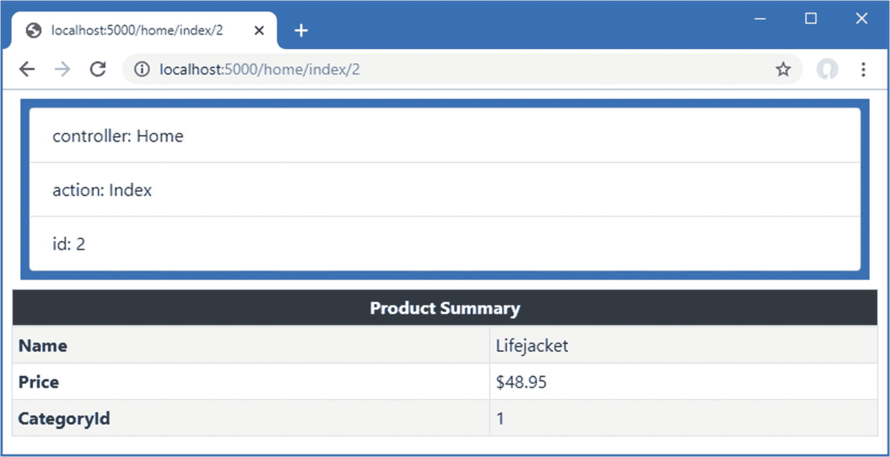

图 25-10。

在标记帮助器中使用视图模型

#### 使用页面模型

虽然选择属性的表达式必须考虑到`Model`属性返回页面模型类的方式，但是带有模型表达式的标记帮助器可以应用在 Razor 页面中。清单 [25-23](#PC40) 将标签助手应用于`Editor` Razor 页面，其页面模型定义了一个`Product`属性。

```cs
@page "{id:long}"
@model EditorModel
@{
    Layout = null;
}

<!DOCTYPE html>
<html>
<head>
    <link href="/lib/twitter-bootstrap/css/bootstrap.min.css" rel="stylesheet" />
</head>
<body>
    <div class="bg-primary text-white text-center m-2 p-2">Editor</div>
    <div class="m-2">
        <table class="table table-sm table-striped table-bordered">
            <tbody>
                <tr for="Product.Name" />
                <tr for="Product.Price" format="c" />
            </tbody>
        </table>
        <form method="post">
            @Html.AntiForgeryToken()
            <div class="form-group">
                <label>Price</label>
                <input name="price" class="form-control"
                       value="@Model.Product.Price" />
            </div>
            <button class="btn btn-primary" type="submit">Submit</button>
        </form>
    </div>
</body>
</html>

Listing 25-23.Applying a Tag Helper in the Editor.cshtml File in the Pages Folder

```

`for`属性的值通过`Product`属性选择嵌套的属性，这为标签助手提供了它所需要的`ModelExpression`。使用浏览器请求`http://localhost:5000/editor/1`查看页面的响应，如图 [25-11](#Fig11) 左侧所示。

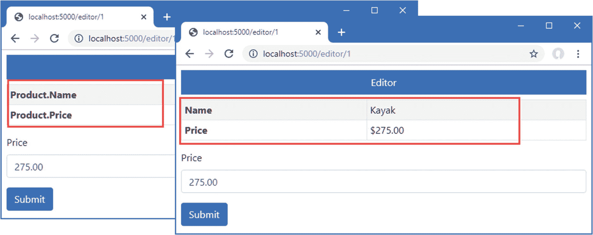

图 25-11。

使用带有 Razor 页面的模型表达式标签辅助对象

页面模型的一个结果是，`ModelExpression.Name`属性将返回`Product.Name`，而不仅仅是`Name`。清单 [25-24](#PC41) 更新了标记辅助对象，这样它将只显示模型表达式名称的最后一部分。

Note

这个例子旨在强调页面模型对模型表达式的影响。更灵活的方法不是只显示名称的最后一部分，而是添加对另一个属性的支持，该属性允许根据需要覆盖显示值。

```cs
using Microsoft.AspNetCore.Mvc.Rendering;
using Microsoft.AspNetCore.Mvc.ViewFeatures;
using Microsoft.AspNetCore.Razor.TagHelpers;
using System.Linq;

namespace WebApp.TagHelpers {

    [HtmlTargetElement("tr", Attributes = "for")]
    public class ModelRowTagHelper : TagHelper {

        public string Format { get; set; }
        public ModelExpression For { get; set; }

        public override void Process(TagHelperContext context,
                TagHelperOutput output) {

            output.TagMode = TagMode.StartTagAndEndTag;

            TagBuilder th = new TagBuilder("th");
            th.InnerHtml.Append(For.Name.Split(".").Last());
            output.Content.AppendHtml(th);

            TagBuilder td = new TagBuilder("td");
            if (Format != null && For.Metadata.ModelType == typeof(decimal)) {
                td.InnerHtml.Append(((decimal)For.Model).ToString(Format));
            } else {
                td.InnerHtml.Append(For.Model.ToString());
            }
            output.Content.AppendHtml(td);
        }
    }
}

Listing 25-24.Processing Names in the ModelRowTagHelper.cs File in the TagHelpers Folder

```

重启 ASP.NET Core，用浏览器请求`http://localhost:5000/editor/1`；您将看到修改后的响应，显示在图 [25-11](#Fig11) 的右侧。

### 标签助手之间的协调

属性提供了一个字典，供操作元素的标签助手和操作它们的后代的标签助手使用。为了演示`Items`集合的使用，将名为`CoordinatingTagHelpers.cs`的类文件添加到`WebApp/TagHelpers`文件夹中，并添加清单 [25-25](#PC42) 中所示的代码。

```cs
using Microsoft.AspNetCore.Razor.TagHelpers;

namespace WebApp.TagHelpers {

    [HtmlTargetElement("tr", Attributes = "theme")]
    public class RowTagHelper: TagHelper {

        public string Theme { get; set; }

        public override void Process(TagHelperContext context,
                TagHelperOutput output) {
            context.Items["theme"] = Theme;
        }
    }

    [HtmlTargetElement("th")]
    [HtmlTargetElement("td")]
    public class CellTagHelper : TagHelper {

        public override void Process(TagHelperContext context,
                TagHelperOutput output) {

            if (context.Items.ContainsKey("theme")) {
                output.Attributes.SetAttribute("class",
                    $"bg-{context.Items["theme"]} text-white");
            }
        }
    }
}

Listing 25-25.The Contents of the CoordinatingTagHelpers.cs File in the TagHelpers Folder

```

第一个标签助手操作具有`theme`属性的`tr`元素。协调标签助手可以转换它们自己的元素，但是这个例子只是将`theme`属性的值添加到`Items`字典中，这样标签助手就可以对包含在`tr`元素中的元素进行操作。第二个标签助手操作`th`和`td`元素，并使用来自`Items`字典的`theme`值为其输出元素设置引导样式。

清单 [25-26](#PC43) 将元素添加到`Home`控制器的`Index`视图中，该视图应用了协调标签助手。

Note

请注意，我添加了在清单 [25-26](#PC43) 中转换的`th`和`td`元素，而不是依赖标签助手来生成它们。标记辅助对象不会应用于由其他标记辅助对象生成的元素，只会影响视图中定义的元素。

```cs
@model Product
@{
    Layout = "_SimpleLayout";
}

<table class="table table-striped table-bordered table-sm">
    <tablehead bg-color="dark">Product Summary</tablehead>
    <tbody>
        <tr theme="primary">
            <th>Name</th><td>@Model.Name</td>
        </tr>
        <tr theme="secondary">
            <th>Price</th><td>@Model.Price.ToString("c")</td>
        </tr>
        <tr theme="info">
            <th>Category</th><td>@Model.CategoryId</td>
        </tr>
    </tbody>
</table>

Listing 25-26.Applying a Tag Helper in the Index.cshtml File in the Views/Home Folder

```

重启 ASP.NET Core，使用浏览器请求`http://localhost:5000/home`，产生如图 [25-12](#Fig12) 所示的响应。`theme`元素的值已经从一个标签助手传递到另一个助手，并且应用了一个颜色主题，而不需要在每个被转换的元素上定义属性。

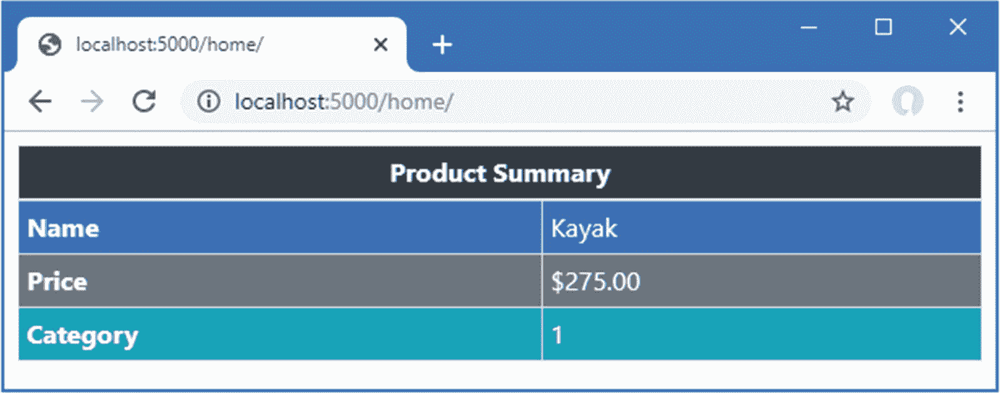

图 25-12。

标签助手之间的协调

### 抑制输出元素

通过调用作为`Process`方法的参数接收的`TagHelperOutput`对象上的`SuppressOuput`方法，标签助手可用于防止元素被包含在 HTML 响应中。在清单 [25-27](#PC44) 中，我在`Home`控制器的`Index`视图中添加了一个元素，该元素只有在视图模型的`Price`属性超过指定值时才显示。

```cs
@model Product
@{
    Layout = "_SimpleLayout";
}

<div show-when-gt="500" for="Price">
    <h5 class="bg-danger text-white text-center p-2">
        Warning: Expensive Item
    </h5>
</div>

<table class="table table-striped table-bordered table-sm">
    <tablehead bg-color="dark">Product Summary</tablehead>
    <tbody>
        <tr theme="primary">
            <th>Name</th><td>@Model.Name</td>
        </tr>
        <tr theme="secondary">
            <th>Price</th><td>@Model.Price.ToString("c")</td>
        </tr>
        <tr theme="info">
            <th>Category</th><td>@Model.CategoryId</td>
        </tr>
    </tbody>
</table>

Listing 25-27.Adding an Element in the Index.cshtml File in the Views/Home Folder

```

`show-when-gt`属性指定了一个值，在该值以上应该显示`div`元素，而`for`属性选择将被检查的模型属性。要创建管理元素(包括响应)的标签助手，请使用清单 [25-28](#PC45) 中所示的代码将名为`SelectiveTagHelper.cs`的类文件添加到`WebApp/TagHelpers`文件夹中。

```cs
using Microsoft.AspNetCore.Mvc.ViewFeatures;
using Microsoft.AspNetCore.Razor.TagHelpers;

namespace WebApp.TagHelpers {

    [HtmlTargetElement("div", Attributes = "show-when-gt, for")]
    public class SelectiveTagHelper: TagHelper {

        public decimal ShowWhenGt { get; set; }
        public ModelExpression For { get; set; }

        public override void Process(TagHelperContext context,
                TagHelperOutput output) {

            if (For.Model.GetType() == typeof(decimal)
                    && (decimal)For.Model <= ShowWhenGt) {
                output.SuppressOutput();
            }
        }
    }
}

Listing 25-28.The Contents of the SelectiveTagHelper.cs File in the TagHelpers Folder

```

标记助手使用模型表达式来访问属性，并调用`SuppressOutput`方法，除非超过阈值。要查看效果，重启 ASP.NET Core 并使用浏览器请求`http://localhost:5000/home/index/1`和`http://localhost:5000/home/index/5`。第一个 URL 选择的`Product`的`Price`属性的值小于阈值，因此该元素被取消。第二个 URL 选择的`Product`的`Price`属性的值大于阈值，因此显示该元素。图 [25-13](#Fig13) 显示了两种响应。

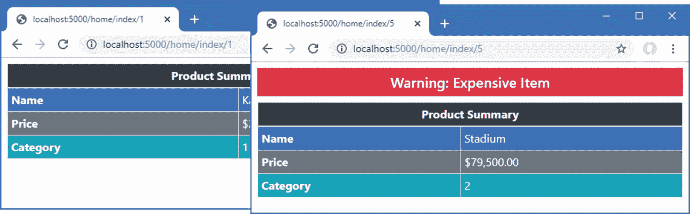

图 25-13。

抑制输出元素

## 使用标签助手组件

标签助手组件提供了一种将标签助手作为服务应用的替代方法。当您需要设置标记帮助器来支持另一个服务或中间件组件时，这个特性会很有用，这通常适用于既有客户端组件又有服务器端组件的诊断工具或功能，如第 4 部分中描述的 Blazor。在接下来的小节中，我将向您展示如何创建和应用标记助手组件。

### 创建标记辅助组件

标签助手组件派生自`TagHelperComponent`类，它提供了一个类似于前面例子中使用的`TagHelper`基类的 API。要创建一个标签助手组件，在`TagHelpers`文件夹中添加一个名为`TimeTagHelperComponent.cs`的类文件，其内容如清单 [25-29](#PC46) 所示。

```cs
using Microsoft.AspNetCore.Mvc.Rendering;
using Microsoft.AspNetCore.Razor.TagHelpers;
using System;

namespace WebApp.TagHelpers {

    public class TimeTagHelperComponent: TagHelperComponent {

        public override void Process(TagHelperContext context,
                TagHelperOutput output) {

            string timestamp = DateTime.Now.ToLongTimeString();

            if (output.TagName == "body") {
                TagBuilder elem = new TagBuilder("div");
                elem.Attributes.Add("class", "bg-info text-white m-2 p-2");
                elem.InnerHtml.Append($"Time: {timestamp}");
                output.PreContent.AppendHtml(elem);
            }
        }
    }
}

Listing 25-29.The Contents of the TimeTagHelperComponent.cs File in the TagHelpers Folder

```

标记辅助组件不指定它们转换的元素，并且为每个已经配置了标记辅助组件特性的元素调用`Process`方法。默认情况下，标签辅助组件用于变换`head`和`body`元素。这意味着标签助手组件类必须检查输出元素的`TagName`属性，以确保它们只执行预期的转换。清单 [25-29](#PC46) 中的标签助手组件查找`body`元素，并使用`PreContent`属性在元素内容的其余部分之前插入一个包含时间戳的`div`元素。

Tip

在下一节中，我将向您展示如何增加由 tag helper 组件处理的元素的范围。

标签助手组件被注册为实现`ITagHelperComponent`接口的服务，如清单 [25-30](#PC47) 所示。

```cs
using Microsoft.AspNetCore.Builder;
using Microsoft.Extensions.DependencyInjection;
using Microsoft.Extensions.Configuration;
using Microsoft.EntityFrameworkCore;
using WebApp.Models;
using Microsoft.AspNetCore.Razor.TagHelpers;
using WebApp.TagHelpers;

namespace WebApp {
    public class Startup {

        public Startup(IConfiguration config) {
            Configuration = config;
        }

        public IConfiguration Configuration { get; set; }

        public void ConfigureServices(IServiceCollection services) {
            services.AddDbContext<DataContext>(opts => {
                opts.UseSqlServer(Configuration[
                    "ConnectionStrings:ProductConnection"]);
                opts.EnableSensitiveDataLogging(true);
            });
            services.AddControllersWithViews().AddRazorRuntimeCompilation();
            services.AddRazorPages().AddRazorRuntimeCompilation();
            services.AddSingleton<CitiesData>();
            services.AddTransient<ITagHelperComponent, TimeTagHelperComponent>();
        }

        public void Configure(IApplicationBuilder app, DataContext context) {
            app.UseDeveloperExceptionPage();
            app.UseStaticFiles();
            app.UseRouting();
            app.UseEndpoints(endpoints => {
                endpoints.MapControllers();
                endpoints.MapDefaultControllerRoute();
                endpoints.MapRazorPages();
            });
            SeedData.SeedDatabase(context);
        }
    }
}

Listing 25-30.Registering a Tag Helper Component in the Startup.cs File in the WebApp Folder

```

`AddTransient`方法用于确保每个请求都使用它自己的 tag helper 组件类实例来处理。要查看 tag helper 组件的效果，重启 ASP.NET Core 并使用浏览器请求`http://localhost:5000/home`。这个响应——以及来自应用的所有其他 HTML 响应——包含由标签助手组件生成的内容，如图 [25-14](#Fig14) 所示。

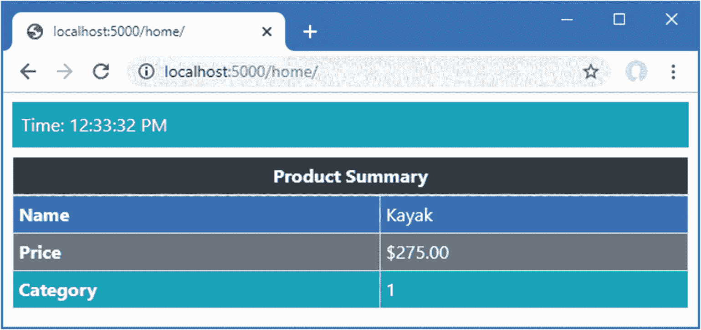

图 25-14。

使用标签助手组件

### 展开标签辅助组件元素选择

默认情况下，标签助手组件只处理`head`和`body`元素，但是可以通过创建一个从糟糕命名的`TagHelperComponentTagHelper`类派生的类来选择其他元素。将名为`TableFooterTagHelperComponent.cs`的类文件添加到`TagHelpers`文件夹中，并使用它来定义清单 [25-31](#PC48) 中所示的类。

```cs
using Microsoft.AspNetCore.Mvc.Razor.TagHelpers;
using Microsoft.AspNetCore.Mvc.Rendering;
using Microsoft.AspNetCore.Razor.TagHelpers;
using Microsoft.Extensions.Logging;

namespace WebApp.TagHelpers {

   [HtmlTargetElement("table")]
    public class TableFooterSelector: TagHelperComponentTagHelper {

        public TableFooterSelector(ITagHelperComponentManager mgr,
            ILoggerFactory log): base(mgr, log) { }
    }

    public class TableFooterTagHelperComponent: TagHelperComponent {

        public override void Process(TagHelperContext context,
                TagHelperOutput output) {

            if (output.TagName == "table") {
                TagBuilder cell = new TagBuilder("td");
                cell.Attributes.Add("colspan", "2");
                cell.Attributes.Add("class", "bg-dark text-white text-center");
                cell.InnerHtml.Append("Table Footer");
                TagBuilder row = new TagBuilder("tr");
                row.InnerHtml.AppendHtml(cell);
                TagBuilder footer = new TagBuilder("tfoot");
                footer.InnerHtml.AppendHtml(row);
                output.PostContent.AppendHtml(footer);
            }
        }
    }
}

Listing 25-31.The Contents of the TableFooterTagHelperComponent.cs File in the TagHelpers Folder

```

`TableFooterSelector`类是从`TagHelperComponentTagHelper`中派生出来的，它由`HtmlTargetElement`属性修饰，该属性扩展了应用的标签助手组件所处理的元素的范围。在这种情况下，属性选择`table`元素。

在同一个文件中定义的`TableFooterTagHelperComponent`类是一个标记助手组件，它通过添加一个代表表尾的`tfoot`元素来转换`table`元素。

Caution

请记住，当您创建一个新的`TagHelperComponentTagHelper`时，所有的标记辅助组件都将接收到由`HtmlTargetAttribute`元素选择的元素。

tag helper 组件必须注册为服务才能接收转换的元素，但是 tag helper 组件 tag helper(这是我多年来见过的最糟糕的命名选择之一)是自动发现和应用的。清单 [25-32](#PC49) 添加了标签助手组件服务。

```cs
...
public void ConfigureServices(IServiceCollection services) {
    services.AddDbContext<DataContext>(opts => {
        opts.UseSqlServer(Configuration[
            "ConnectionStrings:ProductConnection"]);
        opts.EnableSensitiveDataLogging(true);
    });
    services.AddControllersWithViews().AddRazorRuntimeCompilation();
    services.AddRazorPages().AddRazorRuntimeCompilation();
    services.AddSingleton<CitiesData>();
    services.AddTransient<ITagHelperComponent, TimeTagHelperComponent>();
    services.AddTransient<ITagHelperComponent, TableFooterTagHelperComponent>();
}
...

Listing 25-32.Registering a Tag Helper Component in the Startup.cs File in the WebApp Folder

```

重启 ASP.NET Core 并使用浏览器请求一个呈现表格的 URL，比如`http://localhost:5000/home`或`http://localhost:5000/cities`。每个表格都会包含一个表尾，如图 [25-15](#Fig15) 所示。

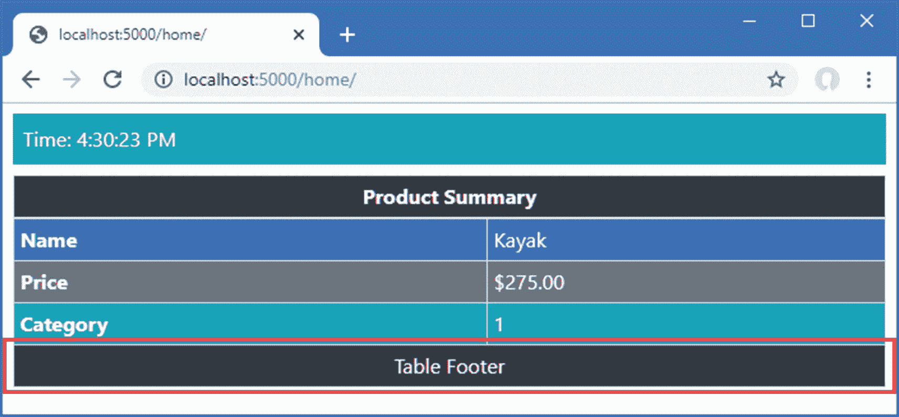

图 25-15。

展开标签辅助组件元素选择

## 摘要

在这一章中，我解释了标签助手是如何工作的，以及它们在视图和页面中转换 HTML 元素的作用。我向您展示了如何创建和应用标记助手，如何控制选择用于转换的元素，以及如何使用高级功能来获得特定的结果。在本章的最后，我解释了标记助手组件的特性，它们被定义为服务。在下一章中，我将描述 ASP.NET Core 提供的内置标签助手。