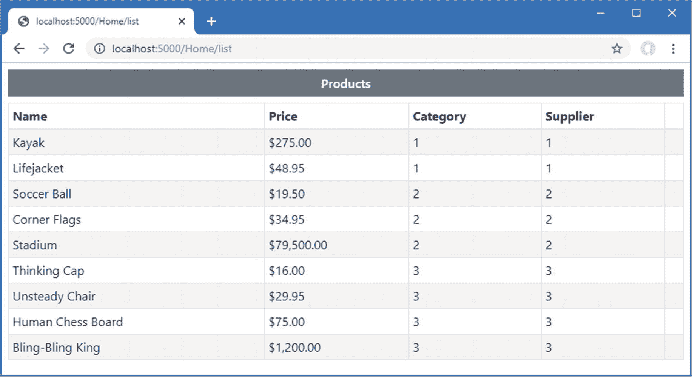
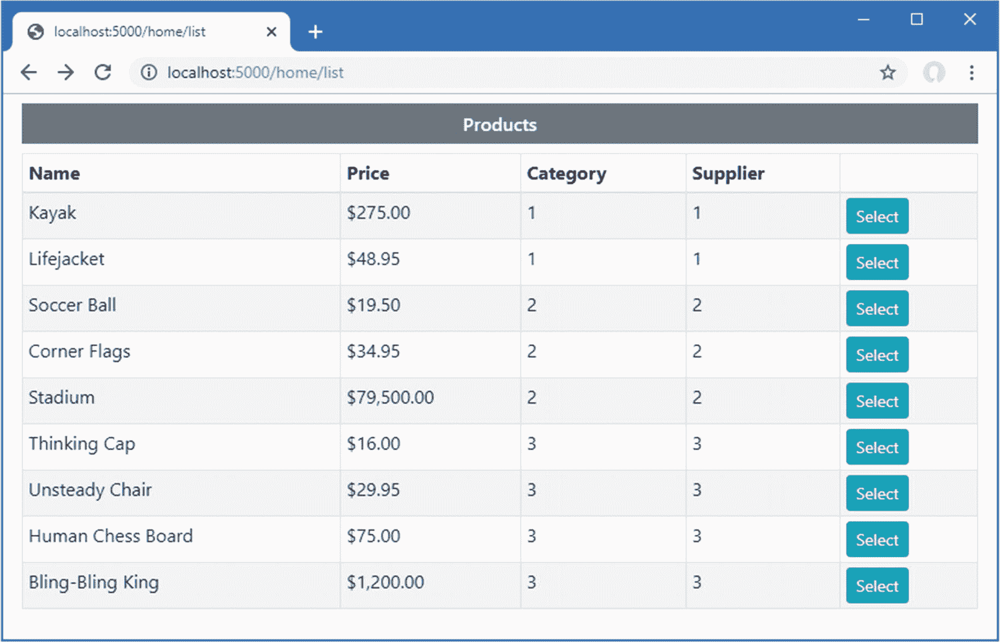
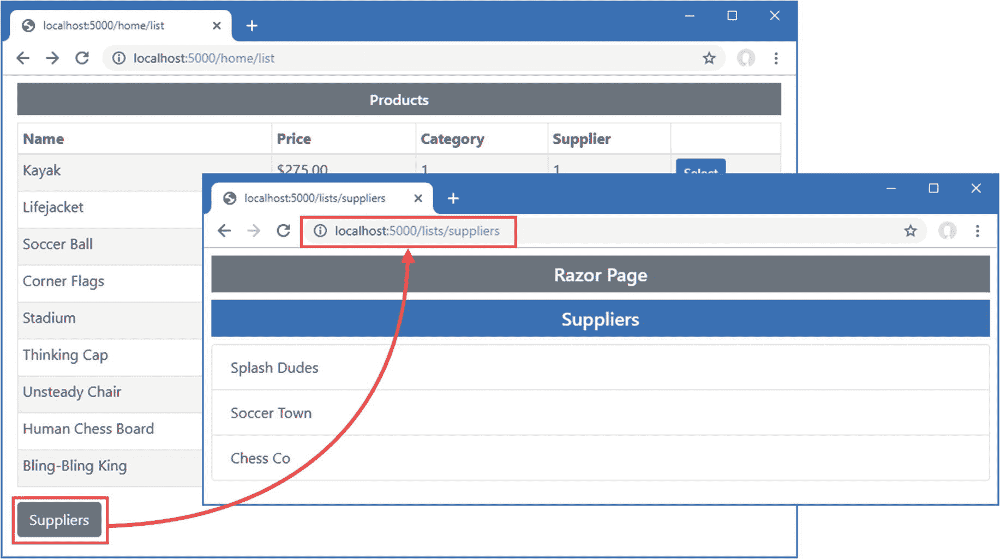
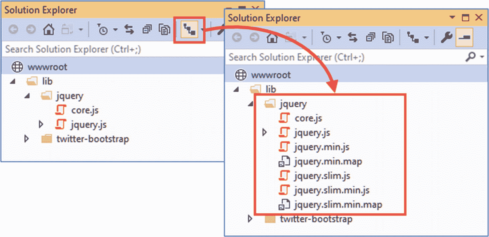
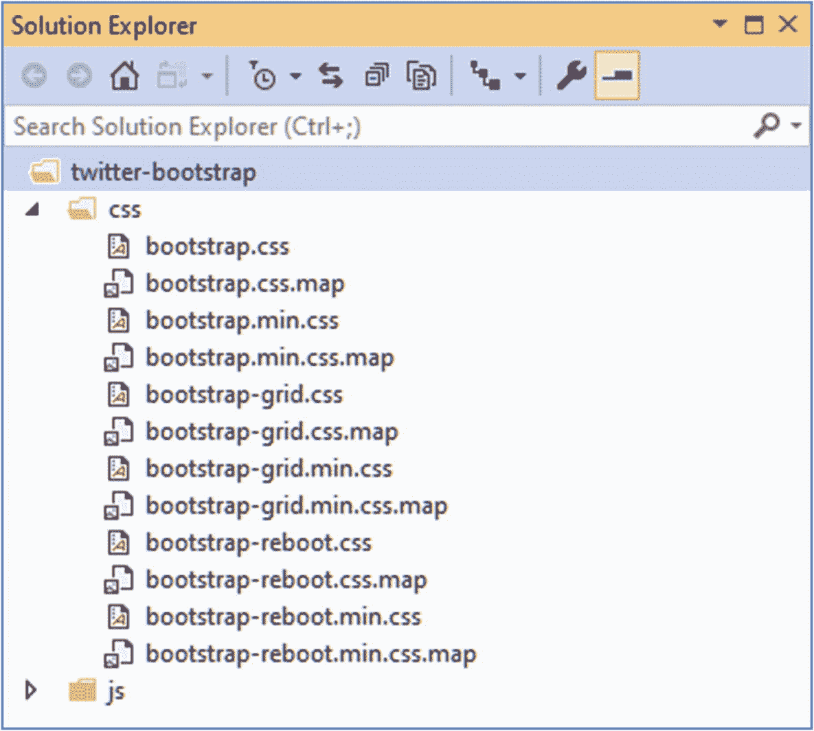
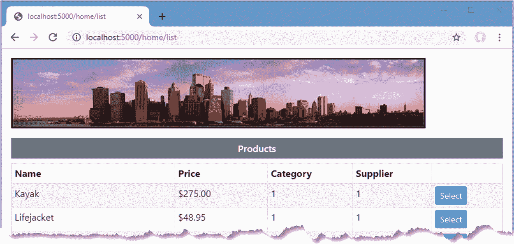
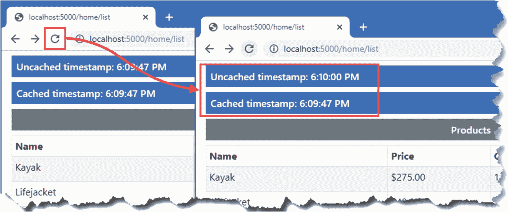
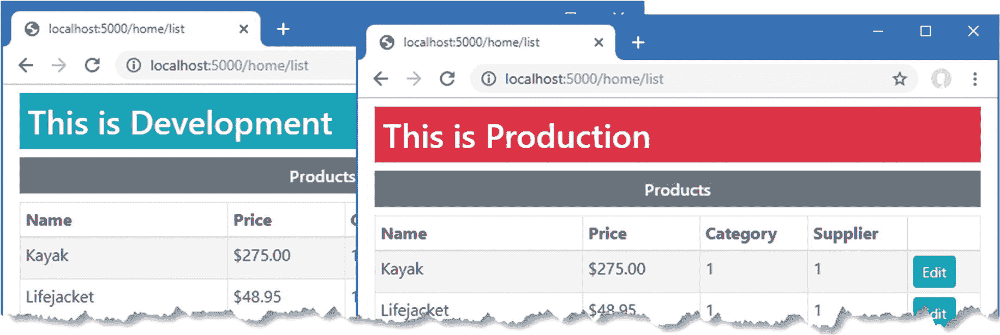

# 二十六、使用内置的标签助手

ASP.NET Core 提供了一组内置的标签助手，应用最常用的元素转换。在这一章中，我解释了那些处理锚、`script`、`link,`和图像元素的标签助手，以及用于缓存内容和基于环境选择内容的特性。在第 27 章[中，我描述了支持 HTML 表单的标签助手。表](27.html) [26-1](#Tab1) 将内置标签助手放在上下文中。

表 26-1。

将内置的标签助手放在上下文中

<colgroup><col class="tcol1 align-left"> <col class="tcol2 align-left"></colgroup> 
| 

问题

 | 

回答

 |
| --- | --- |
| 它们是什么？ | 内置的标签助手在 HTML 元素上执行通常需要的转换。 |
| 它们为什么有用？ | 使用内置标签助手意味着你不必使用第 [25](25.html) 章中的技术来创建自定义助手。 |
| 它们是如何使用的？ | 使用标准 HTML 元素上的属性或通过自定义 HTML 元素来应用标记助手。 |
| 有什么陷阱或限制吗？ | 不，这些标签助手已经过充分测试，并且易于使用。除非您有特殊的需求，否则使用这些标记助手比自定义实现更好。 |
| 有其他选择吗？ | 这些标签助手是可选的，它们的使用不是必需的。 |

表 [26-2](#Tab2) 总结了本章内容。

表 26-2。

章节总结

<colgroup><col class="tcol1 align-left"> <col class="tcol2 align-left"> <col class="tcol3 align-left"></colgroup> 
| 

问题

 | 

解决办法

 | 

列表

 |
| --- | --- | --- |
| 创建以端点为目标的元素 | 使用锚元素标签辅助属性 | 7, 8 |
| 在响应中包含 JavaScript 文件 | 使用 JavaScript 标签辅助属性 | 9–13 |
| 在响应中包含 CSS 文件 | 使用 CSS 标签辅助属性 | 14, 15 |
| 管理图像缓存 | 使用图像标签辅助属性 | Sixteen |
| 缓存视图的部分 | 使用缓存标签助手 | 17–21 |
| 根据应用环境改变内容 | 使用环境标签助手 | Twenty-two |

## 为本章做准备

本章使用了第 25 章中的 WebApp 项目。为了准备本章，注释掉在`Startup`类中注册标签组件助手的语句，如清单 [26-1](#PC1) 所示。

Tip

你可以从 [`https://github.com/apress/pro-asp.net-core-3`](https://github.com/apress/pro-asp.net-core-3) 下载本章以及本书其他章节的示例项目。如果在运行示例时遇到问题，请参见第 [1](01.html) 章获取帮助。

```cs
using Microsoft.AspNetCore.Builder;
using Microsoft.Extensions.DependencyInjection;
using Microsoft.Extensions.Configuration;
using Microsoft.EntityFrameworkCore;
using WebApp.Models;
//using Microsoft.AspNetCore.Razor.TagHelpers;
//using WebApp.TagHelpers;

namespace WebApp {
    public class Startup {

        public Startup(IConfiguration config) {
            Configuration = config;
        }

        public IConfiguration Configuration { get; set; }

        public void ConfigureServices(IServiceCollection services) {
            services.AddDbContext<DataContext>(opts => {
                opts.UseSqlServer(Configuration[
                    "ConnectionStrings:ProductConnection"]);
                opts.EnableSensitiveDataLogging(true);
            });
            services.AddControllersWithViews().AddRazorRuntimeCompilation();
            services.AddRazorPages().AddRazorRuntimeCompilation();
            services.AddSingleton<CitiesData>();
            //services.AddTransient<ITagHelperComponent, TimeTagHelperComponent>();
            //services.AddTransient<ITagHelperComponent,
            //      TableFooterTagHelperComponent>();
        }

        public void Configure(IApplicationBuilder app, DataContext context) {
            app.UseDeveloperExceptionPage();
            app.UseStaticFiles();
            app.UseRouting();
            app.UseEndpoints(endpoints => {
                endpoints.MapControllers();
                endpoints.MapDefaultControllerRoute();
                endpoints.MapRazorPages();
            });
            SeedData.SeedDatabase(context);
        }
    }
}

Listing 26-1.The Contents of the Startup.cs File in the WebApp Folder

```

接下来，更新`Views/Home`文件夹中的`_RowPartial.cshtml`局部视图，做出清单 [26-2](#PC2) 中所示的更改。

```cs
@model Product

<tr>
    <td>@Model.Name</td>
    <td>@Model.Price.ToString("c")</td>
    <td>@Model.CategoryId</td>
    <td>@Model.SupplierId</td>
    <td></td>
</tr>

Listing 26-2.Making Changes in the _RowPartial.cshtml File in the Views/Home Folder

```

添加清单 [26-3](#PC3) 中所示的元素，以定义在`Home`控制器的`List`视图中呈现的表格中的附加列。

```cs
@model IEnumerable<Product>
@{ Layout = "_SimpleLayout"; }

<h6 class="bg-secondary text-white text-center m-2 p-2">Products</h6>
<div class="m-2">
    <table class="table table-sm table-striped table-bordered">
        <thead>
            <tr>
                <th>Name</th><th>Price</th>
                <th>Category</th><th>Supplier</th><th></th>
            </tr>
        </thead>
        <tbody>
            @foreach (Product p in Model) {
                <partial name="_RowPartial" model="p" />
            }
        </tbody>
    </table>
</div>

Listing 26-3.Adding Elements in the List.cshtml File in the Views/Home Folder

```

### 添加图像文件

本章描述的标签助手之一为图像提供服务。我创建了`wwwroot/images`文件夹，并添加了一个名为`city.png`的图像文件。这是纽约市天际线的公共区域全景，如图 [26-1](#Fig1) 所示。


图 26-1。

将图像添加到项目

这个图像文件包含在本章的源代码中，可以在本书的 GitHub 资源库中找到。如果您不想下载示例项目，可以替换您自己的图像。

### 安装客户端软件包

本章中的一些例子展示了标签助手对处理 JavaScript 文件的支持，为此我使用了 jQuery 包。使用 PowerShell 命令提示符运行项目文件夹中清单 [26-4](#PC4) 所示的命令，该文件夹包含`WebApp.csproj`文件。如果您使用的是 Visual Studio，可以选择“项目➤管理客户端库”来选择 jQuery 包。

```cs
libman install jquery@3.4.1 -d wwwroot/lib/jquery

Listing 26-4.Installing a Package

```

### 正在删除数据库

打开一个新的 PowerShell 命令提示符，导航到包含`WebApp.csproj`文件的文件夹，运行清单 [26-5](#PC5) 中所示的命令来删除数据库。

```cs
dotnet ef database drop --force

Listing 26-5.Dropping the Database

```

### 运行示例应用

从 Debug 菜单中选择 Start Without Debugging 或 Run Without Debugging，或者使用 PowerShell 命令提示符运行清单 [26-6](#PC6) 中所示的命令。

```cs
dotnet run

Listing 26-6.Running the Example Application

```

使用浏览器请求`http://localhost:5000/Home/list`，将显示产品列表，如图 [26-2](#Fig2) 所示。



图 26-2。

运行示例应用

## 启用内置标签助手

内置的标记帮助器都是在`Microsoft.AspNetCore.Mvc.TagHelpers`名称空间中定义的，并通过向单个视图或页面添加一个`@addTagHelpers`指令来启用，或者在示例项目中，添加到视图导入文件。下面是来自`Views`文件夹中的`_ViewImports.cshtml`文件的必需指令，它为控制器视图启用了内置的标签助手:

```cs
@using WebApp.Models
@addTagHelper *, Microsoft.AspNetCore.Mvc.TagHelpers
@using WebApp.Components
@addTagHelper *, WebApp

```

下面是`Pages`文件夹中的`_ViewImports.cshtml`文件中的相应指令，它启用了 Razor 页面的内置标签帮助器:

```cs
@namespace WebApp.Pages
@using WebApp.Models
@addTagHelper *, Microsoft.AspNetCore.Mvc.TagHelpers
@addTagHelper *, WebApp

```

这些指令被添加到第 [24](24.html) 章的示例项目中，以启用视图组件特性。

## 变换锚元素

`a`元素是导航应用和向应用发送 GET 请求的基本工具。`AnchorTagHelper`类用于转换`a`元素的`href`属性，使它们以使用路由系统生成的 URL 为目标，这意味着不需要硬编码的 URL，路由配置的变化将自动反映在应用的锚元素中。表 [26-3](#Tab3) 描述了`AnchorTagHelper`类支持的属性。

表 26-3。

锚元素的内置标签辅助属性

<colgroup><col class="tcol1 align-left"> <col class="tcol2 align-left"></colgroup> 
| 

名字

 | 

描述

 |
| --- | --- |
| `asp-action` | 此属性指定 URL 将针对的操作方法。 |
| `asp-controller` | 此属性指定 URL 将指向的控制器。如果省略该属性，那么 URL 将指向呈现当前视图的控制器或页面。 |
| `asp-page` | 该属性指定 URL 将指向的 Razor 页面。 |
| `asp-page-handler` | 这个属性指定了 Razor 页面处理函数来处理请求，如第 [23](23.html) 章所述。 |
| `asp-fragment` | 该属性用于指定 URL 片段(出现在`#`字符之后)。 |
| `asp-host` | 此属性指定 URL 将指向的主机的名称。 |
| `asp-protocol` | 此属性指定 URL 将使用的协议。 |
| `asp-route` | 此属性指定将用于生成 URL 的路由的名称。 |
| `asp-route-*` | 名称以`asp-route-`开头的属性用于指定 URL 的附加值，因此`asp-route-id`属性用于向路由系统提供`id`段的值。 |
| `asp-all-route-data` | 此属性将用于路由的值作为单个值提供，而不是使用单个属性。 |

`AnchorTagHelper`简单且可预测，使得在使用应用路由配置的`a`元素中生成 URL 变得容易。清单 [26-7](#PC9) 添加了一个锚元素，该元素使用表中的属性创建一个 URL，该 URL 指向由`Home`控制器定义的另一个动作。

```cs
@model Product

<tr>
    <td>@Model.Name</td>
    <td>@Model.Price.ToString("c")</td>
    <td>@Model.CategoryId</td>
    <td>@Model.SupplierId</td>
    <td>
        <a asp-action="index" asp-controller="home" asp-route-id="@Model.ProductId"
                class="btn btn-sm btn-info">
            Select
        </a>
    </td>
</tr>

Listing 26-7.Transforming an Element in the _RowPartial.cshtml File in the Views/Home Folder

```

`asp-action`和`asp-controller`属性指定动作方法的名称和定义它的控制器。使用`asp-route-[name]`属性定义段变量的值，这样`asp-route-id`属性为`id`段变量提供一个值，该值用于为`asp-action`属性选择的动作方法提供一个参数。

Tip

添加到清单 [26-7](#PC9) 中锚元素的`class`属性应用了引导 CSS 框架样式，赋予元素按钮的外观。这不是使用标记助手的必要条件。

要查看锚元素转换，使用浏览器请求`http://localhost:5000/home/list`，这将产生如图 [26-3](#Fig3) 所示的响应。



图 26-3。

变换锚元素

如果您检查`Select`锚元素，您将会看到每个`href`属性都包括与其相关的`Product`对象的`ProductId`值，如下所示:

```cs
...
<a class="btn btn-sm btn-info" href="/Home/index/3">Select</a>
...

```

在这种情况下，由`asp-route-id`属性提供的值意味着不能使用默认的 URL，因此路由系统已经生成了一个 URL，它包括用于控制器和动作名称的段，以及一个将用于向动作方法提供参数的段。在这两种情况下，由于只指定了一个 action 方法，因此由 tag helper 创建的 URL 以呈现视图的控制器为目标。单击锚元素将发送一个 HTTP GET 请求，该请求的目标是`Home`控制器的`Index`方法。

### 为 Razor 页面使用锚元素

`asp-page`属性用于指定 Razor 页面作为锚元素的`href`属性的目标。页面的路径以`/`字符为前缀，由`@page`指令定义的路线段的值使用`asp-route-[name]`属性定义。清单 [26-8](#PC11) 添加了一个锚元素，它指向在`Pages/Suppliers`文件夹中定义的`List`页面。

Note

属性可以用来指定处理请求的页面模型处理器方法的名称。

```cs
@model IEnumerable<Product>
@{
    Layout = "_SimpleLayout";
}

<h6 class="bg-secondary text-white text-center m-2 p-2">Products</h6>
<div class="m-2">
    <table class="table table-sm table-striped table-bordered">
        <thead>
            <tr>
                <th>Name</th><th>Price</th>
                <th>Category</th><th>Supplier</th><th></th>
            </tr>
        </thead>
        <tbody>
            @foreach (Product p in Model) {
                <partial name="_RowPartial" model="p" />
            }
        </tbody>
    </table>
    <a asp-page="/suppliers/list" class="btn btn-secondary">Suppliers</a>
</div>

Listing 26-8.Targeting a Razor Page in the List.cshtml File in the Views/Home Folder

```

使用浏览器请求`http://localhost:5000/home/list`，您将看到锚元素，它被设计成按钮的样式。如果您检查发送到客户端的 HTML，您会看到锚元素已经被转换成这样:

```cs
...
<a class="btn btn-secondary" href="/lists/suppliers">Suppliers</a>
...

```

在`href`属性中使用的这个 URL 反映了`@page`指令，该指令已经用于覆盖该页面中的默认路由约定。点击该元素，浏览器会显示 Razor 页面，如图 [26-4](#Fig4) 所示。



图 26-4。

用锚元素定位 Razor 页面

Generating URLs (And Not Links)

tag helper 只在锚元素中生成 URL。如果您需要生成一个 URL，而不是一个链接，那么您可以使用`Url`属性，该属性在控制器、页面模型和视图中可用。该属性返回一个实现了`IUrlHelper`接口的对象，该接口提供了一组生成 URL 的方法和扩展方法。下面是在视图中生成 URL 的 Razor 片段:

```cs
...
<div>@Url.Page("/suppliers/list")</div>
...

```

这个片段产生一个`div`元素，其内容是指向`/Suppliers/List` Razor 页面的 URL。控制器或页面模型类中使用了相同的接口，如以下语句:

```cs
...
string url = Url.Action("List", "Home");
...

```

该语句生成一个 URL，它指向`Home`控制器上的`List`动作，并将其分配给名为`url`的`string`变量。

## 使用 JavaScript 和 CSS 标签助手

ASP.NET Core 提供了标签助手，用于通过`script`和`link`元素管理 JavaScript 文件和 CSS 样式表。正如您将在接下来的小节中看到的，这些标记助手功能强大且灵活，但是需要密切关注以避免产生意外的结果。

### 管理 JavaScript 文件

`ScriptTagHelper`类是`script`元素的内置标签助手，用于使用表 [26-4](#Tab4) 中描述的属性来管理视图中 JavaScript 文件的包含，我将在下面的章节中描述这些属性。

表 26-4。

脚本元素的内置标签助手属性

<colgroup><col class="tcol1 align-left"> <col class="tcol2 align-left"></colgroup> 
| 

名字

 | 

描述

 |
| --- | --- |
| `asp-src-include` | 该属性用于指定视图中将包含的 JavaScript 文件。 |
| `asp-src-exclude` | 该属性用于指定将从视图中排除的 JavaScript 文件。 |
| `asp-append-version` | 该属性用于缓存破坏，如“了解缓存破坏”侧栏中所述。 |
| `asp-fallback-src` | 此属性用于指定在内容交付网络出现问题时使用的备用 JavaScript 文件。 |
| `asp-fallback-src-include` | 此属性用于选择在内容交付网络出现问题时将使用的 JavaScript 文件。 |
| `asp-fallback-src-exclude` | 此属性用于排除 JavaScript 文件，以便在出现内容交付网络问题时显示它们的用途。 |
| `asp-fallback-test` | 此属性用于指定 JavaScript 的一个片段，该片段将用于确定 JavaScript 代码是否已从内容交付网络正确加载。 |

#### 选择 JavaScript 文件

`asp-src-include`属性用于在使用 globbing 模式的视图中包含 JavaScript 文件。Globbing 模式支持一组用于匹配文件的通配符，表 [26-5](#Tab5) 描述了最常见的 globbing 模式。

表 26-5。

常见的球状模式

<colgroup><col class="tcol1 align-left"> <col class="tcol2 align-left"> <col class="tcol3 align-left"></colgroup> 
| 

模式

 | 

例子

 | 

描述

 |
| --- | --- | --- |
| `?` | `js/src?.js` | 该模式匹配除`/`之外的任何单个字符。该示例匹配包含在`js`目录中的任何文件，其名称为`src`，后跟任意字符，后跟`.js`，例如`js/src1.js`和`js/srcX.js`，但不匹配`js/src123.js`或`js/mydir/src1.js`。 |
| `*` | `js/*.js` | 该模式匹配除`/`之外的任意数量的字符。该示例匹配包含在`js`目录中带有`.js`文件扩展名的任何文件，例如`js/src1.js`和`js/src123.js`，但不匹配`js/mydir/src1.js`。 |
| `**` | `js/**/*.js` | 这个模式匹配任意数量的字符，包括`/`。该示例匹配包含在`js`目录或任何子目录(如`/js/src1.js`和`/js/mydir/src1.js`)中扩展名为`.js`的任何文件。 |

Globbing 是一种确保视图包含应用所需的 JavaScript 文件的有用方法，即使文件的确切路径发生了变化，这通常发生在文件名中包含版本号或者包添加了附加文件的情况下。

清单 [26-9](#PC15) 使用`asp-src-include`属性来包含`wwwroot/lib/jquery`文件夹中的所有 JavaScript 文件，这是用清单 [26-4](#PC4) 中的命令安装的 jQuery 包的位置。

```cs
<!DOCTYPE html>
<html>
<head>
    <title>@ViewBag.Title</title>
    <link href="/lib/twitter-bootstrap/css/bootstrap.min.css" rel="stylesheet" />
    <script asp-src-include="lib/jquery/**/*.js"></script>
</head>
<body>
    <div class="m-2">
        @RenderBody()
    </div>
</body>
</html>

Listing 26-9.Selecting JS Files in the _SimpleLayout.cshtml File in the Views/Shared Folder

```

模式在`wwwroot`文件夹中进行评估，我使用的模式定位任何带有`js`文件扩展名的文件，不管它在`wwwroot`文件夹中的位置；这意味着添加到项目中的任何 JavaScript 包都将包含在发送给客户端的 HTML 中。

使用浏览器请求`http://localhost:5000/home/list`并检查发送到浏览器的 HTML。您将看到布局中的单个`script`元素已经被转换为每个 JavaScript 文件的一个`script`元素，如下所示:

```cs
...
<head>
  <title></title>
  <link href="/lib/twitter-bootstrap/css/bootstrap.min.css" rel="stylesheet">
  <script src="/lib/jquery/core.js"></script>
  <script src="/lib/jquery/jquery.js"></script>
  <script src="/lib/jquery/jquery.min.js"></script>
  <script src="/lib/jquery/jquery.slim.js"></script>
  <script src="/lib/jquery/jquery.slim.min.js"></script>

</head>
...

```

如果您正在使用 Visual Studio，您可能没有意识到 jQuery 包包含如此多的 JavaScript 文件，因为 Visual Studio 将它们隐藏在解决方案资源管理器中。要显示客户端包文件夹的完整内容，您可以在解决方案资源管理器窗口中展开单个嵌套条目，或者通过单击解决方案资源管理器窗口顶部的按钮禁用文件嵌套，如图 [26-5](#Fig5) 所示。(Visual Studio 代码不嵌套文件。)



图 26-5。

在 Visual Studio 解决方案资源管理器中禁用文件嵌套

Understanding Source Maps

JavaScript 文件被缩小以使它们更小，这意味着它们可以更快地交付给客户端，并且使用更少的带宽。缩小过程会删除文件中的所有空格，并重命名函数和变量，这样有意义的名称(如`myHelpfullyNamedFunction`)就可以用更少的字符(如`x1`)来表示。当使用浏览器的 JavaScript 调试器来追踪你的精简代码中的问题时，像`x1`这样的名字使得你几乎不可能跟踪代码的进展。

文件扩展名为`map`的文件是*源映射*，浏览器通过提供精简代码和开发人员可读的非精简源文件之间的映射来帮助调试精简代码。当您打开浏览器的 F12 开发人员工具时，浏览器将自动请求源地图，并使用它们来帮助调试应用的客户端代码。

#### 缩小球状模式

没有一个应用需要清单 [26-9](#PC15) 中模式选择的所有文件。许多包包含多个 JavaScript 文件，这些文件包含相似的内容，通常会删除不太受欢迎的功能以节省带宽。jQuery 包包括`jquery.slim.js`文件，它包含与`jquery.js`文件相同的代码，但是没有处理异步 HTTP 请求和动画效果的特性。(还有一个`core.js`文件，但这是误包含在包里的，应该忽略。)

每个文件都有一个扩展名为`min.js`的副本，表示一个缩小的文件。缩小通过删除所有空格并重命名函数和变量以使用更短的名称来减小 JavaScript 文件的大小。

每个包只需要一个 JavaScript 文件，如果您只需要缩小的版本，这是大多数项目的情况，那么您可以限制 globbing 模式匹配的文件集，如清单 [26-10](#PC17) 所示。

```cs
<!DOCTYPE html>
<html>
<head>
    <title>@ViewBag.Title</title>
    <link href="/lib/twitter-bootstrap/css/bootstrap.min.css" rel="stylesheet" />
    <script asp-src-include="lib/jquery**/*.min.js"></script>
</head>
<body>
    <div class="m-2">
        @RenderBody()
    </div>
</body>
</html>

Listing 26-10.Selecting Minified Files in the _SimpleLayout.cshtml File in the Views/Shared Folder

```

使用浏览器再次请求`http://localhost:5000/home/list`，并检查应用发送的 HTML。您将看到只有缩小的文件被选中。

```cs
...
<head>
  <title></title>
  <link href="/lib/twitter-bootstrap/css/bootstrap.min.css" rel="stylesheet">
  <script src="/lib/jquery/jquery.min.js"></script>
  <script src="/lib/jquery/jquery.slim.min.js"></script>
</head>
...

```

缩小 JavaScript 文件的模式有所帮助，但浏览器最终仍然会显示普通和精简版本的 jQuery 以及捆绑和非捆绑版本的引导 JavaScript 文件。为了进一步缩小选择范围，我可以在模式中包含`slim`，如清单 [26-11](#PC19) 所示。

```cs
<!DOCTYPE html>
<html>
<head>
    <title>@ViewBag.Title</title>
    <link href="/lib/twitter-bootstrap/css/bootstrap.min.css" rel="stylesheet" />
    <script asp-src-include="lib/jquery**/*slim.min.js"></script>
</head>
<body>
    <div class="m-2">
        @RenderBody()
    </div>
</body>
</html>

Listing 26-11.Narrowing the Focus in the _SimpleLayout.cshtml File in the Views/Shared Folder

```

使用浏览器请求`http://localhost:5000/home/list`并检查浏览器收到的 HTML。`script`元素被转换成这样:

```cs
...
<head>
  <title></title>
  <link href="/lib/twitter-bootstrap/css/bootstrap.min.css" rel="stylesheet">
  <script src="/lib/jquery/jquery.slim.min.js"></script>
</head>
...

```

只有一个版本的 jQuery 文件将被发送到浏览器，同时保留文件位置的灵活性。

##### 排除文件

当您想要选择一个文件名包含特定术语(如`slim`)的文件时，缩小 JavaScript 文件的模式很有帮助。当您想要的文件没有该术语时，例如当您想要缩小文件的完整版本时，这是没有帮助的。幸运的是，您可以使用`asp-src-exclude`属性从与`asp-src-include`属性匹配的列表中删除文件，如清单 [26-12](#PC21) 所示。

```cs
<!DOCTYPE html>
<html>
<head>
    <title>@ViewBag.Title</title>
    <link href="/lib/twitter-bootstrap/css/bootstrap.min.css" rel="stylesheet" />
    <script asp-src-include="/lib/jquery/**/*.min.js"
         asp-src-exclude="**.slim.**">
    </script>
</head>
<body>
    <div class="m-2">
        @RenderBody()
    </div>
</body>
</html>

Listing 26-12.Excluding Files in the _SimpleLayout.cshtml File in the Views/Shared Folder

```

如果您使用浏览器请求`http://localhost:5000/home/list`并检查 HTML 响应，您将看到`script`元素仅链接到 jQuery 库的完整缩小版本，如下所示:

```cs
...
<head>
    <title></title>
    <link href="/lib/twitter-bootstrap/css/bootstrap.min.css" rel="stylesheet">
    <script src="/lib/jquery/jquery.min.js"></script>
</head>
...

```

Understanding Cache Busting

静态内容，比如图像、CSS 样式表和 JavaScript 文件，经常被缓存，以阻止对很少改变的内容的请求到达应用服务器。缓存可以通过不同的方式完成:服务器可以告诉浏览器缓存内容，应用可以使用缓存服务器来补充应用服务器，或者可以使用内容交付网络分发内容。并非所有的缓存都在您的控制之下。例如，大公司经常安装高速缓存以减少其带宽需求，因为相当大比例的请求倾向于去往相同的站点或应用。

缓存的一个问题是，当您部署静态文件时，客户端不会立即收到新版本的静态文件，因为它们的请求仍然由以前缓存的内容提供服务。最终，缓存的内容将过期，而新的内容将被使用，但这留下了一段时间，应用控制器生成的动态内容与缓存提供的静态内容不同步。这可能会导致布局问题或意外的应用行为，具体取决于已更新的内容。

解决这个问题被称为*缓存破坏*。其思想是允许缓存处理静态内容，但立即反映服务器上所做的任何更改。tag helper 类通过向静态内容的 URL 添加查询字符串来支持缓存破坏，该查询字符串包括充当版本号的校验和。例如，对于 JavaScript 文件，`ScriptTagHelper`类通过`asp-append-version`属性支持缓存破坏，如下所示:

```cs
...
<script asp-src-include="/lib/jquery/**/*.min.js"
    asp-src-exclude="**.slim.**" asp-append-version="true">
</script>
...

```

启用缓存破坏功能会在发送到浏览器的 HTML 中产生如下元素:

```cs
...
<script src="/lib/jquery/dist/jquery.min.js?v=3zRSQ1HF-ocUiVcdv9yKTXqM"></script>
...

```

标记助手将使用相同的版本号，直到您更改文件的内容，例如通过更新 JavaScript 库，此时将计算不同的校验和。添加版本号意味着每次更改文件时，客户机都会请求一个不同的 URL，缓存会将它视为对新内容的请求，这些新内容无法满足以前缓存的内容，并传递给应用服务器。然后内容被正常缓存，直到下一次更新，产生另一个不同版本的 URL。

#### 使用内容交付网络

内容交付网络(cdn)用于将对应用内容的请求卸载到离用户更近的服务器。浏览器不是从您的服务器请求 JavaScript 文件，而是从解析到地理上本地的服务器的主机名请求它，这减少了加载文件所需的时间，并减少了您必须为应用提供的带宽量。如果您有一个庞大的、地理上分散的用户群，那么注册 CDN 具有商业意义，但是即使是最小最简单的应用也可以从使用主要技术公司运营的免费 CDN 来交付公共 JavaScript 包(如 jQuery)中受益。

对于这一章，我将使用 CDNJS，它是库管理器工具在 ASP.NET Core 项目中安装客户端软件包时使用的同一 CDN。可以在 [`https://cdnjs.com`](https://cdnjs.com) 搜索套餐；对于 jQuery 3.4.1，也就是清单 [26-4](#PC4) 中安装的包和版本，有六个 CDNJS URLs。

*   [T2`https://cdnjs.cloudflare.com/ajax/libs/jquery/3.4.1/jquery.js`](https://cdnjs.cloudflare.com/ajax/libs/jquery/3.4.1/jquery.js)

*   [T2`https://cdnjs.cloudflare.com/ajax/libs/jquery/3.4.1/jquery.min.js`](https://cdnjs.cloudflare.com/ajax/libs/jquery/3.4.1/jquery.min.js)

*   [T2`https://cdnjs.cloudflare.com/ajax/libs/jquery/3.4.1/jquery.min.map`](https://cdnjs.cloudflare.com/ajax/libs/jquery/3.4.1/jquery.min.map)

*   [T2`https://cdnjs.cloudflare.com/ajax/libs/jquery/3.4.1/jquery.slim.js`](https://cdnjs.cloudflare.com/ajax/libs/jquery/3.4.1/jquery.slim.js)

*   [T2`https://cdnjs.cloudflare.com/ajax/libs/jquery/3.4.1/jquery.slim.min.js`](https://cdnjs.cloudflare.com/ajax/libs/jquery/3.4.1/jquery.slim.min.js)

*   [T2`https://cdnjs.cloudflare.com/ajax/libs/jquery/3.4.1/jquery.slim.min.map`](https://cdnjs.cloudflare.com/ajax/libs/jquery/3.4.1/jquery.slim.min.map)

这些 URL 为完整版和精简版 jQuery 提供了常规 JavaScript 文件、精简版 JavaScript 文件和精简版文件的源映射。(还有一个用于`core.js`文件的 URL，但是，如前所述，这个文件没有被使用，并且将从未来的 jQuery 版本中删除。)

CDN 的问题在于它们不受您组织的控制，这意味着它们可能会失败，使您的应用运行，但无法按预期工作，因为 CDN 内容不可用。当客户端无法加载 CDN 内容时，`ScriptTagHelper`类提供了回退到本地文件的能力，如清单 [26-13](#PC25) 所示。

```cs
<!DOCTYPE html>
<html>
<head>
    <title>@ViewBag.Title</title>
    <link href="/lib/twitter-bootstrap/css/bootstrap.min.css" rel="stylesheet" />
    <script src="https://cdnjs.cloudflare.com/ajax/libs/jquery/3.4.1/jquery.min.js"
         asp-fallback-src="/lib/jquery/jquery.min.js"
         asp-fallback-test="window.jQuery">
    </script>
</head>
<body>
    <div class="m-2">
        @RenderBody()
    </div>
</body>
</html>

Listing 26-13.Using CDN Fallback in the _SimpleLayout.cshtml File in the Views/Shared Folder

```

`src`属性用于指定 CDN URL。`asp-fallback-src`属性用于指定一个本地文件，如果 CDN 无法交付常规`src`属性指定的文件，将使用该文件。为了判断 CDN 是否在工作，使用了`asp-fallback-test`属性来定义将在浏览器上评估的 JavaScript 片段。如果片段评估为`false`，那么将请求回退文件。

Tip

`asp-fallback-src-include`和`asp-fallback-src-exclude`属性可用于选择具有 globbing 模式的本地文件。然而，鉴于 CDN `script`元素选择单个文件，我建议使用`asp-fallback-src attribute`来选择相应的本地文件，如示例所示。

使用浏览器请求`http://localhost:5000/home/list`，您将看到 HTML 响应包含两个`script`元素，如下所示:

```cs
...
<head>
    <title></title>
    <link href="/lib/twitter-bootstrap/css/bootstrap.min.css" rel="stylesheet">
    <script src="https://cdnjs.cloudflare.com/ajax/libs/jquery/3.4.1/jquery.min.js"></script>
    <script>
        (window.jQuery||document.write("\u003Cscript
           src=\u0022/lib/jquery/jquery.min.js\u0022\u003E\u003C/script\u003E"));
    </script>
</head>
...

```

第一个`script`元素从 CDN 请求 JavaScript 文件。第二个`script`元素评估由`asp-fallback-test`属性指定的 JavaScript 片段，检查第一个`script`元素是否有效。如果片段评估为`true`，那么不采取任何行动，因为 CDN 工作了。如果片段评估为`false`，一个新的`script`元素被添加到 HTML 文档中，指示浏览器从回退 URL 加载 JavaScript 文件。

测试你的回退设置很重要，因为在 CDN 停止工作，你的用户无法访问你的应用之前，你不会发现它们是否失败。检查回退的最简单方法是将由`src`属性指定的文件名更改为您知道不存在的名称(我将单词`FAIL`附加到文件名上),然后查看浏览器使用 F12 开发人员工具发出的网络请求。您应该会看到 CDN 文件的一个错误，后面是对回退文件的请求。

Caution

CDN 回退特性依赖于浏览器同步加载和执行`script`元素的内容，并且按照它们被定义的顺序。有许多技术可以通过使过程异步来加速 JavaScript 加载和执行，但这些技术可能会导致在浏览器从 CDN 中检索文件并执行其内容之前执行回退测试，从而导致即使在 CDN 正常工作时也请求回退文件，这首先会破坏 CDN 的使用。不要将异步脚本加载与 CDN 回退功能混合使用。

### 管理 CSS 样式表

`LinkTagHelper`类是`link`元素的内置标签助手，用于管理视图中 CSS 样式表的包含。这个标签助手支持表 [26-6](#Tab6) 中描述的属性，我将在下面的章节中演示。

表 26-6。

链接元素的内置标签助手属性

<colgroup><col class="tcol1 align-left"> <col class="tcol2 align-left"></colgroup> 
| 

名字

 | 

描述

 |
| --- | --- |
| `asp-href-include` | 该属性用于为输出元素的`href`属性选择文件。 |
| `asp-href-exclude` | 该属性用于从输出元素的`href`属性中排除文件。 |
| `asp-append-version` | 该属性用于启用缓存破坏，如“了解缓存破坏”侧栏中所述。 |
| `asp-fallback-href` | 此属性用于指定 CDN 出现问题时的后备文件。 |
| `asp-fallback-href-include` | 此属性用于选择出现 CDN 问题时将使用的文件。 |
| `asp-fallback-href-exclude` | 此属性用于从出现 CDN 问题时使用的文件集中排除文件。 |
| `asp-fallback-href-test-class` | 该属性用于指定将用于测试 CDN 的 CSS 类。 |
| `asp-fallback-href-test-property` | 该属性用于指定将用于测试 CDN 的 CSS 属性。 |
| `asp-fallback-href-test-value` | 该属性用于指定将用于测试 CDN 的 CSS 值。 |

#### 选择样式表

`LinkTagHelper`与`ScriptTagHelper`共享许多特性，包括支持 globbing 模式来选择或排除 CSS 文件，这样它们就不必被单独指定。能够准确地选择 CSS 文件和 JavaScript 文件一样重要，因为样式表可以有常规版本和缩小版本，并且支持源映射。流行的 Bootstrap 包，我在本书中一直用它来设计 HTML 元素的样式，在`wwwroot/lib/twitter-bootstrap/css`文件夹中包含了它的 CSS 样式表。这些将在 Visual Studio 代码中可见，但您必须在解决方案资源管理器中展开每一项或禁用嵌套才能在 Visual Studio 解决方案资源管理器中看到它们，如图 [26-6](#Fig6) 所示。



图 26-6。

引导 CSS 文件

`bootstrap.css`文件是常规样式表，`bootstrap.min.css`文件是缩小版本，`bootstrap.css.map`文件是源映射。其他文件包含 CSS 功能的子集，以节省不使用它们的应用的带宽。

清单 [26-14](#PC27) 用一个使用`asp-href-include`和`asp-href-exclude`属性的元素替换布局中的常规`link`元素。(我删除了 jQuery 的`script`元素，不再需要了。)

```cs
<!DOCTYPE html>
<html>
<head>
    <title>@ViewBag.Title</title>
    <link asp-href-include="/lib/twitter-bootstrap/css/*.min.css"
          asp-href-exclude="**/*-reboot*,**/*-grid*" rel="stylesheet" />
</head>
<body>
    <div class="m-2">
        @RenderBody()
    </div>
</body>
</html>

Listing 26-14.Selecting a Stylesheet in the _SimpleLayout.cshtml File in the Views/Shared Folder

```

选择 JavaScript 文件时同样需要注意细节，因为很容易为同一个文件的多个版本或您不想要的文件生成`link`元素。

#### 使用内容交付网络

`LinkTag` helper 类提供了一组属性，用于在 CDN 不可用时返回到本地内容，尽管测试样式表是否已加载的过程比测试 JavaScript 文件更复杂。清单 [26-15](#PC28) 将 CDNJS URL 用于引导 CSS 样式表。

```cs
<!DOCTYPE html>
<html>
<head>
    <title>@ViewBag.Title</title>
    <link href="https://cdnjs.cloudflare.com/ajax/libs/twitter-bootstrap/4.3.1/css/bootstrap.min.css"
        asp-fallback-href="/lib/twitter-bootstrap/css/bootstrap.min.css"
        asp-fallback-test-class="btn"
        asp-fallback-test-property="display"
        asp-fallback-test-value="inline-block"
        rel="stylesheet" />
</head>
<body>
    <div class="m-2">
        @RenderBody()
    </div>
</body>
</html>

Listing 26-15.Using a CDN for CSS in the _SimpleLayout.cshtml File in the Views/Home Folder

```

`href`属性用于指定 CDN URL，我使用了`asp-fallback-href`属性来选择在 CDN 不可用时使用的文件。然而，要测试 CDN 是否工作，需要使用三种不同的属性，并理解由正在使用的 CSS 样式表定义的 CSS 类。

使用浏览器请求`http://localhost:5000/home/list`并检查响应中的 HTML 元素。您将看到布局中的`link`元素已经被转换成三个独立的元素，如下所示:

```cs
...
<head>
    <title></title>
    <link href="https://cdnjs.cloudflare.com/.../bootstrap.min.css" rel="stylesheet">
    <meta name="x-stylesheet-fallback-test" content="" class="btn">
    <script>
      ! function(a, b, c, d) {
        var e, f = document,
          g = f.getElementsByTagName("SCRIPT"),
          h = g[g.length1].previousElementSibling,
          i = f.defaultView && f.defaultView.getComputedStyle ?
          f.defaultView.getComputedStyle(h) : h.currentStyle;
        if (i && i[a] !== b)
          for (e = 0; e < c.length; e++)
            f.write('<link href="' + c[e] + '" ' + d + "/>")
       }("display", "inline-block", ["/lib/twitter-bootstrap/css/bootstrap.min.css"],
          "rel=\u0022stylesheet\u0022 ");
    </script>
</head>
...

```

为了使转换更容易理解，我格式化了 JavaScript 代码并缩短了 URL。

第一个元素是一个常规的`link`，它的`href`属性指定了 CDN 文件。第二个元素是一个`meta`元素，它从视图的`asp-fallback-test-class`属性中指定类。我在清单中指定了`btn`类，这意味着像这样的元素被添加到发送给浏览器的 HTML 中:

```cs
<meta name="x-stylesheet-fallback-test" content="" class="btn">

```

您指定的 CSS 类必须在将从 CDN 加载的样式表中定义。我指定的`btn`类提供了引导按钮元素的基本格式。

`asp-fallback-test-property`属性用于指定 CSS 类应用于元素时设置的 CSS 属性，而`asp-fallback-test-value`属性用于指定它将被设置为的值。

由 tag helper 创建的`script`元素包含 JavaScript 代码，该代码将一个元素添加到指定的类中，然后测试 CSS 属性的值以确定 CDN 样式表是否已被加载。如果不是，则为回退文件创建一个`link`元素。Bootstrap `btn`类将`display`属性设置为`inline-block`，这提供了测试来查看浏览器是否能够从 CDN 加载 Bootstrap 样式表。

Tip

找出如何测试像 Bootstrap 这样的第三方包的最简单的方法是使用浏览器的 F12 开发工具。为了确定清单 [26-15](#PC28) 中的测试，我给`btn`类分配了一个元素，然后在浏览器中检查它，查看该类更改的各个 CSS 属性。我发现这比试图通读又长又复杂的样式表更容易。

## 使用图像元素

`ImageTagHelper`类用于通过`img`元素的`src`属性为图像提供缓存破坏，允许应用利用缓存，同时确保对图像的修改立即得到反映。`ImageTagHelper`类在定义`asp-append-version`属性的`img`元素中运行，如表 [26-7](#Tab7) 所述，以供快速参考。

表 26-7。

图像元素的内置标签辅助属性

<colgroup><col class="tcol1 align-left"> <col class="tcol2 align-left"></colgroup> 
| 

名字

 | 

描述

 |
| --- | --- |
| `asp-append-version` | 该属性用于启用缓存破坏，如“了解缓存破坏”侧栏中所述。 |

在清单 [26-16](#PC31) 中，我为城市天际线图像的共享布局添加了一个`img`元素，这是我在本章开始时添加到项目中的。为了简洁起见，我还重置了`link`元素以使用本地文件。

```cs
<!DOCTYPE html>
<html>
<head>
    <title>@ViewBag.Title</title>
    <link href="/lib/twitter-bootstrap/css/bootstrap.min.css" rel="stylesheet" />
</head>
<body>
    <div class="m-2">
        
        @RenderBody()
    </div>
</body>
</html>

Listing 26-16.Adding an Image in the _SimpleLayout.cshtml File in the Views/Shared Folder

```

使用浏览器请求`http://localhost:5000/home/list`，将产生如图 [26-7](#Fig7) 所示的响应。



图 26-7。

使用图像

检查 HTML 响应，您将看到用于请求图像文件的 URL 包含一个版本校验和，如下所示:

```cs
...

...

```

添加校验和可确保对文件的任何更改都将通过任何缓存，从而避免内容过时。

## 使用数据缓存

`CacheTagHelper`类允许缓存内容片段，以加速视图或页面的呈现。使用`cache`元素表示`cached`的内容，该元素使用表 [26-8](#Tab8) 中所示的属性进行配置。

Note

缓存是重用内容部分的有用工具，因此不必为每个请求生成内容。但是有效地使用缓存需要仔细的思考和计划。虽然缓存可以提高应用的性能，但它也可能会产生奇怪的效果，例如用户会收到过时的内容，多个缓存包含不同版本的内容，以及由于应用早期版本中缓存的内容与新版本中的内容混合而导致更新部署中断。除非您有明确定义的性能问题要解决，否则不要启用缓存，并确保您了解缓存将产生的影响。

表 26-8。

缓存元素的内置标记助手属性

<colgroup><col class="tcol1 align-left"> <col class="tcol2 align-left"></colgroup> 
| 

名字

 | 

描述

 |
| --- | --- |
| `enabled` | 这个`bool`属性用于控制是否缓存`cache`元素的内容。省略此属性将启用缓存。 |
| `expires-on` | 该属性用于指定缓存内容将过期的绝对时间，表示为一个`DateTime`值。 |
| `expires-after` | 该属性用于指定缓存内容将过期的相对时间，表示为一个`TimeSpan`值。 |
| `expires-sliding` | 该属性用于指定自上次使用以来缓存内容将过期的时间段，表示为一个`TimeSpan`值。 |
| `vary-by-header` | 此属性用于指定请求头的名称，该请求头将用于管理不同版本的缓存内容。 |
| `vary-by-query` | 此属性用于指定查询字符串关键字的名称，该关键字将用于管理不同版本的缓存内容。 |
| `vary-by-route` | 此属性用于指定路由变量的名称，该变量将用于管理不同版本的缓存内容。 |
| `vary-by-cookie` | 此属性用于指定 cookie 的名称，该 cookie 将用于管理不同版本的缓存内容。 |
| `vary-by-user` | 这个`bool`属性用于指定被认证用户的名字是否将用于管理不同版本的缓存内容。 |
| `vary-by` | 评估该属性以提供用于管理内容的不同版本的密钥。 |
| `priority` | 此属性用于指定相对优先级，当内存缓存空间不足并清除未到期的缓存内容时，将考虑该优先级。 |

清单 [26-17](#PC33) 用包含时间戳的内容替换了前一节中的`img`元素。

```cs
<!DOCTYPE html>
<html>
<head>
    <title>@ViewBag.Title</title>
    <link href="/lib/twitter-bootstrap/css/bootstrap.min.css" rel="stylesheet" />
</head>
<body>
    <div class="m-2">
        <h6 class="bg-primary text-white m-2 p-2">
            Uncached timestamp: @DateTime.Now.ToLongTimeString()
        </h6>
        <cache>
            <h6 class="bg-primary text-white m-2 p-2">
                Cached timestamp: @DateTime.Now.ToLongTimeString()
            </h6>
        </cache>
        @RenderBody()
    </div>
</body>
</html>

Listing 26-17.Caching Content in the _SimpleLayout.cshtml File in the Views/Shared Folder

```

`cache`元素用于表示应该缓存的内容区域，并且已经应用于包含时间戳的`h6`元素之一。使用浏览器请求`http://localhost:5000/home/list`，两个时间戳将是相同的。重新加载浏览器，你会看到缓存的内容被用于其中一个`h6`元素，时间戳没有改变，如图 [26-8](#Fig8) 所示。



图 26-8。

使用缓存标签助手

Using Distributed Caching for Content

`CacheTagHelper`类使用的缓存是基于内存的，这意味着它的容量受到可用 RAM 的限制，并且每个应用服务器维护一个单独的缓存。当可用容量不足时，内容将从缓存中弹出，当应用停止或重新启动时，全部内容都将丢失。

`distributed-cache`元素可用于在共享缓存中存储内容，这确保了所有应用服务器使用相同的数据，并且缓存在重启后仍然存在。`distributed-cache`元素配置了与缓存元素相同的属性，如表 [26-8](#Tab8) 所述。关于设置分布式缓存的详细信息，请参见第 [17 章](17.html)。

### 设置缓存过期

`expires-*`属性允许您指定缓存内容何时过期，用绝对时间或相对于当前时间的时间来表示，或者指定缓存内容不被请求的持续时间。在清单 [26-18](#PC34) 中，我使用了`expires-after`属性来指定内容应该被缓存 15 秒。

```cs
<!DOCTYPE html>
<html>
<head>
    <title>@ViewBag.Title</title>
    <link href="/lib/twitter-bootstrap/css/bootstrap.min.css" rel="stylesheet" />
</head>
<body>
    <div class="m-2">
        <h6 class="bg-primary text-white m-2 p-2">
            Uncached timestamp: @DateTime.Now.ToLongTimeString()
        </h6>
        <cache expires-after="@TimeSpan.FromSeconds(15)">
            <h6 class="bg-primary text-white m-2 p-2">
                Cached timestamp: @DateTime.Now.ToLongTimeString()
            </h6>
        </cache>
        @RenderBody()
    </div>
</body>
</html>

Listing 26-18.Setting Cache Expiry in the _SimpleLayout.cshtml File in the Views/Shared Folder

```

使用浏览器请求`http://localhost:5000/home/list`，然后重新加载页面。15 秒后，缓存的内容将过期，并将创建一个新的内容部分。

#### 设定固定的到期点

您可以使用`expires-on`属性指定缓存内容过期的固定时间，该属性接受一个`DateTime`值，如清单 [26-19](#PC35) 所示。

```cs
<!DOCTYPE html>
<html>
<head>
    <title>@ViewBag.Title</title>
    <link href="/lib/twitter-bootstrap/css/bootstrap.min.css" rel="stylesheet" />
</head>
<body>
    <div class="m-2">
        <h6 class="bg-primary text-white m-2 p-2">
            Uncached timestamp: @DateTime.Now.ToLongTimeString()
        </h6>
        <cache expires-on="@DateTime.Parse("2100-01-01")">
            <h6 class="bg-primary text-white m-2 p-2">
                Cached timestamp: @DateTime.Now.ToLongTimeString()
            </h6>
        </cache>
        @RenderBody()
    </div>
</body>
</html>

Listing 26-19.Setting Cache Expiry in the _SimpleLayout.cshtml File in the Views/Shared Folder

```

我已经指定这些数据应该缓存到 2100 年。这不是一个有用的缓存策略，因为应用可能会在下个世纪开始之前重新启动，但它确实说明了如何在未来指定一个固定点，而不是表示相对于内容缓存时刻的终止点。

#### 设置上次使用的到期时间

`expires-sliding`属性用于指定一个时间段，在该时间段之后，如果还没有从缓存中检索到内容，则内容过期。在清单 [26-20](#PC36) 中，我指定了一个 10 秒的滑动过期时间。

```cs
<!DOCTYPE html>
<html>
<head>
    <title>@ViewBag.Title</title>
    <link href="/lib/twitter-bootstrap/css/bootstrap.min.css" rel="stylesheet" />
</head>
<body>
    <div class="m-2">
        <h6 class="bg-primary text-white m-2 p-2">
            Uncached timestamp: @DateTime.Now.ToLongTimeString()
        </h6>
        <cache expires-sliding="@TimeSpan.FromSeconds(10)">
            <h6 class="bg-primary text-white m-2 p-2">
                Cached timestamp: @DateTime.Now.ToLongTimeString()
            </h6>
        </cache>
        @RenderBody()
    </div>
</body>
</html>

Listing 26-20.Using a Sliding Expiry in the _SimpleLayout.cshtml File in the Views/Shared Folder

```

通过请求`http://localhost:5000/home/list`并定期重新加载页面，可以看到`express-sliding`属性的效果。如果您在 10 秒内重新加载页面，将使用缓存的内容。如果重新加载页面的等待时间超过 10 秒，那么缓存的内容将被丢弃，视图组件将用于生成新内容，并且该过程将重新开始。

#### 使用缓存变体

默认情况下，所有请求都接收相同的缓存内容。`CacheTagHelper`类可以维护不同版本的缓存内容，并使用它们来满足不同类型的 HTTP 请求，这些请求是使用名称以`vary-by`开头的属性之一指定的。清单 [26-21](#PC37) 显示了基于路由系统匹配的`action`值使用`vary-by-route`属性创建缓存变量。

```cs
<!DOCTYPE html>
<html>
<head>
    <title>@ViewBag.Title</title>
    <link href="/lib/twitter-bootstrap/css/bootstrap.min.css" rel="stylesheet" />
</head>
<body>
    <div class="m-2">
        <h6 class="bg-primary text-white m-2 p-2">
            Uncached timestamp: @DateTime.Now.ToLongTimeString()
        </h6>
        <cache expires-sliding="@TimeSpan.FromSeconds(10)" vary-by-route="action">
            <h6 class="bg-primary text-white m-2 p-2">
                Cached timestamp: @DateTime.Now.ToLongTimeString()
            </h6>
        </cache>
        @RenderBody()
    </div>
</body>
</html>

Listing 26-21.Creating a Variation in the _SimpleLayout.cshtml File in the Views/Shared Folder

```

如果您使用两个浏览器选项卡来请求`http://localhost:5000/home/index`和`http://localhost:5000/home/list`，您将会看到每个窗口都接收到自己的缓存内容和自己的到期时间，因为每个请求都会产生不同的`action`路由值。

Tip

如果您使用的是 Razor 页面，那么您可以使用`page`作为路由系统匹配的值来达到相同的效果。

## 使用宿主环境标签助手

`EnvironmentTagHelper`类应用于自定义的`environment`元素，并根据托管环境确定发送给浏览器的 HTML 中是否包含某个区域的内容，我在第 [15 章](15.html)和 [16 章](16.html)中对此进行了描述。`environment`元素依赖于`names`属性，我已经在表 [26-9](#Tab9) 中描述过了。

表 26-9

环境元素的内置标记助手属性

<colgroup><col class="tcol1 align-left"> <col class="tcol2 align-left"></colgroup> 
| 

**名称**

 | 

**描述**

 |
| --- | --- |
| `names` | 该属性用于指定托管环境名称的逗号分隔列表，`environment`元素中包含的内容将包含在发送给客户端的 HTML 中。 |

在清单 [26-22](#PC38) 中，我在共享布局中添加了`environment`元素，包括开发和生产托管环境视图中的不同内容。

```cs
<!DOCTYPE html>
<html>
<head>
    <title>@ViewBag.Title</title>
    <link href="/lib/twitter-bootstrap/css/bootstrap.min.css" rel="stylesheet" />
</head>
<body>
    <div class="m-2">
        <environment names="development">
            <h2 class="bg-info text-white m-2 p-2">This is Development</h2>
        </environment>
        <environment names="production">
            <h2 class="bg-danger text-white m-2 p-2">This is Production</h2>
        </environment>
        @RenderBody()
    </div>
</body>
</html>

Listing 26-22.Using environment in the _SimpleLayout.cshtml File in the Views/Shared Folder

```

`environment`元素检查当前的宿主环境名称，或者包含它所包含的内容，或者忽略它(发送给客户机的 HTML 中总是忽略`environment`元素本身)。图 [26-9](#Fig9) 显示了开发和生产环境的输出。(有关如何设置环境的详细信息，请参见第 [15 章](15.html)。)



图 26-9。

使用托管环境管理内容

## 摘要

在这一章中，我描述了基本的内置标签助手，并解释了它们是如何用于转换锚点、`link`、`script`和图像元素的。我还解释了如何缓存内容的各个部分，以及如何根据应用的环境呈现内容。在下一章，我将描述 ASP.NET Core 为处理 HTML 表单提供的标签助手。