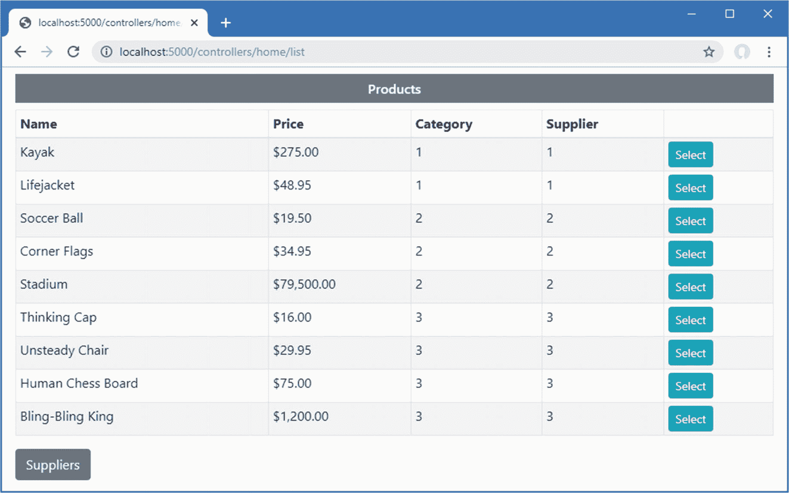
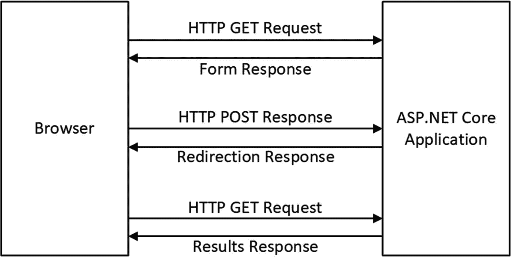
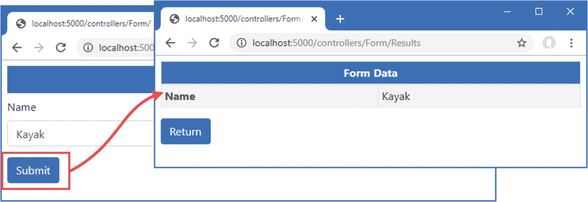
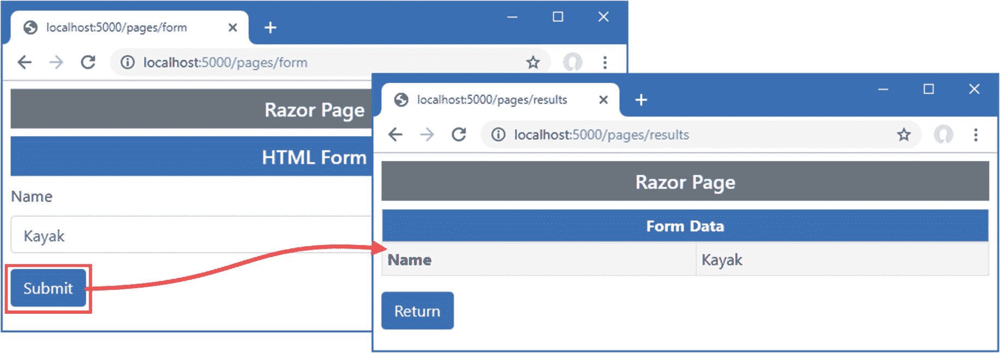
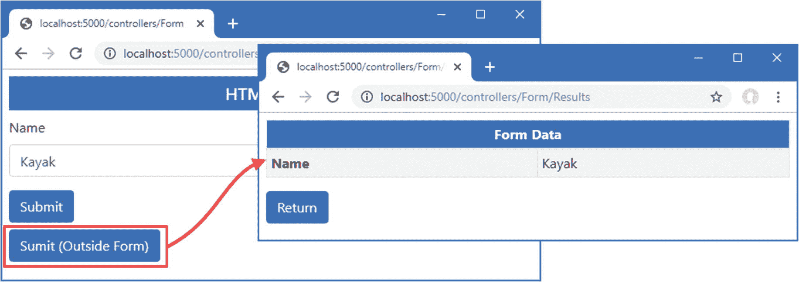
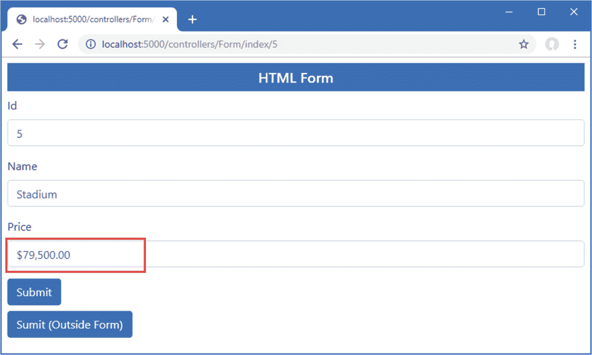
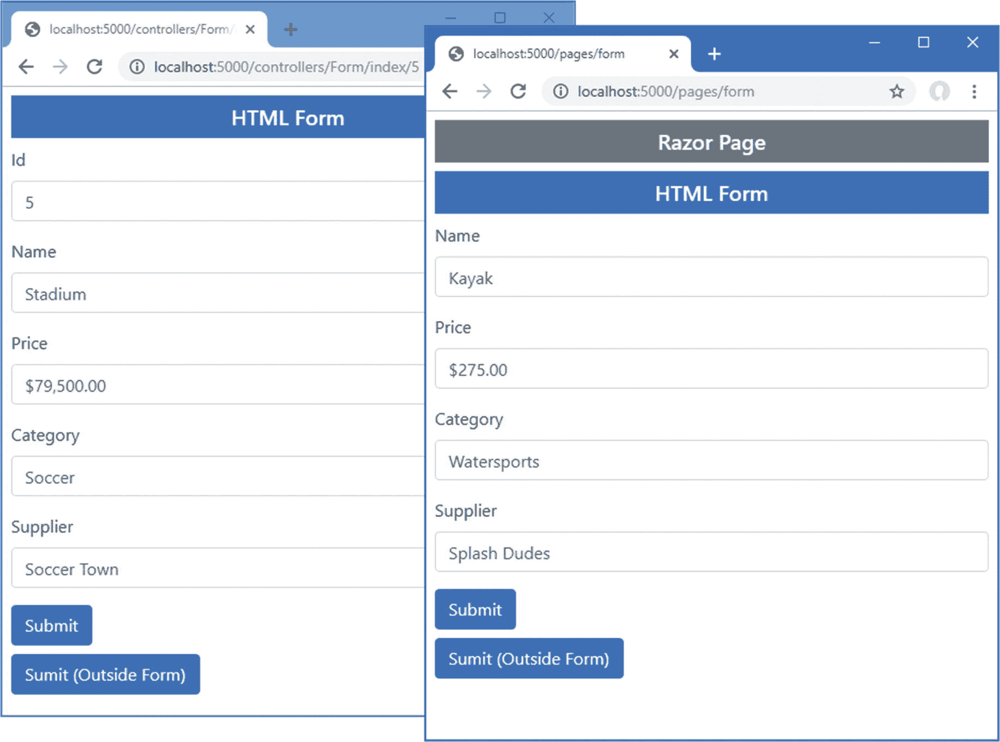
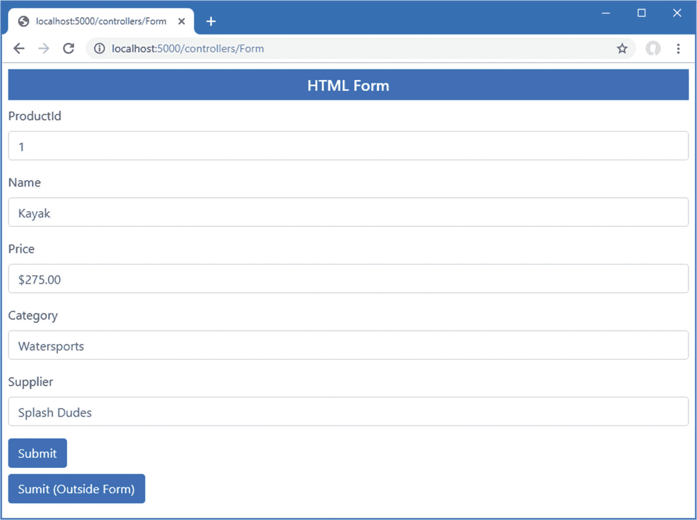
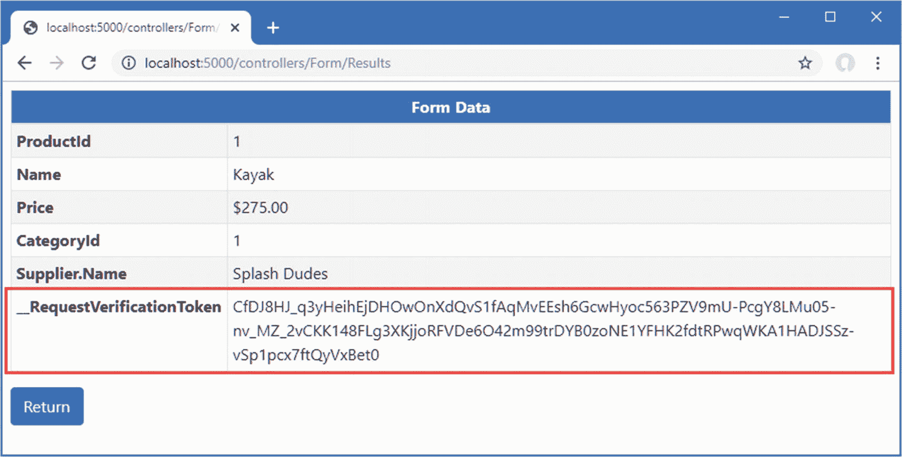
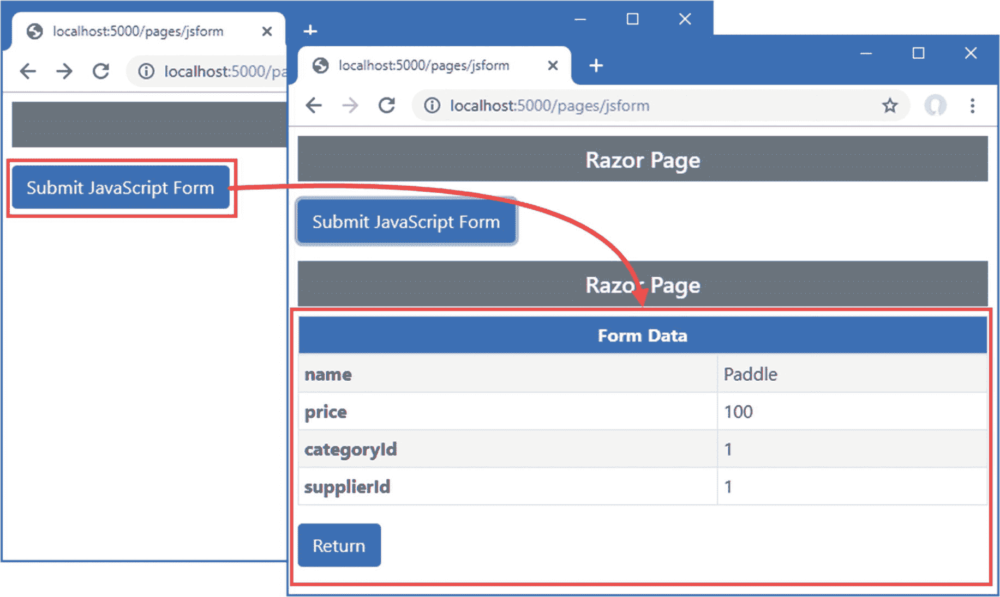

# 二十七、使用表单标记助手

在这一章中，我描述了用于创建 HTML 表单的内置标签助手。这些标记帮助器确保表单被提交给正确的动作或页面处理程序方法，并且元素准确地表示特定的模型属性。表 [27-1](#Tab1) 将表单标签助手放在上下文中。

表 27-1。

将表单标记助手放入上下文中

<colgroup><col class="tcol1 align-left"> <col class="tcol2 align-left"></colgroup> 
| 

问题

 | 

回答

 |
| --- | --- |
| 它们是什么？ | 这些内置的标签助手转换 HTML 表单元素。 |
| 它们为什么有用？ | 这些标记助手确保 HTML 表单反映了应用的路由配置和数据模型。 |
| 它们是如何使用的？ | 使用`asp-*`属性将标签助手应用于 HTML 元素。 |
| 有什么陷阱或限制吗？ | 这些标记助手是可靠的、可预测的，不会出现严重的问题。 |
| 还有其他选择吗？ | 您不必使用标记助手，如果您愿意，也可以不用它们来定义表单。 |

表 [27-2](#Tab2) 总结了本章内容。

表 27-2。

章节总结

<colgroup><col class="tcol1 align-left"> <col class="tcol2 align-left"> <col class="tcol3 align-left"></colgroup> 
| 

问题

 | 

解决办法

 | 

列表

 |
| --- | --- | --- |
| 指定提交表单的方式 | 使用表单标签辅助属性 | 10–13 |
| 转换`input`元素 | 使用输入标签辅助属性 | 14–22 |
| 转换`label`元素 | 使用标签标记辅助属性 | Twenty-three |
| 填充`select`元素 | 使用选择标签辅助属性 | 24–26 |
| 转换文本区域 | 使用文本区域标签辅助属性 | Twenty-seven |
| 防止跨站点请求伪造 | 启用防伪功能 | 28–32 |

## 为本章做准备

本章使用了第 26 章[中的 WebApp 项目。为了准备本章，用清单](26.html) [27-1](#PC1) 中显示的内容替换`Views/Shared`文件夹中`_SimpleLayout.cshtml`文件的内容。

Tip

你可以从 [`https://github.com/apress/pro-asp.net-core-3`](https://github.com/apress/pro-asp.net-core-3) 下载本章以及本书其他章节的示例项目。如果在运行示例时遇到问题，请参见第 [1](01.html) 章获取帮助。

```cs
<!DOCTYPE html>
<html>
<head>
    <title>@ViewBag.Title</title>
    <link href="/lib/twitter-bootstrap/css/bootstrap.min.css" rel="stylesheet" />
</head>
<body>
    <div class="m-2">
        @RenderBody()
    </div>
</body>
</html>

Listing 27-1.The Contents of the _SimpleLayout.cshtml File in the Views/Shared Folder

```

本章使用控制器视图和 Razor 页面来呈现类似的内容。为了更容易区分控制器和页面，将清单 [27-2](#PC2) 中所示的路线添加到`Startup`类中。

```cs
using Microsoft.AspNetCore.Builder;
using Microsoft.Extensions.DependencyInjection;
using Microsoft.Extensions.Configuration;
using Microsoft.EntityFrameworkCore;
using WebApp.Models;

namespace WebApp {
    public class Startup {

        public Startup(IConfiguration config) {
            Configuration = config;
        }

        public IConfiguration Configuration { get; set; }

        public void ConfigureServices(IServiceCollection services) {
            services.AddDbContext<DataContext>(opts => {
                opts.UseSqlServer(Configuration[
                    "ConnectionStrings:ProductConnection"]);
                opts.EnableSensitiveDataLogging(true);
            });
            services.AddControllersWithViews().AddRazorRuntimeCompilation();
            services.AddRazorPages().AddRazorRuntimeCompilation();
            services.AddSingleton<CitiesData>();
        }

        public void Configure(IApplicationBuilder app, DataContext context) {
            app.UseDeveloperExceptionPage();
            app.UseStaticFiles();
            app.UseRouting();
            app.UseEndpoints(endpoints => {
                endpoints.MapControllers();
                endpoints.MapControllerRoute("forms",
                    "controllers/{controller=Home}/{action=Index}/{id?}");
                endpoints.MapDefaultControllerRoute();
                endpoints.MapRazorPages();
            });
            SeedData.SeedDatabase(context);
        }
    }
}

Listing 27-2.Adding a Route in the Startup.cs File in the WebApp Folder

```

新路由引入了一个静态路径段，使得 URL 指向控制器变得显而易见。

### 正在删除数据库

打开一个新的 PowerShell 命令提示符，导航到包含`WebApp.csproj`文件的文件夹，运行清单 [27-3](#PC3) 中所示的命令来删除数据库。

```cs
dotnet ef database drop --force

Listing 27-3.Dropping the Database

```

### 运行示例应用

从 Debug 菜单中选择 Start Without Debugging 或 Run Without Debugging，或者使用 PowerShell 命令提示符运行清单 [27-4](#PC4) 中所示的命令。

```cs
dotnet run

Listing 27-4.Running the Example Application

```

使用浏览器请求`http://localhost:5000/controllers/home/list`，将显示产品列表，如图 [27-1](#Fig1) 所示。



图 27-1。

运行示例应用

## 理解表单处理模式

大多数 HTML 表单都存在于一个定义良好的模式中，如图 [27-2](#Fig2) 所示。首先，浏览器发送一个 HTTP GET 请求，这会产生一个包含表单的 HTML 响应，使用户能够向应用提供数据。用户单击一个按钮，用 HTTP POST 请求提交表单数据，这允许应用接收和处理用户的数据。处理完数据后，会发送一个响应，将浏览器重定向到一个 URL，以确认用户的操作。



图 27-2。

HTML Post/Redirect/Get 模式

这被称为 Post/Redirect/Get 模式，重定向很重要，因为这意味着用户可以单击浏览器的重新加载按钮，而无需发送另一个 Post 请求，这可能会导致无意中重复一个操作。

在接下来的小节中，我将展示如何使用控制器和 Razor 页面来遵循这个模式。我从模式的一个基本实现开始，然后演示使用标签助手的改进，在第 [28](28.html) 章中，演示模型绑定特性。

### 创建控制器来处理表单

处理表单的控制器是通过组合前面章节中描述的功能创建的。将名为`FormController.cs`的类文件添加到`Controllers`文件夹中，代码如清单 [27-5](#PC5) 所示。

```cs
using Microsoft.AspNetCore.Mvc;
using System.Linq;
using System.Threading.Tasks;
using WebApp.Models;

namespace WebApp.Controllers {

    public class FormController : Controller {
        private DataContext context;

        public FormController(DataContext dbContext) {
            context = dbContext;
        }

        public async Task<IActionResult> Index(long id = 1) {
            return View("Form", await context.Products.FindAsync(id));
        }

        [HttpPost]
        public IActionResult SubmitForm() {
            foreach (string key in Request.Form.Keys
                    .Where(k => !k.StartsWith("_"))) {
                TempData[key] = string.Join(", ", Request.Form[key]);
            }
            return RedirectToAction(nameof(Results));
        }

        public IActionResult Results() {
            return View(TempData);
        }
    }
}

Listing 27-5.The Contents of the FormController.cs File in the Controllers Folder

```

`Index`动作方法选择一个名为`Form`的视图，它将向用户呈现一个 HTML 表单。当用户提交表单时，它将被`SubmitForm`动作接收，该动作已经用`HttpPost`属性进行了修饰，因此它只能接收 HTTP POST 请求。这个动作方法处理通过`HttpRequest.Form`属性获得的 HTML 表单数据，以便可以使用临时数据特性存储这些数据。临时数据功能可用于将数据从一个请求传递到另一个请求，但只能用于存储简单的数据类型。每个表单数据值都表示为一个字符串数组，我将其转换为一个逗号分隔的字符串进行存储。浏览器被重定向到`Results`动作方法，该方法选择默认视图并提供临时数据作为视图模型。

Tip

仅显示名称不以下划线开头的表单数据值。我将在本章后面的“使用防伪特征”一节中解释原因。

为了给控制器提供视图，创建`Views/Form`文件夹并添加一个名为`Form.cshtml`的 Razor 视图文件，其内容如清单 [27-6](#PC6) 所示。

```cs
@model Product
@{  Layout = "_SimpleLayout"; }

<h5 class="bg-primary text-white text-center p-2">HTML Form</h5>

<form action="/controllers/form/submitform" method="post">
    <div class="form-group">
        <label>Name</label>
        <input class="form-control" name="Name" value="@Model.Name" />
    </div>
    <button type="submit" class="btn btn-primary">Submit</button>
</form>

Listing 27-6.The Contents of the Form.cshtml File in the Views/Form Folder

```

该视图包含一个简单的 HTML 表单，该表单被配置为使用 POST 请求将其数据提交给`SubmitForm`动作方法。该表单包含一个`input`元素，其值是使用 Razor 表达式设置的。接下来，在`Views/Forms`文件夹中添加一个名为`Results.cshtml`的 Razor 视图，内容如清单 [27-7](#PC7) 所示。

```cs
@model TempDataDictionary
@{ Layout = "_SimpleLayout"; }

<table class="table table-striped table-bordered table-sm">
    <thead>
        <tr class="bg-primary text-white text-center">
            <th colspan="2">Form Data</th>
        </tr>
    </thead>
    <tbody>
        @foreach (string key in Model.Keys) {
            <tr>
                <th>@key</th>
                <td>@Model[key]</td>
            </tr>
        }
    </tbody>
</table>
<a class="btn btn-primary" asp-action="Index">Return</a>

Listing 27-7.The Contents of the Results.cshtml File in the Views/Form Folder

```

该视图向用户显示表单数据。在第 [31](31.html) 章中，我将向您展示如何以更有用的方式处理表单数据，但本章的重点是创建表单，看到表单中包含的数据就足以开始了。

重启 ASP.NET Core 并使用浏览器请求`http://localhost:5000/controllers/form`查看 HTML 表单。在文本字段中输入一个值，然后单击 Submit 发送一个 POST 请求，该请求将由`SubmitForm`操作处理。表单数据将被存储为临时数据，浏览器将被重定向，产生如图 [27-3](#Fig3) 所示的响应。



图 27-3。

使用控制器呈现和处理 HTML 表单

### 创建 Razor 页面来处理表单

使用 Razor 页面可以实现相同的模式。需要一个页面来呈现和处理表单数据，第二个页面显示结果。在`Pages`文件夹中添加一个名为`FormHandler.cshtml`的 Razor 页面，内容如清单 [27-8](#PC8) 所示。

```cs
@page "/pages/form/{id:long?}"
@model FormHandlerModel
@using Microsoft.AspNetCore.Mvc.RazorPages

<div class="m-2">
    <h5 class="bg-primary text-white text-center p-2">HTML Form</h5>
    <form asp-page="FormHandler" method="post">
        <div class="form-group">
            <label>Name</label>
            <input class="form-control" name="Name" value="@Model.Product.Name" />
        </div>
        <button type="submit" class="btn btn-primary">Submit</button>
    </form>
</div>

@functions {

    [IgnoreAntiforgeryToken]
    public class FormHandlerModel : PageModel {
        private DataContext context;

        public FormHandlerModel(DataContext dbContext) {
            context = dbContext;
        }

        public Product Product { get; set; }

        public async Task OnGetAsync(long id = 1) {
            Product = await context.Products.FindAsync(id);
        }

        public IActionResult OnPost() {
            foreach (string key in Request.Form.Keys
                    .Where(k => !k.StartsWith("_"))) {
                TempData[key] = string.Join(", ", Request.Form[key]);
            }
            return RedirectToPage("FormResults");
        }
    }
}

Listing 27-8.The Contents of the FormHandler.cshtml File in the Pages Folder

```

`OnGetAsync`处理程序方法从数据库中检索一个`Product`，视图使用它来设置 HTML 表单中`input`元素的值。表单被配置为发送 HTTP POST 请求，该请求将由`OnPost`处理程序方法处理。表单数据存储为临时数据，浏览器被重定向到一个名为`FormResults`的表单。为了创建浏览器将被重定向到的页面，将一个名为`FormResults.cshtml`的 Razor 页面添加到`Pages`文件夹中，其内容如清单 [27-9](#PC9) 所示。

Tip

清单 [27-8](#PC8) 中的页面模型类是用`IgnoreAntiforgeryToken`属性修饰的，这在“使用防伪特征”一节中有描述。

```cs
@page "/pages/results"

<div class="m-2">
    <table class="table table-striped table-bordered table-sm">
        <thead>
            <tr class="bg-primary text-white text-center">
                <th colspan="2">Form Data</th>
            </tr>
        </thead>
        <tbody>
            @foreach (string key in TempData.Keys) {
                <tr>
                    <th>@key</th>
                    <td>@TempData[key]</td>
                </tr>
            }
        </tbody>
    </table>
    <a class="btn btn-primary" asp-page="FormHandler">Return</a>
</div>

Listing 27-9.The Contents of the FormResults.cshtml File in the Pages Folder

```

这个页面不需要任何代码，它直接访问临时数据并将其显示在一个表中。使用浏览器导航至`http://localhost:5000/pages/form`，在文本字段中输入一个值，然后点击提交按钮。表单数据将被清单 [27-9](#PC9) 中定义的`OnPost`方法处理，浏览器将被重定向到`/pages/results`，显示表单数据，如图 [27-4](#Fig4) 所示。



图 27-4。

使用 Razor 页面呈现和处理 HTML 表单

## 使用标签助手改进 HTML 表单

上一节中的例子展示了处理 HTML 表单的基本机制，但是 ASP.NET Core 包括了转换表单元素的标签助手。在接下来的小节中，我将描述标记助手并演示它们的用法。

### 使用表单元素

`FormTagHelper`类是`form`元素的内置标签助手，用于管理 HTML 表单的配置，这样它们就可以针对正确的动作或页面处理程序，而不需要硬编码 URL。该标签助手支持表 [27-3](#Tab3) 中描述的属性。

表 27-3。

表单元素的内置标签助手属性

<colgroup><col class="tcol1 align-left"> <col class="tcol2 align-left"></colgroup> 
| 

名字

 | 

描述

 |
| --- | --- |
| `asp-controller` | 该属性用于为属性 URL 的`action`指定路由系统的`controller`值。如果省略，那么将使用呈现视图的控制器。 |
| `asp-action` | 该属性用于为`action`属性 URL 的路由系统指定`action`值的操作方法。如果省略，将使用呈现视图的动作。 |
| `asp-page` | 该属性用于指定 Razor 页面的名称。 |
| `asp-page-handler` | 此属性用于指定将用于处理请求的处理程序方法的名称。您可以在第 [9](09.html) 章的 SportsStore 应用中看到该属性的示例。 |
| `asp-route-*` | 名称以`asp-route-`开头的属性用于指定动作属性 URL 的附加值，以便`asp-route-id`属性用于向路由系统提供`id`段的值。 |
| `asp-route` | 该属性用于指定路由的名称，该路由将用于为`action`属性生成 URL。 |
| `asp-antiforgery` | 该属性控制是否将防伪信息添加到视图中，如“使用防伪特征”一节中所述。 |
| `asp-fragment` | 该属性为生成的 URL 指定一个片段。 |

#### 设置表单目标

`FormTagHelper`转换`form`元素，这样它们就可以针对一个动作方法或 Razor 页面，而不需要硬编码的 URL。该标签帮助器支持的属性与锚元素的工作方式相同，如第 [26 章](26.html)所述，并使用属性来提供帮助通过 ASP.NET Core 路由系统生成 URL 的值。清单 [27-10](#PC10) 修改了`Form`视图中的`form`元素来应用标签助手。

Note

如果定义了一个没有`method`属性的`form`元素，那么标签助手将添加一个带有`post`值的属性，这意味着表单将使用 HTTP POST 请求提交。如果您忽略了`method`属性，这可能会导致令人惊讶的结果，因为您希望浏览器遵循 HTML5 规范并使用 HTTP GET 请求发送表单。最好总是指定`method`属性，这样表单应该如何提交就很明显了。

```cs
@model Product
@{  Layout = "_SimpleLayout"; }

<h5 class="bg-primary text-white text-center p-2">HTML Form</h5>

<form asp-action="submitform" method="post">
    <div class="form-group">
        <label>Name</label>
        <input class="form-control" name="Name" value="@Model.Name" />
    </div>
    <button type="submit" class="btn btn-primary">Submit</button>
</form>

Listing 27-10.Using a Tag Helper in the Form.cshtml File in the Views/Form Folder

```

`asp-action`属性用于指定将接收 HTTP 请求的动作的名称。路由系统用于生成 URL，就像第 26 章[中描述的锚元素一样。清单](26.html) [27-10](#PC10) 中没有使用`asp-controller`属性，这意味着呈现视图的控制器将在 URL 中使用。

属性用来选择一个 Razor 页面作为表单的目标，如清单 [27-11](#PC11) 所示。

```cs
...
<div class="m-2">
    <h5 class="bg-primary text-white text-center p-2">HTML Form</h5>
    <form asp-page="FormHandler" method="post">
        <div class="form-group">
            <label>Name</label>
            <input class="form-control" name="Name" value="@Model.Product.Name" />
        </div>
        <button type="submit" class="btn btn-primary">Submit</button>
    </form>
</div>
...

Listing 27-11.Setting the Form Target in the FormHandler.cshtml File in the Pages Folder

```

使用浏览器导航到`http://localhost:5000/controllers/form`并检查浏览器收到的 HTML 您将会看到标签助手 as 向`form`元素添加了`action`属性，如下所示:

```cs
...
<form method="post" action="controllers/Form/submitform">
...

```

这与我在创建视图时静态定义的 URL 相同，但是它的优点是对路由配置的更改会自动反映在表单 URL 中。请求`http://localhost:5000/pages/form`，您将看到`form`元素已经被转换为针对页面 URL，如下所示:

```cs
...
<form method="post" action="/pages/form">
...

```

### 转换表单按钮

发送表单的按钮可以在`form`元素之外定义。在这些情况下，按钮有一个`form`属性，其值对应于它所关联的表单元素的`id`属性，还有一个`formaction`属性，指定表单的目标 URL。

标签助手将通过`asp-action`、`asp-controller`或`asp-page`属性生成`formaction`属性，如清单 [27-12](#PC14) 所示。

```cs
@model Product
@{  Layout = "_SimpleLayout"; }

<h5 class="bg-primary text-white text-center p-2">HTML Form</h5>

<form asp-action="submitform" method="post" id="htmlform">
    <div class="form-group">
        <label>Name</label>
        <input class="form-control" name="Name" value="@Model.Name" />
    </div>
    <button type="submit" class="btn btn-primary">Submit</button>
</form>

<button form="htmlform" asp-action="submitform" class="btn btn-primary mt-2">
    Sumit (Outside Form)
</button>

Listing 27-12.Transforming a Button in the Form.cshtml File in the Views/Form Folder

```

添加到`form`元素的`id`属性的值被`button`用作`form`属性的值，它告诉浏览器当按钮被点击时提交哪个表单。表 [27-3](#Tab3) 中描述的属性用于标识表单的目标，标签助手将在视图呈现时使用路由系统生成一个 URL。清单 [27-13](#PC15) 将同样的技术应用于 Razor 页面。

```cs
...
<div class="m-2">
    <h5 class="bg-primary text-white text-center p-2">HTML Form</h5>
    <form asp-page="FormHandler" method="post" id="htmlform">
        <div class="form-group">
            <label>Name</label>
            <input class="form-control" name="Name" value="@Model.Product.Name" />
        </div>
        <button type="submit" class="btn btn-primary">Submit</button>
    </form>
    <button form="htmlform" asp-page="FormHandler" class="btn btn-primary mt-2">
        Sumit (Outside Form)
    </button>
</div>
...

Listing 27-13.Transforming a Button in the FormHandler.cshtml File in the Pages Folder

```

使用浏览器请求`http://localhost:5000/controllers/form`或`http://localhost:5000/pages/form`并检查发送到浏览器的 HTML。你会看到表单外的`button`元素已经被转换成这样:

```cs
...
<button form="htmlform" class="btn btn-primary mt-2"
        formaction="/controllers/Form/submitform">
    Sumit (Outside Form)
</button>
...

```

点击按钮提交表单，就像表单元素中定义的按钮一样，如图 [27-5](#Fig5) 所示。



图 27-5。

在表单元素外部定义按钮

## 使用输入元素

元素是 HTML 表单的主干，它提供了用户向应用提供非结构化数据的主要方式。使用表 [27-4](#Tab4) 中描述的属性，`InputTagHelper`类用于转换`input`元素，以便它们反映用于收集的视图模型属性的数据类型和格式。

表 27-4。

输入元素的内置标签助手属性

<colgroup><col class="tcol1 align-left"> <col class="tcol2 align-left"></colgroup> 
| 

名字

 | 

描述

 |
| --- | --- |
| `asp-for` | 该属性用于指定`input`元素所代表的视图模型属性。 |
| `asp-format` | 该属性用于指定一种格式，该格式用于`input`元素所表示的视图模型属性的值。 |

将`asp-for`属性设置为视图模型属性的名称，然后用它来设置`input`元素的`name`、`id`、`type`和`value`属性。清单 [27-14](#PC17) 修改了控制器视图中的`input`元素以使用`asp-for`属性。

```cs
@model Product
@{  Layout = "_SimpleLayout"; }

<h5 class="bg-primary text-white text-center p-2">HTML Form</h5>

<form asp-action="submitform" method="post" id="htmlform">
    <div class="form-group">
        <label>Name</label>
        <input class="form-control" asp-for="Name" />
    </div>
    <button type="submit" class="btn btn-primary">Submit</button>
</form>

<button form="htmlform" asp-action="submitform" class="btn btn-primary mt-2">
    Sumit (Outside Form)
</button>

Listing 27-14.Configuring an input Element in the Form.cshtml File in the Views/Form Folder

```

这个标签助手使用了一个模型表达式，如清单 [27-14](#PC17) 中所述，这就是为什么在指定属性`asp-for`的值时没有使用`@`字符。如果您检查应用在使用浏览器请求`http://localhost:5000/controllers/form`时返回的 HTML，您将会看到 tag helper 已经像这样转换了`input`元素:

```cs
...
<div class="form-group">
    <label>Name</label>
    <input class="form-control" type="text" id="Name" name="Name" value="Kayak">
</div>
...

```

`id`和`name`属性的值是通过模型表达式获得的，确保在创建表单时不会引入拼写错误。其他属性更复杂，将在下面的章节中介绍。

Selecting Model Properties in Razor Pages

本章中描述的这个和其他标签帮助器的`asp-for`属性可以用于 Razor 页面，但是转换后的元素中的`name`和`id`属性的值包括页面模型属性的名称。例如，该元素通过页面模型的`Product`属性选择`Name`属性:

```cs
...
<input class="form-control" asp-for="Product.Name" />
...

```

转换后的元素将具有以下`id`和`name`属性:

```cs
...
<input class="form-control" type="text" id="Product_Name" name="Product.Name" >
...

```

如第 [28](28.html) 章所述，当使用模型绑定特性接收表单数据时，这种差异非常重要。

### 转换输入元素类型属性

元素的属性告诉浏览器如何显示元素，以及如何限制用户输入的值。清单 [27-14](#PC17) 中的`input`元素被配置为`text`类型，这是默认的`input`元素类型，没有任何限制。清单 [27-15](#PC21) 向表单添加了另一个`input`元素，这将为如何处理`type`属性提供更有用的演示。

```cs
@model Product
@{  Layout = "_SimpleLayout"; }

<h5 class="bg-primary text-white text-center p-2">HTML Form</h5>

<form asp-action="submitform" method="post" id="htmlform">
    <div class="form-group">
        <label>Id</label>
        <input class="form-control" asp-for="ProductId" />
    </div>
    <div class="form-group">
        <label>Name</label>
        <input class="form-control" asp-for="Name" />
    </div>
    <button type="submit" class="btn btn-primary">Submit</button>
</form>

<button form="htmlform" asp-action="submitform" class="btn btn-primary mt-2">
    Sumit (Outside Form)
</button>

Listing 27-15.Adding an input Element in the Form.cshtml File in the Views/Form Folder

```

新元素使用`asp-for`属性来选择视图模型的`ProductId`属性。使用浏览器请求`http://localhost:5000/controllers/form`查看标签助手是如何转换元素的。

```cs
...
<div class="form-group">
    <label>Id</label>
    <input class="form-control" type="number" data-val="true"
        data-val-required="The ProductId field is required."
        id="ProductId" name="ProductId" value="1">
</div>
...

```

`type`属性的值由`asp-for`属性指定的视图模型属性的类型决定。`ProductId`属性的类型是 C# `long`类型，这导致标签助手将`input`元素的类型属性设置为`number`，这限制了元素，因此它只接受数字字符。`data-val`和`data-val-required`属性被添加到`input`元素中以帮助验证，这在第 [29 章](29.html)中有所描述。表 [27-5](#Tab5) 描述了如何使用不同的 C# 类型来设置`input`元素的类型属性。

Note

浏览器如何解释`type`属性存在一定的自由度。不是所有的浏览器都响应 HTML5 规范中定义的所有`type`值，当它们响应时，它们的实现方式也有所不同。对于您在表单中期望的数据类型，`type`属性可能是一个有用的提示，但是您应该使用模型验证功能来确保用户提供可用的数据，如第 [29 章](29.html)中所述。

表 27-5。

C# 属性类型和它们生成的输入类型元素

<colgroup><col class="tcol1 align-left"> <col class="tcol2 align-left"></colgroup> 
| 

C# 类型

 | 

输入元素类型属性

 |
| --- | --- |
| `byte`、`sbyte`、`int`、`uint`、`short`、`ushort`、`long`、`ulong` | `number` |
| `float`、`double`、`decimal` | `text`，带有用于模型验证的附加属性，如第 [29 章](29.html)所述 |
| `bool` | `checkbox` |
| `string` | `text` |
| `DateTime` | `datetime` |

`float`、`double`和`decimal`类型产生`input`元素，这些元素的`type`是`text`，因为不是所有的浏览器都允许使用完整的字符来表达这种类型的合法值。为了向用户提供反馈，标签助手向`input`元素添加属性，这些属性与第 [29 章](29.html)中描述的验证特性一起使用。

您可以通过在`input`元素上显式定义`type`属性来覆盖表 [27-5](#Tab5) 中显示的默认映射。标签助手不会覆盖您定义的值，这允许您指定一个`type`属性值。

这种方法的缺点是，您必须记住在为给定模型属性生成`input`元素的所有视图中设置`type`属性。一个更优雅也更可靠的方法是将表 [27-6](#Tab6) 中描述的属性之一应用到 C# 模型类的属性中。

Tip

如果模型属性不是表 [27-5](#Tab5) 中的类型之一，并且没有用属性修饰，标签助手将把`input`元素的`type`属性设置为`text`。

表 27-6。

输入类型元素属性

<colgroup><col class="tcol1 align-left"> <col class="tcol2 align-left"></colgroup> 
| 

属性

 | 

输入元素类型属性

 |
| --- | --- |
| `[HiddenInput]` | `hidden` |
| `[Text]` | `text` |
| `[Phone]` | `tel` |
| `[Url]` | `url` |
| `[EmailAddress]` | `email` |
| `[DataType(DataType.Password)]` | `password` |
| `[DataType(DataType.Time)]` | `time` |
| `[DataType(DataType.Date)]` | `date` |

### 格式化输入元素值

当 action 方法为视图提供一个视图模型对象时，tag helper 使用赋予`asp-for`属性的属性值来设置`input`元素的`value`属性。`asp-format`属性用于指定数据值的格式。为了演示默认格式，清单 [27-16](#PC23) 向`Form`视图添加了一个新的`input`元素。

```cs
@model Product
@{  Layout = "_SimpleLayout"; }

<h5 class="bg-primary text-white text-center p-2">HTML Form</h5>

<form asp-action="submitform" method="post" id="htmlform">
    <div class="form-group">
        <label>Id</label>
        <input class="form-control" asp-for="ProductId" />
    </div>
    <div class="form-group">
        <label>Name</label>
        <input class="form-control" asp-for="Name" />
    </div>
    <div class="form-group">
        <label>Price</label>
        <input class="form-control" asp-for="Price" />
    </div>
    <button type="submit" class="btn btn-primary">Submit</button>
</form>

<button form="htmlform" asp-action="submitform" class="btn btn-primary mt-2">
    Sumit (Outside Form)
</button>

Listing 27-16.Adding an Element in the Form.cshtml File in the Views/Form Folder

```

使用浏览器导航到`http://localhost:5000/controllers/form/index/5`并检查浏览器收到的 HTML。默认情况下，`input`元素的`value`是使用 model 属性的值设置的，如下所示:

```cs
...
<input class="form-control" type="text" data-val="true"
    data-val-number="The field Price must be a number."
    data-val-required="The Price field is required."
    id="Price" name="Price" value="79500.00">
...

```

这种具有两位小数的格式是值在数据库中的存储方式。在第 [26](26.html) 章中，我使用了`Column`属性来选择一个 SQL 类型来存储`Price`值，如下所示:

```cs
...
[Column(TypeName = "decimal(8, 2)")]
public decimal Price { get; set; }
...

```

此类型指定最大精度为八位数字，其中两位将出现在小数点后。这允许最大值为 999，999.99，这足以代表大多数在线商店的价格。属性`asp-format`接受一个格式字符串，该字符串将被传递给标准 C# 字符串格式化系统，如清单 [27-17](#PC26) 所示。

```cs
@model Product
@{  Layout = "_SimpleLayout"; }

<h5 class="bg-primary text-white text-center p-2">HTML Form</h5>

<form asp-action="submitform" method="post" id="htmlform">
    <div class="form-group">
        <label>Id</label>
        <input class="form-control" asp-for="ProductId" />
    </div>
    <div class="form-group">
        <label>Name</label>
        <input class="form-control" asp-for="Name" />
    </div>
    <div class="form-group">
        <label>Price</label>
        <input class="form-control" asp-for="Price" asp-format="{0:#,###.00}" />
    </div>
    <button type="submit" class="btn btn-primary">Submit</button>
</form>

<button form="htmlform" asp-action="submitform" class="btn btn-primary mt-2">
    Sumit (Outside Form)
</button>

Listing 27-17.Formatting a Data Value in the Form.cshtml File in the Views/Form Folder

```

属性值是逐字使用的，这意味着您必须包括花括号字符和`0:`引用，以及您需要的格式。刷新浏览器，您将看到`input`元素的值已经被格式化，如下所示:

```cs
...
<input class="form-control" type="text" data-val="true"
    data-val-number="The field Price must be a number."
    data-val-required="The Price field is required."
    id="Price" name="Price" value="79,500.00">
...

```

应该谨慎使用该特性，因为您必须确保应用的其余部分配置为支持您使用的格式，并且您创建的格式只包含合法的`input`元素类型字符。

#### 通过模型类应用格式

如果您总是希望对一个模型属性使用相同的格式，那么您可以用在`System.ComponentModel.DataAnnotations`名称空间中定义的`DisplayFormat`属性来修饰 C# 类。`DisplayFormat`属性需要两个参数来格式化数据值:`DataFormatString`参数指定格式化字符串，将`ApplyFormatInEditMode`设置为`true`指定当值应用于用于编辑的元素(包括`input`元素)时应该使用格式化。清单 [27-18](#PC28) 将属性应用于`Product`类的`Price`属性，指定了一个不同于前面例子的格式字符串。

```cs
using System.ComponentModel.DataAnnotations.Schema;
using System.ComponentModel.DataAnnotations;

namespace WebApp.Models {
    public class Product {

        public long ProductId { get; set; }

        public string Name { get; set; }

        [Column(TypeName = "decimal(8, 2)")]
        [DisplayFormat(DataFormatString = "{0:c2}", ApplyFormatInEditMode = true)]
        public decimal Price { get; set; }

        public long CategoryId { get; set; }
        public Category Category { get; set; }

        public long SupplierId { get; set; }
        public Supplier Supplier { get; set; }
    }
}

Listing 27-18.Applying a Formatting Attribute to the Product.cs File in the Models Folder

```

`asp-format`属性优先于`DisplayFormat`属性，所以我已经从视图中移除了该属性，如清单 [27-19](#PC29) 所示。

```cs
@model Product
@{  Layout = "_SimpleLayout"; }

<h5 class="bg-primary text-white text-center p-2">HTML Form</h5>

<form asp-action="submitform" method="post" id="htmlform">
    <div class="form-group">
        <label>Id</label>
        <input class="form-control" asp-for="ProductId" />
    </div>
    <div class="form-group">
        <label>Name</label>
        <input class="form-control" asp-for="Name" />
    </div>
    <div class="form-group">
        <label>Price</label>
        <input class="form-control" asp-for="Price" />
    </div>
    <button type="submit" class="btn btn-primary">Submit</button>
</form>

<button form="htmlform" asp-action="submitform" class="btn btn-primary mt-2">
    Sumit (Outside Form)
</button>

Listing 27-19.Removing an Attribute in the Form.cshtml File in the Views/Form Folder

```

重启 ASP.NET Core，用浏览器请求`http://localhost:5000/controllers/form/index/5`，会看到属性定义的格式化字符串已经应用，如图 [27-6](#Fig6) 所示。



图 27-6。

格式化数据值

我选择这种格式来演示格式化属性的工作方式，但是，如前所述，必须注意确保应用能够使用第 [28](28.html) 和 [29](29.html) 章中描述的模型绑定和验证特性来处理格式化的值。

### 在输入元素中显示相关数据的值

当使用 Entity Framework Core 时，您经常需要显示从相关数据中获得的数据值，使用`asp-for`属性很容易做到这一点，因为模型表达式允许选择嵌套的导航属性。首先，清单 [27-20](#PC30) 包括提供给视图的视图模型对象中的相关数据。

```cs
using Microsoft.AspNetCore.Mvc;
using System.Linq;
using System.Threading.Tasks;
using WebApp.Models;
using Microsoft.EntityFrameworkCore;

namespace WebApp.Controllers {

    public class FormController : Controller {
        private DataContext context;

        public FormController(DataContext dbContext) {
            context = dbContext;
        }

        public async Task<IActionResult> Index(long id = 1) {
            return View("Form", await context.Products.Include(p => p.Category)
                .Include(p => p.Supplier).FirstAsync(p => p.ProductId == id));
        }

        [HttpPost]
        public IActionResult SubmitForm() {
            foreach (string key in Request.Form.Keys
                    .Where(k => !k.StartsWith("_"))) {
                TempData[key] = string.Join(", ", Request.Form[key]);
            }
            return RedirectToAction(nameof(Results));
        }

        public IActionResult Results() {
            return View(TempData);
        }
    }
}

Listing 27-20.Including Related Data in the FormController.cs File in the Controllers Folder

```

注意，我不需要担心处理相关数据中的循环引用，因为视图模型对象没有序列化。循环引用问题只对 web 服务控制器重要。在清单 [27-21](#PC31) 中，我更新了`Form`视图，以包含使用`asp-for`属性选择相关数据的`input`元素。

```cs
@model Product
@{  Layout = "_SimpleLayout"; }

<h5 class="bg-primary text-white text-center p-2">HTML Form</h5>

<form asp-action="submitform" method="post" id="htmlform">
    <div class="form-group">
        <label>Id</label>
        <input class="form-control" asp-for="ProductId" />
    </div>
    <div class="form-group">
        <label>Name</label>
        <input class="form-control" asp-for="Name" />
    </div>
    <div class="form-group">
        <label>Price</label>
        <input class="form-control" asp-for="Price" />
    </div>
    <div class="form-group">
        <label>Category</label>
        <input class="form-control" asp-for="Category.Name" />
    </div>
    <div class="form-group">
        <label>Supplier</label>
        <input class="form-control" asp-for="Supplier.Name" />
    </div>
    <button type="submit" class="btn btn-primary">Submit</button>
</form>

<button form="htmlform" asp-action="submitform" class="btn btn-primary mt-2">
    Sumit (Outside Form)
</button>

Listing 27-21.Displaying Related Data in the Form.cshtml File in the Views/Form Folder

```

`asp-for`属性的值是相对于视图模型对象表示的，并且可以包含嵌套属性，允许我选择相关对象的`Name`属性，实体框架核心已经将这些属性分配给了`Category`和`Supplier`导航属性。Razor 页面中使用了相同的技术，除了属性是相对于页面模型对象来表达的，如清单 [27-22](#PC32) 所示。

```cs
@page "/pages/form/{id:long?}"
@model FormHandlerModel
@using Microsoft.AspNetCore.Mvc.RazorPages
@using Microsoft.EntityFrameworkCore

<div class="m-2">
    <h5 class="bg-primary text-white text-center p-2">HTML Form</h5>
    <form asp-page="FormHandler" method="post" id="htmlform">
        <div class="form-group">
            <label>Name</label>
            <input class="form-control" asp-for="Product.Name" />
        </div>
        <div class="form-group">
            <label>Price</label>
            <input class="form-control" asp-for="Product.Price" />
        </div>
        <div class="form-group">
            <label>Category</label>
            <input class="form-control" asp-for="Product.Category.Name" />
        </div>
        <div class="form-group">
            <label>Supplier</label>
            <input class="form-control" asp-for="Product.Supplier.Name" />
        </div>
        <button type="submit" class="btn btn-primary">Submit</button>
    </form>
    <button form="htmlform" asp-page="FormHandler" class="btn btn-primary mt-2">
        Sumit (Outside Form)
    </button>
</div>

@functions {

    [IgnoreAntiforgeryToken]
    public class FormHandlerModel : PageModel {
        private DataContext context;

        public FormHandlerModel(DataContext dbContext) {
            context = dbContext;
        }

        public Product Product { get; set; }

        public async Task OnGetAsync(long id = 1) {
            Product = await context.Products.Include(p => p.Category)
                .Include(p => p.Supplier).FirstAsync(p => p.ProductId == id);
        }

        public IActionResult OnPost() {
            foreach (string key in Request.Form.Keys
                    .Where(k => !k.StartsWith("_"))) {
                TempData[key] = string.Join(", ", Request.Form[key]);
            }
            return RedirectToPage("FormResults");
        }
    }
}

Listing 27-22.Displayed Related Data in the FormHandler.cshtml File in the Pages Folder

```

要查看效果，重启 ASP.NET Core 以便对控制器的更改生效，并使用浏览器请求`http://localhost:5000/controller/form`，这将产生如图 [27-7](#Fig7) 左侧所示的响应。使用浏览器请求`http://localhost:5000/pages/form`，你会看到 Razor 页面使用的相同功能，如图 [27-7](#Fig7) 右图所示。



图 27-7。

显示相关数据

## 使用标签元素

`LabelTagHelper`类用于转换`label`元素，因此`for`属性的设置与用于转换`input`元素的方法一致。表 [27-7](#Tab7) 描述了这个标签助手支持的属性。

表 27-7。

标签元素的内置标签帮助器属性

<colgroup><col class="tcol1 align-left"> <col class="tcol2 align-left"></colgroup> 
| 

名字

 | 

描述

 |
| --- | --- |
| `asp-for` | 该属性用于指定`label`元素描述的视图模型属性。 |

tag helper 设置`label`元素的内容，使其包含所选视图模型属性的名称。标记助手还设置了`for`属性，这表示与特定的`input`元素的关联。这有助于依赖屏幕阅读器的用户，并允许一个`input`元素在其关联的`label`被点击时获得焦点。

清单 [27-23](#PC33) 将`asp-for`属性应用于`Form`视图，以将每个`label`元素与代表相同视图模型属性的`input`元素相关联。

```cs
@model Product
@{  Layout = "_SimpleLayout"; }

<h5 class="bg-primary text-white text-center p-2">HTML Form</h5>

<form asp-action="submitform" method="post" id="htmlform">
    <div class="form-group">
        <label asp-for="ProductId"></label>
        <input class="form-control" asp-for="ProductId" />
    </div>
    <div class="form-group">
        <label asp-for="Name"></label>
        <input class="form-control" asp-for="Name" />
    </div>
    <div class="form-group">
        <label asp-for="Price"></label>
        <input class="form-control" asp-for="Price" />
    </div>
    <div class="form-group">
        <label asp-for="Category.Name">Category</label>
        <input class="form-control" asp-for="Category.Name" />
    </div>
    <div class="form-group">
        <label asp-for="Supplier.Name">Supplier</label>
        <input class="form-control" asp-for="Supplier.Name" />
    </div>
    <button type="submit" class="btn btn-primary">Submit</button>
</form>

<button form="htmlform" asp-action="submitform" class="btn btn-primary mt-2">
    Sumit (Outside Form)
</button>

Listing 27-23.Transforming label Elements in the Form.cshtml File in the Views/Form Folder

```

您可以通过自己定义来覆盖`label`元素的内容，这就是我在清单 [27-23](#PC33) 中对相关数据属性所做的。标签助手会将这两个`label`元素的内容设置为`Name`，这不是一个有用的描述。定义元素内容意味着将应用`for`属性，但是将向用户显示一个更有用的名称。使用浏览器请求`http://localhost:5000/controllers/form`查看每个元素使用的名称，如图 [27-8](#Fig8) 所示。



图 27-8。

转换标签元素

## 使用选择和选项元素

`select`和`option`元素用于为用户提供一组固定的选择，而不是像`input`元素那样提供开放的数据输入。`SelectTagHelper`负责转换`select`元素，支持表 [27-8](#Tab8) 中描述的属性。

表 27-8。

select 元素的内置标记助手属性

<colgroup><col class="tcol1 align-left"> <col class="tcol2 align-left"></colgroup> 
| 

名字

 | 

描述

 |
| --- | --- |
| `asp-for` | 该属性用于指定`select`元素表示的视图或页面模型属性。 |
| `asp-items` | 该属性用于指定包含在`select`元素中的选项元素的值的来源。 |

`asp-for`属性设置`for`和`id`属性的值，以反映它接收的模型属性。在清单 [27-24](#PC34) 中，我用一个`select`元素替换了类别的`input`元素，该元素向用户呈现固定范围的值。

```cs
@model Product
@{  Layout = "_SimpleLayout"; }

<h5 class="bg-primary text-white text-center p-2">HTML Form</h5>

<form asp-action="submitform" method="post" id="htmlform">
    <div class="form-group">
        <label asp-for="ProductId"></label>
        <input class="form-control" asp-for="ProductId" />
    </div>
    <div class="form-group">
        <label asp-for="Name"></label>
        <input class="form-control" asp-for="Name" />
    </div>
    <div class="form-group">
        <label asp-for="Price"></label>
        <input class="form-control" asp-for="Price" />
    </div>
    <div class="form-group">
        <label asp-for="Category.Name">Category</label>
        <select class="form-control" asp-for="CategoryId">
            <option value="1">Watersports</option>
            <option value="2">Soccer</option>
            <option value="3">Chess</option>
        </select>
    </div>
    <div class="form-group">
        <label asp-for="Supplier.Name">Supplier</label>
        <input class="form-control" asp-for="Supplier.Name" />
    </div>
    <button type="submit" class="btn btn-primary">Submit</button>
</form>

<button form="htmlform" asp-action="submitform" class="btn btn-primary mt-2">
    Sumit (Outside Form)
</button>

Listing 27-24.Using a select Element in the Form.cshtml File in the Views/Form Folder

```

我已经用`option`元素手动填充了`select`元素，为用户提供了一系列类别供选择。如果您使用浏览器请求`http://localhost:5000/controllers/form/index/5`并检查 HTML 响应，您将会看到标签助手已经将`select`元素转换成这样:

```cs
...
<div class="form-group">
    <label for="Category_Name">Category</label>
    <select class="form-control" data-val="true"
          data-val-required="The CategoryId field is required."
          id="CategoryId" name="CategoryId">
        <option value="1">Watersports</option>
        <option value="2" selected="selected">Soccer</option>
        <option value="3">Chess</option>
    </select>
</div>
...

```

注意，选择的属性已经被添加到与视图模型的`CategoryId`值相对应的`option`元素中，如下所示:

```cs
...
<option value="2" selected="selected">Soccer</option>
...

```

选择`option`元素的任务由`OptionTagHelper`类执行，该类通过`TagHelperContext.Items`集合从`SelectTagHelper`接收指令，如第 [25 章](25.html)所述。结果是，`select`元素显示了与`Product`对象的`CategoryId`值相关联的类别名称。

### 填充选择元素

为`select`元素显式定义`option`元素对于总是具有相同可能值的选择来说是一种有用的方法，但是当您需要提供取自数据模型的选项，或者当您需要在多个视图中使用相同的选项集并且不想手动维护重复的内容时，这种方法就没有用了。

`asp-items`属性用于为标记助手提供一个列表序列，该列表序列包含将为其生成选项元素的`SelectListItem`对象。清单 [27-25](#PC37) 修改了`Form`控制器的`Index`动作，通过视图包为视图提供一系列`SelectListItem`对象。

```cs
using Microsoft.AspNetCore.Mvc;
using System.Linq;
using System.Threading.Tasks;
using WebApp.Models;
using Microsoft.EntityFrameworkCore;
using Microsoft.AspNetCore.Mvc.Rendering;

namespace WebApp.Controllers {

    public class FormController : Controller {
        private DataContext context;

        public FormController(DataContext dbContext) {
            context = dbContext;
        }

        public async Task<IActionResult> Index(long id = 1) {
            ViewBag.Categories
                = new SelectList(context.Categories, "CategoryId", "Name");
            return View("Form", await context.Products.Include(p => p.Category)
                .Include(p => p.Supplier).FirstAsync(p => p.ProductId == id));
        }

        [HttpPost]
        public IActionResult SubmitForm() {
            foreach (string key in Request.Form.Keys
                    .Where(k => !k.StartsWith("_"))) {
                TempData[key] = string.Join(", ", Request.Form[key]);
            }
            return RedirectToAction(nameof(Results));
        }

        public IActionResult Results() {
            return View(TempData);
        }
    }
}

Listing 27-25.Providing a Data Sequence in the FormController.cs File in the Controllers Folder

```

`SelectListItem`对象可以直接创建，但是 ASP.NET Core 提供了`SelectList`类来适应现有的数据序列。在这种情况下，我将从数据库中获得的`Category`对象序列传递给`SelectList`构造函数，同时传递的还有应该用作`option`元素的值和标签的属性名称。在清单 [27-26](#PC38) 中，我更新了`Form`视图以使用`SelectList`。

```cs
@model Product
@{  Layout = "_SimpleLayout"; }

<h5 class="bg-primary text-white text-center p-2">HTML Form</h5>

<form asp-action="submitform" method="post" id="htmlform">
    <div class="form-group">
        <label asp-for="ProductId"></label>
        <input class="form-control" asp-for="ProductId" />
    </div>
    <div class="form-group">
        <label asp-for="Name"></label>
        <input class="form-control" asp-for="Name" />
    </div>
    <div class="form-group">
        <label asp-for="Price"></label>
        <input class="form-control" asp-for="Price" />
    </div>
    <div class="form-group">
        <label asp-for="Category.Name">Category</label>
        <select class="form-control" asp-for="CategoryId"
            asp-items="@ViewBag.Categories">
        </select>
    </div>
    <div class="form-group">
        <label asp-for="Supplier.Name">Supplier</label>
        <input class="form-control" asp-for="Supplier.Name" />
    </div>
    <button type="submit" class="btn btn-primary">Submit</button>
</form>

<button form="htmlform" asp-action="submitform" class="btn btn-primary mt-2">
    Sumit (Outside Form)
</button>

Listing 27-26.Using a SelectList in the Form.cshtml File in the Views/Form Folder

```

重启 ASP.NET Core 以便对控制器的更改生效，并使用浏览器请求`http://localhost:5000/controllers/form/index/5`。呈现给用户的内容没有视觉上的变化，但是用于填充`select`元素的`option`元素已经从数据库中生成，如下所示:

```cs
...
<div class="form-group">
    <label for="Category_Name">Category</label>
    <select class="form-control" data-val="true"
           data-val-required="The CategoryId field is required."
           id="CategoryId" name="CategoryId">
        <option value="1">Watersports</option>
        <option selected="selected" value="2">Soccer</option>
        <option value="3">Chess</option>
    </select>
</div>
...

```

这种方法意味着呈现给用户的选项将自动反映添加到数据库中的新类别。

## 使用文本区域

`textarea`元素用于向用户请求大量文本，通常用于非结构化数据，比如笔记或观察结果。`TextAreaTagHelper`负责转换`textarea`元素，支持表 [27-9](#Tab9) 中描述的单一属性。

表 27-9。

TextArea 元素的内置标签助手属性

<colgroup><col class="tcol1 align-left"> <col class="tcol2 align-left"></colgroup> 
| 

名字

 | 

描述

 |
| --- | --- |
| `asp-for` | 该属性用于指定`textarea`元素所代表的视图模型属性。 |

`TextAreaTagHelper`相对简单，为`asp-for`属性提供的值用于设置`textarea`元素上的`id`和`name`属性。由`asp-for`属性选择的属性值被用作`textarea`元素的内容。清单 [27-27](#PC40) 用一个已经应用了`asp-for`属性的文本区域替换了`Supplier.Name`属性的`input`元素。

```cs
@model Product
@{  Layout = "_SimpleLayout"; }

<h5 class="bg-primary text-white text-center p-2">HTML Form</h5>

<form asp-action="submitform" method="post" id="htmlform">
    <div class="form-group">
        <label asp-for="ProductId"></label>
        <input class="form-control" asp-for="ProductId" />
    </div>
    <div class="form-group">
        <label asp-for="Name"></label>
        <input class="form-control" asp-for="Name" />
    </div>
    <div class="form-group">
        <label asp-for="Price"></label>
        <input class="form-control" asp-for="Price" />
    </div>
    <div class="form-group">
        <label asp-for="Category.Name">Category</label>
        <select class="form-control" asp-for="CategoryId"
             asp-items="@ViewBag.Categories">
        </select>
    </div>
    <div class="form-group">
        <label asp-for="Supplier.Name">Supplier</label>
        <textarea class="form-control" asp-for="Supplier.Name"></textarea>
    </div>
    <button type="submit" class="btn btn-primary">Submit</button>
</form>

<button form="htmlform" asp-action="submitform" class="btn btn-primary mt-2">
    Sumit (Outside Form)
</button>

Listing 27-27.Using a Text Area in the Form.cshtml File in the Views/Form Folder

```

使用浏览器请求 http `://localhost:5000/controllers/form`并检查浏览器收到的 HTML，以查看`textarea`元素的转换。

```cs
...
<div class="form-group">
    <label for="Supplier_Name">Supplier</label>
    <textarea class="form-control" id="Supplier_Name" name="Supplier.Name">
        Soccer Town
    </textarea>
</div>
...

```

`TextAreaTagHelper`相对简单，但是它提供了与我在本章中描述的表单元素标签助手的一致性。

## 使用防伪功能

当我定义处理表单数据的控制器动作方法和页面处理程序方法时，我过滤掉了名称以下划线开头的表单数据，如下所示:

```cs
...
[HttpPost]
public IActionResult SubmitForm() {
    foreach (string key in Request.Form.Keys
            .Where(k => !k.StartsWith("_"))) {
        TempData[key] = string.Join(", ", Request.Form[key]);
    }
    return RedirectToAction(nameof(Results));
}
...

```

我应用这个过滤器来隐藏一个特性，以便关注表单中 HTML 元素提供的值。清单 [27-28](#PC43) 从 action 方法中删除了过滤器，这样所有从 HTML 表单接收的数据都存储在临时数据中。

```cs
...
[HttpPost]
public IActionResult SubmitForm() {
    foreach (string key in Request.Form.Keys) {
        TempData[key] = string.Join(", ", Request.Form[key]);
    }
    return RedirectToAction(nameof(Results));
}
...

Listing 27-28.Removing a Filter in the FormController.cs File in the Controllers Folder

```

重启 ASP.NET Core 并使用浏览器请求`http://localhost:5000/controllers`。点击提交按钮将表单发送到应用，您将在结果中看到一个新的项目，如图 [27-9](#Fig9) 所示。



图 27-9。

显示所有表单数据

结果中显示的`_RequestVerificationToken`表单值是一个安全特性，由`FormTagHelper`用来防止跨站点请求伪造。跨站点请求伪造(CSRF)通过利用用户请求通常被验证的方式来利用 web 应用。大多数 web 应用——包括那些使用 ASP.NET Core 创建的应用——使用 cookies 来识别哪些请求与特定的会话相关，用户身份通常与该会话相关联。

CSRF(也称为 *XSRF* )依赖于用户在使用您的 web 应用后访问恶意网站，并且没有明确结束他们的会话。应用仍然认为用户的会话是活动的，浏览器存储的 cookie 还没有过期。恶意站点包含 JavaScript 代码，该代码向您的应用发送表单请求，以在未经用户同意的情况下执行操作—操作的确切性质将取决于被攻击的应用。由于 JavaScript 代码是由用户的浏览器执行的，所以对应用的请求包括会话 cookie，应用在用户不知情或不同意的情况下执行操作。

Tip

CSRF 在 [`http://en.wikipedia.org/wiki/Cross-site_request_forgery`](http://en.wikipedia.org/wiki/Cross-site_request_forgery) 有详细描述。

如果一个`form`元素不包含一个`action`属性——因为它是从具有`asp-controller`、`asp-action,`和`asp-page`属性的路由系统中生成的——那么`FormTagHelper`类会自动启用一个反 CSRF 特性，从而将一个安全令牌作为 cookie 添加到响应中。一个隐藏的包含相同安全令牌的`input`元素被添加到 HTML 表单中，这个令牌如图 [27-9](#Fig9) 所示。

### 启用控制器中的防伪特征

默认情况下，控制器接受 POST 请求，即使它们不包含所需的安全令牌。为了启用防伪特性，一个属性被应用到控制器类，如清单 [27-29](#PC44) 所示。

```cs
using Microsoft.AspNetCore.Mvc;
using System.Linq;
using System.Threading.Tasks;
using WebApp.Models;
using Microsoft.EntityFrameworkCore;
using Microsoft.AspNetCore.Mvc.Rendering;

namespace WebApp.Controllers {

    [AutoValidateAntiforgeryToken]
    public class FormController : Controller {
        private DataContext context;

        public FormController(DataContext dbContext) {
            context = dbContext;
        }

        public async Task<IActionResult> Index(long id = 1) {
            ViewBag.Categories
                = new SelectList(context.Categories, "CategoryId", "Name");
            return View("Form", await context.Products.Include(p => p.Category)
                .Include(p => p.Supplier).FirstAsync(p => p.ProductId == id));
        }

        [HttpPost]
        public IActionResult SubmitForm() {
            foreach (string key in Request.Form.Keys) {
                TempData[key] = string.Join(", ", Request.Form[key]);
            }
            return RedirectToAction(nameof(Results));
        }

        public IActionResult Results() {
            return View(TempData);
        }
    }
}

Listing 27-29.Enabling the Anti-forgery Feature in the FormController.cs File in the Controllers Folder

```

并不是所有的请求都需要一个防伪标记，`AutoValidateAntiforgeryToken`确保对除 GET、HEAD、OPTIONS 和 TRACE 之外的所有 HTTP 方法进行检查。

Tip

另外两个属性可用于控制令牌验证。`IgnoreValidationToken`属性取消对动作方法或控制器的验证。`ValidateAntiForgeryToken`属性的作用正好相反，它强制执行验证，即使对于通常不需要验证的请求，比如 HTTP GET 请求。我推荐使用`AutoValidateAntiforgeryToken`属性，如清单所示。

测试反 CSRF 特性有点棘手。我通过请求包含表单的 URL(本例中为`http://localhost:5000/controllers/forms`)然后使用浏览器的 F12 开发工具从表单中定位并移除隐藏的`input`元素(或者更改元素的值)来实现。当我填充并提交表单时，它缺少所需数据的一部分，请求将失败。

### 在 Razor 页面中启用防伪功能

Razor 页面默认启用防伪功能，这就是为什么我在创建`FormHandler`页面时将`IgnoreAntiforgeryToken`属性应用于清单 [27-29](#PC44) 中的页面处理程序方法。清单 [27-30](#PC45) 删除属性以启用验证特性。

```cs
@page "/pages/form/{id:long?}"
@model FormHandlerModel
@using Microsoft.AspNetCore.Mvc.RazorPages
@using Microsoft.EntityFrameworkCore

<div class="m-2">
    <h5 class="bg-primary text-white text-center p-2">HTML Form</h5>
    <form asp-page="FormHandler" method="post" id="htmlform">
        <div class="form-group">
            <label>Name</label>
            <input class="form-control" asp-for="Product.Name" />
        </div>

        <div class="form-group">
            <label>Price</label>
            <input class="form-control" asp-for="Product.Price" />
        </div>
        <div class="form-group">
            <label>Category</label>
            <input class="form-control" asp-for="Product.Category.Name" />
        </div>
        <div class="form-group">
            <label>Supplier</label>
            <input class="form-control" asp-for="Product.Supplier.Name" />
        </div>
        <button type="submit" class="btn btn-primary">Submit</button>
    </form>
    <button form="htmlform" asp-page="FormHandler" class="btn btn-primary mt-2">
        Sumit (Outside Form)
    </button>
</div>

@functions {

    //[IgnoreAntiforgeryToken]
    public class FormHandlerModel : PageModel {
        private DataContext context;

        public FormHandlerModel(DataContext dbContext) {
            context = dbContext;
        }

        public Product Product { get; set; }

        public async Task OnGetAsync(long id = 1) {
            Product = await context.Products.Include(p => p.Category)
                .Include(p => p.Supplier).FirstAsync(p => p.ProductId == id);
        }

        public IActionResult OnPost() {
            foreach (string key in Request.Form.Keys
                    .Where(k => !k.StartsWith("_"))) {
                TempData[key] = string.Join(", ", Request.Form[key]);
            }
            return RedirectToPage("FormResults");
        }
    }
}

Listing 27-30.Enabling Request Validation in the FormHandler.cshtml File in the Pages Folder

```

验证功能的测试方式与控制器相同，在将表单提交给应用之前，需要使用浏览器的开发工具修改 HTML 文档。

### 对 JavaScript 客户端使用防伪标记

默认情况下，防伪功能依赖于 ASP.NET Core 应用能够在 HTML 表单中包含一个元素，在提交表单时浏览器会发回该元素。这对 JavaScript 客户机不起作用，因为 ASP.NET Core 应用提供数据而不是 HTML，所以没有办法插入隐藏元素并在未来的请求中接收它。

对于 web 服务，防伪标记可以作为 JavaScript 可读的 cookie 发送，JavaScript 客户端代码读取该 cookie 并将其作为报头包含在其 POST 请求中。一些 JavaScript 框架，比如 Angular，会自动检测 cookie 并在请求中包含一个头。对于其他框架和定制 JavaScript 代码，需要做额外的工作。

清单 [27-31](#PC46) 显示了 ASP.NET Core 应用配置用于 JavaScript 客户端的防伪特性所需的更改。

```cs
using Microsoft.AspNetCore.Builder;
using Microsoft.Extensions.DependencyInjection;
using Microsoft.Extensions.Configuration;
using Microsoft.EntityFrameworkCore;
using WebApp.Models;
using Microsoft.AspNetCore.Antiforgery;
using Microsoft.AspNetCore.Http;

namespace WebApp {
    public class Startup {

        public Startup(IConfiguration config) {
            Configuration = config;
        }

        public IConfiguration Configuration { get; set; }

        public void ConfigureServices(IServiceCollection services) {
            services.AddDbContext<DataContext>(opts => {
                opts.UseSqlServer(Configuration[
                    "ConnectionStrings:ProductConnection"]);
                opts.EnableSensitiveDataLogging(true);
            });
            services.AddControllersWithViews().AddRazorRuntimeCompilation();
            services.AddRazorPages().AddRazorRuntimeCompilation();
            services.AddSingleton<CitiesData>();

            services.Configure<AntiforgeryOptions>(opts => {
                opts.HeaderName = "X-XSRF-TOKEN";
            });
        }

        public void Configure(IApplicationBuilder app, DataContext context,
                IAntiforgery antiforgery) {

            app.UseRequestLocalization();

            app.UseDeveloperExceptionPage();
            app.UseStaticFiles();
            app.UseRouting();

            app.Use(async (context, next) => {
                if (!context.Request.Path.StartsWithSegments("/api")) {
                    context.Response.Cookies.Append("XSRF-TOKEN",
                       antiforgery.GetAndStoreTokens(context).RequestToken,
                       new CookieOptions { HttpOnly = false });
                }
                await next();
            });

            app.UseEndpoints(endpoints => {
                endpoints.MapControllers();
                endpoints.MapControllerRoute("forms",
                    "controllers/{controller=Home}/{action=Index}/{id?}");
                endpoints.MapDefaultControllerRoute();
                endpoints.MapRazorPages();
            });
            SeedData.SeedDatabase(context);
        }
    }
}

Listing 27-31.Configuring the Anti-forgery Token in the Startup.cs File in the WebApp Folder

```

options 模式用于通过`AntiforgeryOptions`类配置防伪特征。`HeaderName`属性用于指定一个标头的名称，通过该标头可以接受防伪标记，在本例中为`X-XSRF-TOKEN`。

需要一个定制的中间件组件来设置 cookie，在本例中命名为`XSRF-TOKEN`。cookie 的值是通过`IAntiForgery`服务获得的，并且必须配置为将`HttpOnly`选项设置为`false`，以便浏览器允许 JavaScript 代码读取 cookie。

Tip

在这个例子中，我使用了 Angular 支持的名字。其他框架遵循它们自己的约定，但是通常可以配置为使用任何一组 cookie 和头文件名称。

要创建一个使用 cookie 和 header 的简单 JavaScript 客户机，需要将一个名为`JavaScriptForm.cshtml`的 Razor 页面添加到`Pages`文件夹中，其内容如清单 [27-32](#PC47) 所示。

```cs
@page "/pages/jsform"

<script type="text/javascript">
    async function sendRequest() {
        const token = document.cookie
            .replace(/(?:(?:^|.*;\s*)XSRF-TOKEN\s*\=\s*([^;]*).*$)|^.*$/, "$1");

        let form = new FormData();
        form.append("name", "Paddle");
        form.append("price", 100);
        form.append("categoryId", 1);
        form.append("supplierId", 1);

        let response = await fetch("@Url.Page("FormHandler")", {
            method: "POST",
            headers: { "X-XSRF-TOKEN": token },
            body: form
        });
        document.getElementById("content").innerHTML = await response.text();
    }

    document.addEventListener("DOMContentLoaded",
        () => document.getElementById("submit").onclick = sendRequest);
</script>

<button class="btn btn-primary m-2" id="submit">Submit JavaScript Form</button>
<div id="content"></div>

Listing 27-32.The Contents of the JavaScriptForm.cshtml File in the Pages Folder

```

这个 Razor 页面中的 JavaScript 代码通过向`FormHandler` Razor 页面发送 HTTP POST 请求来响应按钮点击。读取`XSRF-TOKEN` cookie 的值，并将其包含在`X-XSRF-TOKEN`请求报头中。来自`FormHandler`页面的响应是重定向到`Results`页面，浏览器会自动跟随。JavaScript 代码读取来自`Results`页面的响应，并将其插入到一个元素中，以便显示给用户。为了测试 JavaScript 代码，使用浏览器请求`http://localhost:5000/pages/jsform`并点击按钮。JavaScript 代码将提交表单并显示响应，如图 [27-10](#Fig10) 所示。



图 27-10。

在 JavaScript 代码中使用安全令牌

## 摘要

在这一章中，我解释了 ASP.NET Core 为创建 HTML 表单提供的特性。我向您展示了如何使用标记助手来选择表单目标并将`input`、`textarea`和`select`元素与视图模型或页面模型属性相关联。在下一章中，我将描述模型绑定特性，它从请求中提取数据，这样就可以很容易地在动作和处理程序方法中使用这些数据。