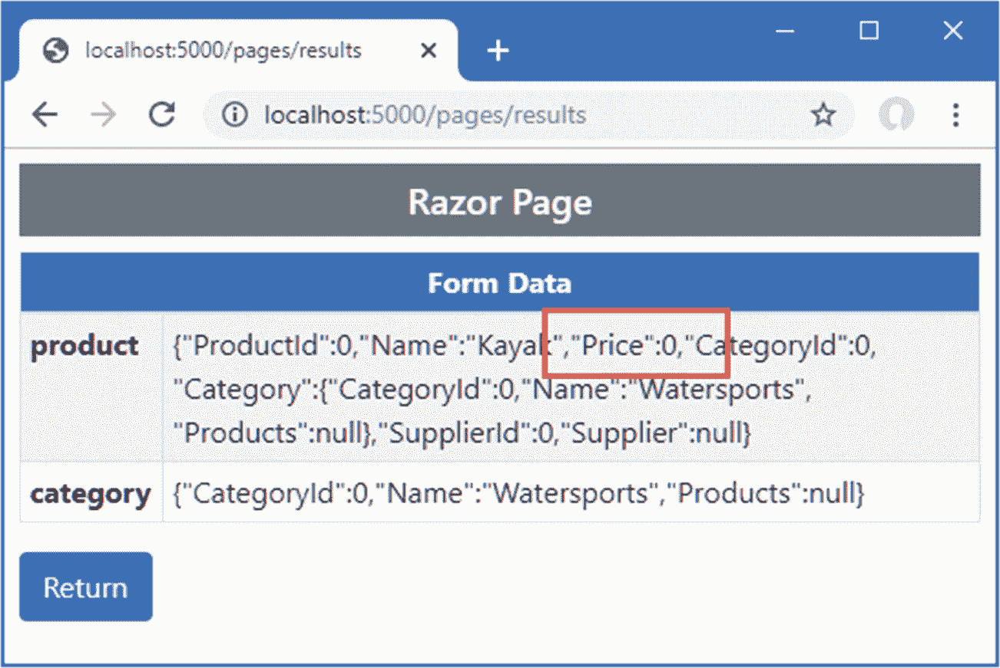

# 二十八、使用模型绑定

*模型绑定*就是创建的过程。NET 对象使用来自 HTTP 请求的值来提供对动作方法和 Razor 页面所需数据的轻松访问。在这一章中，我描述了模型绑定系统的工作方式；展示它如何绑定简单类型、复杂类型和集合；并演示如何控制流程，以指定请求的哪一部分提供应用所需的数据值。表 [28-1](#Tab1) 将模型绑定放在上下文中。

表 28-1。

将模型绑定放在上下文中

<colgroup><col class="tcol1 align-left"> <col class="tcol2 align-left"></colgroup> 
| 

问题

 | 

回答

 |
| --- | --- |
| 这是什么？ | 模型绑定是使用从 HTTP 请求中获得的数据值创建操作方法和页面处理程序所需的对象的过程。 |
| 为什么有用？ | 模型绑定允许控制器或页面处理程序使用 C# 类型声明方法参数或属性，并自动从请求中接收数据，而不必直接检查、解析和处理数据。 |
| 如何使用？ | 最简单的形式是，方法声明参数或类定义属性，这些属性的名称用于从 HTTP 请求中检索数据值。用于获取数据的请求部分可以通过将属性应用于方法参数或属性来配置。 |
| 有什么陷阱或限制吗？ | 主要的陷阱是从请求的错误部分获取数据。我在“理解模型绑定”一节中解释了在请求中搜索数据的方式，并且可以使用我在“指定模型绑定源”一节中描述的属性来显式地指定搜索位置。 |
| 有其他选择吗？ | 使用上下文对象可以在没有模型绑定的情况下获得数据。然而，结果是更复杂的代码，难以阅读和维护。 |

表 [28-2](#Tab2) 总结了本章内容。

表 28-2。

章节总结

<colgroup><col class="tcol1 align-left"> <col class="tcol2 align-left"> <col class="tcol3 align-left"></colgroup> 
| 

问题

 | 

解决办法

 | 

列表

 |
| --- | --- | --- |
| 绑定简单类型 | 用原始类型定义方法参数 | 5–9 |
| 绑定复杂类型 | 用类类型定义方法参数 | Ten |
| 绑定到属性 | 使用`BindProperty`属性 | 11, 12 |
| 绑定嵌套类型 | 确保表单值类型遵循点标记法 | 13–17 |
| 为绑定选择属性 | 使用`Bind`和`BindNever`属性 | 18–19 |
| 绑定集合 | 遵循序列绑定约定 | 20–25 |
| 指定绑定的源 | 使用源属性之一 | 26–31 |
| 手动执行绑定 | 使用`TryUpdateModel`方法 | Thirty-two |

## 为本章做准备

本章使用了第 27 章[中的 WebApp 项目。为了准备本章，用清单](27.html) [28-1](#PC1) 中显示的内容替换`Views/Form`文件夹中`Form.cshtml`文件的内容。

Tip

你可以从 [`https://github.com/apress/pro-asp.net-core-3`](https://github.com/apress/pro-asp.net-core-3) 下载本章以及本书其他章节的示例项目。如果在运行示例时遇到问题，请参见第 [1](01.html) 章获取帮助。

```cs
@model Product
@{  Layout = "_SimpleLayout"; }

<h5 class="bg-primary text-white text-center p-2">HTML Form</h5>

<form asp-action="submitform" method="post" id="htmlform">
    <div class="form-group">
        <label asp-for="Name"></label>
        <input class="form-control" asp-for="Name" />
    </div>
    <div class="form-group">
        <label asp-for="Price"></label>
        <input class="form-control" asp-for="Price" />
    </div>
    <button type="submit" class="btn btn-primary">Submit</button>
</form>

Listing 28-1.The Contents of the Form.cshtml File in the Views/Form Folder

```

接下来，注释掉已经应用到`Product`模型类的`DisplayFormat`属性，如清单 [28-2](#PC2) 所示。

```cs
using System.ComponentModel.DataAnnotations.Schema;
using System.ComponentModel.DataAnnotations;

namespace WebApp.Models {
    public class Product {

        public long ProductId { get; set; }

        public string Name { get; set; }

        [Column(TypeName = "decimal(8, 2)")]
        //[DisplayFormat(DataFormatString = "{0:c2}", ApplyFormatInEditMode = true)]
        public decimal Price { get; set; }

        public long CategoryId { get; set; }
        public Category Category { get; set; }

        public long SupplierId { get; set; }
        public Supplier Supplier { get; set; }
    }
}

Listing 28-2.Removing an Attribute in the Product.cs File in the Models Folder

```

### 正在删除数据库

打开一个新的 PowerShell 命令提示符，导航到包含`WebApp.csproj`文件的文件夹，运行清单 [28-3](#PC3) 中所示的命令来删除数据库。

```cs
dotnet ef database drop --force

Listing 28-3.Dropping the Database

```

### 运行示例应用

从 Debug 菜单中选择 Start Without Debugging 或 Run Without Debugging，或者使用 PowerShell 命令提示符运行清单 [28-4](#PC4) 中所示的命令。

```cs
dotnet run

Listing 28-4.Running the Example Application

```

使用浏览器请求`http://localhost:5000/controllers/form`，它将显示一个 HTML 表单。点击提交按钮，显示表单数据，如图 [28-1](#Fig1) 所示。


图 28-1。

运行示例应用

## 了解模型绑定

模型绑定是 HTTP 请求和动作或页面处理程序方法之间的优雅桥梁。大多数 ASP.NET Core 应用在某种程度上依赖于模型绑定，包括本章的示例应用。

通过使用浏览器请求`http://localhost:5000/controllers/form/index/5`，可以看到工作中的模型绑定。这个 URL 包含我想要查看的`Product`对象的`ProductId`属性值，如下所示:

```cs
http://localhost:5000/controllers/form/index/5

```

URL 的这一部分对应于由控制器路由模式定义的`id`段变量，并匹配由`Form`控制器的`Index`动作定义的参数名称:

```cs
...
public async Task<IActionResult> Index(long id = 1) {
...

```

在 MVC 框架调用 action 方法之前，`id`参数需要一个值，找到一个合适的值是绑定系统的*模型的责任。模型绑定系统依赖于*模型绑定器*，它们是负责从请求或应用的一部分提供数据值的组件。默认的模型绑定器在以下四个地方寻找数据值:*

*   格式数据

*   请求体(仅适用于用`ApiController`装饰的控制器)

*   路由段变量

*   查询字符串

按顺序检查每个数据源，直到找到该参数的值。在示例应用中没有表单数据，所以在那里找不到任何值，并且`Form`控制器没有用`ApiController`属性修饰，所以不会检查请求体。下一步是检查路由数据，其中包含一个名为`id`的段变量。这允许模型绑定系统提供一个允许调用`Index`动作方法的值。找到合适的数据值后，搜索停止，这意味着不会在查询字符串中搜索数据值。

Tip

在“指定模型绑定源”一节中，我解释了如何使用属性来指定模型绑定数据源。这允许您指定从例如查询字符串中获取数据值，即使路由数据中也有合适的数据。

了解数据值的查找顺序非常重要，因为一个请求可以包含多个值，如下 URL 所示:

```cs
http://localhost:5000/controllers/Form/Index/5?id=1

```

路由系统将处理该请求，并将 URL 模板中的`id`段与值`3`进行匹配，查询字符串包含值`1`的`id`。因为在查询字符串之前搜索路由数据，所以`Index`动作方法将接收值`3`，查询字符串值将被忽略。

另一方面，如果您请求一个没有`id`段的 URL，那么查询字符串将被检查，这意味着像这样的 URL 也将允许模型绑定系统为`id`参数提供一个值，以便它可以调用`Index`方法。

```cs
http://localhost:5000/controllers/Form/Index?id=4

```

你可以在图 [28-2](#Fig2) 中看到这两个 URL 的效果。


图 28-2。

模型绑定数据源顺序的影响

## 绑定简单数据类型

请求数据值必须转换成 C# 值，以便它们可以用于调用操作或页面处理程序方法。*简单类型*是来自请求中数据项的值，可以从字符串中解析出来。这包括数值、`bool`值、日期，当然还有`string`值。

简单类型的数据绑定使得从请求中提取单个数据项变得容易，而不必通过上下文数据来找出它是在哪里定义的。清单 [28-5](#PC9) 向由`Form`控制器方法定义的`SubmitForm`动作方法添加参数，以便模型绑定器将用于提供`name`和`price`值。

```cs
using Microsoft.AspNetCore.Mvc;
using System.Linq;
using System.Threading.Tasks;
using WebApp.Models;
using Microsoft.EntityFrameworkCore;
using Microsoft.AspNetCore.Mvc.Rendering;

namespace WebApp.Controllers {

    [AutoValidateAntiforgeryToken]
    public class FormController : Controller {
        private DataContext context;

        public FormController(DataContext dbContext) {
            context = dbContext;
        }

        public async Task<IActionResult> Index(long id = 1) {
            ViewBag.Categories
                = new SelectList(context.Categories, "CategoryId", "Name");
            return View("Form", await context.Products.Include(p => p.Category)
                .Include(p => p.Supplier).FirstAsync(p => p.ProductId == id));
        }

        [HttpPost]
        public IActionResult SubmitForm(string name, decimal price) {
            TempData["name param"] = name;
            TempData["price param"] = price.ToString();
            return RedirectToAction(nameof(Results));
        }

        public IActionResult Results() {
            return View(TempData);
        }
    }
}

Listing 28-5.Adding Method Parameters in the FormController.cs File in the Controllers Folder

```

当 ASP.NET Core 接收到将由`SubmitForm`动作方法处理的请求时，模型绑定系统将用于获得`name`和`price`值。参数的使用简化了动作方法，并负责将请求数据转换成 C# 数据类型，以便在调用动作方法之前，`price`值将被转换成 C# `decimal`类型。(在这个例子中，我必须将`decimal`转换回一个字符串，将其存储为临时数据。我在第 31 章[中演示了更多处理表单数据的有用方法。)重启 ASP.NET Core，以便控制器的更改生效并请求`http://localhost:5000/controllers/Form`。点击 Submit 按钮，您将看到由模型绑定特性从请求中提取的值，如图](31.html) [28-3](#Fig3) 所示。


图 28-3。

简单类型的模型绑定

### 在 Razor 页面中绑定简单数据类型

Razor 页面可以使用模型绑定，但是必须注意确保表单元素的`name`属性的值与处理程序方法参数的名称相匹配，如果`asp-for`属性已经被用来选择一个嵌套属性，可能就不是这样了。为了确保名称匹配，可以显式定义`name`属性，如清单 [28-6](#PC10) 所示，这也简化了 HTML 表单，使其与控制器示例相匹配。

```cs
@page "/pages/form/{id:long?}"
@model FormHandlerModel
@using Microsoft.AspNetCore.Mvc.RazorPages
@using Microsoft.EntityFrameworkCore

<div class="m-2">
    <h5 class="bg-primary text-white text-center p-2">HTML Form</h5>
    <form asp-page="FormHandler" method="post" id="htmlform">
        <div class="form-group">
            <label>Name</label>
            <input class="form-control" asp-for="Product.Name" name="name"/>
        </div>
        <div class="form-group">
            <label>Price</label>
            <input class="form-control" asp-for="Product.Price" name="price" />
        </div>
        <button type="submit" class="btn btn-primary">Submit</button>
    </form>
</div>

@functions {

    public class FormHandlerModel : PageModel {
        private DataContext context;

        public FormHandlerModel(DataContext dbContext) {
            context = dbContext;
        }

        public Product Product { get; set; }

        public async Task OnGetAsync(long id = 1) {
            Product = await context.Products.Include(p => p.Category)
                .Include(p => p.Supplier).FirstAsync(p => p.ProductId == id);
        }

        public IActionResult OnPost(string name, decimal price) {
            TempData["name param"] = name;
            TempData["price param"] = price.ToString();
            return RedirectToPage("FormResults");
        }
    }
}

Listing 28-6.Using Model Binding in the FormHandler.cshtml File in the Pages Folder

```

tag helper 将输入元素的 name 属性设置为`Product.Name`和`Product.Price`，这将阻止模型绑定器匹配这些值。显式设置`name`属性会覆盖标签助手，并确保模型绑定过程正确工作。用浏览器请求`http://localhost:5000/pages/form`，点击提交按钮，就会看到模型绑定器找到的值，如图 [28-4](#Fig4) 所示。


图 28-4。

Razor 页面中的模型绑定

### 了解默认绑定值

模型绑定是一个尽力而为的特性，这意味着模型绑定器将尝试获取方法参数的值，但是如果无法定位数据值，它仍然会调用该方法。通过删除`Form`控制器的`Index`动作方法中的`id`参数的默认值，您可以看到这是如何工作的，如清单 [28-7](#PC11) 所示。

```cs
...
public async Task<IActionResult> Index(long id) {
    ViewBag.Categories
        = new SelectList(context.Categories, "CategoryId", "Name");
    return View("Form", await context.Products.Include(p => p.Category)
        .Include(p => p.Supplier).FirstAsync(p => p.ProductId == id));
}
...

Listing 28-7.Removing a Parameter in the FormController.cs File in the Controllers Folder

```

重启 ASP.NET Core 并请求`http://localhost:5000/controllers/Form`。URL 不包含模型绑定器可以用于`id`参数的值，也没有查询字符串或表单数据，但是方法仍然被调用，产生如图 [28-5](#Fig5) 所示的错误。


图 28-5。

由丢失的数据值引起的错误

模型绑定系统没有报告这个异常。相反，它发生在执行实体框架核心查询时。MVC 框架必须为`id`参数提供一些*值来调用`Index`动作方法，所以它使用一个缺省值，并期待最好的结果。对于`long`参数，默认值是`0`，这就是导致异常的原因。`Index`动作方法使用`id`值作为关键字来查询数据库中的`Product`对象，如下所示:*

```cs
...
public async Task<IActionResult> Index(long id) {
    ViewBag.Categories = new SelectList(context.Categories, "CategoryId", "Name");
    return View("Form", await context.Products.Include(p => p.Category)
        .Include(p => p.Supplier).FirstAsync(p => p.ProductId == id));
}
...

```

当没有可用于模型绑定的值时，action 方法尝试使用零的`id`查询数据库。没有这样的对象，导致实体框架核心试图处理结果时出现如图所示的错误。

必须编写应用来处理默认参数值，这可以通过几种方式来实现。您可以向控制器使用的路由 URL 模式添加回退值(如第 [21](21.html) 章所示)或页面(如第 [23](23.html) 章所示)。您可以在定义 action 或 page handler 方法中的参数时分配默认值，这是我在本书的这一部分中一直采用的方法。或者你可以简单地编写一些方法来适应默认值而不会导致错误，如清单 [28-8](#PC13) 所示。

```cs
...
public async Task<IActionResult> Index(long id) {
    ViewBag.Categories = new SelectList(context.Categories, "CategoryId", "Name");
    return View("Form", await context.Products.Include(p => p.Category)
        .Include(p => p.Supplier).FirstOrDefaultAsync(p => p.ProductId == id));
}
...

Listing 28-8.Avoiding a Query Error in the FormController.cs File in the Controllers Folder

```

如果数据库中没有匹配的对象，实体框架核心`FirstOrDefaultAsync`方法将返回`null`，并且不会尝试加载相关数据。标签助手处理`null`值并显示空字段，你可以通过重启 ASP.NET Core 并请求`http://localhost:5000/controllers/Form`来看到，这产生了如图 [28-6](#Fig6) 所示的结果。


图 28-6。

避免错误

一些应用需要区分丢失的值和用户提供的任何值。在这些情况下，可以使用可空的参数类型，如清单 [28-9](#PC14) 所示。

```cs
...
public async Task<IActionResult> Index(long? id) {
    ViewBag.Categories = new SelectList(context.Categories, "CategoryId", "Name");
    return View("Form", await context.Products.Include(p => p.Category)
        .Include(p => p.Supplier)
        .FirstOrDefaultAsync(p => id == null || p.ProductId == id));
}
...

Listing 28-9.Using a Nullable Parameter in the FormController.cs File in the Controllers Folder

```

只有当请求不包含合适的值时，`id`参数才会是`null`，这允许传递给`FirstOrDefaultAsync`方法的表达式在没有值时默认为数据库中的第一个对象，并查询任何其他值。要查看效果，重启 ASP.NET Core 并请求`http://localhost:5000/controllers/Form`和`http://localhost:5000/controllers/Form/index/0`。第一个 URL 不包含`id`值，所以选择数据库中的第一个对象。第二个 URL 提供了一个为零的`id`值，它不对应于数据库中的任何对象。图 [28-7](#Fig7) 显示了两种结果。


图 28-7。

使用可空类型确定请求是否包含值

## 绑定复杂类型

模型绑定系统在处理复杂类型时大放异彩，复杂类型是不能从单个字符串值解析的任何类型。模型绑定过程检查复杂类型，并对它定义的每个`public`属性执行绑定过程。这意味着我可以使用绑定器创建完整的`Product`对象，而不是处理诸如`name`和`price`之类的单个值，如清单 [28-10](#PC15) 所示。

```cs
using Microsoft.AspNetCore.Mvc;
using System.Linq;
using System.Threading.Tasks;
using WebApp.Models;
using Microsoft.EntityFrameworkCore;
using Microsoft.AspNetCore.Mvc.Rendering;

namespace WebApp.Controllers {

    [AutoValidateAntiforgeryToken]
    public class FormController : Controller {
        private DataContext context;

        public FormController(DataContext dbContext) {
            context = dbContext;
        }

        public async Task<IActionResult> Index(long? id) {
            ViewBag.Categories
                = new SelectList(context.Categories, "CategoryId", "Name");
            return View("Form", await context.Products.Include(p => p.Category)
                .Include(p => p.Supplier)
                .FirstOrDefaultAsync(p => id == null || p.ProductId == id));
        }

        [HttpPost]
        public IActionResult SubmitForm(Product product) {
            TempData["product"] = System.Text.Json.JsonSerializer.Serialize(product);
            return RedirectToAction(nameof(Results));
        }

        public IActionResult Results() {
            return View(TempData);
        }
    }
}

Listing 28-10.Binding a Complex Type in the FormController.cs File in the Controllers Folder

```

清单更改了`SubmitForm`动作方法，因此它定义了一个`Product`参数。在调用动作方法之前，创建一个新的`Product`对象，并将模型绑定过程应用于它的每个`public`属性。然后调用`SubmitForm`方法，使用`Product`对象作为它的参数。

要查看模型绑定过程，请重启 ASP.NET Core，导航到`http://localhost:5000/controllers/Form`，然后单击提交按钮。模型绑定过程将从请求中提取数据值，并产生如图 [28-8](#Fig8) 所示的结果。由模型绑定过程创建的`Product`对象被序列化为 JSON 数据，这样它就可以存储为临时数据，这样就很容易看到请求数据。


图 28-8。

复杂类型的数据绑定

复杂类型的数据绑定过程仍然是一个尽力而为的特性，这意味着将为由`Product`类定义的每个公共属性寻找一个值，但是缺少值不会阻止 action 方法被调用。相反，无法找到值的属性将保留为属性类型的默认值。该示例为`Name`和`Price`属性提供了值，但是`ProductId`、`CategoryId`和`SupplierId`属性为零，`Category`和`Supplier`属性为空。

### 绑定到属性

使用参数进行模型绑定并不符合 Razor Pages 开发风格，因为参数通常会复制页面模型类定义的属性，如清单 [28-11](#PC16) 所示。

```cs
...
@functions {

    public class FormHandlerModel : PageModel {
        private DataContext context;

        public FormHandlerModel(DataContext dbContext) {
            context = dbContext;
        }

        public Product Product { get; set; }

        public async Task OnGetAsync(long id = 1) {
            Product = await context.Products.Include(p => p.Category)
                .Include(p => p.Supplier).FirstAsync(p => p.ProductId == id);
        }

        public IActionResult OnPost(Product product) {
            TempData["product"] = System.Text.Json.JsonSerializer.Serialize(product);
            return RedirectToPage("FormResults");
        }
    }
}
...

Listing 28-11.Binding a Complex Type in the FormHandler.cshtml File in the Pages Folder

```

这段代码可以工作，但是`OnPost`处理程序方法有自己版本的`Product`对象，镜像了`OnGetAsync`处理程序使用的属性。更好的方法是使用现有的属性进行模型绑定，如清单 [28-12](#PC17) 所示。

```cs
@page "/pages/form/{id:long?}"
@model FormHandlerModel
@using Microsoft.AspNetCore.Mvc.RazorPages
@using Microsoft.EntityFrameworkCore

<div class="m-2">
    <h5 class="bg-primary text-white text-center p-2">HTML Form</h5>
    <form asp-page="FormHandler" method="post" id="htmlform">
        <div class="form-group">
            <label>Name</label>
            <input class="form-control" asp-for="Product.Name" />
        </div>
        <div class="form-group">
            <label>Price</label>
            <input class="form-control" asp-for="Product.Price"  />
        </div>
        <button type="submit" class="btn btn-primary">Submit</button>
    </form>
</div>

@functions {

    public class FormHandlerModel : PageModel {
        private DataContext context;

        public FormHandlerModel(DataContext dbContext) {
            context = dbContext;
        }

        [BindProperty]
        public Product Product { get; set; }

        public async Task OnGetAsync(long id = 1) {
            Product = await context.Products.Include(p => p.Category)
                .Include(p => p.Supplier).FirstAsync(p => p.ProductId == id);
        }

        public IActionResult OnPost() {
            TempData["product"] = System.Text.Json.JsonSerializer.Serialize(Product);
            return RedirectToPage("FormResults");
        }
    }
}

Listing 28-12.Using a Property for Model Binding in the FormHandler.cshtml File in the Pages Folder

```

用`BindProperty`属性修饰一个属性表明它的属性应该服从模型绑定过程，这意味着`OnPost`处理程序方法可以在不声明参数的情况下获得它需要的数据。当使用`BindProperty`属性时，模型绑定器在定位数据值时使用属性名，因此不需要添加到`input`元素的显式`name`属性。默认情况下，`BindProperty`不会为 GET 请求绑定数据，但是这可以通过将`BindProperty`属性的`SupportsGet`参数设置为`true`来改变。

Note

`BindProperties`属性可以应用于那些需要为它们定义的所有`public`属性进行模型绑定的类，这比将`BindProperty`应用于许多单独的属性更方便。用`BindNever`属性修饰属性，将它们从模型绑定中排除。

### 绑定嵌套的复杂类型

如果受模型绑定约束的属性是使用复杂类型定义的，则使用属性名作为前缀重复模型绑定过程。例如，`Product`类定义了`Category`属性，其类型是复杂的`Category`类型。清单 [28-13](#PC18) 向 HTML 表单添加元素，为模型绑定器提供由`Category`类定义的属性值。

```cs
@model Product
@{  Layout = "_SimpleLayout"; }

<h5 class="bg-primary text-white text-center p-2">HTML Form</h5>

<form asp-action="submitform" method="post" id="htmlform">
    <div class="form-group">
        <label asp-for="Name"></label>
        <input class="form-control" asp-for="Name" />
    </div>
    <div class="form-group">
        <label asp-for="Price"></label>
        <input class="form-control" asp-for="Price" />
    </div>
    <div class="form-group">
        <label>Category Name</label>
        <input class="form-control" name="Category.Name"
             value="@Model.Category.Name" />
    </div>
    <button type="submit" class="btn btn-primary">Submit</button>
</form>

Listing 28-13.Adding Nested Form Elements in the Form.cshtml File in the Views/Form Folder

```

`name`属性组合了属性名，用句点分隔。在这种情况下，该元素用于分配给视图模型的`Category`属性的对象的`Name`属性，因此`name`属性被设置为`Category.Name`。当`asp-for`属性被应用时，input element tag helper 将自动为`name`属性使用这种格式，如清单 [28-14](#PC19) 所示。

```cs
@model Product
@{  Layout = "_SimpleLayout"; }

<h5 class="bg-primary text-white text-center p-2">HTML Form</h5>

<form asp-action="submitform" method="post" id="htmlform">
    <div class="form-group">
        <label asp-for="Name"></label>
        <input class="form-control" asp-for="Name" />
    </div>
    <div class="form-group">
        <label asp-for="Price"></label>
        <input class="form-control" asp-for="Price" />
    </div>
    <div class="form-group">
        <label>Category Name</label>
        <input class="form-control" asp-for="Category.Name"  />
    </div>
    <button type="submit" class="btn btn-primary">Submit</button>
</form>

Listing 28-14.Using a Tag Helper in the Form.cshtml File in the Views/Form Folder

```

tag helper 是为嵌套属性创建元素的一种更可靠的方法，它避免了由模型绑定过程所忽略的错误生成元素的风险。要查看新元素的效果，请求`http://localhost:5000/controllers/Form`并点击提交按钮，这将产生如图 [28-9](#Fig9) 所示的响应。


图 28-9。

绑定嵌套属性的模型

在模型绑定过程中，一个新的`Category`对象被创建并分配给`Product`对象的`Category`属性。模型绑定器定位了`Category`对象的`Name`属性的值，如图所示，但是没有`CategoryId`属性的值，该值保留为默认值。

#### 为嵌套的复杂类型指定自定义前缀

有时，您生成的 HTML 与一种类型的对象相关，但您希望将其绑定到另一种类型。这意味着包含视图的前缀将不会对应于模型绑定器所期望的结构，并且您的数据将不会被正确处理。清单 [28-15](#PC20) 通过改变控制器的`SubmitForm`动作方法定义的参数类型来演示这个问题。

```cs
...
[HttpPost]
public IActionResult SubmitForm(Category category) {
    TempData["category"] = System.Text.Json.JsonSerializer.Serialize(category);
    return RedirectToAction(nameof(Results));
}
...

Listing 28-15.Changing a Parameter in the FormController.cs File in the Controllers Folder

```

新的参数是一个`Category`，但是模型绑定过程将不能正确地挑选出数据值，即使由`Form`视图发送的表单数据将包含一个用于`Category`对象的`Name`属性的值。相反，模型绑定器将找到`Product`对象的`Name`值并使用它，这可以通过重启 ASP.NET Core、请求`http://localhost:5000/controllers/Form`并提交表单数据来看到，这将产生如图 [28-10](#Fig10) 所示的第一个响应。

这个问题可以通过将`Bind`属性应用于参数并使用`Prefix`参数为模型绑定器指定一个前缀来解决，如清单 [28-16](#PC21) 所示。

```cs
...
[HttpPost]
public IActionResult SubmitForm([Bind(Prefix ="Category")] Category category) {
    TempData["category"] = System.Text.Json.JsonSerializer.Serialize(category);
    return RedirectToAction(nameof(Results));
}
...

Listing 28-16.Setting a Prefix in the FormController.cs File in the Controllers Folder

```

语法有些笨拙，但是属性确保了模型绑定器可以定位动作方法需要的数据。在这种情况下，将前缀设置为`Category`可以确保使用正确的数据值来绑定`Category`参数。重启 ASP.NET Core，请求`http://localhost:5000/controllers/form`，并提交表单，表单产生如图 [28-10](#Fig10) 所示的第二个响应。


图 28-10。

指定模型绑定前缀

当使用`BindProperty`属性时，前缀使用`Name`参数指定，如清单 [28-17](#PC22) 所示。

```cs
@page "/pages/form/{id:long?}"
@model FormHandlerModel
@using Microsoft.AspNetCore.Mvc.RazorPages
@using Microsoft.EntityFrameworkCore

<div class="m-2">
    <h5 class="bg-primary text-white text-center p-2">HTML Form</h5>
    <form asp-page="FormHandler" method="post" id="htmlform">
        <div class="form-group">
            <label>Name</label>
            <input class="form-control" asp-for="Product.Name" />
        </div>
        <div class="form-group">
            <label>Price</label>
            <input class="form-control" asp-for="Product.Price"  />
        </div>
        <div class="form-group">
            <label>Category Name</label>
            <input class="form-control" asp-for="Product.Category.Name"  />
        </div>
        <button type="submit" class="btn btn-primary">Submit</button>
    </form>
</div>

@functions {

    public class FormHandlerModel : PageModel {
        private DataContext context;

        public FormHandlerModel(DataContext dbContext) {
            context = dbContext;
        }

        [BindProperty]
        public Product Product { get; set; }

        [BindProperty(Name = "Product.Category")]
        public Category Category { get; set; }

        public async Task OnGetAsync(long id = 1) {
            Product = await context.Products.Include(p => p.Category)
                .Include(p => p.Supplier).FirstAsync(p => p.ProductId == id);
        }

        public IActionResult OnPost() {
            TempData["product"] = System.Text.Json.JsonSerializer.Serialize(Product);
            TempData["category"]
                = System.Text.Json.JsonSerializer.Serialize(Category);
            return RedirectToPage("FormResults");
        }
    }
}

Listing 28-17.Specifying a Model Binding Prefix in the FormHandler.cshtml File in the Pages Folder

```

这个清单添加了一个`input`元素，它使用`asp-for`属性来选择`Product.Category`属性。一个页面处理程序类定义了一个用`BindProperty`属性修饰并配置了`Name`参数的`Category`属性。要查看模型绑定过程的结果，使用浏览器请求`http://localhost:5000/pages/form`并点击提交按钮。模型绑定为两个修饰属性寻找值，这产生了如图 [28-11](#Fig11) 所示的响应。


图 28-11。

在 Razor 页面中指定模型绑定前缀

### 选择性结合特性

一些模型类定义了敏感的属性，用户不能为这些属性指定值。例如，用户可以改变一个`Product`对象的类别，但是不能改变价格。

您可能想简单地创建忽略敏感属性的 HTML 元素的视图，但这不会阻止恶意用户手工创建包含值的 HTTP 请求，这被称为*过度绑定攻击*。为了防止模型绑定器使用敏感属性的值，可以指定应该绑定的属性列表，如清单 [28-18](#PC23) 所示。

```cs
using Microsoft.AspNetCore.Mvc;
using System.Linq;
using System.Threading.Tasks;
using WebApp.Models;
using Microsoft.EntityFrameworkCore;
using Microsoft.AspNetCore.Mvc.Rendering;

namespace WebApp.Controllers {

    [AutoValidateAntiforgeryToken]
    public class FormController : Controller {
        private DataContext context;

        public FormController(DataContext dbContext) {
            context = dbContext;
        }

        public async Task<IActionResult> Index(long? id) {
            ViewBag.Categories
                = new SelectList(context.Categories, "CategoryId", "Name");
            return View("Form", await context.Products.Include(p => p.Category)
                .Include(p => p.Supplier)
                .FirstOrDefaultAsync(p => id == null || p.ProductId == id));
        }

        [HttpPost]
        public IActionResult SubmitForm([Bind("Name", "Category")] Product product) {
            TempData["name"] = product.Name;
            TempData["price"] = product.Price.ToString();
            TempData["category name"] = product.Category.Name;
            return RedirectToAction(nameof(Results));
        }

        public IActionResult Results() {
            return View(TempData);
        }
    }
}

Listing 28-18.Selectively Binding Properties in the FormController.cs File in the Controllers Folder

```

我已经返回到动作方法参数的`Product`类型，它已经用`Bind`属性进行了修饰，以指定应该包含在模型绑定过程中的属性的名称。这个例子告诉模型绑定特性寻找`Name`和`Category`属性的值，这将任何其他属性从流程中排除。重启 ASP.NET Core，导航到`http://localhost:5000/controller/Form`，提交表单。即使浏览器在 HTTP POST 请求中发送了一个`Price`属性值，它也会被模型绑定器忽略，如图 [28-12](#Fig12) 所示。


图 28-12。

选择性结合特性

#### 模型类中的选择性绑定

如果您正在使用 Razor 页面，或者您想要在整个应用中使用相同的模型绑定属性集，您可以将`BindNever`属性直接应用于模型类，如清单 [28-19](#PC24) 所示。

```cs
using System.ComponentModel.DataAnnotations.Schema;
using System.ComponentModel.DataAnnotations;
using Microsoft.AspNetCore.Mvc.ModelBinding;

namespace WebApp.Models {
    public class Product {

        public long ProductId { get; set; }

        public string Name { get; set; }

        [Column(TypeName = "decimal(8, 2)")]
        [BindNever]
        public decimal Price { get; set; }

        public long CategoryId { get; set; }
        public Category Category { get; set; }

        public long SupplierId { get; set; }
        public Supplier Supplier { get; set; }
    }
}

Listing 28-19.Decorating a Property in the Product.cs File in the Models Folder

```

`BindNever`属性从模型绑定器中排除了一个属性，这与从上一节使用的列表中省略它具有相同的效果。要查看效果，重启 ASP.NET Core 以便对`Product`类的更改生效，请求`http://localhost:5000/pages/form`，并提交表单。正如前面的例子一样，模型绑定器忽略了`Price`属性的值，如图 [28-13](#Fig13) 所示。

Tip

还有一个`BindRequired`属性告诉模型绑定过程，请求必须包含一个属性值。如果请求没有所需的值，则会产生一个模型验证错误，如第 [29 章](29.html)所述。



图 28-13。

从模型绑定中排除属性

## 绑定到数组和集合

模型绑定过程有一些很好的特性，可以将请求数据绑定到数组和集合，我将在下面的小节中演示这些特性。

### 绑定到数组

默认模型绑定器的一个优雅的特性是它如何支持数组。要了解这个特性是如何工作的，将一个名为`Bindings.cshtml`的 Razor 页面添加到`Pages`文件夹中，其内容如清单 [28-20](#PC25) 所示。

```cs
@page "/pages/bindings"
@model BindingsModel
@using Microsoft.AspNetCore.Mvc
@using Microsoft.AspNetCore.Mvc.RazorPages

<div class="container-fluid">
    <div class="row">
        <div class="col">
            <form asp-page="Bindings" method="post">
                <div class="form-group">
                    <label>Value #1</label>
                    <input class="form-control" name="Data" value="Item 1" />
                </div>
                <div class="form-group">
                    <label>Value #2</label>
                    <input class="form-control" name="Data" value="Item 2" />
                </div>
                <div class="form-group">
                        <label>Value #3</label>
                    <input class="form-control" name="Data" value="Item 3" />
                </div>
                <button type="submit" class="btn btn-primary">Submit</button>
                <a class="btn btn-secondary" asp-page="Bindings">Reset</a>
            </form>
        </div>
        <div class="col">
            <ul class="list-group">
                @foreach (string s in Model.Data.Where(s => s != null)) {
                    <li class="list-group-item">@s</li>
                }
            </ul>
        </div>
    </div>
</div>

@functions {

    public class BindingsModel : PageModel {

        [BindProperty(Name = "Data")]
        public string[] Data { get; set; } = Array.Empty<string>();
    }
}

Listing 28-20.The Contents of the Bindings.cshtml File in the Pages Folder

```

数组的模型绑定要求将所有提供数组值的元素的属性设置为相同的值。这个页面显示了三个`input`元素，它们都有一个`name`属性值`Data`。为了允许模型绑定器找到数组值，我用`BindProperty`属性修饰了页面模型的`Data`属性，并使用了`Name`参数。

Tip

注意清单 [28-20](#PC25) 中的页面模型类没有定义处理方法。这是不寻常的，但它是可行的，因为任何请求都不需要显式处理，因为请求只提供值并显示`Data`数组。

当提交 HTML 表单时，会创建一个新的数组，并用所有三个`input`元素的值填充该数组，并显示给用户。要查看绑定过程，请请求`http://localhost:5000/pages/bindings`，编辑表单字段，然后单击 Submit 按钮。使用`@foreach`表达式将`Data`数组的内容显示在列表中，如图 [28-14](#Fig14) 所示。


图 28-14。

数组值的模型绑定

注意，当显示数组内容时，我过滤掉了`null`值。

```cs
...
@foreach (string s in Model.Data.Where(s => s != null)) {
    <li class="list-group-item">@s</li>
}
...

```

空的表单字段在数组中产生`null`值，我不想在结果中显示这些值。在第 29 章中，我将向你展示如何确保为模型绑定属性提供值。

#### 指定数组值的索引位置

默认情况下，数组按照从浏览器接收表单值的顺序填充，这通常是定义 HTML 元素的顺序。如果需要覆盖默认值，可以使用`name`属性来指定数组中值的位置，如清单 [28-21](#PC27) 所示。

```cs
@page "/pages/bindings"
@model BindingsModel
@using Microsoft.AspNetCore.Mvc
@using Microsoft.AspNetCore.Mvc.RazorPages

<div class="container-fluid">
    <div class="row">
        <div class="col">
            <form asp-page="Bindings" method="post">
                <div class="form-group">
                    <label>Value #1</label>
                    <input class="form-control" name="Data[1]" value="Item 1" />
                </div>
                <div class="form-group">
                    <label>Value #2</label>
                    <input class="form-control" name="Data[0]" value="Item 2" />
                </div>
                <div class="form-group">
                        <label>Value #3</label>
                    <input class="form-control" name="Data[2]" value="Item 3" />
                </div>
                <button type="submit" class="btn btn-primary">Submit</button>
                <a class="btn btn-secondary" asp-page="Bindings">Reset</a>
            </form>
        </div>
        <div class="col">
            <ul class="list-group">
                @foreach (string s in Model.Data.Where(s => s != null)) {
                    <li class="list-group-item">@s</li>
                }
            </ul>
        </div>
    </div>
</div>

@functions {

    public class BindingsModel : PageModel {

        [BindProperty(Name = "Data")]
        public string[] Data { get; set; } = Array.Empty<string>();
    }
}

Listing 28-21.Specifying Array Position in the Bindings.cshtml File in the Pages Folder

```

数组索引表示法用于指定值在数据绑定数组中的位置。使用浏览器请求`http://localhost:5000/pages/bindings`并提交表单，您将看到项目按照`name`属性指定的顺序出现，如图 [28-15](#Fig15) 所示。索引符号必须应用于所有提供数组值的 HTML 元素，并且编号序列中不能有任何间隔。


图 28-15。

指定数组位置

### 绑定到简单集合

模型绑定过程可以创建集合和数组。对于序列集合，比如列表和集合，只有模型绑定器使用的属性或参数的类型被改变，如清单 [28-22](#PC28) 所示。

```cs
@page "/pages/bindings"
@model BindingsModel
@using Microsoft.AspNetCore.Mvc
@using Microsoft.AspNetCore.Mvc.RazorPages

<div class="container-fluid">
    <div class="row">
        <div class="col">
            <form asp-page="Bindings" method="post">
                <div class="form-group">
                    <label>Value #1</label>
                    <input class="form-control" name="Data[1]" value="Item 1" />
                </div>
                <div class="form-group">
                    <label>Value #2</label>
                    <input class="form-control" name="Data[0]" value="Item 2" />
                </div>
                <div class="form-group">
                        <label>Value #3</label>
                    <input class="form-control" name="Data[2]" value="Item 3" />
                </div>
                <button type="submit" class="btn btn-primary">Submit</button>
                <a class="btn btn-secondary" asp-page="Bindings">Reset</a>
            </form>
        </div>
        <div class="col">
            <ul class="list-group">
                @foreach (string s in Model.Data.Where(s => s != null)) {
                    <li class="list-group-item">@s</li>
                }
            </ul>
        </div>
    </div>
</div>

@functions {

    public class BindingsModel : PageModel {

        [BindProperty(Name = "Data")]
        public SortedSet<string> Data { get; set; } = new SortedSet<string>();
    }
}

Listing 28-22.Binding to a List in the Bindings.cshtml File in the Pages Folder

```

我将`Data`属性的类型更改为`SortedSet<string>`。模型绑定过程将用来自`input`元素的值填充集合，这些值将按字母顺序排序。我保留了`input`元素`name`属性的索引符号，但是它们没有任何作用，因为集合类将按字母顺序对其值进行排序。要查看效果，使用浏览器请求`http://localhost:5000/pages/bindings`，编辑文本字段，并单击 Submit 按钮。模型绑定过程将使用表单值填充排序后的集合，表单值将按顺序显示，如图 [28-16](#Fig16) 所示。


图 28-16。

绑定到集合的模型

### 绑定到词典

对于其`name`属性使用索引符号表示的元素，模型绑定器将在绑定到`Dictionary`时使用索引作为键，允许一系列元素转换为键/值对，如清单 [28-23](#PC29) 所示。

```cs
@page "/pages/bindings"
@model BindingsModel
@using Microsoft.AspNetCore.Mvc
@using Microsoft.AspNetCore.Mvc.RazorPages

<div class="container-fluid">
    <div class="row">
        <div class="col">
            <form asp-page="Bindings" method="post">
                <div class="form-group">
                    <label>Value #1</label>
                    <input class="form-control" name="Data[first]" value="Item 1" />
                </div>
                <div class="form-group">
                    <label>Value #2</label>
                    <input class="form-control" name="Data[second]" value="Item 2" />
                </div>
                <div class="form-group">
                        <label>Value #3</label>
                    <input class="form-control" name="Data[third]" value="Item 3" />
                </div>
                <button type="submit" class="btn btn-primary">Submit</button>
                <a class="btn btn-secondary" asp-page="Bindings">Reset</a>
            </form>
        </div>
        <div class="col">
            <table class="table table-sm table-striped">
                <tbody>
                    @foreach (string key in Model.Data.Keys) {
                        <tr>
                            <th>@key</th><td>@Model.Data[key]</td>
                        </tr>
                    }
                </tbody>
            </table>
        </div>
    </div>
</div>

@functions {

    public class BindingsModel : PageModel {

        [BindProperty(Name = "Data")]
        public Dictionary<string, string> Data { get; set; }
            = new Dictionary<string, string>();
    }
}

Listing 28-23.Binding to a Dictionary in the Bindings.cshtml File in the Pages Folder

```

为集合提供值的所有元素必须共享一个公共前缀，在本例中是`Data`，后跟方括号中的键值。本例中的键是字符串`first`、`second`和`third`，它们将被用作用户在文本字段中提供的内容的键。要查看绑定过程，请请求`http://localhost:5000/pages/bindings`，编辑文本字段，并提交表单。表单数据中的键和值将显示在表格中，如图 [28-17](#Fig17) 所示。


图 28-17。

绑定到字典的模型

### 绑定到复杂类型的集合

本节中的例子都是简单类型的集合，但是同样的过程也可以用于复杂类型。为了演示，清单 [28-24](#PC30) 修改了 Razor 页面，以收集用于绑定到一组`Product`对象的细节。

```cs
@page "/pages/bindings"
@model BindingsModel
@using Microsoft.AspNetCore.Mvc
@using Microsoft.AspNetCore.Mvc.RazorPages

<div class="container-fluid">
    <div class="row">
        <div class="col">
            <form asp-page="Bindings" method="post">
                @for (int i = 0; i < 2; i++) {
                    <div class="form-group">
                        <label>Name #@i</label>
                        <input class="form-control" name="Data[@i].Name"
                            value="Product-@i" />
                    </div>
                    <div class="form-group">
                        <label>Price #@i</label>
                        <input class="form-control" name="Data[@i].Price"
                            value="@(100 + i)" />
                    </div>
                }
                <button type="submit" class="btn btn-primary">Submit</button>
                <a class="btn btn-secondary" asp-page="Bindings">Reset</a>
            </form>
        </div>
        <div class="col">
            <table class="table table-sm table-striped">
                <tbody>
                    <tr><th>Name</th><th>Price</th></tr>
                    @foreach (Product p in Model.Data) {
                        <tr>
                            <td>@p.Name</td><td>@p.Price</td>
                        </tr>
                    }
                </tbody>
            </table>
        </div>
    </div>
</div>

@functions {

    public class BindingsModel : PageModel {

        [BindProperty(Name = "Data")]
        public Product[] Data { get; set; } = Array.Empty<Product>();
    }
}

Listing 28-24.Binding to Complex Types in the Bindings.cshtml File in the Pages Folder

```

`input`元素的`name`属性使用数组符号，后跟一个句点，再后跟它们所代表的复杂类型属性的名称。为了定义`Name`和`Price`属性的元素，需要这样的元素:

```cs
...
<input class="form-control" name="Data[0].Name" />
...
<input class="form-control" name="Data[0].Price" />
...

```

在绑定过程中，模型绑定器将尝试定位由目标类型定义的所有`public`属性的值，对表单数据中的每组值重复该过程。

这个例子依赖于由`Product`类定义的`Price`属性的模型绑定，它被排除在与`BindNever`属性的绑定过程之外。从属性中移除属性，如清单 [28-25](#PC32) 所示。

```cs
using System.ComponentModel.DataAnnotations.Schema;
using System.ComponentModel.DataAnnotations;
using Microsoft.AspNetCore.Mvc.ModelBinding;

namespace WebApp.Models {
    public class Product {

        public long ProductId { get; set; }

        public string Name { get; set; }

        [Column(TypeName = "decimal(8, 2)")]
        //[BindNever]
        public decimal Price { get; set; }

        public long CategoryId { get; set; }
        public Category Category { get; set; }

        public long SupplierId { get; set; }
        public Supplier Supplier { get; set; }
    }
}

Listing 28-25.Removing an Attribute in the Product.cs File in the Models Folder

```

重启 ASP.NET Core 以便对`Product`类的更改生效，并使用浏览器请求`http://localhost:5000/pages/bindings`。在文本字段中输入名称和价格并提交表单，您将看到从表格中显示的数据创建的`Product`对象的详细信息，如图 [28-18](#Fig18) 所示。


图 28-18。

绑定到复杂类型的集合

## 指定模型绑定源

正如我在本章开始时解释的那样，默认的模型绑定过程在四个地方寻找数据:表单数据值、请求体(仅用于 web 服务控制器)、路由数据和请求查询字符串。

默认的搜索顺序并不总是有用的，因为您总是希望数据来自请求的特定部分，或者因为您希望使用默认情况下不搜索的数据源。模型绑定特性包括一组用于覆盖默认搜索行为的属性，如表 [28-3](#Tab3) 中所述。

Tip

还有`FromService`属性，它不从请求中获取值，而是通过第 [14 章](14.html)中描述的依赖注入特性。

表 28-3。

绑定源属性的模型

<colgroup><col class="tcol1 align-left"> <col class="tcol2 align-left"></colgroup> 
| 

名字

 | 

描述

 |
| --- | --- |
| `FromForm` | 此属性用于选择表单数据作为绑定数据的来源。默认情况下，参数的名称用于定位表单值，但这可以使用`Name`属性进行更改，该属性允许指定不同的名称。 |
| `FromRoute` | 此属性用于选择路由系统作为绑定数据的来源。默认情况下，参数的名称用于定位路径数据值，但这可以使用`Name`属性进行更改，该属性允许指定不同的名称。 |
| `FromQuery` | 此属性用于选择查询字符串作为绑定数据的来源。默认情况下，参数的名称用于定位查询字符串值，但这可以使用`Name`属性进行更改，该属性允许指定不同的查询字符串键。 |
| `FromHeader` | 此属性用于选择请求标头作为绑定数据的来源。默认情况下，参数的名称被用作头名称，但这可以使用`Name`属性进行更改，该属性允许指定不同的头名称。 |
| `FromBody` | 此属性用于指定请求正文应用作绑定数据的来源，当您希望从非表单编码的请求中接收数据时，例如在提供 web 服务的 API 控制器中，这是必需的。 |

`FromForm`、`FromRoute`和`FromQuery`属性允许您指定将从一个标准位置获取模型绑定数据，但不使用正常的搜索顺序。在本章的前面，我使用了这个 URL:

```cs
http://localhost:5000/controllers/Form/Index/5?id=1

```

这个 URL 包含两个可能的值，可用于`Form`控制器上的`Index`动作方法的`id`参数。路由系统会将 URL 的最后一段分配给一个名为`id`的变量，该变量在控制器的默认 URL 模式中定义，查询字符串也包含一个`id`值。默认搜索模式意味着模型绑定数据将从路由数据中获取，而查询字符串将被忽略。

在清单 [28-26](#PC34) 中，我将`FromQuery`属性应用于由`Index`动作方法定义的`id`参数，这覆盖了默认的搜索序列。

```cs
using Microsoft.AspNetCore.Mvc;
using System.Linq;
using System.Threading.Tasks;
using WebApp.Models;
using Microsoft.EntityFrameworkCore;
using Microsoft.AspNetCore.Mvc.Rendering;

namespace WebApp.Controllers {

    [AutoValidateAntiforgeryToken]
    public class FormController : Controller {
        private DataContext context;

        public FormController(DataContext dbContext) {
            context = dbContext;
        }

        public async Task<IActionResult> Index([FromQuery] long? id) {
            ViewBag.Categories
                = new SelectList(context.Categories, "CategoryId", "Name");
            return View("Form", await context.Products.Include(p => p.Category)
                .Include(p => p.Supplier)
                .FirstOrDefaultAsync(p => id == null || p.ProductId == id));
        }

        [HttpPost]
        public IActionResult SubmitForm([Bind("Name", "Category")] Product product) {
            TempData["name"] = product.Name;
            TempData["price"] = product.Price.ToString();
            TempData["category name"] = product.Category.Name;
            return RedirectToAction(nameof(Results));
        }

        public IActionResult Results() {
            return View(TempData);
        }
    }
}

Listing 28-26.Selecting the Query String in the FormController.cs File in the Controllers Folder

```

该属性指定了模型绑定过程的源，可以通过重启 ASP.NET Core 并使用浏览器请求`http://localhost:5000/controllers/Form/Index/5?id=1`来查看。不使用路由系统匹配的值，而是使用查询字符串，产生如图 [28-19](#Fig19) 所示的响应。如果查询字符串不包含适合模型绑定过程的值，则不会使用其他位置。

Tip

当指定模型绑定源(如查询字符串)时，您仍然可以绑定复杂类型。对于参数类型中的每个简单属性，模型绑定过程将查找具有相同名称的查询字符串键。


图 28-19。

指定模型绑定数据源

### 为属性选择绑定源

相同的属性可以用于对页面模型或控制器定义的绑定属性进行建模，如清单 [28-27](#PC35) 所示。

```cs
...
@functions {

    public class BindingsModel : PageModel {

        //[BindProperty(Name = "Data")]
        [FromQuery(Name = "Data")]
        public Product[] Data { get; set; } = Array.Empty<Product>();
    }
}
...

Listing 28-27.Selecting the Query String in the Bindings.cshtml File in the Pages Folder

```

使用`FromQuery`属性意味着查询字符串被用作模型绑定器的值的来源，因为它创建了`Product`数组，您可以通过请求`http://localhost:5000/pages/bindings?data[0].name=Skis&data[0].price=500`看到该数组，这产生了如图 [28-20](#Fig20) 所示的响应。

Note

在本例中，我使用了 GET 请求，因为它允许轻松设置查询字符串。虽然在这样一个简单的例子中这是无害的，但是在发送修改应用状态的 GET 请求时必须小心。如前所述，在 GET 请求中进行更改会导致问题。


图 28-20。

在 Razor 页面中指定模型绑定数据源

Tip

虽然很少使用，但是您可以通过将`FromHeader`属性应用于模型类的属性，使用头值绑定复杂类型。

### 将标头用于模型绑定

`FromHeader`属性允许将 HTTP 请求头用作绑定数据的来源。在清单 [28-28](#PC36) 中，我向`Form`控制器添加了一个简单的动作方法，该方法定义了一个参数，该参数将从标准 HTTP 请求头进行模型绑定。

```cs
using Microsoft.AspNetCore.Mvc;
using System.Linq;
using System.Threading.Tasks;
using WebApp.Models;
using Microsoft.EntityFrameworkCore;
using Microsoft.AspNetCore.Mvc.Rendering;

namespace WebApp.Controllers {

    [AutoValidateAntiforgeryToken]
    public class FormController : Controller {
        private DataContext context;

        // ...other action methods omitted for brevity...

        public string Header([FromHeader]string accept) {
            return $"Header: {accept}";
        }
    }
}

Listing 28-28.Model Binding from a Header in the FormController.cs File in the Controllers Folder

```

`Header`动作方法定义了一个`accept`参数，该参数的值将从当前请求的`Accept`头中获取，并作为方法结果返回。重启 ASP.NET Core 并请求`http://localhost:5000/controllers/form/header`，您将看到如下结果:

```cs
Header: text/html,application/xhtml+xml,application/xml;q=0.9,image/webp,
    image/apng,*/*;q=0.8,application/signed-exchange;v=b3

```

并非所有的 HTTP 头名称都可以通过依赖 action method 参数的名称来轻松选择，因为模型绑定系统不会将 C# 命名约定转换为 HTTP 头使用的命名约定。在这些情况下，您必须使用`Name`属性配置`FromHeader`属性来指定标题的名称，如清单 [28-29](#PC38) 所示。

```cs
using Microsoft.AspNetCore.Mvc;
using System.Linq;
using System.Threading.Tasks;
using WebApp.Models;
using Microsoft.EntityFrameworkCore;
using Microsoft.AspNetCore.Mvc.Rendering;

namespace WebApp.Controllers {

    [AutoValidateAntiforgeryToken]
    public class FormController : Controller {
        private DataContext context;

        // ...other action methods omitted for brevity...

        public string Header([FromHeader(Name = "Accept-Language")] string accept) {
            return $"Header: {accept}";
        }
    }
}

Listing 28-29.Selecting a Header by Name in the FormController.cs File in the Controllers Folder

```

我不能使用`Accept-Language`作为 C# 参数的名称，模型绑定器也不会自动将类似`AcceptLanguage`的名称转换为`Accept-Language`以便与头匹配。相反，我使用了`Name`属性来配置属性，使其匹配正确的标题。如果您重启 ASP.NET Core 并请求`http://localhost:5000/controllers/form/header`，您将看到如下结果，这将根据您的区域设置而有所不同:

```cs
Header: en-US;q=0.9,en;q=0.8

```

### 使用请求体作为绑定源

并非所有客户端发送的数据都是以表单数据的形式发送的，例如当 JavaScript 客户端将 JSON 数据发送到 API 控制器时。`FromBody`属性指定请求体应该被解码并用作模型绑定数据的来源。在清单 [28-30](#PC40) 中，我为`Form`控制器添加了一个新的动作方法，它带有一个用`FromBody`属性修饰的参数。

Tip

用`ApiController`属性修饰的控制器不需要`FromBody`属性。

```cs
using Microsoft.AspNetCore.Mvc;
using System.Linq;
using System.Threading.Tasks;
using WebApp.Models;
using Microsoft.EntityFrameworkCore;
using Microsoft.AspNetCore.Mvc.Rendering;

namespace WebApp.Controllers {

    [AutoValidateAntiforgeryToken]
    public class FormController : Controller {
        private DataContext context;

        public FormController(DataContext dbContext) {
            context = dbContext;
        }

        // ...other action methods omitted for brevity...

        [HttpPost]
        [IgnoreAntiforgeryToken]
        public Product Body([FromBody] Product model) {
            return model;
        }
    }
}

Listing 28-30.Adding an Action Method in the FormController.cs File in the Controllers Folder

```

为了测试模型绑定过程，重启 ASP.NET Core，打开一个新的 PowerShell 命令提示符，运行清单 [28-31](#PC41) 中的命令向应用发送请求。

Note

我在清单 [28-31](#PC41) 中的 action 方法中添加了`IgnoreAntiforgeryToken`，因为我要发送的请求将不包含防伪令牌，我在第 [27 章](27.html)中对此进行了描述。

```cs
Invoke-RestMethod http://localhost:5000/controllers/form/body -Method POST -Body  (@{ Name="Soccer Boots"; Price=89.99} | ConvertTo-Json) -ContentType "application/json"

Listing 28-31.Sending a Request

```

JSON 编码的请求体用于模型绑定 action 方法参数，它产生以下响应:

```cs
productId  : 0
name       : Soccer Boots
price      : 89.99
categoryId : 0
category   :
supplierId : 0
supplier   :

```

## 手动模型绑定

当您为动作或处理程序方法定义参数或应用`BindProperty`属性时，会自动应用模型绑定。如果您能够始终遵循命名约定，并且总是希望应用该过程，那么自动模型绑定会工作得很好。如果你需要控制绑定过程或者你想要选择性地执行绑定，那么你可以手动执行模型绑定，如清单 [28-32](#PC43) 所示。

```cs
@page "/pages/bindings"
@model BindingsModel
@using Microsoft.AspNetCore.Mvc
@using Microsoft.AspNetCore.Mvc.RazorPages

<div class="container-fluid">
    <div class="row">
        <div class="col">
            <form asp-page="Bindings" method="post">
                <div class="form-group">
                    <label>Name</label>
                    <input class="form-control" asp-for="Data.Name" />
                </div>
                <div class="form-group">
                    <label>Price</label>
                    <input class="form-control" asp-for="Data.Price"
                           value="@(Model.Data.Price + 1)" />
                </div>
                <div class="form-check m-2">
                    <input class="form-check-input" type="checkbox" name="bind"
                        value="true" checked />
                    <label class="form-check-label">Model Bind?</label>
                </div>
                <button type="submit" class="btn btn-primary">Submit</button>
                <a class="btn btn-secondary" asp-page="Bindings">Reset</a>
            </form>
        </div>
        <div class="col">
            <table class="table table-sm table-striped">
                <tbody>
                    <tr><th>Name</th><th>Price</th></tr>
                    <tr>
                        <td>@Model.Data.Name</td><td>@Model.Data.Price</td>
                    </tr>
                </tbody>
            </table>
        </div>
    </div>
</div>

@functions {

    public class BindingsModel : PageModel {

        public Product Data { get; set; }
            = new Product() { Name = "Skis", Price = 500 };

        public async Task OnPostAsync([FromForm] bool bind) {
            if (bind) {
               await TryUpdateModelAsync<Product>(Data,
                   "data", p => p.Name, p => p.Price);
            }
        }
    }
}

Listing 28-32.Manually Binding in the Bindings.cshtml File in the Pages Folder

```

使用由`PageModel`和`ControllerBase`类提供的`TryUpdateModelAsync`方法执行手动模型绑定，这意味着它对 Razor 页面和 MVC 控制器都可用。

这个例子混合了自动和手动模型绑定。`OnPostAsync`方法使用自动模型绑定来接收其`bind`参数的值，该参数已经用`FromForm`属性进行了修饰。如果参数的值是`true`，则使用`TryUpdateModelAsync`方法来应用模型绑定。`TryUpdateModelAsync`方法的参数是将被模型绑定的对象、值的前缀和一系列选择将被包含在流程中的属性的表达式，尽管还有其他版本的`TryUpdateModelAsync`方法可用。

结果是只有当用户选中添加到清单 [28-32](#PC43) 中表单的复选框时，才会执行`Data`属性的模型绑定过程。如果未选中该复选框，则不会发生模型绑定，并且会忽略表单数据。为了在使用模型绑定时更加明显，在呈现表单时，`Price`属性的值会增加。要查看效果，请求`http://localhost:5000/pages/bindings`并提交选中复选框然后取消选中的表单，如图 [28-21](#Fig21) 所示。


图 28-21。

使用手动模型绑定

## 摘要

在这一章中，我介绍了模型绑定特性，它使得处理请求数据变得很容易。我向您展示了如何使用带有参数和属性的模型绑定，如何绑定简单和复杂类型，以及绑定到数组和集合所需的约定。我还解释了如何控制请求的哪一部分用于模型绑定，以及如何控制何时执行模型绑定。在下一章中，我将描述 ASP.NET Core 提供的验证表单数据的特性。