# 二十九、使用模型验证

在前一章中，我向您展示了模型绑定过程如何从 HTTP 请求创建对象。在这一章中，我只是显示了应用收到的数据。这是因为用户提供的数据在经过检查以确保应用能够使用之前不应该被使用。现实情况是，用户经常会输入无效且无法使用的数据，这就引出了本章的主题:*模型验证*。

*模型验证*是确保应用接收的数据适合绑定到模型的过程，如果不是这样，则向用户提供有用的信息，帮助解释问题。

该过程的第一部分是检查收到的数据，这是保持应用数据完整性的最重要的方法之一。拒绝不能使用的数据可以防止应用中出现奇怪和不需要的状态。验证过程的第二部分是帮助用户纠正问题，同样重要。没有纠正问题所需的反馈，用户会变得沮丧和困惑。在面向公众的应用中，这意味着用户将简单地停止使用该应用。在企业应用中，这意味着用户的工作流程将受到阻碍。这两种结果都不理想，但幸运的是，ASP.NET Core 为模型验证提供了广泛的支持。表 [29-1](#Tab1) 将模型验证放在上下文中。

表 29-1。

将模型验证放在上下文中

<colgroup><col class="tcol1 align-left"> <col class="tcol2 align-left"></colgroup> 
| 

问题

 | 

回答

 |
| --- | --- |
| 这是什么？ | 模型验证是确保请求中提供的数据在应用中有效使用的过程。 |
| 为什么有用？ | 用户并不总是输入有效的数据，在应用中使用这些数据会产生意想不到的错误。 |
| 如何使用？ | 控制器和 Razor 页面检查验证过程的结果，标签助手用于在显示给用户的视图中包含验证反馈。验证可以在模型绑定过程中自动执行，并且可以通过自定义验证进行补充。 |
| 有什么陷阱或限制吗？ | 测试验证代码的有效性以确保它覆盖应用可以接收的所有值是很重要的。 |
| 还有其他选择吗？ | 模型验证是可选的，但是在使用模型绑定时使用它是一个好主意。 |

表 [29-2](#Tab2) 总结了本章内容。

表 29-2。

章节总结

<colgroup><col class="tcol1 align-left"> <col class="tcol2 align-left"> <col class="tcol3 align-left"></colgroup> 
| 

问题

 | 

解决办法

 | 

列表

 |
| --- | --- | --- |
| 验证数据 | 手动使用`ModelState`功能或应用验证属性 | 5, 13–20 |
| 显示验证消息 | 使用表单元素被分配到的类和验证标签助手 | 6–12 |
| 提交表单前验证数据 | 使用客户端和远程验证 | 21–25 |

## 为本章做准备

本章使用了第 28 章[中的 WebApp 项目。为了准备本章，更改`Form`控制器的`Form`视图的内容，使其包含由`Product`类定义的每个属性的`input`元素，排除实体框架核心使用的导航属性，如清单](28.html) [29-1](#PC1) 所示。

Tip

你可以从 [`https://github.com/apress/pro-asp.net-core-3`](https://github.com/apress/pro-asp.net-core-3) 下载本章以及本书其他章节的示例项目。如果在运行示例时遇到问题，请参见第 [1](01.html) 章获取帮助。

```cs
@model Product
@{  Layout = "_SimpleLayout"; }

<h5 class="bg-primary text-white text-center p-2">HTML Form</h5>

<form asp-action="submitform" method="post" id="htmlform">
    <div class="form-group">
        <label asp-for="Name"></label>
        <input class="form-control" asp-for="Name" />
    </div>
    <div class="form-group">
        <label asp-for="Price"></label>
        <input class="form-control" asp-for="Price" />
    </div>
    <div class="form-group">
        <label>CategoryId</label>
        <input class="form-control" asp-for="CategoryId"  />
    </div>
    <div class="form-group">
        <label>SupplierId</label>
        <input class="form-control" asp-for="SupplierId"  />
    </div>
    <button type="submit" class="btn btn-primary">Submit</button>
</form>

Listing 29-1.Changing Elements in the Form.cshtml File in the Views/Form Folder

```

用清单 [29-2](#PC2) 中显示的内容替换`FormController.cs`文件的内容，这增加了对显示清单 [29-1](#PC1) 中定义的属性的支持，并删除了不再需要的模型绑定属性和动作方法。

```cs
using Microsoft.AspNetCore.Mvc;
using System.Linq;
using System.Threading.Tasks;
using WebApp.Models;
using Microsoft.EntityFrameworkCore;

namespace WebApp.Controllers {

    [AutoValidateAntiforgeryToken]
    public class FormController : Controller {
        private DataContext context;

        public FormController(DataContext dbContext) {
            context = dbContext;
        }

        public async Task<IActionResult> Index(long? id) {
            return View("Form", await context.Products
                .FirstOrDefaultAsync(p => id == null || p.ProductId == id));
        }

        [HttpPost]
        public IActionResult SubmitForm(Product product) {
            TempData["name"] = product.Name;
            TempData["price"] = product.Price.ToString();
            TempData["categoryId"] = product.CategoryId.ToString();
            TempData["supplierId"] = product.SupplierId.ToString();
            return RedirectToAction(nameof(Results));
        }

        public IActionResult Results() {
            return View(TempData);
        }
    }
}

Listing 29-2.Replacing the Contents of the FormController.cs File in the Controllers Folder

```

### 正在删除数据库

打开一个新的 PowerShell 命令提示符，导航到包含`WebApp.csproj`文件的文件夹，运行清单 [29-3](#PC3) 中所示的命令来删除数据库。

```cs
dotnet ef database drop --force

Listing 29-3.Dropping the Database

```

### 运行示例应用

从 Debug 菜单中选择 Start Without Debugging 或 Run Without Debugging，或者使用 PowerShell 命令提示符运行清单 [29-4](#PC4) 中所示的命令。

```cs
dotnet run

Listing 29-4.Running the Example Application

```

使用浏览器请求`http://localhost:5000/controllers/Form`，它将显示一个 HTML 表单。点击提交按钮，显示表单数据，如图 [29-1](#Fig1) 所示。

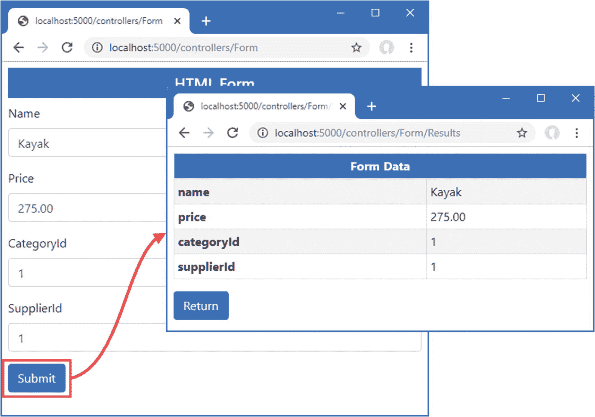

图 29-1。

运行示例应用

## 理解模型验证的需要

模型验证是对应用从客户端接收的数据实施要求的过程。在没有验证的情况下，应用将尝试对它接收到的任何数据进行操作，这可能会导致立即出现异常和意外行为，或者随着数据库中充满坏的、不完整的或恶意的数据而逐渐出现长期问题。

目前，接收表单数据的 action 和 handler 方法将接受用户提交的任何数据，这就是为什么示例只显示表单数据而不将它存储在数据库中。

大多数数据值都有某种约束。这可能涉及要求提供一个值、要求该值为特定类型以及要求该值在特定范围内。

例如，在我可以安全地将一个`Product`对象存储在数据库中之前，我需要确保用户为`Name`、`Price`、`CategoryId`和`SupplierId`属性提供了值。`Name`值可以是任何有效的字符串，`Price`属性必须是有效的货币金额，`CategoryId`和`SupplierId`属性必须对应于数据库中现有的`Supplier`和`Category`产品。在接下来的小节中，我将通过检查应用接收的数据，并在应用无法使用用户提交的数据时向用户提供反馈，来演示如何使用模型验证来实施这些需求。

## 显式验证控制器中的数据

验证数据最直接的方式是在一个动作或处理程序方法中这样做，如清单 [29-5](#PC5) 所示，记录任何问题的细节，以便可以向用户显示。

```cs
using Microsoft.AspNetCore.Mvc;
using System.Linq;
using System.Threading.Tasks;
using WebApp.Models;
using Microsoft.EntityFrameworkCore;
using Microsoft.AspNetCore.Mvc.ModelBinding;

namespace WebApp.Controllers {

    [AutoValidateAntiforgeryToken]
    public class FormController : Controller {
        private DataContext context;

        public FormController(DataContext dbContext) {
            context = dbContext;
        }

        public async Task<IActionResult> Index(long? id) {
            return View("Form", await context.Products
                .FirstOrDefaultAsync(p => id == null || p.ProductId == id));
        }

        [HttpPost]
        public IActionResult SubmitForm(Product product) {

            if (string.IsNullOrEmpty(product.Name)) {
                ModelState.AddModelError(nameof(Product.Name), "Enter a name");
            }

            if (ModelState.GetValidationState(nameof(Product.Price))
                    == ModelValidationState.Valid && product.Price < 1) {
                ModelState.AddModelError(nameof(Product.Price),
                    "Enter a positive price");
            }

            if (!context.Categories.Any(c => c.CategoryId == product.CategoryId)) {
                ModelState.AddModelError(nameof(Product.CategoryId),
                    "Enter an existing category ID");
            }

            if (!context.Suppliers.Any(s => s.SupplierId == product.SupplierId)) {
                ModelState.AddModelError(nameof(Product.SupplierId),
                    "Enter an existing supplier ID");
            }

            if (ModelState.IsValid) {
                TempData["name"] = product.Name;
                TempData["price"] = product.Price.ToString();
                TempData["categoryId"] = product.CategoryId.ToString();
                TempData["supplierId"] = product.SupplierId.ToString();
                return RedirectToAction(nameof(Results));
            } else {
                return View("Form");
            }
        }

        public IActionResult Results() {
            return View(TempData);
        }
    }
}

Listing 29-5.Explicitly Validating Data in the FormController.cs File in the Controllers Folder

```

对于创建的`Product`参数的每个属性，我检查用户提供的值，并记录我使用从`ControllerBase`类继承的`ModelState`属性返回的`ModelStateDictionary`对象发现的任何错误。

顾名思义，`ModelStateDictionary`类是一个字典，用于跟踪模型对象的状态细节，重点是验证错误。表 [29-3](#Tab3) 描述了最重要的`ModelStateDictionary`成员。

表 29-3。

选定的 ModelStateDictionary 成员

<colgroup><col class="tcol1 align-left"> <col class="tcol2 align-left"></colgroup> 
| 

**名称**

 | 

**描述**

 |
| --- | --- |
| `AddModelError(property, message)` | 此方法用于记录指定属性的模型验证错误。 |
| `GetValidationState(property)` | 该方法用于确定特定属性是否存在模型验证错误，表示为来自`ModelValidationState`枚举的值。 |
| `IsValid` | 如果所有模型属性都有效，该属性返回`true`，否则返回`false`。 |
| `Clear()` | 此属性清除验证状态。 |

作为使用`ModelStateDictionary`的一个例子，考虑如何验证`Name`属性。

```cs
...
if (string.IsNullOrEmpty(product.Name)) {
    ModelState.AddModelError(nameof(Product.Name), "Enter a name");
}
...

```

对`Product`类的验证需求之一是确保用户为`Name`属性提供一个值，所以我使用静态的`string.IsNullOrEmpty`方法来测试模型绑定过程从请求中提取的属性值。如果`Name`属性是`null`或空字符串，那么我知道该值不能被应用使用，我使用`ModelState.AddModelError`方法注册一个验证错误，指定属性的名称(`Name`)和一条将显示给用户的消息，解释问题的性质(`Enter a name`)。

在模型绑定过程中，还会使用`ModelStateDictionary`来记录寻找模型属性并为其赋值的任何问题。`GetValidationState`方法用于查看模型属性是否记录了任何错误，要么是来自模型绑定过程，要么是因为在 action 方法的显式验证过程中调用了`AddModelError`方法。`GetValidationState`方法从`ModelValidationState`枚举中返回一个值，该枚举定义了表 [29-4](#Tab4) 中描述的值。

表 29-4。

模型验证状态值

<colgroup><col class="tcol1 align-left"> <col class="tcol2 align-left"></colgroup> 
| 

**名称**

 | 

**描述**

 |
| --- | --- |
| `Unvalidated` | 这个值意味着没有对模型属性执行任何验证，通常是因为请求中没有与属性名称对应的值。 |
| `Valid` | 该值意味着与该属性关联的请求值是有效的。 |
| `Invalid` | 该值意味着与该属性关联的请求值无效，不应使用。 |
| `Skipped` | 这个值意味着模型属性还没有被处理，这通常意味着已经有太多的验证错误，继续执行验证检查是没有意义的。 |

对于`Price`属性，我检查模型绑定过程是否报告了将浏览器发送的值解析为十进制值的问题，如下所示:

```cs
...
if (ModelState.GetValidationState(nameof(Product.Price))
        == ModelValidationState.Valid && product.Price < 1) {
    ModelState.AddModelError(nameof(Product.Price), "Enter a positive price");
}
...

```

我想确保用户提供了一个等于或大于 1 的`Price`值，但是如果用户提供了一个模型绑定器不能转换成`decimal`值的值，那么记录一个关于 0 或负值的错误是没有意义的。在执行我自己的验证检查之前，我使用`GetValidationState`方法来确定`Price`属性的验证状态。

在我验证了`Product`对象中的所有属性之后，我检查`ModelState.IsValid`属性以查看是否有错误。如果在检查过程中调用了`Model.State.AddModelError`方法，或者如果模型绑定器在创建对象时有任何问题，这个方法将返回`true`。

```cs
...
if (ModelState.IsValid) {
    TempData["name"] = product.Name;
    TempData["price"] = product.Price.ToString();
    TempData["categoryId"] = product.CategoryId.ToString();
    TempData["supplierId"] = product.SupplierId.ToString();
    return RedirectToAction(nameof(Results));
} else {
    return View("Form");
}
...

```

如果`IsValid`属性返回`true`，那么`Product`对象是有效的，在这种情况下，action 方法将浏览器重定向到`Results`动作，在那里将显示经过验证的表单值。如果`IsValue`属性返回`false`，就会出现验证问题，这可以通过调用`View`方法再次呈现`Form`视图来解决。

### 向用户显示验证错误

通过调用`View`方法来处理验证错误似乎有些奇怪，但是提供给视图的上下文数据包含了模型验证错误的细节；标签助手使用这些细节来转换`input`元素。

要查看这是如何工作的，重启 ASP.NET Core，以便对控制器的更改生效，并使用浏览器请求`http://localhost:5000/controllers/form`。清除名称字段的内容，然后单击提交按钮。浏览器显示的内容不会有任何明显的变化，但是如果您检查`Name`字段的`input`元素，您会看到该元素已经被转换。以下是提交表单之前的输入元素:

```cs
<input class="form-control" type="text" id="Name" name="Name" value="Kayak">

```

表单提交后的`input`元素如下:

```cs
<input class="form-control input-validation-error" type="text" id="Name"
    name="Name" value="">

```

tag helper 将值验证失败的元素添加到`input-validation-error`类中，然后可以对其进行样式化以向用户突出显示问题。

您可以通过在样式表中定义自定义 CSS 样式来做到这一点，但是如果您想要使用像 Bootstrap 这样的 CSS 库提供的内置验证样式，则需要做一些额外的工作。添加到`input`元素中的类的名称不能更改，这意味着需要一些 JavaScript 代码在 ASP.NET Core 使用的名称和 Bootstrap 提供的 CSS 错误类之间进行映射。

Tip

像这样使用 JavaScript 代码可能会很尴尬，而且使用自定义 CSS 样式可能会很诱人，即使是在使用 Bootstrap 这样的 CSS 库时。然而，Bootstrap 中用于验证类的颜色可以通过使用主题或者通过定制包并定义您自己的样式来覆盖，这意味着您必须确保对主题的任何更改都与您定义的任何定制样式的相应更改相匹配。理想情况下，微软将在 ASP.NET Core 的未来版本中使验证类名可配置，但在此之前，使用 JavaScript 应用引导样式是比创建自定义样式表更健壮的方法。

为了定义 JavaScript 代码，使其可以被控制器和 Razor 页面使用，使用 Visual Studio JavaScript 文件模板将一个名为`_Validation.cshtml`的文件添加到`Views/Shared`文件夹中，其内容如清单 [29-6](#PC11) 所示。Visual Studio 代码不需要模板，您可以用清单中所示的代码在`Views/Shared`文件夹中添加一个名为`_Validation.cshtml`的文件。

```cs
<script src="/lib/jquery/jquery.min.js"></script>
<script type="text/javascript">
    $(document).ready(function () {
        $("input.input-validation-error").addClass("is-invalid");
    });
</script>

Listing 29-6.The Contents of the _Validation.cshtml File in the Views/Shared Folder

```

我将使用新文件作为局部视图，它包含一个加载 jQuery 库的脚本元素，还包含一个自定义脚本，该脚本定位作为`input-validation-error`类成员的`input`元素，并将它们添加到`is-invalid`类(Bootstrap 使用该类来设置表单元素的错误颜色)。清单 [29-7](#PC12) 使用`partial`标签助手将新的局部视图合并到 HTML 表单中，这样带有验证错误的字段就会被高亮显示。

```cs
@model Product
@{  Layout = "_SimpleLayout"; }

<h5 class="bg-primary text-white text-center p-2">HTML Form</h5>

<partial name="_Validation" />

<form asp-action="submitform" method="post" id="htmlform">
    <div class="form-group">
        <label asp-for="Name"></label>
        <input class="form-control" asp-for="Name" />
    </div>
    <div class="form-group">
        <label asp-for="Price"></label>
        <input class="form-control" asp-for="Price" />
    </div>
    <div class="form-group">
        <label>CategoryId</label>
        <input class="form-control" asp-for="CategoryId"  />
    </div>
    <div class="form-group">
        <label>SupplierId</label>
        <input class="form-control" asp-for="SupplierId"  />
    </div>
    <button type="submit" class="btn btn-primary">Submit</button>
</form>

Listing 29-7.Including a Partial View in the Form.cshtml File in the Views/Form Folder

```

jQuery 代码在浏览器解析完 HTML 文档中的所有元素后运行，其效果是突出显示已经分配给`input-validaton-error`类的`input`元素。您可以通过导航到`http://localhost:5000/controllers/form`，清除 Name 字段的内容，并提交表单来查看效果，这将产生如图 [29-2](#Fig2) 所示的响应。

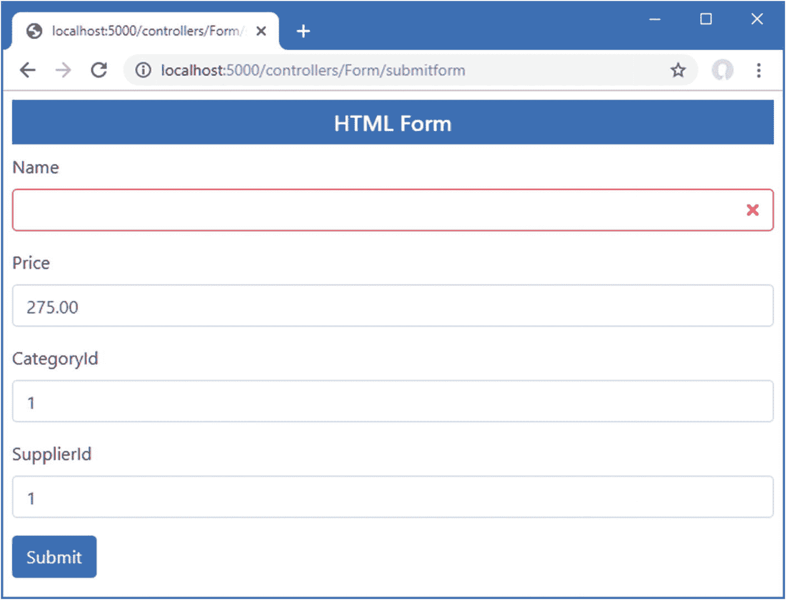

图 29-2。

突出显示验证错误

在提交表单之前，不会向用户显示`Results`视图，表单中的数据可以被模型浏览器解析，并通过 action 方法中的显式验证检查。在此之前，提交表单将导致`Form`视图呈现高亮显示的验证错误。

### 显示验证消息

标签助手应用于`input`元素的 CSS 类表明表单域有问题，但是它们没有告诉用户问题是什么。为用户提供更多信息需要使用不同的标签助手，这将问题的摘要添加到视图中，如清单 [29-8](#PC13) 所示。

```cs
@model Product
@{  Layout = "_SimpleLayout"; }

<h5 class="bg-primary text-white text-center p-2">HTML Form</h5>

<partial name="_Validation" />

<form asp-action="submitform" method="post" id="htmlform">
    <div asp-validation-summary="All" class="text-danger"></div>
    <div class="form-group">
        <label asp-for="Name"></label>
        <input class="form-control" asp-for="Name" />
    </div>
    <div class="form-group">
        <label asp-for="Price"></label>
        <input class="form-control" asp-for="Price" />
    </div>
    <div class="form-group">
        <label>CategoryId</label>
        <input class="form-control" asp-for="CategoryId"  />
    </div>
    <div class="form-group">
        <label>SupplierId</label>
        <input class="form-control" asp-for="SupplierId"  />
    </div>
    <button type="submit" class="btn btn-primary">Submit</button>
</form>

Listing 29-8.Displaying a Summary in the Form.cshtml File in the Views/Form Folder

```

`ValidationSummaryTagHelper`类检测`div`元素上的`asp-validation-summary`属性，并通过添加描述任何已记录的验证错误的消息进行响应。属性`asp-validation-summary`的值是来自`ValidationSummary`枚举的一个值，它定义了表 [29-5](#Tab5) 中显示的值，我将很快演示这些值。

表 29-5。

验证摘要值

<colgroup><col class="tcol1 align-left"> <col class="tcol2 align-left"></colgroup> 
| 

名字

 | 

描述

 |
| --- | --- |
| `All` | 该值用于显示已记录的所有验证错误。 |
| `ModelOnly` | 该值仅用于显示整个模型的验证错误，不包括为单个属性记录的错误，如“显示模型级消息”一节中所述。 |
| `None` | 该值用于禁用标记帮助器，这样它就不会转换 HTML 元素。 |

显示错误信息有助于用户理解为什么不能处理表单。例如，尝试提交价格字段为负值的表单，如**–10**，以及不能转换为`decimal`值的值，如**十**。每个值导致不同的错误信息，如图 [29-3](#Fig3) 所示。

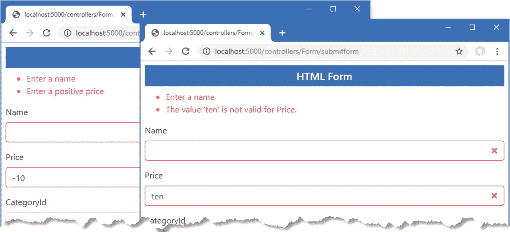

图 29-3。

显示验证消息

#### 配置默认验证错误消息

当模型绑定过程试图提供调用动作方法所需的数据值时，它会执行自己的验证，例如，这就是为什么当`Price`值不能转换为`decimal`时，您会看到一条验证消息。并非所有由模型绑定器生成的验证消息都对用户有帮助，这可以通过清除 Price 字段并提交表单来看到。空字段会产生以下消息:

```cs
The value '' is invalid

```

当模型绑定过程找不到属性值或者找到值但无法解析时，该消息被添加到`ModelStateDictionary`中。在这种情况下，由于表单数据中发送的空字符串无法解析为`Product`类的`Price`属性的`decimal`值，所以出现了错误。

模型绑定器有一组预定义的消息，用于验证错误。这些可以使用由`DefaultModelBindingMessageProvider`类定义的方法替换为自定义消息，如表 [29-6](#Tab6) 中所述。

表 29-6。

DefaultModelBindingMessageProvider 方法

<colgroup><col class="tcol1 align-left"> <col class="tcol2 align-left"></colgroup> 
| 

名字

 | 

描述

 |
| --- | --- |
| `SetValueMustNotBeNullAccessor` | 分配给该属性的函数用于在不可为空的模型属性的值为`null`时生成验证错误消息。 |
| `SetMissingBindRequiredValueAccessor` | 分配给该属性的函数用于在请求不包含必需属性的值时生成验证错误消息。 |
| `SetMissingKeyOrValueAccessor` | 分配给该属性的函数用于在字典模型对象所需的数据包含空键或空值时生成验证错误消息。 |
| `SetAttemptedValueIsInvalidAccessor` | 分配给此属性的函数用于在模型绑定系统无法将数据值转换为所需的 C# 类型时生成验证错误信息。 |
| `SetUnknownValueIsInvalidAccessor` | 分配给此属性的函数用于在模型绑定系统无法将数据值转换为所需的 C# 类型时生成验证错误信息。 |
| `SetValueMustBeANumberAccessor` | 分配给此属性的函数用于在数据值无法分析为 C# 数值类型时生成验证错误信息。 |
| `SetValueIsInvalidAccessor` | 分配给此属性的函数用于生成回退验证错误消息，该消息作为最后手段使用。 |

表中描述的每种方法都接受一个函数，调用该函数可以获得向用户显示的验证消息。这些方法是通过`Startup`类中的 options 模式应用的，如清单 [29-9](#PC15) 所示，其中我已经替换了当值为空或无法转换时显示的默认消息。

```cs
using Microsoft.AspNetCore.Builder;
using Microsoft.Extensions.DependencyInjection;
using Microsoft.Extensions.Configuration;
using Microsoft.EntityFrameworkCore;
using WebApp.Models;
using Microsoft.AspNetCore.Antiforgery;
using Microsoft.AspNetCore.Http;
using Microsoft.AspNetCore.Mvc;

namespace WebApp {
    public class Startup {

        public Startup(IConfiguration config) {
            Configuration = config;
        }

        public IConfiguration Configuration { get; set; }

        public void ConfigureServices(IServiceCollection services) {
            services.AddDbContext<DataContext>(opts => {
                opts.UseSqlServer(Configuration[
                    "ConnectionStrings:ProductConnection"]);
                opts.EnableSensitiveDataLogging(true);
            });
            services.AddControllersWithViews().AddRazorRuntimeCompilation();
            services.AddRazorPages().AddRazorRuntimeCompilation();
            services.AddSingleton<CitiesData>();

            services.Configure<AntiforgeryOptions>(opts => {
                opts.HeaderName = "X-XSRF-TOKEN";
            });

            services.Configure<MvcOptions>(opts => opts.ModelBindingMessageProvider
                .SetValueMustNotBeNullAccessor(value => "Please enter a value"));
        }

        public void Configure(IApplicationBuilder app, DataContext context,
                IAntiforgery antiforgery) {

            app.UseRequestLocalization();

            app.UseDeveloperExceptionPage();
            app.UseStaticFiles();
            app.UseRouting();

            app.Use(async (context, next) => {
                if (!context.Request.Path.StartsWithSegments("/api")) {
                    context.Response.Cookies.Append("XSRF-TOKEN",
                       antiforgery.GetAndStoreTokens(context).RequestToken,
                       new CookieOptions { HttpOnly = false });
                }
                await next();
            });

            app.UseEndpoints(endpoints => {
                endpoints.MapControllers();
                endpoints.MapControllerRoute("forms",
                    "controllers/{controller=Home}/{action=Index}/{id?}");
                endpoints.MapDefaultControllerRoute();
                endpoints.MapRazorPages();
            });
            SeedData.SeedDatabase(context);
        }
    }
}

Listing 29-9.Changing a Validation Message in the Startup.cs File in the WebApp Folder

```

您指定的函数接收用户提供的值，尽管这在处理`null`值时不是特别有用。要查看定制消息，重启 ASP.NET Core，使用浏览器请求`http://localhost:5000/controllers/form`，并提交带有空价格字段的表单。响应将包括自定义错误信息，如图 [29-4](#Fig4) 所示。

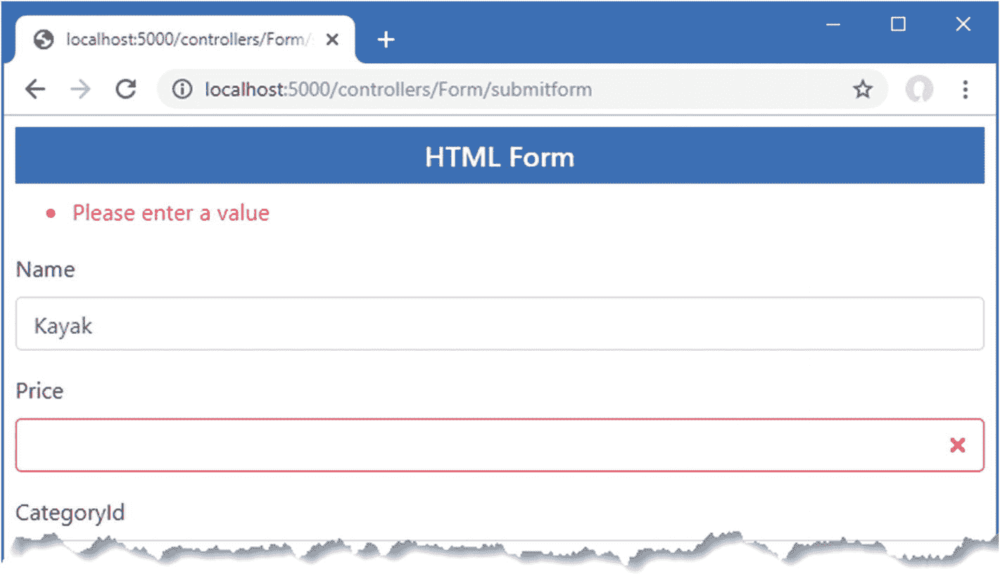

图 29-4。

更改默认验证消息

### 显示属性级验证消息

尽管自定义错误消息比默认错误消息更有意义，但它仍然没有多大帮助，因为它没有明确指出问题与哪个字段有关。对于这种错误，在包含问题数据的 HTML 元素旁边显示验证错误消息更有用。这可以通过使用`ValidationMessageTag`标签助手来完成，该助手查找具有`asp-validation-for`属性的`span`元素，该属性用于指定应该显示错误消息的属性。

在清单 [29-10](#PC16) 中，我为表单中的每个`input`元素添加了属性级验证消息元素。

```cs
@model Product
@{  Layout = "_SimpleLayout"; }

<h5 class="bg-primary text-white text-center p-2">HTML Form</h5>

<partial name="_Validation" />

<form asp-action="submitform" method="post" id="htmlform">
    <div asp-validation-summary="All" class="text-danger"></div>
    <div class="form-group">
        <label asp-for="Name"></label>
        <div><span asp-validation-for="Name" class="text-danger"></span></div>
        <input class="form-control" asp-for="Name" />
    </div>
    <div class="form-group">
        <label asp-for="Price"></label>
        <div><span asp-validation-for="Price" class="text-danger"></span></div>
        <input class="form-control" asp-for="Price" />
    </div>
    <div class="form-group">
        <label>CategoryId</label>
        <div><span asp-validation-for="CategoryId" class="text-danger"></span></div>
        <input class="form-control" asp-for="CategoryId"  />
    </div>
    <div class="form-group">
        <label>SupplierId</label>
        <div><span asp-validation-for="SupplierId" class="text-danger"></span></div>
        <input class="form-control" asp-for="SupplierId"  />
    </div>
    <button type="submit" class="btn btn-primary">Submit</button>
</form>

Listing 29-10.Adding Property-Level Messages in the Form.cshtml File in the Views/Form Folder

```

因为`span`元素是内联显示的，所以在呈现验证消息时必须小心，使消息与哪个元素相关变得明显。通过请求`http://localhost:5000/controllers/form`，清除 Name 和 Price 字段，并提交表单，可以看到新验证消息的效果。如图 [29-5](#Fig5) 所示，响应包括文本字段旁边的验证消息。

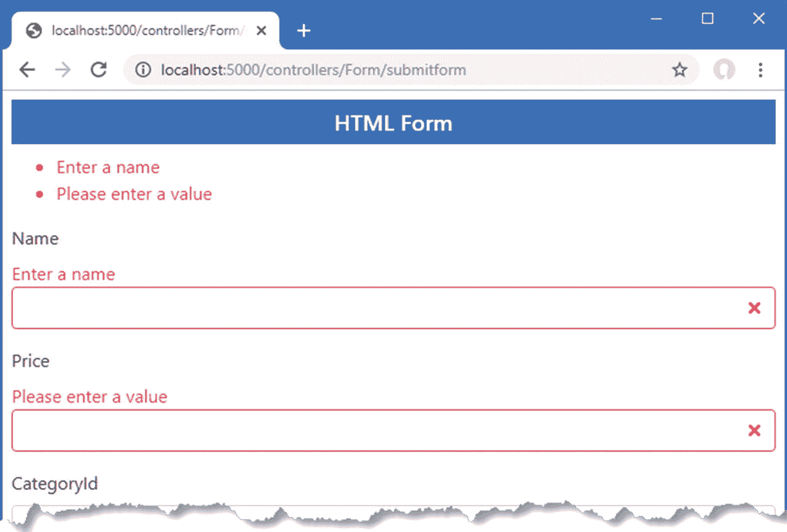

图 29-5。

显示属性级验证消息

### 显示模型级消息

验证摘要消息似乎是多余的，因为它重复了属性级别的消息。但是摘要有一个有用的技巧，就是能够显示适用于整个模型的消息，而不仅仅是单个属性。这意味着您可以报告由单个属性的组合引起的错误，否则很难用属性级消息来表达。

在清单 [29-11](#PC17) 中，我给`FormController.SubmitForm`动作添加了一个检查，当`Price`值超过`100`时，记录一个验证错误，此时`Name`值以`Small`开始。

```cs
...
[HttpPost]
public IActionResult SubmitForm(Product product) {

    if (string.IsNullOrEmpty(product.Name)) {
        ModelState.AddModelError(nameof(Product.Name), "Enter a name");
    }

    if (ModelState.GetValidationState(nameof(Product.Price))
            == ModelValidationState.Valid && product.Price < 1) {
        ModelState.AddModelError(nameof(Product.Price), "Enter a positive price");
    }

    if (ModelState.GetValidationState(nameof(Product.Name))
            == ModelValidationState.Valid
            && ModelState.GetValidationState(nameof(Product.Price))
            == ModelValidationState.Valid
            && product.Name.ToLower().StartsWith("small") && product.Price > 100) {
        ModelState.AddModelError("", "Small products cannot cost more than $100");
    }

    if (!context.Categories.Any(c => c.CategoryId == product.CategoryId)) {
        ModelState.AddModelError(nameof(Product.CategoryId),
            "Enter an existing category ID");
    }

    if (!context.Suppliers.Any(s => s.SupplierId == product.SupplierId)) {
        ModelState.AddModelError(nameof(Product.SupplierId),
            "Enter an existing supplier ID");
    }

    if (ModelState.IsValid) {
        TempData["name"] = product.Name;
        TempData["price"] = product.Price.ToString();
        TempData["categoryId"] = product.CategoryId.ToString();
        TempData["supplierId"] = product.SupplierId.ToString();
        return RedirectToAction(nameof(Results));
    } else {
        return View("Form");
    }
}
...

Listing 29-11.Performing Model-Level Validation in the FormController.cs File in the Controllers Folder

```

如果用户输入一个以`Small`开始的`Name`值和一个大于`100`的`Price`值，那么就会记录一个模型级验证错误。只有在单个属性值没有验证问题的情况下，我才会检查值的组合，这样可以确保用户不会得到冲突的消息。使用空字符串作为第一个参数的`AddModelError`记录与整个模型相关的验证错误。

清单 [29-12](#PC18) 将`asp-validation-summary`属性的值更改为`ModelOnly`，这排除了属性级别的错误，这意味着摘要将只显示那些适用于整个模型的错误。

```cs
@model Product
@{  Layout = "_SimpleLayout"; }

<h5 class="bg-primary text-white text-center p-2">HTML Form</h5>

<partial name="_Validation" />

<form asp-action="submitform" method="post" id="htmlform">
    <div asp-validation-summary="ModelOnly" class="text-danger"></div>
    <div class="form-group">
        <label asp-for="Name"></label>
        <div><span asp-validation-for="Name" class="text-danger"></span></div>
        <input class="form-control" asp-for="Name" />
    </div>
    <div class="form-group">
        <label asp-for="Price"></label>
        <div><span asp-validation-for="Price" class="text-danger"></span></div>
        <input class="form-control" asp-for="Price" />
    </div>
    <div class="form-group">
        <label>CategoryId</label>
        <div><span asp-validation-for="CategoryId" class="text-danger"></span></div>
        <input class="form-control" asp-for="CategoryId"  />
    </div>
    <div class="form-group">
        <label>SupplierId</label>
        <div><span asp-validation-for="SupplierId" class="text-danger"></span></div>
        <input class="form-control" asp-for="SupplierId"  />
    </div>
    <button type="submit" class="btn btn-primary">Submit</button>
</form>

Listing 29-12.Configuring the Validation Summary in the Form.cshtml File in the Views/Form Folder

```

重启 ASP.NET Core 并请求`http://localhost:5000/controllers/form`。在 Name 字段中输入 **Small Kayak** ，在 Price 字段中输入 **150** ，然后提交表单。响应将包括模型级错误信息，如图 [29-6](#Fig6) 所示。

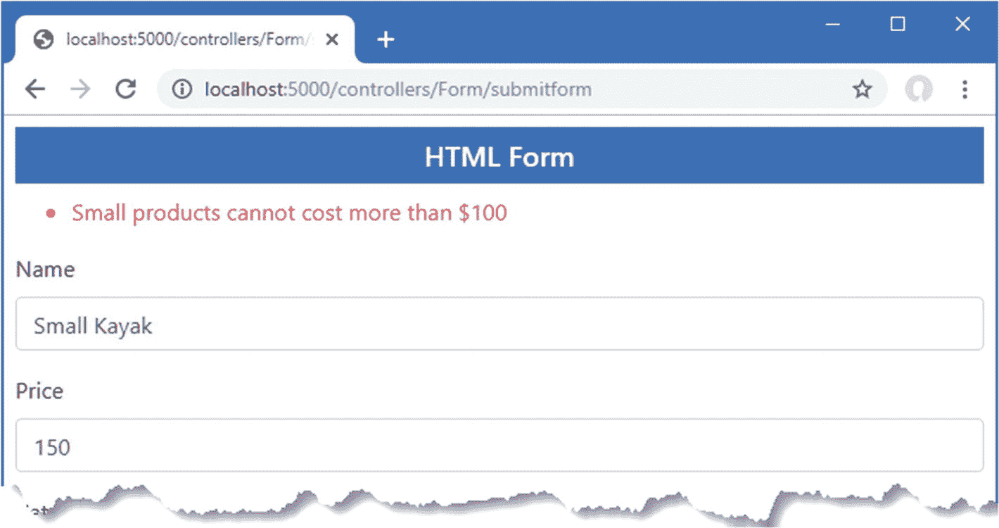

图 29-6。

显示模型级验证消息

## 显式验证 Razor 页面中的数据

Razor 页面验证依赖于上一节中控制器使用的特性。清单 [29-13](#PC19) 向`FormHandler`页面添加了显式的验证检查和错误总结。

```cs
@page "/pages/form/{id:long?}"
@model FormHandlerModel
@using Microsoft.AspNetCore.Mvc.RazorPages
@using Microsoft.EntityFrameworkCore
@using Microsoft.AspNetCore.Mvc.ModelBinding

<partial name="_Validation" />

<div class="m-2">
    <h5 class="bg-primary text-white text-center p-2">HTML Form</h5>
    <form asp-page="FormHandler" method="post" id="htmlform">
        <div asp-validation-summary="ModelOnly" class="text-danger"></div>
        <div class="form-group">
            <label>Name</label>
            <div>
                <span asp-validation-for="Product.Name" class="text-danger">
                </span>
            </div>
            <input class="form-control" asp-for="Product.Name" />
        </div>
        <div class="form-group">
            <label>Price</label>
            <div>
                 <span asp-validation-for="Product.Price" class="text-danger">
                 </span>
            </div>
            <input class="form-control" asp-for="Product.Price"  />
        </div>
        <div class="form-group">
            <label>CategoryId</label>
            <div>
                <span asp-validation-for="Product.CategoryId" class="text-danger">
               </span>
           </div>
            <input class="form-control" asp-for="Product.CategoryId"  />
        </div>
        <div class="form-group">
            <label>SupplierId</label>
            <div>
                <span asp-validation-for="Product.SupplierId" class="text-danger">
                </span>
            </div>
            <input class="form-control" asp-for="Product.SupplierId"  />
        </div>
        <button type="submit" class="btn btn-primary">Submit</button>
    </form>
</div>

@functions {

    public class FormHandlerModel : PageModel {
        private DataContext context;

        public FormHandlerModel(DataContext dbContext) {
            context = dbContext;
        }

        [BindProperty]
        public Product Product { get; set; }

        //[BindProperty(Name = "Product.Category")]
        //public Category Category { get; set; }

        public async Task OnGetAsync(long id = 1) {
            Product = await context.Products.FirstAsync(p => p.ProductId == id);
        }

        public IActionResult OnPost() {

            if (string.IsNullOrEmpty(Product.Name)) {
                ModelState.AddModelError("Product.Name", "Enter a name");
            }

            if (ModelState.GetValidationState("Product.Price")
                    == ModelValidationState.Valid && Product.Price < 1) {
                ModelState.AddModelError("Product.Price", "Enter a positive price");
            }

            if (ModelState.GetValidationState("Product.Name")
                    == ModelValidationState.Valid
                && ModelState.GetValidationState("Product.Price")
                    == ModelValidationState.Valid
                && Product.Name.ToLower().StartsWith("small")
                && Product.Price > 100) {
                    ModelState.AddModelError("",
                        "Small products cannot cost more than $100");
            }

            if (!context.Categories.Any(c => c.CategoryId == Product.CategoryId)) {
                ModelState.AddModelError("Product.CategoryId",
                    "Enter an existing category ID");
            }

            if (!context.Suppliers.Any(s => s.SupplierId == Product.SupplierId)) {
                    ModelState.AddModelError("Product.SupplierId",
                        "Enter an existing supplier ID");
            }

            if (ModelState.IsValid) {
                TempData["name"] = Product.Name;
                TempData["price"] = Product.Price.ToString();
                TempData["categoryId"] = Product.CategoryId.ToString();
                TempData["supplierId"] = Product.SupplierId.ToString();
                return RedirectToPage("FormResults");
            } else {
                return Page();
            }
        }
    }
}

Listing 29-13.Validating Data in the FormHandler.cshtml File in the Pages Folder

```

`PageModel`类定义了一个`ModelState`属性，相当于我在控制器中使用的属性，并允许记录验证错误。验证的过程是相同的，但是在记录错误时必须小心，以确保名称与 Razor 页面使用的模式相匹配。当我记录一个错误时，我使用`nameof`关键字来选择与错误相关的属性，如下所示:

```cs
...
ModelState.AddModelError(nameof(Product.Name), "Enter a name");
...

```

这是一个常见的约定，因为它确保了打字错误不会导致错误被错误地记录。这个表达式在 Razor 页面中不起作用，在 Razor 页面中，错误必须针对`Product.Name`而不是`Name`记录，以反映 Razor 页面中的`@Model`表达式返回页面模型对象，如下所示:

```cs
...
ModelState.AddModelError("Product.Name", "Enter a name");
...

```

为了测试验证过程，使用浏览器请求`http://localhost:5000/pages/form`并提交带有空字段的表单，或者带有不能转换成`Product`类所需的 C# 类型的值的表单。错误信息的显示与控制器相同，如图 [29-7](#Fig7) 所示。(值`1`、`2`和`3`对`CategoryId`和`SupplierId`字段都有效。)

Tip

表 [29-6](#Tab6) 中描述的改变默认验证消息的方法会影响 Razor 页面和控制器。

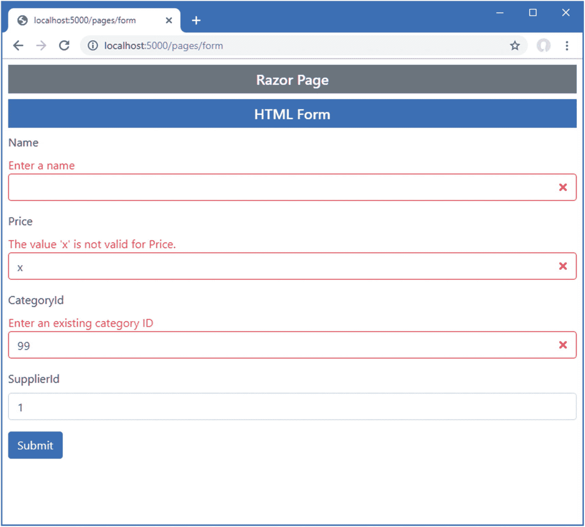

图 29-7。

验证 Razor 页面中的数据

## 使用元数据指定验证规则

将验证逻辑放入动作方法的一个问题是，它最终会在从用户接收数据的每个动作或处理程序方法中重复出现。为了帮助减少重复，验证过程支持使用属性直接在模型类中表达模型验证规则，从而确保无论使用哪种操作方法来处理请求，都将应用相同的验证规则集。在清单 [29-14](#PC22) 中，我将属性应用于`Product`类来描述`Name`和`Price`属性所需的验证。

```cs
using System.ComponentModel.DataAnnotations.Schema;
using System.ComponentModel.DataAnnotations;
using Microsoft.AspNetCore.Mvc.ModelBinding;

namespace WebApp.Models {
    public class Product {

        public long ProductId { get; set; }

        [Required]
        [Display(Name = "Name")]
        public string Name { get; set; }

        [Column(TypeName = "decimal(8, 2)")]
        [Required(ErrorMessage = "Please enter a price")]
        [Range(1, 999999, ErrorMessage = "Please enter a positive price")]
        public decimal Price { get; set; }

        public long CategoryId { get; set; }
        public Category Category { get; set; }

        public long SupplierId { get; set; }
        public Supplier Supplier { get; set; }
    }
}

Listing 29-14.Applying Validation Attributes in the Product.cs File in the Models Folder

```

我在清单中使用了两个验证属性:`Required`和`Range`。`Required`属性指定如果用户没有提交属性值，这是一个验证错误。`Range`属性指定了可接受值的子集。表 [29-7](#Tab7) 显示了一组可用的内置验证属性。

表 29-7。

内置的验证属性

<colgroup><col class="tcol1 align-left"> <col class="tcol2 align-left"> <col class="tcol3 align-left"></colgroup> 
| 

属性

 | 

例子

 | 

描述

 |
| --- | --- | --- |
| `Compare` | `[Compare ("OtherProperty")]` | 该属性确保属性必须具有相同的值，这在您要求用户两次提供相同的信息(如电子邮件地址或密码)时非常有用。 |
| `Range` | `[Range(10, 20)]` | 该属性确保数值(或任何实现`IComparable`的属性类型)不在指定的最小值和最大值范围之外。要仅在一侧指定边界，使用`MinValue`或`MaxValue`常量。 |
| `RegularExpression` | `[RegularExpression ("pattern")]` | 此属性确保字符串值与指定的正则表达式模式匹配。注意，模式必须匹配*整个*用户提供的值，而不仅仅是其中的一个子串。默认情况下，它区分大小写，但是您可以通过应用`(?i)`修饰符(即`[RegularExpression("(?i)mypattern")]`)使其不区分大小写。 |
| `Required` | `[Required]` | 此属性确保该值不为空，也不为仅由空格组成的字符串。如果您想将空白视为有效，请使用`[Required(AllowEmptyStrings = true)]`。 |
| `StringLength` | `[StringLength(10)]` | 此属性确保字符串值不长于指定的最大长度。您还可以指定最小长度:`[StringLength(10, MinimumLength=2)]`。 |

所有验证属性都支持通过为`ErrorMessage`属性设置一个值来指定自定义错误消息，如下所示:

```cs
...
[Column(TypeName = "decimal(8, 2)")]
[Required(ErrorMessage = "Please enter a price")]
[Range(1, 999999, ErrorMessage = "Please enter a positive price")]
public decimal Price { get; set; }
...

```

如果没有自定义错误消息，那么将使用默认消息，但是它们倾向于揭示对用户没有意义的模型类的细节，除非您也使用`Display`属性，如下所示:

```cs
...
[Required]
[Display(Name = "Name")]
public string Name { get; set; }
...

```

由`Required`属性生成的默认消息反映了由`Display`属性指定的名称，因此不会向用户透露属性的名称。

Validation Work Arounds

在使用验证属性时，要获得您需要的验证结果需要小心。例如，如果您想确保用户选中了复选框，您不能使用`Required`属性，因为当复选框未选中时，浏览器将发送一个`false`值，该值将始终通过由`Required`属性应用的检查。相反，使用`Range`属性并将最小值和最大值指定为`true`，如下所示:

```cs
...
[Range(typeof(bool), "true", "true", ErrorMessage="You must check the box")]
...

```

如果这种变通方法让人感觉不舒服，那么您可以创建定制的验证属性，如下一节所述。

在`Product`类上使用验证属性允许我删除对`Name`和`Price`属性的显式验证检查，如清单 [29-15](#PC26) 所示。

```cs
...
[HttpPost]
public IActionResult SubmitForm(Product product) {

    //if (string.IsNullOrEmpty(product.Name)) {
    //    ModelState.AddModelError(nameof(Product.Name), "Enter a name");
    //}

    //if (ModelState.GetValidationState(nameof(Product.Price))
    //        == ModelValidationState.Valid && product.Price < 1) {
    //    ModelState.AddModelError(nameof(Product.Price), "Enter a positive price");
    //}

    if (ModelState.GetValidationState(nameof(Product.Name))
            == ModelValidationState.Valid
            && ModelState.GetValidationState(nameof(Product.Price))
            == ModelValidationState.Valid
            && product.Name.ToLower().StartsWith("small") && product.Price > 100) {
        ModelState.AddModelError("", "Small products cannot cost more than $100");
    }

    if (!context.Categories.Any(c => c.CategoryId == product.CategoryId)) {
        ModelState.AddModelError(nameof(Product.CategoryId),
            "Enter an existing category ID");
    }

    if (!context.Suppliers.Any(s => s.SupplierId == product.SupplierId)) {
        ModelState.AddModelError(nameof(Product.SupplierId),
            "Enter an existing supplier ID");
    }

    if (ModelState.IsValid) {
        TempData["name"] = product.Name;
        TempData["price"] = product.Price.ToString();
        TempData["categoryId"] = product.CategoryId.ToString();
        TempData["supplierId"] = product.SupplierId.ToString();
        return RedirectToAction(nameof(Results));
    } else {
        return View("Form");
    }
}
...

Listing 29-15.Removing Explicit Validation in the FormController.cs File in the Controllers Folder

```

在调用 action 方法之前应用验证属性，这意味着在执行模型级验证时，我仍然可以依赖模型状态来确定各个属性是否有效。要查看有效的验证属性，重启 ASP.NET Core MVC，请求`http://localhost:5000/controllers/form`，清除名称和价格字段，并提交表单。响应将包括属性产生的验证错误，如图 [29-8](#Fig8) 所示。

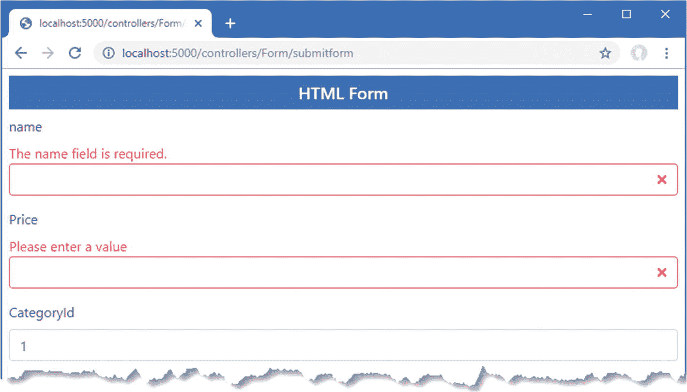

图 29-8。

使用验证属性

Understanding Web Service Controller Validation

用`ApiController`属性修饰的控制器不需要检查`ModelState.IsValid`属性。相反，只有在没有验证错误的情况下，才会调用 action 方法，这意味着您始终可以通过模型绑定特性接收经过验证的对象。如果检测到任何验证错误，则终止请求，并向浏览器发送错误响应。

### 创建自定义属性验证特性

可以通过创建一个扩展`ValidationAttribute`类的属性来扩展验证过程。为了演示，我创建了`WebApp/Validation`文件夹，并向其中添加了一个名为`PrimaryKeyAttribute.cs`的类文件，我用它来定义清单 [29-16](#PC27) 中所示的类。

```cs
using Microsoft.EntityFrameworkCore;
using System;
using System.ComponentModel.DataAnnotations;

namespace WebApp.Validation {
    public class PrimaryKeyAttribute : ValidationAttribute {

        public Type ContextType { get; set; }

        public Type DataType { get; set; }

        protected override ValidationResult IsValid(object value,
                ValidationContext validationContext) {
            DbContext context
                = validationContext.GetService(ContextType) as DbContext;
            if (context.Find(DataType, value) == null) {
                return new ValidationResult(ErrorMessage
                    ?? "Enter an existing key value");
            } else {
                return ValidationResult.Success;
            }
        }
    }
}

Listing 29-16.The Contents of the PrimaryKeyAttribute.cs File in the Validation Folder

```

自定义属性覆盖了`IsValid`方法，该方法是用要检查的值调用的，还覆盖了一个`ValidationContext`对象，该对象提供了关于验证过程的上下文，并通过其`GetService`方法提供了对应用服务的访问。

在清单 [29-16](#PC27) 中，自定义属性接收实体框架核心数据库上下文类的类型和模型类的类型。在`IsValid`方法中，属性获取上下文类的一个实例，并使用它来查询数据库，以确定该值是否已被用作主键值。

Revalidating Data

如果修改从模型绑定器接收的对象，您可能需要再次执行验证过程。对于这些情况，使用`ModelState.Clear`方法清除任何现有的验证错误，并调用`TryValidateModel`方法。

自定义验证属性也可用于执行模型级验证。为了演示，我在`Validation`文件夹中添加了一个名为`PhraseAndPriceAttribute.cs`的类文件，并用它来定义清单 [29-17](#PC28) 中所示的类。

```cs
using System;
using System.ComponentModel.DataAnnotations;
using WebApp.Models;

namespace WebApp.Validation {
    public class PhraseAndPriceAttribute: ValidationAttribute {

        public string Phrase { get; set; }

        public string Price { get; set; }

        protected override ValidationResult IsValid(object value,
                ValidationContext validationContext) {
            Product product = value as Product;
            if (product != null
                && product.Name.StartsWith(Phrase,
                    StringComparison.OrdinalIgnoreCase)
                && product.Price > decimal.Parse(Price)) {
                    return new ValidationResult(ErrorMessage
                        ?? $"{Phrase} products cannot cost more than ${Price}");
            }
            return ValidationResult.Success;
        }
    }
}

Listing 29-17.The Contents of the PhraseAndPriceAttribute.cs File in the Validation Folder

```

该属性配置有`Phrase`和`Price`属性，它们在`IsValid`方法中用于检查模型对象的`Name`和`Price`属性。属性级别的定制验证属性直接应用于它们验证的属性，而模型级别的属性应用于整个类，如清单 [29-18](#PC29) 所示。

```cs
using System.ComponentModel.DataAnnotations.Schema;
using System.ComponentModel.DataAnnotations;
using Microsoft.AspNetCore.Mvc.ModelBinding;
using WebApp.Validation;

namespace WebApp.Models {

    [PhraseAndPrice(Phrase ="Small", Price = "100")]
    public class Product {

        public long ProductId { get; set; }

        [Required]
        [Display(Name = "Name")]
        public string Name { get; set; }

        [Column(TypeName = "decimal(8, 2)")]
        [Required(ErrorMessage = "Please enter a price")]
        [Range(1, 999999, ErrorMessage = "Please enter a positive price")]
        public decimal Price { get; set; }

        [PrimaryKey(ContextType= typeof(DataContext), DataType = typeof(Category))]
        public long CategoryId { get; set; }
        public Category Category { get; set; }

        [PrimaryKey(ContextType = typeof(DataContext), DataType = typeof(Category))]
        public long SupplierId { get; set; }
        public Supplier Supplier { get; set; }
    }
}

Listing 29-18.Applying Custom Validation Attributes in the Product.cs File in the Models Folder

```

定制属性允许剩余的显式验证语句从`Form`控制器的动作方法中移除，如清单 [29-19](#PC30) 所示。

```cs
using Microsoft.AspNetCore.Mvc;
using System.Linq;
using System.Threading.Tasks;
using WebApp.Models;
using Microsoft.EntityFrameworkCore;
using Microsoft.AspNetCore.Mvc.ModelBinding;

namespace WebApp.Controllers {

    [AutoValidateAntiforgeryToken]
    public class FormController : Controller {
        private DataContext context;

        public FormController(DataContext dbContext) {
            context = dbContext;
        }

        public async Task<IActionResult> Index(long? id) {
            return View("Form", await context.Products
                .FirstOrDefaultAsync(p => id == null || p.ProductId == id));
        }

        [HttpPost]
        public IActionResult SubmitForm(Product product) {
            if (ModelState.IsValid) {
                TempData["name"] = product.Name;
                TempData["price"] = product.Price.ToString();
                TempData["categoryId"] = product.CategoryId.ToString();
                TempData["supplierId"] = product.SupplierId.ToString();
                return RedirectToAction(nameof(Results));
            } else {
                return View("Form");
            }
        }

        public IActionResult Results() {
            return View(TempData);
        }
    }
}

Listing 29-19.Removing Explicit Validation in the FormController.cs File in the Controllers Folder

```

在动作方法被调用之前，验证属性被自动应用，这意味着验证结果可以简单地通过读取`ModelState.IsValid`属性来确定。同样的简化也适用于 Razor 页面，如清单 [29-20](#PC31) 所示。

```cs
...
@functions {

    public class FormHandlerModel : PageModel {
        private DataContext context;

        public FormHandlerModel(DataContext dbContext) {
            context = dbContext;
        }

        [BindProperty]
        public Product Product { get; set; }

        public async Task OnGetAsync(long id = 1) {
            Product = await context.Products.FirstAsync(p => p.ProductId == id);
        }

        public IActionResult OnPost() {
            if (ModelState.IsValid) {
                TempData["name"] = Product.Name;
                TempData["price"] = Product.Price.ToString();
                TempData["categoryId"] = Product.CategoryId.ToString();
                TempData["supplierId"] = Product.SupplierId.ToString();
                return RedirectToPage("FormResults");
            } else {
                return Page();
            }
        }
    }
}
...

Listing 29-20.Removing Explicit Validation in the FormHandler.cshtml File in the Pages Folder

```

通过定制属性来表达验证消除了控制器和 Razor 页面之间的代码重复，并确保了验证在模型绑定用于`Product`对象的任何地方都得到一致的应用。要测试验证属性，重启 ASP.NET Core 并导航至`http://localhost:5000/controllers/form`或`http://localhost:5000/pages/form`。清除表单字段或输入错误的键值并提交表单，您将看到属性产生的错误信息，其中一些如图 [29-9](#Fig9) 所示。(值`1`、`2`和`3`对`CategoryId`和`SupplierId`字段都有效。)

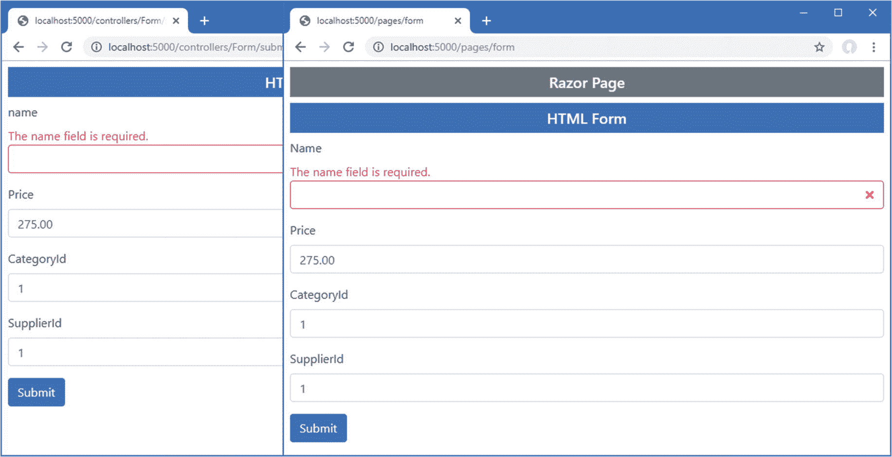

图 29-9。

使用自定义验证属性

## 执行客户端验证

到目前为止，我所展示的验证技术都是服务器端验证的例子。这意味着用户将他们的数据提交给服务器，服务器验证数据并发回验证结果(数据处理成功或需要纠正的错误列表)。

在 web 应用中，用户通常希望得到即时的验证反馈，而不必向服务器提交任何东西。这被称为*客户端验证*，使用 JavaScript 实现。用户输入的数据在发送到服务器之前经过验证，为用户提供即时反馈和纠正任何问题的机会。

ASP.NET Core 支持*不引人注目的客户端验证*。术语*不引人注目的*意味着使用添加到视图生成的 HTML 元素中的属性来表达验证规则。这些属性由微软发布的 JavaScript 库解释，该库反过来配置 jQuery 验证库，后者执行实际的验证工作。在接下来的几节中，我将向您展示内置的验证支持是如何工作的，并演示如何扩展该功能以提供定制的客户端验证。

第一步是安装处理验证的 JavaScript 包。打开一个新的 PowerShell 命令提示符，导航到`WebApp`项目文件夹，运行清单 [29-21](#PC32) 中所示的命令。

Tip

核心的 jQuery 命令被添加到第 26 章的项目中。如果需要重新安装，请运行以下命令:`libman install jquery@3.4.1 -d wwwroot/lib/jquery`。

```cs
libman install jquery-validate@1.19.1 -d wwwroot/lib/jquery-validate
libman install jquery-validation-unobtrusive@3.2.11 -d wwwroot/lib/jquery-validation-unobtrusive

Listing 29-21.Installing the Validation Packages

```

一旦安装了包，将清单 [29-22](#PC33) 中所示的元素添加到`Views/Shared`文件夹中的`_Validation.cshtml`文件中，这提供了一种在应用中现有 jQuery 代码旁边引入验证的便捷方式。

Tip

元素必须按照它们显示的顺序来定义。

```cs
<script src="/lib/jquery/jquery.min.js"></script>
<script src="~/lib/jquery-validate/jquery.validate.min.js"></script>
<script
    src="~/lib/jquery-validation-unobtrusive/jquery.validate.unobtrusive.min.js">
</script>
<script type="text/javascript">
    $(document).ready(function () {
        $("input.input-validation-error").addClass("is-invalid");
    });
</script>

Listing 29-22.Adding Elements in the _Validation.cshtml File in the Views/Shared Folder

```

标签助手将`data-val*`属性添加到`input`元素中，这些元素描述了字段的验证约束。下面是添加到`Name`字段的`input`元素的属性，例如:

```cs
...
<input class="form-control valid" type="text" data-val="true" data-val-required="The name field is required." id="Name" name="Name" value="Kayak" aria-describedby="Name-error" aria-invalid="false">
...

```

不引人注目的验证 JavaScript 代码查找这些属性，并在用户尝试提交表单时在浏览器中执行验证。表单将不会被提交，如果存在验证问题，将会显示一个错误。在没有未解决的验证问题之前，数据不会被发送到应用。

JavaScript 代码查找具有`data-val`属性的元素，并在用户提交表单时在浏览器中执行本地验证，而无需向服务器发送 HTTP 请求。通过运行应用并提交表单，同时使用 F12 工具，您可以看到这样的效果。注意，即使没有向服务器发送 HTTP 请求，也会显示验证错误消息。

Avoiding Conflicts with Browser Validation

一些当代的 HTML5 浏览器支持基于应用于`input`元素的属性的简单客户端验证。一般的想法是，比方说，当用户试图提交表单而不提供值时，应用了`required`属性的`input`元素会导致浏览器显示一个验证错误。

如果你正在使用标签助手生成表单元素，正如我在本章中所做的，那么你在浏览器验证方面不会有任何问题，因为被赋予`data`属性的元素会被浏览器忽略。

然而，如果您不能完全控制应用中的标记，您可能会遇到问题，这种情况在您传递其他地方生成的内容时经常发生。结果是 jQuery 验证和浏览器验证都可以在表单上操作，这让用户感到困惑。为了避免这个问题，您可以向`form`元素添加`novalidate`属性来禁用浏览器验证。

一个很好的客户端验证特性是，指定验证规则的相同属性应用于客户端*和服务器端*。这意味着来自不支持 JavaScript 的浏览器的数据将接受与支持 JavaScript 的浏览器相同的验证，而不需要任何额外的工作。

要测试客户端验证特性，请请求`http://localhost:5000/controllers/form`或`http://localhost:5000/pages/form`，清除 Name 字段，然后单击 Submit 按钮。

该错误消息看起来像是服务器端验证生成的消息，但是如果您在字段中输入文本，您会看到当 JavaScript 代码响应用户交互时，该错误消息会立即消失，如图 [29-10](#Fig10) 所示。

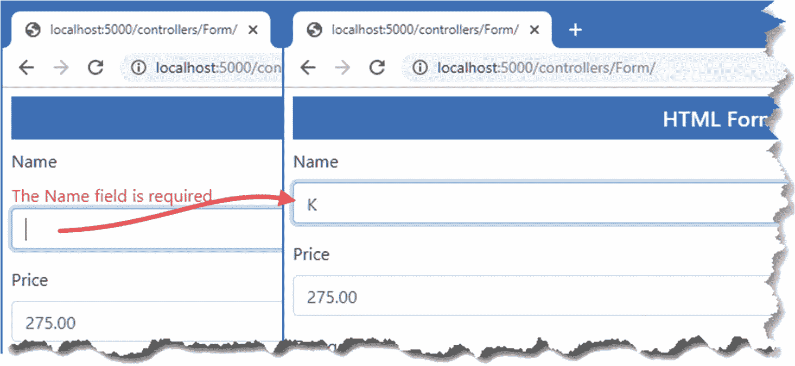

图 29-10。

执行客户端验证

Extending Client-Side Validation

客户端验证功能支持内置的属性级特性。该特性可以扩展，但是需要精通 JavaScript，并且需要直接使用 jQuery 验证包。详见 [`https://jqueryvalidation.org/documentation`](https://jqueryvalidation.org/documentation) 。

如果您不想开始编写 JavaScript 代码，那么您可以遵循一种常见的模式，使用客户端验证进行内置验证检查，使用服务器端验证进行自定义验证。

## 执行远程验证

远程验证模糊了客户端和服务器端验证之间的界限:验证检查是由客户端 JavaScript 代码执行的，但验证检查是通过向应用发送异步 HTTP 请求来测试用户输入表单的值来执行的。

远程验证的一个常见示例是，当用户名必须是唯一的时，检查用户名在应用中是否可用，用户提交数据，并执行客户端验证。作为该过程的一部分，向服务器发出一个异步 HTTP 请求，以验证所请求的用户名。如果用户名已被使用，将显示一个验证错误，以便用户可以输入另一个值。

这看起来像是常规的服务器端验证，但是这种方法有一些好处。首先，只有一些属性将被远程验证；客户端验证的好处仍然适用于用户输入的所有其他数据值。第二，这个请求相对来说是轻量级的，并且关注于验证，而不是处理整个模型对象。

第三个区别是远程验证是在后台执行的。用户不必单击提交按钮，然后等待新视图的呈现和返回。这有助于提高用户体验的响应速度，尤其是当浏览器和服务器之间的网络速度较慢时。

也就是说，远程验证是一种妥协。它在客户端和服务器端验证之间取得了平衡，但是它确实需要向应用服务器发出请求，并且它不如普通的客户端验证那样快。

对于示例应用，我将使用远程验证来确保用户为`CategoryId`和`SupplierId`属性输入现有的键值。第一步是创建一个 web 服务控制器，其操作方法将执行验证检查。我添加了一个名为`ValidationController.cs`的类文件到`Controllers`文件夹，代码如清单 [29-23](#PC35) 所示。

```cs
using Microsoft.AspNetCore.Mvc;
using WebApp.Models;

namespace WebApp.Controllers {

    [ApiController]
    [Route("api/[controller]")]
    public class ValidationController: ControllerBase {
        private DataContext dataContext;

        public ValidationController(DataContext context) {
            dataContext = context;
        }

        [HttpGet("categorykey")]
        public bool CategoryKey(string categoryId) {
            long keyVal;
            return long.TryParse(categoryId, out keyVal)
                && dataContext.Categories.Find(keyVal) != null;
        }

        [HttpGet("supplierkey")]
        public bool SupplierKey(string supplierId) {
            long keyVal;
            return long.TryParse(supplierId, out keyVal)
                && dataContext.Suppliers.Find(keyVal) != null;
        }
    }
}

Listing 29-23.The Contents of the ValidationController.cs File in the Controllers Folder

```

验证操作方法必须定义一个参数，其名称与它们将验证的字段匹配，这允许模型绑定过程从请求查询字符串中提取要测试的值。来自 action 方法的响应必须是 JSON，并且只能是 true 或 false，表示某个值是否可接受。清单 [29-23](#PC35) 中的动作方法接收候选值，并检查它们是否被用作`Category`或`Supplier`对象的数据库关键字。

Tip

我本可以利用模型绑定的优势，将动作方法的参数转换成一个`long`值，但是这样做意味着如果用户输入了一个不能转换成`long`类型的值，就不会调用验证方法。如果模型绑定器不能转换一个值，那么 MVC 框架就不能调用 action 方法，验证也不能执行。通常，远程验证的最佳方法是在 action 方法中接受一个`string`参数，并显式执行任何类型转换、解析或模型绑定。

为了使用远程验证方法，我将`Remote`属性应用于`Product`类中的`CategoryId`和`SupplierId`属性，如清单 [29-24](#PC36) 所示。

```cs
using System.ComponentModel.DataAnnotations.Schema;
using System.ComponentModel.DataAnnotations;
using Microsoft.AspNetCore.Mvc.ModelBinding;
using WebApp.Validation;
using Microsoft.AspNetCore.Mvc;

namespace WebApp.Models {

    [PhraseAndPrice(Phrase ="Small", Price = "100")]
    public class Product {

        public long ProductId { get; set; }

        [Required]
        [Display(Name = "Name")]
        public string Name { get; set; }

        [Column(TypeName = "decimal(8, 2)")]
        [Required(ErrorMessage = "Please enter a price")]
        [Range(1, 999999, ErrorMessage = "Please enter a positive price")]
        public decimal Price { get; set; }

        [PrimaryKey(ContextType= typeof(DataContext),
            DataType = typeof(Category))]
        [Remote("CategoryKey", "Validation", ErrorMessage = "Enter an existing key")]
        public long CategoryId { get; set; }
        public Category Category { get; set; }

        [PrimaryKey(ContextType = typeof(DataContext),
            DataType = typeof(Category))]
        [Remote("SupplierKey", "Validation", ErrorMessage = "Enter an existing key")]
        public long SupplierId { get; set; }
        public Supplier Supplier { get; set; }
    }
}

Listing 29-24.Using the Remote Attribute in the Product.cs File in the Models Folder

```

属性的参数指定了验证控制器的名称及其动作方法。我还使用了可选的`ErrorMessage`参数来指定验证失败时将显示的错误消息。要查看远程验证，请重启 ASP.NET Core 并导航到`http://localhost:5000/controllers/form`，输入一个无效的键值，然后提交表单。您将看到一条错误消息，并且在每次按键后将验证`input`元素的值，如图 [29-11](#Fig11) 所示。(只有值`1`、`2`和`3`对`CategoryId`和`SupplierId`字段都有效。)

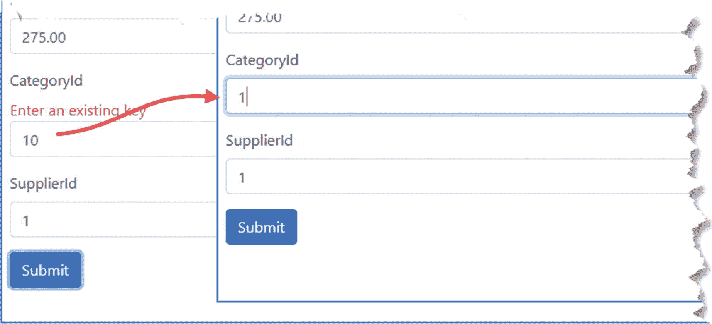

图 29-11。

执行远程验证

Caution

当用户第一次提交表单时，将调用 validation action 方法，每次编辑数据时，将再次调用该方法。对于文本输入元素，每次击键都会导致对服务器的调用。对于某些应用，这可能是大量的请求，在指定应用在生产中所需的服务器容量和带宽时，必须考虑到这一点。此外，您可能会选择*而不是*来对验证开销很大的属性使用远程验证(该示例会重复查询数据库中的键值，这可能对所有应用或数据库都不适用)。

### 在 Razor 页面中执行远程验证

远程验证在 Razor 页面中工作，但是必须注意用于验证值的异步 HTTP 请求中使用的名称。对于上一节中的控制器示例，浏览器将像这样向 URL 发送请求:

```cs
http://localhost:5000/api/Validation/categorykey?CategoryId=1

```

但是对于示例 Razor 页面，URL 将是这样的，反映了页面模型的使用:

```cs
http://localhost:5000/api/Validation/categorykey?Product.CategoryId=1

```

我更喜欢的解决这种差异的方法是向接受两种类型请求的验证动作方法添加参数，这很容易使用前面章节中描述的模型绑定特性来实现，如清单 [29-25](#PC39) 所示。

```cs
using Microsoft.AspNetCore.Mvc;
using WebApp.Models;

namespace WebApp.Controllers {

    [ApiController]
    [Route("api/[controller]")]
    public class ValidationController: ControllerBase {
        private DataContext dataContext;

        public ValidationController(DataContext context) {
            dataContext = context;
        }

        [HttpGet("categorykey")]
        public bool CategoryKey(string categoryId, [FromQuery] KeyTarget target) {
            long keyVal;
            return long.TryParse(categoryId ?? target.CategoryId, out keyVal)
                && dataContext.Categories.Find(keyVal) != null;
        }

        [HttpGet("supplierkey")]
        public bool SupplierKey(string supplierId, [FromQuery] KeyTarget target) {
            long keyVal;
            return long.TryParse(supplierId ?? target.SupplierId, out keyVal)
                && dataContext.Suppliers.Find(keyVal) != null;
        }
    }

    [Bind(Prefix = "Product")]
    public class KeyTarget {
        public string CategoryId { get; set; }
        public string SupplierId{ get; set; }
    }
}

Listing 29-25.Adding Parameters in the ValidationController.cs File in the Controllers Folder

```

`KeyTarget`类被配置为绑定到请求的`Product`部分，其属性将匹配两种类型的远程验证请求。每个动作方法都有一个`KeyTarget`参数，如果没有收到现有参数的值，就使用这个参数。这允许相同的动作方法适应两种类型的请求，您可以通过重启 ASP.NET Core，导航到`http://localhost:5000/pages/form`，输入一个不存在的键值，并单击提交按钮，这将产生如图 [29-12](#Fig12) 所示的响应。

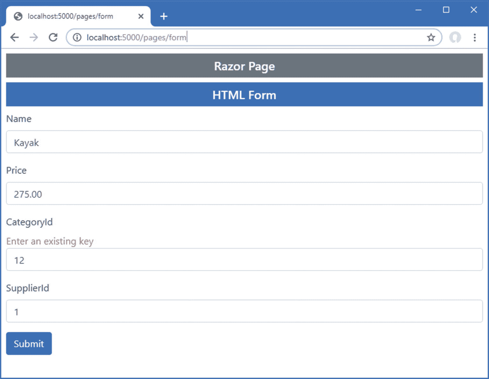

图 29-12。

使用 Razor 页面执行远程验证

## 摘要

在这一章中，我描述了 ASP.NET Core 数据验证特性。我解释了如何显式地执行验证，如何使用属性来描述验证约束，以及如何验证单个属性和整个对象。我向您展示了如何向用户显示验证消息，以及如何通过客户端和远程验证来改善用户的验证体验。在下一章中，我将描述 ASP.NET Core 过滤器的特性。