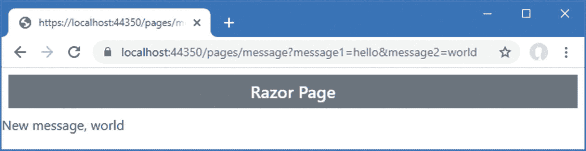

# 三十、使用过滤器

*过滤器*为请求处理注入额外的逻辑。过滤器就像应用于单个端点的中间件，可以是一个操作或页面处理方法，它们提供了一种优雅的方式来管理一组特定的请求。在本章中，我将解释过滤器的工作原理，描述 ASP.NET Core 支持的不同类型的过滤器，并演示自定义过滤器和 ASP.NET Core 提供的过滤器的使用。表 [30-1](#Tab1) 总结了这一章。

表 30-1。

章节总结

<colgroup><col class="tcol1 align-left"> <col class="tcol2 align-left"> <col class="tcol3 align-left"></colgroup> 
| 

问题

 | 

解决办法

 | 

列表

 |
| --- | --- | --- |
| 实施安全策略 | 使用授权过滤器 | 15, 16 |
| 实现资源策略，如缓存 | 使用资源筛选器 | 17–19 |
| 改变动作方法的请求或响应 | 使用动作过滤器 | 20–23 |
| 改变页面处理程序方法的请求或响应 | 使用页面过滤器 | 24–26 |
| 检查或改变由端点产生的结果 | 使用结果过滤器 | 27–29 |
| 检查或更改未捕获的异常 | 使用异常过滤器 | 30–31 |
| 改变过滤器的生命周期 | 使用过滤器工厂或定义服务 | 32–35 |
| 在整个应用中应用过滤器 | 使用全局过滤器 | 36, 37 |
| 更改应用过滤器的顺序 | 实现`IOrderedFilter`接口 | 38–42 |

## 为本章做准备

本章使用了第 29 章中的 WebApp 项目。为了准备本章，打开一个新的 PowerShell 命令提示符，导航到`WebApp`项目文件夹，并运行清单 [30-1](#PC1) 中所示的命令来删除不再需要的文件。

```cs
Remove-Item -Path Controllers,Views,Pages -Recurse -Exclude _*,Shared

Listing 30-1.Removing Files from the Project

```

这个命令删除控制器、视图和 Razor 页面，留下共享的布局、数据模型和配置文件。

Tip

你可以从 [`https://github.com/apress/pro-asp.net-core-3`](https://github.com/apress/pro-asp.net-core-3) 下载本章以及本书其他章节的示例项目。如果在运行示例时遇到问题，请参见第 [1](01.html) 章获取帮助。

创建`WebApp/Controllers`文件夹，并将名为`HomeController.cs`的类文件添加到`Controllers`文件夹中，代码如清单 [30-2](#PC2) 所示。

```cs
using Microsoft.AspNetCore.Mvc;

namespace WebApp.Controllers {

    public class HomeController : Controller {

        public IActionResult Index() {
            return View("Message",
                "This is the Index action on the Home controller");
        }
    }
}

Listing 30-2.The Contents of the HomeController.cs File in the Controllers Folder

```

action 方法呈现一个名为`Message`的视图，并传递一个字符串作为视图数据。我添加了一个名为`Message.cshtml`的 Razor 视图，内容如清单 [30-3](#PC3) 所示。

```cs
@{ Layout = "_SimpleLayout"; }

@if (Model is string) {
    @Model
} else if (Model is IDictionary<string, string>) {
    var dict = Model as IDictionary<string, string>;
    <table class="table table-sm table-striped table-bordered">
        <thead><tr><th>Name</th><th>Value</th></tr></thead>
        <tbody>
            @foreach (var kvp in dict) {
                <tr><td>@kvp.Key</td><td>@kvp.Value</td></tr>
            }
        </tbody>
    </table>
}

Listing 30-3.The Contents of the Message.cshtml File in the Views/Shared Folder

```

在`Pages`文件夹中添加一个名为`Message.cshtml`的 Razor 页面，并添加清单 [30-4](#PC4) 所示的内容。

```cs
@page "/pages/message"
@model MessageModel
@using Microsoft.AspNetCore.Mvc.RazorPages
@using System.Collections.Generic

@if (Model.Message is string) {
    @Model.Message
} else if (Model.Message is IDictionary<string, string>) {
    var dict = Model.Message as IDictionary<string, string>;
    <table class="table table-sm table-striped table-bordered">
        <thead><tr><th>Name</th><th>Value</th></tr></thead>
        <tbody>
            @foreach (var kvp in dict) {
                <tr><td>@kvp.Key</td><td>@kvp.Value</td></tr>
            }
        </tbody>
    </table>
}

@functions {
    public class MessageModel : PageModel {

        public object Message { get; set; } = "This is the Message Razor Page";
    }
}

Listing 30-4.The Contents of the Message.cshtml File in the Pages Folder

```

### 启用 HTTPS 连接

本章中的一些例子需要使用 SSL。将清单 [30-5](#PC5) 中所示的配置条目添加到`Properties`文件夹中的`launchSettings.json`文件中，以启用 SSL 并将端口设置为 44350。

```cs
{
  "iisSettings": {
    "windowsAuthentication": false,
    "anonymousAuthentication": true,
    "iisExpress": {
      "applicationUrl": "http://localhost:5000",
      "sslPort": 44350
    }
  },
  "profiles": {
    "IIS Express": {
      "commandName": "IISExpress",
      "launchBrowser": true,
      "environmentVariables": {
        "ASPNETCORE_ENVIRONMENT": "Development"
      }
    },
    "WebApp": {
      "commandName": "Project",
      "launchBrowser": true,
      "environmentVariables": {
        "ASPNETCORE_ENVIRONMENT": "Development"
      },
      "applicationUrl": "http://localhost:5000;https://localhost:44350"
    }
  }
}

Listing 30-5.Enabling HTTPS in the launchSettings.json File in the Properties Folder

```

那个。NET 核心运行时包括一个用于 HTTPS 请求的测试证书。运行`WebApp`文件夹中清单 [30-6](#PC6) 中所示的命令，重新生成并信任测试证书。

```cs
dotnet dev-certs https --clean

dotnet dev-certs https --trust

Listing 30-6.Regenerating the Development Certificates

```

在提示删除已被信任的现有证书时，点击是，并点击是信任新证书，如图 [30-1](#Fig1) 所示。


图 30-1。

重新生成 HTTPS 证书

### 正在删除数据库

打开一个新的 PowerShell 命令提示符，导航到包含`WebApp.csproj`文件的文件夹，运行清单 [30-7](#PC7) 中所示的命令来删除数据库。

```cs
dotnet ef database drop --force

Listing 30-7.Dropping the Database

```

### 运行示例应用

从 Debug 菜单中选择 Start Without Debugging 或 Run Without Debugging，或者使用 PowerShell 命令提示符运行清单 [30-8](#PC8) 中所示的命令。

```cs
dotnet run

Listing 30-8.Running the Example Application

```

使用浏览器请求`http://localhost:5000`和`https://localhost:44350`。两个 URL 都将由`Home`控制器定义的`Index`动作处理，产生如图 [30-2](#Fig2) 所示的响应。


图 30-2。

来自家庭控制器的响应

请求`http://localhost:5000/pages/message`和`https://localhost:44350/pages/message`查看来自`Message` Razor 页面的响应，通过 HTTP 和 HTTPS 传递，如图 [30-3](#Fig3) 所示。


图 30-3。

来自消息 Razor 页面的响应

## 使用过滤器

过滤器允许将原本应用于中间件组件或动作方法中的逻辑定义在一个类中，在该类中它可以被容易地重用。

假设您想要强制执行 HTTPS 对某些操作方法的请求。在第 [16 章](16.html)中，我向您展示了如何通过读取`HttpRequest`对象的`IsHttps`属性在中间件中实现这一点。这种方法的问题是，中间件必须了解路由系统的配置，才能知道如何拦截对特定动作方法的请求。更集中的方法是读取动作方法中的`HttpRequest.IsHttps`属性，如清单 [30-9](#PC9) 所示。

```cs
using Microsoft.AspNetCore.Mvc;
using Microsoft.AspNetCore.Http;

namespace WebApp.Controllers {

    public class HomeController : Controller {

        public IActionResult Index() {
            if (Request.IsHttps) {
                return View("Message",
                    "This is the Index action on the Home controller");
            } else {
                return new StatusCodeResult(StatusCodes.Status403Forbidden);
            }
        }
    }
}

Listing 30-9.Selectively Enforcing HTTPS in the HomeController.cs File in the Controllers Folder

```

重启 ASP.NET Core 并请求`http://localhost:5000`。这个方法现在需要 HTTPS，您将看到一个错误响应。请求`https://localhost:44350`，您将看到消息输出。图 [30-4](#Fig4) 显示了两种响应。


图 30-4。

用行动方法强化 HTTPS

Tip

如果您没有从本节的示例中获得预期的结果，请清除浏览器的历史记录。浏览器通常会拒绝向之前产生 HTTPS 错误的服务器发送请求，这是一个很好的安全实践，但在开发过程中可能会令人沮丧。

这种方法可行，但存在问题。第一个问题是，action 方法包含的代码更多的是关于实现安全策略，而不是处理请求。一个更严重的问题是，在 action 方法中包含 HTTP 检测代码不能很好地伸缩，并且必须在控制器的每个 action 方法中重复，如清单 [30-10](#PC10) 所示。

```cs
using Microsoft.AspNetCore.Mvc;
using Microsoft.AspNetCore.Http;

namespace WebApp.Controllers {

    public class HomeController : Controller {

        public IActionResult Index() {
            if (Request.IsHttps) {
                return View("Message",
                    "This is the Index action on the Home controller");
            } else {
                return new StatusCodeResult(StatusCodes.Status403Forbidden);
            }
        }

        public IActionResult Secure() {
            if (Request.IsHttps) {
                return View("Message",
                    "This is the Secure action on the Home controller");
            } else {
                return new StatusCodeResult(StatusCodes.Status403Forbidden);
            }
        }
    }
}

Listing 30-10.Adding Action Methods in the HomeController.cs File in the Controllers Folder

```

我必须记住在我想要 HTTPS 的每个控制器中的每个动作方法中实现相同的检查。实现安全策略的代码是控制器的重要组成部分——诚然很简单——这使得控制器更难理解，我忘记将它添加到新的动作方法中只是时间问题，这在我的安全策略中造成了一个漏洞。

这是过滤器解决的问题类型。清单 [30-11](#PC11) 代替了我对 HTTPS 的检查，并实现了一个过滤器。

```cs
using Microsoft.AspNetCore.Mvc;
using Microsoft.AspNetCore.Http;

namespace WebApp.Controllers {

    public class HomeController : Controller {

        [RequireHttps]
        public IActionResult Index() {
            return View("Message",
                "This is the Index action on the Home controller");
        }

        [RequireHttps]
        public IActionResult Secure() {
            return View("Message",
                "This is the Secure action on the Home controller");
        }
    }
}

Listing 30-11.Applying a Filter in the HomeController.cs File in the Controllers Folder

```

`RequireHttps`属性应用 ASP.NET Core 提供的内置过滤器之一。这个过滤器限制对动作方法的访问，因此只支持 HTTPS 请求，并允许我从每个方法中删除安全代码，专注于处理成功的请求。

Note

过滤器的工作方式与我的自定义代码不同。对于`GET`请求，`RequireHttps`属性将客户端重定向到最初请求的 URL，但是它是通过使用`https`方案来实现的，因此对`http://localhost:5000`的请求将被重定向到`https://localhost:5000`。这对于大多数已部署的应用来说是有意义的，但在开发过程中没有意义，因为 HTTP 和 HTTPS 位于不同的本地端口上。`RequireHttpsAttribute`类定义了一个名为`HandleNonHttpsRequest`的受保护方法，您可以覆盖它来改变行为。或者，我在“理解授权过滤器”一节中从头开始重新创建原来的功能。

我仍然必须记住将`RequireHttps`属性应用于每个动作方法，这意味着我可能会忘记。但是过滤器有一个有用的技巧:将属性应用于控制器类与将其应用于每个单独的动作方法具有相同的效果，如清单 [30-12](#PC12) 所示。

```cs
using Microsoft.AspNetCore.Mvc;
using Microsoft.AspNetCore.Http;

namespace WebApp.Controllers {

    [RequireHttps]
    public class HomeController : Controller {

        public IActionResult Index() {
            return View("Message",
                "This is the Index action on the Home controller");
        }

        public IActionResult Secure() {
            return View("Message",
                "This is the Secure action on the Home controller");
        }
    }
}

Listing 30-12.Applying a Filter to All Actions in the HomeController.cs File in the Controllers Folder

```

可以以不同的粒度级别应用过滤器。如果您想限制对某些动作的访问，而不是对其他动作的访问，那么您可以只对那些方法应用`RequireHttps`属性。如果您想要保护所有的动作方法，包括您将来添加到控制器中的任何方法，那么可以将`RequireHttps`属性应用于该类。如果你想对应用中的每一个动作都应用一个过滤器，那么你可以使用*全局过滤器*，我将在本章稍后描述。

### 在 Razor 页面中使用过滤器

过滤器也可以用在 Razor 页。例如，为了在`Message` Razor 页面中实现仅 HTTPS 策略，我必须添加一个检查连接的处理程序方法，如清单 [30-13](#PC13) 所示。

```cs
@page "/pages/message"
@model MessageModel
@using Microsoft.AspNetCore.Mvc.RazorPages
@using System.Collections.Generic
@using Microsoft.AspNetCore.Http

@if (Model.Message is string) {
    @Model.Message
} else if (Model.Message is IDictionary<string, string>) {
    var dict = Model.Message as IDictionary<string, string>;
    <table class="table table-sm table-striped table-bordered">
        <thead><tr><th>Name</th><th>Value</th></tr></thead>
        <tbody>
            @foreach (var kvp in dict) {
                <tr><td>@kvp.Key</td><td>@kvp.Value</td></tr>
            }
        </tbody>
    </table>
}

@functions {

    public class MessageModel : PageModel {

        public object Message { get; set; } = "This is the Message Razor Page";

        public IActionResult OnGet() {
            if (!Request.IsHttps) {
                return new StatusCodeResult(StatusCodes.Status403Forbidden);
            } else {
                return Page();
            }
        }
    }
}

Listing 30-13.Checking Connections in the Message.cshtml File in the Pages Folder

```

handler 方法可以工作，但是它很笨拙，并且存在与 action 方法相同的问题。当在 Razor 页面中使用过滤器时，该属性可以应用于处理程序方法，或者如清单 [30-14](#PC14) 所示，应用于整个类。

```cs
@page "/pages/message"
@model MessageModel
@using Microsoft.AspNetCore.Mvc.RazorPages
@using System.Collections.Generic
@using Microsoft.AspNetCore.Http

@if (Model.Message is string) {
    @Model.Message
} else if (Model.Message is IDictionary<string, string>) {
    var dict = Model.Message as IDictionary<string, string>;
    <table class="table table-sm table-striped table-bordered">
        <thead><tr><th>Name</th><th>Value</th></tr></thead>
        <tbody>
            @foreach (var kvp in dict) {
                <tr><td>@kvp.Key</td><td>@kvp.Value</td></tr>
            }
        </tbody>
    </table>
}

@functions {

    [RequireHttps]
    public class MessageModel : PageModel {

        public object Message { get; set; } = "This is the Message Razor Page";
    }
}

Listing 30-14.Applying a Filter in the Message.cshtml File in the Pages Folder

```

如果您请求`https://localhost:44350/pages/message`，您将会看到一个正常的响应。如果您请求常规的 HTTP URL，`http://localhost:5000/pages/messages`，过滤器将重定向请求，您将看到一个错误(如前所述，`RequireHttps`过滤器将浏览器重定向到示例应用中未启用的端口)。

## 了解过滤器

ASP.NET Core 支持不同类型的过滤器，每种过滤器都有不同的用途。表 [30-2](#Tab2) 描述了过滤器类别。

表 30-2。

过滤器类型

<colgroup><col class="tcol1 align-left"> <col class="tcol2 align-left"></colgroup> 
| 

名字

 | 

描述

 |
| --- | --- |
| 授权过滤器 | 这种类型的过滤器用于应用应用的授权策略。 |
| 资源筛选器 | 这种类型的过滤器用于拦截请求，通常是为了实现缓存等功能。 |
| 动作过滤器 | 这种类型的过滤器用于在操作方法收到请求之前修改请求，或者在操作结果产生之后修改它。这种类型的过滤器只能应用于控制器和动作。 |
| 页面过滤器 | 这种类型的过滤器用于在 Razor 页面处理程序方法收到请求之前修改请求，或者在生成操作结果之后修改它。这种类型的过滤器只能应用于 Razor 页面。 |
| 结果过滤器 | 这种类型的过滤器用于在执行之前改变操作结果，或者在执行之后修改结果。 |
| 异常过滤器 | 这种类型的过滤器用于处理在操作方法或页面处理程序执行期间发生的异常。 |

过滤器有自己的管道，按照特定的顺序执行，如图 [30-5](#Fig5) 所示。


图 30-5。

过滤管道

筛选器可以使筛选器管道短路，以防止请求被转发到下一个筛选器。例如，如果用户未经认证，授权过滤器可以缩短管道并返回错误响应。资源、动作和页面过滤器能够在端点处理请求之前和之后检查请求，允许这些类型的过滤器缩短管道；在处理请求之前更改请求；或者改变反应。(我简化了图 [30-5](#Fig5) 中的过滤器流程。页面过滤器在模型绑定过程之前和之后运行，如“理解页面过滤器”一节所述。)

每种类型的过滤器都是使用 ASP.NET Core 定义的接口实现的，它还提供了基类，使得将某些类型的过滤器作为属性来应用变得容易。我在接下来的部分中描述了每个接口和属性类，但是它们显示在表 [30-3](#Tab3) 中以供快速参考。

表 30-3。

过滤器类型、接口和属性基类

<colgroup><col class="tcol1 align-left"> <col class="tcol2 align-left"> <col class="tcol3 align-left"></colgroup> 
| 

过滤方式

 | 

接口

 | 

属性类别

 |
| --- | --- | --- |
| 授权过滤器 | `IAuthorizationFilterIAsyncAuthorizationFilter` | 未提供属性类。 |
| 资源筛选器 | `IResourceFilterIAsyncResourceFilter` | 未提供属性类。 |
| 动作过滤器 | `IActionFilterIAsyncActionFilter` | `ActionFilterAttribute` |
| 页面过滤器 | `IPageFilterIAsyncPageFilter` | 未提供属性类。 |
| 结果过滤器 | `IResultFilterIAsyncResultFilterIAlwaysRunResultFilterIAsyncAlwaysRunResultFilter` | `ResultFilterAttribute` |
| 异常过滤器 | `IExceptionFilterIAsyncExceptionFilter` | `ExceptionFilterAttribute` |

## 创建自定义过滤器

过滤器实现了位于`Microsoft.AspNetCore.Mvc.Filters`名称空间中的`IFilterMetadata`接口。下面是界面:

```cs
namespace Microsoft.AspNetCore.Mvc.Filters {
    public interface IFilterMetadata { }
}

```

该接口是空的，不需要过滤器来实现任何特定的行为。这是因为上一节中描述的每一类过滤器都以不同的方式工作。以`FilterContext`对象的形式向过滤器提供上下文数据。为了方便起见，表 [30-4](#Tab4) 描述了`FilterContext`提供的属性。

表 30-4。

过滤器上下文属性

<colgroup><col class="tcol1 align-left"> <col class="tcol2 align-left"></colgroup> 
| 

名字

 | 

描述

 |
| --- | --- |
| `ActionDescriptor` | 该属性返回一个描述动作方法的`ActionDescriptor`对象。 |
| `HttpContext` | 该属性返回一个`HttpContext`对象，该对象提供了 HTTP 请求和 HTTP 响应的详细信息，这些信息将作为回报发送。 |
| `ModelState` | 该属性返回一个`ModelStateDictionary`对象，用于验证客户端发送的数据。 |
| `RouteData` | 该属性返回一个`RouteData`对象，描述路由系统处理请求的方式。 |
| `Filters` | 该属性返回一个已经应用于 action 方法的过滤器列表，表示为一个`IList<IFilterMetadata>`。 |

### 了解授权过滤器

授权过滤器用于实现应用的安全策略。授权过滤器在其他类型的过滤器之前和端点处理请求之前执行。下面是`IAuthorizationFilter`接口的定义:

```cs
namespace Microsoft.AspNetCore.Mvc.Filters {

    public interface IAuthorizationFilter : IFilterMetadata {

        void OnAuthorization(AuthorizationFilterContext context);
    }
}

```

调用`OnAuthorization`方法为过滤器提供授权请求的机会。对于异步授权过滤器，下面是`IAsyncAuthorizationFilter`接口的定义:

```cs
using System.Threading.Tasks;

namespace Microsoft.AspNetCore.Mvc.Filters {

    public interface IAsyncAuthorizationFilter : IFilterMetadata {

        Task OnAuthorizationAsync(AuthorizationFilterContext context);
    }
}

```

调用`OnAuthorizationAsync`方法，以便过滤器可以授权请求。无论使用哪个接口，过滤器都通过一个`AuthorizationFilterContext`对象接收描述请求的上下文数据，该对象派生自`FilterContext`类并添加了一个重要的属性，如表 [30-5](#Tab5) 中所述。

表 30-5。

AuthorizationFilterContext 属性

<colgroup><col class="tcol1 align-left"> <col class="tcol2 align-left"></colgroup> 
| 

名字

 | 

描述

 |
| --- | --- |
| `Result` | 当请求不符合应用的授权策略时，这个`IActionResult`属性由授权过滤器设置。如果设置了这个属性，那么 ASP.NET Core 执行`IActionResult`而不是调用端点。 |

#### 创建授权过滤器

为了演示授权过滤器如何工作，我在示例项目中创建了一个`Filters`文件夹，添加了一个名为`HttpsOnlyAttribute.cs`的类文件，并使用它来定义清单 [30-15](#PC18) 中所示的过滤器。

```cs
using System;
using Microsoft.AspNetCore.Http;
using Microsoft.AspNetCore.Mvc;
using Microsoft.AspNetCore.Mvc.Filters;

namespace WebApp.Filters {
    public class HttpsOnlyAttribute : Attribute, IAuthorizationFilter {

        public void OnAuthorization(AuthorizationFilterContext context) {
            if (!context.HttpContext.Request.IsHttps) {
                context.Result =
                    new StatusCodeResult(StatusCodes.Status403Forbidden);
            }
        }
    }
}

Listing 30-15.The Contents of the HttpsOnlyAttribute.cs File in the Filters Folder

```

如果请求符合授权策略，则授权过滤器不做任何事情，不做任何事情将允许 ASP.NET Core 转移到下一个过滤器，并最终执行端点。如果有问题，过滤器设置传递给`OnAuthorization`方法的`AuthorizationFilterContext`对象的`Result`属性。这可以防止进一步的执行，并提供一个返回给客户端的结果。在清单中，`HttpsOnlyAttribute`类检查`HttpRequest`上下文对象的`IsHttps`属性，并设置`Result`属性，以便在没有 HTTPS 的情况下发出请求时中断执行。授权过滤器可以应用于控制器、动作方法和 Razor 页面。清单 [30-16](#PC19) 将新过滤器应用到`Home`控制器。

```cs
using Microsoft.AspNetCore.Mvc;
using Microsoft.AspNetCore.Http;
using WebApp.Filters;

namespace WebApp.Controllers {

    [HttpsOnly]
    public class HomeController : Controller {

        public IActionResult Index() {
            return View("Message",
                "This is the Index action on the Home controller");
        }

        public IActionResult Secure() {
            return View("Message",
                "This is the Secure action on the Home controller");
        }
    }
}

Listing 30-16.Applying a Custom Filter in the HomeController.cs File in the Controllers Folder

```

这个过滤器重新创建了我在清单 [30-10](#PC10) 的动作方法中包含的功能。在实际项目中，这不如像内置的`RequireHttps`过滤器那样进行重定向有用，因为用户不会理解 403 状态代码的含义，但它确实提供了一个关于授权过滤器如何工作的有用示例。重启 ASP.NET Core 并请求`http://localhost:5000`，你会看到滤镜的效果，如图 [30-6](#Fig6) 所示。请求`https://localhost:44350`，你将收到来自 action 方法的响应，如图所示。


图 30-6。

应用自定义授权过滤器

### 了解资源筛选器

对于每个请求，资源过滤器执行两次:在 ASP.NET Core 模型绑定过程之前，以及在处理动作结果以生成结果之前。下面是`IResourceFilter`接口的定义:

```cs
namespace Microsoft.AspNetCore.Mvc.Filters {
    public interface IResourceFilter : IFilterMetadata {

        void OnResourceExecuting(ResourceExecutingContext context);

        void OnResourceExecuted(ResourceExecutedContext context);
    }
}

```

在处理请求时会调用`OnResourceExecuting`方法，在端点处理完请求之后、执行动作结果之前会调用`OnResourceExecuted`方法。对于异步资源过滤器，下面是`IAsyncResourceFilter`接口的定义:

```cs
namespace Microsoft.AspNetCore.Mvc.Filters {
    public interface IAsyncResourceFilter : IFilterMetadata {

        Task OnResourceExecutionAsync(ResourceExecutingContext context,
            ResourceExecutionDelegate next);
    }
}

```

该接口定义了一个方法，该方法接收一个上下文对象和一个要调用的委托。资源过滤器能够在调用委托之前检查请求，并在执行响应之前检查响应。使用`ResourceExecutingContext`类为`OnResourceExecuting`方法提供了上下文，除了那些由`FilterContext`类定义的属性之外，该类还定义了表 [30-6](#Tab6) 中显示的属性。

表 30-6。

ResourceExecutingContext 类定义的属性

<colgroup><col class="tcol1 align-left"> <col class="tcol2 align-left"></colgroup> 
| 

名字

 | 

描述

 |
| --- | --- |
| `Result` | 这个`IActionResult`属性用于提供一个结果来使管道短路。 |

使用`ResourceExecutedContext`类为`OnResourceExecuted`方法提供上下文，除了那些由`FilterContext`类定义的属性之外，该类还定义了表 [30-7](#Tab7) 中显示的属性。

表 30-7。

ResourceExecutedContext 类定义的属性

<colgroup><col class="tcol1 align-left"> <col class="tcol2 align-left"></colgroup> 
| 

名字

 | 

描述

 |
| --- | --- |
| `Result` | 这个`IActionResult`属性提供了将用于产生响应的动作结果。 |
| `ValueProviderFactories` | 该属性返回一个`IList<IValueProviderFactory>`，它提供对为模型绑定过程提供值的对象的访问。 |

#### 创建资源过滤器

资源过滤器通常用在有可能缩短管道并尽早提供响应的地方，比如在实现数据缓存的时候。要创建一个简单的缓存过滤器，用清单 [30-17](#PC22) 中所示的代码向`Filters`文件夹添加一个名为`SimpleCacheAttribute.cs`的类文件。

Filters and Dependency Injection

作为属性应用的过滤器不能在它们的构造函数中声明依赖关系，除非它们实现了`IFilterFactory`接口并直接负责创建实例，正如本章后面的“创建过滤器工厂”一节所解释的。

```cs
using Microsoft.AspNetCore.Http;
using Microsoft.AspNetCore.Mvc;
using Microsoft.AspNetCore.Mvc.Filters;
using System;
using System.Collections.Generic;

namespace WebApp.Filters {

    public class SimpleCacheAttribute : Attribute, IResourceFilter {
        private Dictionary<PathString, IActionResult> CachedResponses
            = new Dictionary<PathString, IActionResult>();

        public void OnResourceExecuting(ResourceExecutingContext context) {
            PathString path = context.HttpContext.Request.Path;
            if (CachedResponses.ContainsKey(path)) {
                context.Result = CachedResponses[path];
                CachedResponses.Remove(path);

            }
        }

        public void OnResourceExecuted(ResourceExecutedContext context) {
            CachedResponses.Add(context.HttpContext.Request.Path, context.Result);
        }
    }
}

Listing 30-17.The Contents of the SimpleCacheAttribute.cs File in the Filters Folder

```

这个过滤器不是一个特别有用的缓存，但是它展示了资源过滤器是如何工作的。`OnResourceExecuting`方法通过将上下文对象的`Result`属性设置为先前缓存的动作结果，为过滤器提供了缩短管道的机会。如果给`Result`属性赋值，那么过滤器管道就会短路，执行动作结果为客户端产生响应。缓存的操作结果只使用一次，然后从缓存中丢弃。如果没有为`Result`属性赋值，那么请求将传递到管道中的下一步，这可能是另一个过滤器或端点。

`OnResourceExecuted`方法为过滤器提供管道未短路时产生的动作结果。在这种情况下，过滤器缓存操作结果，以便它可以用于后续请求。资源过滤器可以应用于控制器、动作方法和 Razor 页面。清单 [30-18](#PC23) 将定制的资源过滤器应用到`Message` Razor 页面，并添加一个时间戳来帮助确定何时缓存一个动作结果。

```cs
@page "/pages/message"
@model MessageModel
@using Microsoft.AspNetCore.Mvc.RazorPages
@using System.Collections.Generic
@using Microsoft.AspNetCore.Http
@using WebApp.Filters

@if (Model.Message is string) {
    @Model.Message
} else if (Model.Message is IDictionary<string, string>) {
    var dict = Model.Message as IDictionary<string, string>;
    <table class="table table-sm table-striped table-bordered">
        <thead><tr><th>Name</th><th>Value</th></tr></thead>
        <tbody>
            @foreach (var kvp in dict) {
                <tr><td>@kvp.Key</td><td>@kvp.Value</td></tr>
            }
        </tbody>
    </table>
}

@functions {

    [RequireHttps]
    [SimpleCache]
    public class MessageModel : PageModel {

        public object Message { get; set; } =
            $"{DateTime.Now.ToLongTimeString()}: This is the Message Razor Page";
    }
}

Listing 30-18.Applying a Resource Filter in the Message.cshtml File in the Pages Folder

```

要查看资源过滤器的效果，重启 ASP.NET Core 并请求`https://localhost:44350/pages/message`。因为这是对路径的第一次请求，所以不会有缓存的结果，请求将沿着管道转发。在处理响应时，资源过滤器将缓存操作结果以供将来使用。重新加载浏览器以重复请求，您将看到相同的时间戳，表明缓存的操作结果已被使用。缓存项在使用时被移除，这意味着重新加载浏览器将生成一个带有新时间戳的响应，如图 [30-7](#Fig7) 所示。


图 30-7。

使用资源筛选器

#### 创建异步资源过滤器

异步资源筛选器的接口使用一个方法，该方法接收用于沿筛选器管道转发请求的委托。清单 [30-19](#PC24) 重新实现了前一个例子中的缓存过滤器，这样它就实现了`IAsyncResourceFilter`接口。

```cs
using Microsoft.AspNetCore.Http;
using Microsoft.AspNetCore.Mvc;
using Microsoft.AspNetCore.Mvc.Filters;
using System;
using System.Collections.Generic;
using System.Threading.Tasks;

namespace WebApp.Filters {

    public class SimpleCacheAttribute : Attribute, IAsyncResourceFilter {
        private Dictionary<PathString, IActionResult> CachedResponses
            = new Dictionary<PathString, IActionResult>();

        public async Task OnResourceExecutionAsync(ResourceExecutingContext context,
                ResourceExecutionDelegate next) {
            PathString path = context.HttpContext.Request.Path;
            if (CachedResponses.ContainsKey(path)) {
                context.Result = CachedResponses[path];
                CachedResponses.Remove(path);
            } else {
                ResourceExecutedContext execContext = await next();
                CachedResponses.Add(context.HttpContext.Request.Path,
                    execContext.Result);
            }
        }
    }
}

Listing 30-19.Creating an Asynchronous Filter in the SimpleCacheAttribute.cs File in the Filters Folder

```

`OnResourceExecutionAsync`方法接收一个`ResourceExecutingContext`对象，用来判断管道是否可以短路。如果不能，委托将被不带参数地调用，并在请求被处理并沿着管道返回时异步产生一个`ResourceExecutedContext`对象。重启 ASP.NET Core 并重复上一节描述的请求，您将看到相同的缓存行为，如图 [30-7](#Fig7) 所示。

Caution

重要的是不要混淆这两个上下文对象。终结点生成的操作结果仅在委托返回的上下文对象中可用。

### 了解操作过滤器

像资源过滤器一样，动作过滤器执行两次。区别在于，动作过滤器在模型绑定过程之后执行，而资源过滤器在模型绑定之前执行。这意味着资源过滤器可以缩短管道，并最小化 ASP.NET Core 对请求所做的工作。动作过滤器在需要模型绑定时使用，这意味着它们用于诸如改变模型或强制验证之类的任务。动作过滤器只能应用于控制器和动作方法，这与资源过滤器不同，资源过滤器也可以用于 Razor 页面。(Razor 页面相当于动作过滤器，是页面过滤器，在“理解页面过滤器”一节中描述。)下面是`IActionFilter`界面:

```cs
namespace Microsoft.AspNetCore.Mvc.Filters {

    public interface IActionFilter : IFilterMetadata {

        void OnActionExecuting(ActionExecutingContext context);

        void OnActionExecuted(ActionExecutedContext context);
    }
}

```

当一个动作过滤器被应用到一个动作方法时，在调用该动作方法之前调用`OnActionExecuting`方法，在调用之后调用`OnActionExecuted`方法。动作过滤器通过两个不同的上下文类提供上下文数据:`OnActionExecuting`方法的`ActionExecutingContext`和`OnActionExecuted`方法的`ActionExecutedContext`。

用于描述即将被调用的动作的`ActionExecutingContext`类，除了`FilterContext`属性之外，还定义了表 [30-8](#Tab8) 中描述的属性。

表 30-8。

ActionExecutingContext 属性

<colgroup><col class="tcol1 align-left"> <col class="tcol2 align-left"></colgroup> 
| 

名字

 | 

描述

 |
| --- | --- |
| `Controller` | 该属性返回将要调用其操作方法的控制器。(动作方法的细节可以通过从基类继承的`ActionDescriptor`属性获得。) |
| `ActionArguments` | 此属性返回将传递给操作方法的参数字典，按名称进行索引。筛选器可以插入、删除或更改参数。 |
| `Result` | 如果过滤器给这个属性分配一个`IActionResult`，那么管道将被短路，动作结果将被用来生成对客户端的响应，而不需要调用动作方法。 |

除了`FilterContext`属性外，`ActionExecutedContext`类用于表示已经执行的动作，并定义表 [30-9](#Tab9) 中描述的属性。

表 30-9。

ActionExecutedContext 属性

<colgroup><col class="tcol1 align-left"> <col class="tcol2 align-left"></colgroup> 
| 

名字

 | 

描述

 |
| --- | --- |
| `Controller` | 该属性返回将调用其动作方法的`Controller`对象。 |
| `Canceled` | 如果另一个动作过滤器通过将动作结果分配给`ActionExecutingContext`对象的`Result`属性而使管道短路，则该`bool`属性被设置为`true`。 |
| `Exception` | 这个属性包含任何由 action 方法抛出的`Exception`。 |
| `ExceptionDispatchInfo` | 该方法返回一个`ExceptionDispatchInfo`对象，该对象包含 action 方法抛出的任何异常的堆栈跟踪细节。 |
| `ExceptionHandled` | 将该属性设置为`true`表示过滤器已经处理了异常，该异常将不会被进一步传播。 |
| `Result` | 该属性返回 action 方法产生的`IActionResult`。如果需要，过滤器可以改变或替换动作结果。 |

使用`IAsyncActionFilter`接口实现异步动作过滤器。

```cs
namespace Microsoft.AspNetCore.Mvc.Filters {

    public interface IAsyncActionFilter : IFilterMetadata {

        Task OnActionExecutionAsync(ActionExecutingContext context,
            ActionExecutionDelegate next);
    }
}

```

该接口遵循与本章前面描述的`IAsyncResourceFilter`接口相同的模式。`OnActionExecutionAsync`方法提供了一个`ActionExecutingContext`对象和一个委托。`ActionExecutingContext`对象在请求被动作方法接收之前对其进行描述。过滤器可以通过给`ActionExecutingContext.Result`属性赋值来缩短管道，或者通过调用委托来传递管道。委托异步产生一个描述动作方法结果的`ActionExecutedContext`对象。

#### 创建操作过滤器

将名为`ChangeArgAttribute.cs`的类文件添加到`Filters`文件夹中，并使用它来定义清单 [30-20](#PC27) 中所示的动作过滤器。

```cs
using Microsoft.AspNetCore.Mvc.Filters;
using System;
using System.Threading.Tasks;

namespace WebApp.Filters {
    public class ChangeArgAttribute : Attribute, IAsyncActionFilter {

        public async Task OnActionExecutionAsync(ActionExecutingContext context,
                ActionExecutionDelegate next) {

            if (context.ActionArguments.ContainsKey("message1")) {
                context.ActionArguments["message1"] = "New message";
            }
            await next();
        }
    }
}

Listing 30-20.The Contents of the ChangeArgAttribute.cs File in the Filters Folder

```

过滤器查找名为`message1`的动作参数，并更改将用于调用动作方法的值。将用于动作方法参数的值由模型绑定过程确定。清单 [30-21](#PC28) 向`Home`控制器添加了一个动作方法，并应用了新的过滤器。

```cs
using Microsoft.AspNetCore.Mvc;
using Microsoft.AspNetCore.Http;
using WebApp.Filters;

namespace WebApp.Controllers {

    [HttpsOnly]
    public class HomeController : Controller {

        public IActionResult Index() {
            return View("Message",
                "This is the Index action on the Home controller");
        }

        public IActionResult Secure() {
            return View("Message",
                "This is the Secure action on the Home controller");
        }

        [ChangeArg]
        public IActionResult Messages(string message1, string message2 = "None") {
            return View("Message", $"{message1}, {message2}");
        }
    }
}

Listing 30-21.Applying a Filter in the HomeController.cs File in the Controllers Folder

```

重启 ASP.NET Core 并请求`https://localhost:44350/home/messages?message1=hello&message2=world`。模型绑定过程将从查询字符串中定位由动作方法定义的参数值。其中一个值随后被动作过滤器修改，产生如图 [30-8](#Fig8) 所示的响应。


图 30-8。

使用动作过滤器

#### 使用属性基类实现动作过滤器

动作属性也可以通过从`ActionFilterAttribute`类派生来实现，该类扩展了`Attribute`并继承了`IActionFilter`和`IAsyncActionFilter`接口，因此实现类只覆盖它们需要的方法。在清单 [30-22](#PC29) 中，我重新实现了`ChangeArg`过滤器，因此它是从`ActionFilterAttribute`派生而来的。

```cs
using Microsoft.AspNetCore.Mvc.Filters;
using System;
using System.Threading.Tasks;

namespace WebApp.Filters {
    public class ChangeArgAttribute : ActionFilterAttribute {

        public override async Task OnActionExecutionAsync(
            ActionExecutingContext context,
                ActionExecutionDelegate next) {

            if (context.ActionArguments.ContainsKey("message1")) {
                context.ActionArguments["message1"] = "New message";
            }
            await next();
        }
    }
}

Listing 30-22.Using a Filter Base Class in the ChangeArgsAttribute.cs File in the Filters Folder

```

该属性的行为方式与前面的实现完全相同，使用基类是个人喜好的问题。重启 ASP.NET Core 并请求`https://localhost:44350/home/messages?message1=hello&message2=world`，你会看到如图 [30-8](#Fig8) 所示的响应。

#### 使用控制器过滤方法

`Controller`类是呈现 Razor 视图的控制器的基础，它实现了`IActionFilter`和`IAsyncActionFilter`接口，这意味着您可以定义功能并将其应用于控制器和任何派生控制器定义的动作。清单 [30-23](#PC30) 直接在`HomeController`类中实现了`ChangeArg`过滤器功能。

```cs
using Microsoft.AspNetCore.Mvc;
using Microsoft.AspNetCore.Http;
using WebApp.Filters;
using Microsoft.AspNetCore.Mvc.Filters;

namespace WebApp.Controllers {

    [HttpsOnly]
    public class HomeController : Controller {

        public IActionResult Index() {
            return View("Message",
                "This is the Index action on the Home controller");
        }

        public IActionResult Secure() {
            return View("Message",
                "This is the Secure action on the Home controller");
        }

        //[ChangeArg]
        public IActionResult Messages(string message1, string message2 = "None") {
            return View("Message", $"{message1}, {message2}");
        }

        public override void OnActionExecuting(ActionExecutingContext context) {
            if (context.ActionArguments.ContainsKey("message1")) {
                context.ActionArguments["message1"] = "New message";
            }
        }
    }
}

Listing 30-23.Using Action Filter Methods in the HomeController.cs File in the Controllers Folder

```

`Home`控制器覆盖了`OnActionExecuting`方法的`Controller`实现，并使用它来修改将被传递给执行方法的参数。

重启 ASP.NET Core 并请求`https://localhost:44350/home/messages?message1=hello&message2=world`，你会看到如图 [30-8](#Fig8) 所示的响应。

### 了解页面过滤器

页面过滤器相当于动作过滤器。下面是由同步页面过滤器实现的`IPageFilter`接口:

```cs
namespace Microsoft.AspNetCore.Mvc.Filters {

    public interface IPageFilter : IFilterMetadata {

        void OnPageHandlerSelected(PageHandlerSelectedContext context);

        void OnPageHandlerExecuting(PageHandlerExecutingContext context);

        void OnPageHandlerExecuted(PageHandlerExecutedContext context);
    }
}

```

在 ASP.NET Core 选择了页面处理器方法之后，但在执行模型绑定之前，调用了`OnPageHandlerSelected`方法，这意味着处理器方法的参数尚未确定。该方法通过`PageHandlerSelectedContext`类接收上下文，该类定义了表 [30-10](#Tab10) 中所示的属性，以及那些由`FilterContext`类定义的属性。此方法不能用于缩短管道，但它可以改变将接收请求的处理程序方法。

表 30-10。

PageHandlerSelectedContext 属性

<colgroup><col class="tcol1 align-left"> <col class="tcol2 align-left"></colgroup> 
| 

名字

 | 

描述

 |
| --- | --- |
| `ActionDescriptor` | 这个属性返回 Razor 页面的描述。 |
| `HandlerMethod` | 该属性返回一个描述所选处理程序方法的`HandlerMethodDescriptor`对象。 |
| `HandlerInstance` | 该属性返回将处理请求的 Razor 页面的实例。 |

在模型绑定过程完成之后，但在调用页面处理程序方法之前，调用`OnPageHandlerExecuting`方法。该方法通过`PageHandlerExecutingContext`类接收上下文，该类定义了表 [30-11](#Tab11) 中所示的属性。

表 30-11。

PageHandlerExecutingContext 属性

<colgroup><col class="tcol1 align-left"> <col class="tcol2 align-left"></colgroup> 
| 

名字

 | 

描述

 |
| --- | --- |
| `HandlerArguments` | 此属性返回一个包含页面处理程序参数的字典，按名称进行索引。 |
| `Result` | 过滤器可以通过给这个属性分配一个`IActionResult`对象来缩短管道。 |

在调用页面处理程序方法之后，但在处理动作结果以创建响应之前，调用`OnPageHandlerExecuted`方法。该方法通过`PageHandlerExecutedContext`类接收上下文，该类定义了表 [30-12](#Tab12) 中所示的属性以及`PageHandlerSelectedContext`属性。

表 30-12。

PageHandlerExecutedContext 属性

<colgroup><col class="tcol1 align-left"> <col class="tcol2 align-left"></colgroup> 
| 

名字

 | 

描述

 |
| --- | --- |
| `Canceled` | 如果另一个过滤器短路了过滤器管道，该属性返回`true`。 |
| `Exception` | 如果页面处理程序方法引发了异常，此属性将返回异常。 |
| `ExceptionHandled` | 该属性被设置为`true`以指示页面处理程序抛出的异常已经被过滤器处理。 |
| `Result` | 此属性返回将用于为客户端创建响应的操作结果。 |

异步页面过滤器是通过实现`IAsyncPageFilter`接口创建的，其定义如下:

```cs
namespace Microsoft.AspNetCore.Mvc.Filters {
    public interface IAsyncPageFilter : IFilterMetadata {

        Task OnPageHandlerSelectionAsync(PageHandlerSelectedContext context);

        Task OnPageHandlerExecutionAsync(PageHandlerExecutingContext context,
            PageHandlerExecutionDelegate next);
    }
}

```

选择处理程序方法后调用`OnPageHandlerSelectionAsync`，它相当于同步`OnPageHandlerSelected`方法。`OnPageHandlerExecutionAsync`提供了一个`PageHandlerExecutingContext`对象，允许它短路管道和一个被调用来传递请求的委托。委托产生一个`PageHandlerExecutedContext`对象，可以用来检查或改变处理程序方法产生的动作结果。

#### 创建页面过滤器

要创建页面过滤器，将名为`ChangePageArgs.cs`的类文件添加到`Filters`文件夹中，并使用它来定义清单 [30-24](#PC33) 中所示的类。

```cs
using Microsoft.AspNetCore.Mvc.Filters;
using System;

namespace WebApp.Filters {
    public class ChangePageArgs : Attribute, IPageFilter {

        public void OnPageHandlerSelected(PageHandlerSelectedContext context) {
            // do nothing
        }

        public void OnPageHandlerExecuting(PageHandlerExecutingContext context) {
            if (context.HandlerArguments.ContainsKey("message1")) {
                context.HandlerArguments["message1"] = "New message";
            }
        }

        public void OnPageHandlerExecuted(PageHandlerExecutedContext context) {
            // do nothing
        }
    }
}

Listing 30-24.The Contents of the ChangePageArgs.cs File in the Filters Folder

```

清单 [30-24](#PC33) 中的页面过滤器执行与我在上一节中创建的动作过滤器相同的任务。在清单 [30-25](#PC34) 中，我修改了`Message` Razor 页面来定义一个处理程序方法，并应用了页面过滤器。页面过滤器可以应用于单独的处理程序方法，或者如清单所示，应用于页面模型类，在这种情况下，过滤器用于所有的处理程序方法。(我还禁用了清单 [30-25](#PC34) 中的`SimpleCache`过滤器。资源过滤器可以与页面过滤器一起工作。我禁用了这个过滤器，因为缓存响应会使一些例子更难理解。)

```cs
@page "/pages/message"
@model MessageModel
@using Microsoft.AspNetCore.Mvc.RazorPages
@using System.Collections.Generic
@using Microsoft.AspNetCore.Http
@using WebApp.Filters

@if (Model.Message is string) {
    @Model.Message
} else if (Model.Message is IDictionary<string, string>) {
    var dict = Model.Message as IDictionary<string, string>;
    <table class="table table-sm table-striped table-bordered">
        <thead><tr><th>Name</th><th>Value</th></tr></thead>
        <tbody>
            @foreach (var kvp in dict) {
                <tr><td>@kvp.Key</td><td>@kvp.Value</td></tr>
            }
        </tbody>
    </table>
}

@functions {

    [RequireHttps]
    //[SimpleCache]
    [ChangePageArgs]
    public class MessageModel : PageModel {

        public object Message { get; set; } =
            $"{DateTime.Now.ToLongTimeString()}: This is the Message Razor Page";

        public void OnGet(string message1, string message2) {
            Message = $"{message1}, {message2}";
        }
    }
}

Listing 30-25.Using a Page Filter in the Message.cshtml File in the Pages Folder

```

重启 ASP.NET Core 并请求`https://localhost:44350/pages/message?message1=hello&message2=world`。页面过滤器将替换`OnGet`处理程序方法的`message1`参数值，产生如图 [30-9](#Fig9) 所示的响应。



图 30-9。

使用页面过滤器

#### 使用页面模型过滤方法

用作页面模型类基础的`PageModel`类实现了`IPageFilter`和`IAsyncPageFilter`接口，这意味着您可以直接向页面模型添加过滤器功能，如清单 [30-26](#PC35) 所示。

```cs
@page "/pages/message"
@model MessageModel
@using Microsoft.AspNetCore.Mvc.RazorPages
@using System.Collections.Generic
@using Microsoft.AspNetCore.Http
@using WebApp.Filters
@using Microsoft.AspNetCore.Mvc.Filters

@if (Model.Message is string) {
    @Model.Message
} else if (Model.Message is IDictionary<string, string>) {
    var dict = Model.Message as IDictionary<string, string>;
    <table class="table table-sm table-striped table-bordered">
        <thead><tr><th>Name</th><th>Value</th></tr></thead>
        <tbody>
            @foreach (var kvp in dict) {
                <tr><td>@kvp.Key</td><td>@kvp.Value</td></tr>
            }
        </tbody>
    </table>
}

@functions {

    [RequireHttps]
    //[SimpleCache]
    //[ChangePageArgs]
    public class MessageModel : PageModel {

        public object Message { get; set; } =
            $"{DateTime.Now.ToLongTimeString()}: This is the Message Razor Page";

        public void OnGet(string message1, string message2) {
            Message = $"{message1}, {message2}";
        }

        public override void OnPageHandlerExecuting(
                PageHandlerExecutingContext context) {
            if (context.HandlerArguments.ContainsKey("message1")) {
                context.HandlerArguments["message1"] = "New message";
            }
        }
    }
}

Listing 30-26.Using the PageModel Filter Methods in the Message.cshtml File in the Pages Folder

```

请求`https://localhost:44350/pages/message?message1=hello&message2=world`。清单 [30-26](#PC35) 中页面模型类实现的方法将产生如图 [30-9](#Fig9) 所示的相同结果。

### 了解结果过滤器

结果过滤器在使用操作结果生成响应之前和之后执行，允许在端点处理响应之后对其进行修改。下面是`IResultFilter`接口的定义:

```cs
namespace Microsoft.AspNetCore.Mvc.Filters {
    public interface IResultFilter : IFilterMetadata {

        void OnResultExecuting(ResultExecutingContext context);

        void OnResultExecuted(ResultExecutedContext context);
    }
}

```

在端点产生一个动作结果后，调用`OnResultExecuting`方法。该方法通过`ResultExecutingContext`类接收上下文，该类定义了表 [30-13](#Tab13) 中描述的属性，以及由`FilterContext`类定义的属性。

表 30-13。

ResultExecutingContext 类属性

<colgroup><col class="tcol1 align-left"> <col class="tcol2 align-left"></colgroup> 
| 

名字

 | 

描述

 |
| --- | --- |
| `Result` | 此属性返回终结点产生的操作结果。 |
| `ValueProviderFactories` | 该属性返回一个`IList<IValueProviderFactory>`，它提供对为模型绑定过程提供值的对象的访问。 |

在动作结果被执行之后，调用`OnResultExecuted`方法来为客户端生成响应。该方法通过`ResultExecutedContext`类接收上下文，该类定义了表 [30-14](#Tab14) 中所示的属性，以及它从`FilterContext`类继承的属性。

表 30-14。

ResultExecutedContext 类

<colgroup><col class="tcol1 align-left"> <col class="tcol2 align-left"></colgroup> 
| 

名字

 | 

描述

 |
| --- | --- |
| `Canceled` | 如果另一个过滤器短路了过滤器管道，该属性返回`true`。 |
| `Controller` | 此属性返回包含终结点的对象。 |
| `Exception` | 如果页面处理程序方法引发了异常，此属性将返回异常。 |
| `ExceptionHandled` | 该属性被设置为`true`以指示页面处理程序抛出的异常已经被过滤器处理。 |
| `Result` | 此属性返回将用于为客户端创建响应的操作结果。此属性是只读的。 |

异步结果过滤器实现了`IAsyncResultFilter`接口，其定义如下:

```cs
namespace Microsoft.AspNetCore.Mvc.Filters {

    public interface IAsyncResultFilter : IFilterMetadata {

        Task OnResultExecutionAsync(ResultExecutingContext context,
            ResultExecutionDelegate next);
    }
}

```

该接口遵循由其他过滤器类型建立的模式。使用 context 对象调用`OnResultExecutionAsync`方法，context 对象的`Result`属性可用于改变响应和将沿着管道转发响应的委托。

#### 了解始终运行的结果过滤器

实现`IResultFilter`和`IAsyncResultFilter`接口的过滤器仅在端点正常处理请求时使用。如果另一个滤波器使管道短路或出现异常，则不使用它们。需要检查或改变响应的滤波器，即使在管道短路时，也可以实现`IAlwaysRunResultFilter`或`IAsyncAlwaysRunResultFilter`接口。这些接口源自`IResultFilter`和`IAsyncResultFilter`，但没有定义新的特性。相反，ASP.NET Core 检测始终运行的接口，并始终应用过滤器。

#### 创建结果过滤器

将名为`ResultDiagnosticsAttribute.cs`的类文件添加到`Filters`文件夹中，并使用它来定义清单 [30-27](#PC38) 中所示的过滤器。

```cs
using Microsoft.AspNetCore.Mvc;
using Microsoft.AspNetCore.Mvc.Filters;
using Microsoft.AspNetCore.Mvc.ModelBinding;
using Microsoft.AspNetCore.Mvc.RazorPages;
using Microsoft.AspNetCore.Mvc.ViewFeatures;
using System;
using System.Collections.Generic;
using System.Threading.Tasks;

namespace WebApp.Filters {

    public class ResultDiagnosticsAttribute : Attribute, IAsyncResultFilter {

        public async Task OnResultExecutionAsync(
                ResultExecutingContext context, ResultExecutionDelegate next) {

            if (context.HttpContext.Request.Query.ContainsKey("diag")) {
                Dictionary<string, string> diagData =
                    new Dictionary<string, string> {
                        {"Result type", context.Result.GetType().Name }
                    };
                if (context.Result is ViewResult vr) {
                    diagData["View Name"] = vr.ViewName;
                    diagData["Model Type"] = vr.ViewData.Model.GetType().Name;
                    diagData["Model Data"] = vr.ViewData.Model.ToString();
                } else if (context.Result is PageResult pr) {
                    diagData["Model Type"] = pr.Model.GetType().Name;
                    diagData["Model Data"] = pr.ViewData.Model.ToString();
                }
                context.Result = new ViewResult() {
                    ViewName = "/Views/Shared/Message.cshtml",
                    ViewData = new ViewDataDictionary(
                                       new EmptyModelMetadataProvider(),
                                       new ModelStateDictionary()) {
                        Model = diagData
                    }
                };
            }
            await next();
        }
    }
}

Listing 30-27.The Contents of the ResultDiagnosticsAttribute.cs File in the Filters Folder

```

这个过滤器检查请求，看它是否包含名为`diag`的查询字符串参数。如果是，则过滤器会创建一个显示诊断信息的结果，而不是端点产生的输出。清单 [30-27](#PC38) 中的过滤器将与`Home`控制器或`Message`Razor 页面定义的动作一起工作。清单 [30-28](#PC39) 将结果过滤器应用于`Home`控制器。

Tip

注意，当我在清单 [30-27](#PC38) 中创建动作结果时，我使用了视图的完全限定名。这避免了应用于 Razor 页面的过滤器的问题，其中 ASP.NET Core 试图将新结果作为 Razor 页面执行，并抛出关于模型类型的异常。

```cs
using Microsoft.AspNetCore.Mvc;
using Microsoft.AspNetCore.Http;
using WebApp.Filters;
using Microsoft.AspNetCore.Mvc.Filters;

namespace WebApp.Controllers {

    [HttpsOnly]
    [ResultDiagnostics]
    public class HomeController : Controller {

        public IActionResult Index() {
            return View("Message",
                "This is the Index action on the Home controller");
        }

        public IActionResult Secure() {
            return View("Message",
                "This is the Secure action on the Home controller");
        }

        //[ChangeArg]
        public IActionResult Messages(string message1, string message2 = "None") {
            return View("Message", $"{message1}, {message2}");
        }

        public override void OnActionExecuting(ActionExecutingContext context) {
            if (context.ActionArguments.ContainsKey("message1")) {
                context.ActionArguments["message1"] = "New message";
            }
        }
    }
}

Listing 30-28.Applying a Result Filter in the HomeController.cs File in the Controllers Folder

```

重启 ASP.NET Core 并请求`https://localhost:44350/?diag`。过滤器将检测查询字符串参数，产生如图 [30-10](#Fig10) 所示的诊断信息。


图 30-10。

使用结果过滤器

#### 使用属性基类实现结果过滤器

`ResultFilterAttribute`类从`Attribute`派生而来，实现了`IResultFilter`和`IAsyncResultFilter`接口，可以用作结果过滤器的基类，如清单 [30-29](#PC40) 所示。始终运行的接口没有属性基类。

```cs
using Microsoft.AspNetCore.Mvc;
using Microsoft.AspNetCore.Mvc.Filters;
using Microsoft.AspNetCore.Mvc.ModelBinding;
using Microsoft.AspNetCore.Mvc.RazorPages;
using Microsoft.AspNetCore.Mvc.ViewFeatures;
using System;
using System.Collections.Generic;
using System.Threading.Tasks;

namespace WebApp.Filters {

    public class ResultDiagnosticsAttribute : ResultFilterAttribute {

        public override async Task OnResultExecutionAsync(
                ResultExecutingContext context, ResultExecutionDelegate next) {

            if (context.HttpContext.Request.Query.ContainsKey("diag")) {
                Dictionary<string, string> diagData =
                    new Dictionary<string, string> {
                        {"Result type", context.Result.GetType().Name }
                    };
                if (context.Result is ViewResult vr) {
                    diagData["View Name"] = vr.ViewName;
                    diagData["Model Type"] = vr.ViewData.Model.GetType().Name;
                    diagData["Model Data"] = vr.ViewData.Model.ToString();
                } else if (context.Result is PageResult pr) {
                    diagData["Model Type"] = pr.Model.GetType().Name;
                    diagData["Model Data"] = pr.ViewData.Model.ToString();
                }
                context.Result = new ViewResult() {
                    ViewName = "/Views/Shared/Message.cshtml",
                    ViewData = new ViewDataDictionary(
                                       new EmptyModelMetadataProvider(),
                                       new ModelStateDictionary()) {
                        Model = diagData
                    }
                };
            }
            await next();
        }
    }
}

Listing 30-29.Using the Attribute Base Class in the ResultDiagnosticsAttribute.cs File in the Filters Folder

```

重启 ASP.NET Core 并请求`https://localhost:44350/?diag`。滤波器将产生如图 [30-10](#Fig10) 所示的输出。

### 了解异常过滤器

异常过滤器允许您响应异常，而不必在每个动作方法中编写`try...catch`块。异常过滤器可以应用于控制器类、动作方法、页面模型类或处理程序方法。当端点或已应用于端点的操作、页面和结果筛选器未处理异常时，将调用它们。(动作、页面和结果过滤器可以通过将其上下文对象的`ExceptionHandled`属性设置为`true`来处理未处理的异常。)异常过滤器实现了`IExceptionFilter`接口，其定义如下:

```cs
namespace Microsoft.AspNetCore.Mvc.Filters {

    public interface IExceptionFilter : IFilterMetadata {

        void OnException(ExceptionContext context);
    }
}

```

如果遇到未处理的异常，就调用`OnException`方法。`IAsyncExceptionFilter`接口可以用来创建异步异常过滤器。下面是异步接口的定义:

```cs
using System.Threading.Tasks;

namespace Microsoft.AspNetCore.Mvc.Filters {

    public interface IAsyncExceptionFilter : IFilterMetadata {

        Task OnExceptionAsync(ExceptionContext context);
    }
}

```

`OnExceptionAsync`方法是来自`IExceptionFilter`接口的`OnException`方法的异步对应方法，当有未处理的异常时被调用。对于这两个接口，上下文数据都是通过`ExceptionContext`类提供的，该类派生自`FilterContext`，并定义了表 [30-15](#Tab15) 中所示的附加属性。

表 30-15。

ExceptionContext 属性

<colgroup><col class="tcol1 align-left"> <col class="tcol2 align-left"></colgroup> 
| 

名字

 | 

描述

 |
| --- | --- |
| `Exception` | 该属性包含任何被抛出的`Exception`。 |
| `ExceptionHandled` | 这个`bool`属性用于指示异常是否已经被处理。 |
| `Result` | 该属性设置将用于生成响应的`IActionResult`。 |

### 创建例外过滤器

异常过滤器可以通过实现其中一个过滤器接口或从`ExceptionFilterAttribute`类派生来创建，该类从`Attribute`派生并实现`IExceptionFilter`和`IAsyncException`过滤器。异常筛选器最常见的用途是显示特定异常类型的自定义错误页，以便为用户提供比标准错误处理功能更有用的信息。

要创建一个异常过滤器，用清单 [30-30](#PC43) 中所示的代码向`Filters`文件夹添加一个名为`RangeExceptionAttribute.cs`的类文件。

```cs
using Microsoft.AspNetCore.Mvc;
using Microsoft.AspNetCore.Mvc.Filters;
using Microsoft.AspNetCore.Mvc.ModelBinding;
using Microsoft.AspNetCore.Mvc.ViewFeatures;
using System;

namespace WebApp.Filters {
    public class RangeExceptionAttribute : ExceptionFilterAttribute {

        public override void OnException(ExceptionContext context) {
            if (context.Exception is ArgumentOutOfRangeException) {
                context.Result = new ViewResult() {
                    ViewName = "/Views/Shared/Message.cshtml",
                    ViewData = new ViewDataDictionary(
                        new EmptyModelMetadataProvider(),
                        new ModelStateDictionary()) {
                        Model = @"The data received by the
                                application cannot be processed"
                    }
                };
            }
        }
    }
}

Listing 30-30.The Contents of the RangeExceptionAttribute.cs File in the Filters Folder

```

该过滤器使用`ExceptionContext`对象获取未处理异常的类型，如果类型是`ArgumentOutOfRangeException`，则创建一个动作结果，向用户显示一条消息。清单 [30-31](#PC44) 向我已经应用了异常过滤器的`Home`控制器添加了一个动作方法。

```cs
using Microsoft.AspNetCore.Mvc;
using Microsoft.AspNetCore.Http;
using WebApp.Filters;
using Microsoft.AspNetCore.Mvc.Filters;
using System;

namespace WebApp.Controllers {

    [HttpsOnly]
    [ResultDiagnostics]
    public class HomeController : Controller {

        public IActionResult Index() {
            return View("Message",
                "This is the Index action on the Home controller");
        }

        public IActionResult Secure() {
            return View("Message",
                "This is the Secure action on the Home controller");
        }

        //[ChangeArg]
        public IActionResult Messages(string message1, string message2 = "None") {
            return View("Message", $"{message1}, {message2}");
        }

        public override void OnActionExecuting(ActionExecutingContext context) {
            if (context.ActionArguments.ContainsKey("message1")) {
                context.ActionArguments["message1"] = "New message";
            }
        }

        [RangeException]
        public ViewResult GenerateException(int? id) {
            if (id == null) {
                throw new ArgumentNullException(nameof(id));
            } else if (id > 10) {
                throw new ArgumentOutOfRangeException(nameof(id));
            } else {
                return View("Message", $"The value is {id}");
            }
        }
    }
}

Listing 30-31.Applying an Exception Filter in the HomeController.cs File in the Controllers Folder

```

`GenerateException`动作方法依赖默认路由模式从请求 URL 接收一个可空的`int`值。如果没有匹配的 URL 段，action 方法抛出一个`ArgumentNullException`，如果它的值大于 50，抛出一个`ArgumentOutOfRangeException`。如果有一个值并且它在范围内，那么 action 方法返回一个`ViewResult`。

重启 ASP.NET Core 并请求`https://localhost:44350/Home/GenerateException/100`。最后一段将超出 action 方法预期的范围，这将抛出由过滤器处理的异常类型，产生如图 [30-11](#Fig11) 所示的结果。如果您请求`/Home/GenerateException`，那么过滤器不会处理 action 方法抛出的异常，将使用默认的错误处理。


图 30-11。

使用异常过滤器

## 管理过滤器的生命周期

默认情况下，ASP.NET Core 管理它创建的过滤器对象，并将在后续请求中重用它们。这并不总是我们想要的行为，在接下来的章节中，我将描述控制过滤器创建方式的不同方法。要创建一个显示生命周期的过滤器，将一个名为`GuidResponseAttribute.cs`的类文件添加到`Filters`文件夹中，并使用它来定义清单 [30-32](#PC45) 中所示的过滤器。

```cs
using Microsoft.AspNetCore.Mvc;
using Microsoft.AspNetCore.Mvc.Filters;
using Microsoft.AspNetCore.Mvc.ModelBinding;
using Microsoft.AspNetCore.Mvc.ViewFeatures;
using System;
using System.Collections.Generic;
using System.Threading.Tasks;

namespace WebApp.Filters {

    [AttributeUsage(AttributeTargets.Method | AttributeTargets.Class,
         AllowMultiple = true)]
    public class GuidResponseAttribute : Attribute, IAsyncAlwaysRunResultFilter {
        private int counter = 0;
        private string guid = Guid.NewGuid().ToString();

        public async Task OnResultExecutionAsync(ResultExecutingContext context,
            ResultExecutionDelegate next) {

            Dictionary<string, string> resultData;
            if (context.Result is ViewResult vr
                && vr.ViewData.Model is Dictionary<string, string> data) {
                    resultData = data;
            } else {
                resultData = new Dictionary<string, string>();
                context.Result = new ViewResult() {
                    ViewName = "/Views/Shared/Message.cshtml",
                    ViewData = new ViewDataDictionary(
                                        new EmptyModelMetadataProvider(),
                                        new ModelStateDictionary()) {
                        Model = resultData
                    }
                };
            }
            while (resultData.ContainsKey($"Counter_{counter}")) {
                counter++;
            }
            resultData[$"Counter_{counter}"] = guid;
            await next();
        }
    }
}

Listing 30-32.The Contents of the GuidResponseAttribute.cs File in the Filters Folder

```

这个结果过滤器用一个将呈现`Message`视图并显示唯一 GUID 值的结果替换端点产生的动作结果。过滤器经过配置，可以多次应用于同一个目标，如果管道中较早的过滤器创建了合适的结果，将添加新消息。清单 [30-33](#PC46) 将滤波器应用于`Home`控制器两次。(为了简洁起见，我还删除了除一个以外的所有操作方法。)

```cs
using Microsoft.AspNetCore.Mvc;
using Microsoft.AspNetCore.Http;
using WebApp.Filters;
using Microsoft.AspNetCore.Mvc.Filters;
using System;

namespace WebApp.Controllers {

    [HttpsOnly]
    [ResultDiagnostics]
    [GuidResponse]
    [GuidResponse]
    public class HomeController : Controller {

        public IActionResult Index() {
            return View("Message",
                "This is the Index action on the Home controller");
        }
    }
}

Listing 30-33.Applying a Filter in the HomeController.cs File in the Controllers Folder

```

为了确认过滤器被重新使用，重启 ASP.NET Core 并请求`https://localhost:44350/?diag`。响应将包含来自两个`GuidResponse`过滤器属性的 GUID 值。已经创建了过滤器的两个实例来处理请求。重新加载浏览器，您将看到显示相同的 GUID 值，表明为处理第一个请求而创建的过滤器对象已被重用(图 [30-12](#Fig12) )。


图 30-12。

演示过滤器重复使用

### 创建过滤器工厂

过滤器可以实现`IFilterFactory`接口来负责创建过滤器的实例，并指定这些实例是否可以重用。`IFilterFactory`接口定义了表 [30-16](#Tab16) 中描述的成员。

表 30-16。

filterfactory 成员

<colgroup><col class="tcol1 align-left"> <col class="tcol2 align-left"></colgroup> 
| 

名字

 | 

描述

 |
| --- | --- |
| `IsReusable` | 这个`bool`属性表示过滤器的实例是否可以重用。 |
| `CreateInstance(serviceProvider)` | 该方法被调用来创建过滤器的新实例，并带有一个`IServiceProvider`对象。 |

清单 [30-34](#PC47) 实现了`IFilterFactory`接口，并为`IsReusable`属性返回`false`，防止过滤器被重用。

```cs
using Microsoft.AspNetCore.Mvc;
using Microsoft.AspNetCore.Mvc.Filters;
using Microsoft.AspNetCore.Mvc.ModelBinding;
using Microsoft.AspNetCore.Mvc.ViewFeatures;
using System;
using System.Collections.Generic;
using System.Threading.Tasks;
using Microsoft.Extensions.DependencyInjection;

namespace WebApp.Filters {

    [AttributeUsage(AttributeTargets.Method | AttributeTargets.Class,
         AllowMultiple = true)]
    public class GuidResponseAttribute : Attribute,
            IAsyncAlwaysRunResultFilter, IFilterFactory {
        private int counter = 0;
        private string guid = Guid.NewGuid().ToString();

        public bool IsReusable => false;

        public IFilterMetadata CreateInstance(IServiceProvider serviceProvider) {
            return ActivatorUtilities
                .GetServiceOrCreateInstance<GuidResponseAttribute>(serviceProvider);
        }

        public async Task OnResultExecutionAsync(ResultExecutingContext context,
            ResultExecutionDelegate next) {

            Dictionary<string, string> resultData;
            if (context.Result is ViewResult vr
                && vr.ViewData.Model is Dictionary<string, string> data) {
                    resultData = data;
            } else {
                resultData = new Dictionary<string, string>();
                context.Result = new ViewResult() {
                    ViewName = "/Views/Shared/Message.cshtml",
                    ViewData = new ViewDataDictionary(
                                        new EmptyModelMetadataProvider(),
                                        new ModelStateDictionary()) {
                        Model = resultData
                    }
                };
            }
            while (resultData.ContainsKey($"Counter_{counter}")) {
                counter++;
            }
            resultData[$"Counter_{counter}"] = guid;
            await next();
        }
    }
}

Listing 30-34.Implementing an Interface in the GuidResponseAttribute.cs File in the Filters Folder

```

我使用由`Microsoft.Extensions.DependencyInjection`名称空间中的`ActivatorUtilities`类定义的`GetServiceOrCreateInstance`方法创建新的过滤器对象。虽然您可以使用`new`关键字来创建过滤器，但是这种方法将解决通过过滤器的构造函数声明的服务的任何依赖性。

要查看实现`IFilterFactory`接口的效果，重启 ASP.NET Core 并请求`https://localhost:44350/?diag`。重新加载浏览器，每次处理请求都会创建新的过滤器，并显示新的 GUIDs，如图 [30-13](#Fig13) 所示。


图 30-13。

防止过滤器重复使用

### 使用依赖注入范围管理过滤器生命周期

过滤器可以注册为服务，这允许通过依赖注入来控制它们的生命周期，我在第 14 章中描述过。清单 [30-35](#PC48) 将`GuidResponse`过滤器注册为一个作用域服务。

```cs
using Microsoft.AspNetCore.Builder;
using Microsoft.Extensions.DependencyInjection;
using Microsoft.Extensions.Configuration;
using Microsoft.EntityFrameworkCore;
using WebApp.Models;
using Microsoft.AspNetCore.Antiforgery;
using Microsoft.AspNetCore.Http;
using Microsoft.AspNetCore.Mvc;
using WebApp.Filters;

namespace WebApp {
    public class Startup {

        public Startup(IConfiguration config) {
            Configuration = config;
        }

        public IConfiguration Configuration { get; set; }

        public void ConfigureServices(IServiceCollection services) {
            services.AddDbContext<DataContext>(opts => {
                opts.UseSqlServer(Configuration[
                    "ConnectionStrings:ProductConnection"]);
                opts.EnableSensitiveDataLogging(true);
            });
            services.AddControllersWithViews().AddRazorRuntimeCompilation();
            services.AddRazorPages().AddRazorRuntimeCompilation();
            services.AddSingleton<CitiesData>();

            services.Configure<AntiforgeryOptions>(opts => {
                opts.HeaderName = "X-XSRF-TOKEN";
            });

            services.Configure<MvcOptions>(opts => opts.ModelBindingMessageProvider
                .SetValueMustNotBeNullAccessor(value => "Please enter a value"));

            services.AddScoped<GuidResponseAttribute>();
        }

        public void Configure(IApplicationBuilder app, DataContext context,
                IAntiforgery antiforgery) {

            // ...statements omitted for brevity...
        }
    }
}

Listing 30-35.Creating a Filter Service in the Startup.cs File in the WebApp Folder

```

默认情况下，ASP.NET Core 为每个请求创建一个作用域，这意味着将为每个请求创建一个过滤器实例。要查看效果，请重启 ASP.NET Core 并请求`https://localhost:44350/?diag`。应用于`Home`控制器的两个属性都使用过滤器的同一个实例进行处理，这意味着响应中的两个 GUIDs 是相同的。重新加载浏览器；将创建一个新的作用域，并使用一个新的过滤对象，如图 [30-14](#Fig14) 所示。


图 30-14。

使用依赖注入来管理过滤器

Using Filters as Services Without the IFilterFactory Interface

在这个例子中，生命周期的变化立即生效，因为我在实现`IFilterFactory`接口时使用了`ActivatorUtilities.GetServiceOrCreateInstance`方法来创建过滤器对象。此方法将在调用其构造函数之前检查是否有服务可用于所请求的类型。如果您想在不实现`IFilterFactory`和使用`ActivatorUtilities`的情况下将过滤器用作服务，您可以使用`ServiceFilter`属性来应用过滤器，如下所示:

```cs
...
[ServiceFilter(typeof(GuidResponseAttribute))]
...

```

ASP.NET Core 将从服务中创建过滤器对象，并将其应用于请求。以这种方式应用的过滤器不必从`Attribute`类派生。

## 创建全局过滤器

全局过滤器适用于 ASP.NET Core 处理的每一个请求，这意味着它们不必适用于单个控制器或 Razor 页。任何过滤器都可以用作全局过滤器；然而，动作过滤器将仅应用于端点是动作方法的请求，而页面过滤器将仅应用于端点是 Razor 页面的请求。

使用`Startup`类中的选项模式设置全局过滤器，如清单 [30-36](#PC50) 所示。

```cs
...
public void ConfigureServices(IServiceCollection services) {
    services.AddDbContext<DataContext>(opts => {
        opts.UseSqlServer(Configuration[
            "ConnectionStrings:ProductConnection"]);
        opts.EnableSensitiveDataLogging(true);
    });
    services.AddControllersWithViews().AddRazorRuntimeCompilation();
    services.AddRazorPages().AddRazorRuntimeCompilation();
    services.AddSingleton<CitiesData>();

    services.Configure<AntiforgeryOptions>(opts => {
        opts.HeaderName = "X-XSRF-TOKEN";
    });

    services.Configure<MvcOptions>(opts => opts.ModelBindingMessageProvider
        .SetValueMustNotBeNullAccessor(value => "Please enter a value"));

    services.AddScoped<GuidResponseAttribute>();
    services.Configure<MvcOptions>(opts => opts.Filters.Add<HttpsOnlyAttribute>());
}
...

Listing 30-36.Creating a Global Filter in the Startup.cs File in the WebApp Folder

```

`MvcOptions.Filters`属性返回一个集合，过滤器被添加到该集合中以全局应用它们，或者使用`Add<T>`方法，或者对于也是服务的过滤器使用`AddService<T>`方法。还有一个没有泛型类型参数的`Add`方法，可用于将特定对象注册为全局过滤器。

清单 [30-36](#PC50) 中的语句注册了我在本章前面创建的`HttpsOnly`过滤器，这意味着它不再需要直接应用于单独的控制器或 Razor 页面，因此清单 [30-37](#PC51) 从`Home`控制器中移除了过滤器。

Note

注意，我已经禁用了清单 [30-37](#PC51) 中的`GuidResponse`过滤器。这是一个始终运行的结果过滤器，将替换由全局过滤器生成的结果。

```cs
using Microsoft.AspNetCore.Mvc;
using Microsoft.AspNetCore.Http;
using WebApp.Filters;
using Microsoft.AspNetCore.Mvc.Filters;
using System;

namespace WebApp.Controllers {

    //[HttpsOnly]
    [ResultDiagnostics]
    //[GuidResponse]
    //[GuidResponse]
    public class HomeController : Controller {

        public IActionResult Index() {
            return View("Message",
                "This is the Index action on the Home controller");
        }
    }
}

Listing 30-37.Removing a Filter in the HomeController.cs File in the Controllers Folder

```

重启 ASP.NET Core 并请求`http://localhost:5000`确认仅 HTTPS 策略被应用，即使该属性不再用于修饰控制器。全局授权过滤器将使过滤器管道短路，并产生如图 [30-15](#Fig15) 所示的响应。


图 30-15。

使用全局过滤器

## 了解和更改过滤器顺序

过滤器按特定顺序运行:授权、资源、操作或页面，然后是结果。但是如果一个给定类型有多个过滤器，那么应用它们的顺序由应用过滤器的范围决定。

为了演示这是如何工作的，将一个名为`MessageAttribute.cs`的类文件添加到`Filters`文件夹中，并使用它来定义清单 [30-38](#PC52) 中所示的过滤器。

```cs
using Microsoft.AspNetCore.Mvc;
using Microsoft.AspNetCore.Mvc.Filters;
using Microsoft.AspNetCore.Mvc.ModelBinding;
using Microsoft.AspNetCore.Mvc.ViewFeatures;
using System;
using System.Collections.Generic;
using System.Threading.Tasks;

namespace WebApp.Filters {

    [AttributeUsage(AttributeTargets.Method | AttributeTargets.Class,
        AllowMultiple = true)]
    public class MessageAttribute : Attribute, IAsyncAlwaysRunResultFilter {
        private int counter = 0;
        private string msg;

        public MessageAttribute(string message) => msg = message;

        public async Task OnResultExecutionAsync(ResultExecutingContext context,
               ResultExecutionDelegate next) {
            Dictionary<string, string> resultData;
            if (context.Result is ViewResult vr
                && vr.ViewData.Model is Dictionary<string, string> data) {
                resultData = data;
            } else {
                resultData = new Dictionary<string, string>();
                context.Result = new ViewResult() {
                    ViewName = "/Views/Shared/Message.cshtml",
                    ViewData = new ViewDataDictionary(
                                        new EmptyModelMetadataProvider(),
                                        new ModelStateDictionary()) {
                        Model = resultData
                    }
                };
            }
            while (resultData.ContainsKey($"Message_{counter}")) {
                counter++;
            }
            resultData[$"Message_{counter}"] = msg;
            await next();
        }
    }
}

Listing 30-38.The Contents of the MessageAttribute.cs File in the Filters Folder

```

这个结果过滤器使用前面示例中显示的技术来替换来自端点的结果，并允许多个过滤器构建一系列将显示给用户的消息。清单 [30-39](#PC53) 将`Message`过滤器的几个实例应用于`Home`控制器。

```cs
using Microsoft.AspNetCore.Mvc;
using Microsoft.AspNetCore.Http;
using WebApp.Filters;
using Microsoft.AspNetCore.Mvc.Filters;
using System;

namespace WebApp.Controllers {

    [Message("This is the controller-scoped filter")]
    public class HomeController : Controller {

        [Message("This is the first action-scoped filter")]
        [Message("This is the second action-scoped filter")]
        public IActionResult Index() {
            return View("Message",
                "This is the Index action on the Home controller");
        }
    }
}

Listing 30-39.Applying a Filter in the HomeController.cs File in the Controllers Folder

```

清单 [30-40](#PC54) 全局注册`Message`过滤器。

```cs
...
public void ConfigureServices(IServiceCollection services) {
    services.AddDbContext<DataContext>(opts => {
        opts.UseSqlServer(Configuration[
            "ConnectionStrings:ProductConnection"]);
        opts.EnableSensitiveDataLogging(true);
    });
    services.AddControllersWithViews().AddRazorRuntimeCompilation();
    services.AddRazorPages().AddRazorRuntimeCompilation();
    services.AddSingleton<CitiesData>();

    services.Configure<AntiforgeryOptions>(opts => {
        opts.HeaderName = "X-XSRF-TOKEN";
    });

    services.Configure<MvcOptions>(opts => opts.ModelBindingMessageProvider
        .SetValueMustNotBeNullAccessor(value => "Please enter a value"));

    services.AddScoped<GuidResponseAttribute>();
    services.Configure<MvcOptions>(opts => {
        opts.Filters.Add<HttpsOnlyAttribute>();
        opts.Filters.Add(new MessageAttribute("This is the globally-scoped filter"));
    });
}
...

Listing 30-40.Creating a Global Filter in the Startup.cs File in the WebApp Folder

```

同一个过滤器有四个实例。要查看它们的应用顺序，重启 ASP.NET Core 并请求`https://localhost:44350`，这将产生如图 [30-16](#Fig16) 所示的响应。


图 30-16。

在不同的范围内应用相同的过滤器

默认情况下，ASP.NET Core 运行全局过滤器，然后应用于控制器或页面模型类的过滤器，最后应用于动作或处理程序方法的过滤器。

### 更改过滤器顺序

默认顺序可以通过实现`IOrderedFilter`接口来改变，ASP.NET 内核在研究如何对过滤器进行排序时会用到这个接口。以下是接口的定义:

```cs
namespace Microsoft.AspNetCore.Mvc.Filters {

    public interface IOrderedFilter : IFilterMetadata {
        int Order { get; }
    }
}

```

`Order`属性返回一个`int`值，具有较低值的滤镜在具有较高`Order`值的滤镜之前应用。在清单 [30-41](#PC56) 中，我实现了`Message`过滤器中的接口，并定义了一个构造函数参数，该参数允许在应用过滤器时指定`Order`属性的值。

```cs
using Microsoft.AspNetCore.Mvc;
using Microsoft.AspNetCore.Mvc.Filters;
using Microsoft.AspNetCore.Mvc.ModelBinding;
using Microsoft.AspNetCore.Mvc.ViewFeatures;
using System;
using System.Collections.Generic;
using System.Threading.Tasks;

namespace WebApp.Filters {

    [AttributeUsage(AttributeTargets.Method | AttributeTargets.Class,
        AllowMultiple = true)]
    public class MessageAttribute : Attribute, IAsyncAlwaysRunResultFilter,
            IOrderedFilter {
        private int counter = 0;
        private string msg;

        public MessageAttribute(string message) => msg = message;

        public int Order { get; set; }

        public async Task OnResultExecutionAsync(ResultExecutingContext context,
               ResultExecutionDelegate next) {

            // ...statements omitted for brevity...
        }
    }
}

Listing 30-41.Adding Ordering Support in the MessageAttribute.cs File in the Filters Folder

```

在清单 [30-42](#PC57) 中，我使用了构造函数参数来改变过滤器的应用顺序。

```cs
using Microsoft.AspNetCore.Mvc;
using Microsoft.AspNetCore.Http;
using WebApp.Filters;
using Microsoft.AspNetCore.Mvc.Filters;
using System;

namespace WebApp.Controllers {

    [Message("This is the controller-scoped filter", Order = 10)]
    public class HomeController : Controller {

        [Message("This is the first action-scoped filter", Order = 1)]
        [Message("This is the second action-scoped filter", Order = -1)]
        public IActionResult Index() {
            return View("Message",
                "This is the Index action on the Home controller");
        }
    }
}

Listing 30-42.Setting Filter Order in the HomeController.cs File in the Controllers Folder

```

`Order`值可以是负值，这有助于确保以默认顺序在任何全局过滤器之前应用过滤器(尽管您也可以在创建全局过滤器时设置顺序)。重启 ASP.NET Core 并请求`https://localhost:44350`查看新的过滤器顺序，如图 [30-17](#Fig17) 所示。


图 30-17。

更改过滤器顺序

## 摘要

在本章中，我描述了 ASP.NET Core 过滤器特性，并解释了如何使用它来改变特定端点的请求和结果。我描述了不同类型的过滤器，并演示了如何创建和应用它们。我还向您展示了如何管理过滤器的生命周期并控制它们的执行顺序。在下一章中，我将向您展示如何结合本书这一部分描述的特性来创建表单应用。