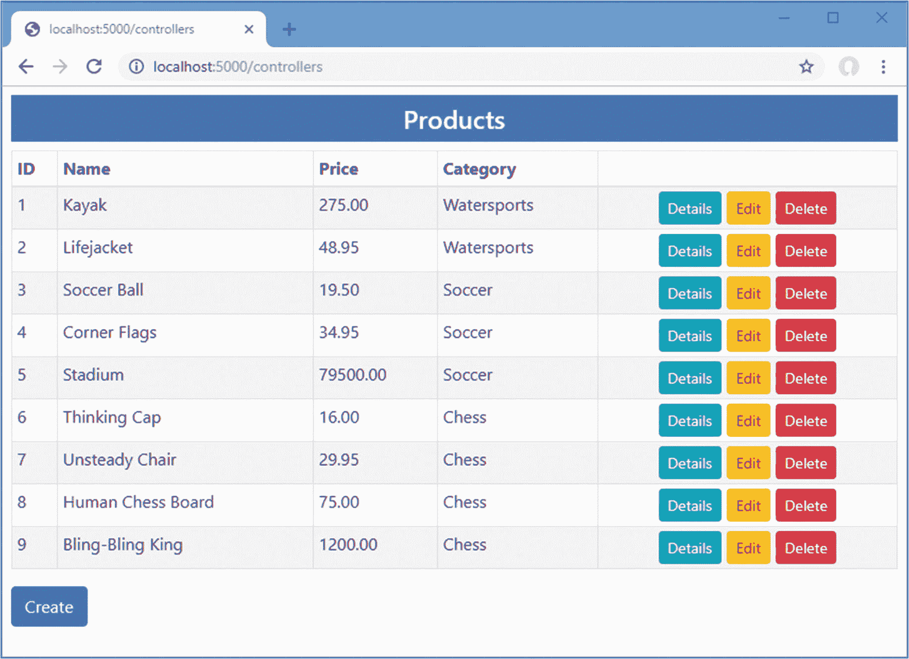
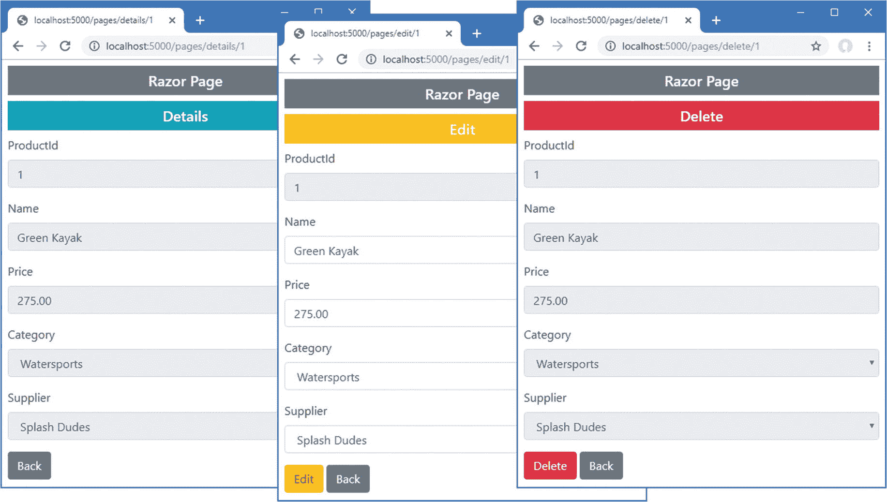

# 三十一、创建表单应用

前面的章节集中在处理 HTML 表单的一个方面的单个特性上，有时很难看出它们是如何组合在一起执行共同的任务的。在本章中，我将介绍创建控制器、视图和 Razor 页面的过程，这些页面支持具有创建、读取、更新和删除(CRUD)功能的应用。本章没有介绍新的特性，目的是演示如何将标签助手、模型绑定和模型验证等特性与实体框架核心结合使用。

## 为本章做准备

本章使用了第 30 章[中的 WebApp 项目。为了准备本章，用清单](30.html) [31-1](#PC1) 中显示的内容替换`Controllers`文件夹中的`HomeController.cs`文件的内容。

Tip

你可以从 [`https://github.com/apress/pro-asp.net-core-3`](https://github.com/apress/pro-asp.net-core-3) 下载本章以及本书其他章节的示例项目。如果在运行示例时遇到问题，请参见第 [1](01.html) 章获取帮助。

```cs
using Microsoft.AspNetCore.Mvc;
using Microsoft.EntityFrameworkCore;
using System.Collections.Generic;
using System.Threading.Tasks;
using WebApp.Models;

namespace WebApp.Controllers {

    [AutoValidateAntiforgeryToken]
    public class HomeController : Controller {
        private DataContext context;

        private IEnumerable<Category> Categories => context.Categories;
        private IEnumerable<Supplier> Suppliers => context.Suppliers;

        public HomeController(DataContext data) {
            context = data;
        }

        public IActionResult Index() {
            return View(context.Products.
                Include(p => p.Category).Include(p => p.Supplier));
        }
    }
}

Listing 31-1.The Contents of the HomeController.cs File in the Controllers Folder

```

创建`Views/HomeIndex.cshtml`，

```cs
@model IEnumerable<Product>
@{ Layout = "_SimpleLayout"; }

<h4 class="bg-primary text-white text-center p-2">Products</h4>
<table class="table table-sm table-bordered table-striped">
    <thead>
        <tr>
            <th>ID</th><th>Name</th><th>Price</th><th>Category</th><th></th>
        </tr>
    </thead>
    <tbody>
        @foreach (Product p in Model) {
            <tr>
                <td>@p.ProductId</td>
                <td>@p.Name</td>
                <td>@p.Price</td>
                <td>@p.Category.Name</td>
                <td class="text-center">
                    <a asp-action="Details" asp-route-id="@p.ProductId"
                       class="btn btn-sm btn-info">Details</a>
                    <a asp-action="Edit" asp-route-id="@p.ProductId"
                       class="btn btn-sm btn-warning">Edit</a>
                    <a asp-action="Delete" asp-route-id="@p.ProductId"
                       class="btn btn-sm btn-danger">Delete</a>
                </td>
            </tr>
        }
    </tbody>
</table>
<a asp-action="Create" class="btn btn-primary">Create</a>

Listing 31-2.The Contents of the Index.cshtml File in the Views/Home Folder

```

接下来，更新清单 [31-3](#PC3) 中所示的`Product`类，以更改验证约束来移除模型级检查并禁用远程验证。

```cs
using System.ComponentModel.DataAnnotations.Schema;
using System.ComponentModel.DataAnnotations;
using Microsoft.AspNetCore.Mvc.ModelBinding;
using WebApp.Validation;
using Microsoft.AspNetCore.Mvc;

namespace WebApp.Models {

    //[PhraseAndPrice(Phrase = "Small", Price = "100")]
    public class Product {

        public long ProductId { get; set; }

        [Required]
        [Display(Name = "Name")]
        public string Name { get; set; }

        [Column(TypeName = "decimal(8, 2)")]
        [Required(ErrorMessage = "Please enter a price")]
        [Range(1, 999999, ErrorMessage = "Please enter a positive price")]
        public decimal Price { get; set; }

        [PrimaryKey(ContextType = typeof(DataContext),
            DataType = typeof(Category))]
        //[Remote("CategoryKey", "Validation",
        //     ErrorMessage = "Enter an existing key")]
        public long CategoryId { get; set; }
        public Category Category { get; set; }

        [PrimaryKey(ContextType = typeof(DataContext),
            DataType = typeof(Category))]
        //[Remote("SupplierKey", "Validation",
        //    ErrorMessage = "Enter an existing key")]
        public long SupplierId { get; set; }
        public Supplier Supplier { get; set; }
    }
}

Listing 31-3.Changing Validation in the Product.cs File in the Models Folder

```

最后，禁用`Startup`类中的全局过滤器，如清单 [31-4](#PC4) 所示。

```cs
...
public void ConfigureServices(IServiceCollection services) {
    services.AddDbContext<DataContext>(opts => {
        opts.UseSqlServer(Configuration[
            "ConnectionStrings:ProductConnection"]);
        opts.EnableSensitiveDataLogging(true);
    });
    services.AddControllersWithViews().AddRazorRuntimeCompilation();
    services.AddRazorPages().AddRazorRuntimeCompilation();
    services.AddSingleton<CitiesData>();

    services.Configure<AntiforgeryOptions>(opts => {
        opts.HeaderName = "X-XSRF-TOKEN";
    });

    services.Configure<MvcOptions>(opts => opts.ModelBindingMessageProvider
        .SetValueMustNotBeNullAccessor(value => "Please enter a value"));

    services.AddScoped<GuidResponseAttribute>();
    //services.Configure<MvcOptions>(opts => {
    //    opts.Filters.Add<HttpsOnlyAttribute>();
    //    opts.Filters.Add(new MessageAttribute(
    //         "This is the globally-scoped filter"));
    //});
}
...

Listing 31-4.Disabling Filters in the Startup.cs File in the WebApp Folder

```

### 正在删除数据库

打开一个新的 PowerShell 命令提示符，导航到包含`WebApp.csproj`文件的文件夹，运行清单 [31-5](#PC5) 中所示的命令来删除数据库。

```cs
dotnet ef database drop --force

Listing 31-5.Dropping the Database

```

### 运行示例应用

从 Debug 菜单中选择 Start Without Debugging 或 Run Without Debugging，或者使用 PowerShell 命令提示符运行清单 [31-6](#PC6) 中所示的命令。

```cs
dotnet run

Listing 31-6.Running the Example Application

```

使用浏览器请求`http://localhost:5000/controllers`，将显示产品列表，如图 [31-1](#Fig1) 所示。有些锚元素的样式显示为按钮，但是这些元素在我添加创建、编辑和删除对象的特性之前不会起作用。



图 31-1。

运行示例应用

## 创建 MVC 表单应用

在接下来的小节中，我将向您展示如何使用 MVC 控制器和视图来执行核心数据操作。在本章的后面，我将使用 Razor 页面创建相同的功能。

### 准备视图模型和视图

我将定义一个用于多种操作的表单，通过它的视图模型类进行配置。要创建视图模型类，将名为`ProductViewModel.cs`的类文件添加到`Models`文件夹中，并添加清单 [31-7](#PC7) 中所示的代码。

```cs
using System.Collections.Generic;
using System.Linq;

namespace WebApp.Models {

    public class ProductViewModel {
        public Product Product { get; set; }
        public string Action { get; set; } = "Create";
        public bool ReadOnly { get; set; } = false;
        public string Theme { get; set; } = "primary";
        public bool ShowAction { get; set; } = true;
        public IEnumerable<Category> Categories { get; set; }
            = Enumerable.Empty<Category>();
        public IEnumerable<Supplier> Suppliers { get; set; }
            = Enumerable.Empty<Supplier>();
    }
}

Listing 31-7.The Contents of the ProductViewModel.cs File in the Models Folder

```

该类将允许控制器向其视图传递数据和显示设置。`Product`属性提供要显示的数据，`Categories`和`Suppliers`属性在需要时提供对`Category`和`Suppliers`对象的访问。其他属性配置如何将内容呈现给用户:`Action`属性指定当前任务的操作方法的名称，`ReadOnly`属性指定用户是否可以编辑数据，`Theme`属性指定内容的引导主题，`ShowAction`属性用于控制提交表单的按钮的可见性。

为了创建允许用户与应用数据交互的视图，向`Views/Home`文件夹添加一个名为`ProductEditor.cshtml`的 Razor 视图，其内容如清单 [31-8](#PC8) 所示。

```cs
@model ProductViewModel
@{ Layout = "_SimpleLayout"; }

<partial name="_Validation" />

<h5 class="bg-@Model.Theme text-white text-center p-2">@Model.Action</h5>

<form asp-action="@Model.Action" method="post">
    <div class="form-group">
        <label asp-for="Product.ProductId"></label>
        <input class="form-control" asp-for="Product.ProductId" readonly />
    </div>
    <div class="form-group">
        <label asp-for="Product.Name"></label>
        <div>
            <span asp-validation-for="Product.Name" class="text-danger"></span>
        </div>
        <input class="form-control" asp-for="Product.Name"
               readonly="@Model.ReadOnly" />
    </div>
    <div class="form-group">
        <label asp-for="Product.Price"></label>
        <div>
            <span asp-validation-for="Product.Price" class="text-danger"></span>
        </div>
        <input class="form-control" asp-for="Product.Price"
               readonly="@Model.ReadOnly" />
    </div>
    <div class="form-group">
        <label asp-for="Product.CategoryId">Category</label>
        <div>
            <span asp-validation-for="Product.CategoryId" class="text-danger"></span>
        </div>
        <select asp-for="Product.CategoryId" class="form-control"
                disabled="@Model.ReadOnly"
                asp-items="@(new SelectList(Model.Categories,
                    "CategoryId", "Name"))">
            <option value="" disabled selected>Choose a Category</option>
        </select>
    </div>
    <div class="form-group">
        <label asp-for="Product.SupplierId">Supplier</label>
        <div>
            <span asp-validation-for="Product.SupplierId" class="text-danger"></span>
        </div>
        <select asp-for="Product.SupplierId" class="form-control"
                disabled="@Model.ReadOnly"
                asp-items="@(new SelectList(Model.Suppliers,
                    "SupplierId", "Name"))">
            <option value="" disabled selected>Choose a Supplier</option>
        </select>
    </div>
    @if (Model.ShowAction) {
        <button class="btn btn-@Model.Theme" type="submit">@Model.Action</button>
    }
    <a class="btn btn-secondary" asp-action="Index">Back</a>
</form>

Listing 31-8.The Contents of the ProductEditor.cshtml File in the Views/Home Folder

```

这个视图可能看起来很复杂，但是它只结合了您在前面章节中看到的特性，一旦您看到它的运行，它会变得更加清晰。这个视图的模型是一个`ProductViewModel`对象，它既提供了显示给用户的数据，也提供了关于数据应该如何呈现的一些指导。

对于由`Product`类定义的每个属性，视图包含一组元素:描述属性的`label`元素，允许编辑值的`input`或`select`元素，以及显示验证消息的`span`元素。每个元素都配置有`asp-for`属性，这确保了标记助手将为每个属性转换元素。有`div`元素来定义视图结构，所有的元素都是引导 CSS 类的成员来设计表单。

### 阅读日期

最简单的操作是从数据库中读取数据并呈现给用户。在大多数应用中，这将允许用户看到列表视图中没有的附加细节。应用执行的每个任务都需要一组不同的`ProductViewModel`属性。为了管理这些组合，用清单 [31-9](#PC9) 中所示的代码将名为`ViewModelFactory.cs`的类文件添加到`Models`文件夹中。

```cs
using System.Collections.Generic;
using System.Linq;

namespace WebApp.Models {

    public static class ViewModelFactory {

        public static ProductViewModel Details(Product p) {
            return new ProductViewModel {
                Product = p, Action = "Details",
                ReadOnly = true, Theme = "info", ShowAction = false,
                Categories = p == null ? Enumerable.Empty<Category>()
                    : new List<Category> { p.Category },
                Suppliers = p == null ? Enumerable.Empty<Supplier>()
                    : new List<Supplier> { p.Supplier},
            };
        }
    }
}

Listing 31-9.The Contents of the ViewModelFactory.cs File in the Models Folder

```

`Details`方法产生一个为查看对象而配置的`ProductViewModel`对象。当用户查看详细信息时，类别和供应商详细信息将是只读的，这意味着我只需要提供当前的类别和供应商信息。

接下来，向`Home`控制器添加一个动作方法，该控制器使用`ViewModelFactory.Details`方法创建一个`ProductViewModel`对象，并通过`ProductEditor`视图将其显示给用户，如清单 [31-10](#PC10) 所示。

```cs
using Microsoft.AspNetCore.Mvc;
using Microsoft.EntityFrameworkCore;
using System.Collections.Generic;
using System.Threading.Tasks;
using WebApp.Models;

namespace WebApp.Controllers {

    [AutoValidateAntiforgeryToken]
    public class HomeController : Controller {
        private DataContext context;

        private IEnumerable<Category> Categories => context.Categories;
        private IEnumerable<Supplier> Suppliers => context.Suppliers;

        public HomeController(DataContext data) {
            context = data;
        }

        public IActionResult Index() {
            return View(context.Products.
                Include(p => p.Category).Include(p => p.Supplier));
        }

        public async Task<IActionResult> Details(long id) {
            Product p = await context.Products.
                Include(p => p.Category).Include(p => p.Supplier)
                .FirstOrDefaultAsync(p => p.ProductId == id);
            ProductViewModel model = ViewModelFactory.Details(p);
            return View("ProductEditor", model);
        }
    }
}

Listing 31-10.Adding an Action Method in the HomeController.cs File in the Controllers Folder

```

动作方法使用`id`参数来查询数据库，并将`Product`对象传递给`ViewModelFactory.Details`方法，该参数将从路由数据绑定到模型。大多数操作都需要`Category`和`Supplier`数据，所以我添加了一些属性来提供对数据的直接访问。

为了测试细节特性，重启 ASP.NET Core 并请求`http://localhost:5000/controllers`。点击其中一个细节按钮，您将看到所选对象以只读形式出现在`ProductEditor`视图中，如图 [31-2](#Fig2) 所示。


图 31-2。

查看数据

如果用户导航到与数据库中的对象不对应的 URL，例如`http://localhost:5000/controllers/Home/Details/100`，那么将显示一个空表单。

### 创建数据

创建数据依靠模型绑定从请求中获取表单数据，并依靠验证来确保数据可以存储在数据库中。第一步是添加一个工厂方法，该方法将创建用于创建数据的视图模型对象，如清单 [31-11](#PC11) 所示。

```cs
using System.Collections.Generic;
using System.Linq;

namespace WebApp.Models {

    public static class ViewModelFactory {

        public static ProductViewModel Details(Product p) {
            return new ProductViewModel {
                Product = p, Action = "Details",
                ReadOnly = true, Theme = "info", ShowAction = false,
                Categories = p == null ? Enumerable.Empty<Category>()
                    : new List<Category> { p.Category },
                Suppliers = p == null ? Enumerable.Empty<Supplier>()
                    : new List<Supplier> { p.Supplier},
            };
        }

        public static ProductViewModel Create(Product product,
            IEnumerable<Category> categories, IEnumerable<Supplier> suppliers) {
            return new ProductViewModel {
                Product = product, Categories = categories, Suppliers = suppliers
            };
        }
    }
}

Listing 31-11.Adding a Method in the ViewModelFactory.cs File in the Models Folder

```

我为`ProductViewModel`属性使用的默认值是为创建数据而设置的，所以清单 [31-11](#PC11) 中的`Create`方法只设置了`Product`、`Categories`和`Suppliers`属性。清单 [31-12](#PC12) 添加了将数据创建到`Home`控制器的动作方法。

```cs
using Microsoft.AspNetCore.Mvc;
using Microsoft.EntityFrameworkCore;
using System.Collections.Generic;
using System.Threading.Tasks;
using WebApp.Models;

namespace WebApp.Controllers {

    [AutoValidateAntiforgeryToken]
    public class HomeController : Controller {
        private DataContext context;

        private IEnumerable<Category> Categories => context.Categories;
        private IEnumerable<Supplier> Suppliers => context.Suppliers;

        public HomeController(DataContext data) {
            context = data;
        }

        public IActionResult Index() {
            return View(context.Products.
                Include(p => p.Category).Include(p => p.Supplier));
        }

        public async Task<IActionResult> Details(long id) {
            Product p = await context.Products.
                Include(p => p.Category).Include(p => p.Supplier)
                .FirstOrDefaultAsync(p => p.ProductId == id);
            ProductViewModel model = ViewModelFactory.Details(p);
            return View("ProductEditor", model);
        }

        public IActionResult Create() {
            return View("ProductEditor",
                ViewModelFactory.Create(new Product(), Categories, Suppliers));
        }

        [HttpPost]
        public async Task<IActionResult> Create([FromForm] Product product) {
            if (ModelState.IsValid) {
                product.ProductId = default;
                product.Category = default;
                product.Supplier = default;
                context.Products.Add(product);
                await context.SaveChangesAsync();
                return RedirectToAction(nameof(Index));
            }
            return View("ProductEditor",
                ViewModelFactory.Create(product, Categories, Suppliers));
        }
    }
}

Listing 31-12.Adding Actions in the HomeController.cs File in the Controllers Folder

```

有两种`Create`方法，通过`HttpPost`属性和方法参数来区分。HTTP GET 请求将由第一种方法处理，该方法选择`ProductEditor`视图并为其提供一个`ProductViewModel`对象。当用户提交表单时，它将被第二种方法接收，这种方法依靠模型绑定来接收数据，并通过模型验证来确保数据有效。

如果数据通过了验证，那么我通过重置三个属性来准备将对象存储在数据库中，如下所示:

```cs
...
product.ProductId = default;
product.Category = default;
product.Supplier = default;
...

```

实体框架核心配置数据库，以便在存储新数据时由数据库服务器分配主键。如果您试图存储一个对象并提供一个不为零的`ProductId`值，那么将会抛出一个异常。

我重置了`Category`和`Supplier`属性，以防止实体框架核心在存储对象时试图处理相关数据。实体框架核心能够处理相关数据，但它可能会产生意想不到的结果。(我将在本章后面的“创建新的相关数据对象”一节中向您展示如何创建相关数据。)

注意，当验证失败时，我调用带有参数的`View`方法，如下所示:

```cs
...
return View("ProductEditor",
    ViewModelFactory.Create(product, Categories, Suppliers));
...

```

我这样做是因为视图期望的视图模型对象与我使用模型绑定从请求中提取的数据类型不同。相反，我创建了一个新的视图模型对象，它合并了模型绑定数据，并将其传递给`View`方法。

重启 ASP.NET Core，请求`http://localhost:5000/controllers`，并点击创建。填写表单并单击 Create 按钮提交数据。当浏览器重定向到`Index`动作时，新对象将被存储在数据库中并显示，如图 [31-3](#Fig3) 所示。


图 31-3。

创建新对象

注意，`select`元素允许用户使用类别和供应商名称来选择`CategoryId`和`SupplierId`属性的值，如下所示:

```cs
...
<select asp-for="Product.SupplierId" class="form-control" disabled="@Model.ReadOnly"
        asp-items="@(new SelectList(Model.Suppliers, "SupplierId", "Name"))">
    <option value="" disabled selected>Choose a Supplier</option>
</select>
...

```

在第 30 章中，我使用了`input`元素来允许直接设置这些属性的值，但那是因为我想演示不同类型的验证。在实际的应用中，当应用已经有了它希望用户从中选择的数据时，为用户提供有限的选择是一个好主意。例如，让用户输入一个有效的主键在真实的项目中是没有意义的，因为应用可以很容易地为用户提供这些键的列表以供选择，如图 [31-4](#Fig4) 所示。

Tip

在“创建新的相关数据对象”一节中，我将向您展示创建相关数据的不同技术。


图 31-4。

给用户提供一个选择

### 编辑数据

编辑数据的过程类似于创建数据。第一步是向视图模型工厂添加一个新方法，该方法将配置向用户呈现数据的方式，如清单 [31-13](#PC16) 所示。

```cs
using System.Collections.Generic;
using System.Linq;

namespace WebApp.Models {

    public static class ViewModelFactory {

        public static ProductViewModel Details(Product p) {
            return new ProductViewModel {
                Product = p, Action = "Details",
                ReadOnly = true, Theme = "info", ShowAction = false,
                Categories = p == null ? Enumerable.Empty<Category>()
                    : new List<Category> { p.Category },
                Suppliers = p == null ? Enumerable.Empty<Supplier>()
                    : new List<Supplier> { p.Supplier},
            };
        }

        public static ProductViewModel Create(Product product,
                IEnumerable<Category> categories, IEnumerable<Supplier> suppliers) {
            return new ProductViewModel {
                Product = product, Categories = categories, Suppliers = suppliers
            };
        }

        public static ProductViewModel Edit(Product product,
                IEnumerable<Category> categories, IEnumerable<Supplier> suppliers) {
            return new ProductViewModel {
                Product = product, Categories = categories, Suppliers = suppliers,
                Theme = "warning", Action = "Edit"
            };
        }
    }
}

Listing 31-13.Adding a Method in the ViewModelFactory.cs File in the Models Folder

```

下一步是向`Home`控制器添加动作方法，该控制器将向用户显示一个`Product`对象的当前属性，并接收用户所做的更改，如清单 [31-14](#PC17) 所示。

```cs
using Microsoft.AspNetCore.Mvc;
using Microsoft.EntityFrameworkCore;
using System.Collections.Generic;
using System.Threading.Tasks;
using WebApp.Models;

namespace WebApp.Controllers {

    [AutoValidateAntiforgeryToken]
    public class HomeController : Controller {
        private DataContext context;

        private IEnumerable<Category> Categories => context.Categories;
        private IEnumerable<Supplier> Suppliers => context.Suppliers;

        public HomeController(DataContext data) {
            context = data;
        }

        // ...other action methods omitted for brevity...

        public async Task<IActionResult> Edit(long id) {
            Product p = await context.Products.FindAsync(id);
            ProductViewModel model = ViewModelFactory.Edit(p, Categories, Suppliers);
            return View("ProductEditor", model);
        }

        [HttpPost]
        public async Task<IActionResult> Edit([FromForm]Product product) {
            if (ModelState.IsValid) {
                product.Category = default;
                product.Supplier = default;
                context.Products.Update(product);
                await context.SaveChangesAsync();
                return RedirectToAction(nameof(Index));
            }
            return View("ProductEditor",
                ViewModelFactory.Edit(product, Categories, Suppliers));
        }
    }
}

Listing 31-14.Adding Action Methods in the HomeController.cs File in the Controllers Folder

```

要查看工作中的编辑功能，请重启 ASP.NET Core，导航到`http://localhost:5000/controllers`，并单击其中一个编辑按钮。更改一个或多个属性值并提交表单。当浏览器被重定向到`Index`动作时，更改将被存储在数据库中并反映在显示的列表中，如图 [31-5](#Fig5) 所示。


图 31-5。

编辑产品

请注意,`ProductId`属性不能更改。应该避免尝试更改对象的主键，因为这会干扰实体框架对其对象标识的核心理解。如果您无法避免更改主键，那么最安全的方法是删除现有对象并存储一个新对象。

### 删除数据

最后一个基本操作是从数据库中删除对象。到目前为止，模式已经很清楚了，第一步是添加一个方法来创建一个视图模型对象，以确定数据如何呈现给用户，如清单 [31-15](#PC18) 所示。

```cs
using System.Collections.Generic;
using System.Linq;

namespace WebApp.Models {

    public static class ViewModelFactory {

        // ...other methods omitted for brevity...

        public static ProductViewModel Delete(Product p,
                IEnumerable<Category> categories, IEnumerable<Supplier> suppliers) {
            return new ProductViewModel {
                Product = p, Action = "Delete",
                ReadOnly = true, Theme = "danger",
                Categories = categories, Suppliers = suppliers
            };
        }
    }
}

Listing 31-15.Adding a Method in the ViewModelFactory.cs File in the Models Folder

```

清单 [31-16](#PC19) 向`Home`控制器添加了动作方法，该控制器将通过显示选中的对象和从数据库中删除该对象的 POST 请求来响应 GET 请求。

```cs
using Microsoft.AspNetCore.Mvc;
using Microsoft.EntityFrameworkCore;
using System.Collections.Generic;
using System.Threading.Tasks;
using WebApp.Models;

namespace WebApp.Controllers {

    [AutoValidateAntiforgeryToken]
    public class HomeController : Controller {
        private DataContext context;

        private IEnumerable<Category> Categories => context.Categories;
        private IEnumerable<Supplier> Suppliers => context.Suppliers;

        public HomeController(DataContext data) {
            context = data;
        }

        // ...other action methods removed for brevity...

        public async Task<IActionResult> Delete(long id) {
            ProductViewModel model = ViewModelFactory.Delete(
                await context.Products.FindAsync(id), Categories, Suppliers);
            return View("ProductEditor", model);
        }

        [HttpPost]
        public async Task<IActionResult> Delete(Product product) {
            context.Products.Remove(product);
            await context.SaveChangesAsync();
            return RedirectToAction(nameof(Index));
        }
    }
}

Listing 31-16.Adding Action Methods in the HomeController.cs File in the Controllers Folder

```

模型绑定过程从表单数据中创建一个`Product`对象，该对象被传递给实体框架核心以从数据库中删除。一旦数据从数据库中移除，浏览器将被重定向到`Index`动作，如图 [31-6](#Fig6) 所示。


图 31-6。

删除数据

## 创建 Razor Pages 表单应用

使用 Razor 表单依赖于与控制器示例类似的技术，尽管被分解成更小的功能块。正如您将看到的，主要的困难是在不复制代码和标记的情况下保持 Razor 页面的模块化特性。第一步是创建 Razor 页面，该页面将显示`Product`对象的列表，并提供到其他操作的链接。在`Pages`文件夹中添加一个名为`Index.cshtml`的 Razor 页面，内容如清单 [31-17](#PC20) 所示。

```cs
@page "/pages/{id:long?}"
@model IndexModel
@using Microsoft.AspNetCore.Mvc.RazorPages
@using Microsoft.EntityFrameworkCore

<div class="m-2">
    <h4 class="bg-primary text-white text-center p-2">Products</h4>
    <table class="table table-sm table-bordered table-striped">
        <thead>
            <tr>
                <th>ID</th><th>Name</th><th>Price</th><th>Category</th><th></th>
            </tr>
        </thead>
        <tbody>
            @foreach (Product p in Model.Products) {
                <tr>
                    <td>@p.ProductId</td>
                    <td>@p.Name</td>
                    <td>@p.Price</td>
                    <td>@p.Category.Name</td>
                    <td class="text-center">
                        <a asp-page="Details" asp-route-id="@p.ProductId"
                           class="btn btn-sm btn-info">Details</a>
                        <a asp-page="Edit" asp-route-id="@p.ProductId"
                           class="btn btn-sm btn-warning">Edit</a>
                        <a asp-page="Delete" asp-route-id="@p.ProductId"
                           class="btn btn-sm btn-danger">Delete</a>
                    </td>
                </tr>
            }
        </tbody>
    </table>
    <a asp-page="Create" class="btn btn-primary">Create</a>
</div>

@functions {

    public class IndexModel: PageModel {
        private DataContext context;

        public IndexModel(DataContext dbContext) {
            context = dbContext;
        }

        public IEnumerable<Product> Products { get; set; }

        public void OnGetAsync(long id = 1) {
            Products = context.Products
                .Include(p => p.Category).Include(p => p.Supplier);
        }
    }
}

Listing 31-17.The Contents of the Index.cshtml File in the Pages Folder

```

页面的这个视图部分显示了一个表格，其中填充了页面模型从数据库中获得的`Product`对象的详细信息。使用浏览器请求`http://localhost:5000/pages`，会看到如图 [31-7](#Fig7) 所示的响应。在`Product`对象的细节旁边，页面显示了导航到其他 Razor 页面的锚元素，我将在接下来的部分中定义这些元素。


图 31-7。

使用 Razor 页面列出数据

### 创建通用功能

我不想在示例应用所需的每个页面中复制相同的 HTML 表单和支持代码。相反，我将定义一个定义 HTML 表单的局部视图和一个定义页面模型类所需的公共代码的基类。对于局部视图，将一个名为`_ProductEditor.cshtml`的 Razor 视图放到`Pages`文件夹中，内容如清单 [31-18](#PC21) 所示。

USING MULTIPLE PAGE

属性可以用来指定一个处理程序方法的名称，这允许一个 Razor 页面用于多个操作。我不喜欢这个特性，因为结果太接近标准的 MVC 控制器，破坏了我喜欢的 Razor 页面开发的自包含和模块化方面。

当然，我更喜欢的方法是我在本章中采用的方法，即在局部视图和共享基类中合并公共内容。这两种方法都可行，我建议您尝试一下，看看哪种方法适合您和您的项目。

```cs
@model ProductViewModel

<partial name="_Validation" />

<h5 class="bg-@Model.Theme text-white text-center p-2">@Model.Action</h5>

<form asp-page="@Model.Action" method="post">
    <div class="form-group">
        <label asp-for="Product.ProductId"></label>
        <input class="form-control" asp-for="Product.ProductId" readonly />
    </div>
    <div class="form-group">
        <label asp-for="Product.Name"></label>
        <div>
            <span asp-validation-for="Product.Name" class="text-danger"></span>
        </div>
        <input class="form-control" asp-for="Product.Name"
               readonly="@Model.ReadOnly" />
    </div>
    <div class="form-group">
        <label asp-for="Product.Price"></label>
        <div>
            <span asp-validation-for="Product.Price" class="text-danger"></span>
        </div>
        <input class="form-control" asp-for="Product.Price"
               readonly="@Model.ReadOnly" />
    </div>
    <div class="form-group">
        <label asp-for="Product.CategoryId">Category</label>
        <div>
            <span asp-validation-for="Product.CategoryId" class="text-danger"></span>
        </div>
        <select asp-for="Product.CategoryId" class="form-control"
                disabled="@Model.ReadOnly"

                asp-items="@(new SelectList(Model.Categories,
                    "CategoryId", "Name"))">
            <option value="" disabled selected>Choose a Category</option>
        </select>
    </div>
    <div class="form-group">
        <label asp-for="Product.SupplierId">Supplier</label>
        <div>
            <span asp-validation-for="Product.SupplierId" class="text-danger"></span>
        </div>
        <select asp-for="Product.SupplierId" class="form-control"
                disabled="@Model.ReadOnly"
                asp-items="@(new SelectList(Model.Suppliers,
                    "SupplierId", "Name"))">
            <option value="" disabled selected>Choose a Supplier</option>
        </select>
    </div>
    @if (Model.ShowAction) {
        <button class="btn btn-@Model.Theme" type="submit">@Model.Action</button>
    }
    <a class="btn btn-secondary" asp-page="Index">Back</a>
</form>

Listing 31-18.The Contents of the _ProductEditor.cshtml File in the Pages Folder

```

局部视图使用`ProductViewModel`类作为它的模型类型，并依赖内置的标签助手来为由`Product`类定义的属性提供`input`和`select`元素。除了用`asp-page`替换了`asp-action`属性来指定`form`和`anchor`元素的目标之外，这与本章前面使用的内容相同。

要定义页面模型基类，将名为`EditorPageModel.cs`的类文件添加到`Pages`文件夹中，并使用它来定义清单 [31-19](#PC22) 中所示的类。

```cs
using Microsoft.AspNetCore.Mvc.RazorPages;
using System.Collections.Generic;
using WebApp.Models;

namespace WebApp.Pages {

    public class EditorPageModel : PageModel {

        public EditorPageModel(DataContext dbContext) {
            DataContext = dbContext;
        }

        public DataContext DataContext { get; set; }

        public IEnumerable<Category> Categories => DataContext.Categories;
        public IEnumerable<Supplier> Suppliers => DataContext.Suppliers;

        public ProductViewModel ViewModel { get; set; }
    }
}

Listing 31-19.The Contents of the EditorPageModel.cs File in the Pages Folder

```

这个类定义的属性很简单，但是它们将有助于简化处理每个操作的 Razor 页面的页面模型类。

本例所需的所有 Razor 页面都依赖于相同的名称空间。将清单 [31-20](#PC23) 中所示的表达式添加到`Pages`文件夹中的`_ViewImports.cshtml`文件中，以避免各个页面中出现重复的表达式。

Tip

确保修改了`Pages`文件夹中的`_ViewImports.cshtml`文件，而不是`Views`文件夹中的同名文件。

```cs
@namespace WebApp.Pages
@using WebApp.Models
@addTagHelper *, Microsoft.AspNetCore.Mvc.TagHelpers
@addTagHelper *, WebApp
@using Microsoft.AspNetCore.Mvc.RazorPages
@using Microsoft.EntityFrameworkCore
@using WebApp.Pages
@using System.Text.Json
@using Microsoft.AspNetCore.Http

Listing 31-20.Adding Namespaces in the _ViewImports.cshtml File in the Pages Folder

```

### 为 CRUD 操作定义页面

有了局部视图和共享基类，处理单个操作的页面就简单了。在`Pages`文件夹中添加一个名为`Details.cshtml`的 Razor 页面，代码和内容如清单 [31-21](#PC24) 所示。

```cs
@page "/pages/details/{id}"
@model DetailsModel

<div class="m-2">
    <partial name="_ProductEditor" model="@Model.ViewModel" />
</div>

@functions {

    public class DetailsModel: EditorPageModel {

        public DetailsModel(DataContext dbContext): base(dbContext) {}

        public async Task OnGetAsync(long id) {
            Product p = await DataContext.Products.
                Include(p => p.Category).Include(p => p.Supplier)
                .FirstOrDefaultAsync(p => p.ProductId == id);
            ViewModel = ViewModelFactory.Details(p);
        }
    }
}

Listing 31-21.The Contents of the Details.cshtml File in the Pages Folder

```

构造函数接收一个实体框架核心上下文对象，并将其传递给基类。handler 方法通过查询数据库来响应请求，并使用响应通过`ViewModelFactory`类创建一个`ProductViewModel`对象。

在`Pages`文件夹中添加一个名为`Create.cshtml`的 Razor 页面，代码和内容如清单 [31-22](#PC25) 所示。

Tip

使用局部视图意味着`asp-for`属性设置了没有附加前缀的元素名称。这允许我在不使用`Name`参数的情况下使用`FromForm`属性进行模型绑定。

```cs
@page "/pages/create"
@model CreateModel

<div class="m-2">
    <partial name="_ProductEditor" model="@Model.ViewModel" />
</div>

@functions {

    public class CreateModel: EditorPageModel {

        public CreateModel(DataContext dbContext): base(dbContext) {}

        public void OnGet() {
            ViewModel = ViewModelFactory.Create(new Product(),
                Categories, Suppliers);
        }

        public async Task<IActionResult> OnPostAsync([FromForm]Product product) {
            if (ModelState.IsValid) {
                product.ProductId = default;
                product.Category = default;
                product.Supplier = default;
                DataContext.Products.Add(product);
                await DataContext.SaveChangesAsync();
                return RedirectToPage(nameof(Index));
            }
            ViewModel = ViewModelFactory.Create(product, Categories, Suppliers);
            return Page();
        }
    }
}

Listing 31-22.The Contents of the Create.cshtml File in the Pages Folder

```

在`Pages`文件夹中添加一个名为`Edit.cshtml`的 Razor 页面，代码和内容如清单 [31-23](#PC26) 所示。

```cs
@page "/pages/edit/{id}"
@model EditModel

<div class="m-2">
    <partial name="_ProductEditor" model="@Model.ViewModel" />
</div>

@functions {

    public class EditModel: EditorPageModel {

        public EditModel(DataContext dbContext): base(dbContext) {}

        public async Task OnGetAsync(long id) {
            Product p = await this.DataContext.Products.FindAsync(id);
            ViewModel = ViewModelFactory.Edit(p, Categories, Suppliers);
        }

        public async Task<IActionResult> OnPostAsync([FromForm]Product product) {
            if (ModelState.IsValid) {
                product.Category = default;
                product.Supplier = default;
                DataContext.Products.Update(product);
                await DataContext.SaveChangesAsync();
                return RedirectToPage(nameof(Index));
            }
            ViewModel = ViewModelFactory.Edit(product, Categories, Suppliers);
            return Page();
        }
    }
}

Listing 31-23.The Contents of the Edit.cshtml File in the Pages Folder

```

在`Pages`文件夹中添加一个名为`Delete.cshtml`的 Razor 页面，代码和内容如清单 [31-24](#PC27) 所示。

```cs
@page "/pages/delete/{id}"
@model DeleteModel

<div class="m-2">
    <partial name="_ProductEditor" model="@Model.ViewModel" />
</div>

@functions {

    public class DeleteModel: EditorPageModel {

        public DeleteModel(DataContext dbContext): base(dbContext) {}

        public async Task OnGetAsync(long id) {
            ViewModel = ViewModelFactory.Delete(
                await DataContext.Products.FindAsync(id), Categories, Suppliers);
        }

        public async Task<IActionResult> OnPostAsync([FromForm]Product product) {
            DataContext.Products.Remove(product);
            await DataContext.SaveChangesAsync();
            return RedirectToPage(nameof(Index));
        }
    }
}

Listing 31-24.The Contents of the Delete.cshtml File in the Pages Folder

```

重启 ASP.NET Core 并导航到`http://localhost:5000/pages`，你将可以点击链接来查看、创建、编辑和删除数据，如图 [31-8](#Fig8) 所示。



图 31-8。

使用 Razor 页

## 创建新的相关数据对象

一些应用需要允许用户创建新的相关数据，这样，例如，一个新的`Category`可以和那个`Category`中的`Product`一起创建。有两种方法可以解决这个问题，如下面几节所述。

### 在同一请求中提供相关数据

第一种方法是要求用户提供所需的数据，以相同的形式创建相关数据。对于示例应用，这意味着以用户为`Product`对象输入值的相同形式收集`Category`对象的详细信息。

对于简单的数据类型，这可能是一种有用的方法，在这种情况下，创建相关对象只需要少量的数据，但对于具有许多属性的类型，这种方法不太适用。

我更喜欢在相关数据类型的局部视图中定义 HTML 元素。在`Pages`文件夹中添加一个名为`_CategoryEditor.cshtml`的 Razor 视图，内容如清单 [31-25](#PC28) 所示。

```cs
@model Product
<script type="text/javascript">
    $(document).ready(() => {
        const catGroup = $("#categoryGroup").hide();
        $("select[name='Product.CategoryId']").on("change", (event) =>
            event.target.value === "-1" ? catGroup.show() : catGroup.hide());
    });
</script>

<div class="form-group bg-info p-1" id="categoryGroup">
    <label class="text-white" asp-for="Category.Name">
        New Category Name
    </label>
    <input class="form-control" asp-for="Category.Name" value="" />
</div>

Listing 31-25.The Contents of the _CategoryEditor.cshtml File in the Pages Folder

```

`Category`类型只需要一个属性，用户将使用标准的`input`元素提供这个属性。局部视图中的`script`元素包含隐藏新元素的 jQuery 代码，直到用户选择一个为`Product.CategoryId`属性设置值`-1`的`option`元素。(使用 JavaScript 完全是可选的，但它有助于强调新元素的用途。)

清单 [31-26](#PC29) 将局部视图添加到编辑器中，同时添加的`option`元素将显示用于创建新的`Category`对象的元素。

```cs
...
<div class="form-group">
    <label asp-for="Product.CategoryId">Category</label>
    <div>
        <span asp-validation-for="Product.CategoryId" class="text-danger"></span>
    </div>
    <select asp-for="Product.CategoryId" class="form-control"
            disabled="@Model.ReadOnly" asp-items="@(new SelectList(Model.Categories,
                "CategoryId", "Name"))">
        <option value="-1">Create New Category...</option>
        <option value="" disabled selected>Choose a Category</option>
    </select>
</div>
<partial name="_CategoryEditor" for="Product" />
<div class="form-group">
    <label asp-for="Product.SupplierId">Supplier</label>
    <div><span asp-validation-for="Product.SupplierId" class="text-danger"></span></div>
    <select asp-for="Product.SupplierId" class="form-control" disabled="@Model.ReadOnly"
            asp-items="@(new SelectList(Model.Suppliers,
                "SupplierId", "Name"))">
        <option value="" disabled selected>Choose a Supplier</option>
    </select>
</div>
...

Listing 31-26.Adding Elements in the _ProductEditor.cshtml File in the Pages Folder

```

我需要多个页面中的新功能，因此为了避免代码重复，我添加了一个方法来处理页面模型基类的相关数据，如清单 [31-27](#PC30) 所示。

```cs
using Microsoft.AspNetCore.Mvc.RazorPages;
using System.Collections.Generic;
using WebApp.Models;
using System.Threading.Tasks;

namespace WebApp.Pages {

    public class EditorPageModel : PageModel {

        public EditorPageModel(DataContext dbContext) {
            DataContext = dbContext;
        }

        public DataContext DataContext { get; set; }

        public IEnumerable<Category> Categories => DataContext.Categories;
        public IEnumerable<Supplier> Suppliers => DataContext.Suppliers;

        public ProductViewModel ViewModel { get; set; }

        protected async Task CheckNewCategory(Product product) {
            if (product.CategoryId == -1
                    && !string.IsNullOrEmpty(product.Category?.Name)) {
                DataContext.Categories.Add(product.Category);
                await DataContext.SaveChangesAsync();
                product.CategoryId = product.Category.CategoryId;
                ModelState.Clear();
                TryValidateModel(product);
            }
        }
    }
}

Listing 31-27.Adding a Method in the EditorPageModel.cs File in the Pages Folder

```

新代码使用从用户接收的数据创建一个`Category`对象，并将其存储在数据库中。数据库服务器为新对象分配一个主键，实体框架核心使用这个主键来更新`Category`对象。这允许我更新`Product`对象的`CategoryId`属性，然后重新验证模型数据，知道分配给`CategoryId`属性的值将通过验证，因为它对应于新分配的键。为了将新功能集成到`Create`页面中，添加清单 [31-28](#PC31) 中所示的语句。

```cs
...
public async Task<IActionResult> OnPostAsync([FromForm]Product product) {
    await CheckNewCategory(product);
    if (ModelState.IsValid) {
        product.ProductId = default;
        product.Category = default;
        product.Supplier = default;
        DataContext.Products.Add(product);
        await DataContext.SaveChangesAsync();
        return RedirectToPage(nameof(Index));
    }
    ViewModel = ViewModelFactory.Create(product, Categories, Suppliers);
    return Page();
}
...

Listing 31-28.Adding a Statement in the Create.cshtml File in the Pages Folder

```

将相同的语句添加到`Edit`页面的 handler 方法中，如清单 [31-29](#PC32) 所示。

```cs
...
public async Task<IActionResult> OnPostAsync([FromForm]Product product) {
    await CheckNewCategory(product);
    if (ModelState.IsValid) {
        product.Category = default;
        product.Supplier = default;
        DataContext.Products.Update(product);
        await DataContext.SaveChangesAsync();
        return RedirectToPage(nameof(Index));
    }
    ViewModel = ViewModelFactory.Edit(product, Categories, Suppliers);
    return Page();
}
...

Listing 31-29.Adding a Statement in the Edit.cshtml File in the Pages Folder

```

重启 ASP.NET Core，以便重新编译页面模型基类，并使用浏览器请求`http://localhost:5000/pages/edit/1`。单击 Category `select`元素，并从选项列表中选择 Create New Category。在 input 元素中输入一个新的类别名称，然后单击 Edit 按钮。当请求被处理时，一个新的`Category`对象将被存储在数据库中，并与`Product`对象相关联，如图 [31-9](#Fig9) 所示。


图 31-9。

创建相关数据

### 突破去创造新的数据

对于有自己复杂创建过程的相关数据类型，向主表单添加元素可能会让用户不知所措；更好的方法是从主窗体导航到另一个控制器或页面，让用户创建新的对象，然后返回来完成原来的任务。我将为创建`Supplier`对象演示这种技术，尽管`Supplier`类型很简单，只需要用户提供两个值。

要创建一个允许用户创建`Supplier`对象的表单，向`Pages`文件夹添加一个名为`SupplierBreakOut.cshtml`的 Razor 页面，其内容如清单 [31-30](#PC33) 所示。

```cs
@page "/pages/supplier"
@model SupplierPageModel

<div class="m-2">
    <h5 class="bg-secondary text-white text-center p-2">New Supplier</h5>
    <form asp-page="SupplierBreakOut" method="post">
        <div class="form-group">
            <label asp-for="Supplier.Name"></label>
            <input class="form-control" asp-for="Supplier.Name"  />
        </div>
        <div class="form-group">
            <label asp-for="Supplier.City"></label>
            <input class="form-control" asp-for="Supplier.City"  />
        </div>
        <button class="btn btn-secondary" type="submit">Create</button>
        <a class="btn btn-outline-secondary"
                asp-page="@Model.ReturnPage" asp-route-id="@Model.ProductId">
            Cancel
        </a>
    </form>
</div>

@functions {

    public class SupplierPageModel: PageModel {
        private DataContext context;

        public SupplierPageModel(DataContext dbContext) {
            context = dbContext;
        }

        [BindProperty]
        public Supplier Supplier { get; set; }

        public string ReturnPage { get; set; }
        public string ProductId { get; set; }

        public void OnGet([FromQuery(Name="Product")] Product product,
                string returnPage) {
            TempData["product"] = Serialize(product);
            TempData["returnAction"] =  ReturnPage = returnPage;
            TempData["productId"] = ProductId = product.ProductId.ToString();
        }

        public async Task<IActionResult> OnPostAsync() {
            context.Suppliers.Add(Supplier);
            await context.SaveChangesAsync();
            Product product = Deserialize(TempData["product"] as string);
            product.SupplierId = Supplier.SupplierId;
            TempData["product"] = Serialize(product);
            string id = TempData["productId"] as string;
            return RedirectToPage(TempData["returnAction"] as string,
                new { id = id });
        }

        private string Serialize(Product p) => JsonSerializer.Serialize(p);
        private Product Deserialize(string json) =>
            JsonSerializer.Deserialize<Product>(json);
    }
}

Listing 31-30.The Contents of the SupplierBreakOut.cshtml File in the Pages Folder

```

用户将使用 GET 请求导航到该页面，该请求将包含用户提供的`Product`的细节以及用户应该返回的页面的名称。使用临时数据功能存储这些数据。

该页面向用户呈现一个表单，其中包含创建新的`Supplier`对象所需的`Name`和`City`属性的字段。当提交表单时，POST handler 方法存储一个新的`Supplier`对象，并使用数据库服务器分配的键来更新`Product`对象，然后该对象再次存储为临时数据。用户被重定向回他们到达的页面。

清单 [31-31](#PC34) 向`_ProductEditor`局部视图添加了元素，允许用户导航到新页面。

```cs
...
<partial name="_CategoryEditor" for="Product" />

<div class="form-group">
    <label asp-for="Product.SupplierId">
        Supplier
        @if (!Model.ReadOnly) {
            <input type="hidden" name="returnPage" value="@Model.Action" />
            <button class="btn btn-sm btn-outline-primary ml-3"
                    asp-page="SupplierBreakOut" formmethod="get" formnovalidate>
                Create New Supplier
            </button>
        }
    </label>
    <div>
        <span asp-validation-for="Product.SupplierId" class="text-danger"></span>
    </div>
    <select asp-for="Product.SupplierId" class="form-control"
        disabled="@Model.ReadOnly" asp-items="@(new SelectList(Model.Suppliers,
                "SupplierId", "Name"))">
        <option value="" disabled selected>Choose a Supplier</option>
    </select>
</div>
...

Listing 31-31.Adding Elements in the _ProductEditor.cshtml File in the Pages Folder

```

新元素添加了一个隐藏的`input`元素，它捕获要返回的页面，还添加了一个`button`元素，它使用 GET 请求向`SupplierBreakOut`页面提交表单数据，这意味着表单值将被编码到查询字符串中(这也是我在清单 [31-30](#PC33) 中使用`FromQuery`属性的原因)。清单 [31-32](#PC35) 显示了对`Create`页面所需的更改，以添加对检索临时数据并使用它来填充`Product`表单的支持。

```cs
@page "/pages/create"
@model CreateModel

<div class="m-2">
    <partial name="_ProductEditor" model="@Model.ViewModel" />
</div>

@functions {

    public class CreateModel: EditorPageModel {

        public CreateModel(DataContext dbContext): base(dbContext) {}

        public void OnGet() {
            Product p = TempData.ContainsKey("product")
                ? JsonSerializer.Deserialize<Product>(TempData["product"] as string)
                : new Product();
            ViewModel = ViewModelFactory.Create(p, Categories, Suppliers);
        }

        public async Task<IActionResult> OnPostAsync([FromForm]Product product) {
            await CheckNewCategory(product);
            if (ModelState.IsValid) {
                product.ProductId = default;
                product.Category = default;
                product.Supplier = default;
                DataContext.Products.Add(product);
                await DataContext.SaveChangesAsync();
                return RedirectToPage(nameof(Index));
            }
            ViewModel = ViewModelFactory.Create(product, Categories, Suppliers);
            return Page();
        }
    }
}

Listing 31-32.Retrieving Data in the Create.cshtml File in the Pages Folder

```

在`Edit`页面中需要进行类似的更改，如清单 [31-33](#PC36) 所示。(其他页面不需要更改，因为只有当用户能够创建或编辑`Product`数据时才需要分支。)

```cs
@page "/pages/edit/{id}"
@model EditModel

<div class="m-2">
    <partial name="_ProductEditor" model="@Model.ViewModel" />
</div>

@functions {

    public class EditModel: EditorPageModel {

        public EditModel(DataContext dbContext): base(dbContext) {}

        public async Task OnGetAsync(long id) {
            Product p = TempData.ContainsKey("product")
                ? JsonSerializer.Deserialize<Product>(TempData["product"] as string)
                : await this.DataContext.Products.FindAsync(id);
            ViewModel = ViewModelFactory.Edit(p, Categories, Suppliers);
        }

        public async Task<IActionResult> OnPostAsync([FromForm]Product product) {
            await CheckNewCategory(product);
            if (ModelState.IsValid) {
                product.Category = default;
                product.Supplier = default;
                DataContext.Products.Update(product);
                await DataContext.SaveChangesAsync();
                return RedirectToPage(nameof(Index));
            }
            ViewModel = ViewModelFactory.Edit(product, Categories, Suppliers);
            return Page();
        }
    }
}

Listing 31-33.Retrieving Data in the Edit.cshtml File in the Pages Folder

```

其效果是向用户呈现一个 Create New Supplier 按钮，该按钮将浏览器发送到一个可以用来创建一个`Supplier`对象的表单。一旦`Supplier`被存储在数据库中，浏览器被发送回起始页面，表单被用户输入的数据填充，并且`Supplier`选择元素被设置为新创建的对象，如图 [31-10](#Fig10) 所示。


图 31-10。

突破以创建相关数据

## 摘要

在本章中，我演示了如何将前面章节中描述的特性与实体框架核心相结合来创建、读取、更新和删除数据。在第 4 部分中，我描述了 ASP.NET Core 提供的一些高级特性。