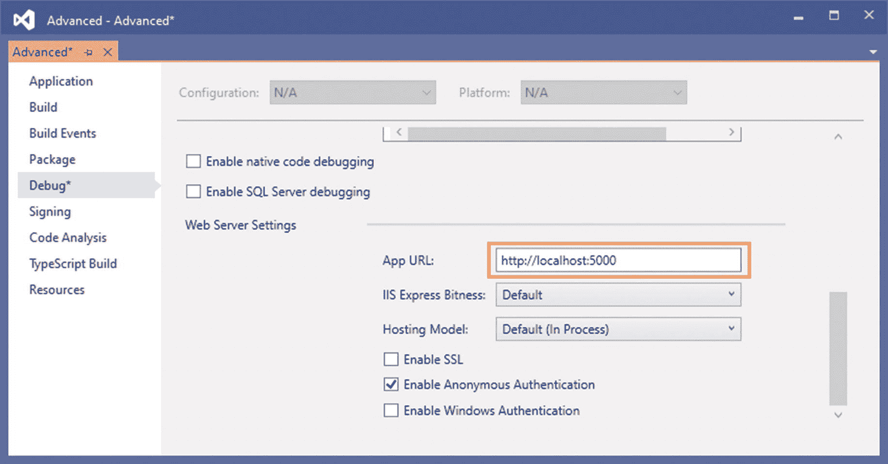
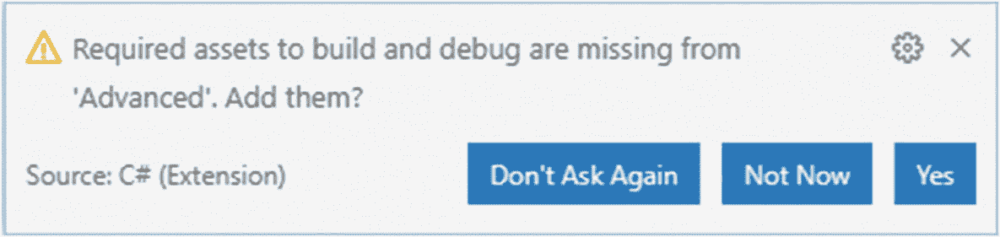
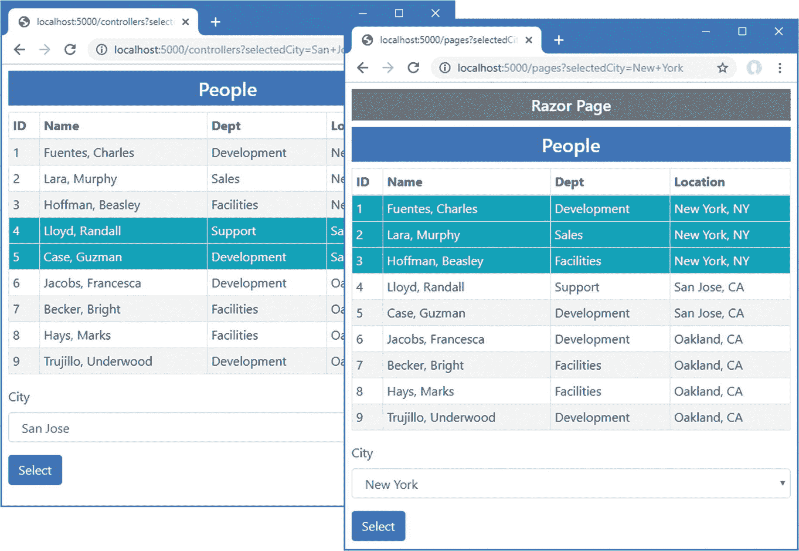

# 三十二、创建示例项目

在本章中，您将创建贯穿本书这一部分的示例项目。该项目包含一个使用简单控制器和 Razor 页面显示的数据模型。

## 创建项目

从 Windows 开始菜单打开一个新的 PowerShell 命令提示符，并运行清单 [32-1](#PC1) 中所示的命令。

Tip

你可以从 [`https://github.com/apress/pro-asp.net-core-3`](https://github.com/apress/pro-asp.net-core-3) 下载本章以及本书其他章节的示例项目。如果在运行示例时遇到问题，请参见第 [1](01.html) 章获取帮助。

```cs
dotnet new globaljson --sdk-version 3.1.101 --output Advanced
dotnet new web --no-https --output Advanced --framework netcoreapp3.1
dotnet new sln -o Advanced

dotnet sln Advanced add Advanced

Listing 32-1.Creating the Project

```

如果您使用的是 Visual Studio，请打开`Advanced`文件夹中的`Advanced.sln`文件。选择项目➤平台属性，导航到调试页面，将 App URL 字段更改为 **http://localhost:5000** ，如图 [32-1](#Fig1) 所示。这将更改用于接收 HTTP 请求的端口。选择文件➤保存全部保存配置更改。



图 32-1。

更改 HTTP 端口

如果您使用的是 Visual Studio 代码，请打开`Advanced`文件夹。当系统提示添加构建和调试项目所需的资产时，点击是按钮，如图 [32-2](#Fig2) 所示。



图 32-2。

添加项目资产

### 将 NuGet 包添加到项目中

该数据模型将使用实体框架核心来存储和查询 SQL Server LocalDB 数据库中的数据。要添加实体框架核心的 NuGet 包，使用 PowerShell 命令提示符来运行在`Advanced`项目文件夹中的清单 [32-2](#PC2) 中显示的命令。

```cs
dotnet add package Microsoft.EntityFrameworkCore.Design --version 3.1.1
dotnet add package Microsoft.EntityFrameworkCore.SqlServer --version 3.1.1

Listing 32-2.Adding Packages to the Project

```

如果您使用的是 Visual Studio，则可以通过选择“项目➤管理 NuGet 包”来添加包。注意选择要添加到项目中的包的正确版本。

如果您没有遵循前面章节中的示例，您将需要安装用于创建和管理实体框架核心迁移的全局工具包。运行清单 [32-3](#PC3) 中所示的命令，删除软件包的任何现有版本，并安装本书所需的版本。

```cs
dotne.t tool uninstall --global dotnet-ef
dotnet tool install --global dotnet-ef --version 3.1.1

Listing 32-3.Installing a Global Tool Package

```

## 添加数据模型

这个应用的数据模型将由三个类组成，分别代表人、他们工作的部门以及他们的位置。创建一个`Models`文件夹，并用清单 [32-4](#PC4) 中的代码向其中添加一个名为`Person.cs`的类文件。

```cs
using System.Collections.Generic;

namespace Advanced.Models {

    public class Person {

        public long PersonId { get; set; }
        public string Firstname { get; set; }
        public string Surname { get; set; }
        public long DepartmentId { get; set; }
        public long LocationId { get; set; }

        public Department Department {get; set; }
        public Location Location { get; set; }
    }
}

Listing 32-4.The Contents of the Person.cs File in the Models Folder

```

将名为`Department.cs`的类文件添加到`Models`文件夹中，并使用它来定义清单 [32-5](#PC5) 中所示的类。

```cs
using System.Collections.Generic;

namespace Advanced.Models {
    public class Department {

        public long Departmentid { get; set; }
        public string Name { get; set; }

        public IEnumerable<Person> People { get; set; }
    }
}

Listing 32-5.The Contents of the Department.cs File in the Models Folder

```

将名为`Location.cs`的类文件添加到`Models`文件夹中，并使用它来定义清单 [32-6](#PC6) 中所示的类。

```cs
using System.Collections.Generic;

namespace Advanced.Models {
    public class Location {

        public long LocationId { get; set; }
        public string City { get; set; }
        public string State { get; set; }

        public IEnumerable<Person> People { get; set; }
    }
}

Listing 32-6.The Contents of the Location.cs File in the Models Folder

```

三个数据模型类中的每一个都定义了一个键属性，当存储新对象时，数据库将分配该键属性的值，并且定义了定义类之间关系的外键属性。这些由导航属性补充，导航属性将与实体框架核心`Include`方法一起使用，以将相关数据合并到查询中。

为了创建将提供对数据库访问的实体框架核心上下文类，将名为`DataContext.cs`的文件添加到`Models`文件夹中，并添加清单 [32-7](#PC7) 中所示的代码。

```cs
using Microsoft.EntityFrameworkCore;

namespace Advanced.Models {
    public class DataContext: DbContext {

        public DataContext(DbContextOptions<DataContext> opts)
            : base(opts) { }

        public DbSet<Person> People { get; set; }
        public DbSet<Department> Departments { get; set; }
        public DbSet<Location> Locations { get; set; }
    }
}

Listing 32-7.The Contents of the DataContext.cs File in the Models Folder

```

上下文类定义了用于查询数据库中的`Person`、`Department`和`Location`数据的属性。

### 准备种子数据

将名为`SeedData.cs`的类添加到`Models`文件夹中，并添加清单 [32-8](#PC8) 中所示的代码，以定义将用于填充数据库的种子数据。

```cs
using Microsoft.EntityFrameworkCore;
using System.Linq;

namespace Advanced.Models {
    public static class SeedData {

        public static void SeedDatabase(DataContext context) {
            context.Database.Migrate();
            if (context.People.Count() == 0 && context.Departments.Count() == 0 &&
                context.Locations.Count() == 0) {

                Department d1 = new Department { Name = "Sales" };
                Department d2 = new Department { Name = "Development" };
                Department d3 = new Department { Name = "Support" };
                Department d4 = new Department { Name = "Facilities" };

                context.Departments.AddRange(d1, d2, d3, d4);
                context.SaveChanges();

                Location l1 = new Location { City = "Oakland", State = "CA" };
                Location l2 = new Location { City = "San Jose", State = "CA" };
                Location l3 = new Location { City = "New York", State = "NY" };
                context.Locations.AddRange(l1, l2, l3);

                context.People.AddRange(
                    new Person {
                        Firstname = "Francesca", Surname = "Jacobs",
                        Department = d2, Location = l1
                    },
                    new Person {
                        Firstname = "Charles", Surname = "Fuentes",
                        Department = d2, Location = l3
                    },
                    new Person {
                        Firstname = "Bright", Surname = "Becker",
                        Department = d4, Location = l1
                    },
                    new Person {
                        Firstname = "Murphy", Surname = "Lara",
                        Department = d1, Location = l3
                    },
                    new Person {
                        Firstname = "Beasley", Surname = "Hoffman",
                        Department = d4, Location = l3
                    },
                    new Person {
                        Firstname = "Marks", Surname = "Hays",
                        Department = d4, Location = l1
                    },
                    new Person {
                        Firstname = "Underwood", Surname = "Trujillo",
                        Department = d2, Location = l1
                    },
                    new Person {
                        Firstname = "Randall", Surname = "Lloyd",
                        Department = d3, Location = l2
                    },
                    new Person {
                        Firstname = "Guzman", Surname = "Case",
                        Department = d2, Location = l2
                    });
                context.SaveChanges();
            }
        }
    }
}

Listing 32-8.The Contents of the SeedData.cs File in the Models Folder

```

静态`SeedDatabase`方法确保所有挂起的迁移都已经应用到数据库。如果数据库是空的，它会植入数据。实体框架核心将负责将对象映射到数据库的表中，并且在存储数据时将自动分配关键属性。

### 配置实体框架核心服务和中间件

对清单 [32-9](#PC9) 中所示的`Startup`类进行修改，该类配置实体框架核心并设置本书这一部分将用来访问数据库的`DataContext`服务。

```cs
using System;
using System.Collections.Generic;
using System.Linq;
using System.Threading.Tasks;
using Microsoft.AspNetCore.Builder;
using Microsoft.AspNetCore.Hosting;
using Microsoft.AspNetCore.Http;
using Microsoft.Extensions.DependencyInjection;
using Microsoft.Extensions.Hosting;
using Microsoft.Extensions.Configuration;
using Microsoft.EntityFrameworkCore;
using Advanced.Models;

namespace Advanced {
    public class Startup {

        public Startup(IConfiguration config) {
            Configuration = config;
        }

        public IConfiguration Configuration { get; set; }

        public void ConfigureServices(IServiceCollection services) {
            services.AddDbContext<DataContext>(opts => {
                opts.UseSqlServer(Configuration[
                    "ConnectionStrings:PeopleConnection"]);
                opts.EnableSensitiveDataLogging(true);
            });
        }

        public void Configure(IApplicationBuilder app, DataContext context) {

            app.UseDeveloperExceptionPage();
            app.UseRouting();

            app.UseEndpoints(endpoints => {
                endpoints.MapGet("/", async context => {
                    await context.Response.WriteAsync("Hello World!");
                });
            });

            SeedData.SeedDatabase(context);
        }
    }
}

Listing 32-9.Preparing Services and Middleware in the Startup.cs File in the Advanced Folder

```

为了定义将用于应用数据的连接字符串，在`appsettings.json`文件中添加清单 [32-10](#PC10) 中所示的配置设置。连接字符串应该在一行中输入。

```cs
{
  "Logging": {
    "LogLevel": {
      "Default": "Information",
      "Microsoft": "Warning",
      "Microsoft.Hosting.Lifetime": "Information",
      "Microsoft.EntityFrameworkCore": "Information"
    }
  },
  "AllowedHosts": "*",
  "ConnectionStrings": {
    "PeopleConnection": "Server=(localdb)\\MSSQLLocalDB;Database=People;MultipleActiveResultSets=True"
  }
}

Listing 32-10.Defining a Connection String in the appsettings.json File in the Advanced Folder

```

除了连接字符串之外，清单 [32-10](#PC10) 增加了实体框架核心的日志细节，以便发送到数据库的 SQL 查询被记录。

### 创建和应用迁移

要创建将建立数据库模式的迁移，请使用 PowerShell 命令提示符来运行在`Advanced`项目文件夹中的清单 [32-11](#PC11) 中所示的命令。

```cs
dotnet ef migrations add Initial

Listing 32-11.Creating an Entity Framework Core Migration

```

创建迁移后，使用清单 [32-12](#PC12) 中所示的命令将其应用到数据库。

```cs
dotnet ef database update

Listing 32-12.Applying the Migration to the Database

```

应用显示的日志消息将显示发送到数据库的 SQL 命令。

Note

如果需要重置数据库，那么运行`dotnet ef database drop --force`命令，然后运行清单 [32-12](#PC12) 中的命令。

## 添加引导 CSS 框架

按照前面章节中建立的模式，我将使用 Bootstrap CSS 框架来设计示例应用生成的 HTML 元素的样式。要安装引导包，运行`Advanced`项目文件夹中清单 [32-13](#PC13) 所示的命令。这些命令依赖于库管理器包。

```cs
libman init -p cdnjs
libman install twitter-bootstrap@4.3.1 -d wwwroot/lib/twitter-bootstrap

Listing 32-13.Installing the Bootstrap CSS Framework

```

如果您使用的是 Visual Studio，则可以通过在解决方案资源管理器中右键单击“高级”项目项并从弹出菜单中选择“添加➤客户端库”来安装客户端包。

## 配置服务和中间件

我将在这个项目中启用运行时 Razor 视图编译。在`Advanced`项目文件夹中运行清单 [32-14](#PC14) 中所示的命令，安装将提供运行时编译服务的包。

```cs
dotnet add package Microsoft.AspNetCore.Mvc.Razor.RuntimeCompilation --version 3.1.1

Listing 32-14.Adding a Package to the Example Project

```

本书这一部分中的示例应用将使用 MVC 控制器和 Razor 页面来响应请求。将清单 [32-15](#PC15) 中所示的语句添加到`Startup`类中，以配置应用将使用的服务和中间件。

```cs
using System;
using System.Collections.Generic;
using System.Linq;
using System.Threading.Tasks;
using Microsoft.AspNetCore.Builder;
using Microsoft.AspNetCore.Hosting;
using Microsoft.AspNetCore.Http;
using Microsoft.Extensions.DependencyInjection;
using Microsoft.Extensions.Hosting;
using Microsoft.Extensions.Configuration;
using Microsoft.EntityFrameworkCore;
using Advanced.Models;

namespace Advanced {
    public class Startup {

        public Startup(IConfiguration config) {
            Configuration = config;
        }

        public IConfiguration Configuration { get; set; }

        public void ConfigureServices(IServiceCollection services) {
            services.AddDbContext<DataContext>(opts => {
                opts.UseSqlServer(Configuration[
                    "ConnectionStrings:PeopleConnection"]);
                opts.EnableSensitiveDataLogging(true);
            });
            services.AddControllersWithViews().AddRazorRuntimeCompilation();
            services.AddRazorPages().AddRazorRuntimeCompilation();
        }

        public void Configure(IApplicationBuilder app, DataContext context) {

            app.UseDeveloperExceptionPage();
            app.UseStaticFiles();
            app.UseRouting();

            app.UseEndpoints(endpoints => {
                endpoints.MapControllerRoute("controllers",
                    "controllers/{controller=Home}/{action=Index}/{id?}");
                endpoints.MapDefaultControllerRoute();
                endpoints.MapRazorPages();
            });

            SeedData.SeedDatabase(context);
        }
    }
}

Listing 32-15.Adding Services and Middleware in the Startup.cs File in the Advanced Folder

```

除了默认的控制器路由之外，我还添加了一个匹配以`controllers`开头的 URL 路径的路由，这将使后面章节中的例子在控制器和 Razor 页面之间切换时更容易理解。这是我在前面章节中采用的相同约定，我将以`/pages`开头的 URL 路径路由到 Razor 页面。

## 创建控制器和视图

要使用控制器显示应用的数据，在`Advanced`项目文件夹中创建一个名为`Controllers`的文件夹，并向其中添加一个名为`HomeController.cs`的类文件，其内容如清单 [32-16](#PC16) 所示。

```cs
using Advanced.Models;
using Microsoft.AspNetCore.Mvc;
using Microsoft.EntityFrameworkCore;
using System.Collections.Generic;
using System.Linq;

namespace Advanced.Controllers {
    public class HomeController : Controller {
        private DataContext context;

        public HomeController(DataContext dbContext) {
            context = dbContext;
        }

        public IActionResult Index([FromQuery] string selectedCity) {
            return View(new PeopleListViewModel {
                People = context.People
                    .Include(p => p.Department).Include(p => p.Location),
                Cities = context.Locations.Select(l => l.City).Distinct(),
                SelectedCity = selectedCity
            });
        }
    }

    public class PeopleListViewModel {
        public IEnumerable<Person> People { get; set; }
        public IEnumerable<string> Cities { get; set; }
        public string SelectedCity { get; set; }

        public string GetClass(string city) =>
            SelectedCity == city ? "bg-info text-white" : "";
    }
}

Listing 32-16.The Contents of the HomeController.cs File in the Controllers Folder

```

为了给控制器提供一个视图，创建`Views/Home`文件夹并添加一个名为`Index.cshtml`的 Razor 视图，其内容如清单 [32-17](#PC17) 所示。

```cs
@model PeopleListViewModel

<h4 class="bg-primary text-white text-center p-2">People</h4>

<table class="table table-sm table-bordered table-striped">
    <thead>
        <tr>
            <th>ID</th><th>Name</th><th>Dept</th><th>Location</th>
        </tr>
    </thead>
    <tbody>
        @foreach (Person p in Model.People) {
            <tr class="@Model.GetClass(p.Location.City)">
                <td>@p.PersonId</td>
                <td>@p.Surname, @p.Firstname</td>
                <td>@p.Department.Name</td>
                <td>@p.Location.City, @p.Location.State</td>
            </tr>
        }
    </tbody>
</table>

<form asp-action="Index" method="get">
    <div class="form-group">
        <label for="selectedCity">City</label>
        <select name="selectedCity" class="form-control">
            <option disabled selected>Select City</option>
            @foreach (string city in Model.Cities) {
                <option selected="@(city == Model.SelectedCity)">
                    @city
                </option>
            }
        </select>
    </div>
    <button class="btn btn-primary" type="submit">Select</button>
</form>

Listing 32-17.The Contents of the Index.cshtml File in the Views/Home Folder

```

为了启用标签助手并添加视图中默认可用的名称空间，将名为`_ViewImports.cshtml`的 Razor 视图导入文件添加到`Views`文件夹中，其内容如清单 [32-18](#PC18) 所示。

```cs
@addTagHelper *, Microsoft.AspNetCore.Mvc.TagHelpers
@using Advanced.Models
@using Advanced.Controllers

Listing 32-18.The Contents of the _ViewImports.cshtml File in the Views Folder

```

为了指定控制器视图的默认布局，将一个名为`_ViewStart.cshtml`的 Razor 视图开始启动文件添加到`Views`文件夹中，其内容如清单 [32-19](#PC19) 所示。

```cs
@{
    Layout = "_Layout";
}

Listing 32-19.The Contents of the _ViewStart.cshtml File in the Views Folder

```

要创建布局，创建`Views/Shared`文件夹并添加一个名为`_Layout.cshtml`的 Razor 布局，其内容如清单 [32-20](#PC20) 所示。

```cs
<!DOCTYPE html>
<html>
<head>
    <title>@ViewBag.Title</title>
    <link href="/lib/twitter-bootstrap/css/bootstrap.min.css" rel="stylesheet" />
</head>
<body>
    <div class="m-2">
        @RenderBody()
    </div>
</body>
</html>

Listing 32-20.The Contents of the _Layout.cshtml File in the Views/Shared Folder

```

## 创建 Razor 页面

要使用 Razor 页面显示应用的数据，创建`Pages`文件夹并向其中添加一个名为`Index.cshtml`的 Razor 页面，其内容如清单 [32-21](#PC21) 所示。

```cs
@page "/pages"
@model IndexModel

<h4 class="bg-primary text-white text-center p-2">People</h4>

<table class="table table-sm table-bordered table-striped">
    <thead>
        <tr>
            <th>ID</th><th>Name</th><th>Dept</th><th>Location</th>
        </tr>
    </thead>
    <tbody>
        @foreach (Person p in Model.People) {
            <tr class="@Model.GetClass(p.Location.City)">
                <td>@p.PersonId</td>
                <td>@p.Surname, @p.Firstname</td>
                <td>@p.Department.Name</td>
                <td>@p.Location.City, @p.Location.State</td>
            </tr>
        }
    </tbody>
</table>

<form asp-page="Index" method="get">
    <div class="form-group">
        <label for="selectedCity">City</label>
        <select name="selectedCity" class="form-control">
            <option disabled selected>Select City</option>
            @foreach (string city in Model.Cities) {
                <option selected="@(city == Model.SelectedCity)">
                    @city
                </option>
            }
        </select>
    </div>
    <button class="btn btn-primary" type="submit">Select</button>
</form>

@functions {

    public class IndexModel: PageModel {
        private DataContext context;

        public IndexModel(DataContext dbContext) {
            context = dbContext;
        }

        public IEnumerable<Person> People { get; set; }

        public IEnumerable<string> Cities { get; set; }

        [FromQuery]
        public string SelectedCity { get; set; }

        public void OnGet() {
            People = context.People.Include(p => p.Department)
                .Include(p => p.Location);
            Cities = context.Locations.Select(l => l.City).Distinct();
        }

        public string GetClass(string city) =>
            SelectedCity == city ? "bg-info text-white" : "";
    }
}

Listing 32-21.The Contents of the Index.cshtml File in the Pages Folder

```

要启用标签助手并添加 Razor 页面的视图部分中默认可用的名称空间，将名为`_ViewImports.cshtml`的 Razor 视图导入文件添加到`Pages`文件夹中，其内容如清单 [32-22](#PC22) 所示。

```cs
@addTagHelper *, Microsoft.AspNetCore.Mvc.TagHelpers
@using Advanced.Models
@using Microsoft.AspNetCore.Mvc.RazorPages
@using Microsoft.EntityFrameworkCore

Listing 32-22.The Contents of the _ViewImports.cshtml File in the Pages Folder

```

为了指定 Razor 页面的默认布局，将一个名为`_ViewStart.cshtml`的 Razor 视图开始文件添加到`Pages`文件夹中，其内容如清单 [32-23](#PC23) 所示。

```cs
@{
    Layout = "_Layout";
}

Listing 32-23.The Contents of the _ViewStart.cshtml File in the Pages Folder

```

为了创建布局，将一个名为`_Layout.cshtml`的 Razor 布局添加到`Pages`文件夹中，其内容如清单 [32-24](#PC24) 所示。

```cs
<!DOCTYPE html>
<html>
<head>
    <title>@ViewBag.Title</title>
    <link href="/lib/twitter-bootstrap/css/bootstrap.min.css" rel="stylesheet" />
</head>
<body>
    <div class="m-2">
        <h5 class="bg-secondary text-white text-center p-2">Razor Page</h5>
        @RenderBody()
    </div>
</body>
</html>

Listing 32-24.The Contents of the _Layout.cshtml File in the Pages Folder

```

## 运行示例应用

通过从调试菜单中选择启动而不调试或运行而不调试，或者通过运行在`Advanced`项目文件夹中的清单 [32-25](#PC25) 中显示的命令，启动应用。

```cs
dotnet run

Listing 32-25.Running the Example Application

```

使用浏览器请求`http://localhost:5000/controllers`和`http://localhost:5000/pages`。使用 select 元素选择一个城市，点击 Select 按钮高亮显示表格中的行，如图 [32-3](#Fig3) 所示。



图 32-3。

运行示例应用

## 摘要

在这一章中，我展示了如何创建贯穿本书这一部分的示例应用。该项目是用空模板创建的，它包含一个依赖于实体框架核心的数据模型，并使用控制器和 Razor 页面处理请求。在下一章中，我将介绍 Blazor，它是 ASP.NET Core 的新成员。