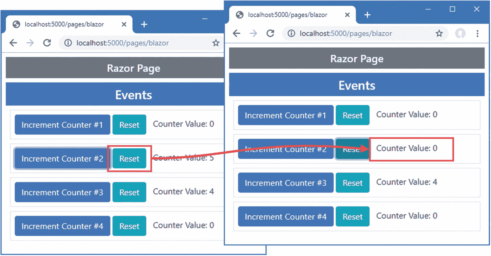

# 三十二、使用 Blazor 服务器：第 1 部分

Blazor 是 ASP.NET Core 的新成员，它为 web 应用增加了客户端交互性。有两种 Blazor，在这一章中，我将重点介绍 Blazor 服务器。我解释它解决的问题以及它是如何工作的。我将向您展示如何配置一个 ASP.NET Core 应用来使用 Blazor 服务器，并描述使用 Razor 组件时可用的基本特性，Razor 组件是 Blazor 服务器项目的构建块。我在第 [34 章](34.html)–[36 章](36.html)中描述了更高级的 Blazor 服务器特性，在第 [37 章](37.html)中，我描述了 Blazor WebAssembly，它是 Blazor 的另一个变种。表 [33-1](#Tab1) 将 Blazor 服务器放在上下文中。

表 33-1。

将 Blazor 服务器放在上下文中

<colgroup><col class="tcol1 align-left"> <col class="tcol2 align-left"></colgroup> 
| 

问题

 | 

回答

 |
| --- | --- |
| 这是什么？ | Blazor 服务器使用 JavaScript 接收浏览器事件，这些事件被转发到 ASP.NET Core，并使用 C# 代码进行评估。事件对应用状态的影响被发送回浏览器并显示给用户。 |
| 为什么有用？ | 与标准 web 应用相比，Blazor Server 可以提供更丰富、响应更迅速的用户体验。 |
| 如何使用？ | Blazor 服务器的构建块是 Razor 组件，它使用类似于 Razor 页面的语法。Razor 组件的视图部分包含指定应用如何响应用户交互的特殊属性。 |
| 有什么陷阱或限制吗？ | Blazor 服务器依赖于与服务器的持久 HTTP 连接，当连接中断时无法运行。老版本的浏览器不支持 Blazor 服务器。 |
| 还有其他选择吗？ | 本书第 3 部分描述的特性可用于创建工作广泛但响应性较差的 web 应用。您也可以考虑客户端 JavaScript 框架，比如 Angular、React 或 Vue.js。 |

表 [33-2](#Tab2) 总结了本章内容。

表 33-2。

章节总结

<colgroup><col class="tcol1 align-left"> <col class="tcol2 align-left"> <col class="tcol3 align-left"></colgroup> 
| 

问题

 | 

解决办法

 | 

列表

 |
| --- | --- | --- |
| 配置 Blazor | 使用`AddServerSideBlazor`和`MapBlazorHub`方法设置所需的服务和中间件，并配置 JavaScript 文件 | 3–6 |
| 创建 Blazor 组件 | 创建一个`.blazor`文件，并使用它来定义代码和标记 | seven |
| 应用组件 | 使用一个`component`元素 | 8, 9 |
| 处理事件 | 使用属性指定将处理事件的方法或表达式 | 10–15 |
| 创建与元素的双向关系 | 创建数据绑定 | 16–20 |
| 将代码与标记分开定义 | 使用代码隐藏类 | 21–23 |
| 定义没有声明性标记的组件 | 使用 Razor 组件类 | 24, 25 |

## 为本章做准备

本章使用第 [32 章](32.html)中的高级项目。准备本章不需要做任何改动。

Tip

你可以从 [`https://github.com/apress/pro-asp.net-core-3`](https://github.com/apress/pro-asp.net-core-3) 下载本章以及本书其他章节的示例项目。如果在运行示例时遇到问题，请参见第 [1](01.html) 章获取帮助。

打开一个新的 PowerShell 命令提示符，导航到包含`Advanced.csproj`文件的文件夹，运行清单 [33-1](#PC1) 中所示的命令来删除数据库。

```cs
dotnet ef database drop --force

Listing 33-1.Dropping the Database

```

从 Debug 菜单中选择 Start Without Debugging 或 Run Without Debugging，或者使用 PowerShell 命令提示符运行清单 [33-2](#PC2) 中所示的命令。

```cs
dotnet run

Listing 33-2.Running the Example Application

```

使用浏览器请求`http://localhost:5000/controllers`，将显示数据项列表。从下拉列表中选择一个城市，点击选择按钮高亮显示元素，如图 [33-1](#Fig1) 所示。


图 33-1。

运行示例应用

## 了解 Blazor 服务器

考虑当您选择一个城市并单击示例应用提供的选择按钮时会发生什么。浏览器发送一个提交表单的 HTTP GET 请求，该请求由 action 方法或 handler 方法接收，这取决于您使用的是控制器还是 Razor 页面。该动作或处理程序呈现其视图，该视图向浏览器发送一个反映选择的新 HTML 文档，如图 [33-2](#Fig2) 所示。


图 33-2。

与示例应用交互

这种循环是有效的，但也可能是低效的。每次单击提交按钮时，浏览器都会向 ASP.NET Core 发送一个新的 HTTP 请求。每个请求都包含一组完整的 HTTP 头，这些头描述了请求和浏览器愿意接收的响应类型。在其响应中，服务器包括描述响应的 HTTP 头，并包括供浏览器显示的完整 HTML 文档。

在我的系统上，示例应用发送的数据量大约为 3KB，并且几乎所有的数据在请求之间都是重复的。浏览器只想告诉服务器哪个城市被选中了，服务器只想指明哪些表格行应该高亮显示；但是，每个 HTTP 请求都是独立的，所以浏览器每次都必须解析一个完整的 HTML 文档。每个交互的根本问题都是一样的:发送一个请求，然后得到一个完整的 HTML 文档作为回报。

Blazor 采取了不同的方法。发送到浏览器的 HTML 文档中包含一个 JavaScript 库。当 JavaScript 代码被执行时，它打开一个返回到服务器的 HTTP 连接，并让它保持打开状态，为用户交互做好准备。例如，当用户使用 select 元素选择一个值时，选择的细节被发送到服务器，服务器只响应应用于现有 HTML 的更改，如图 [33-3](#Fig3) 所示。


图 33-3。

与布拉索互动

持久的 HTTP 连接可以最小化延迟，只回复差异可以减少浏览器和服务器之间发送的数据量。

### 了解 Blazor 服务器的优势

Blazor 最大的吸引力在于它基于用 C# 编写的 Razor 页面。这意味着您可以提高效率和响应能力，而不必学习新的框架，如 Angular 或 React，以及新的语言，如 TypeScript 或 JavaScript。Blazor 很好地集成到了 ASP.NET Core 的其余部分，并建立在前面章节描述的功能之上，这使得它很容易使用(特别是与 Angular 这样的框架相比，它有一个令人眩晕的陡峭的学习曲线)。

### 了解 Blazor 服务器的缺点

Blazor 需要一个现代化的浏览器来建立和维护它的持久 HTTP 连接。而且，由于这种连接，如果连接丢失，使用 Blazor 的应用将停止工作，这使它们不适合离线使用，在离线使用时，连接不可靠或连接很慢。这些问题由 Blazor WebAssembly 解决，在第 [36 章](36.html)中描述，但是，正如我解释的，这有它自己的一套限制。

### 在 Blazor 服务器和 Angular/React/Vue.js 之间选择

Blazor 和其中一个 JavaScript 框架之间的决定应该由开发团队的经验和用户预期的连接性来决定。如果你没有 JavaScript 专业知识，也没有使用过任何一个 JavaScript 框架，那么你应该使用 Blazor，但前提是你可以依赖良好的连接性和现代浏览器。这使得 Blazor 成为业务线应用的良好选择，例如，可以预先确定浏览器的人口统计和网络质量。

如果您有 JavaScript 经验，并且正在编写面向公众的应用，那么您应该使用 JavaScript 框架之一，因为您无法对浏览器或网络质量做出假设。(选择哪个框架并不重要——我写过 Angular、React、View 的书，都很优秀。对于选择一个框架，我的建议是在每个框架中创建一个简单的应用，并选择其开发模式最吸引你的一个。)

如果您正在编写面向公众的应用，并且没有 JavaScript 经验，那么您有两个选择。最安全的选择是坚持前面章节描述的 ASP.NET Core 特性，并接受这可能带来的低效率。这并不是一个糟糕的选择，您仍然可以开发出高质量的应用。更苛刻的选择是学习 TypeScript 或 JavaScript 和 one Angular、React 或 vue . js——但不要低估掌握 JavaScript 所需的时间或这些框架的复杂性。

## Blazor 入门

开始使用 Blazor 的最佳方式是直接投入使用。在接下来的小节中，我将配置应用来启用 Blazor，并重新创建控制器和 Razor 页面提供的功能。之后，我将回到基础知识，解释剃须刀组件如何工作，以及它们提供的不同功能。

### 为 Blazor 服务器配置 ASP.NET Core

在使用 Blazor 之前需要进行准备。第一步是将服务和中间件添加到`Startup`类中，如清单 [33-3](#PC3) 所示。

```cs
using System;
using System.Collections.Generic;
using System.Linq;
using System.Threading.Tasks;
using Microsoft.AspNetCore.Builder;
using Microsoft.AspNetCore.Hosting;
using Microsoft.AspNetCore.Http;
using Microsoft.Extensions.DependencyInjection;
using Microsoft.Extensions.Hosting;
using Microsoft.Extensions.Configuration;
using Microsoft.EntityFrameworkCore;
using Advanced.Models;

namespace Advanced {
    public class Startup {

        public Startup(IConfiguration config) {
            Configuration = config;
        }

        public IConfiguration Configuration { get; set; }

        public void ConfigureServices(IServiceCollection services) {
            services.AddDbContext<DataContext>(opts => {
                opts.UseSqlServer(Configuration[
                    "ConnectionStrings:PeopleConnection"]);
                opts.EnableSensitiveDataLogging(true);
            });
            services.AddControllersWithViews().AddRazorRuntimeCompilation();
            services.AddRazorPages().AddRazorRuntimeCompilation();
            services.AddServerSideBlazor();
        }

        public void Configure(IApplicationBuilder app, DataContext context) {

            app.UseDeveloperExceptionPage();
            app.UseStaticFiles();
            app.UseRouting();

            app.UseEndpoints(endpoints => {
                endpoints.MapControllerRoute("controllers",
                    "controllers/{controller=Home}/{action=Index}/{id?}");
                endpoints.MapDefaultControllerRoute();
                endpoints.MapRazorPages();
                endpoints.MapBlazorHub();
            });

            SeedData.SeedDatabase(context);
        }
    }
}

Listing 33-3.Adding Services and Middleware in the Startup.cs File in the Advanced Folder

```

`MapBlazorHub`方法中的“中枢”与 SignalR 相关，它是 ASP.NET Core 的一部分，处理持久 HTTP 请求。我没有在本书中描述 SignalR，因为它很少被直接使用，但是如果您需要客户端和服务器之间的持续通信，它会很有用。详见 [`https://docs.microsoft.com/en-gb/aspnet/core/signalr`](https://docs.microsoft.com/en-gb/aspnet/core/signalr) 。对于本书——以及大多数 ASP.NET Core 应用——知道 SignalR 用于管理 Blazor 所依赖的连接就足够了。

#### 将 Blazor JavaScript 文件添加到布局中

Blazor 依靠 JavaScript 代码与 ASP.NET Core 服务器通信。将清单 [33-4](#PC4) 中所示的元素添加到`Views/Shared`文件夹中的`_Layout.cshtml`文件中，以将 JavaScript 文件添加到控制器视图使用的布局中。

```cs
<!DOCTYPE html>
<html>
<head>
    <title>@ViewBag.Title</title>
    <link href="/lib/twitter-bootstrap/css/bootstrap.min.css" rel="stylesheet" />
    <base href="~/" />
</head>
<body>
    <div class="m-2">
        @RenderBody()
    </div>
    <script src="_framework/blazor.server.js"></script>
</body>
</html>

Listing 33-4.Adding Elements in the _Layout.cshtml File in the Views/Shared Folder

```

`script`元素指定了 JavaScript 文件的名称，对它的请求被添加到清单 [33-3](#PC3) 中的请求管道中的中间件拦截，因此不需要额外的包来将 JavaScript 代码添加到项目中。还必须添加`base`元素来指定应用的根 URL。同样的元素必须被添加到 Razor 页面的布局中，如清单 [33-5](#PC5) 所示。

```cs
<!DOCTYPE html>
<html>
<head>
    <title>@ViewBag.Title</title>
    <link href="/lib/twitter-bootstrap/css/bootstrap.min.css" rel="stylesheet" />
    <base href="~/" />
</head>
<body>
    <div class="m-2">
        <h5 class="bg-secondary text-white text-center p-2">Razor Page</h5>
        @RenderBody()
    </div>
    <script src="_framework/blazor.server.js"></script>
</body>
</html>

Listing 33-5.Adding Elements in the _Layout.cshtml File in the Pages Folder

```

#### 创建 Blazor 导入文件

Blazor 需要自己的导入文件来指定它使用的名称空间。很容易忘记将这个文件添加到项目中，但是，如果没有它，Blazor 将会悄悄地失败。在`Advanced`文件夹中添加一个名为`_Imports.razor`的文件，内容如清单 [33-6](#PC6) 所示。(如果你使用的是 Visual Studio，你可以使用 Razor 视图导入模板来创建这个文件，但是要确保你使用了`.razor`文件扩展名。)

```cs
@using Microsoft.AspNetCore.Components
@using Microsoft.AspNetCore.Components.Forms
@using Microsoft.AspNetCore.Components.Routing
@using Microsoft.AspNetCore.Components.Web
@using Microsoft.JSInterop
@using Microsoft.EntityFrameworkCore
@using Advanced.Models

Listing 33-6.The Contents of the _Imports.razor File in the Advanced Folder

```

前五个`@using`表达式用于 Blazor 所需的名称空间。最后两个表达式是为了方便后面的例子，因为它们允许我使用实体框架核心和`Models`名称空间中的类。

### 创建剃须刀组件

术语上有冲突:这项技术是 *Blazor* ，但关键的构建模块被称为*剃须刀组件*。Razor 组件在扩展名为`.razor`的文件中定义，并且必须以大写字母开头。组件可以在任何地方定义，但是它们通常被组合在一起以帮助保持项目的组织性。在`Advanced`文件夹中创建一个`Blazor`文件夹，并在其中添加一个名为`PeopleList.razor`的 Razor 组件，内容如清单 [33-7](#PC7) 所示。

```cs
<table class="table table-sm table-bordered table-striped">
    <thead>
        <tr>
            <th>ID</th><th>Name</th><th>Dept</th><th>Location</th>
        </tr>
    </thead>
    <tbody>
        @foreach (Person p in People) {
            <tr class="@GetClass(p.Location.City)">
                <td>@p.PersonId</td>
                <td>@p.Surname, @p.Firstname</td>
                <td>@p.Department.Name</td>
                <td>@p.Location.City, @p.Location.State</td>
            </tr>
        }
    </tbody>
</table>

<div class="form-group">
    <label for="city">City</label>
    <select name="city" class="form-control" @bind="SelectedCity">
        <option disabled selected>Select City</option>
        @foreach (string city in Cities) {
            <option value="@city" selected="@(city == SelectedCity)">
                @city
            </option>
        }
    </select>
</div>

@code {

    [Inject]
    public DataContext Context { get; set; }

    public IEnumerable<Person> People =>
        Context.People.Include(p => p.Department).Include(p => p.Location);

    public IEnumerable<string> Cities => Context.Locations.Select(l => l.City);

    public string SelectedCity { get; set; }

    public string GetClass(string city) =>
        SelectedCity == city ? "bg-info text-white" : "";
}

Listing 33-7.The Contents of the PeopleList.razor File in the Blazor Folder

```

剃须刀组件类似于剃须刀页。视图部分依赖于您在前面章节中看到的 Razor 特性，使用`@`表达式将数据值插入到组件的 HTML 中，或者为序列中的对象生成元素，如下所示:

```cs
...
@foreach (string city in Cities) {
    <option value="@city" selected="@(city == SelectedCity)">
}
...

```

该`@foreach`表达式为`Cities`序列中的每个值生成`option`元素，并且与第 [32 章](32.html)中创建的控制器视图和 Razor 页面中的等效表达式相同。

尽管剃须刀组件看起来很熟悉，但还是有一些重要的区别。首先是没有页面模型类，没有`@model`表达式。支持组件 HTML 的属性和方法直接在一个`@code`表达式中定义，它是 Razor Page `@functions`表达式的对应部分。例如，为了定义将为视图部分提供`Person`对象的属性，我只需在`@code`部分定义一个`People`属性，如下所示:

```cs
...
public IEnumerable<Person> People =>
    Context.People.Include(p => p.Department).Include(p => p.Location);
...

```

而且，因为没有页面模型类，所以没有构造函数来声明服务依赖关系。相反，依赖注入设置用`Inject`属性修饰的属性值，如下所示:

```cs
...
[Inject]
public DataContext Context { get; set; }
...

```

最显著的区别是在`select`元素上使用了特殊属性。

```cs
...
<select name="city" class="form-control" @bind="SelectedCity">
    <option disabled selected>Select City</option>
...

```

这个 Blazor 属性在`select`元素的值和在`@code`部分中定义的`SelectedCity`属性之间创建一个数据绑定。

我在“使用数据绑定”一节中更详细地描述了数据绑定，但是现在，只要知道当用户改变`select`元素的值时`SelectedCity`的值将被更新就足够了。

#### 使用 Razor 组件

Razor 组件作为 Razor 页面或控制器视图的一部分交付给浏览器。清单 [33-8](#PC12) 展示了如何在控制器视图中使用 Razor 组件。

```cs
@model PeopleListViewModel

<h4 class="bg-primary text-white text-center p-2">People</h4>

<component type="typeof(Advanced.Blazor.PeopleList)" render-mode="Server" />

Listing 33-8.Using a Razor Component in the Index.cshtml File in the Views/Home Folder

```

Razor 组件是使用`component`元素应用的，它有一个标签助手。使用`type`和`render-mode`属性来配置`component`元素。`type`属性用于指定 Razor 组件。Razor 组件被编译成类，就像控制器视图和 Razor 页面一样。`PeopleList`组件是在高级项目的`Blazor`文件夹中定义的，所以类型会是`Advanced.Blazor.PeopleList`，就像这样:

```cs
...
<component type="typeof(Advanced.Blazor.PeopleList)" render-mode="Server" />
...

```

使用表 [33-3](#Tab3) 中描述的`RenderMode`枚举值，`render-mode`属性用于选择组件如何生成内容。

表 33-3。

RenderMode 值

<colgroup><col class="tcol1 align-left"> <col class="tcol2 align-left"></colgroup> 
| 

名字

 | 

描述

 |
| --- | --- |
| `Static` | Razor 组件将其视图部分呈现为没有客户端支持的静态 HTML。 |
| `Server` | HTML 文档连同组件的占位符一起发送到浏览器。组件显示的 HTML 通过持久 HTTP 连接发送到浏览器，并显示给用户。 |
| `ServerPrerendered` | 组件的视图部分包含在 HTML 中，并立即显示给用户。HTML 内容通过持久 HTTP 连接再次发送。 |

对于大多数应用来说，`Server`选项是一个不错的选择。`ServerPrerendered`包括发送到浏览器的 HTML 文档中 Razor 组件视图部分的静态呈现。这充当占位符内容，以便在加载和执行 JavaScript 代码时，用户不会看到空的浏览器窗口。一旦建立了持久 HTTP 连接，占位符内容将被删除，并替换为 Blazor 发送的动态版本。向用户显示静态内容的想法是好的，但它可能会令人困惑，因为 HTML 元素没有连接到应用的服务器端部分，并且一旦活动内容到达，来自用户的任何交互要么不起作用，要么将被丢弃。

要查看 Blazor 的运行情况，重启 ASP.NET Core 并使用浏览器请求`http://localhost:5000/controllers`。使用 Blazor 时不需要提交表单，因为一旦`select`元素的值改变，数据绑定就会响应，如图 [33-4](#Fig4) 所示。


图 33-4。

使用 Razor 组件

当您使用`select`元素时，您选择的值通过持久 HTTP 连接发送到 ASP.NET Core 服务器，它更新 Razor 组件的`SelectedCity`属性并重新呈现 HTML 内容。一组更新被发送给 JavaScript 代码，后者更新该表。

Razor 组件也可以用在 Razor 页中。在`Pages`文件夹中添加一个名为`Blazor.cshtml`的 Razor 页面，并添加清单 [33-9](#PC14) 所示的内容。

```cs
@page "/pages/blazor"

<script type="text/javascript">
    window.addEventListener("DOMContentLoaded", () => {
        document.getElementById("markElems").addEventListener("click", () => {
            document.querySelectorAll("td:first-child")
                .forEach(elem => {
                    elem.innerText = `M:${elem.innerText}`
                    elem.classList.add("border", "border-dark");
                });
        });
    });
</script>

<h4 class="bg-primary text-white text-center p-2">Blazor People</h4>

<button id="markElems" class="btn btn-outline-primary mb-2">Mark Elements</button>

<component type="typeof(Advanced.Blazor.PeopleList)" render-mode="Server" />

Listing 33-9.The Contents of the Blazor.cshtml File in the Pages Folder

```

清单 [33-9](#PC14) 中的 Razor 页面包含额外的 JavaScript 代码，有助于演示只发送变更，而不是一个全新的 HTML 表格。重启 ASP.NET Core 并请求`http://localhost:5000/pages/blazor`。单击标记元素按钮，ID 列中的单元格将被更改以显示不同的内容和边框。现在使用`select`元素选择一个不同的城市，你会看到表中的元素被修改而没有被删除，如图 [33-5](#Fig5) 所示。


图 33-5。

证明只使用了变更

UNDERSTANDING BLAZOR CONNECTION MESSAGES

当您停止 ASP.NET Core 时，您将在浏览器窗口中看到一条错误消息，指示与服务器的连接已丢失，用户无法与显示的组件进行交互。Blazor 将尝试重新连接，并在临时网络问题导致断开连接时从中断的地方重新开始，但当服务器停止或重新启动时，它将无法这样做，因为连接的上下文数据已经丢失；您必须明确请求一个新的 URL。

在连接消息中有一个默认的 reload 链接，但是这个链接指向网站的默认 URL，这对于本书来说是没有用的，在本书中，我会将您引导到特定的 URL 来查看示例的效果。有关如何配置连接消息的详细信息，请参见第 [34](34.html) 章。

## 了解剃须刀组件的基本功能

既然我已经演示了如何使用 Blazor 以及它是如何工作的，那么是时候回到基础知识并介绍 Razor 组件提供的特性了。尽管上一节中的示例展示了如何使用 Blazor 再现标准的 ASP.NET Core 特性，但是还有更广泛的特性可供使用。

### 了解 Blazor 事件和数据绑定

事件允许 Razor 组件响应用户交互，Blazor 使用持久的 HTTP 连接将事件的详细信息发送到服务器，在服务器上进行处理。要查看 Blazor 事件的运行情况，将一个名为`Events.razor`的 Razor 组件添加到`Blazor`文件夹中，其内容如清单 [33-10](#PC15) 所示。

```cs
<div class="m-2 p-2 border">
    <button class="btn btn-primary" @onclick="IncrementCounter">Increment</button>
    <span class="p-2">Counter Value: @Counter</span>
</div>

@code {
    public int Counter { get; set; } = 1;

    public void IncrementCounter(MouseEventArgs e) {
        Counter++;
    }
}

Listing 33-10.The Contents of the Events.razor File in the Blazor Folder

```

通过向 HTML 元素添加属性来注册事件的处理程序，其中属性名是`@on`，后跟事件名。在本例中，我为由`button`元素生成的`click`事件设置了一个处理程序，如下所示:

```cs
...
<button class="btn btn-primary" @onclick="IncrementCounter">Increment</button>
...

```

分配给该属性的值是触发事件时将调用的方法的名称。该方法可以定义一个可选参数，该参数可以是`EventArgs`类的一个实例，也可以是从`EventArgs`派生的一个类，该类提供关于事件的附加信息。

对于`onclick`事件，处理程序方法接收一个`MouseEventArgs`对象，该对象提供额外的细节，比如点击的屏幕坐标。表 [33-4](#Tab4) 列出了事件描述事件和使用它们的事件。

表 33-4。

EventArgs 类及其代表的事件

<colgroup><col class="tcol1 align-left"> <col class="tcol2 align-left"></colgroup> 
| 

班级

 | 

事件

 |
| --- | --- |
| `ChangeEventArgs` | `onchange`，`oninput` |
| `ClipboardEventArgs` | `oncopy`、`oncut`、`onpaste` |
| `DragEventArgs` | `ondrag`、`ondragend`、`ondragenter`、`ondragleave`、`ondragover`、`ondragstart`、`ondrop` |
| `ErrorEventArgs` | `onerror` |
| `FocusEventArgs` | `onblur`、`onfocus`、`onfocusin`、`onfocusout` |
| `KeyboardEventArgs` | `onkeydown`、`onkeypress`、`onkeyup` |
| `MouseEventArgs` | `onclick`、`oncontextmenu`、`ondblclick`、`onmousedown`、`onmousemove`、`onmouseout`、`onmouseover`、`onmouseup`、`onmousewheel`、`onwheel` |
| `PointerEventArgs` | `ongotpointercapture`、`onlostpointercapture`、`onpointercancel`、`onpointerdown`、`onpointerenter`、`onpointerleave`、`onpointermove`、`onpointerout`、`onpointerover`、`onpointerup` |
| `ProgressEventArgs` | `onabort`、`onload`、`onloadend`、`onloadstart`、`onprogress`、`ontimeout` |
| `TouchEventArgs` | `ontouchcancel`、`ontouchend`、`ontouchenter`、`ontouchleave`、`ontouchmove`、`ontouchstart` |
| `EventArgs` | `onactivate`，`onbeforeactivate`，`onbeforecopy`，`onbeforecut`，`onbeforedeactivate`，`onbeforepaste`，`oncanplay`，`oncanplaythrough`，`oncuechange`，`ondeactivate`，`ondurationchange`，`onemptied`，`onended`，`onfullscreenchange`，`onfullscreenerror`，`oninvalid`，`onloadeddata`，`onloadedmetadata`，`onpause`，`onplay`，`onplaying`，`onpointerlockchange`，`onpointerlockerror`，`onratechange`，`onreadystatechange`，`onreset`，`onscroll`，`onscroll`，】 |

Blazor JavaScript 代码在事件被触发时接收该事件，并通过持久 HTTP 连接将其转发给服务器。调用处理程序方法，并更新组件的状态。对组件的视图部分产生的内容的任何更改都将被发送回 JavaScript 代码，该代码将更新浏览器显示的内容。

在这个例子中，`click`事件将由`IncrementCounter`方法处理，该方法改变了`Counter`属性的值。`Counter`属性的值包含在组件呈现的 HTML 中，因此 Blazor 将更改发送到浏览器，以便 JavaScript 代码可以更新显示给用户的 HTML 元素。为了显示`Events`组件，替换`Pages`文件夹中`Blazor.cshtml`文件的内容，如清单 [33-11](#PC17) 所示。

```cs
@page "/pages/blazor"

<h4 class="bg-primary text-white text-center p-2">Events</h4>

<component type="typeof(Advanced.Blazor.Events)" render-mode="Server" />

Listing 33-11.Using a New Component in the Blazor.cshtml File in the Pages Folder

```

清单 [33-11](#PC17) 更改了 component 元素的`type`属性，并删除了自定义 JavaScript 和我在前面的示例中用来标记元素的`button`元素。重启 ASP.NET Core 并请求`http://localhost:5000/pages/blazor`查看新组件。点击增量按钮，Blazor JavaScript 代码将接收到`click`事件，并通过`IncrementCounter`方法发送给服务器进行处理，如图 [33-6](#Fig6) 所示。


图 33-6。

处理事件

#### 处理来自多个元素的事件

为了避免代码重复，来自多个元素的元素可以由一个处理程序方法接收，如清单 [33-12](#PC18) 所示。

```cs
<div class="m-2 p-2 border">
    <button class="btn btn-primary" @onclick="@(e => IncrementCounter(e, 0))">
        Increment Counter #1
    </button>
    <span class="p-2">Counter Value: @Counter[0]</span>
</div>

<div class="m-2 p-2 border">
    <button class="btn btn-primary" @onclick="@(e => IncrementCounter(e, 1))">
        Increment Counter #2
    </button>
    <span class="p-2">Counter Value: @Counter[1]</span>
</div>

@code {
    public int[] Counter { get; set; } = new int[] { 1, 1 };

    public void IncrementCounter(MouseEventArgs e, int index) {
        Counter[index]++;
    }
}

Listing 33-12.Handling Events in the Events.razor File in the Blazor Folder

```

Blazor 事件属性可以与 lambda 函数一起使用，这些函数接收`EventArgs`对象并调用带有附加参数的处理程序方法。在这个例子中，我向`IncrementCounter`方法添加了一个`index`参数，用于确定应该更新哪个计数器值。参数的值在`@onclick`属性中定义，如下所示:

```cs
...
<button class="btn btn-primary" @onclick="@(e => IncrementCounter(e, 0))">
...

```

当以编程方式生成元素时，也可以使用这种技术，如清单 [33-13](#PC26) 所示。在这个例子中，我使用一个`@for`表达式来生成元素，并使用循环变量作为 handler 方法的参数。我还从 handler 方法中移除了`EventArgs`参数，它没有被使用。

AVOIDING THE HANDLER METHOD NAME PITFALL

指定事件处理程序方法时最常见的错误是包含括号，如下所示:

```cs
...
<button class="btn btn-primary" @onclick="IncrementCounter()">
...

```

由此产生的错误消息将取决于事件处理程序的方法。您可能会看到一个警告，告诉您缺少一个形参，或者`void`不能转换为`EventCallback`。指定处理程序方法时，必须仅指定事件名称，如下所示:

```cs
...
<button class="btn btn-primary" @onclick="IncrementCounter">
...

```

您可以将方法名称指定为 Razor 表达式，如下所示:

```cs
...
<button class="btn btn-primary" @onclick="@IncrementCounter">
...

```

一些开发人员发现这更容易解析，但结果是一样的。使用 lambda 函数时适用一组不同的规则，必须在 Razor 表达式中定义，如下所示:

```cs
...
<button class="btn btn-primary" @onclick="@( ... )">
...

```

在 Razor 表达式中，lambda 函数的定义就像在 C# 类中一样，这意味着定义参数，后跟“转到”箭头，再跟函数体，如下所示:

```cs
...
<button class="btn btn-primary" @onclick="@((e) => HandleEvent(e, local))">
...

```

如果你不需要使用`EventArgs`对象，那么你可以省略 lambda 函数中的参数，就像这样:

```cs
...
<button class="btn btn-primary" @onclick="@(() => IncrementCounter(local))">
...

```

当你开始使用 Blazor 时，你会很快习惯这些规则，即使它们起初看起来不一致。

```cs
@for (int i = 0; i < ElementCount; i++) {
    int local = i;
    <div class="m-2 p-2 border">
        <button class="btn btn-primary" @onclick="@(() => IncrementCounter(local))">
            Increment Counter #@(i + 1)
        </button>
        <span class="p-2">Counter Value: @GetCounter(i)</span>
    </div>
}

@code {
    public int ElementCount { get; set; } = 4;

    public Dictionary<int, int> Counters { get; } = new Dictionary<int, int>();

    public int GetCounter(int index) =>
        Counters.ContainsKey(index) ? Counters[index] : 0;

    public void IncrementCounter(int index)  =>
        Counters[index] = GetCounter(index) + 1;
}

Listing 33-13.Generating Elements in the Events.razor File in the Blazor Folder

```

关于事件处理程序，需要理解的重要一点是，在服务器从浏览器接收到`click`事件之前，不会计算`@onclick` lambda 函数。这意味着必须小心不要使用循环变量`i`作为`IncrementCounter`方法的参数，因为它总是循环产生的最终值，在这种情况下就是`4`。相反，您必须在局部变量中捕获循环变量，如下所示:

```cs
...
int local = i;
...

```

然后，局部变量被用作属性中事件处理程序方法的参数，如下所示:

```cs
...
<button class="btn btn-primary" @onclick="@(() => IncrementCounter(local))">
...

```

局部变量为每个生成的元素固定 lambda 函数的值。重启 ASP.NET Core，使用浏览器请求`http://localhost:5000/pages/blazor`，将产生如图 [33-7](#Fig7) 所示的响应。由所有`button`元素产生的`click`事件由相同的方法处理，但是由 lambda 函数提供的参数确保正确的计数器被更新。


图 33-7。

处理来自多个元素的事件

#### 不使用处理程序方法处理事件

简单的事件处理可以直接在 lambda 函数中完成，不需要使用处理程序方法，如清单 [33-14](#PC29) 所示。

```cs
@for (int i = 0; i < ElementCount; i++) {
    int local = i;
    <div class="m-2 p-2 border">
        <button class="btn btn-primary" @onclick="@(() => IncrementCounter(local))">
            Increment Counter #@(i + 1)
        </button>
        <button class="btn btn-info" @onclick="@(() => Counters.Remove(local))">
                Reset
        </button>
        <span class="p-2">Counter Value: @GetCounter(i)</span>
    </div>
}

@code {
    public int ElementCount { get; set; } = 4;

    public Dictionary<int, int> Counters { get; } = new Dictionary<int, int>();

    public int GetCounter(int index) =>
        Counters.ContainsKey(index) ? Counters[index] : 0;

    public void IncrementCounter(int index)  =>
        Counters[index] = GetCounter(index) + 1;
}

Listing 33-14.Handling Events in the Events.razor File in the Blazor Folder

```

复杂的处理程序应该被定义为方法，但是这种方法对于简单的处理程序更简洁。重启 ASP.NET Core 并请求`http://localhost:5000/pages/blazor`。重置按钮从`Counters`集合中移除值，而不依赖于组件的`@code`部分中的方法，如图 [33-8](#Fig8) 所示。



图 33-8。

在 lambda 表达式中处理事件

#### 防止默认事件和事件传播

Blazor 提供了两个属性来改变浏览器中事件的默认行为，如表 [33-5](#Tab5) 所述。这些属性被称为*参数*，事件的名称后跟一个冒号，然后是一个关键字。

表 33-5。

事件配置参数

<colgroup><col class="tcol1 align-left"> <col class="tcol2 align-left"></colgroup> 
| 

名字

 | 

描述

 |
| --- | --- |
| `@on{event}:preventDefault` | 此参数确定是否触发元素的默认事件。 |
| `@on{event}:stopPropagation` | 此参数确定事件是否传播到其祖先元素。 |

清单 [33-15](#PC30) 展示了这些参数的作用以及它们为什么有用。

```cs
<form action="/pages/blazor" method="get">
    @for (int i = 0; i < ElementCount; i++) {
        int local = i;
        <div class="m-2 p-2 border">
            <button class="btn btn-primary"
                @onclick="@(() => IncrementCounter(local))"
                @onclick:preventDefault="EnableEventParams">
                    Increment Counter #@(i + 1)
            </button>
            <button class="btn btn-info" @onclick="@(() => Counters.Remove(local))">
                    Reset
            </button>
            <span class="p-2">Counter Value: @GetCounter(i)</span>
        </div>
    }
</form>

<div class="m-2" @onclick="@(() => IncrementCounter(1))">
    <button class="btn btn-primary" @onclick="@(() => IncrementCounter(0))"
            @onclick:stopPropagation="EnableEventParams">Propagation Test</button>
</div>

<div class="form-check m-2">
    <input class="form-check-input" type="checkbox"
           @onchange="@(() => EnableEventParams = !EnableEventParams)" />
    <label class="form-check-label">Enable Event Parameters</label>
</div>

@code {
    public int ElementCount { get; set; } = 4;

    public Dictionary<int, int> Counters { get; } = new Dictionary<int, int>();

    public int GetCounter(int index) =>
        Counters.ContainsKey(index) ? Counters[index] : 0;

    public void IncrementCounter(int index)  =>
        Counters[index] = GetCounter(index) + 1;

    public bool EnableEventParams { get; set; } = false;
}

Listing 33-15.Overriding Event Defaults in the Events.razor File in the Blazor Folder

```

此示例创建了两种情况，在这两种情况下，浏览器中事件的默认行为会导致问题。第一个是添加一个`form`元素引起的。默认情况下，包含在表单中的`button`元素将在被点击时提交该表单，即使存在`@onclick`属性。这意味着，每当点击一个增量计数器按钮时，浏览器将把表单数据发送到 ASP.NET Core 服务器，后者将使用`Blazor.cshtml` Razor 页面的内容进行响应。

第二个问题由一个元素演示，该元素的父元素也定义了一个事件处理程序，如下所示:

```cs
...
<div class="m-2" @onclick="@(() => IncrementCounter(1))">
    <button class="btn btn-primary" @onclick="@(() => IncrementCounter(0))"
...

```

事件在浏览器中经历一个定义明确的生命周期，包括沿着祖先元素链向上传递。在本例中，这意味着单击`button`将导致两个计数器被更新，一次由`button`元素的`@onclick`处理程序更新，一次由`@onclick`处理程序更新，用于包含的`div`元素。

要查看这些问题，请重启 ASP.NET Core 并请求`http://localhost:5000/pages/blazor`。单击增量计数器按钮；您将看到表单被提交，页面实际上被重新加载。单击传播测试按钮，您将看到两个计数器被更新。图 [33-9](#Fig9) 显示了这两个问题。


图 33-9。

浏览器中事件的默认行为导致的问题

清单 [33-15](#PC30) 中的复选框切换应用表 [33-5](#Tab5) 中描述的参数的属性，结果是表单没有被提交，只有按钮元素上的处理程序接收事件。要查看效果，勾选复选框，然后点击递增计数器按钮和传播测试按钮，产生如图 [33-10](#Fig10) 所示的结果。


图 33-10。

在浏览器中覆盖事件的默认行为

### 使用数据绑定

事件处理程序和 Razor 表达式可用于创建 HTML 元素和 C# 值之间的双向关系，这对于允许用户进行更改的元素非常有用，例如`input`和`select`元素。将名为`Bindings.razor`的剃须刀组件添加到`Blazor`文件夹中，内容如清单 [33-16](#PC32) 所示。

```cs
<div class="form-group">
    <label>City:</label>
    <input class="form-control" value="@City" @onchange="UpdateCity" />
</div>
<div class="p-2 mb-2">City Value: @City</div>
<button class="btn btn-primary" @onclick="@(() => City = "Paris")">Paris</button>
<button class="btn btn-primary" @onclick="@(() => City = "Chicago")">Chicago</button>

@code {

    public string City { get; set; } = "London";

    public void UpdateCity(ChangeEventArgs e) {
        City = e.Value as string;
    }
}

Listing 33-16.The Contents of the Bindings.razor File in the Blazor Folder

```

`@onchange`属性将`UpdateCity`方法注册为来自`input`元素的`change`事件的处理器。使用`ChangeEventArgs`类描述事件，该类提供了一个`Value`属性。每次接收到一个`change`事件时，`City`属性就会用`input`元素的内容进行更新。

`input`元素的`value`属性创建另一个方向的关系，因此当`City`属性的值改变时，元素的`value`属性也会改变，从而改变显示给用户的文本。要应用新的 Razor 组件，在 Razor 页面中更改`component`属性，如清单 [33-17](#PC33) 所示。

```cs
@page "/pages/blazor"

<h4 class="bg-primary text-white text-center p-2">Events</h4>

<component type="typeof(Advanced.Blazor.Bindings)" render-mode="Server" />

Listing 33-17.Using a Razor Component in the Blazor.cshtml File in the Pages Folder

```

要查看清单 [33-16](#PC32) 中绑定定义的关系的两个部分，重启 ASP.NET Core，导航到`http://localhost:5000/pages/blazor`，编辑`input`元素的内容。只有当`input`元素失去焦点时，才会触发`change`事件，所以一旦您完成编辑，按 Tab 键或在`input`元素外单击；您将看到您输入的值通过`div`元素中的 Razor 表达式显示出来，如图 [33-11](#Fig11) 左侧所示。点击其中一个按钮，`City`属性将变为`Paris`或`Chicago`，选择的值将同时由`div`元素和`input`元素显示，如右图所示。


图 33-11。

在柠檬和财产之间建立双向关系

涉及到`change`事件的双向关系可以表示为数据绑定，这允许用一个属性来配置值和事件，如清单 [33-18](#PC34) 所示。

```cs
<div class="form-group">
    <label>City:</label>
    <input class="form-control" @bind="City" />
</div>
<div class="p-2 mb-2">City Value: @City</div>
<button class="btn btn-primary" @onclick="@(() => City = "Paris")">Paris</button>
<button class="btn btn-primary" @onclick="@(() => City = "Chicago")">Chicago</button>

@code {

    public string City { get; set; } = "London";

    //public void UpdateCity(ChangeEventArgs e) {
    //    City = e.Value as string;
    //}
}

Listing 33-18.Using a Data Binding in the Bindings.razor File in the Blazor Folder

```

`@bind`属性用于指定当变更事件被触发时将被更新的属性，以及当它改变时将更新`value`属性的属性。清单 [33-18](#PC34) 中的效果与清单 [33-16](#PC32) 中的效果相同，但表达得更简洁，不需要处理程序方法或 lambda 函数来更新属性。

#### 更改绑定事件

默认情况下，`change`事件用于绑定，它为用户提供了合理的响应，而不需要服务器进行太多的更新。绑定中使用的事件可以通过使用表 [33-6](#Tab6) 中描述的属性进行更改。

表 33-6。

用于指定事件的绑定属性

<colgroup><col class="tcol1 align-left"> <col class="tcol2 align-left"></colgroup> 
| 

属性

 | 

描述

 |
| --- | --- |
| `@bind-value` | 此属性用于选择数据绑定的属性。 |
| `@bind-value:event` | 此属性用于选择数据绑定的事件。 |

这些属性被用来代替`@bind`，如清单 [33-19](#PC35) 所示，但是只能用于用`ChangeEventArgs`类表示的事件。这意味着至少在当前版本中，只能使用`onchange`和`oninput`事件。

```cs
<div class="form-group">
    <label>City:</label>
    <input class="form-control" @bind-value="City" @bind-value:event="oninput"  />
</div>
<div class="p-2 mb-2">City Value: @City</div>
<button class="btn btn-primary" @onclick="@(() => City = "Paris")">Paris</button>
<button class="btn btn-primary" @onclick="@(() => City = "Chicago")">Chicago</button>

@code {
    public string City { get; set; } = "London";
}

Listing 33-19.Specifying an Event for a Binding in the Bindings.razor File in the Blazor Folder

```

这种属性组合为`City`属性创建了一个绑定，当`oninput`事件被触发时，该属性被更新，这发生在每次击键之后，而不仅仅是当`input`元素失去焦点时。要查看效果，重启 ASP.NET Core，导航到`http://localhost:5000/pages/blazor`，并开始输入`input`元素。每次击键后都会更新`City`属性，如图 [33-12](#Fig12) 所示。


图 33-12。

更改数据绑定中的事件

#### 创建日期时间绑定

Blazor 特别支持为`DateTime`属性创建绑定，允许使用特定的文化或格式字符串来表达它们。使用表 [33-7](#Tab7) 中描述的参数应用该功能。

表 33-7。

日期时间参数

<colgroup><col class="tcol1 align-left"> <col class="tcol2 align-left"></colgroup> 
| 

名字

 | 

描述

 |
| --- | --- |
| `@bind:culture` | 该属性用于选择一个用于格式化`DateTime`值的`CultureInfo`对象。 |
| `@bind:format` | 该属性用于指定将用于格式化`DateTime`值的数据格式化字符串。 |

Tip

如果您已经使用了`@bind-value`和`@bind-value:event`属性来选择事件，那么您必须使用`@bind-value:culture`和`@bind-value:format`参数来代替。

清单 [33-20](#PC36) 展示了这些属性与`DateTime`属性的用法。

Note

这些例子中使用的格式字符串在 [`https://docs.microsoft.com/en-us/dotnet/api/system.datetime?view=netcore-3.1`](https://docs.microsoft.com/en-us/dotnet/api/system.datetime%253Fview%253Dnetcore-3.1) 中描述。

```cs
@using System.Globalization

<div class="form-group">
    <label>City:</label>
    <input class="form-control" @bind-value="City" @bind-value:event="oninput"  />
</div>
<div class="p-2 mb-2">City Value: @City</div>
<button class="btn btn-primary" @onclick="@(() => City = "Paris")">Paris</button>
<button class="btn btn-primary" @onclick="@(() => City = "Chicago")">Chicago</button>

<div class="form-group mt-2">
    <label>Time:</label>
    <input class="form-control my-1" @bind="Time" @bind:culture="Culture"
        @bind:format="MMM-dd" />
    <input class="form-control my-1" @bind="Time" @bind:culture="Culture" />
    <input class="form-control" type="date" @bind="Time" />
</div>
<div class="p-2 mb-2">Time Value: @Time</div>

<div class="form-group">
    <label>Culture:</label>
    <select class="form-control" @bind="Culture">
        <option value="@CultureInfo.GetCultureInfo("en-us")">en-US</option>
        <option value="@CultureInfo.GetCultureInfo("en-gb")">en-GB</option>
        <option value="@CultureInfo.GetCultureInfo("fr-fr")">fr-FR</option>
    </select>
</div>

@code {
    public string City { get; set; } = "London";

    public DateTime Time { get; set; } = DateTime.Parse("2050/01/20 09:50");

    public CultureInfo Culture { get; set; } = CultureInfo.GetCultureInfo("en-us");
}

Listing 33-20.Using a DateTime Property in the Bindings.razor File in the Blazor Folder

```

有三个输入元素用于显示相同的`DataTime`值，其中两个已经使用表 [33-7](#Tab7) 中的属性进行了配置。第一个元素已配置了区域性和格式字符串，如下所示:

```cs
...
<input class="form-control my-1" @bind="Time" @bind:culture="Culture"
        @bind:format="MMM-dd" />
...

```

使用在`select`元素中选取的区域性以及显示月份缩写名称和数字日期的格式字符串来显示`DateTime`属性。第二个`input`元素只指定了一个文化，这意味着将使用默认的格式字符串。

```cs
...
<input class="form-control my-1" @bind="Time" @bind:culture="Culture" />
...

```

要查看日期是如何显示的，重新启动 ASP.NET Core，请求`http://localhost:5000/pages/blazor`，并使用`select`元素选择不同的文化设置。可用设置表示美国使用的英语、英国使用的英语和法国使用的法语。图 [33-13](#Fig13) 显示了各自产生的格式。


图 33-13。

格式化日期时间值

本例中的初始语言环境是`en-US`。当您切换到`en-GB`时，月份和日期出现的顺序会改变。当你切换到`en-FR`时，缩写的月份名称会改变。

LETTING THE BROWSER FORMAT DATES

请注意，无论您选择什么语言环境，清单 [33-20](#PC36) 中第三个`input`元素显示的值都不会改变。这个`input`元素没有表 [33-7](#Tab7) 中描述的属性，但是它的`type`属性被设置为`date`，如下所示:

```cs
...
<input class="form-control" type="date" @bind="Time" />
...

```

当将 type 属性设置为`date`、`datetime-local`、`month`或`time`时，不应该指定文化或格式字符串，因为 Blazor 会自动将日期值格式化为浏览器翻译成用户区域设置的非特定文化格式。图 [33-11](#Fig11) 显示了日期在`en-US`地区是如何格式化的，但是用户将会看到以他们当地惯例表示的日期。

## 使用类文件定义组件

如果您不喜欢 Razor 组件支持的代码和标记的混合，您可以使用 C# 类文件来定义组件的一部分或全部。

### 使用代码隐藏类

Razor 组件的`@code`部分可以在一个单独的类文件中定义，称为*代码隐藏类*或*代码隐藏文件*。Razor 组件的代码隐藏类被定义为与它们提供代码的组件同名的`partial`类。

将名为`Split.razor`的剃须刀组件添加到`Blazor`文件夹中，内容如清单 [33-21](#PC40) 所示。

```cs
<ul class="list-group">
    @foreach (string name in Names) {
        <li class="list-group-item">@name</li>
    }
</ul>

Listing 33-21.The Contents of the Split.razor File in the Blazor Folder

```

这个文件只包含 HTML 内容和 Razor 表达式，并呈现一个它期望通过一个`Names`属性接收的名字列表。为了给组件提供代码，在`Blazor`文件夹中添加一个名为`Split.razor.cs`的类文件，并使用它来定义清单 [33-22](#PC41) 中所示的分部类。

```cs
using Advanced.Models;
using Microsoft.AspNetCore.Components;
using System.Collections.Generic;
using System.Linq;

namespace Advanced.Blazor {

    public partial class Split {

        [Inject]
        public DataContext Context { get; set; }

        public IEnumerable<string> Names => Context.People.Select(p => p.Firstname);
    }
}

Listing 33-22.The Contents of the Split.razor.cs File in the Blazor Folder

```

分部类必须在与其 Razor 组件相同的名称空间中定义，并具有相同的名称。对于这个例子，这意味着名称空间是`Advanced.Blazor`，类名是`Splt`。代码隐藏类不使用`Inject`属性定义构造函数和接收服务。清单 [33-23](#PC42) 应用新组件。

```cs
@page "/pages/blazor"

<h4 class="bg-primary text-white text-center p-2">Code-Behind</h4>

<component type="typeof(Advanced.Blazor.Split)" render-mode="Server" />

Listing 33-23.Applying a New Component in the Blazor.cshtml File in the Pages Folder

```

重启 ASP.NET Core 并请求`http://localhost:5000/pages/blazor`，你会看到如图 [33-14](#Fig14) 所示的响应。


图 33-14。

使用代码隐藏类定义 Razor 组件

### 定义 Razor 组件类

Razor 组件可以完全在一个类文件中定义，尽管这比使用 Razor 表达式表达能力差。将名为`CodeOnly.cs`的类文件添加到`Blazor`文件夹中，并使用它来定义清单 [33-24](#PC43) 中所示的类。

```cs
using Advanced.Models;
using Microsoft.AspNetCore.Components;
using Microsoft.AspNetCore.Components.Rendering;
using Microsoft.AspNetCore.Components.Web;
using System.Collections.Generic;
using System.Linq;

namespace Advanced.Blazor {

    public class CodeOnly : ComponentBase {

        [Inject]
        public DataContext Context { get; set; }

        public IEnumerable<string> Names => Context.People.Select(p => p.Firstname);

        public bool Ascending { get; set; } = false;

        protected override void BuildRenderTree(RenderTreeBuilder builder) {
            IEnumerable<string> data = Ascending
                ? Names.OrderBy(n => n) : Names.OrderByDescending(n => n);

            builder.OpenElement(1, "button");
            builder.AddAttribute(2, "class", "btn btn-primary mb-2");
            builder.AddAttribute(3, "onclick",
                EventCallback.Factory.Create<MouseEventArgs>(this,
                    () => Ascending = !Ascending));
            builder.AddContent(4, new MarkupString("Toggle"));
            builder.CloseElement();

            builder.OpenElement(5, "ul");
            builder.AddAttribute(6, "class", "list-group");
            foreach (string name in data) {
                builder.OpenElement(7, "li");
                builder.AddAttribute(8, "class", "list-group-item");
                builder.AddContent(9, new MarkupString(name));
                builder.CloseElement();
            }
            builder.CloseElement();
        }
    }
}

Listing 33-24.The Contents of the CodeOnly.cs File in the Blazor Folder

```

组件的基类是`ComponentBase`。通常表示为带注释的 HTML 元素的内容是通过覆盖`BuildRenderTree`方法并使用`RenderTreeBuilder`参数创建的。创建内容可能会很麻烦，因为每个元素都是使用多个代码语句创建和配置的，并且每个语句都必须有一个序列号，编译器用它来匹配代码和内容。`OpenElement`方法启动一个新元素，该元素使用`AddElement`和`AddContent`方法配置，然后使用`CloseElement`方法完成。常规 Razor 组件中可用的所有特性都是可用的，包括事件和绑定，它们是通过向元素添加属性来设置的，就像它们是在一个`.razor`文件中字面定义的一样。清单 [33-24](#PC43) 中的组件显示一个排序名称的列表，当点击`button`元素时排序方向会改变。清单 [33-25](#PC44) 应用组件，以便向用户显示。

```cs
@page "/pages/blazor"

<h4 class="bg-primary text-white text-center p-2">Class Only</h4>

<component type="typeof(Advanced.Blazor.CodeOnly)" render-mode="Server" />

Listing 33-25.Applying a New Component in the Blazor.cshtml File in the Pages Folder

```

重启 ASP.NET Core 并请求`http://localhost:5000/pages/blazor`查看基于类的 Razor 组件产生的内容。点击该按钮，列表中名称的排序方向发生变化，如图 [33-15](#Fig15) 所示。


图 33-15。

完全用代码定义组件

## 摘要

在这一章中，我介绍了 Blazor 服务器，解释了它所解决的问题，并描述了它的优点和缺点。我向您展示了如何配置 ASP.NET Core 应用来启用 Blazor 服务器，并向您展示了使用 Razor 组件时可用的基本特性，这些组件是 Blazor 的构建块。在下一章，我将继续描述 Blazor 提供的特性。