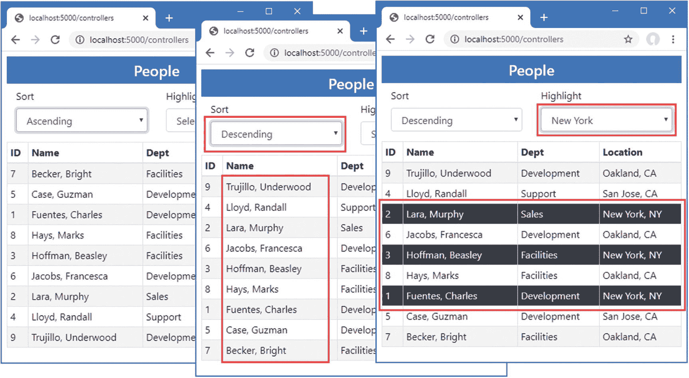

# 三十四、使用 Blazor 服务器：第 2 部分

在这一章中，我将继续描述 Blazor 服务器，重点放在 Razor 组件可以一起使用来创建更复杂的特性的方式上。表 [34-1](#Tab1) 总结了本章内容。

表 34-1。

章节总结

<colgroup><col class="tcol1 align-left"> <col class="tcol2 align-left"> <col class="tcol3 align-left"></colgroup> 
| 

问题

 | 

解决办法

 | 

列表

 |
| --- | --- | --- |
| 使用 Blazor 创建复杂特征 | 组合组件以减少重复 | 3, 4 |
| 配置组件 | 使用`Parameter`属性从属性中接收一个值 | 5–10 |
| 定义自定义事件和绑定 | 使用`EventCallbacks`接收事件的处理程序，并按照约定创建绑定 | 11–14 |
| 在组件中显示子内容 | 使用一个名为`ChildContent`的`RenderFragment` | 15, 16 |
| 创建模板 | 使用命名的`RenderFragment`属性 | 17, 25 |
| 广泛分发配置设置 | 使用级联参数 | 26, 27 |
| 响应连接错误 | 使用连接元素和类 | 28, 29 |
| 响应未处理的错误 | 使用错误元素和类 | 30, 31 |

## 为本章做准备

本章使用第 [33 章](33.html)中的高级项目。准备本章不需要做任何改动。

Tip

你可以从 [`https://github.com/apress/pro-asp.net-core-3`](https://github.com/apress/pro-asp.net-core-3) 下载本章以及本书其他章节的示例项目。如果在运行示例时遇到问题，请参见第 [1](01.html) 章获取帮助。

打开一个新的 PowerShell 命令提示符，导航到包含`Advanced.csproj`文件的文件夹，运行清单 [34-1](#PC1) 中所示的命令来删除数据库。

```cs
dotnet ef database drop --force

Listing 34-1.Dropping the Database

```

从 Debug 菜单中选择 Start Without Debugging 或 Run Without Debugging，或者使用 PowerShell 命令提示符运行清单 [34-2](#PC2) 中所示的命令。

```cs
dotnet run

Listing 34-2.Running the Example Application

```

使用浏览器请求`http://localhost:5000/controllers`，将显示数据项列表。请求`http://localhost:5000/pages/blazor`，你会看到我用来演示数据绑定的第 [33 章](33.html)中的组件。图 [34-1](#Fig1) 显示了两种响应。


图 34-1。

运行示例应用

## 组合组件

Blazor 组件可以组合起来创建更复杂的功能。在接下来的小节中，我将向您展示如何一起使用多个组件，以及组件如何进行通信。首先，将一个名为`SelectFilter.razor`的 Razor 组件添加到`Blazor`文件夹中，其内容如清单 [34-3](#PC3) 所示。

```cs
<div class="form-group">
    <label for="select-@Title">@Title</label>
    <select name="select-@Title" class="form-control" @bind="SelectedValue">
        <option disabled selected>Select @Title</option>
        @foreach (string val in Values) {
            <option value="@val" selected="@(val == SelectedValue)">
                @val
            </option>
        }
    </select>
</div>

@code {

    public IEnumerable<string> Values { get; set; } = Enumerable.Empty<string>();

    public string SelectedValue { get; set; }

    public string Title { get; set; } = "Placeholder";
}

Listing 34-3.The Contents of the SelectFilter.razor File in the Blazor Folder

```

该组件呈现一个`select`元素，允许用户选择一个城市。在清单 [34-4](#PC4) 中，我应用了`SelectFilter`组件，替换了现有的`select`元素。

```cs
<table class="table table-sm table-bordered table-striped">
    <thead><tr><th>ID</th><th>Name</th><th>Dept</th><th>Location</th></tr></thead>
    <tbody>
        @foreach (Person p in People) {
            <tr class="@GetClass(p.Location.City)">
                <td>@p.PersonId</td>
                <td>@p.Surname, @p.Firstname</td>
                <td>@p.Department.Name</td>
                <td>@p.Location.City, @p.Location.State</td>
            </tr>
        }
    </tbody>
</table>

<SelectFilter />

@code {

    [Inject]
    public DataContext Context { get; set; }

    public IEnumerable<Person> People =>
        Context.People.Include(p => p.Department).Include(p => p.Location);

    public IEnumerable<string> Cities => Context.Locations.Select(l => l.City);

    public string SelectedCity { get; set; }

    public string GetClass(string city) =>
        SelectedCity == city ? "bg-info text-white" : "";
}

Listing 34-4.Applying a Component in the PeopleList.razor File in the Blazor Folder

```

当一个组件被添加到由控制器视图或 Razor 页面呈现的内容中时，会用到`component`元素，如第 [33 章](33.html)所示。当一个组件被添加到由另一个组件呈现的内容中时，该组件的名称被用作一个元素。在本例中，我将`SelectFilter`组件添加到由`PeopleList`组件呈现的内容中，这是我用`SelectFilter`元素完成的。务必密切注意大小写，大小写必须完全匹配。

当组合组件时，效果是一个组件将其部分布局的责任委托给另一个组件。在本例中，我已经删除了`PeopleList`组件用来向用户提供城市选择的`select`元素，并用提供相同功能的`SelectFilter`组件替换了它。这些组件形成父/子关系；`PeopleList`组件是父组件，而`SelectFilter`组件是子组件。

在所有东西都正确集成之前，还需要做额外的工作，但是您可以看到，通过重新启动 ASP.NET Core 并请求`http://localhost:5000/controllers`，添加`SelectFilter`元素显示了`SelectFilter`组件，这产生了如图 [34-2](#Fig2) 所示的响应。


图 34-2。

将一个组件添加到由另一个组件呈现的内容中

### 使用属性配置组件

我使用`SelectList`组件的目标是创建一个通用特性，我可以在整个应用中使用它，配置每次使用时它显示的值。Razor 组件是使用添加到应用它们的 HTML 元素的属性来配置的。分配给 HTML 元素属性的值被分配给组件的 C# 属性。`Parameter`属性应用于组件允许配置的 C# 属性，如清单 [34-5](#PC5) 所示。

```cs
<div class="form-group">
    <label for="select-@Title">@Title</label>
    <select name="select-@Title" class="form-control" @bind="SelectedValue">
        <option disabled selected>Select @Title</option>
        @foreach (string val in Values) {
            <option value="@val" selected="@(val == SelectedValue)">
                @val
            </option>
        }
    </select>
</div>

@code {

    [Parameter]
    public IEnumerable<string> Values { get; set; } = Enumerable.Empty<string>();

    public string SelectedValue { get; set; }

    [Parameter]
    public string Title { get; set; } = "Placeholder";
}

Listing 34-5.Declaring Configurable Properties in the SelectFilter.razor File in the Blazor Folder

```

组件可以选择它们允许配置的属性。在这种情况下，`Parameter`属性已经应用于由`SelectFilter`组件定义的两个属性。在清单 [34-6](#PC6) 中，我修改了`PeopleList`组件用来应用`SelectFilter`组件来添加配置属性的元素。

```cs
<table class="table table-sm table-bordered table-striped">
    <thead><tr><th>ID</th><th>Name</th><th>Dept</th><th>Location</th></tr></thead>
    <tbody>
        @foreach (Person p in People) {
            <tr class="@GetClass(p.Location.City)">
                <td>@p.PersonId</td>
                <td>@p.Surname, @p.Firstname</td>
                <td>@p.Department.Name</td>
                <td>@p.Location.City, @p.Location.State</td>
            </tr>
        }
    </tbody>
</table>

<SelectFilter values="@Cities" title="City" />

@code {

    [Inject]
    public DataContext Context { get; set; }

    public IEnumerable<Person> People =>
        Context.People.Include(p => p.Department).Include(p => p.Location);

    public IEnumerable<string> Cities => Context.Locations.Select(l => l.City);

    public string SelectedCity { get; set; }

    public string GetClass(string city) =>
        SelectedCity == city ? "bg-info text-white" : "";
}

Listing 34-6.Configuring a Component in the PeopleList.razor File in the Blazor Folder

```

对于应该配置的每个属性，将向父元素的 HTML 元素添加一个同名的属性。属性值可以是固定值，比如分配给`title`属性的`City`字符串，或者是 Razor 表达式，比如`@Cities`，它将来自`Cities`属性的对象序列分配给`values`属性。

#### 设置和接收批量配置设置

如果有许多配置设置，则定义单个属性来接收值可能容易出错，尤其是如果这些值是由组件接收的，因此可以传递给子组件或常规 HTML 元素。在这些情况下，可以指定一个属性来接收任何与其他属性不匹配的属性值，然后可以作为一个集合来应用，如清单 [34-7](#PC7) 所示。

```cs
<div class="form-group">
    <label for="select-@Title">@Title</label>
    <select name="select-@Title" class="form-control"
            @bind="SelectedValue" @attributes="Attrs">
        <option disabled selected>Select @Title</option>
        @foreach (string val in Values) {
            <option value="@val" selected="@(val == SelectedValue)">
                @val
            </option>
        }
    </select>
</div>

@code {

    [Parameter]
    public IEnumerable<string> Values { get; set; } = Enumerable.Empty<string>();

    public string SelectedValue { get; set; }

    [Parameter]
    public string Title { get; set; } = "Placeholder";

    [Parameter(CaptureUnmatchedValues = true)]
    public Dictionary<string, object> Attrs { get; set; }
}

Listing 34-7.Receiving Bulk Attributes in the SelectFilter.razor File in the Blazor Folder

```

将`Parameter`属性的`CaptureUnmatchedValues`参数设置为`true`会将一个属性标识为不匹配属性的集合。属性的类型必须是`Dictionary<string, object>`，它允许表示属性名和值。

类型为`Dictionary<string, object>`的属性可以使用`@attribute`表达式应用于元素，如下所示:

```cs
...
<select name="select-@Title" class="form-control" @bind="SelectedValue"
    @attributes="Attrs">
...

```

这被称为*属性 splatting* ，它允许一次性应用一组属性。清单 [34-7](#PC7) 中的变化意味着`SelectFilter`组件将接收`Values`和`Title`属性值，并且任何其他属性将被分配给`Attrs`属性并传递给`select`元素。清单 [34-8](#PC9) 添加了一些属性来演示效果。

```cs
<table class="table table-sm table-bordered table-striped">
    <thead><tr><th>ID</th><th>Name</th><th>Dept</th><th>Location</th></tr></thead>
    <tbody>
        @foreach (Person p in People) {
            <tr class="@GetClass(p.Location.City)">
                <td>@p.PersonId</td>
                <td>@p.Surname, @p.Firstname</td>
                <td>@p.Department.Name</td>
                <td>@p.Location.City, @p.Location.State</td>
            </tr>
        }
    </tbody>
</table>

<SelectFilter values="@Cities" title="City" autofocus="true" name="city"
    required="true" />

@code {

    // ...statements omitted for brevity...
}

Listing 34-8.Adding Element Attributes in the PeopleList.razor File in the Blazor Folder

```

重启 ASP.NET Core 并导航至`http://localhost:5000/controllers`。传递给`select`元素的属性不影响外观，但是如果您右键单击`select`元素并从弹出菜单中选择 Inspect，您将看到添加到`PeopleList`组件中的`SelectFilter`元素的属性已经被添加到由`SelectFilter`组件呈现的元素中，如下所示:

```cs
...
<select class="form-control" autofocus="true" name="city" required="true">
...

```

#### 在控制器视图或 Razor 页面中配置组件

当使用`component`元素应用属性时，属性也用于配置组件。在清单 [34-9](#PC11) 中，我向`PeopleList`组件添加了属性，指定应该显示数据库中的多少项，以及一个将传递给`SelectFilter`组件的字符串值。

```cs
<table class="table table-sm table-bordered table-striped">
    <thead><tr><th>ID</th><th>Name</th><th>Dept</th><th>Location</th></tr></thead>
    <tbody>
        @foreach (Person p in People) {
            <tr class="@GetClass(p.Location.City)">
                <td>@p.PersonId</td>
                <td>@p.Surname, @p.Firstname</td>
                <td>@p.Department.Name</td>
                <td>@p.Location.City, @p.Location.State</td>
            </tr>
        }
    </tbody>
</table>

<SelectFilter values="@Cities" title="@SelectTitle" />

@code {

    [Inject]
    public DataContext Context { get; set; }

    public IEnumerable<Person> People => Context.People.Include(p => p.Department)
            .Include(p => p.Location).Take(ItemCount);

    public IEnumerable<string> Cities => Context.Locations.Select(l => l.City);

    public string SelectedCity { get; set; }

    public string GetClass(string city) =>
        SelectedCity == city ? "bg-info text-white" : "";

    [Parameter]
    public int ItemCount { get; set; } = 4;

    [Parameter]
    public string SelectTitle { get; set; }
}

Listing 34-9.Adding Configuration Properties in the PeopleList.razor File in the Blazor Folder

```

C# 属性的值是通过向`component`元素添加属性来提供的，这些属性的名称以`param-`开头，后跟属性名，如清单 [34-10](#PC12) 所示。

```cs
@model PeopleListViewModel

<h4 class="bg-primary text-white text-center p-2">People</h4>

<component type="typeof(Advanced.Blazor.PeopleList)" render-mode="Server"
           param-itemcount="5" param-selecttitle="@("Location")" />

Listing 34-10.Adding Configuration Attributes in the Index.cshtml File in the Views/Home Folder

```

`param-itemcount`属性为`ItemCount`属性提供一个值，而`param-selecttitle`属性为`SelectTitle`属性提供一个值。

当使用`component`元素时，可以被解析为数字或`bool`值的属性值被作为文字值而不是 Razor 表达式来处理，这就是为什么我能够将`ItemCount`属性的值指定为`4`。其他值被假定为 Razor 表达式而不是文字值，即使它们没有前缀`@`。奇怪的是，由于我想将`SelectTitle`属性的值指定为一个文字字符串，所以我需要一个 Razor 表达式，如下所示:

```cs
...
<component type="typeof(Advanced.Blazor.PeopleList)" render-mode="Server"
           param-itemcount="5" param-selecttitle="@("Location")" />
...

```

要查看配置属性的效果，重启 ASP.NET Core 并请求`http://localhost:5000/controllers`，这将产生如图 [34-3](#Fig3) 所示的响应。


图 34-3。

使用属性配置组件

### 创建自定义事件和绑定

`SelectFilter`组件从其父组件接收数据值，但是它无法指示用户何时做出选择。为此，我需要创建一个自定义事件，父组件可以为其注册一个处理程序方法，就像它可以为常规 HTML 元素的事件注册一样。清单 [34-11](#PC14) 向`SelectFilter`组件添加了一个定制事件。

```cs
<div class="form-group">
    <label for="select-@Title">@Title</label>
    <select name="select-@Title" class="form-control"
            @onchange="HandleSelect" value="@SelectedValue">
        <option disabled selected>Select @Title</option>
        @foreach (string val in Values) {
            <option value="@val" selected="@(val == SelectedValue)">
                @val
            </option>
        }
    </select>
</div>

@code {

    [Parameter]
    public IEnumerable<string> Values { get; set; } = Enumerable.Empty<string>();

    public string SelectedValue { get; set; }

    [Parameter]
    public string Title { get; set; } = "Placeholder";

    [Parameter(CaptureUnmatchedValues = true)]
    public Dictionary<string, object> Attrs { get; set; }

    [Parameter]
    public EventCallback<string> CustomEvent { get; set; }

    public async Task HandleSelect(ChangeEventArgs e) {
        SelectedValue = e.Value as string;
        await CustomEvent.InvokeAsync(SelectedValue);
    }
}

Listing 34-11.Creating an Event in the SelectFilter.razor File in the Blazor Folder

```

自定义事件通过添加一个类型为`EventCallback<T>`的属性来定义。泛型类型参数是将由父事件处理程序接收的类型，在本例中是`string`。我已经修改了`select`元素，所以当`select`元素触发其`onchange`事件时，`@onchange`属性注册了`HandleSelect`方法。

`HandleSelect`方法通过调用`EventCallback<T>.InvokeAsync`方法更新`SelectedValue`属性并触发自定义事件，如下所示:

```cs
...
await CustomEvent.InvokeAsync(SelectedValue);
...

```

`InvokeAsync`方法的参数用于使用从`ChangeEventArgs`对象接收的值触发事件，该值是从`select`元素接收的。清单 [34-12](#PC16) 更改了`PeopleList`组件，使其接收由`SelectList`组件发出的自定义事件。

```cs
<table class="table table-sm table-bordered table-striped">
    <thead><tr><th>ID</th><th>Name</th><th>Dept</th><th>Location</th></tr></thead>
    <tbody>
        @foreach (Person p in People) {
            <tr class="@GetClass(p.Location.City)">
                <td>@p.PersonId</td>
                <td>@p.Surname, @p.Firstname</td>
                <td>@p.Department.Name</td>
                <td>@p.Location.City, @p.Location.State</td>
            </tr>
        }
    </tbody>
</table>

<SelectFilter values="@Cities" title="@SelectTitle" CustomEvent="@HandleCustom" />

@code {

    [Inject]
    public DataContext Context { get; set; }

    public IEnumerable<Person> People => Context.People.Include(p => p.Department)
            .Include(p => p.Location).Take(ItemCount);

    public IEnumerable<string> Cities => Context.Locations.Select(l => l.City);

    public string SelectedCity { get; set; }

    public string GetClass(string city) =>
        SelectedCity as string == city ? "bg-info text-white" : "";

    [Parameter]
    public int ItemCount { get; set; } = 4;

    [Parameter]
    public string SelectTitle { get; set; }

    public void HandleCustom(string newValue) {
        SelectedCity = newValue;
    }
}

Listing 34-12.Handling an Event in the PeopleList.razor File in the Blazor Folder

```

为了设置事件处理程序，一个属性被添加到元素中，该元素使用其`EventCallback<T>`属性的名称来应用子组件。该属性的值是一个 Razor 表达式，它选择一个接收类型为`T`的参数的方法。

重启 ASP.NET Core，请求`http://localhost:5000/controllers`，并从城市列表中选择一个值。自定义事件完成父组件和子组件之间的关系。父元素通过子元素的属性来配置子元素，以指定将呈现给用户的标题和数据值列表。当用户选择一个值时，子组件使用一个自定义事件来告诉父组件，允许父组件在其 HTML 表中高亮显示相应的行，如图 [34-4](#Fig4) 所示。


图 34-4。

使用自定义事件

#### 创建自定义绑定

如果父组件定义了一对属性，其中一个被赋予数据值，另一个是自定义事件，则它可以在子组件上创建绑定。属性的名称很重要:事件属性的名称必须与数据属性加上单词`Changed`相同。清单 [34-13](#PC17) 更新了`SelectFilter`组件，使其呈现绑定所需的属性。

```cs
<div class="form-group">
    <label for="select-@Title">@Title</label>
    <select name="select-@Title" class="form-control"
            @onchange="HandleSelect" value="@SelectedValue">
        <option disabled selected>Select @Title</option>
        @foreach (string val in Values) {
            <option value="@val" selected="@(val == SelectedValue)">
                @val
            </option>
        }
    </select>
</div>

@code {

    [Parameter]
    public IEnumerable<string> Values { get; set; } = Enumerable.Empty<string>();

    [Parameter]
    public string SelectedValue { get; set; }

    [Parameter]
    public string Title { get; set; } = "Placeholder";

    [Parameter(CaptureUnmatchedValues = true)]
    public Dictionary<string, object> Attrs { get; set; }

    [Parameter]
    public EventCallback<string> SelectedValueChanged { get; set; }

    public async Task HandleSelect(ChangeEventArgs e) {
        SelectedValue = e.Value as string;
        await SelectedValueChanged.InvokeAsync(SelectedValue);
    }
}

Listing 34-13.Preparing for Custom Binding in the SelectFilter.razor File in the Blazor Folder

```

注意，`Parameter`属性必须同时应用于`SelectedValue`和`SelectedValueChanged`属性。如果省略其中任何一个属性，数据绑定都不会像预期的那样工作。

父组件通过`@bind-<name>`属性绑定到子组件，其中`<name>`对应于子组件定义的属性。在这个例子中，子组件的属性名是`SelectedValue`，父组件可以使用`@bind-SelectedValue`创建一个绑定，如清单 [34-14](#PC18) 所示。

```cs
<table class="table table-sm table-bordered table-striped">
    <thead><tr><th>ID</th><th>Name</th><th>Dept</th><th>Location</th></tr></thead>
    <tbody>
        @foreach (Person p in People) {
            <tr class="@GetClass(p.Location.City)">
                <td>@p.PersonId</td>
                <td>@p.Surname, @p.Firstname</td>
                <td>@p.Department.Name</td>
                <td>@p.Location.City, @p.Location.State</td>
            </tr>
        }
    </tbody>
</table>

<SelectFilter values="@Cities" title="@SelectTitle"
    @bind-SelectedValue="SelectedCity" />

<button class="btn btn-primary"
    @onclick="@(() => SelectedCity = "San Jose")">
        Change
</button>

@code {

    [Inject]
    public DataContext Context { get; set; }

    public IEnumerable<Person> People => Context.People.Include(p => p.Department)
            .Include(p => p.Location).Take(ItemCount);

    public IEnumerable<string> Cities => Context.Locations.Select(l => l.City);

    public string SelectedCity { get; set; }

    public string GetClass(string city) =>
        SelectedCity as string == city ? "bg-info text-white" : "";

    [Parameter]
    public int ItemCount { get; set; } = 4;

    [Parameter]
    public string SelectTitle { get; set; }

    //public void HandleCustom(string newValue) {
    //    SelectedCity = newValue;
    //}
}

Listing 34-14.Using a Custom Binding in the PeopleList.razor File in the Blazor Folder

```

重启 ASP.NET Core，请求`http://localhost:5000/controllers`，并从城市列表中选择纽约。定制绑定将导致在`select`元素中选择的值通过在表中突出显示来反映。点击变更按钮测试另一个方向的绑定，会看到高亮显示的城市变更，如图 [34-5](#Fig5) 所示。


图 34-5。

使用自定义绑定

## 在组件中显示子内容

显示子内容的组件充当其父元素的包装器。要查看子内容是如何管理的，将一个名为`ThemeWrapper.razor`的 Razor 组件添加到`Blazor`文件夹中，其内容如清单 [34-15](#PC19) 所示。

```cs
<div class="p-2 bg-@Theme border text-white">
    <h5 class="text-center">@Title</h5>
    @ChildContent
</div>

@code {
    [Parameter]
    public string Theme { get; set; }

    [Parameter]
    public string Title { get; set; }

    [Parameter]
    public RenderFragment ChildContent { get; set; }
}

Listing 34-15.The Contents of the ThemeWrapper.razor File in the Blazor Folder

```

为了接收子内容，组件定义了一个名为`ChildContent`的属性，其类型为`RenderFragment`，并且已经用`Parameter`属性进行了修饰。`@ChildContent`表达式在组件的 HTML 输出中包含子内容。清单中的组件将其子内容包装在一个`div`元素中，该元素使用 Bootstrap 主题颜色进行样式化并显示标题。主题颜色的名称和标题的文本也作为参数接收。

Restricting Element Reuse

当更新呈现给用户的内容时，Blazor 将尽可能重用元素，因为创建新元素是一项相对昂贵的操作。当显示值序列的元素时，尤其如此，比如使用`@for`或`@foreach`表达式。如果序列发生变化，Blazor 将重用它为旧数据值创建的元素来显示新数据。

如果在 Blazor 的控制之外对元素进行了更改，比如使用定制的 JavaScript 代码，这可能会导致问题。Blazor 不知道这些变化，当元素被重用时，这些变化会持续存在。虽然这种情况很少见，但是您可以通过使用一个`@key`属性并提供一个将元素与序列中的一个数据值相关联的表达式来限制元素的重用，如下所示:

```cs
...
@foreach (Person p in People) {
    <tr @key="p.PersonId" class="@GetClass(p.Location.City)">

        <td>@p.PersonId</td>
        <td>@p.Surname, @p.Firstname</td>
        <td>@p.Department.Name</td>
        <td>@p.Location.City, @p.Location.State</td>
    </tr>
}
...

```

Blazor 只有在有一个数据项有相同的键时才会重用一个元素。对于其他值，将创建新元素。

应用组件时，通过在开始和结束标签之间添加 HTML 元素来定义子内容，如清单 [34-16](#PC21) 所示。

```cs
<table class="table table-sm table-bordered table-striped">
    <thead><tr><th>ID</th><th>Name</th><th>Dept</th><th>Location</th></tr></thead>
    <tbody>
        @foreach (Person p in People) {
            <tr class="@GetClass(p.Location.City)">
                <td>@p.PersonId</td>
                <td>@p.Surname, @p.Firstname</td>
                <td>@p.Department.Name</td>
                <td>@p.Location.City, @p.Location.State</td>
            </tr>
        }
    </tbody>
</table>

<ThemeWrapper Theme="info" Title="Location Selector">
    <SelectFilter values="@Cities" title="@SelectTitle"
        @bind-SelectedValue="SelectedCity" />
    <button class="btn btn-primary"
        @onclick="@(() => SelectedCity = "San Jose")">
            Change
     </button>
</ThemeWrapper>

@code {

    // ...statements omitted for brevity...
}

Listing 34-16.Defining Child Content in the PeopleList.razor File in the Blazor Folder

```

配置子内容不需要额外的属性，它会被自动处理并分配给`ChildContent`属性。要查看`ThemeWrapper`组件如何呈现其子内容，重启 ASP.NET Core 并请求`http://localhost:5000/controllers`。您将看到选择主题的配置属性和用于产生如图 [34-6](#Fig6) 所示响应的标题文本。


图 34-6。

使用子内容

### 创建模板组件

模板组件为子内容的呈现带来了更多的结构，允许显示内容的多个部分。模板组件是整合应用中使用的功能以防止代码和内容重复的好方法。

要查看这是如何工作的，将一个名为`TableTemplate.razor`的 Razor 组件添加到`Blazor`文件夹中，其内容如清单 [34-17](#PC22) 所示。

```cs
<table class="table table-sm table-bordered table-striped">
    @if (Header != null) {
        <thead>@Header</thead>
    }
    <tbody>@Body</tbody>
</table>

@code {
    [Parameter]
    public RenderFragment Header { get; set; }

    [Parameter]
    public RenderFragment Body { get; set; }
}

Listing 34-17.The Contents of the TableTemplate.razor File in the Blazor Folder

```

该组件为它支持的每个子内容区域定义了一个`RenderFragment`属性。`TableTemplate`组件定义了两个`RenderFragment`属性，名为`Header`和`Body`，它们代表一个表格的内容部分。子内容的每个区域都使用一个 Razor 表达式、`@Header`和`@Body`来呈现，您可以通过检查属性值是否为`null`来查看是否已经为特定的部分提供了内容，这个组件为`Header`部分提供了内容。

当使用模板组件时，每个区域的内容都包含在一个 HTML 元素中，该元素的标签与相应的`RenderFragment`属性的名称相匹配，如清单 [34-18](#PC23) 所示。

```cs
<TableTemplate>
    <Header>
        <tr><th>ID</th><th>Name</th><th>Dept</th><th>Location</th></tr>
    </Header>
    <Body>
        @foreach (Person p in People) {
            <tr class="@GetClass(p.Location.City)">
                <td>@p.PersonId</td>
                <td>@p.Surname, @p.Firstname</td>
                <td>@p.Department.Name</td>
                <td>@p.Location.City, @p.Location.State</td>
            </tr>
        }
    </Body>
</TableTemplate>

<ThemeWrapper Theme="info" Title="Location Selector">
    <SelectFilter values="@Cities" title="@SelectTitle"
        @bind-SelectedValue="SelectedCity" />
    <button class="btn btn-primary"
        @onclick="@(() => SelectedCity = "San Jose")">
            Change
     </button>
</ThemeWrapper>

@code {

    // ...statements omitted for brevity...
}

Listing 34-18.Applying a Template Component in the PeopleList.razor File in the Blazor Folder

```

子内容被构造成与模板组件的属性相对应的部分，`Header`和`Body`，这使得`TableTemplate`组件负责表格结构，而`PeopleList`组件负责提供细节。重启 ASP.NET Core 并请求`http://localhost:5000/controllers`，你会看到模板组件产生的输出，如图 [34-7](#Fig7) 所示。


图 34-7。

使用模板组件

### 在模板组件中使用泛型类型参数

我在上一节中创建的模板组件很有用，因为它提供了一个表的一致表示，我可以在整个示例应用中使用它。但是它也有局限性，因为它依赖父组件来负责为表体生成行。模板组件不能洞察它所呈现的内容，这意味着除了显示内容之外，它不能对内容做任何事情。

通过使用泛型类型参数，可以使模板组件具有数据感知能力，这允许父组件提供一系列数据对象和用于呈现它们的模板。模板组件负责为每个数据对象生成内容，因此可以提供更有用的功能。作为演示，我将向模板组件添加对选择显示多少表行和选择表行的支持。第一步是向组件添加一个泛型类型参数，并使用它来呈现表体的内容，如清单 [34-19](#PC24) 所示。

```cs
@typeparam RowType

<table class="table table-sm table-bordered table-striped">
    @if (Header != null) {
        <thead>@Header</thead>
    }
    <tbody>
        @foreach (RowType item in RowData) {
            <tr>@RowTemplate(item)</tr>
        }
    </tbody>
</table>

@code {
    [Parameter]
    public RenderFragment Header { get; set; }

    [Parameter]
    public RenderFragment<RowType> RowTemplate{ get; set; }

    [Parameter]
    public IEnumerable<RowType> RowData { get; set; }
}

Listing 34-19.Adding a Generic Type Parameter in the TableTemplate.razor File in the Blazor Folder

```

泛型类型参数是使用`@typeparam`属性指定的，在本例中，我将参数命名为`RowType`，因为它将引用组件将为其生成表行的数据类型。

组件将处理的数据是通过添加一个属性来接收的，该属性的类型是泛型类型的对象序列。我已经将属性命名为`RowData`，其类型为`IEnumerable<RowType>`。组件将为每个对象显示的内容是使用一个`RenderFragment<T>`属性接收的。我将这个属性命名为`RowTemplate`，它的类型是`RenderFragment<RowType>`，反映了我为泛型类型参数选择的名称。

当一个组件通过一个`RenderFragment<T>`属性接收到一个内容部分时，它可以通过调用该部分作为一个方法并使用该对象作为参数来为单个对象呈现它，如下所示:

```cs
...
@foreach (RowType item in RowData) {
    <tr>@RowTemplate(item)</tr>
}
...

```

这段代码列举了`RowData`序列中的`RowType`对象，并为每个对象呈现通过`RowTemplate`属性接收的内容部分。

#### 使用通用模板组件

我已经简化了`PeopleList`组件，所以它只使用模板组件来生成一个`Person`对象的表格，并且我已经移除了早期的特性，如清单 [34-20](#PC26) 所示。

```cs
<TableTemplate RowType="Person" RowData="People">
    <Header>
        <tr><th>ID</th><th>Name</th><th>Dept</th><th>Location</th></tr>
    </Header>
    <RowTemplate Context="p">
        <td>@p.PersonId</td>
        <td>@p.Surname, @p.Firstname</td>
        <td>@p.Department.Name</td>
        <td>@p.Location.City, @p.Location.State</td>
    </RowTemplate>
</TableTemplate>

@code {

    [Inject]
    public DataContext Context { get; set; }

    public IEnumerable<Person> People => Context.People
            .Include(p => p.Department)
            .Include(p => p.Location);
}

Listing 34-20.Using a Generic Template Component in the PeopleList.razor File in the Blazor Folder

```

`RowType`属性用于指定泛型类型参数的值。属性指定了模板组件将要处理的数据。

`RowTemplate`元素表示将为每个数据对象产生的元素。当定义一个`RenderFragment<T>`属性的内容部分时，`Context`属性用于为当前正在处理的对象指定一个名称。在这种情况下，`Context`属性用于将名称`p`分配给当前对象，然后在用于填充内容部分的元素的 Razor 表达式中引用该对象。

总体效果是模板组件被配置为显示`Person`对象。该组件将为每个`Person`生成一个表格行，其中将包含`td`元素，这些元素的内容是使用当前`Person`对象的属性设置的。

由于我删除了清单 [34-20](#PC26) 中用`Parameter`属性修饰的属性，我需要从应用`PepleList`组件的元素中删除相应的属性，如清单 [34-21](#PC27) 所示。

```cs
@model PeopleListViewModel

<h4 class="bg-primary text-white text-center p-2">People</h4>

<component type="typeof(Advanced.Blazor.PeopleList)" render-mode="Server" />

Listing 34-21.Removing Attributes in the Index.cshtml File in the Views/Home Folder

```

要查看通用模板组件，请重启 ASP.NET Core 并请求`http://localhost:5000/controllers`。由`PeopleList`组件提供的数据和内容部分已经被`TableTemplate`组件用来产生如图 [34-8](#Fig8) 所示的表格。


图 34-8。

使用通用模板组件

#### 向通用模板组件添加特征

这可能感觉像是一种倒退，但是，正如您将看到的，让模板组件洞察它处理的数据为添加特性奠定了基础，如清单 [34-22](#PC28) 所示。

```cs
@typeparam RowType

<div class="container-fluid">
    <div class="row">
        <div class="col">
            <SelectFilter Title="@("Sort")" Values="@SortDirectionChoices"
                @bind-SelectedValue="SortDirectionSelection" />
        </div>
        <div class="col">
            <SelectFilter Title="@("Highlight")" Values="@HighlightChoices()"
                @bind-SelectedValue="HighlightSelection" />
        </div>
    </div>
</div>

<table class="table table-sm table-bordered table-striped">
    @if (Header != null) {
        <thead>@Header</thead>
    }
    <tbody>
        @foreach (RowType item in SortedData()) {
            <tr class="@IsHighlighted(item)">@RowTemplate(item)</tr>
        }
    </tbody>
</table>

@code {
    [Parameter]
    public RenderFragment Header { get; set; }

    [Parameter]
    public RenderFragment<RowType> RowTemplate{ get; set; }

    [Parameter]
    public IEnumerable<RowType> RowData { get; set; }

    [Parameter]
    public Func<RowType, string> Highlight { get; set; }

    public IEnumerable<string> HighlightChoices() =>
        RowData.Select(item => Highlight(item)).Distinct();

    public string HighlightSelection { get; set; }

    public string IsHighlighted(RowType item) =>
        Highlight(item) == HighlightSelection ? "bg-dark text-white": "";

    [Parameter]
    public Func<RowType, string> SortDirection { get; set; }

    public string[] SortDirectionChoices =
        new string[] { "Ascending", "Descending" };

    public string SortDirectionSelection{ get; set; } = "Ascending";

    public IEnumerable<RowType> SortedData() =>
        SortDirectionSelection == "Ascending"
            ? RowData.OrderBy(SortDirection)
            : RowData.OrderByDescending(SortDirection);
}

Listing 34-22.Adding a Feature in the TableTemplate.razor File in the Blazor Folder

```

这些变化向用户呈现了两个`select`元素，它们是使用本章前面创建的`SelectFilter`组件呈现的。这些新元素允许用户按升序和降序对数据进行排序，并选择一个值来突出显示表中的行。父组件提供了额外的参数，这些参数赋予模板组件选择用于排序和高亮显示的属性的功能，如清单 [34-23](#PC29) 所示。

```cs
<TableTemplate RowType="Person" RowData="People"
        Highlight="@(p => p.Location.City)" SortDirection="@(p => p.Surname)">
    <Header>
        <tr><th>ID</th><th>Name</th><th>Dept</th><th>Location</th></tr>
    </Header>
    <RowTemplate Context="p">
        <td>@p.PersonId</td>
        <td>@p.Surname, @p.Firstname</td>
        <td>@p.Department.Name</td>
        <td>@p.Location.City, @p.Location.State</td>
    </RowTemplate>
</TableTemplate>

@code {

    [Inject]
    public DataContext Context { get; set; }

    public IEnumerable<Person> People => Context.People
            .Include(p => p.Department)
            .Include(p => p.Location);
}

Listing 34-23.Configuring Template Component Features in the PeopleList.razor File in the Blazor Folder

```

`Highlight`属性为模板组件提供了一个选择用于突出显示表格行的属性的函数，而`SortDirection`属性提供了一个选择用于排序的属性的函数。要查看效果，重启 ASP.NET Core 并请求`http://localhost:5000/controllers`。响应将包含新的`select`元素，可以用来改变排序顺序或者选择一个城市进行过滤，如图 [34-9](#Fig9) 所示。



图 34-9

向模板组件添加特征

#### 重用通用模板组件

添加到模板组件中的特性都依赖于泛型类型参数，这允许组件修改它所呈现的内容，而无需绑定到特定的类。结果是一个组件，可用于在需要表的任何地方显示、排序和突出显示任何数据类型。将名为`DepartmentList.razor`的剃须刀组件添加到`Blazor`文件夹中，内容如清单 [34-24](#PC30) 所示。

```cs
<TableTemplate RowType="Department" RowData="Departments"
    Highlight="@(d => d.Name)"
    SortDirection="@(d => d.Name)">
    <Header>
        <tr><th>ID</th><th>Name</th><th>People</th><th>Locations</th></tr>
    </Header>
    <RowTemplate Context="d">
        <td>@d.Departmentid</td>
        <td>@d.Name</td>
        <td>@(String.Join(", ", d.People.Select(p => p.Surname)))</td>
        <td>
            @(String.Join(", ", d.People.Select(p => p.Location.City).Distinct()))
        </td>
    </RowTemplate>
</TableTemplate>

@code {

    [Inject]
    public DataContext Context { get; set; }

    public IEnumerable<Department> Departments => Context.Departments
            .Include(d => d.People).ThenInclude(p => p.Location);
}

Listing 34-24.The Contents of the DepartmentList.razor File in the Blazor Folder

```

`TableTemplate`组件用于向用户呈现数据库中的`Department`对象的列表，以及相关的`Person`和`Location`对象的详细信息，这些对象通过实体框架核心`Include`和`ThenInclude`方法进行查询。清单 [34-25](#PC31) 更改名为`Blazor`的 Razor 页面显示的 Razor 组件。

```cs
@page "/pages/blazor"

<h4 class="bg-primary text-white text-center p-2">Departments</h4>

<component type="typeof(Advanced.Blazor.DepartmentList)" render-mode="Server" />

Listing 34-25.Changing the Component in the Blazor.cshtml File in the Pages Folder

```

重启 ASP.NET Core 并请求`http://localhost:5000/pages/blazor`。响应将使用模板化组件呈现，如图 [34-10](#Fig10) 所示。


图 34-10。

重用通用模板组件

### 级联参数

随着组件数量的增加，组件向组件层次结构深处的后代提供配置数据会很有用。这可以通过让链中的每个组件接收数据并将其传递给它的所有子组件来实现，但是这很容易出错，并且需要每个组件都参与到这个过程中，即使它的所有子组件都不使用它传递的数据。

Blazor 通过支持*级联参数*为这个问题提供了一个解决方案，在级联参数中，一个组件提供的数据值可以直接用于它的任何后代，而不需要通过中间组件进行中继。级联参数是使用`CascadingValue`组件定义的，该组件用于包装一部分内容，如清单 [34-26](#PC32) 所示。

```cs
<CascadingValue Name="BgTheme" Value="Theme" IsFixed="false" >
    <TableTemplate RowType="Department" RowData="Departments"
        Highlight="@(d => d.Name)"
        SortDirection="@(d => d.Name)">
        <Header>
            <tr><th>ID</th><th>Name</th><th>People</th><th>Locations</th></tr>
        </Header>
        <RowTemplate Context="d">
            <td>@d.Departmentid</td>
            <td>@d.Name</td>
            <td>@(String.Join(", ", d.People.Select(p => p.Surname)))</td>
            <td>
                @(String.Join(", ",
                    d.People.Select(p => p.Location.City).Distinct()))
            </td>
        </RowTemplate>
    </TableTemplate>
</CascadingValue>

<SelectFilter Title="@("Theme")" Values="Themes" @bind-SelectedValue="Theme" />

@code {

    [Inject]
    public DataContext Context { get; set; }

    public IEnumerable<Department> Departments => Context.Departments
            .Include(d => d.People).ThenInclude(p => p.Location);

    public string Theme { get; set; } = "info";
    public string[] Themes = new string[] { "primary", "info", "success" };
}

Listing 34-26.Creating a Cascading Parameter in the DepartmentList.razor File in the Blazor Folder

```

`CascadingValue`元素为它包含的组件及其后代提供一个可用的值。`Name`属性指定参数的名称，`Value`属性指定值，`isFixed`属性用于指定值是否会改变。清单 [34-26](#PC32) 中使用了`CascadingValue`元素来创建一个名为`BgTheme`的级联参数，该参数的值由`SelectFilter`组件的一个实例设置，该组件为用户提供了一个引导 CSS 主题名称的选择。

Tip

每个`CascadingValue`元素创建一个级联参数。如果需要传递多个值，那么可以嵌套`CascadingValue`或者创建一个简单的参数，通过字典提供多个设置。

级联参数由需要它们的组件通过`CascadingParameter`属性直接接收，如清单 [34-27](#PC33) 所示。

```cs
<div class="form-group p-2 bg-@Theme @TextColor()">
    <label for="select-@Title">@Title</label>
    <select name="select-@Title" class="form-control"
            @onchange="HandleSelect" value="@SelectedValue">
        <option disabled selected>Select @Title</option>
        @foreach (string val in Values) {
            <option value="@val" selected="@(val == SelectedValue)">
                @val
            </option>
        }
    </select>
</div>

@code {

    [Parameter]
    public IEnumerable<string> Values { get; set; } = Enumerable.Empty<string>();

    [Parameter]
    public string SelectedValue { get; set; }

    [Parameter]
    public string Title { get; set; } = "Placeholder";

    [Parameter(CaptureUnmatchedValues = true)]
    public Dictionary<string, object> Attrs { get; set; }

    [Parameter]
    public EventCallback<string> SelectedValueChanged { get; set; }

    public async Task HandleSelect(ChangeEventArgs e) {
        SelectedValue = e.Value as string;
        await SelectedValueChanged.InvokeAsync(SelectedValue);
    }

    [CascadingParameter(Name ="BgTheme")]
    public string Theme { get; set; }

    public string TextColor() => Theme == null ? "" : "text-white";
}

Listing 34-27.Receiving a Cascading Parameter in the SelectFilter.razor File in the Blazor Folder

```

`CascadingParameter`属性的`Name`参数用于指定层叠参数的名称。清单 [34-26](#PC32) 中定义的`BgTheme`参数由清单 [34-27](#PC33) 中的`Theme`属性接收，并用于设置组件的背景。重启 ASP.NET Core 并请求`http://localhost:5000/pages/blazor`，产生如图 [34-11](#Fig11) 所示的响应。


图 34-11。

使用级联参数

本例中使用了三个`SelectFilter`组件实例，但是其中只有两个在`CascadingValue`元素包含的层次结构中。另一个实例在`CascadingValue`元素之外定义，不接收级联值。

## 处理错误

在接下来的部分中，我将描述 Blazor 提供的处理连接错误和未处理的应用错误的特性。

### 处理连接错误

Blazor 依赖于浏览器和 ASP.NET Core 服务器之间的持久 HTTP 连接。当连接中断时，应用无法运行，并且会显示一条模式错误消息，阻止用户与组件进行交互。

Blazor 允许通过定义一个具有特定`id`的元素来定制连接错误，如清单 [34-28](#PC34) 所示。

```cs
@page "/pages/blazor"

<h4 class="bg-primary text-white text-center p-2">Departments</h4>

<link rel="stylesheet" href="connectionErrors.css" />

<div id="components-reconnect-modal"
    class="h4 bg-dark text-white text-center my-2 p-2 components-reconnect-hide">
    Blazor Connection Lost
    <div class="reconnect">
        Trying to reconnect...
    </div>
    <div class="failed">
        Reconnection Failed.
        <button class="btn btn-light" onclick="window.Blazor.reconnect()">
            Reconnect
        </button>
    </div>
    <div class="rejected">
        Reconnection Rejected.
        <button class="btn btn-light" onclick="location.reload()">
            Reload
        </button>
    </div>
</div>

<component type="typeof(Advanced.Blazor.DepartmentList)" render-mode="Server" />

Listing 34-28.Defining a Connection Error Element in the Blazor.cshtml File in the Pages Folder

```

自定义错误元素的`id`属性必须是`components-reconnect-modal`。当出现连接错误时，Blazor 会定位该元素并将其添加到表 [34-2](#Tab2) 中描述的四个类之一。

表 34-2。

连接错误类别

<colgroup><col class="tcol1 align-left"> <col class="tcol2 align-left"></colgroup> 
| 

名字

 | 

描述

 |
| --- | --- |
| `components-reconnect-show` | 当连接丢失并且 Blazor 试图重新连接时，元素被添加到这个类中。应该向用户显示错误消息，并且应该阻止与 Blazor 内容的交互。 |
| `components-reconnect-hide` | 如果重新建立连接，元素将被添加到该类中。应该隐藏错误消息，并且应该允许交互。 |
| `components-reconnect-failed` | 如果 Blazor 重新连接失败，该元素将被添加到该类中。可以向用户呈现调用`window.Blazor.reconnect()`来再次尝试重新连接的按钮。 |
| `components-reconnect-rejected` | 如果 Blazor 能够到达服务器，但是用户的连接状态已经丢失，那么这个元素就被添加到这个类中。这通常发生在服务器重新启动时。可以向用户呈现一个调用`location.reload()`来重新加载应用并重试的按钮。 |

该元素最初没有被添加到任何一个类中，所以我将它显式地添加到了`components-reconnect-hide`类中，这样在出现问题之前它是不可见的。

我希望针对重新连接期间可能出现的每种情况向用户显示特定的消息。为此，我添加了为每个条件显示一条消息的元素。为了管理它们的可见性，将名为`connectionErrors.css`的 CSS 样式表添加到`wwwroot`文件夹中，并使用它来定义清单 [34-29](#PC35) 中所示的样式。

```cs
#components-reconnect-modal {
    position: fixed; top: 0; right: 0; bottom: 0;
    left: 0; z-index: 1000; overflow: hidden; opacity: 0.9;
}

.components-reconnect-hide { display: none; }
.components-reconnect-show { display: block; }

.components-reconnect-show > .reconnect { display: block; }
.components-reconnect-show > .failed,
.components-reconnect-show > .rejected {
    display: none;
}

.components-reconnect-failed > .failed {
    display: block;
}
.components-reconnect-failed > .reconnect,
.components-reconnect-failed > .rejected {
    display: none;
}

.components-reconnect-rejected > .rejected {
    display: block;
}
.components-reconnect-rejected > .reconnect,
.components-reconnect-rejected > .failed {
    display: none;
}

Listing 34-29.The Contents of the connectionErrors.css File in the wwwroot Folder

```

这些样式将`components-reconnect-modal`元素显示为模态项，其可见性由`components-reconnect-hide`和`components-reconnect-show`类决定。具体消息的可见性根据表 [34-2](#Tab2) 中的类别应用进行切换。

要查看效果，请重启 ASP.NET Core 并请求`http://localhost:5000/pages/blazor`。等到组件显示出来，然后停止 ASP.NET Core 服务器。当 Blazor 试图重新连接时，你会看到一个初始错误信息。几秒钟后，您将看到一条消息，指示重新连接失败。

重启 ASP.NET Core 并请求`http://localhost:5000/pages/blazor`。等到组件显示出来，然后重新启动 ASP.NET Core。这一次 Blazor 将能够连接到服务器，但连接将被拒绝，因为服务器重启导致连接状态丢失。图 [34-12](#Fig12) 显示了两个错误信息序列。


图 34-12。

处理连接错误

Tip

仅仅用浏览器不可能测试成功的连接恢复，因为没有办法中断持久的 HTTP 连接。我使用优秀的 Fiddler 代理， [`https://www.telerik.com/fiddler`](https://www.telerik.com/fiddler) ，它允许我在不停止 ASP.NET Core 服务器的情况下终止连接。

### 处理未捕获的应用错误

Blazor 不能很好地响应未捕获的应用错误，这些错误几乎总是被视为终端错误。要查看默认的错误行为，请将清单 [34-30](#PC36) 中所示的元素添加到`DepartmentList`组件中。

```cs
<CascadingValue Name="BgTheme" Value="Theme" IsFixed="false" >
    <TableTemplate RowType="Department" RowData="Departments"
        Highlight="@(d => d.Name)"
        SortDirection="@(d => d.Name)">
        <Header>
            <tr><th>ID</th><th>Name</th><th>People</th><th>Locations</th></tr>
        </Header>
        <RowTemplate Context="d">
            <td>@d.Departmentid</td>
            <td>@d.Name</td>
            <td>@(String.Join(", ", d.People.Select(p => p.Surname)))</td>
            <td>
                @(String.Join(", ",
                    d.People.Select(p => p.Location.City).Distinct()))
            </td>
        </RowTemplate>
    </TableTemplate>
</CascadingValue>

<SelectFilter Title="@("Theme")" Values="Themes" @bind-SelectedValue="Theme" />

<button class="btn btn-danger" @onclick="@(() => throw new Exception())">
    Error
</button>

@code {

    // ...statements omitted for brevity...
}

Listing 34-30.Adding Elements in the DepartmentList.razor File in the Blazor Folder

```

重启 ASP.NET Core，请求`http://localhost:5000/pages/blazor`，点击错误按钮。浏览器中没有明显的变化，但是单击按钮时在服务器上引发的异常被证明是致命的:用户仍然可以使用 select 元素选择值，因为这些值是由浏览器显示的，但是响应选择的事件处理程序不再工作，应用实际上已经死亡。

当出现未处理的应用错误时，Blazor 会寻找一个`id`为`blazor-error-ui`的元素，并将其 CSS `display`属性设置为`block`。清单 [34-31](#PC37) 将带有这个`id`的元素添加到`Blazor.cshtml`文件中，以呈现有用的消息。

```cs
@page "/pages/blazor"

<h4 class="bg-primary text-white text-center p-2">Departments</h4>

<link rel="stylesheet" href="connectionErrors.css" />

<div id="components-reconnect-modal"
    class="h4 bg-dark text-white text-center my-2 p-2 components-reconnect-hide">
    Blazor Connection Lost
    <div class="reconnect">
        Trying to reconnect...
    </div>
    <div class="failed">
        Reconnection Failed.
        <button class="btn btn-light" onclick="window.Blazor.reconnect()">
            Reconnect
        </button>
    </div>
    <div class="rejected">
        Reconnection Rejected.
        <button class="btn btn-light" onclick="location.reload()">
            Reload
        </button>
    </div>
</div>

<div id="blazor-error-ui"
     class="text-center bg-danger h6 text-white p-2 fixed-top w-100"
     style="display:none">
    An error has occurred. This application will not respond until reloaded.
    <button class="btn btn-sm btn-primary" onclick="location.reload()">
        Reload
    </button>
</div>

<component type="typeof(Advanced.Blazor.DepartmentList)" render-mode="Server" />

Listing 34-31.Adding an Error Element in the Blazor.cshtml File in the Pages Folder

```

当元素被显示时，用户将会看到一个警告和一个重新加载浏览器的按钮。要查看效果，重启 ASP.NET Core，请求`http://localhost:5000/pages/blazor`，点击错误按钮，将显示如图 [34-13](#Fig13) 所示的信息。


图 34-13。

显示错误消息

## 摘要

在这一章中，我向你展示了如何组合 Razor 组件来创建更复杂的特性。我向您展示了如何在组件之间创建父/子关系，如何用属性配置组件，以及如何创建定制事件以在发生重要变化时发出信号。我还向您展示了组件如何从其父组件接收内容，以及如何使用模板组件一致地生成内容，模板组件可以用一个或多个泛型类型参数来定义。在本章的最后，我演示了 Blazor 应用如何对连接和应用错误做出反应。在下一章，我将描述 Blazor 提供的高级特性。