# 三十五、Blazor 的高级功能

在这一章中，我将解释 Blazor 如何支持 URL 路由，以便通过一个请求显示多个组件。我将向您展示如何设置路由系统，如何定义路由，以及如何在布局中创建公共内容。

本章还介绍了组件生命周期，它允许组件主动参与 Blazor 环境，这在您开始使用 URL 路由特性时尤为重要。最后，本章解释了组件在前面章节描述的父/子关系之外的不同交互方式。表 [35-1](#Tab1) 将这些特征放在上下文中。

表 35-1。

将 Blazor 路由和生命周期组件交互放在上下文中

<colgroup><col class="tcol1 align-left"> <col class="tcol2 align-left"></colgroup> 
| 

问题

 | 

回答

 |
| --- | --- |
| 它们是什么？ | 路由功能允许组件响应 URL 的变化，而不需要新的 HTTP 连接。生命周期特性允许组件定义在应用执行时调用的方法，交互特性提供了组件之间以及与其他 JavaScript 代码通信的有用方式。 |
| 它们为什么有用？ | 这些特性允许创建利用 Blazor 架构的复杂应用。 |
| 它们是如何使用的？ | URL 路由使用内置组件进行设置，并使用`@page`指令进行配置。生命周期特性由组件的`@code`部分中的覆盖方法使用。交互特性的使用方式各不相同，这取决于组件的交互对象。 |
| 有什么陷阱或限制吗？ | 这些都是必须小心使用的高级特性，尤其是在 Blazor 之外创建交互时。 |
| 有其他选择吗？ | 本章描述的所有特性都是可选的，但是没有它们很难创建复杂的应用。 |

表 [35-2](#Tab2) 总结了本章内容。

表 35-2。

章节总结

<colgroup><col class="tcol1 align-left"> <col class="tcol2 align-left"> <col class="tcol3 align-left"></colgroup> 
| 

问题

 | 

解决办法

 | 

列表

 |
| --- | --- | --- |
| 基于当前 URL 选择组件 | 使用 URL 路由 | 6–12 |
| 定义将由多个组件使用的内容 | 使用布局 | 13, 14 |
| 响应组件生命周期的各个阶段 | 实施生命周期通知方法 | 15–17 |
| 协调多个组件的活动 | 保留带有`@ref`表达式的引用 | 18–19 |
| 与 Blazor 外部的代码协调 | 使用互用性特性 | 20–35 |

## 为本章做准备

本章使用第 [35 章](35.html)中的高级项目。本章不需要修改。

Tip

你可以从 [`https://github.com/apress/pro-asp.net-core-3`](https://github.com/apress/pro-asp.net-core-3) 下载本章以及本书其他章节的示例项目。如果在运行示例时遇到问题，请参见第 [1](01.html) 章获取帮助。

打开一个新的 PowerShell 命令提示符，导航到包含`Advanced.csproj`文件的文件夹，运行清单 [35-1](#PC1) 中所示的命令来删除数据库。

```cs
dotnet ef database drop --force

Listing 35-1.Dropping the Database

```

从 Debug 菜单中选择 Start Without Debugging 或 Run Without Debugging，或者使用 PowerShell 命令提示符运行清单 [35-2](#PC2) 中所示的命令。

```cs
dotnet run

Listing 35-2.Running the Example Application

```

使用浏览器请求`http://localhost:5000/controllers`，将显示数据项列表。请求`http://localhost:5000/pages/blazor`，你会看到我用来演示绑定的第 [34 章](34.html)中的组件。图 [35-1](#Fig1) 显示了两种响应。

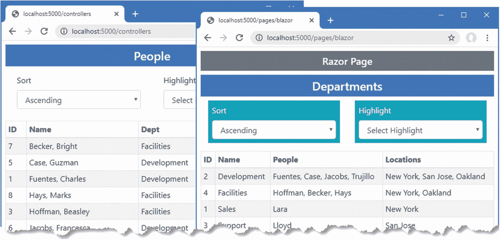

图 35-1。

运行示例应用

## 使用组件路由

Blazor 支持选择基于 ASP.NET Core 路由系统向用户显示的组件，这样应用就可以通过显示不同的 Razor 组件来响应 URL 的变化。首先，将一个名为`Routed.razor`的 Razor 组件添加到`Blazor`文件夹中，其内容如清单 [35-3](#PC3) 所示。

```cs
<Router AppAssembly="typeof(Startup).Assembly">
    <Found>
        <RouteView RouteData="@context" />
    </Found>
    <NotFound>
        <h4 class="bg-danger text-white text-center p-2">
            No Matching Route Found
        </h4>
    </NotFound>
</Router>

Listing 35-3.The Contents of the Routed.razor File in the Blazor Folder

```

`Router`组件包含在 ASP.NET Core 中，提供 Blazor 和 ASP.NET Core 路由功能之间的链接。`Router`是一个通用模板组件，定义了`Found`和`NotFound`部分。

`Router`组件需要`AppAssembly`属性，该属性指定了。NET 程序集来使用。对于大多数项目，这是当前程序集，其指定如下:

```cs
...
<Router AppAssembly="typeof(Startup).Assembly">
...

```

`Router`组件的`Found`属性的类型是`RenderFragment<RouteData>`，它通过`RouteData`属性传递给`RouteView`组件，如下所示:

```cs
...
<Found>
    <RouteView RouteData="@context" />
</Found>
...

```

`RouteView`组件负责显示与当前路线匹配的组件，正如我简单解释的，负责通过布局显示公共内容。属性`NotFound`的类型是`RenderFragment`，没有通用类型参数，当没有为当前路由找到组件时显示一段内容。

### 准备 Razor 页面

如前几章所示，单个组件可以显示在现有的控制器视图和 Razor 页面中。但是当使用组件路由时，最好创建一组不同于使用 Blazor 的 URL，因为支持 URL 的方式是有限的，并且会导致痛苦的解决方法。在`Pages`文件夹中添加一个名为`_Host.cshtml`的 Razor 页面，并添加清单 [35-4](#PC6) 所示的内容。

```cs
@page "/"
@{ Layout = null; }

<!DOCTYPE html>
<html>
<head>
    <title>@ViewBag.Title</title>
    <link href="/lib/twitter-bootstrap/css/bootstrap.min.css" rel="stylesheet" />
    <base href="~/" />
</head>
<body>
    <div class="m-2">
        <component type="typeof(Advanced.Blazor.Routed)" render-mode="Server" />
    </div>
    <script src="_framework/blazor.server.js"></script>
</body>
</html>

Listing 35-4.The Contents of the _Host.cshtml File in the Pages Folder

```

该页面包含一个应用清单 [35-4](#PC6) 中定义的`Routed`组件的`component`元素和一个用于 Blazor JavaScript 代码的`script`元素。还有一个用于引导 CSS 样式表的`link`元素。更改示例应用的配置，当请求与现有的 URL 路由不匹配时，使用`_Host.cshtml`文件作为后备，如清单 [35-5](#PC7) 所示。

```cs
...
public void Configure(IApplicationBuilder app, DataContext context) {

    app.UseDeveloperExceptionPage();
    app.UseStaticFiles();
    app.UseRouting();

    app.UseEndpoints(endpoints => {
        endpoints.MapControllerRoute("controllers",
            "controllers/{controller=Home}/{action=Index}/{id?}");
        endpoints.MapDefaultControllerRoute();
        endpoints.MapRazorPages();
        endpoints.MapBlazorHub();
        endpoints.MapFallbackToPage("/_Host");
    });

    SeedData.SeedDatabase(context);
}
...

Listing 35-5.Adding the Fallback in the Startup.cs File in the Advanced Folder

```

`MapFallbackToPage`方法将路由系统配置为使用`_Host`页面作为不匹配请求的最后手段。

### 向组件添加路线

组件使用`@page`指令声明它们应该显示的 URL。清单 [35-6](#PC8) 向`PeopleList`组件添加了`@page`指令。

```cs
@page "/people"

<TableTemplate RowType="Person" RowData="People"
        Highlight="@(p => p.Location.City)" SortDirection="@(p => p.Surname)">
    <Header>
        <tr><th>ID</th><th>Name</th><th>Dept</th><th>Location</th></tr>
    </Header>
    <RowTemplate Context="p">
        <td>@p.PersonId</td>
        <td>@p.Surname, @p.Firstname</td>
        <td>@p.Department.Name</td>
        <td>@p.Location.City, @p.Location.State</td>
    </RowTemplate>
</TableTemplate>

@code {

    [Inject]
    public DataContext Context { get; set; }

    public IEnumerable<Person> People => Context.People
            .Include(p => p.Department)
            .Include(p => p.Location);
}

Listing 35-6.Adding a Directive in the PeopleList.razor File in the Blazor Folder

```

清单 [35-6](#PC8) 中的指令意味着将为`http://localhost:5000/people` URL 显示`PeopleList`组件。组件可以使用多个`@page`指令声明对多条路由的支持。清单 [35-7](#PC9) 向`DepartmentList`组件添加了`@page`指令，以支持两个 URL。

```cs
@page "/departments"
@page "/depts"

<CascadingValue Name="BgTheme" Value="Theme" IsFixed="false" >
    <TableTemplate RowType="Department" RowData="Departments"
        Highlight="@(d => d.Name)"
        SortDirection="@(d => d.Name)">
        <Header>
            <tr><th>ID</th><th>Name</th><th>People</th><th>Locations</th></tr>
        </Header>
        <RowTemplate Context="d">
            <td>@d.Departmentid</td>
            <td>@d.Name</td>
            <td>@(String.Join(", ", d.People.Select(p => p.Surname)))</td>
            <td>
                @(String.Join(", ",
                    d.People.Select(p => p.Location.City).Distinct()))
            </td>
        </RowTemplate>
    </TableTemplate>
</CascadingValue>

<SelectFilter Title="@("Theme")" Values="Themes" @bind-SelectedValue="Theme" />

<button class="btn btn-danger" @onclick="@(() => throw new Exception())">
    Error
</button>

@code {

    [Inject]
    public DataContext Context { get; set; }

    public IEnumerable<Department> Departments => Context.Departments
            .Include(d => d.People).ThenInclude(p => p.Location);

    public string Theme { get; set; } = "info";
    public string[] Themes = new string[] { "primary", "info", "success" };
}

Listing 35-7.Adding a Directive in the DepartmentList.razor File in the Blazor Folder

```

第 [13 章](13.html)中描述的大多数路由模式特征可用于`@page`表达式中，除了总括段变量和可选段变量。使用两个`@page`表达式，其中一个带有一个段变量，可以用来重新创建可选变量特性，如第 [36 章](36.html)所示，在那里我将向你展示如何使用 Blazor 实现一个 CRUD 应用。

要查看 Razor 组件路由的基本功能，重启 ASP.NET Core 并请求`http://localhost:5000/people`和`http://localhost:5000/depts`。每个 URL 显示应用中的一个组件，如图 [35-2](#Fig2) 所示。

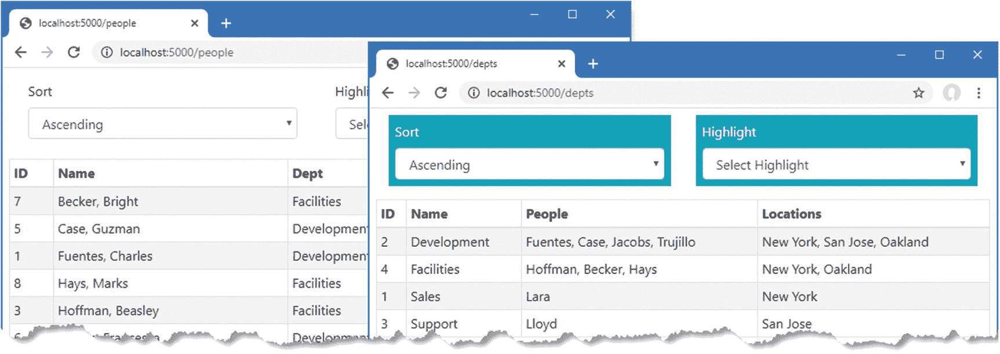

图 35-2。

在示例应用中启用 Razor 组件路由

#### 设置默认组件路由

清单 [35-5](#PC7) 中的配置更改为`Startup`类中的请求设置了回退路由。在应用的一个组件中需要一个相应的路由来标识应该为应用的默认 URL 显示的组件，如清单 [35-8](#PC10) 所示。

```cs
@page "/"
@page "/people"

<TableTemplate RowType="Person" RowData="People"
        Highlight="@(p => p.Location.City)" SortDirection="@(p => p.Surname)">
    <Header>
        <tr><th>ID</th><th>Name</th><th>Dept</th><th>Location</th></tr>
    </Header>
    <RowTemplate Context="p">
        <td>@p.PersonId</td>
        <td>@p.Surname, @p.Firstname</td>
        <td>@p.Department.Name</td>
        <td>@p.Location.City, @p.Location.State</td>
    </RowTemplate>
</TableTemplate>

@code {

    [Inject]
    public DataContext Context { get; set; }

    public IEnumerable<Person> People => Context.People
            .Include(p => p.Department)
            .Include(p => p.Location);
}

Listing 35-8.Defining the Default Route in the PeopleList.razor File in the Blazor Folder

```

重启 ASP.NET Core 并请求`http://localhost:5000`，你会看到`PeopleList`组件产生的内容，如图 [35-3](#Fig3) 所示。

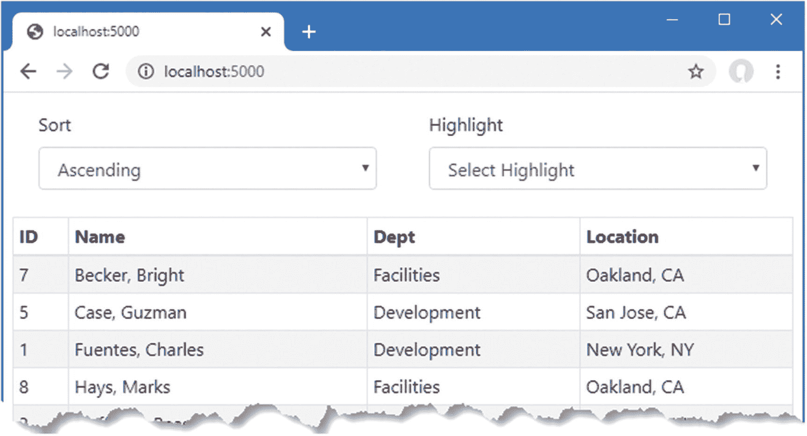

图 35-3。

显示默认 URL 的组件

### 在布线元件之间导航

基本的路由配置已经就绪，但是使用路由比前面章节中演示的独立组件有什么优势，这一点可能并不明显。改进来自于`NavLink`组件，它呈现连接到路由系统的锚元素。清单 [35-9](#PC11) 将`NavLink`添加到`PeopleList`组件中。

```cs
@page "/"
@page "/people"

<TableTemplate RowType="Person" RowData="People"
        Highlight="@(p => p.Location.City)" SortDirection="@(p => p.Surname)">
    <Header>
        <tr><th>ID</th><th>Name</th><th>Dept</th><th>Location</th></tr>
    </Header>
    <RowTemplate Context="p">
        <td>@p.PersonId</td>
        <td>@p.Surname, @p.Firstname</td>
        <td>@p.Department.Name</td>
        <td>@p.Location.City, @p.Location.State</td>
    </RowTemplate>
</TableTemplate>

<NavLink class="btn btn-primary" href="/depts">Departments</NavLink>

@code {

    [Inject]
    public DataContext Context { get; set; }

    public IEnumerable<Person> People => Context.People
            .Include(p => p.Department)
            .Include(p => p.Location);
}

Listing 35-9.Adding Navigation in the PeopleList.razor File in the Blazor Folder

```

与 ASP.NET Core 的其他部分使用的锚元素不同，`Navlink`组件是使用 URL 而不是组件、页面或动作名称来配置的。本例中的`NavLink`导航到由`DepartmentList`组件的`@page`指令支持的 URL。

导航也可以通过编程来执行，这在组件响应一个事件，然后需要导航到一个不同的 URL 时非常有用，如清单 [35-10](#PC12) 所示。

```cs
@page "/departments"
@page "/depts"

<CascadingValue Name="BgTheme" Value="Theme" IsFixed="false" >
    <TableTemplate RowType="Department" RowData="Departments"
        Highlight="@(d => d.Name)"
        SortDirection="@(d => d.Name)">
        <Header>
            <tr><th>ID</th><th>Name</th><th>People</th><th>Locations</th></tr>
        </Header>
        <RowTemplate Context="d">
            <td>@d.Departmentid</td>
            <td>@d.Name</td>
            <td>@(String.Join(", ", d.People.Select(p => p.Surname)))</td>
            <td>
                @(String.Join(", ",
                    d.People.Select(p => p.Location.City).Distinct()))
            </td>
        </RowTemplate>
    </TableTemplate>
</CascadingValue>

<SelectFilter Title="@("Theme")" Values="Themes" @bind-SelectedValue="Theme" />

<button class="btn btn-primary" @onclick="HandleClick">People</button>

@code {

    [Inject]
    public DataContext Context { get; set; }

    public IEnumerable<Department> Departments => Context.Departments
            .Include(d => d.People).ThenInclude(p => p.Location);

    public string Theme { get; set; } = "info";
    public string[] Themes = new string[] { "primary", "info", "success" };

    [Inject]
    public NavigationManager NavManager { get; set; }

    public void HandleClick() => NavManager.NavigateTo("/people");
}

Listing 35-10.Navigating Programmatically in the DepartmentList.razor File in the Blazor Folder

```

`NavigationManager`类提供了对导航的编程访问。表 [35-3](#Tab3) 描述了`NavigationManager`类提供的最重要的成员。

表 35-3。

有用的 NavigationManager 成员

<colgroup><col class="tcol1 align-left"> <col class="tcol2 align-left"></colgroup> 
| 

名字

 | 

描述

 |
| --- | --- |
| `NavigateTo(url)` | 此方法导航到指定的 URL，而不发送新的 HTTP 请求。 |
| `ToAbsoluteUri(path)` | 此方法将相对路径转换为完整的 URL。 |
| `ToBaseRelativePath(url)` | 此方法从完整的 URL 获取相对路径。 |
| `LocationChanged` | 当位置改变时，触发此事件。 |
| `Uri` | 这个属性返回当前的 URL。 |

`NavigationManager`类作为服务提供，由 Razor 组件使用`Inject`属性接收，该属性提供对第 [14 章](14.html)中描述的依赖注入特性的访问。

`NavigationManager.NavigateTo`方法导航到一个 URL，并在本例中用于导航到`/people` URL，这将由`PeopleList`组件处理。

要了解路由和导航的重要性，请重启 ASP.NET Core 并请求`http://localhost:5000/people`。单击按钮样式的 Departments 链接，将显示出`DepartmentList`组件。点击人物链接，将返回到`PeopleList`组件，如图 [35-4](#Fig4) 所示。

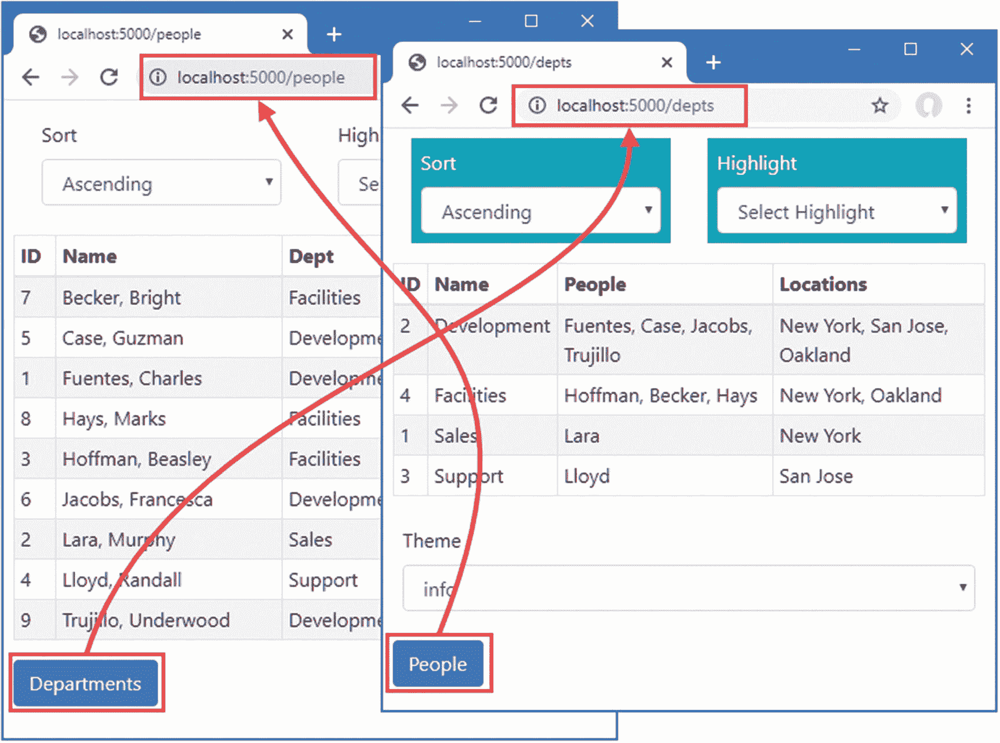

图 35-4。

在布线元件之间导航

如果您在 F12 开发人员工具打开的情况下执行这个序列，您将看到从一个组件到下一个组件的转换已经完成，不需要单独的 HTTP 请求，即使浏览器显示的 URL 发生了变化。Blazor 通过显示第一个组件时建立的持久 HTTP 连接交付每个组件呈现的内容，并使用 JavaScript API 进行导航，而无需加载新的 HTML 文档。

Tip

`NavigationManager.NavigateTo`方法接受一个可选参数，当`true`时，强制浏览器发送一个新的 HTTP 请求并重新加载 HTML 文档。

### 接收路由数据

组件可以通过用`Parameter`属性修饰属性来接收段变量。为了演示，将名为`PersonDisplay.razor`的 Razor 组件添加到`Blazor`文件夹中，内容如清单 [35-11](#PC13) 所示。

```cs
@page "/person"
@page "/person/{id:long}"

<h5>Editor for Person: @Id</h5>

<NavLink class="btn btn-primary" href="/people">Return</NavLink>

@code {

    [Parameter]
    public long Id { get; set; }
}

Listing 35-11.The Contents of the PersonDisplay.razor in the Blazor Folder

```

这个组件除了显示它从路由数据中接收到的值之外不做任何事情，直到我在本章后面添加特性。`@page`表达式包含一个名为`id`的段变量，其类型被指定为`long`。该组件通过定义一个同名的属性并用`Parameter`属性修饰它来接收分配给 segment 变量的值。

Tip

如果您没有在`@page`表达式中为段变量指定类型，那么您必须将属性的类型设置为`string`。

清单 [35-12](#PC14) 使用`NavLink`组件为由`PeopleList`组件显示的每个`Person`对象创建导航链接。

```cs
@page "/"
@page "/people"

<TableTemplate RowType="Person" RowData="People"
        Highlight="@(p => p.Location.City)" SortDirection="@(p => p.Surname)">
    <Header>
        <tr><th>ID</th><th>Name</th><th>Dept</th><th>Location</th>
            <td></td>
        </tr>
    </Header>
    <RowTemplate Context="p">
        <td>@p.PersonId</td>
        <td>@p.Surname, @p.Firstname</td>
        <td>@p.Department.Name</td>
        <td>@p.Location.City, @p.Location.State</td>
        <td>
            <NavLink class="btn btn-sm btn-info" href="@GetEditUrl(p.PersonId)">
                Edit
            </NavLink>
        </td>
    </RowTemplate>
</TableTemplate>

<NavLink class="btn btn-primary" href="/depts">Departments</NavLink>

@code {

    [Inject]
    public DataContext Context { get; set; }

    public IEnumerable<Person> People => Context.People
            .Include(p => p.Department)
            .Include(p => p.Location);

    public string GetEditUrl(long id) => $"/person/{id}";
}

Listing 35-12.Adding Navigation Links in the PeopleList.razor File in the Blazor Folder

```

Razor 组件不支持在属性值中混合静态内容和 Razor 表达式。相反，我定义了`GetEditUrl`方法来为每个`Person`对象生成导航 URL，调用该方法来为`NavLink href`属性生成值。

重启 ASP.NET Core，请求`http://localhost:5000/people`，点击其中一个编辑按钮。浏览器将导航到新的 URL，而无需重新加载 HTML 文档，并显示由`PersonDisplay`组件生成的占位符内容，如图 [35-5](#Fig5) 所示，该图显示了组件如何从路由系统接收数据。

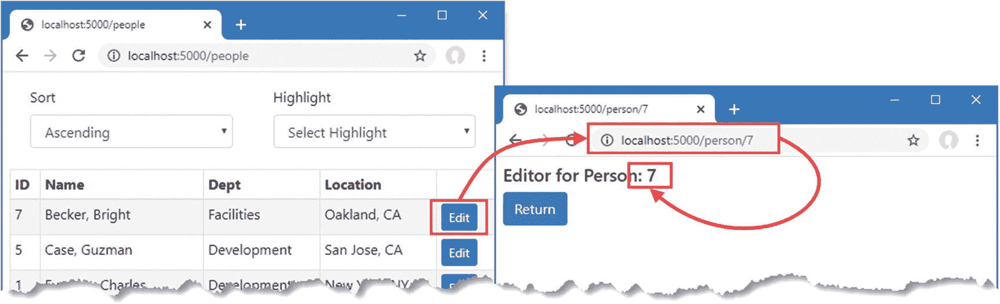

图 35-5。

在 Razor 组件中从路由系统接收数据

### 使用布局定义通用内容

布局是为 Razor 组件提供公共内容的模板组件。要创建一个布局，将一个名为`NavLayout.razor`的 Razor 组件添加到`Blazor`文件夹中，并添加清单 [35-13](#PC15) 中所示的内容。

```cs
@inherits LayoutComponentBase

<div class="container-fluid">
    <div class="row">
        <div class="col-3">
            @foreach (string key in NavLinks.Keys) {
                <NavLink class="btn btn-outline-primary btn-block"
                         href="@NavLinks[key]"
                         ActiveClass="btn-primary text-white"
                         Match="NavLinkMatch.Prefix">
                    @key
                </NavLink>
            }
        </div>
        <div class="col">
            @Body
        </div>
    </div>
</div>

@code {

    public Dictionary<string, string> NavLinks
        = new Dictionary<string, string> {
            {"People", "/people" },
            {"Departments", "/depts" },
            {"Details", "/person" }
        };
}

Listing 35-13.The Contents of the NavLayout.razor File in the Blazor Folder

```

布局使用`@inherits`表达式指定`LayoutComponentBase`类作为 Razor 组件生成的类的基础。`LayoutComponentBase`类定义了一个名为`Body`的`RenderFragment`类，用于指定布局显示的公共内容中组件的内容。在这个例子中，布局组件创建一个网格布局，为应用中的每个组件显示一组`NavLink`组件。`NavLink`组件配置了两个新属性，如表 [35-4](#Tab4) 所述。

表 35-4。

NavLink 配置属性

<colgroup><col class="tcol1 align-left"> <col class="tcol2 align-left"></colgroup> 
| 

名字

 | 

描述

 |
| --- | --- |
| `ActiveClass` | 该属性指定了一个或多个 CSS 类，当当前 URL 与`href`属性值匹配时，由`NavLink`组件呈现的锚元素将被添加到这些 CSS 类中。 |
| `Match` | 该属性使用来自`NavLinkMatch`枚举的值指定当前 URL 如何匹配到`href`属性。这些值是`Prefix`，如果`href`匹配 URL 的开头，则认为匹配；以及`All`，要求整个 URL 都相同。 |

`NavLink`组件被配置为使用`Prefix`匹配，并在匹配时将它们呈现的锚元素添加到引导程序`btn-primary`和`text-white`类中。

#### 应用布局

有三种方法可以应用布局。组件可以使用`@layout`表达式选择自己的布局。通过将子组件包装在内置的`LayoutView`组件中，父组件可以使用子组件的布局。通过设置`RouteView`组件的`DefaultLayout`属性，可以将一个布局应用于所有组件，如清单 [35-14](#PC16) 所示。

```cs
<Router AppAssembly="typeof(Startup).Assembly">
    <Found>
        <RouteView RouteData="@context" DefaultLayout="typeof(NavLayout)" />
    </Found>
    <NotFound>
        <h4 class="bg-danger text-white text-center p-2">
            Not Matching Route Found
        </h4>
    </NotFound>
</Router>

Listing 35-14.Applying a Layout in the Routed.razor File in the Blazor Folder

```

重启 ASP.NET Core 并请求`http://localhost:5000/people`。布局将显示由`PeopleList`组件呈现的内容。布局左侧的导航按钮可用于导航应用，如图 [35-6](#Fig6) 所示。

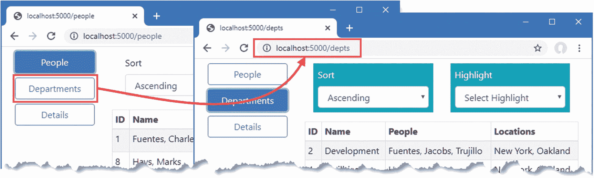

图 35-6。

使用布局组件

Note

如果您请求`http://localhost:5000`，您将看到来自`PeopleList`组件的内容，但是相应的导航按钮不会高亮显示。我将在下一节向您展示如何解决这个问题。

## 理解组件生命周期方法

Razor 组件有一个定义良好的生命周期，用组件可以实现的接收关键转换通知的方法来表示。表 [35-5](#Tab5) 描述了生命周期方法。

表 35-5。

Razor 组件生命周期方法

<colgroup><col class="tcol1 align-left"> <col class="tcol2 align-left"></colgroup> 
| 

名字

 | 

描述

 |
| --- | --- |
| `OnInitialized()``OnInitializedAsync()` | 这些方法在组件首次初始化时调用。 |
| `OnParametersSet()``OnParametersSetAsync()` | 在应用了用`Parameter`属性修饰的属性值之后，调用这些方法。 |
| `ShouldRender()` | 在呈现组件内容之前调用此方法，以更新呈现给用户的内容。如果该方法返回`false`，组件的内容将不会被呈现，并且更新被禁止。此方法不抑制组件的初始呈现。 |
| `OnAfterRender(first)``OnAfterRenderAsync(first)` | 该方法在组件内容呈现后调用。当 Blazor 为组件执行初始渲染时,`bool`参数为`true`。 |

使用`OnInitialized`或`OnParameterSet`方法对于设置组件的初始状态很有用。上一节定义的布局不处理默认 URL，因为`NavLink`组件只匹配一个 URL。对于`DepartmentList`组件也存在同样的问题，它可以使用`/departments`和`/depts`路径来请求。

UNDERSTANDING LIFECYCLES FOR ROUTED COMPONENTS

使用 URL 路由时，当 URL 更改时，可以从显示中删除组件。组件可以实现`System.IDisposable`接口，Blazor 会在组件移除时调用方法。

创建匹配多个 URL 的组件需要使用生命周期方法。为了理解为什么，将一个名为`MultiNavLink.razor`的 Razor 组件添加到`Blazor`文件夹中，其内容如清单 [35-15](#PC17) 所示。

```cs
<a class="@ComputedClass" @onclick="HandleClick"  href="">
    @ChildContent
</a>

@code {

    [Inject]
    public NavigationManager NavManager { get; set; }

    [Parameter]
    public IEnumerable<string> Href { get; set; }

    [Parameter]
    public string Class { get; set; }

    [Parameter]
    public string ActiveClass { get; set; }

    [Parameter]
    public NavLinkMatch? Match { get; set; }

    public NavLinkMatch ComputedMatch { get =>
            Match ?? (Href.Count() == 1 ? NavLinkMatch.Prefix : NavLinkMatch.All); }

    [Parameter]
    public RenderFragment ChildContent { get; set; }

    public string ComputedClass { get; set; }

    public void HandleClick() {
        NavManager.NavigateTo(Href.First());
    }

    private void CheckMatch(string currentUrl) {
        string path = NavManager.ToBaseRelativePath(currentUrl);
        path = path.EndsWith("/") ? path.Substring(0, path.Length - 1) : path;
        bool match = Href.Any(href => ComputedMatch == NavLinkMatch.All
                ? path == href : path.StartsWith(href));
        ComputedClass = match ? $"{Class} {ActiveClass}" : Class;
    }

    protected override void OnParametersSet() {
        ComputedClass = Class;
        NavManager.LocationChanged += (sender, arg) => CheckMatch(arg.Location);
        Href = Href.Select(h => h.StartsWith("/") ? h.Substring(1) : h);
        CheckMatch(NavManager.Uri);
    }
}

Listing 35-15.The Contents of the MultiNavLink.razor File in the Blazor Folder

```

该组件的工作方式与常规的`NavLink`相同，但是接受一组匹配的路径。该组件依赖于`OnParametersSet`生命周期方法，因为需要一些初始设置，这些设置在用`Parameter`属性修饰的属性赋值后才能执行，比如提取单独的路径。

该组件通过监听由`NavigationManager`类定义的`LocationChanged`事件来响应当前 URL 的变化。事件的`Location`属性为组件提供了当前的 URL，用于改变锚元素的类。清单 [35-16](#PC18) 在布局中应用新组件。

Tip

注意，我已经删除了清单 [35-14](#PC16) 中的`Match`属性。这个新组件支持这个属性，但是默认情况下会根据它通过`href`属性接收到的路径数量进行匹配。

```cs
@inherits LayoutComponentBase

<div class="container-fluid">
    <div class="row">
        <div class="col-3">
            @foreach (string key in NavLinks.Keys) {
                <MultiNavLink class="btn btn-outline-primary btn-block"
                         href="@NavLinks[key]" ActiveClass="btn-primary text-white">
                    @key
                </MultiNavLink>
            }
        </div>
        <div class="col">
            @Body
        </div>
    </div>
</div>

@code {

    public Dictionary<string, string[]> NavLinks
        = new Dictionary<string, string[]> {
            {"People", new string[] {"/people", "/" } },
            {"Departments", new string[] {"/depts", "/departments" } },
            {"Details", new string[] { "/person" } }
        };
}

Listing 35-16.Applying a New Component in the NavLayout.razor File in the Blazor Folder

```

重启 ASP.NET Core 并请求`http://localhost:5000`和`http://localhost:5000/departments`。两个 URL 都被识别，相应的导航按钮高亮显示，如图 [35-7](#Fig7) 所示。

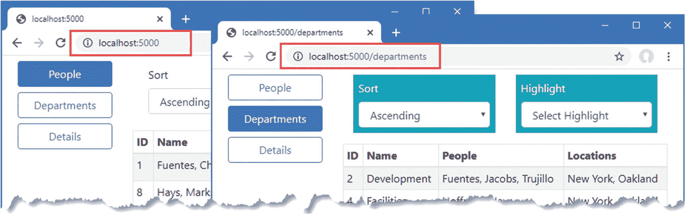

图 35-7。

使用生命周期方法

### 对异步任务使用生命周期方法

生命周期方法对于执行可能在组件的初始内容已经呈现之后完成的任务也是有用的，例如查询数据库。清单 [35-17](#PC19) 替换了`PersonDisplay`组件中的占位符内容，并使用生命周期方法，使用作为参数接收的值来查询数据库。

```cs
@page "/person"
@page "/person/{id:long}"

@if (Person == null) {
    <h5 class="bg-info text-white text-center p-2">Loading...</h5>
} else {
    <table class="table table-striped table-bordered">
        <tbody>
            <tr><th>Id</th><td>@Person.PersonId</td></tr>
            <tr><th>Surname</th><td>@Person.Surname</td></tr>
            <tr><th>Firstname</th><td>@Person.Firstname</td></tr>
        </tbody>
    </table>
}

<button class="btn btn-outline-primary" @onclick="@(() => HandleClick(false))">
    Previous
</button>
<button class="btn btn-outline-primary" @onclick="@(() => HandleClick(true))">
    Next
</button>

@code {

    [Inject]
    public DataContext Context { get; set; }

    [Inject]
    public NavigationManager NavManager { get; set; }

    [Parameter]
    public long Id { get; set; } = 0;

    public Person Person { get; set; }

    protected async override Task OnParametersSetAsync() {
        await Task.Delay(1000);
        Person = await Context.People
            .FirstOrDefaultAsync(p => p.PersonId == Id) ?? new Person();
    }

    public void HandleClick(bool increment) {
        Person = null;
        NavManager.NavigateTo($"/person/{(increment ? Id + 1 : Id -1)}");
    }
}

Listing 35-17.Querying for Data in the PersonDisplay.razor File in the Blazor Folder

```

在设置参数值之前，组件不能查询数据库，因此在`OnParametersSetAsync`方法中获得了`Person`属性的值。由于数据库与 ASP.NET Core 服务器并行运行，所以我在查询数据库之前增加了一秒钟的延迟，以帮助强调组件的工作方式。

在查询完成之前,`Person`属性的值是`null`,此时，如果查询没有产生结果，它将是一个表示查询结果的对象或一个新的`Person`对象。当`Person`对象为`null`时，显示加载信息。

重启 ASP.NET Core 并请求`http://localhost:5000`。单击表格中的一个编辑按钮，`PersonDisplay`组件将显示数据摘要。点击上一个和下一个按钮，查询主键值相邻的对象，结果如图 [35-8](#Fig8) 所示。

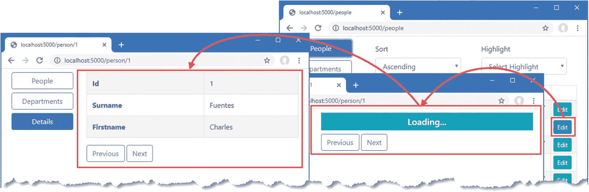

图 35-8。

在组件中执行异步任务

注意，Blazor 在向用户显示内容之前不会等待在`OnParametersSetAsync`方法中执行的`Task`完成，这就是为什么当`Person`属性为`null`时加载消息是有用的。一旦`Task`完成，并且已经为`Person`属性赋值，组件的视图将自动重新呈现，并且更改将通过持久 HTTP 连接发送到浏览器，以显示给用户。

## 管理组件交互

大多数组件通过参数和事件协同工作，允许用户的交互来驱动应用的变化。Blazor 还提供了管理与组件交互的高级选项，我将在下面几节中介绍。

### 使用对子组件的引用

父组件可以获取对子组件的引用，并使用它来使用它定义的属性和方法。在准备阶段，清单 [35-18](#PC20) 向`MultiNavLink`组件添加了一个禁用状态。

```cs
<a class="@ComputedClass" @onclick="HandleClick"  href="">
    @if (Enabled) {
        @ChildContent
    } else {
        @("Disabled")
    }
</a>

@code {

    [Inject]
    public NavigationManager NavManager { get; set; }

    [Parameter]
    public IEnumerable<string> Href { get; set; }

    [Parameter]
    public string Class { get; set; }

    [Parameter]
    public string ActiveClass { get; set; }

    [Parameter]
    public string DisabledClasses { get; set; }

    [Parameter]
    public NavLinkMatch? Match { get; set; }

    public NavLinkMatch ComputedMatch { get =>
            Match ?? (Href.Count() == 1 ? NavLinkMatch.Prefix : NavLinkMatch.All); }

    [Parameter]
    public RenderFragment ChildContent { get; set; }

    public string ComputedClass { get; set; }

    public void HandleClick() {
        NavManager.NavigateTo(Href.First());
    }

    private void CheckMatch(string currentUrl) {
        string path = NavManager.ToBaseRelativePath(currentUrl);
        path = path.EndsWith("/") ? path.Substring(0, path.Length - 1) : path;
        bool match = Href.Any(href => ComputedMatch == NavLinkMatch.All
                ? path == href : path.StartsWith(href));
        if (!Enabled) {
            ComputedClass = DisabledClasses;
        } else {
            ComputedClass = match ? $"{Class} {ActiveClass}" : Class;
        }
    }

    protected override void OnParametersSet() {
        ComputedClass = Class;
        NavManager.LocationChanged += (sender, arg) => CheckMatch(arg.Location);
        Href = Href.Select(h => h.StartsWith("/") ? h.Substring(1) : h);
        CheckMatch(NavManager.Uri);
    }

    private bool Enabled { get; set; } = true;

    public void SetEnabled(bool enabled) {
        Enabled = enabled;
        CheckMatch(NavManager.Uri);
    }
}

Listing 35-18.Adding a Feature in the MultiNavLink.razor File in the Blazor Folder

```

在清单 [35-19](#PC21) 中，我已经更新了共享布局，这样它就保留了对`MultiNavLink`组件和一个切换它们的`Enabled`属性值的`button`的引用。

```cs
@inherits LayoutComponentBase

<div class="container-fluid">
    <div class="row">
        <div class="col-3">
            @foreach (string key in NavLinks.Keys) {
                <MultiNavLink class="btn btn-outline-primary btn-block"
                         href="@NavLinks[key]"
                         ActiveClass="btn-primary text-white"
                         DisabledClasses="btn btn-dark text-light btn-block disabled"
                         @ref="Refs[key]">
                    @key
                </MultiNavLink>
            }
            <button class="btn btn-secondary btn-block mt-5 " @onclick="ToggleLinks">
                Toggle Links
            </button>
        </div>
        <div class="col">
            @Body
        </div>
    </div>
</div>

@code {

    public Dictionary<string, string[]> NavLinks
        = new Dictionary<string, string[]> {
            {"People", new string[] {"/people", "/" } },
            {"Departments", new string[] {"/depts", "/departments" } },
            {"Details", new string[] { "/person" } }
        };

    public Dictionary<string, MultiNavLink> Refs
        = new Dictionary<string, MultiNavLink>();

    private bool LinksEnabled = true;

    public void ToggleLinks() {
        LinksEnabled = !LinksEnabled;
        foreach (MultiNavLink link in Refs.Values) {
            link.SetEnabled(LinksEnabled);
        }
    }
}

Listing 35-19.Retaining References in the NavLayout.razor File in the Blazor Folder

```

对组件的引用是通过添加一个`@ref`属性并指定组件应该被分配到的字段或属性的名称来创建的。因为`MultiNavLink`组件是在由`Dictionary`驱动的`@foreach`循环中创建的，所以保留引用的最简单方法也是在`Dictionary`中，就像这样:

```cs
...
<MultiNavLink class="btn btn-outline-primary btn-block"
    href="@NavLinks[key]" ActiveClass="btn-primary text-white"
    DisabledClasses="btn btn-dark text-light btn-block disabled"
    @ref="Refs[key]">
...

```

当每个`MultiNavLink`组件被创建时，它被添加到`Refs`字典中。Razor 组件被编译成标准的 C# 类，这意味着一个`MultiNavLink`组件的集合就是一个`MultiNavlink`对象的集合。

```cs
...
public Dictionary<string, MultiNavLink> Refs
        = new Dictionary<string, MultiNavLink>();
...

```

重启 ASP.NET Core，请求 http `://localhost:5000`，并点击切换链接按钮。事件处理程序调用`ToggleLinks`方法，为每个`MultiNavLink`组件设置`Enabled`属性的值，如图 [35-9](#Fig9) 所示。

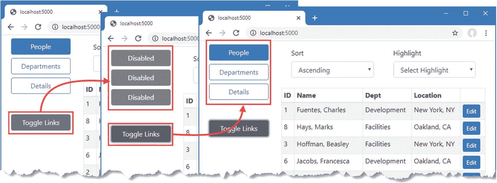

图 35-9。

保留对组件的引用

Caution

只有在组件的内容已经呈现并且已经调用了`OnAfterRender` / `OnAfterRenderAsync`生命周期方法之后，才能使用引用。这使得引用非常适合在事件处理程序中使用，但不适用于早期的生命周期方法。

### 与其他代码中的组件交互

ASP.NET Core 应用中的其他代码可以使用这些组件，从而允许复杂项目的各个部分之间进行更丰富的交互。清单 [35-20](#PC24) 改变了`MultiNavLink`组件中的方法，因此它可以被 ASP.NET Core 应用的其他部分调用来启用和禁用导航。

```cs
<a class="@ComputedClass" @onclick="HandleClick"  href="">
    @if (Enabled) {
        @ChildContent
    } else {
        @("Disabled")
    }
</a>

@code {

    // ...other properties and methods omitted for brevity...

    public void SetEnabled(bool enabled) {
        InvokeAsync(() => {
            Enabled = enabled;
            CheckMatch(NavManager.Uri);
            StateHasChanged();
        });
    }
}

Listing 35-20.Replacing a Method in the MultiNavLink.razor File in the Blazor Folder

```

Razor 组件提供了两种在 Blazor 环境之外调用的代码中使用的方法，如表 [35-6](#Tab6) 中所述。

表 35-6。

Razor 组件外部调用方法

<colgroup><col class="tcol1 align-left"> <col class="tcol2 align-left"></colgroup> 
| 

名字

 | 

描述

 |
| --- | --- |
| `InvokeAsync(func)` | 这个方法用于在 Blazor 环境中执行一个函数。 |
| `StateHasChanged()` | 当变更发生在正常的生命周期之外时，就会调用这个方法，如下一节所示。 |

`InvokeAsync`方法用于调用 Blazor 环境中的一个函数，确保更改得到正确处理。当所有的更改都被应用时，调用`StateHasChanged`方法，触发 Blazor 更新并确保组件的输出反映了更改。

要创建一个在整个应用中都可用的服务，创建`Advanced/Services`文件夹并向其中添加一个名为`ToggleService.cs`的类文件，代码如清单 [35-21](#PC25) 所示。

```cs
using Advanced.Blazor;
using System.Collections.Generic;

namespace Advanced.Services {
    public class ToggleService {
        private List<MultiNavLink> components = new List<MultiNavLink>();
        private bool enabled = true;

        public void EnrolComponents(IEnumerable<MultiNavLink> comps) {
            components.AddRange(comps);
        }

        public bool ToggleComponents() {
            enabled = !enabled;
            components.ForEach(c => c.SetEnabled(enabled));
            return enabled;
        }
    }
}

Listing 35-21.The Contents of the ToggleService.cs File in the Services Folder

```

该服务管理一组组件，并在调用其`ToggleComponents`方法时调用所有组件的`SetEnabled`方法。在这个服务中没有 Blazor 特有的东西，它依赖于编译 Razor 组件文件时产生的 C# 类。清单 [35-22](#PC26) 更新应用配置，将`ToggleService`类配置为单例服务。

```cs
...
public void ConfigureServices(IServiceCollection services) {
    services.AddDbContext<DataContext>(opts => {
        opts.UseSqlServer(Configuration[
            "ConnectionStrings:PeopleConnection"]);
        opts.EnableSensitiveDataLogging(true);
    });
    services.AddControllersWithViews().AddRazorRuntimeCompilation();
    services.AddRazorPages().AddRazorRuntimeCompilation();
    services.AddServerSideBlazor();
    services.AddSingleton<Services.ToggleService>();
}
...

Listing 35-22.Configuring a Service in the Startup.cs File in the Advanced Folder

```

清单 [35-23](#PC27) 更新了 Blazor 布局，以便保留对`MultiNavLink`组件的引用，并向新服务注册。

```cs
@inherits LayoutComponentBase
@using Advanced.Services

<div class="container-fluid">
    <div class="row">
        <div class="col-3">
            @foreach (string key in NavLinks.Keys) {
                <MultiNavLink class="btn btn-outline-primary btn-block"
                         href="@NavLinks[key]"
                         ActiveClass="btn-primary text-white"
                         DisabledClasses="btn btn-dark text-light btn-block disabled"
                         @ref="Refs[key]">
                    @key
                </MultiNavLink>
            }
            <button class="btn btn-secondary btn-block mt-5 " @onclick="ToggleLinks">
                Toggle Links
            </button>
        </div>
        <div class="col">
            @Body
        </div>
    </div>
</div>

@code {

    [Inject]
    public ToggleService Toggler { get; set; }

    public Dictionary<string, string[]> NavLinks
        = new Dictionary<string, string[]> {
            {"People", new string[] {"/people", "/" } },
            {"Departments", new string[] {"/depts", "/departments" } },
            {"Details", new string[] { "/person" } }
        };

    public Dictionary<string, MultiNavLink> Refs
        = new Dictionary<string, MultiNavLink>();

    protected override void OnAfterRender(bool firstRender) {
        if (firstRender) {
            Toggler.EnrolComponents(Refs.Values);
        }
    }

    public void ToggleLinks() {
        Toggler.ToggleComponents();
    }
}

Listing 35-23.Using the Service in the NavLayout.razor File in the Blazor Folder

```

如前一节所述，组件引用在内容呈现后才可用。清单 [35-23](#PC27) 使用`OnAfterRender`生命周期方法向服务注册组件引用，这是通过依赖注入接收的。

最后一步是从 ASP.NET Core 应用的不同部分使用服务。清单 [35-24](#PC28) 向`Home`控制器添加了一个简单的动作方法，每次处理一个请求时，它都会调用`ToggleService.ToggleComponents`方法。

```cs
using Advanced.Models;
using Microsoft.AspNetCore.Mvc;
using Microsoft.EntityFrameworkCore;
using System.Collections.Generic;
using System.Linq;
using Advanced.Services;

namespace Advanced.Controllers {
    public class HomeController : Controller {
        private DataContext context;
        private ToggleService toggleService;

        public HomeController(DataContext dbContext, ToggleService ts) {
            context = dbContext;
            toggleService = ts;
        }

        public IActionResult Index([FromQuery] string selectedCity) {
            return View(new PeopleListViewModel {
                People = context.People
                    .Include(p => p.Department).Include(p => p.Location),
                Cities = context.Locations.Select(l => l.City).Distinct(),
                SelectedCity = selectedCity
            });
        }

        public string Toggle() => $"Enabled: { toggleService.ToggleComponents() }";
    }

    public class PeopleListViewModel {
        public IEnumerable<Person> People { get; set; }
        public IEnumerable<string> Cities { get; set; }
        public string SelectedCity { get; set; }

        public string GetClass(string city) =>
            SelectedCity == city ? "bg-info text-white" : "";
    }
}

Listing 35-24.Adding an Action Method in the HomeController.cs File in the Controllers Folder

```

重启 ASP.NET Core 并请求`http://localhost:5000`。打开单独的浏览器窗口并请求`http://localhost:5000/controllers/home/toggle`。当第二个请求由 ASP.NET Core 应用处理时，操作方法将使用服务，该服务切换导航按钮的状态。每次请求`/controllers/home/toggle`，导航按钮的状态都会发生变化，如图 [35-10](#Fig10) 所示。

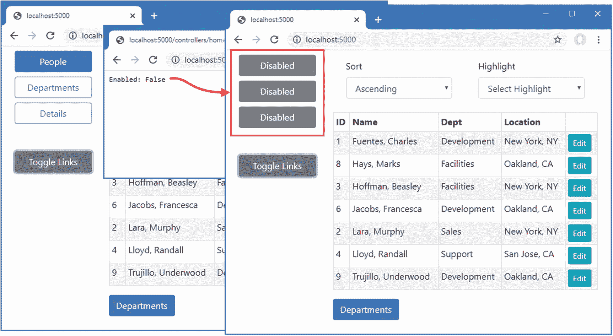

图 35-10。

调用组件方法

### 使用 JavaScript 与组件交互

Blazor 为 JavaScript 和服务器端 C# 代码之间的交互提供了一系列工具，如以下部分所述。

#### 从组件调用 JavaScript 函数

为了准备这些例子，将一个名为`interop.js`的 JavaScript 文件添加到`wwwroot`文件夹中，并添加清单 [35-25](#PC29) 中所示的代码。

```cs
function addTableRows(colCount) {
    let elem = document.querySelector("tbody");
    let row = document.createElement("tr");
    elem.append(row);
    for (let i = 0; i < colCount; i++) {
        let cell = document.createElement("td");
        cell.innerText = "New Elements"
        row.append(cell);
    }
}

Listing 35-25.The Contents of the interop.js File in the wwwroot Folder

```

JavaScript 代码使用浏览器提供的 API 来定位一个`tbody`元素，该元素表示表的主体，并添加一个新行，该行包含 function 参数指定的单元格数量。

为了将 JavaScript 文件合并到应用中，将清单 [35-26](#PC30) 中所示的元素添加到`_Host` Razor 页面，该页面被配置为将 Blazor 应用交付给浏览器的回退页面。

```cs
@page "/"
@{ Layout = null; }

<!DOCTYPE html>
<html>
<head>
    <title>@ViewBag.Title</title>
    <link href="/lib/twitter-bootstrap/css/bootstrap.min.css" rel="stylesheet" />
    <base href="~/" />
</head>
<body>
    <div class="m-2">
        <component type="typeof(Advanced.Blazor.Routed)" render-mode="Server" />
    </div>
    <script src="_framework/blazor.server.js"></script>
    <script src="~/interop.js"></script>
</body>
</html>

Listing 35-26.Adding an Element in the _Host.cshtml File in the Pages Folder

```

清单 [35-27](#PC31) 修改了`PersonDisplay`组件，这样当`onclick`事件被触发时，它会呈现一个调用 JavaScript 函数的按钮。我还删除了我之前添加的延迟，以演示组件生命周期方法的使用。

```cs
@page "/person"
@page "/person/{id:long}"

@if (Person == null) {
    <h5 class="bg-info text-white text-center p-2">Loading...</h5>
} else {
    <table class="table table-striped table-bordered">
        <tbody>
            <tr><th>Id</th><td>@Person.PersonId</td></tr>
            <tr><th>Surname</th><td>@Person.Surname</td></tr>
            <tr><th>Firstname</th><td>@Person.Firstname</td></tr>
        </tbody>
    </table>
}

<button class="btn btn-outline-primary" @onclick="@HandleClick">
    Invoke JS Function
</button>

@code {

    [Inject]
    public DataContext Context { get; set; }

    [Inject]
    public NavigationManager NavManager { get; set; }

    [Inject]
    public IJSRuntime JSRuntime { get; set; }

    [Parameter]
    public long Id { get; set; } = 0;

    public Person Person { get; set; }

    protected async override Task OnParametersSetAsync() {
        //await Task.Delay(1000);
        Person = await Context.People
            .FirstOrDefaultAsync(p => p.PersonId == Id) ?? new Person();
    }

    public async Task HandleClick() {
        await JSRuntime.InvokeVoidAsync("addTableRows", 2);
    }
}

Listing 35-27.Invoking a JavaScript Function in the PersonDisplay.razor File in the Blazor Folder

```

调用 JavaScript 函数是通过`IJSRuntime`接口完成的，组件通过依赖注入接收该接口。该服务作为 Blazor 配置的一部分自动创建，并提供表 [35-7](#Tab7) 中描述的方法。

表 35-7。

IJSRuntime 方法

<colgroup><col class="tcol1 align-left"> <col class="tcol2 align-left"></colgroup> 
| 

名字

 | 

描述

 |
| --- | --- |
| `InvokeAsync<T>(name, args)` | 该方法使用提供的参数调用指定的函数。结果类型由泛型类型参数指定。 |
| `InvokeVoidAsync(name, args)` | 这个方法调用一个不产生结果的函数。 |

在清单 [35-27](#PC31) 中，我使用`InvokeVoidAsync`方法调用`addTableRows` JavaScript 函数，为函数参数提供一个值。重启 ASP.NET Core，导航到`http://localhost:5000/person/1`，点击调用 JS 函数按钮。Blazor 将调用 JavaScript 函数，该函数在表的末尾添加一行，如图 [35-11](#Fig11) 所示。

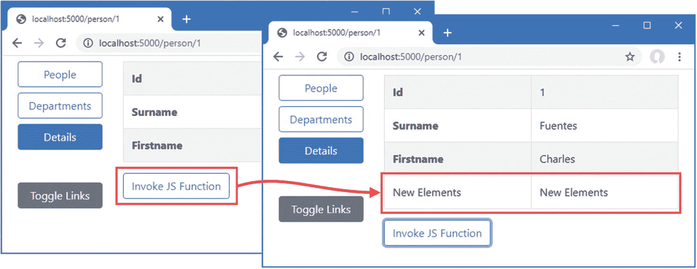

图 35-11。

调用 JavaScript 函数

#### 保留对 HTML 元素的引用

Razor 组件可以保留对它们创建的 HTML 元素的引用，并将这些引用传递给 JavaScript 代码。清单 [35-28](#PC32) 改变了前一个例子中的 JavaScript 函数，使其对通过参数接收的 HTML 元素进行操作。

```cs
function addTableRows(colCount, elem) {
    //let elem = document.querySelector("tbody");
    let row = document.createElement("tr");
    elem.parentNode.insertBefore(row, elem);
    for (let i = 0; i < colCount; i++) {
        let cell = document.createElement("td");
        cell.innerText = "New Elements"
        row.append(cell);
    }
}

Listing 35-28.Defining a Parameter in the interop.js File in the wwwroot Folder

```

在清单 [35-29](#PC33) 中，`PersonDisplay`组件保留了对它创建的 HTML 元素之一的引用，并将其作为参数传递给 JavaScript 函数。

```cs
@page "/person"
@page "/person/{id:long}"

@if (Person == null) {
    <h5 class="bg-info text-white text-center p-2">Loading...</h5>
} else {
    <table class="table table-striped table-bordered">
        <tbody>
            <tr><th>Id</th><td>@Person.PersonId</td></tr>
            <tr @ref="RowReference"><th>Surname</th><td>@Person.Surname</td></tr>
            <tr><th>Firstname</th><td>@Person.Firstname</td></tr>
        </tbody>
    </table>
}

<button class="btn btn-outline-primary" @onclick="@HandleClick">
    Invoke JS Function
</button>

@code {

    [Inject]
    public DataContext Context { get; set; }

    [Inject]
    public NavigationManager NavManager { get; set; }

    [Inject]
    public IJSRuntime JSRuntime { get; set; }

    [Parameter]
    public long Id { get; set; } = 0;

    public Person Person { get; set; }

    protected async override Task OnParametersSetAsync() {
        //await Task.Delay(1000);
        Person = await Context.People
            .FirstOrDefaultAsync(p => p.PersonId == Id) ?? new Person();
    }

    public ElementReference RowReference { get; set; }

    public async Task HandleClick() {
        await JSRuntime.InvokeVoidAsync("addTableRows", 2, RowReference);
    }
}

Listing 35-29.Retaining a Reference in the PersonDisplay.razor File in the Blazor Folder

```

属性将 HTML 元素分配给一个属性，该属性的类型必须是`ElementReference`。重启 ASP.NET Core，请求`http://localhost:5000/person/1`，点击调用 JS 函数按钮。ElementReference 属性的值通过`InvokeVoidAsync`方法作为参数传递给 JavaScript 函数，产生如图 [35-12](#Fig12) 所示的结果。

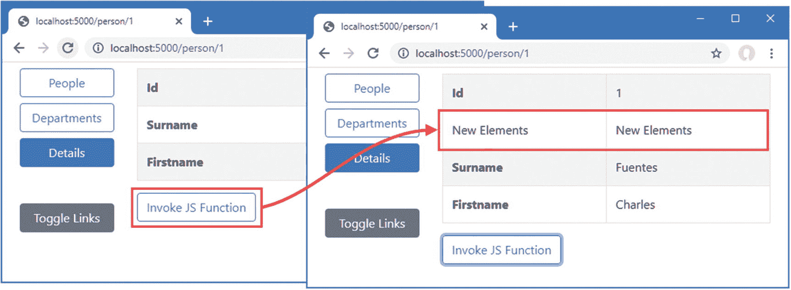

图 35-12。

保留对 HTML 元素的引用

Note

引用常规 HTML 元素的唯一用途是将其传递给 JavaScript 函数。使用前面章节中描述的绑定和事件功能与组件呈现的元素进行交互。

#### 从 JavaScript 调用组件方法

从 JavaScript 调用 C# 方法的基本方法是使用`static`方法。清单 [35-30](#PC34) 向`MultiNavLink`组件添加了一个静态方法来改变启用状态。

```cs
<a class="@ComputedClass" @onclick="HandleClick"  href="">
    @if (Enabled) {
        @ChildContent
    } else {
        @("Disabled")
    }
</a>

@code {

    // ...other methods and properties omitted for brevity...

    [JSInvokable]
    public static void ToggleEnabled() => ToggleEvent.Invoke(null, new EventArgs());

    private static event EventHandler ToggleEvent;

    protected override void OnInitialized() {
        ToggleEvent += (sender, args) => SetEnabled(!Enabled);
    }
}

Listing 35-30.Introducing Static Members in the MultiNavLink.razor File in the Blazor Folder

```

静态方法必须用`JSInvokable`属性修饰，然后才能从 JavaScript 代码中调用。使用`static`方法的主要限制是很难更新单个组件，所以我定义了一个`static`事件，组件的每个实例都会处理这个事件。该事件名为`ToggleEvent`，由静态方法触发，该方法将从 JavaScript 调用。为了监听事件，我使用了`OnInitialized`生命周期事件。当接收到事件时，组件的启用状态通过实例方法`SetEnabled`切换，该方法使用在 Blazor 外部进行更改时所需的`InvokeAsync`和`StateHasChanged`方法。

清单 [35-31](#PC35) 向 JavaScript 文件添加了一个函数，该函数创建一个按钮元素，当它被点击时调用静态 C# 方法。

```cs
function addTableRows(colCount, elem) {
    //let elem = document.querySelector("tbody");
    let row = document.createElement("tr");
    elem.parentNode.insertBefore(row, elem);
    for (let i = 0; i < colCount; i++) {
        let cell = document.createElement("td");
        cell.innerText = "New Elements"
        row.append(cell);
    }
}

function createToggleButton() {
    let sibling = document.querySelector("button:last-of-type");
    let button = document.createElement("button");
    button.classList.add("btn", "btn-secondary", "btn-block");
    button.innerText = "JS Toggle";
    sibling.parentNode.insertBefore(button, sibling.nextSibling);
    button.onclick = () => DotNet.invokeMethodAsync("Advanced", "ToggleEnabled");
}

Listing 35-31.Adding a Function in the interop.js File in the wwwroot Folder

```

新函数定位一个现有的`button`元素，并在它之后添加一个新按钮。单击按钮时，组件方法被调用，如下所示:

```cs
...
button.onclick = () => DotNet.invokeMethodAsync("Advanced", "ToggleEnabled");
...

```

密切注意用于 C# 方法的 JavaScript 函数的大小写是很重要的:它是`DotNet`，后面跟一个句号，后面跟`invokeMethodAsync`，还有一个小写的`i`。参数是程序集的名称和静态方法的名称。(组件的名称不是必需的。)

清单 [35-31](#PC35) 中的函数寻找的`button`元素直到 Blazor 为用户呈现内容后才可用。出于这个原因，清单 [35-32](#PC37) 向由`NavLayout`组件定义的`OnAfterRenderAsync`方法添加了一条语句，以便仅在内容被呈现时调用 JavaScript 函数。(`NavLayout`组件是`MultiNavLink`组件的父组件，当调用`static`方法时，它将受到影响，并允许我确保 JavaScript 函数只被调用一次。)

```cs
...
@code {

    [Inject]
    public IJSRuntime JSRuntime { get; set; }

    [Inject]
    public ToggleService Toggler { get; set; }

    public Dictionary<string, string[]> NavLinks
        = new Dictionary<string, string[]> {
            {"People", new string[] {"/people", "/" } },
            {"Departments", new string[] {"/depts", "/departments" } },
            {"Details", new string[] { "/person" } }
        };

    public Dictionary<string, MultiNavLink> Refs
        = new Dictionary<string, MultiNavLink>();

    protected async override Task OnAfterRenderAsync(bool firstRender) {
        if (firstRender) {
            Toggler.EnrolComponents(Refs.Values);
            await JSRuntime.InvokeVoidAsync("createToggleButton");
        }
    }

    public void ToggleLinks() {
        Toggler.ToggleComponents();
    }
}
...

Listing 35-32.Invoking a JavaScript Function in the NavLayout.razor File in the Blazor Folder

```

重启 ASP.NET Core 并请求`http://localhost:5000`。一旦 Blazor 呈现了它的内容，JavaScript 函数将被调用并创建一个新按钮。点击按钮调用`static`方法，该方法触发切换导航按钮状态的事件并导致 Blazor 更新，如图 [35-13](#Fig13) 所示。

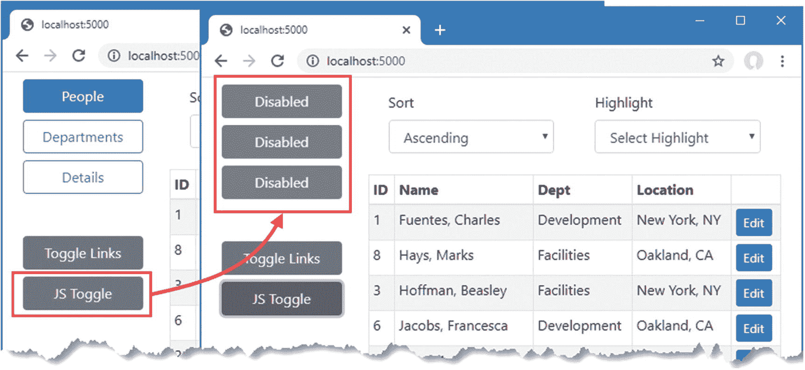

图 35-13。

从 JavaScript 调用组件方法

#### 从 JavaScript 函数调用实例方法

前一个例子中的部分复杂性来自于响应一个`static`方法来更新 Razor 组件对象。另一种方法是为 JavaScript 代码提供对实例方法的引用，然后可以直接调用它。

第一步是向 JavaScript 代码将调用的方法添加`JSInvokable`属性。我将调用由`ToggleService`类定义的`ToggleComponents`方法，如清单 [35-33](#PC38) 所示。

```cs
using Advanced.Blazor;
using System.Collections.Generic;
using Microsoft.JSInterop;

namespace Advanced.Services {
    public class ToggleService {
        private List<MultiNavLink> components = new List<MultiNavLink>();
        private bool enabled = true;

        public void EnrolComponents(IEnumerable<MultiNavLink> comps) {
            components.AddRange(comps);
        }

        [JSInvokable]
        public bool ToggleComponents() {
            enabled = !enabled;
            components.ForEach(c => c.SetEnabled(enabled));
            return enabled;
        }
    }
}

Listing 35-33.Applying an Attribute in the ToggleService.cs File in the Services Folder

```

下一步是为 JavaScript 函数提供一个对象的引用，该对象的方法将被调用，如清单 [35-34](#PC39) 所示。

```cs
...
protected async override Task OnAfterRenderAsync(bool firstRender) {
    if (firstRender) {
        Toggler.EnrolComponents(Refs.Values);
        await JSRuntime.InvokeVoidAsync("createToggleButton",
            DotNetObjectReference.Create(Toggler));
    }
}
...

Listing 35-34.Providing an Instance in the NavLayout.razor File in the Blazor Folder

```

`DotNetObjectReference.Create`方法创建一个对对象的引用，使用`JSRuntime.InvokeVoidAsync`方法将其作为参数传递给 JavaScript 函数。最后一步是接收 JavaScript 中的对象引用，并在单击按钮元素时调用其方法，如清单 [35-35](#PC40) 所示。

```cs
function addTableRows(colCount, elem) {
    //let elem = document.querySelector("tbody");
    let row = document.createElement("tr");
    elem.parentNode.insertBefore(row, elem);
    for (let i = 0; i < colCount; i++) {
        let cell = document.createElement("td");
        cell.innerText = "New Elements"
        row.append(cell);
    }
}

function createToggleButton(toggleServiceRef) {
    let sibling = document.querySelector("button:last-of-type");
    let button = document.createElement("button");
    button.classList.add("btn", "btn-secondary", "btn-block");
    button.innerText = "JS Toggle";
    sibling.parentNode.insertBefore(button, sibling.nextSibling);
    button.onclick = () => toggleServiceRef.invokeMethodAsync("ToggleComponents");
}

Listing 35-35.Invoking a C# Method in the interop.js File in the wwwroot Folder

```

JavaScript 函数接收对 C# 对象的引用作为参数，并使用`invokeMethodAsync`调用其方法，将方法的名称指定为参数。(也可以提供方法的参数，但在本例中不是必需的。)

重启 ASP.NET Core，请求`http://localhost:5000`，点击 JS 切换按钮。结果如图 [35-13](#Fig13) 所示，但是组件的变化是通过`ToggleService`对象管理的。

## 摘要

在本章中，我解释了如何将组件与路由结合起来，根据当前的 URL 改变显示给用户的内容。我描述了组件的生命周期和它在过程中的每个阶段可以实现的方法，并通过解释从 Blazor 外部调用组件方法的不同方式(包括与 JavaScript 的互操作性)结束了本章。在下一章，我将描述 Blazor 为 HTML 表单提供的特性。