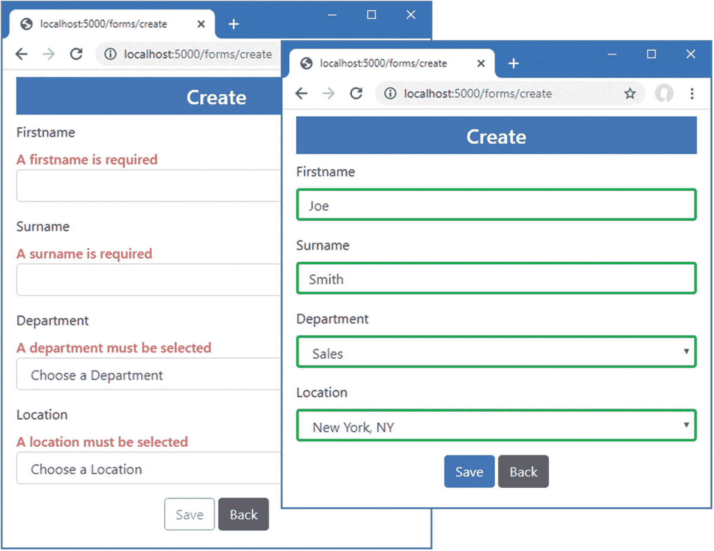

# 三十六、Blazor 表单和数据

在这一章中，我描述了 Blazor 提供的处理 HTML 表单的特性，包括对数据验证的支持。我描述了 Blazor 提供的内置组件，并向您展示了如何使用它们。在这一章中，我还将解释 Blazor 模型如何导致实体框架核心的意外结果，并向您展示如何解决这些问题。最后，我创建了一个简单的表单应用来创建、读取、更新和删除数据(CRUD 操作),并解释了如何扩展 Blazor 表单特性来改善用户体验。表 [36-1](#Tab1) 将 Blazor 表单特征放在上下文中。

表 36-1。

将 Blazor 表单功能放在上下文中

<colgroup><col class="tcol1 align-left"> <col class="tcol2 align-left"></colgroup> 
| 

问题

 | 

回答

 |
| --- | --- |
| 它们是什么？ | Blazor 提供了一组内置组件，为用户提供了一个易于验证的表单。 |
| 它们为什么有用？ | 表单仍然是 web 应用的核心构建块之一，这些组件提供了大多数项目都需要的功能。 |
| 它们是如何使用的？ | `EditForm`组件被用作单个表单域组件的父组件。 |
| 有什么陷阱或限制吗？ | Entity Framework Core 和 Blazor 协同工作的方式可能会有问题，这些问题在使用表单时变得尤其明显。 |
| 有其他选择吗？ | 您可以创建自己的表单组件和验证功能，尽管本章描述的功能适用于大多数项目，并且正如我所演示的，可以很容易地扩展。 |

表 [36-2](#Tab2) 总结了本章内容。

表 36-2。

章节总结

<colgroup><col class="tcol1 align-left"> <col class="tcol2 align-left"> <col class="tcol3 align-left"></colgroup> 
| 

问题

 | 

解决办法

 | 

列表

 |
| --- | --- | --- |
| 创建 HTML 表单 | 使用`EditForm`和`Input*`组件 | 7–9, 13 |
| 验证数据 | 使用标准验证属性和由`EditForm`组件发出的事件 | 10–12 |
| 丢弃未保存的数据 | 显式释放数据或为组件创建新的范围 | 14–16 |
| 避免重复查询数据库 | 显式管理查询执行 | 17–19 |

## 为本章做准备

本章使用了第 [35 章](35.html)中的高级项目。为了准备本章，创建`Blazor/Forms`文件夹并添加一个名为`EmptyLayout.razor`的 Razor 组件，其内容如清单 [36-1](#PC1) 所示。我将使用这个组件作为本章的主要布局。

Tip

你可以从 [`https://github.com/apress/pro-asp.net-core-3`](https://github.com/apress/pro-asp.net-core-3) 下载本章以及本书其他章节的示例项目。如果在运行示例时遇到问题，请参见第 [1](01.html) 章获取帮助。

```cs
@inherits LayoutComponentBase

<div class="m-2">
    @Body
</div>

Listing 36-1.The Contents of the EmptyLayout.razor File in the Blazor/Forms Folder

```

在`Blazor/Forms`文件夹中添加一个名为`FormSpy.razor`的`RazorComponent`，内容如清单 [36-2](#PC2) 所示。这是一个组件，我将使用它来显示正在编辑的值旁边的表单元素。

```cs
<div class="container-fluid no-gutters">
    <div class="row">
        <div class="col">
            @ChildContent
        </div>
        <div class="col">
            <table class="table table-sm table-striped table-bordered">
                <thead>
                    <tr><th colspan="2" class="text-center">Data Summary</th></tr>
                </thead>
                <tbody>
                    <tr><th>ID</th><td>@PersonData?.PersonId</td></tr>
                    <tr><th>Firstname</th><td>@PersonData?.Firstname</td></tr>
                    <tr><th>Surname</th><td>@PersonData?.Surname</td></tr>
                    <tr><th>Dept ID</th><td>@PersonData?.DepartmentId</td></tr>
                    <tr><th>Location ID</th><td>@PersonData?.LocationId</td></tr>
                </tbody>
            </table>
        </div>
    </div>
</div>

@code {

    [Parameter]
    public RenderFragment ChildContent { get; set; }

    [Parameter]
    public Person PersonData { get; set; }
}

Listing 36-2.The Contents of the FormSpy.razor File in the Blazor/Forms Folder

```

接下来，将名为`Editor.razor`的组件添加到`Blazor/Forms`文件夹中，并添加清单 [36-3](#PC3) 中所示的内容。该组件将用于编辑现有的`Person`对象和创建新的对象。

Caution

在阅读完本章的其余部分之前，不要在实际项目中使用`Editor`和`List`组件。我已经包括了一些常见的陷阱，我将在本章后面解释。

```cs
@page "/forms/edit/{id:long}"
@layout EmptyLayout

<h4 class="bg-primary text-center text-white p-2">Edit</h4>

<FormSpy PersonData="PersonData">
    <h4 class="text-center">Form Placeholder</h4>
    <div class="text-center">
        <NavLink class="btn btn-secondary" href="/forms">Back</NavLink>
    </div>
</FormSpy>

@code {

    [Inject]
    public NavigationManager NavManager { get; set; }

    [Inject]
    DataContext Context { get; set; }

    [Parameter]
    public long Id { get; set; }

    public Person PersonData { get; set; } = new Person();

    protected async override Task OnParametersSetAsync() {
        PersonData = await Context.People.FindAsync(Id);
    }
}

Listing 36-3.The Contents of the Editor.razor File in the Blazor/Forms Folder

```

清单 [36-3](#PC3) 中的组件使用一个`@layout`表达式来覆盖默认布局并选择`EmptyLayout`。并排布局用于在占位符旁边显示`PersonTable`组件，我将在占位符旁边添加一个表单。

最后，在`Blazor/Forms`文件夹中创建一个名为`List.razor`的组件，并添加清单 [36-4](#PC4) 中所示的内容来定义一个组件，该组件将向用户呈现一个以表格形式呈现的`Person`对象列表。

```cs
@page "/forms"
@page "/forms/list"
@layout EmptyLayout

<h5 class="bg-primary text-white text-center p-2">People</h5>

<table class="table table-sm table-striped table-bordered">
    <thead>
        <tr>
            <th>ID</th><th>Name</th><th>Dept</th><th>Location</th><th></th>
        </tr>
    </thead>
    <tbody>
        @if  (People.Count() == 0) {
            <tr><th colspan="5" class="p-4 text-center">Loading Data...</th></tr>
        } else {
            @foreach (Person p in People) {
                <tr>
                    <td>@p.PersonId</td>
                    <td>@p.Surname, @p.Firstname</td>
                    <td>@p.Department.Name</td>
                    <td>@p.Location.City</td>
                    <td>
                        <NavLink class="btn btn-sm btn-warning"
                             href="@GetEditUrl(p.PersonId)">
                            Edit
                        </NavLink>
                    </td>
                </tr>
            }
        }
    </tbody>
</table>

@code {

    [Inject]
    public DataContext Context { get; set; }

    public IEnumerable<Person> People { get; set; } = Enumerable.Empty<Person>();

    protected override void OnInitialized() {
        People = Context.People.Include(p => p.Department).Include(p => p.Location);
    }

    string GetEditUrl(long id) => $"/forms/edit/{id}";
}

Listing 36-4.The Contents of the List.razor File in the Blazor/Forms Folder

```

### 删除数据库并运行应用

打开一个新的 PowerShell 命令提示符，导航到包含`Advanced.csproj`文件的文件夹，运行清单 [36-5](#PC5) 中所示的命令来删除数据库。

```cs
dotnet ef database drop --force

Listing 36-5.Dropping the Database

```

从 Debug 菜单中选择 Start Without Debugging 或 Run Without Debugging，或者使用 PowerShell 命令提示符运行清单 [36-6](#PC6) 中所示的命令。

```cs
dotnet run

Listing 36-6.Running the Example Application

```

用浏览器请求`http://localhost:5000/forms`，会产生一个数据表。点击其中一个编辑按钮，您会看到表单的占位符和显示所选`Person`对象当前属性值的摘要，如图 [36-1](#Fig1) 所示。


图 36-1。

运行示例应用

## 使用 Blazor 表单组件

Blazor 提供了一组用于呈现表单元素的内置组件，确保在用户交互和集成验证后更新服务器端组件属性。表 [36-3](#Tab3) 描述了 Blazor 提供的组件。

表 36-3。

Bazor 表单组件

<colgroup><col class="tcol1 align-left"> <col class="tcol2 align-left"></colgroup> 
| 

名字

 | 

描述

 |
| --- | --- |
| `EditForm` | 该组件呈现一个为数据验证而连接的`form`元素。 |
| `InputText` | 该组件呈现一个绑定到 C# `string`属性的`input`元素。 |
| `InputCheckbox` | 该组件呈现一个输入元素，其`type`属性为`checkbox`，并且绑定到一个 C# `bool`属性。 |
| `InputDate` | 该组件呈现一个输入元素，其`type`属性为`date`，并绑定到一个 C# `DateTime`或`DateTimeOffset`属性。 |
| `InputNumber` | 该组件呈现一个输入元素，其`type`属性为`number`，并绑定到一个 C# `int`、`long`、`float`、`double`或`decimal`值。 |
| `InputTextArea` | 该组件呈现一个绑定到一个`C#`字符串属性的`textarea`组件。 |

必须使用`EditForm`组件才能使任何其他组件工作。在清单 [36-7](#PC7) 中，我添加了一个`EditForm`，以及代表由`Person`类定义的两个属性的`InputText`组件。

```cs
@page "/forms/edit/{id:long}"
@layout EmptyLayout

<h4 class="bg-primary text-center text-white p-2">Edit</h4>

<FormSpy PersonData="PersonData">
    <EditForm Model="PersonData">
        <div class="form-group">
            <label>Person ID</label>
            <InputNumber class="form-control"
                @bind-Value="PersonData.PersonId" disabled />
        </div>
        <div class="form-group">
            <label>Firstname</label>
            <InputText class="form-control" @bind-Value="PersonData.Firstname" />
        </div>
        <div class="form-group">
            <label>Surname</label>
            <InputText class="form-control" @bind-Value="PersonData.Surname" />
        </div>
        <div class="form-group">
            <label>Dept ID</label>
            <InputNumber class="form-control"
                @bind-Value="PersonData.DepartmentId" />
        </div>
        <div class="text-center">
            <NavLink class="btn btn-secondary" href="/forms">Back</NavLink>
       </div>
    </EditForm>
</FormSpy>

@code {

    // ...statements omitted for brevity...
}

Listing 36-7.Using Form Components in the Editor.razor File in the Blazor/Forms Folder

```

`EditForm`组件呈现一个`form`元素，并为“验证表单数据”一节中描述的验证特性提供基础。`Model`属性用于向`EditForm`提供表单用于编辑和验证的对象。

表 [36-3](#Tab3) 中以`Input`开头的组件用于显示单个模型属性的`input`或`textarea`元素。这些组件定义了一个名为`Value`的定制绑定，该绑定使用`@bind-Value`属性与模型属性相关联。属性级组件必须与它们呈现给用户的属性类型相匹配。正是因为这个原因，我将`InputText`组件用于`Person`类的`Firstname`和`Surname`属性，而`InputNumber`组件用于`PersonId`和`DepartmentId`属性。如果使用带有错误类型的模型属性的属性级组件，当组件试图分析输入到 HTML 元素中的值时，将会收到一个错误。

重启 ASP.NET Core 并请求`http://localhost:5000/forms/edit/2`，您将看到显示的三个`input`元素。编辑数值，按 Tab 键移动焦点，在窗口更新的右边会看到汇总数据，如图 [36-2](#Fig2) 所示。内置的表单组件支持属性 splatting，这就是为什么针对`PersonId`属性应用于`InputNumber`组件的`disabled`属性已经被应用于`input`元素。


图 36-2。

使用 Blazor 表单元素

### 创建自定义表单组件

Blazor 只为`input`和`textarea`元素提供内置组件。幸运的是，创建一个集成到 Blazor 表单特性中的定制组件是一个简单的过程。将名为`CustomSelect.razor`的 Razor 组件添加到`Blazor/Forms`文件夹中，并使用它来定义清单 [36-8](#PC8) 中所示的组件。

```cs
@typeparam TValue
@inherits InputBase<TValue>

<select class="form-control @CssClass" value="@CurrentValueAsString"
            @onchange="@(ev => CurrentValueAsString = ev.Value as string)">
        @ChildContent
        @foreach (KeyValuePair<string, TValue> kvp in Values) {
            <option value="@kvp.Value">@kvp.Key</option>
        }
</select>

@code {

    [Parameter]
    public RenderFragment ChildContent { get; set; }

    [Parameter]
    public IDictionary<string, TValue> Values { get; set; }

    [Parameter]
    public Func<string, TValue> Parser { get; set; }

    protected override bool TryParseValueFromString(string value, out TValue result,
            out string validationErrorMessage) {
        try {
            result = Parser(value);
            validationErrorMessage = null;
            return true;
        } catch {
            result = default(TValue);
            validationErrorMessage = "The value is not valid";
            return false;
        }
    }
}

Listing 36-8.The Contents of the CustomSelect.razor File in the Blazor/Forms Folder

```

表单组件的基类是`InputBase<TValue>`，其中泛型类型参数是组件表示的模型属性类型。基类负责大部分工作并提供`CurrentValueAsString`属性，该属性用于在用户选择新值时在事件处理程序中提供当前值，如下所示:

```cs
...
<select class="form-control @CssClass" value="@CurrentValueAsString"
            @onchange="@(ev => CurrentValueAsString = ev.Value as string)">
...

```

为了准备数据验证(我将在下一节中描述),该组件在`select`元素的`class`属性中包含了`CssClass`属性的值，如下所示:

```cs
...
<select class="form-control @CssClass" value="@CurrentValueAsString"
            @onchange="@(ev => CurrentValueAsString = ev.Value as string)">
...

```

必须实现抽象的`TryParseValueFromString`方法，以便基类能够在 HTML 元素使用的字符串值和 C# 模型属性的相应值之间进行映射。我不想将我的自定义`select`元素实现为任何特定的 C# 数据类型，所以我使用了一个`@typeparam`表达式来定义一个泛型类型参数。`Values`属性用于接收将显示给用户的字典映射字符串值和将用作 C# 值的`TValue`值。该方法接收两个用于设置解析值的`out`参数和一个解析器验证错误消息，如果有问题，该消息将显示给用户。由于我使用的是泛型类型，`Parser`属性接收一个函数，该函数被调用来将一个字符串值解析成一个`TValue`值。

清单 [36-9](#PC11) 应用了新的表单组件，因此用户可以选择由`Person`类定义的`DepartmentId`和`LocationId`属性的值。

```cs
@page "/forms/edit/{id:long}"
@layout EmptyLayout

<h4 class="bg-primary text-center text-white p-2">Edit</h4>

<FormSpy PersonData="PersonData">

    <EditForm Model="PersonData">
        <div class="form-group">
            <label>Firstname</label>
            <InputText class="form-control" @bind-Value="PersonData.Firstname" />
        </div>
        <div class="form-group">
            <label>Surname</label>
            <InputText class="form-control" @bind-Value="PersonData.Surname" />
        </div>
        <div class="form-group">
            <label>Dept ID</label>
            <CustomSelect TValue="long" Values="Departments"
                          Parser="@(str => long.Parse(str))"
                          @bind-Value="PersonData.DepartmentId">
                <option selected disabled value="0">Choose a Department</option>
            </CustomSelect>
        </div>
        <div class="form-group">
            <label>Location ID</label>
            <CustomSelect TValue="long" Values="Locations"
                          Parser="@(str => long.Parse(str))"
                          @bind-Value="PersonData.LocationId">
                <option selected disabled value="0">Choose a Location</option>
            </CustomSelect>
        </div>
        <div class="text-center">
            <NavLink class="btn btn-secondary" href="/forms">Back</NavLink>
        </div>
    </EditForm>
</FormSpy>

@code {

    [Inject]
    public NavigationManager NavManager { get; set; }

    [Inject]
    DataContext Context { get; set; }

    [Parameter]
    public long Id { get; set; }

    public Person PersonData { get; set; } = new Person();

    public IDictionary<string, long> Departments { get; set; }
        = new Dictionary<string, long>();
    public IDictionary<string, long> Locations { get; set; }
        = new Dictionary<string, long>();

    protected async override Task OnParametersSetAsync() {
        PersonData = await Context.People.FindAsync(Id);
        Departments = await Context.Departments
            .ToDictionaryAsync(d => d.Name, d => d.Departmentid);
        Locations = await Context.Locations
            .ToDictionaryAsync(l => $"{l.City}, {l.State}", l => l.LocationId);
    }
}

Listing 36-9.Using a Custom Form Element in the Editor.razor File in the Blazor/Forms Folder

```

我使用实体框架核心`ToDictionaryAsync`方法从`Department`和`Location`数据中创建值和标签的集合，并使用它们来配置`CustomSelect`组件。重启 ASP.NET Core，请求`http://localhost:5000/forms/edit/2`；您将看到图 [36-3](#Fig3) 中所示的`select`元件。当您选择一个新值时，`CustomSelect`组件将更新`CurrentValueAsString`属性，这将导致对`TryParseValueFromString`方法的调用，结果用于更新`Value`绑定。


图 36-3。

使用自定义表单元素

### 验证表单数据

Blazor 提供了使用标准属性执行验证的组件。表 [36-4](#Tab4) 描述了验证组件。

表 36-4。

Blazor 验证组件

<colgroup><col class="tcol1 align-left"> <col class="tcol2 align-left"></colgroup> 
| 

名字

 | 

描述

 |
| --- | --- |
| `DataAnnotationsValidator` | 该组件将应用于模型类的验证属性集成到 Blazor 表单特性中。 |
| `ValidationMessage` | 该组件显示单个属性的验证错误消息。 |
| `ValidationSummary` | 该组件显示整个模型对象的验证错误消息。 |

验证组件生成分配给类的元素，如表 [36-5](#Tab5) 所述，这些元素可以用 CSS 样式化以吸引用户的注意。

表 36-5。

Blazor 验证组件使用的类

<colgroup><col class="tcol1 align-left"> <col class="tcol2 align-left"></colgroup> 
| 

名字

 | 

描述

 |
| --- | --- |
| `validation-errors` | `ValidationSummary`组件生成一个分配给这个类的`ul`元素，它是验证消息摘要的顶层容器。 |
| `validation-message` | 对于每个验证消息，`ValidationSummary`组件用分配给该类的`li`元素填充其`ul`元素。`ValidationMessage`组件为其属性级消息呈现一个分配给该类的`div`元素。 |

Blazor `Input*`组件将它们生成的 HTML 元素添加到表 [36-6](#Tab6) 中描述的类中，以指示验证状态。这包括我从中派生出`CustomSelect`组件的`InputBase<TValue>`类，也是清单 [36-8](#PC8) 中`CssClass`属性的目的。

表 36-6。

添加到表单元素的验证类

<colgroup><col class="tcol1 align-left"> <col class="tcol2 align-left"></colgroup> 
| 

名字

 | 

描述

 |
| --- | --- |
| `modified` | 一旦用户编辑了该值，元素就会添加到该类中。 |
| `valid` | 如果元素包含的值通过验证，则元素将被添加到该类中。 |
| `invalid` | 如果元素包含的值未通过验证，则元素将被添加到该类中。 |

组件和类的这种组合起初可能会令人困惑，但关键是首先要根据表 [36-5](#Tab5) 和 [36-6](#Tab6) 中的类定义你需要的 CSS 样式。将名为`blazorValidation.css`的 CSS 样式表添加到`wwwroot`文件夹中，内容如清单 [36-10](#PC12) 所示。

```cs
.validation-errors {
    background-color: rgb(220, 53, 69); color: white; padding: 8px;
    text-align: center; font-size: 16px; font-weight: 500;
}
div.validation-message { color: rgb(220, 53, 69); font-weight: 500 }
.modified.valid { border: solid 3px rgb(40, 167, 69); }
.modified.invalid { border: solid 3px rgb(220, 53, 69); }

Listing 36-10.The Contents of the blazorValidation.css File in the wwwroot Folder

```

这些样式将错误信息格式化为红色，并将红色或绿色边框应用于单个表单元素。清单 [36-11](#PC13) 导入 CSS 样式表并应用 Blazor 验证组件。

```cs
@page "/forms/edit/{id:long}"
@layout EmptyLayout

<link href="/blazorValidation.css" rel="stylesheet" />
<h4 class="bg-primary text-center text-white p-2">Edit</h4>

<FormSpy PersonData="PersonData">
    <EditForm Model="PersonData">
        <DataAnnotationsValidator />
        <ValidationSummary />
        <div class="form-group">
            <label>Firstname</label>
            <ValidationMessage For="@(() => PersonData.Firstname)" />
            <InputText class="form-control" @bind-Value="PersonData.Firstname" />
        </div>
        <div class="form-group">
            <label>Surname</label>
            <ValidationMessage For="@(() => PersonData.Surname)" />
            <InputText class="form-control" @bind-Value="PersonData.Surname" />
        </div>
        <div class="form-group">
            <label>Dept ID</label>
            <ValidationMessage For="@(() => PersonData.DepartmentId)" />
            <CustomSelect TValue="long" Values="Departments"
                          Parser="@(str => long.Parse(str))"
                          @bind-Value="PersonData.DepartmentId">
                <option selected disabled value="0">Choose a Department</option>
            </CustomSelect>
        </div>
        <div class="form-group">
            <label>Location ID</label>
            <ValidationMessage For="@(() => PersonData.LocationId)" />
            <CustomSelect TValue="long" Values="Locations"
                          Parser="@(str => long.Parse(str))"
                          @bind-Value="PersonData.LocationId">
                <option selected disabled value="0">Choose a Location</option>
            </CustomSelect>
        </div>
        <div class="text-center">
            <NavLink class="btn btn-secondary" href="/forms">Back</NavLink>
        </div>
    </EditForm>
</FormSpy>

@code {

    // ...statements omitted for brevity...
}

Listing 36-11.Applying Validation Components in the Editor.razor File in the Blazor/Forms Folder

```

应用的`DataAnnotationsValidator`和`ValidationSummary`组件没有任何配置属性。使用`For`属性配置`ValidationMessage`属性，该属性接收一个函数，该函数返回组件表示的属性。例如，下面是选择`Firstname`属性的表达式:

```cs
..s.
<ValidationMessage For="@(() => PersonData.Firstname)" />
...

```

该表达式没有定义参数，并从用于组件`EditForm`的`Model`属性的对象中选择属性，而不是模型类型。对于这个例子，这意味着表达式操作的是`PersonData`对象，而不是`Person`类。

Tip

Blazor 并不总是能够确定`ValidationMessage`组件的属性类型。如果您收到一个异常，那么您可以添加一个`TValue`属性来显式设置类型。例如，如果`ValidationMessage`代表的属性类型是`long`，那么添加一个`TValue="long"`属性。

启用数据验证的最后一步是将属性应用到模型类，如清单 [36-12](#PC15) 所示。

```cs
using System.Collections.Generic;
using System.ComponentModel.DataAnnotations;

namespace Advanced.Models {

    public class Person {

        public long PersonId { get; set; }

        [Required(ErrorMessage = "A firstname is required")]
        [MinLength(3, ErrorMessage = "Firstnames must be 3 or more characters")]
        public string Firstname { get; set; }

        [Required(ErrorMessage = "A surname is required")]
        [MinLength(3, ErrorMessage = "Surnames must be 3 or more characters")]
        public string Surname { get; set; }

        [Required]
        [Range(1, long.MaxValue,
            ErrorMessage = "A department must be selected")]
        public long DepartmentId { get; set; }

        [Required]
        [Range(1, long.MaxValue,
            ErrorMessage = "A location must be selected")]
        public long LocationId { get; set; }

        public Department Department { get; set; }
        public Location Location { get; set; }
    }
}

Listing 36-12.Applying Validation Attributes in the Person.cs File in the Models Folder

```

要查看验证组件的效果，请重启 ASP.NET Core 并请求`http://localhost:5000/forms/edit/2`。清除“名字”字段，并通过按 Tab 键或单击另一个字段来移动焦点。随着焦点的改变，将执行验证，并显示错误消息。`Editor`组件显示摘要和每个属性的消息，所以您将看到相同的错误消息显示两次。删除姓氏字段中除前两个字符之外的所有字符，当您改变焦点时会显示第二条确认信息，如图 [36-4](#Fig4) 所示。(对其他属性也有验证支持，但是`select`元素不允许用户选择无效的有效元素。如果您更改一个值，`select`元素将会用绿色边框修饰，以表示有效的选择，但是在我演示如何使用表单组件创建新的数据对象之前，您不会看到无效的响应。)


图 36-4。

使用 Blazor 验证特性

### 处理表单事件

`EditForm`组件定义了允许应用响应用户操作的事件，如表 [36-7](#Tab7) 所述。

表 36-7。

编辑表单事件

<colgroup><col class="tcol1 align-left"> <col class="tcol2 align-left"></colgroup> 
| 

名字

 | 

描述

 |
| --- | --- |
| `OnValidSubmit` | 当提交表单并且表单数据通过验证时，将触发此事件。 |
| `OnInvalidSubmit` | 当提交表单且表单数据未通过验证时，将触发此事件。 |
| `OnSubmit` | 提交表单时，在执行验证之前触发此事件。 |

这些事件是通过在`EditForm`组件包含的内容中添加一个传统的提交按钮来触发的。`EditForm`组件处理由它呈现的`form`元素发送的`onsubmit`事件，应用验证，并触发表中描述的事件。清单 [36-13](#PC16) 向`Editor`组件添加一个提交按钮，并处理`EditForm`事件。

```cs
@page "/forms/edit/{id:long}"
@layout EmptyLayout

<link href="/blazorValidation.css" rel="stylesheet" />

<h4 class="bg-primary text-center text-white p-2">Edit</h4>
<h6 class="bg-info text-center text-white p-2">@FormSubmitMessage</h6>

<FormSpy PersonData="PersonData">

    <EditForm Model="PersonData" OnValidSubmit="HandleValidSubmit"
            OnInvalidSubmit="HandleInvalidSubmit">
        <DataAnnotationsValidator />
        <ValidationSummary />
        <div class="form-group">
            <label>Firstname</label>
            <ValidationMessage For="@(() => PersonData.Firstname)" />
            <InputText class="form-control" @bind-Value="PersonData.Firstname" />
        </div>
        <div class="form-group">
            <label>Surname</label>
            <ValidationMessage For="@(() => PersonData.Surname)" />
            <InputText class="form-control" @bind-Value="PersonData.Surname" />
        </div>
        <div class="form-group">
            <label>Dept ID</label>
            <ValidationMessage For="@(() => PersonData.DepartmentId)" />
            <CustomSelect TValue="long" Values="Departments"
                          Parser="@(str => long.Parse(str))"
                          @bind-Value="PersonData.DepartmentId">
                <option selected disabled value="0">Choose a Department</option>
            </CustomSelect>
        </div>
        <div class="form-group">
            <label>Location ID</label>
            <ValidationMessage For="@(() => PersonData.LocationId)" />
            <CustomSelect TValue="long" Values="Locations"
                          Parser="@(str => long.Parse(str))"
                          @bind-Value="PersonData.LocationId">
                <option selected disabled value="0">Choose a Location</option>
            </CustomSelect>
        </div>
        <div class="text-center">
            <button type="submit" class="btn btn-primary">Submit</button>
            <NavLink class="btn btn-secondary" href="/forms">Back</NavLink>
        </div>
    </EditForm>
</FormSpy>

@code {

    // ...other statements omitted for brevity...

    public string FormSubmitMessage { get; set; } = "Form Data Not Submitted";
    public void HandleValidSubmit() => FormSubmitMessage = "Valid Data Submitted";
    public void HandleInvalidSubmit() =>
        FormSubmitMessage = "Invalid Data Submitted";
}

Listing 36-13.Handling EditForm Events in the Editor.razor File in the Blazor/Forms Folder

```

重启 ASP.NET Core 并请求`http://localhost:5000/forms/edit/2`。清除“名字”字段，然后单击“提交”按钮。除了验证错误之外，您还会看到一条消息，指出提交的表单包含无效数据。在字段中输入一个名称，再次点击提交，信息会发生变化，如图 [36-5](#Fig5) 所示。


图 36-5。

处理 EditForm 事件

## 使用 Blazor 的实体框架核心

Blazor 模型改变了实体框架核心的行为方式，如果您习惯于编写传统的 ASP.NET Core 应用，这可能会导致意想不到的结果。在接下来的部分中，我将解释这些问题以及如何避免可能出现的问题。

### 理解实体框架核心上下文范围问题

要查看第一期，请求`http://localhost:5000/forms/edit/2`，清除名字字段，并将姓氏字段的内容更改为 **La** 。这两个值都没有通过验证，当您在表单元素之间移动时会看到错误消息。点击返回按钮，您会看到数据表反映了您所做的更改，如图 [36-6](#Fig6) 所示，即使这些更改是无效的。


图 36-6。

编辑数据的效果

在使用控制器或 Razor 页面编写的传统 ASP.NET Core 应用中，单击一个按钮会触发一个新的 HTTP 请求。每个请求都是独立处理的，每个请求都接收自己的实体框架核心上下文对象，该对象被配置为限定范围的服务。结果是，处理一个请求时创建的数据只有在写入数据库后才会影响其他请求。

在 Blazor 应用中，路由系统响应 URL 更改而不发送新的 HTTP 请求，这意味着仅使用 Blazor 维护的到服务器的持久 HTTP 连接来显示多个组件。这导致单个依赖注入范围被多个组件共享，如图 [36-7](#Fig7) 所示，一个组件所做的更改会影响其他组件，即使这些更改没有写入数据库。


图 36-7。

在 Blazor 应用中使用实体框架核心上下文

Entity Framework Core 试图提供帮助，这种方法允许在存储(或丢弃)复杂的数据操作之前，随着时间的推移执行这些操作。不幸的是，就像我在第 [35](35.html) 章中描述的，Entity Framework Core 处理相关数据的有用方法一样，它为那些希望组件像 ASP.NET Core 的其他部分一样处理数据的粗心开发者带来了一个陷阱。

#### 放弃未保存的数据更改

如果在组件之间共享一个上下文是有吸引力的，这对于一些应用来说是这样，那么你可以采用这种方法，并确保组件在被销毁时丢弃任何更改，如清单 [36-14](#PC17) 所示。

```cs
@page "/forms/edit/{id:long}"
@layout EmptyLayout
@implements IDisposable

<!-- ...elements omitted for brevity... -->

@code {

    // ...statements omitted for brevity...

    public string FormSubmitMessage { get; set; } = "Form Data Not Submitted";
    public void HandleValidSubmit() => FormSubmitMessage = "Valid Data Submitted";
    public void HandleInvalidSubmit() =>
        FormSubmitMessage = "Invalid Data Submitted";

    public void Dispose() => Context.Entry(PersonData).State = EntityState.Detached;
}

Listing 36-14.Discarding Unsaved Data Changes in the Editor.razor File in the Blazor/Forms Folder

```

正如我在第 [35](35.html) 章中提到的，组件可以实现`System.IDisposable`接口，当组件将要被销毁时，会调用`Dispose`方法，这发生在导航到另一个组件时。在清单 [36-14](#PC17) 中，`Dispose`方法的实现告诉实体框架核心忽略`PersonData`对象，这意味着它不会被用来满足未来的请求。要查看效果，重新启动 ASP.NET Core，请求`http://localhost:5000/forms/edit/2`，清除名字字段，然后单击返回按钮。当实体框架核心向`List`组件提供数据时，修改后的`Person`对象被忽略，如图 [36-8](#Fig8) 所示。


图 36-8。

丢弃数据对象

#### 创建新的依赖注入范围

如果希望保留 ASP.NET Core 的其余部分使用的模型，并让每个组件接收自己的实体框架核心上下文对象，则必须创建新的依赖注入范围。这是通过使用`@inherits`表达式将组件的基类设置为`OwningComponentBase`或`OwningComponentBase<T>`来完成的。

`OwningComponentCase`类定义了一个`ScopedServices`属性，该属性由组件继承，并提供一个`IServiceProvider`对象，该对象可用于获取在特定于组件生命周期的范围内创建的服务，并且不会与任何其他组件共享，如清单 [36-15](#PC18) 所示。

```cs
@page "/forms/edit/{id:long}"
@layout EmptyLayout
@inherits OwningComponentBase
@using Microsoft.Extensions.DependencyInjection

<link href="/blazorValidation.css" rel="stylesheet" />

<h4 class="bg-primary text-center text-white p-2">Edit</h4>
<h6 class="bg-info text-center text-white p-2">@FormSubmitMessage</h6>

<!-- ...elements omitted for brevity... -->

@code {

    [Inject]
    public NavigationManager NavManager { get; set; }

    //[Inject]
    DataContext Context => ScopedServices.GetService<DataContext>();

    [Parameter]
    public long Id { get; set; }

    // ...statements omitted for brevity...

    //public void Dispose() =>
    //      Context.Entry(PersonData).State = EntityState.Detached;
}

Listing 36-15.Using a New Scope in the Editor.razor File in the Blazor/Forms Folder

```

在清单中，我注释掉了`Inject`属性，并通过获取一个`DataContext`服务来设置`Context`属性的值。如第 [14 章](14.html)所述，`Microsoft.Extensions.DependencyInjection`名称空间包含扩展方法，使得从`IServiceProvider`对象获取服务变得更加容易。

Note

更改基类不会影响使用`Inject`属性接收的服务，这些服务仍将在请求范围内获得。您在专用组件范围内需要的每个服务都必须通过`ScopedServices`属性获得，并且`Inject`属性不应该应用于该属性。

`OwningComponentBase<T>`类定义了一个额外的便利属性，该属性提供对类型为`T`的作用域服务的访问，如果一个组件只需要一个作用域服务，这个属性会很有用，如清单 [36-16](#PC19) 所示(尽管通过`ScopedServices`属性仍然可以获得更多的服务)。

```cs
@page "/forms/edit/{id:long}"
@layout EmptyLayout
@inherits OwningComponentBase<DataContext>

<link href="/blazorValidation.css" rel="stylesheet" />

<h4 class="bg-primary text-center text-white p-2">Edit</h4>
<h6 class="bg-info text-center text-white p-2">@FormSubmitMessage</h6>

<!-- ...elements omitted for brevity... -->

@code {

    [Inject]
    public NavigationManager NavManager { get; set; }

    //[Inject]
    DataContext Context => Service;

    // ...statements omitted for brevity...
}

Listing 36-16.Using the Typed Base Class in the Editor.razor File in the Blazor/Forms Folder

```

作用域服务通过名为`Service`的属性可用。在这个例子中，我指定了`DataContext`作为基类的类型参数。

不管使用哪个基类，结果都是`Editor`组件有自己的依赖注入范围和自己的`DataContext`对象。`List`组件没有被修改，所以它将接收请求范围的`DataContext`对象，如图 [36-9](#Fig9) 所示。


图 36-9。

为组件使用作用域服务

重启 ASP.NET Core，导航到`http://localhost:5000/forms/edit/2`，清除名字字段，点击返回按钮。编辑器组件所做的更改不会保存到数据库中，由于`Editor`组件的数据上下文与`List`组件所使用的数据上下文是分开的，编辑过的数据会被丢弃，产生如图 [36-8](#Fig8) 所示的相同响应。

### 了解重复查询问题

Blazor 尽可能有效地响应状态的变化，但仍然必须呈现组件的内容，以确定应该发送到浏览器的变化。

Blazor 工作方式的一个后果是，它会导致发送到数据库的查询数量急剧增加。为了演示这个问题，清单 [36-17](#PC20) 为`List`组件添加了一个增加计数器的按钮。

```cs
@page "/forms"
@page "/forms/list"
@layout EmptyLayout

<h5 class="bg-primary text-white text-center p-2">People</h5>

<table class="table table-sm table-striped table-bordered">
    <thead>
        <tr>
            <th>ID</th><th>Name</th><th>Dept</th><th>Location</th><th></th>
        </tr>
    </thead>
    <tbody>
        @if  (People.Count() == 0) {
            <tr><th colspan="5" class="p-4 text-center">Loading Data...</th></tr>
        } else {
            @foreach (Person p in People) {
                <tr>
                    <td>@p.PersonId</td>
                    <td>@p.Surname, @p.Firstname</td>
                    <td>@p.Department.Name</td>
                    <td>@p.Location.City</td>
                    <td>
                        <NavLink class="btn btn-sm btn-warning"
                               href="@GetEditUrl(p.PersonId)">
                            Edit
                        </NavLink>
                    </td>
                </tr>
            }
        }
    </tbody>
</table>

<button class="btn btn-primary" @onclick="@(() => Counter++)">Increment</button>
<span class="h5">Counter: @Counter</span>

@code {

    [Inject]
    public DataContext Context { get; set; }

    public IEnumerable<Person> People { get; set; } = Enumerable.Empty<Person>();

    protected override void OnInitialized() {
        People = Context.People.Include(p => p.Department).Include(p => p.Location);
    }

    string GetEditUrl(long id) => $"/forms/edit/{id}";

    public int Counter { get; set; } = 0;
}

Listing 36-17.Adding a Button in the List.razor File in the Blazor/Forms Folder

```

重启 ASP.NET Core 并请求`http://localhost:5000/forms`。单击按钮，观察 ASP.NET Core 服务器的输出。每次单击该按钮时，都会调用事件处理程序，并向数据库发送一个新的数据库查询，生成如下所示的日志消息:

```cs
...
info: Microsoft.EntityFrameworkCore.Database.Command[20101]
      Executed DbCommand (1ms) [Parameters=[], CommandType="Text",
      CommandTimeout='30']
  SELECT [p].[PersonId], [p].[DepartmentId], [p].[Firstname], [p].[LocationId],
       [p].[Surname], [d].[Departmentid], [d].[Name], [l].[LocationId], [l].[City],
       [l].[State]
    FROM [People] AS [p]
    INNER JOIN [Departments] AS [d] ON [p].[DepartmentId] = [d].[Departmentid]
    INNER JOIN [Locations] AS [l] ON [p].[LocationId] = [l].[LocationId]
info: Microsoft.EntityFrameworkCore.Database.Command[20101]
      Executed DbCommand (0ms) [Parameters=[], CommandType="Text",
      CommandTimeout='30']
  SELECT [p].[PersonId], [p].[DepartmentId], [p].[Firstname], [p].[LocationId],
      [p].[Surname], [d].[Departmentid], [d].[Name], [l].[LocationId], [l].[City],
      [l].[State]
    FROM [People] AS [p]
    INNER JOIN [Departments] AS [d] ON [p].[DepartmentId] = [d].[Departmentid]
    INNER JOIN [Locations] AS [l] ON [p].[LocationId] = [l].[LocationId]
...

```

每次呈现组件时，Entity Framework Core 都会向数据库发送两个相同的请求，即使在不执行任何数据操作的情况下单击 Increment 按钮也是如此。

每当使用实体框架核心时，这个问题就会出现，并且被 Blazor 加剧。尽管将数据库查询分配给`IEnumerable<T>`属性是常见的做法，但这样做掩盖了实体框架核心的一个重要方面，即它的 LINQ 表达式是查询的表达式而不是结果，并且每次读取属性时，都会向数据库发送一个新的查询。`People`属性的值由`List`组件读取两次:一次由`Count`属性读取以确定数据是否已经加载，另一次由`@foreach`表达式读取以生成 HTML 表格的行。当用户单击 Increment 按钮时，Blazor 再次呈现`List`组件，以找出发生了什么变化，这导致`People`属性被读取两次以上，产生两个额外的数据库查询。

Blazor 和 Entity Framework Core 都以它们应该的方式工作。Blazor 必须重新呈现组件的输出，以确定哪些 HTML 更改需要发送到浏览器。在渲染完元素并评估所有 Razor 表达式之前，它无法知道单击按钮会产生什么效果。每次读取属性时，实体框架核心都执行其查询，确保应用总是有新数据。

这些特征的组合提出了两个问题。首先是将不必要的查询发送到数据库，这会增加应用所需的容量(尽管并不总是如此，因为数据库服务器擅长处理查询)。

第二个问题是，在用户进行不相关的交互后，对数据库的更改将反映在呈现给用户的内容中。例如，如果另一个用户将一个`Person`对象添加到数据库中，那么下次用户单击 Increment 按钮时，它就会出现在表格中。用户希望应用只反映他们的行为，而意外的变化会令人困惑和分心。

#### 管理组件中的查询

Blazor 和 Entity Framework Core 之间的交互对于所有项目来说都不是问题，但是，如果是问题，那么最好的方法是查询数据库一次，并且只对用户可能期望发生更新的操作进行重新查询。一些应用可能需要向用户提供一个明确的选项来重新加载数据，特别是对于那些用户希望看到更新的应用，如清单 [36-18](#PC22) 所示。

```cs
@page "/forms"
@layout EmptyLayout

<h5 class="bg-primary text-white text-center p-2">People</h5>

<table class="table table-sm table-striped table-bordered">
    <thead>
        <tr>
            <th>ID</th><th>Name</th><th>Dept</th><th>Location</th><th></th>
        </tr>
    </thead>
    <tbody>
        @if  (People.Count() == 0) {
            <tr><th colspan="5" class="p-4 text-center">Loading Data...</th></tr>
        } else {
            @foreach (Person p in People) {
                <tr>
                    <td>@p.PersonId</td>
                    <td>@p.Surname, @p.Firstname</td>
                    <td>@p.Department.Name</td>
                    <td>@p.Location.City</td>
                    <td></td>
                </tr>
            }
        }
    </tbody>
</table>

<button class="btn btn-danger" @onclick="UpdateData">Update</button>

<button class="btn btn-primary" @onclick="@(() => Counter++)">Increment</button>
<span class="h5">Counter: @Counter</span>

@code {

    [Inject]
    public DataContext Context { get; set; }

    public IEnumerable<Person> People { get; set; } = Enumerable.Empty<Person>();

    protected async override Task OnInitializedAsync() {
        await UpdateData();
    }

    private async Task UpdateData() =>
        People = await Context.People.Include(p => p.Department)
            .Include(p => p.Location).ToListAsync<Person>();

    public int Counter { get; set; } = 0;
}

Listing 36-18.Controlling Queries in the List.razor File in the Blazor/Forms Folder

```

`UpdateData`方法执行相同的查询，但是应用了`ToListAsync`方法，该方法强制评估实体框架核心查询。结果被分配给`People`属性，可以重复读取，而无需触发额外的查询。为了让用户控制数据，我添加了一个按钮，当单击它时调用`UpdateData`方法。重启 ASP.NET Core，请求`http://localhost:5000/forms`，点击增量按钮。监视 ASP.NET Core 服务器的输出，您将看到只有在组件初始化时才进行查询。要明确触发查询，请单击“更新”按钮。

有些操作可能需要新的查询，这很容易执行。为了演示，清单 [36-19](#PC23) 向`List`组件添加了一个排序操作，无论有没有新查询都可以实现。

```cs
@page "/forms"
@page "/forms/list"
@layout EmptyLayout

<h5 class="bg-primary text-white text-center p-2">People</h5>

<table class="table table-sm table-striped table-bordered">
    <thead>
        <tr>
            <th>ID</th><th>Name</th><th>Dept</th><th>Location</th><th></th>
        </tr>
    </thead>
    <tbody>
        @if  (People.Count() == 0) {
            <tr><th colspan="5" class="p-4 text-center">Loading Data...</th></tr>
        } else {
            @foreach (Person p in People) {
                <tr>
                    <td>@p.PersonId</td>
                    <td>@p.Surname, @p.Firstname</td>
                    <td>@p.Department.Name</td>
                    <td>@p.Location.City</td>
                    <td>
                        <NavLink class="btn btn-sm btn-warning"
                               href="@GetEditUrl(p.PersonId)">
                            Edit
                        </NavLink>
                    </td>
                </tr>
            }
        }
    </tbody>
</table>

<button class="btn btn-danger" @onclick="@(() => UpdateData())">Update</button>
<button class="btn btn-info" @onclick="SortWithQuery">Sort (With Query)</button>
<button class="btn btn-info" @onclick="SortWithoutQuery">Sort (No Query)</button>
<button class="btn btn-primary" @onclick="@(() => Counter++)">Increment</button>
<span class="h5">Counter: @Counter</span>

@code {

    [Inject]
    public DataContext Context { get; set; }

    public IEnumerable<Person> People { get; set; } = Enumerable.Empty<Person>();

    protected async override Task OnInitializedAsync() {
        await UpdateData();
    }

    private IQueryable<Person> Query => Context.People.Include(p => p.Department)
            .Include(p => p.Location);

    private async Task UpdateData(IQueryable<Person> query = null) =>
        People = await (query ?? Query).ToListAsync<Person>();

    public async Task SortWithQuery() {
        await UpdateData(Query.OrderBy(p => p.Surname));
    }

    public void SortWithoutQuery() {
        People = People.OrderBy(p => p.Firstname).ToList<Person>();
    }

    string GetEditUrl(long id) => $"/forms/edit/{id}";

    public int Counter { get; set; } = 0;
}

Listing 36-19.Adding Operations to the List.razor File in the Blazor/Forms Folder

```

实体框架核心查询被表示为`IQueryable<T>`对象，允许查询在被分派到数据库服务器之前由附加的 LINQ 方法组成。示例中的新操作都使用了 LINQ `OrderBy`方法，但是其中一个将它应用到了`IQueryable<T>`，然后对其进行评估以使用`ToListAsync`方法发送查询。另一个操作将`OrderBy`方法应用于现有的结果数据，对其进行排序，而不发送新的查询。要查看这两个操作，重启 ASP.NET Core，请求`http://localhost:5000/forms`，点击排序按钮，如图 [36-10](#Fig10) 所示。当单击 Sort (With Query)按钮时，您将看到一条日志消息，指示查询已发送到数据库。


图 36-10。

管理组件查询

Avoiding the Overlapping Query Pitfall

您可能会遇到一个异常，告诉您“在前一个操作完成之前，在此上下文上开始了第二个操作。”当子组件使用`OnParametersSetAsync`方法执行异步实体框架核心查询，并且父组件的数据变化在查询完成之前触发对`OnParametersSetAsync`的第二次调用时，就会发生这种情况。第二个方法调用启动了导致异常的重复查询。这个问题可以通过同步执行实体框架核心查询来解决。您可以在清单 [36-12](#PC15) 中看到一个例子，在这里我同步执行查询，因为父组件在收到数据时会触发更新。

## 执行创建、读取、更新和删除操作

为了展示前面章节中描述的特性是如何结合在一起的，我将创建一个简单的应用，允许用户对`Person`对象执行 CRUD 操作。

### 创建列表组件

组件包含了我需要的基本功能。清单 [36-20](#PC24) 删除了先前部分中不再需要的一些功能，并添加了允许用户导航到其他功能的按钮。

```cs
@page "/forms"
@page "/forms/list"
@layout EmptyLayout
@inherits OwningComponentBase<DataContext>

<h5 class="bg-primary text-white text-center p-2">People</h5>

<table class="table table-sm table-striped table-bordered">
    <thead>
        <tr>
            <th>ID</th><th>Name</th><th>Dept</th><th>Location</th><th></th>
        </tr>
    </thead>
    <tbody>
        @if  (People.Count() == 0) {
            <tr><th colspan="5" class="p-4 text-center">Loading Data...</th></tr>
        } else {
            @foreach (Person p in People) {
                <tr>
                    <td>@p.PersonId</td>
                    <td>@p.Surname, @p.Firstname</td>
                    <td>@p.Department.Name</td>
                    <td>@p.Location.City</td>
                    <td class="text-center">
                        <NavLink class="btn btn-sm btn-info"
                               href="@GetDetailsUrl(p.PersonId)">
                            Details
                        </NavLink>
                        <NavLink class="btn btn-sm btn-warning"
                               href="@GetEditUrl(p.PersonId)">
                            Edit
                        </NavLink>
                        <button class="btn btn-sm btn-danger"
                                @onclick="@(() => HandleDelete(p))">
                            Delete
                        </button>
                    </td>
                </tr>
            }
        }
    </tbody>
</table>

<NavLink class="btn btn-primary" href="/forms/create">Create</NavLink>

@code {

    public DataContext Context => Service;

    public IEnumerable<Person> People { get; set; } = Enumerable.Empty<Person>();

    protected async override Task OnInitializedAsync() {
        await UpdateData();
    }

    private IQueryable<Person> Query => Context.People.Include(p => p.Department)
            .Include(p => p.Location);

    private async Task UpdateData(IQueryable<Person> query = null) =>
        People = await (query ?? Query).ToListAsync<Person>();

    string GetEditUrl(long id) => $"/forms/edit/{id}";
    string GetDetailsUrl(long id) => $"/forms/details/{id}";

    public async Task HandleDelete(Person p) {
        Context.Remove(p);
        await Context.SaveChangesAsync();
        await UpdateData();
    }
}

Listing 36-20.Preparing the Component in the List.razor File in the Blazor/Forms Folder

```

创建、查看和编辑对象的操作导航到其他 URL，但是删除操作由`List`组件执行，注意在保存更改后重新加载数据以向用户反映更改。

### 创建详细信息组件

details 组件显示数据的只读视图，不需要 Blazor 表单特性，也不会出现任何与实体框架核心相关的问题。将名为`Details.razor`的 Blazor 组件添加到`Blazor/Forms`文件夹中，内容如清单 [36-21](#PC25) 所示。

```cs
@page "/forms/details/{id:long}"
@layout EmptyLayout
@inherits OwningComponentBase<DataContext>

<h4 class="bg-info text-center text-white p-2">Details</h4>

<div class="form-group">
    <label>ID</label>
    <input class="form-control" value="@PersonData.PersonId" disabled />
</div>
<div class="form-group">
    <label>Firstname</label>
    <input class="form-control" value="@PersonData.Firstname" disabled />
</div>
<div class="form-group">
    <label>Surname</label>
    <input class="form-control" value="@PersonData.Surname" disabled />
</div>
<div class="form-group">
    <label>Department</label>
    <input class="form-control" value="@PersonData.Department?.Name" disabled />
</div>
<div class="form-group">
    <label>Location</label>
    <input class="form-control"
           value="@($"{PersonData.Location?.City}, {PersonData.Location?.State}")"
           disabled />
</div>
<div class="text-center">
    <NavLink class="btn btn-info" href="@EditUrl">Edit</NavLink>
    <NavLink class="btn btn-secondary" href="/forms">Back</NavLink>
</div>

@code {

    [Inject]
    public NavigationManager NavManager { get; set; }

    DataContext Context => Service;

    [Parameter]
    public long Id { get; set; }

    public Person PersonData { get; set; } = new Person();

    protected async override Task OnParametersSetAsync() {
        PersonData = await Context.People.Include(p => p.Department)
            .Include(p => p.Location).FirstOrDefaultAsync(p => p.PersonId == Id);
    }

    public string EditUrl => $"/forms/edit/{Id}";
}

Listing 36-21.The Contents of the Details.razor File in the Blazor/Forms Folder

```

该组件显示的所有`input`元素都被禁用，这意味着不需要处理事件或处理用户输入。

### 创建编辑器组件

其余的功能将由`Editor`组件处理。清单 [36-22](#PC26) 删除了早期示例中不再需要的特性，并增加了对创建和编辑对象的支持，包括持久化数据。

```cs
@page "/forms/edit/{id:long}"
@page "/forms/create"
@layout EmptyLayout
@inherits OwningComponentBase<DataContext>

<link href="/blazorValidation.css" rel="stylesheet" />

<h4 class="bg-@Theme text-center text-white p-2">@Mode</h4>

<EditForm Model="PersonData" OnValidSubmit="HandleValidSubmit">
    <DataAnnotationsValidator />
    @if (Mode == "Edit") {
        <div class="form-group">
            <label>ID</label>
            <InputNumber class="form-control"
                @bind-Value="PersonData.PersonId" readonly />
        </div>
    }
    <div class="form-group">
        <label>Firstname</label>
        <ValidationMessage For="@(() => PersonData.Firstname)" />
        <InputText class="form-control" @bind-Value="PersonData.Firstname" />
    </div>
    <div class="form-group">
        <label>Surname</label>
        <ValidationMessage For="@(() => PersonData.Surname)" />
        <InputText class="form-control" @bind-Value="PersonData.Surname" />
    </div>
    <div class="form-group">
        <label>Deptartment</label>
        <ValidationMessage For="@(() => PersonData.DepartmentId)" />
        <CustomSelect TValue="long" Values="Departments"
                        Parser="@(str => long.Parse(str))"
                        @bind-Value="PersonData.DepartmentId">
            <option selected disabled value="0">Choose a Department</option>
        </CustomSelect>
    </div>
    <div class="form-group">
        <label>Location</label>
        <ValidationMessage For="@(() => PersonData.LocationId)" />
        <CustomSelect TValue="long" Values="Locations"
                        Parser="@(str => long.Parse(str))"
                        @bind-Value="PersonData.LocationId">
            <option selected disabled value="0">Choose a Location</option>
        </CustomSelect>
    </div>
    <div class="text-center">
        <button type="submit" class="btn btn-@Theme">Save</button>
        <NavLink class="btn btn-secondary" href="/forms">Back</NavLink>
    </div>
</EditForm>

@code {

    [Inject]
    public NavigationManager NavManager { get; set; }

    DataContext Context => Service;

    [Parameter]
    public long Id { get; set; }

    public Person PersonData { get; set; } = new Person();

    public IDictionary<string, long> Departments { get; set; }
        = new Dictionary<string, long>();
    public IDictionary<string, long> Locations { get; set; }
        = new Dictionary<string, long>();

    protected async override Task OnParametersSetAsync() {
        if (Mode == "Edit") {
            PersonData = await Context.People.FindAsync(Id);
        }
        Departments = await Context.Departments
            .ToDictionaryAsync(d => d.Name, d => d.Departmentid);
        Locations = await Context.Locations
            .ToDictionaryAsync(l => $"{l.City}, {l.State}", l => l.LocationId);
    }

    public string Theme => Id == 0 ? "primary" : "warning";
    public string Mode => Id == 0 ? "Create" : "Edit";

    public async Task HandleValidSubmit()  {
        if (Mode== "Create") {
            Context.Add(PersonData);
        }
        await Context.SaveChangesAsync();
        NavManager.NavigateTo("/forms");
    }
}

Listing 36-22.Adding Application Features in the Editor.razor File in the Forms/Blazor Folder

```

我添加了对新 URL 的支持，并使用 Bootstrap CSS 主题来区分创建新对象和编辑现有对象。我删除了验证摘要，以便只显示属性级别的验证消息，并添加了对通过实体框架核心存储数据的支持。与使用控制器或 Razor 页面创建的表单应用不同，我不必处理模型绑定，因为 Blazor 允许我直接处理实体框架核心从初始数据库查询生成的对象。重启 ASP.NET Core 并请求`http://localhost:5000/forms`。您将看到如图 [36-11](#Fig11) 所示的`Person`对象列表，点击创建、详细信息、编辑和删除按钮将允许您处理数据库中的数据。

Tip

如果您需要重置数据库以撤销您所做的更改，请打开命令提示符并运行`Advanced`项目文件夹中的`dotnet ef database drop --force`。当您重新启动 ASP.NET Core 时，数据库将再次被植入，您将看到如图所示的数据。


图 36-11。

使用 Blazor 处理数据

## 扩展 Blazor 表单功能

Blazor 的外形很有效，但有新技术中常见的粗糙边缘。我希望未来的版本能够完善这个特性集，但是，与此同时，Blazor 使得增强表单的工作方式变得很容易。`EditForm`组件定义了一个级联的`EditContext`对象，该对象提供了对表单验证的访问，并使得通过表 [36-8](#Tab8) 中描述的事件、属性和方法创建自定义表单组件变得容易。

表 36-8。

编辑上下文功能

<colgroup><col class="tcol1 align-left"> <col class="tcol2 align-left"></colgroup> 
| 

名字

 | 

描述

 |
| --- | --- |
| `OnFieldChanged` | 修改任何表单域时都会触发此事件。 |
| `OnValidationRequested` | 此事件在需要验证时触发，可用于创建自定义验证过程。 |
| `OnValidationStateChanged` | 当整个表单的验证状态更改时，会触发此事件。 |
| `Model` | 该属性返回传递给`EditForm`组件的`Model`属性的值。 |
| `Field(name)` | 该方法用于获取描述单个字段的`FieldIdentifier`对象。 |
| `IsModified()` | 如果任何表单域被修改，这个方法返回`true`。 |
| `IsModified(field)` | 如果由`FieldIdentifier`参数指定的字段被修改，该方法返回`true`。 |
| `GetValidationMessages()` | 该方法返回包含整个表单的验证错误消息的序列。 |
| `GetValidationMessages(field)` | 该方法使用从`Field`方法获得的`FieldIdentifer`对象，返回包含单个字段的验证错误消息的序列。 |
| `MarkAsUnmodified()` | 此方法将窗体标记为未修改。 |
| `MarkAsUnmodified(field)` | 该方法使用从`Field`方法获得的`FieldIdentifer`对象将特定字段标记为未修改。 |
| `NotifyValidationStateChanged()` | 此方法用于指示验证状态的变化。 |
| `NotifyFieldChanged(field)` | 该方法使用从`Field`方法获得的`FieldIdentifer`对象来指示字段何时发生了变化。 |
| `Validate()` | 该方法在表单上执行验证，如果所有表单字段都通过验证，则返回`true`，否则返回`false`。 |

### 创建自定义验证约束

如果内置验证属性不够，您可以创建应用自定义验证约束的组件。这种类型的组件不呈现它自己的内容，它更容易被定义为一个类。将名为`DeptStateValidator.cs`的类文件添加到`Blazor/Forms`文件夹中，并使用它来定义清单 [36-23](#PC27) 中所示的组件类。

```cs
using Advanced.Models;
using Microsoft.AspNetCore.Components;
using Microsoft.AspNetCore.Components.Forms;
using System.Collections.Generic;
using System.Linq;

namespace Advanced.Blazor.Forms {

    public class DeptStateValidator: OwningComponentBase<DataContext> {

        public DataContext Context => Service;

        [Parameter]
        public long DepartmentId { get; set; }

        [Parameter]
        public string State { get; set; }

        [CascadingParameter]
        public EditContext CurrentEditContext { get; set; }

        private string DeptName { get; set; }
        private IDictionary<long, string> LocationStates { get; set; }

        protected override void OnInitialized() {
            ValidationMessageStore store =
                new ValidationMessageStore(CurrentEditContext);
            CurrentEditContext.OnFieldChanged += (sender, args) => {
                string name = args.FieldIdentifier.FieldName;
                if (name == "DepartmentId" || name == "LocationId") {
                    Validate(CurrentEditContext.Model as Person, store);
                }
            };
        }

        protected override void OnParametersSet() {
            DeptName = Context.Departments.Find(DepartmentId).Name;
            LocationStates = Context.Locations
                .ToDictionary(l => l.LocationId, l => l.State);
        }

        private void Validate(Person model, ValidationMessageStore store) {

            if (model.DepartmentId == DepartmentId &&
                (!LocationStates.ContainsKey(model.LocationId) ||
                    LocationStates[model.LocationId] != State)) {
                store.Add(CurrentEditContext.Field("LocationId"),
                    $"{DeptName} staff must be in: {State}");
            } else {
                store.Clear();
            }
            CurrentEditContext.NotifyValidationStateChanged();
        }
    }
}

Listing 36-23.The Contents of the DeptStateValidator.cs File in the Blazor/Forms Folder

```

该组件对可以定义部门的州进行了限制，例如，只有当选择了`Development`部门时，加利福尼亚的位置才是有效选项，任何其他位置都将产生验证错误。

组件有自己的作用域`DataContext`对象，它通过使用`OwningComponentBase<T>`作为其基类来接收该对象。父组件为`DepartmentId`和`State`属性提供值，这些值用于实施验证规则。级联`EditContext`属性从`EditForm`组件接收，并提供对表 [36-8](#Tab8) 中描述的功能的访问。

当组件被初始化时，一个新的`ValidationMessageStore`被创建。该对象用于注册验证错误消息，并接受`EditContext`对象作为其构造函数参数，如下所示:

```cs
...
ValidationMessageStore store = new ValidationMessageStore(CurrentEditContext);
...

```

Blazor 负责处理添加到存储中的消息，定制验证组件只需要决定需要哪些消息，这由`Validate`方法处理。该方法检查`DepartmentId`和`LocationId`属性，以确保组合是允许的。如果有问题，则新的验证消息将被添加到存储中，如下所示:

```cs
...
store.Add(CurrentEditContext.Field("LocationId"),
    $"{DeptName} staff must be in: {State}");
...

```

`Add`方法的参数是一个`FieldIdentifier`,它标识与错误相关的字段和验证消息。如果没有验证错误，那么调用消息库的`Clear`方法，这将确保组件先前生成的任何过时消息不再显示。

`Validation`方法由`OnFieldChanged`事件的处理程序调用，这允许组件在用户做出更改时做出响应。

```cs
...
CurrentEditContext.OnFieldChanged += (sender, args) => {
    string name = args.FieldIdentifier.FieldName;
    if (name == "DepartmentId" || name == "LocationId") {
        Validate(CurrentEditContext.Model as Person, store);
     }
};
...

```

处理程序接收一个`FieldChangeEventArgs`对象，该对象定义了一个`FieldIdentifer`属性，指示哪个字段已经被修改。清单 [36-24](#PC31) 将新的验证应用于`Editor`组件。

```cs
@page "/forms/edit/{id:long}"
@page "/forms/create"
@layout EmptyLayout
@inherits OwningComponentBase<DataContext>

<link href="/blazorValidation.css" rel="stylesheet" />

<h4 class="bg-@Theme text-center text-white p-2">@Mode</h4>

<EditForm Model="PersonData" OnValidSubmit="HandleValidSubmit">
    <DataAnnotationsValidator />
    <DeptStateValidator DepartmentId="2" State="CA" />

    <!-- ...elements omitted for brevity... -->

</EditForm>

@code {

    // ...statements omitted for brevity...
}

Listing 36-24.Applying a Validation Component in the Editor.razor File in the Blazor/Forms Folder

```

`DepartmentId`和`State`属性指定了一个限制，即只能为开发部门选择加利福尼亚的位置。重启 ASP.NET Core 并请求`http://localhost:5000/forms/edit/2`。为 Department 字段选择 Development，您将看到一个验证错误，因为这个`Person`的位置是纽约。该错误将一直可见，直到您在加州选择一个位置或更改部门，如图 [36-12](#Fig12) 所示。


图 36-12。

创建自定义验证组件

### 创建仅有效的提交按钮组件

为了完成这一章，我将创建一个组件，该组件将为表单呈现一个提交按钮，该按钮仅在数据有效时启用。将名为`ValidButton.razor`的剃须刀组件添加到`Forms/Blazor`文件夹中，内容如清单 [36-25](#PC32) 所示。

```cs
<button class="@ButtonClass" @attributes="Attributes" disabled="@Disabled">
    @ChildContent
</button>

@code {

    [Parameter]
    public RenderFragment ChildContent { get; set; }

    [Parameter]
    public string BtnTheme { get; set; }

    [Parameter]
    public string DisabledClass { get; set;} = "btn-outline-dark disabled";

    [Parameter(CaptureUnmatchedValues = true)]
    public IDictionary<string, object> Attributes { get; set; }

    [CascadingParameter]
    public EditContext CurrentEditContext { get; set; }

    public bool Disabled { get; set; }

    public string ButtonClass =>
        Disabled ? $"btn btn-{BtnTheme} {DisabledClass}" : $"btn btn-{BtnTheme}";

    protected override void OnInitialized() {
        SetButtonState();
        CurrentEditContext.OnValidationStateChanged +=
            (sender, args) => SetButtonState();
        CurrentEditContext.Validate();
    }

    public void SetButtonState() {
        Disabled = CurrentEditContext.GetValidationMessages().Any();
    }
}

Listing 36-25.The Contents of the ValidButton.razor File in the Forms/Blazor Folder

```

该组件响应`OnValidationStateChanged`方法，该方法在表单的验证状态改变时触发。没有详细描述验证状态的`EditContext`属性，所以查看是否有任何验证问题的最好方法是查看是否有任何验证消息。如果有，就存在验证问题。如果没有验证消息，则表单有效。为了确保按钮状态显示正确，调用了`Validation`方法，以便组件初始化后立即执行验证检查。

清单 [36-26](#PC33) 使用新组件替换`Editor`组件中的传统按钮。

```cs
...
<div class="text-center">
    <ValidButton type="submit" BtnTheme="@Theme">Save</ValidButton>
    <NavLink class="btn btn-secondary" href="/forms">Back</NavLink>
</div>
...

Listing 36-26.Applying a Component in the Editor.razor File in the Blazor/Forms Folder

```

重启 ASP.NET Core 并请求`http://localhost:5000/forms/create`；您将看到为每个表单元素显示的验证消息，其中“保存”按钮被禁用。每个验证问题解决后，该按钮将被激活，如图 [36-13](#Fig13) 所示。



图 36-13。

创建自定义表单按钮

## 摘要

在这一章中，我描述了 Blazor 表单特性，并向您展示了如何使用它们来创建验证数据的表单。我还解释了 Entity Framework Core 和 Blazor 之间的交互如何导致意外的结果，以及如何通过创建依赖注入范围和管理查询的执行方式来解决这些问题。在下一章，我将描述 Blazor WebAssembly，它完全在浏览器中执行 Razor 组件。