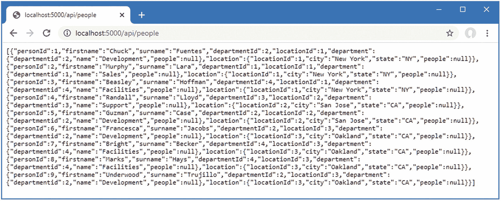
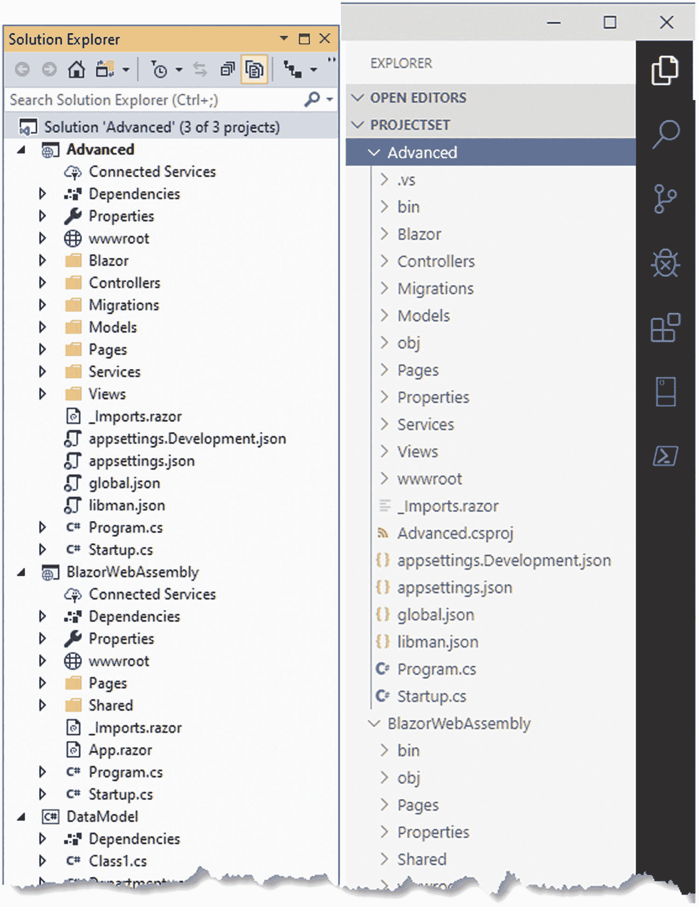
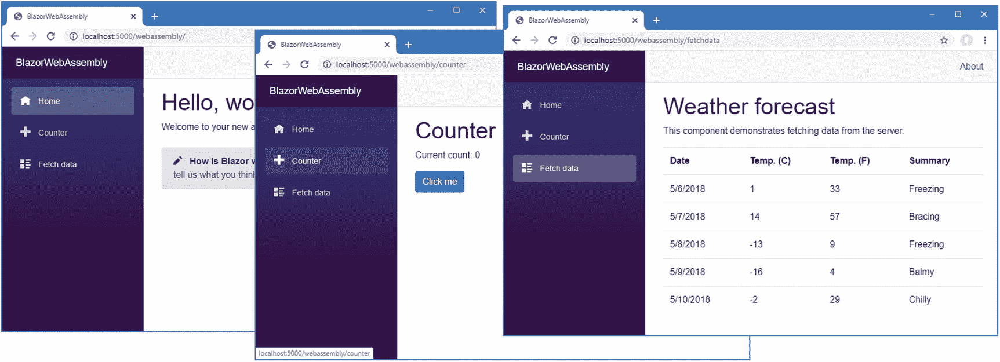
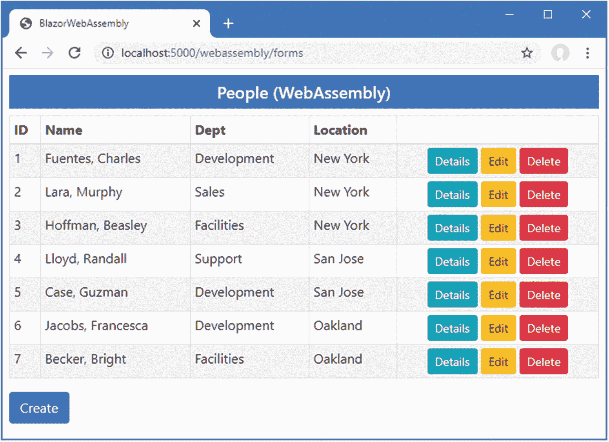
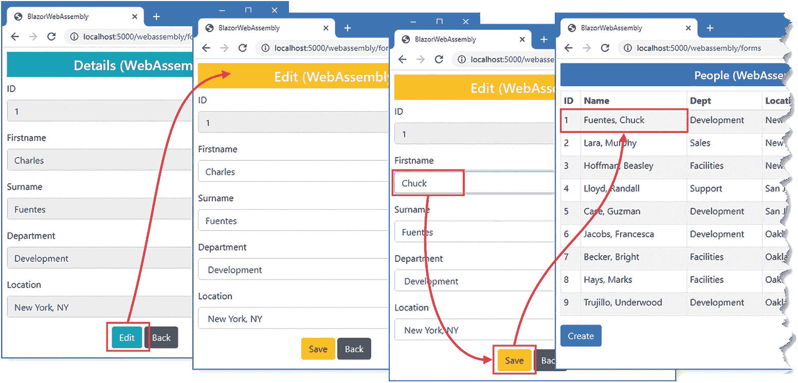

# 三十七、使用 Blazor Web 程序集

在这一章中，我演示了 Blazor WebAssembly 的使用，这是一个为 WebAssembly 编写的 Blazor 的实现。

WebAssembly 是运行在浏览器内部的虚拟机。高级语言被编译成低级语言无关的汇编格式，可以以接近本机的性能执行。WebAssembly 提供了对 JavaScript 应用可用的 API 的访问，这意味着 WebAssembly 应用可以访问域对象模型、使用级联样式表以及发起异步 HTTP 请求。

顾名思义，Blazor WebAssembly 是 Blazor 的一个实现，运行在 WebAssembly 虚拟机上。Blazor WebAssembly 打破了对服务器的依赖，完全在浏览器中执行 Blazor 应用。结果是一个真正的客户端应用，可以访问 Blazor Server 的所有相同功能，但不需要持久的 HTTP 连接。

WebAssembly 和 Blazor WebAssembly 都还处于早期阶段，至少目前有一些严重的限制。WebAssembly 是一项新技术，仅受最新版本的浏览器支持。如果您的项目需要支持遗留浏览器，甚至是现代浏览器的旧版本，您将无法使用 WebAssembly。Blazor WebAssembly 仍处于预览版，这意味着当前的实现不受支持，有一些粗糙的边缘，不支持生产使用。最终版本可能会有变化，你会发现当前的工具和运行时并不像 Blazor 服务器的同类产品那样成熟。

即使考虑到它的预览版状态，Blazor WebAssembly 也不是没有缺点。Blazor WebAssembly 依赖于。为 WebAssembly 编写的. NET Core 运行库。要运行 Blazor WebAssembly 应用，浏览器必须下载。NET 核心运行时。NET 程序集以及应用代码。在撰写本文时，这意味着浏览器必须下载大约 5MB 的数据才能启动应用。我希望产品发布会减少所需的数据量，但是如此大的数据量会使 Blazor WebAssembly 不适合某些项目。和 Blazor WebAssembly 应用都受限于浏览器提供的 API 集，这意味着不是所有的 API 集。NET 功能可以在 WebAssembly 应用中使用。与 Angular 等客户端框架相比，这并没有使 Blazor 处于劣势，但这确实意味着诸如 Entity Framework Core 等功能不可用，因为浏览器限制 WebAssembly 应用只能发出 HTTP 请求。

尽管 Blazor WebAssembly 有其局限性，但它仍然是一项令人兴奋的技术，它有望使用 C# 和 ASP.NET Core 编写真正的客户端应用，而不需要 JavaScript 框架。表 [37-1](#Tab1) 将 Blazor WebAssembly 放在上下文中。

Caution

我写这一章是因为 Blazor WebAssembly 展示了 ASP.NET Core 的未来。但是 Blazor WebAssembly 还没有准备好投入生产，您不应该在实际项目中使用它。

表 37-1。

将 Blazor WebAssembly 放在上下文中

<colgroup><col class="tcol1 align-left"> <col class="tcol2 align-left"></colgroup> 
| 

**问题**

 | 

**回答**

 |
| --- | --- |
| 这是什么？ | Blazor WebAssembly 是 Blazor 的一个实现，使用 WebAssembly 在浏览器中运行。 |
| 为什么有用？ | Blazor WebAssembly 允许用 C# 编写客户端应用，而无需服务器端执行或 Blazor 服务器所需的持久 HTTP 连接。 |
| 如何使用？ | Blazor 组件被添加到专用于 Blazor WebAssembly 的项目中。 |
| 有什么陷阱或限制吗？ | 并非所有浏览器都支持 WebAssembly。需要大量的下载来为浏览器提供所需的代码，并且不是所有的 ASP.NET Core 功能都可以在 Blazor WebAssembly 组件中使用。 |
| 还有其他选择吗？ | Blazor WebAssembly 是使用 ASP.NET Core 编写的真正客户端应用的唯一组合。如果服务器端支持可以接受，可以使用 Blazor 服务器；否则，应该使用 JavaScript 框架，如 Angular、React 或 Vue.js。 |

## 为本章做准备

本章使用了第 [26 章](26.html)中的高级项目。为了准备本章，将名为`DataController.cs`的类文件添加到`Controllers`文件夹中，并使用它来定义清单 [37-1](#PC1) 中所示的 web 服务控制器。

Tip

你可以从 [`https://github.com/apress/pro-asp.net-core-3`](https://github.com/apress/pro-asp.net-core-3) 下载本章以及本书其他章节的示例项目。如果在运行示例时遇到问题，请参见第 [1](01.html) 章获取帮助。

```cs
using Advanced.Models;
using Microsoft.AspNetCore.Mvc;
using Microsoft.EntityFrameworkCore;
using System.Collections.Generic;
using System.Threading.Tasks;

namespace Advanced.Controllers {

    [ApiController]
    [Route("/api/people")]
    public class DataController : ControllerBase {
        private DataContext context;

        public DataController(DataContext ctx) {
            context = ctx;
        }

        [HttpGet]
        public IEnumerable<Person> GetAll() {
            IEnumerable<Person> people
                = context.People.Include(p => p.Department).Include(p => p.Location);
            foreach (Person p in people) {
                p.Department.People = null;
                p.Location.People = null;
            }
            return people;
        }

        [HttpGet("{id}")]
        public async Task<Person> GetDetails(long id) {
            Person p = await context.People.Include(p => p.Department)
                .Include(p => p.Location).FirstAsync(p => p.PersonId == id);
            p.Department.People = null;
            p.Location.People = null;
            return p;
        }

        [HttpPost]
        public async Task Save([FromBody]Person p) {
            await context.People.AddAsync(p);
            await context.SaveChangesAsync();
        }

        [HttpPut]
        public async Task Update([FromBody]Person p) {
            context.Update(p);
            await context.SaveChangesAsync();
        }

        [HttpDelete("{id}")]
        public async Task Delete(long id) {
            context.People.Remove(new Person() { PersonId = id });
            await context.SaveChangesAsync();
        }

        [HttpGet("/api/locations")]
        public IAsyncEnumerable<Location> GetLocations() => context.Locations;
        [HttpGet("/api/departments")]
        public IAsyncEnumerable<Department> GetDepts() => context.Departments;
    }
}

Listing 37-1.The Contents of the DataController.cs File in the Controllers Folder

```

该控制器提供了允许创建、读取、更新和删除`Person`对象的动作。我还添加了返回`Location`和`Department`对象的动作。我通常为每种类型的数据创建单独的控制器，但是这些操作只在支持`Person`特性时才需要，所以我将所有操作合并到一个控制器中。

### 删除数据库并运行应用

打开一个新的 PowerShell 命令提示符，导航到包含`Advanced.csproj`文件的文件夹，运行清单 [37-2](#PC2) 中所示的命令来删除数据库。

```cs
dotnet ef database drop --force

Listing 37-2.Dropping the Database

```

从 Debug 菜单中选择 Start Without Debugging 或 Run Without Debugging，或者使用 PowerShell 命令提示符运行清单 [37-3](#PC3) 中所示的命令。

```cs
dotnet run

Listing 37-3.Running the Example Application

```

使用浏览器请求`http://localhost:5000/api/people`，这将从数据库中产生`Person`对象的 JSON 表示，如图 [37-1](#Fig1) 所示。



图 37-1。

运行示例应用

## 设置 Blazor WebAssembly

Blazor WebAssembly 需要一个单独的项目，这样 Razor 组件就可以被编译并由浏览器执行。编译后的组件可以通过标准的 ASP.NET Core 服务器交付给浏览器，该服务器也可以通过 web 服务提供数据。为了便于 Blazor WebAssembly 组件使用 ASP.NET Core 服务器提供的数据，需要第三个项目来包含它们之间共享的那些项目。

创建三个项目的过程是复杂的，部分原因是我将把一些现有的类从高级项目转移到数据模型项目中。虽然可以使用 Visual Studio 向导执行一些步骤，但是我已经使用命令行工具列出了这些步骤，以尽量减少错误。

Note

如果您在遵循这些步骤时遇到问题，您可以从本书的 GitHub 资源库下载这三个项目，地址是 [`https://github.com/apress/pro-asp.net-core-3`](https://github.com/apress/pro-asp.net-core-3) 。

### 创建共享项目

在开始之前，请确保 Visual Studio 或 Visual Studio 代码已关闭。打开一个新的 PowerShell 命令提示符，导航到包含`Advanced.csproj`文件的`Advanced`项目文件夹，运行清单 [37-4](#PC4) 中所示的命令。

```cs
dotnet new classlib -o ../DataModel -f netstandard2.1
dotnet add ../DataModel package System.ComponentModel.Annotations --version 4.7.0
Move-Item -Path @("Models/Person.cs", "Models/Location.cs", "Models/Department.cs") ../DataModel

Listing 37-4.Preparing the Project for Blazor

```

这些命令创建一个名为`DataModel`的新项目。他们安装`System.ComponentModel.Annotations`包(包含用于数据验证的属性)并将数据模型类移动到新项目中。

### 创建 Blazor WebAssembly 项目

我通常更喜欢从一个空项目开始，添加应用需要的包和配置文件，但 Blazor WebAssembly 仍然是实验性的，其项目结构和依赖关系很可能会发生变化；因此，在技术稳定之前，理解 Blazor WebAssembly 项目的工作方式没有任何好处。相反，我将使用微软提供的模板创建 Blazor WebAssembly。Blazor WebAssembly 模板不包含在标准中。NET 核心模板库，所以第一步是使用 PowerShell 命令提示符运行清单 [37-5](#PC5) 中所示的命令来安装模板。

Tip

您只需要在第一次创建 Blazor WebAssembly 项目时运行该命令。一旦模板安装完毕，您可以跳过这一步，直接跳到清单 [37-6](#PC7) 中所示的命令。

```cs
dotnet new -i Microsoft.AspNetCore.Blazor.Templates::3.1.0-preview4.19579.2

Listing 37-5.Installing the Blazor WebAssembly Project Template

```

此命令的输出令人困惑，可能会给您留下安装失败的印象。该命令显示已安装模板的列表，如果您在列表中看到以下条目，您将知道该命令已经成功:

```cs
...
Blazor WebAssembly App    blazorwasm    [C#]    Web/Blazor/WebAssembly
...

```

接下来，使用 PowerShell 命令提示符从`Advanced`项目文件夹(包含`Advanced.csproj`文件的文件夹)中运行清单 [37-6](#PC7) 中所示的命令。

```cs
dotnet new blazorwasm -o ../BlazorWebAssembly
dotnet add ../BlazorWebAssembly reference ../DataModel

Listing 37-6.Creating the Blazor WebAssembly Project

```

这些命令创建了一个名为`BlazorWebAssembly`的 Blazor WebAssembly 项目，并添加了对`DataModel`项目的引用，这使得`Person`、`Department`和`Location`类可用。

### 准备 ASP.NET Core 项目

使用 PowerShell 命令提示符运行在`Advanced`项目文件夹中的清单 [37-7](#PC8) 中显示的命令。

```cs
dotnet add reference ../DataModel ../BlazorWebAssembly

dotnet add package Microsoft.AspNetCore.Blazor.Server --version 3.1.0-preview4.19579.2

Listing 37-7.Preparing the Advanced Project

```

这些命令创建对其他项目的引用，以便可以使用 Blazor WebAssembly 项目中的数据模型类和组件。

### 添加解决方案引用

运行`Advanced`文件夹中清单 [37-8](#PC9) 中所示的命令，将对新项目的引用添加到解决方案文件中。

```cs
dotnet sln add ../DataModel ../BlazorWebAssembly

Listing 37-8.Adding Solution References

```

### 打开项目

一旦设置好所有三个项目，就启动 Visual Studio 或 Visual Studio 代码。如果您使用的是 Visual Studio，请打开`Advanced`文件夹中的`Advanced.sln`文件。三个项目都被打开进行编辑，如图 [37-2](#Fig2) 所示。如果你使用的是 Visual Studio 代码，打开包含所有三个项目的文件夹，如图 [37-2](#Fig2) 所示。



图 37-2。

打开三个项目

### 完成 Blazor WebAssembly 配置

下一步是配置 ASP.NET Core 项目，以便它能够向客户交付 Blazor WebAssembly 项目的内容。将清单 [37-9](#PC10) 中显示的语句添加到`Advanced`文件夹中的`Startup.cs`文件中。

Caution

密切注意您正在编辑的文件是很重要的。同名文件存在于多个项目中，如果您不严格按照示例进行操作，您将不会得到一个正常工作的应用。Blazor 的未来版本可能更容易使用，但目前，细节很重要。

```cs
using System;
using System.Collections.Generic;
using System.Linq;
using System.Threading.Tasks;
using Microsoft.AspNetCore.Builder;
using Microsoft.AspNetCore.Hosting;
using Microsoft.AspNetCore.Http;
using Microsoft.Extensions.DependencyInjection;
using Microsoft.Extensions.Hosting;
using Microsoft.Extensions.Configuration;
using Microsoft.EntityFrameworkCore;
using Advanced.Models;
using Microsoft.AspNetCore.ResponseCompression;

namespace Advanced {
    public class Startup {

        public Startup(IConfiguration config) {
            Configuration = config;
        }

        public IConfiguration Configuration { get; set; }

        public void ConfigureServices(IServiceCollection services) {
            services.AddDbContext<DataContext>(opts => {
                opts.UseSqlServer(Configuration[
                    "ConnectionStrings:PeopleConnection"]);
                opts.EnableSensitiveDataLogging(true);
            });
            services.AddControllersWithViews().AddRazorRuntimeCompilation();
            services.AddRazorPages().AddRazorRuntimeCompilation();
            services.AddServerSideBlazor();
            services.AddSingleton<Services.ToggleService>();

            services.AddResponseCompression(opts => {
                opts.MimeTypes = ResponseCompressionDefaults.MimeTypes.Concat(
                    new[] { "application/octet-stream" });
            });
        }

        public void Configure(IApplicationBuilder app, DataContext context) {

            app.UseDeveloperExceptionPage();
            app.UseStaticFiles();
            app.UseRouting();

            app.UseEndpoints(endpoints => {
                endpoints.MapControllerRoute("controllers",
                    "controllers/{controller=Home}/{action=Index}/{id?}");
                endpoints.MapDefaultControllerRoute();
                endpoints.MapRazorPages();
                endpoints.MapBlazorHub();

                endpoints.MapFallbackToClientSideBlazor<BlazorWebAssembly.Startup>
                    ("/webassembly/{*path:nonfile}", "index.html");

                endpoints.MapFallbackToPage("/_Host");
            });

            app.Map("/webassembly", opts =>
                opts.UseClientSideBlazorFiles<BlazorWebAssembly.Startup>());

            SeedData.SeedDatabase(context);
        }
    }
}

Listing 37-9.Configuring the Application in the Startup.cs File in the Advanced Project

```

这些语句启用 Blazor WebAssembly 需要的响应压缩，并配置 ASP.NET Core 请求管道，以便 Blazor WebAssembly 使用`BlazorWebAssembly`项目的内容处理对`/webassembly`的请求。

#### 设置基本 URL

最后一步是修改 HTML 文件，该文件将用于响应对`/webassembly` URL 的请求。将清单 [37-10](#PC11) 所示的更改应用到`BlazorWebAssembly`文件夹的`wwwroot`文件夹中的`index.html`文件。

Caution

确保基本元素的`href`属性中的`webassembly`前后有正斜杠(`/`)字符。如果您省略了其中一个字符，那么 Blazor WebAssembly 将无法工作。

```cs
<!DOCTYPE html>
<html>

<head>
    <meta charset="utf-8" />
    <meta name="viewport" content="width=device-width" />
    <title>BlazorWebAssembly</title>
    <base href="/webassembly/" />
    <link href="css/bootstrap/bootstrap.min.css" rel="stylesheet" />
    <link href="css/site.css" rel="stylesheet" />
</head>

<body>
    <app>Loading...</app>

    <div id="blazor-error-ui">
        An unhandled error has occurred.
        <a href="" class="reload">Reload</a>
        <a class="dismiss">x</a>
    </div>
    <script src="_framework/blazor.webassembly.js"></script>
</body>

</html>

Listing 37-10.Setting the URL in the index.html File in the wwwroot Folder of the BlazorWebAssembly Project

```

`base`元素设置 URL，文档中的所有相对 URL 都是从该 URL 定义的，并且是 Blazor WebAssembly 路由系统正确操作所必需的。

### 测试占位符组件

通过从“调试”菜单中选择“启动而不调试”或“运行而不调试”来启动 ASP.NET Core。如果您更喜欢使用命令提示符，运行在`Advanced`项目文件夹中的清单 [37-11](#PC12) 中显示的命令。

```cs
dotnet run

Listing 37-11.Running the Example Application

```

使用浏览器请求`http://localhost:5000/webassembly`，您将看到由用于创建 BlazorWebAssembly 项目的模板添加的占位符内容。

使用 PowerShell 命令提示符，从`Advanced`项目文件夹中运行以下命令。点击计数器和取数据链接，会看到显示不同的内容，如图 [37-3](#Fig3) 所示。



图 37-3。

Blazor WebAssembly 占位符内容

## 创建 Blazor WebAssembly 组件

Blazor WebAssembly 使用与 Blazor Server 相同的方法，依靠组件作为应用的构建块，通过路由系统连接，并通过布局显示常用内容。在这一节中，我将展示如何创建一个与 Blazor WebAssembly 一起工作的 Razor 组件，然后我将重新创建第 [36 章](36.html)中的简单表单应用。

### 导入数据模型命名空间

我将在本章中创建的组件都使用共享数据模型项目中的类。不是向每个组件添加`@using`表达式，而是向 BlazorWebAssembly 项目的根文件夹中的`_Imports.razor`文件添加数据模型类的名称空间，如清单 [37-12](#PC13) 所示。

```cs
@using System.Net.Http
@using Microsoft.AspNetCore.Components.Forms
@using Microsoft.AspNetCore.Components.Routing
@using Microsoft.AspNetCore.Components.Web
@using Microsoft.JSInterop
@using BlazorWebAssembly
@using BlazorWebAssembly.Shared
@using Advanced.Models

Listing 37-12.Adding a Namespace in the _Imports.razor File in the BlazorWebAssembly Project

```

注意，虽然我将模型类移动到了`DataModel`项目中，但是我已经指定了`Advanced.Models`名称空间。这是因为我移动的类文件都有指定了`Advanced.Models`的`namespace`声明，这意味着移动文件并没有改变类所在的名称空间。

### 创建组件

在前面的章节中，我在一个`Blazor`文件夹中定义了我的 Razor 组件，以将新内容与 ASP.NET Core 的其他部分分开。BlazorWebAssembly 项目中只有 Blazor 内容，所以我将遵循项目模板采用的惯例，使用`Pages`和`Shared`文件夹。

将名为`List.razor`的 Razor 组件添加到 BlazorWebAssembly 项目的`Pages`文件夹中，并添加清单 [37-13](#PC14) 中所示的内容。

```cs
@page "/forms"
@page "/forms/list"

<h5 class="bg-primary text-white text-center p-2">People (WebAssembly)</h5>

<table class="table table-sm table-striped table-bordered">
    <thead>
        <tr>
            <th>ID</th><th>Name</th><th>Dept</th><th>Location</th><th></th>
        </tr>
    </thead>
    <tbody>
        @if  (People.Count() == 0) {
            <tr><th colspan="5" class="p-4 text-center">Loading Data...</th></tr>
        } else {
            @foreach (Person p in People) {
                <tr>
                    <td>@p.PersonId</td>
                    <td>@p.Surname, @p.Firstname</td>
                    <td>@p.Department.Name</td>
                    <td>@p.Location.City</td>
                    <td class="text-center">
                        <NavLink class="btn btn-sm btn-info"
                               href="@GetDetailsUrl(p.PersonId)">
                            Details
                        </NavLink>
                        <NavLink class="btn btn-sm btn-warning"
                               href="@GetEditUrl(p.PersonId)">
                            Edit
                        </NavLink>
                        <button class="btn btn-sm btn-danger"
                                @onclick="@(() => HandleDelete(p))">
                            Delete
                        </button>
                    </td>
                </tr>
            }
        }
    </tbody>
</table>

<NavLink class="btn btn-primary" href="forms/create">Create</NavLink>

@code {

    [Inject]
    public HttpClient Http { get; set; }

    public Person[] People { get; set; } = Array.Empty<Person>();

    protected async override Task OnInitializedAsync() {
        await UpdateData();
    }

    private async Task UpdateData() {
        People = await Http.GetJsonAsync<Person[]>("/api/people");
    }

    string GetEditUrl(long id) => $"forms/edit/{id}";
    string GetDetailsUrl(long id) => $"forms/details/{id}";

    public async Task HandleDelete(Person p) {
        HttpResponseMessage resp =
            await Http.DeleteAsync($"/api/people/{p.PersonId}");
        if (resp.IsSuccessStatusCode) {
            await UpdateData();
        }
    }
}

Listing 37-13.The Contents of the List.razor File in the Pages Folder of the BlazorWebAssembly Project

```

如果你将这个组件与第 36 章[中的 Blazor 服务器进行比较，你会发现它们基本上是一样的。两种类型的 Blazor 使用相同的核心特性，这就是为什么内容使用相同的 Razor 指令，用`@onclick`属性处理事件，并对 C# 语句使用相同的`@code`部分。Blazor WebAssembly 组件被编译成 C# 类，就像它的 Blazor 服务器对应物一样。当然，关键的区别在于，生成的 C# 类是在浏览器中执行的——这就是与第 36 章](36.html)[中的组件不同的原因。](36.html)

#### 在 Blazor WebAssembly 组件中导航

请注意，用于导航的 URL 是在没有前导正斜杠字符的情况下表示的，如下所示:

```cs
...
<NavLink class="btn btn-primary" href="forms/create">Create</NavLink>
...

```

应用的根 URL 是使用清单 [37-13](#PC14) 中的`base`元素指定的，使用相对 URL 确保导航相对于根执行。在这种情况下，相对的`forms/create` URL 与由`base`元素指定的`/webassembly/`根相结合，并且导航到`/webassembly/forms/create`。包含一个前导正斜杠会导航到`/forms/create`，这在应用的 Blazor WebAssembly 部分管理的 URL 集之外。只有导航 URL 需要此更改。例如，用`@page`指令指定的 URL 不受影响。

#### 在 Blazor WebAssembly 组件中获取数据

最大的变化是 Blazor WebAssembly 不能使用实体框架核心。尽管运行时可能能够执行实体框架核心类，但浏览器将 WebAssembly 应用限制为 HTTP 请求，从而阻止了 SQL 的使用。为了获取数据，Blazor WebAssembly 应用使用 web 服务，这就是我在本章开始时将 API 控制器添加到高级项目中的原因。

作为 Blazor WebAssembly 应用启动的一部分，为`HttpClient`类创建了一个服务，组件可以使用标准的依赖注入特性接收该服务。`List`组件通过用`Inject`属性修饰的属性接收一个`HttpClient`组件，如下所示:

```cs
...
[Inject]
public HttpClient Http { get; set; }
...

```

`HttpClient`类提供了表 [37-2](#Tab2) 中描述的方法来发送 HTTP 请求。

表 37-2。

HttpClient 类定义的方法

<colgroup><col class="tcol1 align-left"> <col class="tcol2 align-left"></colgroup> 
| 

**名称**

 | 

**描述**

 |
| --- | --- |
| `GetAsync(url)` | 这个方法发送一个 HTTP GET 请求。 |
| `PostAsync(url, data)` | 这个方法发送一个 HTTP POST 请求。 |
| `PutAsync(url, data)` | 这个方法发送一个 HTTP PUT 请求。 |
| `PatchAync(url, data)` | 这个方法发送一个 HTTP 补丁请求。 |
| `DeleteAsync(url)` | 这个方法发送一个 HTTP 删除请求。 |
| `SendAsync(request)` | 这个方法发送一个使用`HttpRequestMessage`对象配置的 HTTP。 |

表 [37-2](#Tab2) 中的方法返回一个`Task<HttpResponseMessage>`结果，它描述了从 HTTP 服务器收到的对异步请求的响应。表 [37-3](#Tab3) 显示了最有用的`HttpResponseMessage`属性。

表 37-3。

有用的 HttpClient 属性

<colgroup><col class="tcol1 align-left"> <col class="tcol2 align-left"></colgroup> 
| 

**名称**

 | 

**描述**

 |
| --- | --- |
| `Content` | 该属性返回服务器返回的内容。 |
| `HttpResponseHeaders` | 该属性返回响应头。 |
| `StatusCode` | 此属性返回响应状态代码。 |
| `IsSuccessStatusCode` | 如果响应状态代码介于 200 和 299 之间，则该属性返回`true`，表示请求成功。 |

当用户点击删除按钮时，`List`组件使用`DeleteAsync`方法请求 web 服务删除对象。

```cs
...
HttpResponseMessage resp =
    await Http.DeleteAsync($"/api/people/{p.PersonId}");
    if (resp.IsSuccessStatusCode) {
        await UpdateData();
    }
}
...

```

当您不需要处理 web 服务发回的数据时，这些方法非常有用，比如在这种情况下，我只检查删除请求是否成功。注意，我只在使用`HttpClient`服务时指定请求 URL 的路径，因为 web 服务可以使用与应用相同的模式、主机和端口。

对于 web 服务返回数据的操作，表 [37-4](#Tab4) 中描述的`HttpClient`类的扩展方法更有用。这些方法将数据序列化为 JSON，这样就可以将数据发送到服务器，并将 JSON 响应解析为 C# 对象。对于不返回结果的请求，可以省略泛型类型参数。

表 37-4。

HttpClient 扩展方法

<colgroup><col class="tcol1 align-left"> <col class="tcol2 align-left"></colgroup> 
| 

**名称**

 | 

**描述**

 |
| --- | --- |
| `GetJsonAsync<T>(url)` | 该方法发送一个 HTTP GET 请求，并将响应解析为类型`T`。 |
| `PostJsonAsync<T>(url, data)` | 该方法发送一个 HTTP POST 请求，并将响应解析为类型`T`。 |
| `PutJsonAsync<T>(url, data)` | 该方法发送一个 HTTP PUT 请求，并将响应解析为类型`T`。 |
| `SendJsonAsync<T>(method, url, data)` | 该方法使用指定的方法发送 HTTP 请求，并将响应解析为类型`T`。 |

`List`组件使用`GetJsonAsync<T>`方法从 web 服务请求数据。

```cs
...
private async Task UpdateData() {
    People = await Http.GetJsonAsync<Person[]>("/api/people");
}
...

```

将泛型类型参数设置为`Person[]`告诉`HttpClient`将响应解析为一个`Person`对象数组。

Note

`HttpClient`类不存在任何范围或生命周期问题，并且仅在调用表 [37-2](#Tab2) 或表 [37-4](#Tab4) 中描述的方法之一时发送请求。然而，需要考虑何时请求新数据。在这个例子中，我在删除一个对象后重新查询 web 服务，而不是简单地从组件初始化时请求的数据中删除该对象。这可能不适用于所有应用，因为它会反映其他用户对数据库所做的任何更改。

### 创建布局

用于创建 Blazor WebAssembly 项目的模板包括一个布局，该布局显示了占位符内容的导航功能。我不想要这些导航功能，所以第一步是创建一个新的布局。在 BlazorWebAssembly 项目的`Shared`文件夹中添加一个名为`EmptyLayout.razor`的 Razor 组件，内容如清单 [37-14](#PC19) 所示。

```cs
@inherits LayoutComponentBase

<div class="m-2">
    @Body
</div>

Listing 37-14.The EmptyLayout.razor File in the Shared Folder of the BlazorWebAssembly Project

```

我可以应用带有`@layout`表达式的新布局，正如我在第 [36](36.html) 章中所做的那样，但是我将通过更改路由配置来使用这个布局作为默认布局，这是在 BlazorWebAssembly 项目的`App.razor`文件中定义的，如清单 [37-15](#PC20) 所示。

```cs
<Router AppAssembly="@typeof(Program).Assembly">
    <Found Context="routeData">
        <RouteView RouteData="@routeData" DefaultLayout="@typeof(EmptyLayout)" />
    </Found>
    <NotFound>
        <LayoutView Layout="@typeof(EmptyLayout)">
            <p>Sorry, there's nothing at this address.</p>
        </LayoutView>
    </NotFound>
</Router>

Listing 37-15.Applying the Layout in the App.razor File in the BlazorWebAssembly Project

```

第 [35 章](35.html)描述了`Router`、`RouteView`、`Found`和`NotFound`部件。

### 定义 CSS 样式

该模板创建了 Blazor WebAssembly 项目，它有自己的 Bootstrap CSS 框架副本和一个附加样式表，该样式表结合了配置 Blazor WebAssembly 错误和验证元素以及管理应用布局所需的样式。替换 HTML 文件中的`link`元素，如清单 [37-16](#PC21) 所示，并将样式直接应用于`error`元素。这将删除 Microsoft 布局使用的样式，并使用添加到高级项目中的引导 CSS 样式表。

```cs
<!DOCTYPE html>
<html>

<head>
    <meta charset="utf-8" />
    <meta name="viewport" content="width=device-width" />
    <title>BlazorWebAssembly</title>
    <base href="/webassembly/" />
    <link href="/lib/twitter-bootstrap/css/bootstrap.min.css" rel="stylesheet" />
</head>

<body>
    <app>Loading...</app>

    <div id="blazor-error-ui"
              class="text-center bg-danger h6 text-white p-2 fixed-top w-100"
                style="display:none">
        An unhandled error has occurred.
        <a href="" class="reload">Reload</a>
        <a class="dismiss">x</a>
    </div>
    <script src="_framework/blazor.webassembly.js"></script>
</body>

</html>

Listing 37-16.Modifying the index.html File in the wwwroot Folder in the BlazorWebAssembly Project

```

要查看新组件，重启 ASP.NET Core 并请求`http://localhost:5000/webassembly/forms`，这将产生如图 [37-4](#Fig4) 所示的响应。



图 37-4。

Blazor WebAssembly 组件

Blazor WebAssembly 组件遵循标准的 Blazor 生命周期，组件显示它从 web 服务接收的数据。

## 完成 Blazor WebAssembly 表单应用

目前只有`List`组件显示的删除按钮有效。在接下来的部分中，我将通过创建附加组件来完成 Blazor WebAssembly 表单应用。

### 创建详细信息组件

将名为`Details.razor`的 Razor 组件添加到 BlazorWebAssembly 项目的`Pages`文件夹中，内容如清单 [37-17](#PC22) 所示。

```cs
@page "/forms/details/{id:long}"

<h4 class="bg-info text-center text-white p-2">Details (WebAssembly)</h4>

<div class="form-group">
    <label>ID</label>
    <input class="form-control" value="@PersonData.PersonId" disabled />
</div>
<div class="form-group">
    <label>Firstname</label>
    <input class="form-control" value="@PersonData.Firstname" disabled />
</div>
<div class="form-group">
    <label>Surname</label>
    <input class="form-control" value="@PersonData.Surname" disabled />
</div>
<div class="form-group">
    <label>Department</label>
    <input class="form-control" value="@PersonData.Department?.Name" disabled />
</div>
<div class="form-group">
    <label>Location</label>
    <input class="form-control"
           value="@($"{PersonData.Location?.City}, {PersonData.Location?.State}")"
           disabled />
</div>
<div class="text-center">
    <NavLink class="btn btn-info" href="@EditUrl">Edit</NavLink>
    <NavLink class="btn btn-secondary" href="forms">Back</NavLink>
</div>

@code {

    [Inject]
    public NavigationManager NavManager { get; set; }

    [Inject]
    public HttpClient Http { get; set; }

    [Parameter]
    public long Id { get; set; }

    public Person PersonData { get; set; } = new Person();

    protected async override Task OnParametersSetAsync() {
        PersonData = await Http.GetJsonAsync<Person>($"/api/people/{Id}");
    }

    public string EditUrl => $"forms/edit/{Id}";
}

Listing 37-17.The Contents of the Details.razor File in the Pages Folder of the BlazorWebAssembly Project

```

按照`List`组件建立的模式，`Details`组件与 Blazor 服务器组件只有两个不同之处:数据通过`HttpClient`服务获得，导航目标使用相对 URL 表示。在所有其他方面，例如从路由数据中获取参数，Blazor WebAssembly 的工作方式与 Blazor Server 完全相同。

### 创建编辑器组件

为了完成表单应用，将一个名为`Editor.razor`的 Razor 组件添加到`BlazorWebAssembly`项目的`Pages`文件夹中，其内容如清单 [37-18](#PC23) 所示。

```cs
@page "/forms/edit/{id:long}"
@page "/forms/create"

<link href="/blazorValidation.css" rel="stylesheet" />

<h4 class="bg-@Theme text-center text-white p-2">@Mode (WebAssembly)</h4>

<EditForm Model="PersonData" OnValidSubmit="HandleValidSubmit">
    <DataAnnotationsValidator />
    @if (Mode == "Edit") {
        <div class="form-group">
            <label>ID</label>
            <InputNumber class="form-control"
                @bind-Value="PersonData.PersonId" readonly />
        </div>
    }
    <div class="form-group">
        <label>Firstname</label>
        <ValidationMessage For="@(() => PersonData.Firstname)" />
        <InputText class="form-control" @bind-Value="PersonData.Firstname" />
    </div>
    <div class="form-group">
        <label>Surname</label>
        <ValidationMessage For="@(() => PersonData.Surname)" />
        <InputText class="form-control" @bind-Value="PersonData.Surname" />
    </div>
    <div class="form-group">
        <label>Department</label>
        <ValidationMessage For="@(() => PersonData.DepartmentId)" />
        <select @bind="PersonData.DepartmentId" class="form-control">
            <option selected disabled value="0">Choose a Department</option>
            @foreach (var kvp in Departments) {
                <option value="@kvp.Value">@kvp.Key</option>
            }
        </select>
    </div>
    <div class="form-group">
        <label>Location</label>
        <ValidationMessage For="@(() => PersonData.LocationId)" />
        <select @bind="PersonData.LocationId" class="form-control">
            <option selected disabled value="0">Choose a Location</option>
            @foreach (var kvp in Locations) {
                <option value="@kvp.Value">@kvp.Key</option>
            }
        </select>
    </div>
    <div class="text-center">
        <button type="submit" class="btn btn-@Theme">Save</button>
        <NavLink class="btn btn-secondary" href="forms">Back</NavLink>
    </div>
</EditForm>

@code {

    [Inject]
    public HttpClient Http { get; set; }

    [Inject]
    public NavigationManager NavManager { get; set; }

    [Parameter]
    public long Id { get; set; }

    public Person PersonData { get; set; } = new Person();

    public IDictionary<string, long> Departments { get; set; }
        = new Dictionary<string, long>();
    public IDictionary<string, long> Locations { get; set; }
        = new Dictionary<string, long>();

    protected async override Task OnParametersSetAsync() {
        if (Mode == "Edit") {
            PersonData = await Http.GetJsonAsync<Person>($"/api/people/{Id}");
        }
        Departments = (await Http.GetJsonAsync<Department[]>("/api/departments"))
            .ToDictionary(d => d.Name, d => d.Departmentid);
        Locations = (await Http.GetJsonAsync<Location[]>("/api/locations"))
            .ToDictionary(l => $"{l.City}, {l.State}", l => l.LocationId);
    }

    public string Theme => Id == 0 ? "primary" : "warning";
    public string Mode => Id == 0 ? "Create" : "Edit";

    public async Task HandleValidSubmit()  {
        await Http.SendJsonAsync(Mode == "Create" ? HttpMethod.Post : HttpMethod.Put,
            "/api/people", PersonData);
        NavManager.NavigateTo("forms");
    }
}

Listing 37-18.The Contents of the Editor.razor File in the Pages Folder of the BlazorWebAssembly Project

```

该组件使用第 36 章[中描述的 Blazor 表单特性，但是使用 HTTP 请求来读写本章开始时创建的 web 服务的数据。`GetJsonAsync<T>`方法用于从 web 服务读取数据，而`SendJsonAsync`方法用于在用户提交表单时发送 POST 或 PUT 请求。](36.html)

请注意，我没有使用我在第 [36](36.html) 章中创建的定制`select`组件或验证组件。在项目之间共享组件——特别是当 Blazor WebAssembly 是在开发开始后引入的时候——是很尴尬的。我希望这个过程在未来的版本中会有所改进，但是对于这一章，我只是简单地去掉了这些特性。因此，当选择一个值时，`select`元素不会触发验证，提交按钮不会自动禁用，并且对部门和位置的组合没有限制。

重启 ASP.NET Core 并请求`http://localhost:5000/webassembly/forms`，您将看到表单应用的 Blazor WebAssembly 版本。单击表中第一项的详细信息按钮，您将看到所选对象的字段。单击 Edit 按钮，您将看到一个可编辑的表单。进行修改后点击保存按钮，修改将被发送到 web 服务并显示在数据表中，如图 [37-5](#Fig5) 所示。



图 37-5。

已完成的 Blazor WebAssembly 表单应用

## 摘要

在这一章中，我描述了 Blazor WebAssembly，向您展示了如何将它添加到项目中，并演示了它与前面章节中描述的 Blazor 服务器是如何的相似(尽管并不完全相同)。在下一章中，我将解释如何使用 ASP.NET Core Identity 来保护应用。