# 三十八、使用 ASP.NET Core Identity

ASP.NET Core Identity 是微软的 API，用于管理 ASP.NET Core 应用中的用户，并支持将认证和授权集成到请求管道中。

ASP.NET Core Identity 是一个工具包，您可以用它来创建应用所需的授权和认证功能。双因素身份认证、联合、单点登录和帐户自助服务等功能有无数的集成选项。有些选项仅在大型企业环境中或使用云托管用户管理时有用。

ASP.NET 的核心身份已经演变成自己的框架，对我来说太大了，无法在本书中详细介绍。相反，我把重点放在了 Identity API 中与 web 应用开发交叉的部分，就像我对实体框架核心所做的那样。在本章中，我将向您展示如何将 ASP.NET Core Identity 添加到项目中，并解释如何使用 ASP.NET Core Identity API 来创建执行基本用户和角色管理的工具。在第 [39](39.html) 章中，我将向您展示如何使用 ASP.NET Core Identity 来认证用户和执行授权。表 [38-1](#Tab1) 将 ASP.NET Core Identity 置于背景中。

表 38-1。

将 ASP.NET 的核心身份置于背景中

<colgroup><col class="tcol1 align-left"> <col class="tcol2 align-left"></colgroup> 
| 

问题

 | 

回答

 |
| --- | --- |
| 这是什么？ | ASP.NET Core Identity 是一个用于管理用户的 API。 |
| 为什么有用？ | 大多数应用都有一些不应该对所有用户开放的功能。ASP.NET Core Identity 认证提供了允许用户验证自身身份和访问受限功能的功能。 |
| 如何使用？ | ASP.NET Core Identity 作为包添加到项目中，并使用实体框架核心将其数据存储在数据库中。用户的管理是通过一个定义良好的 API 来执行的，它的特性作为属性来应用，正如我在第 [39](39.html) 章所描述的。 |
| 有什么陷阱或限制吗？ | ASP.NET Core Identity 很复杂，并且支持多种认证、授权和管理模型。理解所有选项可能很困难，文档也可能很少。 |
| 有其他选择吗？ | 如果一个项目需要限制对特性的访问，除了 ASP.NET Core 标识之外，没有其他明智的选择。 |

表 [38-2](#Tab2) 总结了本章内容。

表 38-2。

章节总结

<colgroup><col class="tcol1 align-left"> <col class="tcol2 align-left"> <col class="tcol3 align-left"></colgroup> 
| 

问题

 | 

解决办法

 | 

列表

 |
| --- | --- | --- |
| 准备身份申请 | 创建上下文类，并使用它来准备应用于数据库的迁移 | 4–7 |
| 管理用户帐户 | 使用`UserManager<T>`类 | 8–12, 15, 16 |
| 设置用户名和密码策略 | 使用选项模式来配置身份 | 13, 14 |
| 管理角色 | 使用`RoleManager<T>`类管理角色，使用`UserManager<T>`类为用户分配角色 | 17–20 |

## 为本章做准备

本章使用第 [37 章](37.html)中的高级、数据模型和 BlazorWebAssembly 项目。如果您使用的是 Visual Studio，请打开您在上一章中创建的`Advanced.sln`文件来打开所有三个项目。如果您使用的是 Visual Studio 代码，请打开包含这三个项目的文件夹。

Tip

你可以从 [`https://github.com/apress/pro-asp.net-core-3`](https://github.com/apress/pro-asp.net-core-3) 下载本章以及本书其他章节的示例项目。如果在运行示例时遇到问题，请参见第 [1](01.html) 章获取帮助。

打开一个新的 PowerShell 命令提示符，导航到包含`Advanced.csproj`文件的文件夹，运行清单 [38-1](#PC1) 中所示的命令来删除数据库。

```cs
dotnet ef database drop --force

Listing 38-1.Dropping the Database

```

从 Debug 菜单中选择 Start Without Debugging 或 Run Without Debugging，或者使用 PowerShell 命令提示符运行清单 [38-2](#PC2) 中所示的命令。

```cs
dotnet run

Listing 38-2.Running the Example Application

```

使用浏览器请求`http://localhost:5000`，将产生如图 [38-1](#Fig1) 所示的响应。

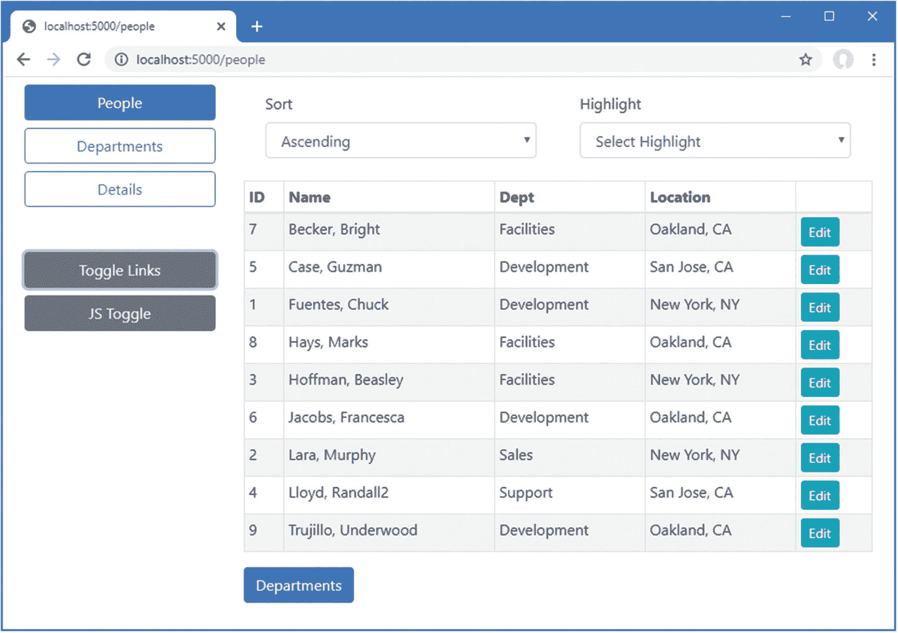

图 38-1。

运行示例应用

## 为 ASP.NET Core 标识项目做准备

设置 ASP.NET Core 标识的过程需要向项目中添加一个包、配置应用和准备数据库。首先，使用 PowerShell 命令提示符运行清单`Advanced`项目文件夹中的 [38-3](#PC3) 中所示的命令，这将安装 ASP.NET Core Identity 包。如果您使用的是 Visual Studio，可以通过选择“项目➤管理 NuGet 包”来安装该包。

```cs
dotnet add package Microsoft.AspNetCore.Identity.EntityFrameworkCore --version 3.1.1

Listing 38-3.Installing ASP.NET Core Identity Packages

```

### 准备 ASP.NET Core Identity 数据库

ASP.NET 身份需要一个通过实体框架核心管理的数据库。要创建提供身份数据访问的实体框架核心上下文类，使用清单 [38-4](#PC4) 中所示的代码将名为`IdentityContext.cs`的类文件添加到`Advanced/Models`文件夹中。

```cs
using Microsoft.AspNetCore.Identity;
using Microsoft.AspNetCore.Identity.EntityFrameworkCore;
using Microsoft.EntityFrameworkCore;

namespace Advanced.Models {
    public class IdentityContext: IdentityDbContext<IdentityUser> {

        public IdentityContext(DbContextOptions<IdentityContext> options)
            : base(options) { }
    }
}

Listing 38-4.The Contents of the IdentityContext.cs File in the Models Folder of the Advanced Project

```

ASP.NET Core Identity 包包括`IdentityDbContext<T>`类，用于创建实体框架核心上下文类。通用类型参数`T`用于指定将在数据库中表示用户的类。您可以创建自定义的用户类，但是我使用的是基本类，名为`IdentityUser`，它提供了核心的身份特性。

Note

如果清单 [38-4](#PC4) 中使用的类没有意义，也不用担心。如果你不熟悉实体框架核心，那么我建议你把类当作一个黑盒。一旦建立了 ASP.NET Core 标识的构建块，很少需要进行更改，您可以将本章中的文件复制到您自己的项目中。

#### 配置数据库连接字符串

需要一个连接字符串来告诉 ASP.NET Core 标识应该在哪里存储其数据。在清单 [38-5](#PC5) 中，我向`appsettings.json`文件添加了一个连接字符串，旁边是用于应用数据的字符串。

```cs
{
  "Logging": {
    "LogLevel": {
      "Default": "Information",
      "Microsoft": "Warning",
      "Microsoft.Hosting.Lifetime": "Information",
      "Microsoft.EntityFrameworkCore": "Information"
    }
  },
  "AllowedHosts": "*",
  "ConnectionStrings": {
    "PeopleConnection": "Server=(localdb)\\MSSQLLocalDB;Database=People;MultipleActiveResultSets=True",
    "IdentityConnection": "Server=(localdb)\\MSSQLLocalDB;Database=Identity;MultipleActiveResultSets=True"
  }
}

Listing 38-5.Adding a Connection String in the appsettings.json File in the Advanced Project

```

连接字符串指定一个名为`Identity`的 LocalDB 数据库。

Note

打印页面的宽度不允许对连接字符串进行合理的格式化，连接字符串必须出现在一个完整的行中。当您将连接字符串添加到自己的项目中时，请确保它在一行中。

### 配置应用

下一步是配置 ASP.NET Core，以便将身份数据库上下文设置为服务，如清单 [38-6](#PC6) 所示。

```cs
using System;
using System.Collections.Generic;
using System.Linq;
using System.Threading.Tasks;
using Microsoft.AspNetCore.Builder;
using Microsoft.AspNetCore.Hosting;
using Microsoft.AspNetCore.Http;
using Microsoft.Extensions.DependencyInjection;
using Microsoft.Extensions.Hosting;
using Microsoft.Extensions.Configuration;
using Microsoft.EntityFrameworkCore;
using Advanced.Models;
using Microsoft.AspNetCore.ResponseCompression;
using Microsoft.AspNetCore.Identity;

namespace Advanced {
    public class Startup {

        public Startup(IConfiguration config) {
            Configuration = config;
        }

        public IConfiguration Configuration { get; set; }

        public void ConfigureServices(IServiceCollection services) {
            services.AddDbContext<DataContext>(opts => {
                opts.UseSqlServer(Configuration[
                    "ConnectionStrings:PeopleConnection"]);
                opts.EnableSensitiveDataLogging(true);
            });
            services.AddControllersWithViews().AddRazorRuntimeCompilation();
            services.AddRazorPages().AddRazorRuntimeCompilation();
            services.AddServerSideBlazor();
            services.AddSingleton<Services.ToggleService>();

            services.AddResponseCompression(opts => {
                opts.MimeTypes = ResponseCompressionDefaults.MimeTypes.Concat(
                    new[] { "application/octet-stream" });
            });

            services.AddDbContext<IdentityContext>(opts =>
                opts.UseSqlServer(Configuration[
                    "ConnectionStrings:IdentityConnection"]));
            services.AddIdentity<IdentityUser, IdentityRole>()
                .AddEntityFrameworkStores<IdentityContext>();
        }

        public void Configure(IApplicationBuilder app, DataContext context) {

            app.UseDeveloperExceptionPage();
            app.UseStaticFiles();
            app.UseRouting();

            app.UseEndpoints(endpoints => {
                endpoints.MapControllerRoute("controllers",
                    "controllers/{controller=Home}/{action=Index}/{id?}");
                endpoints.MapDefaultControllerRoute();
                endpoints.MapRazorPages();
                endpoints.MapBlazorHub();

                endpoints.MapFallbackToClientSideBlazor<BlazorWebAssembly.Startup>
                    ("/webassembly/{*path:nonfile}", "index.html");

                endpoints.MapFallbackToPage("/_Host");
            });

            app.Map("/webassembly", opts =>
                opts.UseClientSideBlazorFiles<BlazorWebAssembly.Startup>());

            SeedData.SeedDatabase(context);
        }
    }
}

Listing 38-6.Configuring Identity in the Startup.cs File in the Advanced Project

```

### 创建和应用身份数据库迁移

剩下的步骤是创建实体框架核心数据库迁移，并应用它来创建数据库。打开一个新的 PowerShell 窗口，导航到`Advanced`项目文件夹，运行清单 [38-7](#PC7) 中显示的命令。

```cs
dotnet ef migrations add --context IdentityContext Initial
dotnet ef database update --context IdentityContext

Listing 38-7.Creating and Applying the Database Migration

```

正如我在前面章节中解释的，实体框架核心通过一个叫做*迁移*的特性来管理数据库模式的变更。既然项目中有两个数据库上下文类，那么实体框架核心工具需要`--context`参数来确定正在使用哪个上下文类。清单 [38-7](#PC7) 中的命令创建一个包含 ASP.NET Core Identity 模式的迁移，并将其应用于数据库。

Resetting the ASP.NET Core Identity Database

如果需要重置数据库，运行`Advanced`文件夹中的`dotnet ef database drop --force --context IdentityContext`命令，然后运行`dotnet ef database update --context IdentityContext`命令。这将删除现有数据库，并创建一个新的空替换数据库。不要在生产系统上使用这些命令，因为您将删除用户凭据。如果需要重置主数据库，那么运行`dotnet ef database drop --force --context DataContext`命令，然后运行`dotnet ef database update --context DataContext`。

## 创建用户管理工具

在本节中，我将创建通过 ASP.NET Core Identity 管理用户的工具。用户通过`UserManager<T>`类来管理，其中`T`是被选择来代表数据库中的用户的类。当我创建实体框架核心上下文类时，我指定了`IdentityUser`作为在数据库中表示用户的类。这是由 ASP.NET Core Identity 提供的内置类，它提供了大多数应用所需的核心功能。表 [38-3](#Tab3) 描述了最有用的`IdentityUser`属性。(`IdentityUser`类定义了额外的属性，但这些是大多数应用所需要的，也是我在本书中使用的。)

Scaffolding the Identity Management Tools

微软提供了一个工具，可以为用户管理生成一组 Razor 页面。该工具将模板中的通用内容(称为*脚手架*)添加到项目中，然后您可以根据应用对其进行定制。我不是脚手架或模板的粉丝，这也不例外。Microsoft 身份模板是经过深思熟虑的，但它们的用途有限，因为它们侧重于自我管理，允许用户在没有管理员干预的情况下创建帐户、更改密码等。您可以调整模板来限制用户执行的任务范围，但是功能背后的前提是相同的。

如果您正在编写用户管理自己凭证的应用，那么支架选项可能值得考虑，在 [`https://docs.microsoft.com/en-us/aspnet/core/security/authentication/scaffold-identity`](https://docs.microsoft.com/en-us/aspnet/core/security/authentication/scaffold-identity) 中有所描述。对于所有其他方法，应使用 ASP.NET Core Identity 提供的用户管理 API。

表 38-3。

有用的标识用户属性

<colgroup><col class="tcol1 align-left"> <col class="tcol2 align-left"></colgroup> 
| 

名字

 | 

描述

 |
| --- | --- |
| `Id` | 此属性包含用户的唯一 ID。 |
| `UserName` | 该属性返回用户的用户名。 |
| `Email` | 此属性包含用户的电子邮件地址。 |

表 [38-4](#Tab4) 描述了我在本节中用来管理用户的`UserManagement<T>`成员。

表 38-4。

有用的用户管理器<t>成员</t>

<colgroup><col class="tcol1 align-left"> <col class="tcol2 align-left"></colgroup> 
| 

名字

 | 

描述

 |
| --- | --- |
| `Users` | 该属性返回包含存储在数据库中的用户的序列。 |
| `FindByIdAsync(id)` | 此方法在数据库中查询具有指定 ID 的用户对象。 |
| `CreateAsync(user, password)` | 该方法使用指定的密码在数据库中存储一个新用户。 |
| `UpdateAsync(user)` | 此方法修改数据库中的现有用户。 |
| `DeleteAsync(user)` | 此方法从数据库中移除指定的用户。 |

### 准备用户管理工具

在准备创建管理工具时，将清单 [38-8](#PC8) 中所示的表达式添加到高级项目的`Pages`文件夹中的`_ViewImports.cshtml`文件中。

```cs
@addTagHelper *, Microsoft.AspNetCore.Mvc.TagHelpers
@using Advanced.Models
@using Microsoft.AspNetCore.Mvc.RazorPages
@using Microsoft.EntityFrameworkCore
@using System.ComponentModel.DataAnnotations
@using Microsoft.AspNetCore.Identity
@using Advanced.Pages

Listing 38-8.Adding Expressions in the _ViewImports.cshtml File in the Pages Folder of the Advanced Project

```

接下来，在高级项目中创建`Pages/Users`文件夹，并在`Pages/Users`文件夹中添加一个名为`_Layout.cshtml`的 Razor 布局，内容如清单 [38-9](#PC9) 所示。

```cs
<!DOCTYPE html>
<html>
<head>
    <title>Identity</title>
    <link href="/lib/twitter-bootstrap/css/bootstrap.min.css" rel="stylesheet" />
</head>
<body>
    <div class="m-2">
        <h5 class="bg-info text-white text-center p-2">User Administration</h5>
        @RenderBody()
    </div>
</body>
</html>

Listing 38-9.The _Layout.cshtml File in the Pages/Users Folder in the Advanced Project

```

将名为`AdminPageModel.cs`的类文件添加到`Pages`文件夹中，并使用它来定义清单 [38-10](#PC10) 中所示的类。

```cs
using Microsoft.AspNetCore.Mvc.RazorPages;

namespace Advanced.Pages {
    public class AdminPageModel: PageModel {

    }
}

Listing 38-10.The AdminPageModel.cs File in the Pages Folder in the Advanced Project

```

该类将是本节中定义的页面模型类的基础。正如你将在第 [39](39.html) 章中看到的，当涉及到保护应用时，一个公共基类是有用的。

### 枚举用户帐户

虽然数据库目前是空的，但我将从创建一个 Razor 页面开始，该页面将枚举用户帐户。在高级项目的`Pages/Users`文件夹中添加一个名为`List.cshtml`的 Razor 页面，内容如清单 [38-11](#PC11) 所示。

```cs
@page
@model ListModel

<table class="table table-sm table-bordered">
    <tr><th>ID</th><th>Name</th><th>Email</th><th></th></tr>
    @if (Model.Users.Count() == 0) {
        <tr><td colspan="4" class="text-center">No User Accounts</td></tr>
    } else {
        foreach (IdentityUser user in Model.Users) {
            <tr>
                <td>@user.Id</td>
                <td>@user.UserName</td>
                <td>@user.Email</td>
                <td class="text-center">
                    <form asp-page="List" method="post">
                        <input type="hidden" name="Id" value="@user.Id" />
                        <a class="btn btn-sm btn-warning" asp-page="Editor"
                            asp-route-id="@user.Id" asp-route-mode="edit">Edit</a>
                        <button type="submit" class="btn btn-sm btn-danger">
                            Delete
                        </button>
                    </form>
                </td>
            </tr>
        }
    }
</table>

<a class="btn btn-primary" asp-page="create">Create</a>

@functions {

    public class ListModel : AdminPageModel {
        public UserManager<IdentityUser> UserManager;

        public ListModel(UserManager<IdentityUser> userManager) {
            UserManager = userManager;
        }

        public IEnumerable<IdentityUser> Users { get; set; }

        public void OnGet() {
            Users = UserManager.Users;
        }
    }
}

Listing 38-11.The Contents of the List.cshtml File in the Pages/Users Folder in the Advanced Project

```

`UserManager<IdentityUser>`类被设置为一个服务，因此它可以通过依赖注入来使用。`Users`属性返回一个`IdentityUser`对象的集合，该集合可用于枚举用户帐户。这个 Razor 页面在一个表中显示用户，带有允许编辑或删除每个用户的按钮，尽管这最初是不可见的，因为当没有用户对象显示时，会显示一个占位符消息。有一个按钮导航到一个名为`Create`的 Razor 页面，我将在下一节中定义它。

重启 ASP.NET 并请求`http://localhost:5000/users/list`查看(当前为空的)数据表，如图 [38-2](#Fig2) 所示。

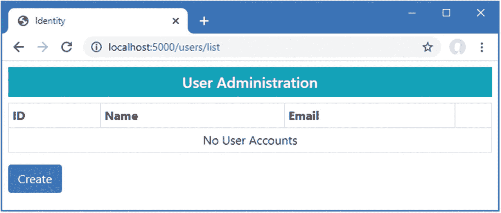

图 38-2。

枚举用户

### 创建用户

在`Pages/Users`文件夹中添加一个名为`Create.cshtml`的 Razor 页面，内容如清单 [38-12](#PC12) 所示。

```cs
@page
@model CreateModel

<h5 class="bg-primary text-white text-center p-2">Create User</h5>
<form method="post">
    <div asp-validation-summary="All" class="text-danger"></div>
    <div class="form-group">
        <label>User Name</label>
        <input name="UserName" class="form-control" value="@Model.UserName" />
    </div>
    <div class="form-group">
        <label>Email</label>
        <input name="Email" class="form-control" value="@Model.Email" />
    </div>
    <div class="form-group">
        <label>Password</label>
        <input name="Password" class="form-control" value="@Model.Password" />
    </div>
    <button type="submit" class="btn btn-primary">Submit</button>
    <a class="btn btn-secondary" asp-page="list">Back</a>
</form>

@functions {

    public class CreateModel : AdminPageModel {
        public UserManager<IdentityUser> UserManager;

        public CreateModel(UserManager<IdentityUser> usrManager) {
            UserManager = usrManager;
        }

        [BindProperty][Required]
        public string UserName { get; set; }

        [BindProperty][Required][EmailAddress]
        public string Email { get; set; }

        [BindProperty][Required]
        public string Password { get; set; }

        public async Task<IActionResult> OnPostAsync() {
            if (ModelState.IsValid) {
                IdentityUser user =
                    new IdentityUser { UserName = UserName, Email = Email };
                IdentityResult result =
                    await UserManager.CreateAsync(user, Password);
                if (result.Succeeded) {
                    return RedirectToPage("List");
                }
                foreach (IdentityError err in result.Errors) {
                    ModelState.AddModelError("", err.Description);
                }
            }
            return Page();
        }
    }
}

Listing 38-12.The Contents of the Create.cshtml File in the Pages/Users Folder of the Advanced Project

```

尽管 ASP.NET Core Identity 数据是使用实体框架核心存储的，但您不能直接使用数据库上下文类。相反，数据是通过`UserManager<T>`类提供的方法来管理的。使用`CreateAsync`方法创建新用户，该方法接受一个`IdentityUser`对象和一个密码字符串作为参数。

这个 Razor 页面定义了服从模型绑定的三个属性。`UserName`和`Email`属性用于配置`IdentityUser`对象，该对象与绑定到`Password`属性的值相结合来调用`CreateAsync`方法。这些属性配置了验证属性，确保提供了值，并且`Email`属性是一个格式化的电子邮件地址。

`CreateAsync`方法的结果是一个`Task<IdentityResult>`对象，该对象使用表 [38-5](#Tab5) 中描述的属性指示创建操作的结果。

表 38-5。

IdentityResult 类定义的属性

<colgroup><col class="tcol1 align-left"> <col class="tcol2 align-left"></colgroup> 
| 

名字

 | 

描述

 |
| --- | --- |
| `Succeeded` | 如果操作成功，返回`true`。 |
| `Errors` | 返回描述尝试操作时遇到的错误的一系列`IdentityError`对象。每个`IdentityError`对象提供一个总结问题的`Description`属性。 |

我检查了`Succeeded`属性，以确定是否在数据库中创建了一个新用户。如果`Succeeded`属性是`true`，那么客户端被重定向到`List`页面，从而显示用户列表，反映新添加的用户。

```cs
...
if (result.Succeeded) {
    return RedirectToPage("List");
}
foreach (IdentityError err in result.Errors) {
    ModelState.AddModelError("", err.Description);
}
...

```

如果`Succeeded`属性是`false`，那么由`Errors`属性提供的`IdentityError`对象的序列被枚举，其中`Description`属性用于使用`ModelState.AddModelError`方法创建模型级验证错误。

要测试创建新用户帐户的能力，重启 ASP.NET Core 并请求`http://localhost:5000/users/list`。点击创建按钮，并在表格中填入表 [38-6](#Tab6) 中所示的值。

Tip

有保留用于测试的域名，包括 [`example.com`](http://example.com) 。在 [`https://tools.ietf.org/html/rfc2606`](https://tools.ietf.org/html/rfc2606) 可以看到完整的列表。

表 38-6。

创建示例用户的值

<colgroup><col class="tcol1 align-left"> <col class="tcol2 align-left"></colgroup> 
| 

田

 | 

描述

 |
| --- | --- |
| `Name` | `Joe` |
| `Email` | joe@example.com |
| `Password` | `Secret123$` |

输入值后，单击提交按钮。ASP.NET Core Identity 将在数据库中创建用户，浏览器将被重定向，如图 [38-3](#Fig3) 所示。(您将看到不同的 ID 值，因为 ID 是为每个用户随机生成的。)

Note

我为`Password`字段使用了一个常规的`input`元素，以便更容易理解本章中的例子。对于真实的项目，最好将`input`元素的`type`属性设置为`password`，这样输入的字符就看不见了。

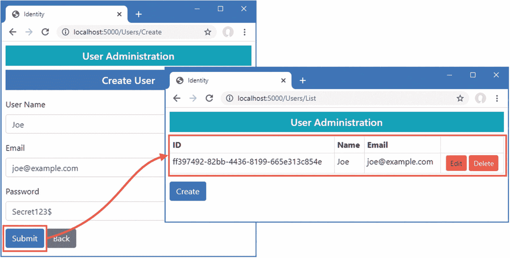

图 38-3。

创建新用户

再次点击创建按钮，使用表 [38-6](#Tab6) 中的值将相同的细节输入表单。这一次当你点击创建按钮时，你会看到一个错误通过模型验证总结报告出来，如图 [38-4](#Fig4) 所示。这是一个通过由`CreateAsync`方法产生的`IdentityResult`对象返回的错误的例子。

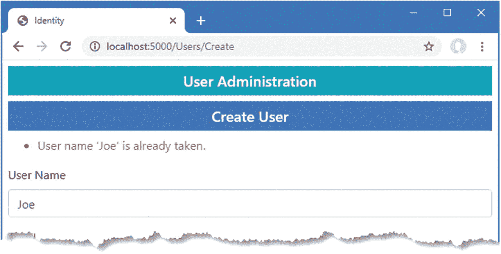

图 38-4。

创建新用户时出错

#### 验证密码

最常见的需求之一，尤其是对于公司应用，是强制执行密码策略。导航到`http://localhost:5000/Users/Create`并填写表格 [38-7](#Tab7) 中显示的数据，您可以看到默认策略。

表 38-7。

创建示例用户的值

<colgroup><col class="tcol1 align-left"> <col class="tcol2 align-left"></colgroup> 
| 

田

 | 

描述

 |
| --- | --- |
| `Name` | `Alice` |
| `Email` | alice@example.com |
| `Password` | `secret` |

当您提交表单时，ASP.NET Core Identity 会检查候选人密码，如果与密码不匹配，则会生成错误，如图 [38-5](#Fig5) 所示。

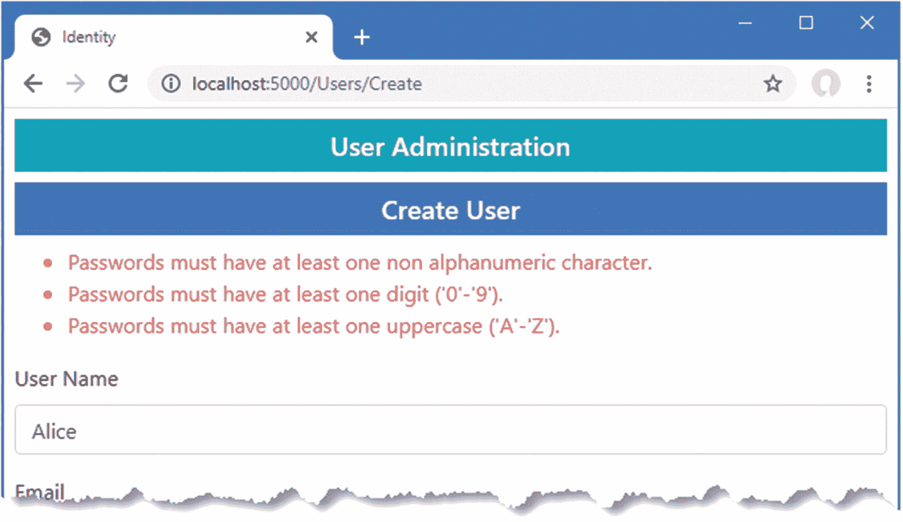

图 38-5。

密码验证错误

使用选项模式配置密码验证规则，如清单 [38-13](#PC14) 所示。

```cs
...
public void ConfigureServices(IServiceCollection services) {
    services.AddDbContext<DataContext>(opts => {
        opts.UseSqlServer(Configuration[
            "ConnectionStrings:PeopleConnection"]);
        opts.EnableSensitiveDataLogging(true);
    });
    services.AddControllersWithViews().AddRazorRuntimeCompilation();
    services.AddRazorPages().AddRazorRuntimeCompilation();
    services.AddServerSideBlazor();
    services.AddSingleton<Services.ToggleService>();

    services.AddResponseCompression(opts => {
        opts.MimeTypes = ResponseCompressionDefaults.MimeTypes.Concat(
            new[] { "application/octet-stream" });
    });

    services.AddDbContext<IdentityContext>(opts =>
        opts.UseSqlServer(Configuration["ConnectionStrings:IdentityConnection"]));
    services.AddIdentity<IdentityUser, IdentityRole>()
        .AddEntityFrameworkStores<IdentityContext>();

    services.Configure<IdentityOptions>(opts => {
        opts.Password.RequiredLength = 6;
        opts.Password.RequireNonAlphanumeric = false;
        opts.Password.RequireLowercase = false;
        opts.Password.RequireUppercase = false;
        opts.Password.RequireDigit = false;
    });
}
...

Listing 38-13.Configuring Password Validation in the Startup.cs File in the Advanced Project

```

ASP.NET Core Identity 使用`IdentityOptions`类配置，其`Password`属性返回一个`PasswordOptions`类，该类使用表 [38-8](#Tab8) 中描述的属性配置密码验证。

表 38-8。

密码选项属性

<colgroup><col class="tcol1 align-left"> <col class="tcol2 align-left"></colgroup> 
| 

名字

 | 

描述

 |
| --- | --- |
| `RequiredLength` | 该`int`属性用于指定密码的最小长度。 |
| `RequireNonAlphanumeric` | 将此`bool`属性设置为`true`要求密码至少包含一个不是字母或数字的字符。 |
| `RequireLowercase` | 将此`bool`属性设置为`true`要求密码至少包含一个小写字符。 |
| `RequireUppercase` | 将此`bool`属性设置为`true`要求密码至少包含一个大写字符。 |
| `RequireDigit` | 将此`bool`属性设置为`true`要求密码至少包含一个数字字符。 |

在清单中，我指定密码的最小长度必须是 6 个字符，并禁用了其他约束。在一个真实的项目中，如果没有仔细考虑，这不是你应该做的事情，但是它允许一个有效的演示。重启 ASP.NET Core，请求`http://localhost:5000/users/create`，并使用表 [38-7](#Tab7) 中的详细信息填写表格。当您点击提交按钮时，密码将被新的验证规则接受，并将创建一个新用户，如图 [38-6](#Fig6) 所示。

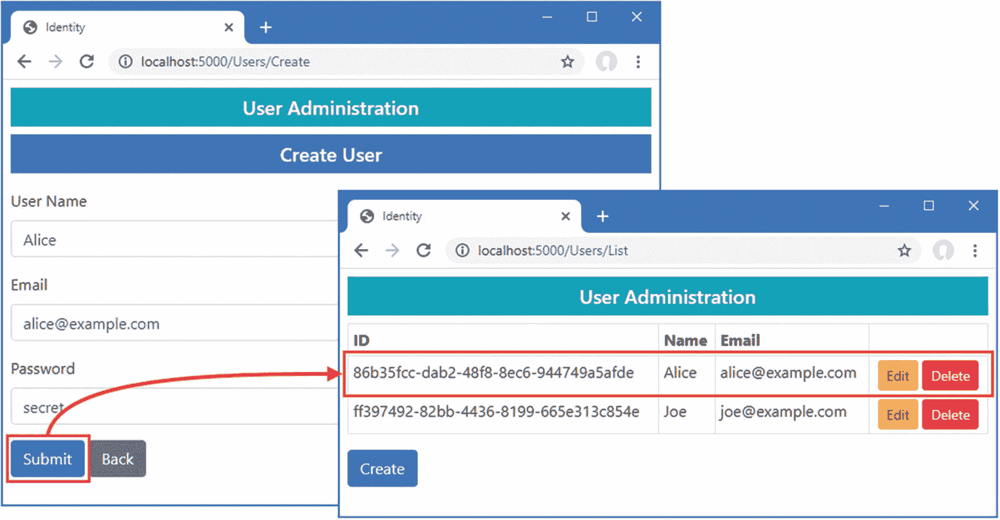

图 38-6。

更改密码验证规则

#### 验证用户详细信息

创建帐户时，还会对用户名和电子邮件地址进行验证。要查看如何应用验证，请求`http://localhost:5000/users/create`并使用表 [38-9](#Tab9) 中显示的值填写表格。

表 38-9。

创建示例用户的值

<colgroup><col class="tcol1 align-left"> <col class="tcol2 align-left"></colgroup> 
| 

田

 | 

描述

 |
| --- | --- |
| `Name` | `Bob!` |
| `Email` | alice@example.com |
| `Password` | `secret` |

点击提交按钮，您将看到如图 [38-7](#Fig7) 所示的错误信息。

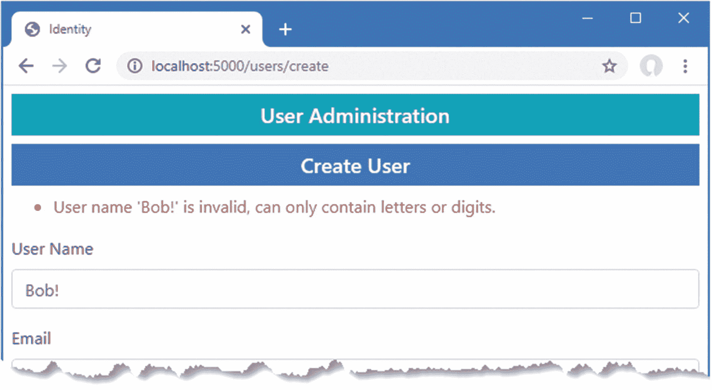

图 38-7。

用户详细信息验证错误

验证可以用 options 模式配置，使用由`IdentityOptions`类定义的`User`属性。该类返回一个`UserOptions`类，其属性在表 [38-10](#Tab10) 中描述。

表 38-10。

用户选项属性

<colgroup><col class="tcol1 align-left"> <col class="tcol2 align-left"></colgroup> 
| 

名字

 | 

描述

 |
| --- | --- |
| `AllowedUserNameCharacters` | 这个`string`属性包含了可以在用户名中使用的所有合法字符。默认值指定 A–Z、A–Z 和 0–9 以及连字符、句点、下划线和`@`字符。此属性不是正则表达式，必须在字符串中显式指定每个合法字符。 |
| `RequireUniqueEmail` | 将此`bool`属性设置为`true`要求新帐户指定以前未使用过的电子邮件地址。 |

在清单 [38-14](#PC15) 中，我已经更改了应用的配置，要求唯一的电子邮件地址，并且用户名中只允许小写字母字符。

```cs
...
public void ConfigureServices(IServiceCollection services) {
    services.AddDbContext<DataContext>(opts => {
        opts.UseSqlServer(Configuration[
            "ConnectionStrings:PeopleConnection"]);
        opts.EnableSensitiveDataLogging(true);
    });
    services.AddControllersWithViews().AddRazorRuntimeCompilation();
    services.AddRazorPages().AddRazorRuntimeCompilation();
    services.AddServerSideBlazor();
    services.AddSingleton<Services.ToggleService>();

    services.AddResponseCompression(opts => {
        opts.MimeTypes = ResponseCompressionDefaults.MimeTypes.Concat(
            new[] { "application/octet-stream" });
    });

    services.AddDbContext<IdentityContext>(opts =>
        opts.UseSqlServer(Configuration["ConnectionStrings:IdentityConnection"]));
    services.AddIdentity<IdentityUser, IdentityRole>()
        .AddEntityFrameworkStores<IdentityContext>();

    services.Configure<IdentityOptions>(opts => {
        opts.Password.RequiredLength = 6;
        opts.Password.RequireNonAlphanumeric = false;
        opts.Password.RequireLowercase = false;
        opts.Password.RequireUppercase = false;
        opts.Password.RequireDigit = false;
        opts.User.RequireUniqueEmail = true;
        opts.User.AllowedUserNameCharacters = "abcdefghijklmnopqrstuvwxyz";
    });
}
...

Listing 38-14.Changing the User Validation Settings in the Startup.cs File in the Advanced Project

```

重启 ASP.NET Core，请求`http://localhost:5000/users/create`，并使用表 [38-9](#Tab9) 中的值填写表格。单击 Submit 按钮，您将看到电子邮件地址现在导致了一个错误。用户名仍然包含非法字符，也被标记为错误，如图 [38-8](#Fig8) 所示。

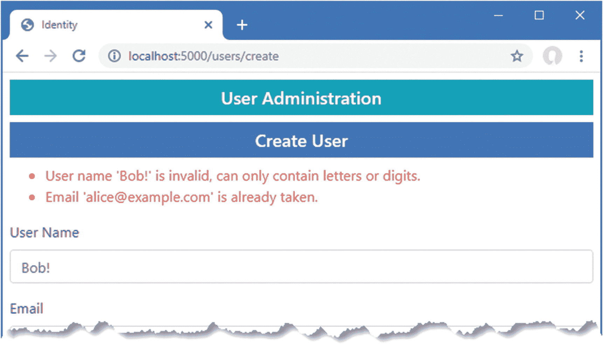

图 38-8。

验证用户详细信息

### 编辑用户

为了增加对编辑用户的支持，在高级项目的`Pages/Users`文件夹中添加一个名为`Editor.cshtml`的 Razor 页面，内容如清单 [38-15](#PC16) 所示。

```cs
@page "{id}"
@model EditorModel

<h5 class="bg-warning text-white text-center p-2">Edit User</h5>
<form method="post">
    <div asp-validation-summary="All" class="text-danger"></div>
    <div class="form-group">
        <label>ID</label>
        <input name="Id" class="form-control" value="@Model.Id" disabled />
        <input name="Id" type="hidden" value="@Model.Id" />
    </div>
    <div class="form-group">
        <label>User Name</label>
        <input name="UserName" class="form-control" value="@Model.UserName" />
    </div>
    <div class="form-group">
        <label>Email</label>
        <input name="Email" class="form-control" value="@Model.Email" />
    </div>
    <div class="form-group">
        <label>New Password</label>
        <input name="Password" class="form-control" value="@Model.Password" />
    </div>
    <button type="submit" class="btn btn-warning">Submit</button>
    <a class="btn btn-secondary" asp-page="list">Back</a>
</form>

@functions {

    public class EditorModel : AdminPageModel {
        public UserManager<IdentityUser> UserManager;

        public EditorModel(UserManager<IdentityUser> usrManager) {
            UserManager = usrManager;
        }

        [BindProperty][Required]
        public string Id { get; set; }

        [BindProperty][Required]
        public string UserName { get; set; }

        [BindProperty][Required][EmailAddress]
        public string Email { get; set; }

        [BindProperty]
        public string Password { get; set; }

        public async Task OnGetAsync(string id) {
            IdentityUser user = await UserManager.FindByIdAsync(id);
            Id = user.Id; UserName = user.UserName; Email = user.Email;
        }

        public async Task<IActionResult> OnPostAsync() {
            if (ModelState.IsValid) {
                IdentityUser user = await UserManager.FindByIdAsync(Id);
                user.UserName = UserName;
                user.Email = Email;
                IdentityResult result = await UserManager.UpdateAsync(user);
                if (result.Succeeded && !String.IsNullOrEmpty(Password)) {
                    await UserManager.RemovePasswordAsync(user);
                    result = await UserManager.AddPasswordAsync(user, Password);
                }
                if (result.Succeeded) {
                    return RedirectToPage("List");
                }
                foreach (IdentityError err in result.Errors) {
                    ModelState.AddModelError("", err.Description);
                }

            }
            return Page();
        }
    }
}

Listing 38-15.The Contents of the Editor.cshtml File in the Pages/Users Folder of the Advanced Project

```

`Editor`页面使用`UserManager<T>.FindByIdAsync`方法定位用户，使用通过路由系统接收的`id`值查询数据库，该值作为`OnGetAsync`方法的参数接收。查询返回的来自`IdentityUser`对象的值用于填充页面视图部分显示的属性，确保如果页面由于验证错误而重新显示，这些值不会丢失。

当用户提交表单时，`FindByIdAsync`方法用于查询数据库中的`IdentityUser`对象，该对象用表单中提供的`UserName`和`Email`值进行更新。密码需要不同的方法，并且必须在分配新密码之前从`user`对象中删除，如下所示:

```cs
...
await UserManager.RemovePasswordAsync(user);
result = await UserManager.AddPasswordAsync(user, Password);
...

```

只有当表单包含一个`Password`值并且用户名和电子邮件字段更新成功时，`Editor`页面才会更改密码。来自 ASP.NET Core Identity 的错误显示为验证消息，在成功更新后，浏览器被重定向到`List`页面。请求`http://localhost:5000/Users/List`，点击 Joe 的编辑按钮，并将用户名字段更改为 **bob** ，全部使用小写字符。点击提交按钮，您将看到用户列表中反映出的变化，如图 [38-9](#Fig9) 所示。

Note

如果您单击 Alice 帐户的“编辑”按钮，然后单击“提交”而不做任何更改，您将看到一个错误。这是因为帐户是在验证策略更改之前创建的。ASP.NET Core Identity 对更新进行验证检查，这导致了一种奇怪的情况，即数据库中的数据可以被读取和使用，但必须对用户进行更改才能进行更新。

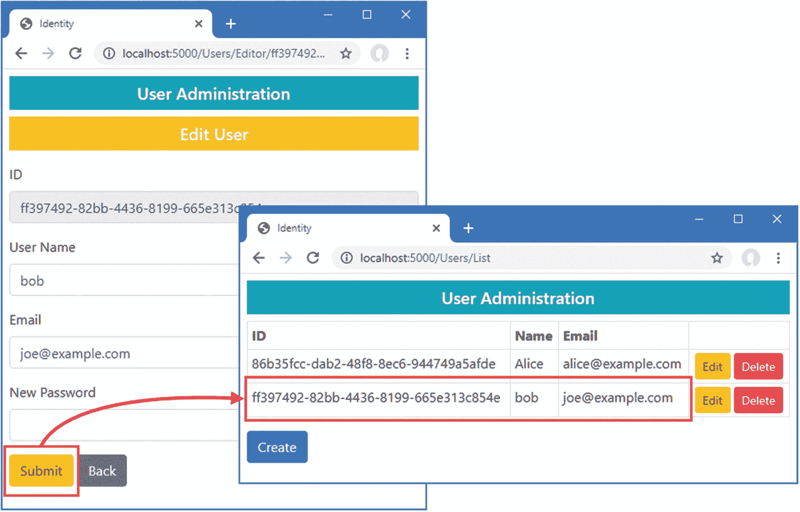

图 38-9。

编辑用户

### 删除用户

我的基本用户管理应用需要的最后一个特性是删除用户的能力，如清单 [38-16](#PC18) 所示。

```cs
...
@functions {

    public class ListModel : AdminPageModel {
        public UserManager<IdentityUser> UserManager;

        public ListModel(UserManager<IdentityUser> userManager) {
            UserManager = userManager;
        }

        public IEnumerable<IdentityUser> Users { get; set; }

        public void OnGet() {
            Users = UserManager.Users;
        }

        public async Task<IActionResult> OnPostAsync(string id) {
            IdentityUser user = await UserManager.FindByIdAsync(id);
            if (user != null) {
                await UserManager.DeleteAsync(user);
            }
            return RedirectToPage();
        }
    }
}
...

Listing 38-16.Deleting Users in the List.cshtml File in the Pages/Users Folder in the Advanced Project

```

`List`页面已经为数据表中的每个用户显示了一个删除按钮，该按钮提交一个 POST 请求，其中包含要删除的`IdentityUser`对象的`Id`值。`OnPostAsync`方法接收`Id`值，并使用它通过`FindByIdAsync`方法查询身份，将返回的对象传递给`DeleteAsync`方法，后者从数据库中删除该对象。要检查删除功能，请求`http://localhost:5000/Users/List`并点击`Alice`账户的删除。用户对象将被移除，如图 [38-10](#Fig10) 所示。

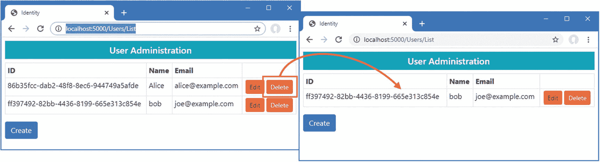

图 38-10。

删除用户

## 创建角色管理工具

有些应用只实施两个级别的授权:经过认证的用户被允许访问应用的所有功能，而未经认证的用户只有很少的访问权限或者没有访问权限。第 1 部分中的 SportsStore 应用遵循了这种方法:有一个用户，一旦通过认证，他们就可以访问应用的所有功能，包括管理工具，而未经认证的用户只能使用公共商店的功能。

ASP.NET Core Identity 支持需要更精细授权的应用的*角色*。用户被分配到一个或多个角色，他们在这些角色中的成员身份决定了哪些功能是可访问的。在接下来的小节中，我将向您展示如何构建工具来创建和管理角色。

角色通过`RoleManager<T>`类来管理，其中`T`是数据库中角色的表示。当我在本章开始时配置 ASP.NET Core Identity 时，我选择了`IdentityRole`，这是身份提供的用于描述角色的内置类，这意味着我将在这些示例中使用`RoleManager<IdentityRole>`类。`RoleManager<T>`类定义了表 [38-11](#Tab11) 中所示的方法和属性，允许创建和管理角色。

表 38-11。

由 RoleManager <t>类定义的成员</t>

<colgroup><col class="tcol1 align-left"> <col class="tcol2 align-left"></colgroup> 
| 

名字

 | 

描述

 |
| --- | --- |
| `CreateAsync(role)` | 创建新角色 |
| `DeleteAsync(role)` | 删除指定的角色 |
| `FindByIdAsync(id)` | 按 ID 查找角色 |
| `FindByNameAsync(name)` | 按名称查找角色 |
| `RoleExistsAsync(name)` | 如果具有指定名称的角色存在，则返回`true` |
| `UpdateAsync(role)` | 存储对指定角色的更改 |
| `Roles` | 返回已定义角色的枚举 |

表 [38-12](#Tab12) 描述了由`IdentityRole`类定义的关键属性。

表 38-12。

有用的标识角色属性

<colgroup><col class="tcol1 align-left"> <col class="tcol2 align-left"></colgroup> 
| 

名字

 | 

描述

 |
| --- | --- |
| `Id` | 此属性包含角色的唯一 ID。 |
| `Name` | 此属性返回角色名称。 |

虽然角色是通过`RoleManager<T>`类来管理的，但是角色的成员是通过`UserManager<T>`提供的方法来管理的，如表 [38-13](#Tab13) 中所述。

表 38-13。

用于管理角色成员资格的 UserManager <t>方法</t>

<colgroup><col class="tcol1 align-left"> <col class="tcol2 align-left"></colgroup> 
| 

名字

 | 

描述

 |
| --- | --- |
| `AddToRoleAsync(user, role)` | 此方法将用户添加到角色中。 |
| `RemoveFromRoleAsync(user, role)` | 此方法从角色中移除用户。 |
| `GetRolesAsync(user)` | 此方法返回用户所属的角色。 |
| `GetUsersInRoleAsync(role)` | 此方法返回作为指定角色成员的用户。 |
| `IsInRoleAsync(user, role)` | 如果用户是指定角色的成员，该方法返回`true`。 |

### 准备角色管理工具

为了准备角色管理工具，在高级项目中创建`Pages/Roles`文件夹，并在其中添加一个名为`_Layout.cshtml`的 Razor 布局，内容如清单 [38-17](#PC19) 所示。

```cs
<!DOCTYPE html>
<html>
<head>
    <title>Identity</title>
    <link href="/lib/twitter-bootstrap/css/bootstrap.min.css" rel="stylesheet" />
</head>
<body>
    <div class="m-2">
        <h5 class="bg-secondary text-white text-center p-2">Role Administration</h5>
        @RenderBody()
    </div>
</body>
</html>

Listing 38-17.The Contents of the _Layout.cshtml File in the Pages/Roles Folder in the Advanced Project

```

这种布局将确保用户和角色管理工具之间有明显的区别。

### 枚举和删除角色

在高级项目的`Pages/Roles`文件夹中添加一个名为`List.cshtml`的 Razor 页面，内容如清单 [38-18](#PC20) 所示。

```cs
@page
@model ListModel

<table class="table table-sm table-bordered">
    <tr><th>ID</th><th>Name</th><th>Members</th><th></th></tr>
    @if (Model.Roles.Count() == 0) {
        <tr><td colspan="4" class="text-center">No Roles</td></tr>
    } else {
        foreach (IdentityRole role in Model.Roles) {
            <tr>
                <td>@role.Id</td>
                <td>@role.Name</td>
                <td>@(await Model.GetMembersString(role.Name))</td>
                <td class="text-center">
                    <form asp-page="List" method="post">
                        <input type="hidden" name="Id" value="@role.Id" />
                        <a class="btn btn-sm btn-warning" asp-page="Editor"
                            asp-route-id="@role.Id" asp-route-mode="edit">Edit</a>
                        <button type="submit" class="btn btn-sm btn-danger">
                            Delete
                        </button>
                    </form>
                </td>
            </tr>
        }
    }
</table>
<a class="btn btn-primary" asp-page="create">Create</a>

@functions {

    public class ListModel : AdminPageModel {
        public UserManager<IdentityUser> UserManager;
        public RoleManager<IdentityRole> RoleManager;

        public ListModel(UserManager<IdentityUser> userManager,
                RoleManager<IdentityRole> roleManager) {
            UserManager = userManager;
            RoleManager = roleManager;
        }

        public IEnumerable<IdentityRole> Roles { get; set; }

        public void OnGet() {
            Roles = RoleManager.Roles;
        }

        public async Task<string> GetMembersString(string role) {
            IEnumerable<IdentityUser> users
                = (await UserManager.GetUsersInRoleAsync(role));
            string result = users.Count() == 0
                ? "No members"
                : string.Join(", ", users.Take(3).Select(u => u.UserName).ToArray());
            return users.Count() > 3 ? $"{result}, (plus others)" : result;
        }

        public async Task<IActionResult> OnPostAsync(string id) {
            IdentityRole role = await RoleManager.FindByIdAsync(id);
            await RoleManager.DeleteAsync(role);
            return RedirectToPage();
        }
    }
}

Listing 38-18.The Contents of the List.cshtml File in the Pages/Roles Folder in the Advanced Project

```

将枚举角色，以及最多三个角色成员的名称或占位符消息(如果没有成员)。还有一个创建按钮，每个角色都有编辑和删除按钮，遵循我在用户管理工具中使用的相同模式。

Delete 按钮将 POST 请求发送回 Razor 页面。`OnPostAsync`方法使用`FindByIdAsync`方法来检索角色对象，该对象被传递给`DeleteAsync`方法以将其从数据库中移除。

### 创建角色

在高级项目的`Pages/Roles`文件夹中添加一个名为`Create.cshtml`的 Razor 页面，内容如清单 [38-19](#PC21) 所示。

```cs
@page
@model CreateModel

<h5 class="bg-primary text-white text-center p-2">Create Role</h5>
<form method="post">
    <div asp-validation-summary="All" class="text-danger"></div>
    <div class="form-group">
        <label>Role Name</label>
        <input name="Name" class="form-control" value="@Model.Name" />
    </div>
    <button type="submit" class="btn btn-primary">Submit</button>
    <a class="btn btn-secondary" asp-page="list">Back</a>
</form>

@functions {

    public class CreateModel : AdminPageModel {
        public RoleManager<IdentityRole> RoleManager;

        public CreateModel(UserManager<IdentityUser> userManager,
                RoleManager<IdentityRole> roleManager) {
            RoleManager = roleManager;
        }

        [BindProperty][Required]
        public string Name { get; set; }

        public async Task<IActionResult> OnPostAsync() {
            if (ModelState.IsValid) {
                IdentityRole role = new IdentityRole { Name = Name };
                IdentityResult result = await RoleManager.CreateAsync(role);
                if (result.Succeeded) {
                    return RedirectToPage("List");
                }
                foreach (IdentityError err in result.Errors) {
                    ModelState.AddModelError("", err.Description);
                }
            }
            return Page();
        }
    }
}

Listing 38-19.The Contents of the Create.cshtml File in the Pages/Roles Folder in the Advanced Project

```

用户将看到一个包含`input`元素的表单，用于指定新角色的名称。当提交表单时，`OnPostAsync`方法创建一个新的`IdentityRole`对象，并将其传递给`CreateAsync`方法。

### 分配角色成员资格

为了添加对管理角色成员资格的支持，在高级项目的`Pages/Roles`文件夹中添加一个名为`Editor.cshtml`的 Razor 页面，内容如清单 [38-20](#PC22) 所示。

```cs
@page "{id}"
@model EditorModel

<h5 class="bg-primary text-white text-center p-2">Edit Role: @Model.Role.Name</h5>

<form method="post">
    <input type="hidden" name="rolename" value="@Model.Role.Name" />
    <div asp-validation-summary="All" class="text-danger"></div>
    <h5 class="bg-secondary text-white p-2">Members</h5>
    <table class="table table-sm table-striped table-bordered">
        <thead><tr><th>User</th><th>Email</th><th></th></tr></thead>
        <tbody>
            @if ((await Model.Members()).Count() == 0) {
                <tr><td colspan="3" class="text-center">No members</td></tr>
            }
            @foreach (IdentityUser user in await Model.Members()) {
                <tr>
                    <td>@user.UserName</td>
                    <td>@user.Email</td>
                    <td>
                        <button asp-route-userid="@user.Id"
                                class="btn btn-primary btn-sm" type="submit">
                            Change
                        </button>
                    </td>
                </tr>
            }
        </tbody>
    </table>

    <h5 class="bg-secondary text-white p-2">Non-Members</h5>
    <table class="table table-sm table-striped table-bordered">
        <thead><tr><th>User</th><th>Email</th><th></th></tr></thead>
        <tbody>
            @if ((await Model.NonMembers()).Count() == 0) {
                <tr><td colspan="3" class="text-center">No non-members</td></tr>
            }
            @foreach (IdentityUser user in await Model.NonMembers()) {
                <tr>
                    <td>@user.UserName</td>
                    <td>@user.Email</td>
                    <td>
                        <button asp-route-userid="@user.Id"
                            class="btn btn-primary btn-sm" type="submit">
                                Change
                        </button>
                    </td>
                </tr>
            }
        </tbody>
    </table>
</form>

<a class="btn btn-secondary" asp-page="list">Back</a>

@functions {

    public class EditorModel : AdminPageModel {
        public UserManager<IdentityUser> UserManager;
        public RoleManager<IdentityRole> RoleManager;

        public EditorModel(UserManager<IdentityUser> userManager,
                RoleManager<IdentityRole> roleManager) {
            UserManager = userManager;
            RoleManager = roleManager;
        }

        public IdentityRole Role { get; set; }

        public Task<IList<IdentityUser>> Members() =>
                UserManager.GetUsersInRoleAsync(Role.Name);

        public async Task<IEnumerable<IdentityUser>> NonMembers() =>
                UserManager.Users.ToList().Except(await Members());

        public async Task OnGetAsync(string id) {
            Role = await RoleManager.FindByIdAsync(id);
        }

        public async Task<IActionResult> OnPostAsync(string userid,
                string rolename) {
            Role = await RoleManager.FindByNameAsync(rolename);
            IdentityUser user = await UserManager.FindByIdAsync(userid);
            IdentityResult result;
            if (await UserManager.IsInRoleAsync(user, rolename)) {
                result = await UserManager.RemoveFromRoleAsync(user, rolename);
            } else {
                result = await UserManager.AddToRoleAsync(user, rolename);
            }
            if (result.Succeeded) {
                return RedirectToPage();
            } else {
                foreach (IdentityError err in result.Errors) {
                    ModelState.AddModelError("", err.Description);
                }
                return Page();
            }
        }
    }
}

Listing 38-20.The Contents of the Editor.cshtml File in the Pages/Roles Folder in the Advanced Project

```

用户会看到一个表格，其中显示了作为角色成员的用户，以及一个显示非成员的表格。每一行都包含一个提交表单的更改按钮。`OnPostAsync`方法使用`UserManager.FindByIdAsync`方法从数据库中检索用户对象。`IsInRoleAsync`方法用于确定用户是否是角色的成员，而`AddToRoleAsync`和`RemoveFromRoleAsync`方法分别用于添加和删除用户。

重启 ASP.NET Core 并请求`http://localhost:5000/roles/list`。该列表将为空，因为数据库中没有角色。单击 Create 按钮，在文本字段中输入 **Admins** ，然后单击 Submit 按钮创建一个新角色。创建角色后，单击 Edit 按钮，您将看到可以添加到该角色的用户列表。单击“更改”按钮将用户移入和移出角色。点击【上一步】，列表将会更新显示属于该角色的用户，如图 [38-11](#Fig11) 所示。

Caution

ASP.NET Core Identity 会在更改角色分配时重新验证用户详细信息，如果您尝试修改其详细信息与当前限制不匹配的用户，将会导致错误，这种情况会在应用部署后引入限制，并且数据库中已经填充了在旧角色下创建的用户时发生。正是由于这个原因，清单 [38-20](#PC22) 中的 Razor 页面检查从角色中添加或删除用户的操作的结果，并将任何错误显示为验证消息。

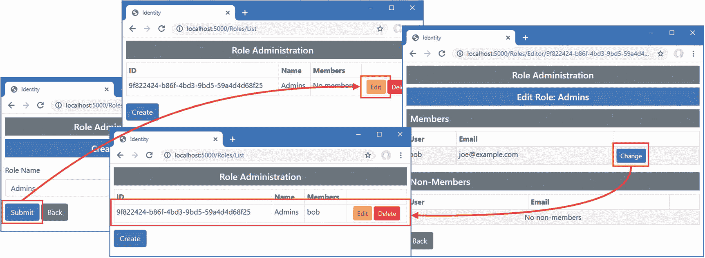

图 38-11。

管理角色

## 摘要

在本章中，我向您展示了如何将 ASP.NET Core Identity 添加到项目中，并准备其数据库来存储用户和角色。我描述了基本的 ASP.NET Core Identity API，并向您展示了如何使用它来创建管理用户和角色的工具。在下一章中，我将向您展示如何应用 ASP.NET Core Identity 来控制对控制器、Razor 页面、Blazor 应用和 web 服务的访问。