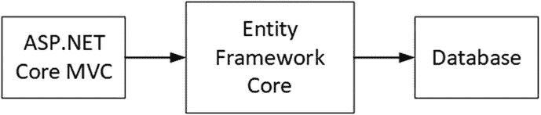

# 一、上下文中的实体框架核心

实体框架核心(Entity Framework Core)也称为 EF Core，是由微软生产的对象关系映射(ORM)包，它允许。NET 核心应用在关系数据库中存储数据。

## 了解实体框架核心

实体框架核心有一个关键任务:在数据库中 storing.NET 对象，并在以后再次检索它们。换句话说，实体框架核心充当 ASP.NET Core MVC 应用和数据库之间的桥梁，如图 [1-1](#Fig1) 所示。

图 1-1。

Entity Framework Core in context

储存。NET 对象可能是一个非常复杂的过程。数据库不是孤立存在的。它们由数据库服务器创建和管理，数据库服务器是专门用于存储和管理数据的专用应用。数据库服务器为大多数应用提供持久存储，最受欢迎的数据库服务器已经开发了几十年，从而产生了高性能和功能强大的软件。数据库服务器支持一组核心的通用特性，但是它们通过定制的附加特性来区分自己，从数据库服务器获得最佳结果意味着利用它们。

有不同类型的数据库服务器可用；实体框架核心使用的那种称为关系数据库服务器，也称为关系数据库管理系统(RDBMS)。关系数据库服务器管理关系数据库，其中数据以行的形式存储在表中，与电子表格没有什么不同。关系数据库服务器通常接受以结构化查询语言(SQL)表达的命令，这允许数据操作(例如存储或删除数据)被表达。有一个 SQL 标准，但是数据库服务器使用稍微不同的方言，特别是在访问非标准特性时。

Note

为了简洁起见，我在这里进行了简化。数据库的世界充满了不同类型的数据和不同类型的数据库和数据库服务器之间的区别，其中没有一个与使用 ASP.NET Core MVC 或实体框架核心有很大关系。

来储存。NET 对象，实体框架核心必须能够将对象转换成可以存储在数据库表中的形式，并制定数据库服务器可以处理的 SQL 命令。为了处理数据库服务器之间的差异，Entity Framework Core 依赖于数据库提供者，该提供者负责与数据库通信并制定 SQL 命令。

去找回。NET 对象，实体框架核心必须能够逆转这个过程。它必须能够创建一个 SQL 查询，向数据库服务器请求表示对象的数据值，并使用它们来填充. NET 对象的属性。为了使这个过程尽可能自然，Entity Framework Core 支持查询数据库的 LINQ，这使得处理存储在数据库中的对象集合类似于处理内存中的对象集合。

## 关于这本书

在本书中，我解释了如何在 ASP.NET Core MVC 应用中使用实体框架核心。我向您展示了将实体框架核心添加到项目中的不同方式，以及等待粗心者的陷阱。实体框架核心是一个强大的工具，但重要的是要注意细节；否则，您将最终得到一个性能不佳或行为不符合预期的应用。

### 你需要知道什么？

为了从本书中获得最大收益，你应该已经熟悉了 ASP.NET Core MVC 开发。如果你还不知道控制器和动作是如何工作的，以及 Razor 视图是如何工作的，你会很纠结。如果你不熟悉 ASP.NET Core MVC，那就去咨询 [`https://docs.microsoft.com/en-us/aspnet/core`](https://docs.microsoft.com/en-us/aspnet/core) 或者我的书 Pro ASP.NET Core MVC 2，Apress 出版的。

### 需要什么软件？

要学习本书中的例子，你需要一台运行 Windows。NET Core SDK，以及最新版本的 Visual Studio。除了 Windows 之外，我在本书中使用的所有工具都是免费的，我会在第 [2](02.html) 章中解释如何设置你的开发环境。

### 不想用 Windows 怎么办？

在本书中，我一直依赖于 Windows 和 Visual Studio，因为这是大多数读者使用的，并且能够使用 local db(SQL Server 的 Windows 专用开发版本)使示例更加可预测和可靠。只需一点努力，您就可以在任何平台上运行本书中的所有示例。NET 核心支持，尽管您需要安装完整的 SQL Server 产品(或使用 Docker 容器)。如果你想使用 Linux 或 macOS，请通过`adam@adam-freeman.com`联系我，我会尽力帮助你入门。

### 这本书的结构是什么？

这本书分为三部分，每一部分都涵盖了一系列相关的主题。

### 第 1 部分:介绍实体框架核心 2

最好的学习方法是边做边学，在本书的这一部分，你将从高层次了解实体框架核心是如何工作的，以及它是如何与 ASP.NET Core MVC 集成的。在第 2 章中，你创建了你的第一个 ASP.NET Core MVC 应用，它使用实体框架核心来存储数据。在第 3 章[中，我提供了使用数据库和 SQL 的初级读本，这样你就可以理解实体框架核心是如何工作的，并遵循本书中的例子。第 4 章](03.html)[第 4 章](04.html)第 10 章[第 10 章](10.html)被用来开发一个名为 SportsStore 的项目，通过这个项目，我向你展示了一个真实的开发过程，触及了最重要的实体框架核心特性，并解释了它们在书中的详细描述。

### 第 2 部分:详细的实体框架核心 2

在第 2 部分中，我描述了您将在您的 ASP.NET Core MVC 项目中日常使用的实体框架核心的核心特性。我向您展示了每个特性是如何工作的，解释了它所扮演的角色，并描述了可用的替代技术。

### 第 3 部分:高级实体框架核心 2

在第 3 部分，我描述了 Entity Framework Core 提供的高级特性。这些是您不太可能经常需要的特性，但是当默认的实体框架核心行为不能解决您的问题时，这些特性是非常宝贵的。

### 从哪里可以获得示例代码？

你可以从 [`https://github.com/apress/pro-ef-core-2-for-asp.net-core-mvc`](https://github.com/apress/pro-ef-core-2-for-asp.net-core-mvc) 下载本书所有章节的范例项目。下载是免费的，它包含了所有的类、视图和其他资产，无需输入所有的代码就可以完成示例。

### 你在哪里可以得到这本书的修改？

你可以在 [`https://github.com/apress/pro-ef-core-2-for-asp.net-core-mvc`](https://github.com/apress/pro-ef-core-2-for-asp.net-core-mvc) 找到这本书的勘误表。

### 你怎么联系我？

如果你在使用本章中的例子时有问题，或者你在书中发现了问题，那么你可以发电子邮件到`adam@adam-freeman.com`给我，我会尽力帮助你。在联系我之前，请检查这本书的勘误表，看看它是否包含您的问题的解决方案。

## 摘要

在这一章中，我介绍了实体框架核心并解释了它的作用，描述了本书的结构和内容。在下一章中，你将看到 ASP.NET Core MVC 和实体框架核心在一个简单的演示中运行，演示这两个强大的工具是如何协同工作的。