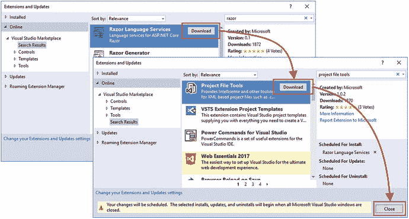

# 二、您的第一个实体框架核心应用

开始使用 Entity Framework Core 的最佳方式是直接使用它。在这一章中，我使用实体框架核心和 ASP.NET Core MVC 创建了一个简单的应用，这样你就可以看到所有的东西是如何组合在一起的。为了使例子简单，我跳过了后面章节中描述的一些细节。

## 准备好

为了准备本章中的例子以及后面章节中的例子，你需要安装一些开发工具。ASP.NET Core MVC 和实体框架核心开发所需的所有工具都有零成本版本，我在本书中通篇使用的就是这些版本。

Updates to this Book

微软有一个积极的开发计划。NET 核心、ASP.NET Core MVC 和实体框架核心，这意味着在您阅读本书时可能会有新的发布。期望你每隔几个月就买一本新书似乎不太公平，尤其是因为大多数变化都相对较小。

相反，我会在 GitHub 知识库中发布这本书的免费更新( [`https://github.com/apress/pro-ef-core-2-for-asp.net-core-mvc`](https://github.com/apress/pro-ef-core-2-for-asp.net-core-mvc) )，以弥补小版本带来的重大变化。

这种更新对我来说是一种试验(对出版社来说也是),我还不知道这些更新会采取什么形式——尤其是因为我不知道 ASP.NET Core MVC 或实体框架核心的未来主要版本会包含什么——但目标是通过补充本书包含的示例来延长本书的寿命。

我不承诺更新会是什么样的，它们会采取什么形式，或者在我把它们折叠成这本书的新版本之前，我会花多长时间来制作它们。当新的 ASP.NET Core MVC 版本发布时，请保持开放的心态并检查这本书的存储库。如果您对如何改进更新有任何想法，请发电子邮件至`adam@adam-freeman.com`告诉我。

### 正在安装。净核心

的。NET 核心软件开发工具包(SDK)包括构建和运行所需的运行时和开发工具。NET 项目。安装。Windows 上的 NET Core SDK，从 [`https://www.microsoft.com/net/download/thank-you/dotnet-sdk-2.1.4-windows-x64-installer`](https://www.microsoft.com/net/download/thank-you/dotnet-sdk-2.1.4-windows-x64-installer) 下载安装程序。此 URL 适用于 64 位。NET Core SDK 版本 2.1.4，这是我在本书中使用的版本，您应该安装它以确保从示例中获得预期的结果。(微软还发布了一个仅运行时安装程序，但这不包含本书所需的工具。)

运行安装程序，一旦安装过程完成，打开一个新的 PowerShell 窗口或命令提示符，并运行清单 [2-1](#Par9) 中所示的命令进行检查。网芯在工作。

```cs
dotnet --version
Listing 2-1.Testing .NET Core

```

此命令的输出将显示最新版本的。已安装的. NET 核心运行时。如果您只安装了之前指定的版本，这将是`2.1.4`。

### 安装 Visual Studio 2017

Visual Studio 是 ASP.NET Core 和实体框架核心项目的传统开发环境。从 [`https://www.visualstudio.com/vs`](https://www.visualstudio.com/vs) 下载安装程序。有不同版本的 Visual Studio 2017 可用，但免费社区版对于本书中的示例来说已经足够了。运行安装程序并确保。选择 NET Core 跨平台开发工作量，如图 [2-1](#Fig1) 所示。


图 2-1。

Selecting the Visual Studio packages

这个工作负载包括我在本书中使用的 SQL Server 的 LocalDB 版本，以及 ASP.NET Core MVC 和实体框架核心开发所需的 Visual Studio 特性。单击“安装”按钮开始下载和安装 Visual Studio 功能。

#### 添加 Visual Studio 扩展

两个 Visual Studio 扩展对于处理 ASP.NET Core MVC 项目是必不可少的。第一个称为 Razor 语言服务，它在编辑 Razor 视图时为标记助手提供智能感知支持。第二个叫做项目文件工具，它提供了编辑`.csproj`文件的自动完成功能，简化了向项目添加 NuGet 包的过程。(您可能会发现这些扩展已经安装，因为 Microsoft 会不时更改默认添加的扩展。)

从 Visual Studio“工具”菜单中选择“扩展和更新”,选择“联机”部分，然后使用搜索框来查找扩展。点击下载按钮，如图 [2-2](#Fig2) 所示，下载扩展文件。



图 2-2。

Downloading Visual Studio extensions

单击“关闭”按钮关闭扩展列表，然后关闭 Visual Studio，这将触发您下载的扩展的安装过程。将提示您接受将要进行的更改和许可条款，如图 [2-3](#Fig3) 所示。单击修改按钮安装扩展。该过程完成后，您可以启动 Visual Studio 并开始开发。


图 2-3。

Installing Visual Studio extensions

## 创建项目

为了开始使用 Entity Framework Core，我将展示如何创建一个简单的数据输入应用，将数据存储在数据库中。我将快速地浏览一下这个过程，不涉及太多的细节，只是为了让你们对 ASP.NET Core MVC 和实体框架核心如何协同工作有一个大概的了解。但是不要担心:我在这一章中所做的每一件事都会在后面的章节中详细解释。

### 设置场景

想象一下，一个朋友决定举办一个新年晚会，她要求我创建一个 web 应用，允许她邀请的人以电子方式回复。她要求这四个关键特征:

*   显示聚会信息的主页
*   可用于回复的表单
*   验证 RSVP 表单，这将显示一个感谢页面
*   显示谁将参加聚会的摘要页面

这是我在我的 Pro ASP.NET MVC Core 2 书中创建的相同的数据输入应用，这本书的不同之处在于，我将使用实体框架核心将响应存储在数据库中。

### 创建项目

若要创建项目，请启动 Visual Studio 并从“文件”菜单中选择“新建➤项目”。选择 ASP.NET Core Web 应用项目模板，将名称字段设置为 PartyInvites，点击浏览按钮，选择一个方便的位置存储项目，如图 [2-4](#Fig4) 所示。

Tip

你可以从本书的 GitHub 资源库下载这个项目， [`https://github.com/apress/pro-ef-core-2-for-asp.net-core-mvc`](https://github.com/apress/pro-ef-core-2-for-asp.net-core-mvc) 。


图 2-4。

Creating the example project

单击“确定”按钮继续项目设置。确保这点。在窗口顶部选中 NET Core 和 ASP.NET Core 2.0，点击空模板，如图 [2-5](#Fig5) 所示。Visual Studio 包括在项目中设置 ASP.NET Core MVC 和实体框架核心的模板，但是结果隐藏了一些有用的细节。


图 2-5。

Configuring the ASP.NET Core project

单击“确定”按钮，Visual Studio 将创建具有基本配置的 PartyInvites 项目，该项目设置 ASP.NET Core，但不配置 MVC 框架或实体框架核心。

#### 添加引导 CSS 框架

在本书中，我使用了引导 CSS 框架来设计 HTML 元素的样式。要将引导程序添加到项目中，右键单击解决方案资源管理器中的 PartyInvites 项，从弹出菜单中选择添加➤新项，并使用 JSON 文件模板(在 ASP.NET Core➤ Web ➤常规类别中找到)创建一个名为`.bowerrc`的文件，其内容如清单 [2-2](#Par28) 所示。(注意这个文件名很重要:它以句点开头，包含字母`r`两次，没有文件扩展名)。

```cs
{
  "directory": "wwwroot/lib"
}
Listing 2-2.The Contents of the .bowerrc File in the PartyInvites Folder

```

再次使用 JSON 文件模板创建一个名为`bower.json`的文件，并添加清单 [2-3](#Par30) 中所示的内容。

```cs
{
  "name": "asp.net",
  "private": true,
  "dependencies": {
    "bootstrap": "4.0.0"
  }
}
Listing 2-3.The Contents of the bower.json File in the PartyInvites Folder

```

当您保存对文件的更改时，Visual Studio 将下载新版本的引导程序包，并将其安装在`wwwroot/lib`文件夹中。

#### 配置 HTTP 端口

更改 ASP.NET Core 用来接收请求的端口将使示例更容易理解。编辑`Properties`文件夹中的`launchSettings.json`文件，并更改 URL，如清单 [2-4](#Par33) 所示。

```cs
{
  "iisSettings": {
    "windowsAuthentication": false,
    "anonymousAuthentication": true,
    "iisExpress": {
      "applicationUrl": "http://localhost:5000/",
      "sslPort": 0
    }
  },
  "profiles": {
    "IIS Express": {
      "commandName": "IISExpress",
      "launchBrowser": true,
      "environmentVariables": {
        "ASPNETCORE_ENVIRONMENT": "Development"
      }
    },
    "PartyInvites": {
      "commandName": "Project",
      "launchBrowser": true,
      "environmentVariables": {
        "ASPNETCORE_ENVIRONMENT": "Development"
      },
      "applicationUrl": "http://localhost:5000/"
    }
  }
}
Listing 2-4.Changing the HTTP Ports in the launchSettings.json File in the Properties Folder

```

当使用 IIS Express 启动应用以及从命令行运行应用时，该文件中的 URL 用于配置应用。本书中的所有示例都是从命令行运行的，因此可以很容易地看到日志消息。

## 创建数据模型和上下文类

当你创建一个同时使用 ASP.NET Core MVC 和实体框架核心的应用时，数据模型变得特别重要。为了创建示例应用的数据模型类，我向项目添加了一个`Models`文件夹，在其中创建了一个名为`GuestResponse.cs`的文件，并添加了清单 [2-5](#Par36) 中所示的代码。

```cs
namespace PartyInvites.Models {

    public class GuestResponse {

        public long Id { get; set; }

        public string Name { get; set; }
        public string Email { get; set; }
        public string Phone { get; set; }
        public bool? WillAttend { get; set; }
    }
}

Listing 2-5.The Contents of the GuestResponse.cs File in the Models Folder

```

Entity Framework Core 能够存储常规 C# 类的实例，只要它们有一个值唯一标识每个对象的属性，即主键属性。对于`GuestResponse`类，`Id`属性是主键属性。

实体框架核心功能由数据库上下文类提供，它向实体框架核心标识数据模型类，并用于访问数据库中的数据。为了创建上下文类，我在`Models`文件夹中添加了一个名为`DataContext.cs`的文件，并添加了清单 [2-6](#Par39) 中所示的代码。

```cs
using Microsoft.EntityFrameworkCore;

namespace PartyInvites.Models {

    public class DataContext : DbContext {

        public DataContext(DbContextOptions<DataContext> options)
            : base(options) { }

        public DbSet<GuestResponse> Responses { get; set; }
    }
}

Listing 2-6.The Contents of the DataContext.cs File in the Models Folder

```

创建数据库上下文类时，包含一个接收配置对象并将其传递给基类的构造函数的构造函数是很重要的。对于您想要访问的每个数据模型类，context 类定义了一个返回一个`DbSet<T>`对象的属性，并且通过这个对象来存储和检索数据。我定义了一个返回`DbSet<GuestResponse>`对象的属性，这样我就可以存储和检索`GuestResponse`对象。

## 创建控制器和视图

为了给应用提供一个控制器，我创建了`Controllers`文件夹，并添加了一个名为`HomeController.cs`的文件，代码如清单 [2-7](#Par42) 所示。

```cs
using Microsoft.AspNetCore.Mvc;
using PartyInvites.Models;
using System.Linq;

namespace PartyInvites.Controllers {

    public class HomeController : Controller {
        private DataContext context;

        public HomeController(DataContext ctx) => context = ctx;

        public IActionResult Index() => View();

        public IActionResult Respond() => View();

        [HttpPost]
        public IActionResult Respond(GuestResponse response) {
            context.Responses.Add(response);
            context.SaveChanges();
            return RedirectToAction(nameof(Thanks),
                new { Name = response.Name, WillAttend = response.WillAttend });
        }

        public IActionResult Thanks(GuestResponse response) => View(response);

        public IActionResult ListResponses() =>
            View(context.Responses.OrderByDescending(r => r.WillAttend));
    }
}

Listing 2-7.The Contents of the HomeController.cs File in the Controllers Folder

```

控制器接收一个`DataContext`对象作为构造函数参数，并使用它来访问实体框架核心管理的数据。由数据库上下文类的`Responses`属性返回的`DbSet<GuestResponse>`对象实现了`IEnumerable<GuestResponse>`接口，当它被枚举时，将自动查询数据库中存储的`GuestResponse`对象。

`DbSet<GuestResponse>`对象也用于存储对象。`Add`方法用于给实体框架核心一个您想要存储的对象，`SaveChanges`方法执行更新。

Tip

在更复杂的项目中，我推荐使用 repository 模式来访问实体框架的核心特性，如第 [10](10.html) 章所解释的。对于本章中的简单项目，控制器直接使用数据库上下文类。

我创建了`Views/Home`文件夹，并在其中添加了一个名为`_Layout.cshtml`的文件，其内容如清单 [2-8](#Par47) 所示。该布局将为本章中的所有其他视图提供通用布局，并包括一个包含引导 CSS 文件的`link`元素。

```cs
<!DOCTYPE html>

<html>
<head>
    <meta name="viewport" content="width=device-width" />
    <title>Party Invites</title>
    <link rel="stylesheet" href="/lib/bootstrap/dist/css/bootstrap.css" />
</head>
<body>
    @RenderBody()
</body>
</html>

Listing 2-8.The Contents of the _Layout.cshtml File in the Views/Home Folder

```

为了在应用的视图中使用默认布局，我在`Views`文件夹中添加了一个名为`_ViewStart.cshtml`的文件，其内容如清单 [2-9](#Par49) 所示。

```cs
@{
    Layout = "_Layout";
}
Listing 2-9.The Contents of the _ViewStart.cshtml File in the Views Folder

```

为了创建提供登录页面的视图，我在`Views/Home`文件夹中添加了一个名为`Index.cshtml`的文件，其内容如清单 [2-10](#Par51) 所示。

```cs
<div class="text-center m-4">
    <h3>We're going to have an exciting party!</h3>
    <h4>And you are invited</h4>
    <a class="btn btn-primary" asp-action="Respond">RSVP Now</a>
</div>
Listing 2-10.The Contents of the Index.cshtml File in the Views/Home Folder

```

为了从用户那里接收响应的细节，我在`Views/Home`文件夹中添加了一个名为`Respond.cshtml`的文件，其内容如清单 [2-11](#Par53) 所示。

```cs
@model GuestResponse

<div class="bg-primary p-2 text-white text-center">
    <h2>RSVP</h2>
</div>

<form asp-action="Respond" method="post" class="m-4">
    <div class="form-group">
        <label>Your Name</label>
        <input asp-for="Name" class="form-control" />
    </div>
    <div class="form-group">
        <label>Your Email</label>
        <input asp-for="Email" class="form-control" />
    </div>
    <div class="form-group">
        <label>Your Phone Number</label>
        <input asp-for="Phone" class="form-control" />
    </div>
    <div class="form-group">
        <label>Will You Attend?</label>
        <select asp-for="WillAttend" class="form-control">
            <option value="">Choose an option</option>
            <option value="true">Yes, I'll be there</option>
            <option value="false">No, I can't come</option>
        </select>
    </div>

    <div class="text-center">
        <button type="submit" class="btn btn-primary">Submit RSVP</button>
    </div>
</form>

Listing 2-11.The Contents of the Respond.cshtml File in the Views/Home Folder

```

为了确认用户提供的响应，我在`Views/Home`文件夹中添加了一个名为`Thanks.cshtml`的文件，其内容如清单 [2-12](#Par55) 所示。

```cs
@model GuestResponse

<div class="text-center mt-3">
    <h1>Thank you, @Model.Name!</h1>
    @if (Model.WillAttend == true) {
        <div>
            It's great that you're coming. The drinks are already in the fridge!
        </div>
    } else {
        <div>
            Sorry to hear that you can't make it, but thanks for letting us know.
        </div>
    }
    Click <a asp-action="ListResponses">here</a> to see who is coming.
</div>

Listing 2-12.The Contents of the Thanks.cshtml File in the Views/Home Folder

```

为了创建最终的视图，我在`Views/Home`文件夹中添加了一个名为`ListResponses.cshtml`的文件，其内容如清单 [2-13](#Par57) 所示，其中列出了应用收到的所有响应。

```cs
@model IEnumerable<GuestResponse>

<h3 class="bg-primary p-2 text-white text-center">Here is the list of people who have responded</h3>

<div class="container-fluid">
    <div class="row p-1">
        <div class="col font-weight-bold">Name</div>
        <div class="col font-weight-bold">Email</div>
        <div class="col font-weight-bold">Phone</div>
        <div class="col font-weight-bold">Attending</div>
    </div>
    @foreach (GuestResponse r in Model) {
        <div class="row p-1">
            <div class="col">@r.Name</div>
            <div class="col">@r.Email</div>
            <div class="col">@r.Phone</div>
            <div class="col">@(r.WillAttend == true ? "Yes" : "No")</div>
        </div>
    }
</div>

Listing 2-13.The Contents of the ListResponses.cshtml File in the Views/Home Folder

```

为了完成应用视图的配置，我在`Views`文件夹中添加了一个名为`_ViewImports.cshtml`的文件，其内容如清单 [2-14](#Par59) 所示。

```cs
@using PartyInvites.Models
@addTagHelper *, Microsoft.AspNetCore.Mvc.TagHelpers
Listing 2-14.The Contents of the _ViewImports.cshtml File in the Views Folder

```

这些语句允许在视图中不加限定地使用`Models`名称空间中的类，并激活标记助手特性，我在视图中依赖它来配置一些 HTML 元素。

## 配置实体框架核心

当 Visual Studio 创建一个新的 ASP.NET Core 项目时，它会添加 ASP.NET Core MVC 和实体框架核心开发所需的几乎所有 NuGet 包。还需要添加一项功能来支持实体框架核心用来准备数据库以存储数据的命令行工具。右键单击解决方案浏览器中的 PartyInvites 项，从弹出菜单中选择`Edit PartyInvites.csproj`，并添加清单 [2-15](#Par62) 中所示的元素。

```cs
<Project Sdk="Microsoft.NET.Sdk.Web">

  <PropertyGroup>
    <TargetFramework>netcoreapp2.0</TargetFramework>
  </PropertyGroup>

  <ItemGroup>
    <Folder Include="wwwroot\" />
  </ItemGroup>

  <ItemGroup>
    <PackageReference Include="Microsoft.AspNetCore.All" Version="2.0.5" />
    <DotNetCliToolReference Include="Microsoft.EntityFrameworkCore.Tools.DotNet"
                            Version="2.0.1" />
  </ItemGroup>

</Project>

Listing 2-15.Adding a Package in the PartyInvites.csproj File in the PartyInvites Folder

```

必须使用`DotNetCliToolReference`元素添加提供命令行工具的包。Visual Studio 提供了用于管理 NuGet 包的工具，但不能添加这种包。当您保存文件时，Visual Studio 将下载该包并添加到项目中。

### 配置连接字符串

当您使用数据库时，您必须提供一个连接字符串，该字符串告诉 Entity Framework Core 如何连接到数据库，并且通常包括附加信息，如认证凭据。右键单击解决方案资源管理器中的“PartyInvites”项，从弹出菜单中选择“添加➤新项”，然后选择“ASP.NET 配置文件”项模板。确保名称字段设置为`appsettings.json`，如图 [2-6](#Fig6) 所示。


图 2-6。

Creating an application configuration file

单击 Add 按钮创建文件并更改连接字符串，如清单 [2-16](#Par66) 所示。

```cs
{
  "ConnectionStrings": {
    "DefaultConnection": "Server=(localdb)\\MSSQLLocalDB;Database=PartyInvites"
  }
}
Listing 2-16.Defining the Connection String in the appsettings.json File in the PartyInvites Folder

```

这个连接字符串告诉实体框架核心使用 LocalDB 来使用一个名为`PartyInvites`的数据库，该数据库随 Visual Studio 一起安装。

## 配置启动类

下一步是通过将清单 [2-17](#Par69) 中所示的语句添加到`Startup`类来配置应用，以设置 ASP.NET Core MVC 和实体框架核心。

```cs
using System;
using System.Collections.Generic;
using System.Linq;
using System.Threading.Tasks;
using Microsoft.AspNetCore.Builder;
using Microsoft.AspNetCore.Hosting;
using Microsoft.AspNetCore.Http;
using Microsoft.Extensions.DependencyInjection;

using Microsoft.EntityFrameworkCore;

using Microsoft.Extensions.Configuration;

using PartyInvites.Models;

namespace PartyInvites {

    public class Startup {

        public Startup(IConfiguration config) => Configuration = config;

        public IConfiguration Configuration { get; }

        public void ConfigureServices(IServiceCollection services) {
            services.AddMvc();
            string conString = Configuration["ConnectionStrings:DefaultConnection"];
            services.AddDbContext<DataContext>(options =>
                options.UseSqlServer(conString));
        }

        public void Configure(IApplicationBuilder app, IHostingEnvironment env) {
            app.UseDeveloperExceptionPage();
            app.UseStatusCodePages();
            app.UseStaticFiles();
            app.UseMvcWithDefaultRoute();
        }
    }
}

Listing 2-17.Configuring the Application in the Startup.cs File in the PartyInvites Folder

```

这些更改加载了`appsettings.json`文件中的设置，并使用它们来配置数据库上下文类，以便它将被实体框架核心使用，并通过依赖注入功能作为服务提供，这允许应用的其他部分轻松获得上下文对象并访问实体框架核心功能。

## 准备数据库

实体框架核心必须创建和配置一个数据库，以便它可以用来存储`GuestResponse`对象。这是通过创建迁移来完成的。实体框架核心检查应用的数据模型，并确定如何将它存储在关系数据库中。结果——迁移——包含一组指令，数据库提供者类将这些指令翻译成 SQL 命令，告诉数据库服务器创建实体框架核心需要的数据库。我将在第 12 章中详细解释迁移是如何工作的。

使用命令行工具创建和应用迁移。打开一个新的 PowerShell 窗口或命令提示符，导航到`PartyInvites`项目文件夹(包含`bower.json`和`Startup.cs`文件的文件夹)，运行清单 [2-18](#Par73) 中所示的命令。

```cs
dotnet ef migrations add Initial
Listing 2-18.Creating a New Migration

```

要应用迁移并创建数据库，运行`PartyInvites`文件夹中清单 [2-19](#Par75) 中所示的命令。

```cs
dotnet ef database update
Listing 2-19.Applying a Migration

```

## 测试应用

要启动这个应用，运行在`PartyInvites`项目文件夹中的清单 [2-20](#Par77) 中显示的命令。虽然您可以使用 Visual Studio 启动应用，但本书中的许多示例都依赖于应用生成的日志消息，当应用从命令行启动时，这些消息更容易看到；这是我在接下来的所有章节中采用的方法。

```cs
dotnet run
Listing 2-20.Starting the Application

```

一旦应用启动，打开一个新的浏览器窗口并导航到`http://localhost:5000`以查看如图 [2-7](#Fig7) 所示的内容。


图 2-7。

Running the example application

点击“立即回复”按钮，填写表格，然后点击“提交回复”按钮。您将看到如图 [2-8](#Fig8) 所示的响应。


图 2-8。

Creating a response

单击链接查看回复列表。您将看到类似于图 [2-9](#Fig9) 所示的内容，其中显示了我创建的附加响应。


图 2-9。

Displaying a list of responses

MVC 模型绑定器根据 HTTP POST 请求中的值创建的`GuestResponse`对象存储在数据库中。当您请求响应列表时，会向数据库查询数据，实体框架核心使用结果来创建一系列用于生成列表的`GuestResponse`对象。

## 摘要

在这一章中，我创建了一个新的 ASP.NET Core 项目，并使用它创建了一个简单的数据输入应用，使用 Entity Framework Core 将其数据存储在 LocalDB 数据库中。您看到了将实体框架核心添加到 MVC 应用是多么容易，以及持久存储数据所需的更改是多么少，至少对于一个简单的应用是如此。在下一章中，我将概述 Visual Studio 提供的用于处理数据库的工具，并用它们来解释 Entity Framework Core 所依赖的最重要的 SQL 命令。