# 三、使用数据库

使用 Entity Framework Core 使使用数据库变得更容易，但它并没有让开发人员从理解它们如何工作以及应用如何将执行的操作转换为 SQL 命令中解脱出来，尤其是在出现意外结果时。在本章中，我将向您展示 Visual Studio 提供的用于检查数据库的工具，并向您展示如何执行不同种类的 SQL 命令。使用 Entity Framework Core 并不需要成为 SQL 专家，但是当您没有得到想要的结果时，了解基础知识会很有帮助。

Choosing a Database Server and Provider Package

在选择数据库服务器时很难出错，因为所有可用的选项都是好产品。不管你是喜欢商业产品还是想要开源，或者你是想要运行你自己的服务器还是使用云，都没有关系。

如果您已经有了一个数据库服务器，可能是因为公司采购标准或站点许可协议，那么就应该使用它。Entity Framework Core 消除了数据库服务器之间的差异，使用哪一个并不重要。除非您有非常具体的需求，否则不值得违背您公司的技术标准。

如果您还没有数据库服务器，那么有很多好的选择。Microsoft SQL Server 是我最常用的数据库服务器，因为它有广泛的定价方案，包括面向开发人员和小项目的零成本选项以及 Azure 上可用的托管版本。对于本书中的示例，我使用 SQL Server 的零配置开发人员版本——称为 LocalDB。

(我没有因为推荐 SQL Server 或我在书中使用或提到的任何产品而获得任何形式的奖励。使用我指定的软件来遵循示例是很重要的，但这并不会以任何方式限制您对真实项目的选择。)

如果您喜欢开源，那么 MySQL 是一个很好的选择，尽管它是由 Oracle 管理的，Oracle 有着混合的开源记录。MariaDB 是 MySQL 项目的一个分支，不涉及 Oracle，但旨在保持兼容性。有许多提供商提供 MySQL 或其衍生产品作为托管/云服务，包括 Amazon Web Services 和 Microsoft Azure。

一旦选择了数据库服务器，就可以选择用于实体框架核心的数据库提供者。微软在 [`https://docs.microsoft.com/en-us/ef/core/providers`](https://docs.microsoft.com/en-us/ef/core/providers) 维护着一份最受欢迎的数据库提供商名单。大多数提供商的软件包都是免费的，但是也有一些商业产品。如果您想使用 Oracle 数据库服务器(商业产品，而不是 MySQL)，那么您将需要许可第三方提供商，因为 Oracle 还没有生产自己的软件包。

## 为本章做准备

在本章中，我继续使用在第 [2](02.html) 章中创建的 PartyInvites 项目。为了准备本章，打开一个新的 PowerShell 窗口或命令提示符，导航到`PartyInvites`项目文件夹(包含`bower.json`文件的文件夹)并运行清单 [3-1](#Par9) 中所示的命令。这些命令删除并重新创建应用使用的数据库，这将有助于确保您获得本章示例的预期结果。

```cs
dotnet ef database drop --force
dotnet ef database update

Listing 3-1.Resetting the Example Application Database

```

将清单 [3-2](#Par11) 中所示的配置语句添加到`appsettings.json`文件中。这些语句禁用所有的日志消息。NET 包，除了实体框架核心，这将使它更容易遵循的例子。

```cs
{
  "ConnectionStrings": {
    "DefaultConnection": "Server=(localdb)\\MSSQLLocalDB;Database=PartyInvites"
  },
  "Logging": {
    "LogLevel": {
      "Default": "None",
      "Microsoft.EntityFrameworkCore": "Information"
    }
  }
}

Listing 3-2.Configuring Logging Messages in the appsettings.json File in the PartyInvites Folder

```

此日志记录配置将允许您查看由 Entity Framework Core 生成的消息，这些消息揭示了发送到数据库的 SQL 命令，并防止它们在其他消息流中丢失。

通过执行项目文件夹中的`dotnet run`命令启动应用，并使用浏览器窗口导航到`http://localhost:5000`。点击 RSVP Now 按钮，使用表 [3-1](#Tab1) 中所示的值创建四个 RSVP 响应。

表 3-1。

The Data Values Required for the Example Application

<colgroup><col> <col> <col> <col></colgroup> 
| 名字 | 电子邮件 | 电话 | 将出席 |
| --- | --- | --- | --- |
| `Alice Jones` | `alice@example.com` | `555-123-5678` | `Yes` |
| `Peter Davies` | `peter@example.com` | `555-456-7890` | `Yes` |
| `Dora Francis` | `dora@example.com` | `555-456-1234` | `Yes` |
| `Bob Smith` | `bob@example.com` | `555-123-1234` | `No` |

添加响应后，导航至`http://localhost:5000/home/listresponses`，您将看到如图 [3-1](#Fig1) 所示的列表。

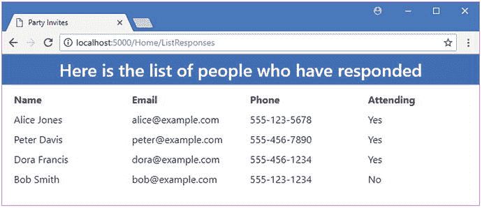

图 3-1。

Adding data to the example application

## 探索数据库

Visual Studio 包括一组工具，允许您浏览使用的数据库。从 Visual Studio Tools 菜单中选择 Connect to Database，会出现如图 [3-2](#Fig2) 所示的对话框，让您选择要连接的数据库服务器的类型。

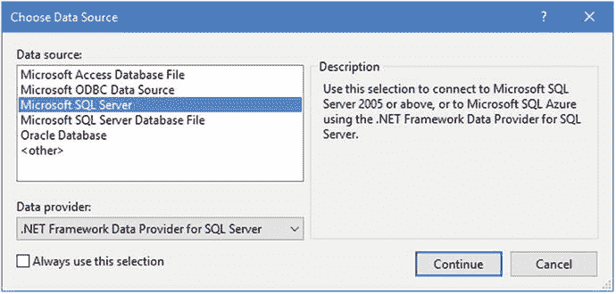

图 3-2。

Selecting the database server type

在本书中，我对所有的例子都使用 LocalDB。LocalDB 是 Microsoft SQL Server 的一个版本，作为第 [2](02.html) 章中 Visual Studio 工作负载的一部分安装，旨在供开发人员使用。它实现了所有关键的 SQL Server 功能，但不需要任何配置，也没有获得生产系统的许可。从 Visual Studio 提供的选项列表中选择 Microsoft SQL Server，然后单击“继续”按钮。

下一个对话框让您指定想要使用的数据库服务器和数据库的详细信息，如图 [3-3](#Fig3) 所示。在服务器名称字段中输入(localdb)\MSSQLLocalDB，在“选择或输入数据库名称”字段中选择 PartyInvites，如图 [3-3](#Fig3) 所示。

Tip

连接到 LocalDB 所需的字符串可能会造成混乱。第一部分是圆括号包围的`localdb`。然后是单个的`\`字符，后面是`MS_SQL_LocalDB`，但是没有下划线:`(localdb)\MSSQLLocalDB`。在`appsetting.json`文件中指定连接字符串时，需要一个额外的`\`字符，因为反斜杠有特殊的含义，必须转义:`(localdb)\\MSSQLLocalDB`。

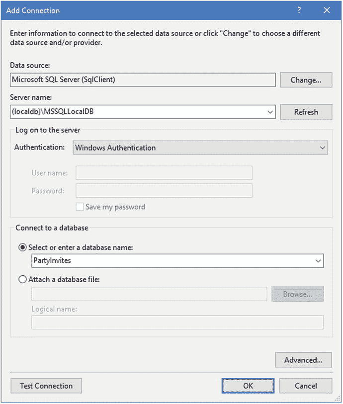

图 3-3。

Selecting the database server and database

单击“确定”按钮，Visual Studio 将连接到数据库服务器，并在“服务器资源管理器”窗口中显示详细信息(如果该窗口未打开，请选择“查看➤服务器资源管理器”)。在显示屏的数据连接部分，您将看到 PartyInvites 的一个条目，您可以展开该条目以查看数据库的详细信息，如图 [3-4](#Fig4) 所示。

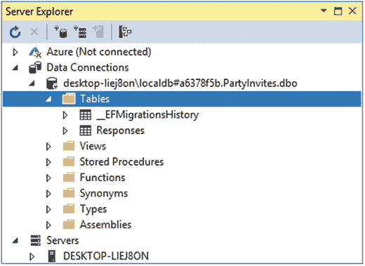

图 3-4。

The database entry in the Server Explorer window

### 检查数据库表

如果展开 Tables 项，您将看到两个条目。`__EFMigrationsHistory`表用于跟踪已经应用到数据库的迁移，以保持它与应用的数据模型同步。我在第 [13 章](13.html)中详细解释了迁移是如何工作的，本章对这个表不感兴趣。`Responses`表用于存储应用的`GuestResponse`对象。在服务器资源管理器中展开该表，可以看到表列，如图 [3-5](#Fig5) 所示。

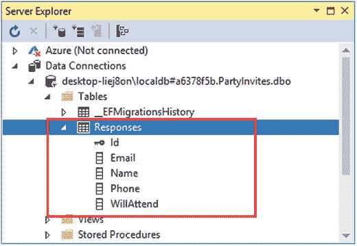

图 3-5。

The structure of the Responses table in the database

您可以看到 Entity Framework Core 是如何使用来自应用的细节来创建存储`GuestResponse`对象的表的。表的名称取自数据库上下文类中的属性，列的名称对应于由`GuestResponse`类定义的属性。这些决定是 Entity Framework Core 默认遵循的约定，我将在第 2 部分解释如何覆盖它们。

使用的数据类型。NET 必须转换成数据库服务器支持的数据类型。Entity Framework Core 在创建数据库时确定应该使用什么数据库类型，您可以通过在 Server Explorer 窗口中右键单击 Responses 项并从弹出菜单中选择 Open Table Definition 来检查它的决定。Visual Studio 将打开一个新的编辑器窗格，其中包含表结构的细节，如图 [3-6](#Fig6) 所示。

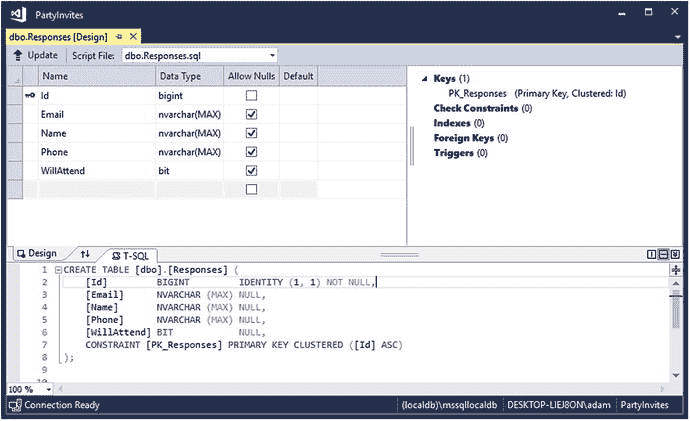

图 3-6。

Exploring structure of a database table

您可以看到被选择来表示每个`GuestResponse`属性的值的 SQL 数据类型。实体框架核心依赖于数据库提供者来选择最佳的 SQL 数据类型，并且为不同的数据库服务器选择的类型可能有所不同。对于 SQL Server，可以看到`Id`属性会被存储为一个 SQL `bigint`，对应一个. NET`long`；属性`WillAttend`将被存储为一个位，对应于一个. NET 可空的属性`bool`；其他属性将被存储为`nvarchar(MAX)`，它对应于。网`string`。

Tip

对于大多数项目，Entity Framework Core 选择的数据类型是完全可以接受的，但是您可以使用第 [21](21.html) 章中描述的特性来指定不同的类型。

### 检查数据库内容

在“服务器资源管理器”窗口中右键单击该表，并从弹出菜单中选择“显示表数据”以查看表中的数据。Visual Studio 将查询数据库并显示结果，如图 [3-7](#Fig7) 所示。

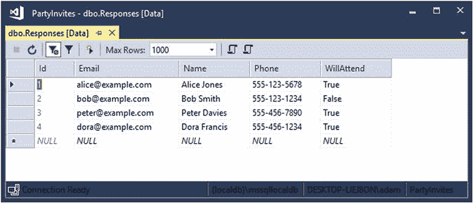

图 3-7。

Displaying the data in a database table

Visual Studio 用来显示数据的网格是可编辑的，这意味着您可以更新现有的数据值并向表中添加新行，而无需直接使用 SQL。

使用表 [3-2](#Tab2) 中所示的值填写表格底行中的字段，然后按 Tab 键，添加新的响应。您不能为`Id`列输入值，但是当数据被添加到数据库时，数据库服务器会为您分配一个值。

表 3-2。

The Data Values for Adding a Row to the Database Table

<colgroup><col> <col> <col> <col></colgroup> 
| 电子邮件 | 名字 | 电话 | 将出席 |
| --- | --- | --- | --- |
| `jane@example.com` | `Jane Marshall` | `555-123-1212` | `True` |

当您按下 Tab 按钮时，Visual Studio 会将新数据添加到数据库中。导航到`http://localhost:5000/home/listresponses`，可以在应用中看到新的数据，如图 [3-8](#Fig8) 所示。

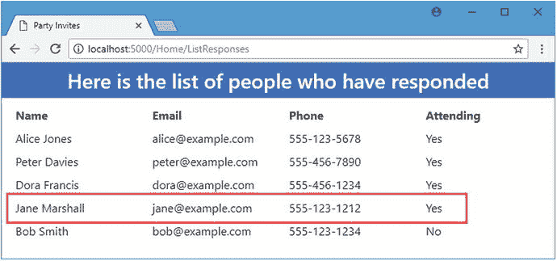

图 3-8。

New data displayed by the application

## 了解 SQL

了解 Entity Framework Core 如何将应用的操作转换为数据库服务器的命令通常会很有用。要使用 Entity Framework Core，您不必是 SQL 专家，但了解基础知识会有所帮助，这样您就可以知道何时没有得到预期的结果。在接下来的部分中，我将描述基本的 SQL 命令，并解释实体框架核心如何使用它们。

### 查询数据

SQL 的基本特性是查询，它从数据库中检索数据。如果您导航到`http://localhost:5000/home/listresponses`并检查应用生成的日志消息，您将能够看到实体框架核心用来从数据库获取数据的 SQL 命令，如下所示:

```cs
...
SELECT [r].[Id], [r].[Email], [r].[Name], [r].[Phone], [r].[WillAttend]
FROM [Responses] AS [r]
ORDER BY [r].[WillAttend] DESC
...

```

如果您熟悉 LINQ，那么通过阅读它，您就会对这个 SQL 命令的作用有所了解，但是为了理解 Entity Framework Core 在做什么，这是值得进一步探究的。

#### 手动查询数据库

您可以使用 Visual Studio 服务器资源管理器窗口直接查询数据库，方法是右击该表并从弹出菜单中选择“新建查询”。使用 SQL Server 时，我更喜欢通过从“工具”“➤ SQL Server”菜单中选择“新建查询”来使用不同的 Visual Studio 功能。当您看到如图 [3-9](#Fig9) 所示的`Connect`对话框时，在服务器名称字段中输入(localdb)\MSSQLLocalDB，将数据库名称字段保留为<默认>，并点击连接按钮。

Tip

一旦连接到数据库，连接设置将保存在连接对话窗口的`History`表中，并可用于以后的连接，而无需重新输入详细信息。

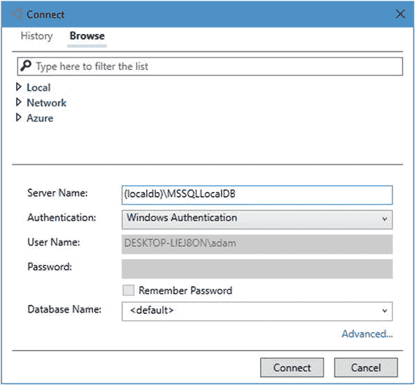

图 3-9。

Connecting to the database

单击 Connect 按钮，Visual Studio 将连接到数据库服务器并打开一个新的编辑器窗格，您可以在其中输入 SQL 命令。在新的编辑器中输入清单 [3-3](#Par36) 中所示的命令。

```cs
USE PartyInvites

SELECT * FROM Responses

Listing 3-3.A Basic SQL Query

```

单击编辑器窗格左上角的绿色箭头，或者右键单击窗口并从弹出菜单中选择执行以执行命令。Visual Studio 会将 SQL 发送到数据库服务器并显示结果，如图 [3-10](#Fig10) 所示。

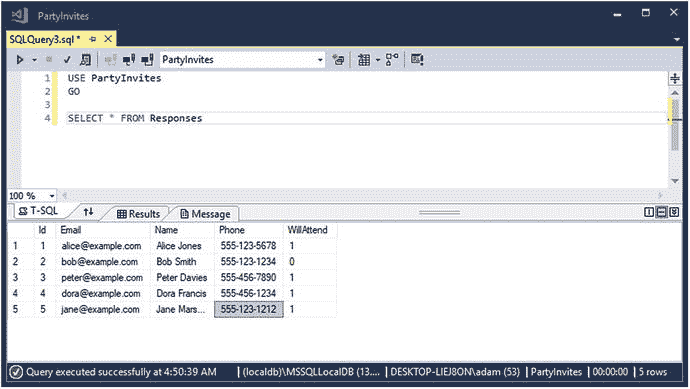

图 3-10。

Querying the database

因为这是您直接执行的第一个 SQL 命令，所以我将分解它的每个部分并解释它的含义。这是第一部分:

```cs
...
USE PartyInvites
...

```

该命令选择`PartyInvites`数据库。一个数据库服务器可以管理许多数据库，选择要使用的数据库非常重要。(您可以在创建连接时选择数据库，或者使用查询窗口顶部的下拉列表，但是我更喜欢明确地进行选择。)

清单 [3-3](#Par36) 中 SQL 的第二部分是实际的查询，如下所示:

```cs
...
SELECT * FROM Responses
...

```

`SELECT`关键字表示一个 SQL 查询。`FROM`关键字指定需要其数据的数据库表。星号指定查询应该返回表中所有列的值。总之，这个查询告诉数据库服务器“给我来自`Responses`表的所有列”该查询产生的结果如表 [3-3](#Tab3) 所示。

表 3-3。

The Results from the Basic Query

<colgroup><col> <col> <col> <col> <col></colgroup> 
| 身份 | 电子邮件 | 名字 | 电话 | 将出席 |
| --- | --- | --- | --- | --- |
| `1` | `alice@example.com` | `Alice Jones` | `555-123-5678` | `1` |
| `2` | `bob@example.com` | `Bob Smith` | `555-123-1234` | `0` |
| `3` | `peter@example.com` | `Peter Davies` | `555-456-7890` | `1` |
| `4` | `dora@example.com` | `Dora Francis` | `555-456-1234` | `1` |
| `5` | `jane@example.com` | `Jane Marshall` | `555-123-1212` | `1` |

#### 过滤数据

默认情况下，查询将返回表中的所有行。这对于存储少量数据的应用(如示例项目)来说是完全合理的，但是在大多数实际项目中，您会希望查询数据的子集。`WHERE`关键字用于从数据库表中选择特定的行。在 Visual Studio 查询窗口中输入清单 [3-4](#Par46) 中所示的 SQL，看看这是如何工作的。

Structured Query Language Conventions

你会注意到我在这一章中使用大写字母作为 SQL 关键字。这不是必需的，但这是一种常见的做法，它有助于使复杂的 SQL 更容易阅读。SQL 的世界充满了约定和偏好——就像 C# 开发一样——您不可避免地会遇到坚持某种风格的数据库管理员和开发人员。数据库服务器擅长解析 SQL，我的建议是采用一种您和您的团队容易阅读的风格，即使这意味着编写的命令倾向于 C# 编码约定，而不是那些与 SQL 相关的。

```cs
USE PartyInvites

SELECT * FROM Responses

WHERE WillAttend = 1

Listing 3-4.Querying for Selected Rows

```

`WHERE`关键字后面是一个表达式，它将匹配应该包含在结果中的行。在这种情况下，我已经指定结果中应该包含具有`1`的`WillAttend`值的行，而应该排除其他行。执行这个命令，您将看到匹配的响应，如表 [3-4](#Tab4) 所示。

表 3-4。

Results from Using the WHERE Keyword

<colgroup><col> <col> <col> <col> <col></colgroup> 
| 身份 | 电子邮件 | 名字 | 电话 | 将出席 |
| --- | --- | --- | --- | --- |
| `1` | `alice@example.com` | `Alice Jones` | `555-123-5678` | `1` |
| `3` | `peter@example.com` | `Peter Davies` | `555-456-7890` | `1` |
| `4` | `dora@example.com` | `Dora Francis` | `555-456-1234` | `1` |
| `5` | `jane@example.com` | `Jane Marshall` | `555-123-1212` | `1` |

#### 选择和排序列

查询中的星号(`*`字符)要求包含在结果中的行的所有列。您并不总是需要所有的列，您可能希望指定这些列在结果中的显示顺序。SQL 查询可以选择结果中包含的列，如清单 [3-5](#Par49) 所示。

```cs
USE PartyInvites
SELECT Id, Name, Email FROM Responses
WHERE WillAttend = 'true'

Listing 3-5.Selecting and Ordering Columns

```

在这个查询中，我已经指定我只需要`Id`、`Name`和`Email`列的值。当您执行查询时，您将看到表 [3-5](#Tab5) 中所示的结果，其他列中的值被排除。请注意，结果是按照我指定列的顺序显示的。

表 3-5。

Results Selecting Columns

<colgroup><col> <col> <col></colgroup> 
| 身份 | 名字 | 电子邮件 |
| --- | --- | --- |
| `1` | `Alice Jones` | `alice@example.com` |
| `3` | `Peter Davies` | `peter@example.com` |
| `4` | `Dora Francis` | `dora@example.com` |
| `5` | `Jane Marshall` | `jane@example.com` |

#### 排序行

使用`ORDER BY`关键字可以指定匹配行在结果中的返回顺序。在清单 [3-6](#Par52) 中，我使用了`ORDER BY`告诉数据库服务器，我想要按照`Email`列的值排序的结果。

```cs
USE PartyInvites

SELECT Id, Name, Email FROM Responses
WHERE WillAttend = 'true'

ORDER BY Email

Listing 3-6.Ordering Results

```

当您执行查询时，结果将按照`Email`列的值排序，如表 [3-6](#Tab6) 所示。

表 3-6。

Results Ordering Rows

<colgroup><col> <col> <col></colgroup> 
| 身份 | 名字 | 电子邮件 |
| --- | --- | --- |
| `1` | `Alice Jones` | `alice@example.com` |
| `4` | `Dora Francis` | `dora@example.com` |
| `5` | `Jane Marshall` | `jane@example.com` |
| `3` | `Peter Davies` | `peter@example.com` |

#### 检查实体框架核心查询

有许多 SQL 查询特性，但是前面几节中展示的特性足以让您了解数据库请求的数据。在 Entity Framework Core 生成的查询中，有一些细微的差异值得解释。在清单 [3-7](#Par55) 中，我修改了在`Home`控制器的`ListResponses`动作方法中使用的 LINQ 查询，使其对请求的数据更具选择性。

```cs
using Microsoft.AspNetCore.Mvc;
using PartyInvites.Models;
using System.Linq;

namespace PartyInvites.Controllers {

    public class HomeController : Controller {
        private DataContext context;

        public HomeController(DataContext ctx) => context = ctx;

        public IActionResult Index() => View();

        public IActionResult Respond() => View();

        [HttpPost]
        public IActionResult Respond(GuestResponse response) {
            context.Responses.Add(response);
            context.SaveChanges();
            return RedirectToAction(nameof(Thanks),
                new { Name = response.Name, WillAttend = response.WillAttend });
        }

        public IActionResult Thanks(GuestResponse response) => View(response);

        public IActionResult ListResponses() =>
            View(context.Responses
                .Where(r => r.WillAttend == true)
                .OrderBy(r => r.Email));
    }
}

Listing 3-7.Changing the LINQ Query in the HomeController.cs File in the Controllers Folder

```

使用项目文件夹中的`dotnet run`启动应用，并导航到`http://localhost:5000/home/listresponses`。显示给用户的 HTML 将只包含那些参加聚会的人的回复，按照他们的电子邮件地址排序，如图 [3-11](#Fig11) 所示。

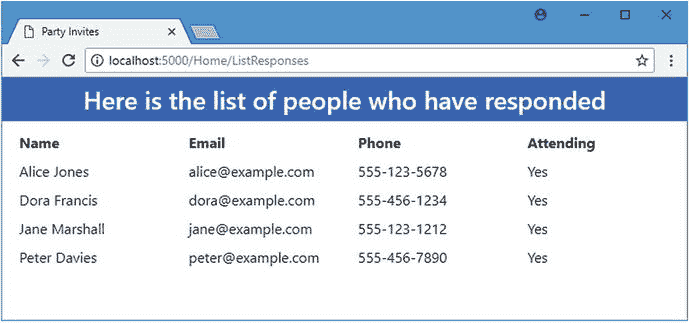

图 3-11。

Using a more selective query in the example application

如果您检查应用生成的日志消息，您将看到实体框架核心从 LINQ 查询生成的 SQL。

```cs
...
SELECT [r].[Id], [r].[Email], [r].[Name], [r].[Phone], [r].[WillAttend]
FROM [Responses] AS [r]
WHERE [r].[WillAttend] = 1
ORDER BY [r].[Email]
...

```

您可以看到该查询的结构遵循与我在前面几节中构建的模式相同的模式。方括号(`[`和`]`字符)的使用允许列名包含特殊字符，比如空格。对于示例应用中的数据模型来说，这不是必需的，但是 Entity Framework Core 仍然会这样做。

`AS`关键字用于创建临时别名。实体框架核心使用`AS`关键字引用使用`r`的`Responses`表。这在简单的查询中没有好处，但在组合多个表中的数据的更复杂的查询中却很有帮助。

#### 了解查询参数

在检查由 Entity Framework Core 创建的查询时，您可能会看到另一个不同之处。为了演示，我修改了由`ListResponses`动作方法使用的查询，如清单 [3-8](#Par62) 所示。

```cs
using Microsoft.AspNetCore.Mvc;
using PartyInvites.Models;
using System.Linq;

namespace PartyInvites.Controllers {

    public class HomeController : Controller {
        private DataContext context;

        public HomeController(DataContext ctx) => context = ctx;

        public IActionResult Index() => View();

        public IActionResult Respond() => View();

        [HttpPost]
        public IActionResult Respond(GuestResponse response) {
            context.Responses.Add(response);
            context.SaveChanges();
            return RedirectToAction(nameof(Thanks),
                new { Name = response.Name, WillAttend = response.WillAttend });
        }

        public IActionResult Thanks(GuestResponse response) => View(response);

        public IActionResult ListResponses(string searchTerm = "555-123-5678") =>
            View(context.Responses
                .Where(r => r.Phone == searchTerm)
                .OrderBy(r => r.Email));
    }
}

Listing 3-8.Changing the LINQ Query in the HomeController.cs File in the Controllers Folder

```

LINQ 查询使用`Where`方法来选择其`Phone`值与搜索参数匹配的`GuestResponse`对象。如果您启动应用，导航到`http://localhost:5000/home/listresponses`，并检查应用生成的日志消息，您将看到它是如何被转换成 SQL 的。

```cs
...
SELECT [r].[Id], [r].[Email], [r].[Name], [r].[Phone], [r].[WillAttend]
FROM [Responses] AS [r]

WHERE [r].[Phone] = @__searchTerm_0

ORDER BY [r].[Email]
...

```

`@`字符用于表示 SQL 查询中的参数。参数在实体框架核心处理变量时使用，它们允许数据库服务器识别类似的查询，并通过以相同的方式处理它们来提高性能。参数还可以防止 SQL 注入攻击，在这种攻击中，用户输入的数据值可以被解释为 SQL 命令的一部分。

使用参数是一个好主意——特别是因为 Entity Framework Core 不知道数据值的来源是否可信——但是它确实使得理解什么 SQL 被发送到数据库变得更加困难，因为默认情况下参数值不会显示在日志消息中。这在大多数情况下不是问题，因为查询的结构才是我们感兴趣的，但是在清单 [3-9](#Par68) 中，我已经更改了示例应用的配置，以便实体框架核心将在它生成的日志消息中包含参数值。

Caution

不要在生产中启用该选项，因为敏感数据最终会出现在应用的日志文件中。

```cs
using System;
using System.Collections.Generic;
using System.Linq;
using System.Threading.Tasks;
using Microsoft.AspNetCore.Builder;
using Microsoft.AspNetCore.Hosting;
using Microsoft.AspNetCore.Http;
using Microsoft.Extensions.DependencyInjection;
using Microsoft.EntityFrameworkCore;
using Microsoft.Extensions.Configuration;
using PartyInvites.Models;

namespace PartyInvites {

    public class Startup {

        public Startup(IConfiguration config) => Configuration = config;

        public IConfiguration Configuration { get; }

        public void ConfigureServices(IServiceCollection services) {
            services.AddMvc();
            string conString = Configuration["ConnectionStrings:DefaultConnection"];
            services.AddDbContext<DataContext>(options => {
                options.EnableSensitiveDataLogging(true);
                options.UseSqlServer(conString);
            });
        }

        public void Configure(IApplicationBuilder app, IHostingEnvironment env) {
            app.UseDeveloperExceptionPage();
            app.UseStatusCodePages();
            app.UseStaticFiles();
            app.UseMvcWithDefaultRoute();
        }
    }
}

Listing 3-9.Enabling Parameter Value Logging in the Startup.cs File in the PartyInvites Folder

```

使用`EnableSensitiveDataLogging`方法告诉实体框架核心在其日志消息中包含参数值。使用`dotnet`重启应用并导航至`http://localhost:5000/home/listresponses`。在应用生成的日志记录消息中，Entity Framework Core 将在查询前显示的消息中包含参数值。

```cs
...
Executed DbCommand (58ms) [Parameters=[@__searchTerm_0='555-123-5678' (Size = 4000)],
    CommandType='Text', CommandTimeout='30']
SELECT [r].[Id], [r].[Email], [r].[Name], [r].[Phone], [r].[WillAttend]
FROM [Responses] AS [r]
WHERE [r].[Phone] = @__searchTerm_0
ORDER BY [r].[Email]
...

```

### 存储和更新数据

在大多数应用中，查询是最常见的命令类型，但是存储新数据和更新现有数据也很重要。`INSERT`命令用于向表中插入新的一行数据，清单 [3-10](#Par72) 中所示的 SQL 命令向`Responses`表中添加新的一行。

```cs
USE PartyInvites

INSERT INTO Responses(Name, Email, Phone, WillAttend)
VALUES ('Joe Dobbs', 'joe@example.com', '555-888-1234', 1)

Listing 3-10.Inserting Data into a Table

```

`INSERT INTO`关键字后面是您想要为其提供值的列的列表。然后使用`VALUES`关键字，后面是要存储在数据库中的值，以与列列表相同的顺序表示。清单中的命令为`Name`、`Email`、`Phone`和`WillAttend`列添加了一个新行。对于`Id`列，不需要任何值，实体框架核心对其进行配置，以便数据库服务器在存储其余列时生成一个值。

Tip

注意，在 SQL 中，字符串是用单引号(`'`字符)来区分的，而不是 C# 中使用的双引号(`"`字符)。

当您执行清单 [3-10](#Par72) 中的命令时，您将看到以下消息:

```cs
...
(1 row(s) affected)
...

```

数据库服务器通过指示更改了多少行来响应修改数据库的命令。要查看实体框架核心使用的`INSERT`命令，导航到`http://localhost:5000`，单击 RSVP Now 按钮，并使用表 [3-7](#Tab7) 中的值创建响应。

表 3-7。

The Values for Creating a Response

<colgroup><col> <col> <col> <col></colgroup> 
| 名字 | 电子邮件 | 电话 | 将出席 |
| --- | --- | --- | --- |
| `Anna Roth` | `anna@example.com` | `555-204-7692` | `False` |

如果您检查应用在数据库中存储新数据时生成的日志记录消息，您会看到使用了相同的基本样式的`INSERT`命令，但有一些不同。

```cs
...
Executed DbCommand (3ms) [Parameters=[@p0='anna@example.com' (Size = 4000),
    @p1='Anna Roth' (Size = 4000), @p2='555-204-7692' (Size = 4000),
    @p3=False' (Nullable = true)], CommandType='Text', CommandTimeout='30']

SET NOCOUNT ON;

INSERT INTO [Responses] ([Email], [Name], [Phone], [WillAttend])
VALUES (@p0, @p1, @p2, @p3);
...

```

`SET NOCOUNT ON`命令禁止报告受命令影响的行数。它对像本章中这样的简单命令几乎没有影响，但是它可以提高更复杂操作的性能。您可以看到实体框架核心使用的`INSERT`命令类似于清单 [3-10](#Par72) 中的命令，但是带有参数化的值。

在`INSERT`之后，实体框架核心立即向数据库服务器发送另一个命令。

```cs
...
SELECT [Id]
FROM [Responses]
WHERE @@ROWCOUNT = 1 AND [Id] = scope_identity();
...

```

实体框架核心使用该命令检查受`INSERT`命令影响的行数，并确定数据库服务器分配给`Id`列的值唯一值。知道`Id`值对于在新存储的数据上执行的后续操作非常重要，即使在示例应用中没有这样的操作，Entity Framework Core 也会执行该查询。

#### 更新现有数据

`UPDATE`命令用于修改先前存储在数据库中的数据，并可用于在一次操作中选择修改多行。清单 [3-11](#Par85) 中所示的命令修改了`Responses`表中`WillAttend`值为 1 的行，并更改了它们的电话号码。(这本身并不是一个特别有用的变化，但是它展示了一个`UPDATE`的基本结构。)

```cs
USE PartyInvites

UPDATE Responses
SET Phone='404-204-1234'
WHERE WillAttend = 1

Listing 3-11.Updating Existing Data

```

`UPDATE`关键字后跟表的名称，`SET`关键字用于指定要更改的列和值。`WHERE`关键字后面是一个表达式，用于选择要修改的行。当您执行此命令时，数据库服务器将以受影响的行数作为响应。

```cs
...
(5 row(s) affected)
...

```

执行清单 [3-12](#Par89) 中所示的命令，查询`Responses`表中的所有行。

```cs
USE PartyInvites

SELECT * FROM Responses

Listing 3-12.Querying for All Rows

```

表 [3-8](#Tab8) 显示了这个查询的结果，并突出显示了在清单 [3-11](#Par85) 中执行的更新的效果。

表 3-8。

The Effect of Updating Existing Data

<colgroup><col> <col> <col> <col> <col></colgroup> 
| 身份 | 电子邮件 | 名字 | 电话 | 将出席 |
| --- | --- | --- | --- | --- |
| `1` | `alice@example.com` | `Alice Jones` | `404-204-1234` | `1` |
| `2` | `bob@example.com` | `Bob Smith` | `555-123-1234` | `0` |
| `3` | `peter@example.com` | `Peter Davies` | `404-204-1234` | `1` |
| `4` | `dora@example.com` | `Dora Francis` | `404-204-1234` | `1` |
| `5` | `jane@example.com` | `Jane Marshall` | `404-204-1234` | `1` |
| `6` | `joe@example.com` | `Joe Dobbs` | `404-204-1234` | `1` |
| `7` | `anna@example.com` | `Anna Roth` | `555-204-7692` | `0` |

### 删除数据

最后一个命令是从数据库中删除数据的命令:`DELETE`命令。这个命令必须小心使用，因为它有一个`WHERE`子句，允许一个命令选择许多行进行删除，并且很容易意外地从数据库中删除比预期更多的数据。清单 [3-13](#Par92) 中显示的命令从`Responses`表中删除所有`WillAttend`值为零的行。

```cs
USE PartyInvites

DELETE FROM Responses
WHERE WillAttend = 0

Listing 3-13.Deleting Data

```

执行该命令，然后重复清单 [3-12](#Par89) 中的查询，以确认被拒绝的邀请已经从数据库中删除。示例应用中不支持删除数据，但是您将在后面的章节中看到这种类型的命令，包括作为我在下一章开始构建的 SportsStore 应用的一部分。

## 连接数据

数据库可以包含表之间的关系，实体框架核心使用这些关系来跟踪对象之间的关系。该特性建立在本章前面描述的`INSERT`和`UPDATE`命令的基础上，但依赖于一种更复杂的查询类型，即 join，它合并了来自多个表的数据。连接可能会令人困惑；您不需要理解它们来使用实体框架核心，但是有一个基本的知识是有用的。

Note

如果您没有立即遵循这一部分，请不要担心。一旦你阅读了第 [14](14.html) 章，它将会更有意义，其中包括使用连接的实体框架核心特性，并且在第 [15](15.html) 和 [16](16.html) 章中有详细描述。

### 准备数据库

为了演示连接是如何工作的，我需要向数据库中添加另一个表。执行清单 [3-14](#Par97) 中所示的命令，这将创建一个名为`Preferences`的表格。

```cs
USE PartyInvites

DROP TABLE IF EXISTS Preferences

CREATE TABLE Preferences (
    Id bigint IDENTITY,
    Email nvarchar(max),
    NutAllergy bit,
    Teetotal bit,
    ResponseId bigint,

)

Listing 3-14.Creating a New Table in the Database

```

`DROP TABLE`命令告诉数据库服务器删除已经存在的`Preferences`表，这意味着您可以重复执行清单 [3-14](#Par97) 中所示的命令而不会导致错误。

`CREATE TABLE`命令用于创建一个新表。指定了表的名称、表将包含的列列表以及每列的类型。清单 [3-14](#Par97) 中的命令创建的表格有`Id`、`Email`、`NutAllergy`和`Teetotal`列。`Id`列已经用`IDENTITY`关键字进行了配置，这使得数据库服务器负责创建唯一值，以及默认情况下哪个实体框架核心应用于主键列。清单 [3-15](#Par100) 中所示的命令将新行插入到`Responses`和`Preferences`表中。

```cs
USE PartyInvites

INSERT INTO Responses(Name, Email, Phone, WillAttend)
VALUES ('Dave Habbs', 'dave@example.com', '555-777-1234', 1)

INSERT INTO Preferences (Email, NutAllergy, Teetotal)
VALUES ('dave@example.com', 0, 1)

Listing 3-15.Storing Related Data

```

第一个`INSERT`命令向`Responses`表添加一行。第二个`INSERT`命令向`Preferences`表中添加一行。执行清单 [3-16](#Par102) 中所示的命令来查询这些表并查看新数据。

```cs
USE PartyInvites

SELECT * FROM Responses
SELECT * FROM Preferences

Listing 3-16.Querying for the New Data

```

第一个`SELECT`命令查询数据库中所有的`Response`行，包括表 [3-9](#Tab9) 中显示的行，该行是由清单 [3-15](#Par100) 中的第一个`INSERT`命令创建的。

表 3-9。

The New Responses Row

<colgroup><col> <col> <col> <col> <col></colgroup> 
| 身份 | 电子邮件 | 名字 | 电话 | 将出席 |
| --- | --- | --- | --- | --- |
| `8` | `dave@example.com` | `Dave Habbs` | `555-777-1234` | `1` |

第二个`SELECT`命令查询数据库中的所有`Preferences`行，并产生表 [3-10](#Tab10) 中所示的结果。请注意，`Preferences`表中行的`ResponseId`属性与表 [3-9](#Tab9) 中所示行的`Id`值相匹配。

表 3-10。

The New Preferences Row

<colgroup><col> <col> <col> <col></colgroup> 
| 身份 | 电子邮件 | 坚果过敏 | 完全的 |
| --- | --- | --- | --- |
| `1` | `dave@example.com` | `0` | `1` |

### 执行连接

有不同类型的连接，但是 Entity Framework Core 使用的类型被称为内部连接，它从共享一个公共值的表中选择行。清单 [3-17](#Par106) 包含一个对`Responses`和`Preferences`表执行内部连接的查询。

```cs
USE PartyInvites

SELECT Responses.Email, Responses.Name, Preferences.NutAllergy, Preferences.Teetotal
FROM Responses
INNER JOIN Preferences ON Responses.Email = Preferences.Email

Listing 3-17.Performing an Inner Join

```

`SELECT`命令向数据库服务器请求来自两个表的列，而`INNER JOIN`关键字用于指定来自`Responses`表的行应该与来自`Preferences`表的行连接，其中两个表具有相同的`Email`值。结果是清单 [3-16](#Par102) 中创建的两行的数据值被组合成一个结果，如表 [3-11](#Tab11) 所示。

表 3-11。

The JOIN Results

<colgroup><col> <col> <col> <col></colgroup> 
| 电子邮件 | 名字 | 坚果过敏 | 完全的 |
| --- | --- | --- | --- |
| `dave@example.com` | `Dave Habbs` | `0` | `1` |

这是一个简单的连接，但它展示了基本的机制，并将帮助您理解 Entity Framework Core 用来从用于存储复杂数据模型的数据库中获取数据的查询。

## 摘要

在本章中，我向您展示了如何使用 Visual Studio 来检查用于存储应用数据的数据库。我还向您展示了如何执行基本的 SQL 命令，以便您对 Entity Framework Core 如何使用数据库有一个大致的了解，并且您可以检查您是否得到了预期的结果。在下一章中，我将开始创建一个更复杂、更真实的应用:SportsStore。