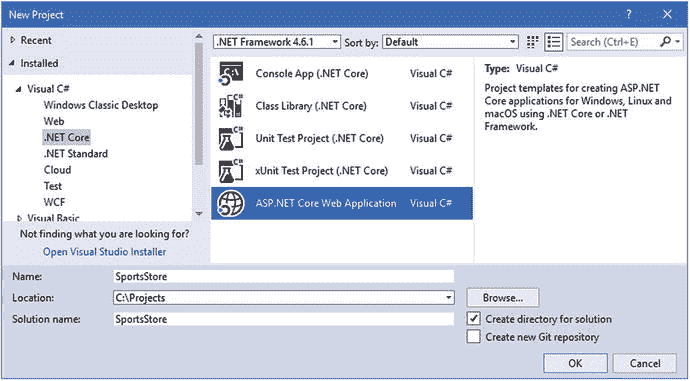
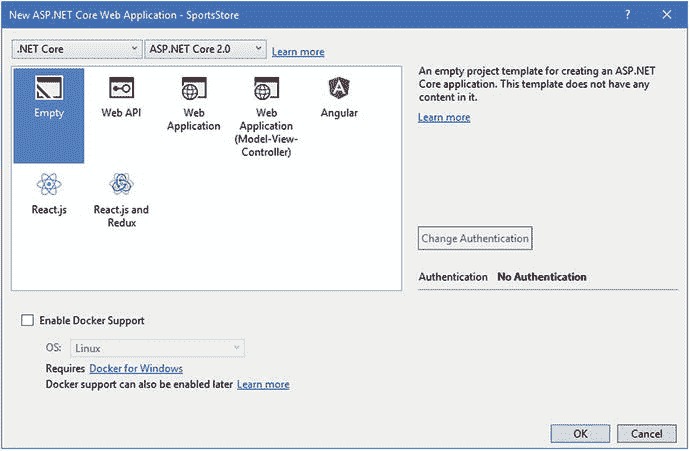
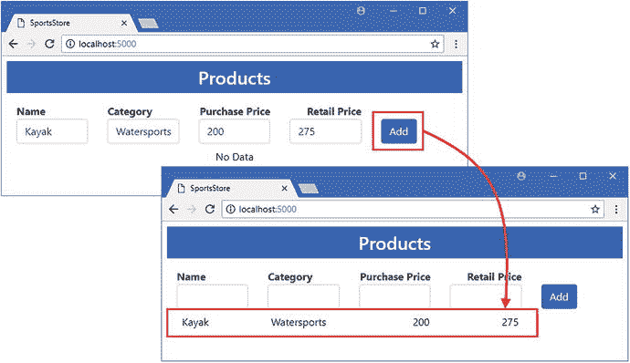

# 四、SportsStore：一个真正的（数据）应用

在这一章中，我将开始构建一个更现实的项目，展示 ASP.NET Core MVC 和实体框架核心是如何一起使用的。该项目将是简单但现实的，并侧重于最常用的实体框架核心功能。该应用将是我在许多书中使用的 SportsStore 应用的变体，更加关注数据和数据存储。

在这一章中，我构建了一个简单的自包含 ASP.NET Core MVC 应用。在下一章中，我将添加实体框架核心并将应用数据存储在数据库中。在接下来的章节中，我将添加更多的数据操作，扩展数据模型，添加对客户特性的支持，并向您展示如何扩展应用。在 SportsStore 的所有章节中，我会向您介绍单独描述关键功能的章节，以及更详细的内容。从第 [5](05.html) 章开始，当我将实体框架核心添加到项目中时，我还描述了您可能会遇到的最常见的问题，并解释了如何解决它们。

Note

我在这本书里关注的是实体框架核心以及如何在 MVC 应用中使用它。我省略了一些 SportsStore 特性，比如管理特性的认证，并扩展了其他特性，比如数据模型。

## 创建项目

若要创建 SportsStore 项目，请启动 Visual Studio 并从“文件”菜单中选择“新建➤项目”。选择 ASP.NET Core Web 应用项目模板，将 Name 字段设置为 SportsStore，点击 Browse 按钮，选择一个方便的位置存储项目，如图 [4-1](#Fig1) 所示。

Tip

你可以从本书的 GitHub 资源库下载这个项目， [`https://github.com/apress/pro-ef-core-2-for-asp.net-core-mvc`](https://github.com/apress/pro-ef-core-2-for-asp.net-core-mvc) 。



图 4-1。

Creating the example project

单击“确定”按钮继续项目设置。确保这点。在窗口顶部选中 NET Core 和 ASP.NET Core 2.0，点击空模板，如图 [4-2](#Fig2) 所示。Visual Studio 包括在项目中设置 ASP.NET Core MVC 和实体框架核心的模板，但是结果隐藏了一些有用的细节。我从一个基本的 ASP.NET Core 项目开始，在接下来的章节中一步一步地构建它，这样您就可以看到不同的组件是如何协同工作的。



图 4-2。

Configuring the ASP.NET Core project

单击 OK 按钮，Visual Studio 将使用基本配置创建 SportsStore 项目，该项目设置 ASP.NET Core，但不配置 MVC 框架或实体框架核心。

### 配置 MVC 框架

下一步是添加 MVC 框架的基本配置，这样我就可以添加控制器和视图来处理 HTTP 请求。我将 MVC 中间件添加到 ASP.NET Core 请求管道中，如清单 [4-1](#Par9) 所示。

```cs
using System;
using System.Collections.Generic;
using System.Linq;
using System.Threading.Tasks;
using Microsoft.AspNetCore.Builder;
using Microsoft.AspNetCore.Hosting;
using Microsoft.AspNetCore.Http;
using Microsoft.Extensions.DependencyInjection;

namespace SportsStore {
    public class Startup {

        public void ConfigureServices(IServiceCollection services) {
            services.AddMvc();
        }

        public void Configure(IApplicationBuilder app, IHostingEnvironment env) {
            app.UseDeveloperExceptionPage();
            app.UseStatusCodePages();
            app.UseStaticFiles();
            app.UseMvcWithDefaultRoute();
        }
    }
}

Listing 4-1.Configuring MVC in the Startup.cs File in the SportsStore Folder

```

这些更改使用默认路由模式配置 MVC 框架，添加对静态文件的支持，并配置错误页面，以便它们提供对开发人员有用的细节。

### 添加模型

该应用的模型将基于一系列产品。我创建了`Models`文件夹，并添加了一个名为`Product.cs`的类文件，代码如清单 [4-2](#Par12) 所示。

```cs
namespace SportsStore.Models {

    public class Product {
        public string Name { get; set; }
        public string Category { get; set; }
        public decimal PurchasePrice { get; set; }
        public decimal RetailPrice { get; set; }
    }
}

Listing 4-2.The Contents of the Product.cs File in the Models Folder

```

这是我通常在书中使用的`Product`类的变体，这样我可以更好地展示有用的实体框架核心特性。

### 添加存储库

为了在应用中提供一致的数据访问，我喜欢使用存储库模式，其中一个接口定义了用于访问数据的属性和方法，一个实现类用于处理数据存储机制。使用存储库模式的优点是，对应用的 MVC 部分进行单元测试更容易，并且数据如何存储的细节对应用的其余部分是隐藏的。

Tip

对于大多数项目来说，使用存储库是一个好主意，但是这并不是使用实体框架核心的必要条件。例如，在第 3 部分中，大多数例子都没有存储库，因为有很多复杂的代码更改，我不想通过多个类和接口重复修改。如果您不相信存储库模式的好处，也不要担心，因为您总是可以在以后添加一个，尽管需要一些重构。

为了创建存储库接口，我在`Models`文件夹中添加了一个名为`IRepository.cs`的文件，并添加了清单 [4-3](#Par17) 中所示的代码。

```cs
using System.Collections.Generic;

namespace SportsStore.Models {

    public interface IRepository {

        IEnumerable<Product> Products { get; }

        void AddProduct(Product product);
    }
}

Listing 4-3.The Contents of the IRepository.cs File in the Models Folder

```

属性将提供对应用知道的所有产品的只读访问。`AddProduct`方法将用于添加新产品。

对于这一章，我将把模型对象存储在内存中，然后在第 [4](04.html) 章中用实体框架核心替换它。我在`Models`文件夹中添加了一个名为`DataRepository.cs`的类，并添加了清单 [4-4](#Par20) 中所示的代码。

```cs
using System.Collections.Generic;

namespace SportsStore.Models {

    public class DataRepository : IRepository {
        private List<Product> data = new List<Product>();

        public IEnumerable<Product> Products => data;

        public void AddProduct(Product product) {
            this.data.Add(product);
        }
    }
}

Listing 4-4.The Contents of the DataRepository.cs File in the Models Folder

```

`DataRepository`类实现了`IRepository`接口，并使用一个`List`来跟踪`Product`对象，这意味着一旦应用停止或重启，数据就会丢失。我在第 4 章中介绍了一个持久存储库，但是这足以让项目的 ASP.NET Core MVC 部分在我介绍实体框架核心之前工作。

我将清单 [4-5](#Par23) 中所示的语句添加到`Startup`类中，以将`DataRepository`类注册为用于依赖`IRepository`接口的实现。

```cs
using System;
using System.Collections.Generic;
using System.Linq;
using System.Threading.Tasks;
using Microsoft.AspNetCore.Builder;
using Microsoft.AspNetCore.Hosting;
using Microsoft.AspNetCore.Http;
using Microsoft.Extensions.DependencyInjection;

using SportsStore.Models;

namespace SportsStore {
    public class Startup {

        public void ConfigureServices(IServiceCollection services) {
            services.AddMvc();
            services.AddSingleton<IRepository, DataRepository>();
        }

        public void Configure(IApplicationBuilder app, IHostingEnvironment env) {
            app.UseDeveloperExceptionPage();
            app.UseStatusCodePages();
            app.UseStaticFiles();
            app.UseMvcWithDefaultRoute();
        }
    }
}

Listing 4-5.Configuring Dependency Injection in the Startup.cs File in the SportsStore Folder

```

清单 [4-5](#Par23) 中的语句使用`AddSingleton`方法注册了`DataRepository`类，这意味着在第一次解析对`IRepository`接口的依赖时将创建一个单独的对象，然后用于所有后续的依赖。

### 添加控制器和视图

示例应用的重点将是产品对象的管理，因为这为展示不同的数据特性提供了最大的范围。我需要一个控制器来接收 HTTP 请求并将它们转换成对`Product`对象的操作，所以我创建了`Controllers`文件夹，向其中添加了一个名为`HomeController.cs`的代码文件，并使用它来定义清单 [4-6](#Par26) 中所示的控制器。

```cs
using Microsoft.AspNetCore.Mvc;
using SportsStore.Models;

namespace SportsStore.Controllers {

    public class HomeController : Controller {
        private IRepository repository;

        public HomeController(IRepository repo) => repository = repo;

        public IActionResult Index() => View(repository.Products);

        [HttpPost]
        public IActionResult AddProduct(Product product) {
            repository.AddProduct(product);
            return RedirectToAction(nameof(Index));
        }
    }
}

Listing 4-6.The Contents of the HomeController.cs File in the Controllers Folder

```

`Index`动作将`Product`对象的集合从存储库传递到它的视图，视图将向用户显示一个数据表。`AddProduct`方法基于 HTTP POST 请求中接收的数据存储新的`Product`对象。

接下来，我创建了`Views/Home`文件夹，并在其中添加了一个名为`Index.cshtml`的文件，其内容如清单 [4-7](#Par29) 所示。这个视图将显示应用的`Product`数据，并允许用户创建新的对象。

```cs
@model IEnumerable<Product>

<h3 class="p-2 bg-primary text-white text-center">Products</h3>

<div class="container-fluid mt-3">
    <div class="row">
        <div class="col font-weight-bold">Name</div>
        <div class="col font-weight-bold">Category</div>
        <div class="col font-weight-bold text-right">Purchase Price</div>
        <div class="col font-weight-bold text-right">Retail Price</div>
        <div class="col"></div>
    </div>
    <form asp-action="AddProduct" method="post">
        <div class="row">
            <div class="col"><input name="Name" class="form-control" /></div>
            <div class="col"><input name="Category" class="form-control" /></div>
            <div class="col">
                <input name="PurchasePrice" class="form-control" />
            </div>
            <div class="col">
                <input name="RetailPrice"  class="form-control" />
            </div>
            <div class="col">
                <button type="submit" class="btn btn-primary">Add</button>
            </div>
        </div>
    </form>
    @if (Model.Count() == 0) {
        <div class="row">
            <div class="col text-center p-2">No Data</div>
        </div>
    } else {
        @foreach (Product p in Model) {
            <div class="row p-2">
                <div class="col">@p.Name</div>
                <div class="col">@p.Category</div>
                <div class="col text-right">@p.PurchasePrice</div>
                <div class="col text-right">@p.RetailPrice</div>
                <div class="col"></div>
            </div>
        }
    }
</div>

Listing 4-7.The Contents of the Index.cshtml File in the Views/Home Folder

```

网格布局用于显示创建新对象的内嵌表单，以及应用已知的所有现有`Product`对象的详细信息，如果没有对象，则显示一个占位符。

### 添加最后的润色

我在解决方案浏览器中右键单击 SportsStore 项目项，选择添加➤新项，并选择 JSON 文件模板(在 ASP.NET Core➤ Web ➤常规类别中找到)来创建一个名为`.bowerrc`的文件，其内容如清单 [4-8](#Par32) 所示。(注意这个文件名很重要:它以句点开头，包含字母`r`两次，没有文件扩展名)。

```cs
{
  "directory": "wwwroot/lib"
}
Listing 4-8.The Contents of the .bowerrc File in the SportsStore Folder

```

我再次使用 JSON 文件模板创建了一个名为`bower.json`的文件，内容如清单 [4-9](#Par34) 所示。

```cs
{
  "name": "asp.net",
  "private": true,
  "dependencies": {
    "bootstrap": "4.0.0"
  }
}
Listing 4-9.The Contents of the bower.json File in the SportsStore Folder

```

当您保存对文件的更改时，Visual Studio 将下载新版本的引导程序包，并将其安装在`wwwroot/lib`文件夹中。

Note

Bower，我在本章中用来安装 Bootstrap 的客户端包管理工具，已经被弃用，最终将被取代。Bower 仍然受到积极的支持，并且有在 Visual Studio 中使用它的集成支持，这就是我在本书中使用它的原因。

接下来，我创建了`Views/Shared`文件夹，并向其中添加了一个名为`_Layout.cshtml`的文件，我用它来定义清单 [4-10](#Par38) 中所示的共享布局。

```cs
<!DOCTYPE html>
<html>
<head>
    <meta name="viewport" content="width=device-width" />
    <title>SportsStore</title>
    <link rel="stylesheet" href="∼/lib/bootstrap/dist/css/bootstrap.min.css" />
</head>
<body>
    <div class="p-2">
        @RenderBody()
    </div>
</body>
</html>
Listing 4-10.The Contents of the _Layout.cshtml File in the Views/Shared Folder

```

这个简单的布局提供了浏览器所需的 HTML 文档的结构，这样我就不必在每个视图中都包含它。它还包含一个`link`元素，告诉浏览器请求包含引导样式的 CSS 文件，我用它来设计本书的内容。

为了默认使用清单 [4-10](#Par38) 中的布局，我在`Views`文件夹中添加了一个名为`_ViewStart.cshtml`的文件，其内容如清单 [4-11](#Par41) 所示。(如果使用 MVC 视图起始页项模板来创建这个文件，那么 Visual Studio 会自动添加列表中显示的内容。)

```cs
@{
    Layout = "_Layout";
}
Listing 4-11.The Contents of the _ViewStart.cshtml File in the Views Folder

```

为了启用 ASP.NET Core MVC 标签助手并使模型类更容易引用，我在`Views`文件夹中添加了一个名为`_ViewImports.cshtml`的文件，并添加了清单 [4-12](#Par43) 中所示的内容。

```cs
@using SportsStore.Models
@addTagHelper *, Microsoft.AspNetCore.Mvc.TagHelpers
Listing 4-12.The Contents of the _ViewImports.cshtml File in the Views Folder

```

最后一步是配置应用，以便它可以在端口 5000 上侦听 HTTP 请求。我编辑了`Properties`文件夹中的`launchSettings.json`文件来替换随机分配的端口，如清单 [4-13](#Par45) 所示。端口 5000 没有什么特别的意义，除了我在本书的例子中使用它。

```cs
{
  "iisSettings": {
    "windowsAuthentication": false,
    "anonymousAuthentication": true,
    "iisExpress": {
      "applicationUrl": "http://localhost:5000/",
      "sslPort": 0
    }
  },
  "profiles": {
    "IIS Express": {
      "commandName": "IISExpress",
      "launchBrowser": true,
      "environmentVariables": {
        "ASPNETCORE_ENVIRONMENT": "Development"
      }
    },
    "SportsStore": {
      "commandName": "Project",
      "launchBrowser": true,
      "environmentVariables": {
        "ASPNETCORE_ENVIRONMENT": "Development"
      },
      "applicationUrl": "http://localhost:5000/"
    }
  }
}
Listing 4-13.Changing the Service Ports in the launchSettings.json File in the Properties Folder

```

## 运行示例应用

要构建并启动示例应用，请打开一个新的命令提示符或 PowerShell 窗口，导航到`SportsStore`项目文件夹(包含`bower.json`文件的文件夹)，并运行清单 [4-14](#Par47) 中所示的命令。

```cs
dotnet run
Listing 4-14.Starting the Example Application

```

应用将开始监听端口 5000 上的 HTTP 请求。打开浏览器窗口并导航至`http://localhost:5000`。您将看到最初的占位符，一旦您填写完表单字段并单击 Add 按钮，它将被替换，如图 [4-3](#Fig3) 所示。



图 4-3。

Running the example application

## 摘要

在这一章中，我创建了一个简单的 ASP.NET Core MVC 应用，我将在后面的章节中使用它。目前，应用的数据存储在内存中，这意味着当应用停止或重新启动时，所有产品都会丢失。在下一章中，我将实体框架核心添加到项目中，并将数据持久存储在数据库中。