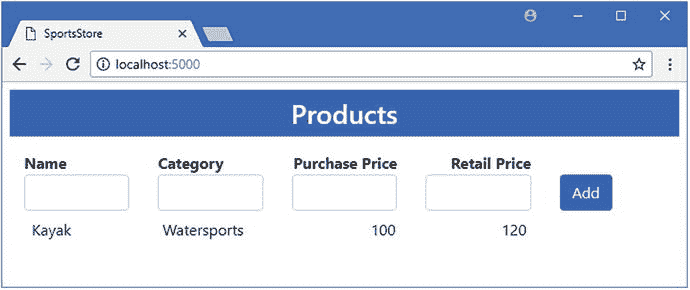
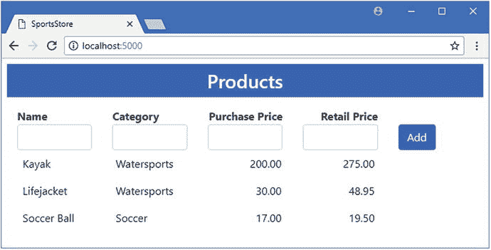

# 五、SportsStore:存储数据

在本章中，我将演示如何将 SportsStore 应用中的数据存储到数据库中。我将向您展示如何将实体框架核心添加到项目中，如何准备数据模型，如何创建和使用数据库，以及如何调整应用以使其能够进行高效的 SQL 查询。我还描述了在向项目中添加实体框架核心时您最可能遇到的问题，并解释了如何解决它们。

## 为本章做准备

我继续使用我在第 4 章[中创建的 SportsStore 项目。本章不需要修改。打开命令提示符或 PowerShell 窗口，导航到 SportsStore 项目文件夹(包含`bower.json`文件的文件夹)，并使用`dotnet run`启动应用。使用浏览器导航至`http://localhost:5000`，您将看到如图](04.html) [5-1](#Fig1) 所示的内容。您可以使用 HTML 表单来存储`Product`对象，但是当应用停止或重启时，它们将会丢失，因为数据只存储在内存中。

Tip

你可以从 [`https://github.com/apress/pro-ef-core-2-for-asp.net-core-mvc`](https://github.com/apress/pro-ef-core-2-for-asp.net-core-mvc) 下载 SportsStore 项目——以及本书所有其他章节的项目。



图 5-1。

Running the example application

## 配置实体框架核心

Visual Studio 为 ASP.NET Core 项目创建的默认配置包括运行实体框架核心应用所需的 NuGet 包。添加管理数据库的命令行工具需要一个单独的包，并且必须手动安装。

在 Solution Explorer 窗口中右键单击 SportsStore 项目项，从弹出菜单中选择 Edit SportsStore.csproj，并添加清单 [5-1](#Par6) 中所示的配置元素。

```cs
<Project Sdk="Microsoft.NET.Sdk.Web">

  <PropertyGroup>
    <TargetFramework>netcoreapp2.0</TargetFramework>
  </PropertyGroup>

  <ItemGroup>
    <Folder Include="wwwroot\" />
  </ItemGroup>

  <ItemGroup>
    <PackageReference Include="Microsoft.AspNetCore.All" Version="2.0.3" />
    <DotNetCliToolReference Include="Microsoft.EntityFrameworkCore.Tools.DotNet"
        Version="2.0.0" />
  </ItemGroup>

</Project>

Listing 5-1.Adding a Package in the SportsStore.csproj File in the SportsStore Folder

```

包含命令行工具的包必须使用`DotNetCliToolReference`元素手动添加。清单中显示的包包括`dotnet ef`命令，这些命令用于管理使用实体框架核心的项目中的数据库。

### 配置实体框架核心日志记录消息

理解 Entity Framework Core 发送给数据库服务器的 SQL 查询和命令非常重要，即使在只存储少量数据的项目中也是如此。为了配置实体框架核心来生成显示它所使用的 SQL 查询的日志消息，我使用 ASP.NET 配置文件项模板将一个名为`appsettings.json`的文件添加到了`SportsStore`文件夹中，并添加了清单 [5-2](#Par9) 中所示的配置语句。

```cs
{
  "ConnectionStrings": {
    "DefaultConnection": "Server=(localdb)\\MSSQLLocalDB;Database=_CHANGE_ME;Trusted_Connection=True;MultipleActiveResultSets=true"
  },
  "Logging": {
    "LogLevel": {
      "Default": "None",
      "Microsoft.EntityFrameworkCore": "Information"
    }
  }
}

Listing 5-2.The Contents of the appsettings.json File in the SportsStore Folder

```

Visual Studio 为这种类型的文件使用的默认内容包括一个数据库的连接字符串，我将很快对此进行更改。清单 [5-2](#Par9) 中突出显示的内容将默认日志级别设置为`None`，这将禁用所有日志消息。然后使用`Information`设置覆盖`Microsoft.EntityFrameworkCore`包，这将提供实体框架核心使用的 SQL 的细节。在实际项目中，您不必禁用所有其他的日志消息，但是这种组合将使遵循示例变得更加容易。

## 准备数据模型

在接下来的小节中，我准备了已经存在于 SportsStore 项目中的数据模型，以便与实体框架核心一起使用。

### 定义主键属性

要在数据库中存储数据，实体框架核心需要能够唯一地标识每个对象，这需要选择一个将用作主键的属性。对于大多数项目来说，定义主键最简单的方法是向数据模型类添加一个名为`Id`的`long`属性，如清单 [5-3](#Par13) 所示。

```cs
namespace SportsStore.Models {

    public class Product {

        public long Id { get; set; }

        public string Name { get; set; }
        public string Category { get; set; }
        public decimal PurchasePrice { get; set; }
        public decimal RetailPrice { get; set; }
    }
}

Listing 5-3.Adding a Primary Key Property in the Product.cs File in the Models Folder

```

这种方法意味着实体框架核心将配置数据库，这样数据库服务器将生成主键值，因此您不必担心避免重复。使用一个`long`值确保有一个大范围的主键值可用，并且意味着大多数项目将能够无限期地存储数据，而不用担心用完键。

### 创建数据库上下文类

实体框架核心依靠数据库上下文类为应用提供对数据库中数据的访问。为了给示例应用提供上下文，我用清单 [5-4](#Par16) 中所示的代码向`Models`文件夹添加了一个名为`DataContext.cs`的类。

```cs
using Microsoft.EntityFrameworkCore;

namespace SportsStore.Models {

    public class DataContext : DbContext {

        public DataContext(DbContextOptions<DataContext> opts) : base(opts) {}

        public DbSet<Product> Products { get; set; }
    }
}

Listing 5-4.The Contents of the DataContext.cs File in the Models Folder

```

当您使用 Entity Framework Core 存储一个简单的数据模型(如 SportsStore 应用中的数据模型)时，数据库上下文类也相应地变得简单——尽管这将随着后面章节中数据模型变得更加复杂而发生变化。目前，数据库上下文类有三个重要的特征。

第一个特点是基类是`DbContext`，它是在`Microsoft.EntityFrameworkCore`名称空间中定义的。使用`DbContext`作为基类就是创建数据库上下文并提供对实体框架核心功能的访问。

第二个特征是构造函数接收一个`DbContextOptions<T>`对象(其中`T`是上下文类)，这个对象必须使用`base`关键字传递给基类的构造函数，就像这样:

```cs
...
public DataContext(DbContextOptions<DataContext> opts) : base(opts) { }
...

```

构造函数参数将为实体框架核心提供连接到数据库服务器所需的配置信息。如果不定义构造函数参数或者不传递对象，将会收到一个错误。

第三个特征是类型为`DbSet<T>`的属性，其中`T`是将要存储在数据库中的类。

```cs
...
public DbSet<Product> Products { get; set; }
...

```

数据模型类是`Product`，所以清单 [5-4](#Par16) 中的属性返回一个`DbSet<Product>`对象。该属性必须用`get`和`set`条款定义。`set`子句允许实体框架核心分配一个对象，该对象提供对数据的方便访问。`get`子句向应用的其余部分提供对该数据的访问。

### 更新存储库实现

下一步是更新存储库实现类，以便通过上一节定义的上下文类访问数据，如清单 [5-5](#Par26) 所示。

```cs
using System.Collections.Generic;

namespace SportsStore.Models {

    public class DataRepository : IRepository {
        //private List<Product> data = new List<Product>();
        private DataContext context;

        public DataRepository(DataContext ctx) => context = ctx;

        public IEnumerable<Product> Products => context.Products;

        public void AddProduct(Product product) {
            this.context.Products.Add(product);
            this.context.SaveChanges();
        }
    }
}

Listing 5-5.Using the Context Class in the DataRepository.cs File in the Models Folder

```

在一个 ASP.NET Core MVC 应用中，对数据上下文对象的访问是使用依赖注入来管理的，我向接收`DataContext`对象的`DataRepository`类添加了一个构造函数，该对象将在运行时由依赖注入来提供。

存储库接口定义的`Products`属性可以通过返回 context 类定义的`DbSet<Product>`属性来实现。类似地，`AddProduct`方法也很容易实现，因为`DbSet<Product>`对象定义了一个接受`Product`对象并持久存储它们的`Add`方法。

最显著的变化是对`SaveChanges`方法的调用，它告诉实体框架核心将任何挂起的操作——比如对`Add`方法存储数据的请求——发送到数据库。

## 准备数据库

在接下来的小节中，我将介绍配置 SportsStore 应用来描述我想要使用的数据库，然后请求 Entity Framework Core 创建它的过程。这就是所谓的代码优先项目，从一个或多个 C# 类开始，用它们来创建和配置数据库。另一种方法被称为数据库优先项目，从现有的数据库中创建一个数据模型——我在第 17 章和第 18 章[中描述了这个过程。](18.html)

### 配置连接字符串

实体框架核心依靠连接字符串来提供如何联系上下文类使用的数据库服务器的细节。连接字符串的格式因您使用的数据库服务器而异，但通常包括数据库服务器的服务器名称和网络端口、数据库名称以及认证凭据。连接字符串在`appsettings.json`文件中定义，在清单 [5-6](#Par33) 中，我为 SportsStore 数据库定义了连接字符串。在本书中，我使用的是 SQL Server 的 LocalDB 版本，它是专门为开发人员设计的，不需要任何配置或凭证。

Tip

您必须确保连接字符串在一个完整的行上。图书页面的固定宽度使得很难显示连接字符串，但是如果您将连接字符串拆分成多行以便于阅读，则会出现错误。

连接字符串的格式特定于每个数据库服务器。对于清单 [5-6](#Par33) 中的连接字符串，有四个配置属性，如表 [5-1](#Tab1) 所述。

表 5-1。

The Four Configuration Properties of the LocalDB Connection String

<colgroup><col> <col></colgroup> 
| 名字 | 描述 |
| --- | --- |
| `Server` | 此属性指定实体框架核心将连接到的数据库服务器的名称。对于 LocalDB，这个值是`(localdb)\\MSSQLLocalDB`，它允许连接到数据库服务器，而不需要任何进一步的配置。 |
| `Database` | 此属性指定实体框架核心将使用的数据库的名称。在清单 [5-6](#Par33) 中，我删除了 Visual Studio 添加到文件中的占位符，并将`SportsStore`指定为名称。 |
| `Trusted_Connection` | 当设置为`true`时，实体框架核心将使用 Windows 帐户凭证向数据库服务器进行验证。LocalDB 不需要这个属性，即使 Visual Studio 在创建`appsettings.json`文件时默认添加了它。 |
| `MultipleActiveResultSets` | 此属性配置与数据库服务器的连接，以便可以同时读取多个查询的结果。 |

```cs
{
  "ConnectionStrings": {
    "DefaultConnection": "Server=(localdb)\\MSSQLLocalDB;Database=SportsStore;Trusted_Connection=True;MultipleActiveResultSets=true"
  },
  "Logging": {
    "LogLevel": {
      "Default": "None",
      "Microsoft.EntityFrameworkCore": "Information"
    }
  }
}

Listing 5-6.Adding a Connection String in the appsettings.json File in the SportsStore Folder

```

### 配置数据库提供程序和上下文类

我将清单 [5-7](#Par36) 中所示的配置语句添加到`Startup`类中，告诉实体框架核心如何使用连接字符串，应该使用哪个数据库提供者，以及如何管理上下文类。

```cs
using System;
using System.Collections.Generic;
using System.Linq;
using System.Threading.Tasks;
using Microsoft.AspNetCore.Builder;
using Microsoft.AspNetCore.Hosting;
using Microsoft.AspNetCore.Http;
using Microsoft.Extensions.DependencyInjection;
using SportsStore.Models;

using Microsoft.EntityFrameworkCore;

using Microsoft.Extensions.Configuration;

namespace SportsStore {
    public class Startup {

        public Startup(IConfiguration config) => Configuration = config;

        public IConfiguration Configuration { get; }

        public void ConfigureServices(IServiceCollection services) {
            services.AddMvc();
            services.AddTransient<IRepository, DataRepository>();
            string conString = Configuration["ConnectionStrings:DefaultConnection"];
            services.AddDbContext<DataContext>(options =>
                options.UseSqlServer(conString));
        }

        public void Configure(IApplicationBuilder app, IHostingEnvironment env) {
            app.UseDeveloperExceptionPage();
            app.UseStatusCodePages();
            app.UseStaticFiles();
            app.UseMvcWithDefaultRoute();
        }
    }
}

Listing 5-7.Configuring Entity Framework Core in the Startup.cs File in the SportsStore Folder

```

构造函数和`Configuration`属性用于访问`appsettings.json`文件中的配置数据，这允许我读取连接字符串。`AddDbContext<T>`扩展方法用于设置上下文类，并告诉实体框架核心使用哪个数据库提供者(在本例中是通过`UseSqlServer`方法，但是每个数据库提供者使用不同的方法),并提供连接字符串。

注意，我还更改了为`IRepository`接口配置依赖注入的方法，如下所示:

```cs
...
services.AddTransient<IRepository, DataRepository>();
...

```

在第 [4](04.html) 章中，我使用了`AddSingleton`方法来确保使用单个`DataRepository`对象来解析对`IRepository`接口的所有依赖，这很重要，因为应用数据存储在`List`中，我希望总是使用相同的对象。现在我正在使用实体框架核心，我已经切换到了`AddTransient`方法，它确保每次解析对`IRepository`的依赖时都会创建一个新的`DataRepository`对象。这很重要，因为实体框架核心希望在 ASP.NET Core MVC 应用中为每个 HTTP 请求创建一个新的上下文对象。

### 创建数据库

前一节中的步骤告诉 Entity Framework Core 我想要存储什么类型的数据以及如何连接到数据库服务器。下一步是创建数据库。

Entity Framework Core 通过一个名为 migrations 的特性来管理数据库，migrations 是创建或修改数据库以使其与数据模型同步的一组更改(我将在第 [13 章](13.html)中详细描述)。要创建将设置数据库的迁移，请打开一个新的命令提示符或 PowerShell 窗口，导航到 SportsStore 项目文件夹(包含`bower.json`文件的文件夹)，并运行清单 [5-8](#Par43) 中所示的命令。

```cs
dotnet ef migrations add Initial

Listing 5-8.Creating a Migration

```

`dotnet ef`命令访问列表 [5-1](#Par6) 中添加的包中的特性。`migrations add`参数告诉实体框架核心创建一个新的迁移，最后一个参数指定迁移的名称`Initial`，这是用于首先准备数据库的迁移的常规名称。

当您运行清单 [5-8](#Par43) 中的命令时，实体框架核心将检查项目，找到上下文类，并使用它来创建迁移。结果将是一个在解决方案资源管理器中可见的`Migrations`文件夹，其中包含其语句将准备数据库的类文件。

仅仅创建迁移是不够的，它只是一组指令。必须执行这些指令来创建数据库，以便它可以存储应用数据。要执行`Initial`迁移中的指令，运行`SportsStore`项目文件夹中清单 [5-9](#Par48) 中所示的命令。

Tip

如果您已经按照本章中的示例进行了操作，并且看到一个错误，告诉您已经有一个名为`Products`的对象，那么在运行清单 [5-9](#Par48) 中的命令之前，运行项目文件夹中的`dotnet ef database drop --force`来删除数据库。

```cs
dotnet ef database update

Listing 5-9.Applying a Migration

```

实体框架核心将连接到连接字符串中指定的数据库服务器，并执行迁移中的语句。结果将是一个可用于存储`Product`对象的数据库。

## 运行应用

持久存储`Product`对象的基本支持已经就绪，应用已经准备好接受测试，尽管还有一些工作要做。使用`SportsStore`项目文件夹中的`dotnet run`启动应用，导航到`http://localhost:5000`，并使用 HTML 表单使用表 [5-2](#Tab2) 中显示的值创建`Product`对象。

表 5-2。

The Values for Creating Test Product Objects

<colgroup><col> <col> <col> <col></colgroup> 
| 名字 | 种类 | 买价 | 零售价 |
| --- | --- | --- | --- |
| 皮船 | 水上运动 | Two hundred | Two hundred and seventy-five |
| 救生衣 | 水上运动 | Thirty | Forty-eight point nine five |
| 英式足球 | 足球 | Seventeen | Nineteen point five |

对每组数据值点击 Add 按钮，Entity Framework Core 会将对象存储在数据库中，产生如图 [5-2](#Fig2) 所示的结果。



图 5-2。

Testing data storage

用户体验保持不变，但是在幕后，数据由实体框架核心存储在数据库中。使用`dotnet run`停止并重启应用，您输入的数据仍然可用。

## 避免查询陷阱

应用正在工作，数据存储在数据库中，但是要从 Entity Framework Core 中获得最佳效果，还有很多工作要做。特别是，有两个常见的陷阱需要避免。这些问题可以通过检查实体框架核心发送给数据库的 SQL 查询来识别，在清单 [5-10](#Par54) 中，我在`Home`控制器的`Index`动作中添加了一条语句，这将有助于使 HTTP 请求触发的查询更容易看到。

```cs
using Microsoft.AspNetCore.Mvc;
using SportsStore.Models;

namespace SportsStore.Controllers {

    public class HomeController : Controller {
        private IRepository repository;

        public HomeController(IRepository repo) => repository = repo;

        public IActionResult Index() {
            System.Console.Clear();
            return View(repository.Products);
        }

        [HttpPost]
        public IActionResult AddProduct(Product product) {
            repository.AddProduct(product);
            return RedirectToAction(nameof(Index));
        }
    }
}

Listing 5-10.Adding a Console Statement in the HomeController.cs File in the Controllers Folder

```

当调用`Index`动作时，`System.Console.Clear`方法将清除控制台，这样来自先前请求的查询将不可见。启动应用，导航到`http://localhost:5000`，检查显示的日志消息。

Note

只有当您使用`dotnet run`从 PowerShell 或命令提示符启动应用时，`System.Console.Clear`方法才会起作用。如果您尝试使用 Visual Studio 调试器启动应用，将会导致异常。

您将看到两条日志消息，显示了发送到数据库的两个查询，如下所示:

```cs
...
SELECT [p].[Id], [p].[Category], [p].[Name], [p].[PurchasePrice], [p].[RetailPrice]
FROM [Products] AS [p]
...
SELECT [p].[Id], [p].[Category], [p].[Name], [p].[PurchasePrice], [p].[RetailPrice]
FROM [Products] AS [p]
...

```

在接下来的部分中，我将解释为什么有两个请求，以及为什么其中一个没有充分利用数据库服务器的能力。

### 了解 IEnumerable <t>陷阱</t>

Entity Framework Core 使得使用 LINQ 查询数据库变得很容易，尽管它并不总是以您预期的方式工作。在`Home`控制器使用的`Index`视图中，我使用 LINQ `Count`方法来确定数据库中存储了多少`Product`对象，如下所示:

```cs
...

@if (Model.Count() == 0) {

    <div class="row">
        <div class="col text-center p-2">No Data</div>
    </div>
} else {
    @foreach (Product p in Model) {
        <div class="row p-2">
            <div class="col">@p.Name</div>
            <div class="col">@p.Category</div>
            <div class="col text-right">@p.PurchasePrice</div>
            <div class="col text-right">@p.RetailPrice</div>
            <div class="col"></div>
        </div>
    }
}
...

```

为了确定数据库中存储了多少产品对象，Entity Framework Core 使用 SQL SELECT 语句获取所有可用的`Product`数据，使用这些数据创建一系列`Product`对象，然后对它们进行计数。计数一完成，`Product`物体就被丢弃。

当数据库中只有三个对象时，这不是问题，但是随着数据量的增加，以这种方式计算对象所需的工作量就成了问题。一种更有效的方法是让数据库服务器进行计数，这将使实体框架核心不必传输所有数据和创建对象。这可以通过对视图模型类型的简单更改来完成，如清单 [5-11](#Par64) 所示。

```cs
@model IQueryable<Product>

<h3 class="p-2 bg-primary text-white text-center">Products</h3>

<div class="container-fluid mt-3">
    <!-- ...other elements omitted for brevity... -->
</div>

Listing 5-11.Changing the View Model in the Index.cshtml File in the Views/Home Folder

```

如果您重新加载浏览器窗口，您将看到实体框架核心发送给数据库服务器的两个查询中的第一个已经更改。

```cs
...

SELECT COUNT(*)

FROM [Products] AS [p]
...
SELECT [p].[Id], [p].[Category], [p].[Name], [p].[PurchasePrice], [p].[RetailPrice]
FROM [Products] AS [p]
...

```

`SELECT COUNT`查询要求数据库服务器对`Product`对象进行计数，并且不在应用中检索数据或创建任何对象。

为不同的视图模型类型获取不同的查询可能看起来是违反直觉的行为，理解为什么会这样对于确保实体框架核心能够高效地查询数据库是至关重要的。

LINQ 是作为一组扩展方法实现的，这些方法对实现了`IEnumerable<T>`接口的对象进行操作。这个接口表示一系列的对象，它是由通用集合类和数组实现的。

实体框架核心包括一组重复的 LINQ 扩展方法，这些方法对实现了`IQueryable<T>`接口的对象进行操作。这个接口表示一个数据库查询，这些重复的方法意味着像对存储在数据库中的数据和内存中的对象一样容易执行像`Count`这样的操作。

在清单 [5-4](#Par16) 中创建的数据库上下文类中使用的`DbSet<T>`类实现了这两个接口，因此例如，`Products`属性实现了`IEnumerable<Product>`和`IQueryable<T>`接口。当`Index`视图中的视图模型被设置为`IEnumerable<Product>`时，使用标准版本的`Count`方法。标准的`Count`实现不理解实体框架核心，只是对序列中的对象进行计数。这触发了`SELECT`查询并产生了低效的行为，所有的数据都被读取并用于创建被计数和丢弃的对象。

当我将视图模型更改为`IQueryable<Product>`时，使用了`Count`方法的实体框架核心版本。这个版本的方法允许 Entity Framework Core 将完整的查询翻译成 SQL，并产生一个更有效的版本，该版本使用`SELECT COUNT`来获得存储对象的数量，而不需要检索任何数据。

Understanding the Razor View Model Cast

您可能会感到惊讶，我可以将视图模型对象视为一个`IQueryable<Product>`对象，尽管 repository 类的`Products`属性的结果是`IEnumerable<T>`。当视图被编译时，Razor 生成的 C# 类包含一个到视图模型指定的类型的显式转换，类似于在 action 方法中包含以下语句:

```cs
...
public IActionResult Index() {
    System.Console.Clear();
    return View(repository.Products as IQueryable<Product>);
}
...

```

在这个例子中，这个特性意味着我可以通过改变`@model`表达式在使用`IQueryable<T>`和`IEnumerable<T>`接口之间切换。类型转换是在运行时完成的，这就是为什么在应用运行之前，控制器提供的对象和视图期望的对象之间的任何不匹配都不会变得明显。

### 了解重复查询陷阱

提高其中一个查询的效率并不能解释为什么首先会有两个查询。正如我在上一节中解释的那样，`DbSet<T>`类实现了`IQueryable<T>`接口，它表示一个数据库查询，并且允许 LINQ 甚至用于数据库中的数据。

默认情况下，实体框架核心不会执行查询，直到枚举了`IQueryable<T>`对象。这使得查询可以逐渐组合，并通过对现有查询调用 LINQ 方法(而不是对其返回的数据)来创建新的查询。但是这种行为也意味着每次枚举一个`IQueryable<T>`时，都会向数据库发送一个新的 SQL 查询。这对某些应用很有帮助，因为这意味着您可以使用同一个对象从数据库中获取最新的数据，但在 apart 核心 MVC 应用中，这通常会导致对同一数据产生多个查询，间隔仅几毫秒。

在示例应用中，`IQueryable<T>`视图模型对象在`Index`视图中被枚举两次，如下所示:

```cs
...

@if (Model.Count() == 0) {

    <div class="row">
        <div class="col text-center p-2">No Data</div>
    </div>
} else {
    @foreach (Product p in Model) {
        <div class="row p-2">
            <div class="col">@p.Name</div>
            <div class="col">@p.Category</div>
            <div class="col text-right">@p.PurchasePrice</div>
            <div class="col text-right">@p.RetailPrice</div>
            <div class="col"></div>
        </div>
    }
}
...

```

不仅仅是`foreach`循环枚举对象序列；产生单个结果的 LINQ 方法，如`Count`方法，也将触发查询。`IQueryable<T>`行为和它在`Index`视图中的使用结合起来产生两个查询。

现在这种情况似乎有所改善，因为这两个查询不再相同，但是进一步的改进是可能的，正如我在下面几节中所描述的。

Avoiding Unintended Queries

从单个`IQueryable<T>`对象触发多个查询没有什么不对，只要这是您想要做的。问题是当你忘记了`IQueryable<T>`对象是如何工作的，把它们当作`IEnumerable<T>`对象，并且在没有注意到的情况下不小心进行了查询。在一个繁忙的应用中，意外查询所浪费的资源可能是巨大的，并且会增加项目的容量成本。

#### 使用 CSS 避免查询

`Index`视图显示了 ASP.NET Core MVC 应用中重复请求的最常见原因之一，其中`Count`方法用于查看是否有任何数据，以便可以向用户显示占位符内容。提供“无数据”占位符的另一种方法是依靠 CSS 让浏览器来负责。在清单 [5-12](#Par84) 中，我在示例应用的视图布局中添加了一个`style`元素，并使用它定义了两个定制样式。

```cs
<!DOCTYPE html>
<html>
<head>
    <meta name="viewport" content="width=device-width" />
    <title>SportsStore</title>
    <link rel="stylesheet" href="∼/lib/bootstrap/dist/css/bootstrap.min.css" />
    <style>
        .placeholder { visibility: collapse; display: none }
        .placeholder:only-child { visibility: visible; display: flex }
    </style>
</head>
<body>
    <div class="p-2">
        @RenderBody()
    </div>
</body>
</html>

Listing 5-12.Defining Styles in the _Layout.cshtml File in the Views/Shared Folder

```

默认情况下，分配给`placeholder`类的 HTML 元素将把它的`visibility`属性设置为`collapse`，把它的`display`属性设置为`none`，这将阻止它被用户看到。但是当 HTML 元素是其包含元素的唯一子元素时，属性值将会改变，这是通过使用`only-child`伪类来实现的。在清单 [5-13](#Par86) 中，我修改了`Home`控制器使用的`Index`视图，删除了对 LINQ `Count`方法的调用，转而依赖 CSS 类。

```cs
@model IQueryable<Product>

<h3 class="p-2 bg-primary text-white text-center">Products</h3>

<div class="container-fluid mt-3">
    <div class="row">
        <div class="col font-weight-bold">Name</div>
        <div class="col font-weight-bold">Category</div>
        <div class="col font-weight-bold text-right">Purchase Price</div>
        <div class="col font-weight-bold text-right">Retail Price</div>
        <div class="col"></div>
    </div>
    <form asp-action="AddProduct" method="post">
        <div class="row">
            <div class="col"><input name="Name" class="form-control" /></div>
            <div class="col"><input name="Category" class="form-control" /></div>
            <div class="col">
                <input name="PurchasePrice" class="form-control" />
            </div>
            <div class="col">
                <input name="RetailPrice" class="form-control" />
            </div>
            <div class="col">
                <button type="submit" class="btn btn-primary">Add</button>
            </div>
        </div>
    </form>
    <div>
        <div class="row placeholder">
            <div class="col text-center p-2">No Data</div>
        </div>
        @foreach (Product p in Model) {
            <div class="row p-2">
                <div class="col">@p.Name</div>
                <div class="col">@p.Category</div>
                <div class="col text-right">@p.PurchasePrice</div>
                <div class="col text-right">@p.RetailPrice</div>
                <div class="col"></div>
            </div>
        }
    </div>
</div>

Listing 5-13.Relying on CSS Classes in the Index.cshtml File in the Views/Home Folder

```

我添加了一个`div`元素，这样`only-child`伪类就可以工作，并删除了`if`子句及其对`Count`方法的调用。结果是分配给`placeholder`类的元素将总是包含在发送到浏览器的 HTML 中，但只有当`foreach`循环没有生成任何元素时才可见，这将在数据库中没有存储`Product`对象时发生。如果您重新加载浏览器窗口，您将会看到现在只有一个查询被发送到数据库。

```cs
...
SELECT [p].[Id], [p].[Category], [p].[Name], [p].[PurchasePrice], [p].[RetailPrice]
FROM [Products] AS [p]
...

```

#### 在存储库中强制执行查询

直接使用`IQueryable<T>`对象的问题是，数据存储是如何实现的细节已经泄露到应用的其他部分，这破坏了 MVC 模式遵循的功能分离感。

Taking a Balanced Approach to Patterns

模式是构建易于理解和测试的项目的有用模板，但是在实现它们时需要一种平衡的方法。你采用模式的哪一部分，忽略哪一部分并不重要——只要你有意识地做出这些决定。

例如，在示例应用中，旨在隐藏数据存储细节的存储库模式与使用实体框架核心的现实之间存在矛盾。

通过将`IQueryable<T>`对象包含到存储库实现类中，我限制了应用必须了解实体框架核心查询的比例。但是它并没有完全做到这一点，因为应用的其余部分仍然需要知道我在清单 [5-13](#Par86) 中定义的主键属性，我将在后面的章节中使用它来识别对象。

对我来说，这是实用性(对象必须唯一标识)和原则(包含存储库的数据存储细节)之间的合理平衡。您可能更喜欢完全避免使用存储库，或者选择更严格地遵守存储库模式(例如，通过使用不同的关键策略，如第 [19](19.html) 章所述)。

另一种方法是让存储库实现类负责处理`IQueryable<T>`对象的异常，并向应用的其余部分提供实现`IEnumerable<T>`接口的内存中对象的常规集合，这些对象可以被枚举，而不用担心意外的影响。在清单 [5-14](#Par95) 中，我修改了存储库类，这样它不再传递由上下文类`Products`属性返回的`DbSet<T>`对象。

```cs
using System.Collections.Generic;

using System.Linq;

namespace SportsStore.Models {

    public class DataRepository : IRepository {
        private DataContext context;

        public DataRepository(DataContext ctx) => context = ctx;

        public IEnumerable<Product> Products => context.Products.ToArray();

        public void AddProduct(Product product) {
            this.context.Products.Add(product);
            this.context.SaveChanges();
        }
    }
}

Listing 5-14.Forcing Query Evaluation in the DataRepository.cs File in the Models Folder

```

LINQ `ToArray`和`ToList`方法触发查询的执行，并产生包含结果的数组或列表。这些是只实现了`IEnumerable<T>`接口的常规内存对象集合，这意味着我必须再次更改`Home`控制器使用的`Index`视图中的视图模型，如清单 [5-15](#Par98) 所示。这也意味着我可以安全地返回到视图中执行多个 LINQ 操作，而不必考虑数据是如何获得的。

Note

这种方法的一个结果是，存储库必须能够为应用的其余部分提供所需的数据，这导致复杂的查询被合并到存储库类中。我倾向于使用这种方法，因为它更容易看到和管理实体框架核心必须处理的所有查询。但那只是我个人的喜好，你要选择最适合自己的方式。

```cs
@model IEnumerable<Product>

<h3 class="p-2 bg-primary text-white text-center">Products</h3>

<div class="container-fluid mt-3">
    <div class="row">
        <div class="col font-weight-bold">Name</div>
        <div class="col font-weight-bold">Category</div>
        <div class="col font-weight-bold text-right">Purchase Price</div>
        <div class="col font-weight-bold text-right">Retail Price</div>
        <div class="col"></div>
    </div>
    <form asp-action="AddProduct" method="post">
        <div class="row">
            <div class="col"><input name="Name" class="form-control" /></div>
            <div class="col"><input name="Category" class="form-control" /></div>
            <div class="col">
                <input name="PurchasePrice" class="form-control" />
            </div>
            <div class="col">
                <input name="RetailPrice" class="form-control" />
            </div>
            <div class="col">
                <button type="submit" class="btn btn-primary">Add</button>
            </div>
        </div>
    </form>
    <div>
        @if (Model.Count() == 0) {
            <div class="row">
                <div class="col text-center p-2">No Data</div>
            </div>
        } else {
            @foreach (Product p in Model) {
                <div class="row p-2">
                    <div class="col">@p.Name</div>
                    <div class="col">@p.Category</div>
                    <div class="col text-right">@p.PurchasePrice</div>
                    <div class="col text-right">@p.RetailPrice</div>
                    <div class="col"></div>
                </div>
            }
        }
    </div>
</div>

Listing 5-15.Changing the View Model in the Index.cshtml File in the Views/Home Folder

```

使用`dotnet run`重启应用，并导航至`http://localhost:5000`；您将看到前面的图中显示的熟悉的输出。在本节中，用户体验并没有改变，但是如果您检查应用生成的日志消息，您将会看到只有一个对数据库的查询，尽管视图模型对象被枚举了两次。

```cs
...
SELECT [p].[Id], [p].[Category], [p].[Name], [p].[PurchasePrice], [p].[RetailPrice]
FROM [Products] AS [p]
...

```

## 常见问题和解决方案

一旦具备了基本特性，使用 Entity Framework Core 存储和检索数据就很简单了，但是还是有一些陷阱需要避免。在接下来的部分中，我将描述您最有可能遇到的问题，并解释如何解决它们。

### 创建或访问数据库时出现问题

当试图创建数据库或从应用访问数据库时，会出现最基本的问题。在很大程度上，这些问题是由错误配置引起的，正如我在下面的部分中解释的那样。

#### “未找到与命令 dotnet-ef 匹配的可执行文件”错误

`dotnet ef`命令用于创建和管理迁移，但它们在默认情况下是不启用的，并且依赖于添加到应用中的包。如果您在尝试运行任何一个`dotnet ef`命令时收到“没有找到可执行文件”的错误，那么打开`.csproj`文件并确保有一个`Microsoft.EntityFrameworkCore.Tools.DotNet`包的`DotNetCliToolReference`引用，如清单 [5-1](#Par6) 所示。

如果您已经添加了包，那么确保您正在运行项目文件夹中的命令，该文件夹包含了`.csproj`文件和`Startup.cs`文件。如果你试图在任何其他文件夹中使用`dotnet ef`，那么。NET Core runtime 将无法找到您正在使用的命令。

#### “构建失败”错误

当您运行`dotnet ef`命令时，项目会自动编译，如果代码中有任何问题，就会报告“build failed”错误，尽管没有提供问题原因的详细信息。

如果您想知道是什么阻止了编译器构建项目，那么运行项目文件夹中的`dotnet build`。然后，您可以解决问题并再次运行`dotnet ef`命令。

Note

在另一个命令提示符或 PowerShell 窗口中使用`dotnet run`启动应用后，尝试运行其中一个`dotnet ef`命令也可能导致此错误。构建过程试图重写由正在运行的应用保持打开的文件，这将导致失败。停止应用，你的`dotnet ef`命令应该会成功。

#### “实体类型需要定义主键”错误

如果您在尝试创建迁移时看到此错误，最可能的原因是您尚未选择主键。对于简单的应用，最好的方法是清单 [5-3](#Par13) 中所示的方法。对于复杂的应用，使用按键的高级功能在第 [19](19.html) 章中描述。

#### “数据库中已经存在名为<name>的对象”异常</name>

当您尝试应用试图创建已经存在的数据库表的迁移时，会发生此异常。当您从项目中删除迁移，重新创建它，然后再次尝试将其应用到数据库时，通常会发生这种情况。数据库已经包含迁移创建的表，这使得迁移无法成功。

这个问题最有可能在开发过程中出现，最简单的解决方案是通过运行项目文件夹中清单 [5-16](#Par111) 中的命令来删除并重新创建数据库。这些命令将删除数据库及其包含的数据，这意味着不应在生产系统上使用它。

```cs
dotnet ef database drop --force
dotnet ef database update

Listing 5-16.Resetting a Database

```

#### “发生了网络相关或特定于实例的错误”异常

此异常告诉您实体框架核心无法联系数据库服务器。该异常最常见的原因是`appsettings.json`文件中的连接字符串有错误。如果您使用 LocalDB 进行开发，那么确保您已经将`Server`配置属性设置为`(localdb)//MSSQLLocalDb`，其中有两个`/`字符，名称的第二部分是`MS_SQL_Local_Db`(但是没有下划线字符)。如果您使用的是完整的 SQL Server 产品，或者完全是另一个数据库服务器，那么请确保您使用了正确的主机名和 TCP 端口，确保主机名解析为正确的 IP 地址，并测试您的网络以确保您可以访问服务器。

#### “无法打开登录请求的数据库”异常

如果您收到此异常，则实体框架核心能够与数据库服务器通信，但要求访问不存在的数据库。首先要检查的是您是否在`appsettings.json`文件的连接字符串中指定了正确的数据库名称。对于 LocalDB(以及完整的 SQL Server 产品)，这意味着正确设置`Database`属性，如清单 [5-6](#Par33) 所示。如果您使用的是不同的数据库服务器，那么请查阅文档以了解应该如何指定数据库名称。

Tip

很难确定应该包含哪些连接字符串，尤其是在切换数据库服务器或提供者包时。 [`https://www.connectionstrings.com`](https://www.connectionstrings.com) 网站为各种数据库服务器和连接选项提供了有用的参考。

如果您输入了正确的数据库名称，则有可能您已经创建了迁移但没有应用它，这意味着数据库服务器从未被要求创建实体框架核心要求访问的数据库。在项目文件夹中运行`dotnet ef database update`来应用迁移。

### 查询数据时出现问题

查询数据时最大的问题是对数据库服务器的重复请求，如“避免查询陷阱”一节所述。但是这并不是唯一可能出现的问题，正如我在下面的章节中解释的那样。

#### “无法映射属性”异常

当您将属性添加到数据模型类，但没有创建和应用迁移来更新数据库时，会发生此异常。有关如何使用迁移来保持数据模型和数据库同步的详细信息，请参见第 [13](13.html) 章。

#### “无效对象名”异常

这个异常通常意味着实体框架核心试图从数据库中不存在的表中查询数据。这是上一节中描述的问题的变体，通常意味着数据库没有更新以反映应用数据模型的变化。参见第 [13](13.html) 章，了解迁移如何工作以及如何管理它们的详细信息。

#### “已经有一个打开的 DataReader”异常

当您试图在读取前一个查询的所有结果之前开始一个查询时，会发生此异常。如果您使用的是 SQL Server，您可以在连接字符串中启用多重活动结果集(MARS)特性，如清单 [5-6](#Par33) 所示。对于其他数据库，您可以使用`ToArray`或`ToList`方法在开始下一个查询之前强制完整读取一个查询。

#### “无法从单例使用范围服务”异常

`Startup`类中的`AddDbContext`方法使用`AddedScoped`方法为上下文类设置依赖注入。这意味着您必须使用`AddTransient`或`AddScoped`方法，如清单 [5-7](#Par36) 所示，来配置任何依赖于上下文类的服务，比如存储库实现类。如果您使用`AddSingleton`方法注册您的服务，当 ASP.NET Core 试图解决依赖关系时，您将会收到一个异常。

#### 过时的上下文数据问题

在 ASP.NET Core MVC 应用中，实体框架核心期望为每个 HTTP 请求创建一个新的上下文对象。然而，一个常见的问题是保持对上下文对象的控制，并试图在后续请求中使用它们。

这带来的问题是，每个实体框架核心上下文对象跟踪它创建的对象，以使用缓存和检测更改。保留上下文对象并重用它们会产生意想不到的结果，因为数据已经过时或不完整。尽管您可能不喜欢为单个请求创建对象，但这已经是应用其余部分使用的模式了 MVC 框架为每个 HTTP 请求创建新的控制器和视图对象——这也是 Entity Framework Core 期望其上下文对象被使用的方式。

### 存储数据时出现问题

在很大程度上，允许 Entity Framework Core 在 MVC 数据模型中存储类的实例只需要很少的修改。然而，有一些常见的问题，我将在下面的章节中描述。

#### 不存储对象

如果应用看起来在工作，但是对象没有存储在数据库中，那么首先要检查的是您是否记得在您的存储库实现类中调用`SaveChanges`方法。实体框架核心只会在调用了`SaveChanges`方法后更新数据库，如果您忘记了，它会自动放弃更改。

#### 只有一些属性值没有被存储

如果只有一些与对象相关的数据值存储在数据库中，那么请确保只使用属性，并且所有属性都有`set`和`get`子句。默认情况下，实体框架核心将只存储属性值，并忽略任何方法或字段。如果您的应用的约束阻止您仅在您的数据模型类中使用属性，那么请参见第 [20](20.html) 章了解高级实体框架核心特性，以更改数据模型类的使用方式。

#### “无法为标识列插入显式值”异常

如果您选择了清单 [5-3](#Par13) 中所示的主键，那么实体框架核心将配置数据库，以便数据库服务器负责生成允许唯一标识对象的值。

这意味着多个应用(或同一个应用的实例)可以共享同一个数据库，而无需协调以避免重复值。这还意味着，如果您试图存储一个新对象，而该对象的键值不是键类型的默认值，将会引发一个异常。对于`Product`类，主键类型是`long`，所以只有当`Id`值为零时，才能存储新对象，这是默认的`long`值。这种异常最常见的原因是在视图中包含了一个用于创建新对象的`input`元素，并允许用户提供一个值，然后由 MVC 模型绑定器使用，并通过实体框架核心传递给数据库。

Tip

如果您不想让数据库服务器为您生成值，请参见第 [19](19.html) 章的高级主键选项。

## 摘要

在本章中，我添加了对在数据库中存储数据和查询数据的支持。我解释了迁移到持久数据存储的过程，并演示了应用所做的查询必须如何适应实体框架核心才能有效地工作。我还描述了将实体框架核心引入现有应用时可能遇到的最常见问题，并告诉您如何解决每个问题。在下一章中，我将向 SportsStore 应用添加修改和删除数据库中数据的功能。