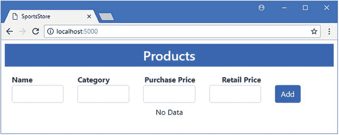
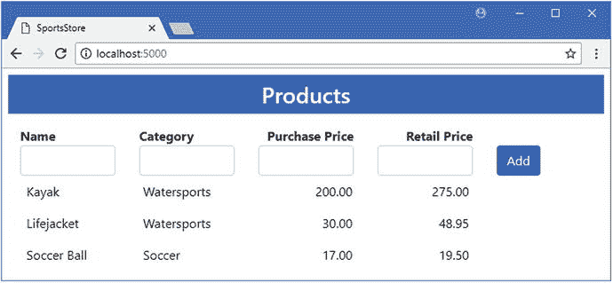
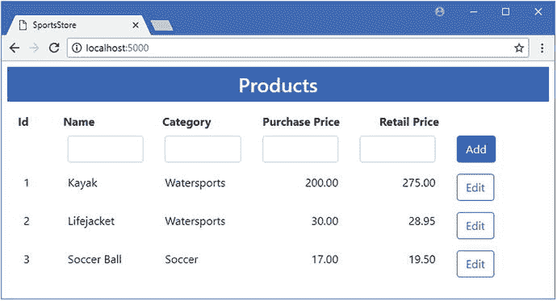
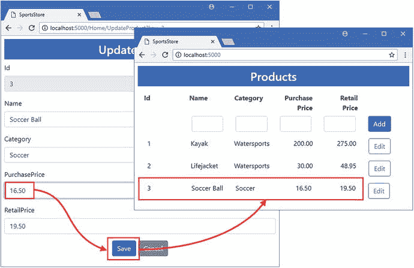
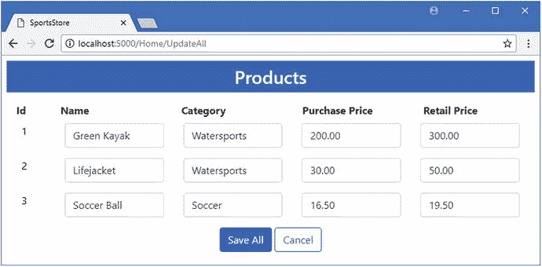
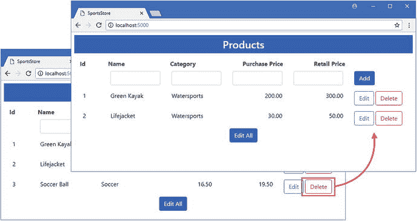

# 六、SportsStore：修改和删除数据

目前，SportsStore 应用可以将`Product`对象存储在数据库中，并执行查询来再次读取它们。大多数应用还要求能够在数据存储后对其进行更改，包括完全删除对象。在这一章中，我添加了对更新和删除`Product`对象的支持。我还描述了在您自己的项目中添加这些特性时可能会遇到的问题，并解释了如何解决这些问题。

## 为本章做准备

在本章中，我继续使用在第 [4](04.html) 章中创建的 SportsStore 项目，并在第 [5](05.html) 章中添加了实体框架核心。在 SportsStore 项目文件夹中运行清单 [6-1](#Par4) 中所示的命令，删除并重新创建数据库，这将有助于确保您从示例中获得预期的结果。

Tip

您可以从本书的 GitHub 资源库: [`https://github.com/apress/pro-ef-core-2-for-asp.net-core-mvc`](https://github.com/apress/pro-ef-core-2-for-asp.net-core-mvc) 下载本章的 SportsStore 项目以及其他章节的项目。

```cs
dotnet ef database drop --force
dotnet ef database update

Listing 6-1.Deleting and Re-creating the Database

```

使用`dotnet run`启动应用，并导航至`http://localhost:5000`；您将看到如图 [6-1](#Fig1) 所示的内容。



图 6-1。

Running the example application

使用表 [6-1](#Tab1) 中的数据值填写 HTML 表格，该表格将为本章中的示例提供数据。

表 6-1。

The Values for Creating Test Product Objects

<colgroup><col> <col> <col> <col></colgroup> 
| 名字 | 种类 | 买价 | 零售价 |
| --- | --- | --- | --- |
| 皮船 | 水上运动 | Two hundred | Two hundred and seventy-five |
| 救生衣 | 水上运动 | Thirty | Forty-eight point nine five |
| 英式足球 | 足球 | Seventeen | Nineteen point five |

当您添加了所有三种产品的详细信息后，您应该会看到如图 [6-2](#Fig2) 所示的结果。



图 6-2。

Adding the test data

## 修改对象

实体框架核心支持许多不同的更新对象的方式，我将在第 [12](12.html) 和 [21](21.html) 章中描述。在这一章中，我从最简单的技术开始，用 MVC 模型绑定器创建的一个对象来完全替换存储在数据库中的对象。

### 更新存储库

首先，我更改了`IRepository`接口，添加了应用的其他部分可以用来检索和更新现有对象的方法，如清单 [6-2](#Par10) 所示。

```cs
using System.Collections.Generic;

namespace SportsStore.Models {

    public interface IRepository {

        IEnumerable<Product> Products { get; }

        Product GetProduct(long key);

        void AddProduct(Product product);

        void UpdateProduct(Product product);
    }
}

Listing 6-2.Adding Methods in the IRepository.cs File in the Models Folder

```

`GetProduct`方法将使用其主键值提供单个`Product`对象。`UpdateProduct`方法接收一个`Product`对象并且不返回结果。在清单 [6-3](#Par12) 中，我已经将新方法添加到存储库实现类中。

```cs
using System.Collections.Generic;
using System.Linq;

namespace SportsStore.Models {

    public class DataRepository : IRepository {
        private DataContext context;

        public DataRepository(DataContext ctx) => context = ctx;

        public IEnumerable<Product> Products => context.Products.ToArray();

        public Product GetProduct(long key) => context.Products.Find(key);

        public void AddProduct(Product product) {
            context.Products.Add(product);
            context.SaveChanges();
        }

        public void UpdateProduct(Product product) {
            context.Products.Update(product);
            context.SaveChanges();
        }
    }
}

Listing 6-3.Adding a Method in the DataRepository.cs File in the Models Folder

```

数据库上下文的`Products`属性返回的`DbSet<Product>`提供了我实现新方法所需的特性。`Find`方法接受一个主键值，并在数据库中查询它所对应的对象。`Update`方法接受一个`Product`对象，并用它来更新数据库，替换数据库中具有相同主键的对象。和所有改变数据库的操作一样，我必须在`Update`方法之后调用`SaveChanges`方法。

Tip

不得不记住调用`SaveChanges`方法可能会很尴尬，但这很快就会成为第二天性，这种方法意味着您可以通过调用上下文对象的方法来设置多个更改，然后通过单个`SaveChanges`调用将它们同时发送到数据库。我会在第 24 章[中详细解释这是如何工作的。](24.html)

### 更新控制器和创建视图

下一步是更新`Home`控制器，这样就有了允许用户选择一个`Product`对象进行编辑并将更改发送到应用的动作方法，如清单 [6-4](#Par16) 所示。我还注释掉了清除控制台的那一行，以便更容易看到实体框架核心为新方法执行的 SQL 查询。

```cs
using Microsoft.AspNetCore.Mvc;
using SportsStore.Models;

namespace SportsStore.Controllers {

    public class HomeController : Controller {
        private IRepository repository;

        public HomeController(IRepository repo) => repository = repo;

        public IActionResult Index() {
            //System.Console.Clear();
            return View(repository.Products);
        }

        [HttpPost]
        public IActionResult AddProduct(Product product) {
            repository.AddProduct(product);
            return RedirectToAction(nameof(Index));
        }

        public IActionResult UpdateProduct(long key) {
            return View(repository.GetProduct(key));
        }

        [HttpPost]
        public IActionResult UpdateProduct(Product product) {
            repository.UpdateProduct(product);
            return RedirectToAction(nameof(Index));
        }
    }
}

Listing 6-4.Adding Actions in the HomeController.cs File in the Controllers Folder

```

您可以看到操作方法是如何映射到存储库提供的特性上，并一直映射到数据库上下文类。为了给控制器提供新动作的视图，我在`Views/Home`文件夹中添加了一个名为`UpdateProduct.cshtml`的文件，其内容如清单 [6-5](#Par18) 所示。

```cs
@model Product

<h3 class="p-2 bg-primary text-white text-center">Update Product</h3>

<form asp-action="UpdateProduct" method="post">
    <div class="form-group">
        <label asp-for="Id"></label>
        <input asp-for="Id" class="form-control" readonly />
    </div>
    <div class="form-group">
        <label asp-for="Name"></label>
        <input asp-for="Name" class="form-control" />
    </div>
    <div class="form-group">
        <label asp-for="Category"></label>
        <input asp-for="Category" class="form-control" />
    </div>
    <div class="form-group">
        <label asp-for="PurchasePrice"></label>
        <input asp-for="PurchasePrice" class="form-control" />
    </div>
    <div class="form-group">
        <label asp-for="RetailPrice"></label>
        <input asp-for="RetailPrice" class="form-control" />
    </div>
    <div class="text-center">
        <button class="btn btn-primary" type="submit">Save</button>
        <a asp-action="Index" class="btn btn-secondary">Cancel</a>
    </div>
</form>

Listing 6-5.The Contents of the UpdateProduct.cshtml in the Views/Home Folder

```

该视图为用户提供了一个 HTML 表单，可以用来改变一个`Product`对象的属性，除了作为主键的`Id`属性。主键一旦被分配就不能轻易更改，如果需要不同的键值，删除一个对象并创建一个新的对象会更简单。出于这个原因，我在`input`元素中添加了`readonly`属性，它显示了`Id`属性的值，但不允许对其进行更改。

为了将更新特性集成到应用的其余部分，我为由`Index`视图显示的每个`Product`对象添加了一个`button`元素，如清单 [6-6](#Par21) 所示。我还在网格中添加了一列来显示`Id`属性。

```cs
@model IEnumerable<Product>

<h3 class="p-2 bg-primary text-white text-center">Products</h3>

<div class="container-fluid mt-3">
    <div class="row">
        <div class="col-1 font-weight-bold">Id</div>
        <div class="col font-weight-bold">Name</div>
        <div class="col font-weight-bold">Category</div>
        <div class="col font-weight-bold text-right">Purchase Price</div>
        <div class="col font-weight-bold text-right">Retail Price</div>
        <div class="col"></div>
    </div>
    <form asp-action="AddProduct" method="post">
        <div class="row p-2">
            <div class="col-1"></div>
            <div class="col"><input name="Name" class="form-control" /></div>
            <div class="col"><input name="Category" class="form-control" /></div>
            <div class="col">
                <input name="PurchasePrice" class="form-control" />
            </div>
            <div class="col">
                <input name="RetailPrice" class="form-control" />
            </div>
            <div class="col">
                <button type="submit" class="btn btn-primary">Add</button>
            </div>
        </div>
    </form>
    <div>
        @if (Model.Count() == 0) {
            <div class="row">
                <div class="col text-center p-2">No Data</div>
            </div>
        } else {
            @foreach (Product p in Model) {
                <div class="row p-2">
                    <div class="col-1">@p.Id</div>
                    <div class="col">@p.Name</div>
                    <div class="col">@p.Category</div>
                    <div class="col text-right">@p.PurchasePrice</div>
                    <div class="col text-right">@p.RetailPrice</div>
                    <div class="col">
                        <a asp-action="UpdateProduct" asp-route-key="@p.Id"
                                class="btn btn-outline-primary">
                            Edit
                        </a>
                    </div>
                </div>
            }
        }
    </div>
</div>

Listing 6-6.Integrating Updates in the Index.cshtml File in the Views/Home Folder

```

使用`dotnet run`启动应用，并导航至`http://localhost:5000`；你会看到新的元素，它们显示了主键，并为每个产品提供了一个编辑按钮，如图 [6-3](#Fig3) 所示。



图 6-3。

Adding elements to the Index view

单击足球产品的编辑按钮，将购买价格字段的值更改为 16.50，然后单击保存按钮。浏览器将把表单数据发送给`Home`控制器上的`UpdateProduct`动作方法，该方法将接收一个由 MVC 模型绑定器创建的`Product`对象。`Product`对象将被传递给数据库上下文类的`Update`方法，当`SaveChanges`方法被调用时，表单数据值将被存储在数据库中，如图 [6-4](#Fig4) 所示。



图 6-4。

Updating an object

如果您检查应用生成的日志消息，您可以看到您执行的操作如何导致 SQL 命令被发送到数据库服务器。当您单击 Edit 按钮时，Entity Framework Core 使用以下命令查询数据库以获得`Soccer Ball`对象的详细信息:

```cs
...
SELECT TOP(1) [e].[Id], [e].[Category], [e].[Name], [e].[PurchasePrice],
    [e].[RetailPrice]
FROM [Products] AS [e]
WHERE [e].[Id] = @__get_Item_0
...

```

我在清单 [6-6](#Par21) 中使用的`Find`方法被翻译成针对单个对象的`SELECT`命令，该命令是使用`TOP`关键字指定的。当您单击“保存”按钮时，实体框架核心使用以下命令更新数据库:

```cs
...
UPDATE [Products] SET [Category] = @p0, [Name] = @p1, [PurchasePrice] = @p2,
    [RetailPrice] = @p3
WHERE [Id] = @p4;
...

```

`Update`方法被转换成 SQL `UPDATE`命令，该命令存储从 HTTP 请求接收到的表单值。

### 仅更新已更改的属性

执行更新的基本构造块已经就绪，但是结果是低效的，因为实体框架核心没有基线来判断什么已经改变，因此除了存储所有属性之外别无选择。要查看问题，请单击其中一个产品的“编辑”按钮，然后单击“保存”而不做任何更改。即使没有新的数据值，应用生成的日志消息显示，由实体框架核心生成的`UPDATE`命令发送由`Product`类定义的所有属性的值。

```cs
...
UPDATE [Products] SET [Category] = @p0, [Name] = @p1, [PurchasePrice] = @p2,
    [RetailPrice] = @p3
WHERE [Id] = @p4;
...

```

实体框架核心包括一个变化检测特性，它可以计算出哪些属性发生了变化。对于像`Product`这样简单的数据模型类来说，这不太可能是一个问题，但是对于更复杂的数据模型来说，检测变化可能很重要。

变更检测功能需要一个基线，可以将从用户处收到的数据与该基线进行比较。提供基线有不同的方法，我在第 [12 章](12.html)中描述过，但我在本章中使用最简单的方法，即查询数据库中的现有数据。在清单 [6-7](#Par34) 中，我已经更新了存储库实现类，这样它就可以在数据库中查询存储的`Product`对象，并使用它来避免更新没有改变的属性。

Tip

查询的成本必须与避免不必要的更新的好处相平衡，但是这种方法简单可靠，并且与 Entity Framework Core 提供的阻止两个用户试图更新相同数据的功能配合得很好，如第 [20](20.html) 章所述。

```cs
using System.Collections.Generic;
using System.Linq;

namespace SportsStore.Models {

    public class DataRepository : IRepository {
        private DataContext context;

        public DataRepository(DataContext ctx) => context = ctx;

        public IEnumerable<Product> Products => context.Products.ToArray();

        public Product GetProduct(long key) => context.Products.Find(key);

        public void AddProduct(Product product) {
            context.Products.Add(product);
            context.SaveChanges();
        }

        public void UpdateProduct(Product product) {
            Product p = GetProduct(product.Id);
            p.Name = product.Name;
            p.Category = product.Category;
            p.PurchasePrice = product.PurchasePrice;
            p.RetailPrice = product.RetailPrice;
            // context.Products.Update(product);
            context.SaveChanges();
        }
    }
}

Listing 6-7.Avoiding Unnecessary Updates in the DataRepository.cs File in the Models Folder

```

这段代码连接了应用中的两个不同特性。实体框架核心对它从查询数据创建的对象执行变更跟踪，而 MVC 模型绑定器从 HTTP 数据创建对象。这两个对象源没有集成，如果不小心将它们分开，就会出现问题。利用变更跟踪的最安全的方法是查询数据库，然后从 HTTP 数据中复制值，就像我在清单中所做的那样。当调用`SaveChanges`方法时，实体框架核心将计算出哪些值被更改，并只更新数据库中的那些属性。

Tip

注意，我已经注释掉了对`Update`方法的调用，当查询提供基线数据时，这是不需要的。

要了解这是如何工作的，使用`dotnet run`启动应用，导航到`http://localhost:5000`，并单击 Kayak 产品的编辑按钮。将零售价格值更改为 300，然后单击保存按钮。检查应用生成的日志消息，您将会看到实体框架核心发送给数据库的`UPDATE`命令只修改被更改的属性。

```cs
...
UPDATE [Products] SET [RetailPrice] = @p0
WHERE [Id] = @p1;
...

```

### 执行批量更新

在应用中，如果有专门的管理角色需要在一次操作中对多个对象进行更改，则通常需要批量更新。更新的确切性质会有所不同，但批量更新的常见原因包括纠正数据输入错误或将对象重新分配到新类别，对单个对象执行这两种操作都很耗时。使用实体框架核心很容易执行批量更新，但是需要一点努力才能使它们与应用的 ASP.NET Core MVC 部分顺利工作。

#### 更新视图和控制器

为了添加对执行批量更新的支持，我更新了`Index`视图以包含一个针对`UpdateAll`动作的 Edit All 按钮。我还添加了一个名为`UpdateAll`的`ViewBag`属性，这将导致在`true`时显示一个名为`InlineEditor.cshtml`的局部视图，如清单 [6-8](#Par41) 所示。

```cs
@model IEnumerable<Product>

<h3 class="p-2 bg-primary text-white text-center">Products</h3>

<div class="container-fluid mt-3">

@if (ViewBag.UpdateAll != true) {

    <div class="row">
        <div class="col-1 font-weight-bold">Id</div>
        <div class="col font-weight-bold">Name</div>
        <div class="col font-weight-bold">Category</div>
        <div class="col font-weight-bold text-right">Purchase Price</div>
        <div class="col font-weight-bold text-right">Retail Price</div>
        <div class="col"></div>
    </div>
    <form asp-action="AddProduct" method="post">
        <div class="row p-2">
            <div class="col-1"></div>
            <div class="col"><input name="Name" class="form-control" /></div>
            <div class="col"><input name="Category" class="form-control" /></div>
            <div class="col">
                <input name="PurchasePrice" class="form-control" />
            </div>
            <div class="col">
                <input name="RetailPrice" class="form-control" />
            </div>
            <div class="col">
                <button type="submit" class="btn btn-primary">Add</button>
            </div>
        </div>
    </form>
    <div>
        @if (Model.Count() == 0) {
            <div class="row">
                <div class="col text-center p-2">No Data</div>
            </div>
        } else {
            @foreach (Product p in Model) {
                <div class="row p-2">
                    <div class="col-1">@p.Id</div>
                    <div class="col">@p.Name</div>
                    <div class="col">@p.Category</div>
                    <div class="col text-right">@p.PurchasePrice</div>
                    <div class="col text-right">@p.RetailPrice</div>
                    <div class="col">
                        <a asp-action="UpdateProduct" asp-route-key="@p.Id"
                                class="btn btn-outline-primary">
                            Edit
                        </a>
                    </div>
                </div>
            }
        }
    </div>
    <div class="text-center">
        <a asp-action="UpdateAll" class="btn btn-primary">Edit All</a>
    </div>

} else {

    @Html.Partial("InlineEditor", Model)

}

</div>

Listing 6-8.Supporting Bulk Updates in the Index.cshtml File in the Views/Home Folder

```

我通过向`Views/Home`文件夹添加一个名为`InlineEditor.cshtml`的文件来创建局部视图，其内容如清单 [6-9](#Par43) 所示。

```cs
@model IEnumerable<Product>

<div class="row">
    <div class="col-1 font-weight-bold">Id</div>
    <div class="col font-weight-bold">Name</div>
    <div class="col font-weight-bold">Category</div>
    <div class="col font-weight-bold">Purchase Price</div>
    <div class="col font-weight-bold">Retail Price</div>
</div>
@{ int i = 0; }
<form asp-action="UpdateAll" method="post">
    @foreach (Product p in Model) {
        <div class="row p-2">
            <div class="col-1">
                @p.Id
                <input type="hidden" name="Products[@i].Id" value="@p.Id" />
            </div>
            <div class="col">
                <input class="form-control" name="Products[@i].Name"
                    value="@p.Name" />
            </div>
            <div class="col">
                <input class="form-control" name="Products[@i].Category"
                    value="@p.Category" />
            </div>
            <div class="col text-right">
                <input class="form-control" name="Products[@i].PurchasePrice"
                    value="@p.PurchasePrice" />
            </div>
            <div class="col text-right">
                <input class="form-control" name="Products[@i].RetailPrice"
                    value="@p.RetailPrice" />
            </div>

        </div>
        i++;
    }
    <div class="text-center m-2">
        <button type="submit" class="btn btn-primary">Save All</button>
        <a asp-action="Index" class="btn btn-outline-primary">Cancel</a>
    </div>
</form>

Listing 6-9.The Contents of the InlineEditor.cshtml File in the Views/Home Folder

```

局部视图创建了一组表单元素，其名称遵循对象集合的 MVC 约定，因此,`Id`属性被命名为`Products[0].Id`、`Products[1].Id`等等。为`input`元素设置名称需要一个计数器，这会产生 Razor 和 C# 表达式的尴尬混合。

在清单 [6-10](#Par46) 中，我向`Home`控制器添加了动作方法，这将允许用户启动批量编辑过程并提交数据。

```cs
using Microsoft.AspNetCore.Mvc;
using SportsStore.Models;

namespace SportsStore.Controllers {

    public class HomeController : Controller {
        private IRepository repository;

        public HomeController(IRepository repo) => repository = repo;

        public IActionResult Index() {
            //System.Console.Clear();
            return View(repository.Products);
        }

        [HttpPost]
        public IActionResult AddProduct(Product product) {
            repository.AddProduct(product);
            return RedirectToAction(nameof(Index));
        }

        public IActionResult UpdateProduct(long key) {
            return View(repository.GetProduct(key));
        }

        [HttpPost]
        public IActionResult UpdateProduct(Product product) {
            repository.UpdateProduct(product);
            return RedirectToAction(nameof(Index));
        }

        public IActionResult UpdateAll() {
            ViewBag.UpdateAll = true;
            return View(nameof(Index), repository.Products);
        }

        [HttpPost]
        public IActionResult UpdateAll(Product[] products) {
            repository.UpdateAll(products);
            return RedirectToAction(nameof(Index));
        }
    }
}

Listing 6-10.Adding Action Methods in the HomeController.cs File in the Controllers Folder

```

`UpdateAll`方法的 POST 版本接受一组`Product`对象，MVC 模型绑定器将从表单数据中创建这些对象，并传递给同名的存储库方法。

#### 更新存储库

在清单 [6-11](#Par49) 中，我向存储库接口添加了一个新方法，它将执行批量更新。

```cs
using System.Collections.Generic;

namespace SportsStore.Models {

    public interface IRepository {

        IEnumerable<Product> Products { get; }

        Product GetProduct(long key);

        void AddProduct(Product product);

        void UpdateProduct(Product product);

        void UpdateAll(Product[] products);
    }
}

Listing 6-11.Adding a Method in the IRepository.cs File in the Models Folder

```

为了完成这个特性，我向存储库实现添加了一个`UpdateAll`方法，该方法使用从 HTTP 请求接收的数据更新数据库，如清单 [6-12](#Par51) 所示。

```cs
using System.Collections.Generic;
using System.Linq;

namespace SportsStore.Models {

    public class DataRepository : IRepository {
        private DataContext context;

        public DataRepository(DataContext ctx) => context = ctx;

        public IEnumerable<Product> Products => context.Products.ToArray();

        public Product GetProduct(long key) => context.Products.Find(key);

        public void AddProduct(Product product) {
            context.Products.Add(product);
            context.SaveChanges();
        }

        public void UpdateProduct(Product product) {
            Product p = GetProduct(product.Id);
            p.Name = product.Name;
            p.Category = product.Category;
            p.PurchasePrice = product.PurchasePrice;
            p.RetailPrice = product.RetailPrice;
            //context.Products.Update(product);
            context.SaveChanges();
        }

        public void UpdateAll(Product[] products) {
            context.Products.UpdateRange(products);
            context.SaveChanges();
        }
    }
}

Listing 6-12.Performing a Bulk Edit in the DataRepository.cs File in the Models Folder

```

`DbSet<T>`类提供了处理单个对象和对象集合的方法。在这个例子中，我使用了`UpdateRange`方法，它是与`Update`方法相对应的集合。当调用`SaveChanges`方法时，实体框架核心将发送一系列 SQL `UPDATE`命令来更新服务器。使用`dotnet run`启动应用，导航到`http://localhost:5000`，点击编辑全部按钮，显示批量编辑功能，如图 [6-5](#Fig5) 所示。



图 6-5。

Editing multiple objects

#### 对批量更新使用更改检测

清单 [6-12](#Par51) 中的代码没有使用实体框架核心变更检测特性，这意味着所有`Product`对象的所有属性都将被更新。为了只更新更改的值，我修改了 repository 类中的`UpdateAll`方法，如清单 [6-13](#Par54) 所示。

```cs
...
public void UpdateAll(Product[] products) {
    //context.Products.UpdateRange(products);

    Dictionary<long, Product> data = products.ToDictionary(p => p.Id);
    IEnumerable<Product> baseline =
        context.Products.Where(p => data.Keys.Contains(p.Id));

    foreach(Product databaseProduct in baseline) {
        Product requestProduct = data[databaseProduct.Id];
        databaseProduct.Name = requestProduct.Name;
        databaseProduct.Category = requestProduct.Category;
        databaseProduct.PurchasePrice = requestProduct.PurchasePrice;
        databaseProduct.RetailPrice = requestProduct.RetailPrice;
    }
    context.SaveChanges();
}
...

Listing 6-13.Using Change Detection in the DataRepository.cs File in the Models Folder

```

执行更新的过程可能很复杂。我首先创建一个从 MVC 模型绑定器接收的`Product`对象的字典，使用键的`Id`属性。我使用键的集合在数据库中查询相应的对象，就像这样:

```cs
...
IEnumerable<Product> baseline =
        context.Products.Where(p => data.Keys.Contains(p.Id));
...

```

我枚举查询对象并从请求对象中复制属性值。当调用`SaveChanges`方法时，实体框架核心执行变化检测，并且只更新那些已经变化的值。使用`dotnet run`启动应用，导航到`http://localhost:5000`，并点击 Edit All 按钮。将第一个产品的名称字段更改为 Green Kayak，并将救生衣的零售价格字段更改为 50。单击 Save All 按钮，检查应用生成的日志消息。为了获得用于变化检测的基线数据，实体框架核心向数据库发送以下查询:

```cs
...
SELECT [p].[Id], [p].[Category], [p].[Name], [p].[PurchasePrice], [p].[RetailPrice]
FROM [Products] AS [p]
WHERE [p].[Id] IN (1, 2, 3)
...

```

从该数据创建的对象用于变化检测。实体框架核心计算出哪些属性具有新值，并向数据库发送两个`UPDATE`命令。

```cs
...
UPDATE [Products] SET [Name] = @p0
WHERE [Id] = @p1;
...
UPDATE [Products] SET [RetailPrice] = @p2
WHERE [Id] = @p3;
...

```

您可以看到第一个命令更改了`Name`值，第二个命令更改了`RetailPrice`值，这对应于使用应用的 MVC 部分所做的更改。

## 删除数据

从数据库中删除对象是一个简单的过程，尽管随着数据模型的增长会变得更加复杂，正如我在第 7 章中解释的那样。在清单 [6-14](#Par63) 中，我已经向存储库接口添加了`Delete`方法。

```cs
using System.Collections.Generic;

namespace SportsStore.Models {

    public interface IRepository {

        IEnumerable<Product> Products { get; }

        Product GetProduct(long key);

        void AddProduct(Product product);

        void UpdateProduct(Product product);

        void UpdateAll(Product[] products);

        void Delete(Product product);
    }
}

Listing 6-14.Adding a Method in the IRepository.cs File in the Models Folder

```

在清单 [6-15](#Par65) 中，我更新了存储库实现类，添加了对`Delete`方法的支持。

```cs
using System.Collections.Generic;
using System.Linq;

namespace SportsStore.Models {

    public class DataRepository : IRepository {
        private DataContext context;

        public DataRepository(DataContext ctx) => context = ctx;

        public IEnumerable<Product> Products => context.Products.ToArray();

        public Product GetProduct(long key) => context.Products.Find(key);

        // ...other methods omitted for brevity...

        public void Delete(Product product) {
            context.Products.Remove(product);
            context.SaveChanges();
        }
    }
}

Listing 6-15.Deleting Objects in the DataRepository.cs File in the Models Folder

```

`DbSet<T>`类有`Remove`和`RemoveRange`方法，用于从数据库中删除一个或多个对象。与修改数据库的其他操作一样，在调用`SaveChanges`方法之前，不会删除任何数据。

在整个应用中，我向`Home`控制器添加了一个动作方法，该方法接收要从 HTTP 请求中删除的`Product`对象的详细信息，并将它们传递给存储库，如清单 [6-16](#Par68) 所示。

```cs
using Microsoft.AspNetCore.Mvc;
using SportsStore.Models;

namespace SportsStore.Controllers {

    public class HomeController : Controller {
        private IRepository repository;

        public HomeController(IRepository repo) => repository = repo;

        // ...other action methods omitted for brevity...

        [HttpPost]
        public IActionResult Delete(Product product) {
            repository.Delete(product);
            return RedirectToAction(nameof(Index));
        }
    }
}

Listing 6-16.Adding an Action Method in the HomeController.cs File in the Controllers Folder

```

为了完成这个特性，我为由`Home`控制器使用的`Index`视图显示的每个`Product`对象添加了一个`form`元素，以便用户可以触发删除，如清单 [6-17](#Par71) 所示。

Tip

该表单包含现有的编辑按钮元素，这样两个按钮就可以在浏览器中并排显示。

```cs
@model IEnumerable<Product>

<h3 class="p-2 bg-primary text-white text-center">Products</h3>

<div class="container-fluid mt-3">
    @if (ViewBag.UpdateAll != true) {
        <div class="row">
            <div class="col-1 font-weight-bold">Id</div>
            <div class="col font-weight-bold">Name</div>
            <div class="col font-weight-bold">Category</div>
            <div class="col font-weight-bold text-right">Purchase Price</div>
            <div class="col font-weight-bold text-right">Retail Price</div>
            <div class="col"></div>
        </div>
        <form asp-action="AddProduct" method="post">
            <div class="row p-2">
                <div class="col-1"></div>
                <div class="col"><input name="Name" class="form-control" /></div>
                <div class="col"><input name="Category" class="form-control" /></div>
                <div class="col">
                    <input name="PurchasePrice" class="form-control" />
                </div>
                <div class="col">
                    <input name="RetailPrice" class="form-control" />
                </div>
                <div class="col">
                    <button type="submit" class="btn btn-primary">Add</button>
                </div>
            </div>
        </form>
        <div>
            @if (Model.Count() == 0) {
                <div class="row">
                    <div class="col text-center p-2">No Data</div>
                </div>
            } else {
                @foreach (Product p in Model) {
                    <div class="row p-2">
                        <div class="col-1">@p.Id</div>
                        <div class="col">@p.Name</div>
                        <div class="col">@p.Category</div>
                        <div class="col text-right">@p.PurchasePrice</div>
                        <div class="col text-right">@p.RetailPrice</div>
                        <div class="col">
                            <form asp-action="Delete" method="post">
                                <a asp-action="UpdateProduct" asp-route-key="@p.Id"
                                   class="btn btn-outline-primary">
                                    Edit
                                </a>
                                <input type="hidden" name="Id" value="@p.Id" />
                                <button type="submit" class="btn btn-outline-danger">
                                    Delete
                                </button>
                            </form>
                        </div>
                    </div>
                }
            }
        </div>
        <div class="text-center">
            <a asp-action="UpdateAll" class="btn btn-primary">Edit All</a>
        </div>
    } else {
        @Html.Partial("InlineEditor", Model)
    }
</div>

Listing 6-17.Adding a Form in the Index.cshtml File in the Views/Home Folder

```

请注意，该表单只包含一个用于`Id`属性的`input`元素。这就是 Entity Framework Core 从数据库中删除对象所使用的全部内容，即使操作是在一个完整的`Product`对象上执行的。我没有发送不需要的额外数据，而是只发送了主键值，MVC 模型绑定器将使用它来创建一个`Product`对象，留下所有其他属性`null`或该类型的默认值。

Note

这是允许向应用的其余部分泄漏多少实现细节的另一个例子。为删除操作只发送一个`Id`值是有效和简单的，但是它依赖于实体框架核心如何工作的知识，这就产生了对数据如何存储的依赖性。另一种选择是不依赖于实体框架核心的行为，但这意味着发送将被忽略的属性值，这将增加应用所需的带宽量。一些设计决策是明确的，但是其他的需要在次优的选择中做出困难的选择。

为了测试删除特性，使用`dotnet run`启动应用，导航到`http://localhost:5000`，并单击足球项目的删除按钮。`Product`对象将从数据库中删除，如图 [6-6](#Fig6) 所示。



图 6-6。

Deleting an object from the database

## 常见问题和解决方案

用于更新和删除数据的实体框架核心特性相当简单，尽管在将这些特性用于由 MVC 模型绑定器从 HTTP 请求中创建的对象时会有困难。在接下来的部分中，我将描述您最有可能遇到的问题，并解释如何解决它们。

### 对象不会被更新或删除

如果应用看起来在工作，但是对象没有被修改，那么首先要检查的是您是否记得在您的存储库实现类中调用`SaveChanges`方法。实体框架核心只会在调用了`SaveChanges`方法后更新数据库，如果您忘记了，它会悄悄地放弃更改。

### “引用未设置为对象的实例”异常

这个异常是由于试图更新一个 primary 属性被设置为`null`或零的对象引起的。这个问题最常见的原因是忘记在用于更新对象的 HTML 表单中包含主键属性的值。虽然您不能更改主键值，但是您必须确保在 HTML 表单中提供一个值。如果不想让用户看到主键值，请使用隐藏的 input 元素。

### “无法跟踪实体类型的实例”异常

当您在使用实体框架核心查询数据库中的同一对象后，使用 MVC 模型绑定器创建的对象调用实体框架核心`Update`方法时，会导致此异常。数据库上下文类跟踪它创建的对象，以使变化检测工作，当你试图引入一个由 MVC 框架创建的冲突对象时，实体框架核心无法处理。

如果没有查询基线数据，只能使用`Update`方法。为了避免这个问题，将 MVC 模型绑定器创建的对象中的属性复制到实体框架核心创建的对象中，如清单 [6-7](#Par34) 所示。

### “属性具有临时值”异常

当您尝试向应用发送 HTTP 请求以删除对象，但忘记包含主键属性值时，会发生此异常。MVC 模型绑定器将创建一个对象，其主键值是属性类型的默认值，用于在存储新对象时，在等待数据库服务器分配值时指示一个临时值。为了防止这种异常，请确保在 HTML 表单中包含提供主键值的 input 元素。输入元素的类型可以设置为`hidden`以防止用户更改值。

### 更新导致零值

如果数值属性被更新设置为零，可能的原因是 HTML 表单不包含该属性的值，或者用户输入的值不能被 MVC 模型绑定器解析为属性数据类型。要解决第一个问题，请确保数据模型类定义的所有属性都有值。要解决第二个问题，当数据值不能被处理时，使用 MVC 验证特性进行部分更新。

## 摘要

在本章中，我添加了对 SportsStore 应用中更新和删除对象的支持。我向您展示了如何修改单个对象和执行批量更新，以及如何为 Entity Framework Core 的变更检测特性提供基线数据。我还向您展示了如何删除数据，这对于一个单类数据模型来说很简单，但是随着数据模型的增长会变得越来越复杂。在下一章中，我将扩展 SportsStore 应用的数据模型。