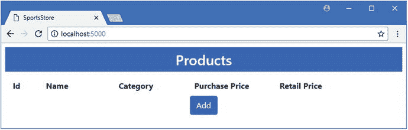
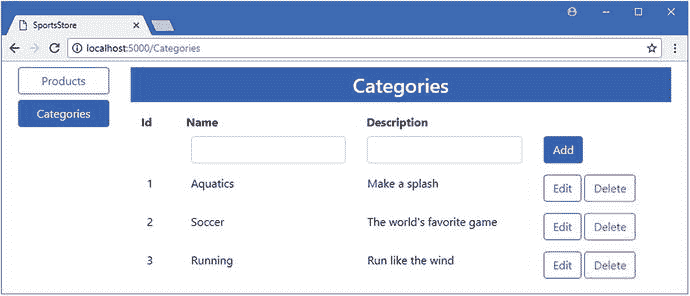
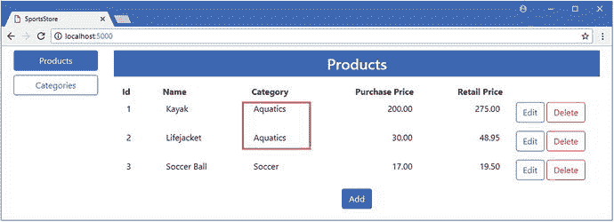
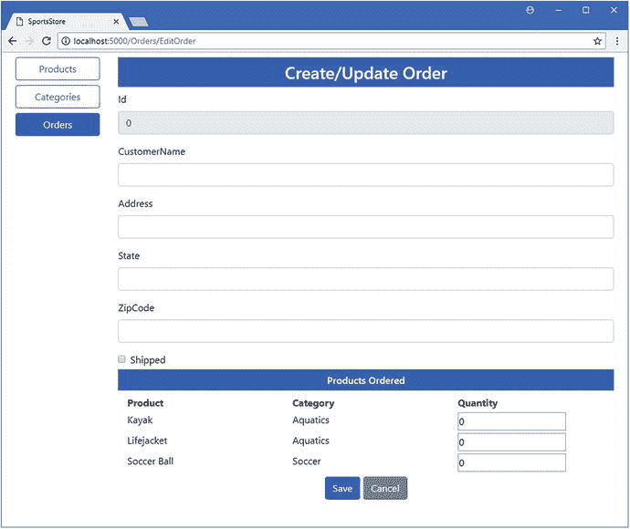
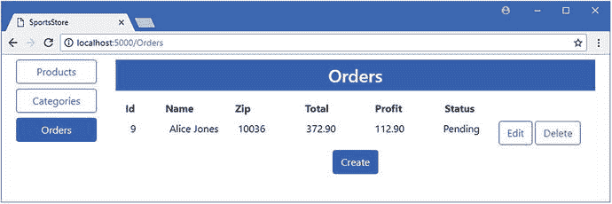

# 七、SportsStore：扩展模型

在这一章中，我将 SportsStore 应用的数据模型扩展到单个`Product`类之外。我将向您展示如何通过用一个单独的类替换一个字符串属性来规范化数据，并解释一旦创建了数据，如何访问它。我还添加了对表示客户订单的支持，这是任何在线商店必不可少的部分。

## 为本章做准备

在本章中，我继续使用在第 [4 章](04.html)中创建的 SportsStore 项目，并在之后的章节中对其进行了修改。为了准备本章，我将把创建和编辑`Product`对象的过程合并到一个视图中。在清单 [7-1](#Par4) 中，我合并了在`Home`控制器中添加或更新`Product`对象的动作方法，并删除了执行批量更新的动作。

Tip

您可以从本书的 GitHub 资源库: [`https://github.com/apress/pro-ef-core-2-for-asp.net-core-mvc`](https://github.com/apress/pro-ef-core-2-for-asp.net-core-mvc) 下载本章的 SportsStore 项目以及其他章节的项目。

```cs
using Microsoft.AspNetCore.Mvc;
using SportsStore.Models;

namespace SportsStore.Controllers {

    public class HomeController : Controller {
        private IRepository repository;

        public HomeController(IRepository repo) => repository = repo;

        public IActionResult Index() {
            return View(repository.Products);
        }

        public IActionResult UpdateProduct(long key) {
            return View(key == 0 ? new Product() : repository.GetProduct(key));
        }

        [HttpPost]
        public IActionResult UpdateProduct(Product product) {
            if (product.Id == 0) {
                repository.AddProduct(product);
            } else {
                repository.UpdateProduct(product);
            }
            return RedirectToAction(nameof(Index));
        }

        [HttpPost]
        public IActionResult Delete(Product product) {
            repository.Delete(product);
            return RedirectToAction(nameof(Index));
        }
    }
}

Listing 7-1.Consolidating Actions in the HomeController.cs File in the Controllers Folder

```

整合的动作依赖于`long`属性的默认值来确定用户是想要修改现有对象还是创建新对象。在清单 [7-2](#Par6) 中，我更新了`Index`视图以反映控制器的变化。

```cs
@model IEnumerable<Product>

<h3 class="p-2 bg-primary text-white text-center">Products</h3>

<div class="container-fluid mt-3">
    <div class="row">
        <div class="col-1 font-weight-bold">Id</div>
        <div class="col font-weight-bold">Name</div>
        <div class="col font-weight-bold">Category</div>
        <div class="col font-weight-bold text-right">Purchase Price</div>
        <div class="col font-weight-bold text-right">Retail Price</div>
        <div class="col"></div>
    </div>    
    @foreach (Product p in Model) {
        <div class="row p-2">
            <div class="col-1">@p.Id</div>
            <div class="col">@p.Name</div>
            <div class="col">@p.Category</div>
            <div class="col text-right">@p.PurchasePrice</div>
            <div class="col text-right">@p.RetailPrice</div>
            <div class="col">
                <form asp-action="Delete" method="post">
                    <a asp-action="UpdateProduct" asp-route-key="@p.Id"
                        class="btn btn-outline-primary">
                        Edit
                    </a>
                    <input type="hidden" name="Id" value="@p.Id" />
                    <button type="submit" class="btn btn-outline-danger">
                        Delete
                    </button>
                </form>
            </div>
        </div>
    }
    <div class="text-center p-2">
        <a asp-action="UpdateProduct" asp-route-key="0"
            class="btn btn-primary">Add</a>
    </div>
</div>

Listing 7-2.Reflecting Controller Changes in the Index.cshtml File in the Views/Home Folder

```

在`SportsStore`项目文件夹中运行清单 [7-3](#Par8) 中所示的命令，删除并重新创建数据库，这将有助于确保您从示例中获得预期的结果。

```cs
dotnet ef database drop --force
dotnet ef database update

Listing 7-3.Deleting and Re-creating the Database

```

使用`dotnet run`启动应用，并导航至`http://localhost:5000`；您将看到如图 [7-1](#Fig1) 所示的内容。不要向数据库添加任何数据，因为它将在下一节中用新的迁移进行更新，现在添加的数据将产生异常。



图 7-1。

Running the example application

## 创建数据模型关系

此时，每个`Product`对象都创建有一个用`string`值表示的`Category`值。在一个真实的项目中，一个打字错误将产品归入一个非预期的类别只是时间问题。为了避免这种问题，可以使用关系来规范化应用的数据，这具有减少重复和确保一致性的效果，正如我在接下来的小节中演示的那样。

### 添加数据模型类

起点是创建一个新的数据模型类。我在`Models`文件夹中添加了一个名为`Category.cs`的文件，并用它来定义清单 [7-4](#Par12) 中所示的类。

```cs
namespace SportsStore.Models {

    public class Category {
        public long Id { get; set; }
        public string Name { get; set; }
        public string Description { get; set; }
    }
}

Listing 7-4.The Contents of the Category.cs File in the Models Folder

```

`Category`类将代表一类产品。`Id`属性是主键属性，`Name`和`Description`属性将由用户在创建新类别并存储到数据库中时提供。

### 建立关系

下一步是创建两个数据模型类之间的关系，这是通过向其中一个类添加属性来完成的。在任何数据关系中，其中一个类被称为依赖实体，属性就是添加到这个类中的。要确定哪个类是依赖实体，问问自己哪种类型的对象不能离开另一个而存在。在 SportsStore 应用中，一个类别可以不包含任何产品，但是我希望每个产品都属于一个类别——这意味着在这种情况下,`Product`类是依赖实体。在清单 [7-5](#Par16) 中，我向`Product`类添加了两个属性，它们创建了与`Category`类的关系。

Tip

如果选择依赖实体目前没有意义，也不要担心。我将在第 [14 章](14.html)中更详细地讨论这个话题，随着您对实体框架核心的经验的积累，您将会对这个概念更加熟悉。

```cs
namespace SportsStore.Models {

    public class Product {

        public long Id { get; set; }

        public string Name { get; set; }
        //public string Category { get; set; }
        public decimal PurchasePrice { get; set; }
        public decimal RetailPrice { get; set; }

        public long CategoryId { get; set; }
        public Category Category { get; set; }
    }
}

Listing 7-5.Adding Relationship Properties in the Product.cs File in the Models Folder

```

我添加的第一个属性叫做`CategoryId`，它是一个外键属性的例子，实体框架核心将使用它通过分配一个标识`Category`对象的主键值来跟踪关系。外键属性的名称由类名加上主键属性名组成，这就是我如何到达`CategoryId`的原因。

第二个属性取代了现有的`Category`属性，是导航属性的一个例子。实体框架核心将用外键属性标识的`Category`对象填充该属性，这使得处理数据库中的数据更加自然。

### 更新上下文并创建存储库

为了访问`Category`对象，我向数据库上下文类添加了一个`DbSet<T>`属性，如清单 [7-6](#Par20) 所示。

```cs
using Microsoft.EntityFrameworkCore;

namespace SportsStore.Models {

    public class DataContext : DbContext {

        public DataContext(DbContextOptions<DataContext> opts) : base(opts) {}

        public DbSet<Product> Products { get; set; }

        public DbSet<Category> Categories { get; set; }
    }
}

Listing 7-6.Adding a Property in the DataContext.cs File in the Models Folder

```

新属性遵循与现有属性相同的模式:它是一个带有`get`和`set`子句的`public`属性，它返回`DbSet<T>`，其中`T`是我想要存储在数据库中的类。

当您扩展数据模型时，您可以通过向现有存储库添加成员或创建新的存储库，为应用的其余部分提供对新数据类型的访问。对于 SportsStore 应用，我将创建一个单独的存储库来演示它是如何完成的。我在`Models`文件夹中添加了一个名为`CategoryRepository.cs`的类文件，并用它来定义清单 [7-7](#Par23) 中所示的接口和实现类。

```cs
using System.Collections.Generic;

namespace SportsStore.Models {

    public interface ICategoryRepository {

        IEnumerable<Category> Categories { get; }

        void AddCategory(Category category);
        void UpdateCategory(Category category);
        void DeleteCategory(Category category);
    }

    public class CategoryRepository : ICategoryRepository {
        private DataContext context;

        public CategoryRepository(DataContext ctx) => context = ctx;

        public IEnumerable<Category> Categories => context.Categories;

        public void AddCategory(Category category) {
            context.Categories.Add(category);
            context.SaveChanges();
        }

        public void UpdateCategory(Category category) {
            context.Categories.Update(category);
            context.SaveChanges();
        }

        public void DeleteCategory(Category category) {
            context.Categories.Remove(category);
            context.SaveChanges();
        }
    }
}

Listing 7-7.The Contents of the CategoryRepository.cs File in the Models Folder

```

我在一个文件中定义了存储库接口和实现类，并使用最简单的方法来执行更新，而不依赖于变更检测特性。在清单 [7-8](#Par25) 中，我在`Startup`类中注册了存储库及其实现，用于依赖注入特性。

```cs
using System;
using System.Collections.Generic;
using System.Linq;
using System.Threading.Tasks;
using Microsoft.AspNetCore.Builder;
using Microsoft.AspNetCore.Hosting;
using Microsoft.AspNetCore.Http;
using Microsoft.Extensions.DependencyInjection;
using SportsStore.Models;
using Microsoft.EntityFrameworkCore;
using Microsoft.Extensions.Configuration;

namespace SportsStore {
    public class Startup {

        public Startup(IConfiguration config) => Configuration = config;

        public IConfiguration Configuration { get; }

        public void ConfigureServices(IServiceCollection services) {
            services.AddMvc();
            services.AddTransient<IRepository, DataRepository>();
            services.AddTransient<ICategoryRepository, CategoryRepository>();
            string conString = Configuration["ConnectionStrings:DefaultConnection"];
            services.AddDbContext<DataContext>(options =>
                options.UseSqlServer(conString));
        }

        public void Configure(IApplicationBuilder app, IHostingEnvironment env) {
            app.UseDeveloperExceptionPage();
            app.UseStatusCodePages();
            app.UseStaticFiles();
            app.UseMvcWithDefaultRoute();
        }
    }
}

Listing 7-8.Registering a Repository in the Startup.cs File in the SportsStore Folder

```

### 创建和应用迁移

实体框架核心不能存储`Category`对象，直到数据库被更新以匹配数据模型中的变化。为了更新数据库，必须创建一个新的迁移并应用于数据库，这可以通过运行`SportsStore`项目文件夹中清单 [7-9](#Par28) 中所示的命令来完成。

Tip

如果您在运行`dotnet ef database update`命令时得到一个异常，那么可能的原因是您在运行清单 [7-3](#Par8) 中的命令后向数据库添加了`Product`数据。再次运行清单 [7-3](#Par8) 中的命令，数据库将被重置并更新为清单 [7-9](#Par28) 中创建的迁移。

```cs
dotnet ef migrations add Categories
dotnet ef database update

Listing 7-9.Creating and Applying a Database Migration

```

第一个命令创建一个名为`Categories`的新迁移，它将包含准备数据库以存储新对象所需的命令。第二个命令执行这些命令来更新数据库。

### 创建控制器和视图

我在`Product`和`Category`类之间创建了一个必需的关系，这意味着每个`Product`必须与一个`Category`对象相关联。有了这种关系，为用户提供管理数据库中的`Category`对象的方法是很有帮助的。我在`Controllers`文件夹中添加了一个名为`CategoriesController.cs`的类文件，并用它来创建清单 [7-10](#Par32) 中所示的控制器。

Tip

必需关系的替代是可选关系，其中一个`Product`对象可以与一个`Category`相关联，但不是必须关联。我将在第 2 部分详细解释如何创建这两种关系。

```cs
using Microsoft.AspNetCore.Mvc;
using SportsStore.Models;

namespace SportsStore.Controllers {

    public class CategoriesController : Controller {
        private ICategoryRepository repository;

        public CategoriesController(ICategoryRepository repo) => repository = repo;

        public IActionResult Index() => View(repository.Categories);

        [HttpPost]
        public IActionResult AddCategory(Category category) {
            repository.AddCategory(category);
            return RedirectToAction(nameof(Index));
        }

        public IActionResult EditCategory(long id) {
            ViewBag.EditId = id;
            return View("Index", repository.Categories);
        }

        [HttpPost]
        public IActionResult UpdateCategory(Category category) {
            repository.UpdateCategory(category);
            return RedirectToAction(nameof(Index));
        }

        [HttpPost]
        public IActionResult DeleteCategory(Category category) {
            repository.DeleteCategory(category);
            return RedirectToAction(nameof(Index));
        }
    }
}

Listing 7-10.The Contents of the CategoriesController.cs File in the Controllers Folder

```

`Categories`控制器接收一个存储库，通过其构造函数访问类别数据，并定义支持查询数据库以及创建、更新和删除`Category`对象的动作。为了给控制器提供一个视图，我创建了`Views/Categories`文件夹，并在其中添加了一个名为`Index.cshtml`的文件，其内容如清单 [7-11](#Par34) 所示。

```cs
@model IEnumerable<Category>

<h3 class="p-2 bg-primary text-white text-center">Categories</h3>

<div class="container-fluid mt-3">
    <div class="row">
        <div class="col-1 font-weight-bold">Id</div>
        <div class="col font-weight-bold">Name</div>
        <div class="col font-weight-bold">Description</div>
        <div class="col-3"></div>
    </div>
    @if (ViewBag.EditId == null) {
        <form asp-action="AddCategory" method="post">
            @Html.Partial("CategoryEditor", new Category())
        </form>
    }
    @foreach (Category c in Model) {
        @if (c.Id == ViewBag.EditId) {
            <form asp-action="UpdateCategory" method="post">
                <input type="hidden" name="Id" value="@c.Id" />
                @Html.Partial("CategoryEditor", c)
            </form>
        } else {
            <div class="row p-2">
                <div class="col-1">@c.Id</div>
                <div class="col">@c.Name</div>
                <div class="col">@c.Description</div>
                <div class="col-3">
                    <form asp-action="DeleteCategory" method="post">
                        <input type="hidden" name="Id" value="@c.Id" />
                        <a asp-action="EditCategory" asp-route-id="@c.Id"
                           class="btn btn-outline-primary">Edit</a>
                        <button type="submit" class="btn btn-outline-danger">
                            Delete
                        </button>
                    </form>
                </div>
            </div>
        }
    }
</div>

Listing 7-11.The Contents of the Index.cshtml File in the Views/Categories Folder

```

该视图提供了一个一体化的界面，用于管理类别，并将对象的创建和编辑委托给局部视图。为了创建局部视图，我在`Views/Categories`文件夹中添加了一个名为`CategoryEditor.cshtml`的文件，并添加了清单 [7-12](#Par36) 中所示的内容。

```cs
@model Category

<div class="row p-2">
    <div class="col-1"></div>
    <div class="col">
        <input asp-for="Name" class="form-control" />
    </div>
    <div class="col">
        <input asp-for="Description" class="form-control" />
    </div>
    <div class="col-3">
        @if (Model.Id == 0) {
            <button type="submit" class="btn btn-primary">Add</button>
        } else {
            <button type="submit" class="btn btn-outline-primary">Save</button>
            <a asp-action="Index" class="btn btn-outline-secondary">Cancel</a>
        }
    </div>
</div>

Listing 7-12.The Contents of the CategoryEditor.cshtml File in the Views/Categories Folder

```

为了便于在应用中移动，我将清单 [7-13](#Par38) 中所示的元素添加到共享布局中。

```cs
<!DOCTYPE html>
<html>
<head>
    <meta name="viewport" content="width=device-width" />
    <title>SportsStore</title>
    <link rel="stylesheet" href="∼/lib/bootstrap/dist/css/bootstrap.min.css" />
    <style>
        .placeholder { visibility: collapse; display: none }
        .placeholder:only-child { visibility: visible; display: flex }
    </style>
</head>
<body>
    <div class="container-fluid">
        <div class="row p-2">
            <div class="col-2">
                <a asp-controller="Home" asp-action="Index"
                        class="@GetClassForButton("Home")">
                    Products
                </a>
                <a asp-controller="Categories" asp-action="Index"
                        class="@GetClassForButton("Categories")">
                    Categories
                </a>
            </div>
            <div class="col">
                @RenderBody()
            </div>
        </div>
    </div>
</body>
</html>

@functions {

    string GetClassForButton(string controller) {
        return "btn btn-block " + (ViewContext.RouteData.Values["controller"]
            as string == controller ? "btn-primary" : "btn-outline-primary");
    }

}

Listing 7-13.Adding Elements in the _Layout.cshtml File in the Views/Shared Folder

```

我添加了选择`Product`和`Categories`控制器的按钮，这个简单的内嵌函数使用 Bootstrap CSS 样式来突出显示当前显示的控制器的按钮。

Note

我不经常使用内联 Razor 函数，因为我更喜欢将所有 C# 代码保存在类文件中。但是在这种情况下，函数的好处是保持示例的简洁，并且它只与视图中的内容相关，比创建视图组件更容易。

### 用类别填充数据库

在完成数据关系时，有一些数据要处理会很有帮助。使用`dotnet run`启动应用，单击 Categories 按钮，并使用 HTML 表单使用表 [7-1](#Tab1) 中的值创建类别。

表 7-1。

The Data Values for Creating Categories

<colgroup><col> <col></colgroup> 
| 名字 | 描述 |
| --- | --- |
| 水上运动 | 发出溅泼声 |
| 足球 | 世界上最受欢迎的游戏 |
| 运转 | 像风一样跑 |

添加完所有三个类别后，您应该会看到如图 [7-2](#Fig2) 所示的内容。



图 7-2。

Adding category data to the application

## 使用数据关系

处理`Product`对象的应用部分必须更新，以反映数据库中的新关系。这个过程有两个部分:在查询数据库时包含类别数据，在创建或编辑产品时允许用户选择一个类别。

### 使用相关数据

实体框架核心忽略关系，除非您在查询中显式包含它们。这意味着由`Product`类定义的`Category`等导航属性将默认保留为`null`。`Include`扩展方法用于告诉实体框架核心用相关数据填充导航属性，并在表示查询的`IQueryable<T>`对象上调用。在清单 [7-14](#Par45) 中，我使用了`Include`方法将相关的`Category`对象包含在产品存储库所做的查询中。

```cs
using System.Collections.Generic;
using System.Linq;

using Microsoft.EntityFrameworkCore;

namespace SportsStore.Models {

    public class DataRepository : IRepository {
        private DataContext context;

        public DataRepository(DataContext ctx) => context = ctx;

        public IEnumerable<Product> Products => context.Products
            .Include(p => p.Category).ToArray();

        public Product GetProduct(long key) => context.Products
            .Include(p => p.Category).First(p => p.Id == key);

        public void AddProduct(Product product) {
            context.Products.Add(product);
            context.SaveChanges();
        }

        public void UpdateProduct(Product product) {
            Product p = context.Products.Find(product.Id);
            p.Name = product.Name;
            //p.Category = product.Category;
            p.PurchasePrice = product.PurchasePrice;
            p.RetailPrice = product.RetailPrice;
            p.CategoryId = product.CategoryId;
            context.SaveChanges();
        }

        public void UpdateAll(Product[] products) {
            Dictionary<long, Product> data = products.ToDictionary(p => p.Id);
            IEnumerable<Product> baseline =
                context.Products.Where(p => data.Keys.Contains(p.Id));

            foreach(Product databaseProduct in baseline) {
                Product requestProduct = data[databaseProduct.Id];
                databaseProduct.Name = requestProduct.Name;
                databaseProduct.Category = requestProduct.Category;
                databaseProduct.PurchasePrice = requestProduct.PurchasePrice;
                databaseProduct.RetailPrice = requestProduct.RetailPrice;
            }
            context.SaveChanges();
        }

        public void Delete(Product product) {
            context.Products.Remove(product);
            context.SaveChanges();
        }
    }
}

Listing 7-14.Including Related Data in the DataRepository.cs File in the Models Folder

```

`Include`方法在`Microsoft.EntityFrameworkCore`名称空间中定义，它接受一个 lambda 表达式，该表达式选择您希望实体框架核心包含在查询中的导航属性。我用于`GetProduct`方法的`Find`方法不能与`Include`方法一起使用，所以我用`First`方法代替了它，达到了同样的效果。这些变化的结果是，实体框架核心将为由`Products`属性和`GetProduct`方法创建的`Product`对象填充`Product.Category`导航属性。

请注意我对`UpdateProduct`方法所做的更改。首先，我直接查询基线数据，而不是通过`GetProduct`方法，因为我不想在执行更新时加载相关数据。其次，我注释掉了设置`Category`属性的语句，并添加了一条设置`CategoryId`属性的语句。设置外键属性是 Entity Framework Core 更新数据库中两个对象之间的关系所需的全部工作。

### 为产品选择类别

在清单 [7-15](#Par49) 中，我已经更新了`Home`控制器，这样它就可以通过存储库访问`Category`数据，并将数据传递给它的视图。这将允许视图在编辑或创建一个`Product`对象时从完整的类别集中进行选择。

```cs
using Microsoft.AspNetCore.Mvc;
using SportsStore.Models;

namespace SportsStore.Controllers {

    public class HomeController : Controller {
        private IRepository repository;
        private ICategoryRepository catRepository;

        public HomeController(IRepository repo, ICategoryRepository catRepo) {
            repository = repo;
            catRepository = catRepo;
        }

        public IActionResult Index() {
            return View(repository.Products);
        }

        public IActionResult UpdateProduct(long key) {
            ViewBag.Categories = catRepository.Categories;
            return View(key == 0 ? new Product() : repository.GetProduct(key));
        }

        [HttpPost]
        public IActionResult UpdateProduct(Product product) {
            if (product.Id == 0) {
                repository.AddProduct(product);
            } else {
                repository.UpdateProduct(product);
            }
            return RedirectToAction(nameof(Index));
        }

        [HttpPost]
        public IActionResult Delete(Product product) {
            repository.Delete(product);
            return RedirectToAction(nameof(Index));
        }
    }
}

Listing 7-15.Using Category Data in the HomeController.cs File in the Controllers Folder

```

为了允许用户在创建或编辑`Product`时选择一个类别，我在`UpdateProduct`视图中添加了一个`select`元素，如清单 [7-16](#Par51) 所示。

```cs
@model Product

<h3 class="p-2 bg-primary text-white text-center">Update Product</h3>

<form asp-action="UpdateProduct" method="post">
    <div class="form-group">
        <label asp-for="Id"></label>
        <input asp-for="Id" class="form-control" readonly />
    </div>
    <div class="form-group">
        <label asp-for="Name"></label>
        <input asp-for="Name" class="form-control" />
    </div>
    <div class="form-group">
        <label asp-for="Category"></label>
        <select class="form-control" asp-for="CategoryId">
            @if (Model.Id == 0) {
                <option disabled selected>Choose Category</option>
            }
            @foreach (Category c in ViewBag.Categories) {
                <option selected=@(Model.Category?.Id == c.Id)
                     value="@c.Id">@c.Name</option>
            }
        </select>
    </div>
    <div class="form-group">
        <label asp-for="PurchasePrice"></label>
        <input asp-for="PurchasePrice" class="form-control" />
    </div>
    <div class="form-group">
        <label asp-for="RetailPrice"></label>
        <input asp-for="RetailPrice" class="form-control" />
    </div>
    <div class="text-center">
        <button class="btn btn-primary" type="submit">Save</button>
        <a asp-action="Index" class="btn btn-secondary">Cancel</a>
    </div>
</form>

Listing 7-16.Displaying Categories in the UpdateProduct.html File in the Views/Home Folder

```

如果视图被用来创建一个新的`Product`对象，我将包含一个占位符`option`元素；如果一个现有的对象正在被编辑，我将使用一个 Razor 表达式来应用`selected`属性。

剩下的工作就是更新`Index`视图以遵循导航属性并显示每个`Product`对象的所选类别的名称，如清单 [7-17](#Par54) 所示。

```cs
@model IEnumerable<Product>

<h3 class="p-2 bg-primary text-white text-center">Products</h3>

<div class="container-fluid mt-3">
    <div class="row">
        <div class="col-1 font-weight-bold">Id</div>
        <div class="col font-weight-bold">Name</div>
        <div class="col font-weight-bold">Category</div>
        <div class="col font-weight-bold text-right">Purchase Price</div>
        <div class="col font-weight-bold text-right">Retail Price</div>
        <div class="col"></div>
    </div>    
    @foreach (Product p in Model) {
        <div class="row p-2">
            <div class="col-1">@p.Id</div>
            <div class="col">@p.Name</div>
            <div class="col">@p.Category.Name</div>
            <div class="col text-right">@p.PurchasePrice</div>
            <div class="col text-right">@p.RetailPrice</div>
            <div class="col">
                <form asp-action="Delete" method="post">
                    <a asp-action="UpdateProduct" asp-route-key="@p.Id"
                        class="btn btn-outline-primary">
                        Edit
                    </a>
                    <input type="hidden" name="Id" value="@p.Id" />
                    <button type="submit" class="btn btn-outline-danger">
                        Delete
                    </button>
                </form>
            </div>
        </div>
    }
    <div class="text-center p-2">
        <a asp-action="UpdateProduct" asp-route-key="0"
             class="btn btn-primary">Add</a>
    </div>
</div>

Listing 7-17.Following a Navigation Property in the Index.cshtml File in the Views/Home Folder

```

### 创建和编辑带有类别的产品

使用`dotnet run`启动应用，导航到`http://localhost:5000`，点击添加按钮，并使用表格 [7-2](#Tab2) 中显示的数据，使用表格创建`Product`对象。创建每个对象时，使用`select`元素从列表中选择类别。

表 7-2。

The Values for Creating Test Product Objects

<colgroup><col> <col> <col> <col></colgroup> 
| 名字 | 种类 | 买价 | 零售价 |
| --- | --- | --- | --- |
| 皮船 | 水上运动 | Two hundred | Two hundred and seventy-five |
| 救生衣 | 水上运动 | Thirty | Forty-eight point nine five |
| 英式足球 | 足球 | Seventeen | Nineteen point five |

当您创建每个对象时，将执行`Index`动作以显示结果，这将导致实体框架核心查询数据库以获得`Product`数据及其相关的`Category`对象。通过检查应用生成的日志消息，您可以看到这是如何转换成 SQL 查询的，如下所示:

```cs
...
SELECT [p].[Id], [p].[CategoryId], [p].[Name], [p].[PurchasePrice],
    [p].[RetailPrice], [p.Category].[Id], [p.Category].[Description],
    [p.Category].[Name]
FROM [Products] AS [p]
INNER JOIN [Categories] AS [p.Category] ON [p].[CategoryId] = [p.Category].[Id]
...

```

实体框架核心使用外键来查询创建与每个`Product`相关的`Category`对象所需的数据，并使用内部连接来组合来自`Products`和`Categories`表的数据。

一旦创建了所有三个`Product`对象，单击`Categories`，单击`Watersports`类别的编辑按钮，并将`Name`字段的值更改为`Aquatics`。点击保存按钮，然后点击产品，你会看到被编辑类别中的两个`Product`对象都以新名称显示，如图 [7-3](#Fig3) 所示。

Caution

如果删除一个`Category`对象，那么与之相关的`Product`对象也将被删除，这是所需关系的默认配置。我会在第 22 章[中解释这是如何工作的以及可选的配置选项。](22.html)



图 7-3。

The effect of changing a category name

## 添加对订单的支持

为了演示更复杂的关系，我将添加对创建和存储订单的支持，并使用它们来表示客户选择的产品。在接下来的小节中，我将使用额外的类扩展数据模型，更新数据库，并添加一个控制器来管理新数据。

### 创建数据模型类

我首先将一个名为`Order.cs`的文件添加到`Models`文件夹中，并使用它来定义清单 [7-18](#Par63) 中所示的类。

```cs
using System.Collections.Generic;

namespace SportsStore.Models {

    public class Order {
        public long Id { get; set; }
        public string CustomerName { get; set; }
        public string Address { get; set; }
        public string State { get; set; }
        public string ZipCode { get; set; }
        public bool Shipped { get; set; }

        public IEnumerable<OrderLine> Lines { get; set; }
    }
}

Listing 7-18.The Contents of the Order.cs File in the Models Folder

```

`Order`类具有存储客户姓名和地址以及产品是否已经发货的属性。还有一个导航属性，它提供对相关的`OrderLine`对象的访问，这些对象将代表一个单独的产品选择。为了创建这个类，我在`Models`文件夹中添加了一个名为`OrderLine.cs`的文件，代码如清单 [7-19](#Par65) 所示。

```cs
namespace SportsStore.Models {

    public class OrderLine {
        public long Id { get; set; }

        public long ProductId { get; set; }
        public Product Product { get; set; }

        public int Quantity { get; set; }

        public long OrderId { get; set; }
        public Order Order { get; set; }
    }
}

Listing 7-19.The Contents of the OrderLine.cs File in the Models Folder

```

每一个`OrderLine`对象都与一个`Order`和一个`Product`相关，并且有一个属性表明客户需要多少产品。为了方便访问`Order`数据，我将清单 [7-20](#Par67) 中所示的属性添加到上下文类中。

```cs
using Microsoft.EntityFrameworkCore;

namespace SportsStore.Models {

    public class DataContext : DbContext {

        public DataContext(DbContextOptions<DataContext> opts) : base(opts) {}

        public DbSet<Product> Products { get; set; }

        public DbSet<Category> Categories { get; set; }

        public DbSet<Order> Orders { get; set; }
        public DbSet<OrderLine> OrderLines { get; set; }
    }
}

Listing 7-20.Adding Properties in the DataContext.cs File in the Models Folder

```

### 创建存储库和准备数据库

为了向应用的其余部分提供对新数据的一致访问，我在`Models`文件夹中添加了一个名为`IOrdersRepository.cs`的文件，并用它来定义清单 [7-21](#Par69) 中所示的接口。

```cs
using System.Collections.Generic;

namespace SportsStore.Models {

    public interface IOrdersRepository {

        IEnumerable<Order> Orders { get; }
        Order GetOrder(long key);
        void AddOrder(Order order);
        void UpdateOrder(Order order);
        void DeleteOrder(Order order);
    }
}

Listing 7-21.The Contents of the IOrdersRepository.cs File in the Models Folder

```

接下来，我将一个名为`OrdersRepository.cs`的文件添加到`Models`文件夹中，并使用它来创建清单 [7-22](#Par71) 中所示的实现类。

```cs
using Microsoft.EntityFrameworkCore;
using System.Collections.Generic;
using System.Linq;

namespace SportsStore.Models {

    public class OrdersRepository : IOrdersRepository {
        private DataContext context;

        public OrdersRepository(DataContext ctx) => context = ctx;

        public IEnumerable<Order> Orders => context.Orders
            .Include(o => o.Lines).ThenInclude(l => l.Product);

        public Order GetOrder(long key) => context.Orders
            .Include(o => o.Lines).First(o => o.Id == key);

        public void AddOrder(Order order) {
            context.Orders.Add(order);
            context.SaveChanges();
        }

        public void UpdateOrder(Order order) {
            context.Orders.Update(order);
            context.SaveChanges();
        }

        public void DeleteOrder(Order order) {
            context.Orders.Remove(order);
            context.SaveChanges();
        }
    }
}

Listing 7-22.The Contents of the OrdersRepository.cs File in the Models Folder

```

存储库实现遵循为其他存储库建立的模式，为了简单起见，放弃了变更检测。注意使用`Include`和`ThenInclude`方法在数据模型中导航并将相关数据添加到查询中——我在第[14](14.html)—[16](16.html)章中详细描述了这个过程。

在清单 [7-23](#Par74) 中，我向`Startup`类添加了一条语句，这样依赖注入系统将使用瞬态`OrderRepository`对象来解析`IOrderRepository`接口上的依赖。

```cs
using System;
using System.Collections.Generic;
using System.Linq;
using System.Threading.Tasks;
using Microsoft.AspNetCore.Builder;
using Microsoft.AspNetCore.Hosting;
using Microsoft.AspNetCore.Http;
using Microsoft.Extensions.DependencyInjection;
using SportsStore.Models;
using Microsoft.EntityFrameworkCore;
using Microsoft.Extensions.Configuration;

namespace SportsStore {
    public class Startup {

        public Startup(IConfiguration config) => Configuration = config;

        public IConfiguration Configuration { get; }

        public void ConfigureServices(IServiceCollection services) {
            services.AddMvc();
            services.AddTransient<IRepository, DataRepository>();
            services.AddTransient<ICategoryRepository, CategoryRepository>();
            services.AddTransient<IOrdersRepository, OrdersRepository>();
            string conString = Configuration["ConnectionStrings:DefaultConnection"];
            services.AddDbContext<DataContext>(options =>
                options.UseSqlServer(conString));
        }

        public void Configure(IApplicationBuilder app, IHostingEnvironment env) {
            app.UseDeveloperExceptionPage();
            app.UseStatusCodePages();
            app.UseStaticFiles();
            app.UseMvcWithDefaultRoute();
        }
    }
}

Listing 7-23.Configuring Dependency Injection in the Startup.cs File in the SportsStore Folder

```

在`SportsStore`项目文件夹中运行清单 [7-24](#Par76) 中所示的命令，通过创建和应用实体框架核心迁移来准备数据库以存储新的数据模型类。

```cs
dotnet ef migrations add Orders
dotnet ef database update

Listing 7-24.Creating and Applying a New Database Migration

```

### 创建控制器和视图

所有的实体框架核心管道都已就绪，可以处理`Order`对象，下一步是添加 MVC 特性，允许创建和管理实例。我在`Controllers`文件夹中添加了一个名为`OrdersController.cs`的类文件，并用它来定义清单 [7-25](#Par78) 中所示的控制器。我已经省略了`AddOrUpdateOrder`方法的代码，我将在其他特性就绪后完成。

```cs
using Microsoft.AspNetCore.Mvc;
using SportsStore.Models;
using System.Collections.Generic;
using System.Linq;

namespace SportsStore.Controllers {

    public class OrdersController : Controller {
        private IRepository productRepository;
        private IOrdersRepository ordersRepository;

        public OrdersController(IRepository productRepo,
                IOrdersRepository orderRepo) {
            productRepository = productRepo;
            ordersRepository = orderRepo;
        }

        public IActionResult Index() => View(ordersRepository.Orders);

        public IActionResult EditOrder(long id) {
            var products = productRepository.Products;
            Order order = id == 0 ? new Order() : ordersRepository.GetOrder(id);
            IDictionary<long, OrderLine> linesMap
                = order.Lines?.ToDictionary(l => l.ProductId)
                ?? new Dictionary<long, OrderLine>();
            ViewBag.Lines = products.Select(p => linesMap.ContainsKey(p.Id)
                ? linesMap[p.Id]
                 : new OrderLine { Product = p, ProductId = p.Id, Quantity = 0 });
            return View(order);
        }

        [HttpPost]
        public IActionResult AddOrUpdateOrder(Order order) {

            // ...action method to be completed...

            return RedirectToAction(nameof(Index));
        }

        [HttpPost]
        public IActionResult DeleteOrder(Order order) {
            ordersRepository.DeleteOrder(order);
            return RedirectToAction(nameof(Index));
        }
    }
}

Listing 7-25.The Contents of the OrdersController.cs File in the Controllers Folder

```

`EditOrder`动作方法中的 LINQ 语句可能看起来很复杂，但是它们准备了`OrderLine`数据，以便每个`Product`都有一个对象，即使该产品以前没有选择过。

对于一个新订单，这意味着`ViewBag.Lines`属性将由一系列`OrderLine`对象填充，对应于数据库中的每个`Product`，而`Id`和`Quantity`属性被设置为零。当对象存储在数据库中时，零`Id`值将指示这是新对象，并且数据库服务器将分配新的唯一主键。

对于现有订单，`ViewBag.Lines`属性将用从数据库中读取的`OrderLine`对象填充，用剩余产品的零`Id`属性的额外对象填充。

这种结构利用了 ASP.NET Core MVC 和实体框架核心相结合的方式，并简化了更新数据库的过程，当您完成示例的其余部分时，您将会看到这一点。

下一步是创建一个视图，该视图将列出数据库中的所有对象。我创建了`Views/Orders`文件夹，并在其中添加了一个名为`Index.cshtml`的文件，其内容如清单 [7-26](#Par84) 所示。

```cs
@model  IEnumerable<Order>

<h3 class="p-2 bg-primary text-white text-center">Orders</h3>

<div class="container-fluid mt-3">
    <div class="row">
        <div class="col-1 font-weight-bold">Id</div>
        <div class="col font-weight-bold">Name</div>
        <div class="col font-weight-bold">Zip</div>
        <div class="col font-weight-bold">Total</div>
        <div class="col font-weight-bold">Profit</div>
        <div class="col-1 font-weight-bold">Status</div>
        <div class="col-3"></div>
    </div>
    <div>
        <div class="row placeholder p-2"><div class="col-12 text-center">
            <h5>No Orders</h5>
        </div></div>
        @foreach (Order o in Model) {

            <div class="row p-2">
                <div class="col-1">@o.Id</div>
                <div class="col">@o.CustomerName</div>
                <div class="col">@o.ZipCode</div>
                <div class="col">@o.Lines.Sum(l => l.Quantity
                     * l.Product.RetailPrice)</div>
                <div class="col">@o.Lines.Sum(l => l.Quantity
                     * (l.Product.RetailPrice - l.Product.PurchasePrice))</div>
                <div class="col-1">@(o.Shipped ? "Shipped" : "Pending")</div>
                <div class="col-3 text-right">
                    <form asp-action="DeleteOrder" method="post">
                        <input type="hidden" name="Id" value="@o.Id" />
                        <a asp-action="EditOrder" asp-route-id="@o.Id"
                           class="btn btn-outline-primary">Edit</a>
                        <button type="submit" class="btn btn-outline-danger">
                            Delete
                        </button>
                    </form>
                </div>
            </div>
        }
    </div>
</div>
<div class="text-center">
    <a asp-action="EditOrder" class="btn btn-primary">Create</a>
</div>

Listing 7-26.The Contents of the Index.cshtml File in the Views/Orders Folder

```

该视图显示了数据库中`Order`对象的汇总，并显示了所订购产品的总价格和将获得的利润。有创建新订单以及编辑和删除现有订单的按钮。

为了提供创建或编辑订单的视图，我在`Views/Orders`文件夹中添加了一个名为`EditOrder.cshtml`的文件，并添加了清单 [7-27](#Par87) 中所示的内容。

```cs
@model Order

<h3 class="p-2 bg-primary text-white text-center">Create/Update Order</h3>

<form asp-action="AddOrUpdateOrder" method="post">
    <div class="form-group">
        <label asp-for="Id"></label>
        <input asp-for="Id" class="form-control" readonly />
    </div>
    <div class="form-group">
        <label asp-for="CustomerName"></label>
        <input asp-for="CustomerName" class="form-control" />
    </div>
    <div class="form-group">
        <label asp-for="Address"></label>
        <input asp-for="Address" class="form-control" />
    </div>
    <div class="form-group">
        <label asp-for="State"></label>
        <input asp-for="State" class="form-control" />
    </div>
    <div class="form-group">
        <label asp-for="ZipCode"></label>
        <input asp-for="ZipCode" class="form-control" />
    </div>
    <div class="form-check">
        <label class="form-check-label">
            <input type="checkbox" asp-for="Shipped" class="form-check-input" />
            Shipped
        </label>
    </div>
    <h6 class="mt-1 p-2 bg-primary text-white text-center">Products Ordered</h6>
    <div class="container-fluid">
        <div class="row">
            <div class="col font-weight-bold">Product</div>
            <div class="col font-weight-bold">Category</div>
            <div class="col font-weight-bold">Quantity</div>
        </div>
        @{ int counter = 0; }
        @foreach (OrderLine line in ViewBag.Lines) {
            <input type="hidden" name="lines[@counter].Id" value="@line.Id" />
            <input type="hidden" name="lines[@counter].ProductId"
                value="@line.ProductId" />
            <input type="hidden" name="lines[@counter].OrderId" value="@Model.Id" />
            <div class="row mt-1">
                <div class="col">@line.Product.Name</div>
                <div class="col">@line.Product.Category.Name</div>
                <div class="col">
                    <input type="number" name="lines[@counter].Quantity"
                        value="@line.Quantity" />
                </div>
            </div>
            counter++;
        }
    </div>
    <div class="text-center m-2">
        <button type="submit" class="btn btn-primary">Save</button>
        <a asp-action="Index" class="btn btn-secondary">Cancel</a>
    </div>
</form>

Listing 7-27.The Contents of the EditOrder.cshtml File in the Views/Orders Folder

```

该视图为用户提供了一个表单，其中包含由`Order`类定义的属性的`input`元素，以及数据库中每个`Product`对象的元素，这些元素将在编辑现有对象时用选定的数量填充。

为了使新特性更容易访问，我将清单 [7-28](#Par90) 中所示的元素添加到所有视图共享的布局中。

```cs
<!DOCTYPE html>
<html>
<head>
    <meta name="viewport" content="width=device-width" />
    <title>SportsStore</title>
    <link rel="stylesheet" href="∼/lib/bootstrap/dist/css/bootstrap.min.css" />
    <style>
        .placeholder { visibility: collapse; display: none }
        .placeholder:only-child { visibility: visible; display: flex }
    </style>
</head>
<body>
    <div class="container-fluid">
        <div class="row p-2">
            <div class="col-2">
                <a asp-controller="Home" asp-action="Index"
                        class="@GetClassForButton("Home")">
                    Products
                </a>
                <a asp-controller="Categories" asp-action="Index"
                        class="@GetClassForButton("Categories")">
                    Categories
                </a>
                <a asp-controller="Orders" asp-action="Index"
                        class="@GetClassForButton("Orders")">
                    Orders
                </a>
            </div>
            <div class="col">
                @RenderBody()
            </div>
        </div>
    </div>
</body>
</html>

@functions {
    string GetClassForButton(string controller) {
        return "btn btn-block " + (ViewContext.RouteData.Values["controller"]
            as string == controller ? "btn-primary" : "btn-outline-primary");
    }
}

Listing 7-28.Adding an Element in the _Layout.cshtml File in the Views/Shared Folder

```

使用`dotnet run`启动应用，导航到`http://localhost:5000`，单击 Orders 按钮，然后单击 Create。您将看到一个空表单，其中包含数据库中所有产品的元素。由于这是一个新订单，所有的`Quantity`字段都为零，如图 [7-4](#Fig4) 所示。



图 7-4。

The view for creating new objects

### 存储订单数据

当您单击 Save 按钮时，不会存储任何数据，因为我没有完成清单 [7-25](#Par78) 中的`AddOrUpdateOrder`方法。为了完成控制器，我将清单 [7-29](#Par93) 中所示的代码添加到动作方法中。

```cs
...
[HttpPost]
public IActionResult AddOrUpdateOrder(Order order) {
    order.Lines = order.Lines
        .Where(l => l.Id > 0 || (l.Id == 0 && l.Quantity > 0)).ToArray();
    if (order.Id == 0) {
        ordersRepository.AddOrder(order);
    } else {
        ordersRepository.UpdateOrder(order);
    }
    return RedirectToAction(nameof(Index));
}
...

Listing 7-29.Storing Data in the OrdersController.cs File in the Controllers Folder

```

我在 action 方法中使用的代码语句依赖于一个有用的实体框架核心特性:当我将一个`Order`对象传递给`AddOrder`或`UpdateOrder`存储库方法时，实体框架核心不仅会存储`Order`对象，还会存储其相关的`OrderLine`对象。这似乎并不重要，但它简化了一个过程，否则需要一系列仔细协调的更新。

要查看生成的 SQL 命令，使用`dotnet run`启动应用，导航到`http://localhost:5000/orders`，单击 Create 按钮，并填写表单。你向客户提供什么样的细节并不重要，但要确保你输入的产品数量如表 [7-3](#Tab3) 所示。

表 7-3。

The Quantities Values Required to Create an Order

<colgroup><col> <col></colgroup> 
| 产品 | 量 |
| --- | --- |
| 皮船 | one |
| 救生衣 | Two |
| 英式足球 | Zero |

当您单击 Save 按钮时，您将在应用生成的日志消息中看到几个 SQL 命令。第一个存储`Order`对象，第二个获取分配给主键的值。

```cs
...
INSERT INTO [Orders] ([Address], [CustomerName], [Shipped], [State], [ZipCode])
VALUES (@p0, @p1, @p2, @p3, @p4);

SELECT [Id]
FROM [Orders]
WHERE @@ROWCOUNT = 1 AND [Id] = scope_identity();
...

```

然后，实体框架核心使用`Order`对象的主键来存储`OrderLine`对象，如下所示:

```cs
...
DECLARE @inserted0 TABLE ([Id] bigint, [_Position] [int]);
MERGE [OrderLines] USING (
VALUES (@p5, @p6, @p7, 0),
 (@p8, @p9, @p10, 1)) AS i ([OrderId], [ProductId], [Quantity], _Position) ON 1=0
WHEN NOT MATCHED THEN
    INSERT ([OrderId], [ProductId], [Quantity])
    VALUES (i.[OrderId], i.[ProductId], i.[Quantity])
    OUTPUT INSERTED.[Id], i._Position
INTO @inserted0;
...

```

最后，实体框架核心查询数据库以获得分配给`OrderLine`对象的主键，如下所示:

```cs
...
SELECT [t].[Id] FROM [OrderLines] t
INNER JOIN @inserted0 i ON ([t].[Id] = [i].[Id])
ORDER BY [i].[_Position];
...

```

如果您不能完全理解 SQL 命令，也不要担心。需要注意的是，实体框架核心负责存储相关数据，并自动生成 SQL 命令。关于清单 [7-29](#Par93) 中的代码，需要注意的最后一点与这条语句有关:

```cs
...
order.Lines = order.Lines
        .Where(l => l.Id > 0 || (l.Id == 0 && l.Quantity > 0)).ToArray();
...

```

该语句不包括任何没有选择数量的`OrderLine`对象，除了已经存储在数据库中的对象。这确保了数据库不会充满不属于订单的`OrderLine`对象，但是允许对先前存储的数据进行更新。

当您保存数据时，将显示订单摘要，如图 [7-5](#Fig5) 所示。



图 7-5。

A summary of order data

## 常见问题和解决方案

创建和处理相关数据的特性可能会很笨拙，在接下来的部分中，我将描述一些常见的问题并解释如何解决它们。

### “变更表与外键冲突”异常

当您将迁移应用到包含数据库中现有数据不符合的约束的数据库时，通常会发生此异常。例如，对于 SportsStore 应用，如果在应用添加了对单独的`Category`对象的支持的迁移之前，您已经在数据库中创建了`Product`对象，那么您就会看到这个异常。数据库中的现有数据不符合与类别具有外键关系的要求，因此数据库更新会失败。

解决此问题的最简单方法是删除并重新创建数据库，这将删除数据库中包含的所有数据。然而，在生产系统中，这种方法并不合适，因为在应用迁移之前，必须仔细修改数据。

### “更新与外键冲突”异常

当您尝试使用与应用于数据库以支持相关数据的约束不匹配的数据来存储新对象或更新现有对象时，会发生此异常。最可能的原因是遗漏了相关数据的键值。例如，在 SportsStore 应用的上下文中，如果您试图存储或更新一个没有包含`CategoryId`属性值的`Product`对象，就会发生这种异常。如果您收到这个异常，请确保您的 HTML 表单包含由您的数据模型类定义的所有外键属性的输入元素。

### “属性表达式' x = > x .【T0]'无效”异常

当您忘记将`get`和`set`子句添加到导航属性中，然后使用`Include`方法选择它时，就会发生这种异常。省略子句会创建一个字段而不是一个属性，并且`Include`方法不能在查询中跟随它。要解决这个问题，添加`get`和`set`子句来创建一个属性。您可能还需要重新创建并重新应用定义关系的迁移。

### “导航属性类型<name>未实现 ICollection <orderline>异常</orderline></name>

实体框架核心对分配给其导航属性的数据类型很敏感，当您在存储数据之前对导航属性集合执行 LINQ 查询时，就会出现这种异常，正如我在 SportsStore 应用的清单 [7-29](#Par93) 中所做的那样。要解决这个问题，对 LINQ 查询的结果调用`ToArray`方法，这将产生一个实现实体框架核心所期望的接口的结果。

### “属性<name>不是实体类型<name>的导航属性”异常</name></name>

当您使用`Include`方法选择实体框架核心无法为相关数据遵循的属性时，会发生此异常。此问题最常见的原因是选择了外键属性，而不是与之配对的导航属性。在 SportsStore 应用的例子中，如果您使用`Include`方法从`OrderLine`对象中选择`ProductId`属性，而不是`Product`属性，您就会看到这个错误。

### “无效对象名<name>”异常</name>

当您创建的迁移扩展了具有关系的数据模型，但忘记将它应用到数据库时，通常会发生这种异常。使用`dotnet ef database update`命令在你的项目中应用迁移，参见第 [13 章](13.html)，在那里我详细解释了迁移是如何工作的。

### 对象被删除而不是被更新

如果您发现尝试更新一个对象实际上会导致它被删除，那么可能的原因是您正在加载相关数据，然后在获取变更检测的基线数据时将 navigation 属性设置为`null`。例如，在 SportsStore 应用的情况下，您可以通过查询基线`Product`对象，使用`Include`方法加载相关的`Category`对象，然后在调用`SaveChanges`方法之前将`Category`属性设置为`null`来看到这种行为。这些动作的组合导致实体框架核心悄悄地删除您想要更新的对象。要解决这个问题，不要加载相关数据，也不要将 navigation 属性设置为`null`。

### 相关数据的类名显示在视图中

这个问题是由于使用 Razor 表达式选择导航属性的值而导致的，该表达式返回相关的对象。Razor 然后调用`ToString`方法，该方法返回类名。例如，要在视图中包含相关数据的数据值，选择一个相关对象的属性，以便使用`@Category.Name`而不仅仅是`@Category`。

## 摘要

在本章中，我通过添加新的类并在它们之间创建关系来扩展 SportsStore 数据模型。我解释了如何查询相关数据，如何执行更新，以及如何解决这些特性可能导致的最常见问题。在下一章中，我将向您展示如何调整应用的 MVC 和实体框架核心部分来处理大量数据。