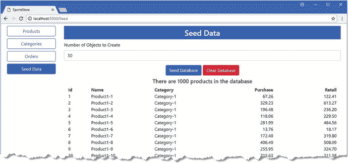
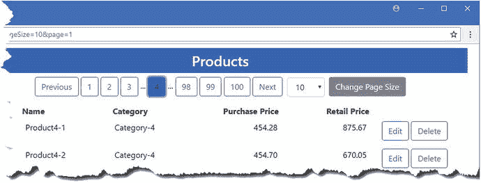
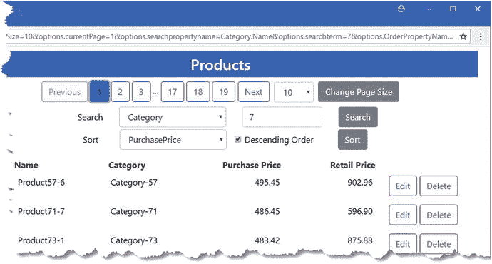
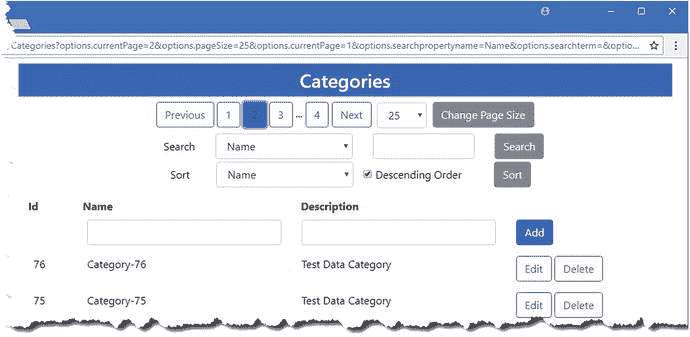

# 八、SportsStore：扩大规模

当你创建一个应用时，重点通常是获得正确的基础，这就是我在 SportsStore 项目中采用的方法。随着应用的进展，增加您正在处理的数据量会很有用，这样您就可以看到它对用户必须执行的操作以及这些操作所花费的时间的影响。在本章中，我将测试数据添加到数据库中，以显示 SportsStore 向用户呈现数据的方式中的缺陷，并通过添加对分页、排序和搜索数据的支持来解决这些问题。我还将向您展示如何通过使用支持高级数据模型配置选项的实体框架核心(称为 Fluent API)来提高这些操作的性能。

## 为本章做准备

我继续使用在第 [4](04.html) 章中创建的 SportsStore 项目，并在此后的章节中对其进行了更新。运行 SportsStore 项目文件夹中清单 [8-1](#Par4) 所示的命令，删除并重新创建数据库。

Tip

您可以从本书的 GitHub 资源库: [`https://github.com/apress/pro-ef-core-2-for-asp.net-core-mvc`](https://github.com/apress/pro-ef-core-2-for-asp.net-core-mvc) 下载本章的 SportsStore 项目以及其他章节的项目。

```cs
dotnet ef database drop --force
dotnet ef database update

Listing 8-1.Deleting and Re-creating the Database

```

### 创建种子数据控制器和视图

对于这一章，我需要一个可以用测试数据填充数据库的控制器。我在`Controllers`文件夹中添加了一个名为`SeedController.cs`的文件，并用它来定义清单 [8-2](#Par6) 中所示的控制器。

```cs
using Microsoft.AspNetCore.Mvc;
using Microsoft.EntityFrameworkCore;
using SportsStore.Models;
using System.Linq;

namespace SportsStore.Controllers {

    public class SeedController : Controller {
        private DataContext context;

        public SeedController(DataContext ctx) => context = ctx;

        public IActionResult Index() {
            ViewBag.Count = context.Products.Count();
            return View(context.Products
                .Include(p => p.Category).OrderBy(p => p.Id).Take(20));
        }

        [HttpPost]
        public IActionResult CreateSeedData(int count) {
            ClearData();
            if (count > 0) {
                context.Database.SetCommandTimeout(System.TimeSpan.FromMinutes(10));
                context.Database
                    .ExecuteSqlCommand("DROP PROCEDURE IF EXISTS CreateSeedData");
                context.Database.ExecuteSqlCommand($@"
                    CREATE PROCEDURE CreateSeedData
                            @RowCount decimal
                    AS
                          BEGIN
                          SET NOCOUNT ON
                      DECLARE @i INT = 1;
                          DECLARE @catId BIGINT;
                          DECLARE @CatCount INT = @RowCount / 10;
                          DECLARE @pprice DECIMAL(5,2);
                          DECLARE @rprice DECIMAL(5,2);
                          BEGIN TRANSACTION
                                WHILE @i <= @CatCount
                                      BEGIN
                                            INSERT INTO Categories (Name, Description)
                                            VALUES (CONCAT('Category-', @i),
                                             'Test Data Category');
                                            SET @catId = SCOPE_IDENTITY();
                                            DECLARE @j INT = 1;
                                            WHILE @j <= 10
                                                BEGIN
                                                   SET @pprice = RAND()*(500-5+1);
                                                   SET @rprice = (RAND() * @pprice)
                                                   + @pprice;
                                                   INSERT INTO Products (Name, CategoryId,
                                                    PurchasePrice, RetailPrice)
                                                   VALUES (CONCAT('Product', @i, '-', @j),
                                                 @catId, @pprice, @rprice)
                                                   SET @j = @j + 1
                                                  END
                                    SET @i = @i + 1
                                    END
                            COMMIT
                    END");
                context.Database.BeginTransaction();
                context.Database
                    .ExecuteSqlCommand($"EXEC CreateSeedData @RowCount = {count}");
                context.Database.CommitTransaction();
            }
            return RedirectToAction(nameof(Index));
        }

        [HttpPost]
        public IActionResult ClearData() {
            context.Database.SetCommandTimeout(System.TimeSpan.FromMinutes(10));
            context.Database.BeginTransaction();
            context.Database.ExecuteSqlCommand("DELETE FROM Orders");
            context.Database.ExecuteSqlCommand("DELETE FROM Categories");
            context.Database.CommitTransaction();
            return RedirectToAction(nameof(Index));
        }
    }
}

Listing 8-2.The Contents of the SeedController.cs File in the Controllers Folder

```

当涉及到生成大量测试数据时，创建。NET 对象并将它们存储在数据库中是低效的。`Seed`控制器使用实体框架的核心特性直接与 SQL 一起工作，创建并执行一个存储过程，从而更快地生成测试数据。(我在第 [23 章](23.html)中详细描述了这些特性。)

Don’t Do this in Real Projects

我在清单 [8-2](#Par6) 中采用的方法应该只用于生成测试数据，而不是应用的任何其他部分。

对于这一章，我需要一种机制，以便您可以可靠地生成大量测试数据，而不需要复杂的数据库任务或使用第三方工具。(有一些优秀的商业工具可以用来生成 SQL 数据，但是它们通常需要一个许可证来处理超过几百行的数据。)

直接使用 SQL 应该谨慎，因为它绕过了 Entity Framework Core 提供的许多有用的保护，难以测试和维护，并且通常最终只能在单个数据库服务器上工作。您还应该避免用 C# 代码创建存储过程，为了简单起见，我在清单 [8-2](#Par6) 中已经这样做了。

简而言之，不要在应用的生产部分使用这种技术的任何方面。

为了给控制器提供一个视图，我创建了`Views/Seed`文件夹，并在其中添加了一个名为`Index.cshtml`的文件，其内容如清单 [8-3](#Par13) 所示。

```cs
@model IEnumerable<Product>

<h3 class="p-2 bg-primary text-white text-center">Seed Data</h3>

<form method="post">
    <div class="form-group">
        <label>Number of Objects to Create</label>
        <input class="form-control" name="count" value="50" />
    </div>

    <div class="text-center">
        <button type="submit" asp-action="CreateSeedData" class="btn btn-primary">
            Seed Database
        </button>
        <button asp-action="ClearData" class="btn btn-danger">
            Clear Database
        </button>
    </div>
</form>

<h5 class="text-center m-2">
    There are @ViewBag.Count products in the database
</h5>

<div class="container-fluid">
    <div class="row">
        <div class="col-1 font-weight-bold">Id</div>
        <div class="col font-weight-bold">Name</div>
        <div class="col font-weight-bold">Category</div>
        <div class="col font-weight-bold text-right">Purchase</div>
        <div class="col font-weight-bold text-right">Retail</div>
    </div>
    @foreach (Product p in Model) {
        <div class="row">
            <div class="col-1">@p.Id</div>
            <div class="col">@p.Name</div>
            <div class="col">@p.Category.Name</div>
            <div class="col text-right">@p.PurchasePrice</div>
            <div class="col text-right">@p.RetailPrice</div>
        </div>
    }
</div>

Listing 8-3.The Contents of the Index.cshtml File in the Views/Seed Folder

```

该视图允许您指定应该生成多少测试数据，并显示前 20 个`Product`对象，这些对象由`Seed`控制器的`Index`动作中的查询提供。为了使`Seed`控制器更容易使用，我将清单 [8-4](#Par15) 中所示的元素添加到共享布局中。

```cs
<!DOCTYPE html>
<html>
<head>
    <meta name="viewport" content="width=device-width" />
    <title>SportsStore</title>
    <link rel="stylesheet" href="∼/lib/bootstrap/dist/css/bootstrap.min.css" />
    <style>
        .placeholder { visibility: collapse; display: none }
        .placeholder:only-child { visibility: visible; display: flex }
    </style>
</head>
<body>
    <div class="container-fluid">
        <div class="row p-2">
            <div class="col-2">
                <a asp-controller="Home" asp-action="Index"
                        class="@GetClassForButton("Home")">
                    Products
                </a>
                <a asp-controller="Categories" asp-action="Index"
                   class="@GetClassForButton("Categories")">
                    Categories
                </a>
                <a asp-controller="Orders" asp-action="Index"
                        class="@GetClassForButton("Orders")">
                    Orders
                </a>
                <a asp-controller="Seed" asp-action="Index"
                        class="@GetClassForButton("Seed")">
                    Seed Data
                </a>
            </div>
            <div class="col">
                @RenderBody()
            </div>
        </div>
    </div>
</body>
</html>

@functions {
    string GetClassForButton(string controller) {
        return "btn btn-block " + (ViewContext.RouteData.Values["controller"]
            as string == controller ? "btn-primary" : "btn-outline-primary");
    }
}

Listing 8-4.Adding an Element in the _Layout.cshtml File in the Views/Shared Folder

```

使用`dotnet run`启动应用，导航到`http://localhost:5000`，并点击种子数据按钮。将`input`元素中的值设置为 1000，然后单击 Seed Database 按钮。生成数据需要一段时间，之后您会看到如图 [8-1](#Fig1) 所示的结果。

Tip

测试数据的价格值是随机生成的，这意味着对于某些示例，您可能会收到稍微不同的结果。



图 8-1。

Running the example application

## 扩大数据显示

显示 SportsStore 应用呈现数据的方式中的缺陷并不需要大量数据。有了一千个对象，数据呈现给用户的方式就变得不可用了，对于应用来说，这仍然是一个相对较小的数据量。在接下来的部分中，我将改变 SportsStore 应用显示数据的方式，以帮助用户执行基本操作和定位他们需要的对象。

### 添加对分页的支持

我要解决的第一个问题是分解呈现给用户的数据，使它不仅仅是一个长列表。在设计应用的基础时，使用包含所有对象的简单表格是一种有用的方法，但是包含数千行的表格在大多数应用中是不可用的。为了解决这个问题，我将添加对从数据库中查询更少量数据的支持，并允许用户通过分页浏览这些更少量的数据。

在处理大量数据时，确保对数据的访问得到一致的管理非常重要，这样应用的一部分就不会意外地查询数百万个对象。我将采用的方法是创建一个包含分页的集合类。

#### 创建分页集合类

为了定义提供对分页数据的访问的集合，我创建了`Models/Pages`文件夹，向其中添加了一个名为`PagedList.cs`的类，并使用它来定义清单 [8-5](#Par22) 中所示的类。

```cs
using System.Collections.Generic;
using System.Linq;

namespace SportsStore.Models.Pages {

    public class PagedList<T> : List<T> {

        public PagedList(IQueryable<T> query, QueryOptions options = null) {
            CurrentPage = options.CurrentPage;
            PageSize = options.PageSize;

            TotalPages = query.Count() / PageSize;
            AddRange(query.Skip((CurrentPage - 1) * PageSize).Take(PageSize));
        }

        public int CurrentPage { get; set; }
        public int PageSize { get; set; }
        public int TotalPages { get; set; }

        public bool HasPreviousPage => CurrentPage > 1;
        public bool HasNextPage => CurrentPage < TotalPages;

    }
}

Listing 8-5.The Contents of the PagedList.cs File in the Models/Pages Folder

```

我使用了一个强类型的`List`作为基类，这将让我很容易地构建基本集合行为。构造函数接受一个`IQueryable<T>`，它表示将向用户显示数据的查询。该查询将执行两次——一次获取查询可能返回的对象总数，另一次仅获取将在当前页面上显示的对象。这是分页所固有的权衡，在分页中，一个额外的`COUNT`查询与针对更少量对象的查询相平衡。其他构造函数参数指定查询所需的页面以及每页显示的对象数量。

为了表示查询所需的选项，我在`Models/Pages`文件夹中添加了一个名为`QueryOptions.cs`的类文件，代码如清单 [8-6](#Par25) 所示。

```cs
namespace SportsStore.Models.Pages {

    public class QueryOptions {
        public int CurrentPage { get; set; } = 1;
        public int PageSize { get; set; } = 10;
    }
}

Listing 8-6.The Contents of the QueryOptions.cs File in the Models/Pages Folder

```

#### 更新存储库

为了确保一致地使用分页，我将返回一个`PagedList`对象作为通过存储库执行查询的结果。在清单 [8-7](#Par27) 中，我添加了一个名为`GetProduct`的方法，它返回单个页面的数据。

```cs
using System.Collections.Generic;

using SportsStore.Models.Pages;

namespace SportsStore.Models {

    public interface IRepository {

        IEnumerable<Product> Products { get; }

        PagedList<Product> GetProducts(QueryOptions options);

        Product GetProduct(long key);

        void AddProduct(Product product);

        void UpdateProduct(Product product);

        void UpdateAll(Product[] products);

        void Delete(Product product);
    }
}

Listing 8-7.Returning Pages of Data in the IRepository.cs File in the Models Folder

```

在清单 [8-8](#Par29) 中，我对存储库的实现类做了相应的更改。

```cs
using System.Collections.Generic;
using System.Linq;
using Microsoft.EntityFrameworkCore;

using SportsStore.Models.Pages;

namespace SportsStore.Models {

    public class DataRepository : IRepository {
        private DataContext context;

        public DataRepository(DataContext ctx) => context = ctx;

        public IEnumerable<Product> Products => context.Products
            .Include(p => p.Category).ToArray();

        public PagedList<Product> GetProducts(QueryOptions options) {
            return new PagedList<Product>(context.Products
                .Include(p => p.Category), options);
        }

        // ..other methods omitted for brevity...
    }
}

Listing 8-8.Returning Pages of Data in the DataRepository.cs File in the Models Folder

```

新方法返回由参数指定的页面的`Product`对象的`PagedList`集合。

#### 更新控制器和视图

为了给`Home`控制器增加对分页的支持，我更新了`Index`动作，使其接受选择页面所需的参数，并使用新的存储库方法，如清单 [8-9](#Par32) 所示。

```cs
using Microsoft.AspNetCore.Mvc;
using SportsStore.Models;

using SportsStore.Models.Pages;

namespace SportsStore.Controllers {

    public class HomeController : Controller {
        private IRepository repository;
        private ICategoryRepository catRepository;

        public HomeController(IRepository repo, ICategoryRepository catRepo) {
            repository = repo;
            catRepository = catRepo;
        }

        public IActionResult Index(QueryOptions options) {
            return View(repository.GetProducts(options));
        }

        public IActionResult UpdateProduct(long key) {
            ViewBag.Categories = catRepository.Categories;
            return View(key == 0 ? new Product() : repository.GetProduct(key));
        }

        [HttpPost]
        public IActionResult UpdateProduct(Product product) {
            if (product.Id == 0) {
                repository.AddProduct(product);
            } else {
                repository.UpdateProduct(product);
            }
            return RedirectToAction(nameof(Index));
        }

        [HttpPost]
        public IActionResult Delete(Product product) {
            repository.Delete(product);
            return RedirectToAction(nameof(Index));
        }
    }
}

Listing 8-9.Using Paged Data in the HomeController.cs File in the Controllers Folder

```

分页数据集合的基类实现了`IEnumerable<T>`接口，它最小化了支持分页数据所需的更改程度。对`Home`控制器的`Index`动作的视图的惟一修改是显示一个局部视图，该视图将提供分页的细节，如清单 [8-10](#Par34) 所示。视图的其余部分不需要更改，因为它将以相同的方式枚举数据，而不管它所操作的序列是包含所有可用数据还是仅包含其中的一页。

```cs
@model IEnumerable<Product>

<h3 class="p-2 bg-primary text-white text-center">Products</h3>

<div class="text-center">

    @Html.Partial("Pages", Model)

</div>

<div class="container-fluid mt-3">
    <div class="row">
        <div class="col-1 font-weight-bold">Id</div>
        <div class="col font-weight-bold">Name</div>
        <div class="col font-weight-bold">Category</div>
        <div class="col font-weight-bold text-right">Purchase Price</div>
        <div class="col font-weight-bold text-right">Retail Price</div>
        <div class="col"></div>
    </div>
    @foreach (Product p in Model) {
        <div class="row p-2">
            <div class="col-1">@p.Id</div>
            <div class="col">@p.Name</div>
            <div class="col">@p.Category.Name</div>
            <div class="col text-right">@p.PurchasePrice</div>
            <div class="col text-right">@p.RetailPrice</div>
            <div class="col">
                <form asp-action="Delete" method="post">
                    <a asp-action="UpdateProduct" asp-route-key="@p.Id"
                       class="btn btn-outline-primary">
                        Edit
                    </a>
                    <input type="hidden" name="Id" value="@p.Id" />
                    <button type="submit" class="btn btn-outline-danger">
                        Delete
                    </button>
                </form>
            </div>
        </div>
    }
    <div class="text-center p-2">
        <a asp-action="UpdateProduct" asp-route-key="0"
           class="btn btn-primary">Add</a>
    </div>
</div>

Listing 8-10.Using a Partial View in the Index.cshtml File in the Views/Home Folder

```

为了完成对`Product`对象的分页支持，我通过向`Views/Shared`文件夹添加一个名为`Pages.cshtml`的文件并添加清单 [8-11](#Par36) 中所示的元素来定义局部视图。

```cs
<form id="pageform" method="get" class="form-inline d-inline-block">

    <button name="options.currentPage" value="@(Model.CurrentPage -1)"
       class="btn btn-outline-primary @(!Model.HasPreviousPage ? "disabled" : "")"
            type="submit">
        Previous
    </button>

    @for (int i = 1; i <= 3 && i <= Model.TotalPages; i++) {
        <button name="options.currentPage" value="@i" type="submit"
           class="btn btn-outline-primary @(Model.CurrentPage == i ? "active" : "")">
            @i
        </button>
    }
    @if (Model.CurrentPage > 3 && Model.TotalPages - Model.CurrentPage >= 3) {
        @:...
        <button class="btn btn-outline-primary active">@Model.CurrentPage</button>
    }
    @if (Model.TotalPages > 3) {
        @:...
        @for (int i = Math.Max(4, Model.TotalPages - 2);
                        i <= Model.TotalPages; i++) {
            <button name="options.currentPage" value="@i" type="submit"
                    class="btn btn-outline-primary
                   @(Model.CurrentPage == i ? "active" : "")">
                @i
            </button>
        }
    }
    <button name="options.currentPage" value="@(Model.CurrentPage +1)" type="submit"
            class="btn btn-outline-primary @(!Model.HasNextPage? "disabled" : "")">
        Next
    </button>

    <select name="options.pageSize" class="form-control ml-1 mr-1">
        @foreach (int val in new int[] { 10, 25, 50, 100 }) {
            <option value="@val" selected="@(Model.PageSize == val)">@val</option>
        }
    </select>
    <input type="hidden" name="options.currentPage" value="1" />
    <button type="submit" class="btn btn-secondary">Change Page Size</button>
</form>

Listing 8-11.The Contents of the Pages.cshtml File in the Views/Shared Folder

```

该视图包含一个 HTML 表单，用于将 GET 请求发送回数据页面的 action 方法，并更改页面大小。Razor 表达式看起来很混乱，但是它们使显示给用户的分页按钮适应可用的页面数量。要查看效果，使用`dotnet run`启动应用并导航到`http://localhost:5000`。产品列表将被分成十个项目的页面，可以使用一系列按钮进行翻页，如图 [8-2](#Fig2) 所示。



图 8-2。

Paging data

### 添加搜索和订购支持

显示页面是一个好的开始，但是仍然很难集中在一组特定的对象上。为了给用户提供定位数据所需的工具，我将在分页特性的基础上添加对改变显示顺序和执行搜索的支持。起点是扩展`PagedList`类，这样它就可以使用属性名执行搜索并对查询结果进行排序，而不是使用选择属性的 lambda 表达式，如清单 [8-12](#Par39) 所示。这需要一些复杂的代码来执行操作，但结果可以应用于任何数据模型类，并且更容易与应用的 ASP.NET Core MVC 部分集成。

```cs
using System.Collections.Generic;
using System.Linq;

using System;

using System.Linq.Expressions;

namespace SportsStore.Models.Pages {

    public class PagedList<T> : List<T> {

        public PagedList(IQueryable<T> query, QueryOptions options = null) {
            CurrentPage = options.CurrentPage;
            PageSize = options.PageSize;
            Options = options;

            if (options != null) {
                if (!string.IsNullOrEmpty(options.OrderPropertyName)) {
                    query = Order(query, options.OrderPropertyName,
                        options.DescendingOrder);
                }
                if (!string.IsNullOrEmpty(options.SearchPropertyName)
                        && !string.IsNullOrEmpty(options.SearchTerm)) {
                    query = Search(query, options.SearchPropertyName,
                        options.SearchTerm);
                }
            }

            TotalPages = query.Count() / PageSize;
            AddRange(query.Skip((CurrentPage - 1) * PageSize).Take(PageSize));
        }

        public int CurrentPage { get; set; }
        public int PageSize { get; set; }
        public int TotalPages { get; set; }
        public QueryOptions Options { get; set; }

        public bool HasPreviousPage => CurrentPage > 1;
        public bool HasNextPage => CurrentPage < TotalPages;

        private static IQueryable<T> Search(IQueryable<T> query, string propertyName,
                string searchTerm) {
            var parameter = Expression.Parameter(typeof(T), "x");
            var source = propertyName.Split('.').Aggregate((Expression) parameter,
                Expression.Property);
            var body = Expression.Call(source, "Contains", Type.EmptyTypes,
                Expression.Constant(searchTerm, typeof(string)));
            var lambda = Expression.Lambda<Func<T, bool>>(body, parameter);
            return query.Where(lambda);
        }

        private static IQueryable<T> Order(IQueryable<T> query, string propertyName,
                bool desc) {
            var parameter = Expression.Parameter(typeof(T), "x");
            var source = propertyName.Split('.').Aggregate((Expression) parameter,
                Expression.Property);
            var lambda = Expression.Lambda(typeof(Func<,>).MakeGenericType(typeof(T),
                source.Type), source, parameter);
            return typeof(Queryable).GetMethods().Single(
                      method => method.Name == (desc ? "OrderByDescending"
                                  : "OrderBy")
                      && method.IsGenericMethodDefinition
                      && method.GetGenericArguments().Length == 2
                      && method.GetParameters().Length == 2)
                  .MakeGenericMethod(typeof(T), source.Type)
                  .Invoke(null, new object[] { query, lambda }) as IQueryable<T>;
        }
    }
}

Listing 8-12.Adding Features in the PagedList.cs File in the Models Pages Folder

```

清单 [8-13](#Par41) 显示了对`QueryOptions`类的相应更改。

```cs
namespace SportsStore.Models.Pages {

    public class QueryOptions {

        public int CurrentPage { get; set; } = 1;
        public int PageSize { get; set; } = 10;

        public string OrderPropertyName { get; set; }
        public bool DescendingOrder { get; set; }

        public string SearchPropertyName { get; set; }
        public string SearchTerm { get; set; }
    }
}

Listing 8-13.Adding Properties in the QueryOptions.cs File in the Models/Pages Folder

```

为了创建一个通用视图，向用户展示搜索和排序选项，我在`Views/Shared`文件夹中添加了一个名为`PageOptions.cshtml`的文件，并添加了清单 [8-14](#Par43) 中所示的内容。

```cs
<div class="container-fluid mt-2">
    <div class="row m-1">
        <div class="col"></div>
        <div class="col-1">
            <label class="col-form-label">Search</label>
        </div>
        <div class="col-3">
            <select form="pageform" name="options.searchpropertyname"
                    class="form-control">
                @foreach (string s in ViewBag.searches as string[]) {
                    <option value="@s"
                            selected="@(Model.Options.SearchPropertyName == s)">
                        @(s.IndexOf('.') == -1 ? s : s.Substring(0, s.IndexOf('.')))
                    </option>

                }
            </select>
        </div>
        <div class="col">
            <input form="pageform" class="form-control" name="options.searchterm"
                value="@Model.Options.SearchTerm" />
        </div>

        <div class="col-1 text-right">
            <button form="pageform" class="btn btn-secondary" type="submit">
                Search
            </button>
        </div>
        <div class="col"></div>
    </div>
    <div class="row m-1">
        <div class="col"></div>
        <div class="col-1">
            <label class="col-form-label">Sort</label>
        </div>
        <div class="col-3">
            <select form="pageform" name="options.OrderPropertyName"
                    class="form-control">
                @foreach (string s in ViewBag.sorts as string[]) {
                    <option value="@s"
                            selected="@(Model.Options.OrderPropertyName == s)">
                        @(s.IndexOf('.') == -1 ? s : s.Substring(0, s.IndexOf('.')))
                    </option>
                }
            </select>
        </div>        
        <div class="col form-check form-check-inline">
                <input form="pageform" type="checkbox" name="Options.DescendingOrder"
                       id="Options.DescendingOrder"
                       class="form-check-input" value="true"
                           checked ="@Model.Options.DescendingOrder" />
                <label class="form-check-label">Descending Order</label>
        </div>
        <div class="col-1 text-right">
            <button form="pageform" class="btn btn-secondary" type="submit">
                Sort
            </button>
        </div>
        <div class="col"></div>
    </div>
</div>

Listing 8-14.The Contents of the PageOptions.cshtml File in the Views/Shared Folder

```

此视图依赖于将元素与`form`元素之外的表单相关联的 HTML 5 特性，这意味着我可以使用特定于搜索和排序的元素来扩展`Pages`视图中定义的表单。

我不想硬编码用户可以用来在视图中搜索或排序数据的属性列表，因此，为了简单起见，我从`ViewBag`中获取这些值。这不是一个理想的解决方案，但它确实提供了很大的灵活性，它允许我轻松地将相同的内容适应不同的视图和不同的数据。为了在`Product`列表旁边向用户显示搜索和排序元素，我将清单 [8-15](#Par46) 中显示的内容添加到了`Home`控制器使用的`Index`视图中。

```cs
@model IEnumerable<Product>

<h3 class="p-2 bg-primary text-white text-center">Products</h3>

<div class="text-center">
    @Html.Partial("Pages", Model)
    @{
        ViewBag.searches = new string[] { "Name", "Category.Name" };
        ViewBag.sorts = new string[] { "Name", "Category.Name",
            "PurchasePrice", "RetailPrice"};
    }
    @Html.Partial("PageOptions", Model)
</div>
<div class="container-fluid mt-3">
    <!-- ...other elements omitted for brevity... -->
</div>

Listing 8-15.Displaying the Product Features in the Index.cshtml File in the Views/Home Folder

```

代码块指定了用户能够搜索和排序`Product`对象的`Product`属性，而`@Html.Partial`表达式呈现了这些特性的元素。

要查看结果，使用`dotnet run`启动应用并导航至`http://localhost:5000`。你会看到一系列新的元素，使得数据导航更加容易，如图 [8-3](#Fig3) 所示。



图 8-3。

Searching and ordering Product objects

### 将数据表示功能应用于类别

将分页、搜索和排序特性放在适当位置的过程一直很笨拙，但是现在基础已经就绪，我可以将它们应用于应用中的其他数据类型，比如管理`Category`对象。首先，我更新了存储库接口和实现类，添加了一个接受`QueryOptions`对象并返回`PagedList`结果的方法，如清单 [8-16](#Par50) 所示。

```cs
using System.Collections.Generic;

using SportsStore.Models.Pages;

namespace SportsStore.Models {

    public interface ICategoryRepository {

        IEnumerable<Category> Categories { get; }

        PagedList<Category> GetCategories(QueryOptions options);

        void AddCategory(Category category);
        void UpdateCategory(Category category);
        void DeleteCategory(Category category);
    }

    public class CategoryRepository : ICategoryRepository {
        private DataContext context;

        public CategoryRepository(DataContext ctx) => context = ctx;

        public IEnumerable<Category> Categories => context.Categories;

        public PagedList<Category> GetCategories(QueryOptions options) {
            return new PagedList<Category>(context.Categories, options);
        }

        public void AddCategory(Category category) {
            context.Categories.Add(category);
            context.SaveChanges();
        }

        public void UpdateCategory(Category category) {
            context.Categories.Update(category);
            context.SaveChanges();
        }

        public void DeleteCategory(Category category) {
            context.Categories.Remove(category);
            context.SaveChanges();
        }
    }
}

Listing 8-16.Adding Page Support in the CategoryRepository.cs File in the Models Folder

```

在清单 [8-17](#Par52) 中，我为管理`Category`对象的控制器的`Index`动作添加了一个`QueryOptions`参数，并使用它来查询存储库。

```cs
using Microsoft.AspNetCore.Mvc;
using SportsStore.Models;

using SportsStore.Models.Pages;

namespace SportsStore.Controllers {

    public class CategoriesController : Controller {
        private ICategoryRepository repository;

        public CategoriesController(ICategoryRepository repo) => repository = repo;

        public IActionResult Index(QueryOptions options)
            => View(repository.GetCategories(options));

        [HttpPost]
        public IActionResult AddCategory(Category category) {
            repository.AddCategory(category);
            return RedirectToAction(nameof(Index));
        }

        public IActionResult EditCategory(long id) {
            ViewBag.EditId = id;
            return View("Index", repository.Categories);
        }

        [HttpPost]
        public IActionResult UpdateCategory(Category category) {
            repository.UpdateCategory(category);
            return RedirectToAction(nameof(Index));
        }

        [HttpPost]
        public IActionResult DeleteCategory(Category category) {
            repository.DeleteCategory(category);
            return RedirectToAction(nameof(Index));
        }
    }
}

Listing 8-17.Adding Page Support in the CategoriesController.cs File in the Controllers Folder

```

最后，我可以通过将清单 [8-18](#Par54) 中所示的元素添加到`Categories`控制器使用的`Index`视图中，向用户呈现这些特性。

```cs
@model IEnumerable<Category>

<h3 class="p-2 bg-primary text-white text-center">Categories</h3>

<div class="text-center">

    @Html.Partial("Pages", Model)
    @{
        ViewBag.searches = new string[] { "Name", "Description" };
        ViewBag.sorts = new string[] { "Name", "Description" };
    }
    @Html.Partial("PageOptions", Model)

</div>

<div class="container-fluid mt-3">
    <!-- ...other elements omitted for brevity... -->
</div>

Listing 8-18.Adding Features in the Index.cshtml File in the Views/Categories Folder

```

要查看新特性，请启动应用，导航到`http://localhost:5000`，然后单击 Categories 按钮。类别列表以页面形式呈现，用户可以根据需要进行搜索和排序，如图 [8-4](#Fig4) 所示。



图 8-4。

Paging, sorting and searching categories

## 为数据库编制索引

向数据库中添加 1000 个测试对象足以显示向用户呈现数据的方式的可伸缩性限制，但不足以揭示数据库的局限性。为了查看处理大量数据的效果，我在`PagedList`构造函数中添加了一些语句，用于测量执行一个查询需要多长时间，并将运行时间写入控制台，如清单 [8-19](#Par58) 所示。

Tip

有许多方法可以测量性能，大多数数据库服务器都提供了工具来帮助您了解执行查询需要多长时间。对于 SQL Server，SQL Server Profiler 和 SQL Server Management Studio 工具提供了大量的详细信息。这些工具可能很有用，但我通常依赖于我在清单 [8-19](#Par58) 中采用的方法，因为它足够简单和准确，可以理解任何性能问题的严重性。

```cs
using System.Collections.Generic;
using System.Linq;
using System;
using System.Linq.Expressions;

using System.Diagnostics;

namespace SportsStore.Models.Pages {

    public class PagedList<T> : List<T> {

        public PagedList(IQueryable<T> query, QueryOptions options = null) {
            CurrentPage = options.CurrentPage;
            PageSize = options.PageSize;
            Options = options;

            if (options != null) {
                if (!string.IsNullOrEmpty(options.OrderPropertyName)) {
                    query = Order(query, options.OrderPropertyName,
                        options.DescendingOrder);
                }
                if (!string.IsNullOrEmpty(options.SearchPropertyName)
                        && !string.IsNullOrEmpty(options.SearchTerm)) {
                    query = Search(query, options.SearchPropertyName,
                        options.SearchTerm);
                }
            }

            Stopwatch sw = Stopwatch.StartNew();
            Console.Clear();

            TotalPages = query.Count() / PageSize;
            AddRange(query.Skip((CurrentPage - 1) * PageSize).Take(PageSize));

            Console.WriteLine($"Query Time: {sw.ElapsedMilliseconds} ms");
        }

        // ...other members omitted for brevity...
    }
}

Listing 8-19.Timing the Query in the PagedList.cs File in the Models/Pages Folder

```

使用`dotnet run`启动应用，导航到`http://localhost:5000`，单击 Seed Data 按钮，并用您想要测试的对象数量填充数据库。植入数据库后，单击“产品”按钮，选择“排序选择”要素的“采购价格”属性，选择“降序”选项，然后单击“排序”按钮。

如果您检查由应用生成的日志消息，您将看到用于获取数据的查询以及它们所花费的时间。

```cs
...
SELECT COUNT(*)
FROM [Products] AS [p]
...
SELECT [p].[Id], [p].[CategoryId], [p].[Name], [p].[PurchasePrice],
    [p].[RetailPrice], [p.Category].[Id], [p.Category].[Description],
    [p.Category].[Name
FROM [Products] AS [p]
INNER JOIN [Categories] AS [p.Category] ON [p].[CategoryId] = [p.Category].[Id]
ORDER BY [p].[PurchasePrice] DESC
OFFSET @__p_0 ROWS FETCH NEXT @__p_1 ROWS ONLY
...

Query Time: 14 ms

...

```

表 [8-1](#Tab1) 显示了在我的开发机器上针对不同数量的种子数据执行这些查询所花费的时间。当您执行测试时，您可能会看到不同的时间，但是重要的是执行查询所花费的时间随着数据量的增加而增加。

表 8-1。

The Time Taken to Perform Queries

<colgroup><col> <col></colgroup> 
| 目标 | 时间 |
| --- | --- |
| One thousand | 14 毫秒 |
| Ten thousand | 17 毫秒 |
| One hundred thousand | 185 毫秒 |
| One million | 2453 毫秒 |
| Two million | 5713 毫秒 |

### 创建和应用索引

性能问题的一部分是数据库服务器必须检查大量的数据行才能找到应用需要的数据。减少数据库服务器必须执行的工作量的一个有效方法是创建索引，这可以加快查询速度，但这是在需要一些初始准备时间和每次更新后的一点额外工作之后。对于 SportsStore 应用，我将为用户可以用来搜索或订购数据的`Product`和`Category`类的属性添加索引。索引是在数据库上下文类中创建的，如清单 [8-20](#Par64) 所示。

```cs
using Microsoft.EntityFrameworkCore;

namespace SportsStore.Models {

    public class DataContext : DbContext {

        public DataContext(DbContextOptions<DataContext> opts) : base(opts) {}

        public DbSet<Product> Products { get; set; }

        public DbSet<Category> Categories { get; set; }

        public DbSet<Order> Orders { get; set; }
        public DbSet<OrderLine> OrderLines { get; set; }

        protected override void OnModelCreating(ModelBuilder modelBuilder) {

            modelBuilder.Entity<Product>().HasIndex(p => p.Name);
            modelBuilder.Entity<Product>().HasIndex(p => p.PurchasePrice);
            modelBuilder.Entity<Product>().HasIndex(p => p.RetailPrice);

            modelBuilder.Entity<Category>().HasIndex(p => p.Name);
            modelBuilder.Entity<Category>().HasIndex(p => p.Description);
        }
    }
}

Listing 8-20.Creating Indexes in the DataContext.cs File in the Models Folder

```

使用实体框架核心 Fluent API 特性覆盖`OnModelCreating`方法来定制数据模型，我在本书的第 2 部分和第 3 部分详细描述了这一点。Fluent API 允许您覆盖默认的实体框架核心行为，并访问高级功能，如创建索引。在清单中，我为`Product`类的`Name`、`PurchasePrice`和`RetailPrice`属性以及`Category`类的`Name`和`Description`属性创建了索引。我不需要为主键或外键属性创建索引，因为缺省情况下实体框架核心会为我创建索引。

创建索引需要创建新的迁移并将其应用于数据库。在`SportsStore`项目文件夹中运行清单 [8-21](#Par68) 中所示的命令，创建一个名为`Indexes`的迁移，并将其应用到数据库中。

Tip

当数据库中有大量数据时，应用创建索引的迁移可能需要一段时间，因为所有现有数据都必须添加到索引中。在执行迁移命令之前，您可能想要使用`Seed`控制器来减少测试数据量。

```cs
dotnet ef migrations add Indexes
dotnet ef database update

Listing 8-21.Creating and Applying a Database Migration

```

应用迁移后，重新启动应用并重复查询测试，以查看对性能的影响。表 [8-2](#Tab2) 显示了为我的 PC 添加索引前后的查询时间。

表 8-2。

The Time Taken to Perform Queries

<colgroup><col> <col> <col></colgroup> 
| 目标 | 时间 | 索引时间 |
| --- | --- | --- |
| One thousand | 14 毫秒 | 9 毫秒 |
| Ten thousand | 17 毫秒 | 10ms |
| One hundred thousand | 185 毫秒 | 23 毫秒 |
| One million | 2453 毫秒 | 143 毫秒 |
| Two million | 5713 毫秒 | 158 毫秒 |

Understanding the Count Query Performance

随着数据量的增加，花费的时间仍然会有少量增加。我用来获取数据库中存储的对象数量的查询被转换为 SQL `SELECT COUNT`命令，对于大量的对象，该命令的性能会下降。数据库服务器通常提供计算数据的替代方法，对于 SQL Server，您可以查询数据库服务器维护的关于数据库的元数据，如下所示:

```cs
...
select sum (spart.rows)
from sys.partitions spart
where spart.object_id = object_id('Products') and spart.index_id < 2
...

```

使用 LINQ 无法执行这种类型的查询。相反，关于使用支持直接执行 SQL 命令的实体框架核心特性的细节，请参见第 [23](23.html) 章。

## 常见问题和解决方案

按比例增加应用支持的数据量需要小心地平衡应用的 ASP.NET Core MVC 部分，以要求实体框架核心提供更少量的数据，并提供用于排序和搜索数据的工具。在接下来的部分中，我描述了您最可能遇到的问题，并解释了如何解决它们。

### 对页面的查询太慢

查询速度慢的最可能的原因是，应用从数据库中检索所有对象，然后在内存中对它们进行排序或搜索，然后只获取单个页面所需的那些对象。每当用户切换到一个新页面时，这个过程就会重复，从而产生大量的工作来检索和处理那些随后被丢弃的对象。

这个问题通常是由于 LINQ 方法在`IEnumerable<T>`接口上被调用，而不是在`IQueryable<T>`接口上被调用，如第 [5](05.html) 章所述。诊断此问题的最快方法是查看应用的日志消息，以了解实体框架核心生成的 SQL 查询。尽管细节会有所不同，但是使用带有`OrderBy`和`Skip` LINQ 方法的`IQueryable<T>`接口将会产生带有`ORDER BY`和`OFFSET`子句的查询。

如果您使用的是`IQueryable<T>`接口，那么您应该检查重复的查询，如第 [5](05.html) 章所述。很容易忘记枚举对象序列会触发一个查询，特别是在计算需要多少页面按钮的时候。

### 应用索引迁移超时

当您将迁移应用到添加索引的数据库时，数据库服务器必须使用已经存储的数据来填充索引。对于大型数据库来说，这可能是一个漫长的过程，并且`dotnet ef`命令可能会在该过程完成之前超时，这将导致迁移失败并阻止索引的创建。要在开发中解决这个问题，请删除并重新创建数据库，以便在没有数据时应用索引。对于生产系统，备份数据库，删除数据，然后应用迁移。一旦创建了索引，就可以使用小数据块再次填充数据库，这样每次更新只需要少量的工作。

### 创建索引不会提高性能

如果您发现索引没有改善查询时间，那么首先要检查的是创建索引的迁移是否已经应用到数据库。下一个最可能的问题是，还没有为应用用于查询的所有属性创建索引。如果您的应用使用属性组合进行搜索，您可能需要创建额外的索引，如第 3 部分所述。

## 摘要

在本章中，我展示了如何调整 SportsStore 应用来处理大量数据。我添加了对分页、排序和搜索数据的支持，这允许用户一次处理可管理数量的对象。我还使用了 Fluent API 来定制数据模型并添加索引以提高查询性能。在下一章中，我将面向客户的特性添加到 SportsStore 应用中。