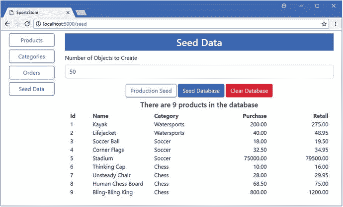
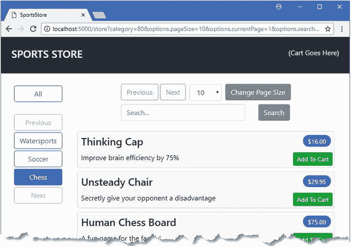
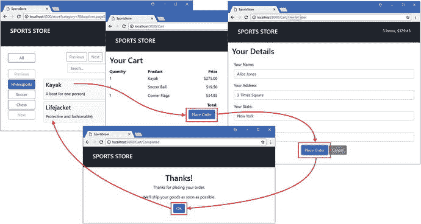

# 九、SportsStore：客户特征

在这一章中，我将构建 SportsStore 应用中面向客户的部分，它将允许用户选择产品，查看他们的购物车，并结帐以创建订单。我在这一章中添加的特性主要与 ASP.NET Core MVC 框架有关，并建立在前面章节中创建的实体框架核心基础之上。

我在这一章加快了步伐，因为大部分工作都是在前面章节中用实体框架核心创建的基础上，使用 ASP.NET Core MVC 来构建特性。

## 为本章做准备

我继续使用在第 [4](04.html) 章中创建的 SportsStore 项目，并在此后的章节中对其进行了更新。

Tip

您可以从本书的 GitHub 资源库: [`https://github.com/apress/pro-ef-core-2-for-asp.net-core-mvc`](https://github.com/apress/pro-ef-core-2-for-asp.net-core-mvc) 下载本章的 SportsStore 项目以及其他章节的项目。

### 删除计时语句

在第 8 章中，我测量了执行查询所花费的时间。不再需要为查询计时的语句，我已经在清单 [9-1](#Par6) 中将它们注释掉了。

```cs
using System.Collections.Generic;
using System.Linq;
using System;
using System.Linq.Expressions;
using System.Diagnostics;

namespace SportsStore.Models.Pages {

    public class PagedList<T> : List<T> {

        public PagedList(IQueryable<T> query, QueryOptions options = null) {
            CurrentPage = options.CurrentPage;
            PageSize = options.PageSize;
            Options = options;

            if (options != null) {
                if (!string.IsNullOrEmpty(options.OrderPropertyName)) {
                    query = Order(query, options.OrderPropertyName,
                        options.DescendingOrder);
                }
                if (!string.IsNullOrEmpty(options.SearchPropertyName)
                        && !string.IsNullOrEmpty(options.SearchTerm)) {
                    query = Search(query, options.SearchPropertyName,
                        options.SearchTerm);
                }
            }

            //Stopwatch sw = Stopwatch.StartNew();
            //Console.Clear();
            TotalPages = query.Count() / PageSize;
            AddRange(query.Skip((CurrentPage - 1) * PageSize).Take(PageSize));
            //Console.WriteLine($"Query Time: {sw.ElapsedMilliseconds} ms");
        }

        // ...other members omitted for brevity...
    }
}

Listing 9-1.Commenting Out Statements in the PagedList.cs File in the Models/Pages Folder

```

### 添加视图导入

在第 [8](08.html) 章中，我在视图中使用了`PagedList`类，而没有改变视图模型，只是为了演示我可以用最少的改变向应用添加纵向扩展特性。在这一章中，我将在视图中直接使用`PagedList`类，所以我将包含名称空间添加到视图导入文件中，如清单 [9-2](#Par8) 所示。

```cs
@using SportsStore.Models

@using SportsStore.Models.Pages

@addTagHelper *, Microsoft.AspNetCore.Mvc.TagHelpers

Listing 9-2.Adding a Namespace in the _ViewImports.cshtml File in the Views Folder

```

### 修改数据模型

为了准备面向客户的特性的数据模型，我在`Product`类中添加了一个`Description`属性，这样客户可以了解一些他们看到的产品，如清单 [9-3](#Par10) 所示。

```cs
namespace SportsStore.Models {

    public class Product {

        public long Id { get; set; }

        public string Name { get; set; }
        public string Description { get; set; }
        public decimal PurchasePrice { get; set; }
        public decimal RetailPrice { get; set; }

        public long CategoryId { get; set; }
        public Category Category { get; set; }
    }
}

Listing 9-3.Adding a Property in the Products.cs File in the Models Folder

```

为了更容易地按类别查询和存储数据，我向`Category`类添加了一个导航属性，实体框架核心将能够用相关的`Product`对象填充该属性，如清单 [9-4](#Par12) 所示。

```cs
using System.Collections.Generic;

namespace SportsStore.Models {

    public class Category {
        public long Id { get; set; }
        public string Name { get; set; }
        public string Description { get; set; }

        public IEnumerable<Product> Products { get; set; }
    }
}

Listing 9-4.Adding a Navigation Property in the Category.cs File in the Models Folder

```

### 添加产品种子数据

我希望能够在大量测试数据和少量更真实的数据之间切换。为此，我将清单 [9-5](#Par14) 中所示的代码添加到`Seed`控制器中，以添加标准的 SportsStore 类别和产品。

```cs
using Microsoft.AspNetCore.Mvc;
using Microsoft.EntityFrameworkCore;
using SportsStore.Models;
using System.Linq;

namespace SportsStore.Controllers {

    public class SeedController : Controller {
        private DataContext context;

        public SeedController(DataContext ctx) => context = ctx;

        public IActionResult Index() {
            ViewBag.Count = context.Products.Count();
            return View(context.Products
                .Include(p => p.Category).OrderBy(p => p.Id).Take(20));
        }

        // ...other actions omitted for brevity...

        [HttpPost]
        public IActionResult CreateProductionData() {
            ClearData();

            context.Categories.AddRange(new Category[] {
                new Category {
                    Name = "Watersports",
                    Description = "Make a splash",
                    Products = new Product[] {
                        new Product {
                            Name = "Kayak", Description = "A boat for one person",
                            PurchasePrice = 200, RetailPrice = 275
                        },
                        new Product {
                            Name = "Lifejacket",
                            Description = "Protective and fashionable",
                            PurchasePrice = 40, RetailPrice = 48.95m
                        },
                    }
                },
                new Category {
                    Name = "Soccer",
                    Description = "The World's Favorite Game",
                    Products = new Product[] {
                        new Product {
                            Name = "Soccer Ball",
                            Description = "FIFA-approved size and weight",
                            PurchasePrice = 18, RetailPrice = 19.50m
                        },
                        new Product {
                            Name = "Corner Flags", Description
                                = "Give your playing field a professional touch",
                            PurchasePrice = 32.50m, RetailPrice = 34.95m
                        },
                        new Product {
                            Name = "Stadium",
                            Description = "Flat-packed 35,000-seat stadium",
                            PurchasePrice = 75000,  RetailPrice = 79500
                        }
                    }
                },
                new Category {
                    Name = "Chess",
                    Description = "The Thinky Game",
                    Products = new Product[] {
                        new Product {
                            Name = "Thinking Cap",
                            Description = "Improve brain efficiency by 75%",
                            PurchasePrice = 10, RetailPrice = 16
                        },
                        new Product {
                            Name = "Unsteady Chair", Description
                                = "Secretly give your opponent a disadvantage",
                            PurchasePrice = 28, RetailPrice = 29.95m
                        },
                        new Product {
                            Name = "Human Chess Board",
                            Description = "A fun game for the family",
                            PurchasePrice = 68.50m, RetailPrice = 75
                        },
                        new Product {
                            Name = "Bling-Bling King",
                            Description = "Gold-plated, diamond-studded King",
                            PurchasePrice = 800, RetailPrice = 1200
                        }
                    }
                }
            });
            context.SaveChanges();
            return RedirectToAction(nameof(Index));
        }
    }
}

Listing 9-5.Adding Production Seed Data in the SeedController.cs File in the Controllers Folder

```

新的操作方法创建了一系列的`Category`对象，并将`Products`导航属性设置为`Product`对象的集合。所有的对象都被传递给`AddRange`方法，并由`SaveChanges`方法存储在数据库中。为了针对新的动作方法，我将清单 [9-6](#Par16) 中所示的元素添加到了由`Seed`控制器使用的`Index`视图中。

```cs
@model IEnumerable<Product>

<h3 class="p-2 bg-primary text-white text-center">Seed Data</h3>

<form method="post">
    <div class="form-group">
        <label>Number of Objects to Create</label>
        <input class="form-control" name="count" value="50" />
    </div>

    <div class="text-center">
        <button type="submit" asp-action="CreateProductionData"
                class="btn btn-outline-primary">
            Production Seed
        </button>
        <button type="submit" asp-action="CreateSeedData" class="btn btn-primary">
            Seed Database
        </button>
        <button asp-action="ClearData" class="btn btn-danger">
            Clear Database
        </button>
    </div>
</form>

<h5 class="text-center m-2">
    There are @ViewBag.Count products in the database
</h5>

<div class="container-fluid">
    <div class="row">
        <div class="col-1 font-weight-bold">Id</div>
        <div class="col font-weight-bold">Name</div>
        <div class="col font-weight-bold">Category</div>
        <div class="col font-weight-bold text-right">Purchase</div>
        <div class="col font-weight-bold text-right">Retail</div>
    </div>
    @foreach (Product p in Model) {
        <div class="row">
            <div class="col-1">@p.Id</div>
            <div class="col">@p.Name</div>
            <div class="col">@p.Category.Name</div>
            <div class="col text-right">@p.PurchasePrice</div>
            <div class="col text-right">@p.RetailPrice</div>
        </div>
    }
</div>

Listing 9-6.Adding an Element in the Index.cshtml File in the Views/Seed Folder

```

`button`元素发送一个 HTTP POST 请求，这将产生清除数据库的效果，并用标准的 SportsStore 产品和类别作为种子。

### 准备数据库

为了准备本章的数据库，运行 SportsStore 项目文件夹中清单 [9-7](#Par19) 中所示的命令。这些命令添加一个反映数据模型变化的新迁移，然后删除并重新创建数据库。

```cs
dotnet ef migrations add Customer
dotnet ef database drop --force
dotnet ef database update

Listing 9-7.Preparing the Database

```

使用`dotnet run`启动应用，导航到`http://localhost:5000`，单击种子数据按钮，然后单击生产种子按钮。产品和类别将被添加到数据库中并显示，如图 [9-1](#Fig1) 所示。



图 9-1。

Running the example application

## 向客户展示产品

在接下来的小节中，我将添加向用户显示产品列表所需的支持，允许用户按类别进行过滤，并对可供购买的产品进行分页。为此，我将在前几章中添加的特性的基础上进行构建。

### 准备数据模型

为了启动应用面向客户的部分，我添加了按类别查询`Product`对象的功能，从存储库接口开始，如清单 [9-8](#Par23) 所示。

```cs
using System.Collections.Generic;
using SportsStore.Models.Pages;

namespace SportsStore.Models {

    public interface IRepository {

        IEnumerable<Product> Products { get; }

        PagedList<Product> GetProducts(QueryOptions options, long category = 0);

        Product GetProduct(long key);

        void AddProduct(Product product);

        void UpdateProduct(Product product);

        void UpdateAll(Product[] products);

        void Delete(Product product);
    }
}

Listing 9-8.Querying by Category in the IRepository.cs File in the Models Folder

```

在清单 [9-9](#Par25) 中，我在实现类中做了相应的更改，使用 LINQ `Where`方法基于将`Product`与其相关的`Category`关联起来的外键属性进行查询。

```cs
using System.Collections.Generic;
using System.Linq;
using Microsoft.EntityFrameworkCore;
using SportsStore.Models.Pages;

namespace SportsStore.Models {

    public class DataRepository : IRepository {
        private DataContext context;

        public DataRepository(DataContext ctx) => context = ctx;

        public IEnumerable<Product> Products => context.Products
            .Include(p => p.Category).ToArray();

        public PagedList<Product> GetProducts(QueryOptions options,
                long category = 0) {
            IQueryable<Product> query = context.Products.Include(p => p.Category);
            if (category !=- 0) {
                query = query.Where(p => p.CategoryId == category);
            }
            return new PagedList<Product>(query, options);
        }

        // ...other methods omitted for brevity...
    }
}

Listing 9-9.Querying by Category in the DataRepository.cs File in the Models Folder

```

`IQueryable<T>`接口允许我根据方法参数编写查询，创建一个仅在被枚举时查询数据库的对象。这是使用`IQueryable<T>`对象的优点，尽管缺点是容易意外触发重复查询。

### 创建商店控制器、视图和布局

为了提供将数据呈现给客户的控制器，我在`Controllers`文件夹中添加了一个名为`StoreController.cs`的文件，并添加了清单 [9-10](#Par28) 中所示的代码。

```cs
using Microsoft.AspNetCore.Mvc;
using SportsStore.Models;
using SportsStore.Models.Pages;

namespace SportsStore.Controllers {

    public class StoreController : Controller {
        private IRepository productRepository;
        private ICategoryRepository categoryRepository;

        public StoreController(IRepository prepo, ICategoryRepository catRepo) {
            productRepository = prepo;
            categoryRepository = catRepo;
        }

        public IActionResult Index([FromQuery(Name = "options")]
                QueryOptions productOptions,
                QueryOptions catOptions,
                long category) {
            ViewBag.Categories = categoryRepository.GetCategories(catOptions);
            ViewBag.SelectedCategory = category;
            return View(productRepository.GetProducts(productOptions, category));
        }

    }
}

Listing 9-10.The Contents of the StoreController.cs File in the Controllers Folder

```

我使用两个`QueryOptions`对象来管理`Product`和`Category`数据的显示。这些用于获得一个`PagedList<Product>`对象，作为它的模型传递给视图，以及一个`PagedList<Category>`对象，添加到`ViewBag`。

为了给面向客户的特性提供一个布局，我创建了`Views/Store`文件夹，并在其中添加了一个名为`_Layout.cshtml`的文件，其内容如清单 [9-11](#Par31) 所示。

```cs
<!DOCTYPE html>

<html>
<head>
    <meta name="viewport" content="width=device-width" />
    <link rel="stylesheet" href="∼/lib/bootstrap/dist/css/bootstrap.min.css" />
    <title>SportsStore</title>
</head>
<body>
    <div class="container-fluid">
        <div class="row bg-dark p-4 text-white">
            <div class="col-auto"><h4>SPORTS STORE</h4></div>
            <div class="col"></div>
            <div class="col-auto text-right">
                (Cart Goes Here)
            </div>
        </div>
    </div>
    @RenderBody()
</body>
</html>

Listing 9-11.The Contents of the _Layout.cshtml File in the Views/Store Folder

```

这个布局显示了我在大多数书中使用的标准 SportsStore 标题，其中有一个占位符用于显示客户购物车的摘要，稍后我会将它添加到应用中。为了显示产品列表，我在`Views/Store`文件夹中添加了一个名为`Index.cshtml`的文件，其内容如清单 [9-12](#Par33) 所示。

```cs
@model PagedList<Product>

<div class="container-fluid">
    <div class="row no-gutters">
        <div class="col-auto">
            @Html.Partial("Categories", ViewBag.Categories as PagedList<Category>)
        </div>
        <div class="col">
            <div class="container-fluid">
                <div class="row pt-4 pb-1">
                    <div class="col text-center">
                        @Html.Partial("Pages", Model)
                    </div>
                </div>
                <div class="row pt-1 pb-1">
                    <div class="col"></div>
                    <div class="col-6 text-center form-group">
                        <input form="pageform" type="hidden"
                               name="options.searchpropertyname" value="Name" />
                        <input form="pageform" name="options.searchterm"
                               placeholder="Seach..." class="form-control" />
                        </div>
                    <div class="col">
                        <button form="pageform" class="btn btn-secondary"
                                type="submit">Search</button>
                    </div>
                    <div class="col"></div>
                </div>
                @foreach (Product p in Model) {
                    <div class="row">
                        <div class="col">
                            <div class="card m-1 p-1 bg-light">
                                <div class="bg-faded p-1">
                                    <h4>
                                        @p.Name
                                        <span class="badge badge-pill badge-primary"
                                                style="float:right">
                                            <small>$@p.RetailPrice</small>
                                        </span>
                                    </h4>
                                </div>
                                <form id="@p.Id" asp-action="AddToCart"
                                      asp-controller="Cart" method="post">
                                    <input type="hidden" name="Id" value="@p.Id" />
                                    <input type="hidden" name="Name"
                                        value="@p.Name" />
                                    <input type="hidden" name="RetailPrice"  
                                        value="@p.RetailPrice" />
                                    <input type="hidden" name="returnUrl" value=
                                    "@ViewContext.HttpContext.Request.PathAndQuery()"
                                    />
                                    <span class="card-text p-1">
                                        @(p.Description
                                            ?? "(No Description Available)")
                                        <button type="submit"
                                            class="btn btn-success btn-sm pull-right"
                                                style="float:right">
                                            Add To Cart
                                        </button>
                                    </span>
                                </form>
                            </div>
                        </div>
                    </div>
                }
            </div>
        </div>
    </div>
</div>

Listing 9-12.The Contents of the Index.cshtml File in the Views/Store Folder

```

这个视图集合了许多显示产品的特性，包括分页和搜索支持。为了向用户显示类别列表，我在`Views/Store`文件夹中添加了一个名为`Categories.cshtml`的文件，其内容如清单 [9-13](#Par35) 所示。

```cs
@model PagedList<Category>

<div class="container-fluid mt-4">

    <div class="row no-gutters">
        <div class="col mt-1">
            <button form="pageform" name="category" value="0" type="submit"
                class="btn btn-block @(ViewBag.SelectedCategory == 0
                    ? "btn-primary" : "btn-outline-primary")">
                All
            </button>
        </div>
    </div>

    <div class="row no-gutters mt-4"></div>

    <div class="row no-gutters">
        <div class="col mt-1">
            <button form="pageform"
                    name="catoptions.currentPage" value="@(Model.CurrentPage -1)"
                    class="btn btn-block btn-outline-secondary
                        @(!Model.HasPreviousPage ? "disabled" : "")"
                    type="submit">
                Previous
            </button>
        </div>
    </div>

    @foreach (Category c in Model) {
        <div class="row no-gutters">
            <div class="col mt-1">
                <button form="pageform" name="category" value="@c.Id"
                    type="submit"
                    class="btn btn-block @(ViewBag.SelectedCategory == c.Id
                        ? "btn-primary" : "btn-outline-primary")">
                    @c.Name
                    </button>
                </div>
            </div>
    }

    <div class="row no-gutters">
        <div class="col mt-1">
            <button form="pageform"
                    name="catoptions.currentPage" value="@(Model.CurrentPage +1)"
                    class="btn btn-block btn-outline-secondary
                        @(!Model.HasNextPage? "disabled" : "")"
                    type="submit">
                Next
            </button>
        </div>
    </div>
</div>

Listing 9-13.The Contents of the Categories.cshtml File in the Views/Store Folder

```

该视图列出了可用的类别，并提供了用于浏览列表的上一页和下一页按钮。选择类别的`button`元素使用名为`pagesform`的 HTML 表单将所选类别的主键值指向控制器。

#### 创建返回 URL

我需要知道在用户选择产品后导航回哪个 URL，为了使这个过程更容易，我创建了`Infrastructure`文件夹，并在其中添加了一个名为`UrlExtensions.cs`的类文件，代码如清单 [9-14](#Par38) 所示。

```cs
using Microsoft.AspNetCore.Http;

namespace SportsStore.Infrastructure {

    public static class UrlExtensions {

        public static string PathAndQuery(this HttpRequest request) =>
            request.QueryString.HasValue
                ? $"{request.Path}{request.QueryString}"
                : request.Path.ToString();
    }
}

Listing 9-14.The Contents of the UrlExtensions.cs File in the Infrastructure Folder

```

这个类定义了我在清单 [9-13](#Par35) 的`form`元素中使用的`PathAndQuery`扩展方法。为了能够在视图中使用扩展方法，我将清单 [9-15](#Par40) 中所示的语句添加到视图导入文件中。

```cs
@using SportsStore.Models
@using SportsStore.Models.Pages

@using SportsStore.Infrastructure

@addTagHelper *, Microsoft.AspNetCore.Mvc.TagHelpers

Listing 9-15.Adding a Namespace in the _ViewImports.cshtml File in the Views Folder

```

### 测试商店陈列

要查看更改的效果，使用`dotnet run`启动应用并导航到`http://localhost:5000/store`。你会看到产品列表，可以按类别过滤，如图 [9-2](#Fig2) 所示。

Tip

通过导航到`http://localhost:5000/seed`并生成测试数据，您可以看到显示器如何处理大量数据。



图 9-2。

Displaying products

## 添加购物车

下一步是添加对选择产品并将其存储在购物车中的支持，然后可以使用购物车来完成订单。在接下来的小节中，我将配置应用来存储会话数据，并将其用作产品选择的临时存储。

### 启用持久会话数据

完成 SportsStore 应用所需的一些特性需要跨 HTTP 请求存储数据，我将使用 ASP.NET Core 会话数据特性来实现这一点，该特性被配置为使用实体框架核心来存储其数据。为了添加配置会话数据库所需的包，我在解决方案浏览器中右键单击 SportsStore 项目项，从弹出菜单中选择 Edit SportsStore.csproj，并进行清单 [9-16](#Par45) 中所示的更改。

```cs
<Project Sdk="Microsoft.NET.Sdk.Web">

  <PropertyGroup>
    <TargetFramework>netcoreapp2.0</TargetFramework>
  </PropertyGroup>

  <ItemGroup>
    <Folder Include="wwwroot\" />
  </ItemGroup>

  <ItemGroup>
    <PackageReference Include="Microsoft.AspNetCore.All" Version="2.0.3" />
    <DotNetCliToolReference Include="Microsoft.EntityFrameworkCore.Tools.DotNet"
        Version="2.0.0" />
    <DotNetCliToolReference Include="Microsoft.Extensions.Caching.SqlConfig.Tools"
        Version="2.0.0" />
  </ItemGroup>

</Project>

Listing 9-16.Adding Packages in the SportsStore.csproj File in the SportsStore Folder

```

保存更改，Visual Studio 将下载并安装新的包。打开一个新的命令提示符，并在`SportsStore`项目文件夹中运行清单 [9-17](#Par48) 中所示的命令来创建会话数据库。

Caution

您可能想创建自己的会话数据特性，但是不要低估所需的工作量，尤其是要确保定期从数据库中清除过期的会话。我的建议是利用你的时间和技能来为你的应用创建功能，而不是重新发明微软已经提供的东西。

```cs
dotnet sql-cache create "Server=(localdb)\MSSQLLocalDB;Database=SportsStore" "dbo" "SessionData"

Listing 9-17.Creating the Session Database

```

`dotnet sql-cache create`命令准备会话数据库，但是很难使用，因为它不从`appsettings.json`文件中读取其配置，这意味着必须仔细键入参数。第一个参数是数据库的连接字符串，第二个参数是模式名(默认情况下是`dbo`)，最后一个参数是将要添加到数据库中的表的名称，我已经为它指定了`SessionData`。

#### 在应用中配置会话

为了在数据库中启用会话，我将清单 [9-18](#Par51) 中所示的语句添加到了`Startup`类中。

```cs
using System;
using System.Collections.Generic;
using System.Linq;
using System.Threading.Tasks;
using Microsoft.AspNetCore.Builder;
using Microsoft.AspNetCore.Hosting;
using Microsoft.AspNetCore.Http;
using Microsoft.Extensions.DependencyInjection;
using SportsStore.Models;
using Microsoft.EntityFrameworkCore;
using Microsoft.Extensions.Configuration;

namespace SportsStore {
    public class Startup {

        public Startup(IConfiguration config) => Configuration = config;

        public IConfiguration Configuration { get; }

        public void ConfigureServices(IServiceCollection services) {
            services.AddMvc();
            services.AddTransient<IRepository, DataRepository>();
            services.AddTransient<ICategoryRepository, CategoryRepository>();
            services.AddTransient<IOrdersRepository, OrdersRepository>();
            string conString = Configuration["ConnectionStrings:DefaultConnection"];
            services.AddDbContext<DataContext>(options =>
                options.UseSqlServer(conString));

            services.AddDistributedSqlServerCache(options => {
                options.ConnectionString = conString;
                options.SchemaName = "dbo";
                options.TableName = "SessionData";
            });
            services.AddSession(options => {
                options.Cookie.Name = "SportsStore.Session";
                options.IdleTimeout = System.TimeSpan.FromHours(48);
                options.Cookie.HttpOnly = false;
            });
        }

        public void Configure(IApplicationBuilder app, IHostingEnvironment env) {
            app.UseDeveloperExceptionPage();
            app.UseStatusCodePages();
            app.UseStaticFiles();
            app.UseSession();
            app.UseMvcWithDefaultRoute();
        }
    }
}

Listing 9-18.Enabling Sessions in the Startup.cs File in the SportsStore Folder

```

会话功能将仅存储`string`值。为了使这个特性更容易使用，我在`Infrastructure`文件夹中添加了一个名为`SessionExtensions.cs`的文件，并添加了清单 [9-19](#Par53) 中所示的代码。

```cs
using Microsoft.AspNetCore.Http;
using Newtonsoft.Json;

namespace SportsStore.Infrastructure {

    public static class SessionExtensions {

        public static void SetJson(this ISession session, string key, object value) {
            session.SetString(key, JsonConvert.SerializeObject(value));
        }

        public static T GetJson<T>(this ISession session, string key) {
            var sessionData = session.GetString(key);
            return sessionData == null
                 ? default(T) : JsonConvert.DeserializeObject<T>(sessionData);
        }
    }
}

Listing 9-19.The Contents of the SessionExtensions.cs File in the Infrastructure Folder

```

这个类定义了扩展方法，这些方法将对象序列化为 JSON 格式，并再次恢复它们，从而允许我轻松地将简单的对象存储为会话数据。

### 创建购物车模型类

为了表示客户的产品选择，我在`Models`文件夹中添加了一个名为`Cart.cs`的文件，并用它来定义清单 [9-20](#Par56) 中所示的类。

```cs
using System.Collections.Generic;
using System.Linq;

namespace SportsStore.Models {

    public class Cart {
        private List<OrderLine> selections = new List<OrderLine>();

        public Cart AddItem(Product p, int quantity) {
            OrderLine line = selections
                .Where(l => l.ProductId == p.Id).FirstOrDefault();
            if (line != null) {
                line.Quantity += quantity;
            } else {
                selections.Add(new OrderLine {
                    ProductId = p.Id,
                    Product = p,
                    Quantity = quantity
                });
            }
            return this;
        }

        public Cart RemoveItem(long productId) {
            selections.RemoveAll(l => l.ProductId == productId);
            return this;
        }

        public void Clear() => selections.Clear();

        public IEnumerable<OrderLine> Selections { get => selections; }
    }
}

Listing 9-20.The Contents of the Cart.cs File in the Models Folder

```

`Cart`类管理一组`OrderLine`对象，这些对象代表单个产品选择，在创建订单时可以很容易地存储在数据库中。

### 创建控制器和视图

为了提供支持使用`Cart`对象的逻辑，我用清单 [9-21](#Par59) 中所示的代码在`Controllers`文件夹中添加了一个名为`CartController.cs`的文件。

```cs
using Microsoft.AspNetCore.Mvc;
using SportsStore.Models;
using SportsStore.Infrastructure;
using Microsoft.AspNetCore.Mvc.ViewComponents;
using Microsoft.AspNetCore.Mvc.ViewFeatures;
using Microsoft.AspNetCore.Http;
using System.Linq;

namespace SportsStore.Controllers {

    [ViewComponent(Name = "Cart")]
    public class CartController : Controller {
        private IRepository productRepository;
        private IOrdersRepository ordersRepository;

        public CartController(IRepository prepo, IOrdersRepository orepo) {
            productRepository = prepo;
            ordersRepository = orepo;
        }

        public IActionResult Index(string returnUrl) {
            ViewBag.returnUrl = returnUrl;
            return View(GetCart());
        }

        [HttpPost]
        public IActionResult AddToCart(Product product, string returnUrl) {
            SaveCart(GetCart().AddItem(product, 1));
            return RedirectToAction(nameof(Index), new { returnUrl });
        }

        [HttpPost]
        public IActionResult RemoveFromCart(long productId, string returnUrl) {
            SaveCart(GetCart().RemoveItem(productId));
            return RedirectToAction(nameof(Index), new { returnUrl });
        }

        public IActionResult CreateOrder() {
            return View();
        }

        [HttpPost]
        public IActionResult CreateOrder(Order order) {
            order.Lines = GetCart().Selections.Select(s => new OrderLine {
                ProductId = s.ProductId,
                Quantity = s.Quantity
            }).ToArray();
            ordersRepository.AddOrder(order);
            SaveCart(new Cart());
            return RedirectToAction(nameof(Completed));
        }

        public IActionResult Completed() => View();

        private Cart GetCart() =>
            HttpContext.Session.GetJson<Cart>("Cart") ?? new Cart();

        private void SaveCart(Cart cart) =>
            HttpContext.Session.SetJson("Cart", cart);        

        public IViewComponentResult Invoke(ISession session) {
            return new ViewViewComponentResult() {
                ViewData = new ViewDataDictionary<Cart>(ViewData,
                    session.GetJson<Cart>("Cart"))
            };
        }
    }
}

Listing 9-21.The Contents of the CartController.cs File in the Controllers Folder

```

控制器定义了在购物车中添加和删除商品、显示购物车内容以及允许客户创建订单的操作。其中一些方法接受一个`returnUrl`参数，允许用户返回到产品列表，而不会丢失配置分页和类别过滤选项的查询字符串参数。这个类也是一个视图组件，我将使用它在面向客户的布局中显示购物车的摘要。

#### 创建视图

为了给新的控制器提供一个管理购物车的视图，我创建了`Views/Cart`文件夹，并向其中添加了一个名为`Index.cshtml`的文件，其内容如清单 [9-22](#Par62) 所示。

```cs
@model Cart
@{
    Layout = "∼/Views/Store/_Layout.cshtml";
}

<h2 class="m-3">Your Cart</h2>

<div class="container-fluid">
    <div class="row">
        <div class="col font-weight-bold">Quantity</div>
        <div class="col font-weight-bold">Product</div>
        <div class="col font-weight-bold text-right">Price</div>
        <div class="col font-weight-bold text-right">Subtotal</div>
        <div class="col"></div>
    </div>
    @if (Model.Selections.Count() == 0) {
        <div class="row mt-2"><div class="col-12"><h4>Cart is Empty</h4></div></div>
    } else {
        @foreach (OrderLine line in Model.Selections) {
            <div class="row mt-1">
                <div class="col">@line.Quantity</div>
                <div class="col">@line.Product.Name</div>
                <div class="col text-right">
                    $@line.Product.RetailPrice.ToString("f2")
                </div>
                <div class="col text-right">
                    $@((line.Product.RetailPrice
                        * line.Quantity).ToString("f2"))
                </div>
                <div class="col">
                    <form asp-action="RemoveFromCart">
                        <button type="submit" name="productId"
                            value="@line.ProductId"
                            class="btn btn-sm btn-outline-danger">Remove</button>
                    </form>
                </div>
            </div>
        }
    }
    <div class="row mt-2">
        <div class="col"></div>
        <div class="col"></div>
        <div class="col text-right font-weight-bold">Total:</div>
        <div class="col text-right font-weight-bold">
            $@(Model.Selections.Sum(l => l.Product.RetailPrice
                * l.Quantity).ToString("f2"))
        </div>
        <div class="col"></div>
    </div>
</div>
<div class="text-center m-2">
    @if (ViewBag.returnUrl != null) {
        <a href="@ViewBag.returnUrl" class="btn btn-outline-primary">
            Continue Shopping
        </a>
    }
    <a asp-action="CreateOrder" class="btn btn-primary">
        Place Order
    </a>
</div>

Listing 9-22.The Contents of the Index.cshtml File in the Views/Cart Folder

```

该视图显示客户选择的摘要，并提供返回产品列表或继续创建订单的按钮。为了收集创建订单所需的信息，我在`Views/Cart`文件夹中添加了一个名为`CreateOrder.cshtml`的文件，其内容如清单 [9-23](#Par64) 所示。

```cs
@model Order
@{
    Layout = "∼/Views/Store/_Layout.cshtml";
}

<h2 class="m-3">Your Details</h2>

<form asp-action="CreateOrder" method="post" class="m-4">
    <div class="form-group">
        <label>Your Name:</label>
        <input asp-for="CustomerName" class="form-control" />
    </div>
    <div class="form-group">
        <label> Your Address</label>
        <input asp-for="Address" class="form-control" />
    </div>
    <div class="form-group">
        <label>Your State:</label>
        <input asp-for="State" class="form-control" />
    </div>
    <div class="form-group">
        <label>Your Zip Code:</label>
        <input asp-for="ZipCode" class="form-control" />
    </div>
    <div class="text-center m-2">
        <button type="submit" class="btn btn-primary">Place Order</button>
        <a asp-action="Index" class="btn btn-secondary">Cancel</a>
    </div>
</form>

Listing 9-23.The Contents of the CreateOrder.cshtml File in the Views/Cart Folder

```

为了在订单创建后向用户显示一条消息，我在`Views/Cart`文件夹中添加了一个名为`Completed.cshtml`的文件，其内容如清单 [9-24](#Par66) 所示。

```cs
@{
    Layout = "∼/Views/Store/_Layout.cshtml";
}
<div class="text-center m-4">
    <h2>Thanks!</h2>
    <p>Thanks for placing your order.</p>
    <p>We'll ship your goods as soon as possible.</p>

    <a asp-action="Index" asp-controller="Store"
            class="btn btn-primary">
        OK
    </a>
</div>

Listing 9-24.The Contents of the Completed.cshtml File in the Views/Cart Folder

```

为了创建购物车摘要小部件的视图，我创建了`Views/Shared/Components/Cart`文件夹，并向其中添加了一个名为`Cart.cshtml`的文件，其内容如清单 [9-25](#Par68) 所示。

```cs
@model Cart

@if (Model?.Selections?.Count() > 0) {
    <div>@Model.Selections.Count() items,
        $@(Model.Selections.Sum(l => l.Quantity
            * l.Product.RetailPrice).ToString("f2"))
    </div>
    if (ViewContext.RouteData.Values["controller"] as string != "Cart") {
        <a asp-action="Index" asp-controller="Cart"
               class="btn btn-sm btn-light">
            Checkout
        </a>
    }
}

Listing 9-25.The Contents of the Default.cshtml File in the Views/Shared/Components/Cart Folder

```

该视图显示购物车中的商品数量及其总成本。如果不是呈现视图的控制器，还有一个按钮将导航到`Cart`控制器。为了显示购物车小部件，我使用了`Component.InvokeAsync`方法将视图组件添加到用于商店功能的布局中，如清单 [9-26](#Par70) 所示。

```cs
<!DOCTYPE html>

<html>
<head>
    <meta name="viewport" content="width=device-width" />
    <link rel="stylesheet" href="∼/lib/bootstrap/dist/css/bootstrap.min.css" />
    <title>SportsStore</title>
</head>
<body>
    <div class="container-fluid">
        <div class="row bg-dark p-4 text-white">
            <div class="col-auto"><h4>SPORTS STORE</h4></div>
            <div class="col"></div>
            <div class="col-auto text-right">
                @await Component.InvokeAsync("Cart", Context.Session)
            </div>
        </div>
    </div>
    @RenderBody()
</body>
</html>

Listing 9-26.Adding an Element in the _Layout.cshtml File in the Views/Store Folder

```

### 测试订购流程

为了测试订购过程，使用`dotnet run`启动应用并导航到`http://localhost:5000/store`。单击一个或多个产品的“添加到购物车”按钮，然后单击“下订单”按钮。输入客户详细信息，然后单击“下订单”按钮；您将看到完成消息。图 [9-3](#Fig3) 显示了顺序。



图 9-3。

Placing an order

## 常见问题和解决方案

这一章很大程度上是关于使用 MVC 构建应用特性的，很少有可能导致实体框架核心问题的附加内容。

### 单击页面按钮管理错误的数据类型

例如，如果你点击按钮改变`Categories`的页面，但是发现`Product`页面改变了，那么可能的原因是你的视图中的 HTML 表单更新了错误的`PageOptions`对象。密切注意动作方法中参数的名称，确保在 HTML 元素的`name`属性中使用这些名称作为前缀。如果有疑问，请使用浏览器的 F12 开发人员工具来查看哪些表单值被发送到应用。

### 单击页面按钮没有任何效果

按钮不起作用的最常见原因是省略了`form`属性，该属性用于将 HTML 元素与表单相关联。这是 HTML 5 的一个特性，但经常引起混淆，因为开发人员不习惯将表单扩展到它的`form`元素之外。

### “无法为标识列插入显式值”异常

这是我之前描述过的一个异常，但是值得再次注意，因为它经常发生。在本章的上下文中，可能的原因是查询了数据库中的对象，然后将它们存储为会话数据，就像我处理与`OrderLine`相关联的`Product`对象一样。您查询的对象已经有了主键，因为实体框架核心试图将它们作为新对象添加到数据库中，所以引发了异常。

当您随后从会话数据中获取对象并将其存储在数据库中时，必须确保删除对先前查询的相关数据的引用。对于我作为会话数据存储在`Cart`中，然后用`Order`存储在数据库中的`OrderLine`对象，我使用下面的代码删除了对`Product`对象的引用，生成了一组干净的`OrderLine`对象:

```cs
...
order.Lines = GetCart().Selections.Select(s => new OrderLine {
    ProductId = s.ProductId, Quantity = s.Quantity
}).ToArray();
...

```

### 会话对象为空

如果您看到错误，表明您希望通过会话数据访问的对象是`null`，那么您可能忘记了使用清单 [9-17](#Par48) 中所示的命令创建会话数据库。

### 会话对象丢失或不一致可用

这很可能是由于将会话功能配置为将其数据存储在内存中而不是数据库中造成的。内存中的会话存储可能会更快，但当应用重新启动时，数据会丢失，如果您使用应用容器(如 Docker 容器)并通过启动和停止容器来适应需求，这就特别成问题。

类似地，当有多个 MVC 应用实例在运行，并且您没有配置网络来确保来自同一个客户端的 HTTP 请求总是由同一个 MVC 实例处理时，使用内存中的会话存储会导致会话数据不一致。如果您遇到这些问题中的任何一个，那么请考虑将会话数据存储在数据库中，如本章所示。

## 摘要

在本章中，我通过添加面向客户的功能完成了 SportsStore 应用。我创建了一个产品列表，用户可以浏览、搜索或按类别过滤。产品选择被添加到购物车，然后可以用来创建订单，并存储在数据库中。我在本章中添加的大多数功能都使用 MVC 框架来构建在前面章节中创建的实体框架核心基础上，这是一种您将在自己的项目中看到的模式——大量的初始数据模型配置和代码，然后是一系列快速到位的面向用户的功能。在本章中，我通过创建一个 RESTful API 来完成 SportsStore 项目。