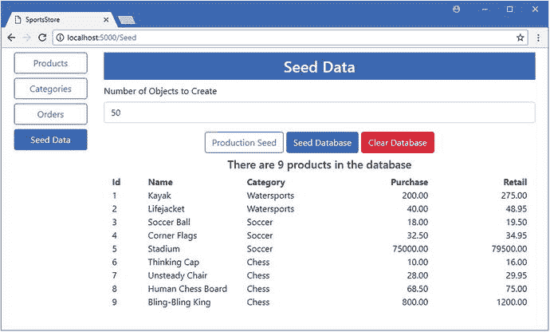
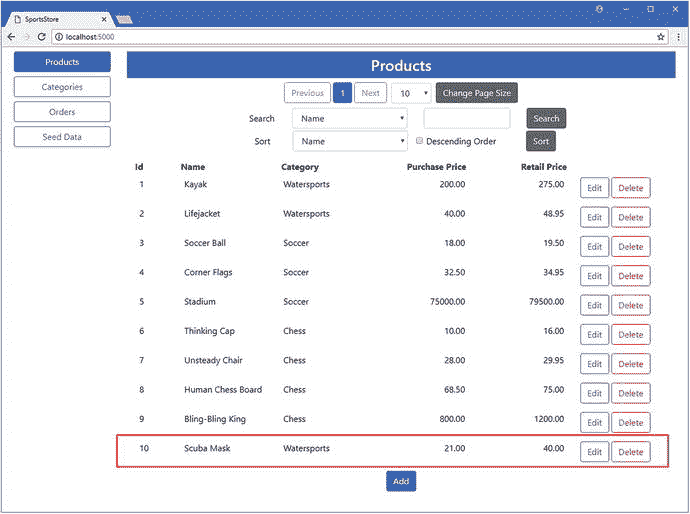

# 十、SportsStore：创建 RESTful Web 服务

Web 服务对于向使用 Angular 或 React 等框架编写的客户端应用提供数据非常有用。这些应用通常在浏览器中运行，不需要其他 SportsStore 提供的 HTML 内容。相反，这些应用使用 HTTP 请求与 ASP.NET Core MVC 应用进行交互，并使用 JavaScript 对象符号(JSON)标准接收数据格式。

在本章中，我将通过添加一个 RESTful web 服务来完成 SportsStore 应用，该服务可以为 web 客户端提供对应用数据的访问。ASP.NET Core MVC 对创建 RESTful web 服务有很好的支持，但是在使用实体框架核心时，要注意获得正确的结果。

对于 web 服务应该如何工作，没有严格的规则，但是最常见的方法是采用表述性状态转移(REST)模式。REST 没有权威的规范，关于 RESTful web 服务的构成也没有一致的意见，但是有一些通用的主题被广泛用于 web 服务。

REST 的核心前提——也是唯一达成广泛共识的方面——是 web 服务通过 URL 和 HTTP 方法(如 GET 和 POST)的组合来定义 API。HTTP 方法指定操作的类型，而 URL 指定操作所应用的数据对象。

## 为本章做准备

对于这一章，我继续使用在第 [4](04.html) 章中创建的 SportsStore 项目，从那以后我一直在这几章中构建这个项目。运行 SportsStore 项目文件夹中清单 [10-1](#Par6) 所示的命令来重置数据库。

```cs
dotnet ef database drop --force
dotnet ef database update

Listing 10-1.Resetting the Example Application Database

```

使用`dotnet run`启动应用，导航到`http://localhost:5000`，单击种子数据按钮，然后单击生产种子。该数据库将植入少量产品，如图 [10-1](#Fig1) 所示。

Tip

您可以从本书的 GitHub 资源库: [`https://github.com/apress/pro-ef-core-2-for-asp.net-core-mvc`](https://github.com/apress/pro-ef-core-2-for-asp.net-core-mvc) 下载本章的 SportsStore 项目以及其他章节的项目。



图 10-1。

Running the example application

## 创建 Web 服务

在接下来的小节中，我构建了一个简单的 web 服务，它提供了对 SportsStore 应用存储的`Product`数据的访问。

### 创建存储库

当向应用添加 web 服务时，创建一个单独的存储库是一个好主意，因为客户端应用执行的查询可能与常规的 ASP.NET Core MVC 应用不同。对于 SportsStore web 服务，我在`Models`文件夹中添加了一个名为`IWebServiceRepository.cs`的文件，并用它来定义清单 [10-2](#Par11) 中所示的接口。

```cs
namespace SportsStore.Models {

    public interface IWebServiceRepository {

        object GetProduct(long id);

    }
}

Listing 10-2.The Contents of the IWebServiceRepository.cs File in the Models Folder

```

我从一个`GetProduct`方法开始，它将接受一个主键值并从数据库返回相应的`Product`对象。`GetProduct`方法返回一个`object`结果，而不是一个`Product`，这样我就可以演示如何从 web 服务中呈现实体框架核心数据。

对于存储库实现类，我在`Models`文件夹中添加了一个名为`WebServiceRepository.cs`的文件，并用它来定义清单 [10-3](#Par14) 中所示的类。

```cs
using System.Linq;

namespace SportsStore.Models {

    public class WebServiceRepository : IWebServiceRepository {
        private DataContext context;

        public WebServiceRepository(DataContext ctx) => context = ctx;

        public object GetProduct(long id) {
            return context.Products.FirstOrDefault(p => p.Id == id);
        }
    }
}

Listing 10-3.The Contents of the WebServiceRepository.cs File in the Models Folder

```

该类通过使用 LINQ `FirstOrDefault`方法来定位存储在数据库中具有指定的`Id`值的对象，从而实现了`GetProduct`方法。创建 web 服务时，处理对不存在的数据的请求是很重要的，这也是我使用`FirstOrDefault`方法的原因。

为了注册存储库及其实现类，我将清单 [10-4](#Par17) 中所示的语句添加到了`Startup`类中。

```cs
using System;
using System.Collections.Generic;
using System.Linq;
using System.Threading.Tasks;
using Microsoft.AspNetCore.Builder;
using Microsoft.AspNetCore.Hosting;
using Microsoft.AspNetCore.Http;
using Microsoft.Extensions.DependencyInjection;
using SportsStore.Models;
using Microsoft.EntityFrameworkCore;
using Microsoft.Extensions.Configuration;

namespace SportsStore {
    public class Startup {

        public Startup(IConfiguration config) => Configuration = config;

        public IConfiguration Configuration { get; }

        public void ConfigureServices(IServiceCollection services) {
            services.AddMvc();
            services.AddTransient<IRepository, DataRepository>();
            services.AddTransient<ICategoryRepository, CategoryRepository>();
            services.AddTransient<IOrdersRepository, OrdersRepository>();
            services.AddTransient<IWebServiceRepository, WebServiceRepository>();
            string conString = Configuration["ConnectionStrings:DefaultConnection"];
            services.AddDbContext<DataContext>(options =>
                options.UseSqlServer(conString));

            services.AddDistributedSqlServerCache(options => {
                options.ConnectionString = conString;
                options.SchemaName = "dbo";
                options.TableName = "SessionData";
            });
            services.AddSession(options => {
                options.Cookie.Name = "SportsStore.Session";
                options.IdleTimeout = System.TimeSpan.FromHours(48);
                options.Cookie.HttpOnly = false;
            });
        }

        public void Configure(IApplicationBuilder app, IHostingEnvironment env) {
            app.UseDeveloperExceptionPage();
            app.UseStatusCodePages();
            app.UseStaticFiles();
            app.UseSession();
            app.UseMvcWithDefaultRoute();
        }
    }
}

Listing 10-4.Configuring the Repository in the Startup.cs File in the SportsStore Folder

```

### 创建 API 控制器

ASP.NET Core MVC 使得使用标准控制器特性向应用添加 web 服务变得容易。我在`Controllers`文件夹中添加了一个名为`ProductValuesController.cs`的类，并添加了清单 [10-5](#Par19) 中所示的代码。

```cs
using Microsoft.AspNetCore.Mvc;
using SportsStore.Models;

namespace SportsStore.Controllers {

    [Route("api/products")]
    public class ProductValuesController : Controller {
        private IWebServiceRepository repository;

        public ProductValuesController(IWebServiceRepository repo)
            => repository = repo;

        [HttpGet("{id}")]
        public object GetProduct(long id) {
            return repository.GetProduct(id) ?? NotFound();
        }
    }
}

Listing 10-5.The Contents of the ProductValuesController.cs File in the Controllers Folder

```

这个新控制器类的名称是`ProductValuesController`，它遵循了在名称中包含单词`Values`的惯例，以表明控制器将向其客户端而不是 HTML 返回数据。web 服务控制器的另一个约定是创建路由模式的独立部分，专门用于处理数据请求。最常见的方法是为 web 服务创建以`/api`开头的 URL，后跟 web 服务处理的数据类型名称的复数形式。对于处理`Product`对象的 web 服务，这意味着 HTTP 请求应该被发送到`/api/products` URL，我已经使用`Route`属性对其进行了配置，如下所示:

```cs
...
[Route("api/products")]
...

```

控制器当前定义的唯一动作是`GetProduct`方法，该方法基于主键返回单个`Product`对象，主键是分配给其`Id`属性的值。action 方法用`HttpGet`方法修饰，这将允许 ASP.NET Core MVC 使用这个动作来处理 HTTP GET 请求。

```cs
...

[HttpGet("{id}")]

public Product GetProduct(long id) {
...

```

该属性的参数扩展了由`Route`属性定义的 URL 模式，以便通过形式为`/api/products/{id}`的 URL 可以到达`GetProduct`方法。web 服务返回的操作方法。NET 对象，这些对象被自动序列化并发送到客户端。

为了防止 web 服务在请求一个不存在的对象时序列化一个`null`响应，action 方法使用空合并操作符来调用`NotFound`方法，如下所示:

```cs
...
return repository.GetProduct(id) ?? NotFound();
...

```

这将返回一个 404 - Not Found 状态代码，向客户端发出请求不能被满足的信号。

### 测试 Web 服务

为了测试新的 web 服务，使用`dotnet run`启动应用。打开一个新的 PowerShell 窗口，执行清单 [10-6](#Par30) 中所示的命令，向 API 控制器发送一个 HTTP get 请求。

Note

在本章中，我使用 PowerShell `Invoke-RestMethod`命令来模拟来自客户端应用的请求。

```cs
Invoke-RestMethod http://localhost:5000/api/products/1 -Method GET | ConvertTo-Json

Listing 10-6.Testing the Web Service

```

HTTP 请求被分派给`ProductValues`控制器上的`GetProduct`方法，该控制器使用`Find`方法从数据库中检索一个`Product`对象。`Product`对象被序列化为 JSON 格式并返回给浏览器，浏览器将显示它接收到的数据。

```cs
{
 "id":1,
 "name":"Kayak",
 "description":"A boat for one person",
 "purchasePrice":200.00,
 "retailPrice":275.00,
 "categoryId":1,
 "category":null
}

```

注意,`category`导航属性被设置为`null`,因为我没有要求实体框架核心为`Product`对象加载相关数据。

### 投影结果以排除空导航属性

向客户端应用发送包含`null`属性的数据可能会导致混淆，因为可能不清楚是没有相关数据，还是有相关数据，但只是没有包含在响应中。您对数据模型有足够的了解，知道`categoryId`值表示有相关的数据，但是期望客户端应用做出这种区分是有问题的，尤其是如果它是由不同的程序员团队开发的话。如果您不想包含相关的数据属性，您可以通过使用 LINQ 来投影一个从结果中排除外键和导航属性的结果来避免混淆，如清单 [10-7](#Par35) 所示。

```cs
using System.Linq;

namespace SportsStore.Models {

    public class WebServiceRepository : IWebServiceRepository {
        private DataContext context;

        public WebServiceRepository(DataContext ctx) => context = ctx;

        public object GetProduct(long id) {
            return context.Products
                .Select(p => new { Id = p.Id, Name = p.Name,
                    Description = p.Description, PurchasePrice = p.PurchasePrice,
                    RetailPrice = p.RetailPrice})
                .FirstOrDefault(p => p.Id == id);
        }
    }
}

Listing 10-7.Excluding Properties in the WebServiceRepository.cs File in the Models Folder

```

我使用 LINQ `Select`方法挑选我希望包含在结果中的属性，并使用`FirstOrDefault`方法选择具有指定主键值的对象。使用`dotnet run`重启应用，并使用单独的 PowerShell 窗口执行清单 [10-8](#Par37) 中所示的命令。

```cs
Invoke-RestMethod http://localhost:5000/api/products/1 -Method GET | ConvertTo-Json

Listing 10-8.Requesting a Product Object

```

该请求的结果是以下 JSON 数据，其中不包括相关的数据属性:

```cs
{
 "id":1,
 "name":"Kayak",
 "description":"A boat for one person",
 "purchasePrice":200.00,
 "retailPrice":275.00
}

```

如果您检查由应用生成的日志记录消息，您将看到实体框架核心仅从数据库请求了指定的属性。

```cs
...
SELECT TOP(1) [p].[Id], [p].[Name], [p].[Description], [p].[PurchasePrice],
    [p].[RetailPrice]
FROM [Products] AS [p]
WHERE [p].[Id] = @__id_0
...

```

### 在 Web 服务响应中包含相关数据

如果您希望在 web 服务响应中包含相关数据，就需要小心了。为了演示这个问题，我修改了存储库使用的查询，这样它使用`Include`方法来选择与`Product`对象相关联的`Category`对象，如清单 [10-9](#Par43) 所示。

```cs
using System.Linq;

using Microsoft.EntityFrameworkCore;

namespace SportsStore.Models {

    public class WebServiceRepository : IWebServiceRepository {
        private DataContext context;

        public WebServiceRepository(DataContext ctx) => context = ctx;

        public object GetProduct(long id) {
            return context.Products.Include(p => p.Category)
                .FirstOrDefault(p => p.Id == id);
        }
    }
}

Listing 10-9.Including Related Data in the WebServiceRepository.cs File in the Models Folder

```

要查看这段代码隐藏的问题，请使用`dotnet run`启动应用，并使用一个单独的 PowerShell 窗口来执行清单 [10-10](#Par45) 中所示的命令。

```cs
Invoke-RestMethod http://localhost:5000/api/products/1 -Method GET | ConvertTo-Json

Listing 10-10.Requesting Related Data

```

您将看到以下错误消息，而不是 JSON 数据:

```cs
Invoke-RestMethod : Unable to read data from the transport connection: The connection was closed.

```

ASP.NET Core MVC 使用一个名为 Json.NET 的包来处理序列化，需要一个配置更改来揭示错误的原因，如清单 [10-11](#Par49) 所示。

```cs
using System;
using System.Collections.Generic;
using System.Linq;
using System.Threading.Tasks;
using Microsoft.AspNetCore.Builder;
using Microsoft.AspNetCore.Hosting;
using Microsoft.AspNetCore.Http;
using Microsoft.Extensions.DependencyInjection;
using SportsStore.Models;
using Microsoft.EntityFrameworkCore;
using Microsoft.Extensions.Configuration;

using Newtonsoft.Json;

namespace SportsStore {
    public class Startup {

        public Startup(IConfiguration config) => Configuration = config;

        public IConfiguration Configuration { get; }

        public void ConfigureServices(IServiceCollection services) {
            services.AddMvc().AddJsonOptions(opts =>
                opts.SerializerSettings.ReferenceLoopHandling
                    = ReferenceLoopHandling.Serialize);
            services.AddTransient<IRepository, DataRepository>();
            services.AddTransient<ICategoryRepository, CategoryRepository>();
            services.AddTransient<IOrdersRepository, OrdersRepository>();
            services.AddTransient<IWebServiceRepository, WebServiceRepository>();
            string conString = Configuration["ConnectionStrings:DefaultConnection"];
            services.AddDbContext<DataContext>(options =>
                options.UseSqlServer(conString));

            services.AddDistributedSqlServerCache(options => {
                options.ConnectionString = conString;
                options.SchemaName = "dbo";
                options.TableName = "SessionData";
            });
            services.AddSession(options => {
                options.Cookie.Name = "SportsStore.Session";
                options.IdleTimeout = System.TimeSpan.FromHours(48);
                options.Cookie.HttpOnly = false;
            });
        }

        public void Configure(IApplicationBuilder app, IHostingEnvironment env) {
            app.UseDeveloperExceptionPage();
            app.UseStatusCodePages();
            app.UseStaticFiles();
            app.UseSession();
            app.UseMvcWithDefaultRoute();
        }
    }
}

Listing 10-11.Changing the Serializer Configuration in the Startup.cs File in the SportsStore Folder

```

使用`dotnet run`重启应用。不使用 PowerShell，而是打开一个新的浏览器窗口并请求`http://localhost:5000/api/products/1` URL。当浏览器请求数据时，您将看到应用报告以下错误并退出:

```cs
...
Process is terminating due to StackOverflowException
...

```

浏览器显示的内容揭示了发生了什么。尽管您请求的 URL 指向一个单独的`Product`对象及其相关的`Category`，但是在应用崩溃之前，它已经发送了大量的数据。

```cs
...
{"id":1,"name":"Kayak","description":"A boat for one person",
    "purchasePrice":200.00,"retailPrice":275.00,"categoryId":1,
    "category": {"id":1,"name":"Watersports",
        "description":"Make a splash",
        "products":[{"id":1,"name":"Kayak",
            "description":"A boat for one person",
           "purchasePrice":200.00,"retailPrice":275.00,
           "categoryId":1,
           "category":{"id":1,"name":"Watersports",
               "description":"Make a splash",
               "products":[{"id":1,"name":"Kayak","description":"A boat for one
...

```

有一个死循环，其中`Product`对象的`Category`导航属性指向其相关的`Category`对象，其`Products`导航属性包括`Product`对象，依此类推。这是由名为 fixing up 的实体框架核心特性引起的，在该特性中，从数据库接收的对象被用作导航属性的值。我在第 [14](14.html) 章中详细描述了修复过程，并解释了它什么时候有用，但是对于 RESTful web 服务来说，这个特性会带来一些问题，因为 JSON 序列化程序会一直跟踪导航属性，直到应用遇到堆栈溢出。清单 [10-11](#Par49) 中的配置更改告诉 JSON 序列化器保持跟踪引用，即使它已经序列化了一个对象。默认行为是在检测到循环时抛出异常，这就是清单 [10-10](#Par45) 中的错误原因。

#### 避免相关数据中的循环引用

没有办法禁用修复功能，因此避免相关数据无限循环的最佳解决方案是在导航属性到达 JSON 序列化器之前将其设置为`null`以创建一个动态类型，这样结果中就会包含`no` null 值，这是我在清单 [10-12](#Par56) 中采用的方法。

```cs
using System.Linq;
using Microsoft.EntityFrameworkCore;

namespace SportsStore.Models {

    public class WebServiceRepository : IWebServiceRepository {
        private DataContext context;

        public WebServiceRepository(DataContext ctx) => context = ctx;

        public object GetProduct(long id) {
            return context.Products.Include(p => p.Category)
                .Select(p => new {
                    Id = p.Id, Name = p.Name, PurchasePrice = p.PurchasePrice,
                    Description = p.Description, RetailPrice = p.RetailPrice,
                    CategoryId = p.CategoryId,
                    Category = new {
                        Id = p.Category.Id,
                        Name = p.Category.Name,
                        Description = p.Category.Description
                    }
                })
                .FirstOrDefault(p => p.Id == id);
        }
    }
}

Listing 10-12.Avoiding an Endless Loop in the WebServiceRepository.cs File in the Models Folder

```

使用`dotnet run`启动应用，并使用单独的 PowerShell 窗口执行清单 [10-13](#Par58) 中所示的命令。

```cs
Invoke-RestMethod http://localhost:5000/api/products/1 -Method GET | ConvertTo-Json

Listing 10-13.Requesting Related Data

```

该命令产生以下 JSON 结果，其中包括所有相关数据，但不包含循环引用:

```cs
...
{
    "id":  1,
    "name":  "Kayak",
    "purchasePrice":  200.00,
    "description":  "A boat for one person",
    "retailPrice":  275.00,
    "categoryId":  1,
    "category":  
    {
      "id":  1,
      "name":  "Watersports",
      "description":  "Make a splash"
    }
}
...

```

### 查询多个对象

当处理多个对象的查询时，限制发送到客户端应用的数据量是很重要的。如果您只是简单地返回数据库中的所有对象，那么您将增加运行应用的成本，甚至可能使客户端应用不堪重负。在清单 [10-14](#Par62) 中，我向 web 服务存储库接口添加了一个方法，该方法允许客户为结果指定一个起始索引以及他们需要的对象数量。

```cs
namespace SportsStore.Models {

    public interface IWebServiceRepository {

        object GetProduct(long id);

        object GetProducts(int skip, int take);
    }
}

Listing 10-14.Adding a Method in the IWebServiceRepository.cs File in the Models Folder

```

在清单 [10-15](#Par64) 中，我在实现类中添加了方法，并使用了上一节中的技术来避免相关数据的循环引用。

```cs
using System.Linq;
using Microsoft.EntityFrameworkCore;

namespace SportsStore.Models {

    public class WebServiceRepository : IWebServiceRepository {
        private DataContext context;

        public WebServiceRepository(DataContext ctx) => context = ctx;

        public object GetProduct(long id) {
            return context.Products.Include(p => p.Category)
                .Select(p => new {
                    Id = p.Id, Name = p.Name, PurchasePrice = p.PurchasePrice,
                    Description = p.Description, RetailPrice = p.RetailPrice,
                    CategoryId = p.CategoryId,
                    Category = new {
                        Id = p.Category.Id,
                        Name = p.Category.Name,
                        Description = p.Category.Description
                    }
                })
                .FirstOrDefault(p => p.Id == id);
        }

        public object GetProducts(int skip, int take) {
            return context.Products.Include(p => p.Category)
                .OrderBy(p => p.Id)
                .Skip(skip)
                .Take(take)
                .Select(p => new {
                     Id = p.Id, Name = p.Name, PurchasePrice = p.PurchasePrice,
                     Description = p.Description, RetailPrice = p.RetailPrice,
                     CategoryId = p.CategoryId,
                     Category = new {
                         Id = p.Category.Id,
                         Name = p.Category.Name,
                         Description = p.Category.Description
                     }
                 });
        }
    }
}

Listing 10-15.Adding a Method in the WebServiceRepository.cs File in the Models Folder

```

在清单 [10-16](#Par66) 中，我向 web 服务控制器添加了一个动作，允许客户机请求多个对象。

```cs
using Microsoft.AspNetCore.Mvc;
using SportsStore.Models;

namespace SportsStore.Controllers {

    [Route("api/products")]
    public class ProductValuesController : Controller {
        private IWebServiceRepository repository;

        public ProductValuesController(IWebServiceRepository repo)
            => repository = repo;

        [HttpGet("{id}")]
        public object GetProduct(long id) {
            return repository.GetProduct(id) ?? NotFound();
        }

        [HttpGet]
        public object Products(int skip, int take) {
            return repository.GetProducts(skip, take);
        }
    }
}

Listing 10-16.Adding an Action in the ProductValuesController.cs File in the Controllers Folder

```

为了测试新的动作方法，使用`dotnet run`启动应用，并使用一个单独的 PowerShell 窗口来执行清单 [10-17](#Par68) 中所示的命令。

```cs
Invoke-RestMethod http://localhost:5000/api/products?skip=2"&"take=2 -Method GET | ConvertTo-Json

Listing 10-17.Querying for Multiple Objects

```

HTTP 请求要求 web 服务跳过前两个对象，然后返回接下来的两个对象，这将产生以下结果:

```cs
...
{
  "value":  [
    {
      "id":  3,
      "name":  "Soccer Ball",
      "purchasePrice":  18.00,
      "description":  "FIFA-approved size and weight",
      "retailPrice":  19.50,
      "categoryId":  2,
      "category":  {
        "id":  2,
        "name":  "Soccer",
        "description":  "The World\u0027s Favorite Game"
      }
    },
    {
      "id":  4,
      "name":  "Corner Flags",
      "purchasePrice":  32.50,
      "description":  "Give your playing field a professional touch",
      "retailPrice":  34.95,
      "categoryId":  2,
      "category":  {
        "id":  2,
        "name":  "Soccer",
        "description":  "The World\u0027s Favorite Game"
      }
    }],
    "Count":  2
}
...

```

## 完成 Web 服务

如前一节所述，使用实体框架核心数据的 web 服务的复杂性在于响应的序列化。其他标准数据操作遵循与前面章节所示相同的模式。在清单 [10-18](#Par72) 中，我向存储库添加了方法，以允许存储、更新和删除对象。

```cs
namespace SportsStore.Models {

    public interface IWebServiceRepository {

        object GetProduct(long id);

        object GetProducts(int skip, int take);

        long StoreProduct(Product product);

        void UpdateProduct(Product product);

        void DeleteProduct(long id);
    }
}

Listing 10-18.Adding Methods in the IWebServiceRepository.cs File in the Models Folder

```

在清单 [10-19](#Par74) 中，我已经将新方法添加到存储库实现类中。

```cs
using System.Linq;
using Microsoft.EntityFrameworkCore;

namespace SportsStore.Models {

    public class WebServiceRepository : IWebServiceRepository {
        private DataContext context;

        public WebServiceRepository(DataContext ctx) => context = ctx;

        public object GetProduct(long id) {
            return context.Products.Include(p => p.Category)
                .Select(p => new {
                    Id = p.Id, Name = p.Name, PurchasePrice = p.PurchasePrice,
                    Description = p.Description, RetailPrice = p.RetailPrice,
                    CategoryId = p.CategoryId,
                    Category = new {
                        Id = p.Category.Id,
                        Name = p.Category.Name,
                        Description = p.Category.Description
                    }
                })
                .FirstOrDefault(p => p.Id == id);
        }

        public object GetProducts(int skip, int take) {
            return context.Products.Include(p => p.Category)
                .OrderBy(p => p.Id)
                .Skip(skip)
                .Take(take)
                .Select(p => new {
                     Id = p.Id, Name = p.Name, PurchasePrice = p.PurchasePrice,
                     Description = p.Description, RetailPrice = p.RetailPrice,
                     CategoryId = p.CategoryId,
                     Category = new {
                         Id = p.Category.Id,
                         Name = p.Category.Name,
                         Description = p.Category.Description
                     }
                 });
        }

        public long StoreProduct(Product product) {
            context.Products.Add(product);
            context.SaveChanges();
            return product.Id;
        }

        public void UpdateProduct(Product product) {
            context.Products.Update(product);
            context.SaveChanges();
        }

        public void DeleteProduct(long id) {
            context.Products.Remove(new Product { Id = id });
            context.SaveChanges();
        }
    }
}

Listing 10-19.Adding Methods in the WebServiceRepository.cs File in the Models Folder

```

注意，`StoreProduct`方法返回数据库服务器分配给`Product`对象的主键值。客户端应用通常保留自己的数据模型，确保它们拥有执行后续操作所需的信息而不需要执行额外的查询非常重要。

### 更新控制器

在清单 [10-20](#Par77) 中，我已经更新了 web 服务控制器，添加了与新的存储库方法相对应的动作。

```cs
using Microsoft.AspNetCore.Mvc;
using SportsStore.Models;

namespace SportsStore.Controllers {

    [Route("api/products")]
    public class ProductValuesController : Controller {
        private IWebServiceRepository repository;

        public ProductValuesController(IWebServiceRepository repo)
            => repository = repo;

        [HttpGet("{id}")]
        public object GetProduct(long id) {
            return repository.GetProduct(id) ?? NotFound();
        }

        [HttpGet]
        public object Products(int skip, int take) {
            return repository.GetProducts(skip, take);
        }

        [HttpPost]
        public long StoreProduct([FromBody] Product product) {
            return repository.StoreProduct(product);
        }

        [HttpPut]
        public void UpdateProduct([FromBody] Product product) {
            repository.UpdateProduct(product);
        }

        [HttpDelete("{id}")]
        public void DeleteProduct(long id) {
            repository.DeleteProduct(id);
        }
    }
}

Listing 10-20.Adding Actions in the ProductValuesController.cs File in the Controllers Folder

```

为了测试存储一个新对象，使用`dotnet run`启动应用，并使用一个单独的 PowerShell 窗口来执行清单 [10-21](#Par79) 中所示的命令。

```cs
Invoke-RestMethod http://localhost:5000/api/products -Method POST -Body (@{Name="Scuba Mask"; Description="Spy on the Fish"; PurchasePrice=21; RetailPrice=40;CategoryId=1} | ConvertTo-Json) -ContentType "application/json"

Listing 10-21.Storing New Data

```

这个命令很难输入，但是它向服务器发送一个 HTTP POST 请求，请求中包含了在数据库中存储一个`Product`对象所需的所有属性值。一旦命令完成，使用浏览器窗口导航到`http://localhost:5000`，你会看到新的对象，如图 [10-2](#Fig2) 所示。



图 10-2。

Storing an object through the RESTful web service

为了测试更新特性，使用 PowerShell 窗口运行清单 [10-22](#Par82) 中所示的命令，修改`Kayak`产品。

```cs
Invoke-RestMethod http://localhost:5000/api/products -Method PUT -Body (@{Id=1;Name="Green Kayak"; Description="A Tiny Boat"; PurchasePrice=200; RetailPrice=300;CategoryId=1} | ConvertTo-Json) -ContentType "application/json"

Listing 10-22.Modifying Data

```

重新加载浏览器窗口，您会看到`Kayak`产品的`RetailPrice`值已经更改为`300`，其名称现在为`Green Kayak`。

为了测试删除数据的能力，使用 PowerShell 窗口运行清单 [10-23](#Par85) 中所示的命令。

```cs
Invoke-RestMethod http://localhost:5000/api/products/1 -Method DELETE

Listing 10-23.Deleting an Object

```

## 常见问题和解决方案

web 服务的大多数问题都与我在本章前面描述的序列化问题有关。然而，还有一些不太常见的问题，我将在接下来的章节中描述它们。

### 存储或更新对象时属性值为空

如果由 MVC 模型绑定器创建的对象的某些属性为 null 或零值，那么最可能的原因是您从 action method 参数中省略了`FromBody`属性。默认情况下，只有 URL 用于值，当您希望 MVC 框架使用请求的其他部分时，您必须显式地选择数据源。

### 缓慢的 Web 服务请求

请求缓慢的最常见原因是枚举一个`IQueryable<T>`对象并意外触发了一个查询。如果您在 JSON 序列化之前处理数据，这是很容易做到的，记住`IQueryable<T>`对象将在它被枚举的任何地方查询数据库，而不仅仅是在 Razor 视图中，这一点很重要。

### “无法为标识列插入显式值”异常

如果您在编写 web 服务时收到此异常，那么最有可能的原因是客户端在要存储在数据库中的对象中包含了一个主键值。如果您正在编写客户端应用，那么您可以确保 HTTP 请求不包含值。如果第三方应用正在使用您的 web 服务，那么您可以在请求实体框架核心存储数据之前，显式地将 action 方法中的 primary key 属性置零。

## 摘要

在本章中，我通过添加一个简单的 RESTful web 服务完成了 SportsStore 应用，该服务可用于向客户端应用提供数据。我向您展示了使用相关数据可能导致的常见问题，并向您展示了如何通过创建动态类型来避免这些问题。在本书的下一部分，我将开始更深入地描述实体框架的核心特性。