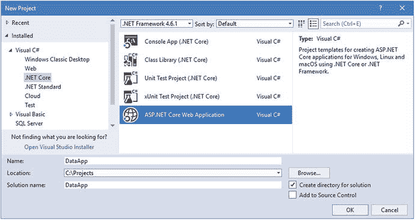
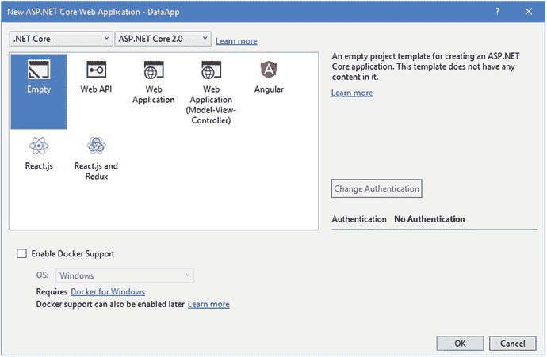
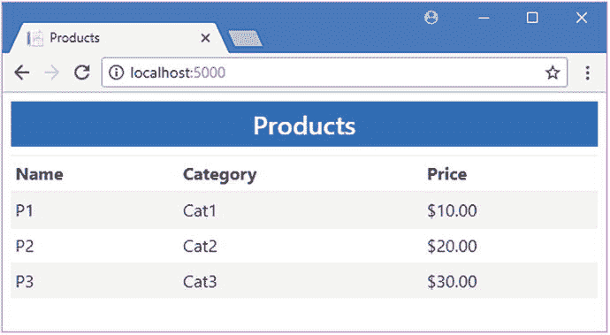
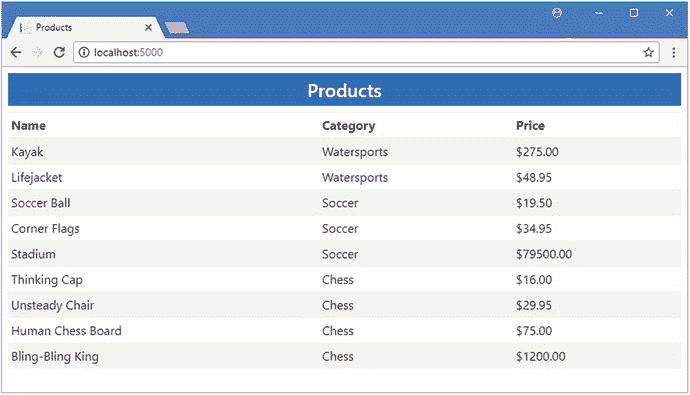
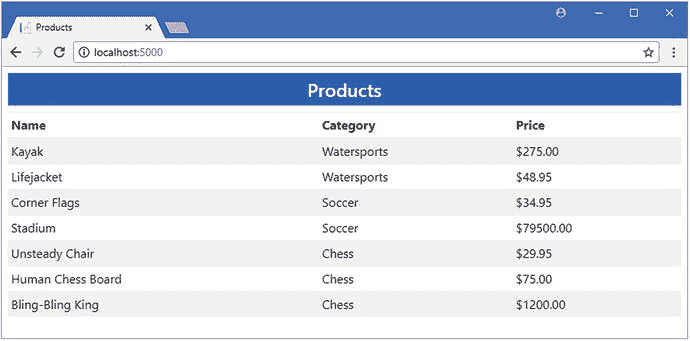
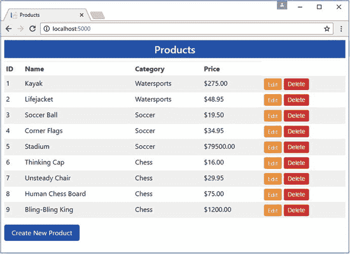

# 十一、使用实体框架核心

在这一章中，我将解释如何将 Entity Framework Core 应用到 ASP.NET Core MVC 项目中，从添加 NuGet 包开始，一直到创建基本数据模型、数据库模式和使用它的基础设施。本章中创建的项目为后面添加实体框架核心特性的项目奠定了基础。表 [11-1](#Tab1) 总结了本章内容。

表 11-1。

Chapter Summary

<colgroup><col> <col> <col></colgroup> 
| 问题 | 解决办法 | 列表 |
| --- | --- | --- |
| 启用 EF 核心命令行工具 | 使用一个`DotNetCliToolReference`元素向`.csproj`文件添加一个条目 | Ten |
| 为应用提供对 EF 核心功能的访问 | 创建数据库上下文类 | Eleven |
| 为数据库存储准备数据模型类 | 确保所有属性都有 get 和 set 子句，并添加一个主键属性 | Twelve |
| 向 EF 核心提供其应使用的数据库的详细信息 | 定义连接字符串 | Fourteen |
| 准备与 EF 核心一起使用的数据库 | 创建并应用数据库迁移 | Seventeen |
| 确保查询由数据库处理 | 使用`IQueryable<T>`界面 | 24–26 |
| 避免重复查询 | 在枚举结果之前强制执行查询 | 27, 28 |

## 创建 ASP.NET Core MVC 项目

对于这一章，我将创建一个项目，只包含 ASP.NET Core 所需的最少内容。然后，我将添加包、类和配置组件来创建一个使用实体框架核心的 MVC 应用。

要创建项目，从 Visual Studio 文件菜单中选择新建➤项目，并使用 ASP.NET Core Web 应用模板创建一个名为 DataApp 的新项目，如图 [11-1](#Fig1) 所示。



图 11-1。

Creating a new application

点击 OK 按钮，进入下一个对话窗口。确保从列表中选择 ASP.NET Core 2.0，点击空模板，如图 [11-2](#Fig2) 所示。单击“确定”关闭对话框窗口并创建项目。



图 11-2。

Configuring the project

### 创建数据模型类

MVC 应用中的数据模型是使用常规 C# 类定义的，通常定义在一个名为`Models`的文件夹中。Entity Framework Core 对数据模型类的位置没有任何特殊要求，并且可以很好地与 MVC 约定一起工作。

要向示例项目添加一个数据模型类，创建`Models`文件夹，并向其中添加一个名为`Product.cs`的 C# 文件，代码如清单 [11-1](#Par7) 所示。

```cs
namespace DataApp.Models {

    public class Product {

        public string Name { get; set; }
        public string Category { get; set; }
        public decimal Price { get; set; }
    }
}

Listing 11-1.The Contents of the Product.cs File in the Models Folder

```

数据模型类往往是简单的属性集合，这使得它们易于使用，并确保它们可以用 JSON 之类的格式表示，这种格式经常被 HTTP web 服务使用，如第 [10 章](10.html)所示。清单 [11-1](#Par7) 中的`Product`类定义了`Name`、`Category`和`Price`属性，是对第 1 部分中的 SportsStore 示例的数据模型的简化。我将在后面的章节中增加数据模型的复杂性，但这已经足够开始了。

### 配置服务和中间件

这个空模板创建了一个基本的 ASP.NET Core 项目，它需要额外的配置来启用 MVC 框架。将清单 [11-2](#Par10) 中所示的语句添加到`Startup`类中，以启用对开发有用的 MVC 框架和中间件组件。

```cs
using System;
using System.Collections.Generic;
using System.Linq;
using System.Threading.Tasks;
using Microsoft.AspNetCore.Builder;
using Microsoft.AspNetCore.Hosting;
using Microsoft.AspNetCore.Http;
using Microsoft.Extensions.DependencyInjection;

namespace DataApp {
    public class Startup {

        public void ConfigureServices(IServiceCollection services) {
            services.AddMvc();
        }

        public void Configure(IApplicationBuilder app, IHostingEnvironment env) {
            app.UseDeveloperExceptionPage();
            app.UseStatusCodePages();
            app.UseStaticFiles();
            app.UseMvcWithDefaultRoute();
        }
    }
}

Listing 11-2.Enabling Services and Middleware in the Startup.cs File in the DataApp Folder

```

这些更改启用了开发人员友好的错误消息，添加了对静态内容(如 HTML 和 CSS 文件)的支持，并使用默认路由配置设置了 MVC 框架。

### 添加控制器和视图

既然 MVC 框架已经启用，我可以创建一个控制器和一个视图来处理 HTTP 请求。创建一个`Controllers`文件夹，并添加一个名为`HomeController.cs`的 C# 类文件，代码如清单 [11-3](#Par13) 所示。

```cs
using Microsoft.AspNetCore.Mvc;
using DataApp.Models;

namespace DataApp.Controllers {
    public class HomeController : Controller {

        public IActionResult Index() {
            return View(new Product[] {
                new Product { Name = "P1", Category = "Cat1", Price = 10 },
                new Product { Name = "P2", Category = "Cat2", Price = 20 },
                new Product { Name = "P3", Category = "Cat3", Price = 30 },
            });
        }
    }
}

Listing 11-3.The Content of the HomeController.cs File in the Controllers Folder

```

这个控制器中有一个名为`Index`的动作方法，它创建一个占位符`Product`对象的集合，作为视图模型对象传递给默认视图。这些静态对象将在本章稍后数据库和实体框架核心启动并运行时被替换。

为了给应用提供一致的布局，创建一个名为`Views/Shared`的文件夹，并添加一个名为`_Layout.cshtml`的 Razor 布局页面，内容如清单 [11-4](#Par16) 所示。

```cs
<!DOCTYPE html>
<html>
<head>
    <meta name="viewport" content="width=device-width" />
    <title>@ViewData["Title"]</title>
    <link rel="stylesheet" href="∼/lib/bootstrap/dist/css/bootstrap.min.css" />
</head>
<body>
    <div class="p-2">
        <h4 class="bg-primary text-center p-2 text-white">@ViewData["Title"]</h4>
        @RenderBody()
    </div>
</body>
</html>
Listing 11-4.The Content of the _Layout.cshtml File in the Views/Shared Folder

```

为了在`Home`控制器上创建`Index`动作方法的视图，创建`Views/Home`文件夹并添加一个名为`Index.cshtml`的 Razor 视图，其内容如清单 [11-5](#Par18) 所示。

```cs
@model IEnumerable<Product>
@{
    ViewData["Title"] = "Products";
    Layout = "_Layout";
}

<table class="table table-sm table-striped">
    <thead>
        <tr><th>Name</th><th>Category</th><th>Price</th></tr>
    </thead>
    <tbody>
        @foreach (var p in Model) {
            <tr>
                <td>@p.Name</td>
                <td>@p.Category</td>
                <td>$@p.Price.ToString("F2")</td>
            </tr>
        }
    </tbody>
</table>

Listing 11-5.The Contents of the Index.cshtml File in the Views/Home Folder

```

视图使用从控制器接收的`Product`对象集合作为其视图模型，在 HTML 表中生成行，显示`Name`、`Category`和`Price`属性的值。

为了启用标记助手，我在`Views`文件夹中创建了一个名为`_ViewImports.cshtml`的视图导入页面，并添加了清单 [11-6](#Par21) 中所示的语句。

```cs
@using DataApp.Models
@addTagHelper *, Microsoft.AspNetCore.Mvc.TagHelpers
Listing 11-6.The Contents of the _ViewImports.cshtml File in the Views Folder

```

### 添加引导 CSS 框架

您在清单 [11-4](#Par16) 中创建的布局文件包含一个来自 Bootstrap 框架的 CSS 样式表的`link`元素，我用它来设计整本书的 HTML 内容。要将引导程序添加到项目中，右键单击解决方案资源管理器中的 DataApp 项，从弹出菜单中选择添加➤新项，并使用 JSON 文件模板(在 ASP.NET Core➤ Web ➤常规类别中找到)创建一个名为`.bowerrc`的文件，其内容如清单 [11-7](#Par23) 所示。(注意这个文件名很重要:它以句点开头，包含字母`r`两次，没有文件扩展名)。

```cs
{
  "directory": "wwwroot/lib"
}
Listing 11-7.The Contents of the .bowerrc File in the DataApp Folder

```

再次使用 JSON 文件模板创建一个名为`bower.json`的文件，内容如清单 [11-8](#Par25) 所示。

```cs
{
  "name": "asp.net",
  "private": true,
  "dependencies": {
    "bootstrap": "4.0.0"
  }
}
Listing 11-8.The Contents of the bower.json File in the DataApp Folder

```

当您保存对文件的更改时，Visual Studio 将下载新版本的引导程序包，并将其安装在`wwwroot/lib`文件夹中。

### 配置 HTTP 端口

更改 ASP.NET Core 用来接收请求的端口将使示例更容易理解。编辑`Properties`文件夹中的`launchSettings.json`文件，并更改 URL，如清单 [11-9](#Par28) 所示。

```cs
{
  "iisSettings": {
    "windowsAuthentication": false,
    "anonymousAuthentication": true,
    "iisExpress": {
      "applicationUrl": "http://localhost:5000/",
      "sslPort": 0
    }
  },
  "profiles": {
    "IIS Express": {
      "commandName": "IISExpress",
      "launchBrowser": true,
      "environmentVariables": {
        "ASPNETCORE_ENVIRONMENT": "Development"
      }
    },
    "DataApp": {
      "commandName": "Project",
      "launchBrowser": true,
      "environmentVariables": {
        "ASPNETCORE_ENVIRONMENT": "Development"
      },
      "applicationUrl": "http://localhost:5000/"
    }
  }
}
Listing 11-9.Changing the HTTP Ports in the launchSettings.json File in the Properties Folder

```

当使用 IIS Express 启动应用以及从命令行运行应用时，该文件中的 URL 用于配置应用。本书中的示例是从命令行运行的，因此可以很容易地看到日志消息。

### 运行示例应用

使用 Entity Framework Core 需要比您可能习惯的更多的命令行工作，这意味着从命令行启动应用通常是最自然的工作方式，尤其是因为它提供了对有用的日志记录消息的轻松访问。打开命令提示符或 PowerShell 窗口，导航到`DataApp`项目文件夹(包含`Startup.cs`类文件的文件夹)，运行清单 [11-10](#Par31) 中所示的命令。

```cs
dotnet run
Listing 11-10.Testing the Example Application

```

打开一个新的浏览器窗口并导航至`http://localhost:5000`，您将看到如图 [11-3](#Fig3) 所示的响应。确认应用运行正常后，使用 Control+C 停止它。



图 11-3。

Testing the example application

## 添加和配置实体框架核心

现在有了一个基本的 ASP.NET Core MVC 应用，是时候配置实体框架核心，以便它能够代表 MVC 应用存储和检索数据。

### 添加 NuGet 包

Visual Studio 创建的项目被配置为使用 ASP.NET Core 元包，它是在 ASP.NET Core 2 中引入的。单个 NuGet 包提供了对开始项目开发所需的所有单个包的访问，包括 ASP.NET Core、MVC 框架和实体框架核心，这与早期版本不同，早期版本需要在开发开始前手动添加一长串 NuGet 包。

尽管元包非常有用，但是对于使用实体框架核心的项目来说，仍然需要一个额外的东西。许多重要的实体框架核心操作都是使用命令行工具执行的，而提供命令行特性的 NuGet 包不是元包的一部分，必须手动安装。

清单 [11-11](#Par37) 显示了向`DataApp.csproj`文件添加的工具包，您可以通过在解决方案浏览器中右键单击 DataApp 项目项并从弹出菜单中选择 Edit DataApp.csproj 来访问该文件。

```cs
<Project Sdk="Microsoft.NET.Sdk.Web">

  <PropertyGroup>
    <TargetFramework>netcoreapp2.0</TargetFramework>
  </PropertyGroup>

  <ItemGroup>
    <Folder Include="wwwroot\" />
  </ItemGroup>

  <ItemGroup>
    <PackageReference Include="Microsoft.AspNetCore.All" Version="2.0.5" />
    <DotNetCliToolReference Include="Microsoft.EntityFrameworkCore.Tools.DotNet"
        Version="2.0.0" />
  </ItemGroup>

</Project>

Listing 11-11.Adding the Tools Package in the DataApp.csproj File in the DataApp Folder

```

这个包是使用一个`DotNetCliToolReference`元素而不是常规包使用的`PackageReference`添加的。`DotNetCliToolReference`元素用于将命令行工具包添加到项目中，常规的 NuGet 工具不支持它，这也是文件必须手动添加的原因。当您将更改保存到`csproj`文件时，Visual Studio 将下载该包并将其添加到项目中。

### 创建数据库上下文类

数据库上下文类为实体框架核心提供了数据模型类的详细信息，这些数据模型类的实例将存储在数据库中。上下文类是使用实体框架核心的最重要的组件之一。要创建上下文类，在`DataApp/Models`文件夹中添加一个名为`EFDatabaseContext.cs`的类文件，代码如清单 [11-12](#Par40) 所示。

```cs
using Microsoft.EntityFrameworkCore;
using Microsoft.EntityFrameworkCore.Design;
using Microsoft.Extensions.DependencyInjection;

namespace DataApp.Models {
    public class EFDatabaseContext : DbContext {

        public EFDatabaseContext(DbContextOptions<EFDatabaseContext> opts)
            : base(opts) { }

        public DbSet<Product> Products { get; set; }
    }
}

Listing 11-12.The Contents of the EFDatabaseContext.cs File in the Models Folder

```

`EFDatabaseContext`类的构造函数接受一个`DbContextOptions`对象，用于配置实体框架核心。对于 ASP.NET Core MVC 应用，这种配置是在`Startup`类中执行的，如本章后面所演示的，因此构造函数只需将 options 对象传递给基类。

Tip

context 类必须定义一个构造函数，即使它不包含任何代码语句。如果创建没有构造函数的上下文类，将会收到一个错误。

数据库上下文类通过定义返回`DbSet<T>`的属性来告诉实体框架核心哪些数据模型类要存储在数据库中，其中类型参数`T`指定数据模型类。

### 准备实体类

实体框架核心需要能够唯一地标识`Product`对象，以便它们可以存储在数据库中并被分配一个主键。默认情况下，实体框架核心会寻找一个名为`Id`或`<Type>Id`的属性作为键，这意味着对于`Product`类，键属性可以被称为`Id`或`ProductId`。为了准备`Product`类以供实体框架核心存储，编辑`Product`类以添加清单 [11-13](#Par45) 中所示的属性。

```cs
namespace DataApp.Models {

    public class Product {

        public long Id { get; set; }

        public string Name { get; set; }
        public string Category { get; set; }
        public decimal Price { get; set; }
    }
}

Listing 11-13.Adding a Key Property in the Product.cs File in the Models Folder

```

键属性的类型影响实体框架核心如何处理它。对于数字类型，比如`int`和`long`，模式将被配置为由数据库负责生成唯一的键值。这对于 ASP.NET Core MVC 应用非常有用，在这些应用中，可能有多个应用实例共享同一个数据库，并且协调唯一值可能很复杂。对于其他类型，如`string`，属性仍将被用作键，但应用负责生成值。我在第 [19 章](19.html)中描述了使用按键的高级选项。

### 更新控制器

要用使用实体框架核心获得的对象替换静态数据，打开`HomeController.cs`文件并进行清单 [11-14](#Par48) 中所示的更改。

```cs
using Microsoft.AspNetCore.Mvc;
using DataApp.Models;

namespace DataApp.Controllers {
    public class HomeController : Controller {
        private EFDatabaseContext context;

        public HomeController(EFDatabaseContext ctx) {
            context = ctx;
        }

        public IActionResult Index() {
            return View(context.Products);
        }
    }
}

Listing 11-14.Using Real Data in the HomeController.cs File in the Controllers Folder

```

控制器的构造器将接收一个上下文对象，该对象将由 ASP.NET Core 依赖注入特性提供，提供应用的 MVC 和实体框架核心部分之间的链接。

`Index`动作方法的工作是为其视图提供一组要显示的`Product`对象。这个集合现在是通过读取数据库上下文的`Products`属性获得的，该属性返回一个`DbSet<Product>`对象。`DbSet<Product>`类实现了`IEnumerable<Product>`接口，这意味着`Index.cshtml`视图可以不做任何修改地枚举`Product`对象的序列。(然而，正如我在“避免 IEnumerable 与 IQueryable 的陷阱”一节中解释的那样，在使用这个接口时必须小心。)

### 配置数据库提供程序

实体框架核心不依赖于任何特定的数据库服务器。相反，特定数据库服务器(如 MySQL 或 Microsoft SQL Server)所需的所有功能都包含在一个名为数据库提供程序的包中。这意味着实体框架核心可以用于任何有提供者的数据库。配置数据库提供者通常需要两个步骤:设置连接字符串，以便数据库提供者知道如何与数据库服务器通信；配置应用，以便实体框架核心知道哪个数据库提供者应该用于上下文类和

连接字符串为数据库提供者提供了连接到特定数据库服务器所需的信息。每个提供者使用不同格式的连接字符串，但它们通常包括网络连接所需的主机名和端口、认证所需的用户凭据以及应用想要使用的数据库的名称。大多数项目使用数据库服务器的不同实例，这样开发人员执行的操作就与真实的客户数据分开，这意味着在不同的时间需要不同的连接字符串。经常改变的配置设置是在`appsettings.json`文件中定义的，这样就可以在不需要重新编译项目的情况下改变它们，并且这个文件是使用实体框架核心的应用中连接字符串的通常位置。

#### 定义连接字符串

在解决方案浏览器中右键单击 DataApp 项目项，选择添加➤新项，使用 ASP.NET 配置文件项模板创建一个名为`appsettings.json`的文件，其内容如清单 [11-15](#Par55) 所示。

Caution

连接字符串必须作为一个完整的行输入。连接字符串太长，无法在打印页面上显示在一行中，这是清单 [11-15](#Par55) 中笨拙格式的原因。如果有疑问，可以看看本书的 GitHub 资源库中这一章的`appsettings.json`文件( [`https://github.com/apress/pro-ef-core-2-for-asp.net-core-mvc`](https://github.com/apress/pro-ef-core-2-for-asp.net-core-mvc) )。

```cs
{
  "ConnectionStrings": {
    "DefaultConnection": "Server=(localdb)\\MSSQLLocalDB;Database=DataAppDb;MultipleActiveResultSets=true"
  }
}
Listing 11-15.The Contents of the appsettings.json File in the DataApp Folder

```

连接字符串包含将用于连接到 SQL Server 的详细信息。表 [11-2](#Tab2) 中描述了该连接管柱的各个部分。

Note

这个连接字符串比大多数连接字符串都简单，因为它使用了随 Visual Studio 一起安装的无需配置的 LocalDB 功能。部署数据库服务器的连接字符串将更加复杂，通常包括网络连接的主机名和 TCP 端口的详细信息，以及认证的凭证。

表 11-2。

The Elements of the Database Connection String

<colgroup><col> <col></colgroup> 
| 名字 | 描述 |
| --- | --- |
| `Server` | 此设置指定服务器的主机名。例如，这是`(localdb)\\MSSQLLocalDB`,因为数据库是通过 SQL Server LocalDB 特性访问的。对于其他类型的数据库，连接字符串通常包括用于连接数据库服务器的主机名和 TCP 端口。 |
| `Database` | 此设置指定数据库的名称。例如，这是`DataAppDb`。 |
| `MultipleActiveResultSets` | 此设置确定客户端是否可以在单个连接上执行多个活动 SQL 语句。对于 MVC 应用，这通常被设置为`true`，因为它避免了在 Razor 视图中枚举数据对象集合时的常见异常。 |

#### 配置应用

您必须配置应用，以便 Entity Framework Core 知道您需要哪个数据库提供程序，以及它应该使用哪个连接字符串来访问数据库。这是在`Startup`类中完成的，如清单 [11-16](#Par59) 所示。

```cs
using System;
using System.Collections.Generic;
using System.Linq;
using System.Threading.Tasks;
using Microsoft.AspNetCore.Builder;
using Microsoft.AspNetCore.Hosting;
using Microsoft.AspNetCore.Http;
using Microsoft.Extensions.DependencyInjection;

using DataApp.Models;

using Microsoft.EntityFrameworkCore;

using Microsoft.Extensions.Configuration;

namespace DataApp {
    public class Startup {

        public Startup(IConfiguration config) => Configuration = config;

        public IConfiguration Configuration { get; }

        public void ConfigureServices(IServiceCollection services) {
            services.AddMvc();
            string conString = Configuration["ConnectionStrings:DefaultConnection"];
            services.AddDbContext<EFDatabaseContext>(options =>
                options.UseSqlServer(conString));
        }

        public void Configure(IApplicationBuilder app, IHostingEnvironment env) {
            app.UseDeveloperExceptionPage();
            app.UseStatusCodePages();
            app.UseStaticFiles();
            app.UseMvcWithDefaultRoute();
        }
    }
}

Listing 11-16.Configuring the Database Provider in the Startup.cs File in the DataApp Folder

```

当应用启动时，ASP.NET Core 会自动加载`appsettings.json`文件的内容，并通过`IConfiguaton`接口提供其中包含的配置设置，包括连接字符串。在清单 [11-16](#Par59) 中，构造函数接收`IConfiguration`对象并将其分配给一个名为`Configuration`的属性，然后在`ConfigureServices`方法中使用该属性来配置实体框架核心。

实体框架核心的配置是在`ConfigureServices`方法中完成的，从从配置数据中获取连接字符串开始。我使用了最直接的方法来获取连接字符串，即使用数组样式的索引器在单个字符串中指定配置属性的名称。字符串的各个部分表示`appsettings.json`文件中的结构，因此`ConnectionStrings:DefaultConnection`对应于`appsettings.json`文件的`ConnectionStrings`部分中的`DefaultConnection`属性，如下所示:

```cs
...
string conString = Configuration["ConnectionStrings:DefaultConnection"];
...

```

一旦有了连接字符串，我就配置数据库提供者，并使用`AddDbContext`扩展方法将它与数据库上下文类关联起来。`AddDbContext`方法的类型参数指定了上下文类，该方法接收一个用于选择和配置数据库提供者的`DbContextOptionsBuilder`对象，如下所示:

```cs
...
services.AddDbContext<EFDatabaseContext>(options => options.UseSqlServer(conString));
...

```

该语句标识了实体框架核心的`EFDatabaseContext`类。`UseSqlServer`方法为 SQL Server 选择数据库提供者，并告诉它使用从`appsettings.json`文件中读取的连接字符串连接到数据库。

### 配置实体框架核心日志记录

本书中的许多示例依赖于对应用中的 C# 语句如何被翻译成发送到数据库的 SQL 查询的理解。为了配置 ASP.NET Core 日志记录系统，使其显示来自实体框架核心的有用消息，对清单 [11-17](#Par67) 中所示的`appsettings.json`文件进行添加。

```cs
{
  "ConnectionStrings": {
    "DefaultConnection": "Server=(localdb)\\MSSQLLocalDB;Database=DataAppDb;MultipleActiveResultSets=true"
  },
  "Logging": {
    "LogLevel": {
      "Default": "None",
      "Microsoft.EntityFrameworkCore": "Information"
    }
  }
}
Listing 11-17.Enabling EF Core Logging in the appsettings.json File in the DataApp Folder

```

日志系统被配置为由`Program`类执行的 ASP.NET Core 初始化过程的一部分。记录系统读取`Logging:LogLevel`配置数据，并使用它来选择将要显示的日志消息。清单 [11-17](#Par67) 中的日志配置从`Microsoft.EntityFrameworkCore`名称空间中选择`Information`级消息，这将包括从应用发送到数据库服务器的 SQL 查询的细节。禁止记录来自其他命名空间的消息。

#### 生成和应用迁移

Entity Framework Core 使用迁移来创建或修改数据库，以便它可以用于存储应用的数据。使用命令提示符或 PowerShell 窗口运行在`DataApp`文件夹中的清单 [11-18](#Par71) 中显示的命令。第一个命令创建一个新的迁移，其中包含将创建模式的命令。第二个命令将迁移应用于数据库。

Tip

如果您在运行清单 [11-18](#Par71) 中的命令时收到“构建失败”消息，可能的原因是应用仍在运行。停止应用，稍等片刻，然后再次运行命令来创建和应用迁移。

```cs
dotnet ef migrations add Initial
dotnet ef database update
Listing 11-18.Creating and Applying the Database Migration

```

我在第 [13 章](13.html)中详细解释了迁移是如何工作的，但是这些命令的组合效果是创建`DataAppDb`数据库，其中有一个名为`Products`的表，表中有`Id`、`Name`、`Category`和`Price`列，对应于由`Product`实体类定义的属性。

在清单 [11-17](#Par67) 中创建的日志配置确保您将看到在应用迁移时由`dotnet ef database update`命令发送到数据库的 SQL 命令。最重要的部分向您展示了迁移是如何创建新表`Products`的，如下所示:

```cs
...
CREATE TABLE [Products] (
    [Id] bigint NOT NULL IDENTITY,
    [Category] nvarchar(max) NULL,
    [Name] nvarchar(max) NULL,
    [Price] decimal(18, 2) NOT NULL,
    CONSTRAINT [PK_Products] PRIMARY KEY ([Id])
);
...

```

您可以看到 SQL `CREATE TABLE`命令在`Products`表中创建了对应于由`Product`模型类定义的属性的列。这是实体框架核心存储应用数据的方式:。NET 对象以行的形式存储在表中，每个属性的值存储在自己的列中。当然，Entity Framework Core 做得更多，但是只要记住对象到表行的映射，其他的事情就更容易理解了。

迁移还创建了一个名为`__EFMigrationsHistory`的表，Entity Framework Core 使用它来跟踪应用了哪些迁移，但是对于示例应用来说，`Products`表非常重要，因为它将用于存储`Product`对象。

#### 推广数据库

要用一些初始数据填充数据库，请选择工具➤ SQL Server ➤新查询，并在服务器名称字段中输入(localdb)\MSSQLLocalDB。(注意，这个字符串中有一个`\`字符，而不是在`appsettings.json`文件中定义连接字符串所需的两个字符。)

确保为 Authentication 字段选择了 Windows Authentication，并单击 Database Name 菜单从下拉列表中选择 DataAppDb，这将显示使用 LocalDB 创建的数据库的完整列表。点击连接，将清单 [11-19](#Par79) 的内容输入编辑器。

```cs
USE DataAppDb

INSERT INTO Products (Name, Category, Price) VALUES
    ( 'Kayak', 'Watersports', 275),
    ( 'Lifejacket', 'Watersports', 48.95),
    ( 'Soccer Ball', 'Soccer', 19.50),
    ( 'Corner Flags', 'Soccer', 34.95),
    ( 'Stadium', 'Soccer', 79500),
    ( 'Thinking Cap', 'Chess', 16),
    ( 'Unsteady Chair', 'Chess', 29.95),
    ( 'Human Chess Board', 'Chess', 75),
    ( 'Bling-Bling King', 'Chess', 1200)

SELECT Id, Name, Category, Price from Products

Listing 11-19.Seeding the Database

```

该文件中的语句向`DataAppDb`数据库中的`Products`表添加行，为`Name`、`Category`和`Price`列提供值。`Id`列没有值，因为它们将由数据库生成，以确保它们是唯一的。

从 Visual Studio SQL 菜单中选择“执行”。Visual Studio 会将 SQL 语句发送到 SQL Server，在那里执行这些语句并产生表 [11-3](#Tab3) 中所示的输出。

表 11-3。

The Seed Data

<colgroup><col> <col> <col> <col></colgroup> 
| 身份 | 名字 | 种类 | 价格 |
| --- | --- | --- | --- |
| one | 皮船 | 水上运动 | Two hundred and seventy-five |
| Two | 救生衣 | 水上运动 | Forty-eight point nine five |
| three | 英式足球 | 足球 | Nineteen point five |
| four | 角旗 | 足球 | Thirty-four point nine five |
| five | 体育场 | 足球 | Seventy-nine thousand five hundred |
| six | 思维帽 | 国际象棋 | Sixteen |
| seven | 不稳定的椅子 | 象棋 | Twenty-nine point nine five |
| eight | 人类棋盘 | 国际象棋 | Seventy-five |
| nine | 布灵-布灵国王 | 国际象棋 | One thousand two hundred |

#### 启动示例应用

所有的部分都已就绪，现在是开始应用的时候了。使用命令提示符或 PowerShell 窗口导航到`DataApp`项目文件夹，并运行清单 [11-20](#Par83) 中所示的命令。

```cs
dotnet run
Listing 11-20.Running the Example Application

```

应用将被编译并启动，集成的 ASP.NET Core web 服务器将开始监听 HTTP 端口 5000 上的请求。

打开一个新的浏览器窗口，请求`http://localhost:5000`，你会看到实体框架核心已经为应用提供了如图 [11-4](#Fig4) 所示的数据。确认应用运行正常后，在命令提示符下按 Control+C 退出。



图 11-4。

Using Entity Framework Core in the example application Understanding How the Application Works

在继续之前，有必要花点时间了解应用是如何接收图 [11-4](#Fig4) 中显示的数据的。

当 ASP.NET Core 运行时在端口 5000 上接收到来自浏览器的 HTTP 请求时，它将请求分派给 MVC 框架，MVC 框架使用其路由系统选择`Home`控制器上的`Index`动作来生成响应。

`Index`动作读取控制器通过其构造函数接收的`EFDatabaseContext`对象的`Products`属性，并接收一系列`Product`对象。这个序列被作为视图模型传递给`Views/Home/Index.cshtml`视图，该视图枚举它包含的对象以在 HTML 表格中生成行。

当枚举了一系列的`Product`对象时，实体框架核心从由 SQL Server 通过其 LocalDB 特性管理的`DataAppDb`数据库中读取`Products`表的内容。数据库的名称和如何连接到数据库服务器的细节包含在连接字符串中，在`appsettings.json`文件中定义，并在`Startup`类中读取。

```cs
...
"DefaultConnection":  "Server=(localdb)\\MSSQLLocalDB;Database=DataAppDb;
    MultipleActiveResultSets=true"
...

```

包含数据的表的名称取自赋予由`EFDatabaseContext`上下文类定义的`DbSet<T>`属性的名称。

```cs
...
public DbSet<Product> Products { get; set; }
...

```

实体框架核心在用于生成数据库模式的迁移中使用了该名称。从表中读取的数据行包含来自`Id`、`Name`、`Category`和`Price`列的值，这些值用于创建由`Index.cshtml`视图处理的`Product`对象。

这种方法的精妙之处在于，应用的每个部分只需要知道项目的其余部分就可以完成它的工作。例如,`Index.cshtml`视图不需要修改就可以处理来自数据库的数据；在实体框架核心被添加到项目之前，它被编写来处理一个`IEnumerable<Product>`,并且它仍然使用这个。实体框架核心负责将数据库中的行转换成`Product`对象，并使处理数据的过程在很大程度上无缝。控制器需要一些更改，但是，正如您将在下一节中看到的，这可以通过实现存储库模式来最小化。

如果您发现自己对后面章节中的一些特性的工作方式感到困惑，那么请记住这个例子，以及类的顺序、配置设置和数据库特性是如何组合起来为应用的 MVC 部分提供数据的。这将有助于提醒您，实体框架核心并不神奇，即使有时感觉如此。随着您继续阅读后面的章节，您将会看到每个特性是如何实现的，并且您将会看到一切都是建立在这个例子所揭示的基础之上的。

## 实现存储库模式

示例应用中的`Home`控制器直接使用一个`EFDatabaseContext`对象来访问数据库中的数据。这是一个完美的功能方法，但是可以通过实现存储库模式来改进。

存储库由一个接口和一个执行实际工作的实现类组成，接口定义了可以在应用中执行的数据操作。应用的 MVC 部分只使用接口，而在幕后，实现类使用数据库上下文执行数据操作。

使用存储库可以更容易地隔离 MVC 组件，并合并处理实体框架核心的代码，从而更容易对应用的不同部分进行单元测试，并切换到不同的数据库(甚至完全替换实体框架核心并使用不同的数据访问层)。没有存储库，处理数据的代码往往会分散到整个项目中，导致代码重复，并使有效的单元测试变得困难。

### 定义存储库接口和实现类

存储库的起点是定义一个允许通过实体框架核心读取数据的接口。在`Models`文件夹中创建一个名为`IDataRepository.cs`的类文件，并添加清单 [11-21](#Par101) 中所示的代码。

Caution

在您阅读“避免 IEnumerable 与 IQueryable 的陷阱”一节之前，不要在实际项目中实现存储库模式。清单 [11-21](#Par101) 和清单 [11-22](#Par103) 中显示的代码包含一个针对粗心者的陷阱。

```cs
using System.Collections.Generic;

namespace DataApp.Models {
    public interface IDataRepository {

        IEnumerable<Product> Products { get; }
    }
}

Listing 11-21.The Contents of the IDataRepository.cs File in the Models Folder

```

随着在后面的部分中添加特性，存储库接口将变得更加复杂，但是目前它只定义了一个名为`Products`的属性，该属性将返回一系列`Product`对象。用清单 [11-22](#Par103) 中所示的代码，通过将名为`EFDataRepository.cs`的类文件添加到`Models`文件夹中，创建一个存储库接口的实现。

```cs
using System.Collections.Generic;

namespace DataApp.Models {

    public class EFDataRepository : IDataRepository {
        private EFDatabaseContext context;

        public EFDataRepository(EFDatabaseContext ctx) {
            context = ctx;
        }

        public IEnumerable<Product> Products => context.Products;
    }
}

Listing 11-22.The Contents of the EFDataRepository.cs File in the Models Folder

```

实现类通过它的构造函数接收一个`EFDatabaseContext`对象，用它来实现`IRepository`接口所需的`Products`属性。这似乎不是一个很大的进步，但这意味着`Home`控制器可以根据存储库接口进行更新，而不需要任何上下文类的知识，如清单 [11-23](#Par105) 所示。

```cs
using Microsoft.AspNetCore.Mvc;
using DataApp.Models;

namespace DataApp.Controllers {
    public class HomeController : Controller {
        private IDataRepository repository;

        public HomeController(IDataRepository repo) {
            repository = repo;
        }

        public IActionResult Index() {
            return View(repository.Products);
        }
    }
}

Listing 11-23.Using the Repository in the HomeController.cs File in the Controllers Folder

```

`Index`动作方法的工作方式与引入存储库之前的方式相同，但是通过存储库接口获得它的`Product`对象集合。这使得为单元测试创建模拟实现类或者创建使用不同数据层的不同实现变得容易。

通过对清单 [11-24](#Par108) 中所示的`Startup`类进行修改，配置依赖注入特性以使用`EFDataRepository`类作为`IRepository`接口的实现。

```cs
using System;
using System.Collections.Generic;
using System.Linq;
using System.Threading.Tasks;
using Microsoft.AspNetCore.Builder;
using Microsoft.AspNetCore.Hosting;
using Microsoft.AspNetCore.Http;
using Microsoft.Extensions.DependencyInjection;
using DataApp.Models;
using Microsoft.EntityFrameworkCore;
using Microsoft.Extensions.Configuration;

namespace DataApp {
    public class Startup {

        public Startup(IConfiguration config) => Configuration = config;

        public IConfiguration Configuration { get; }

        public void ConfigureServices(IServiceCollection services) {
            services.AddMvc();
            string conString = Configuration["ConnectionStrings:DefaultConnection"];
            services.AddDbContext<EFDatabaseContext>(options =>
                options.UseSqlServer(conString));
            services.AddTransient<IDataRepository, EFDataRepository>();
        }

        public void Configure(IApplicationBuilder app, IHostingEnvironment env) {
            app.UseDeveloperExceptionPage();
            app.UseStatusCodePages();
            app.UseStaticFiles();
            app.UseMvcWithDefaultRoute();
        }
    }
}

Listing 11-24.Configuring Dependency Injection in the Startup.cs File in the DataApp Folder

```

使用`dotnet run`命令再次运行应用，您将看到相同的数据。不同的是，数据是通过存储库接口获得的，这打破了应用的 MVC 和 EF 核心部分之间的紧密耦合。

### 避免 IEnumerable vs IQueryable 陷阱

在上一节中，我实现存储库接口的方式存在一个陷阱。需要对应用进行更改来揭示问题，如清单 [11-25](#Par111) 所示，它更新了`Home`控制器上的`Index`动作方法，以便它使用 LINQ 来过滤传递给视图的对象。

```cs
using Microsoft.AspNetCore.Mvc;
using DataApp.Models;

using System.Linq;

namespace DataApp.Controllers {
    public class HomeController : Controller {
        private IDataRepository repository;

        public HomeController(IDataRepository repo) {
            repository = repo;
        }

        public IActionResult Index() {
            return View(repository.Products.Where(p => p.Price > 25));
        }
    }
}

Listing 11-25.Filtering Objects in the HomeController.cs File in the Controllers Folder

```

LINQ 查询只选择那些`Price`属性值大于 25 的`Product`对象。使用`DataApp`文件夹中的`dotnet run`命令启动应用，并使用网络浏览器请求`http://localhost:5000`。你会看到只显示那些`Price`属性大于 25 的`Product`对象，如图 [11-5](#Fig5) 所示。



图 11-5。

Filtering data

如果检查写入命令提示符的日志消息，可以看到实体框架核心用来从数据库获取数据的 SQL 查询。

```cs
...
SELECT [p].[Id], [p].[Category], [p].[Name], [p].[Price]
FROM [Products] AS [p]
...

```

尽管只需要`Products`表中的一些行，但是实体框架核心使用的查询并不执行任何过滤，而是向数据库请求所有的`Product`数据。这是 LINQ 评估其查询的一种奇怪方式，这意味着存储在数据库中的所有`Product`对象都被检索到应用中，之后才应用由`Where`方法指定的过滤。

对于示例应用，这意味着所有数据都从数据库中的`Products`表中读取，并用于创建`Product`对象，然后通过 LINQ `Where`方法检查这些对象，如果它们的`Price`值太低，则丢弃这些对象。

对于拥有少量数据的应用来说，这不是问题。在示例应用中，数据库中存储了九个`Product`对象。所有九个都将被 SQL 查询读取，然后用于创建`Product`对象，但是其中只有七个将被`Where`方法选择。对于如此少量的数据，两个额外的对象被实体框架核心获取，然后被 MVC 控制器丢弃的事实不值得担心。但是对于拥有大量数据的应用来说，情况就不一样了，在这些应用中，检索大量的表行，用它们来创建对象，然后丢弃它们是一种既浪费又昂贵的操作。

要解决这个问题，需要对存储库接口及其实现类进行更改。清单 [11-26](#Par119) 显示了界面的变化。

```cs
using System.Collections.Generic;

using System.Linq;

namespace DataApp.Models {
    public interface IDataRepository {

        IQueryable<Product> Products { get; }
    }
}

Listing 11-26.Fixing the Data Retrieval Issue in the IDataRepository.cs File in the Models Folder

```

`IQueryable`接口是从`IEnumerable`派生而来的，但是它代表了一个应该由数据库处理的查询。清单 [11-27](#Par121) 对实现类做了相应的修改，这样它就反映了`Products`属性的新返回类型。

```cs
using System.Collections.Generic;

using System.Linq;

namespace DataApp.Models {

    public class EFDataRepository : IDataRepository {
        private EFDatabaseContext context;

        public EFDataRepository(EFDatabaseContext ctx) {
            context = ctx;
        }

        public IQueryable<Product> Products => context.Products;
    }
}

Listing 11-27.Fixing the Data Retrieval Issue in the EFDataRepository.cs File in the Models Folder

```

使用`dotnet run`命令重启应用，并使用浏览器请求`http://localhost:5000`。在写入命令提示符的消息中，您会看到一个不同的查询已被发送到 SQL Server。

```cs
...
SELECT [p].[Id], [p].[Category], [p].[Name], [p].[Price]
FROM [Products] AS [p]

WHERE [p].[Price] > 25.0

...

```

使用`IQueryable`接口改变了评估 LINQ 查询的方式，并确保过滤由数据库服务器执行，而不是由 MVC 应用执行。仅检索数据库中符合过滤标准的数据，并且不会创建仅用于立即丢弃的对象。

#### 理解和避免额外的查询问题

使用`IQueryable<T>`接口的缺点是很容易意外地生成比预期更多的数据库查询。为了演示这个问题，我修改了`Home`控制器中的 action 方法，以便它对从实体框架核心接收到的数据执行多个操作，如清单 [11-28](#Par126) 所示。

```cs
using Microsoft.AspNetCore.Mvc;
using DataApp.Models;
using System.Linq;

namespace DataApp.Controllers {
    public class HomeController : Controller {
        private IDataRepository repository;

        public HomeController(IDataRepository repo) {
            repository = repo;
        }

        public IActionResult Index() {
            var products = repository.Products.Where(p => p.Price > 25);
            ViewBag.ProductCount = products.Count();
            return View(products);
        }
    }
}

Listing 11-28.Multiple Data Operations in the HomeController.cs File in the Controllers Folder

```

`Index`方法中的新语句对从存储库中获得的对象集合调用`Count`方法。这似乎无关紧要，但是如果您使用`dotnet run`启动应用并请求`http://localhost:5000`，日志消息将显示两个查询被发送到数据库。第一个查询要求数据库服务器计算符合过滤器的产品数量，如下所示:

```cs
...
SELECT COUNT(*)
FROM [Products] AS [p]
WHERE [p].[Price] > 25.0
...

```

第二个查询实际上检索数据对象。

```cs
...
SELECT [p].[Id], [p].[Category], [p].[Name], [p].[Price]
FROM [Products] AS [p]
WHERE [p].[Price] > 25.0
...

```

每次评估时，`IQueryable<T>`接口触发一个新的查询，这意味着当调用`Count`方法时发送一个查询，当 Razor 视图枚举`Product`对象以填充发送到浏览器的 HTML 表时发生第二个查询。查询以不同于代码语句的顺序出现，因为 Razor 视图直到 action 方法完成后才呈现。

潜在的问题是，实体框架核心对 LINQ 查询没有足够的洞察力，无法意识到可以使用单个数据库查询来处理这两种数据操作。在这种情况下，您可以通过使用`ToArray`或`ToList`方法将`IQueryable<T>`对象转换成常规的`IEnumerable<T>`来避免额外的查询，如清单 [11-29](#Par133) 所示。

```cs
using Microsoft.AspNetCore.Mvc;
using DataApp.Models;
using System.Linq;

namespace DataApp.Controllers {
    public class HomeController : Controller {
        private IDataRepository repository;

        public HomeController(IDataRepository repo) {
            repository = repo;
        }

        public IActionResult Index() {
            var products = repository.Products.Where(p => p.Price > 25).ToArray();
            ViewBag.ProductCount = products.Count();
            return View(products);
        }
    }
}

Listing 11-29.Avoiding Additional Queries in the HomeController.cs File in the Controllers Folder

```

`ToArray`方法强制对查询进行评估，并生成一个对象集合，可以在不触发额外查询的情况下对其进行进一步处理，这意味着`Count`方法对已经从数据库中检索到的数据进行操作，而不是触发新的查询。

Note

本节中的示例可能会给您这样的印象，即您经常面临查询更多数据或发送比您需要的更多查询的风险。关键是检查来自应用的日志消息，以确保您得到了您所需要的行为，一旦您习惯了使用 Entity Framework Core，这将成为您的第二天性。

### 隐藏数据操作

使用`IQueryable<T>`接口的一个连带问题是，它向应用的其余部分公开了数据管理的细节。这意味着每次编写新的动作方法时，例如，您必须注意是否正在使用`IQueryable<T>`接口，并确保您只使用必要数量的查询来请求您需要的数据。

另一种更好的方法是隐藏存储库中数据获取方式的细节，这样就可以使用数据，而不必担心数据是如何获得的。对于示例应用，这意味着将从控制器中选择数据的代码移动到存储库中。在清单 [11-30](#Par139) 中，我用一个方法替换了由存储库接口定义的`Products`属性，该方法执行由控制器执行的查询。这允许存储库返回一个`IEnumerable<Product>`对象，该对象不会泄漏实现细节，但也不会检索然后丢弃数据或触发意外查询。

Tip

您不必在应用中隐藏数据操作。如果这样做，就不太可能产生意外的查询或请求太多的数据，但是结果可能不太灵活，并且确实会将复杂性转移到存储库中。我倾向于在自己的项目(以及本书中的示例)中混合使用不同的方法，并且我会密切关注应用生成的日志消息，以确保我理解应用的 MVC 部分中的代码被转换为 SQL 查询的方式。

```cs
using System.Collections.Generic;
using System.Linq;

namespace DataApp.Models {
    public interface IDataRepository {

        IEnumerable<Product> GetProductsByPrice(decimal minPrice);
    }
}

Listing 11-30.Defining Query Methods in the IDataRepository.cs File in the Models Folder

```

属性已经被替换为一个方法。应用的 MVC 部分将使用这种方法，而不是直接使用 LINQ 进行自己的查询。清单 [11-31](#Par141) 显示了存储库实现类所需的变更。

```cs
using System.Collections.Generic;
using System.Linq;

namespace DataApp.Models {

    public class EFDataRepository : IDataRepository {
        private EFDatabaseContext context;

        public EFDataRepository(EFDatabaseContext ctx) {
            context = ctx;
        }

        public IEnumerable<Product> GetProductsByPrice(decimal minPrice) {
            return context.Products.Where(p => p.Price >= minPrice).ToArray();
        }
    }
}

Listing 11-31.Defining Query Methods in the EFDataRepository.cs File in the Models Folder

```

上下文类的`DbSet<Product>`属性实现了`IQueryable<Product>`接口。这意味着我可以简单地从 LINQ 查询返回结果，而不需要任何类型的转换，但是我使用了`ToArray`方法来确保数据的后续使用不会触发任何额外的查询。

清单 [11-32](#Par144) 更新了`Home`控制器的`Index`动作方法，以便它使用`GetProductsByPrice`方法，让存储库来处理数据过滤。

```cs
using Microsoft.AspNetCore.Mvc;
using DataApp.Models;
using System.Linq;

namespace DataApp.Controllers {
    public class HomeController : Controller {
        private IDataRepository repository;

        public HomeController(IDataRepository repo) {
            repository = repo;
        }

        public IActionResult Index() {
            var products = repository.GetProductsByPrice(25);
            ViewBag.ProductCount = products.Count();
            return View(products);
        }
    }
}

Listing 11-32.Using a Data Query Method in the HomeController.cs File in the Controllers Folder

```

动作方法能够获得它所需要的过滤数据，而不用担心它是如何获得的，并且可以对该数据执行额外的操作——例如使用 LINQ `Count`方法——而不需要考虑这样做是否会有不良的副作用。

通过使用`dotnet run`启动应用并使用浏览器导航到`http://localhost:5000`来测试更改。浏览器中显示的对象没有变化，但存储库不再公开任何实现细节，这改进了应用的实体框架核心和 MVC 框架部分之间的分离，并使处理应用的数据的过程不那么麻烦，尽管灵活性较低，因为控制器只能从数据库中接收数据的特定子集。

## 完成示例 MVC 应用

为了完成本章，我将通过为应用需要的最常见操作添加动作方法和视图，以及存储库中支持它们的方法，来完成应用的 MVC 部分。使用 Entity Framework Core 实现操作是下一章的主题，所以 repository 类现在将只向命令提示符写一条消息。

### 完成存储库

大多数 MVC 应用都需要五种核心数据操作:检索单个项目、检索所有项目、创建新项目、更新现有项目和删除项目。一旦你有了这五个操作并开始工作，其他的事情就会迎刃而解。编辑存储库接口，添加清单 [11-33](#Par149) 中所示的方法。

```cs
using System.Collections.Generic;
using System.Linq;

namespace DataApp.Models {
    public interface IDataRepository {

        Product GetProduct(long id);

        IEnumerable<Product> GetAllProducts();

        void CreateProduct(Product newProduct);

        void UpdateProduct(Product changedProduct);

        void DeleteProduct(long id);
    }
}

Listing 11-33.Adding Methods in the IDataRepository.cs File in the Models Folder

```

`GetProduct`和`DeleteProduct`方法定义了接受存储对象的主键值的参数，对应于`Id`属性。`CreateProduct`和`UpdateProduct`接受`Product`对象，`GetAllProducts`没有参数。

编辑`EFDataRepository`类并添加清单 [11-34](#Par152) 中所示的方法，作为将在后面章节中添加的功能的占位符。例外是`GetAllProducts`方法，它只是返回上下文对象的`Product`属性的值，以提供对数据库中所有`Product`对象的访问。

```cs
using System;
using System.Collections.Generic;
using System.Linq;

using Newtonsoft.Json;

namespace DataApp.Models {

    public class EFDataRepository : IDataRepository {
        private EFDatabaseContext context;

        public EFDataRepository(EFDatabaseContext ctx) {
            context = ctx;
        }

        public Product GetProduct(long id) {
            Console.WriteLine("GetProduct: " + id);
            return new Product();
        }

        public IEnumerable<Product> GetAllProducts() {
            Console.WriteLine("GetAllProducts");
            return context.Products;
        }

        public void CreateProduct(Product newProduct) {
            Console.WriteLine("CreateProduct: "
                + JsonConvert.SerializeObject(newProduct));
        }

        public void UpdateProduct(Product changedProduct) {
            Console.WriteLine("UpdateProduct : "
                + JsonConvert.SerializeObject(changedProduct));
        }

        public void DeleteProduct(long id) {
            Console.WriteLine("DeleteProduct: " + id);
        }
    }
}

Listing 11-34.Adding Methods in the EFDataRepository.cs File in the Models Folder

```

`Newtonsoft.Json`包是 ASP.NET Core MVC 所依赖的一个包，它是作为 MVC 包的依赖项安装的。在这个清单中，它被用来序列化由`CreateProduct`和`UpdateProduct`方法接收的对象，这样它们就可以被写入控制台并容易地被检查。

### 添加操作方法

要添加将使用新数据操作的动作，编辑`Home`控制器以添加清单 [11-35](#Par155) 中所示的方法。这些方法使用 ASP.NET Core MVC 惯例和特性来处理请求，包括仅发布方法和模型绑定。

```cs
using Microsoft.AspNetCore.Mvc;
using DataApp.Models;
using System.Linq;

namespace DataApp.Controllers {
    public class HomeController : Controller {
        private IDataRepository repository;

        public HomeController(IDataRepository repo) {
            repository = repo;
        }

        public IActionResult Index() {
            return View(repository.GetAllProducts());
        }

        public IActionResult Create() {
            ViewBag.CreateMode = true;
            return View("Editor", new Product());
        }

        [HttpPost]
        public IActionResult Create(Product product) {
            repository.CreateProduct(product);
            return RedirectToAction(nameof(Index));
        }

        public IActionResult Edit(long id) {
            ViewBag.CreateMode = false;
            return View("Editor", repository.GetProduct(id));
        }

        [HttpPost]
        public IActionResult Edit(Product product) {
            repository.UpdateProduct(product);
            return RedirectToAction(nameof(Index));
        }

        [HttpPost]
        public IActionResult Delete(long id) {
            repository.DeleteProduct(id);
            return RedirectToAction(nameof(Index));
        }
    }
}

Listing 11-35.Adding Action Methods in the HomeController.cs File in the Controllers Folder

```

### 更新和添加视图

为了完成应用的 MVC 端，向`Views/Shared`文件夹添加一个名为`Editor.cshtml`的新 Razor 视图，并添加清单 [11-36](#Par157) 中所示的标记。当用户想要编辑或创建一个项目，并依赖于由清单 [11-35](#Par155) 中的`Create`和`Edit`方法设置的视图包属性来改变它的外观和 HTML 表单提交到的动作时，将使用这个视图。

```cs
@model DataApp.Models.Product
@{
    ViewData["Title"] = ViewBag.CreateMode ? "Create" : "Edit";
    Layout = "_Layout";
}

<form asp-action="@(ViewBag.CreateMode ? "Create" : "Edit")" method="post">
    <div class="form-group">
        <label asp-for="Name"></label>
        <input asp-for="Name" class="form-control" />
    </div>
    <div class="form-group">
        <label asp-for="Category"></label>
        <input asp-for="Category" class="form-control" />
    </div>
    <div class="form-group">
        <label asp-for="Price"></label>
        <input asp-for="Price" class="form-control" />
    </div>
    <div class="text-center">
        <button class="btn btn-primary" type="submit">Save</button>
        <a asp-action="Index" class="btn btn-secondary">Cancel</a>
    </div>
</form>

Listing 11-36.The Contents of the Editor.cshtml File in the Views/Shared Folder

```

最后，编辑`Index`视图来添加按钮，这些按钮将删除条目并开始创建和编辑过程，如清单 [11-37](#Par159) 所示。

```cs
@model IEnumerable<DataApp.Models.Product>
@{
    ViewData["Title"] = "Products";
    Layout = "_Layout";
}

<table class="table table-sm table-striped">
    <thead>
        <tr><th>ID</th><th>Name</th><th>Category</th><th>Price</th></tr>
    </thead>
    <tbody>
        @foreach (var p in Model) {
            <tr>
                <td>@p.Id</td>
                <td>@p.Name</td>
                <td>@p.Category</td>
                <td>$@p.Price.ToString("F2")</td>
                <td>
                    <form asp-action="Delete" method="post">
                        <a asp-action="Edit"
                           class="btn btn-sm btn-warning" asp-route-id="@p.Id">
                            Edit
                        </a>
                        <input type="hidden" name="id" value="@p.Id" />
                        <button type="submit" class="btn btn-danger btn-sm">
                            Delete
                        </button>
                    </form>
                </td>
            </tr>
        }
    </tbody>
</table>

<a asp-action="Create" class="btn btn-primary">Create New Product</a>

Listing 11-37.Adding Buttons to the Index.cshtml File in the Views/Home Folder

```

使用`dotnet run`启动应用并导航到`http://localhost:5000`查看结果，如图 [11-6](#Fig6) 所示。应用的 MVC 部分已经完成，存储库模式也已经实现，这为下一章添加特性提供了基础。



图 11-6。

Completing the MVC part of the application

## 摘要

在这一章中，我演示了如何将实体框架核心添加到 ASP.NET Core MVC 应用中，并向您展示了应用存储库模式的不同方式。从下一章开始，我将在接下来的章节中增强示例项目，在下一章中，我将介绍实体框架核心支持的基本数据操作。