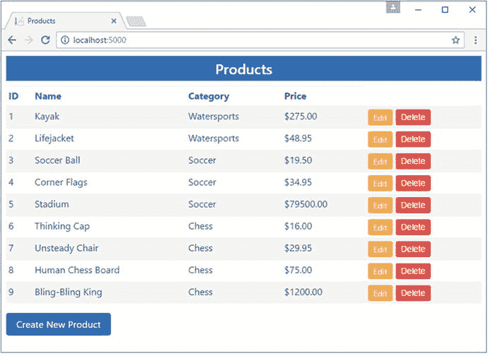
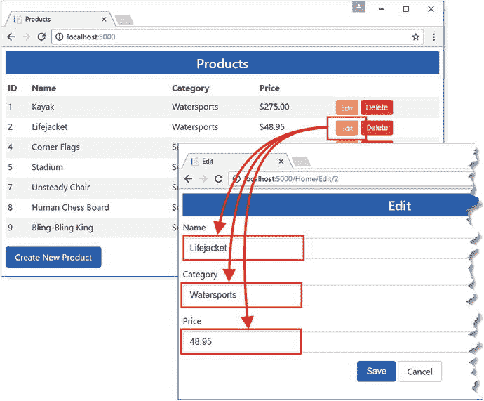
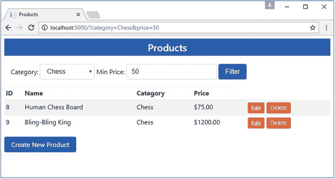
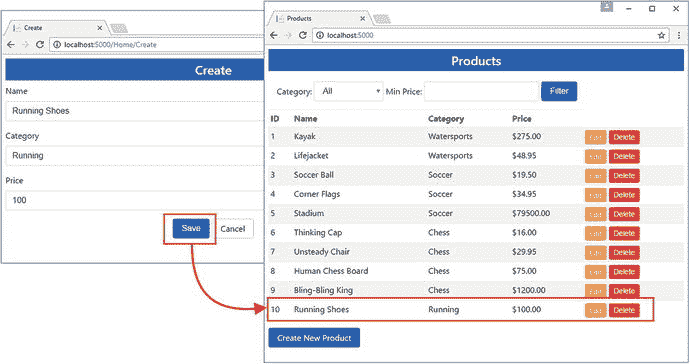
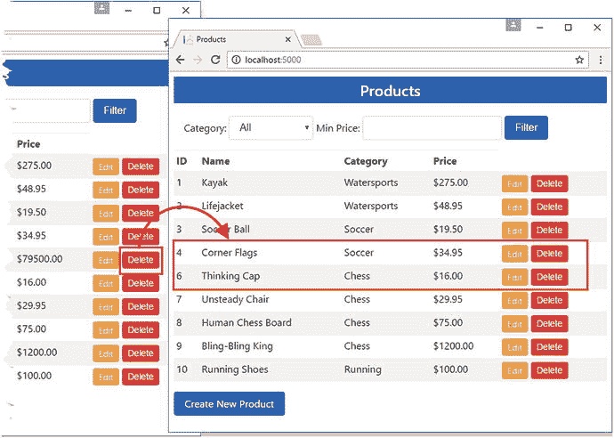

# 十二、执行数据操作

示例应用中的数据模型过于简单，无法代表真实的项目，但是它确实允许我轻松地解释如何使用 Entity Framework Core 执行四个核心数据操作(创建、读取、更新和删除数据)。在后面的章节中，我将向您展示如何创建更复杂的数据模型，但是，正如您将在本章中看到的，即使是一个简单的模型也可以揭示很多关于实体框架核心如何工作的信息。表 [12-1](#Tab1) 将基本数据操作放在上下文中。

表 12-1。

Putting Basic Data Operations in Context

<colgroup><col> <col></colgroup> 
| 问题 | 回答 |
| --- | --- |
| 它们是什么？ | 基本数据操作允许您从数据库中读取、存储、更新和删除数据。 |
| 它们为什么有用？ | 这些操作是使用实体框架核心的基本构件。 |
| 它们是如何使用的？ | database context 类定义了一个属性，该属性提供了存储、更新和删除数据的方法，并且可以在该属性上执行 LINQ 查询以从数据库中读取数据。 |
| 有什么陷阱或限制吗？ | 这些操作可能效率低下，并且需要数据库服务器执行更多的工作，除非采取措施使用诸如更改检测之类的功能。 |
| 有其他选择吗？ | 如果您使用的是实体框架核心，那么这些特性就是处理数据的基础。 |

表 [12-2](#Tab2) 总结了本章内容。

表 12-2。

Chapter Summary

<colgroup><col> <col> <col></colgroup> 
| 问题 | 解决办法 | 列表 |
| --- | --- | --- |
| 从数据库中获取单个对象 | 使用由`DbSet<T>`对象定义的`Find`方法返回上下文类 | five |
| 从数据库中获取给定类型的所有对象 | 枚举上下文类属性返回的`DbSet<T>`对象 | six |
| 获取对象的子集 | 使用 LINQ 来表示选择所需对象的约束 | 7–10 |
| 将对象添加到数据库中 | 将对象传递给`DbSet<T>.Add`方法并调用`SaveChanges` | 11–12 |
| 更新数据库中的对象 | 将对象传递给`DbSet<T>.Update`方法并调用`SaveChanges` | Thirteen |
| 使用更改检测来减少更新 | 查询数据库以获取基线对象，更改其属性值，并调用`SaveChanges` | 14–15 |
| 使用变更检测，无需查询基线数据 | 在 HTTP 请求中包含对象的原始状态，并使用它来提供基线 | 16–19 |
| 从数据库中删除对象 | 将对象传递给`DbSet<T>.Remove`方法并调用`SaveChanges` | Twenty-one |

## 为本章做准备

本章使用在第 [11 章](11.html)中创建的 DataApp 项目。为了准备本章，在`DataApp`项目文件夹中打开命令提示符或 PowerShell 窗口，并运行清单 [12-1](#Par5) 中所示的命令。

Tip

如果您不想遵循构建示例项目的过程，您可以从本书的源代码库 [`https://github.com/apress/pro-ef-core-2-for-asp.net-core-mvc`](https://github.com/apress/pro-ef-core-2-for-asp.net-core-mvc) 下载所有需要的文件。

```cs
dotnet ef database drop --force
Listing 12-1.Resetting the Database

```

此命令删除数据库，这将有助于确保您从本章的示例中获得预期的结果。在`DataApp`项目文件夹中运行清单 [12-2](#Par7) 所示的命令来重新创建数据库。

```cs
dotnet ef database update
Listing 12-2.Preparing the Database

```

要将数据植入数据库，请选择工具➤ SQL Server ➤新查询，并在服务器名称字段中输入(localdb)\MSSQLLocalDB。确保为 Authentication 字段选择了 Windows Authentication，并单击 Database Name 菜单从下拉列表中选择 DataAppDb，这将显示使用 LocalDB 创建的数据库的完整列表。单击连接打开与数据库的连接。

Tip

“历史记录”选项卡跟踪您使用 Visual Studio 连接到的数据库，并允许您重新连接到数据库，而无需再次输入连接详细信息。

在编辑器中输入清单 [12-3](#Par11) 中所示的 SQL。从 Visual Studio SQL 菜单中选择“执行”。Visual Studio 将要求数据库服务器执行 SQL，这将确保示例应用有数据可以使用。

```cs
USE DataAppDb

INSERT INTO Products (Name, Category, Price)
VALUES
    ('Kayak', 'Watersports', 275),
    ('Lifejacket', 'Watersports', 48.95),
    ('Soccer Ball', 'Soccer', 19.50),
    ('Corner Flags', 'Soccer', 34.95),
    ('Stadium', 'Soccer', 79500),
    ('Thinking Cap', 'Chess', 16),
    ('Unsteady Chair', 'Chess', 29.95),
    ('Human Chess Board', 'Chess', 75),
    ('Bling-Bling King', 'Chess', 1200)

Listing 12-3.Seeding the Database

```

当您执行 SQL 时，您将看到以下结果，这表明有九行数据被添加到数据库中:

```cs
(9 row(s) affected)

```

### 启动示例应用

通过运行`DataApp`文件夹中清单 [12-4](#Par15) 所示的命令来启动应用。

```cs
dotnet run
Listing 12-4.Starting the Example Application

```

打开浏览器窗口并请求`http://localhost:5000`。ASP.NET Core MVC 应用将使用实体框架核心从数据库中检索数据，并生成如图 [12-1](#Fig1) 所示的响应。



图 12-1。

Running the example application

## 阅读日期

要理解 Entity Framework Core 是如何工作的，最好的起点是查询数据库并检索它包含的数据。在接下来的小节中，我将解释如何查询单个实体对象、所有对象以及一些对象。

### 通过键读取对象

本章中使用的数据操作的关键是`DbSet<T>`类，它被用作数据库上下文类定义的属性的结果。下面是来自`EFDatabaseContext`类的`Products`属性的定义，在第 [11 章](11.html)中定义:

```cs
...
public DbSet<Product> Products { get; set; }
...

```

像这样的属性有两个作用。第一个作用是告诉实体框架核心，`Product`类是一个实体类，这意味着`Product`对象将被存储在数据库中。这是 Entity Framework Core 创建迁移时的重要信息，因为它会影响为在数据库中存储数据而必须创建的表和行。

第二个角色是提供一个允许在数据库上执行操作的属性，这意味着可以使用实体框架核心创建、读取、更新和删除`Product`对象。`DbSet<T>`类实现了接口并定义了使这些操作成为可能的方法。这些方法中的第一种，也是最基本的一种，称为`Find`，在表 [12-3](#Tab3) 中有描述，以供快速参考。

表 12-3。

The DbSet<T> Method for Querying by Key

<colgroup><col> <col></colgroup> 
| 名字 | 描述 |
| --- | --- |
| `Find(key)` | 此方法读取表中具有指定键的行，并返回一个表示该行的对象。如果没有包含该键的行，则返回`null`。如果表格需要多个键，如第 [19 章](19.html)所述，它们可以被指定为多个参数:`Find(key1, key2, key3)`。 |

当您有一个键并且想要与之相关联的对象时,`Find`方法很有用。就示例应用而言，这意味着您已经将值赋给了存储在数据库中的`Product`对象的`Id`属性，并且您想要检索完整的`Product`对象。

这就是资源库中的`GetProduct`方法的目的，这意味着可以使用`Find`方法来实现这个方法，如清单 [12-5](#Par24) 所示。

```cs
using System;
using System.Collections.Generic;
using System.Linq;
using Newtonsoft.Json;

namespace DataApp.Models {

    public class EFDataRepository : IDataRepository {
        private EFDatabaseContext context;

        public EFDataRepository(EFDatabaseContext ctx) {
            context = ctx;
        }

        public Product GetProduct(long id) {
            return context.Products.Find(id);
        }

        public IEnumerable<Product> GetAllProducts() {
            Console.WriteLine("GetAllProducts");
            return context.Products;
        }

        public void CreateProduct(Product newProduct) {
            Console.WriteLine("CreateProduct: "
                + JsonConvert.SerializeObject(newProduct));
        }

        public void UpdateProduct(Product changedProduct) {
            Console.WriteLine("UpdateProduct : "
                + JsonConvert.SerializeObject(changedProduct));
        }

        public void DeleteProduct(long id) {
            Console.WriteLine("DeleteProduct: " + id);
        }
    }
}

Listing 12-5.Querying by Key in the EFDataRepository.cs File in the Models Folder

```

当用户在应用的 MVC 部分开始编辑过程时，`GetProduct`方法用于为`Product`对象提供当前属性值。使用`dotnet run`启动应用，使用浏览器导航至`http://localhost:5000`，并点击其中一个编辑按钮。显示的表单将填充从通过`Find`方法创建的`Product`对象中获得的数据，如图 [12-2](#Fig2) 所示。



图 12-2。

Querying for a single object

如果您在命令提示符下检查应用的日志输出，您将看到发送到数据库的 SQL 查询。

```cs
...
SELECT TOP(1) [e].[Id], [e].[Category], [e].[Name], [e].[Price]
FROM [Products] AS [e]
WHERE [e].[Id] = @__get_Item_0
...

```

该查询检索由表中第一行的`Product`类定义的每个属性的值，该表中的第一行为`Id`列指定了值。这些值被`Find`方法用来创建它返回的`Product`对象。然后，这个对象被传递给应用的 MVC 部分，以便可以向用户显示。

### 查询所有对象

要检索存储在数据库中的所有数据对象，可以读取 context 类的`Products`属性的值，该属性返回一个`DbSet<Product>`对象。`DbSet<T>`类实现了`IQueryable<T>`和`IEnumerable<T>`接口，这意味着您可以使用`foreach`循环枚举从数据库中读取的`Product`对象的序列。

repository 类已经支持通过我在第 [11 章](11.html)中定义的`GetAllProducts`方法读取所有数据对象，如下所示:

```cs
...
public IEnumerable<Product> GetAllProducts() {
    return context.Products;
}
...

```

实体框架核心直到您枚举了`DbSet<T>`属性才从数据库中读取数据，这可能是混淆的来源。为了演示实体框架核心如何推迟读取数据，更新`Home`控制器上的`Index`动作，如清单 [12-6](#Par33) 所示。

```cs
using Microsoft.AspNetCore.Mvc;
using DataApp.Models;
using System.Linq;

namespace DataApp.Controllers {
    public class HomeController : Controller {
        private IDataRepository repository;

        public HomeController(IDataRepository repo) {
            repository = repo;
        }

        public IActionResult Index() {
            var products = repository.GetAllProducts();
            System.Console.WriteLine("Property value has been read");
            return View(products);
        }

        public IActionResult Create() {
            ViewBag.CreateMode = true;
            return View("Editor", new Product());
        }

        // ...other actions omitted for brevity...
    }
}

Listing 12-6.Querying All Objects in the HomeController.cs File in the Controllers Folder

```

清单 [12-6](#Par33) 中的`System.Console.WriteLine`语句在`Products`属性已经被读取并且值被传递给`View`方法之前写出一条消息。

使用`dotnet run`重启应用并请求`http://localhost:5000`。检查应用的日志输出，您会看到清单 [12-6](#Par36) 中的语句出现在 SQL 查询发送到数据库之前，如下所示:

```cs
...

Property value has been read

...
info: Microsoft.EntityFrameworkCore.Database.Sql[1]
      Executed DbCommand (6ms) [Parameters=[], CommandType='Text',
          CommandTimeout='30']
      SELECT [p].[Id], [p].[Category], [p].[Name], [p].[Price]
      FROM [Products] AS [p]
...

```

仅当对序列执行操作时，才从数据库中检索数据，例如使用`foreach`循环进行枚举，或者使用 LINQ 将序列转换为数组或列表(使用`ToArray`或`ToList`方法)。

### 查询特定对象

由上下文对象定义的`DbSet<T>`属性也允许使用 LINQ 到实体特性创建更复杂的查询。`DbSet<T>`类实现了`IQueryable<T>`接口，如第 [11 章](11.html)所述，该接口用于创建从数据库中选择对象的查询。这允许使用 LINQ 来查询和处理数据，但好处是查询由数据库服务器执行，以便只从数据库中读取匹配的数据对象。

当使用一个`DBSet<T>`属性时，查询不会被发送到数据库，直到对象序列被枚举。这意味着可以通过跨多个代码语句链接多个 LINQ 方法来构建查询，这非常适合使用 MVC 应用的模型。

作为演示，编辑`Index.cshtml`视图来添加一个 HTML 表单，允许用户过滤表中显示的产品列表，如清单 [12-7](#Par41) 所示。

```cs
@model IEnumerable<DataApp.Models.Product>
@{
    ViewData["Title"] = "Products";
    Layout = "_Layout";
}

<div class="m-1 p-2">

    <form asp-action="Index" method="get" class="form-inline">
        <label class="m-1">Category:</label>
        <select name="category" class="form-control">
            <option value="">All</option>
            <option selected="@(ViewBag.category == "Watersports")">
                Watersports
            </option>
            <option selected="@(ViewBag.category == "Soccer")">Soccer</option>
            <option selected="@(ViewBag.category == "Chess")">Chess</option>
        </select>
        <label class="m-1">Min Price:</label>
        <input class="form-control" name="price" value="@ViewBag.price" />
        <button class="btn btn-primary m-1">Filter</button>
    </form>

</div>

<table class="table table-sm table-striped">
    <thead>
        <tr><th>ID</th><th>Name</th><th>Category</th><th>Price</th></tr>
    </thead>
    <tbody>
        @foreach (var p in Model) {
            <tr>
                <td>@p.Id</td>
                <td>@p.Name</td>
                <td>@p.Category</td>
                <td>$@p.Price.ToString("F2")</td>
                <td>
                    <form asp-action="Delete" method="post">
                        <a asp-action="Edit" class="btn btn-sm btn-warning"
                           asp-route-id="@p.Id">
                            Edit
                        </a>
                        <input type="hidden" name="id" value="@p.Id" />
                        <button type="submit" class="btn btn-danger btn-sm">
                            Delete
                        </button>
                    </form>
                </td>
            </tr>
        }
    </tbody>
</table>
<a asp-action="Create" class="btn btn-primary">Create New Product</a>

Listing 12-7.Adding Filtering in the Index.cshtml File in the Views/Home Folder

```

新元素为用户提供了一个用于选择类别的`select`元素和一个用于指定最低价格的`input`元素。当单击 Filter 按钮时，这些元素的值将包含在发送给应用的 GET 请求中。

要在应用中接收过滤标准，编辑`Home`控制器上的`Index`动作，如清单 [12-8](#Par44) 所示。

```cs
using Microsoft.AspNetCore.Mvc;
using DataApp.Models;
using System.Linq;

namespace DataApp.Controllers {
    public class HomeController : Controller {
        private IDataRepository repository;

        public HomeController(IDataRepository repo) {
            repository = repo;
        }

        public IActionResult Index(string category = null, decimal? price = null) {
            var products = repository.GetFilteredProducts(category, price);
            ViewBag.category = category;
            ViewBag.price = price;
            return View(products);
        }

        public IActionResult Create() {
            ViewBag.CreateMode = true;
            return View("Editor", new Product());
        }

        // ...other actions omitted for brevity...
    }
}

Listing 12-8.Receiving Filter Criteria in the HomeController.cs File in the Controllers Folder

```

`Index`动作方法定义了两个可选参数，它们被传递给一个名为`GetFilteredProducts`的存储库方法。为了创建由`Index`动作使用的`GetFilteredProducts`方法，扩展存储库接口，如清单 [12-9](#Par47) 所示。

Tip

我为清单 [12-8](#Par44) 中的`price`参数使用了一个可空值`decimal`，以区分用户什么都不输入(在这种情况下，参数将是`null`)和用户输入零(在这种情况下，参数将是`0`)。使用常规的十进制参数在这两种情况下都会导致零值。

```cs
using System.Collections.Generic;
using System.Linq;

namespace DataApp.Models {
    public interface IDataRepository {

        Product GetProduct(long id);

        IEnumerable<Product> GetAllProducts();

        IEnumerable<Product> GetFilteredProducts(string category = null,
           decimal? price = null);

        void CreateProduct(Product newProduct);

        void UpdateProduct(Product changedProduct);

        void DeleteProduct(long id);
    }
}

Listing 12-9.Adding a Method in the IDataRepository.cs File in the Models Folder

```

最后一步是实现方法，根据用户提供的值构建 LINQ 查询。编辑存储库类来实现`GetFilteredProducts`方法，如清单 [12-10](#Par49) 所示。

```cs
using System;
using System.Collections.Generic;
using System.Linq;
using Newtonsoft.Json;

namespace DataApp.Models {

    public class EFDataRepository : IDataRepository {
        private EFDatabaseContext context;

        public EFDataRepository(EFDatabaseContext ctx) {
            context = ctx;
        }

        public Product GetProduct(long id) {
            return context.Products.Find(id);
        }

        public IEnumerable<Product> GetAllProducts() {
            Console.WriteLine("GetAllProducts");
            return context.Products;
        }

        public IEnumerable<Product> GetFilteredProducts(string category = null,
                decimal? price = null) {

            IQueryable<Product> data = context.Products;
            if (category != null) {
                data = data.Where(p => p.Category == category);
            }
            if (price != null) {
                data = data.Where(p => p.Price >= price);
            }
            return data;
        }

        // ...other methods omitted for brevity...
    }
}

Listing 12-10.Building a Query in the EFDataRepository.cs File in the Models Folder

```

该方法的实现从读取上下文的`Product`属性的值开始，并将其赋给一个`IQueryable<Product>`变量。正如在第 [11 章](11.html)中所解释的，使用`IQueryable<Product>`接口确保数据过滤在数据库中完成，而不是加载所有的对象然后过滤它们。

基于是否已经接收到`category`和`price`参数的值来建立查询。如果有参数值，那么使用 LINQ `Where`方法更新`IQuerable<Product>`变量的值。直到视图中的`IQueryable<T>`对象被枚举，数据库才被查询，这就是 LINQ 方法如何被用来有选择地跨几行代码组成查询。

要查看更改的效果，重启应用，请求`http://localhost:5000`，并使用图 [12-3](#Fig3) 所示的表单字段过滤应用显示的数据。



图 12-3。

Filtering data in the example application

可以产生四种可能的查询类型。

*   当两个参数都为空时，查询所有对象
*   查询特定类别的对象，没有最低价格
*   查询所有类别中具有最低价格的对象
*   查询特定类别中具有最低价格的对象

通过选择类别值并在 price 字段中输入数字，可以看到将发送到数据库服务器的每个查询。例如，如果您选择了一个类别，但没有输入最低价格，将会发送以下查询:

```cs
...
SELECT [p].[Id], [p].[Category], [p].[Name], [p].[Price]
FROM [Products] AS [p]
WHERE [p].[Category] = @__category_0
...

```

这是在选择了类别和最低价格时使用的查询:

```cs
...
SELECT [p].[Id], [p].[Category], [p].[Name], [p].[Price]
FROM [Products] AS [p]
WHERE ([p].[Category] = @__category_0) AND ([p].[Price] >= @__price_1)
...

```

关键是数据的选择是由发送到数据库的查询执行的，确保只有匹配的数据返回给应用。

## 存储新数据

下一步是添加在数据库中存储新对象的能力。编辑 repository 类来实现清单 [12-11](#Par64) 中所示的`CreateProduct`方法。

```cs
...
public void CreateProduct(Product newProduct) {
    newProduct.Id = 0;
    context.Products.Add(newProduct);
    context.SaveChanges();
}
...
Listing 12-11.Storing Data in the EFDataRepository.cs File in the Models Folder

```

在示例应用中，`Product`对象有两个来源:MVC 模型绑定过程和数据库上下文对象。模型绑定过程在收到 HTTP POST 请求时创建`Product`对象，上下文对象在从数据库读取数据时创建`Product`对象。

实体框架核心负责由数据库上下文对象创建的`Product`对象，但是对由 MVC 模型绑定器创建的对象没有可见性。在上下文的`DbSet<T>`属性上调用的`Add`方法使实体框架核心意识到已经在应用中的其他地方创建的`Product`对象，以便可以将其写入数据库。

Tip

`DbSet<T>`属性还定义了一个`AddRange`方法，该方法可用于在一次方法调用中存储多个对象，如第 [13 章](13.html)所示。

`SaveChanges`方法将由实体框架核心管理的对`Product`对象的未完成更改保存到数据库中。这包括已经传递给`Add`方法的任何`Product`对象。清单 [12-11](#Par64) 中代码的作用是让实体框架核心意识到一个`Product`对象并将其存储在数据库中。

要查看效果，使用`dotnet run`重新启动应用，使用浏览器导航到`http://locahost:5000`，并单击 Create 按钮。填写表单字段，然后单击保存按钮。

当调用`Home`控制器上的`Create`动作方法来处理 HTTP POST 请求时，它接收一个由模型绑定器创建的`Product`对象作为其参数。动作方法调用存储库上的`CreateProduct`方法，这使得实体框架核心通过`Add`方法感知到`Product`对象，并使用`SaveChanges`方法将其存储在数据库中。新数据将显示在产品表中，如图 [12-4](#Fig4) 所示。



图 12-4。

Storing new data

### 了解按键分配

注意，`CreateProduct`方法显式地将`Product`对象的`Id`属性的值设置为零:

```cs
...
newProduct.Id = 0;
...

```

当创建表中的新行时，新对象的主键值由数据库服务器分配，如果`Id`属性的值不为零，将会引发异常。在清单 [12-11](#Par64) 中，我显式地将`Id`属性设置为零，以确保不使用从 HTTP 请求接收的值。

Note

我可以配置 MVC 模型绑定器来忽略 HTTP 请求中的`Id`属性的值，但是这假设模型绑定器是传递给`CreateProduct`方法的`Product`对象的唯一来源。我喜欢确保应用的实体框架核心部分本身是健壮的，这就是为什么我在清单 [12-11](#Par64) 中显式地将该属性设置为零。

当 Entity Framework Core 存储一个新对象时，它会立即执行一个 SQL 查询来发现数据库服务器分配给新表行的`Id`列的值。您可以在创建新产品时记录到命令提示符下的 SQL 语句中看到这一点，如下所示:

```cs
...
INSERT INTO [Products] ([Category], [Name], [Price])
VALUES (@p0, @p1, @p2);

SELECT [Id]

FROM [Products]

WHERE @@ROWCOUNT = 1 AND [Id] = scope_identity();

...

```

`INSERT`语句告诉数据库服务器在`Products`表中创建新行，并为`Category`、`Name`和`Price`列提供值。`SELECT`语句查询用于创建新行的`Id`列的值。返回的值用于更新`Product`对象，确保该对象与其在数据库中的表示一致。

您可以通过在`SaveChanges`方法后读取`Id`属性的值来了解这是如何工作的，如清单 [12-12](#Par79) 所示。

```cs
...
public void CreateProduct(Product newProduct) {
    newProduct.Id = 0;
    context.Products.Add(newProduct);
    context.SaveChanges();
    Console.WriteLine($"New Key: {newProduct.Id}");
}
...
Listing 12-12.Determining the Key Value in the EFDataRepository.cs File in the Models Folder

```

使用`dotnet run`重启应用，并重复创建新数据项的过程。检查应用的输出，您会看到有一条消息显示分配给新的`Product`的键值，如下所示:

```cs
New Key: 11

```

键值也显示在浏览器显示的产品表中。

## 更新数据

修改现有数据的过程类似于存储新数据，但需要做一些工作才能使其有效工作。有三种不同的方法来处理更新，这将在下面的章节中介绍。

### 更新完整的对象

执行更新的最简单方法是将 MVC 模型绑定过程创建的`Product`对象置于实体框架核心的管理之下，类似于存储新数据的过程。为了增加对以这种方式更新数据的支持，编辑`EFDataRepository`类中的`UpdateProduct`方法，如清单 [12-13](#Par85) 所示。

```cs
...
public void UpdateProduct(Product changedProduct) {
    context.Products.Update(changedProduct);
    context.SaveChanges();
}
...
Listing 12-13.Updating Data in the EFDataRepository.cs File in the Models Folder

```

`DbSet<T>.Update`方法用于让实体框架核心知道一个已经被修改的`Product`对象，上下文的`SaveChanges`方法将该对象写入数据库。

Tip

`DbSet<T>`属性还定义了一个`UpdateRange`方法，该方法可用于在一次方法调用中更新多个对象，如第 [15 章](15.html)所示。

要查看效果，使用`dotnet run`命令重新启动应用，单击 Stadium 产品的 Edit 按钮，并将 Name 字段的值更改为 Stadium (Large)。单击保存按钮；数据库将被更新，当浏览器被重定向到`Index`动作时，这一变化将反映在产品列表中，如图 [12-5](#Fig5) 所示。


图 12-5。

Updating an object

这种方法的优点是简单:只需要两行代码来处理更新。缺点是实体框架核心知道`Product`对象已经改变，但是没有足够的信息来确定只有一个属性已经改变。这意味着所有`Product`对象的属性值都必须存储在数据库中，您可以看到所有三个属性都被更新了。

```cs
...
UPDATE [Products] SET [Category] = @p0, [Name] = @p1, [Price] = @p2
WHERE [Id] = @p3;
...

```

只有一个属性发生了更改，但所有三个属性都在数据库中进行了更新。对于简单的对象，编写不变的属性不是一个重要的问题。对于具有复杂数据模型的实际项目，这种方法可能效率低下。

Tip

如果您检查应用的控制台输出，您会看到`UPDATE`语句是发送到数据库服务器的三个语句中的中间一个。第一个是`SET NOCOUNT ON`，它禁用了报告查询影响了多少行的特性，以提高性能。接下来，`UPDATE`语句更新表中被修改的一行或多行。第三个语句是`SELECT @@ROWCOUNT`，它报告有多少行受到了`UPDATE`的影响。实体框架核心总是检查预期的行数是否已经更改。

### 更新前查询现有数据

Entity Framework Core 能够准确地计算出对象中的哪些属性已经被修改，这可以用来避免将未更改的数据写入数据库。为了理解实体框架核心如何处理变更检测，修改存储库中的`UpdateProduct`方法，如清单 [12-14](#Par94) 所示。

```cs
...
public void UpdateProduct(Product changedProduct) {
    Product originalProduct = context.Products.Find(changedProduct.Id);
    originalProduct.Name = changedProduct.Name;
    originalProduct.Category = changedProduct.Category;
    originalProduct.Price = changedProduct.Price;
    context.SaveChanges();
}
...
Listing 12-14.Using Change Detection in the EFDataRepository.cs File in the Models Folder

```

本例中有两个`Product`对象。`changedProduct`对象作为动作方法参数被接收，并由 MVC 模型绑定器使用 HTTP POST 请求数据创建。作为`Find`方法的结果，`originalProduct`对象由实体框架核心创建，代表当前数据库中的数据。

实体框架核心跟踪它使用数据库中的数据创建的对象，并在属性值发生变化时进行处理。为了利用这个特性，我将`changedProduct`对象的属性值赋给了`originalProduct`对象，然后调用`SaveChanges`方法。实体框架核心将检查`originalProduct`对象的属性值，以查看它们在对象创建后是否发生了变化，并将只更新不同的属性值。

重新启动应用，再次单击 Stadium 产品的 Edit 按钮，将 Name 字段从 Stadium (Large)更改为 Stadium (Small)。当您单击“保存”按钮时，日志记录消息将显示一条 SQL 语句，该语句仅更新已更改的属性，如下所示:

```cs
...
UPDATE [Products] SET [Name] = @p0
WHERE [Id] = @p1;
...

```

变更检测过程已经识别出`Name`属性已经变更，并且发送到数据库服务器的语句只对该属性执行更新。

#### 了解变更检测

数据库上下文的基类`DbContext`定义了一个返回`EntityEntry`对象的`Entry`方法。实体框架核心使用该对象来检测它所创建的对象中的变化。表 [12-4](#Tab4) 描述了最有用的`EntityEntry`属性。

表 12-4。

Useful EntityEntry Properties

<colgroup><col> <col></colgroup> 
| 名字 | 描述 |
| --- | --- |
| `State` | 该属性从`EntityState`枚举返回一个值，以指示对象的状态。这些值是`Added`、`Deleted`、`Detached`、`Modified`和`Unchanged`。 |
| `OriginalValues` | 此属性返回按属性名索引的原始属性值的集合。 |
| `CurrentValues` | 此属性返回当前属性值的集合，按属性名进行索引。 |

这些属性可用于检查实体对象的状态，从而揭示变更跟踪过程是如何工作的。清单 [12-15](#Par102) 使用`EntityEntry`对象改变存储库的`UpdateProduct`方法来写出变更跟踪信息。

```cs
using System;
using System.Collections.Generic;
using System.Linq;
using Newtonsoft.Json;

using Microsoft.EntityFrameworkCore.ChangeTracking;

namespace DataApp.Models {

    public class EFDataRepository : IDataRepository {
        private EFDatabaseContext context;

        public EFDataRepository(EFDatabaseContext ctx) {
            context = ctx;
        }

        // ...methods omitted for brevity...

        public void UpdateProduct(Product changedProduct) {
            Product originalProduct = context.Products.Find(changedProduct.Id);
            originalProduct.Name = changedProduct.Name;
            originalProduct.Category = changedProduct.Category;
            originalProduct.Price = changedProduct.Price;

            EntityEntry entry = context.Entry(originalProduct);
            Console.WriteLine($"Entity State: {entry.State}");
            foreach (string p_name in new string[]
                    { "Name", "Category", "Price" }) {
                Console.WriteLine($"{p_name} - Old: " +
                    $"{entry.OriginalValues[p_name]}, " +
                    $"New: {entry.CurrentValues[p_name]}");
            }
            context.SaveChanges();
        }

        public void DeleteProduct(long id) {
            Console.WriteLine("DeleteProduct: " + id);
        }
    }
}

Listing 12-15.Inspecting Tracking Details in the EFDataRepository.cs File in the Models Folder

```

对`UpdateProduct`方法的更改获得由`Find`方法创建的`Product`对象的`EntityEntry`，并写出`State`属性的值以及`Name`、`Category`和`Price`属性的当前值和原始值。

要查看跟踪信息，使用`dotnet run`启动应用，并编辑表格中显示的产品之一。当单击 Save 按钮时，浏览器发送到应用的数据将被应用到实体对象，跟踪数据将被写出到命令提示符。

```cs
...
Entity State: Modified
Name - Old: Kayak, New: Green Kayak
Category - Old: Watersports, New: Watersports
Price - Old: 275.00, New: 275.00
...

```

这个跟踪数据显示我编辑了`Kayak`产品的`Name`属性，将其更改为`Green Kayak`。`State`属性返回`Modified`值，实体框架核心只将值已经改变的属性写入数据库，避免更新没有改变的值。

### 在单个数据库操作中更新

前面的示例避免了将未更改的属性写入数据库，但是它通过查询数据库中的当前值来实现这一点，这是以一种低效率换取另一种低效率。此时，您可能想知道用于填充 HTML 表单字段的`Product`对象发生了什么，为什么它不能用于变更检测？

Choosing an Update Strategy

如果您的数据模型相对简单，并且您的实体对象几乎没有属性，那么您应该使用最简单的更新策略，将您收到的对象写入数据库，如清单 [12-13](#Par85) 所示，即使这意味着值在没有更改时被写入。这是一种低效的方法，但这种低效是很小的。

对于更复杂的数据模型，决策将取决于数据库服务器容量和网络流量的相对成本。如果您的主要开销是网络流量，那么您应该执行一个额外的数据库读取操作，如清单 [12-14](#Par94) 所示。这将增加对数据库的需求，但会减少通过网络发送到浏览器和从浏览器接收的数据量。如果您的主要开销是提供数据库服务器，那么您应该在 HTML 表单中包含原始数据值，如清单 [12-17](#Par116) 所示。这种方法避免了数据库操作，但是通过将表格中包含的数据值加倍来实现，并且可能需要第 [21](21.html) 章中描述的功能来检测基线数据何时被另一个用户更改。

应用收到的每个 HTTP 请求都由一个新的`Home`控制器实例处理，每个控制器对象都获得一个新的存储库对象和一个新的数据库上下文对象。处理完 HTTP 请求后，控制器、存储库和数据库对象以及从数据库中检索到的任何`Product`对象都将被丢弃。这意味着每个请求都必须从数据库中检索它所需要的数据，即使来自同一客户端的较早请求执行了相同的查询。

但是，执行更新的第三个策略是利用原始读取操作，方法是将它获得的数据包含在发送给客户端的响应中，并使用它来避免更新未更改的值。

首先，编辑`Editor.cshtml`文件，添加清单 [12-16](#Par113) 中显示的隐藏输入元素。

```cs
@model DataApp.Models.Product
@{
    ViewData["Title"] = ViewBag.CreateMode ? "Create" : "Edit";
    Layout = "_Layout";
}

<form asp-action="@(ViewBag.CreateMode ? "Create" : "Edit")" method="post">
    <input name="original.Id" value="@Model?.Id" type="hidden" />
    <input name="original.Name" value="@Model?.Name" type="hidden" />
    <input name="original.Category" value="@Model?.Category" type="hidden" />
    <input name="original.Price" value="@Model?.Price" type="hidden" />
    <div class="form-group">
        <label asp-for="Name"></label>
        <input asp-for="Name" class="form-control" />
    </div>
    <div class="form-group">
        <label asp-for="Category"></label>
        <input asp-for="Category" class="form-control" />
    </div>
    <div class="form-group">
        <label asp-for="Price"></label>
        <input asp-for="Price" class="form-control" />
    </div>
    <div class="text-center">
        <button class="btn btn-primary" type="submit">Save</button>
        <a asp-action="Index" class="btn btn-secondary">Cancel</a>
    </div>
</form>

Listing 12-16.Adding Elements in the Editor.cshtml File in the Views/Shared Folder

```

这些元素的`name`属性以`original`为前缀，后跟一个句点，这告诉 MVC 模型绑定器这些元素应该被用作名为`original`的动作方法参数的属性。当浏览器发送 POST 请求时，这些元素将提供原始数据值。

为了接收原始数据，编辑`Home`控制器并给`Edit`方法添加一个参数，如清单 [12-17](#Par116) 所示。参数名为`original`，对应于清单 [12-16](#Par113) 中的输入元素，MVC 模型绑定器将使用这些输入元素的值创建一个`Product`对象，为应用提供对原始值的轻松访问。

```cs
using Microsoft.AspNetCore.Mvc;
using DataApp.Models;
using System.Linq;

namespace DataApp.Controllers {
    public class HomeController : Controller {
        private IDataRepository repository;

        public HomeController(IDataRepository repo) {
            repository = repo;
        }

        public IActionResult Index(string category = null, decimal? price = null) {
            var products = repository.GetFilteredProducts(category, price);
            ViewBag.category = category;
            ViewBag.price = price;
            return View(products);
        }

        public IActionResult Create() {
            ViewBag.CreateMode = true;
            return View("Editor", new Product());
        }

        [HttpPost]
        public IActionResult Create(Product product) {
            repository.CreateProduct(product);
            return RedirectToAction(nameof(Index));
        }

        public IActionResult Edit(long id) {
            ViewBag.CreateMode = false;
            return View("Editor", repository.GetProduct(id));
        }

        [HttpPost]
        public IActionResult Edit(Product product, Product original) {
            repository.UpdateProduct(product, original);
            return RedirectToAction(nameof(Index));
        }

        [HttpPost]
        public IActionResult Delete(long id) {
            repository.DeleteProduct(id);
            return RedirectToAction(nameof(Index));
        }
    }
}

Listing 12-17.Binding the Original Values in the HomeController.cs File in the Controllers Folder

```

MVC 模型绑定器将创建两个`Product`对象，其中一个包含来自`input`元素的值，这些值可能已经被用户编辑过，另一个包含原始值。修改后的`Edit`方法将两个对象都传递给存储库，存储库必须更新才能接收它们。更改由`IDataRepository`接口定义的`UpdateProduct`方法，如清单 [12-18](#Par118) 所示。

```cs
using System.Collections.Generic;
using System.Linq;

namespace DataApp.Models {

    public interface IDataRepository {

        Product GetProduct(long id);

        IEnumerable<Product> GetAllProducts();

        IEnumerable<Product> GetFilteredProducts(string category = null,
           decimal? price = null);

        void CreateProduct(Product newProduct);

        void UpdateProduct(Product changedProduct, Product originalProduct = null);

        void DeleteProduct(long id);
    }
}

Listing 12-18.Updating the Method in the IDataRepository.cs File in the Models Folder

```

为了跟踪这些变化，编辑`EFDataRepository`实现类，将可选参数添加到`UpdateProduct`方法中，并使用它来检测变化，如清单 [12-19](#Par120) 所示。

```cs
...

public void UpdateProduct(Product changedProduct, Product originalProduct = null) {

    if (originalProduct == null) {
        originalProduct = context.Products.Find(changedProduct.Id);
    } else {
        context.Products.Attach(originalProduct);
    }
    originalProduct.Name = changedProduct.Name;
    originalProduct.Category = changedProduct.Category;
    originalProduct.Price = changedProduct.Price;
    context.SaveChanges();
}
...
Listing 12-19.Tracking Changes in the EFDataRepository.cs File in the Models Folder

```

如果`UpdateProduct`接收到一个`originalProduct`参数，则使用`DbSet<T>.Attach`方法将它置于实体框架核心的管理之下，这将建立实体框架核心变更跟踪过程，并将相关的`EntityEntry.State`属性设置为`Unmodified`。

来自另一个`Product`对象的属性值被复制到被跟踪的对象，并且变化检测过程将确保只有变化的值将被存储在数据库中。

重新启动应用，再次单击 Stadium 产品的 Edit 按钮，将 Name 字段从 Stadium (Small)更改为 Stadium (Regular)。当您单击“保存”按钮时，日志记录消息将显示一条 SQL 语句，该语句仅更新已更改的属性，如下所示:

```cs
...
UPDATE [Products] SET [Name] = @p0
WHERE [Id] = @p1;
...

```

自从基线数据被包含在 HTTP POST 请求中以来，不需要额外的查询来确定发生了什么变化。

Tip

参见第 [21](21.html) 章，了解从数据库中读取基线数据后，如何检测基线数据何时发生变化的详细信息。

## 删除数据

要实现的最后一个数据操作是删除，与更新相比，这是一个相对简单的过程。要添加对从数据库中删除行的支持，请编辑 repository 类中的`DeleteProduct`方法，添加清单 [12-20](#Par128) 中所示的代码。

```cs
...
public void DeleteProduct(long id) {
    Product p = context.Products.Find(id);
    context.Products.Remove(p);
    context.SaveChanges();
}
...
Listing 12-20.Deleting Data in the EFDataRepository.cs File in the Models Folder

```

`DbSet`类定义了一个接受实体对象的`Remove`方法。当调用`SaveChanges`方法时，实体框架核心将要求数据库从数据库表中删除该行。通过检查应用的输出，您可以看到`Remove`方法如何产生一个 SQL 命令，它将包含一个如下所示的条目:

```cs
...
DELETE FROM [Products]
    WHERE [Id] = @p0;
...

```

清单 [12-20](#Par128) 中的代码的问题在于，它使用`Find`方法来查询数据库以获得应该删除的`Product`。这是可行的，但是它导致了一个数据库操作，可以通过直接创建一个`Product`对象来避免，如清单 [12-21](#Par133) 所示。

Tip

`DbSet<T>`属性还定义了一个`RemoveRange`方法，该方法可用于在一次方法调用中删除多个对象，如第 [16 章](16.html)所示。

```cs
...
public void DeleteProduct(long id) {
    context.Products.Remove(new Product { Id = id });
    context.SaveChanges();
}
...
Listing 12-21.Deleting Data in the EFDataRepository.cs File in the Models Folder

```

只有键用于标识数据库中将要删除的行，所以删除操作可以通过创建一个只有一个`Id`值的新的`Product`对象并将其传递给`Remove`方法来执行。要查看效果，重启应用，导航到`http://localhost:5000`，点击删除按钮从数据库中删除一个产品，如图 [12-6](#Fig6) 所示。结果是相同的，但是不需要在删除之前读取数据。



图 12-6。

Deleting data

## 摘要

在这一章中，我解释了如何使用实体框架核心执行基本的数据操作。在大多数情况下，这些操作很容易执行，并且很适合 MVC 模型，尽管必须考虑执行每个任务所需的查询，这是使用实体框架核心时经常出现的主题。在下一章中，我将描述实体框架核心迁移特性，它用于为存储应用数据准备数据库。