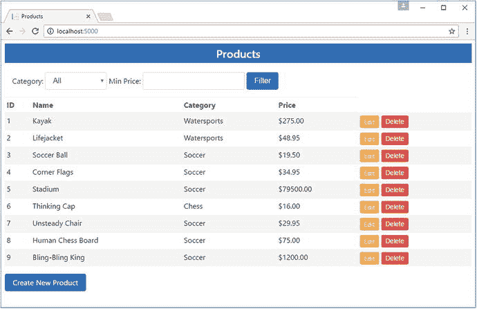
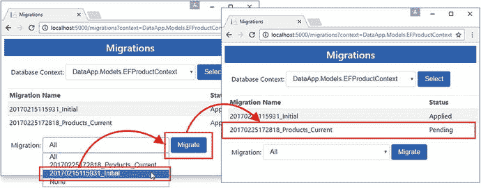
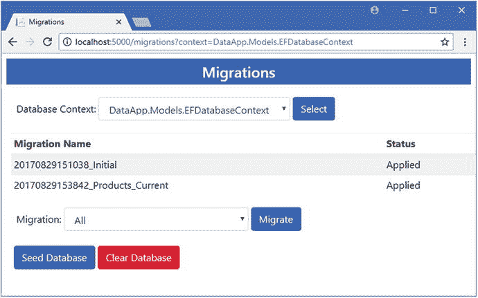

# 十三、了解迁移

在本章中，我将描述迁移特性，这是 Entity Framework Core 如何确保数据库反映应用中的数据模型，即使该模型发生了变化。这被称为代码优先，意味着您从您需要的数据模型类开始，并使用迁移来创建和管理数据库。(这与数据库优先相反，在数据库优先中，你使用一个现有的数据库，我在第 [17](17.html) 和 [18](18.html) 章中描述了这一点。)

在本章中，我将解释如何创建和应用迁移，如何评估迁移的影响，以及如何使用命令行工具和 API 管理迁移。表 [13-1](#Tab1) 将迁移放在上下文中。

Caution

本章中描述的许多命令会改变数据库的结构，并可能导致数据丢失。在您确定了解这些命令的影响之前，并且只有在您备份了关键数据之后，才可以在生产数据库上使用这些命令。

表 13-1。

Putting Migrations in Context

<colgroup><col> <col></colgroup> 
| 问题 | 回答 |
| --- | --- |
| 它们是什么？ | 迁移是为实体框架核心应用准备数据库的一组命令。它们用于创建数据库，然后使数据库与数据模型中的变化保持同步。 |
| 它们为什么有用？ | 迁移自动化了创建和维护用于存储应用数据的数据库的过程。如果没有迁移，您将不得不使用 SQL 命令创建数据库，并手动配置实体框架核心来使用它。 |
| 它们是如何使用的？ | 使用`dotnet ef`命令行工具创建和应用迁移。 |
| 有什么陷阱或限制吗？ | 实体框架核心在处理迁移时产生的错误消息并不总是很清楚。最常见的问题是创建迁移，但不将它们应用到数据库。 |
| 有其他选择吗？ | 首先创建数据库，然后创建用于实体框架核心的数据模型类。示例见第 [17](17.html) 章。 |

表 [13-2](#Tab2) 总结了本章内容。

表 13-2。

Chapter Summary

<colgroup><col> <col> <col></colgroup> 
| 问题 | 解决办法 | 列表 |
| --- | --- | --- |
| 创建新的迁移 | 使用`dotnet ef migration add`命令 | Twelve |
| 查看迁移包含的更改 | 使用`dotnet ef migrations script`命令 | 3, 10, 13 |
| 将迁移应用到数据库 | 使用`dotnet ef database update`命令 | 4–9, 15–17 |
| 列出项目中的迁移 | 使用`dotnet ef migrations list`命令 | Fourteen |
| 删除迁移 | 使用`dotnet ef migrations remove`命令 | 18–20 |
| 重置数据库 | 使用`dotnet ef database update 0`命令或`dotnet ef database drop`命令 | 21, 22 |
| 管理多个数据库的迁移 | 创建一个单独的上下文类，并在使用`dotnet ef`命令时指定其名称 | 23–28, 30, 31 |
| 查看项目中的数据库上下文 | 使用`dotnet ef dbcontext list`命令 | Twenty-nine |
| 以编程方式管理迁移 | 使用实体框架核心迁移 API | 32–35 |
| 以编程方式设定数据库种子 | 在使用 context 类向数据库添加数据之前，使用 migrations API 来确保没有挂起的更新 | 36–39 |

## 为本章做准备

本章使用在第 [11](11.html) 章创建并在第 [12](12.html) 章修改的`DataApp`项目。为了准备本章，在`DataApp`项目文件夹中打开命令提示符或 PowerShell 窗口，并运行清单 [13-1](#Par7) 中所示的命令。

Tip

如果您不想遵循构建示例项目的过程，您可以从本书的源代码库 [`https://github.com/apress/pro-ef-core-2-for-asp.net-core-mvc`](https://github.com/apress/pro-ef-core-2-for-asp.net-core-mvc) 下载所有需要的文件。

```cs
dotnet ef database drop --force
Listing 13-1.Resetting the Database

```

此命令删除数据库，这将有助于确保您从本章的示例中获得正确的预期结果。接下来，通过运行清单 [13-2](#Par9) 中所示的命令启动应用。

```cs
dotnet run
Listing 13-2.Starting the Example Application

```

应用将会启动，但是当您使用浏览器请求 URL `http://localhost:5000`时，您将会看到一个错误。堆栈跟踪很长，错误会重复几次，但这里是消息的重要部分:

```cs
...
SqlException: Cannot open database "DataAppDb" requested by the login.
...

```

## 了解迁移

上一节报告错误的原因是数据库还没有为应用做好准备。`appsettings.json`文件中的连接字符串指定了一个名为`DataAppDb`的数据库，如下所示:

```cs
...
"DefaultConnection": "Server=(localdb)\\MSSQLLocalDB;Database=DataAppDb;
    MultipleActiveResultSets=true"
...

```

SQL Server 目前对`DataAppDb`数据库一无所知，所以当应用试图从中读取数据时，出现了一个错误。使用实体框架核心迁移来准备数据库。迁移是一个 C# 类，包含创建数据库模式的指令。应用迁移时，会创建存储实体数据所需的数据库、表和列。

### 使用初始迁移

在示例应用中已经有一个迁移，它是在第 [11 章](11.html)中创建的，并且在前面的章节中被应用使用。打开`DataApp/Migrations`文件夹，你会看到三个文件。(其中一个文件嵌套在解决方案资源管理器中，并且在其父项展开之前不可见。)表 [13-3](#Tab3) 中描述了所有三个文件。

表 13-3。

The Migration Files in the Example Project

<colgroup><col> <col></colgroup> 
| 名字 | 描述 |
| --- | --- |
| `<timestamp>_Initial.cs` | 这是`Initial`类的一部分，它将第一次迁移应用于数据库。它包含创建数据库模式的说明。 |
| `<timestamp>_Initial.Designer.cs` | 这是`Initial`类的一部分，它将第一次迁移应用于数据库。它包含为模型对象创建的说明。 |
| `EFDatabaseContextModelSnapshot.cs` | 此类包含迁移中使用的实体类的描述，用于检测更改以创建进一步的迁移。 |

前两个文件是分部类，这意味着它们包含的代码被组合成一个 C# 类。这些文件的名称以时间戳开头，表示它们的创建时间，后面是它们包含的迁移的名称。本例中的名称包括`_Initial`，因为迁移是在第 [11 章](11.html)中使用此命令创建的(您不需要再次运行此命令):

```cs
dotnet ef migrations add Initial

```

处理迁移的惯例是对项目中创建的第一个迁移使用名称`Initial`。打开`<timestamp>_Initial.cs`文件，您将看到迁移的最重要部分，如下所示:

```cs
using Microsoft.EntityFrameworkCore.Metadata;
using Microsoft.EntityFrameworkCore.Migrations;
using System;
using System.Collections.Generic;

namespace DataApp.Migrations {
    public partial class Initial : Migration {

        protected override void Up(MigrationBuilder migrationBuilder) {

            migrationBuilder.CreateTable(
                name: "Products",
                columns: table => new {
                    Id = table.Column<long>(nullable: false)
                        .Annotation("SqlServer:ValueGenerationStrategy",
                            SqlServerValueGenerationStrategy.IdentityColumn),
                    Category = table.Column<string>(nullable: true),
                    Name = table.Column<string>(nullable: true),
                    Price = table.Column<decimal>(nullable: false)
                },
                constraints: table => {
                    table.PrimaryKey("PK_Products", x => x.Id);
                });
        }

        protected override void Down(MigrationBuilder migrationBuilder) {
            migrationBuilder.DropTable(
                name: "Products");
        }
    }
}

```

Note

确切的代码可能会发生变化，尤其是如果您使用的是 Entity Framework Core 或 SQL Server 数据库提供程序的更高版本。但是代码的目的和一般性质将足够接近理解迁移做什么。

`Initial`类的这一部分包含将被调用来更新数据库的方法。每次偏移包含两种方法，`Up`和`Down`，如表 [13-4](#Tab4) 所述。

表 13-4。

The Migration Methods

<colgroup><col> <col></colgroup> 
| 名字 | 描述 |
| --- | --- |
| `Up()` | 此方法包含升级数据库以存储实体数据的语句。 |
| `Down()` | 此方法包含将数据库降级到其原始状态的语句。 |

迁移可以用来升级或降级数据库，这个过程很快就会变得更有意义。对于新创建的数据库，升级过程将创建存储数据所需的表和列，而降级过程将数据库返回到其原始状态。这两个过程都将在下面的章节中描述。

Understanding the Other EF Commands

使用实体框架核心意味着使用命令行来创建和应用迁移。我在本书中使用的所有命令都以`dotnet ef`开头，比如第 [11 章](11.html)中的命令:

```cs
dotnet ef migration add Initial

```

此命令创建新的迁移。使用类似的命令将它应用于数据库，如本章后面的清单 [13-4](#Par48) 所示:

```cs
dotnet ef database update

```

如果您使用过 Entity Framework 的早期版本，您可能会熟悉一组不同的命令，比如`Add-Migration`和`Update-Database`。这些是用于管理迁移和数据库的原始命令，但它们仅受 Visual Studio 支持，并且仅当在包管理器控制台中使用时才可靠地工作，包管理器控制台是一个具有一些附加功能的 PowerShell 窗口。

这种风格的命令仍然被支持，但是我没有在这本书里使用它们。这些命令只能在特定的 Visual Studio 窗口中工作，它们会导致无穷无尽的问题。

#### 了解迁移升级

`Up`方法负责升级数据库。当处理应用于新创建的数据库的迁移时，实体框架核心为上下文类中的每个`DbSet<T>`属性创建一个表。目前上下文中只有一个`DbSet`属性，名为`Products`，它导致了迁移中的以下语句:

```cs
...
migrationBuilder.CreateTable(
    name: "Products",
...

```

`Up`方法的参数是`MigrationBuilder`类的一个实例，它提供了用于指定将应用于数据库的更改的方法。这些方法由数据库提供程序转换为特定于数据库的命令，这就是迁移中的 C# 语句转换为 SQL Server 可以执行的 SQL 语句的方式。

`MigrationBuilder.CreateTable`方法创建一个新的数据库表。缺省情况下，Entity Framework Core 使用`DbSet<T>`属性的名称作为数据库表的名称，这就是为什么在示例应用中，迁移的`CreateTable`的`name`参数被设置为`Products`。

`CreateTable`方法的其他参数配置该表。`columns`参数用于为实体类定义的每个属性定义一列，该表将用于存储这些属性。由上下文类定义的`Products`属性的类型是`DbSet<Product>`，因此实体框架核心为`Product`类定义的每个属性向表中添加列。

```cs
...
migrationBuilder.CreateTable(
    name: "Products",
    columns: table => new {
        Id = table.Column<long>(nullable: false)
            .Annotation("SqlServer:ValueGenerationStrategy",
                SqlServerValueGenerationStrategy.IdentityColumn),
        Category = table.Column<string>(nullable: true),
        Name = table.Column<string>(nullable: true),
        Price = table.Column<decimal>(nullable: false)
    },
...

```

为`Id`、`Name`、`Category`和`Price`属性定义列。对`Id`属性进行了配置，以便在向表中添加新行时，数据库会生成值。每列都配置有。对应的`Product`属性的. NET 类型。

为了完成表的定义，添加了一个约束，将`Id`列指定为主键。

```cs
...
migrationBuilder.CreateTable(
    name: "Products",
    columns: table => new {
        Id = table.Column<long>(nullable: false)
            .Annotation("SqlServer:ValueGenerationStrategy",
                SqlServerValueGenerationStrategy.IdentityColumn),
        Category = table.Column<string>(nullable: true),
        Name = table.Column<string>(nullable: true),
        Price = table.Column<decimal>(nullable: false)
    },
    constraints: table => {
        table.PrimaryKey("PK_Products", x => x.Id);
    });
}
...

```

将这些片段放在一起，`Up`方法创建了一个名为`Products`的新表，其中有`Id`、`Name`、`Category`和`Price`列，配置为`Id`列是主键，当创建新行时，数据库将生成`Id`列的值。

#### 了解迁移降级

`Down`方法用于将数据库返回到它以前的状态，撤销`Up`方法的效果。当处理将应用于空数据库的迁移时，降级只需删除已创建的用于存储实体数据的表。

```cs
...
migrationBuilder.DropTable(name: "Products");
...

```

`MigrationBuilder.DropTable`命令从数据库中删除一个表。在这种情况下，`Products`表将被删除，这将数据库返回到其原始状态。

### 检查迁移 SQL

要查看`Initial`迁移类中的命令是如何被翻译成 SQL 语句的，请使用命令提示符来运行清单`DataApp`文件夹中的 [13-3](#Par43) 所示的命令。

```cs
dotnet ef migrations script
Listing 13-3.Examining a Migration

```

所有的实体框架核心命令行工具都是用`dotnet ef`调用的，目标是 [11 章](11.html)中添加到项目中的 EF 核心工具。`migrations`参数选择对`migrations`执行操作的工具，而`script`参数显示迁移将在数据库中执行的 SQL 命令。对于示例项目中的`Initial`迁移，将生成以下 SQL 脚本:

```cs
...
IF OBJECT_ID(N'__EFMigrationsHistory') IS NULL
BEGIN
    CREATE TABLE [__EFMigrationsHistory] (
        [MigrationId] nvarchar(150) NOT NULL,
        [ProductVersion] nvarchar(32) NOT NULL,
        CONSTRAINT [PK___EFMigrationsHistory] PRIMARY KEY ([MigrationId])
    );
END;

GO

CREATE TABLE [Products] (
    [Id] bigint NOT NULL IDENTITY,
    [Category] nvarchar(max) NULL,
    [Name] nvarchar(max) NULL,
    [Price] decimal(18, 2) NOT NULL,
    CONSTRAINT [PK_Products] PRIMARY KEY ([Id])
);

GO

INSERT INTO [__EFMigrationsHistory] ([MigrationId], [ProductVersion])
VALUES (N'20180124114307_Initial', N'2.0.1-rtm-125');

GO
...

```

这些语句创建了两个表。一个名为`Products`的表对应于上一节描述的迁移中包含的指令。另一个表叫做`__EFMigrationsHistory`，它用于跟踪哪些迁移已经应用到数据库，当您在本章后面创建其他迁移时，它的重要性将变得显而易见。

### 应用迁移

迁移只有在应用到数据库后才会生效。运行`DataApp`文件夹中清单 [13-4](#Par48) 所示的命令，将迁移应用到数据库。

```cs
dotnet ef database update
Listing 13-4.Applying a Migration

```

`dotnet ef`命令针对实体框架核心工具；`database`参数指定您想要在数据库上执行操作，而`update`参数告诉实体框架核心通过应用项目中的所有迁移来更新数据库(尽管目前只有一个迁移)。项目将被编译，并且`Initial`类的`Up`方法中的代码将被执行，以生成创建和配置`Products`表的 SQL 命令。

Tip

当您使用`dotnet ef database update`命令应用迁移时，如果连接字符串中指定的数据库尚不存在，将会创建该数据库。这就是应用被配置使用的`DataAppDb`数据库是如何形成的，即使数据库的名称不是它产生的 SQL 脚本迁移的一部分。

#### 检查迁移

选择工具➤ SQL Server ➤新查询，并在服务器名称字段中输入(localdb)\MSSQLLocalDB。确保为 Authentication 字段选择了 Windows Authentication，并单击 Database Name 菜单从下拉列表中选择 DataAppDb，这将显示使用 LocalDB 创建的数据库的完整列表。一旦连接到数据库，在编辑器窗口中输入清单 [13-5](#Par52) 所示的 SQL。

```cs
USE DataAppDb

SELECT column_name, data_type FROM INFORMATION_SCHEMA.COLUMNS
WHERE TABLE_NAME = 'Products'

GO

Listing 13-5.Inspecting the Products Table

```

从 Visual Studio SQL 菜单中选择“执行”,将查询发送到数据库服务器。结果包含了`Products`表中每一列的名称和类型，显示了迁移的效果，如表 [13-5](#Tab5) 所示，并显示了`Products`表中的一行如何包含代表`Product`对象所需的所有数据值的列。

表 13-5。

The Structure of the Products Table

<colgroup><col> <col></colgroup> 
| 列名 | 数据类型 |
| --- | --- |
| `Id` | `bigint` |
| `Category` | `nvarchar` |
| `Name` | `nvarchar` |
| `Price` | `decimal` |

### 植入数据库并运行应用

既然已经创建了数据库模式，实体框架核心将能够代表示例应用读取和存储`Product`对象。

为了给应用提供一些数据，在 SQL 查询窗口中输入清单 [13-6](#Par56) 所示的 SQL(或者打开一个新窗口)。

```cs
USE DataAppDb

INSERT INTO Products (Name, Category, Price)
VALUES
    ('Kayak', 'Watersports', 275),
    ('Lifejacket', 'Watersports', 48.95),
    ('Soccer Ball', 'Soccer', 19.50),
    ('Corner Flags', 'Soccer', 34.95),
    ('Stadium', 'Soccer', 79500),
    ('Thinking Cap', 'Chess', 16),
    ('Unsteady Chair', 'Chess', 29.95),
    ('Human Chess Board', 'Chess', 75),
    ('Bling-Bling King', 'Chess', 1200)

Listing 13-6.Seeding the Database

```

选择 SQL ➤执行以设定数据库种子，并接收以下响应，该响应报告了该命令更改了多少行:

```cs
 (9 row(s) affected)

```

手动植入数据库是一个有点笨拙的过程，但是在本章的后面我将向您展示如何使用 C# 代码来处理这个问题。运行`DataApp`文件夹中清单 [13-7](#Par60) 中所示的命令来启动示例应用。

```cs
dotnet run
Listing 13-7.Starting the Example Application

```

打开一个新的浏览器窗口并请求 URL `http://localhost:5000`。你会看到数据表，如图 [13-1](#Fig1) 所示。一旦确认数据库正在工作并且已经用种子数据填充了数据库，就用 Ctrl+C 停止应用。



图 13-1。

Running the example application

在继续之前，有必要思考一下数据库迁移的影响。这个部分开始时没有数据库，也没有办法存储`Product`对象。在第 [11 章](11.html)中创建的迁移是一组 C# 文件，包含升级或降级数据库的指令。当应用迁移时，创建了`DataAppDb`数据库，C# 升级语句被翻译成 SQL 命令，执行这些命令来创建和配置`Products`表，其中包含由`Product`类定义的每个属性的列。`Products`表中的每一行代表一个`Product`对象，从清单 [13-6](#Par56) 中创建的种子数据开始。

同样值得思考的是，这个过程有多少是完全自动化的。Entity Framework Core 发现了数据库上下文类，确定了需要存储在数据库中的类，并研究出如何将这些类的实例表示为关系数据。对于更复杂的例子，Entity Framework Core 可能需要一些指导，正如你将在后面的章节中看到的那样，但是你可以通过定义 C# 类并让 Entity Framework Core 为你解决细节问题而走得更远。

## 创建其他迁移

当 MVC 应用中的数据模型发生变化时，迁移的便利性变得显而易见。要查看实体框架核心如何处理对数据模型的更改，请编辑`Product`类以添加清单 [13-8](#Par65) 中所示的枚举和属性。

```cs
namespace DataApp.Models {

    public enum Colors {
        Red, Green, Blue
    }

    public class Product {

        public long Id { get; set; }
        public string Name { get; set; }
        public string Category { get; set; }
        public decimal Price { get; set; }
        public Colors Color { get; set; }
    }
}

Listing 13-8.Adding a Property in the Product.cs File in the Models Folder

```

`Color`属性使用`Colors`枚举。添加一个属性意味着`Product`对象不能再存储在数据库中，因为无法存储`Color`值。

使数据库与修改后的数据模型同步意味着创建和应用新的迁移。要创建迁移，运行在`DataApp`文件夹中的清单 [13-9](#Par68) 中显示的命令。

```cs
dotnet ef migrations add AddColorProperty
Listing 13-9.Creating a New Database Migration

```

`dotnet ef migrations add`命令创建一个新的迁移，在本例中称为`AddColorProperty`。您可以为迁移使用任何您喜欢的名称，常见的命名策略包括描述迁移所反映的数据模型变化或使用增量版本号。

当您运行清单 [13-9](#Par68) 中的命令时，新文件会被添加到`Migrations`文件夹中。打开`<timestamp>_AddColorProperty.cs`文件，查看迁移将应用于数据库的更改，如下所示:

```cs
using Microsoft.EntityFrameworkCore.Migrations;
using System;
using System.Collections.Generic;

namespace DataApp.Migrations {
    public partial class AddColorProperty : Migration {

        protected override void Up(MigrationBuilder migrationBuilder) {
            migrationBuilder.AddColumn<int>(
                name: "Color",
                table: "Products",
                nullable: false,
                defaultValue: 0);
        }

        protected override void Down(MigrationBuilder migrationBuilder) {
            migrationBuilder.DropColumn(
                name: "Color",
                table: "Products");
        }
    }
}

```

`Up`方法将更新模式以反映数据模型的变化，这意味着在`Products`表中添加一个名为`Color`的列。`Down`方法通过删除`Color`列将数据库返回到它以前的状态。

运行`DataApp`文件夹中清单 [13-10](#Par74) 中的命令，查看新迁移将产生的 SQL 语句。

```cs
dotnet ef migrations script Initial AddColorProperty
Listing 13-10.Inspecting the Migration SQL Statements

```

使用`dotnet ef migrations script`命令指定迁移名称将显示从第一次迁移到第二次迁移更新数据库所需的语句，并将产生以下结果:

```cs
...
ALTER TABLE [Products] ADD [Color] int NOT NULL DEFAULT 0;

GO

INSERT INTO [__EFMigrationsHistory] ([MigrationId], [ProductVersion])
VALUES (N'<timestamp>_AddColorProperty', N'2.0.1-rtm-125');

GO
...

```

这些语句向`Products`表添加一个`Color`属性，并更新`__EFMigrationsHistory`表，以反映数据库迁移的应用。

### 向数据模型添加另一个属性

我将创建第三个迁移来展示如何管理对数据库的更改。将清单 [13-11](#Par79) 中显示的属性添加到`Product`类中。

```cs
namespace DataApp.Models {

    public enum Colors {
        Red, Green, Blue
    }

    public class Product {

        public long Id { get; set; }
        public string Name { get; set; }
        public string Category { get; set; }
        public decimal Price { get; set; }
        public Colors Color { get; set; }
        public bool InStock { get; set; }
    }
}

Listing 13-11.Adding an Additional Property in the Product.cs File in the Models Folder

```

新增加的是一个名为`InStock`的`bool`属性。要创建一个迁移来添加对在数据库中存储该属性的支持，运行清单 [13-12](#Par81) 中的命令(在`DataApp`文件夹中)。

```cs
dotnet ef migrations add AddInStockProperty
Listing 13-12.Creating a New Migration

```

一组新的迁移类文件将被添加到项目的`Migrations`文件夹中。运行`DataApp`文件夹中清单 [13-13](#Par83) 所示的命令，查看将修改`Products`表的 SQL 语句。

```cs
dotnet ef migrations script AddColorProperty AddInStockProperty
Listing 13-13.Displaying the SQL Statements for a Migration

```

该命令将产生以下结果:

```cs
...
ALTER TABLE [Products] ADD [InStock] bit NOT NULL DEFAULT 0;

GO

INSERT INTO [__EFMigrationsHistory] ([MigrationId], [ProductVersion])
VALUES (N'<timestamp>_AddInStockProperty', N'2.0.1-rtm-125');

GO
...

```

您可以看到对`Product`类的每次更改是如何产生迁移的，这将使数据模型和数据库重新同步。创建迁移时，Entity Framework Core 会自动计算出哪些更改必须应用于数据库，以便迁移只进行必要的修改来表示修改后的类的实例。

## 管理迁移

创建迁移只是该过程的一部分:还必须将迁移应用于数据库，以确保可以存储应用数据。管理迁移最常见的方法是使用`dotnet ef`命令行工具，我将在接下来的章节中描述。还可以使用 Entity Framework Core 提供的 API 来管理迁移，我在本章的“以编程方式管理迁移”一节中对此进行了描述。

### 列出迁移

通过运行`DataApp`文件夹中清单 [13-14](#Par89) 中所示的命令，您可以看到为示例项目创建的迁移列表。

```cs
dotnet ef migrations list
Listing 13-14.Listing the Available Migrations

```

此命令列出了为项目创建的所有迁移。在`DataApp`项目中有三个迁移，它产生以下输出(尽管您会在文件名中看到时间戳):

```cs
...
<timestamp>_Initial
<timestamp>_AddColorProperty
<timestamp>_AddInStockProperty
...

```

这是项目中定义的迁移的列表，这些迁移可能还没有应用到数据库。迁移是按顺序列出的，这意味着您可以很容易地分辨出`AddColorProperty`迁移是基于`Initial`迁移中包含的变更，而`AddInStockProperty`迁移是基于`AddColorProperty`的。

### 应用所有迁移

最常见的任务是应用项目中定义的所有迁移，以便在一个步骤中更新数据库。要应用`DataApp`项目中的所有迁移，从`DataApp`文件夹运行清单 [13-15](#Par94) 中所示的命令。

```cs
dotnet ef database update
Listing 13-15.Applying All Migrations

```

实体框架核心将使用`__EFMigrationsHistory`表计算出已经应用了哪些迁移，并将更新数据库。

选择工具➤ SQL Server ➤新查询，连接到数据库，输入清单 [13-16](#Par97) 所示的 SQL。

```cs
USE DataAppDb

SELECT column_name, data_type FROM INFORMATION_SCHEMA.COLUMNS
WHERE TABLE_NAME = 'Products'

GO

Listing 13-16.Inspecting the Products Table

```

从 Visual Studio SQL 菜单中选择执行，将查询发送到数据库服务器，数据库服务器将提供表结构的摘要，如表 [13-6](#Tab6) 所示。该摘要包括与添加到清单 [13-8](#Par65) 和清单 [13-11](#Par79) 中的`Product`类的新属性相对应的列。

表 13-6。

The Structure of the Products Table

<colgroup><col> <col></colgroup> 
| 列名 | 数据类型 |
| --- | --- |
| `Id` | `bigint` |
| `Category` | `nvarchar` |
| `Name` | `nvarchar` |
| `Price` | `decimal` |
| `Color` | `int` |
| `InStock` | `bit` |

### 更新到特定迁移

您可以将数据库更新为特定的迁移，这在您需要回滚一组更改或不想一次性应用项目中的所有迁移时非常有用。运行`DataApp`文件夹中清单 [13-17](#Par100) 中的命令，将数据库迁移到`AddColorProperty`迁移。

```cs
dotnet ef database update AddColorProperty
Listing 13-17.Updating the Database to a Specific Migration

```

当迁移的名称与`dotnet ef database update`命令一起使用时，实体框架核心检查数据库以查看已经应用了哪些迁移，并开始向目标迁移工作，调用`Up`或`Down`方法来根据需要执行升级或降级以到达目标状态。

在清单 [13-17](#Par100) 中的命令的情况下，为了更新到`AddColorProperty`迁移，实体框架核心必须执行从`AddInStockProperty`迁移的降级，这具有从`Products`表中删除`InStock`列的效果。如果您再次执行清单 [13-16](#Par97) 中的 SQL 查询，您可以看到表结构的变化，这将显示表 [13-7](#Tab7) 中的表结构。

表 13-7。

The Structure of the Products Table

<colgroup><col> <col></colgroup> 
| 列名 | 数据类型 |
| --- | --- |
| `Id` | `bigint` |
| `Category` | `nvarchar` |
| `Name` | `nvarchar` |
| `Price` | `decimal` |
| `Color` | `int` |

### 删除迁移

迁移有时是由于错误而产生的，或者已经过时。运行`DataApp`文件夹中清单 [13-18](#Par104) 中所示的命令，删除添加到项目中的最新迁移。

```cs
dotnet ef migrations remove
Listing 13-18.Removing the Most Recent Migration

```

清单 [13-18](#Par104) 中的命令删除了`AddInStockProperty`迁移，这可以在生成的输出中看到。

```cs
...
Removing migration '<timestamp>_AddInStockProperty'.
Reverting model snapshot.
...

```

关于恢复模型快照的消息与`Migrations`文件夹中的`EFDatabaseContextModelSnapshot.cs`文件相关，该文件用于将项目中的实体类与最近的迁移进行比较。删除迁移时，用于比较的快照会更新以反映更改。这在您删除一个迁移时尤其有用，例如，您拼错了名称，因为这意味着您创建的下一个迁移将反映自项目中最近的剩余迁移以来模型类中的任何更改。

Tip

您只能删除最近的迁移，这意味着如果您需要删除多个迁移，您必须多次运行清单 [13-18](#Par104) 中的命令。

当您要删除的迁移已经应用到数据库时，您会看到一条警告。这一点很重要，因为您冒着将数据库置于无法升级的状态的风险，因为模式与其余迁移期望找到的状态不匹配。要查看警告，运行`DataApp`文件夹中清单 [13-19](#Par110) 中的命令。

```cs
dotnet ef migrations remove
Listing 13-19.Removing an Applied Migration

```

这个命令告诉实体框架核心删除已经应用到数据库的`AddColorProperty`迁移。您将看到以下警告，并且迁移不会被删除:

```cs
...
The migration '<timestamp>_AddColorProperty' has already been applied to the database. Revert it and try again. If the migration has been applied to other databases, consider reverting its changes using a new migration.
...

```

您可以使用`dotnet ef database update`命令从数据库中移除迁移，或者使用`--force`参数，如清单 [13-20](#Par114) 所示，告诉实体框架核心继续进行并从项目中移除迁移。在`DataApp`文件夹中运行这个命令来强制删除迁移，即使它已经被应用到数据库中。

```cs
dotnet ef migrations remove --force
Listing 13-20.Forcing the Removal of an Applied Migration

```

当您强制移除迁移时，在从项目中移除迁移之前，Entity Framework Core 不会检查数据库的状态。该命令的输出证实了这一点，如下所示:

```cs
...
Removing migration '<timestamp>_AddColorProperty' without checking the database. If this migration has been applied to the database, you will need to manually reverse the changes it made.
Removing migration '<timestamp>_AddColorProperty'.
Reverting model snapshot.
...

```

### 重置数据库

有时，您会希望撤消已应用于数据库的所有迁移并重新开始。这可能是因为您想要测试迁移是否产生了预期的模式，或者因为您强制删除了已应用于数据库的迁移，并且模式和项目不同步。

运行`DataApp`文件夹中清单 [13-21](#Par119) 所示的命令，运行项目中所有迁移的`Down`方法中的命令。

```cs
dotnet ef database update 0
Listing 13-21.Downgrading all Migrations

```

使用`0`作为`dotnet ef database update`命令的参数会删除所有已经应用到数据库的迁移。这与返回到最初的起点并不完全相同，因为`DataAppDb`数据库和`__EFMigrationsHistory`表仍然存在(尽管该表是空的，因为没有应用迁移)。运行清单 [13-22](#Par121) 中所示的命令，返回到完全干净的状态。

```cs
dotnet ef database drop --force
Listing 13-22.Dropping the Database

```

这个命令完全删除了`DataAppDb`数据库，包括`__EFMigrationsHistory`表。如果希望在删除数据库之前得到提示，可以省略`--force`参数。

## 使用多个数据库

到目前为止，本章中的所有例子都假设项目只依赖于一个数据库。当使用`dotnet ef migrations`和`dotnet ef database`命令时，它们检查项目以找到上下文类，使用相关的连接字符串连接到数据库，并完成它们的工作。

当一个项目依赖于多个数据库时，这可能是因为一个数据库用于产品数据，另一个数据库用于用户数据，那么迁移操作影响的上下文类必须作为命令行的一部分指定。接下来的小节将向示例项目添加第二个数据库，并演示如何创建和应用其迁移。

Deciding When to Create a Different Database

一个数据库可以包含多个表，每个表都能够存储不同类型的数据对象。对于许多项目来说，这意味着应用需要的所有数据都可以存储在单个数据库中，并通过单个上下文类进行访问。

使用多个数据库的最常见原因是当项目依赖于使用实体框架核心的第三方包时，例如用于管理用户帐户、认证和授权的 ASP.NET Core Identity。应用的定制数据(相当于示例应用中的产品数据)存储在一个数据库中，而身份数据存储在另一个数据库中。如果您的项目必须处理来自遗留应用的数据，或者如果不同类型的数据具有不同的性能或安全性要求，您可能还需要多个数据库。

### 扩展数据模型

向示例应用添加第二个数据库的起点是创建一个新的实体类、一个新的存储库及其实现类。首先将名为`Customer.cs`的文件添加到`Models`文件夹中，并添加清单 [13-23](#Par128) 中所示的代码。

```cs
namespace DataApp.Models {

    public class Customer {

        public long Id { get; set; }
        public string Name { get; set; }
        public string City { get; set; }
        public string Country { get; set; }
    }
}

Listing 13-23.The Contents of the Customer.cs File in the Models Folder

```

`Customer`类定义了一个将被用作唯一键的`Id`属性，其值将由数据库生成。`Name`、`String`和`Country`属性是常规的`string`值。

要创建一个处理`Customer`对象的上下文类，添加一个名为`EFCustomerContext.cs`的类文件到`Models`文件夹，并添加清单 [13-24](#Par131) 中所示的代码。

```cs
using Microsoft.EntityFrameworkCore;
using Microsoft.EntityFrameworkCore.Design;
using Microsoft.Extensions.DependencyInjection;

namespace DataApp.Models {
    public class EFCustomerContext : DbContext {

        public EFCustomerContext(DbContextOptions<EFCustomerContext> opts)
            : base(opts) { }

        public DbSet<Customer> Customers { get; set; }
    }
}

Listing 13-24.The Contents of the EFCustomerContext.cs File in the Models Folder

```

`EFCustomerContext`类遵循上下文的标准模式，定义一个接收配置对象的构造函数和一个返回带有类型参数的`DbSet<T>`的属性，该类型参数指示上下文管理的对象的类型。

要为`Customer`对象创建一个存储库，将名为`CustomerRepository.cs`的类文件添加到`Models`文件夹中，并添加清单 [13-25](#Par134) 中所示的代码。为简单起见，该文件包含接口和实现类。

```cs
using System.Collections.Generic;

namespace DataApp.Models {

    public interface ICustomerRepository {

        IEnumerable<Customer> GetAllCustomers();

    }

    public class EFCustomerRepository : ICustomerRepository {
        private EFCustomerContext context;

        public EFCustomerRepository(EFCustomerContext ctx) {
            context = ctx;
        }

        public IEnumerable<Customer> GetAllCustomers() {
            return context.Customers;
        }
    }
}

Listing 13-25.The Contents of the CustomerRepository.cs File in the Models Folder

```

存储库提供了一个返回数据库中所有`Customer`对象的`GetAllCustomers`方法。我已经省略了其他标准数据操作，如第 [12](12.html) 章所述，以使示例尽可能简单。

### 配置应用

需要一个连接字符串，以便数据库提供者可以访问数据库服务器、验证自身身份并使用新数据库。编辑`appsettings.json`文件并添加清单 [13-26](#Par137) 中所示的连接字符串。

```cs
{
  "ConnectionStrings": {
    "DefaultConnection": "Server=(localdb)\\MSSQLLocalDB;Database=DataAppDb;MultipleActiveResultSets=true",
    "CustomerConnection": "Server=(localdb)\\MSSQLLocalDB;Database=CustomerDb;MultipleActiveResultSets=true"
  },
  "Logging": {
    "LogLevel": {
      "Default": "None",
      "Microsoft.EntityFrameworkCore": "Information"
    }
  }
}
Listing 13-26.Defining the Connection String in the appsettings.json File in the DataApp Folder

```

名为`CustomerConnection`的新连接字符串在用于`Product`对象的同一个 LocalDB 数据库服务器上指定了一个名为`CustomerDb`的数据库。

Tip

示例应用的数据库都由同一个数据库服务器管理，该服务器是通过 LocalDB 特性访问的 SQL Server。这不是必需的，您可以在一个应用中使用单独的数据库服务器，甚至混合和匹配来自不同供应商的数据库服务器，例如，一个应用可以同时使用 SQL Server 和 MySQL 数据库。

下一步是配置实体框架核心以使用新的数据库，并配置 ASP.NET Core 依赖性注入功能以处理客户存储库接口上的依赖性。编辑`Startup`类中的`ConfigureServices`方法，添加清单 [13-27](#Par141) 中所示的语句。

```cs
using System;
using System.Collections.Generic;
using System.Linq;
using System.Threading.Tasks;
using Microsoft.AspNetCore.Builder;
using Microsoft.AspNetCore.Hosting;
using Microsoft.AspNetCore.Http;
using Microsoft.Extensions.DependencyInjection;
using DataApp.Models;
using Microsoft.EntityFrameworkCore;
using Microsoft.Extensions.Configuration;

namespace DataApp {
    public class Startup {

        public Startup(IConfiguration config) => Configuration = config;

        public IConfiguration Configuration { get; }

        public void ConfigureServices(IServiceCollection services) {
            services.AddMvc();
            string conString = Configuration["ConnectionStrings:DefaultConnection"];
            services.AddDbContext<EFDatabaseContext>(options =>
                options.UseSqlServer(conString));

            string customerConString =
                Configuration["ConnectionStrings:CustomerConnection"];
            services.AddDbContext<EFCustomerContext>(options =>
                options.UseSqlServer(customerConString));

            services.AddTransient<IDataRepository, EFDataRepository>();
            services.AddTransient<ICustomerRepository, EFCustomerRepository>();
        }

        public void Configure(IApplicationBuilder app, IHostingEnvironment env) {
            app.UseDeveloperExceptionPage();
            app.UseStatusCodePages();
            app.UseStaticFiles();
            app.UseMvcWithDefaultRoute();
        }
    }
}

Listing 13-27.Configuring the Application in the Startup.cs File in the DataApp Folder

```

### 创建和应用迁移

现在应用中有两个上下文类，本章前面使用的命令将不起作用。要查看问题，运行在`DataApp`文件夹中的清单 [13-28](#Par143) 中显示的命令。

```cs
dotnet ef migrations add Customers_Initial
Listing 13-28.Creating a Migration

```

该命令显示以下错误消息:

```cs
...
More than one DbContext was found. Specify which one to use. Use the '-Context' parameter for PowerShell commands and the '--context' parameter for dotnet commands.
...

```

Entity Framework Core 在检查项目时，发现了两个从`DbContext`派生的类，不知道迁移命令应该应用到哪一个。

您不必搜索项目来找出已经发现了哪些上下文类。相反，运行`DataApp`文件夹中清单 [13-29](#Par148) 所示的命令，实体框架核心将显示它找到的上下文类的列表。

```cs
dotnet ef dbcontext list
Listing 13-29.Listing the Context Classes

```

该命令显示项目中上下文类的列表，如下所示:

```cs
...
DataApp.Models.EFCustomerContext
DataApp.Models.EFDatabaseContext
...

```

类的名称，不管有没有它的名称空间，都可以和`--context`参数一起使用，来选择要操作的上下文。运行`DataApp`文件夹中清单 [13-30](#Par152) 中所示的命令，为`Customer`类创建初始迁移，并在`Product`类中反映未捕获的更改，这些更改是在本章前面删除迁移时创建的，这一次指定了它适用的上下文。

```cs
dotnet ef migrations add Initial --context EFCustomerContext
dotnet ef migrations add Current --context EFDatabaseContext
Listing 13-30.Specifying a Context When Creating a Migration

```

将迁移应用到数据库需要相同的技术。运行`DataApp`文件夹中清单 [13-31](#Par154) 中所示的命令，为两个数据库应用迁移。

```cs
dotnet ef database update --context EFDatabaseContext
dotnet ef database update --context EFCustomerContext
Listing 13-31.Applying Migrations to the Databases

```

## 以编程方式管理迁移

对于大多数项目，管理迁移的最佳方式是使用`dotnet ef migrations`和`dotnet ef database`命令行工具。但是 Entity Framework Core 还提供了一个 API，用于以编程方式管理迁移，这在无法使用命令行时非常有用。迁移 API 可用于创建迁移管理工具，该工具可用于决定将哪些迁移应用于数据库。在这一节中，我将演示如何创建迁移管理器，以及迁移 API 是如何工作的。

Caution

不要使用 ASP.NET Core Identity 来管理对迁移管理工具的访问。Identity 依赖实体框架核心进行数据存储，这意味着您可以轻松地应用一个迁移，该迁移会阻止您对自己进行认证，从而阻止您使用管理工具。我通常将迁移管理工具单独安装在数据库服务器旁边，使其与面向公众的 MVC 应用分开。

### 创建迁移管理器类

创建迁移管理器的起点是定义一个助手，该助手将以一种易于从 MVC 控制器使用的方式处理实体框架核心 API。在`Models`文件夹中创建一个名为`MigrationsManager.cs`的类文件，并添加清单 [13-32](#Par158) 中所示的代码。

```cs
using System;
using System.Collections.Generic;
using System.Linq;
using Microsoft.Extensions.DependencyInjection;
using Microsoft.EntityFrameworkCore;
using Microsoft.EntityFrameworkCore.Migrations;
using Microsoft.EntityFrameworkCore.Infrastructure;

namespace DataApp.Models {

    public class MigrationsManager {
        private IEnumerable<Type> ContextTypes;
        private IServiceProvider provider;
        public IEnumerable<string> ContextNames;

        public MigrationsManager(IServiceProvider prov) {
            provider = prov;

            ContextTypes = provider.GetServices<DbContextOptions>()
                .Select(o => o.ContextType);
            ContextNames = ContextTypes.Select(t => t.FullName);
            ContextName = ContextNames.First();
        }

        public string ContextName { get; set; }

        public IEnumerable<string> AppliedMigrations
            => Context.Database.GetAppliedMigrations();

        public IEnumerable<string> PendingMigrations
            => Context.Database.GetPendingMigrations();

        public IEnumerable<string> AllMigrations
            => Context.Database.GetMigrations();

        public void Migrate(string contextName, string target = null) {
            Context.GetService<IMigrator>().Migrate(target);
        }

        public DbContext Context =>
            provider.GetRequiredService(Type.GetType(ContextName)) as DbContext;
    }
}

Listing 13-32.The Contents of the MigrationsManager.cs File in the Models Folder

```

这个类有三个角色。第一个是获取应用中数据库上下文类的类型和名称。管理器类使用 ASP.NET Core 依赖注入特性获取所有已注册为服务的`DbContextOptions`服务，然后使用这些服务，通过读取每个`DbContextOptions`对象的`ContextType`属性获取关联的上下文类，如下所示:

```cs
...
ContextTypes = provider.GetServices<DbContextOptions>().Select(o => o.ContextType);
...

```

这是一种有点笨拙的技术，但它与实体框架核心用来发现上下文类的技术是一样的。

管理器类的第二个作用是获取一个包含上下文类的类型名的字符串，并使用 ASP.NET Core 依赖注入特性获取该类的实例，如下所示:

```cs
...
public DbContext Context =>
    provider.GetRequiredService(Type.GetType(ContextName)) as DbContext;
...

```

这是应用 MVC 部分的桥梁，它将接收迁移应用到的上下文的名称作为 HTML 表单中的字符串，并使用它来设置`ContextName`属性的值，该属性用于标识用户想要使用的上下文。

第三个也是最后一个角色是在数据库上下文中执行迁移对象。`Microsoft.EntityFrameworkCore`名称空间包括扩展方法，这些方法通过由`DbContext.Database`属性返回的`DatabaseFacade`对象对迁移进行操作，如表 [13-8](#Tab8) 中所述。

表 13-8。

The DatabaseFacade Extension Methods for Migrations

<colgroup><col> <col></colgroup> 
| 名字 | 描述 |
| --- | --- |
| `GetMigrations()` | 此方法返回一系列字符串值，每个值都是一个迁移的名称。 |
| `GetAppliedMigrations()` | 此方法返回一系列字符串值，每个字符串值都是已应用于数据库的迁移的名称。 |
| `GetPendingMigrations()` | 此方法返回一系列字符串值，每个字符串值都是尚未应用于数据库的迁移的名称。 |
| `Migrate()` | 此方法将所有挂起的迁移应用到数据库。 |

`Migrate`方法不允许指定特定的迁移。提供该功能意味着使用`IMigrator`服务，该服务在`Microsoft.EntityFrameworkCore.Migrations`名称空间中定义，并定义了一个`Migrate`方法，该方法允许指定迁移，这就是我如何实现`MigrationsManager`类的`Migrate`方法，如下所示:

```cs
...
Context.GetService<IMigrator>().Migrate(target);
...

```

使用表 [13-8](#Tab8) 中描述的方法和`IMigrator`服务，管理器类能够提供关于每个数据库上下文类的迁移状态的信息，并应用和移除单个迁移。

### 创建迁移控制器和视图

下一步是创建一个控制器和视图，它将提供对由`MigrationsManager`类提供的功能的访问。将名为`MigrationsController.cs`的类文件添加到`Controllers`文件夹中，并添加清单 [13-33](#Par170) 中所示的代码。

```cs
using DataApp.Models;
using Microsoft.AspNetCore.Mvc;
using System.Linq;

namespace DataApp.Controllers {

    public class MigrationsController : Controller {
        private MigrationsManager manager;

        public MigrationsController(MigrationsManager mgr) {
            manager = mgr;
        }

        public IActionResult Index(string context) {
            ViewBag.Context = manager.ContextName = context
                ?? manager.ContextNames.First();
            return View(manager);
        }

        [HttpPost]
        public IActionResult Migrate(string context, string migration) {
            manager.ContextName = context;
            manager.Migrate(context, migration);
            return RedirectToAction(nameof(Index), new { context = context });
        }
    }
}

Listing 13-33.The Contents of the MigrationsController.cs File in the Controllers Folder

```

`Index`动作方法用于显示项目中上下文类和迁移的细节。POST-only `Migrate`方法用于将迁移应用到数据库。为了给控制器提供它的视图，创建`Views/Migrations`文件夹并添加一个名为`Index.cshtml`的 Razor 文件，标记如清单 [13-34](#Par172) 所示。

```cs
@using DataApp.Models
@model MigrationsManager
@{
    ViewData["Title"] = "Migrations";
    Layout = "_Layout";
}

<div class="m-1 p-2">
    <form asp-action="Index" method="get" class="form-inline">
        <label class="m-1">Database Context:</label>
        <select name="context" class="form-control">
            @foreach (var name in Model.ContextNames) {
                <option selected="@(name == ViewBag.Context)">@name</option>
            }
        </select>
        <button class="btn btn-primary m-1">Select</button>
    </form>
</div>

<table class="table table-sm table-striped m-2">
    <thead>
        <tr><th>Migration Name</th><th>Status</th></tr>
    </thead>
    <tbody>
        @foreach (string m in Model.AllMigrations) {
            <tr>
                <td>@m</td>
                <td>
                    @(Model.AppliedMigrations.Contains(m)
                    ? "Applied" : "Pending")
            </td>
        </tr>
        }
    </tbody>
</table>

<div class="m-1 p-2">
    <form asp-action="Migrate" method="post" class="form-inline">
        <input type="hidden" name="context" value="@ViewBag.Context" />
        <label class="m-1">Migration:</label>
        <select name="migration" class="form-control">
            <option selected value="@Model.AllMigrations.Last()">All</option>
            @foreach (var m in Model.AllMigrations.Reverse()) {
                <option>@m</option>
            }
            <option value="0">None</option>
        </select>
        <button class="btn btn-primary m-1">Migrate</button>
    </form>
</div>

Listing 13-34.The Contents of the Index.cshtml File in the Views/Migrations Folder

```

该视图包含一个用于选择受管理的上下文类的表单、一个列出迁移及其状态的表，以及另一个用于应用迁移的表单。

### 配置应用

必须向 ASP.NET Core 依赖注入系统注册`MigrationsManager`类，以便可以使用用于获取上下文对象的`IServiceProvider`对象创建新实例。编辑`Startup`类的`ConfigureServices`方法，添加清单 [13-35](#Par175) 所示的语句。

```cs
...
public void ConfigureServices(IServiceCollection services) {
    services.AddMvc();
    string conString = Configuration["ConnectionStrings:DefaultConnection"];
    services.AddDbContext<EFDatabaseContext>(options =>
        options.UseSqlServer(conString));

    string customerConString =
        Configuration["ConnectionStrings:CustomerConnection"];
    services.AddDbContext<EFCustomerContext>(options =>
        options.UseSqlServer(customerConString));

    services.AddTransient<IDataRepository, EFDataRepository>();
    services.AddTransient<ICustomerRepository, EFCustomerRepository>();
    services.AddTransient<MigrationsManager>();
}
...

Listing 13-35.Registering the Helper Class in the Startup.cs File in the DataApp Folder

```

使用`AddTransient`方法注册了`MigrationsManager`类，这意味着对该类的每个依赖都将通过一个新对象来解决。

### 运行迁移管理器

使用`dotnet run`命令重启应用，并导航到 URL `http://localhost:5000/migrations`。通过使用窗口顶部的 select 元素选取一个项目，然后单击 Select 按钮，可以在上下文类之间切换。要升级或降级数据库，选择需要迁移的数据库，点击迁移按钮，如图 [13-2](#Fig2) 所示。检查应用的输出，您将看到发送到数据库服务器以在迁移之间移动的 SQL 语句。



图 13-2。

Managing migrations programmatically

## 以编程方式播种数据库

许多数据库需要一些种子数据，以便应用可以使用一些基线数据。产品数据库和安全数据库通常都是这种情况，前者有一组初始产品出售给客户，后者数据库中至少有一个帐户，以便管理员可以登录并执行初始配置任务。

到目前为止，在本书的这一部分中，已经使用直接发送到数据库服务器的原始 SQL 对数据库进行了播种。这是一种容易出错的向数据库添加数据的方式，并且不使用实体框架核心。

Entity Framework Core 不包含任何专门用于处理种子数据的内置支持，尽管在撰写本文时它已经包含在发布的路线图中。在有专门的播种特性之前，有两种技术可以用于播种，这将在下面的小节中介绍。正如我所解释的，每种方法都有优点和缺点，但总体效果是填充数据库，这样您就不必使用原始 SQL。

这两种方法都依赖于使用实体框架核心创建对象并将它们存储在数据库中。为了避免为每个方法重复代码，我在`Models`文件夹中创建了一个名为`SeedData.cs`的类文件，并添加了清单 [13-36](#Par183) 中所示的代码。

Caution

清单 [13-36](#Par183) 中的代码包含一个从数据库中移除数据的方法。这在试验实体框架核心时很有用，因为您可以轻松地重置数据库并尝试不同的播种技术。对于真实的项目，需要小心避免删除真实的生产数据，并且您可能希望通过不在您自己的项目中实现等效的`ClearData`方法来降低风险。

```cs
using Microsoft.EntityFrameworkCore;
using System.Linq;

namespace DataApp.Models {

    public static class SeedData {

        public static void Seed(DbContext context) {
            if (context.Database.GetPendingMigrations().Count() == 0) {
                if (context is EFDatabaseContext prodCtx
                        && prodCtx.Products.Count() == 0) {
                    prodCtx.Products.AddRange(Products);
                } else if (context is EFCustomerContext custCtx
                        && custCtx.Customers.Count() == 0) {
                    custCtx.Customers.AddRange(Customers);
                }
                context.SaveChanges();
            }
        }

        public static void ClearData(DbContext context) {
            if (context is EFDatabaseContext prodCtx
                    && prodCtx.Products.Count() > 0) {
                prodCtx.Products.RemoveRange(prodCtx.Products);
            } else if (context is EFCustomerContext custCtx
                    && custCtx.Customers.Count() > 0) {
                custCtx.Customers.RemoveRange(custCtx.Customers);
            }
            context.SaveChanges();
        }

        private static Product[] Products = {
            new Product { Name = "Kayak", Category = "Watersports",
                Price = 275, Color = Colors.Green, InStock = true },
            new Product { Name = "Lifejacket", Category = "Watersports",
                Price = 48.95m, Color = Colors.Red, InStock = true },
            new Product { Name = "Soccer Ball", Category = "Soccer",
                Price = 19.50m, Color = Colors.Blue, InStock = true },
            new Product { Name = "Corner Flags", Category = "Soccer",
                Price = 34.95m, Color = Colors.Green, InStock = true },
            new Product { Name = "Stadium", Category = "Soccer",
                Price = 79500, Color = Colors.Red, InStock = true },
            new Product { Name = "Thinking Cap", Category = "Chess",
                Price = 16, Color = Colors.Blue, InStock = true },
            new Product { Name = "Unsteady Chair", Category = "Chess",
                Price = 29.95m, Color = Colors.Green, InStock = true },
            new Product { Name = "Human Chess Board", Category = "Chess",
                Price = 75, Color = Colors.Red, InStock = true },
            new Product { Name = "Bling-Bling King", Category = "Chess",
                Price = 1200, Color = Colors.Blue, InStock = true }};

        private static Customer[] Customers = {
            new Customer { Name = "Alice Smith",
                City = "New York", Country = "USA" },
            new Customer { Name = "Bob Jones",
                City = "Paris", Country = "France" },
            new Customer { Name = "Charlie Davies",
                City = "London", Country = "UK" }};
    }
}

Listing 13-36.The Contents of the SeedData.cs File in the Models Folder

```

`SeedData`类定义了静态属性，这些属性定义了用于播种的`Product`和`Customer`对象，并定义了使用静态属性来填充和清除数据库的方法。每个方法接收一个数据库上下文对象，识别上下文的类型，然后添加或删除数据。

`Seed`方法负责将种子数据添加到数据库中，它首先检查是否有挂起的迁移，如下所示:

```cs
...
if (context.Database.GetPendingMigrations().Count() == 0) {
...

```

以编程方式对数据库进行播种可能很棘手，因为用于填充数据库的对象必须与实体框架核心用来存储它们的数据库表的结构相匹配。如果不匹配，那么实体框架核心将无法存储数据，播种将会失败。在尝试存储种子数据之前检查没有挂起的迁移有助于降低不匹配的风险，但是在尝试对数据库进行种子设定之前，您仍然必须注意确保在迁移中已经捕获了对数据模型类的所有更改。

### 创建播种工具

第一种方法是创建一个用于播种数据库的工具，类似于我在前面管理迁移一章中创建的工具。事实上，为了避免重复代码，我将扩展迁移工具，以便它也可以播种数据库。

这是在生产系统中播种数据库的最佳方法。缺点是播种需要开发人员或管理员显式地执行一个操作来将种子数据添加到数据库中，这在开发过程中可能会令人沮丧(在“启动时播种”一节中描述的技术更适合这种情况)。

第一步是向`Migrations`控制器添加新的动作方法，这些方法可以用来播种和清除数据库，如清单 [13-37](#Par191) 所示。

```cs
using DataApp.Models;
using Microsoft.AspNetCore.Mvc;
using System.Linq;

namespace DataApp.Controllers {

    public class MigrationsController : Controller {
        private MigrationsManager manager;

        public MigrationsController(MigrationsManager mgr) {
            manager = mgr;
        }

        public IActionResult Index(string context) {
            ViewBag.Context = manager.ContextName = context
                ?? manager.ContextNames.First();
            return View(manager);
        }

        [HttpPost]
        public IActionResult Migrate(string context, string migration) {
            manager.ContextName = context;
            manager.Migrate(context, migration);
            return RedirectToAction(nameof(Index), new { context = context });
        }

        [HttpPost]
        public IActionResult Seed(string context) {
            manager.ContextName = context;
            SeedData.Seed(manager.Context);
            return RedirectToAction(nameof(Index), new { context = context });
        }

        [HttpPost]
        public IActionResult Clear(string context) {
            manager.ContextName = context;
            SeedData.ClearData(manager.Context);
            return RedirectToAction(nameof(Index), new { context = context });
        }
    }
}

Listing 13-37.Adding Actions in the MigrationsController.cs File in the Controllers Folder

```

名为`Seed`和`Clear`的新动作方法只能通过 POST 请求来定位。每个方法接收数据库上下文类的名称作为它的参数，它与在清单 [13-32](#Par158) 中创建的`MigrationsManager`类一起使用，以获得一个上下文对象，该对象可以传递给由`SeedData`类定义的方法之一。

有了适当的操作方法，我可以创建按钮来播种和清除数据库，如清单 [13-38](#Par194) 所示。

```cs
@using DataApp.Models
@model MigrationsManager
@{
    ViewData["Title"] = "Migrations";
    Layout = "_Layout";
}

<!-- ...elements omitted for brevity... -->

<div class="m-1 p-2">

    <form method="post">
        <input type="hidden" name="context" value="@ViewBag.Context" />
        <button class="btn btn-primary" asp-action="Seed">Seed Database</button>
        <button class="btn btn-danger" asp-action="Clear">Clear Database</button>
    </form>

</div>

Listing 13-38.Adding Buttons in the Index.chstml File in the Views/Migrations Folder

```

新元素定义了一个表单，每个`button`元素通过`asp-action`标签助手属性指定动作。要查看结果，使用`dotnet run`启动应用，导航到`http://localhost:5000/migrations`，点击种子或清除按钮，如图 [13-3](#Fig3) 所示。



图 13-3。

Adding seeding support to the migrations tool

### 启动时播种

另一种植入数据库的方法是在应用启动时自动进行。这是只应该在开发期间做的事情，特别是如果在生产中有应用的多个实例运行时；否则，应用的多个实例可能会尝试同时播种数据库，从而导致问题并阻止干净启动。

这种方法的优点是它是自动的。如果数据库没有挂起的迁移并且为空，则该数据库将被植入。通过将清单 [13-39](#Par198) 中所示的语句添加到`Startup`类中，数据库可以作为应用启动的一部分被植入。

```cs
using System;
using System.Collections.Generic;
using System.Linq;
using System.Threading.Tasks;
using Microsoft.AspNetCore.Builder;
using Microsoft.AspNetCore.Hosting;
using Microsoft.AspNetCore.Http;
using Microsoft.Extensions.DependencyInjection;
using DataApp.Models;
using Microsoft.EntityFrameworkCore;
using Microsoft.Extensions.Configuration;

namespace DataApp {
    public class Startup {

        public Startup(IConfiguration config) => Configuration = config;

        public IConfiguration Configuration { get; }

        public void ConfigureServices(IServiceCollection services) {
            services.AddMvc();
            string conString = Configuration["ConnectionStrings:DefaultConnection"];
            services.AddDbContext<EFDatabaseContext>(options =>
                options.UseSqlServer(conString));

            string customerConString =
                Configuration["ConnectionStrings:CustomerConnection"];
            services.AddDbContext<EFCustomerContext>(options =>
                options.UseSqlServer(customerConString));

            services.AddTransient<IDataRepository, EFDataRepository>();
            services.AddTransient<ICustomerRepository, EFCustomerRepository>();
            services.AddTransient<MigrationsManager>();
        }

        public void Configure(IApplicationBuilder app, IHostingEnvironment env,
                EFDatabaseContext prodCtx, EFCustomerContext custCtx) {
            app.UseDeveloperExceptionPage();
            app.UseStatusCodePages();
            app.UseStaticFiles();
            app.UseMvcWithDefaultRoute();

            if (env.IsDevelopment()) {
                SeedData.Seed(prodCtx);
                SeedData.Seed(custCtx);
            }
        }
    }
}

Listing 13-39.Seeding the Database in the Startup.cs File in the DataApp Folder

```

在`Configure`方法上声明参数允许我接收数据库的上下文对象，然后可以将这些对象传递给`SeedData.Seed`方法。为了防止在生产中自动播种数据库，我检查了环境以确保应用在开发中运行。结果是，当应用启动时，数据库被自动植入，您可以通过使用上一节中创建的工具清除数据库，然后重新启动应用来看到这一点。

Avoiding Problems With the Command Line Tools

通过 Entity Framework Core 2，微软改变了发现数据库上下文的方式，这意味着即使使用命令行工具来管理迁移或将其应用于数据库，清单 [13-39](#Par198) 中添加的代码也将被执行。这意味着可能会出现这样的情况:种子代码试图用它无法存储或不存在的数据填充数据库。如果发生这种情况，当您运行`dotnet ef`命令时，您会看到一个异常。要解决这个问题，请注释掉清单 [13-39](#Par198) 中添加的对`SeedData.Seed`方法的调用，直到您完成了迁移，这时您可以安全地再次取消注释。

## 摘要

在本章中，我解释了如何使用迁移来保持数据库模式与应用一致，以及如何准备数据库以便它们可以存储应用的数据。我演示了创建新迁移的过程，展示了如何升级和降级数据库，并解释了如何使用实体框架核心 API 应用和管理迁移。在本章的最后，我向您展示了如何为生产和开发环境播种数据库。在下一章，我将解释如何创建对象之间的关系，并在数据库中表示它们。