# 十四、创建数据关系

实体框架核心的基础是它表示。NET 类作为关系数据库表中的行。当您创建类之间的关系时，Entity Framework Core 通过在数据库中创建相应的关系来做出响应。在很大程度上，创建数据关系的过程是直观和自然的，尽管有许多选项和一些高级功能会给粗心的人带来隐患。

在本章中，我将演示如何在数据模型中创建类之间的关系，向您展示实体框架核心如何响应这些变化，并解释如何在 ASP.NET Core MVC 应用中使用关系。表 [14-1](#Tab1) 将本章放在上下文中。

表 14-1。

Putting Data Relationships in Context

<colgroup><col> <col></colgroup> 
| 问题 | 回答 |
| --- | --- |
| 它们是什么？ | 关系允许数据库存储数据库中对象之间的关联。 |
| 它们为什么有用？ | 关系允许您更自然地使用。NET 对象，然后存储它们以及它们与其他对象的关联。 |
| 它们是如何使用的？ | 通过向数据模型类添加属性，然后使用迁移来更新数据库，可以创建关系。当存储数据时，Entity Framework Core 将尝试自动存储相关数据，尽管这并不总是像您预期的那样工作。 |
| 有什么陷阱或限制吗？ | 关系是复杂的，因为数据库管理数据关联的方式并不总是反映。NET 对象。可能需要一些努力来获得你所需要的行为。 |
| 还有其他选择吗？ | 您根本不必使用关系，如果您愿意，可以只存储单个对象，尽管这将限制您使用简单数据模型的应用。 |

表 [14-2](#Tab2) 总结了本章内容。

表 14-2。

Chapter Summary

<colgroup><col> <col> <col></colgroup> 
| 问题 | 解决办法 | 列表 |
| --- | --- | --- |
| 建立关系 | 添加导航属性并创建和应用迁移 | 1–4, 10 |
| 在查询中包含相关数据 | 使用`Include`和`ThenInclude`方法 | 5–9, 22–29 |
| 存储或更新相关数据 | 使用上下文类提供的方法 | 12–15 |
| 删除相关数据 | 使用上下文类提供的方法 | Sixteen |
| 创建所需的关系 | 添加不可为空类型的外键属性 | 17–21 |

## 为本章做准备

本章使用在第 [11](11.html) 章中创建的`DataApp`项目，并在此后的章节中进行了修改。为了准备本章，在`DataApp`文件夹中打开命令提示符，运行清单 [14-1](#Par6) 中所示的命令。

Tip

如果您不想遵循构建示例项目的过程，您可以从本书的源代码库 [`https://github.com/apress/pro-ef-core-2-for-asp.net-core-mvc`](https://github.com/apress/pro-ef-core-2-for-asp.net-core-mvc) 下载所有需要的文件。

```cs
dotnet ef database drop --force --context EFDatabaseContext
Listing 14-1.Resetting the Database

```

该命令删除用于存储`Product`对象的数据库，这将有助于确保您从本章的示例中获得正确的预期结果。在本章的后面，在我演示了创建数据关系的过程之后，应用才会有数据库或数据要处理。

## 建立关系

理解数据关系的最好方法是创建一个数据关系。首先，我将在应用中添加一个新的实体类来表示产品的供应商。在`Models`文件夹中添加一个名为`Supplier.cs`的类文件，并添加清单 [14-2](#Par9) 中所示的代码。

```cs
namespace DataApp.Models {

    public class Supplier {
        public long Id { get; set; }
        public string Name { get; set; }
        public string City { get; set; }
        public string State { get; set; }
    }
}

Listing 14-2.The Contents of the Supplier.cs File in the Models Folder

```

新类定义了一个用于在数据库中存储主键值的`Id`属性，并定义了提供供应商基本描述的`Name`、`City`和`State`属性。这个类目前没有什么特别的，它遵循了前面例子中使用的相同模式。

### 添加导航属性

要创建数据关系，将清单 [14-3](#Par12) 中所示的属性添加到`Product`类中，这将允许每个`Product`对象与一个`Supplier`对象相关联。

```cs
namespace DataApp.Models {

    public enum Colors {
        Red, Green, Blue
    }

    public class Product {

        public long Id { get; set; }
        public string Name { get; set; }
        public string Category { get; set; }
        public decimal Price { get; set; }
        public Colors Color { get; set; }
        public bool InStock { get; set; }

        public Supplier Supplier { get; set; }
    }
}

Listing 14-3.Adding a Property in the Product.cs File in the Models Folder

```

名为`Supplier`的新属性创建了一个关系，这样每个`Product`对象可以与一个`Supplier`对象相关联。这被称为导航属性，因为它允许从一个对象导航到另一个对象。在这种情况下，如果您从一个`Product`对象开始，您可以使用 navigation 属性来访问相关的`Supplier`对象。

Naming Navigation Properties

在清单 [14-3](#Par12) 中，我将名称`Supplier`用于创建与`Supplier`对象的关系的导航属性。您不必为导航属性使用相关类的名称，尽管这样做通常很方便，就像在本例中一样。你可以为 C# 属性使用任何合法的名字，在本章后面有一个例子，我命名一个属性`Location`来创建一个与类的实例`ContactLocation`的关系。

为了理解实体框架核心如何处理关系，考虑一下`Supplier`属性对。NET 对象，而不用担心数据库。数据模型的改变意味着每个`Product`对象可以与一个`Supplier`对象相关联，如图 [14-1](#Fig1) 所示。

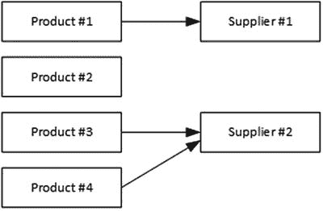

图 14-1。

Creating a relationship between data model classes

一个`Product`对象的`Supplier`属性可以是`null`，这意味着一个`Product`对象不必与一个`Supplier`相关。并且一个`Product`对象的`Supplier`属性不必是唯一的，这意味着多个`Product`对象可以与同一个`Supplier`相关。

### 创建迁移

要查看实体框架核心如何处理导航属性的添加，在`DataApp`项目文件夹中运行清单 [14-4](#Par18) 中所示的命令来创建一个迁移。

```cs
dotnet ef migrations add Add_Supplier --context EFDatabaseContext
Listing 14-4.Creating a Migration

```

实体框架核心将创建一个名为`Add_Supplier`的迁移，如果您检查`Migrations`文件夹中的`<timestamp>_Add_Supplier.cs`文件中的`Up`方法，您将能够看到实体框架核心将如何更新数据库。`Up`方法包含四个更新数据库的语句。第一条语句向数据库的现有表中添加一个新列。

```cs
...
migrationBuilder.AddColumn<long>(name: "SupplierId", table: "Products",
    nullable: true);
...

```

这是实体框架核心用来跟踪哪个`Supplier`对象与一个`Product`对象相关联的列。`AddColumn`方法的参数将在现有的`Products`表上创建一个名为`SupplierId`的列。`nullable`参数被设置为`true`，这意味着新列中允许有`null`值，这样与`Supplier`不相关的`Product`对象仍然可以存储在数据库中。

迁移的`Up`方法中的第二条语句创建一个新表，用于存储`Supplier`对象。

```cs
...
migrationBuilder.CreateTable(
    name: "Supplier",
    columns: table => new {
        Id = table.Column<long>(nullable: false)
            .Annotation("SqlServer:ValueGenerationStrategy",
                SqlServerValueGenerationStrategy.IdentityColumn),
        City = table.Column<string>(nullable: true),
        Name = table.Column<string>(nullable: true),
        State = table.Column<string>(nullable: true)
    },
    constraints: table => {
        table.PrimaryKey("PK_Supplier", x => x.Id);
    });
...

```

`CreateTable`方法的参数将创建一个名为`Supplier`的表，该表具有与`Supplier`类定义的属性对应的`Id`、`Name`、`City`和`State`列。`Id`列被配置为主键，当向表中添加新行时，数据库服务器将负责为该列生成值。

Tip

注意，表的名称是`Supplier`，而现有表的名称是`Products`。实体框架核心遵循的惯例是，在为可通过上下文类访问的实体类创建表时，使用`DbSet<T>`属性的名称，并为只能通过关系访问的实体类使用导航属性的名称。

下一条语句创建了一个索引，用于加速数据库查询:

```cs
...
migrationBuilder.CreateIndex(name: "IX_Products_SupplierId",
    table: "Products", column: "SupplierId");
...

```

索引与表示`Product`和`Supplier`对象之间的关系没有直接关系，为了本章的目的，我将跳过它。`Up`方法中的最后一个语句负责在`Products`和`Supplier`表中的行之间创建链接:

```cs
...
migrationBuilder.AddForeignKey(
    name: "FK_Products_Supplier_SupplierId", table: "Products",
    column: "SupplierId", principalTable: "Supplier",
    principalColumn: "Id", onDelete: ReferentialAction.Restrict);
...

```

`AddForeignKey`方法用于配置添加到`Products`表中的`SupplierId`列，以创建与新`Supplier`表上的`Id`列的外键关系。这有助于保护数据库的完整性，确保`Product`表中的一行只能有一个对应于`Supplier`表中有效行的`SupplierId`列值(或者有一个`null`值，表示与`Supplier`没有关系)。

迁移的`Up`方法中语句的综合效果是更新数据库以反映数据模型的变化，如图 [14-2](#Fig2) 所示。

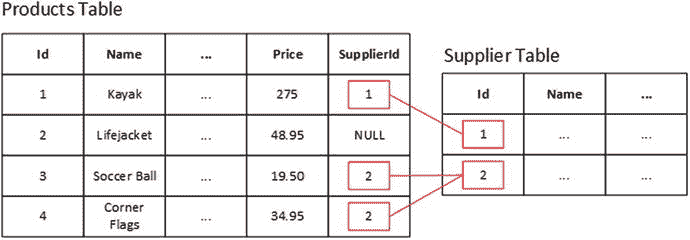

图 14-2。

The effect of a data relationship on the database

`Supplier`表允许实体框架核心存储`Supplier`对象，添加到`Products`表中的`SupplierId`列将用于跟踪`Product`和`Supplier`对象之间的关系。

### 查询和显示相关数据

在本章中，我将解释如何对相关数据执行完整的数据操作，但是我将从最基本的任务开始，即向用户显示相关的数据值。默认情况下，实体框架核心不遵循导航属性来加载相关数据。这是为了防止查询返回不需要的数据。为了加载与一个`Product`对象相关的`Supplier`数据，将清单 [14-5](#Par34) 中所示的语句添加到存储库实现类中。

```cs
using System;
using System.Collections.Generic;
using System.Linq;
using Newtonsoft.Json;
using Microsoft.EntityFrameworkCore.ChangeTracking;

using Microsoft.EntityFrameworkCore;

namespace DataApp.Models {

    public class EFDataRepository : IDataRepository {
        private EFDatabaseContext context;

        public EFDataRepository(EFDatabaseContext ctx) {
            context = ctx;
        }

        public Product GetProduct(long id) {
            return context.Products.Include(p => p.Supplier).First(p => p.Id == id);
        }

        public IEnumerable<Product> GetAllProducts() {
            Console.WriteLine("GetAllProducts");
            return context.Products.Include(p => p.Supplier);
        }

        public IEnumerable<Product> GetFilteredProducts(string category = null,
                decimal? price = null, bool includeRelated = true) {

            IQueryable<Product> data = context.Products;
            if (category != null) {
                data = data.Where(p => p.Category == category);
            }
            if (price != null) {
                data = data.Where(p => p.Price >= price);
            }
            if (includeRelated) {
                data = data.Include(p => p.Supplier);
            }
            return data;
        }

        public void CreateProduct(Product newProduct) {
            newProduct.Id = 0;
            context.Products.Add(newProduct);
            context.SaveChanges();
            Console.WriteLine($"New Key: {newProduct.Id}");
        }

        public void UpdateProduct(Product changedProduct,
                Product originalProduct = null) {
            if (originalProduct == null) {
                originalProduct = context.Products.Find(changedProduct.Id);
            } else {
                context.Products.Attach(originalProduct);
            }
            originalProduct.Name = changedProduct.Name;
            originalProduct.Category = changedProduct.Category;
            originalProduct.Price = changedProduct.Price;
            context.SaveChanges();
        }

        public void DeleteProduct(long id) {
            Product p = context.Products.Find(id);
            context.Products.Remove(p);
            context.SaveChanges();
        }
    }
}

Listing 14-5.Querying Related Data in the EFDataRepository.cs File in the Models Folder

```

`Include`扩展方法在`Microsoft.EntityFrameworkCore`名称空间中定义，并在实现`IQueryable<T>`接口的对象上调用，以包含相关数据。`Include`方法的参数是一个选择导航属性的表达式，实体框架核心应该遵循该属性来获取相关数据。在列表中，我选择了`Supplier`对象。`Include`方法可以像其他 LINQ 方法一样合并到查询中，如下所示:

```cs
...
return context.Products.Include(p => p.Supplier);
...

```

并不是所有的 LINQ 扩展方法都可以用在由`Include`方法返回的对象上，所以在使用相关数据时，您可能需要重做一些查询。我在前面的例子中用来在数据库中定位特定的`Product`的`Find`方法不能与`Include`一起使用，所以我用`First`方法代替了它，其工作方式类似，如下所示:

```cs
...
return context.Products.Include(p => p.Supplier).First(p => p.Id == id);
...

```

您可以决定是否在运行时在查询中包含相关数据。在清单 [14-5](#Par34) 中，我修改了`GetFilteredProducts`方法，因此当`includeRelated`参数的值为`true`时，调用`Include`方法，否则不调用，如下所示:

```cs
...
if (includeRelated) {
    data = data.Include(p => p.Supplier);
}
...

```

为了支持有选择地将相关数据包含到应用的其余部分，请更改`IDataRepository`接口的签名，如清单 [14-6](#Par45) 所示。

Future Support For Lazy Loading

Entity Framework 的早期版本支持一个名为 lazy loading 的特性，微软宣布该特性将包含在 Entity Framework Core 的未来版本中。在延迟加载中，当读取导航属性时，会自动从数据库加载相关数据。对于示例应用，这意味着读取一个`Product`对象上的`Supplier`属性的值将自动触发一个 SQL 查询，查询创建一个`Supplier`对象所需的数据。

惰性加载听起来是一个好主意，通常作为一个方便的特性启用，允许编写应用的 MVC 部分，而不必创建实体框架核心查询，这些查询包括或排除不同操作的不同相关数据集。一切都像魔法一样工作，实体框架核心确保应用的 MVC 部分需要的数据是可用的。但是在后台，当读取导航属性时会生成额外的 SQL 查询，从而增加了数据库服务器的负载和处理 HTTP 请求的时间。

我的建议是避免偷懒加载。相反，定义存储库方法或属性，以应用的 MVC 部分需要的所有组合返回数据，不管有没有相关数据。换句话说，避免任何自动生成数据库查询的特性。

```cs
using System.Collections.Generic;
using System.Linq;

namespace DataApp.Models {

    public interface IDataRepository {

        Product GetProduct(long id);

        IEnumerable<Product> GetAllProducts();

        IEnumerable<Product> GetFilteredProducts(string category = null,
           decimal? price = null, bool includeRelated = true);

        void CreateProduct(Product newProduct);

        void UpdateProduct(Product changedProduct,
            Product originalProduct = null);

        void DeleteProduct(long id);
    }
}

Listing 14-6.Adding a Parameter in the IDataRepository.cs File in the Models Folder

```

接下来，在 action 方法中添加一个参数，这样控制器就可以通过 MVC 模型绑定过程从 HTTP 请求中获取一个是否包含相关数据的值，如清单 [14-7](#Par47) 所示。

```cs
using Microsoft.AspNetCore.Mvc;
using DataApp.Models;
using System.Linq;

namespace DataApp.Controllers {
    public class HomeController : Controller {
        private IDataRepository repository;

        public HomeController(IDataRepository repo) {
            repository = repo;
        }

        public IActionResult Index(string category = null,
                decimal? price = null, bool includeRelated = true) {
            var products = repository
                .GetFilteredProducts(category, price, includeRelated);
            ViewBag.category = category;
            ViewBag.price = price;
            ViewBag.includeRelated = includeRelated;
            return View(products);
        }

        // ...other actions omitted for brevity...
    }
}

Listing 14-7.Adding an Action Parameter in the HomeController.cs File in the Controllers Folder

```

实体框架核心处理相关数据的方法的一个缺点是，没有好的方法来确定导航属性的值是否是`null`。这或者是因为没有特定对象的相关数据，或者是因为没有使用`Include`方法选择相关数据。为了解决这个问题，我使用了一个`ViewBag`属性，以便视图知道相关数据是否被请求。

### 更新视图以显示相关数据

现在所有的代码修改都已经就绪，我可以使用 Razor 显示相关数据了。当被请求时，模型数据将包括`Supplier`对象，并且有一个`ViewBag`属性可用于配置表单元素，如清单 [14-8](#Par50) 所示。

```cs
@model IEnumerable<DataApp.Models.Product>
@{
    ViewData["Title"] = "Products";
    Layout = "_Layout";
}

<div class="m-1 p-2">
    <form asp-action="Index" method="get" class="form-inline">
        <label class="m-1">Category:</label>
        <select name="category" class="form-control">
            <option value="">All</option>
            <option selected="@(ViewBag.category == "Watersports")">
                Watersports
            </option>
            <option selected="@(ViewBag.category == "Soccer")">Soccer</option>
            <option selected="@(ViewBag.category == "Chess")">Chess</option>
        </select>
        <label class="m-1">Min Price:</label>
        <input class="form-control" name="price" value="@ViewBag.price" />
        <div class="form-check m-1">
            <label class="form-check-label">
                <input class="form-check-input" type="checkbox"
                       name="includeRelated" value="true"
                       checked="@(ViewBag.includeRelated == true)"/>
                Related Data
            </label>
            <input type="hidden" name="includeRelated" value="false" />
        </div>
        <button class="btn btn-primary m-1">Filter</button>
    </form>
</div>
<table class="table table-sm table-striped">
    <thead>
        <tr>
            <th>ID</th><th>Name</th><th>Category</th><th>Price</th>
            @if (ViewBag.includeRelated) {
                <th>Supplier</th>
            }
        </tr>
    </thead>
    <tbody>
        @foreach (var p in Model) {
            <tr>
                <td>@p.Id</td><td>@p.Name</td>
                <td>@p.Category</td><td>$@p.Price.ToString("F2")</td>
                @if (ViewBag.includeRelated) {
                    <td>@p.Supplier?.Name</td>
                }
                <td>
                    <form asp-action="Delete" method="post">
                        <a asp-action="Edit" class="btn btn-sm btn-warning"
                           asp-route-id="@p.Id">
                            Edit
                        </a>
                        <input type="hidden" name="id" value="@p.Id" />
                        <button type="submit" class="btn btn-danger btn-sm">
                            Delete
                        </button>
                    </form>
                </td>
            </tr>
        }
    </tbody>
</table>
<a asp-action="Create" class="btn btn-primary">Create New Product</a>

Listing 14-8.Displaying Related Data in the Index.cshtml File in the Views/Home Folder

```

我添加了一个复选框来控制相关数据是否包含在请求中。当用户选择了相关数据时，`ViewBag.includeRelated`属性将是`true`，视图使用这个值在表中显示一个额外的列。该列的值是通过读取与正在显示的`Product`对象相关的`Supplier`对象的`Name`属性获得的，如下所示:

```cs
...
<td>@p.Supplier?.Name</td>
...

```

Razor 视图不知道`Supplier`对象的来源，因为实体框架核心用正则表达式填充导航属性。NET 对象。

### 准备数据库

我将演示如何对相关数据执行完整的数据操作，但是有一些初始数据来演示使用`Include`方法的查询是如何工作的会有所帮助。要将`Supplier`对象添加到数据库中，对种子数据类进行清单 [14-9](#Par55) 中所示的更改。

```cs
...

private static Product[] Products {

    get {
        Product[] products = new Product[] {
            new Product { Name = "Kayak", Category = "Watersports",
                Price = 275, Color = Colors.Green, InStock = true },
            new Product { Name = "Lifejacket", Category = "Watersports",
                Price = 48.95m, Color = Colors.Red, InStock = true },
            new Product { Name = "Soccer Ball", Category = "Soccer",
                Price = 19.50m, Color = Colors.Blue, InStock = true },
            new Product { Name = "Corner Flags", Category = "Soccer",
                Price = 34.95m, Color = Colors.Green, InStock = true },
            new Product { Name = "Stadium", Category = "Soccer",
                Price = 79500, Color = Colors.Red, InStock = true },
            new Product { Name = "Thinking Cap", Category = "Chess",
                Price = 16, Color = Colors.Blue, InStock = true },
            new Product { Name = "Unsteady Chair", Category = "Chess",
                Price = 29.95m, Color = Colors.Green, InStock = true },
            new Product { Name = "Human Chess Board", Category = "Chess",
                Price = 75, Color = Colors.Red, InStock = true },
            new Product { Name = "Bling-Bling King", Category = "Chess",
                Price = 1200, Color = Colors.Blue, InStock = true }};

        Supplier s1 = new Supplier { Name = "Surf Dudes",
            City = "San Jose", State = "CA" };
        Supplier s2 = new Supplier { Name = "Chess Kings",
            City = "Seattle", State = "WA" };

        products.First().Supplier = s1;
        foreach (Product p in  products.Where(p => p.Category == "Chess")) {
            p.Supplier = s2;
        }
        return products;
    }
}
...

Listing 14-9.Seeding the Database with Suppliers in the SeedData.cs File in the Models Folder

```

我已经用一个属性替换了`SeedData`类中`Product`对象的静态数组，该属性的 getter 创建了两个`Supplier`对象并将它们与`Product`对象相关联。`Surf Dudes`供应商与第一个`Product`对象`Kayak`相关联，`Chess Kings`供应商与`Chess`类别中的所有`Product`对象相关联。

接下来，通过应用迁移为应用准备数据库，包括定义`Supplier`关系的新迁移。要应用迁移，运行清单`DataApp`项目文件夹中的 [14-10](#Par58) 所示的命令。

```cs
dotnet ef database update --context EFDatabaseContext
Listing 14-10.Preparing the Database

```

要启动应用，打开命令提示符，导航到`DataApp`文件夹，通过运行清单 [14-11](#Par60) 中所示的命令来启动应用。

```cs
dotnet run
Listing 14-11.Starting the Example Application

```

应用将用`Product`和`Supplier`对象植入数据库，这可能需要一些时间来完成。应用启动后，打开浏览器窗口并导航至`http://localhost:5000`。您将看到表格中的新列，其中包含与`Supplier`对象相关的那些`Product`对象的供应商名称，如图 [14-3](#Fig3) 所示。请注意，并非所有的`Product`对象都与一个`Supplier`相关，在那些相关的对象中，不止一个与同一个`Supplier`有关系。

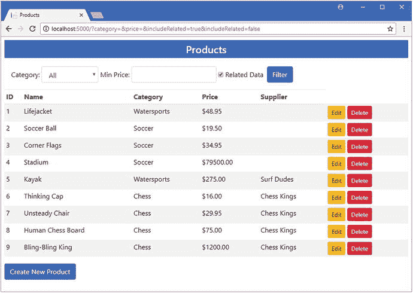

图 14-3。

Running the example application

如果您检查应用的控制台输出，您将看到实体框架核心用来获取相关数据的查询。

```cs
...
SELECT [p].[Id], [p].[Category], [p].[Color], [p].[InStock], [p].[Name],
       [p].[Price], [p].[SupplierId], [p.Supplier].[Id], [p.Supplier].[City],
       [p.Supplier].[Name], [p.Supplier].[State]
FROM [Products] AS [p]
LEFT JOIN [Supplier] AS [p.Supplier] ON [p].[SupplierId] = [p.Supplier].[Id]
...

```

该查询使用`Products`和`Supplier`表之间的关系来执行连接，以便可以在一个查询中获得所有需要的数据。如果您取消选中相关数据选项并单击过滤器按钮，对数据库的查询将不会请求`Supplier`数据，并且`Supplier`列将不会显示在浏览器显示的表格中。

## 创建和更新相关数据

创建或更新相关数据的过程通过导航属性来执行，并使用标准来完成。NET 对象。

对于示例应用——与大多数真实项目一样——有三种不同的场景，其中一个`Supplier`对象存储在数据库中，或者一个现有的`Supplier`对象被更新。

*   同时创建新的`Product`和`Supplier`对象。
*   一个新的`Supplier`对象被创建并与一个现有的`Product`对象相关联。
*   现有的`Supplier`对象在与`Product`对象相关联后被修改。

为了准备这些操作，我在`Views/Shared`文件夹中添加了一个名为`Supplier.cshtml`的视图，其内容如清单 [14-12](#Par71) 所示。

```cs
@model DataApp.Models.Product

<input type="hidden" asp-for="Supplier.Id" />
<div class="form-group">
    <label asp-for="Supplier.Name"></label>
    <input asp-for="Supplier.Name" class="form-control" />
</div>
<div class="form-group">
    <label asp-for="Supplier.City"></label>
    <input asp-for="Supplier.City" class="form-control" />
</div>
<div class="form-group">
    <label asp-for="Supplier.State"></label>
    <input asp-for="Supplier.State" class="form-control" />
</div>

Listing 14-12.The Contents of the Supplier.cshtml File in the Views/Shared Folder

```

这个视图的模型是一个`Product`对象。这在用于处理`Supplier`数据的视图中可能看起来很奇怪，但是遵循 MVC 惯例并使用`asp-for`标签助手设置 HTML 元素，这样 MVC 模型绑定过程将使用来自`input`元素的值创建一个`Supplier`对象，并将其分配给它创建的`Product`对象的`Supplier`属性。

编辑`Views/Home`文件夹中的`Editor.cshtml`视图，如清单 [14-13](#Par74) 所示，合并清单 [14-12](#Par71) 中的视图，并给视图内容添加一些结构。

```cs
@model DataApp.Models.Product
@{
    ViewData["Title"] = ViewBag.CreateMode ? "Create" : "Edit";
    Layout = "_Layout";
}

<form asp-action="@(ViewBag.CreateMode ? "Create" : "Edit")" method="post">
    <input name="original.Id" value="@Model?.Id" type="hidden" />
    <input name="original.Name" value="@Model?.Name" type="hidden" />
    <input name="original.Category" value="@Model?.Category" type="hidden" />
    <input name="original.Price" value="@Model?.Price" type="hidden" />
    <div class="row m-1">
        <div class="col-6">
            <h5 class="bg-info text-center p-2 text-white">Product</h5>
            <div class="form-group">
                <label asp-for="Name"></label>
                <input asp-for="Name" class="form-control" />
            </div>
            <div class="form-group">
                <label asp-for="Category"></label>
                <input asp-for="Category" class="form-control" />
            </div>
            <div class="form-group">
                <label asp-for="Price"></label>
                <input asp-for="Price" class="form-control" />
            </div>
        </div>
        <div class="col-6">
            <h5 class="bg-info text-center p-2 text-white">Supplier</h5>
            @Html.Partial("Supplier", Model)
        </div>
    </div>
    <div class="text-center">
        <button class="btn btn-primary" type="submit">Save</button>
        <a asp-action="Index" class="btn btn-secondary">Cancel</a>
    </div>
</form>

Listing 14-13.Using a Partial View in the Editor.cshtml File in the Views/Home Folder

```

应用于清单 [14-13](#Par74) 中的`div`元素的引导样式创建了一个简单的网格，使得表单元素显示在两列中，一列用于由`Product`类定义的字段，另一列用于`Supplier`类。您将看到在下一节中创建的布局。

### 创建新产品时创建新供应商

第一个场景是最简单的:新的`Product`和`Supplier`对象同时被添加到数据库中。这不需要对应用做进一步的修改，因为创建新的`Product`对象的现有代码将自动处理`Supplier`对象。

启动应用，使用浏览器导航至`http://localhost:5000`，并点击创建新产品按钮。

填写好表格中的两栏，如图 [14-4](#Fig4) 所示，点击保存按钮。如果要重新创建图中所示的`Product`和`Supplier`，则使用表 [14-3](#Tab3) 中所示的值。

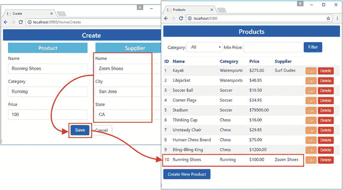

图 14-4。

Creating a supplier along with a new product

表 14-3。

The Product and Supplier Details Used in the Figure

<colgroup><col> <col></colgroup> 
| 田 | 价值 |
| --- | --- |
| 产品名称 | 运动鞋 |
| 种类 | 运转 |
| 价格 | One hundred |
| 供应商名称 | 变焦鞋 |
| 城市 | 圣何塞 |
| 状态 | 加利福尼亚 |

当您单击 Save 按钮时，浏览器向服务器发送一个 HTTP POST 请求，其中包含来自清单 [14-12](#Par71) 中定义的`input`元素的值。这些`input`元素是由 Razor 渲染的，因此它们会被 MVC 模型绑定器识别为一个`Supplier`对象的属性。例如，下面是如何呈现`City`属性的元素:

```cs
...
<input class="form-control" type="text"
    id="Supplier_City" name="Supplier.City" value="">
...

```

模型绑定器使用 HTML 表单中的值创建一个`Product`对象和一个`Supplier`对象，并将其分配给`Product`对象的`Supplier`导航属性。`Product`对象被用作`Home`控制器的`Create`方法的参数，后者将它传递给存储库的`CreateProduct`方法。存储库的`CreateProduct`方法将`Product`对象添加到由上下文对象管理的集合中，并调用`SaveChanges`方法。实体框架核心检查`Product`对象，发现`Id`值为零，这表明它是要存储在数据库中的新对象。实体框架核心还遵循`Product.Supplier`导航属性来检查`Supplier`对象，并看到它也具有值为零的`Id`并且是要存储在数据库中的新对象。这些对象作为新行存储在`Products`和`Supplier`表中，并且`Products`行上的`SupplierId`列的值被设置为`Supplier`行上的`Id`列的值，以记录对象之间的关系。

如果您检查应用产生的日志消息，您将看到存储数据的两组 SQL 语句。第一对语句在`Supplier`表中创建行，该行存储`Supplier`对象并获取数据库服务器分配的主键值。

```cs
...
INSERT INTO [Supplier] ([City], [Name], [State])
VALUES (@p0, @p1, @p2);

SELECT [Id]
FROM [Supplier]
WHERE @@ROWCOUNT = 1 AND [Id] = scope_identity();
...

```

第二对语句在`Products`表中创建行，并获取数据库服务器分配的主键。

```cs
...
INSERT INTO [Products] ([Category], [Color], [InStock],
    [Name], [Price], [SupplierId])
VALUES (@p3, @p4, @p5, @p6, @p7, @p8);

SELECT [Id]
FROM [Products]
WHERE @@ROWCOUNT = 1 AND [Id] = scope_identity();
...

```

结果是，实体框架核心与 MVC 模型绑定器创建的对象无缝协作，并在数据库中存储两个新行来表示新对象以及它们之间的关系，如图 [14-5](#Fig5) 所示。

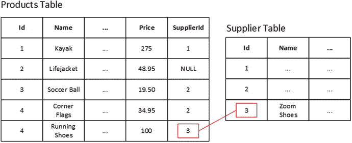

图 14-5。

Creating new Product and Supplier objects

### 更新产品时更新供应商

当与`Product`对象相关的`Supplier`对象先前已经存储在数据库中时，需要改变上下文类来创建或更新`Supplier`对象。这是因为我之前使用的技术利用了 Entity Framework Core 提供的变更检测特性来减少数据库查询的数量，这些查询必须扩展以包含`Supplier`数据。要在发送给客户端的 HTML 表单中包含`Supplier`数据，请将清单 [14-14](#Par88) 中所示的元素添加到`Supplier.cshtml`视图中。

```cs
@model DataApp.Models.Product

<input name="original.Supplier.Id" value="@Model.Supplier?.Id" type="hidden" />

<input name="original.Supplier.Name" value="@Model.Supplier?.Name" type="hidden" />

<input name="original.Supplier.City" value="@Model.Supplier?.City" type="hidden" />

<input name="original.Supplier.State" value="@Model.Supplier?.State" type="hidden" />

<input type="hidden" asp-for="Supplier.Id" />
<div class="form-group">
    <label asp-for="Supplier.Name"></label>
    <input asp-for="Supplier.Name" class="form-control" />
</div>
<div class="form-group">
    <label asp-for="Supplier.City"></label>
    <input asp-for="Supplier.City" class="form-control" />
</div>
<div class="form-group">
    <label asp-for="Supplier.State"></label>
    <input asp-for="Supplier.State" class="form-control" />
</div>

Listing 14-14.Adding Existing Values in the Supplier.cshtml File in the Views/Shared Folder

```

这些隐藏的`input`元素与`Editor.cshtml`视图中的元素相对应。为了确保用户所做的更改被写入数据库，编辑`EFDataRepository`类的`UpdateProduct`方法来添加清单 [14-15](#Par90) 中所示的语句。

```cs
...
public void UpdateProduct(Product changedProduct, Product originalProduct = null) {
    if (originalProduct == null) {
        originalProduct = context.Products.Find(changedProduct.Id);
    } else {
        context.Products.Attach(originalProduct);
    }
    originalProduct.Name = changedProduct.Name;
    originalProduct.Category = changedProduct.Category;
    originalProduct.Price = changedProduct.Price;
    originalProduct.Supplier.Name = changedProduct.Supplier.Name;
    originalProduct.Supplier.City = changedProduct.Supplier.City;
    originalProduct.Supplier.State = changedProduct.Supplier.State;
    context.SaveChanges();
}
...
Listing 14-15.Including Supplier Data in the EFDataRepository.cs File in the Models Folder

```

这些语句将`Name`、`City`和`State`值复制到实体框架核心正在跟踪的对象，以确保更改的值将存储在数据库中。注意，我没有复制`Supplier.Id`属性；该值由实体框架核心或数据库服务器管理，在执行更新时最好保持不变。

要测试更改，重新启动应用，导航到`http://localhost:5000`，并单击 Thinking Cap 产品的编辑按钮。要查看更新两个相关对象的效果，如表 [14-4](#Tab4) 所示进行更改。

表 14-4。

The Values for Editing the of the Thinking Cap Product and Supplier

<colgroup><col> <col></colgroup> 
| 田 | 价值 |
| --- | --- |
| 产品名称 | 思维帽(中号) |
| 供应商名称 | 典当经纪人 |
| 城市 | 芝加哥 |
| 状态 | 伊利诺伊 |

单击 Save 按钮，浏览器会将修改后的数据发送到应用。模型构建器将从请求数据中创建`Product`和`Supplier`对象，实体框架核心将把更改保存到数据库中。由于`Supplier`对象与`Chess`类别中的所有`Product`对象相关，这种变化将会反映在表格的几行中，如图 [14-6](#Fig6) 所示。

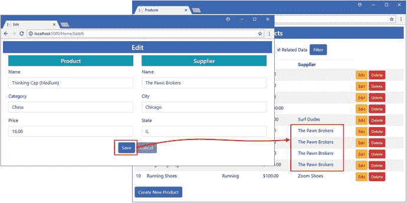

图 14-6。

Updating a Product and Supplier

## 删除相关数据

默认情况下，实体框架核心不会遵循导航属性从数据库中删除相关数据。这意味着删除一个`Product`对象不会删除与之相关的`Supplier`对象。

这是因为`Supplier`对象可能与其他`Product`对象相关，从数据库中删除它会使数据库不一致，这是数据库服务器很难避免的。有一些特性使执行删除操作变得更容易，我将在后面的章节中介绍，但是现在，我将只演示默认配置，并解释它存在的缺陷。

要查看删除操作是如何处理的，请启动应用，导航到`http://localhost:5000`，并单击与典当经纪人产品相关的不稳定椅子产品的删除按钮。该操作移除产品，但留下`Supplier`对象，该对象仍与`Chess`类别中的其他产品相关，如图 [14-7](#Fig7) 所示。

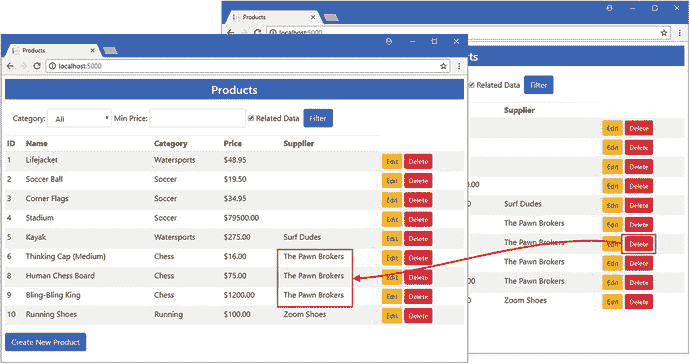

图 14-7。

Deleting an object that has related data

您可以告诉实体框架核心删除相关数据，尽管如果这样做会使数据库不一致，数据库服务器会导致异常。要了解这是如何工作的，对`EFDataRepository`类中的`DeleteProduct`方法进行清单 [14-16](#Par98) 所示的修改。

```cs
...
public void DeleteProduct(long id) {
    Product p = this.GetProduct(id);
    context.Products.Remove(p);
    if (p.Supplier != null) {
        context.Remove<Supplier>(p.Supplier);
    }
    context.SaveChanges();
}
...
Listing 14-16.Deleting Related Data in the EFDataRepository.cs File in the Models Folder

```

清单 [14-16](#Par98) 中的语句调用`GetProduct`方法，该方法从数据库中检索一个`Product`及其相关的`Supplier`。通过上下文对象的`DbSet<Product>`属性提供的`Remove`方法删除`Product`对象。不能直接访问`Supplier`数据，但是可以使用上下文对象的`Remove<T>`方法从数据库中删除任何对象，如下所示:

```cs
...
context.Remove<Supplier>(p.Supplier);
...

```

为了测试这段代码，重启应用，导航到`http://localhost:5000`，点击跑鞋产品的删除按钮，如图 [14-8](#Fig8) 所示。这是唯一与变焦鞋`Supplier`对象相关的`Product`对象，这意味着删除这些对象不会产生任何不一致，两者都将被删除。

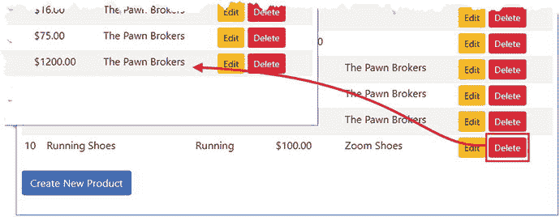

图 14-8。

Deleting related data

要查看数据库服务器如何防止不一致，请单击人类棋盘产品的删除按钮。由于这个`Product`的相关`Supplier`也与其他`Product`对象相关，删除它会在`Products`表中留下一些行，这些行的`SupplierId`列中的值引用了`Supplier`表中不存在的行。图 [14-9](#Fig9) 中的异常显示了数据库服务器不会执行会导致该问题的操作。

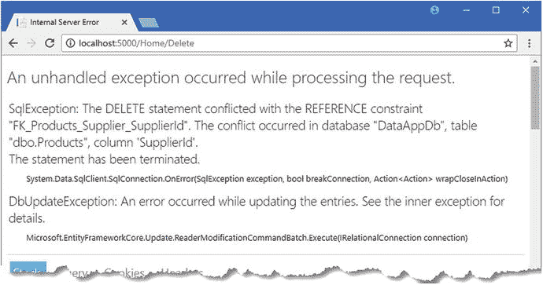

图 14-9。

A delete operation that would cause database inconsistencies

就目前情况来看，删除操作并不是特别有用，但是我将在本章的后面回到这个主题，并解释如何使用不同类型的关系使删除操作更加有用和可预测。

## 创建所需的关系

`Product`和`Supplier`类有一个可选的关系，反映了一个`Product`不一定与一个`Supplier`相关的事实。这是默认的关系类型，反映了对象在应用 MVC 部分的工作方式，其中引用另一个对象的属性可能是`null`。

有些关系需要更加正式，其中一种类型的对象总是与另一种类型的对象相关是很重要的。在这些情况下，您可以创建一个必需的关系，它重新配置数据库以代表应用实施该关系。

创建所需的关系意味着告诉实体框架核心应该如何创建在数据库中跟踪关系的外键列。下面是迁移中创建了`Products`和`Supplier`表之间关系的语句:

```cs
...
migrationBuilder.AddColumn<long>(name: "SupplierId",
    table: "Products", nullable: true);
...
migrationBuilder.AddForeignKey(name: "FK_Products_Supplier_SupplierId",
    table: "Products", column: "SupplierId", principalTable: "Supplier",
    principalColumn: "Id", onDelete: ReferentialAction.Restrict);
...

```

Entity Framework Core 没有提供任何关于外键关系的信息，而是使用了一些合理的缺省值，包括允许在跟踪关系的列中使用`null`值，并创建一个外键关系，其名称包含相关表和列的名称。

### 创建外键属性

覆盖缺省值是通过创建一个属性来完成的，该属性为实体框架核心提供了有关如何创建外键的详细信息。这是一个外键属性，它在包含导航属性的同一个类中定义。在清单 [14-17](#Par110) 中，我在`Product`类中定义了一个外键属性，用于配置与`Supplier`对象的关系。

```cs
namespace DataApp.Models {

    public enum Colors {
        Red, Green, Blue
    }

    public class Product {

        public long Id { get; set; }
        public string Name { get; set; }
        public string Category { get; set; }
        public decimal Price { get; set; }
        public Colors Color { get; set; }
        public bool InStock { get; set; }

        public long SupplierId { get; set; }
        public Supplier Supplier { get; set; }
    }
}

Listing 14-17.Adding a Foreign Key Property in the Product.cs File in the Models Folder

```

属性的名称通过将导航属性名称或相关类名与主键的名称相结合来告诉实体框架核心它与哪个导航属性相关。对于`Product`类，这两个约定都会导致一个名为`SupplierId`的属性，实体框架核心会将该属性检测为`Supplier`导航属性的外键属性。(在第 [18 章](18.html)中，我将向您展示如何覆盖属性名的约定。)

外键属性的类型告诉实体框架核心该关系是可选的还是必需的。如果外键属性类型可以设置为`null`(例如当使用类型`long?`时)，则该关系将是可选的；如果`null`值不可能(例如当使用类型`long`时)，则该关系将是必需的。在清单 [14-17](#Par110) 中，我使用`long`作为属性类型；这告诉实体框架核心创建所需的关系，因为`long`值不能设置为`null`。

在`DataApp`项目文件夹中运行清单 [14-18](#Par114) 中所示的命令来创建一个迁移，该迁移将修改数据库以应用属性。

```cs
dotnet ef migrations add Required --context EFDatabaseContext
Listing 14-18.Creating a Migration

```

如果您检查`Migrations`文件夹中的`<timestamp>_Required.cs`文件的`Up`方法中的语句，您将会看到更改是如何应用到数据库的，如下所示:

```cs
...
protected override void Up(MigrationBuilder migrationBuilder) {
    migrationBuilder.DropForeignKey(name: "FK_Products_Supplier_SupplierId",
        table: "Products");

    migrationBuilder.AlterColumn<long>(name: "SupplierId", table: "Products",
        nullable: false, oldClrType: typeof(long), oldNullable: true);

    migrationBuilder.AddForeignKey(name: "FK_Products_Supplier_SupplierId",
        table: "Products", column: "SupplierId", principalTable: "Supplier",
        principalColumn: "Id", onDelete: ReferentialAction.Cascade);
}
...

```

迁移将重新创建`Products`和`Supplier`表之间的外键关系，以反映`Product`类的新属性。最重要的语句是改变`SupplierId`列的语句，它的`nullable`参数是用来防止空值的。

```cs
...
migrationBuilder.AlterColumn<long>(name: "SupplierId", table: "Products",
    nullable: false, oldClrType: typeof(long), oldNullable: true);
...

```

更改后的列不再允许存储`null`值，外键要求值对应于`Supplier`表中的一行，这就是管理所需关系的方式。

### 删除数据库并准备种子数据

如果您试图将迁移应用到数据库，您将得到一个错误，因为在`Products`表中有包含`NULL`值的行，并且不再被允许。

在实际项目中，您应该通过删除不符合新要求的数据来为迁移准备数据库。对于示例应用，我将完全删除数据库，更新种子数据，然后重新创建它以确保所有数据都是有效的。首先，在`DataApp`项目文件夹中运行清单 [14-19](#Par122) 所示的命令来删除数据库。

```cs
dotnet ef database drop --force --context EFDatabaseContext
Listing 14-19.Dropping the Database

```

接下来，更新由`SeedData`类定义的`Products`属性的 getter，这样所有存储的`Product`对象都与一个`Supplier`对象相关，如清单 [14-20](#Par124) 所示。

```cs
...
private static Product[] Products {
    get {
        Product[] products = new Product[] {
            new Product { Name = "Kayak", Category = "Watersports",
                Price = 275, Color = Colors.Green, InStock = true },
            new Product { Name = "Lifejacket", Category = "Watersports",
                Price = 48.95m, Color = Colors.Red, InStock = true },
            new Product { Name = "Soccer Ball", Category = "Soccer",
                Price = 19.50m, Color = Colors.Blue, InStock = true },
            new Product { Name = "Corner Flags", Category = "Soccer",
                Price = 34.95m, Color = Colors.Green, InStock = true },
            new Product { Name = "Stadium", Category = "Soccer",
                Price = 79500, Color = Colors.Red, InStock = true },
            new Product { Name = "Thinking Cap", Category = "Chess",
                Price = 16, Color = Colors.Blue, InStock = true },
            new Product { Name = "Unsteady Chair", Category = "Chess",
                Price = 29.95m, Color = Colors.Green, InStock = true },
            new Product { Name = "Human Chess Board", Category = "Chess",
                Price = 75, Color = Colors.Red, InStock = true },
            new Product { Name = "Bling-Bling King", Category = "Chess",
                Price = 1200, Color = Colors.Blue, InStock = true }};

        Supplier acme = new Supplier { Name = "Acme Co",
            City = "New York", State = "NY" };
        Supplier s1 = new Supplier { Name = "Surf Dudes",
            City = "San Jose", State = "CA" };
        Supplier s2 = new Supplier { Name = "Chess Kings",
            City = "Seattle", State = "WA" };

        foreach (Product p in products) {
            if (p == products[0]) {
                p.Supplier = s1;
            } else if (p.Category == "Chess") {
                p.Supplier = s2;
            } else {
                p.Supplier = acme;
            }
        }
        return products;
    }
}
...

Listing 14-20.Ensuring Data Relationships in the SeedData.cs File in the Models Folder

```

对种子数据的更改保留了我之前建立的关系，并对所有其他产品使用`Acme Co`供应商。

### 更新和播种数据库

运行`DataApp`项目文件夹中清单 [14-21](#Par127) 所示的命令来准备数据库，包括`Product`和`Supplier`对象之间所需的关系。

```cs
dotnet ef database update --context EFDatabaseContext
Listing 14-21.Updating the Database to Include the Changed Relationship

```

一旦实体框架核心应用了迁移，使用`dotnet run`启动应用，并使用浏览器请求`http://localhost:5000` URL。在应用启动期间，数据库将被植入满足应用于数据库的约束的数据，这样所有的`Product`对象都与一个`Supplier`相关，如图 [14-10](#Fig10) 所示。

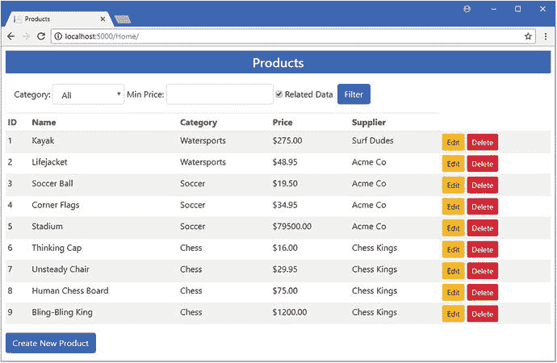

图 14-10。

Creating a relationship

### 了解所需的关系删除操作

外键属性导致了清单 [14-21](#Par127) 中创建的迁移中的两个重要变化。第一个是防止`null`值存储在`SupplierId`列中，这将关系从可选变为必需。第二个变化对数据库的工作方式产生了惊人的影响，并导致了许多混乱。

在定义外键属性之前，当导航属性被添加到清单 [14-3](#Par12) 中的`Product`类时，创建的迁移配置外键关系如下:

```cs
...
migrationBuilder.AddForeignKey(
    name: "FK_Products_Supplier_SupplierId", table: "Products",
    column: "SupplierId", principalTable: "Supplier",
    principalColumn: "Id", onDelete: ReferentialAction.Restrict);
...

```

使用来自`ReferentialAction`枚举的值，`onDelete`参数告诉数据库当`Supplier`表中`Product`依赖的行被删除时该做什么。`Restrict`值用于可选关系并配置数据库，以便在`Products`表中有依赖于它的行时不能删除`Supplier`。这就是本章前面删除`Supplier`时出现错误的原因。

当您创建一个必需的关系时，外键被重新配置为一个不同的`ReferentialAction`值，如下所示:

```cs
...
migrationBuilder.AddForeignKey(
    name: "FK_Products_Supplier_SupplierId", table: "Products",
    column: "SupplierId", principalTable: "Supplier",
    principalColumn: "Id", onDelete: ReferentialAction.Cascade);
...

```

当使用`Cascade`值时，删除一个`Supplier`会导致级联删除，这意味着依赖于该`Supplier`的任何其他`Product`对象也会被删除。要查看层叠的效果，使用`dotnet run`启动应用，导航到`http://localhost:5000`，并单击不稳定椅子产品的删除按钮。不仅这个`Product`会被删除，所有其他与`Chess Kings`供应商相关的也会被删除，如图 [14-11](#Fig11) 所示。

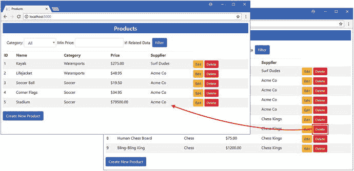

图 14-11。

The effect of a cascade delete

理解触发级联删除的是删除`Supplier`对象的行为是很重要的。您可以从数据库中删除一个`Product`对象，而`Supplier`不会受到影响。当您删除一个`Supplier`时，级联删除负责从`Products`数据库中删除与被删除的`Supplier`表中的行有外键关系的行。

请记住，执行级联删除的是数据库服务器，而不是实体框架核心。迁移所应用的数据库配置告诉数据库服务器在删除行时应该做什么。我在第 22 章中解释了如何直接控制这种行为。

## 查询多个关系

大多数应用包含不止一个数据关系。创建、更新和删除更复杂的相关数据的过程是相同的，但是需要不同的技术来告诉 Entity Framework Core 遵循所有的导航属性，以确保获得所需的数据。

为了演示这是如何工作的，我在`Models`文件夹中添加了一个名为`ContactLocation.cs`的类文件，并添加了清单 [14-22](#Par140) 中所示的代码。

```cs
namespace DataApp.Models {

    public class ContactLocation {
        public long Id { get; set; }
        public string LocationName { get; set; }
        public string Address { get; set; }
    }
}

Listing 14-22.The Contents of the ContactLocation.cs File in the Models Folder

```

接下来，我在`Models`文件夹中创建了一个名为`ContactDetails.cs`的类文件，并添加了清单 [14-23](#Par142) 中所示的代码。

```cs
namespace DataApp.Models {

    public class ContactDetails {
        public long Id { get; set; }
        public string Name { get; set; }
        public string Phone { get; set; }
        public ContactLocation Location { get; set; }
    }
}

Listing 14-23.The Contents of the ContactDetails.cs File in the Models Folder

```

`ContactDetails`类定义了一个名为`Location`的导航属性，它创建了一个与`ContactLocation`对象的关系。为了完成添加，我向`Supplier`类添加了一个导航属性，如清单 [14-24](#Par144) 所示。

```cs
namespace DataApp.Models {

    public class Supplier {
        public long Id { get; set; }
        public string Name { get; set; }
        public string City { get; set; }
        public string State { get; set; }

        public ContactDetails Contact { get; set; }
    }
}

Listing 14-24.Adding a Navigation Property in the Supplier.cs File in the Models Folder

```

`Contact`属性创建了与`ContactDetails`类的关系。总体结果是类之间的关系链，如图 [14-12](#Fig12) 所示。

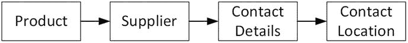

图 14-12。

Creating a chain of navigation properties

### 更新和播种数据库

要创建一个允许数据库存储新类实例的迁移，运行在`DataApp`项目文件夹中的清单 [14-25](#Par148) 中所示的命令。

Tip

如果本章中的命令没有按顺序执行，并且开始看到`Invalid Column Name`异常，那么注释掉`Startup`类中播种数据库的语句，并运行清单 [14-26](#Par151) 和清单 [14-25](#Par148) 中的命令。一旦数据库被更新，取消`Startup`类中语句的注释并启动应用。

```cs
dotnet ef migrations add AdditionalTypes --context EFDatabaseContext
Listing 14-25.Creating a Migration

```

如果您检查已经在`Migrations`文件夹中创建的`<timestamp>_AdditionalTypes.cs`文件中的 C# 语句，您将看到实体框架核心已经遵循了本章前面解释的约定来创建将存储`ContentDetails`和`ContactLocation`对象的表。

要删除并重新创建数据库以便它可以被重新播种，运行`DataApp`项目文件夹中清单 [14-26](#Par151) 中的命令。

```cs
dotnet ef database drop --force --context EFDatabaseContext
dotnet ef database update --context EFDatabaseContext
Listing 14-26.Re-creating the Database

```

为了确保当数据库被播种时有一些数据要查询，将清单 [14-27](#Par153) 中所示的语句添加到`SeedData`类中`Products`属性的 getter 中。

```cs
...
private static Product[] Products {
    get {
        Product[] products = new Product[] {
            new Product { Name = "Kayak", Category = "Watersports",
                Price = 275, Color = Colors.Green, InStock = true },
            new Product { Name = "Lifejacket", Category = "Watersports",
                Price = 48.95m, Color = Colors.Red, InStock = true },
            new Product { Name = "Soccer Ball", Category = "Soccer",
                Price = 19.50m, Color = Colors.Blue, InStock = true },
            new Product { Name = "Corner Flags", Category = "Soccer",
                Price = 34.95m, Color = Colors.Green, InStock = true },
            new Product { Name = "Stadium", Category = "Soccer",
                Price = 79500, Color = Colors.Red, InStock = true },
            new Product { Name = "Thinking Cap", Category = "Chess",
                Price = 16, Color = Colors.Blue, InStock = true },
            new Product { Name = "Unsteady Chair", Category = "Chess",
                Price = 29.95m, Color = Colors.Green, InStock = true },
            new Product { Name = "Human Chess Board", Category = "Chess",
                Price = 75, Color = Colors.Red, InStock = true },
            new Product { Name = "Bling-Bling King", Category = "Chess",
                Price = 1200, Color = Colors.Blue, InStock = true }};

        ContactLocation hq = new ContactLocation {
            LocationName = "Corporate HQ", Address = "200 Acme Way"
        };
        ContactDetails bob = new ContactDetails {
            Name = "Bob Smith", Phone = "555-107-1234", Location = hq
        };

        Supplier acme = new Supplier { Name = "Acme Co",
            City = "New York", State = "NY", Contact = bob };
        Supplier s1 = new Supplier { Name = "Surf Dudes",
            City = "San Jose", State = "CA" };
        Supplier s2 = new Supplier { Name = "Chess Kings",
            City = "Seattle", State = "WA" };

        foreach (Product p in products) {
            if (p == products[0]) {
                p.Supplier = s1;
            } else if (p.Category == "Chess") {
                p.Supplier = s2;
            } else {
                p.Supplier = acme;
            }
        }
        return products;
    }
}
...

Listing 14-27.Expanding the Seed Data in the SeedData.cs File in the Models Folder

```

这些更改在总部为 Bob Smith 创建了一个新的联系人，并将他指定为`Acme Co`供应商的联系人。

### 查询导航属性链

`ThenInclude`方法用于扩展查询的范围，以遵循由使用`Include`方法选择的类型定义的导航属性。清单 [14-28](#Par156) 使用`ThenInclude`方法告诉实体框架核心遵循`Supplier`和`ContactDetails`类定义的导航属性，以便图 [14-12](#Fig12) 所示的所有关系都包含在查询中。

```cs
...
public Product GetProduct(long id) {
    return context.Products.Include(p => p.Supplier)
        .ThenInclude(s => s.Contact).ThenInclude(c => c.Location)
        .First(p => p.Id == id);
}
...
Listing 14-28.Following Navigation Properties in the EFDatabaseRepository.cs File in the Models Folder

```

`ThenInclude`方法的参数是一个 lambda 函数，它对前面调用`Include`或`ThenInclude`方法所选择的类型进行操作，并选择您想要遵循的导航属性。通过结合使用`Include`和`ThenInclude`方法，您可以在一个复杂的模型中导航，将您需要的所有数据合并到一个查询中。

为了显示额外的相关数据，将清单 [14-29](#Par159) 中所示的元素添加到`Supplier.cshtml`视图中。

```cs
@model DataApp.Models.Product

<input name="original.Supplier.Id" value="@Model.Supplier?.Id" type="hidden" />
<input name="original.Supplier.Name" value="@Model.Supplier?.Name" type="hidden" />
<input name="original.Supplier.City" value="@Model.Supplier?.City" type="hidden" />
<input name="original.Supplier.State" value="@Model.Supplier?.State" type="hidden" />

<input type="hidden" asp-for="Supplier.Id" />
<div class="form-group">
    <label asp-for="Supplier.Name"></label>
    <input asp-for="Supplier.Name" class="form-control" />
</div>
<div class="form-group">
    <label asp-for="Supplier.City"></label>
    <input asp-for="Supplier.City" class="form-control" />
</div>
<div class="form-group">
    <label asp-for="Supplier.State"></label>
    <input asp-for="Supplier.State" class="form-control" />
</div>

@if (Model.Supplier?.Contact != null) {

    <div class="form-group">
        <label asp-for="Supplier.Contact.Name"></label>
        <input asp-for="Supplier.Contact.Name" class="form-control" readonly />
    </div>
    <div class="form-group">
        <label asp-for="Supplier.Contact.Phone"></label>
        <input asp-for="Supplier.Contact.Phone" class="form-control" readonly />
    </div>
    <div class="form-group">
        <label asp-for="Supplier.Contact.Location.LocationName"></label>
        <input asp-for="Supplier.Contact.Location.LocationName"
               class="form-control" readonly />
    </div>

}

Listing 14-29.Displaying Related Data in the Supplier.cshtml File in the Views/Shared Folder

```

附加项是只读元素，显示扩展相关数据中的值。为了测试查询，使用`dotnet run`来启动应用，导航到`http://localhost:5000`，并单击供应商为 Acme Co .的产品的编辑按钮。您将看到联系细节，如图 [14-13](#Fig13) 所示。

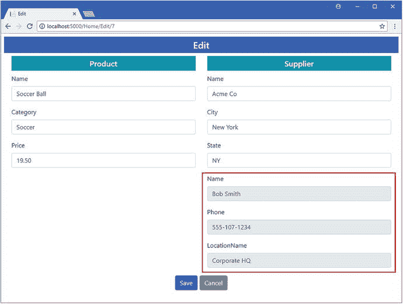

图 14-13。

Following a chain of navigation properties in a query

## 摘要

在这一章中，我解释了如何使用导航属性来创建数据之间的关系，以及如何在数据库中反映这些关系并由实体框架核心使用。在下一章，我将向你展示如何使用不同的关系特征。