# 十五、处理关系：第 1 部分

在这一章中，我将向您展示如何直接访问相关数据，并且一旦您完成了这些，您将如何完成一个关系，以便可以在关系中的对象之间进行双向导航。本章重点介绍一对多关系，这是最容易创建的关系，但在执行查询或更新数据库时需要小心。在第 [16](16.html) 章，我描述了实体框架核心支持的其他类型的数据关系。表 [15-1](#Tab1) 总结了这一章。

表 15-1。

Chapter Summary

<colgroup><col> <col> <col></colgroup> 
| 问题 | 解决办法 | 列表 |
| --- | --- | --- |
| 直接访问相关数据，而不是通过导航属性 | 向上下文类添加一个`DbSet<T>`属性，然后创建并应用迁移 | 1–7 |
| 按类型访问相关数据 | 使用`DbContext.Set<T>()`方法 | 8–12 |
| 双向导航一段关系 | 用导航属性完成关系 | 13–15, 20–33 |
| 强制执行查询 | 使用显式加载 | Sixteen |
| 跨多个查询构建数据关系 | 依靠修复功能 | 17–19 |

## 为本章做准备

本章使用在第 [11 章](11.html)中创建并在之后章节中修改的 DataApp 项目。为了准备本章，在`DataApp`文件夹中打开命令提示符，运行清单 [15-1](#Par4) 中所示的命令。

Tip

如果您不想遵循构建示例项目的过程，您可以从本书的源代码库 [`https://github.com/apress/pro-ef-core-2-for-asp.net-core-mvc`](https://github.com/apress/pro-ef-core-2-for-asp.net-core-mvc) 下载所有需要的文件。

```cs
dotnet ef database drop --force --context EFDatabaseContext
dotnet ef database update --context EFDatabaseContext
Listing 15-1.Resetting the Database

```

这些命令删除并重新创建用于存储`Product`对象的数据库，这将有助于确保您从本章的示例中获得预期的结果。使用`dotnet run`启动应用，并使用浏览器导航至`http://localhost:5000`。应用将在启动时植入数据库，您将看到如图 [15-1](#Fig1) 所示的产品列表。

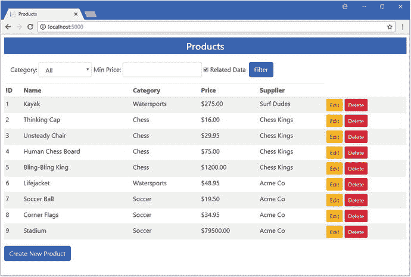

图 15-1。

Running the example application

## 直接访问相关数据

在大多数应用中，至少一些相关数据有自己的生命周期和用户需要执行的工作流。例如，在 DataApp 应用中，您很容易想象管理员可能需要进行更改以反映地址的更改。这很困难，因为我只能通过从一个`Product`对象开始并遵循它的导航属性来访问数据库中的数据。例如，如果我想更新一个`ContactLocation`对象，我必须首先搜索一个与我想修改的`Supplier`相关的`Product`，查询那个`Product`，然后根据导航属性获取`Supplier`和`ContactDetails`对象。只有这样，我才能访问我想修改的`ContactLocation`对象。

为了避免这种问题，您可以直接访问相关数据。在接下来的小节中，我将向您展示两种不同的访问相关数据的方法，并解释何时应该使用每种方法。

### 推广相关数据

对于在应用中扮演重要角色的数据，例如它有自己的管理工具和生命周期，最好的方法是提升数据，以便可以通过由 context 类定义的`DbSet<T>`属性访问它。

这是最具破坏性的方法，因为它需要创建和应用新的迁移，但它将相关数据放在应用的第一位置，并遵循许多开发人员习惯的惯例。

为了提升`Supplier`数据以便可以直接访问，我向`EFDatabaseContext`类添加了一个属性，如清单 [15-2](#Par11) 所示。

```cs
using Microsoft.EntityFrameworkCore;

namespace DataApp.Models {
    public class EFDatabaseContext : DbContext {

        public EFDatabaseContext(DbContextOptions<EFDatabaseContext> opts)
            : base(opts) { }

        public DbSet<Product> Products { get; set; }
        public DbSet<Supplier> Suppliers { get; set; }
    }    
}

Listing 15-2.Promoting Related Data in the EFDatabaseContext.cs File in the Models Folder

```

新属性返回一个`DbSet<Supplier>`对象，该对象可用于查询和操作数据库中的`Supplier`对象。当您定义`DbSet<T>`属性时，需要一个新的迁移，因此在`DataApp`项目文件夹中运行清单 [15-3](#Par13) 中所示的命令来创建并应用一个迁移。

```cs
dotnet ef migrations add PromoteSuppliers --context EFDatabaseContext
dotnet ef database update --context EFDatabaseContext
Listing 15-3.Creating and Applying a Migration

```

如果您检查已经在`Migrations`文件夹中创建的`<timestamp>_PromoteSuppliers.cs`文件的`Up`方法，您将看到升级`Supplier`数据已经导致包含相关数据的数据库表被重命名，如下所示:

```cs
...
migrationBuilder.RenameTable(name: "Supplier", newName: "Suppliers");
...

```

名称的改变是由从一个实体框架核心约定到另一个实体框架核心约定的转换引起的。在清单 [15-3](#Par13) 中，我遵循了使用属性类名的复数形式的惯例，在本例中，属性类名为`Suppliers`，框架内核将使用哪个实体作为表的名称，该表用于在数据库中存储`Supplier`对象。然而，数据库中已经有一个`Supplier`表，它是使用第 [14](14.html) 章中定义的导航属性名称的约定创建的。`DbSet<T>`属性的约定优先，并导致包含`Supplier`对象的表被重命名。

#### 消费升级的数据

一旦您提升了数据，您就可以使用前面章节中描述的技术来访问它。为了给`Supplier`对象提供一个存储库，我在`Models`文件夹中添加了一个名为`SupplierRepository.cs`的类文件，并定义了清单 [15-4](#Par18) 中所示的接口和类。

```cs
using System.Collections.Generic;

namespace DataApp.Models {

    public interface ISupplierRepository {

        Supplier Get(long id);
        IEnumerable<Supplier> GetAll();
        void Create(Supplier newDataObject);
        void Update(Supplier changedDataObject);
        void Delete(long id);
    }

    public class SupplierRepository : ISupplierRepository {
        private EFDatabaseContext context;

        public SupplierRepository(EFDatabaseContext ctx) => context = ctx;

        public Supplier Get(long id) {
            return context.Suppliers.Find(id);
        }

        public IEnumerable<Supplier> GetAll() {
            return context.Suppliers;
        }

        public void Create(Supplier newDataObject) {
            context.Add(newDataObject);
            context.SaveChanges();
        }

        public void Update(Supplier changedDataObject) {
            context.Update(changedDataObject);
            context.SaveChanges();
        }

        public void Delete(long id) {
            context.Remove(Get(id));
            context.SaveChanges();            
        }
    }
}

Listing 15-4.The Contents of the SupplierRepository.cs File in the Models Folder

```

我在这个库中使用了简单的操作，避免了在第 12 章中描述的更复杂的优化。在清单 [15-5](#Par20) 中，我在`Startup`类中注册了存储库，这样它就可以作为服务在应用的其余部分中使用。

```cs
...
public void ConfigureServices(IServiceCollection services) {
    services.AddMvc();
    string conString = Configuration["ConnectionStrings:DefaultConnection"];
    services.AddDbContext<EFDatabaseContext>(options =>
        options.UseSqlServer(conString));

    string customerConString =
        Configuration["ConnectionStrings:CustomerConnection"];
    services.AddDbContext<EFCustomerContext>(options =>
        options.UseSqlServer(customerConString));

    services.AddTransient<IDataRepository, EFDataRepository>();
    services.AddTransient<ICustomerRepository, EFCustomerRepository>();
    services.AddTransient<MigrationsManager>();
    services.AddTransient<ISupplierRepository, SupplierRepository>();
}
...

Listing 15-5.Registering the Promoted Repository in the Startup.cs File in the DataApp Folder

```

为了给`Supplier`数据提供一个控制器，我在`Controllers`文件夹中添加了一个名为`RelatedDataController.cs`的类，并定义了清单 [15-6](#Par22) 中所示的类。

```cs
using DataApp.Models;
using Microsoft.AspNetCore.Mvc;

namespace DataApp.Controllers {

    public class RelatedDataController : Controller {
        private ISupplierRepository supplierRepo;

        public RelatedDataController(ISupplierRepository repo)
            => supplierRepo = repo;

        public IActionResult Index() => View(supplierRepo.GetAll());
    }
}

Listing 15-6.The Contents of the RelatedDataController.cs File in the Controllers Folder

```

控制器定义了一个单一的动作方法，该方法在存储库中查询数据库中的所有`Supplier`对象，并将它们传递给默认视图。对于视图，我创建了`Views/RelatedData`文件夹，并在其中添加了一个名为`Index.cshtml`的视图，其内容如清单 [15-7](#Par24) 所示。

```cs
@model IEnumerable<DataApp.Models.Supplier>

@{
    ViewData["Title"] = "Suppliers";
    Layout = "_Layout";
}

<table class="table table-striped table-sm">
    <tr><th>ID</th><th>Name</th><th>City</th><th>State</th></tr>
    @foreach (var s in Model.OrderBy(s => s.Id)) {
        <tr>
            <td>@s.Id</td>
            <td>@s.Name</td>
            <td>@s.City</td>
            <td>@s.State</td>
        </tr>
    }
</table>

Listing 15-7.The Contents of the Index.cshtml File in the Views/RelatedData Folder

```

要查看升级`Supplier`数据的效果，启动应用并导航到`http://localhost:5000/relateddata`以查看如图 [15-2](#Fig2) 所示的结果。

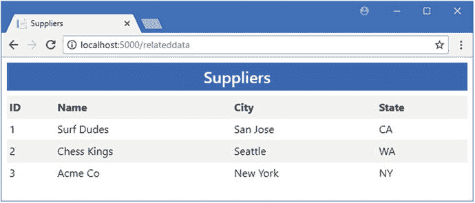

图 15-2。

Promoting related data

### 使用类型参数访问相关数据

提升数据的替代方法是使用数据库上下文类提供的一组方法，这些方法允许将数据类型指定为类型参数。这是一个非常有用的特性，用于处理需要偶尔或有限访问特定操作的数据，以及不保证提升到`DbSet<T>`属性的数据。表 [15-2](#Tab2) 描述了接受类型参数的`DbContext`方法，这些方法可以用来访问数据而不需要提升它。

表 15-2。

The DbContext Methods with Type Parameters

<colgroup><col> <col></colgroup> 
| 名字 | 描述 |
| --- | --- |
| `Set<T>()` | 该方法返回一个可用于查询数据库的`DbSet<T>`对象。 |
| `Find<T>(key)` | 该方法在数据库中查询具有指定键的类型为`T`的对象。 |
| `Add<T>(newObject)` | 该方法向数据库添加一个类型为`T`的新对象。 |
| `Update<T>(changedObject)` | 这个方法更新一个类型为`T`的对象。 |
| `Remove<T>(dataObject)` | 这个方法从数据库中删除一个类型为`T`的对象。 |

这些方法的一个优点是，它们可以用来创建一个通用存储库，当它被配置为`Startup`类中的服务时，可以用来提供对特定类型的访问。我在`Models`文件夹中添加了一个名为`GenericRepository.cs`的类文件，并定义了清单 [15-8](#Par28) 中所示的接口和类。

```cs
using System.Collections.Generic;

namespace DataApp.Models {

    public interface IGenericRepository<T> where T : class {

        T Get(long id);

        IEnumerable<T> GetAll();

        void Create(T newDataObject);

        void Update(T changedDataObject);

        void Delete(long id);
    }

    public class GenericRepository<T> : IGenericRepository<T> where T : class {
        protected EFDatabaseContext context;

        public GenericRepository(EFDatabaseContext ctx) => context = ctx;

        public virtual T Get(long id) {
            return context.Set<T>().Find(id);
        }

        public virtual IEnumerable<T> GetAll() {
            return context.Set<T>();
        }

        public virtual void Create(T newDataObject) {
            context.Add<T>(newDataObject);
            context.SaveChanges();
        }

        public virtual void Delete(long id) {
            context.Remove<T>(Get(id));
            context.SaveChanges();
        }

        public virtual void Update(T changedDataObject) {
            context.Update<T>(changedDataObject);
            context.SaveChanges();
        }
    }
}

Listing 15-8.The Contents of the GenericRepository.cs File in the Models Folder

```

`IGenericRepository<T>`接口定义了存储库必须提供的操作，以使用类型`T`。`where`子句将类型参数限制为类，这是由实体框架核心强加的约束。`GenericRepository<T>`类使用我为`Supplier`类使用的相同的基本技术实现接口，但是使用表 [15-2](#Tab2) 中描述的方法执行。

Tip

清单 [15-8](#Par28) 中的方法被标记为`virtual`，这样我就可以创建更专门化的 repository 类实现，而不必对应用进行大范围的修改。

当在`Startup`类中创建依赖注入服务时，将配置接口和实现类将用于的特定类型。在清单 [15-9](#Par32) 中，我为`ContactDetails`和`ContactLocation`类定义了服务。

```cs
...
public void ConfigureServices(IServiceCollection services) {
    services.AddMvc();
    string conString = Configuration["ConnectionStrings:DefaultConnection"];
    services.AddDbContext<EFDatabaseContext>(options =>
        options.UseSqlServer(conString));

    string customerConString =
        Configuration["ConnectionStrings:CustomerConnection"];
    services.AddDbContext<EFCustomerContext>(options =>
        options.UseSqlServer(customerConString));

    services.AddTransient<IDataRepository, EFDataRepository>();
    services.AddTransient<ICustomerRepository, EFCustomerRepository>();
    services.AddTransient<MigrationsManager>();
    services.AddTransient<ISupplierRepository, SupplierRepository>();
    services.AddTransient<IGenericRepository<ContactDetails>,
        GenericRepository<ContactDetails>>();
    services.AddTransient<IGenericRepository<ContactLocation>,
        GenericRepository<ContactLocation>>();
}
...

Listing 15-9.Creating Services in the Startup Class in the DataApp Folder

```

为了显示通过通用上下文方法获得的数据，我向`RelatedData`控制器添加了动作方法，如清单 [15-10](#Par34) 所示。这些方法查询每种类型的所有可用对象，尽管可以使用所有的标准数据操作。

```cs
using DataApp.Models;
using Microsoft.AspNetCore.Mvc;

namespace DataApp.Controllers {

    public class RelatedDataController : Controller {
        private ISupplierRepository supplierRepo;
        private IGenericRepository<ContactDetails> detailsRepo;
        private IGenericRepository<ContactLocation> locsRepo;

        public RelatedDataController(ISupplierRepository sRepo,
                IGenericRepository<ContactDetails> dRepo,
               IGenericRepository<ContactLocation> lRepo) {
            supplierRepo = sRepo;
            detailsRepo = dRepo;
            locsRepo = lRepo;
        }

        public IActionResult Index() => View(supplierRepo.GetAll());

        public IActionResult Contacts() => View(detailsRepo.GetAll());
        public IActionResult Locations() => View(locsRepo.GetAll());
    }
}

Listing 15-10.Querying for Data in the RelatedDataController.cs File in the Controllers Folder

```

Caution

您可能会尝试使用类型参数来访问数据类，并在 ASP.NET Core 管道中设置一个通用的处理程序和控制器，它不需要每个类的操作方法和视图。这似乎是一个好主意，但是应该避免，因为它提供了对数据库中所有数据的访问，这很少是一个好主意。在后台使用类型参数来保持应用的简单性，但要在单独的基础上显式地授予对类的访问权限。

通用存储库通过构造函数以正常方式接收，并由`Contacts`和`Locations`操作方法使用，这两个操作方法都使用默认视图。为了显示`ContactDetails`对象，我在`Views/RelatedData`文件夹中创建了一个名为`Contacts.cshtml`的文件，其内容如清单 [15-11](#Par37) 所示。

```cs
@model IEnumerable<DataApp.Models.ContactDetails>
@{
    ViewData["Title"] = "ContactDetails";
    Layout = "_Layout";
}
<table class="table table-striped table-sm">
    <tr><th>ID</th><th>Name</th><th>Phone</th></tr>
    @foreach (var s in Model) {
        <tr><td>@s.Id</td><td>@s.Name</td><td>@s.Phone</td></tr>
    }
</table>
Listing 15-11.The Contents of the Contacts.cshtml File in the Views/RelatedData Folder

```

该视图在一个表格中显示了`ContactDetails`属性。为了给`ContactLocation`对象提供相应的视图，我在`Views/RelatedData`文件夹中添加了一个名为`Locations.cshtml`的文件，其内容如清单 [15-12](#Par39) 所示。

```cs
@model IEnumerable<DataApp.Models.ContactLocation>
@{
    ViewData["Title"] = "ContactLocations";
    Layout = "_Layout";
}
<table class="table table-striped table-sm">
    <tr><th>ID</th><th>Name</th></tr>
    @foreach (var s in Model) {
        <tr><td>@s.Id</td><td>@s.LocationName</td></tr>
    }
</table>
Listing 15-12.The Contents of the Locations.cshtml File in the Views/RelatedData Folder

```

要通过通用存储库访问相关数据，重启应用并导航到`http://localhost:5000/relateddata/contacts`和`http://localhost:5000/relateddata/locations`URL，它们指向清单 [15-10](#Par34) 中定义的动作方法，并产生如图 [15-3](#Fig3) 所示的结果。

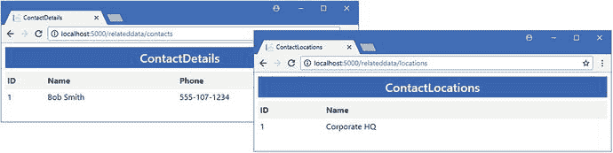

图 15-3。

Accessing related data via a generic repository

## 完成数据关系

提升相关数据使其更容易访问，但使用它还可以进一步改进。目前，阶级之间的关系只朝一个方向发展。例如，我可以从一个`Product`对象开始，然后通过一个导航属性来获取相关的`Supplier`数据，但是我不能从一个`Supplier`开始，然后向相反的方向导航。为了解决这个不足，Entity Framework Core 允许我定义允许在另一个方向导航的属性，这就是所谓的完成关系。

您可以在类之间创建一系列不同类型的关系，但是当您第一次定义导航属性时，Entity Framework Core 会假定您想要创建一对多关系，并且导航属性已经添加到关系“多”端的类中。这是我在第 [14 章](14.html)中向`Product`类添加导航属性时发生的事情:实体框架核心创建了一个一对多的关系，允许每个`Supplier`对象与许多`Product`对象相关联，并相应地配置数据库。

Tip

我在第 16 章中描述了如何创建其他类型的关系。

完成一对多关系很容易，并且需要在关系的“一”端向类添加一个导航属性。这就是所谓的反向属性，为了完成`Product`和`Supplier`类之间的关系，我将清单 [15-13](#Par45) 中所示的反向导航属性添加到了`Supplier`类中。

```cs
using System.Collections.Generic;

namespace DataApp.Models {

    public class Supplier {
        public long Id { get; set; }
        public string Name { get; set; }
        public string City { get; set; }
        public string State { get; set; }

        public ContactDetails Contact { get; set; }
        public IEnumerable<Product> Products { get; set; }
    }
}

Listing 15-13.Completing a Relationship in the Supplier.cs File in the Models Folder

```

navigation 属性返回关系中另一个类的枚举，在本例中是`Product`。这反映了这样一个事实，即每个`Supplier`对象可以与许多`Product`对象相关，并且使用`IEnumerable<Product>`允许实体框架核心提供完整的相关数据集。

Note

当您完成一对多关系时，您不必创建新的迁移。其他类型的关系需要新的迁移，如第 [16](16.html) 章所示。

### 查询一对多关系中的相关数据

一旦完成了关系，就可以从关系中任一类型的对象开始，并在两个方向上导航。在示例应用的情况下，这意味着我可以从一个`Supplier`对象开始，然后按照`Products`属性导航到一组相关的`Product`对象，只要相关的数据已经包含在请求中。在一个完整的一对多关系中包含相关数据可以通过多种不同的方式来实现，我将在接下来的章节中解释这一点。

#### 查询所有相关数据

如果您想要完整的相关数据集，那么您可以使用`Include`或`ThenInclude`方法通过选择 navigation 属性来扩展查询。在清单 [15-14](#Par50) 中，我使用了`Include`方法来遵循清单 [15-13](#Par45) 中定义的`Supplier.Products`方法，并查询与每个`Supplier`相关的所有`Product`对象。

```cs
using System.Collections.Generic;

using Microsoft.EntityFrameworkCore;

using System.Linq;

namespace DataApp.Models {

    public interface ISupplierRepository {

        Supplier Get(long id);
        IEnumerable<Supplier> GetAll();
        void Create(Supplier newDataObject);
        void Update(Supplier changedDataObject);
        void Delete(long id);
    }

    public class SupplierRepository : ISupplierRepository {
        private EFDatabaseContext context;

        public SupplierRepository(EFDatabaseContext ctx) => context = ctx;

        public Supplier Get(long id) {
            return context.Suppliers.Find(id);
        }

        public IEnumerable<Supplier> GetAll() {
            return context.Suppliers.Include(s => s.Products);
        }

        public void Create(Supplier newDataObject) {
            context.Add(newDataObject);
            context.SaveChanges();
        }

        public void Update(Supplier changedDataObject) {
            context.Update(changedDataObject);
            context.SaveChanges();
        }

        public void Delete(long id) {
            context.Remove(Get(id));
            context.SaveChanges();            
        }
    }
}

Listing 15-14.Querying for All Data in the SupplierRepository.cs File in the Models Folder

```

存储库中的变化告诉实体框架核心查询与一个`Supplier`对象相关联的所有`Product`对象。要向用户显示相关数据并开始构建数据操作集，还需要进行其他更改。为了显示与一个`Supplier`相关的`Product`对象，我将清单 [15-15](#Par52) 中所示的内容添加到了`Views/RelatedData`文件夹中的`Index.cshtml`文件中。

```cs
@model IEnumerable<DataApp.Models.Supplier>

@{
    ViewData["Title"] = "Suppliers";
    Layout = "_Layout";
}

<table class="table table-striped table-sm">
    <tr><th>ID</th><th>Name</th><th>City</th><th>State</th></tr>
    @foreach (var s in Model.OrderBy(s => s.Id)) {
        <tr>
            <td>@s.Id</td>
            <td>@s.Name</td>
            <td>@s.City</td>
            <td>@s.State</td>
        </tr>
        @if (s.Products != null) {
            @foreach (var p in s.Products) {
                <tr class="table-dark">    
                    <td></td>
                    <td>@p.Name</td>
                    <td>@p.Category</td>
                    <td>@p.Price</td>
                </tr>
            }
        }
    }
</table>

Listing 15-15.Displaying Related Data in the Index.cshtml File in the Views/RelatedData Folder

```

对视图的更改会在与其相关的`Supplier`对象之后显示每个`Product`对象的摘要。要查看效果，启动应用并导航到`http://localhost:5000/relateddata`。`Product`对象以深色行显示，如图 [15-4](#Fig4) 所示。

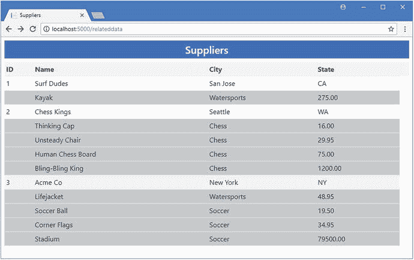

图 15-4。

Querying for all related data in a one-to-many relationship

当考虑获取一对多关系中的相关数据的不同方式时，检查用于从数据库获取数据的查询是有帮助的。如果您检查应用产生的日志输出，您会看到首先请求使用`Supplier`数据，如下所示:

```cs
...
SELECT [s].[Id], [s].[City], [s].[ContactId], [s].[Name], [s].[State]
FROM [Suppliers] AS [s]
ORDER BY [s].[Id]
...

```

为了获得相关数据，发送第二个查询，该查询获得相关的`Product`数据，如下所示:

```cs
...
SELECT [s.Products].[Id], [s.Products].[Category], [s.Products].[Color],
    [s.Products].[InStock], [s.Products].[Name], [s.Products].[Price],   
    [s.Products].[SupplierId]
FROM [Products] AS [s.Products]
INNER JOIN (
    SELECT [s0].[Id]
    FROM [Suppliers] AS [s0]
) AS [t] ON [s.Products].[SupplierId] = [t].[Id]
ORDER BY [t].[Id]
...

```

#### 使用显式加载进行查询

使用`Include`方法遵循一对多导航属性不提供任何过滤相关数据的方法，这意味着这些数据都是从数据库中检索的。如果您想更有选择性，那么 Entity Framework Core 提供了两种方法来过滤查询的数据。这些技术中的第一个被称为显式加载，我用它来代替清单 [15-16](#Par59) 中的`Include`方法。

```cs
...
public IEnumerable<Supplier> GetAll() {
    IEnumerable<Supplier> data = context.Suppliers.ToArray();
    foreach (Supplier s in data) {
        context.Entry(s).Collection(e => e.Products)
            .Query()
            .Where(p => p.Price > 50)
            .Load();
    }
    return data;
}
...
Listing 15-16.Using Explicit Loading in the SupplierRepository.cs File in the Models Folder

```

显式加载依赖于`DbContext.Entry`方法，我在第 [12 章](12.html)中使用它来访问变更跟踪数据。调用 context 对象定义的`Entry`方法返回一个`EntityEntry`对象，该对象提供了两种访问相关数据的方法，如表 [15-3](#Tab3) 所示。

表 15-3。

The EntityEntry Methods for Related Data

<colgroup><col> <col></colgroup> 
| 名字 | 描述 |
| --- | --- |
| `Reference(name)` | 此方法用于以单个对象为目标的导航属性，指定为字符串或使用 lambda 表达式选择属性。 |
| `Collection(name)` | 此方法用于以集合为目标的导航属性，指定为字符串或使用 lambda 表达式选择属性。 |

一旦您使用`Reference`或`Collection`方法选择了导航属性，`Query`方法就被用来获得一个`IQueryable`对象，该对象可以与 LINQ 一起使用来过滤将要加载的数据。在清单 [15-16](#Par59) 中，`Where`方法用于根据价格过滤相关数据，告诉实体框架核心只查询那些`Price`值超过 50 的相关`Product`对象。

`Load`方法用于强制执行查询。这通常不是必需的，因为当 Razor 视图或 LINQ 方法枚举`IQueryable<T>`时，查询会自动执行。然而，在这种情况下，需要使用`Load`方法，因为由`Query`方法返回的`IQueryable<T>`对象从未被枚举过。如果没有`Load`方法，相关的数据查询就不会被执行，只有`Supplier`对象会被传递给 Razor 视图。(`Load`方法与`ToArray`或`ToList`具有相同的效果，但不创建和返回对象集合。)

Note

注意，在一个`foreach`循环中枚举`Supplier`对象之前，我使用了清单 [15-6](#Par22) 中的`ToArray`方法。`ToArray`方法强制执行获取`Supplier`数据的查询，避免了在存储库方法中的`foreach`循环枚举`IQueryable<Supplier>`时执行一个查询，而在 Razor 视图中的`foreach`循环触发一个重复查询的情况。

要查看使用显式加载的效果，重启应用并导航至`http://localhost:5000/relateddata`。显示的`Product`数据只包含过滤后的对象，如图 [15-5](#Fig5) 所示。

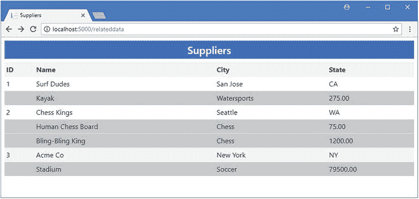

图 15-5。

Using explicit loading to filter data

使用显式加载的缺点是它会为数据库生成许多查询。如果您检查应用创建的日志消息，您会看到第一个查询是针对`Supplier`数据的，如下所示:

```cs
...
SELECT [s].[Id], [s].[City], [s].[ContactId], [s].[Name], [s].[State]
FROM [Suppliers] AS [s]
...

```

当每个`Supplier`对象被`foreach`方法处理并且相关数据被显式加载时，另一个查询被发送到数据库，如下所示:

```cs
...
SELECT [e].[Id], [e].[Category], [e].[Color], [e].[InStock], [e].[Name],
    [e].[Price], [e].[SupplierId]
FROM [Products] AS [e]
WHERE ([e].[SupplierId] = @__get_Item_0) AND ([e].[Price] > 50.0)
...

```

数据库中存储了三个`Supplier`对象，这意味着总共需要四个请求来获取本例的数据。对于大量的对象，查询的数量可能会增加，这意味着当需要相关数据的对象数量较少时，显式加载技术是最有效的。如果您正在处理大量的对象，那么下一节中的技术可能更适合。

#### 使用修复功能进行查询

Entity Framework Core 支持一个名为 fixing up 的特性，其中由数据库上下文对象检索的数据被缓存并用于填充为后续查询创建的对象的导航属性。这个特性如果使用得当，可以创建复杂的查询，比显式加载或使用`Include`方法跟踪导航属性更有效地获取相关数据。在清单 [15-17](#Par71) 中，我依靠修复特性获得了`Supplier`对象和相关的`Price`值超过 50 的`Product`对象。

```cs
...
public IEnumerable<Supplier> GetAll() {
    context.Products.Where(p => p.Supplier != null && p.Price > 50).Load();
    return context.Suppliers;
}
...
Listing 15-17.Relying on Fixing Up in the SupplierRepository.cs File in the Models Folder

```

这个例子需要两个查询。第一个使用上下文对象的`Products`属性来检索与一个`Supplier`相关并且其`Price`属性大于 50 的所有`Product`对象。该查询的唯一目的是用数据对象填充实体框架核心缓存，所以我使用了`Load`方法来强制评估该查询。

第二个查询使用上下文对象的`Suppliers`属性来检索`Supplier`对象。这个查询将在 Razor 视图中枚举对象序列时执行，因此不需要`Load`方法。当执行第二个查询时，实体框架核心将自动检查从第一个请求中缓存的数据，并使用该数据用适当的`Product`对象填充`Supplier.Products`导航属性。结果与我使用显式加载时的结果相同，如图 [15-6](#Fig6) 所示。

Caution

使用修复功能可能需要一些尝试和错误，并且需要仔细注意发送到数据库的查询。与显式加载技术相比，使用更少的查询就可以获得所需的所有数据，但是很容易忽略这一点，或者查询太多或太少的数据，或者生成比预期更多的请求。

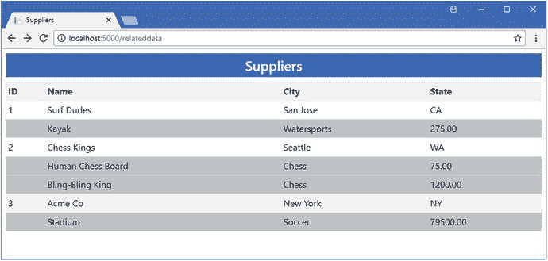

图 15-6。

Using fixing up to filter data

如果您查看应用生成的日志消息，您会看到发送到数据库的查询。第一个查询检索满足由`Where`方法指定的标准的`Product`对象。

```cs
...
SELECT [p].[Id], [p].[Category], [p].[Color], [p].[InStock], [p].[Name],
    [p].[Price], [p].[SupplierId]
FROM [Products] AS [p]
WHERE [p].[SupplierId] IS NOT NULL AND ([p].[Price] > 50.0)
...

```

第二个查询检索所有可用的`Supplier`数据。

```cs
...
SELECT [s].[Id], [s].[City], [s].[ContactId], [s].[Name], [s].[State]
FROM [Suppliers] AS [s]
...

```

修复过程使用来自第一个查询的数据来填充从第二个查询创建的对象的导航属性。这个过程是完全自动的，只要使用同一个数据库上下文对象进行多个查询，就会执行这个过程(这就是为什么您应该小心在`Startup`类中配置的存储库对象的生命周期的原因之一，这样您就不会在不期望的时候得到修复的数据)。

#### 了解修复陷阱

修复功能意味着实体框架核心将用它以前创建的对象填充导航属性。如果小心使用，修复过程是一个强大的工具，可以只选择所需的数据，而不必无休止地查询数据库。但是，修复过程不能被禁用，如果您遵循导航属性而不考虑已经进行的查询，则会给粗心的人带来隐患。

为了演示这个问题，我在`Views/Home`文件夹中创建了一个名为`SupplierRelated.cshtml`的视图，并添加了清单 [15-18](#Par82) 中所示的内容，以向用户呈现一个`Supplier`及其`Product`对象列表。

```cs
@model DataApp.Models.Supplier

@if (Model?.Products == null) {
    <tr><td colspan="6" class="text-center table-dark">No Related Data</td></tr>
} else {
    @foreach (Product p in Model?.Products) {
        <tr class="table-dark">
            <td colspan="3"></td>
            <td>@p.Name</td>
            <td>@p.Category</td>
            <td>@p.Price</td>
        </tr>
    }
}

Listing 15-18.The Contents of the SupplierRelated.cshtml File in the Views/Home Folder

```

这个视图接收一个`Supplier`作为它的模型，并遵循`Products`导航属性来创建一个相关`Products`的简单表格。为了使用这个视图，我对`Views/Home`文件夹中的`Index.cshtml`视图进行了清单 [15-19](#Par84) 所示的更改。

```cs
...
<tbody>
    @foreach (var p in Model) {
        <tr>
            <td>@p.Id</td><td>@p.Name</td><td>@p.Category</td>
            <td>$@p.Price.ToString("F2")</td>
            @if (ViewBag.includeRelated) {
                <td>@p.Supplier?.Name</td>
            }
            <td>
                <form asp-action="Delete" method="post">
                    <a asp-action="Edit" class="btn btn-sm btn-warning"
                        asp-route-id="@p.Id">
                        Edit
                    </a>
                    <input type="hidden" name="id" value="@p.Id" />
                    <button type="submit" class="btn btn-danger btn-sm">
                        Delete
                    </button>
                </form>
            </td>
        </tr>
        <tr>
            <td colspan="6">@Html.Partial("SupplierRelated", p.Supplier)</td>
        </tr>
    }
</tbody>
...
Listing 15-19.Displaying Related Data in the Index.chstml File in the Views/Home Folder

```

要查看问题，重启应用并导航至`http://localhost:5000`。当实体框架核心处理来自数据库服务器的响应时，应用修复过程来填充导航属性，这意味着数据不一致，如图 [15-7](#Fig7) 所示。

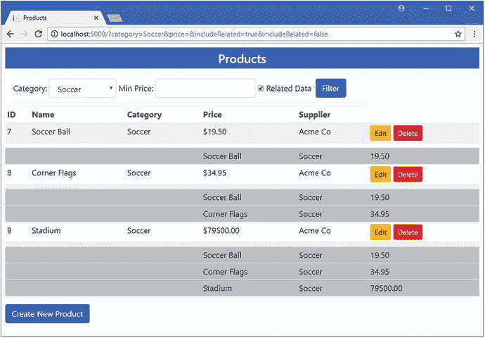

图 15-7。

Navigating to data beyond the scope of the query

图中显示的是`Soccer`类别中的`Products`，可以看到每一项的相关数据都是不同的。这是因为我跟踪了查询中指定的相关数据之外的导航属性，从一个`Product`对象开始，移动到相关的`Supplier`，然后再次回到相关的`Products`。实体框架核心使用修正的数据来填充`Supplier.Products`属性，但是只有到目前为止已经创建的`Product`对象可以使用，这随着每个被处理的`Product`对象的增加而增加，并且产生如图所示的不一致的结果。为了避免这种类型的问题，不要使用没有使用`Include`或`ThenInclude`方法选择的属性导航，也不要使用之前的查询修复属性。

## 在一对多关系中处理相关数据

完整关系的一个最重要的特征是可以使用关系两端的导航属性来执行操作。在接下来的小节中，我将向您展示如何在`Supplier`和`Product`类之间的一对多关系中使用导航属性来执行不同的操作。

为了准备这一节，我更改了用于`SupplierRepository`类中的`Supplier`对象的查询，以便包含所有相关的`Product`对象，如清单 [15-20](#Par89) 所示。

```cs
...
public IEnumerable<Supplier> GetAll() {
    return context.Suppliers.Include(p => p.Products);
}
...
Listing 15-20.Changing the Queries in the SupplierRepository.cs File in the Models Folder

```

为了将这个例子与本章中的其他例子区分开来，我在`Controllers`文件夹中添加了一个名为`SuppliersController.cs`的类文件，并定义了清单 [15-21](#Par91) 中所示的控制器。

```cs
using DataApp.Models;
using Microsoft.AspNetCore.Mvc;

namespace DataApp.Controllers {

    public class SuppliersController : Controller {
        private ISupplierRepository supplierRepository;

        public SuppliersController(ISupplierRepository supplierRepo) {  
            supplierRepository = supplierRepo;
        }

        public IActionResult Index() {
            return View(supplierRepository.GetAll());
        }
    }
}

Listing 15-21.The Contents of the SuppliersController.cs File in the Controllers Folder

```

控制器定义了一个动作方法，将所有的`Supplier`对象传递给默认视图。为了显示`Supplier`对象及其相关的`Product`对象，我创建了`Views/Suppliers`文件夹，并在其中添加了一个名为`Index.cshtml`的文件，其内容如清单 [15-22](#Par93) 所示。

```cs
@model IEnumerable<DataApp.Models.Supplier>

@{
    ViewData["Title"] = "Suppliers";
    Layout = "_Layout";
}

@foreach (Supplier s in Model) {
    <h4 class="bg-info text-center text-white p-1">@s.Name</h4>
    <div class="container-fluid">
        @if (s.Products == null || s.Products.Count() == 0) {
            <div class="p-1 text-center">No Products</div>
        } else {
            @foreach (Product p in s.Products) {
                <div class="row p-1">
                    <div class="col">@p.Name</div>
                    <div class="col">@p.Category</div>
                    <div class="col">@p.Price</div>
                </div>
            }
        }
    </div>
}

Listing 15-22.The Contents of the Index.cshtml File in the Views/Suppliers Folder

```

要查看视图生成的内容，重启应用并导航到`http://localhost:5000/suppliers`。显示每个`Supplier`的名称，以及相关`Product`对象的详细信息，如图 [15-8](#Fig8) 所示。

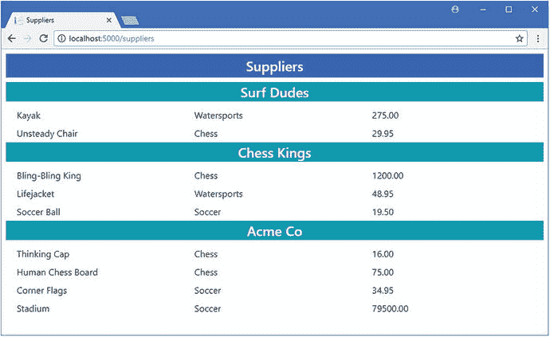

图 15-8。

Displaying Supplier and Product objects

### 更新相关对象

在本章的前面，我向您展示了如何使用数据库上下文类定义的`DbSet<Product>`属性直接编辑从数据库中检索的`Product`对象的值。这是执行更新的最简单和最直接的方式，但是您也可以通过从一个`Supplier`对象开始并通过一个导航属性访问您想要修改的`Product`对象来进行修改。为了展示如何通过导航属性执行编辑，我首先在`Views/Suppliers`文件夹中创建一个名为`Editor.cshtml`的视图，并添加清单 [15-23](#Par96) 中所示的内容。

```cs
@model Supplier
@{
    int counter = 0;
}

<form asp-action="Update" method="post">
    <input type="hidden" asp-for="Id" />
    <input type="hidden" asp-for="Name" />
    <input type="hidden" asp-for="City" />
    <input type="hidden" asp-for="State" />

    @foreach (Product p in Model.Products) {
        <div class="row">
            <input type="hidden" name="Products[@counter].Id" value="@p.Id" />
            <div class="col">
                <input name="Products[@counter].Name" value="@p.Name"
                    class="form-control"/>
            </div>
            <div class="col">
                <input name="Products[@counter].Category" value="@p.Category"
                    class="form-control" />
            </div>
            <div class="col">
                <input name="Products[@counter].Price" value="@p.Price"
                    class="form-control"/>
            </div>
            @{ counter++; }
        </div>
    }
    <div class="row">
        <div class="col text-center m-1">
            <button class="btn btn-sm btn-danger" type="submit">Save</button>
            <a class="btn btn-sm btn-secondary" asp-action="Index">Cancel</a>
        </div>
    </div>
</form>

Listing 15-23.The Contents of the Editor.cshtml File in the Views/Suppliers Folder

```

该视图将用于允许用户编辑与一个`Supplier`相关的所有`Product`对象的属性值。这个略显笨拙的结构依赖于增加一个名为`counter`的`int`，它用于创建 HTML 元素，这些元素将被 MVC 模型绑定器正确解析为一个`Product`对象数组。属性值显示在一个由`input`元素组成的网格中，当用户单击 Save 按钮时，属性值将被提交给一个名为`Update`的动作。

为了将`Editor`视图合并到应用中，我将清单 [15-24](#Par99) 中所示的元素添加到了`Views/Suppliers`文件夹中的`Index.cshtml`视图中。

```cs
@model IEnumerable<DataApp.Models.Supplier>

@{
    ViewData["Title"] = "Suppliers";
    Layout = "_Layout";
}

@foreach (Supplier s in Model) {
    <h4 class="bg-info text-center text-white p-1">
        @s.Name
        <a asp-action="Edit" asp-route-id="@s.Id"
                class="btn btn-sm btn-warning">
            Edit
        </a>
    </h4>
    <div class="container-fluid">
        @if (s.Products == null || s.Products.Count() == 0) {
            <div class="p-1 text-center">No Products</div>
        } else if (ViewBag.SupplierEditId == s.Id) {
            @Html.Partial("Editor", s);
        } else {
            @foreach (Product p in s.Products) {
                <div class="row p-1">
                    <div class="col">@p.Name</div>
                    <div class="col">@p.Category</div>
                    <div class="col">@p.Price</div>
                </div>
            }
        }
    </div>
}

Listing 15-24.Incorporating the Editor in the Index.cshtml File in the Views/Suppliers Folder

```

第一次添加在每个`Supplier`的名称旁边添加了一个`Edit`按钮，它针对的是`Edit`动作，并且包含了`Supplier`对象的`Id`。这将通过在`ViewBag`中设置一个`SupplierEditId`属性来启动编辑过程，清单 [15-24](#Par99) 中的第二个添加使用该属性来显示`Editor`视图。

为了提供视图所需的支持，我将清单 [15-25](#Par102) 中所示的动作方法添加到了`Suppliers`控制器中。

```cs
using DataApp.Models;
using Microsoft.AspNetCore.Mvc;

namespace DataApp.Controllers {

    public class SuppliersController : Controller {
        private ISupplierRepository supplierRepository;

        public SuppliersController(ISupplierRepository supplierRepo) {  
            supplierRepository = supplierRepo;
        }

        public IActionResult Index() {
            ViewBag.SupplierEditId = TempData["SupplierEditId"];
            return View(supplierRepository.GetAll());
        }

        public IActionResult Edit(long id) {
            TempData["SupplierEditId"] = id;
            return RedirectToAction(nameof(Index));
        }

        [HttpPost]
        public IActionResult Update(Supplier supplier) {
            supplierRepository.Update(supplier);
            return RedirectToAction(nameof(Index));
        }
    }
}

Listing 15-25.Adding Actions in the SuppliersController.cs File in the Controllers Folder

```

要查看编辑过程是如何工作的，请重新启动应用，导航到`http://localhost:5000/suppliers`，然后单击 Chess Kings 的编辑按钮。使用`input`元素进行修改，点击保存按钮更新数据库，如图 [15-9](#Fig9) 所示。

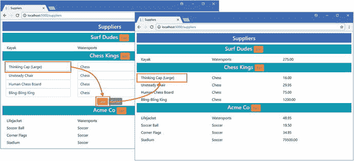

图 15-9。

Editing property values via a navigation property

当您单击 Save 按钮时，浏览器会发送一个 HTTP 请求，其中包含 MVC 模型绑定器创建一个`Supplier`对象和一个`Product`对象集合所需的值。MVC 绑定器自动将`Product`集合分配给`Supplier.Products`属性，然后用它来更新数据库。实体框架核心不能对这些对象执行变更跟踪(因为它们是由 MVC 模型绑定器创建的)，所以`Supplier`对象必须包含其所有属性的值，你可以在`Editor`视图中看到我包含了这些值。

Note

请记住，完成一段关系并不妨碍你直接操作对象。比如，完成`Product` / `Supplier`关系并不意味着我只能通过`Supplier.Products`导航属性更新`Product`对象；我仍然可以直接查询`Product`对象并单独更新它们。完成一段关系开启了新的工作方式，让你可以选择最适合你的项目的方式。

### 创建新的相关对象

我在上一节中描述的技术可以很容易地用于创建新的相关对象。当实体框架核心处理由 MVC 模型绑定器创建的`Product`对象集合时，任何`Id`属性值为零的`Product`对象都将作为新对象添加到数据库中。这是一种创建新对象的便捷方式，新对象将自动与`Supplier`相关联。这是一种创建新对象的有用方法，不会破坏`Product`和`Supplier`对象之间的关系约束。

为了添加对创建新的`Product`对象的支持，我在`Views/Suppliers`文件夹中添加了一个名为`Create.cshtml`的视图，并添加了清单 [15-26](#Par108) 中所示的内容。

```cs
@model Supplier
@{
    int counter = 0;
}

<form asp-action="Update" method="post">
    <input type="hidden" asp-for="Id" />
    <input type="hidden" asp-for="Name" />
    <input type="hidden" asp-for="City" />
    <input type="hidden" asp-for="State" />

    @foreach (Product p in Model.Products) {
        <input type="hidden" name="Products[@counter].Id" value="@p.Id" />
        <input type="hidden" name="Products[@counter].Name" value="@p.Name" />
        <input type="hidden" name="Products[@counter].Category"
            value="@p.Category" />
        <input type="hidden" name="Products[@counter].Price" value="@p.Price" />
        counter++;
    }
    <div class="row">
        <div class="col">
            <input name="Products[@counter].Name" value="" class="form-control" />
        </div>
        <div class="col">
            <input name="Products[@counter].Category" class="form-control" />
        </div>
        <div class="col">
            <input name="Products[@counter].Price" class="form-control" />
        </div>
    </div>
    <div class="row">
        <div class="col text-center m-1">
            <button class="btn btn-sm btn-danger" type="submit">Save</button>
            <a class="btn btn-sm btn-secondary" asp-action="Index">Cancel</a>
        </div>
    </div>
</form>

Listing 15-26.The Contents of the Create.cshtml File in the Views/Suppliers Folder

```

当通过导航属性更新数据时，必须注意在 HTML 表单中包含所有现有的对象。例如，当实体框架核心接收到`Product`对象的集合时，它假设已经接收到完整的集合，并将尝试断开与不在集合中的任何`Product`对象的关系。因此，您必须包含所有现有数据的表单数据值以及创建元素，以便用户可以输入新的元素，这就是我在清单 [15-26](#Par108) 中所做的。

为了将新视图集成到应用中，我将清单 [15-27](#Par111) 中所示的元素添加到了`Views/Suppliers`文件夹中的`Index.cshtml`视图中。

```cs
@model IEnumerable<DataApp.Models.Supplier>

@{
    ViewData["Title"] = "Suppliers";
    Layout = "_Layout";
}

@foreach (Supplier s in Model) {
    <h4 class="bg-info text-center text-white p-1">
        @s.Name
        <a asp-action="Edit" asp-route-id="@s.Id"
            class="btn btn-sm btn-warning">Edit</a>
        <a asp-action="Create" asp-route-id="@s.Id"
            class="btn btn-sm btn-danger">Add</a>
    </h4>
    <div class="container-fluid">
        @if (s.Products == null || s.Products.Count() == 0) {
            <div class="p-1 text-center">No Products</div>
        } else if (ViewBag.SupplierEditId == s.Id) {
            @Html.Partial("Editor", s);
        } else {
            @foreach (Product p in s.Products) {
                <div class="row p-1">
                    <div class="col">@p.Name</div>
                    <div class="col">@p.Category</div>
                    <div class="col">@p.Price</div>
                </div>
            }
            if (ViewBag.SupplierCreateId == s.Id) {
                @Html.Partial("Create", s);
            }
        }
    </div>
}

Listing 15-27.Using a Partial View in the Index.cshtml File in the Views/Suppliers Folder

```

添加按钮向一个名为`Create`的动作发送请求，当`ViewBag`包含一个值对应于正在处理的`Supplier`的`Id`属性的`SupplierCreateId`属性时，将显示`Create.cshtml`视图中的内容。为了支持新的视图特性，我向`Suppliers`控制器添加了清单 [15-28](#Par113) 中所示的动作方法。

```cs
using DataApp.Models;
using Microsoft.AspNetCore.Mvc;

namespace DataApp.Controllers {

    public class SuppliersController : Controller {
        private ISupplierRepository supplierRepository;

        public SuppliersController(ISupplierRepository supplierRepo) {  
            supplierRepository = supplierRepo;
        }

        public IActionResult Index() {
            ViewBag.SupplierEditId = TempData["SupplierEditId"];
            ViewBag.SupplierCreateId = TempData["SupplierCreateId"];
            return View(supplierRepository.GetAll());
        }

        public IActionResult Edit(long id) {
            TempData["SupplierEditId"] = id;
            return RedirectToAction(nameof(Index));
        }

        [HttpPost]
        public IActionResult Update(Supplier supplier) {
            supplierRepository.Update(supplier);
            return RedirectToAction(nameof(Index));
        }

        public IActionResult Create(long id) {
            TempData["SupplierCreateId"] = id;
            return RedirectToAction(nameof(Index));
        }
    }
}

Listing 15-28.Adding an Action in the SuppliersController.cshtml File in the Controllers Folder

```

`Create`方法设置用于显示`Create.cshtml`视图的`ViewBag`属性，然后重定向浏览器。请注意，我不必添加一个操作方法来处理创建操作。就实体框架核心而言，该操作是对现有`Supplier`对象的更新，通过`Update`方法执行。

要查看效果，重新启动应用，导航到`http://localhost:5000/suppliers`，并单击其中一个供应商的 Add 按钮。填写表单，点击保存，你会看到一个新的`Product`对象已经被创建，如图 [15-10](#Fig10) 所示。

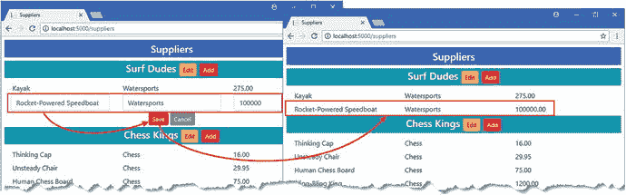

图 15-10。

Creating new related data

### 改变关系

由于`Product`对象与一个`Supplier`相关联，所以创建和更新操作变得很简单。在更改与`Product`对象相关的`Supplier`时，需要做更多的工作，尤其是对于一个必需的关系，因为数据库服务器不会执行影响数据库完整性的更新。

为了添加对更改关系的支持，我在`Views/Suppliers`文件夹中添加了一个名为`RelationshipEditor.cshtml`的视图，并添加了清单 [15-29](#Par118) 中所示的内容。

```cs
@model ValueTuple<Supplier, IEnumerable<Supplier>>
@{
    int counter = 0;
}

<form asp-action="Change" method="post">
    <input type="hidden" name="Id" value="@Model.Item1.Id" />
    <input type="hidden" name="Name" value="@Model.Item1.Name" />
    <input type="hidden" name="City" value="@Model.Item1.City" />
    <input type="hidden" name="State" value="@Model.Item1.State" />

    @foreach (Product p in Model.Item1.Products) {
        <input type="hidden" name="Products[@counter].Id" value="@p.Id" />
        <input type="hidden" name="Products[@counter].Name" value="@p.Name" />
        <input type="hidden" name="Products[@counter].Category"
            value="@p.Category" />
        <input type="hidden" name="Products[@counter].Price" value="@p.Price" />

        <div class="row">
            <div class="col">@p.Name</div>
            <div class="col">@p.Category</div>
            <div class="col">
                <select name="Products[@counter].SupplierId">
                    @foreach (Supplier s in Model.Item2) {
                        if (p.Supplier == s) {
                            <option selected value="@s.Id">@s.Name</option>
                        } else {
                            <option value="@s.Id">@s.Name</option>
                        }
                    }
                </select>
            </div>
        </div>

        counter++;
    }
    <div class="row">
        <div class="col text-center m-1">
            <button class="btn btn-sm btn-danger" type="submit">Save</button>
            <a class="btn btn-sm btn-secondary" asp-action="Index">Cancel</a>
        </div>
    </div>
</form>

Listing 15-29.The Contents of the RelationshipEditor.cshtml File in the Views/Suppliers Folder

```

这个视图的模型是一个包含一个`Supplier`对象和一个`Suppliers`枚举的元组。这是一种笨拙的方法，但是，正如您将看到的，整个过程可能会很笨拙，接收两个数据对象作为视图模型可以更容易地生成允许用户进行更改的 HTML 元素。该视图生成一个包含隐藏元素的表单，这些隐藏元素包含不可更改的`Supplier`和`Product`值，以及一个`select`元素，该元素允许为每个`Product`选择不同的`Supplier`。表单的目标是一个名为`Change`的动作方法，我将很快对其进行定义。

为了将新的局部视图合并到应用中，我将清单 [15-30](#Par121) 中所示的元素添加到了`Views/Suppliers`文件夹中的`Index.cshtml`视图中。

```cs
@model IEnumerable<DataApp.Models.Supplier>

@{
    ViewData["Title"] = "Suppliers";
    Layout = "_Layout";
}

@foreach (Supplier s in Model) {
    <h4 class="bg-info text-center text-white p-1">
        @s.Name
        <a asp-action="Edit" asp-route-id="@s.Id"
             class="btn btn-sm btn-warning">Edit</a>
        <a asp-action="Create" asp-route-id="@s.Id"
             class="btn btn-sm btn-danger">Add</a>
        <a asp-action="Change" asp-route-id="@s.Id"
             class="btn btn-sm btn-primary">Change</a>
    </h4>
    <div class="container-fluid">
        @if (s.Products == null || s.Products.Count() == 0) {
            <div class="p-1 text-center">No Products</div>
        } else if (ViewBag.SupplierEditId == s.Id) {
            @Html.Partial("Editor", s);
        } else if (ViewBag.SupplierRelationshipId == s.Id) {
            @Html.Partial("RelationshipEditor", (s, Model));
        } else {
            @foreach (Product p in s.Products) {
                <div class="row p-1">
                    <div class="col">@p.Name</div>
                    <div class="col">@p.Category</div>
                    <div class="col">@p.Price</div>
                </div>
            }
            if (ViewBag.SupplierCreateId == s.Id) {
                @Html.Partial("Create", s);
            }
        }
    </div>
}

Listing 15-30.Incorporating a Partial View in the Index.cshtml File in the Views/Suppliers Folder

```

新元素添加了一个 Change 按钮，该按钮针对控制器上的`Change`动作，它将设置一个名为`SupplierRelationshipId`的`ViewBag`属性，该属性用于决定何时显示在清单 [15-29](#Par118) 中创建的局部视图。为了添加视图所依赖的动作，我将清单 [15-31](#Par123) 中所示的方法添加到了`SuppliersController`类中。

```cs
using DataApp.Models;
using Microsoft.AspNetCore.Mvc;

using System.Collections.Generic;

using System.Linq;    

namespace DataApp.Controllers {

    public class SuppliersController : Controller {
        private ISupplierRepository supplierRepository;

        public SuppliersController(ISupplierRepository supplierRepo) {  
            supplierRepository = supplierRepo;
        }

        public IActionResult Index() {
            ViewBag.SupplierEditId = TempData["SupplierEditId"];
            ViewBag.SupplierCreateId = TempData["SupplierCreateId"];
            ViewBag.SupplierRelationshipId = TempData["SupplierRelationshipId"];
            return View(supplierRepository.GetAll());
        }

        public IActionResult Edit(long id) {
            TempData["SupplierEditId"] = id;
            return RedirectToAction(nameof(Index));
        }

        [HttpPost]
        public IActionResult Update(Supplier supplier) {
            supplierRepository.Update(supplier);
            return RedirectToAction(nameof(Index));
        }

        public IActionResult Create(long id) {
            TempData["SupplierCreateId"] = id;
            return RedirectToAction(nameof(Index));
        }

        public IActionResult Change(long id) {
            TempData["SupplierRelationshipId"] = id;
            return RedirectToAction(nameof(Index));
        }

        [HttpPost]
        public IActionResult Change(Supplier supplier) {
            IEnumerable<Product> changed = supplier.Products
                .Where(p => p.SupplierId != supplier.Id);
            if (changed.Count() > 0) {
                IEnumerable<Supplier> allSuppliers
                     = supplierRepository.GetAll().ToArray();
                Supplier currentSupplier
                     = allSuppliers.First(s => s.Id == supplier.Id);
                foreach(Product p in changed) {
                    Supplier newSupplier
                         = allSuppliers.First(s => s.Id == p.SupplierId);
                    newSupplier.Products = newSupplier.Products
                        .Append(currentSupplier.Products
                            .First(op => op.Id == p.Id)).ToArray();
                    supplierRepository.Update(newSupplier);
                }
            }
            return RedirectToAction(nameof(Index));
        }
    }
}

Listing 15-31.Adding Actions in the SuppliersController.cs File in the Controllers Folder

```

接受 POST 请求的`Change`方法中的代码很复杂，因为特性之间存在一些冲突。我已经查询了数据库，以获得完整的一组`Supplier`对象及其相关的`Product`对象，这样我就可以更新用户已经更改的关系。实体框架核心跟踪它已经创建的对象，这意味着我不能使用 MVC 模型绑定器创建的对象执行数据库更新而不生成异常。这意味着我必须处理由 MVC 模型绑定器创建的对象，以找出需要更改的内容，然后将这些更改转换为实体框架核心创建的对象，这些对象可用于更新数据库。(不要花太多时间遵循清单 [15-31](#Par123) 中的代码，因为在接下来的章节中我将展示更简单的方法。)

要查看如何更改关系，请重启应用，导航到`http://localhost:5000/suppliers`，并单击其中一个更改按钮。使用下拉列表更改关系，然后单击保存按钮更新数据库。您编辑过关系的`Product`对象将显示在它们的新`Supplier`旁边，如图 [15-11](#Fig11) 所示。

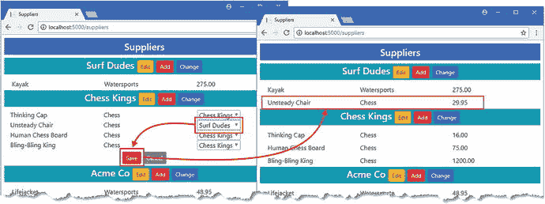

图 15-11。

Changing relationships between objects

#### 简化关系变更代码

处理清单 [15-31](#Par123) 中的更新所需的代码依赖于一系列 LINQ 查询来从数据库中获取数据，并合并来自 HTTP 请求所创建的对象的更改。这种方法围绕实体框架核心对象跟踪系统工作，该系统支持诸如变更跟踪和修复之类的特性。这些都是有用的功能，但跟踪系统会妨碍其他操作。

我可以通过禁用对象跟踪特性来简化处理变更所需的代码，如清单 [15-32](#Par128) 所示，这意味着我可以使用 MVC 模型绑定器创建的对象来更新数据库。

```cs
using DataApp.Models;
using Microsoft.AspNetCore.Mvc;
using System.Collections.Generic;
using System.Linq;

using Microsoft.EntityFrameworkCore;

namespace DataApp.Controllers {

    public class SuppliersController : Controller {
        private ISupplierRepository supplierRepository;
        private EFDatabaseContext dbContext;

        public SuppliersController(ISupplierRepository supplierRepo,
                EFDatabaseContext context) {  
            supplierRepository = supplierRepo;
            dbContext = context;
        }

        public IActionResult Index() {
            ViewBag.SupplierEditId = TempData["SupplierEditId"];
            ViewBag.SupplierCreateId = TempData["SupplierCreateId"];
            ViewBag.SupplierRelationshipId = TempData["SupplierRelationshipId"];
            return View(supplierRepository.GetAll());
        }

        public IActionResult Edit(long id) {
            TempData["SupplierEditId"] = id;
            return RedirectToAction(nameof(Index));
        }

        [HttpPost]
        public IActionResult Update(Supplier supplier) {
            supplierRepository.Update(supplier);
            return RedirectToAction(nameof(Index));
        }

        public IActionResult Create(long id) {
            TempData["SupplierCreateId"] = id;
            return RedirectToAction(nameof(Index));
        }

        public IActionResult Change(long id) {
            TempData["SupplierRelationshipId"] = id;
            return RedirectToAction(nameof(Index));
        }

        [HttpPost]
        public IActionResult Change(Supplier supplier) {
            IEnumerable<Product> changed
                = supplier.Products.Where(p => p.SupplierId != supplier.Id);
            IEnumerable<long> targetSupplierIds
                = changed.Select(p => p.SupplierId).Distinct();
            if (changed.Count() > 0) {
                IEnumerable<Supplier> targetSuppliers = dbContext.Suppliers
                    .Where(s =>  targetSupplierIds.Contains(s.Id))
                    .AsNoTracking().ToArray();
                foreach(Product p in changed) {
                    Supplier newSupplier
                        = targetSuppliers.First(s => s.Id == p.SupplierId);
                    newSupplier.Products = newSupplier.Products == null
                        ? new Product[] { p }
                            : newSupplier.Products.Append(p).ToArray();
                }
                dbContext.Suppliers.UpdateRange(targetSuppliers);
                dbContext.SaveChanges();
            }
            return RedirectToAction(nameof(Index));
        }
    }
}

Listing 15-32.Disabling Change Tracking in the SuppliersController.cs File in the Models Folder

```

为了简单起见，我直接使用了数据上下文类，而不是通过存储库接口和实现类进行修改。清单 [15-33](#Par130) 中的代码更简单(尽管看起来可能不像),因为在从数据库中检索`Supplier`和相关的`Product`对象的查询中使用了`AsNoTracking`扩展方法，从而禁用了跟踪特性。

```cs
...
IEnumerable<Supplier> targetSuppliers = dbContext.Suppliers
    .Where(s =>  targetSupplierIds.Contains(s.Id))
    .AsNoTracking().ToArray();
...

```

当使用`AsNoTracking`方法时，实体框架核心并不跟踪它已经创建的对象，这允许我使用 MVC 模型绑定器创建的`Product`对象来更新数据库。

清单 [15-32](#Par128) 中的代码比清单 [15-31](#Par123) 中的代码简单的一个原因是，我不必为了执行更新而检索与每个`Supplier`相关的`Product`对象。实体框架核心不更新没有从数据库中查询的数据，因此从查询中排除`Product`对象意味着现有的关系不受用户指定的更改的影响。

Caution

应该谨慎使用`AsNoTracking`方法，因为它会阻止其他有用的功能，比如变更检测和修复。

#### 进一步简化关系变更代码

前面的两个清单已经展示了从一对多关系的“一”端改变关系是可能的，但是这样做是笨拙的。解决这个问题有一个简单得多的方法，可以通过思考数据库中如何表示关系来理解。

在示例应用中，`Product`类有一个`SupplierId`属性，用于存储与其相关的`Supplier`的`Id`属性的值。由`Supplier`类定义的`Products`属性只是为了方便导航，当`Product`的关系改变时，实体框架核心只需更新`Products`表中的行来反映这种改变，即使当您通过`IEnumerable<Product>`导航属性执行这些改变时也是如此。

一旦您意识到更新是如何执行的，您可以通过直接操作`Product`对象来极大地简化执行更新所需的代码，如清单 [15-33](#Par137) 所示。

```cs
...
[HttpPost]

public IActionResult Change(long Id, Product[] products) {

    dbContext.Products.UpdateRange(products.Where(p => p.SupplierId != Id));
    dbContext.SaveChanges();
    return RedirectToAction(nameof(Index));
}
...
Listing 15-33.Performing Direct Updates in the SuppliersController.cs File in the Controllers Folder

```

更改 action 方法的参数告诉 MVC 模型绑定器，我需要用户正在更改其关系的`Supplier`的`Id`值以及与该`Supplier`相关的`Products`集。

我使用 LINQ 过滤掉那些没有改变的`Product`对象，并将那些已经改变的对象传递给数据库上下文类提供的`DbSet<T>.UpdateRange`方法，这允许我一次更新几个对象。我调用`SaveChanges`方法将更改发送到数据库，然后将浏览器重定向到`Index`动作。

结果与清单 [15-31](#Par123) 和清单 [15-32](#Par128) 中的代码相同，但更简单、更容易理解。如本示例所示，虽然可以使用一对多关系中的任一导航属性来执行更新，但是考虑更新将如何反映到数据库中可以洞察是否可以通过优先选择一个属性来获得更简单的结果。

## 摘要

在这一章中，我演示了如何直接访问相关数据，或者通过使用上下文属性提升数据，或者通过使用接受类型参数的上下文方法。一旦您提升了数据，您通常会希望从它导航到数据模型的其他部分，我向您展示了如何通过添加导航属性来定义一对多关系来完成一个关系，这在 ASP.NET Core MVC 和实体框架核心开发中是最常见的。我解释了在一对多关系中查询相关数据的不同方法，以及如何通过一对多导航属性创建和更新相关数据。本章结束时，我展示了通过 navigation 属性编辑关系是可能的，但是通过考虑关系在数据库中的表示方式可以获得更简单的结果。在下一章中，我将继续演示使用关系的实体框架核心特性。