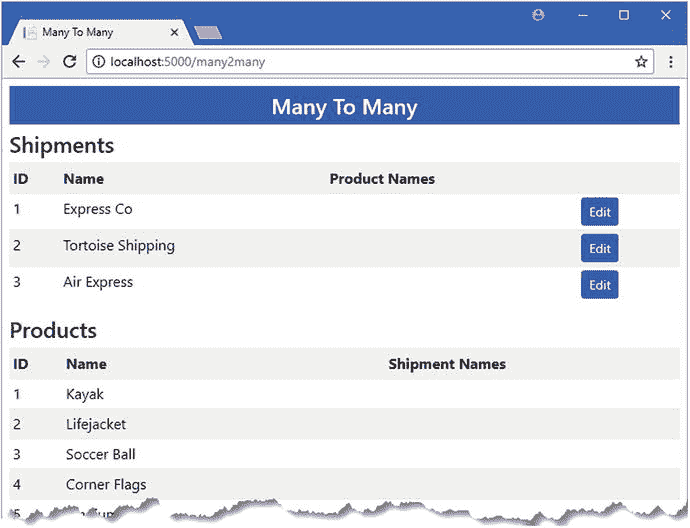

# 十六、处理关系：第 2 部分

我在第 [15 章](15.html)中描述的一对多关系并不是实体框架核心支持的唯一关系类型。在本章中，我将向您展示如何定义一对一和多对多关系，演示如何在使用这些关系时查询相关数据，并解释如何在数据库中管理这些关系。表 [16-1](#Tab1) 总结了这一章。

表 16-1。

Chapter Summary

<colgroup><col> <col> <col></colgroup> 
| 问题 | 解决办法 | 列表 |
| --- | --- | --- |
| 定义完整的一对一关系 | 添加相互导航属性，并向依赖实体类添加外键属性 | 1–7 |
| 更新相关对象 | 分别处理相关对象，以确保正确添加和更新数据 | 8–16 |
| 定义多对多关系 | 创建一个在两个相关数据类型上具有一对多关系的连接类 | 17–28 |

## 为本章做准备

本章使用在第 [11 章](11.html)中创建并在后续章节中修改的 DataApp 项目。为了准备本章，在`DataApp`文件夹中打开命令提示符，运行清单 [16-1](#Par4) 中所示的命令。

Tip

如果您不想遵循构建示例项目的过程，您可以从本书的源代码库 [`https://github.com/apress/pro-ef-core-2-for-asp.net-core-mvc`](https://github.com/apress/pro-ef-core-2-for-asp.net-core-mvc) 下载所有需要的文件。

```cs
dotnet ef database drop --force --context EFDatabaseContext
dotnet ef database update --context EFDatabaseContext
Listing 16-1.Resetting the Database

```

这些命令删除并重新创建用于存储`Product`对象及其相关的`Supplier`、`ContactDetails`和`ContactLocation`对象的数据库，这将有助于确保您从本章的示例中获得正确的预期结果。

使用`dotnet run`启动应用，并使用浏览器导航至`http://localhost:5000`。应用将在启动时植入数据库，您将看到如图 [16-1](#Fig1) 所示的产品列表。


图 16-1。

Running the example application

## 完成一对一的关系

在一对一关系中，一种类型的对象与另一种类型的单个对象相关。完成一对一的关系需要两个步骤，在接下来的部分中，我将在完成`Supplier`和`ContactDetails`类之间的关系时解释这两个步骤，这样每个`Supplier`对象将与一个`ContactDetails`对象相关。

### 定义导航属性

第一步是定义导航属性。这是我在第 [14 章](14.html)中定义的属性的逆，它创建了`Supplier`和`ContactDetails`类之间的关系。当只定义了一个导航属性时，Entity Framework Core 假定需要一对多关系，并且只有当两个导航属性都定义时，才能创建一对一关系。在清单 [16-2](#Par9) 中，我已经将导航属性添加到完成关系的`ContactDetails`类中。

```cs
namespace DataApp.Models {

    public class ContactDetails {
        public long Id { get; set; }
        public string Name { get; set; }
        public string Phone { get; set; }
        public ContactLocation Location { get; set; }

        public Supplier Supplier { get; set; }
    }
}

Listing 16-2.Adding a Property in the ContactDetails.cs File in the Models Folder

```

`Supplier`属性返回单个`Supplier`对象，而不是一对多关系的导航属性返回的`IEnumerable<T>`。导航属性的单个对象结果告诉实体框架核心这是一对一的关系。确定关系类型时，不考虑导航属性的名称。

### 选择依赖实体类

第二步是决定关系中的哪个类是依赖实体，并在其上定义外键属性。实体框架核心将对象存储为数据库表中的行。当您创建类之间的关系时，Entity Framework Core 会向其中一个表中添加一列，并使用它来记录相关对象的主键值。外键列和其表包含外键列的类称为依赖实体，而另一个类(其表不包含外键列)称为主体实体。

在一对多关系中,“多”类总是依赖实体，并且实体框架核心总是知道外键列应该定义在哪里。但是这两个类都可以是一对一关系中的依赖实体，只有外键属性为实体框架核心提供了将外键列放在数据库中正确位置所需的信息。

对于这个例子，我将使`ContactDetails`类成为依赖实体，所以我按照第 [14 章](14.html)中描述的约定，定义了清单 [16-3](#Par17) 中所示的外键属性。

How to Select the Dependent Entity Class

当您创建类之间的关系时，可能很难知道外键属性应该放在哪里。你要问自己的问题是“一个`X`类型的对象是否应该在没有一个`Y`类型的相关对象的情况下存在？”如果答案是肯定的，那么`X`是您的主体实体，外键属性应该在类`Y`中定义，它是依赖实体。如果答案是否定的，那么`Y`就是委托人，这个属性应该添加到类`X`中，这个类是依赖的。例如，在 DataApp 应用的情况下，问题是“没有相关的`ContactDetails`对象，`Supplier`应该存在吗？”

有时这个问题的答案是显而易见的，这使得确定外键属性的位置变得很容易。对于示例应用来说，产品供应商能够在没有联系人的情况下存在是有意义的，但是反之则没有意义。这就是为什么我让`ContactDetails`类成为依赖实体的原因。

然而，通常情况下，这并不明确，尤其是在处理缺乏现实世界对应的抽象概念时。对于这些关系，你能做的最好的事情就是做一个有根据的猜测，看看应用是如何形成的。这并不理想，但是处理数据并不总是容易的，您总是可以通过移动外键属性，然后创建并应用新的迁移来纠正错误。

```cs
namespace DataApp.Models {

    public class ContactDetails {
        public long Id { get; set; }
        public string Name { get; set; }
        public string Phone { get; set; }
        public ContactLocation Location { get; set; }

        public long SupplierId { get; set; }
        public Supplier Supplier { get; set; }
    }
}

Listing 16-3.Defining a Foreign Key Property in the ContactDetails.cs File in the Models Folder

```

外键属性的类型决定了一对一关系是必需的还是可选的。我在清单 [16-3](#Par17) 中将`long`指定为属性的类型，这将创建一个必需的关系，这意味着一个`ContactDetails`对象不能存储在数据库中，除非它与一个`Supplier`对象相关。如果我使用了可以设置为`null`的类型，比如`long?`，那么就会创建一个可选的关系。

Caution

始终完成与外键属性的关系。如果在一对一的关系中没有指定外键属性，那么实体框架核心可能会试图猜测哪个类是依赖实体，这可能会导致意外的结果。

### 创建和应用迁移

一旦定义了导航和外键属性，就可以创建迁移。运行清单 [16-4](#Par21) 中所示的命令来创建一个新的迁移，它将改变`ContactDetails`和`Supplier`对象之间的关系。

```cs
dotnet ef migrations add CompleteOneToOne --context EFDatabaseContext
Listing 16-4.Creating a Migration for a One-to-One Relationship

```

要理解完成关系将如何改变数据库，打开在`Migrations`文件夹中创建的`<timestamp>_ CompleteOneToOne.cs`文件，并检查`Up`方法。

当只有一个导航属性时，实体框架核心创建了一个一对多的关系，其中`Supplier`类是依赖实体。为了反映新的关系，迁移删除了现有的外键列，并在`ContactDetails`表上创建了一个新的外键列，这使得`ContactDetails`类成为依赖实体。为了反映一对一关系的事实，迁移包括以下语句:

```cs
...
migrationBuilder.CreateIndex(
    name: "IX_ContactDetails_SupplierId", table: "ContactDetails",
    column: "SupplierId", unique: true);
...

```

一对一关系通过创建一个索引来表示，该索引要求外键列中有唯一的值。这确保了一个`ContactDetails`对象只能与一个`Supplier`对象相关。

Tip

无法将迁移应用于数据库，因为现有数据与迁移施加的新约束冲突。我将删除并重新创建数据库，以便在应用启动时重新设定种子。

## 使用一对一关系

一旦完成了关系，通过一对一关系对相关数据执行操作就很简单了，如下面几节所述。

### 查询一对一关系中的相关数据

在一对一关系中查询数据是一项简单的任务，因为您知道您只需要处理一个相关的对象。`Include`方法用于告诉实体框架核心遵循一个导航属性，并以一对一的关系查询相关对象。您可以从关系两端的对象开始查询，对于这一章，我将查询`ContactDetails`对象并导航到相关的`Supplier`对象。

为了演示如何处理一对一的关系，我在`Controllers`文件夹中添加了一个名为`One2OneController.cs`的类文件，并用它来定义清单 [16-5](#Par31) 中所示的控制器。

Note

正如在第 [11](11.html) 章中所解释的，我建议在实际项目中使用存储库，但是我在这个控制器中直接使用数据库上下文类，以避免每次演示不同的特性或操作时都必须进行三次更改(控制器、存储库接口和实现类)。

```cs
using DataApp.Models;
using Microsoft.AspNetCore.Mvc;
using Microsoft.EntityFrameworkCore;

namespace DataApp.Controllers {

    public class One2OneController : Controller {
        private EFDatabaseContext context;

        public One2OneController(EFDatabaseContext ctx) => context = ctx;

        public IActionResult Index () {
            return View(context.Set<ContactDetails>().Include(cd => cd.Supplier));
        }
    }
}

Listing 16-5.The Contents of the One2OneController.cs File in the Controllers Folder

```

控制器定义了一个名为`Index`的动作方法，该方法在数据库中查询所有的`ContactDetails`对象和相关的`Supplier`对象，并将它们用作默认视图的视图模型。

为了向用户显示数据，我创建了`Views/One2One`文件夹，并向其中添加了一个名为`Index.cshtml`的新视图文件，其内容如清单 [16-6](#Par34) 所示。

```cs
@model IEnumerable<DataApp.Models.ContactDetails>
@{
    ViewData["Title"] = "ContactDetails";
    Layout = "_Layout";
}
<table class="table table-striped table-sm">
    <tr>
        <th>ID</th>
        <th>Name</th>
        <th>Phone</th>
        <th></th>
        <th class="table-dark text-center" colspan="4">Supplier</th>
    </tr>
    @foreach (var s in Model) {
        <tr>
            <td>@s.Id</td>
            <td>@s.Name</td>
            <td>@s.Phone</td>
            <td>
                <form>
                    <button class="btn btn-sm btn-warning"
                            asp-action="Edit" asp-route-id="@s.Id">
                        Edit
                    </button>
                </form>
            </td>
            @if (s.Supplier != null) {
                <td class="table-dark">@s.Supplier.Id</td>
                <td class="table-dark">@s.Supplier.Name</td>
                <td class="table-dark">@s.Supplier.City</td>
                <td class="table-dark">@s.Supplier.State</td>
            } else {
                <td colspan="4" class="table-dark text-center">
                    No Related Supplier
                </td>
            }
        </tr>
    }
</table>
<a class="btn btn-primary" asp-action="Create">Create</a>
Listing 16-6.The Contents of the Index.cshtml File in the Views/One2One Folder

```

该视图创建一个表格，每一行显示一个`ContactDetails`对象及其相关的`Supplier`。还有按钮和锚元素，它们针对的是控制器上还不存在的动作方法，但是我将在后面的部分中使用它们来演示不同的特性。

#### 更新数据库和运行应用

如果您尝试应用在数据库中创建的迁移，将会出现错误，因为它已经包含的数据与迁移包含的更改相冲突。对于生产数据库，您需要花时间来迁移数据，但是对于开发项目，可以删除并重新创建数据库。在`DataApp`项目文件夹中运行清单 [16-7](#Par37) 中所示的命令，删除数据库并为一对一关系应用迁移。

```cs
dotnet ef database drop --force --context EFDatabaseContext
dotnet ef database update --context EFDatabaseContext
Listing 16-7.Dropping and Re-creating the Database

```

使用`dotnet run`启动应用，并导航至`http://localhost:5000/one2one`。当应用启动时，数据库将被植入，请求的 URL 将指向清单 [16-5](#Par31) 中控制器中定义的`Index`动作方法，该方法选择清单 [16-6](#Par34) 中创建的视图，并显示如图 [16-2](#Fig2) 所示的结果。


图 16-2。

Displaying related data in a one-to-one relationship

### 创建和更新相关对象

您可以通过一对一关系中的任一导航属性来创建和更新相关对象。这意味着，例如，您可以通过`ContactDetails`对象的`Supplier`属性操作`Supplier`对象，或者同样地，通过`Supplier`对象的`Contact`属性操作`ContactDetails`对象。我在本节中关注的是`ContactDetails`数据，所以我将清单 [16-8](#Par40) 中所示的动作方法添加到`One2One`控制器中，以处理编辑和创建过程。

```cs
using DataApp.Models;
using Microsoft.AspNetCore.Mvc;
using Microsoft.EntityFrameworkCore;

using System.Linq;

namespace DataApp.Controllers {

    public class One2OneController : Controller {
        private EFDatabaseContext context;

        public One2OneController(EFDatabaseContext ctx) => context = ctx;

        public IActionResult Index () {
            return View(context.Set<ContactDetails>().Include(cd => cd.Supplier));
        }

        public IActionResult Create() => View("ContactEditor");

        public IActionResult Edit(long id) {
            return View("ContactEditor",
                context.Set<ContactDetails>()
                    .Include(cd => cd.Supplier).First(cd => cd.Id == id));
        }

        [HttpPost]
        public IActionResult Update(ContactDetails details) {
            if (details.Id == 0) {
                context.Add<ContactDetails>(details);
            } else {
                context.Update<ContactDetails>(details);
            }
            context.SaveChanges();
            return RedirectToAction(nameof(Index));
        }
    }
}

Listing 16-8.Adding Action Methods in the One2OneController.cs File in the Controllers Folder

```

这些操作遵循前面章节中使用的相同模式。`Create`和`Edit`方法用于选择一个名为`ContactEditor`的视图，该视图允许用户创建或修改一个对象，而`EditContact`方法使用存储库来查询用户选择的对象。`Update`方法用于接收包含用户输入数据的 POST 请求，并调用上下文对象的`Add`或`Update`方法来更新数据库。

为了提供允许用户创建或编辑对象的视图，我在`Views/One2One`文件夹中创建了一个名为`ContactEditor.cshtml`的视图，并添加了清单 [16-9](#Par43) 中所示的元素。

```cs
@model DataApp.Models.ContactDetails
@{
    ViewData["Title"] = Model == null ? "Create" : "Edit";
    Layout = "_Layout";
}

<form asp-action="Update" method="post">
    <input type="hidden" asp-for="Id" />
    <input type="hidden" asp-for="Supplier.Id" />
    <h4>Contact Details</h4>
    <div class="p-1 m-1">
        <div class="form-row">
            <div class="form-group col">
                <label asp-for="Name" class="form-control-label"></label>
                <input asp-for="Name" class="form-control" />
            </div>
            <div class="form-group col">
                <label asp-for="Phone" class="form-control-label"></label>
                <input asp-for="Phone" class="form-control" />
            </div>
        </div>
    </div>
    <h4>Supplier</h4>
    <div class="p-1 m-1">
        <div class="form-row">
            <div class="form-group col">
                <label asp-for="Supplier.Name" class="form-control-label"></label>
                <input asp-for="Supplier.Name" class="form-control" />
            </div>
            <div class="form-group col">
                <label asp-for="Supplier.City" class="form-control-label"></label>
                <input asp-for="Supplier.City" class="form-control" />
            </div>
            <div class="form-group col">
                <label asp-for="Supplier.State" class="form-control-label"></label>
                <input asp-for="Supplier.State" class="form-control" />
            </div>
        </div>
        @if (ViewBag.Suppliers != null) {
            @Html.Partial("RelationshipEditor", Model.SupplierId)
        }
    </div>
    <div class="text-center m-1">
        <button type="submit" class="btn btn-primary">Save</button>
        <a asp-action="Index" class="btn btn-secondary">Cancel</a>
    </div>
</form>

Listing 16-9.The Contents of the ContactEditor.cshtml File in the Views/One2One Folder

```

这个视图中最重要的元素是用户看不到的:包含`ContactDetails`和`Supplier`对象的`Id`属性值的`hidden`元素。如果这些属性的值为零，那么将创建新的对象；对于任何其他值，将更新现有对象。(这个视图也引用了我将在下一节中创建的局部视图。)

使用`dotnet run`启动应用，导航到`http://localhost:5000/one2one`，并单击 Create 按钮。填写输入元素，点击保存按钮，创建新的`ContactDetails`和`Supplier`对象，然后显示出来，如图 [16-3](#Fig3) 所示。


图 16-3。

Creating new objects via a navigation property

点击新创建对象的编辑按钮，更改`Supplier`对象的`Name`字段的值。当您点击保存按钮时，实体框架核心将遵循 MVC 模型绑定器创建的`ContactDetails`对象的导航属性，并使用它来更新数据库，如图 [16-4](#Fig4) 所示。


图 16-4。

Updating existing objects via a navigation property

### 改变一对一的关系

当改变对象之间的关系时必须小心，特别是需要的关系。Entity Framework Core 在向数据库发送更新之前不会强制实施关系限制，并且很容易执行违反数据库参照完整性的更新，从而产生错误。在接下来的小节中，我将向您展示如何更新必需的和可选的关系，从已经在示例应用的数据库中配置的现有必需关系开始。

#### 更改所需的一对一关系

所需关系的挑战在于，您必须避免存储任何与主体实体不相关的依赖实体。对于示例应用，这意味着每个`ContactDetails`对象都必须与一个`Supplier`对象相关联。试图存储或更新与`Supplier`无关的`ContactDetails`对象将导致错误。

所需的关系仅应用于一个方向；从属实体必须与主体实体相关，但主体不必与从属实体相关。对于示例应用，这意味着`Supplier`对象可以不与`ContactDetails`对象相关而存在。这对应于关系在数据库中的表示方式，在数据库中，外键列是在用于存储依赖实体的表上定义的，但是主体实体的表不包含任何有关关系的信息。

这给出了改变对象关系的两种不同场景。第一种情况是，您希望更改关系，以便依赖实体将与当前不在关系中的主体实体相关联。对于示例应用，这意味着有未附加的(或“备用的”)`Supplier`对象可用，并且其中一个变为与`ContactDetails`对象相关，替换现有的`Supplier`。在该操作结束时，最初与`ContactDetails`对象相关的`Supplier`成为备用对象之一。

第二种情况是当您想要创建与已经与另一个对象相关的`Supplier`的关系时。在不违反数据库约束的情况下，您不能让现有的`ContactDetails`对象保持独立，因此您必须创建与另一个`Supplier`的关系，通常是通过执行交换。

为了添加对更改现有关系的支持，我对`One2One`控制器进行了清单 [16-10](#Par53) 中所示的更改。

```cs
using DataApp.Models;
using Microsoft.AspNetCore.Mvc;
using Microsoft.EntityFrameworkCore;
using System.Linq;

namespace DataApp.Controllers {

    public class One2OneController : Controller {
        private EFDatabaseContext context;

        public One2OneController(EFDatabaseContext ctx) => context = ctx;

        public IActionResult Index () {
            return View(context.Set<ContactDetails>().Include(cd => cd.Supplier));
        }

        public IActionResult Create() => View("ContactEditor");

        public IActionResult Edit(long id) {
            ViewBag.Suppliers = context.Suppliers.Include(s => s.Contact);
            return View("ContactEditor",
                context.Set<ContactDetails>()
                    .Include(cd => cd.Supplier).First(cd => cd.Id == id));
        }

        [HttpPost]
        public IActionResult Update(ContactDetails details) {
            if (details.Id == 0) {
                context.Add<ContactDetails>(details);
            } else {
                context.Update<ContactDetails>(details);
            }
            context.SaveChanges();
            return RedirectToAction(nameof(Index));
        }
    }
}

Listing 16-10.Changing Relationships in the One2OneController.cs File in the Controllers Folder

```

我将逐步建立这个功能，因为它可能会令人困惑。目前我所做的唯一更改是创建一个`ViewBag`属性，该属性将为视图提供`Supplier`数据。这将确保当用户编辑一个对象时，一个名为`RelationshipEditor.cshtml`的局部视图被包含在输出中，这为我提供了一个机会来呈现一个已有`Supplier`对象的列表，可以与这些对象建立关系。我在`Views/One2One`文件夹中创建了一个名为`RelationshipEditor.cshtml`的视图文件，并添加了清单 [16-11](#Par55) 中所示的内容。

```cs
@model long

<div class="p-1 m-1">
    @foreach (Supplier s in ViewBag.Suppliers) {
        @if (s.Id != Model) {
            <div class="form-row">
                <div class="form-group col">
                    <input type="radio" name="targetSupplierId" value="@s.Id" />
                    @if (s.Contact == null) {
                        <input type="hidden" name="spares" value="@s.Id" />
                    }
                </div>
                <div class="form-group col-1">
                    <label class="form-control-label">@s.Id</label>
                </div>
                <div class="form-group col">
                    <label class="form-control-label">@s.Name</label>
                </div>
                <div class="form-group col">
                    <label class="form-control-label">@s.City</label>
                </div>
                <div class="form-group col">
                    <label class="form-control-label">@s.State</label>
                </div>
                <div class="form-group col">
                    <label class="form-control-label">
                        @(s.Contact == null ? "(None)" : s.Contact.Name)
                    </label>
                </div>
            </div>
        }
    }
</div>

Listing 16-11.The Contents of the RelationshipEditor.cshtml File in the Views/One2One Folder

```

这个局部视图枚举了一系列的`Supplier`对象，向用户呈现一个列表，允许使用一个单选按钮选择一个`Supplier`,该按钮在将发送给应用的 HTTP POST 请求中包含一个名为`targetSupplierId`的表单数据值。还有一个名为`spares`的值集合，其中包含了自由的`Supplier`对象的主键值，我将用它来判断是否存在需要更改的关系。

使用`dotnet run`启动应用，导航到`http://localhost:5000/one2one`，点击显示的一个`ContactDetails`对象的编辑按钮。除了前面例子中的`input`元素，你还会看到一个`Supplier`对象的列表，不包括与当前对象相关的对象，如图 [16-5](#Fig5) 所示。


图 16-5。

Displaying a list of suppliers

现在所有的准备工作都已完成，我可以添加将改变关系的代码了。第一种情况是当用户选择当前与`ContactDetails`对象不相关的`Supplier`对象时。这是一个很容易实现的更改，因为我所要做的就是将`ContactDetails`对象的`SupplierId`属性的值更改为“备用”`Supplier`的主键。这一改变将打破与当前`Supplier`的关系，并创建与新`Supplier`的关系。清单 [16-12](#Par59) 显示了控制器处理此类变化所需的变化。

```cs
...
[HttpPost]

public IActionResult Update(ContactDetails details,

        long? targetSupplierId, long[] spares) {
    if (details.Id == 0) {
        context.Add<ContactDetails>(details);
    } else {
        context.Update<ContactDetails>(details);
        if (targetSupplierId.HasValue) {
            if (spares.Contains(targetSupplierId.Value)) {
                details.SupplierId = targetSupplierId.Value;                
            }
        }
    }
    context.SaveChanges();
    return RedirectToAction(nameof(Index));
}
...
Listing 16-12.Changing Relationships in the One2OneController.cs File in the Controllers Folder

```

当用户选择一个现有的`Supplier`对象时，新的`targetSupplierId`参数将有一个值，而`spares`参数将包含没有关系的`Supplier`对象的主键值。action 方法中的新语句使用参数来查看用户是否已经选择了一个现有的备用`Supplier`，如果是，则设置`SupplierId`属性来创建一个关系。

要查看这段代码的效果，重启应用，并导航到`http://localhost:5000/one2one`。点击其中一个编辑按钮，并选择最后一列显示有`(None)`的`Supplier`对象的单选按钮，表示它是备用的。点击保存按钮，你会看到`ContactDetails`对象现在与你选择的`Supplier`相关联，如图 [16-6](#Fig6) 所示。


图 16-6。

Selecting a free supplier

第二种情况会引起混乱。当您想要创建一个与非备用的`Supplier`的关系时，需要额外的步骤来更新数据库，同时保持其引用完整性。在清单 [16-13](#Par63) 中，我已经将语句添加到了将处理这个过程的`Update`动作方法中。

```cs
...
[HttpPost]
public IActionResult Update(ContactDetails details,
        long? targetSupplierId, long[] spares) {
    if (details.Id == 0) {
        context.Add<ContactDetails>(details);
    } else {
        context.Update<ContactDetails>(details);
        if (targetSupplierId.HasValue) {
            if (spares.Contains(targetSupplierId.Value)) {
                details.SupplierId = targetSupplierId.Value;                
            } else {
                ContactDetails targetDetails = context.Set<ContactDetails>()
                    .FirstOrDefault(cd => cd.SupplierId == targetSupplierId);

                targetDetails.SupplierId = details.Supplier.Id;
                Supplier temp = new Supplier { Name = "temp" };
                details.Supplier = temp;
                context.SaveChanges();

                temp.Contact = null;
                details.SupplierId = targetSupplierId.Value;
                context.Suppliers.Remove(temp);
            }
        }
    }
    context.SaveChanges();
    return RedirectToAction(nameof(Index));
}
...

Listing 16-13.Changing Existing Relationships in the One2OneController.cs File in the Controllers Folder

```

如果用户选择的`Supplier`已经与一个`ContactDetails`对象相关，那么必须进行一些混洗。首先，我在数据库中查询与用户想要的`Supplier`相关的`ContactDetails`对象，并更改其`SupplierId`属性，使其与用户正在编辑的对象相关。(我将在本节的最后介绍一个具体的例子，它将帮助您理解这一系列更新中发生了什么。)

此时我无法更新数据库，因为两个`ContactDetails`对象与同一个`Supplier`相关，这在数据库中是不允许的。而且，由于这是必需的一对一关系，我不能存储任何一个`ContactDetails`对象，除非它与一个`Supplier`相关。

所以，下一步是创建一个新的`Supplier`对象，我将它赋给一个名为`temp`的变量，并用它来创建与正在编辑的`ContactDetail`对象的关系。此时，我调用`SaveChanges`方法来存储更改，并且将在`Suppliers`表中为`temp`对象创建一个新行。

作为更新的结果，用户选择的`Supplier`对象是备用的，并且可以使用。我将其主键值赋给正在编辑的`ContactDetails`对象的`SupplierId`属性，告诉实体框架核心删除临时的`Supplier`对象，然后再次调用`SaveChanges`方法。第二次更新从`temp`对象中移除该行，并创建用户请求的`ContactDetails` / `Supplier`关系。

Tip

这种多阶段操作通常在事务内部执行，这样，如果操作中的第二次更新由于某种原因失败，第一次更新应用的更改可以自动撤消。有关事务如何工作以及实体框架核心如何支持事务的详细信息，请参见第 [24](24.html) 章。

要查看这是如何工作的，使用`dotnet run`重新启动应用，导航到`http://localhost:5000/one2one`，并单击其中一个编辑按钮。选择已经与`ContactDetails`对象相关的`Supplier`的单选按钮，并点击保存按钮。添加到清单 [16-13](#Par63) 中的动作方法的新代码将更新数据库，这样`ContactDetails`和`Supplier`对象之间的关系将被交换，如图 [16-7](#Fig7) 所示。


图 16-7。

Selecting a supplier that is already related to a contact details object

我选择了 Alice Jones `ContactDetails`对象，它与 Surf Dudes `Supplier`相关，并告诉应用我希望它改为与 Acme Co `Supplier`相关。Acme Co `Supplier`与 Bob Smith `ContactDetails`对象相关。下面是我为实现用户要求的更新而执行的操作:

1.  将 Bob Smith 对象的`SupplierId`属性更改为 Surf Dudes 对象的`Id`值。
2.  创建一个临时的`Supplier`对象，并将其分配给 Alice Jones `Supplier`属性。
3.  更新数据库，使 Acme Co 对象与`ContactDetails`对象没有关系，并且是“备用的”
4.  将 Alice Jones `SupplierId`属性更改为 Acme Co 对象的`Id`值。
5.  删除临时`Supplier`对象。
6.  再次更新数据库，该数据库存储 Alice Jones 和 Acme Co 对象之间的关系，并删除临时的`Supplier`。

不可否认，这是一个尴尬的过程——并且会引起很多混乱——但是它确保了数据库中的约束得到遵守，并且避免了数据库服务器的任何错误。

#### 更改可选的一对一关系

当您使用可选的一对一关系时，这个过程更简单，因为您不必担心确保每个`ContactDetails`对象都与一个`Supplier`对象相关，只需要避免重复的外键值。将外键属性的类型更改为可以设置为`null`的类型会将所需的关系更改为可选的关系。在清单 [16-14](#Par79) 中，我更改了由`ContactDetails`导航属性定义的外来 ley 属性的类型。

```cs
namespace DataApp.Models {

    public class ContactDetails {
        public long Id { get; set; }
        public string Name { get; set; }
        public string Phone { get; set; }
        public ContactLocation Location { get; set; }

        public long? SupplierId { get; set; }
        public Supplier Supplier { get; set; }
    }
}

Listing 16-14.Changing a Property Type in the ContactDetails.cs File in the Models Folder

```

在`DataApp`项目文件夹中运行清单 [16-15](#Par81) 中所示的命令来更新数据库以反映关系的变化。(不必删除并重新创建数据库，因为更改放松了数据库中的限制。)

```cs
dotnet ef migrations add OptionalOneToOne --context EFDatabaseContext
dotnet ef database update --context EFDatabaseContext
Listing 16-15.Creating and Applying a Migration

```

既然关系是可选的，我可以简化控制器的`Update`方法中的代码，如清单 [16-16](#Par83) 所示。

```cs
...
[HttpPost]
public IActionResult Update(ContactDetails details,
        long? targetSupplierId, long[] spares) {
    if (details.Id == 0) {
        context.Add<ContactDetails>(details);
    } else {
        context.Update<ContactDetails>(details);
        if (targetSupplierId.HasValue) {
            if (spares.Contains(targetSupplierId.Value)) {
                details.SupplierId = targetSupplierId.Value;                
            } else {
                ContactDetails targetDetails = context.Set<ContactDetails>()
                    .FirstOrDefault(cd => cd.SupplierId == targetSupplierId);
                targetDetails.SupplierId = null;
                details.SupplierId = targetSupplierId.Value;
                context.SaveChanges();
            }
        }
    }
    context.SaveChanges();
    return RedirectToAction(nameof(Index));
}
...
Listing 16-16.Simplifying the Update Method in the One2OneController.cs File in the Controllers Folder

```

不再需要交换相关对象，因为`ContactDetails`现在可以存储在数据库中，而与`Supplier`对象没有关系。当用户选择一个`Supplier`时，我查询数据库找到与之相关的`ContactDetails`对象，并将其`SupplierId`属性设置为`null`。这是重要的一步，因为`SupplierId`值必须是唯一的，两个`ContactDetails`对象不能与同一个`Supplier`相关。

要查看效果，重新启动应用，重复编辑过程，并选择一个已经与`ContactDetails`对象相关的`Supplier`。当你点击保存按钮时，你会看到旧的关系已经被打破，`ContactDetails`对象显示为不相关，如图 [16-8](#Fig8) 所示。


图 16-8。

Selecting a related Supplier when using an optional relationship

## 定义多对多关系

实体框架核心可用于创建和管理多对多关系，其中一种类型的每个对象可以与另一种类型的多个对象具有非排他性关系。一些应用不能只使用一对一和一对多的关系，因此下面的部分将演示如何定义和使用多对多的关系，尽管实体框架核心对这样做的支持很笨拙。

为了准备这个例子，我在`Models`文件夹中添加了一个名为`Shipment.cs`的类文件，并用它来定义清单 [16-17](#Par88) 中所示的类。这个班级将是多对多关系的参与者之一。

```cs
namespace DataApp.Models {

    public class Shipment {
        public long Id { get; set; }
        public string ShipperName {get; set;}
        public string StartCity { get; set; }
        public string EndCity { get; set; }
    }
}

Listing 16-17.The Contents of the Shipment.cs File in the Models Folder

```

`Shipment`类将代表一批产品。为了跟踪已经发货的产品，我将创建一个与`Product`类的多对多关系。这意味着一个`Product`对象可以关联到多个`Shipment`对象(表示产品分多次发货)，一个`Shipment`对象可以关联到多个`Product`对象(表示一次发货可以包含多个产品)。

### 创建交汇点类

实体框架核心只能通过组合两个一对多关系并使用一个 junction 类将它们连接在一起来表示一个多对多关系。如果这不能立即理解，不要担心，因为当你看到不同的部分是如何组合在一起的时候，它会变得越来越清晰。

为了创建 junction 类，我在`Models`文件夹中添加了一个名为`ProductShipmentJunction.cs`的类文件，并用它来定义清单 [16-18](#Par92) 中所示的类。

```cs
namespace DataApp.Models {

    public class ProductShipmentJunction {

        public long Id { get; set; }

        public long ProductId { get; set; }
        public Product Product { get; set; }

        public long ShipmentId { get; set; }
        public Shipment Shipment { get; set; }
    }
}

Listing 16-18.The Contents of the ProductShipmentJunction.cs File in the Models Folder

```

junction 类的唯一目的是充当两个一对多关系的容器。`ProductShipmentJunction`类定义了两组导航和外键属性，它们创建了与`Product`和`Shipment`类的关系，并且是这两种关系中的依赖实体。

### 完成多对多关系

完成关系意味着向`Product`和`Supplier`类添加导航属性，以完成单个一对多关系，并允许通过 junction 类从一个类导航到另一个类。在清单 [16-19](#Par95) 中，我已经将导航属性添加到了`Product`类中。

```cs
using System.Collections.Generic;

namespace DataApp.Models {

    public enum Colors {
        Red, Green, Blue
    }

    public class Product {

        public long Id { get; set; }
        public string Name { get; set; }
        public string Category { get; set; }
        public decimal Price { get; set; }
        public Colors Color { get; set; }
        public bool InStock { get; set; }

        public long SupplierId { get; set; }
        public Supplier Supplier { get; set; }

        public IEnumerable<ProductShipmentJunction>
            ProductShipments { get; set; }
    }
}

Listing 16-19.Adding a Navigation Property in the Product.cs File in the Models Folder

```

新的导航属性完成了与 junction 类而不是`Shipment`类的关系。在清单 [16-20](#Par97) 中，我已经将相应的属性添加到了`Shipment`类中，完成了它与 junction 类的关系。

```cs
using System.Collections.Generic;

namespace DataApp.Models {

    public class Shipment {
        public long Id { get; set; }
        public string ShipperName {get; set;}
        public string StartCity { get; set; }
        public string EndCity { get; set; }

        public IEnumerable<ProductShipmentJunction>
            ProductShipments { get; set; }
    }
}

Listing 16-20.Adding a Navigation Property in the Shipment.cs File in the Models Folder

```

这两个实体类都定义了返回`IEnumerable<ProductShipmentJunction>`的导航属性，并且彼此之间没有直接关系。这使得导航和数据操作变得更加复杂，但是它建立在一个熟悉的基础之上，提供了多对多的特性，您将在下面的章节中看到这一点。

在`DataApp`项目文件夹中运行清单 [16-21](#Par100) 中所示的命令来创建一个迁移，该迁移将更新数据库，以便它可以存储`Shipment`对象并表示多对多关系。

```cs
dotnet ef migrations add ManyToMany --context EFDatabaseContext
Listing 16-21.Creating a Migration

```

如果您检查在`Migrations`文件夹中创建的`<timestamp>_ManyToMany.cs`文件中的`Up`方法，您会看到添加了两个新表。实体框架核心已检测到`Product`类上的新导航属性，并确定它需要存储`ProductShipmentJunction`和`Shipment`对象。`ProductShipmentJunction`类是其两种关系中的依赖实体，这是实体框架核心添加外键列的表，外键列将用于表示与`Product`和`Supplier`类的关系。结果是`ProductShipmentJunction`类和`Product`类之间是一对多关系，`ProductShipmentJunction`类和`Shipment`类之间是一对多关系，如图 [16-9](#Fig9) 所示。


图 16-9。

Understanding how many-to-many relationships will be represented in the database

每个`ProductShipmentJunction`对象充当一个`Product`和`Shipment`对象之间的连接，由导航属性返回的`ProductShipmentJunction`对象的集合将提供对相关对象的完整集合的访问，尽管是间接的，您将在下面的部分中看到。

### 准备应用

为了处理一些数据，我在种子数据类中添加了一些`Shipment`对象，如清单 [16-22](#Par104) 所示。新对象没有创建任何关系，当它们存储在数据库中时，它们将独立存在。我将很快向您展示如何创建和管理关系。

```cs
using Microsoft.EntityFrameworkCore;
using System.Linq;

namespace DataApp.Models {

    public static class SeedData {

        public static void Seed(DbContext context) {
            if (context.Database.GetPendingMigrations().Count() == 0) {
                if (context is EFDatabaseContext prodCtx
                        && prodCtx.Products.Count() == 0) {
                    prodCtx.Products.AddRange(Products);
                    prodCtx.Set<Shipment>().AddRange(Shipments);
                } else if (context is EFCustomerContext custCtx
                        && custCtx.Customers.Count() == 0) {
                    custCtx.Customers.AddRange(Customers);
                }
                context.SaveChanges();
            }
        }

        public static void ClearData(DbContext context) {
            if (context is EFDatabaseContext prodCtx
                    && prodCtx.Products.Count() > 0) {
                prodCtx.Products.RemoveRange(prodCtx.Products);
                prodCtx.Set<Shipment>()
                    .RemoveRange(prodCtx.Set<Shipment>());                
            } else if (context is EFCustomerContext custCtx
                    && custCtx.Customers.Count() > 0) {
                custCtx.Customers.RemoveRange(custCtx.Customers);
            }
            context.SaveChanges();
        }

        public static Shipment[] Shipments {
            get {
                return new Shipment[] {
                    new Shipment { ShipperName = "Express Co",
                        StartCity = "New York", EndCity = "San Jose"},
                    new Shipment { ShipperName = "Tortoise Shipping",
                        StartCity = "Boston", EndCity = "Chicago"},
                    new Shipment { ShipperName = "Air Express",
                        StartCity = "Miami", EndCity = "Seattle"}
                };
            }
        }

        private static Product[] Products {
            get {
                // ...statements omitted for brevity...
            }
        }

        private static Customer[] Customers = {
            new Customer { Name = "Alice Smith",
                City = "New York", Country = "USA" },
            new Customer { Name = "Bob Jones",
                City = "Paris", Country = "France" },
            new Customer { Name = "Charlie Davies",
                City = "London", Country = "UK" }};
    }
}

Listing 16-22.Adding Data in the SeedData.cs File in the Models Folder

```

新的`Shipments`属性返回一组`Shipment`对象，这些对象是使用`Seed`方法中的`Set<T>.AddRange`方法添加到数据库中的。`ClearData`方法也被更新，从数据库中删除了`Shipment`对象，也使用了`Set<T>`特性。

种子数据将只应用于一个空的数据库，所以运行清单`DataApp`文件夹中的清单 [16-23](#Par107) 中所示的命令，删除并重新创建包含所有迁移的数据库，包括清单 [16-22](#Par104) 中创建的数据库，它增加了对多对多关系的支持。

```cs
dotnet ef database drop --force --context EFDatabaseContext
dotnet ef database update --context EFDatabaseContext
Listing 16-23.Dropping and Re-creating the Database

```

### 查询多对多数据

多对多关系所需的方法会影响查询的执行方式。编写查询一对一数据库的代码时要小心，因为很容易只关注对应用重要的类，而忘记 junction 类的作用。

为了创建一个基本的查询，我在`Controllers`文件夹中添加了一个名为`Many2ManyController.cs`的类文件，并用它来定义清单 [16-24](#Par110) 中所示的控制器。

```cs
using DataApp.Models;
using Microsoft.AspNetCore.Mvc;
using Microsoft.EntityFrameworkCore;
using System.Collections.Generic;
using System.Linq;

namespace DataApp.Controllers {

    public class Many2ManyController : Controller {
        private EFDatabaseContext context;

        public Many2ManyController(EFDatabaseContext ctx) => context = ctx;

        public IActionResult Index() {
            return View(new ProductShipmentViewModel {
               Products = context.Products.Include(p => p.ProductShipments)
                    .ThenInclude(ps => ps.Shipment).ToArray(),
               Shipments = context.Set<Shipment>().Include(s => s.ProductShipments)
                    .ThenInclude(ps => ps.Product).ToArray()
            });
        }
    }

    public class ProductShipmentViewModel {
        public IEnumerable<Product> Products { get; set; }
        public IEnumerable<Shipment> Shipments { get; set; }
    }
}

Listing 16-24.The Contents of the Many2ManyController.cs File in the Controllers Folder

```

`Many2Many`控制器定义了一个`Index`动作方法，将一个`ProductShipmentViewModel`对象传递给默认视图。`ProductShipmentViewModel`类允许我以一致的方式将`Product`和`Shipment`数据传递给视图。

`Index`动作中的查询语句使用数据填充视图模型对象的属性，使用`Product`对象的自定义上下文属性和`Set<T>`方法来查询`Shipment`数据。在这两种情况下，`Include`方法用于跟踪导航属性到连接类，而`ThenInclude`方法用于在关系中包含另一个类型。

当您想要显示这种关系中的相关数据时，必须考虑 junction 类。为了给清单 [16-24](#Par110) 中定义的`Index`动作提供一个视图，我创建了`Views/Many2Many`文件夹，并在其中添加了一个名为`Index.cshtml`的 Razor 文件，其内容如清单 [16-25](#Par114) 所示。

```cs
@model DataApp.Controllers.ProductShipmentViewModel
@{
    ViewData["Title"] = "Many To Many";
    Layout = "_Layout";
}

<h4>Shipments</h4>
<table class="table table-sm table-striped">
    <tr><th>ID</th><th>Name</th><th>Product Names</th><th></th></tr>
    @if (Model.Shipments?.Count() > 0) {
        @foreach (Shipment s in Model.Shipments) {
            <tr>
                <td>@s.Id</td><td>@s.ShipperName</td>
                <td>
                    @(string.Join(", ", s.ProductShipments
                        .Select(ps => ps.Product.Name)))
                </td>
                <td>
                    <a asp-action="EditShipment" asp-route-id="@s.Id"
                       class="btn btn-sm btn-primary">Edit</a>
                </td>
        </tr>
        }
    } else {
        <tr><td colspan="3" class="text-center">No Data</td></tr>
    }
</table>

<h4>Products</h4>
<table class="table table-sm table-striped">
    <tr><th>ID</th><th>Name</th><th>Shipment Names</th></tr>
    @if (Model.Products?.Count() > 0) {
        @foreach (Product p in Model.Products) {
            <tr>
                <td>@p.Id</td><td>@p.Name</td>
                <td colspan="2">
                    @(string.Join(", ", p.ProductShipments
                        .Select(ps => ps.Shipment.ShipperName)))
                </td>
        </tr>
        }
    } else {
        <tr><td colspan="3" class="text-center">No Data</td></tr>
    }
</table>

Listing 16-25.The Contents of the Index.cshtml File in the Views/Many2Many Folder

```

该视图显示包含`Product`和`Shipment`对象的详细信息的表格，以及指向我将在本章后面添加的操作的链接，以演示关系是如何改变的。每个表行都使用导航属性通过 junction 类来获取相关对象的集合，然后使用 LINQ 和`string.Join`方法来处理这些对象，以创建一个名称数组。

Tip

视图不止一次地评估数据对象的序列，这就是为什么我在清单 [16-25](#Par114) 的查询中使用了`ToArray`方法，如第 [15 章](15.html)所述，以防止重复的查询被发送到数据库。

使用`dotnet run`启动应用，并导航至`http://localhost:5000/many2many`。数据库在启动时会被植入清单 [16-25](#Par114) 中的数据，但目前没有多对多关系，这产生了如图 [16-10](#Fig10) 所示的结果。



图 16-10。

Querying with a many-to-many relationship

### 管理多对多关系

为了开始添加对管理关系的支持，我将清单 [16-26](#Par119) 中所示的动作方法添加到了`Many2Many`控制器中。action 方法在数据库中查询用户选择的对象，并将其传递给一个名为`ShipmentEditor`的视图。

```cs
using DataApp.Models;
using Microsoft.AspNetCore.Mvc;
using Microsoft.EntityFrameworkCore;
using System.Collections.Generic;
using System.Linq;

namespace DataApp.Controllers {

    public class Many2ManyController : Controller {
        private EFDatabaseContext context;

        public Many2ManyController(EFDatabaseContext ctx) => context = ctx;

        public IActionResult Index() {
            return View(new ProductShipmentViewModel {
               Products = context.Products.Include(p => p.ProductShipments)
                    .ThenInclude(ps => ps.Shipment).ToArray(),
               Shipments = context.Set<Shipment>().Include(s => s.ProductShipments)
                    .ThenInclude(ps => ps.Product).ToArray()
            });
        }

        public IActionResult EditShipment (long id) {
            ViewBag.Products = context.Products.Include(p => p.ProductShipments);
            return View("ShipmentEditor", context.Set<Shipment>().Find(id));
        }
    }

    public class ProductShipmentViewModel {
        public IEnumerable<Product> Products { get; set; }
        public IEnumerable<Shipment> Shipments { get; set; }
    }
}

Listing 16-26.Adding an Action in the Many2ManyController.cs File in the Controllers Folder

```

为了允许用户编辑一个`Shipment`对象的关系，我需要对象本身和`Product`对象的完整集合，这样我就可以显示当前哪些是相关的，哪些是不相关的，这意味着我还需要获得`ProductShipmentJunction`对象。我使用`Include`方法在单个查询中获得`Product`和`ProductShipmentJunction`对象，并将结果分配给`ViewBag.Products`属性，该属性提供对`Products`的访问，并提供判断它们是否与用户选择的`Shipment`相关的方法。对于`Shipment`对象本身，我使用数据库上下文对象的`Set<T>`方法，用`Find`方法查询数据库，并将`Shipment`对象作为模型传递给`View`方法。

为了给动作方法提供它的视图，我在`Views/Many2Many`文件夹中添加了一个名为`ShipmentEditor.cshtml`的视图文件，并添加了清单 [16-27](#Par122) 中所示的内容。

```cs
@model DataApp.Models.Shipment
@{
    ViewData["Title"] = "Many To Many";
    Layout = "_Layout";
}

<div class="m-1 p-1">
    <div class="row">
        <div class="col"><strong>Name</strong></div>
        <div class="col"><strong>Start</strong></div>
        <div class="col"><strong>End</strong></div>
    </div>
    <div class="row">
        <div class="col">@Model.ShipperName</div>
        <div class="col">@Model.StartCity</div>
        <div class="col">@Model.EndCity</div>
    </div>
</div>

<form asp-action="UpdateShipment" method="post" class="p-2">
    <input type="hidden" name="id" value="@Model.Id" />
    <h4>Products</h4>
    @foreach (Product p in ViewBag.Products) {
        <div class="form-row">
            <div class="form-group col-1">
                @if (p.ProductShipments.Any(ps => ps.ShipmentId == Model.Id)) {
                    <input type="checkbox" name="pids" value="@p.Id" checked />
                } else {
                    <input type="checkbox" name="pids" value="@p.Id" />
                }
            </div>
            <div class="form-group col">
                <label class="form-control-label">@p.Name</label>
            </div>
            <div class="form-group col">
                <label class="form-control-label">@p.Category</label>
            </div>
            <div class="form-group col">
                <label class="form-control-label">@p.Price.ToString("C2")</label>
            </div>
        </div>
    }
    <div class="text-center">
        <button class="btn btn-primary" type="submit">Save</button>
        <a asp-action="Index" class="btn btn-secondary">Cancel</a>
    </div>
</form>

Listing 16-27.The Contents of the ShipmentEditor.cshtml in the Views/Many2Many Folder

```

`Shipment`对象用于向用户显示属性值，并为表单中隐藏的`input`元素提供值。`Product`对象的集合用于显示一个细节网格，其中`ProductShipmentJunction`对象用于确定`Product`是否与`Shipment`模型对象相关。

当用户单击视图显示的 Save 按钮时，HTML 表单被发送到一个名为`UpdateShipment`的动作。在清单 [16-28](#Par126) 中，我向`Many2Many`控制器添加了动作方法，以及更新数据库以反映用户选择的关系所需的代码。

Note

清单 [16-28](#Par126) 中的代码只更新多对多关系，不更新`Shipment`对象的任何其他方面。参见第 [18 章](18.html)了解在一个单一动作方法中更新一个对象及其多对多关系的演示。

```cs
using DataApp.Models;
using Microsoft.AspNetCore.Mvc;
using Microsoft.EntityFrameworkCore;
using System.Collections.Generic;
using System.Linq;

namespace DataApp.Controllers {

    public class Many2ManyController : Controller {
        private EFDatabaseContext context;

        public Many2ManyController(EFDatabaseContext ctx) => context = ctx;

        public IActionResult Index() {
            return View(new ProductShipmentViewModel {
               Products = context.Products.Include(p => p.ProductShipments)
                    .ThenInclude(ps => ps.Shipment).ToArray(),
               Shipments = context.Set<Shipment>().Include(s => s.ProductShipments)
                    .ThenInclude(ps => ps.Product).ToArray()
            });
        }

        public IActionResult EditShipment (long id) {
            ViewBag.Products = context.Products.Include(p => p.ProductShipments);
            return View("ShipmentEditor", context.Set<Shipment>().Find(id));
        }

        public IActionResult UpdateShipment(long id, long[] pids) {
            Shipment shipment = context.Set<Shipment>()
                .Include(s => s.ProductShipments).First(s => s.Id == id);
            shipment.ProductShipments = pids.Select(pid
                => new ProductShipmentJunction {
                        ShipmentId = id, ProductId = pid
                    }).ToList();
            context.SaveChanges();
            return RedirectToAction(nameof(Index));
        }
    }

    public class ProductShipmentViewModel {
        public IEnumerable<Product> Products { get; set; }
        public IEnumerable<Shipment> Shipments { get; set; }
    }
}

Listing 16-28.Updating Relationships in the Many2ManyController.cs File in the Controllers Folder

```

新的动作方法接收用户已经编辑的`Shipment`对象的`Id`值和需要关系的`Product`对象的`Id`值数组。

更新关系的第一步是查询数据库以获得`Shipment`对象及其相关的连接对象。这是一个重要的步骤，因为如果您不从数据库中检索连接对象，Entity Framework Core 不会删除任何不再需要的现有关系。

Caution

如果您不查询现有的关系，那么您会发现新的关系被添加到数据库中，但是用户取消选择的关系保持不变。

下一步是用只包含用户选择的关系的集合替换连接对象的集合，如下所示:

```cs
...
shipment.ProductShipments = pids.Select(pid =>
    new ProductShipmentJunction { ShipmentId = id, ProductId = pid }).ToList();
...

```

LINQ `Select`方法用于投影一系列`ProductShipmentJunction`对象，这些对象的外键属性被设置为表示用户选择的关系之一。(`ToList`方法是创建可变长度集合所必需的，这也是 Entity Framework Core 期望使用的。)

不需要明确的动作来删除不再需要的现有关系。当调用`SaveChanges`方法时，实体框架核心将使用 action 方法创建的 junction 对象的集合来更新数据库，根据需要创建和删除数据。

要查看结果，重新启动应用，导航到`http://localhost:5000/many2many`，并单击其中一个发货的编辑按钮。勾选需要关系的`Product`对象，并点击保存按钮。你会看到这些关系反映在列表的`Shipments`和`Products`部分，并且每个对象可以与多个其他对象相关，如图 [16-11](#Fig11) 所示。


图 16-11。

Managing many-to-many relationships

## 摘要

在这一章中，我解释了实体框架核心如何支持一对一和多对多的关系。我向您展示了如何定义这些关系，如何对相关数据执行查询，以及如何代表用户更新这些关系。在下一章中，我将向您展示如何在现有数据库中使用实体框架核心。