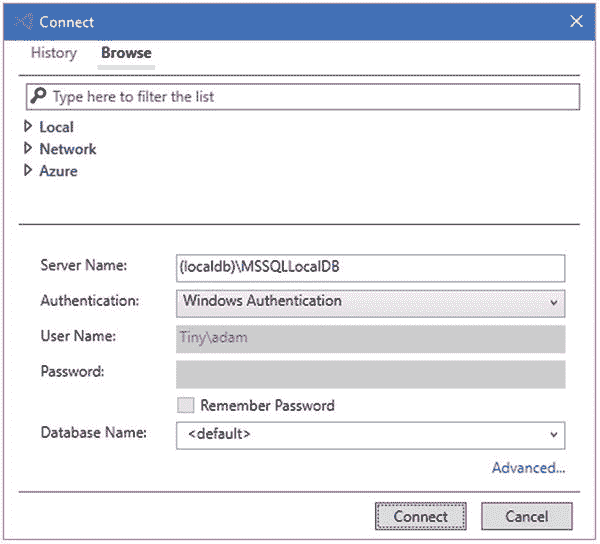
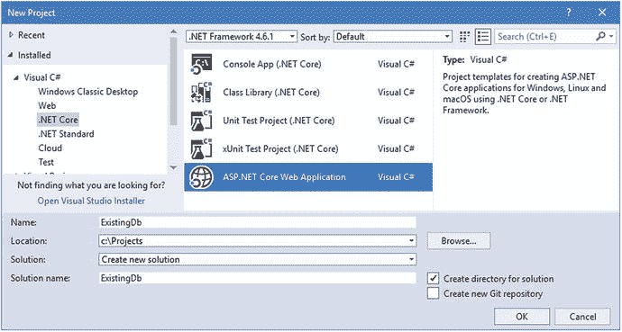
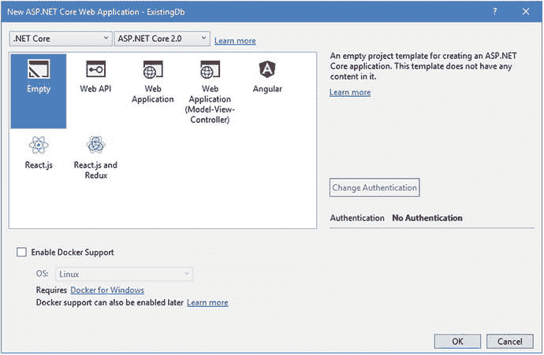
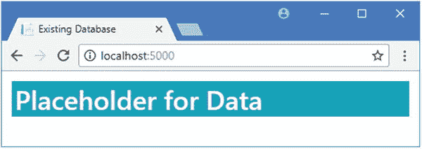
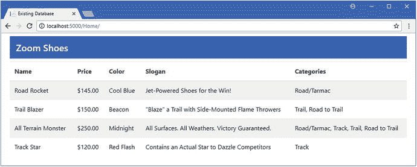
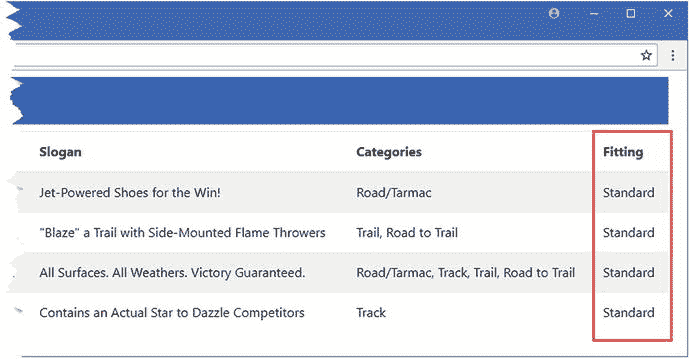
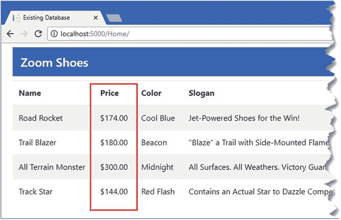

# 十七、搭建现有数据库

前面章节中的例子从定义模型的 C# 类开始，并使用它们来创建数据库，这被称为代码优先开发。对于需要使用现有数据库的项目，需要一种不同的方法，称为数据库优先开发，在这一章中，我将向您展示如何使用实体框架核心搭建功能，它检查数据库并自动生成数据模型。这个特性最适合简单的数据库，而更复杂的项目则更适合手动数据建模，我在第 [18](18.html) 章对此进行了描述。表 [17-1](#Tab1) 将这一章放在上下文中。

表 17-1。

Putting Database Scaffolding in Context

<colgroup><col> <col></colgroup> 
| 问题 | 回答 |
| --- | --- |
| 这是什么？ | 搭建是构建数据模型的过程，以便实体框架核心可以使用现有的数据库。 |
| 为什么有用？ | 并非所有项目都能够创建新数据库。Scaffolding 检查现有的数据库并自动创建数据模型。 |
| 如何使用？ | 搭建是使用命令行工具执行的。 |
| 有什么陷阱或限制吗？ | 搭建过程不能处理所有的数据库特性，并且会陷入大型复杂数据库的困境。 |
| 还有其他选择吗？ | 您可以手动建模数据库，如第 [18](18.html) 章所述。 |

表 [17-2](#Tab2) 总结了本章内容。

表 17-2。

Chapter Summary

<colgroup><col> <col> <col></colgroup> 
| 问题 | 解决办法 | 列表 |
| --- | --- | --- |
| 搭建现有数据库 | 运行命令行工具，然后调整上下文类以用于实体框架核心 | 1–23 |
| 在应用中反映数据库的变化 | 重建数据库 | 24–30 |

## 为本章做准备

本章依赖于没有使用实体框架核心创建的数据库，以便模拟已经存在的数据库。为此，我将使用 Visual Studio 的特性来执行 SQL 查询，以创建和填充一个数据库，如下面几节所述。

Note

我在下面的清单中一步一步地构建数据库，使这个过程更容易理解。然而，键入复杂的 SQL 语句是一个容易出错的过程，创建数据库的最佳方式是下载我在本章的项目中包含的 SQL 文件，该文件可以从本书的 GitHub 存储库中下载( [`https://github.com/apress/pro-ef-core-2-for-asp.net-core-mvc`](https://github.com/apress/pro-ef-core-2-for-asp.net-core-mvc) )。

### 了解示例现有数据库

为了帮助将本章这一部分出现的 SQL 放在上下文中，我将描述我将要创建的数据库。该数据库将被称为`ZoomShoesDb`，它将代表虚构的 Zoom 跑鞋公司的产品数据库。表 [17-3](#Tab3) 列出了我将添加到数据库中的表以及它们之间的关系。真实的数据库要比这个例子复杂得多，但是它包含了我演示实体框架核心特性以使用现有数据库所需的所有特征。

表 17-3。

The Tables in the Example Database

<colgroup><col> <col></colgroup> 
| 名字 | 描述 |
| --- | --- |
| `Shoes` | 该表将是数据库的核心，将包含该公司生产的产品的详细信息。该表与所有其他表都有关系。 |
| `Categories` | 此表包含用于描述公司跑鞋的一组类别。它通过`ShoeCategoryJunction`表与`Shoes`表有多对多的关系。 |
| `ShoeCategoryJunction` | 这是`Shoes`和`Categories`表之间多对多关系的连接表。 |
| `Colors` | 该表包含鞋子可用的颜色组合集，并与`Shoes`表有一对多的关系。 |
| `SalesCampaigns` | 该表包含每款鞋的销售活动详情，并与`Shoes`表有一对一的关系。 |

### 连接到数据库服务器

启动 Visual Studio，而不打开或创建新项目。选择工具➤ SQL Server ➤新查询，并在服务器名称字段中输入(localdb)\MSSQLLocalDB。(注意，数据库名称中只有一个反斜杠——字符`\`,而不是在`appsettings.json`文件中定义连接字符串时需要的两个反斜杠。)

确保认证字段选择 Windows 认证，确保数据库名称字段选择<default>，如图 [17-1](#Fig1) 所示，点击连接按钮。Visual Studio 将打开一个新的查询窗口，可以在其中输入和执行 SQL 语句。</default>



图 17-1。

连接到数据库服务器

### 创建数据库

第一步是创建数据库。在编辑器窗口中输入清单 [17-1](#Par10) 中所示的语句，右键单击，并从弹出菜单中选择 Execute。

Note

如果您使用的是 Visual Studio 代码，请在右击编辑器窗格时，从菜单中单击“执行查询”。

```cs
USE master

DROP DATABASE IF EXISTS ZoomShoesDb
GO

CREATE DATABASE ZoomShoesDb
GO

USE ZoomShoesDb
GO

Listing 17-1.Creating the Database

```

`DROP DATABASE`命令删除已经存在的`ZoomShoesDb`数据库，这意味着如果在为本章准备数据库时出错，您可以返回清单并重新开始。`CREATE DATABASE`命令创建数据库，而`USE`命令告诉数据库服务器后面的命令将应用于`ZoomShoesDb`数据库。

#### 创建颜色表

创建表的顺序很重要，因为数据库服务器不允许在不存在的表上定义外键关系。例如，`Colors`表必须在`Shoes`表之前创建，这样`Shoes`表可以定义一个外键列，用于表 [17-3](#Tab3) 中描述的一对多关系。在 SQL 编辑器窗口中输入清单 [17-2](#Par13) 所示的 SQL，单击右键，并从弹出菜单中选择 Execute，创建并填充`Colors`表。

```cs
CREATE TABLE Colors (
        Id bigint IDENTITY(1,1) NOT NULL,
        Name nvarchar(max) NOT NULL,
        MainColor nvarchar(max) NOT NULL,
        HighlightColor nvarchar(max) NOT NULL,
CONSTRAINT PK_Colors PRIMARY KEY (Id));

SET IDENTITY_INSERT dbo.Colors ON
INSERT dbo.Colors (Id, Name, MainColor, HighlightColor)
        VALUES (1, N'Red Flash', N'Red', N'Yellow'),
                         (2, N'Cool Blue', N'Dark Blue', N'Light Blue'),
                         (3, N'Midnight', N'Black', N'Black'),
                         (4, N'Beacon', N'Yellow', N'Green')
SET IDENTITY_INSERT dbo.Colors OFF
GO

Listing 17-2.Creating and Populating the Colors Table

```

`CREATE TABLE`命令创建`Colors`表，该表有`Id`、`Name`、`MainColor`和`HighlightColor`列，其中`Id`列用作主键列。`INSERT`命令填充该表，其中`SET IDENTITY`命令用于临时允许将数据与`Id`列的值相加。对`Colors`表进行了配置，以便数据库服务器负责为`Id`列生成值，但是我需要在填充数据库时指定这些值，以便我可以正确地设置表之间的关系。

为了测试您已经正确地创建了表，用清单 [17-3](#Par16) 中所示的 SQL 查询替换编辑器窗口中的文本。

```cs
SELECT * FROM Colors
Listing 17-3.Querying the Colors Table

```

在编辑器窗口中右键单击并从弹出菜单中选择执行；你应该在表 [17-4](#Tab4) 中看到输出，反映了`Colors`表的结构和内容。

Caution

如果您没有得到预期的结果，那么返回到清单 [17-1](#Par10) 并重新开始。你可能会不顾一切地继续下去，但是在本章的后面你不会得到预期的结果。

表 17-4。

The Structure and Data of the Colors Table

<colgroup><col> <col> <col> <col></colgroup> 
| 身份 | 名字 | 主色 | 高亮颜色 |
| --- | --- | --- | --- |
| one | 红色闪光 | 红色 | 黄色 |
| Two | 冷蓝色 | 深蓝色 | 淡蓝 |
| three | 午夜 | 黑色 | 黑色 |

#### 创建鞋子表

`Shoes`表包含了制鞋公司生产的产品的详细信息。要创建表，用清单 [17-4](#Par20) 中所示的 SQL 替换编辑器窗口中的文本，然后右键单击并从弹出菜单中选择 Execute。

```cs
CREATE TABLE Shoes (
        Id bigint IDENTITY(1,1) NOT NULL,
        Name nvarchar(max) NOT NULL,
        ColorId bigint NOT NULL,
        Price decimal(18, 2) NOT NULL,
 CONSTRAINT PK_Shoes PRIMARY KEY (Id ),
 CONSTRAINT FK_Shoes_Colors FOREIGN KEY(ColorId) REFERENCES dbo.Colors (Id))

SET IDENTITY_INSERT dbo.Shoes ON
INSERT dbo.Shoes (Id, Name, ColorId, Price)
        VALUES (1, N'Road Rocket', 2, 145.0000),
               (2, N'Trail Blazer', 4, 150.0000),
               (3, N'All Terrain Monster', 3, 250.0000),
               (4, N'Track Star', 1, 120.0000)
SET IDENTITY_INSERT dbo.Shoes OFF
GO

Listing 17-4.Creating and Populating the Shoes Table

```

`CREATE TABLE`命令创建一个包含`Id`、`Name`、`ColorId`和`Price`列的表格。`Id`列保存主键，在`Colors`表的`ColorId`列和`Id`列之间存在外键关系。

为了确保已经创建并正确填充了`Shoes`表，用清单 [17-5](#Par23) 中所示的查询替换编辑器窗口的内容。

```cs
SELECT * FROM Shoes
Listing 17-5.Querying the Shoes Table

```

在编辑器窗口中右键单击并从弹出菜单中选择 Execute，您应该看到表 [17-5](#Tab5) 中的输出，反映了`Shoes`表的结构和内容。

表 17-5。

The Structure and Data of the Shoes Table

<colgroup><col> <col> <col> <col></colgroup> 
| 身份 | 名字 | ColorId(颜色 Id) | 价格 |
| --- | --- | --- | --- |
| one | 公路火箭 | Two | One hundred and forty-five |
| Two | 开拓者 | four | One hundred and fifty |
| three | 全地形怪物 | three | Two hundred and fifty |
| four | 径赛明星 | one | One hundred and twenty |

#### 创建销售活动表

`SalesCampaigns`表与`Shoes`表有一对一的关系，包含与每种鞋产品相关的销售活动的细节，其中`Shoes`表是关系中的主要实体。要创建并填充该表，用清单 [17-6](#Par26) 中所示的 SQL 替换编辑器的内容。在编辑器窗口中右键单击并从弹出菜单中选择 Execute，以创建并填充该表。

```cs
CREATE TABLE SalesCampaigns(
        Id bigint IDENTITY(1,1) NOT NULL,
        Slogan nvarchar(max) NULL,
        MaxDiscount int NULL,
        LaunchDate date NULL,
        ShoeId bigint NOT NULL,
 CONSTRAINT PK_SalesCampaigns PRIMARY KEY (Id),
 CONSTRAINT FK_SalesCampaigns_Shoes FOREIGN KEY(ShoeId)
        REFERENCES dbo.Shoes (Id),
 INDEX IX_SalesCampaigns_ShoeId UNIQUE (ShoeId))

SET IDENTITY_INSERT dbo.SalesCampaigns ON
INSERT dbo.SalesCampaigns (Id, Slogan, MaxDiscount,
        LaunchDate, ShoeId) VALUES
        (1, N'Jet-Powered Shoes for the Win!', 20, CAST(N'2019-01-01' AS Date), 1),
        (2, N'"Blaze" a Trail with Side-Mounted Flame Throwers ',
                15, CAST(N'2019-05-03' AS Date), 2),
        (3, N'All Surfaces. All Weathers. Victory Guaranteed.',
                5, CAST(N'2020-01-01' AS Date), 3),
        (4, N'Contains an Actual Star to Dazzle Competitors',
                25, CAST(N'2020-01-01' AS Date), 4)
SET IDENTITY_INSERT dbo.SalesCampaigns OFF
GO

Listing 17-6.Creating and Populating the SalesCampaigns Table

```

`SalesCampaigns`表有`Id`、`Slogan`、`MaxDiscount`、`LauchDate`和`ShoeId`列。`Id`列用于存储主键，`ShoeId`列是外键列，存储来自`Shoes`表的`Id`列的值。还有一个索引要求在`ShoeId`列上有唯一的值，并强制执行与`Shoes`表的一对一关系。

为了确保表已经被正确地创建和填充，用清单 [17-7](#Par29) 中所示的查询替换编辑器窗口的内容。

```cs
select * from SalesCampaigns
Listing 17-7.Querying the SalesCampaigns Table

```

在编辑器窗口中右键单击并从弹出菜单中选择 Execute，您应该看到表 [17-6](#Tab6) 中的输出，反映了表的结构和内容。

表 17-6。

The Structure and Data of the SalesCampaigns Table

<colgroup><col> <col> <col> <col> <col></colgroup> 
| 身份 | 标语 | 最大折扣 | 发射日期 | 盾 |
| --- | --- | --- | --- | --- |
| one | 胜利的喷气动力鞋！ | Twenty | 2019-01-01 | one |
| Two | 用侧面安装的火焰喷射器“点燃”一条小径 | Fifteen | 2019-05-03 | Two |
| three | 所有表面。全天候。胜利在握。 | five | 2020-01-01 | three |
| four | 包含一个真正的明星，让竞争对手眼花缭乱 | Twenty-five | 2020-01-01 | four |

#### 创建类别和鞋类别连接表

为了完成数据库，我将创建`Categories`表和`ShoeCategoryJunction`表，这将允许与`Shoes`表的多对多关系。为了创建和填充这些表，用清单 [17-8](#Par32) 中所示的 SQL 替换编辑器窗口的内容。在编辑器窗口中右键单击并选择“执行”以执行 SQL 命令指定的操作。

```cs
CREATE TABLE Categories(
        Id bigint IDENTITY(1,1) NOT NULL,
        Name nvarchar(max) NOT NULL,
 CONSTRAINT PK_Categories PRIMARY KEY (id));

SET IDENTITY_INSERT dbo.Categories ON
INSERT dbo.Categories (Id, Name) VALUES
        (1, N'Road/Tarmac'), (2, N'Track'), (3, N'Trail'), (4, N'Road to Trail')
SET IDENTITY_INSERT dbo.Categories OFF
GO

CREATE TABLE ShoeCategoryJunction(
        Id bigint IDENTITY(1,1) NOT NULL,
        ShoeId bigint NOT NULL,
        CategoryId bigint NOT NULL,
 CONSTRAINT PK_ShoeCategoryJunction PRIMARY KEY (Id),
 CONSTRAINT FK_ShoeCategoryJunction_Categories FOREIGN KEY(CategoryId)
        REFERENCES dbo.Categories (Id),
CONSTRAINT FK_ShoeCategoryJunction_Shoes FOREIGN KEY(ShoeId)
        REFERENCES dbo.Shoes (Id))

SET IDENTITY_INSERT dbo.ShoeCategoryJunction ON
INSERT dbo.ShoeCategoryJunction (Id, ShoeId, CategoryId)
        VALUES (1, 1, 1), (2, 2, 3), (3, 2, 4), (4, 3, 1),
               (5, 3, 2), (6, 3, 3), (7, 3, 4), (8, 4, 2)
SET IDENTITY_INSERT dbo.ShoeCategoryJunction OFF
GO

Listing 17-8.Creating the Categories and ShoeCategoryJunction Tables

```

`Categories`表有`Id`和`Name`列，其中`Id`列用于主键。`ShoeCategoryJunction`有`Id`、`ShoeId`和`CategoryId`列，其中`Id`列用于主键，其他列用于与`Shoes`和`Categories`表的外键关系。这与我在第 [16](16.html) 章中描述的处理多对多关系的方法相同。

为了确保表已经被正确地创建和填充，用清单 [17-9](#Par35) 中所示的查询替换编辑器窗口的内容。

```cs
SELECT * FROM Categories
INNER JOIN ShoeCategoryJunction
ON Categories.Id = ShoeCategoryJunction.ShoeId
Listing 17-9.Querying the Categories and ShoeCategoryJunction Tables

```

在编辑器窗口中右键单击并从弹出菜单中选择 Execute，您应该会看到表 [17-7](#Tab7) 中的输出，它结合了两个表的结构和内容。

表 17-7。

The Structure and Data for the Categories and ShoeCategoryJunction Tables

<colgroup><col> <col> <col> <col> <col></colgroup> 
| 身份 | 名字 | 身份 | 盾 | 分类编号 |
| --- | --- | --- | --- | --- |
| one | 道路/柏油路 | one | one | one |
| Two | 轨道 | Two | Two | three |
| Two | 轨道 | three | Two | four |
| three | 追踪 | four | three | one |
| three | 追踪 | five | three | Two |
| three | 追踪 | six | three | three |
| three | 追踪 | seven | three | four |
| four | 通往小径的路 | eight | four | Two |

### 创建 ASP.NET Core MVC 项目

除了数据库，我需要一个 ASP.NET Core MVC 项目，这样我就可以演示如何与现有的数据库使用实体框架核心。创建项目时，在 Visual Studio 文件菜单中选择新建➤项目，选择 ASP.NET Core Web 应用模板，将项目名称设置为 ExistingDb，如图 [17-2](#Fig2) 所示。(系统将提示您保存 SQL 编辑器窗口的内容。只要您收到了每个查询的预期结果，就不再需要 SQL 语句了。)单击 OK 按钮继续创建项目。



图 17-2。

Creating the new ASP.NET Core MVC project

确保这点。在窗口顶部的菜单中选择 NET Core 和 ASP.NET Core 2.0，选择空的项目模板，如图 [17-3](#Fig3) 所示。单击 OK 按钮完成配置过程并创建新项目。



图 17-3。

Configuring the new ASP.NET Core MVC project

#### 添加工具 NuGet 包

Visual Studio 添加到新项目的元包包含 ASP.NET Core MVC 和实体框架核心功能，但需要手动添加来设置实体框架核心命令行工具。在解决方案资源管理器中右键单击 ExistingDb 项目项，从弹出菜单中选择 Edit ExistingDb.csproj，并添加清单 [17-10](#Par40) 中所示的配置元素。

```cs
<Project Sdk="Microsoft.NET.Sdk.Web">

  <PropertyGroup>
    <TargetFramework>netcoreapp2.0</TargetFramework>
  </PropertyGroup>

  <ItemGroup>
    <Folder Include="wwwroot\" />
  </ItemGroup>

  <ItemGroup>
    <PackageReference Include="Microsoft.AspNetCore.All" Version="2.0.5" />
    <DotNetCliToolReference Include="Microsoft.EntityFrameworkCore.Tools.DotNet"
        Version="2.0.0"    />
  </ItemGroup>

</Project>

Listing 17-10.Adding the Tools Package in the ExistingDb.csproj File in the ExistingDb Folder

```

保存文件，包将被下载并安装，为项目提供本章示例所需的命令行工具。

#### 配置 ASP.NET Core 中间件和服务

空项目模板需要配置来设置 MVC 应用所需的`Startup`类中的中间件和服务，如清单 [17-11](#Par43) 所示。

```cs
using System;
using System.Collections.Generic;
using System.Linq;
using System.Threading.Tasks;
using Microsoft.AspNetCore.Builder;
using Microsoft.AspNetCore.Hosting;
using Microsoft.AspNetCore.Http;
using Microsoft.Extensions.DependencyInjection;

namespace ExistingDb {
    public class Startup {

        public void ConfigureServices(IServiceCollection services) {
            services.AddMvc();
        }

        public void Configure(IApplicationBuilder app, IHostingEnvironment env) {
            app.UseDeveloperExceptionPage();
            app.UseStatusCodePages();
            app.UseStaticFiles();
            app.UseMvcWithDefaultRoute();
        }
    }
}

Listing 17-11.Configuring Middleware and Services in the Startup.cs File in the ExistingDb Folder

```

我没有为实体框架核心添加任何配置语句。我将在本章的后面设置使用数据库所需的服务。

#### 添加控制器和视图并安装引导

本章的最后准备工作是创建一个简单的控制器和视图，以便可以测试应用，并安装 Bootstrap CSS 包，以便我可以轻松地设计显示给用户的 HTML 内容。对于控制器，我创建了`Controllers`文件夹，并在其中添加了一个名为`HomeController.cs`的类文件，内容如清单 [17-12](#Par46) 所示。

```cs
using Microsoft.AspNetCore.Mvc;

namespace ExistingDb.Controllers {

    public class HomeController : Controller {

        public IActionResult Index() {
            return View();
        }
    }
}

Listing 17-12.The Contents of the HomeController.cs File in the Controllers Folder

```

我将在本章的后面构建这个控制器，但是现在有一个选择默认视图的动作方法。为了创建视图，我创建了`Views/Home`文件夹，并向其中添加了一个名为`Index.cshtml`的文件，我向其中添加了清单 [17-13](#Par48) 中所示的内容。

```cs
@{
    ViewData["Title"] = "Existing Database";
    Layout = "_Layout";
}

<h2 class="bg-info p-1 m-1 text-white">Placeholder for Data</h2>

Listing 17-13.The Contents of the Index.cshtml File in the Views/Home Folder

```

为了给示例应用中的视图提供共享布局，我创建了`Views/Shared`文件夹，并向其中添加了一个名为`_Layout.cshtml`的文件，其内容如清单 [17-14](#Par50) 所示。

```cs
<!DOCTYPE html>
<html>
<head>
    <meta name="viewport" content="width=device-width" />
    <title>@ViewData["Title"]</title>
    <link rel="stylesheet" href="∼/lib/bootstrap/dist/css/bootstrap.min.css" />
</head>
<body>
    <div class="p-2">
        @RenderBody()
    </div>
</body>
</html>
Listing 17-14.The Contents of the _Layout.cshtml File in the Views/Shared Folder

```

为了安装 Bootstrap CSS 包，我使用 JSON 文件模板(在 ASP.NET Core➤ Web ➤通用类别中找到)创建一个名为`.bowerrc`的文件，其内容如清单 [17-15](#Par52) 所示。(注意这个文件名很重要:它以句点开头，包含字母`r`两次，没有文件扩展名)。

```cs
{
  "directory": "wwwroot/lib"
}
Listing 17-15.The Contents of the .bowerrc File in the ExistingDb Folder

```

我再次使用 JSON 文件模板创建了一个名为`bower.json`的文件，内容如清单 [4-9](04.html#Par34) 所示。

```cs
{
  "name": "asp.net",
  "private": true,
  "dependencies": {
    "bootstrap": "4.0.0"
  }
}
Listing 17-16.The Contents of the bower.json File in the ExistingDb Folder

```

当您保存对文件的更改时，引导软件包将被下载并安装在`wwwroot/lib`文件夹中。

### 测试示例应用

为了简化使用应用的过程，编辑`Properties/launchSettings.json`文件并更改它包含的两个 URL，使它们都指定端口`5000`，如清单 [17-17](#Par57) 所示。这是我将在 URL 中使用的端口，用来演示示例应用的不同特性。

```cs
{
  "iisSettings": {
    "windowsAuthentication": false,
    "anonymousAuthentication": true,
    "iisExpress": {
      "applicationUrl": "http://localhost:5000/",
      "sslPort": 0
    }
  },
  "profiles": {
    "IIS Express": {
      "commandName": "IISExpress",
      "launchBrowser": true,
      "environmentVariables": {
        "ASPNETCORE_ENVIRONMENT": "Development"
      }
    },
    "ExistingDb": {
      "commandName": "Project",
      "launchBrowser": true,
      "environmentVariables": {
        "ASPNETCORE_ENVIRONMENT": "Development"
      },
      "applicationUrl": "http://localhost:5000/"
    }
  }
}
Listing 17-17.Changing Ports in the launchSettings.json File in the Properties Folder

```

使用`ExistingDb`项目文件夹中的`dotnet run`启动应用，使用浏览器导航到`http://localhost:5000`查看占位符内容，如图 [17-4](#Fig4) 所示。



图 17-4。

Running the example application

## 搭建现有数据库

使用现有数据库最简单的方法是使用实体框架核心搭建功能，该功能检查数据库并创建执行查询和其他数据操作所需的上下文和模型类。

即使你手动为一个现有的数据库创建一个数据模型，正如我在第 [18](18.html) 章中所描述的，使用支架特性来确保你所得到的数据库描述是正确的仍然是值得的。在接下来的部分中，我将向您展示如何使用支架特性，并解释如何在 ASP.NET Core MVC 应用中使用它创建的数据模型。

### 执行脚手架过程

使用添加到清单 [17-10](#Par40) 中的示例项目的包中包含的命令行工具来执行搭建过程。运行`ExistingDb`项目文件夹中清单 [17-18](#Par63) 所示的命令，检查示例数据库并生成数据模型。

Tip

页面的布局很难显示复杂的命令，但是您必须注意在命令提示符下将清单 [17-18](#Par63) 的所有部分输入到一行中。

```cs
dotnet ef dbcontext scaffold "Server=(localdb)\MSSQLLocalDB;Database=ZoomShoesDb" "Microsoft.EntityFrameworkCore.SqlServer" --output-dir "Models/Scaffold" --context ScaffoldContext
Listing 17-18.Scaffolding an Existing Database

```

基本命令是`dotnet ef dbcontext scaffold`，它运行搭建过程。前两个参数是必需的，它们提供要建模的数据库的连接字符串和数据库提供者的名称。清单 [17-18](#Par63) 中有两个可选参数:`--output-dir`参数指定由搭建过程生成的 C# 类的目录(和名称空间)，而`--context`参数指定用于访问数据库的上下文类的名称。

Dealing with Problem Databases

清单 [17-18](#Par63) 中的命令产生的搭建过程是无缝的，因为示例数据库很简单，并且是专门为本章创建的。当您搭建一个真实的数据库时，密切关注来自`dotnet ef`命令的输出是很重要的，因为这是报告任何问题的地方。

有些问题只是警告，数据库的某些方面无法清晰地映射到实体框架核心，导致所创建的数据模型受到损害。但是也可能出现实体框架核心不知道如何进行的情况。对于这些情况，你可以手动建立数据库模型，如第 [18 章](18.html)所述，或者通过使用`--table`参数选择你想要使用的表并排除那些导致问题的表来限制搭建过程的范围。

在清单 [17-18](#Par63) 中，我为本章开始时创建的示例数据库提供了连接字符串，并选择了 SQL Server 提供者。可选参数指定数据模型类应该放在`Models/Scaffold`文件夹中，上下文类应该称为`ScaffoldContext`。

运行该命令需要一些时间。完成后，您会看到 Solution Explorer 中显示了一个`Models/Scaffold`文件夹，其中包含一个表示数据库中每个表的类，以及一个名为`ScaffoldContext`的上下文类。

由搭建过程生成的每个类都遵循我在前面章节中描述的大致相同的风格。例如，下面是`Shoes.cs`文件的内容，它将用于表示数据库中来自`Shoes`表的数据行:

```cs
using System;
using System.Collections.Generic;

namespace ExistingDb.Models.Scaffold {

    public partial class Shoes {

        public Shoes() {
            ShoeCategoryJunction = new HashSet<ShoeCategoryJunction>();
        }

        public long Id { get; set; }
        public string Name { get; set; }
        public long ColorId { get; set; }
        public decimal Price { get; set; }

        public Colors Color { get; set; }
        public SalesCampaigns SalesCampaigns { get; set; }
        public ICollection<ShoeCategoryJunction> ShoeCategoryJunction { get; set; }
    }
}

```

您可以看到这个类是如何与前面章节中创建的类相匹配的。`Id`、`Name`、`ColorId`和`Price`属性对应于添加到`Shoes`表中的列。`Color`、`SalesCampaigns`和`ShoeCategoryJunction`属性允许导航到相关数据，对应于数据库中表之间的关系。

有一些小的不同。例如，类名是`Shoes`，因为搭建过程使用数据库表的名称。构造函数初始化`ShoeCategoryJunction`属性的集合，这是我在前面章节中省略的，当没有可用数据时，我更喜欢处理`null`值，而不是一个空集合。

搭建过程还创建了一个 context 类，它拥有数据库中每个表的`DbSet<T>`属性。上下文还覆盖了`OnConfiguring`和`OnModelCreating`方法，这在前面的章节中是不需要的。下面是`ScaffoldContext.cs`文件的内容，为了简洁起见，删除了`OnModelCreating`方法中的一些语句:

```cs
using System;
using Microsoft.EntityFrameworkCore;
using Microsoft.EntityFrameworkCore.Metadata;

namespace ExistingDb.Models.Scaffold {

    public partial class ScaffoldContext : DbContext {

        public virtual DbSet<Categories> Categories { get; set; }
        public virtual DbSet<Colors> Colors { get; set; }
        public virtual DbSet<SalesCampaigns> SalesCampaigns { get; set; }
        public virtual DbSet<ShoeCategoryJunction> ShoeCategoryJunction { get; set; }
        public virtual DbSet<Shoes> Shoes { get; set; }

        protected override void OnConfiguring(DbContextOptionsBuilder
                optionsBuilder) {
            if (!optionsBuilder.IsConfigured) {
                optionsBuilder.UseSqlServer(
                    @"Server=(localdb)\MSSQLLocalDB;Database=ZoomShoesDb");
            }
        }

        protected override void OnModelCreating(ModelBuilder modelBuilder) {

            // ...statements omitted for brevity...

            modelBuilder.Entity<Shoes>(entity => {
                entity.Property(e => e.Name).IsRequired();

                entity.HasOne(d => d.Color)
                    .WithMany(p => p.Shoes)
                    .HasForeignKey(d => d.ColorId)
                    .OnDelete(DeleteBehavior.ClientSetNull)
                    .HasConstraintName("FK_Shoes_Colors");
            });
        }
    }
}

```

这些方法中的代码提供的功能在前面的章节中有介绍。`OnConfiguring`方法包含数据库的连接字符串，它是在 ASP.NET Core MVC 项目的设置文件中定义的。`OnModelCreating`方法包含创建数据库和数据模型类之间映射的语句，这些语句是迁移创建的快照类的一部分。我将很快把连接字符串移到它正常的位置，并在第 [18 章](18.html)中解释`OnModelCreating`方法中语句的用途。

### 在 ASP.NET Core MVC 中使用搭建的数据模型

一旦创建了数据模型，只需做一些修改，就可以在 ASP.NET Core MVC 中使用它，正如我在下面的章节中所描述的。

#### 创建配置文件

第一步是创建一个配置文件来包含搭建过程放入上下文类的连接字符串(这对于 ASP.NET Core MVC 应用是不工作的)。我使用 ASP.NET 配置文件项模板向项目中添加一个名为`appsettings.json`的文件，并做出清单 [17-19](#Par78) 中所示的更改。

```cs
{
  "ConnectionStrings": {
    "DefaultConnection": "Server=(localdb)\\MSSQLLocalDB;Database=ZoomShoesDb;MultipleActiveResultSets=true"
  },
  "Logging": {
    "LogLevel": {
      "Default": "None",
      "Microsoft.EntityFrameworkCore": "Information"
    }
  }
}
Listing 17-19.The Contents of the appsettings.json File in the ExistingDb Folder

```

除了更改连接字符串之外，我还添加了`Logging`配置部分，以便实体框架核心将显示它发送给数据库服务器的查询的详细信息。日志记录的更改并不是数据模型工作所必需的，但是非常有用，这样您就可以看到实体框架核心是如何与数据库一起工作的。

#### 更新上下文类

由搭建过程创建的上下文类必须先进行修改，然后才能用于 ASP.NET Core MVC 应用的其余部分。移除或注释掉`OnConfiguring`方法，并用一个通过依赖注入接受其配置选项的构造函数来替换它，如清单 [17-20](#Par81) 所示。

```cs
using System;
using Microsoft.EntityFrameworkCore;
using Microsoft.EntityFrameworkCore.Metadata;

namespace ExistingDb.Models.Scaffold {

    public partial class ScaffoldContext : DbContext {

        public virtual DbSet<Categories> Categories { get; set; }
        public virtual DbSet<Colors> Colors { get; set; }
        public virtual DbSet<SalesCampaigns> SalesCampaigns { get; set; }
        public virtual DbSet<ShoeCategoryJunction> ShoeCategoryJunction { get; set; }
        public virtual DbSet<Shoes> Shoes { get; set; }

        public ScaffoldContext(DbContextOptions<ScaffoldContext> options)
            : base(options) { }

        //protected override void OnConfiguring(DbContextOptionsBuilder
        //       optionsBuilder) {
        //    if (!optionsBuilder.IsConfigured) {
        //        optionsBuilder.UseSqlServer
        //            (@"Server=(localdb)\MSSQLLocalDB;Database=ZoomShoesDb");
        //    }
        //}

        protected override void OnModelCreating(ModelBuilder modelBuilder) {

            // ...statements omitted for brevity...

        }
    }
}

Listing 17-20.Updating the Context in the ScaffoldContext.cs File in the Models/Scaffold Folder

```

#### 注册中间件和服务

搭建过程不会配置实体框架核心以用于 ASP.NET Core MVC，也不会将上下文类注册为依赖注入的服务。为了让应用的不同部分协同工作，我将清单 [17-21](#Par83) 中所示的语句添加到`Startup`类中。

```cs
using System;
using System.Collections.Generic;
using System.Linq;
using System.Threading.Tasks;
using Microsoft.AspNetCore.Builder;
using Microsoft.AspNetCore.Hosting;
using Microsoft.AspNetCore.Http;
using Microsoft.Extensions.DependencyInjection;

using Microsoft.Extensions.Configuration;

using ExistingDb.Models.Scaffold;

using Microsoft.EntityFrameworkCore;

namespace ExistingDb {
    public class Startup {

        public Startup(IConfiguration config) => Configuration = config;

        public IConfiguration Configuration { get; }

        public void ConfigureServices(IServiceCollection services) {
            services.AddMvc();
            string conString = Configuration["ConnectionStrings:DefaultConnection"];
            services.AddDbContext<ScaffoldContext>(options =>
                options.UseSqlServer(conString));
        }

        public void Configure(IApplicationBuilder app, IHostingEnvironment env) {
            app.UseDeveloperExceptionPage();
            app.UseStatusCodePages();
            app.UseStaticFiles();
            app.UseMvcWithDefaultRoute();
        }
    }
}

Listing 17-21.Configuring the Application in the Startup.cs File in the ExistingDb Folder

```

#### 更新控制器和视图

应用的其余部分已经准备好了，剩下的就是更新控制器，以便它从数据库中获取数据并显示给用户。在清单 [17-22](#Par85) 中，我向`Home`控制器添加了查询数据库数据的语句。我将只添加一些基本特性，因为我将对数据模型进行更改，并且我不想通过多个操作方法和视图来处理每个更改。

```cs
using Microsoft.AspNetCore.Mvc;

using ExistingDb.Models.Scaffold;

using Microsoft.EntityFrameworkCore;

namespace ExistingDb.Controllers {

    public class HomeController : Controller {
        private ScaffoldContext context;

        public HomeController(ScaffoldContext ctx) => context = ctx;

        public IActionResult Index() {
            return View(context.Shoes
                .Include(s => s.Color)
                .Include(s => s.SalesCampaigns)
                .Include(s => s.ShoeCategoryJunction)
                    .ThenInclude(junct => junct.Category));
        }
    }
}

Listing 17-22.Querying for Data in the HomeController.cs File in the Controllers Folder

```

使用脚手架数据模型与使用通过迁移创建的数据模型是一样的。在清单 [17-22](#Par85) 中，我使用由上下文类定义的`Shoes`属性查询数据库，并使用`Include`和`ThenInclude`方法按照导航属性找到相关数据。

为了启用 ASP.NET Core MVC 标签助手并提供对视图中模型类的简单访问，我在`Views`文件夹中添加了一个名为`_ViewImports.cshtml`的文件，其内容如清单 [17-23](#Par88) 所示。

```cs
@using ExistingDb.Models.Scaffold
@addTagHelper *, Microsoft.AspNetCore.Mvc.TagHelpers
Listing 17-23.The Contents of the _ViewImports.cshtml File in the Views Folder

```

为了向用户显示数据，我用清单 [17-24](#Par90) 中所示的元素替换了`Views/Home`文件夹中`Index.cshtml`文件的内容。

```cs
@model IEnumerable<Shoes>

@{
    ViewData["Title"] = "Existing Database";
    Layout = "_Layout";
}

<div class="container-fluid">

    <h4 class="bg-primary p-3 text-white">Zoom Shoes</h4>
    <table class="table table-striped">
        <thead>
            <tr>
                <th>Name</th><th>Price</th><th>Color</th>
                <th>Slogan</th><th>Categories</th>
            </tr>
        </thead>
        <tbody>
            @foreach (Shoes s in Model) {
                <tr>
                    <td>@s.Name</td>
                    <td>$@s.Price.ToString("F2")</td>
                    <td>@s.Color.Name</td>
                    <td>@s.SalesCampaigns?.Slogan</td>
                    <td>
                        @String.Join(", ", s.ShoeCategoryJunction
                    .Select(j => j.Category.Name))
                    </td>
                </tr>
            }
        </tbody>
    </table>

</div>

Listing 17-24.Displaying Data in the Index.cshtml File in  the Views/Home Folder

```

使用`dotnet run`启动应用，并导航至`http://localhost:5000`；您将看到一个包含数据库中数据详细信息的表格，通过使用脚手架过程创建的数据模型访问，如图 [17-5](#Fig5) 所示。



图 17-5。

Using a scaffolded data model

## 响应数据库更改

如果您不能单独使用一个现有的数据库，那么您可能必须响应为了其他应用的利益而做出的更改。在接下来的小节中，我将模拟对数据库的更改，并演示如何更新搭建的数据模型以适应应用中的更改。

### 修改数据库

要模拟对数据库的更改，请选择“工具”“➤SQL server”“➤新建查询”,并使用本章开头介绍的步骤连接到数据库。将清单 [17-25](#Par95) 中所示的 SQL 粘贴到编辑器中，右键单击，并从弹出菜单中选择 Execute。

Tip

如果您想重置数据库，那么您可以执行清单 [17-1](#Par10) 到 [17-6](#Par26) 中的 SQL 语句。(如果您从 GitHub 资源库下载本章的项目，这个过程会更容易，资源库中包含了包含所有 require 语句的 SQL 文件。)

```cs
USE ZoomShoesDb

CREATE TABLE Fittings (
        Id bigint IDENTITY(1,1) NOT NULL,
        Name nvarchar(max) NOT NULL,
CONSTRAINT PK_Fittings PRIMARY KEY (Id));
GO

SET IDENTITY_INSERT Fittings ON
INSERT Fittings (Id, Name)
        VALUES (1, N'Narrow'),
                        (2, N'Standard'),
                        (3, N'Wide'),
                        (4, N'Big Foot')
SET IDENTITY_INSERT Fittings OFF
GO

ALTER TABLE Shoes
    ADD FittingId bigint
ALTER TABLE Shoes
    ADD CONSTRAINT FK_Shoes_Fittings FOREIGN KEY(FittingId) REFERENCES Fittings (Id)
GO

UPDATE Shoes SET FittingId = 2
GO

SELECT * from Shoes

Listing 17-25.Changing the Database

```

这些语句添加一个`Fittings`表，并在引用新表主键列的`Shoes`表上添加一个外键属性。最后的语句查询表格以显示变更的效果，并将产生表 [17-8](#Tab8) 中所示的数据。

表 17-8。

The Effect of Adding a Column to the Shoes Table

<colgroup><col> <col> <col> <col> <col></colgroup> 
| 身份 | 名字 | ColorId(颜色 Id) | 价格 | 配件 Id |
| --- | --- | --- | --- | --- |
| one | 公路火箭 | Two | One hundred and forty-five | Two |
| Two | 开拓者 | four | One hundred and fifty | Two |
| three | 全地形怪物 | three | Two hundred and fifty | Two |
| four | 径赛明星 | one | One hundred and twenty | Two |

这种类型的更改给 ASP.NET Core MVC 应用带来了问题，因为数据模型没有任何对`OutOfStock`列的表示。对数据库`Shoes`的查询不会包含表中的所有数据，应用也不能在`Shoes`表中存储新的对象，因为`OutOfStock`列所需的值将会丢失。

### 更新数据模型

更新数据模型以反映数据库中的变化意味着重复搭建过程。在`ExistingDb`项目文件夹中运行清单 [17-26](#Par99) 中所示的命令，确保包含两个以粗体显示的附加参数。

```cs
dotnet ef dbcontext scaffold "Server=(localdb)\MSSQLLocalDB;Database=ZoomShoesDb" "Microsoft.EntityFrameworkCore.SqlServer" --output-dir "Models/Scaffold" --context ScaffoldContext --force --no-build
Listing 17-26.Updating the Data Model

```

`--force`参数告诉实体框架核心用新的数据模型类替换现有的数据模型类。`--no-build`参数防止在搭建过程执行之前构建项目。很容易出现这样的情况:搭建过程生成的数据模型与应用的其余部分(如控制器和视图)不同步。缺省情况下，实体框架核心会在搭建数据库之前尝试构建项目，而失败的构建(通常是因为属性或数据模型类已被移除)会阻止搭建过程的执行。使用`--no-build`参数避免了这个问题，并允许您在数据库搭建完成后更新应用的其余部分。

### 更新上下文类

搭建过程将取代上下文类，覆盖支持 ASP.NET Core MVC 应用所需的更改。当搭建过程完成时，重复注释掉`OnConfiguring`方法并添加接收配置选项参数的构造函数的过程，如清单 [17-27](#Par102) 所示。

```cs
using System;
using Microsoft.EntityFrameworkCore;
using Microsoft.EntityFrameworkCore.Metadata;

namespace ExistingDb.Models.Scaffold {
    public partial class ScaffoldContext : DbContext {
        public virtual DbSet<Categories> Categories { get; set; }
        public virtual DbSet<Colors> Colors { get; set; }
        public virtual DbSet<Fittings> Fittings { get; set; }
        public virtual DbSet<SalesCampaigns> SalesCampaigns { get; set; }
        public virtual DbSet<ShoeCategoryJunction> ShoeCategoryJunction { get; set; }
        public virtual DbSet<Shoes> Shoes { get; set; }

        public ScaffoldContext(DbContextOptions<ScaffoldContext> options)
            : base(options) { }

        //protected override void OnConfiguring(DbContextOptionsBuilder
        //       optionsBuilder) {
        //    if (!optionsBuilder.IsConfigured) {
        //        optionsBuilder.UseSqlServer
        //            (@"Server=(localdb)\MSSQLLocalDB;Database=ZoomShoesDb");
        //    }
        //}

        protected override void OnModelCreating(ModelBuilder modelBuilder) {

            // ...statements omitted for brevity...
        }
    }
}

Listing 17-27.Updating the Context in the ScaffoldContext.cs File in the Models/Scaffold Folder

```

### 更新控制器和视图

根据对数据库的更改，您还必须更新项目的其余部分，以确保应用正常工作。对于示例应用，这意味着更新`Home`控制器以遵循添加到`Shoes`类的新导航属性，从而在其查询中包含相关数据，并更新视图以显示该数据。清单 [17-28](#Par104) 显示了控制器的变化。

```cs
using Microsoft.AspNetCore.Mvc;
using ExistingDb.Models.Scaffold;
using Microsoft.EntityFrameworkCore;

namespace ExistingDb.Controllers {

    public class HomeController : Controller {
        private ScaffoldContext context;

        public HomeController(ScaffoldContext ctx) => context = ctx;

        public IActionResult Index() {
            return View(context.Shoes
                .Include(s => s.Color)
                .Include(s => s.SalesCampaigns)
                .Include(s => s.ShoeCategoryJunction)
                    .ThenInclude(junct => junct.Category)
                .Include(s => s.Fitting));
        }
    }
}

Listing 17-28.Following a New Navigation Property in the HomeController.cs File in the Controllers Folder

```

为了向用户显示附加数据，清单 [17-29](#Par106) 在`Index.cshtml`视图的表格中添加了一列。

```cs
@model IEnumerable<Shoes>
@{
    ViewData["Title"] = "Existing Database";
    Layout = "_Layout";
}

<div class="container-fluid">
    <h4 class="bg-primary p-3 text-white">Zoom Shoes</h4>
    <table class="table table-striped">
        <thead>
            <tr>
                <th>Name</th>
                <th>Price</th>
                <th>Color</th>
                <th>Slogan</th>
                <th>Categories</th>
                <th>Fitting</th>
            </tr>
        </thead>
        <tbody>
            @foreach (Shoes s in Model) {
                <tr>
                    <td>@s.Name</td>
                    <td>$@s.Price.ToString("F2")</td>
                    <td>@s.Color.Name</td>
                    <td>@s.SalesCampaigns?.Slogan</td>
                    <td>
                        @String.Join(", ", s.ShoeCategoryJunction
                    .Select(j => j.Category.Name))
                    </td>
                    <td>@s.Fitting.Name</td>
                </tr>
            }
        </tbody>
    </table>
</div>

Listing 17-29.Displaying Additional Data in the Index.cshtml File in the Views/Home Folder

```

要查看数据库更改的效果，使用`dotnet run`启动应用并导航到`http://localhost:5000`，这将产生如图 [17-6](#Fig6) 所示的结果。



图 17-6。

Displaying data from the updated database

## 添加持久数据模型功能

许多数据模型只是充当数据和导航属性集合的类，用来表示数据库中的数据。但是有些应用需要数据模型类中的额外代码来执行验证等任务，或者合成数据库中没有的数据。每次数据库更改时重新创建数据模型可能会出现问题，因为模型类会被覆盖，这意味着任何附加的逻辑都会丢失。

为了解决这个问题，Entity Framework Core 在搭建过程中创建数据模型时创建了分部类。例如，下面是实体框架核心创建的`Shoes`类的定义:

```cs
...
public partial class Shoes {
...

```

分部类可以在多个文件中定义，这允许应用所需的任何附加逻辑与由搭建过程创建的文件分开定义，并确保它将在数据库的更改中存活。为了演示这是如何工作的，我创建了`Models/Logic`文件夹，并添加了一个名为`Shoes.cs`的类文件，代码如清单 [17-30](#Par112) 所示。

```cs
namespace ExistingDb.Models.Scaffold {

    public partial class Shoes {

        public decimal PriceIncTax => this.Price * 1.2m;
    }
}

Listing 17-30.The Contents of the Shoes.cs File in the Models/Logic Folder

```

分部类的不同部分必须在同一个名称空间中定义，这就是为什么这个类在`ExistingDb.Models.Scaffold`名称空间中，即使类文件在`Logic`文件夹中。分部类的一部分可以访问其他部分的成员，这意味着`PriceIncTax`属性可以读取`Price`属性的值。

Caution

在分部类中为模型类定义额外的逻辑意味着当数据模型被重新创建时，代码不会受到影响，但是您仍然必须确保代码在数据库更改后仍然有用和准确。

在清单 [17-31](#Par116) 中，我已经更新了显示数据的视图，以使用清单 [17-30](#Par112) 中定义的属性。

```cs
...
<tbody>
    @foreach (Shoes s in Model) {
        <tr>
            <td>@s.Name</td>
            <td>$@s.PriceIncTax.ToString("F2")</td>
            <td>@s.Color.Name</td>
            <td>@s.SalesCampaigns?.Slogan</td>
            <td>
                @String.Join(", ", s.ShoeCategoryJunction
            .Select(j => j.Category.Name))
            </td>
            <td>@s.Fitting.Name</td>
        </tr>
    }
</tbody>
...
Listing 17-31.Using a Partial Class Property in the Index.cshtml File in the Views/Home Folder

```

要查看附加逻辑的效果，用`dotnet run`启动应用并导航到`http://localhost:5000`，它将显示含税增加 20%的价格，如图 [17-7](#Fig7) 所示。



图 17-7。

Using a partial class for additional model logic

## 摘要

在本章中，我向您展示了如何通过使用实体框架核心搭建特性来使用现有的数据库，该特性检查数据库并创建使用它所需的上下文和实体类。对于简单的数据库来说，这是一个有用的特性，但是在更复杂的项目中使用起来可能会更困难。在下一章中，我将向您展示如何手动创建数据模型，而不是依赖于搭建过程。