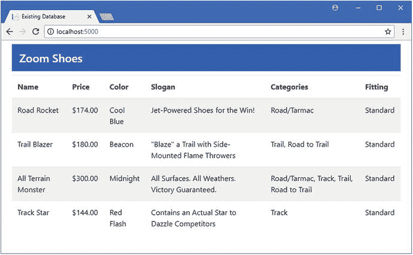
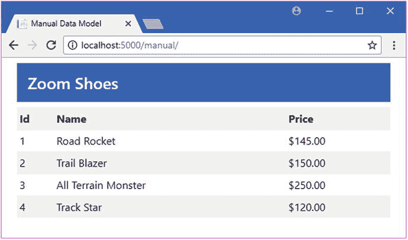
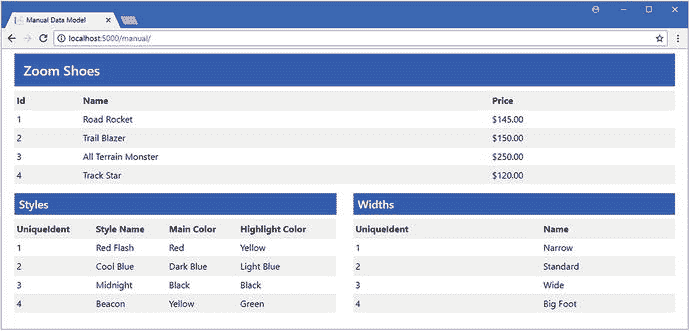
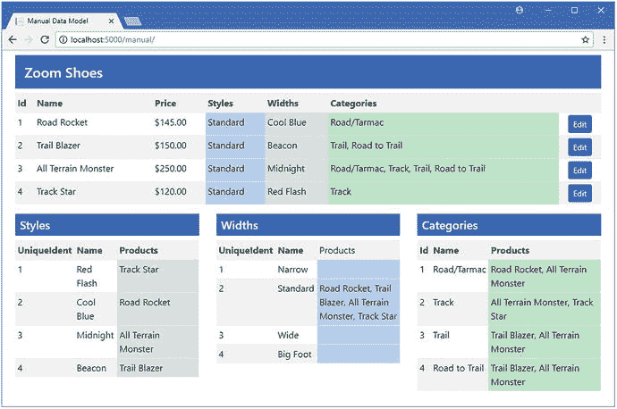
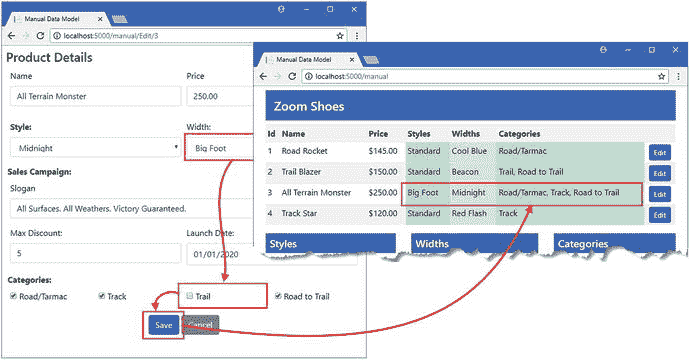

# 十八、手动建模数据库

在第 [17](17.html) 章中，我使用了搭建过程来为一个现有的数据库自动创建一个数据模型。搭建过程很方便，但是它没有提供太多的细粒度控制，结果可能很难使用。在本章中，我将向您展示如何手动建模数据库。这个过程需要做更多的工作，但是会产生一个数据模型，当数据库发生变化时，这个数据模型使用起来更自然，也更容易管理。表 [18-1](#Tab1) 将这一章放在上下文中。

表 18-1。

Putting Manual Database Modeling in Context

<colgroup><col> <col></colgroup> 
| 问题 | 回答 |
| --- | --- |
| 这是什么？ | 手动建模在不使用脚手架的情况下为数据库创建数据模型。 |
| 为什么有用？ | 支架特性并不总是能够处理大型复杂的数据库。 |
| 如何使用？ | Fluent API 用于在上下文类中配置数据模型。 |
| 有什么陷阱或限制吗？ | 如果只对数据库的一部分进行建模，则必须确保不依赖于所排除的部分。 |
| 有其他选择吗？ | 唯一的选择是使用脚手架视图。 |

表 [18-2](#Tab2) 总结了本章内容。

表 18-2。

Chapter Summary

<colgroup><col> <col> <col></colgroup> 
| 问题 | 解决办法 | 列表 |
| --- | --- | --- |
| 手动建模数据库 | 创建一个上下文类，并使用 Fluent API 来配置数据模型 | 1–11, 19–32 |
| 手动建立关系模型 | 使用属性或流畅的 API 语句定义导航属性并配置关系 | 12–18 |

## 为本章做准备

本章使用在第 [17](17.html) 章中创建的现有数据库项目，并依赖于在该章中创建的数据库。如果你已经直接跳到这一章，你将需要按照第 [17](17.html) 章开始概述的步骤来创建本章中的例子所依赖的数据库。

Tip

您可以下载该项目，其中包含创建数据库所需的 SQL 语句文件，作为本书免费源代码下载的一部分，可在 [`https://github.com/apress/pro-ef-core-2-for-asp.net-core-mvc`](https://github.com/apress/pro-ef-core-2-for-asp.net-core-mvc) 获得。

为确保数据库已创建并包含预期数据，使用`dotnet run`启动应用并导航至`http://localhost:5000`，这将产生如图 [18-1](#Fig1) 所示的结果。



图 18-1。

Running the example application

## 创建手动数据模型

在开始对现有数据库建模之前，您必须理解它的模式，并知道 ASP.NET Core MVC 应用需要数据库的哪些部分。如果没有向您提供数据库及其设计的详细描述，运行第 [18](18.html) 章中描述的搭建过程可能是一个有用的起点，即使您在手动构建模型时仅使用搭建数据模型作为参考。

### 创建上下文和实体类

手动创建数据模型的起点是创建一个上下文类。我创建了一个`Models/Manual`文件夹，并在其中添加了一个名为`ManualContext.cs`的类文件，我用它来定义清单 [18-1](#Par8) 中所示的类。

```cs
using Microsoft.EntityFrameworkCore;

namespace ExistingDb.Models.Manual {

    public class ManualContext : DbContext {

        public ManualContext(DbContextOptions<ManualContext> options)
            : base(options) { }

        public DbSet<Shoe> Shoes { get; set; }
    }
}

Listing 18-1.The Contents of the ManualContext.cs File in the Models/Manual Folder

```

`ManualContext`类从`DbContext`派生而来，有一个构造函数接收传递给超类构造函数的配置对象，并定义一个名为`Shoes`的`DbSet<T>`属性，提供对`Shoe`对象集合的访问。如果这看起来很熟悉，那是因为只要遵循前面几章中使用的约定，就可以很容易地对数据库进行建模。为了定义上下文使用的`Shoe`类，我在`Models/Manual`文件夹中添加了一个名为`Shoe.cs`的类文件，并添加了清单 [18-2](#Par10) 中所示的代码。

```cs
namespace ExistingDb.Models.Manual {

    public class Shoe {
        public long Id { get; set; }
        public string Name { get; set; }
        public decimal Price { get; set; }
    }
}

Listing 18-2.The Contents of the Shoe.cs File in the Models/Manual Folder

```

`Shoe`类包含了`Shoes`表中一些列的属性，尽管我还没有创建导航属性。为了使新的上下文可供应用的其余部分使用，我创建了清单 [18-3](#Par12) 中所示的服务。

```cs
using System;
using System.Collections.Generic;
using System.Linq;
using System.Threading.Tasks;
using Microsoft.AspNetCore.Builder;
using Microsoft.AspNetCore.Hosting;
using Microsoft.AspNetCore.Http;
using Microsoft.Extensions.DependencyInjection;
using Microsoft.Extensions.Configuration;
using ExistingDb.Models.Scaffold;
using Microsoft.EntityFrameworkCore;

using ExistingDb.Models.Manual;

namespace ExistingDb {
    public class Startup {

        public Startup(IConfiguration config) => Configuration = config;

        public IConfiguration Configuration { get; }

        public void ConfigureServices(IServiceCollection services) {
            services.AddMvc();
            string conString = Configuration["ConnectionStrings:DefaultConnection"];

            services.AddDbContext<ScaffoldContext>(options =>
                options.UseSqlServer(conString));

            services.AddDbContext<ManualContext>(options =>
                options.UseSqlServer(conString));
        }

        public void Configure(IApplicationBuilder app, IHostingEnvironment env) {
            app.UseDeveloperExceptionPage();
            app.UseStatusCodePages();
            app.UseStaticFiles();
            app.UseMvcWithDefaultRoute();        
        }
    }
}

Listing 18-3.Creating a Service in the Startup.cs File in the ExistingDb Folder

```

新的上下文使用与搭建过程创建的上下文相同的连接字符串，因为两者都连接到同一个数据库。

### 创建控制器和视图

为了测试初始数据模型，我在`Controllers`文件夹中创建了一个名为`ManualController.cs`的类文件，并添加了清单 [18-4](#Par15) 中所示的代码。

```cs
using ExistingDb.Models.Manual;
using Microsoft.AspNetCore.Mvc;

namespace ExistingDb.Controllers {

    public class ManualController : Controller {
        private ManualContext context;

        public ManualController(ManualContext ctx) => context = ctx;

        public IActionResult Index() => View(context.Shoes);
    }
}

Listing 18-4.The Contents of the ManualController.cs File in the Controllers Folder

```

`Index`动作将上下文的`Shoes`属性返回的`DbSet<Shoe>`对象传递给默认视图。为了给动作提供视图，我创建了`Views/Manual`文件夹，并在其中添加了一个名为`Index.cshtml`的视图，其内容如清单 [18-5](#Par17) 所示。

```cs
@using ExistingDb.Models.Manual
@model IEnumerable<Shoe>
@{
    ViewData["Title"] = "Manual Data Model";
    Layout = "_Layout";
}

<div class="container-fluid">
    <h4 class="bg-primary p-3 text-white">Zoom Shoes</h4>
    <table class="table table-striped table-sm">
        <tr><th>Id</th><th>Name</th><th>Price</th></tr>
        @foreach (Shoe s in Model) {
            <tr>
                <td>@s.Id</td>
                <td>@s.Name</td>
                <td>$@s.Price.ToString("F2")</td>
            </tr>
        }
    </table>
</div>

Listing 18-5.The Contents of the Index.cshtml File in the Views/Manual Folder

```

该视图显示一个表格，其中包含从动作方法接收的序列中每个`Shoe`对象的`Id`、`Name`和`Price`值。为了测试手动数据模型，使用`dotnet run`启动应用并导航到`http://localhost:5000/manual`，这将产生如图 [18-2](#Fig2) 所示的结果。



图 18-2。

Testing the manual data model

### 理解基本的数据模型约定

正如上一节所展示的，如果您能够遵循 Entity Framework Core 所期望的约定，那么手动创建数据模型是很容易的。即使在一个简单的数据模型中，比如我在上一节中创建的模型，我也依赖于几个约定来从数据库中获取数据。我将在适当的时候解释每一个，但是我将集中在这些最基本的约定上:

*   上下文类中属性的名称对应于数据库表的名称，因此上下文类中的`Shoes`属性对应于数据库中的`Shoes`表。(如果没有上下文类属性，并且数据是通过`Set<T>`方法访问的，那么实体类的名称被用作表名。)
*   实体类中属性的名称对应于数据库表中列的名称，因此`Id`、`Name`和`Price`属性将用于表示`Shoes`表中`Id`、`Name`和`Price`列中的值。
*   主键将由名为`Id`或`<Type>Id`的属性表示，因此`Shoe`类的主键将是名为`Id`或`ShoeId`的属性。

这些是您在前面的章节中已经熟悉的惯例，在这些章节中，迁移被用来从上下文和实体类创建数据库。Entity Framework Core 在处理现有数据库时使用相同的约定，这意味着可以在不需要任何显式配置的情况下建立对象和数据库之间的映射。

### 覆盖数据模型约定

当数据库的设计符合您在应用中的需求时，实体框架核心约定是很方便的。但是这种情况很少发生，尤其是当您试图将现有的数据库集成到项目中时。Entity Framework Core 提供了两种不同的方法来覆盖约定，以便创建适合项目的 ASP.NET Core MVC 部分的数据模型，同时仍然提供对数据库中数据的访问:属性和 Fluent API。属性易于使用，但不提供对实体框架核心特性的全面访问。Fluent API 更复杂，但对如何将数据模型映射到数据库提供了更好的控制。我将在接下来的小节中介绍这两种方法，并演示如何使用它们来覆盖前面描述的三个基本约定。

#### 使用属性覆盖数据模型约定

可以使用表 [18-3](#Tab3) 中描述的属性覆盖基本数据模型约定，这些属性应用于实体模型类。

表 18-3。

The Attributes for Overriding the Basic Data Model Conventions

<colgroup><col> <col></colgroup> 
| 名字 | 描述 |
| --- | --- |
| `Table` | 此属性指定数据库表并覆盖上下文类中的属性名称。 |
| `Column` | 此属性指定为其应用到的属性提供值的列。 |
| `Key` | 此属性用于标识将被分配主键值的属性。 |

我在`Models/Manual`文件夹中添加了一个名为`Style.cs`的文件，并用它来定义清单 [18-6](#Par27) 中所示的类，以演示这些属性是如何工作的。

```cs
using System.ComponentModel.DataAnnotations;
using System.ComponentModel.DataAnnotations.Schema;

namespace ExistingDb.Models.Manual {

    [Table("Colors")]
    public class Style {

        [Key]
        [Column("Id")]
        public long UniqueIdent  { get; set; }

        [Column("Name")]
        public string StyleName { get; set; }

        public string MainColor { get; set; }
        public string HighlightColor { get; set; }
    }
}

Listing 18-6.The Contents of the Style.cs File in the Models/Manual Folder

```

`Table`属性告诉实体框架核心，这个类的数据源是`Colors`表。我使用了`Key`属性来指定`UniqueIdent`属性应该用于主键值，同时使用了`Column`属性来确保`Id`列将被用作这些值的源。我使用了`Column`属性来告诉实体框架核心,`StyleName`属性的值应该从`Name`列中赋值。

您只需要为您需要的更改应用属性，这允许我依赖于`MainColor`和`HighlightColor`属性的约定，它们将被赋予来自相同名称的列的值。为了完成这个例子，我向上下文类添加了一个属性，使得访问数据更加方便，如清单 [18-7](#Par30) 所示。

```cs
using Microsoft.EntityFrameworkCore;

namespace ExistingDb.Models.Manual {

    public class ManualContext : DbContext {

        public ManualContext(DbContextOptions<ManualContext> options)
            : base(options) { }

        public DbSet<Shoe> Shoes { get; set; }

        public DbSet<Style> ShoeStyles { get; set; }
    }
}

Listing 18-7.Adding a Convenience Property in the ManualContext.cs File in the Models/Manual Folder

```

在介绍了 Fluent API 之后，我将在下一节中使用该属性来访问数据。

Choosing Between Attributes and the Fluent API

可以使用属性或 Fluent API 覆盖基本的数据模型约定，因此您可以选择最自然的方法。一些开发人员更喜欢用属性来注释类，因为这更符合 ASP.NET Core MVC 特性的工作方式，比如验证和授权。其他开发人员更喜欢在 context 类中描述数据模型，以便可以在一个地方看到和理解常规约定的所有更改。

有些高级功能只能通过 Fluent API 使用。如果您需要使用这些特性来建模数据库，那么您别无选择，只能使用 Fluent API 来完成，即使您更喜欢使用属性。也就是说，正如本章所演示的，您可以混合和匹配属性和 Fluent API 来创建数据模型，这意味着如果您愿意，您可以将属性用于它们支持的特性。如果是这样，请记住，Fluent API 语句优先于属性，如果您使用 Fluent API 覆盖相同的约定，属性将被悄悄忽略。

#### 使用 Fluent API 覆盖模型约定

Fluent API 用于通过以编程方式描述数据模型的各个部分来覆盖数据模型约定。属性适合于进行简单的更改，但最终您将不得不处理没有合适属性的情况，这需要一个只有 Fluent API 支持的高级特性。

Note

在这一章中，我将使用 Fluent API 对一个现有的数据库进行建模，但是它也可以用于在代码优先的应用中对迁移进行微调，如第 3 部分所示。

为了展示前一节中使用属性的等价例子，我在`Models/Manual`文件夹中添加了一个名为`ShoeWidth.cs`的文件，并用它来定义清单 [18-8](#Par37) 中所示的类。

```cs
namespace ExistingDb.Models.Manual {

    public class ShoeWidth {

        public long UniqueIdent { get; set; }

        public string WidthName { get; set; }
    }
}

Listing 18-8.The Contents of the ShoeWidth.cs File in the Models/Manual Folder

```

我将使用`ShoeWidth`类来表示`Fittings`表中的数据。该类没有遵循实体框架核心约定:类名与数据库表名不匹配，我想对`Id`和`Name`列使用`UniqueIdent`和`WidthName`属性。

不是修改实体类，而是通过覆盖`OnModelCreating`方法在上下文类中应用 Fluent API，如清单 [18-9](#Par40) 所示。

```cs
using Microsoft.EntityFrameworkCore;

namespace ExistingDb.Models.Manual {

    public class ManualContext : DbContext {

        public ManualContext(DbContextOptions<ManualContext> options)
            : base(options) { }

        public DbSet<Shoe> Shoes { get; set; }

        public DbSet<Style> ShoeStyles { get; set; }

        public DbSet<ShoeWidth> ShoeWidths { get; set; }

        protected override void OnModelCreating(ModelBuilder modelBuilder) {

            modelBuilder.Entity<ShoeWidth>().ToTable("Fittings");
            modelBuilder.Entity<ShoeWidth>().HasKey( t => t.UniqueIdent);
            modelBuilder.Entity<ShoeWidth>()
                .Property(t => t.UniqueIdent)
                .HasColumnName("Id");

            modelBuilder.Entity<ShoeWidth>()
                .Property(t => t.WidthName)
                .HasColumnName("Name");
        }
    }
}

Listing 18-9.Using the Fluent API in the ManualContext.cs File in the Models/Manual Folder

```

`OnModelCreating`方法接收一个`ModelBuilder`对象，在这个对象上使用了 Fluent API。由`ModelBuilder`类定义的最重要的方法是`Entity<T>`，它允许一个实体类被描述到实体框架核心，并且覆盖了原本会被使用的约定。

`Entity<T>`方法返回一个`EntityTypeBuilder<T>`对象，该对象定义了一系列用于向实体框架核心描述数据模型的方法。表 [18-4](#Tab4) 描述了清单 [18-9](#Par40) 中使用的`EntityTypeBuilder<T>`方法。

Tip

选择实体类属性的 Fluent API 方法，如表 [18-4](#Tab4) 中描述的`HasKey`和`Property`方法，被重载，以便属性可以被指定为字符串或使用 lambda 表达式。Lambda 表达式避免了只有在应用运行时才会导致错误的打字错误，所以这些是我在本书中使用的方法。

表 18-4。

The EntityTypeBuilder<T> Methods Used in Listing [18-9](#Par40)

<colgroup><col> <col></colgroup> 
| 名字 | 描述 |
| --- | --- |
| `ToTable(table)` | 该方法用于指定实体类的表，相当于`Table`属性。 |
| `HasKey(selector)` | 该方法用于指定实体类的 key 属性，相当于`Key`属性。该参数是选择键属性的 lambda 表达式。 |
| `Property(selector)` | 此方法用于选择属性，以便对其进行更详细的描述，如下文所述。 |

`ToTable`和`HasKey`方法单独用于指定数据库表和`ShoeWidth`类的主键属性。`Property`方法用于选择进一步配置的属性，并返回一个`PropertyBuilder<T>`对象，其中`T`是所选属性返回的类型。`PropertyBuilder<T>`类定义了许多方法，用于提供对属性的细粒度控制，我将在本章和后续章节中描述这些方法。我在清单 [18-9](#Par40) 中使用的`PropertyBuilder<T>`方法是`HasColumnName`方法，用于选择将为所选属性提供值的数据库表列，该方法在表 [18-5](#Tab5) 中有所描述，以供快速参考。

表 18-5。

The PropertyBuilder<T> Method Used in Listing [18-9](#Par40)

<colgroup><col> <col></colgroup> 
| 名字 | 描述 |
| --- | --- |
| `HasColumnName(name)` | 该方法用于选择将为所选属性提供值的列，相当于使用`Column`属性。 |

#### 使用定制的数据模型

无论您使用属性还是 Fluent API，一旦您覆盖了创建应用所需的数据模型的约定，您就可以像平常一样使用上下文类和实体类了。为了完成这一部分，我向`Manual`控制器的`Index`动作添加了语句，这些语句使用`ViewBag`将`ShoeStyle`和`ShoeWidth`对象传递给默认视图，如清单 [18-10](#Par46) 所示。

```cs
using ExistingDb.Models.Manual;
using Microsoft.AspNetCore.Mvc;

namespace ExistingDb.Controllers {

    public class ManualController : Controller {
        private ManualContext context;

        public ManualController(ManualContext ctx) => context = ctx;

        public IActionResult Index() {
            ViewBag.Styles = context.ShoeStyles;
            ViewBag.Widths = context.ShoeWidths;
            return View(context.Shoes);
        }
    }
}

Listing 18-10.Using the Customized Model in the ManualController.cs File in the Controllers Folder

```

为了向用户显示数据，我将清单 [18-11](#Par48) 中显示的内容添加到了`Views/Manual`文件夹的`Index.cshtml`视图中。

```cs
@using ExistingDb.Models.Manual
@model IEnumerable<Shoe>
@{
    ViewData["Title"] = "Manual Data Model";
    Layout = "_Layout";
}

<div class="container-fluid">
    <h4 class="bg-primary p-3 text-white">Zoom Shoes</h4>
    <table class="table table-striped table-sm">
        <tr><th>Id</th><th>Name</th><th>Price</th></tr>
        @foreach (Shoe s in Model) {
            <tr>
                <td>@s.Id</td>
                <td>@s.Name</td>
                <td>$@s.Price.ToString("F2")</td>
            </tr>
        }
    </table>
    <div class="row">
        <div class="col">
            <h5 class="bg-primary p-2 text-white">Styles</h5>
            <table class="table table-striped table-sm">
                <tr>
                    <th>UniqueIdent</th><th>Style Name</th>
                    <th>Main Color</th><th>Highlight Color</th>
                </tr>
                @foreach (Style s in ViewBag.Styles) {
                    <tr>
                        <td>@s.UniqueIdent</td>
                        <td>@s.StyleName</td>
                        <td>@s.MainColor</td>
                        <td>@s.HighlightColor</td>
                    </tr>
                }
            </table>
        </div>
        <div class="col">
            <h5 class="bg-primary p-2 text-white">Widths</h5>
            <table class="table table-striped table-sm">
                <tr><th>UniqueIdent</th><th>Name</th></tr>
                @foreach (ShoeWidth s in ViewBag.Widths) {
                    <tr><td>@s.UniqueIdent</td><td>@s.WidthName</td></tr>
                }
            </table>
        </div>
    </div>
</div>

Listing 18-11.Displaying Additional Data in the Index.cshtml File in the Views/Manual Folder

```

为了测试覆盖数据模型约定的两种技术，使用`dotnet run`启动应用并导航到`http://localhost:5000/manual`。在启动过程中，实体框架核心将在构建数据模型时使用属性和 Fluent API 语句，以便 action 方法进行的查询无缝映射到数据库中，产生如图 [18-3](#Fig3) 所示的结果。



图 18-3。

Overriding the data model Responding to Database Changes

您必须确保在对数据库进行更改时更新您的数据模型。没有自动更新过程，例如当使用第 [17](17.html) 章中描述的脚手架功能时。

如果不正确地更新数据模型，将会在实体框架核心和数据库之间产生不匹配。这种问题直到运行时才会变得明显，并可能导致仅在特定操作或特定数据值中出现的微妙问题。

确保您了解数据库更改将对应用产生的影响，并遵守一个测试制度，以最大限度地减少错误进入生产系统的机会。

### 建模关系

虽然我设置了三个类来表示数据库中的数据，但是每个类都是独立存在的，必须单独查询。定义类之间的关系意味着添加导航和外键属性，遵循用于代码优先开发的相同约定。清单 [18-12](#Par54) 展示了对`Shoes`类的更改，添加了导航和外键属性，模拟数据库中`Shoes`和`Colors`表之间一对多关系的一方。

```cs
namespace ExistingDb.Models.Manual {

    public class Shoe {
        public long Id { get; set; }
        public string Name { get; set; }
        public decimal Price { get; set; }

        public long ColorId { get; set; }
        public Style Color { get; set; }
    }
}

Listing 18-12.Adding Properties in the Shoes.cs File in the Models/Manual Folder

```

在对现有数据库建模时，最重要的属性是映射到数据库表中用于存储依赖实体的外键列的属性，在本例中是`Shoe`类。导航属性名称的约定是从外键属性中删除列名，这样存储在`ColorId`属性中的关系的导航属性将是`Color`。注意，`Color`属性返回的类型是`Style`；Entity Framework Core 一致地应用应用于数据模型的更改，这意味着用于将`Style`类指定为`Colors`表中数据的表示的属性即使在定义关系时也会继续。

为了完成这个关系，我向`Style`类添加了反向导航属性，如清单 [18-13](#Par57) 所示。

```cs
using System.ComponentModel.DataAnnotations;
using System.ComponentModel.DataAnnotations.Schema;

using System.Collections.Generic;

namespace ExistingDb.Models.Manual {

    [Table("Colors")]
    public class Style {

        [Key]
        [Column("Id")]
        public long UniqueIdent  { get; set; }

        [Column("Name")]
        public string StyleName { get; set; }

        public string MainColor { get; set; }
        public string HighlightColor { get; set; }

        public IEnumerable<Shoe> Shoes { get; set; }
    }
}

Listing 18-13.Completing the Relationship in the Style.cs File in the Models/Manual Folder

```

#### 使用属性覆盖关系约定

清单 [18-12](#Par54) 中定义的关系通过已经应用于模型的变更揭示了数据库的底层结构，结果是您跟随一个名为`Color`的属性得到一个`Style`对象。

覆盖数据模型约定的一个缺点是，一旦开始，就需要一直进行修改，包括确保导航和外键属性的名称与您所做的其他修改保持一致。在清单 [18-14](#Par60) 中，我使用了属性来覆盖`Shoe`类中外键和导航属性的默认关系约定。

```cs
using System.ComponentModel.DataAnnotations.Schema;

namespace ExistingDb.Models.Manual {

    public class Shoe {
        public long Id { get; set; }
        public string Name { get; set; }
        public decimal Price { get; set; }

        [Column("ColorId")]
        public long StyleId { get; set; }

        [ForeignKey("StyleId")]
        public Style Style { get; set; }
    }
}

Listing 18-14.Overriding Conventions in the Shoe.cs File in the Models/Manual Folder

```

需要两个属性来创建与数据模型的其余部分一致的属性关系。`Column`属性告诉实体框架核心`StyleId`属性应该映射到`ColorId`列，而`ForeignKey`属性用于指定`StyleId`属性是`Style`导航属性的外键属性。总之，这些属性允许名称与数据模型的其余部分一致的属性来表达关系，而不需要公开底层数据库结构的细节。

我添加到清单 [18-14](#Par60) 中的`Styles`类的属性不需要属性，因为它遵循常规的关系争用，实体框架核心会将其识别为`Shoe`类的反向导航属性。但是，如果您不能使用这种类型属性的常规名称，那么您可以使用`InverseProperty`属性来告诉实体框架核心该属性与哪个类相关，如清单 [18-15](#Par63) 所示。

```cs
using System.ComponentModel.DataAnnotations;
using System.ComponentModel.DataAnnotations.Schema;

using System.Collections.Generic;

namespace ExistingDb.Models.Manual {

    [Table("Colors")]
    public class Style {

        [Key]
        [Column("Id")]
        public long UniqueIdent  { get; set; }

        [Column("Name")]
        public string StyleName { get; set; }

        public string MainColor { get; set; }
        public string HighlightColor { get; set; }

        [InverseProperty(nameof(Shoe.Style))]
        public IEnumerable<Shoe> Products { get; set; }
    }
}

Listing 18-15.Identifying an Inverse Navigation Property in the Styles.cs File in the Models/Manual Folder

```

属性的参数是关系中另一个属性的名称，它可以被指定为一个字符串或者使用函数来避免输入错误。在清单中，`InverseProperty`属性允许我将逆属性的名称改为`Products`。

为了将来的快速参考，表 [18-6](#Tab6) 描述了用于覆盖本节中关系约定的属性。(表 [18-3](#Tab3) 中描述了`Column`属性。)

表 18-6。

The Attributes Used to Override Relationship Conventions

<colgroup><col> <col></colgroup> 
| 名字 | 描述 |
| --- | --- |
| `ForeignKey(property)` | 此属性用于标识导航属性的外键属性。 |
| `InverseProperty(name)` | 此属性用于指定关系另一端的属性的名称。 |

#### 使用 Fluent API 覆盖关系约定

如果您更喜欢使用 Fluent API，那么您可以使用`Entity<T>`方法选择一个实体类，然后使用`Property`方法，这允许您选择和配置单个属性。为了展示如何使用 Fluent API 来描述关系，在清单 [18-16](#Par67) 中，我向`Shoe`类添加了一个外键和导航属性，以创建与`ShoeWidth`类的关系，该类表示来自`Fittings`数据库表的数据。

```cs
using System.ComponentModel.DataAnnotations.Schema;

namespace ExistingDb.Models.Manual {

    public class Shoe {
        public long Id { get; set; }
        public string Name { get; set; }
        public decimal Price { get; set; }

        [Column("ColorId")]
        public long StyleId { get; set; }

        [ForeignKey("StyleId")]
        public Style Style { get; set; }

        public long WidthId { get; set; }
        public ShoeWidth Width { get; set;  }
    }
}

Listing 18-16.Defining Properties in the Shoe.cs File in the Models/Manual Folder

```

为了完成这个关系，我将清单 [18-17](#Par69) 中所示的反向导航属性添加到了`ShoeWidth`类中。

```cs
using System.Collections.Generic;

namespace ExistingDb.Models.Manual {

    public class ShoeWidth {

        public long UniqueIdent { get; set; }

        public string WidthName { get; set; }

        public IEnumerable<Shoe> Products { get; set; }
    }
}

Listing 18-17.Adding a Navigation Property in the ShoeWidth.cs File in the Models/Manual Folder

```

这些属性不遵循关系约定，也没有用属性修饰，这意味着实体框架核心不能确定它们的用途。为了描述这些属性在数据模型中的作用，我将清单 [18-18](#Par71) 中所示的语句添加到了`ManualContext`类的`OnModelCreating`方法中。

```cs
using Microsoft.EntityFrameworkCore;

namespace ExistingDb.Models.Manual {

    public class ManualContext : DbContext {

        public ManualContext(DbContextOptions<ManualContext> options)
            : base(options) { }

        public DbSet<Shoe> Shoes { get; set; }

        public DbSet<Style> ShoeStyles { get; set; }

        public DbSet<ShoeWidth> ShoeWidths { get; set; }

        protected override void OnModelCreating(ModelBuilder modelBuilder) {

            modelBuilder.Entity<ShoeWidth>().ToTable("Fittings");
            modelBuilder.Entity<ShoeWidth>().HasKey( t => t.UniqueIdent);
            modelBuilder.Entity<ShoeWidth>()
                .Property(t => t.UniqueIdent)
                .HasColumnName("Id");

            modelBuilder.Entity<ShoeWidth>()
                .Property(t => t.WidthName)
                .HasColumnName("Name");

            modelBuilder.Entity<Shoe>()
                .Property(s => s.WidthId).HasColumnName("FittingId");

            modelBuilder.Entity<Shoe>()
                .HasOne(s => s.Width).WithMany(w => w.Products)
                .HasForeignKey(s => s.WidthId).IsRequired(true);
        }
    }
}

Listing 18-18.Overriding Conventions in the ManualContext.cs File in the Models/Manual Folder

```

需要两条配置语句来配置清单 [18-17](#Par69) 和清单 [18-18](#Par71) 中定义的属性，以表示`Shoes`和`Fittings`表之间的关系。第一条语句使用了与上一节相同的方法，它告诉实体框架核心应该从`FittingId`列中读取`Shoe.WidthId`属性的值。第二条语句使用了 Fluent API 专门提供的用于描述关系的方法，如表 [18-7](#Tab7) 中所述。

表 18-7。

The EntityBuilder<T> Methods for Describing Relationships

<colgroup><col> <col></colgroup> 
| 名字 | 描述 |
| --- | --- |
| `HasOne(property)` | 此方法用于开始描述一种关系，其中选定的实体类与另一种类型的单个对象有关系。该参数通过名称或使用 lambda 表达式来选择导航属性。 |
| `HasMany(property)` | 此方法用于开始描述一种关系，其中选定的实体类与另一种类型的许多对象有关系。该参数通过名称或使用 lambda 表达式来选择导航属性。 |

您从表中显示的方法之一开始，并使用表 [18-8](#Tab8) 中描述的方法之一描述关系的另一端，这告诉实体框架核心这是一对一还是一对多关系。

表 18-8。

The Fluent API Methods for Completing the Description of a Relationship

<colgroup><col> <col></colgroup> 
| 名字 | 描述 |
| --- | --- |
| `WithMany(property)` | 此方法用于在一对多关系中选择反向导航属性。 |
| `WithOne(property)` | 此方法用于选择一对一关系中的反向导航属性。 |

一旦为关系的两端选择了导航属性，就可以通过将调用链接到表 [18-9](#Tab9) 中描述的方法来配置关系。

表 18-9。

The Fluent API Relationship Configuration Methods

<colgroup><col> <col></colgroup> 
| 名字 | 描述 |
| --- | --- |
| `HasForeignKey(property)` | 此方法用于选择关系的外键属性。 |
| `IsRequired(required)` | 此方法用于指定关系是必需的还是可选的。 |

我在清单 [18-18](#Par71) 中使用的方法组合告诉实体框架核心,`Shoe`类是与`ShoeWidth`类有一对多关系的依赖实体，而`WidthId`属性是外键属性。结合将`WidthId`属性映射到数据库中外键列的语句，Entity Framework Core 拥有了理解关系以及实体类如何映射到数据库表所需的所有信息。

### 完成数据模型

为了完成数据模型，我需要定义类来表示`SalesCampaigns`和`Categories`表，并描述它们之间的关系。我在`Models/Manual`文件夹中添加了一个名为`SalesCampaign.cs`的文件，并用它来定义清单 [18-19](#Par78) 中所示的类。

```cs
using System;
using System.ComponentModel.DataAnnotations.Schema;

namespace ExistingDb.Models.Manual {

    [Table("SalesCampaigns")]
    public class SalesCampaign {

        public long Id { get; set; }
        public string Slogan { get; set; }
        public int? MaxDiscount { get; set; }
        public DateTime? LaunchDate { get; set; }

        public long ShoeId { get; set; }
        public Shoe Shoe { get; set; }
    }
}

Listing 18-19.The Contents of the SalesCampaign.cs File in the Models/Manual Folder

```

我使用了`Table`属性来指定将用于创建`SalesCampaign`对象的表，这允许我在数据模型中保持类名的一致性。由`SalesCampaign`类定义的属性直接映射到数据库表中的列，除了`Shoe`属性，它是与`Shoe`类一对一关系的导航属性。

`Categories`表有多对多的关系，这意味着我需要定义实体和连接类。对于实体，我在`Models/Manual`文件夹中创建了一个名为`Category.cs`的文件，并用它来定义清单 [18-20](#Par81) 中所示的类。

```cs
using System.Collections.Generic;

namespace ExistingDb.Models.Manual {

    public class Category {
        public long Id { get; set; }
        public string Name { get; set; }

        public IEnumerable<ShoeCategoryJunction> Shoes { get; set; }
    }
}

Listing 18-20.The Contents of the Category.cs File in the Models/Manual Folder

```

为了表示这个关系所需的连接，我在`Models/Manual`文件夹中创建了一个名为`ShoeCategoryJunction.cs`的类文件，并定义了清单 [18-21](#Par83) 中所示的类。

```cs
namespace ExistingDb.Models.Manual {

    public class ShoeCategoryJunction {

        public long Id { get; set; }
        public long ShoeId { get; set; }
        public long CategoryId { get; set; }

        public Category Category { get; set; }
        public Shoe Shoe { get; set; }
    }
}

Listing 18-21.The Contents of the ShoeCategoryJunction.cs File in the Models/Manual Folder

```

该类定义了与数据库中连接表中的列相对应的属性，以及使用数据模型中类名的导航属性，这些属性用于代替传统的名称。类名与数据库中连接表的名称相同。由于 junction 类符合所有的约定，因此不需要属性或流畅的 API 语句来配置该类或其关系。

在清单 [18-22](#Par86) 中，我添加了清单 [18-21](#Par83) 中的`SalesCampaign`类和与`Category`类的关系的连接类所需的导航属性。

```cs
using System.ComponentModel.DataAnnotations.Schema;

using System.Collections.Generic;

namespace ExistingDb.Models.Manual {

    public class Shoe {
        public long Id { get; set; }
        public string Name { get; set; }
        public decimal Price { get; set; }

        [Column("ColorId")]
        public long StyleId { get; set; }

        [ForeignKey("StyleId")]
        public Style Style { get; set; }

        public long WidthId { get; set; }
        public ShoeWidth Width { get; set; }

        public SalesCampaign Campaign { get; set; }
        public IEnumerable<ShoeCategoryJunction> Categories { get; set; }
    }
}

Listing 18-22.Adding Navigation Properties to the Shoe.cs File in the Models/Manual Folder

```

为了提供对`Category`对象的方便访问，我向上下文类添加了一个`DbSet<T>`属性，如清单 [18-23](#Par88) 所示。

```cs
using Microsoft.EntityFrameworkCore;

namespace ExistingDb.Models.Manual {

    public class ManualContext : DbContext {

        public ManualContext(DbContextOptions<ManualContext> options)
            : base(options) { }

        public DbSet<Shoe> Shoes { get; set; }

        public DbSet<Style> ShoeStyles { get; set; }

        public DbSet<ShoeWidth> ShoeWidths { get; set; }

        public DbSet<Category> Categories { get; set; }

        protected override void OnModelCreating(ModelBuilder modelBuilder) {

            // ...statements omitted for brevity...
        }
    }
}

Listing 18-23.Configuring a Relationship in the ManualContext.cs File in the Models/Manual Folder

```

## 使用手动创建的数据模型

既然数据模型已经完成，我可以使用应用的 ASP.NET Core MVC 部分中的数据，并让实体框架核心处理将它映射到没有遵循约定的数据库。在接下来的小节中，我将演示查询和更新数据的过程。

### 在手动创建的数据模型中查询数据

我扩展了`Manual`控制器的`Index`动作中的查询，以包括所有可用的数据，并为每种数据类型添加了`ViewBag`属性，如清单 [18-24](#Par91) 所示，以演示对模型中所有关系的查询。

```cs
using ExistingDb.Models.Manual;
using Microsoft.AspNetCore.Mvc;

using Microsoft.EntityFrameworkCore;

namespace ExistingDb.Controllers {

    public class ManualController : Controller {
        private ManualContext context;

        public ManualController(ManualContext ctx) => context = ctx;

        public IActionResult Index() {
            ViewBag.Styles = context.ShoeStyles.Include(s => s.Products);
            ViewBag.Widths = context.ShoeWidths.Include(s => s.Products);
            ViewBag.Categories = context.Categories
                .Include(c => c.Shoes).ThenInclude(j => j.Shoe);
            return View(context.Shoes.Include(s => s.Style)
                .Include(s => s.Width).Include(s => s.Categories)
                    .ThenInclude(j => j.Category));
        }
    }
}

Listing 18-24.Querying for Additional Data in the ManualController.cs File in the Models/Manual Folder

```

为了向用户显示数据，我将清单 [18-25](#Par93) 中所示的元素添加到 action 方法使用的`Index`视图中。

```cs
@using ExistingDb.Models.Manual
@model IEnumerable<Shoe>
@{
    ViewData["Title"] = "Manual Data Model";
    Layout = "_Layout";
}

<div class="container-fluid">
    <h4 class="bg-primary p-3 text-white">Zoom Shoes</h4>
    <table class="table table-striped table-sm">
        <tr>
            <th>Id</th><th>Name</th><th>Price</th><th>Styles</th>
            <th>Widths</th><th>Categories</th><th></th>
        </tr>
        @foreach (Shoe s in Model) {
            <tr>
                <td>@s.Id</td>
                <td>@s.Name</td>
                <td>$@s.Price.ToString("F2")</td>
                <td class="table-primary">@s.Width?.WidthName</td>
                <td class="table-secondary">@s.Style?.StyleName</td>
                <td class="table-success">
                    @string.Join(", ", s.Categories.Select(c => c.Category.Name))
                </td>
                <td class="text-center">
                    <a asp-action="Edit" asp-route-id="@s.Id"
                            class="btn btn-sm btn-primary">Edit</a>
                </td>
            </tr>
        }
    </table>
    <div class="row">
        <div class="col">
            <h5 class="bg-primary p-2 text-white">Styles</h5>
            <table class="table table-striped table-sm">
                <tr><th>UniqueIdent</th><th>Name</th><th>Products</th></tr>
                @foreach (Style s in ViewBag.Styles) {
                    <tr>
                        <td>@s.UniqueIdent</td>
                        <td>@s.StyleName</td>
                        <td class="table-secondary">
                            @String.Join(", ", s.Products.Select(p => p.Name))
                        </td>
                    </tr>
                }
            </table>
        </div>
        <div class="col">
            <h5 class="bg-primary p-2 text-white">Widths</h5>
            <table class="table table-striped table-sm">
                <tr><th>UniqueIdent</th><th>Name</th><td>Products</td></tr>
                @foreach (ShoeWidth s in ViewBag.Widths) {
                    <tr>
                        <td>@s.UniqueIdent</td>
                        <td>@s.WidthName</td>
                        <td class="table-primary">
                            @String.Join(", ", s.Products.Select(p => p.Name))
                        </td>
                    </tr>
                }
            </table>
        </div>
        <div class="col">
            <h5 class="bg-primary p-2 text-white">Categories</h5>
            <table class="table table-striped table-sm">
                <tr><th>Id</th><th>Name</th><th>Products</th></tr>
                @foreach (Category c in ViewBag.Categories) {
                    <tr>
                        <td>@c.Id</td>
                        <td>@c.Name</td>
                        <td class="table-success">
                            @String.Join(", ", c.Shoes.Select(j => j.Shoe.Name))
                        </td>
                    </tr>
                }
            </table>
        </div>
    </div>
</div>

Listing 18-25.Displaying Data in the Index.cshtml File in the Views/Manual Folder

```

启动应用并导航至`http://localhost:5000/manual`以查看新内容，如图 [18-4](#Fig4) 所示。



图 18-4。

Using a manually created database

清单 [18-25](#Par93) 中增加的内容产生了一系列显示数据库中数据的表格，展示了使用手动创建的数据模型与搭建或用作迁移基础的数据模型的工作方式是一样的。Entity Framework Core 会自动处理与约定的任何偏差，您可以通过检查应用的输出来发现这一点。以下是用于获取图中显示的数据的查询之一；您可以看到与约定不同的类名和属性名是如何被转换成数据库中的表和列的:

```cs
...
SELECT [c.Shoes].[Id], [c.Shoes].[CategoryId], [c.Shoes].[ShoeId], [s.Shoe].[Id],
    [s.Shoe].[Name], [s.Shoe].[Price], [s.Shoe].[ColorId], [s.Shoe].[FittingId]
FROM [ShoeCategoryJunction] AS [c.Shoes]
INNER JOIN [Shoes] AS [s.Shoe] ON [c.Shoes].[ShoeId] = [s.Shoe].[Id]
INNER JOIN (
    SELECT [c0].[Id]
    FROM [Categories] AS [c0]
) AS [t] ON [c.Shoes].[CategoryId] = [t].[Id]
ORDER BY [t].[Id]
...

```

Caution

创建手动数据模型会在应用的 ASP.NET Core MVC 部分产生更自然的开发体验，但是只有当您准确地对数据库建模时，它才起作用。Entity Framework Core 不会验证您创建的模型是否准确描述了数据库，任何问题只有在应用尝试查询或更新数据库时才会变得明显。

### 更新手动创建的数据模型中的数据

我在清单 [18-25](#Par93) 的视图中添加了一个锚元素，它指向一个名为`Edit`的动作。在这一节中，我将实现 action 方法，以强调使用手动创建的数据库与搭建或用于创建迁移的数据库是一样的。在清单 [18-26](#Par99) 中，我向控制器添加了方法，允许用户开始编辑过程并更新现有的`Shoe`对象。

```cs
using ExistingDb.Models.Manual;
using Microsoft.AspNetCore.Mvc;
using Microsoft.EntityFrameworkCore;

using System.Linq;

using System.Collections.Generic;

namespace ExistingDb.Controllers {

    public class ManualController : Controller {
        private ManualContext context;

        public ManualController(ManualContext ctx) => context = ctx;

        public IActionResult Index() {
            ViewBag.Styles = context.ShoeStyles.Include(s => s.Products);
            ViewBag.Widths = context.ShoeWidths.Include(s => s.Products);
            ViewBag.Categories = context.Categories
                .Include(c => c.Shoes).ThenInclude(j => j.Shoe);
            return View(context.Shoes.Include(s => s.Style)
                .Include(s => s.Width).Include(s => s.Categories)
                    .ThenInclude(j => j.Category));
        }

        public IActionResult Edit(long id) {
            ViewBag.Styles = context.ShoeStyles;
            ViewBag.Widths = context.ShoeWidths;
            ViewBag.Categories = context.Categories;
            return View(context.Shoes.Include(s => s.Style)
                .Include(s => s.Campaign)
                .Include(s => s.Width).Include(s => s.Categories)
                .ThenInclude(j => j.Category).First(s => s.Id == id));
        }

        [HttpPost]
        public IActionResult Update(Shoe shoe, long[] newCategoryIds,
                ShoeCategoryJunction[] oldJunctions) {

            IEnumerable<ShoeCategoryJunction> unchangedJunctions
                = oldJunctions.Where(j => newCategoryIds.Contains(j.CategoryId));

            context.Set<ShoeCategoryJunction>()
                .RemoveRange(oldJunctions.Except(unchangedJunctions));

            shoe.Categories = newCategoryIds.Except(unchangedJunctions
                .Select(j => j.CategoryId))
                .Select(id => new ShoeCategoryJunction {
                     ShoeId = shoe.Id, CategoryId = id
                 }).ToList();

            context.Shoes.Update(shoe);
            context.SaveChanges();
            return RedirectToAction(nameof(Index));
        }
    }
}

Listing 18-26.Adding Actions in the ManualController.cs File in the Controllers Folder

```

`Edit`动作在数据库中查询单个对象及其所有相关数据，以便可以显示当前细节进行编辑。`ViewBag`用于向视图传递额外的数据，这样用户就可以看到更改相关数据的选项范围。

`Update`方法接收一个`Shoe`对象，该对象将由 ASP.NET Core MVC 模型绑定器从 HTTP 表单数据中创建，并用于更新数据库。`Update`方法还接收一个数组，该数组包含用户希望`Shoe`与之相关的`Category`对象的主键值，以及一个连接对象数组，我将确保该数组包含在 HTTP 请求数据中，这样我就不必查询数据库来确定哪些连接对象必须删除。

在第 [16](16.html) 章中，我向您展示了如何独立于多对多关系中的对象来更新该关系，这是通过在数据库中查询关系一端的对象及其相关数据来实现的，这为实体框架核心提供了足够的信息来更新连接表。

这种技术不适用于本章，因为我想同时更新`Shoe`对象和多对多关系，如果我在数据库中查询`Shoe`，那么当我使用由 MVC 模型绑定器创建的`Shoe`和`Update`方法时，实体框架核心变更跟踪特性将抛出一个异常。

为了执行更新，我通过将选择的类别与那些最初相关的类别进行比较来删除任何过时的关系，并通过将对象传递给`RemoveRange`方法来删除那些不需要的关系，如下所示:

```cs
...
IEnumerable<ShoeCategoryJunction> unchangedJunctions
    = oldJunctions.Where(j => newCategoryIds.Contains(j.CategoryId));

context.Set<ShoeCategoryJunction>()
    .RemoveRange(oldJunctions.Except(unchangedJunctions));
...

```

我没有为连接数据定义上下文属性，所以我通过使用`Set<T>`方法获取一个`DbSet<T>`对象来执行删除操作。为了避免创建重复的关系，我将原来的一组交叉点对象与用户选择的类别进行比较，确保我只创建新对象来填补空白，如下所示:

```cs
...
shoe.Categories = newCategoryIds.Except(unchangedJunctions.Select(j => j.CategoryId))
    .Select(id => new ShoeCategoryJunction {
        ShoeId = shoe.Id, CategoryId = id
    }).ToList();
...

```

我删除不想要的关系并创建新的关系，同时小心地在数据库中保留那些未更改的关系。这样，我就能够使用由 ASP.NET Core MVC 模型绑定器创建的对象来执行更新。

#### 创建局部视图

为了完成这个例子，我需要为每个对象创建一个局部视图，允许用户执行编辑。我首先在`Views/Manual`文件夹中添加一个名为`EditShoe.cshtml`的文件，然后添加清单 [18-27](#Par110) 中所示的内容。

```cs
@using ExistingDb.Models.Manual
@model Shoe

<input type="hidden" asp-for="Id" />
<h4>Product Details</h4>
<div class="p-1 m-1">
    <div class="form-row">
        <div class="form-group col">
            <label asp-for="Name" class="form-control-label"></label>
            <input asp-for="Name" class="form-control" />
        </div>
        <div class="form-group col">
            <label asp-for="Price" class="form-control-label"></label>
            <input asp-for="Price" class="form-control" />
        </div>
    </div>
</div>

Listing 18-27.The Contents of the EditShoe.cshtml File in the Views/Manual Folder

```

每个局部视图将只包含编辑呈现给用户的数据的一个方面所需的元素，在这种情况下，有两个`input`元素允许编辑一个`Shoe`对象的`Name`和`Price`属性。接下来，我在`Views/Manual`文件夹中添加了一个名为`EditStyle.cshtml`的文件，并添加了清单 [18-28](#Par112) 中所示的内容。

```cs
@using ExistingDb.Models.Manual
@model Shoe

<label><strong>Style:</strong></label>
<select asp-for="StyleId" class="form-control">
    @foreach (Style s in ViewBag.Styles) {
        if (s.UniqueIdent == Model.StyleId) {
            <option value="@s.UniqueIdent" selected>@s.StyleName</option>
        } else {
            <option value="@s.UniqueIdent">@s.StyleName</option>
        }
    }
</select>

Listing 18-28.The Contents of the EditStyle.cshtml File in the Views/Manual Folder

```

该局部视图显示一个`select`元素，用于选择与正在编辑的`Shoe`相关的`Style`对象。我对`ShoeWidth`对象采用了类似的方法，在`Views/Manual`文件夹中创建一个名为`EditWidth.cshtml`的文件，其内容如清单 [18-29](#Par114) 所示。

```cs
@using ExistingDb.Models.Manual
@model Shoe

<label>Width:</label>
<select asp-for="WidthId" class="form-control">
    @foreach (ShoeWidth w in ViewBag.Widths) {
        if (w.UniqueIdent == Model.WidthId) {
            <option value="@w.UniqueIdent" selected>@w.WidthName</option>
        } else {
            <option value="@w.UniqueIdent">@w.WidthName</option>
        }
    }
</select>

Listing 18-29.The Contents of the EditWidth.cshtml File in the Views/Manual Folder

```

与`SalesCampaign`类有一对一的关系，所以我选择向用户呈现`input`元素，通过在`Views/Manual`文件夹中创建一个名为`EditCampaign.cshtml`的文件并添加清单 [18-30](#Par116) 中所示的内容来更改属性值。

```cs
@using ExistingDb.Models.Manual
@model Shoe

<div class="form-row">
    <input type="hidden" asp-for="Campaign.Id" />
    <label><strong>Sales Campaign:</strong></label>
</div>
<div class="form-row">
    <div class="form-group col">
        <label asp-for="Campaign.Slogan" class="form-control-label"></label>
        <input asp-for="Campaign.Slogan" class="form-control" />
    </div>
</div>
<div class="form-row">
    <div class="form-group col">
        <label class="form-control-label">Max Discount:</label>
        <input asp-for="Campaign.MaxDiscount" class="form-control" />
    </div>
    <div class="form-group col">
        <label class="form-control-label">Launch Date:</label>
        <input type="date" asp-for="Campaign.LaunchDate" class="form-control" />
    </div>
</div>

Listing 18-30.The Contents of the EditCampaign.cshtml File in the Views/Manual Folder

```

最终的局部视图将允许用户选择正在编辑的`Shoe`对象与哪个`Category`对象相关。这是一个更复杂的视图，因为我已经包含了隐藏元素，ASP.NET Core MVC 模型绑定器将使用这些隐藏元素来创建我用来避免查询数据库以确定`Update`动作方法中的当前关系集的连接对象。我在`Views/Manual`文件夹中添加了一个名为`EditCategory.cshtml`的视图文件，并添加了清单 [18-31](#Par118) 中所示的内容。

```cs
@using ExistingDb.Models.Manual
@model Shoe

@{ int index = 0; }

@foreach (var junc in Model.Categories) {
    <input type="hidden" name="oldJunctions[@index].Id" value="@junc.Id" />
            <input type="hidden" name="oldJunctions[@index].CategoryId"
                   value="@junc.CategoryId" />
    index++;
}

@foreach (Category c in ViewBag.Categories) {
    <div class="form-group col">
        <label class="form-check-label">
            @if (c.Shoes?.Any(s => s.ShoeId == Model.Id) == true) {
                <input type="checkbox" name="newCategoryIds" value="@c.Id"
                       checked class="form-check-input" />
            } else {
                <input type="checkbox" name="newCategoryIds" value="@c.Id"
                       class="form-check-input" />
            }
            @c.Name
        </label>
    </div>
}

Listing 18-31.The Contents of the EditCategory.cshtml File in the Views/Manual Folder

```

带有`index`计数器的笨拙的`foreach`循环用于生成将被 ASP.NET Core MVC 模型绑定器正确处理的数据。其他元素生成一系列标签和复选框，用于选择鞋子的类别。

#### 创建编辑器视图

剩下的工作就是创建一个视图，它将合并部分视图，为用户提供一个编辑器。我在`Views/Manual`文件夹中添加了一个名为`Edit.cshtml`的文件，内容如清单 [18-32](#Par121) 所示。

```cs
@using ExistingDb.Models.Manual
@model Shoe
@{
    ViewData["Title"] = "Manual Data Model";
    Layout = "_Layout";
}

<form asp-action="Update" method="post">
    @Html.Partial("EditShoe", Model)
    <div class="p-1 m-1">
        <div class="form-row">
            <div class="form-group col">@Html.Partial("EditStyle", Model)</div>
            <div class="form-group col">@Html.Partial("EditWidth", Model)</div>
        </div>
        @Html.Partial("EditCampaign", Model)
        <div class="form-row">
            <label><strong>Categories:</strong></label>
        </div>
        <div class="form-row">@Html.Partial("EditCategory", Model)</div>
    </div>
    <div class="text-center m-1">
        <button type="submit" class="btn btn-primary">Save</button>
        <a asp-action="Index" class="btn btn-secondary">Cancel</a>
    </div>
</form>

Listing 18-32.The Contents of the Edit.cshtml File in the Views/Manual Folder

```

要检查用于更新手动创建的数据模型中的数据的代码和视图是否有效，请启动应用，导航到`http://localhost:5000/manual`，并单击 All Terrain Monster 产品的编辑按钮。将“宽度”选项更改为“大脚”，取消选中“步道”类别。点击保存按钮，您将看到您所做的更改反映在总览中，如图 [18-5](#Fig5) 所示。



图 18-5。

Editing data in a manually created data mode

## 摘要

在本章中，我演示了手动建模数据库的过程。这是一个需要小心和关注的过程，但与第 [17](17.html) 章中描述的搭建过程相比，它可以产生一个更易于在应用的 ASP.NET Core MVC 部分使用的数据模型。在第 3 部分中，我描述了高级实体框架的核心特性。