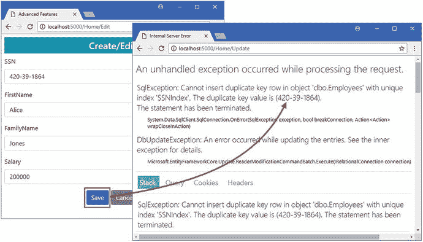

# 十九、使用键

为数据选择最合适的键为数据模型的其余部分奠定了基础。在前面的章节中，您已经看到了键在唯一标识对象中扮演的角色，实体框架核心用来选择用作键的属性的约定，以及这些约定是如何被覆盖的。在这一章中，我描述了 Entity Framework Core 提供的高级关键特性。与本书这一部分中描述的许多特性一样，您不太可能在每个使用 Entity Framework Core 的项目中都需要高级关键特性，但是在标准特性无法提供您的应用所需的功能的特殊情况下，控制如何使用键的能力非常重要。

Entity Framework Core 不能生成对键进行实质性更改的迁移，这意味着本章中的大多数示例需要重置数据库或删除早期的迁移。这强调了尽早选择关键策略的重要性，以避免对数据库进行可能导致数据丢失的复杂更改。表 [19-1](#Tab1) 将本章放在上下文中。

Note

许多高级功能只能使用 Fluent API 应用，并且没有相应的属性。当有可用的属性时，我已经添加了注释，但是这一章——以及本书这一部分中的其他章节——的重点是 Fluent API 的使用。

表 19-1。

Putting Advanced Key Features in Context

<colgroup><col> <col></colgroup> 
| 问题 | 回答 |
| --- | --- |
| 它们是什么？ | 这些功能允许您更改创建和使用密钥的方式。 |
| 它们为什么有用？ | 并非所有应用都可以使用默认主键功能，尤其是在使用现有数据库时。 |
| 它们是如何使用的？ | 这些特性是使用数据库上下文类中的 Fluent API 语句来应用的。 |
| 有什么陷阱或限制吗？ | 这些特性需要仔细考虑，因为很容易选择其值不唯一标识对象的属性。 |
| 还有其他选择吗？ | 这些特性是可选的，您可以使用第 2 部分中描述的基本特性。 |

表 [19-2](#Tab2) 总结了本章内容。

表 19-2。

Chapter Summary

<colgroup><col> <col> <col></colgroup> 
| 问题 | 解决办法 | 列表 |
| --- | --- | --- |
| 更改主键值的生成方式 | 使用 Fluent API 密钥生成方法 | 14–16 |
| 使用自然键 | 使用`IsUnique`方法确保数据库中的值不会重复 | 17, 18, 25–27 |
| 使用附加属性来标识对象 | 创建备用密钥 | 19–24 |
| 使用多个属性来识别对象 | 创建组合键 | 28–32 |

## 为本章做准备

对于这一章，我创建了一个新项目，这样我就可以演示实体框架核心支持的更高级的特性。要创建项目，从 Visual Studio 文件菜单中选择新建➤项目，并使用 ASP.NET Core Web 应用模板创建一个名为 AdvancedApp 的新项目，如图 [19-1](#Fig1) 所示。

Tip

如果您不想遵循构建示例项目的过程，您可以从本书的源代码库中下载所有需要的文件，可以从 [`https://github.com/apress/pro-ef-core-2-for-asp.net-core-mvc`](https://github.com/apress/pro-ef-core-2-for-asp.net-core-mvc) 获得。


图 19-1。

Creating a new application

单击“确定”按钮进入下一个对话框。确保从列表中选择 ASP.NET Core 2.0，点击空模板，如图 [19-2](#Fig2) 所示。单击“确定”关闭对话框窗口并创建项目。


图 19-2。

Configuring the project

### 创建数据模型

本章的数据模型将在一个简化的 HR 数据库中表示雇员，只是为了提供一些不同于我在前面章节中使用的基于产品的例子。我创建了一个名为`Models`的文件夹，并在其中添加了一个名为`Employee.cs`的类文件，我用它来定义清单 [19-1](#Par10) 中所示的类。

```cs
namespace AdvancedApp.Models {

    public class Employee {

        public long Id { get; set; }
        public string SSN { get; set; }
        public string FirstName { get; set; }
        public string FamilyName { get; set; }
        public decimal Salary { get; set; }
    }
}

Listing 19-1.The Contents of the Employee.cs File in the Models Folder

```

`Employee`类包含一个人的社会保险号、姓名和薪水的属性。一个真正的人力资源数据库需要额外的细节，但这已经足够开始了。

为了创建数据库上下文类，我在`Models`文件夹中添加了一个名为`AdvancedContext.cs`的类文件，并定义了清单 [19-2](#Par13) 中所示的类。

```cs
using Microsoft.EntityFrameworkCore;

namespace AdvancedApp.Models {

    public class AdvancedContext : DbContext {

        public AdvancedContext(DbContextOptions<AdvancedContext> options)
            : base(options) { }

        public DbSet<Employee> Employees { get; set; }

        protected override void OnModelCreating(ModelBuilder modelBuilder) {

        }
    }
}

Listing 19-2.The Contents of the AdvancedContext.cs File in the Models Folder

```

context 类定义了一个`DbSet`属性，以提供对数据库中的`Employee`对象的方便访问，并覆盖`OnModelCreating`方法，以便可以使用 Fluent API 来配置数据库。目前不需要配置语句，因为我很乐意使用`Employee`类的默认约定。

### 创建控制器和视图

对于应用的 ASP.NET Core MVC 部分，我首先创建了`Controllers`文件夹，并向其中添加了一个名为`HomeController.cs`的类文件，我用它来定义清单 [19-3](#Par16) 中所示的控制器。控制器定义了一个向用户显示数据的`Index`动作，并定义了一个创建和更新对象的`Update`动作。我在第 [20](20.html) 章介绍了软删除对象的能力(意味着它们对用户是隐藏的，但仍在数据库中),并在第 [22](22.html) 章介绍了真正删除对象的能力。

```cs
using AdvancedApp.Models;
using Microsoft.AspNetCore.Mvc;

namespace AdvancedApp.Controllers {

    public class HomeController : Controller {
        private AdvancedContext context;

        public HomeController(AdvancedContext ctx) => context = ctx;

        public IActionResult Index() {
            return View(context.Employees);
        }

        public IActionResult Edit(long id) {
            return View(id == default(long)
                ? new Employee() : context.Employees.Find(id));
        }

        [HttpPost]
        public IActionResult Update(Employee employee) {

            if (employee.Id == default(long)) {
                context.Add(employee);
            } else {
                context.Update(employee);
            }
            context.SaveChanges();
            return RedirectToAction(nameof(Index));
        }
    }
}

Listing 19-3.The Contents of the HomeController.cs File in the Controllers Folder

```

为了向控制器提供它的视图，我创建了一个`Views/Home`文件夹，并向其中添加了一个名为`Index.cshtml`的文件，其内容如清单 [19-4](#Par18) 所示。该视图显示一个表格，显示从数据库中读取的`Employee`对象的详细信息，以及允许创建和修改对象的按钮。

```cs
@model IEnumerable<Employee>
@{
    ViewData["Title"] = "Advanced Features";
    Layout = "_Layout";
}
<h3 class="bg-info p-2 text-center text-white">Employees</h3>
<table class="table table-sm table-striped">
    <thead>
        <tr>
            <th>Key</th>
            <th>SSN</th>
            <th>First Name</th>
            <th>Family Name</th>
            <th>Salary</th>
            <th></th>
        </tr>
    </thead>
    <tbody>
        <tr class="placeholder"><td colspan="7" class="text-center">No Data</td></tr>
        @foreach (Employee e in Model) {
            <tr>
                <td>@e.Id</td>
                <td>@e.SSN</td>
                <td>@e.FirstName</td>
                <td>@e.FamilyName</td>
                <td>@e.Salary</td>
                <td class="text-right">                      
                    <a asp-action="Edit" asp-route-id="@e.Id"
                        class="btn btn-sm btn-primary">Edit</a>
                </td>
            </tr>
        }
    </tbody>
</table>
<div class="text-center">
    <a asp-action="Edit" class="btn btn-primary">Create</a>
</div>
Listing 19-4.The Contents of the Index.cshtml File in the Views/Home Folder

```

为了允许用户创建或编辑一个`Employee`对象，我在`Views/Home`文件夹中添加了一个名为`Edit.cshtml`的文件，其内容如清单 [19-5](#Par20) 所示。

```cs
@model Employee
@{
    ViewData["Title"] = "Advanced Features";
    Layout = "_Layout";
}

<h4 class="bg-info p-2 text-center text-white">
    Create/Edit
</h4>
<form asp-action="Update" method="post">
    <input type="hidden" asp-for="Id" />
    <div class="form-group">
        <label class="form-control-label" asp-for="SSN"></label>
        <input class="form-control" asp-for="SSN" />
    </div>
    <div class="form-group">
        <label class="form-control-label" asp-for="FirstName"></label>
        <input class="form-control" asp-for="FirstName" />
    </div>
    <div class="form-group">
        <label class="form-control-label" asp-for="FamilyName"></label>
        <input class="form-control" asp-for="FamilyName" />
    </div>
    <div class="form-group">
        <label class="form-control-label" asp-for="Salary"></label>
        <input class="form-control" asp-for="Salary" />
    </div>
    <div class="text-center">
        <button type="submit" class="btn btn-primary">Save</button>
        <a class="btn btn-secondary" asp-action="Index">Cancel</a>
    </div>
</form>

Listing 19-5.The Contents of the Edit.cshtml File in the Views/Home Folder

```

为了给视图提供一个通用的布局，我创建了`Views/Shared`文件夹，并在其中添加了一个名为`_Layout.cshtml`的文件，其内容如清单 [19-6](#Par22) 所示。

```cs
<!DOCTYPE html>
<html>
<head>
    <meta name="viewport" content="width=device-width" />
    <title>@ViewData["Title"]</title>
    <link rel="stylesheet" href="∼/lib/bootstrap/dist/css/bootstrap.min.css" />
    <style>
        .placeholder { visibility: collapse }
        .placeholder:only-child { visibility: visible }
    </style>
</head>
<body>
    <div class="p-2">
        @RenderBody()
    </div>
</body>
</html>
Listing 19-6.The Contents of the _Layout.cshtml File in the Views/Shared Folder

```

布局包括一个文件链接，该文件包含引导 CSS 样式和一些自定义 CSS，当没有数据显示时，这些 CSS 将显示添加到`Index.cshtml`视图中的`placeholder`类的元素。

为了启用标签助手并导入包含视图中使用的模型类的包，我在`Views`文件夹中添加了一个名为`_ViewImports.cshtml`的文件，并添加了清单 [19-7](#Par25) 中所示的内容。

```cs
@using AdvancedApp.Models
@addTagHelper *, Microsoft.AspNetCore.Mvc.TagHelpers
Listing 19-7.The Contents of the _ViewImports.cshtml File in the Views Folder

```

### 配置应用

为了安装提供实体框架核心命令行工具的 NuGet 包，我在解决方案浏览器中右键单击 AdvancedApp 项目项，从弹出菜单中选择 Edit AdvancedApp.csproj，并添加清单 [19-8](#Par27) 中所示的元素。

```cs
<Project Sdk="Microsoft.NET.Sdk.Web">

  <PropertyGroup>
    <TargetFramework>netcoreapp2.0</TargetFramework>
  </PropertyGroup>

  <ItemGroup>
    <Folder Include="wwwroot\" />
  </ItemGroup>

  <ItemGroup>
    <PackageReference Include="Microsoft.AspNetCore.All" Version="2.0.5" />
    <DotNetCliToolReference Include="Microsoft.EntityFrameworkCore.Tools.DotNet"
        Version="2.0.0" />
  </ItemGroup>

</Project>

Listing 19-8.Adding a NuGet Package in the AdvancedApp.csproj File in the AdvancedApp Folder

```

为了配置示例应用的数据库细节，我使用 ASP.NET 配置文件项模板将名为`appsettings.json`的文件添加到`AdvancedApp`项目文件夹中，并添加了清单 [19-9](#Par29) 中所示的配置设置。除了连接字符串之外，我还配置了日志记录系统，以便 Entity Framework Core 能够显示发送给数据库服务器的 SQL 查询和命令的详细信息。

```cs
{
  "ConnectionStrings": {
    "DefaultConnection": "Server=(localdb)\\MSSQLLocalDB;Database=AdvancedDb;MultipleActiveResultSets=true"
  },
  "Logging": {
    "LogLevel": {
      "Default": "None",
      "Microsoft.EntityFrameworkCore": "Information"
    }
  }
}
Listing 19-9.The Contents of the appsettings.json File in the AdvancedApp Folder

```

为了启用 ASP.NET Core MVC 和实体框架核心中间件，我将清单 [19-10](#Par31) 中所示的配置语句添加到了`Startup`类中。

```cs
using System;
using System.Collections.Generic;
using System.Linq;
using System.Threading.Tasks;
using Microsoft.AspNetCore.Builder;
using Microsoft.AspNetCore.Hosting;
using Microsoft.AspNetCore.Http;
using Microsoft.Extensions.DependencyInjection;

using Microsoft.Extensions.Configuration;

using Microsoft.EntityFrameworkCore;

using AdvancedApp.Models;

namespace AdvancedApp {
    public class Startup {

        public Startup(IConfiguration config) => Configuration = config;

        public IConfiguration Configuration { get; }

        public void ConfigureServices(IServiceCollection services) {
            services.AddMvc();
            string conString = Configuration["ConnectionStrings:DefaultConnection"];
            services.AddDbContext<AdvancedContext>(options =>
                options.UseSqlServer(conString));
        }

        public void Configure(IApplicationBuilder app, IHostingEnvironment env) {
            app.UseDeveloperExceptionPage();
            app.UseStatusCodePages();
            app.UseStaticFiles();
            app.UseMvcWithDefaultRoute();
        }
    }
}

Listing 19-10.Configuring Middleware in the Startup.cs File in the AdvancedApp Folder

```

我使用 JSON 文件模板(在 ASP.NET Core➤网站➤通用类别中找到)创建了一个名为`.bowerrc`的文件，其内容如清单 [19-11](#Par33) 所示。(注意这个文件名很重要:它以句点开头，包含字母`r`两次，没有文件扩展名)。

```cs
{
  "directory": "wwwroot/lib"
}
Listing 19-11.The Contents of the .bowerrc File in the AdvancedApp Folder

```

我再次使用 JSON 文件模板创建了一个名为`bower.json`的文件，其内容如清单 [19-12](#Par35) 所示。

```cs
{
  "name": "asp.net",
  "private": true,
  "dependencies": {
    "bootstrap": "4.0.0"
  }
}
Listing 19-12.The Contents of the bower.json File in the AdvancedApp Folder

```

当您保存文件时，Visual Studio 将下载引导包并将其安装到`wwwroot/lib`文件夹中。

为了简化使用应用的过程，编辑`Properties/launchSettings.json`文件并更改它包含的两个 URL，使它们都指定端口`5000`，如清单 [19-13](#Par38) 所示。这是我将在 URL 中使用的端口，用来演示示例应用的不同特性。

```cs
{
  "iisSettings": {
    "windowsAuthentication": false,
    "anonymousAuthentication": true,
    "iisExpress": {
      "applicationUrl": "http://localhost:5000/",
      "sslPort": 0
    }
  },
  "profiles": {
    "IIS Express": {
      "commandName": "IISExpress",
      "launchBrowser": true,
      "environmentVariables": {
        "ASPNETCORE_ENVIRONMENT": "Development"
      }
    },
    "AdvancedApp": {
      "commandName": "Project",
      "launchBrowser": true,
      "environmentVariables": {
        "ASPNETCORE_ENVIRONMENT": "Development"
      },
      "applicationUrl": "http://localhost:5000/"
    }
  }
}
Listing 19-13.Changing Ports in the launchSettings.json File in the Properties Folder

```

### 创建数据库和测试应用

在`AdvancedApp`项目文件夹中运行清单 [19-14](#Par40) 中所示的命令，创建并应用迁移，这将建立数据库来存储`Employee`对象。

```cs
dotnet ef migrations add Initial
dotnet ef database update
Listing 19-14.Creating and Applying a Database Migration

```

在下一节中，我将删除并重新创建数据库，但是在继续之前，确保示例应用正常工作是很重要的。使用`dotnet run`启动应用，并导航至`http://localhost:5000`。数据库中当前没有数据，您将看到占位符内容。点击创建按钮，填写表单字段，然后点击保存按钮，在数据库中保存一个新的`Employee`对象，产生如图 [19-3](#Fig2) 所示的结果。


图 19-3。

Running the example application

## 管理密钥生成

使用 SQL Server 时，有两种策略可用于生成用于主键的值，这些值使用表 [19-3](#Tab3) 中描述的方法进行配置。

Note

并非所有的数据库服务器都支持这些关键策略。请参阅您的数据库提供程序包的文档，以了解可用的策略。

表 19-3。

The Key Generation Methods

<colgroup><col> <col></colgroup> 
| 名字 | 描述 |
| --- | --- |
| `ForSqlServerUseIdentityColumns()` | 该方法选择用于密钥生成的身份策略。 |
| `ForSqlServerUseSequenceHiLo()` | 此方法指定密钥生成的高低策略。 |

### 了解身份战略

默认情况下使用身份策略。当实体框架核心存储新对象时，它依赖数据库服务器来创建唯一的主键值。这意味着存储一个对象需要两个操作，如果您单击 Create 按钮，填写表单，单击 Save 按钮，并检查应用生成的日志消息，就可以看到这一点。第一个操作将新数据插入数据库，如下所示:

```cs
...
INSERT INTO [Employees] ([FamilyName], [FirstName], [SSN], [Salary])
VALUES (@p0, @p1, @p2, @p3);
...

```

实体框架核心没有包含`Id`属性的值，因为它知道该值将由数据库服务器分配(事实上，为`UPDATE`提供值会导致错误)。第二个操作查询数据库以获取数据库在向表中插入新数据时生成的主键，如下所示:

```cs
...

SELECT [Id]

FROM [Employees]
WHERE @@ROWCOUNT = 1 AND [Id] = scope_identity();
...

```

这种方法的优点是简单。使用数据库的应用不必为了避免重复的密钥而相互协调，也不必知道密钥是如何生成的。缺点是需要额外的查询来获取键值。

Tip

如果你不确定应该遵循什么样的关键策略，那么就使用身份策略，因为它最容易操作，也最不可能给你带来任何问题。

### 了解高低关键策略

Hi-Lo 策略是一种优化，它允许实体框架核心创建主键值，而不是数据库服务器，同时仍然确保这些值是唯一的。需要做一些工作来了解这个策略是如何工作的，因为实体框架核心迁移不能改变在早期迁移中创建的主键的策略。第一步是在上下文类中应用表 [19-3](#Tab3) 中的 Fluent API 方法来选择 Hi-Lo 策略，如清单 [19-15](#Par51) 所示。

```cs
using Microsoft.EntityFrameworkCore;

namespace AdvancedApp.Models {

    public class AdvancedContext : DbContext {

        public AdvancedContext(DbContextOptions<AdvancedContext> options)
            : base(options) { }

        public DbSet<Employee> Employees { get; set; }

        protected override void OnModelCreating(ModelBuilder modelBuilder) {

            modelBuilder.Entity<Employee>()
                .Property(e => e.Id).ForSqlServerUseSequenceHiLo();
        }
    }
}

Listing 19-15.Selecting a Key Strategy in the AdvancedContext.cs File in the Models Folder

```

通过选择一个属性并调用表 [19-3](#Tab3) 中描述的`ForSqlServerUseSequenceHiLo`方法来应用该策略。为了将更改应用到密钥生成策略，我需要删除现有的迁移并创建一个新的迁移，以便在单个迁移中创建数据模型，并且不需要更改身份策略。在`AdvancedApp`项目文件夹中运行清单 [19-16](#Par53) 中所示的命令来移除现有的迁移并创建一个替换。

```cs
dotnet ef migrations remove --force
dotnet ef migrations add HiLoStrategy
Listing 19-16.Resetting Migrations

```

如果您检查`Migrations`文件夹中的`<timestamp>_ HiLoStrategy.cs`文件中的`Up`方法，您会看到一个名为`EntityFrameworkHiLoSequence`的新序列已经建立，如下所示:

```cs
...
protected override void Up(MigrationBuilder migrationBuilder) {
    migrationBuilder.CreateSequence(
        name: "EntityFrameworkHiLoSequence",
        incrementBy: 10);

    migrationBuilder.CreateTable(
        name: "Employees",
        columns: table => new {
            Id = table.Column<long>(nullable: false),
            FamilyName = table.Column<string>(nullable: true),
            FirstName = table.Column<string>(nullable: true),
            SSN = table.Column<string>(nullable: true),
            Salary = table.Column<decimal>(nullable: false)
        },
        constraints: table => {
            table.PrimaryKey("PK_Employees", x => x.Id);
        });
}
...

```

新的序列将被用来创建主键值，我会很快解释。在`AdvancedApp`项目文件夹中运行清单 [19-17](#Par57) 中所示的命令，使用新的迁移删除并重新创建数据库。

```cs
dotnet ef database drop --force
dotnet ef database update
Listing 19-17.Recreating the Database

```

#### 使用高低策略

在 Hi-Lo 策略中，实体框架核心负责根据从数据库服务器获得的初始种子值生成主键。当一个应用需要存储一个对象时，Entity Framework Core 从`EntityFrameworkHiLoSequence`序列中获取下一个值，并将其作为十个主键值块中的第一个数字，它可以在不需要参考数据库服务器或与其他应用协调的情况下创建这些值。例如，如果下一个序列值是 100，那么实体框架核心知道它可以使用主键 100、101、102 等等直到 109 来创建对象。一旦主键块用完，就读取序列中的下一个值。每个应用(或同一应用的实例)都遵循相同的过程来获取自己的密钥块，确保没有重复的键值。数据库服务器确保对序列值的每个请求都获得不同的结果，从而确保不会分配重复的键块。

要了解这个策略是如何工作的，启动应用，导航到`http://localhost:5000`，并完成创建和存储一个新的`Employee`对象的过程。应用的 ASP.NET Core MVC 部分的行为方式不会有任何明显的不同，只有当您检查实体框架核心日志记录消息时，这些变化才是可见的。

当您存储一个新对象时，Entity Framework Core 从序列中获取下一个值，如下所示:

```cs
...
SELECT NEXT VALUE FOR [EntityFrameworkHiLoSequence]
...

```

序列值是实体框架核心无需进一步检查即可使用的十个主键块的开始。这被称为密钥的“高”部分，这也是高低策略名称的一部分。“低”部分来自递增序列值以生成键块，它包含在`INSERT`操作中，如下所示:

```cs
...

INSERT INTO [Employees] ([Id], [FamilyName], [FirstName], [SSN], [Salary])

VALUES (@p0, @p1, @p2, @p3, @p4);

...

```

与身份策略不同，实体框架核心不必查询数据库来确定主键值。每个键块在应用创建的上下文对象之间共享，因此实体框架核心只需在存储了十个新对象后查询序列中的下一个值。

Caution

不要依赖实体框架核心使用特定的键序列。如果您切换到不同的数据库提供者，Hi-Lo 策略的实现可能会改变，或者可能会以不同的方式实现。

这种策略的优点是，它不需要在每次插入操作后都进行查询来发现主键。缺点是所有使用数据库的应用都必须理解并遵循 Hi-Lo 策略才能工作。

#### 了解高低键耗尽

这种策略会耗尽可能的键范围，因为当应用重新启动时，块中未使用的键将会“丢失”，所以您必须为主键选择一种提供足够容量的数据类型。要查看未使用的键范围，请停止并重新启动应用，导航到`http://localhost:5000`，单击 Create 按钮，并将另一个`Employee`对象存储在数据库中。将从数据库中读取一个新的序列值，并用作密钥的“高”分量，产生如图 [19-4](#Fig3) 所示的结果。将不会使用由应用的先前实例接收的块中的范围 2 到 10 中的密钥。


图 19-4。

Skipping key ranges with the Hi-Lo strategy

## 使用自然键

一些数据类型有自己的自然键，这意味着数据的某些方面可以唯一地标识一个对象。在`Employee`类的情况下，`SSN`属性可能是一个自然键，在这些国家中，社会安全号可以被认为是唯一的。

Understanding Surrogate Keys

尽管`Employee`数据有一个自然键，我仍然向`Employee`类添加了一个专用的主键属性，我在前面的部分中用它来演示键生成策略。这就是所谓的代理键，它的目的仅仅是标识一个对象；它与组成对象的其他值没有关系。正如您将在本章的示例中看到的，很难对数据模型进行影响主键的更改，而使用代理键有助于将未来更改对数据模型的影响降至最低。如果示例应用中的数据只需要支持一个国家，它可能很乐意使用社会保险号，但是为了支持其他国家，可能需要删除或修改`SSN`属性。当没有使用代理键时，这要困难得多。

### 确保自然键的唯一值

尽管我没有使用自然键来惟一地标识`Employee`对象，但是确保数据库中没有存储`SSN`属性的重复值仍然很重要。这将有助于防止用户输入错误的条目，并有助于在以后需要更改数据模型时最小化问题。防止重复的最简单的方法是为一个属性创建一个索引，如清单 [19-18](#Par71) 所示。

```cs
using Microsoft.EntityFrameworkCore;

namespace AdvancedApp.Models {

    public class AdvancedContext : DbContext {

        public AdvancedContext(DbContextOptions<AdvancedContext> options)
            : base(options) { }

        public DbSet<Employee> Employees { get; set; }

        protected override void OnModelCreating(ModelBuilder modelBuilder) {

            modelBuilder.Entity<Employee>()
                .Property(e => e.Id).ForSqlServerUseSequenceHiLo();

            modelBuilder.Entity<Employee>()
                .HasIndex(e => e.SSN).HasName("SSNIndex").IsUnique();
        }
    }
}

Listing 19-18.Creating an Index in the AdvancedContext.cs File in the Models Folder

```

通过使用`Entity`方法选择类并调用`HasIndex`方法来选择将为其创建索引的属性，从而创建索引。`HasName`方法用于为索引指定一个名称，当使用自然键时，您还必须调用`IsUnique`方法来为数据库添加一个约束以防止重复值。

Note

只能使用 Fluent API 创建索引。此功能没有属性支持。

该清单为 SSN 地产建立了一个唯一的索引，通过使用清单 [19-19](#Par75) 中所示的命令创建并应用迁移，可以将该索引添加到数据库中，该命令必须在`AdvancedApp`项目文件夹中运行。

```cs
dotnet ef migrations add UniqueIndex
dotnet ef database update
Listing 19-19.Creating and Applying a Migration

```

如果您检查已经添加到`Migrations`文件夹的`<timestamp>_UniqueIndex.cs`文件的`Up`方法，您将会看到清单 [19-18](#Par71) 中的 Fluent API 语句是如何改变数据库来强制自然键的惟一性的。

```cs
...
protected override void Up(MigrationBuilder migrationBuilder) {

    migrationBuilder.AlterColumn<string>(name: "SSN",
        table: "Employees", type: "nvarchar(450)", nullable: true,
        oldClrType: typeof(string), oldNullable: true);

    migrationBuilder.CreateIndex(name: "SSNIndex",
        table: "Employees", column: "SSN", unique: true,   
        filter: "[SSN] IS NOT NULL");
}
...

```

`Up`方法中的第一条语句改变了`SSN`列的数据类型，使其具有固定的大小。第二条语句创建索引，将`unique`参数设置为`true`，这样就禁止了重复的条目。启动应用，导航到`http://localhost:5000`，尝试存储一个新的`Employee`对象，其`SSN`值与现有条目相同；您将看到如图 [19-5](#Fig4) 所示的错误信息。



图 19-5。

Enforcing unique values for a natural key

### 创建备用密钥

如果您需要使用自然键值来创建关系，则需要一种不同的方法。在这些情况下，需要一个备用键，它可以确保值的唯一性，还可以配置数据库，以便可以通过一个附加键以及主键来唯一地标识一个对象。

Understanding When Alternate Keys are Useful

在大多数应用中，您可以使用主键安全地创建关系，这是 Entity Framework Core 默认会做的事情。如果只需要避免重复值，那么就创建一个惟一索引，而不是创建一个替换键，如前一节所述。只有当您希望将来将备用键值移动到另一个对象，并且希望无缝转移现有关系时，能够在备用键上创建关系才是重要的，这是大多数应用不必担心的。

为了演示替换键的用法，我在`Models`文件夹中添加了一个名为`SecondaryIdentity.cs`的文件，并用它来定义清单 [19-20](#Par82) 中所示的类。

```cs
namespace AdvancedApp.Models {

    public class SecondaryIdentity {
        public long Id { get; set; }
        public string Name { get; set; }
        public bool InActiveUse { get; set; }

        public string PrimarySSN { get; set; }
        public Employee PrimaryIdentity { get; set; }
    }
}

Listing 19-20.The Contents of the SecondaryIdentity.cs in the Models Folder

```

这个类将代表雇员的另一个名字。`SecondaryIdentity`类定义了一个构成与`Employee`类关系的一部分的`PrimaryIdentity`属性，而`PrimarySSN`属性将被用作外键属性。为了完成这个关系，我向清单 [19-21](#Par84) 中所示的`Employee`类添加了反向导航属性。

```cs
namespace AdvancedApp.Models {

    public class Employee {

        public long Id { get; set; }
        public string SSN { get; set; }
        public string FirstName { get; set; }
        public string FamilyName { get; set; }
        public decimal Salary { get; set; }

        public SecondaryIdentity OtherIdentity { get; set; }
    }
}

Listing 19-21.Completing the Relationship in the Employee.cs File in the Models Folder

```

`OtherIdentity`属性返回一个`SecondaryIdentity`对象，它告诉实体框架核心这是一对一的关系。

默认情况下，实体框架核心将使用`Employee`类的主键作为`SecondaryIdentity`和`Employee`类之间关系的外键列。我将清单 [19-22](#Par88) 中所示的流畅 API 语句添加到上下文类中，以覆盖这个约定并使用替换键。

Note

只能使用 Fluent API 创建备用密钥。此功能没有属性支持。

```cs
using Microsoft.EntityFrameworkCore;

namespace AdvancedApp.Models {

    public class AdvancedContext : DbContext {

        public AdvancedContext(DbContextOptions<AdvancedContext> options)
            : base(options) { }

        public DbSet<Employee> Employees { get; set; }

        protected override void OnModelCreating(ModelBuilder modelBuilder) {

            modelBuilder.Entity<Employee>()
                .Property(e => e.Id).ForSqlServerUseSequenceHiLo();

            //modelBuilder.Entity<Employee>()
            //    .HasIndex(e => e.SSN).HasName("SSNIndex").IsUnique();

            modelBuilder.Entity<Employee>().HasAlternateKey(e => e.SSN);

            modelBuilder.Entity<SecondaryIdentity>()
                .HasOne(s => s.PrimaryIdentity)
                .WithOne(e => e.OtherIdentity)
                .HasPrincipalKey<Employee>(e => e.SSN)
                .HasForeignKey<SecondaryIdentity>(s => s.PrimarySSN);
        }
    }
}

Listing 19-22.Using an Alternate Key in the AdvancedContext.cs File in the Models Folder

```

清单 [19-22](#Par88) 中的第一个新语句使用`HasAlternateKey`方法创建替换键，这与创建唯一索引具有相同的效果，只是实体框架核心将允许使用所选属性创建关系。只有当您不打算立即建立关系时，才需要此方法来准备一个属性作为备用键，但是我倾向于包含它，只是为了使我的意图显而易见。

清单 [19-22](#Par88) 中的第二个新语句建立了两个类之间的关系。`HasOne`和`WithOne`方法用于选择导航属性，`HasPrincipalKey<T>`和`HasForeignKey<T>`方法用于选择替换键和外键属性。

结果是，`SSN`属性将被配置为一个替换键，该替换键在与`SecondaryIdentity`类的关系中被用作外键。在`AdvancedApp`项目文件夹中运行清单 [19-23](#Par92) 中所示的命令，创建并应用对数据库的更改。

```cs
dotnet ef migrations add AlternateKey
dotnet ef database update
Listing 19-23.Creating and Applying a Database Migration

```

如果您检查已经添加到`Migrations`文件夹的`<timestamp>_AlternateKey.cs`文件中的`Up`方法，您将看到已经应用到表中的`PrimarySSN`列的外键约束，该表是为了存储`SecondaryIdentity`对象而创建的。

```cs
...
constraints: table => {
    table.PrimaryKey("PK_SecondaryIdentity", x => x.Id);
    table.ForeignKey(
        name: "FK_SecondaryIdentity_Employees_PrimarySSN",
        column: x => x.PrimarySSN,
        principalTable: "Employees",
        principalColumn: "SSN",
        onDelete: ReferentialAction.Restrict);
});
...

```

一旦定义了替换键，就可以像使用主键一样使用它来创建关系。为了对应用的 ASP.NET Core MVC 部分进行修改，我将清单 [19-24](#Par96) 中所示的元素添加到`Edit.cshtml`视图中，这样用户就可以创建或编辑`SecondaryIdentity`对象以及与之相关的`Employee`对象。

```cs
@model Employee
@{
    ViewData["Title"] = "Advanced Features";
    Layout = "_Layout";
}

<h4 class="bg-info p-2 text-center text-white">
    Create/Edit
</h4>
<form asp-action="Update" method="post">
    <input type="hidden" asp-for="Id" />
    <div class="form-group">
        <label class="form-control-label" asp-for="SSN"></label>
        <input class="form-control" asp-for="SSN" />
    </div>
    <div class="form-group">
        <label class="form-control-label" asp-for="FirstName"></label>
        <input class="form-control" asp-for="FirstName" />
    </div>
    <div class="form-group">
        <label class="form-control-label" asp-for="FamilyName"></label>
        <input class="form-control" asp-for="FamilyName" />
    </div>
    <div class="form-group">
        <label class="form-control-label" asp-for="Salary"></label>
        <input class="form-control" asp-for="Salary" />
    </div>

    <input type="hidden" asp-for="OtherIdentity.Id" />
    <div class="form-group">
        <label class="form-control-label">Other Identity Name:</label>
        <input class="form-control" asp-for="OtherIdentity.Name" />
    </div>

    <div class="form-check">
        <label class="form-check-label">
            <input class="form-check-input" type="checkbox"
                   asp-for="OtherIdentity.InActiveUse" />
            In Active Use
        </label>
    </div>

    <div class="text-center">
        <button type="submit" class="btn btn-primary">Save</button>
        <a class="btn btn-secondary" asp-action="Index">Cancel</a>
    </div>
</form>

Listing 19-24.Adding Elements in the Edit.cshtml File in the Views/Home Folder

```

我还修改了`Home`控制器中的`Edit`方法，以便对`Employee`对象的查询遵循导航属性来包含相关数据并将其传递给视图，如清单 [19-25](#Par98) 所示。

```cs
using AdvancedApp.Models;
using Microsoft.AspNetCore.Mvc;

using Microsoft.EntityFrameworkCore;

using System.Linq;

namespace AdvancedApp.Controllers {

    public class HomeController : Controller {
        private AdvancedContext context;

        public HomeController(AdvancedContext ctx) => context = ctx;

        public IActionResult Index() {
            return View(context.Employees);
        }

        public IActionResult Edit(long id) {
            return View(id == default(long)
                ? new Employee() : context.Employees.Include(e => e.OtherIdentity)
                    .First(e => e.Id == id));
        }

        [HttpPost]
        public IActionResult Update(Employee employee) {
            if (employee.Id == default(long)) {
                context.Add(employee);
            } else {
                context.Update(employee);
            }
            context.SaveChanges();
            return RedirectToAction(nameof(Index));
        }
    }
}

Listing 19-25.Including Related Data in the HomeController.cs File in the Controllers Folder

```

`Edit`方法中的查询使用`Include`方法来跟踪导航属性，使用`First`方法来查找具有用户指定的`Id`值的对象。要检查备用键是否工作，使用`dotnet run`启动应用，导航到`http://localhost:5000`，并创建或编辑一个`Employee`对象。添加了新的关系(以及它使用的备用键)后，您可以提供第二个身份的详细信息，如图 [19-6](#Fig5) 所示。

Tip

不要对已存储在数据库中的对象的`SSN`、`FirstName`或`FamilyName`属性进行任何更改。除非数据库专门配置为允许，否则不能更改构成该项的属性。


图 19-6。

Using an alternate key as the foreign key in a relationship

## 使用自然键作为主键

如果您不想使用代理键(通常是因为您确信不会有数据模型更改)，您可以选择一个属性作为主键，并负责生成唯一值，尽管这不是一个轻易做出的决定，因为您有责任确保每个值都是唯一的。自然键可能是混乱的，并且不能总是像在项目设计阶段假设的那样是唯一的。为了演示自然键作为主键的使用，我使用 Fluent API 语句重新配置了数据模型，告诉实体框架核心忽略现有的主键属性，而使用`SSN`属性，如清单 [19-26](#Par103) 所示。

Note

您可以使用`Key`属性选择任何属性作为主键。该示例的其余部分是相同的，包括处理用户/应用负责生成的密钥所需的更改。

```cs
using Microsoft.EntityFrameworkCore;

namespace AdvancedApp.Models {

    public class AdvancedContext : DbContext {

        public AdvancedContext(DbContextOptions<AdvancedContext> options)
            : base(options) { }

        public DbSet<Employee> Employees { get; set; }

        protected override void OnModelCreating(ModelBuilder modelBuilder) {

            modelBuilder.Entity<Employee>().Ignore(e => e.Id);
            modelBuilder.Entity<Employee>().HasKey(e => e.SSN);

            modelBuilder.Entity<SecondaryIdentity>()
                .HasOne(s => s.PrimaryIdentity)
                .WithOne(e => e.OtherIdentity)
                .HasPrincipalKey<Employee>(e => e.SSN)
                .HasForeignKey<SecondaryIdentity>(s => s.PrimarySSN);
        }
    }
}

Listing 19-26.Using a Natural Key in the AdvancedContext.cs File in the Models Folder

```

我使用了`Ignore`方法从数据模型中排除`Id`属性，使用了`HasKey`方法选择`SSN`属性作为主键。不需要对配置`Employee`和`SecondaryIdentity`类之间关系的语句进行任何修改，尽管可以删除对`HasPrincipalKey`方法的调用，因为既然`SSN`是主键，那么实体框架核心将默认使用该关系中的`SSN`属性。

在`AdvancedApp`项目文件夹中运行清单 [19-27](#Par106) 中所示的命令，创建并应用将改变主键的迁移。

```cs
dotnet ef migrations remove --force
dotnet ef migrations add NaturalPrimaryKey
dotnet ef database drop --force
dotnet ef database update
Listing 19-27.Resetting and Updating the Database

```

实体框架核心很难做出涉及键的更改，并且尝试添加迁移更改主键将不起作用，因为迁移将尝试删除为替换键设置的约束，该替换键由在其上创建的关系使用。为了解决这个问题，我删除了设置备用键的迁移，创建了一个选择`SSN`属性作为主键的迁移，然后重新创建了数据库。

为了将这些变化贯彻到应用的 ASP.NET Core MVC 部分，我更新了控制器，使其使用`SSN`属性作为主键，如清单 [19-28](#Par109) 所示。

```cs
using AdvancedApp.Models;
using Microsoft.AspNetCore.Mvc;
using Microsoft.EntityFrameworkCore;
using System.Linq;

namespace AdvancedApp.Controllers {

    public class HomeController : Controller {
        private AdvancedContext context;

        public HomeController(AdvancedContext ctx) => context = ctx;

        public IActionResult Index() {
            return View(context.Employees);
        }

        public IActionResult Edit(string SSN) {
            return View(string.IsNullOrWhiteSpace(SSN)
                ? new Employee() : context.Employees.Include(e => e.OtherIdentity)
                    .First(e => e.SSN == SSN));
        }

        [HttpPost]
        public IActionResult Update(Employee employee) {
            if (context.Employees.Count(e => e.SSN == employee.SSN) == 0) {
                context.Add(employee);
            } else {
                context.Update(employee);
            }
            context.SaveChanges();
            return RedirectToAction(nameof(Index));
        }
    }
}

Listing 19-28.Using the New Primary Key in the HomeController.cs File in the Controllers Folder

```

最重要的变化是对`Update`方法的改变。当我依赖数据库服务器生成键值时，我可以通过检查键类型的默认值来确定请求是更新还是创建操作。我现在不能这样做，因为用户负责提供一个值键值，所以我已经查询了数据库，查看是否有一个现有的对象具有包含在请求中的键值，这是我使用 LINQ `Count`方法执行的。

使用`dotnet run`启动应用，导航到`http://localhost:5000`，点击创建按钮，并在数据库中存储一个新的`Employee`对象。如果您检查应用生成的日志消息，您将看到`Update`方法中的查询导致了这个操作:

```cs
...
SELECT COUNT(*)
FROM [Employees] AS [e]
WHERE [e].[SSN] = @__employee_SSN_0
...

```

当我使用由 MVC 模型绑定器创建的对象执行更新时，这种检查允许我确定用户指定的键是否已经在数据库中，而不需要加载数据和检查实体框架核心数据缓存。

## 创建组合键

组合键通过组合数据库表中两列或更多列的值或实体类的属性来唯一标识对象。当使用 identity 或 Hi-Lo 策略生成键值时，您不需要创建组合键，因为它们总是唯一的，但是当使用只有在与另一个值组合时才是唯一的自然键时，组合键会很有用。在美国，社会安全号码通常被认为是唯一的，但一些研究估计，有 4000 万个号码被不止一个人使用，这是混淆、错误和欺诈的综合结果。此时，如果试图创建一个使用已经存储在数据库中的`SSN`值的`Employee`对象，示例应用将生成一个异常，但是在本节中，我将通过组合属性来标识对象，从而放宽关于`SSN`唯一性的规则，如清单 [19-29](#Par116) 所示。

Note

只有使用 Fluent API 才能创建组合键。此功能没有属性支持。

```cs
using Microsoft.EntityFrameworkCore;

namespace AdvancedApp.Models {

    public class AdvancedContext : DbContext {

        public AdvancedContext(DbContextOptions<AdvancedContext> options)
            : base(options) { }

        public DbSet<Employee> Employees { get; set; }

        protected override void OnModelCreating(ModelBuilder modelBuilder) {

            modelBuilder.Entity<Employee>().Ignore(e => e.Id);
            modelBuilder.Entity<Employee>()
                .HasKey(e => new { e.SSN, e.FirstName, e.FamilyName });

            modelBuilder.Entity<SecondaryIdentity>()
                .HasOne(s => s.PrimaryIdentity)
                .WithOne(e => e.OtherIdentity)
                .HasPrincipalKey<Employee>(e => new { e.SSN,
                     e.FirstName, e.FamilyName })
                .HasForeignKey<SecondaryIdentity>(s => new { s.PrimarySSN,
                     s.PrimaryFirstName, s.PrimaryFamilyName });
        }
    }
}

Listing 19-29.Creating a Composite Key in the AdvancedContext.cs File in the Models Folder

```

组合键是通过创建一个对象来创建的，该对象选择应该在键中使用的属性，在本例中是`SSN`、`FirstName`和`FamilyName`属性。数据库中的每个属性都可以有重复的值，只要每个对象都有唯一的值组合。组成键的属性也必须用于创建关系，这可以在`HasPrincipalKey`方法中使用的 lambda 表达式中看到，它配置了与`SecondaryIdentity`类的关系的一方。

```cs
...
.HasPrincipalKey<Employee>(e => new { e.SSN, e.FirstName, e.FamilyName })
...

```

对于`HasForeignKey`方法，我已经使用组合键指定了一些附加的外键属性来跟踪相关的`Employee`对象，并且我已经在清单 [19-30](#Par120) 中的`SecondaryIdentity`类上定义了这些属性。

```cs
namespace AdvancedApp.Models {

    public class SecondaryIdentity {
        public long Id { get; set; }
        public string Name { get; set; }
        public bool InActiveUse { get; set; }

        public string PrimarySSN { get; set; }
        public string PrimaryFamilyName { get; set; }
        public string PrimaryFirstName { get; set; }
        public Employee PrimaryIdentity { get; set; }
    }
}

Listing 19-30.Adding Foreign Key Properties in the SecondaryIdentity.cs File in the Models Folder

```

在`AdvancedApp`项目文件夹中运行清单 [19-31](#Par122) 中所示的命令来创建一个新的迁移，并将其应用到数据库中。Entity Framework Core 很难对主键进行所需的更改，因此这些命令从前面的部分中删除了迁移，添加了新的迁移，然后重新创建了数据库。

```cs
dotnet ef migrations remove --force
dotnet ef migrations add CompositeKey
dotnet ef database drop --force
dotnet ef database update
Listing 19-31.Creating and Applying a Database Migration

```

如果您检查`Migrations`文件夹的`<timestamp>_CompositeKey.cs`文件中的`Up`方法，您会发现一条语句，该语句将使用在清单 [19-29](#Par116) 中选择的属性组合来配置`Employees`表的主键。

```cs
...
migrationBuilder.AddPrimaryKey(
    name: "PK_Employees",
    table: "Employees",
    columns: new[] { "SSN", "FirstName", "FamilyName" });
...

```

当您创建一个组合键时，必须在应用的其余部分进行更改。在清单 [19-32](#Par126) 中，我已经更新了控制器，以便它在查询数据库时使用所有的关键属性。

```cs
using AdvancedApp.Models;
using Microsoft.AspNetCore.Mvc;
using Microsoft.EntityFrameworkCore;
using System.Linq;

namespace AdvancedApp.Controllers {

    public class HomeController : Controller {
        private AdvancedContext context;

        public HomeController(AdvancedContext ctx) => context = ctx;

        public IActionResult Index() {
            return View(context.Employees);
        }

        public IActionResult Edit(string SSN, string firstName, string familyName) {
            return View(string.IsNullOrWhiteSpace(SSN)
                ? new Employee() : context.Employees.Include(e => e.OtherIdentity)
                    .First(e => e.SSN == SSN
                        && e.FirstName == firstName
                        && e.FamilyName == familyName));
        }

        [HttpPost]
        public IActionResult Update(Employee employee) {
            if (context.Employees.Count(e => e.SSN == employee.SSN
                    && e.FirstName == employee.FirstName
                    && e.FamilyName == employee.FamilyName) == 0) {
                context.Add(employee);
            } else {
                context.Update(employee);
            }
            context.SaveChanges();
            return RedirectToAction(nameof(Index));
        }
    }
}

Listing 19-32.Using the Composite Key in the HomeController.cs File in the Controllers Folder

```

如果没有这些更改，控制器将不会使用完整的主键查询数据库，这将导致一些奇怪的结果，要么选择错误的对象进行编辑，要么如果数据库中已经有一个`SSN`值，则无法插入新对象。

Tip

有些方法，比如`Find`，接受一系列用于查询数据库的键值。使用这些方法时，必须按照在 context 类中定义组合键的顺序提供值。对于示例应用，这意味着按顺序使用`SSN`、`FirstName`和`FamilyName`属性的值进行查询，因为我就是这样定义组合键的。

最后的改变是添加一些额外的属性来选择一个对象在`Index.cshtml`文件中进行编辑，如清单 [19-33](#Par130) 所示，这样控制器定义的`Edit`方法就可以接收所有的主键值。

```cs
@model IEnumerable<Employee>
@{
    ViewData["Title"] = "Advanced Features";
    Layout = "_Layout";
}
<h3 class="bg-info p-2 text-center text-white">Employees</h3>
<table class="table table-sm table-striped">
    <thead>
        <tr>
            <th>Key</th>
            <th>SSN</th>
            <th>First Name</th>
            <th>Family Name</th>
            <th>Salary</th>
            <th></th>
        </tr>
    </thead>
    <tbody>
        <tr class="placeholder"><td colspan="7" class="text-center">No Data</td></tr>
        @foreach (Employee e in Model) {
            <tr>
                <td>@e.Id</td>
                <td>@e.SSN</td>
                <td>@e.FirstName</td>
                <td>@e.FamilyName</td>
                <td>@e.Salary</td>
                <td class="text-right">                      
                    <a asp-action="Edit" asp-route-ssn="@e.SSN"
                       asp-route-firstname="@e.FirstName"
                       asp-route-familyname="@e.FamilyName"
                       class="btn btn-sm btn-primary">Edit</a>
                </td>
            </tr>
        }
    </tbody>
</table>
<div class="text-center">
    <a asp-action="Edit" class="btn btn-primary">Create</a>
</div>
Listing 19-33.Using the Composite Key in the Index.cshtml File in the Views/Home Folder

```

当用户编辑`Employee`时，`asp-route-`属性提供识别对象所需的复合键值。为了确保组合键正在工作，启动应用，导航到`http://localhost:5000`，并使用表 [19-4](#Tab4) 中所示的数据值创建新的`Employee`对象。

表 19-4。

The Data for Checking the Composite Key

<colgroup><col> <col> <col> <col> <col> <col></colgroup> 
| severely subnormal 智力严重逊常 | 西方人名的第一个字 | 姓氏 | 薪水 | 其他名称 | 正在使用中 |
| --- | --- | --- | --- | --- | --- |
| 420-39-1864 | 上下移动 | 锻工 | One hundred thousand | 罗伯特 | 检查 |
| 420-39-1864 | 爱丽丝 | 琼斯 | Two hundred thousand | 艾莉 | 检查 |
| 420-39-1864 | 上下移动 | 锻工 | One hundred and fifty thousand | 警察 | 未加抑制的 |

表中的所有三行都包含相同的`SSN`属性值，但是只有在尝试创建第三个对象时，您才会看到一个异常，第三个对象在主键中使用了相同的三个属性值组合。这在应用显示的异常信息中有记录，如图 [19-7](#Fig6) 所示。


图 19-7。

Trying to create a duplicate composite key

错误消息包括重复键的详细信息，这表明它是用于标识对象的主键属性的组合，如下所示:

```cs
...
The duplicate key value is (420-39-1864, Bob, Smith).
...

```

当值的组合形成键时，可以复制单个属性，如下例所示。

## 摘要

在这一章中，我演示了使用键的高级实体框架核心特性。我解释了 Identity 和 Hi-Lo 键的生成策略，以及如何以不同的方式使用自然键:确保惟一的值，使用它们来创建关系，以及作为主键。在下一章，我将描述查询的高级特性。