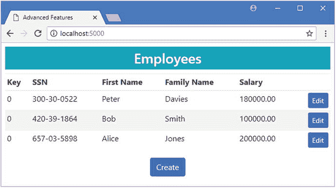
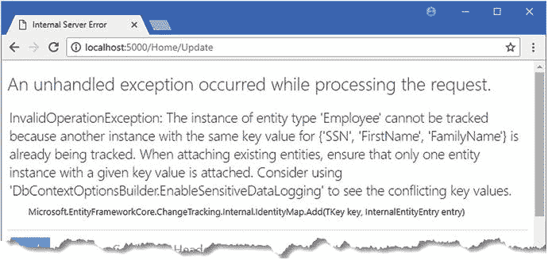
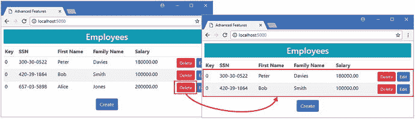
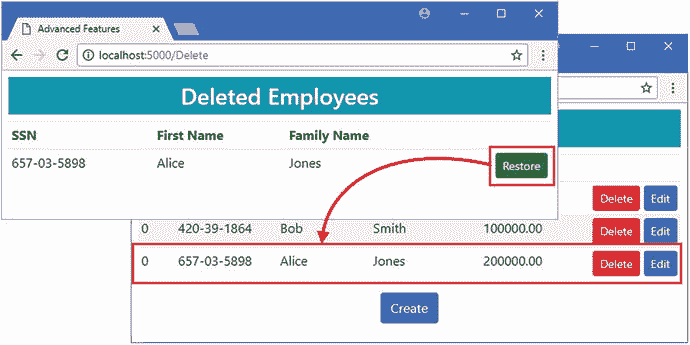
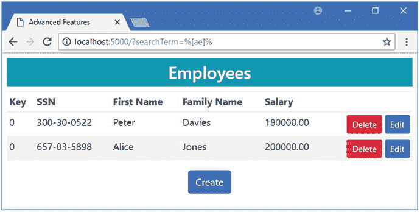
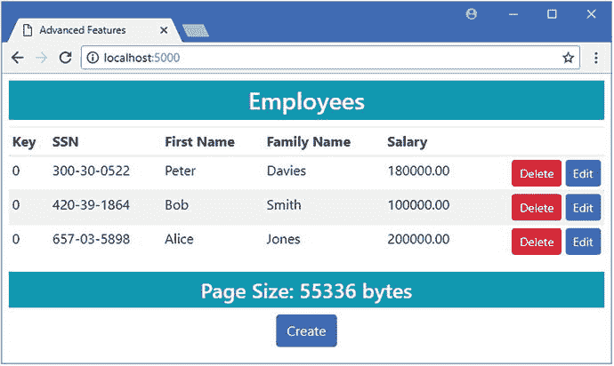
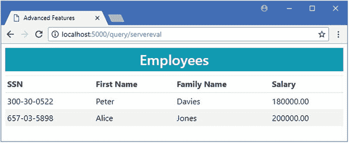
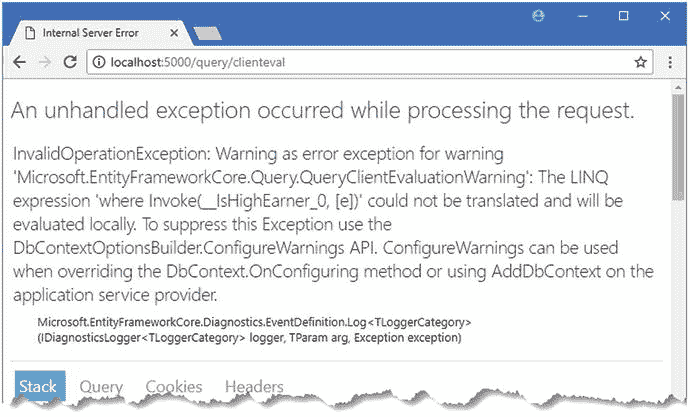

# 二十、问题

实体框架对使用 LINQ 进行查询的核心支持使处理数据成为的自然过程。NET 开发人员。在接下来的几节中，我将描述 Entity Framework Core 为控制查询提供的高级特性，如果使用前面章节中描述的技术无法获得所需的行为，这些特性会很有用。表 [20-1](#Tab1) 将本章放在上下文中。

表 20-1。

Putting Advanced Query Features in Context

<colgroup><col> <col></colgroup> 
| 问题 | 回答 |
| --- | --- |
| 它们是什么？ | 高级查询功能允许您覆盖默认的实体框架核心行为。 |
| 它们为什么有用？ | 当使用现有数据库或有特定性能要求时，这些功能会很有用。 |
| 它们是如何使用的？ | 这些功能作为 LINQ 查询的一部分应用。 |
| 有什么陷阱或限制吗？ | 这些功能可能会意外地改变应用的行为或查询结果，因此应该谨慎使用。 |
| 有其他选择吗？ | 这些是大多数项目不需要的特殊特性。 |

表 [20-2](#Tab2) 总结了本章内容。

表 20-2。

Chapter Summary

<colgroup><col> <col> <col></colgroup> 
| 问题 | 解决办法 | 列表 |
| --- | --- | --- |
| 查询只读数据 | 禁用更改跟踪功能 | 1–7 |
| 过滤所有查询产生的数据 | 应用查询过滤器 | 8–12 |
| 覆盖查询过滤器 | 使用`IgnoreQueryFilters`方法 | 13, 14 |
| 使用搜索表达式查询数据 | 使用`Like`功能 | Fifteen |
| 执行并发查询 | 使用异步查询方法 | 16, 17 |
| 加速查询重用 | 显式编译查询 | Eighteen |
| 检测客户对查询的评估 | 当查询包括客户端评估时启用异常报告 | 19, 21 |

## 为本章做准备

在本章中，我继续使用我在第 [19 章](19.html)中创建的 AdvancedApp 项目。为了准备本章，我修改了用于创建和编辑`Employee`对象的视图，这样复合主键的值就不能被更改，如清单 [20-1](#Par5) 所示。

Tip

如果您不想遵循构建示例项目的过程，您可以从本书的源代码库中下载所有需要的文件，可以从 [`https://github.com/apress/pro-ef-core-2-for-asp.net-core-mvc`](https://github.com/apress/pro-ef-core-2-for-asp.net-core-mvc) 获得。

```cs
@model Employee
@{
    ViewData["Title"] = "Advanced Features";
    Layout = "_Layout";
}

<h4 class="bg-info p-2 text-center text-white">
    Create/Edit
</h4>
<form asp-action="Update" method="post">
    <input type="hidden" asp-for="Id" />
    <div class="form-group">
        <label class="form-control-label" asp-for="SSN"></label>
        <input class="form-control" asp-for="SSN" readonly="@Model.SSN" />
    </div>
    <div class="form-group">
        <label class="form-control-label" asp-for="FirstName"></label>
        <input class="form-control" asp-for="FirstName"
             readonly="@Model.FirstName" />
    </div>
    <div class="form-group">
        <label class="form-control-label" asp-for="FamilyName"></label>
        <input class="form-control" asp-for="FamilyName"
             readonly="@Model.FamilyName"/>
    </div>
    <div class="form-group">
        <label class="form-control-label" asp-for="Salary"></label>
        <input class="form-control" asp-for="Salary" />
    </div>
    <input type="hidden" asp-for="OtherIdentity.Id" />
    <div class="form-group">
        <label class="form-control-label">Other Identity Name:</label>
        <input class="form-control" asp-for="OtherIdentity.Name" />
    </div>
    <div class="form-check">
        <label class="form-check-label">
            <input class="form-check-input" type="checkbox"
                   asp-for="OtherIdentity.InActiveUse" />
            In Active Use
        </label>
    </div>
    <div class="text-center">
        <button type="submit" class="btn btn-primary">Save</button>
        <a class="btn btn-secondary" asp-action="Index">Cancel</a>
    </div>
</form>

Listing 20-1.Disabling Key Changes in the Edit.cshtml File in the Views/Home Folder

```

接下来，在`AdvancedApp`项目文件夹中运行清单 [20-2](#Par7) 中所示的命令，删除并重新创建数据库。

```cs
dotnet ef database drop --force
dotnet ef database update
Listing 20-2.Dropping and Re-creating the Database

```

使用`dotnet run`启动应用，导航到`http://localhost:5000`，点击创建按钮，并使用表 [20-3](#Tab3) 中显示的值来存储三个`Employee`对象。

表 20-3。

The Data Values for Creating Example Objects

<colgroup><col> <col> <col> <col> <col> <col></colgroup> 
| severely subnormal 智力严重逊常 | 西方人名的第一个字 | 姓氏 | 薪水 | 其他名称 | 正在使用中 |
| --- | --- | --- | --- | --- | --- |
| 420-39-1864 | 上下移动 | 锻工 | One hundred thousand | 罗伯特 | 检查 |
| 657-03-5898 | 爱丽丝 | 琼斯 | Two hundred thousand | 艾莉 | 检查 |
| 300-30-0522 | 耗尽 | 戴维斯 | One hundred and eighty thousand | 银箱 | 检查 |

当你创建了所有三个对象后，你应该会看到如图 [20-1](#Fig1) 所示的布局。



图 20-1。

Running the example application

## 管理查询结果的更改跟踪

变更跟踪特性是使实体框架核心易于使用的特性之一。当您查询数据库时，Entity Framework Core 开始跟踪它为表示数据而创建的对象。当您调用`SaveChanges`方法时，Entity Framework Core 识别其值已经改变的属性，并相应地更新数据库。

尽管这个特性非常有用，但在 ASP.NET Core MVC 应用中，并不是每个查询都需要它。MVC 应用接收到的许多 HTTP 请求都是针对动作方法的，这些动作方法只从数据库中读取数据，不做任何更改。如果您正在读取数据，那么 Entity Framework Core 为其创建的对象设置变更跟踪所做的工作不会带来任何好处，因为永远不会有任何变更需要检测。

您可以使用表 [20-4](#Tab4) 中所示的方法控制是否对查询执行变更跟踪，这些方法在`IQueryable<T>`对象上调用。

表 20-4。

The Methods Used to Configure Change Tracking

<colgroup><col> <col></colgroup> 
| 名字 | 描述 |
| --- | --- |
| `AsNoTracking()` | 此方法对应用它的查询结果禁用更改跟踪。 |
| `AsTracking()` | 此方法允许对应用它的查询结果进行更改跟踪。 |

表 [20-4](#Tab4) 中描述的方法用于控制单个查询的变更跟踪。默认情况下，变更跟踪是启用的，所以在清单 [20-3](#Par14) 中，我禁用了对`Home`控制器发出的只读查询的跟踪。

```cs
using AdvancedApp.Models;
using Microsoft.AspNetCore.Mvc;
using Microsoft.EntityFrameworkCore;
using System.Linq;

namespace AdvancedApp.Controllers {

    public class HomeController : Controller {
        private AdvancedContext context;

        public HomeController(AdvancedContext ctx) => context = ctx;

        public IActionResult Index() {
            return View(context.Employees.AsNoTracking());
        }

        public IActionResult Edit(string SSN, string firstName, string familyName) {
            return View(string.IsNullOrWhiteSpace(SSN)
                ? new Employee() : context.Employees.Include(e => e.OtherIdentity)
                    .AsNoTracking()
                    .First(e => e.SSN == SSN
                        && e.FirstName == firstName
                        && e.FamilyName == familyName));
        }

        [HttpPost]
        public IActionResult Update(Employee employee) {
            if (context.Employees.Count(e => e.SSN == employee.SSN
                    && e.FirstName == employee.FirstName
                    && e.FamilyName == employee.FamilyName) == 0) {
                context.Add(employee);
            } else {
                context.Update(employee);
            }
            context.SaveChanges();
            return RedirectToAction(nameof(Index));
        }
    }
}

Listing 20-3.Disabling Change Tracking in the HomeController.cs File in the Controllers Folder

```

我已经将`AsNotTracking`方法添加到了`Index`和`Edit`操作方法的查询中。`AsTracking`和`AsNotTracking`方法应用于`IQueryable<T>`对象，这意味着它们必须包含在创建查询的方法链中，然后才是像`First`这样将结果缩小到单个对象的方法。

禁用更改跟踪没有明显的效果，但是 Entity Framework Core 不再为用于只读操作的对象设置跟踪。

### 从更改跟踪中移除单个对象

当您尝试使用由 MVC 模型绑定器创建的对象来执行更新时，ASP.NET Core MVC 应用中的变更跟踪会出现一个常见问题，该对象与使用变更跟踪的实体框架核心查询所加载的对象具有相同的主键。为了演示这个问题，我修改了`Home`控制器中的`Update`方法，如清单 [20-4](#Par18) 所示。

```cs
...
[HttpPost]
public IActionResult Update(Employee employee) {
    if (context.Employees.Find(employee.SSN, employee.FirstName,
            employee.FamilyName) == null) {
        context.Add(employee);
    } else {
        context.Update(employee);
    }
    context.SaveChanges();
    return RedirectToAction(nameof(Index));
}
...
Listing 20-4.Mixed Objects in the HomeController.cs File in the Controllers Folder

```

我已经修改了清单中的查询，以便它使用`Find`方法来确定一个键是否已经被使用。这是一个人为的问题，因为原始代码显示向 LINQ `Count`方法传递一个 lambda 表达式不会导致任何问题，但这是一个如此常见的问题，即使您已经看到了一种避免该问题的技术，也值得演示一下。

使用`dotnet run`启动应用，并导航至`http://localhost:5000`。点击`Employee`的编辑按钮，然后点击保存按钮；您将看到图 [20-2](#Fig2) 所示的错误。



图 20-2。

An exception caused by the change tracking feature

错误消息报告只能跟踪一个具有特定键的对象。出现这个问题是因为实体框架核心已经将作为`Find`方法的结果而创建的`Employee`对象放置到变更跟踪中，并且这个对象与 MVC 模型绑定器创建的并且已经传递给`Update`方法的`Employee`对象具有相同的主键。实体框架核心无法对具有相同键的两个对象执行更改跟踪，因为它无法协调对它们所做的任何冲突更改，因此会引发异常。

避免这个问题的最简单的方法是使用产生简单结果的查询，这些结果不受变更跟踪的影响，比如这个清单的原始代码依赖于 LINQ `Count`方法。实体框架核心只对实体对象执行变更跟踪，所以任何产生不存在结果的查询，比如一个`int`值，都不会受到变更跟踪。您还可以使用前一节中描述的`AsNoTracking`方法，该方法将从变更跟踪中排除查询创建的所有对象。

如果这两种方法都不合适，您可以显式地从更改跟踪中移除对象。这并没有避免实体框架核心执行跟踪对象的工作，但是它确实防止了实体框架核心抛出异常。

在清单 [20-5](#Par25) 中，我修改了`Update`方法，使得由实体框架核心创建的`Employee`对象从变更跟踪中移除，这样它就不会与由 MVC 模型绑定器创建的`Employee`对象冲突。

```cs
...
[HttpPost]
public IActionResult Update(Employee employee) {
    Employee existing = context.Employees.Find(employee.SSN,
        employee.FirstName, employee.FamilyName);
    if (existing  == null) {
        context.Add(employee);
    } else {
        context.Entry(existing).State = EntityState.Detached;
        context.Update(employee);
    }
    context.SaveChanges();
    return RedirectToAction(nameof(Index));
}
...
Listing 20-5.Removing an Object from Tracking in the HomeController.cs File in the Controllers Folder

```

被跟踪的对象被传递给上下文对象的`Entry`方法，而`State`属性被赋予`EntityState.Detached`值。结果是，Entity Framework Core 将对象从变更跟踪中移除，这意味着它不再与具有相同主键的对象冲突，该主键是由 MVC 模型绑定器从 HTTP 请求中创建的。

### 更改默认的更改跟踪行为

如果您的大多数查询不修改对象，那么更简单的方法是禁用对上下文对象所做的所有查询的跟踪，并使用`AsTracking`方法只对那些需要它的查询启用它。

在清单 [20-6](#Par29) 中，我禁用了对`AdvancedContext`类中所有查询的跟踪。示例应用中只有一个上下文，但是清单中的更改不会影响其他上下文，每个上下文都必须以相同的方式配置。

```cs
using Microsoft.EntityFrameworkCore;

namespace AdvancedApp.Models {

    public class AdvancedContext : DbContext {

        public AdvancedContext(DbContextOptions<AdvancedContext> options)
                : base(options) {
            ChangeTracker.QueryTrackingBehavior = QueryTrackingBehavior.NoTracking;
        }

        public DbSet<Employee> Employees { get; set; }

        protected override void OnModelCreating(ModelBuilder modelBuilder) {

            modelBuilder.Entity<Employee>().Ignore(e => e.Id);
            modelBuilder.Entity<Employee>()
                .HasKey(e => new { e.SSN, e.FirstName, e.FamilyName });

            modelBuilder.Entity<SecondaryIdentity>()
                .HasOne(s => s.PrimaryIdentity)
                .WithOne(e => e.OtherIdentity)
                .HasPrincipalKey<Employee>(e => new { e.SSN,
                     e.FirstName, e.FamilyName })
                .HasForeignKey<SecondaryIdentity>(s => new { s.PrimarySSN,
                     s.PrimaryFirstName, s.PrimaryFamilyName });
        }
    }
}

Listing 20-6.Disabling Change Tracking in the AdvancedContext.cs File in the Models Folder

```

由`DbContext`类定义的`ChangeTracker`属性返回一个`ChangeTracker`对象，其`QueryTrackingBehavior`属性是使用同名枚举配置的。表 [20-5](#Tab5) 显示了`QueryTrackingBehavior`枚举的值。

表 20-5。

The QueryTrackingBehavior Values

<colgroup><col> <col></colgroup> 
| 名字 | 描述 |
| --- | --- |
| `NoTracking` | 该值禁用对上下文对象所做查询的更改跟踪。 |
| `TrackAll` | 该值允许对上下文对象所做的查询进行更改跟踪。 |

如果您默认禁用变更跟踪，那么您必须在任何依赖跟踪来检测变更的查询中使用`AsTracking`方法。在清单 [20-7](#Par32) 中，我修改了`Home`控制器的`Update`方法中的查询，以便将`Salary`属性的值应用于从数据库中读取的`Employee`对象，这只有在实体框架核心被允许使用变更跟踪来检测修改后的值时才有效。

```cs
...
[HttpPost]
public IActionResult Update(Employee employee) {
    Employee existing = context.Employees
        .AsTracking()
        .First(e => e.SSN == employee.SSN && e.FirstName == employee.FirstName
            && e.FamilyName == employee.FamilyName);
    if (existing  == null) {
        context.Add(employee);
    } else {
        existing.Salary = employee.Salary;
    }
    context.SaveChanges();
    return RedirectToAction(nameof(Index));
}
...
Listing 20-7.Enabling Tracking on a Query in the HomeController.cs File in the Controllers Folder

```

如果没有`AsTracking`方法，实体框架核心将无法检测到变化，也不会更新数据库。

## 使用查询过滤器

查询过滤器适用于应用中针对特定实体类进行的所有查询。查询过滤器的一个有用的应用是实现“软删除”功能，该功能标记被删除的对象，而不从数据库中删除它们，如果数据被错误地删除，则允许数据被恢复。

Note

我在第 22 章中描述了真正删除数据的高级特性。

为了做好准备，我向`Employee`类添加了一个属性，该属性将指示存储在数据库中的对象何时被用户软删除，如清单 [20-8](#Par37) 所示。

```cs
namespace AdvancedApp.Models {

    public class Employee {

        public long Id { get; set; }
        public string SSN { get; set; }
        public string FirstName { get; set; }
        public string FamilyName { get; set; }
        public decimal Salary { get; set; }

        public SecondaryIdentity OtherIdentity { get; set; }

        public bool SoftDeleted { get; set; } = false;
    }
}

Listing 20-8.Adding a Property in the Employee.cs File in the Models Folder

```

下一步是添加一个查询过滤器，从查询结果中排除被软删除的`Employee`对象，如清单 [20-9](#Par39) 所示。我还注释掉了禁用变更跟踪的那一行，以使示例尽可能简单。

```cs
using Microsoft.EntityFrameworkCore;

namespace AdvancedApp.Models {

    public class AdvancedContext : DbContext {

        public AdvancedContext(DbContextOptions<AdvancedContext> options)
                : base(options) {
            //ChangeTracker.QueryTrackingBehavior = QueryTrackingBehavior.NoTracking;
        }

        public DbSet<Employee> Employees { get; set; }

        protected override void OnModelCreating(ModelBuilder modelBuilder) {

            modelBuilder.Entity<Employee>()
                .HasQueryFilter(e => !e.SoftDeleted);

            modelBuilder.Entity<Employee>().Ignore(e => e.Id);
            modelBuilder.Entity<Employee>()
                .HasKey(e => new { e.SSN, e.FirstName, e.FamilyName });

            modelBuilder.Entity<SecondaryIdentity>()
                .HasOne(s => s.PrimaryIdentity)
                .WithOne(e => e.OtherIdentity)
                .HasPrincipalKey<Employee>(e => new { e.SSN,
                     e.FirstName, e.FamilyName })
                .HasForeignKey<SecondaryIdentity>(s => new { s.PrimarySSN,
                     s.PrimaryFirstName, s.PrimaryFamilyName });
        }
    }
}

Listing 20-9.Defining a Query Filter in the AdvancedContext.cs File in the Models Folder

```

查询过滤器是通过用`Entity`方法选择一个类，然后调用`HasQueryFilter`方法来创建的。该过滤器应用于所选类的所有查询，只有那些 lambda 表达式返回`true`的对象才会包含在查询结果中。在清单中，我定义了一个查询过滤器，它选择了`SoftDeleted`值为`false`的`Employee`对象。

为了实现软删除特性，我已经更新了`Home`控制器，如清单 [20-10](#Par42) 所示。我添加了一个`Delete`动作，将一个`Employee`对象的`SoftDeleted`属性设置为`true`，这将确保被软删除的对象不会被查询过滤器排除。

```cs
using AdvancedApp.Models;
using Microsoft.AspNetCore.Mvc;
using Microsoft.EntityFrameworkCore;
using System.Linq;

namespace AdvancedApp.Controllers {

    public class HomeController : Controller {
        private AdvancedContext context;

        public HomeController(AdvancedContext ctx) => context = ctx;

        public IActionResult Index() {
            return View(context.Employees.AsNoTracking());
        }

        public IActionResult Edit(string SSN, string firstName, string familyName) {
            return View(string.IsNullOrWhiteSpace(SSN)
                ? new Employee() : context.Employees.Include(e => e.OtherIdentity)
                    .AsNoTracking()
                    .First(e => e.SSN == SSN
                        && e.FirstName == firstName
                        && e.FamilyName == familyName));
        }

        [HttpPost]
        public IActionResult Update(Employee employee) {
            Employee existing = context.Employees
                .AsTracking()
                .First(e => e.SSN == employee.SSN
                    && e.FirstName == employee.FirstName
                    && e.FamilyName == employee.FamilyName);
            if (existing  == null) {
                context.Add(employee);
            } else {
                existing.Salary = employee.Salary;
            }
            context.SaveChanges();
            return RedirectToAction(nameof(Index));
        }

        [HttpPost]
        public IActionResult Delete(Employee employee) {
            context.Attach(employee);
            employee.SoftDeleted = true;
            context.SaveChanges();
            return RedirectToAction(nameof(Index));
        }        
    }
}

Listing 20-10.Supporting Soft Delete in the HomeController.cs File in the Controllers Folder

```

为了允许用户使用软删除特性，我向`Index.cshtml`视图添加了一些元素，如清单 [20-11](#Par44) 所示，这将向`Delete`动作方法发送一个包含`Employee`主键值的 HTTP POST 请求。

```cs
@model IEnumerable<Employee>
@{
    ViewData["Title"] = "Advanced Features";
    Layout = "_Layout";
}
<h3 class="bg-info p-2 text-center text-white">Employees</h3>
<table class="table table-sm table-striped">
    <thead>
        <tr>
            <th>Key</th>
            <th>SSN</th>
            <th>First Name</th>
            <th>Family Name</th>
            <th>Salary</th>
            <th></th>
        </tr>
    </thead>
    <tbody>
        <tr class="placeholder"><td colspan="7" class="text-center">No Data</td></tr>
        @foreach (Employee e in Model) {
            <tr>
                <td>@e.Id</td>
                <td>@e.SSN</td>
                <td>@e.FirstName</td>
                <td>@e.FamilyName</td>
                <td>@e.Salary</td>
                <td class="text-right">                       
                    <form>
                        <input type="hidden" name="SSN" value="@e.SSN" />
                        <input type="hidden" name="Firstname" value="@e.FirstName" />
                        <input type="hidden" name="FamilyName"
                            value="@e.FamilyName" />
                        <button type="submit" asp-action="Delete" formmethod="post"
                                class="btn btn-sm btn-danger">Delete</button>
                        <button type="submit" asp-action="Edit" formmethod="get"
                                class="btn btn-sm btn-primary">
                            Edit
                        </button>
                    </form>
                </td>
            </tr>
        }
    </tbody>
</table>
<div class="text-center">
    <a asp-action="Edit" class="btn btn-primary">Create</a>
</div>
Listing 20-11.Adding Elements to the Index.cshtml File in the Views/Home Folder

```

`form`元素及其内容用于删除和编辑功能。每个按钮元素都配置了当用户单击它时应该使用的动作和 HTTP 方法，取代了我之前使用的锚元素。

在`AdvancedApp`项目文件夹中运行清单 [20-12](#Par47) 中所示的命令来创建一个新的迁移，并将其应用到数据库中。

```cs
dotnet ef migrations add SoftDelete
dotnet ef database update
Listing 20-12.Creating and Applying a Database Migration

```

要查看软删除的效果，使用`dotnet run`启动应用，导航到`http://locahost:5000`，并删除一个`Employee`对象。当您删除该对象时，它将从`Employee`对象表中消失，如图 [20-3](#Fig3) 所示。



图 20-3。

Soft-deleting data

### 覆盖查询过滤器

只有在有恢复删除对象的工具时，软删除对象才是有用的。这意味着我需要覆盖过滤器，这样我就可以在数据库中查询被软删除的对象，并将它们呈现给用户。我在`Controllers`文件夹中添加了一个名为`DeleteController.cs`的类文件，并用它来定义清单 [20-13](#Par50) 中所示的控制器。

```cs
using AdvancedApp.Models;
using Microsoft.AspNetCore.Mvc;
using Microsoft.EntityFrameworkCore;
using System.Linq;

namespace AdvancedApp.Controllers {

    public class DeleteController : Controller {
        private AdvancedContext context;

        public DeleteController(AdvancedContext ctx) => context = ctx;

        public IActionResult Index() {
            return View(context.Employees.Where(e => e.SoftDeleted)
                .Include(e => e.OtherIdentity).IgnoreQueryFilters());
        }

        [HttpPost]
        public IActionResult Restore(Employee employee) {
            context.Employees.IgnoreQueryFilters()
                .First(e => e.SSN == employee.SSN
                    && e.FirstName == employee.FirstName
                    && e.FamilyName == employee.FamilyName).SoftDeleted = false;
            context.SaveChanges();
            return RedirectToAction(nameof(Index));
        }
    }
}

Listing 20-13.The Contents of the DeleteController.cs File in the Controllers Folder

```

`Index`和`Restore`动作方法都需要查询被软删除的对象，查询过滤器排除了这些对象。为了确保这些查询能够访问它们需要的数据，我调用了`IgnoreQueryFilters`方法，如下所示:

```cs
...
return View(context.Employees.Where(e => e.SoftDeleted)
    .Include(e => e.OtherIdentity).IgnoreQueryFilters());
...

```

此方法在不应用查询过滤器的情况下进行查询。为了给控制器提供一个视图，我创建了`Views/Delete`文件夹，并在其中添加了一个名为`Index.cshtml`的文件，其内容如清单 [20-14](#Par54) 所示。

```cs
@model IEnumerable<Employee>
@{
    ViewData["Title"] = "Advanced Features";
    Layout = "_Layout";
}
<h3 class="bg-info p-2 text-center text-white">Deleted Employees</h3>
<table class="table table-sm table-striped">
    <thead>
        <tr>
            <th>SSN</th>
            <th>First Name</th>
            <th>Family Name</th>
            <th></th>
        </tr>
    </thead>
    <tbody>
        <tr class="placeholder"><td colspan="4" class="text-center">No Data</td></tr>
        @foreach (Employee e in Model) {
            <tr>
                <td>@e.SSN</td>
                <td>@e.FirstName</td>
                <td>@e.FamilyName</td>
                <td class="text-right">
                    <form method="post">
                        <input type="hidden" name="SSN" value="@e.SSN" />
                        <input type="hidden" name="FirstName" value="@e.FirstName" />
                        <input type="hidden" name="FamilyName"
                               value="@e.FamilyName" />
                        <button asp-action="Restore"
                            class="btn btn-sm btn-success">Restore</button>
                    </form>
                </td>
            </tr>
        }
    </tbody>
</table>
Listing 20-14.The Contents of the Index.cshtml File in the Views/Delete Folder

```

使用`dotnet run`启动应用，并导航至`http://localhost:5000/delete`；您将看到软删除对象的列表。点击恢复按钮，将对象的`SoftDeleted`属性设置为`false`，将对象恢复到`Home`控制器呈现的主数据表中，如图 [20-4](#Fig4) 所示。



图 20-4。

Restoring a soft-deleted object

## 使用搜索模式进行查询

实体框架核心支持 SQL `LIKE`表达式，这意味着可以使用搜索模式执行查询。在清单 [20-15](#Par57) 中，我修改了`Home`控制器的`Index`动作，以便它接收用于创建`LIKE`查询的搜索词参数。

```cs
using AdvancedApp.Models;
using Microsoft.AspNetCore.Mvc;
using Microsoft.EntityFrameworkCore;
using System.Linq;

namespace AdvancedApp.Controllers {

    public class HomeController : Controller {
        private AdvancedContext context;

        public HomeController(AdvancedContext ctx) => context = ctx;

        public IActionResult Index(string searchTerm) {
            IQueryable<Employee> data = context.Employees;
            if (!string.IsNullOrEmpty(searchTerm)) {
                data = data.Where(e => EF.Functions.Like(e.FirstName, searchTerm));
            }
            return View(data);
        }

        public IActionResult Edit(string SSN, string firstName, string familyName) {
            return View(string.IsNullOrWhiteSpace(SSN)
                ? new Employee() : context.Employees.Include(e => e.OtherIdentity)
                    .AsNoTracking()
                    .First(e => e.SSN == SSN
                        && e.FirstName == firstName
                        && e.FamilyName == familyName));
        }

        [HttpPost]
        public IActionResult Update(Employee employee) {
            Employee existing = context.Employees
                .AsTracking()
                .First(e => e.SSN == employee.SSN
                    && e.FirstName == employee.FirstName
                    && e.FamilyName == employee.FamilyName);
            if (existing  == null) {
                context.Add(employee);
            } else {
                existing.Salary = employee.Salary;
            }
            context.SaveChanges();
            return RedirectToAction(nameof(Index));
        }

        [HttpPost]
        public IActionResult Delete(Employee employee) {
            context.Attach(employee);
            employee.SoftDeleted = true;
            context.SaveChanges();
            return RedirectToAction(nameof(Index));
        }        
    }
}

Listing 20-15.Using a Search Pattern in the HomeController.cs File in the Controllers Folder

```

在 LINQ 没有对`LIKE`的直接支持，这导致了一个笨拙的语法。`EF.Functions.Like`方法用于访问`Where`子句中的`LIKE`功能，并接收匹配的属性和作为参数的搜索词。在清单中，我使用了`Like`方法来搜索`Employee`对象，这些对象的`FirstName`值与 action 方法接收到的搜索词参数相匹配。搜索词可以用四个通配符来表示，如表 [20-6](#Tab6) 所述。

表 20-6。

The SQL LIKE Wildcards

<colgroup><col> <col></colgroup> 
| 通配符 | 描述 |
| --- | --- |
| `%` | 此通配符匹配零个或多个字符的任何字符串。 |
| `_` | 此通配符匹配任何单个字符。 |
| `[chars]` | 此通配符匹配集合中的任何单个字符。 |
| `[^chars]` | 此通配符匹配不在集合中的任何单个字符。 |

要查看搜索是如何工作的，使用`dotnet run`启动应用，确保所有示例`Employee`对象都已从软删除中恢复，然后导航到以下 URL:

`http://localhost:5000?searchTerm=%[ae]%`

URL 查询字符串中指定的这个搜索项将匹配任何包含字母`A`或`E`的名字。如果您检查应用生成的日志消息，您将看到实体框架核心发送到数据库服务器的查询。

```cs
...
SELECT [e].[SSN], [e].[FirstName], [e].[FamilyName], [e].[Salary], [e].[SoftDeleted]
FROM [Employees] AS [e]
WHERE ([e].[SoftDeleted] = 0) AND [e].[FirstName] LIKE @__searchTerm_1
...

```

查询的重要部分是我已经突出显示的关键字`LIKE`。这确保了只有与搜索词匹配的对象才会从数据库中读取。

在使用表 [20-3](#Tab3) 中的数据创建的三个对象中，只有`Alice`和`Peter`将与搜索词匹配，产生如图 [20-5](#Fig5) 所示的结果。



图 20-5。

Using a search term in a query Avoiding the Like Evaluation Pitfall

必须注意将`EF.Functions.Like`方法仅应用于`IQueryable<T>`对象。你必须避免像这样在一个`IEnumerable<T>`对象上调用`Like`方法:

```cs
...
public IActionResult Index(string searchTerm) {
    IEnumerable<Employee> data = context.Employees;
    if (!string.IsNullOrEmpty(searchTerm)) {
        data = data.Where(e => EF.Functions.Like(e.FirstName, searchTerm));
    }
    return View(data);
}
...

```

结果看起来是一样的，但是如果您检查发送到数据库服务器的查询，您会发现查询中没有包含关键字`LIKE`。

```cs
...
SELECT [e].[SSN], [e].[FirstName], [e].[FamilyName], [e].[Salary], [e].[SoftDeleted]
FROM [Employees] AS [e]

WHERE [e].[SoftDeleted] = 0

...

```

Entity Framework Core 将检索所有可能与搜索词匹配的对象，在应用中处理它们，并丢弃不需要的对象。对于示例应用，这意味着查询将加载一个额外的对象，但是在实际项目中，加载然后丢弃的数据量可能很大。

## 进行异步查询

使用实体框架核心进行的大多数查询都是同步的。在大多数应用中，同步查询是完全可以接受的，因为查询是 ASP.NET Core MVC 动作方法执行的唯一活动，也是同步的。

Entity Framework Core 还可以异步执行查询，如果您使用异步操作方法，并且该操作方法需要并发执行多个活动，而这些活动中只有一个是数据库查询，这将非常有用。事实上，异步查询有用的环境非常特殊，以至于大多数 ASP.NET Core MVC 项目都不需要使用它们。

在清单 [20-16](#Par73) 中，我重写了`Index`动作，使其成为异步的，并利用了实体框架对异步查询的核心支持。

```cs
using AdvancedApp.Models;
using Microsoft.AspNetCore.Mvc;
using Microsoft.EntityFrameworkCore;
using System.Linq;

using System.Threading.Tasks;

using System.Net.Http;

namespace AdvancedApp.Controllers {

    public class HomeController : Controller {
        private AdvancedContext context;

        public HomeController(AdvancedContext ctx) => context = ctx;

        public async Task<IActionResult> Index(string searchTerm) {
            IQueryable<Employee> employees = context.Employees;
            if (!string.IsNullOrEmpty(searchTerm)) {
                employees = employees.Where(e =>
                    EF.Functions.Like(e.FirstName, searchTerm));
            }
            HttpClient client = new HttpClient();
            ViewBag.PageSize = (await client.GetAsync("http://apress.com"))
                .Content.Headers.ContentLength;
            return View(await employees.ToListAsync());
        }

        // ...other action methods omitted for brevity...
    }
}

Listing 20-16.Making an Asynchronous Query in the HomeController.cs File in the Controllers Folder

```

异步查询的局限性使得创建有用的示例非常困难。在清单中，我使用了`HttpClient`类向`apress.com`发送异步 HTTP GET 请求，同时查询数据库。

Avoiding the Concurrent Query Pitfall

微软特别警告不要使用一个上下文对象来执行多个异步请求，因为还没有编写`DbContext`类来适应它们。这导致一些有进取心的开发人员使用依赖注入来接收两个上下文对象，每个对象用于执行一个并发的异步请求。

```cs
...
public HomeController(AdvancedContext ctx, AdvancedContext ctx2) {
...

```

这种方法的问题是，ASP.NET Core MVC 依赖注入特性将只创建一个上下文对象，并使用它来解决两个依赖，这意味着毕竟只有一个上下文对象。我的建议是接受异步查询支持的局限性。

Entity Framework Core 提供了一系列强制对查询进行异步评估的方法。表 [20-7](#Tab7) 中描述了最常用的异步方法，但是所有强制查询评估的方法都有异步的等价方法，例如`LastAsync`方法是`Last`方法的异步对应物。不需要用于创建查询的方法的异步版本，例如`Where`，因为它们构建查询而不执行它。

Note

`ForEachAsync`方法没有同步的对应物，但是可以用来调用从查询结果中创建的每个对象的函数。

表 20-7。

The Commonly Used Methods That Perform an Asynchronous Query

<colgroup><col> <col></colgroup> 
| 名字 | 描述 |
| --- | --- |
| `LoadAsync()` | 该方法强制异步执行查询，但不对结果做任何处理。这是与`Load`方法相对应的方法，最常用于修复过程。 |
| `ToListAsync()` | 此方法查询数据库并在列表中返回结果对象。 |
| `ToArrayAsync()` | 此方法查询数据库并返回数组中的结果对象。 |
| `ToDictionaryAsync(key)` | 此方法查询数据库并返回字典中的结果对象，使用指定的属性作为键值的源。 |
| `CountAsync()` | 此方法返回数据库中存储的与指定谓词匹配的对象的数量。如果没有指定谓词，则返回与查询匹配的存储对象的数量。 |
| `FirstAsync(predicate)` | 此方法返回与指定谓词匹配的第一个对象。 |
| `ForEachAsync(function)` | 该方法为查询匹配的每个对象调用指定的函数。 |

在清单中，我使用了`ToListAsync`方法来异步查询数据库，并将产生的`List<Employee>`传递给`View`方法。`List<T>`类实现了`IEnumerable<T>`接口，这意味着现有的视图可以不做任何修改地枚举对象。为了显示清单 [20-16](#Par73) 中异步 HTTP 请求从`apress.com`读取的字节数，我将清单 [20-17](#Par81) 中所示的元素添加到了`Index`视图中。

```cs
@model IEnumerable<Employee>
@{
    ViewData["Title"] = "Advanced Features";
    Layout = "_Layout";
}
<h3 class="bg-info p-2 text-center text-white">Employees</h3>
<table class="table table-sm table-striped">

    <!-- ...table contents omitted for brevity... -->

</table>

@if (ViewBag.PageSize != null) {

    <h4 class="bg-info p-2 text-center text-white">
        Page Size: @ViewBag.PageSize bytes
    </h4>

}

<div class="text-center">
    <a asp-action="Edit" class="btn btn-primary">Create</a>
</div>

Listing 20-17.Adding an Element in the Index.cshtml File in the Views/Home Folder

```

为了测试异步查询，使用`dotnet run`启动应用并导航到`http://localhost:5000`。您将看到如图 [20-6](#Fig6) 所示的页面大小元素，以及同时从数据库中检索的`Employee`数据。(您可能会看到显示的字节数不同，因为`apress.com`经常更新。)



图 20-6。

Making concurrent queries

## 显式编译查询

最引人注目的实体框架核心特性之一是将 LINQ 查询翻译成 SQL 的方式。翻译过程可能很复杂，为了提高性能，Entity Framework Core 会自动保存其处理过的查询的缓存，并创建其处理的每个查询的哈希表示，以确定是否有缓存的翻译可用。如果有，则使用缓存的翻译；如果没有，则创建新的翻译并放入缓存以备将来使用。

您可以通过显式转换查询来提高这个过程的性能，这样实体框架核心就不必创建哈希代码和检查缓存。这被称为显式编译查询。在清单 [20-18](#Par85) 中，我已经更新了`Home`控制器，以便由`Index`动作执行的查询被显式编译。

```cs
using AdvancedApp.Models;
using Microsoft.AspNetCore.Mvc;
using Microsoft.EntityFrameworkCore;
using System.Linq;
using System.Threading.Tasks;
using System.Net.Http;

using System;

using System.Collections.Generic;

namespace AdvancedApp.Controllers {

    public class HomeController : Controller {
        private AdvancedContext context;

        private static Func<AdvancedContext, string, IEnumerable<Employee>> query
            = EF.CompileQuery((AdvancedContext context, string searchTerm)
                => context.Employees
                       .Where(e => EF.Functions.Like(e.FirstName, searchTerm)));

        public HomeController(AdvancedContext ctx) => context = ctx;

        public IActionResult Index(string searchTerm) {
            return View(string.IsNullOrEmpty(searchTerm )
                ? context.Employees : query(context, searchTerm));
        }

        // ...other action methods omitted for brevity...
    }
}

Listing 20-18.Compiling a Query in the HomeController.cs File in the Controllers Folder

```

生成编译查询的语句可能难以阅读。使用`EF.CompileQuery`方法执行编译，如下所示:

```cs
...
EF.CompileQuery((AdvancedContext context, string searchTerm)
    => context.Employees.Where(e => EF.Functions.Like(e.FirstName, searchTerm)));
...

```

`CompileQuery`方法的参数是一个 lambda 表达式，它接收查询中使用的上下文对象和参数，并返回一个`IQueryable<T>`作为结果。在清单中，lambda 表达式接收一个`AdvancedContext`对象和一个`string`，并使用它们创建一个`IQueryable<Employee>`，它将使用`LIKE`特性查询数据库。

来自`EF.CompileQuery`方法的结果是一个`Func<AdvancedContext, string, IEnumerable<Employee>>`对象，它代表一个接受上下文和字符串并产生一系列`Employee`对象的函数。

```cs
...
private static Func<AdvancedContext, string, IEnumerable<Employee>> query
    = EF.CompileQuery((AdvancedContext context, string searchTerm)
        => context.Employees.Where(e => EF.Functions.Like(e.FirstName, searchTerm)));
...

```

注意，编译后的函数返回一个`IEnumerable<T>`对象，这意味着您对结果执行的任何进一步操作都将在内存中执行，而不是基于发送到数据库的请求。这是有意义的，因为这个过程的目的是创建一个不可变的查询，这意味着您必须确保您需要的查询的每个方面都包含在传递给`CompileQuery`方法的表达式中。

通过调用由`CompiledQuery`方法返回的函数来执行查询，如下所示:

```cs
...
return View(string.IsNullOrEmpty(searchTerm )
    ? context.Employees : query(context, searchTerm));
...

```

编译后的查询的执行方式没有明显的区别，但是在后台，Entity Framework Core 能够跳过创建查询的散列表示并检查它之前是否已被转换的过程。

Avoiding the Excessive Querying Pitfall

注意，我检查了一下`Index`动作方法的`searchTerm`参数是否是显式编译查询之外的`null`。定义查询表达式时的一个常见错误是包含了要在应用中执行的检查，如下所示:

```cs
...
EF.CompileQuery((AdvancedContext context, string searchTerm)
    => context.Employees.Where(e => string.IsNullOrEmpty(searchTerm)
          || EF.Functions.Like(e.FirstName, searchTerm)));
...

```

问题是实体框架核心将把对空值的检查合并到 SQL 查询中，就像这样，这可能不是您想要的:

```cs
...
SELECT [e].[SSN], [e].[FirstName], [e].[FamilyName], [e].[Salary],
    [e].[SoftDeleted]
FROM [Employees] AS [e]

WHERE ([e].[SoftDeleted] = 0) AND ((@__searchTerm IS NULL

    OR (@__searchTerm = N'')) OR [e].[FirstName] LIKE @__searchTerm)
...

```

这是与我在下一节中描述的客户端评估陷阱相反的问题，但是这两个问题都强调了检查 Entity Framework 生成的 SQL 查询的重要性，以确保它们准确地指向您想要的数据。

## 避免客户评估陷阱

当您开始使用 Entity Framework Core 时，可能需要一段时间才能确信您的 LINQ 查询将被翻译成您需要的 SQL。正如这本书所展示的，有许多潜在的陷阱会导致从数据库中检索的数据过多或过少。有一个潜在的错误非常常见，以至于 Entity Framework Core 在将查询转换为 SQL 时会向您发出警告。

当实体框架核心无法看到 LINQ 查询的所有细节，并且无法将其完全转换为 SQL 时，就会出现问题。当查询被重构以便选择一组数据对象的代码可以在整个应用中更一致地使用时，通常会出现这种情况。Entity Framework Core 将查询分割开来，一部分由数据库服务器执行，一部分由客户端应用执行。这不仅增加了应用必须完成的处理量，还会显著增加查询从数据库中检索的数据量。

为了演示，我在`Controllers`文件夹中添加了一个名为`QueryController.cs`的类文件，并用它来定义清单 [20-19](#Par103) 中所示的控制器。

```cs
using AdvancedApp.Models;
using Microsoft.AspNetCore.Mvc;
using System.Linq;

namespace AdvancedApp.Controllers {

    public class QueryController : Controller {
        private AdvancedContext context;

        public QueryController(AdvancedContext ctx) => context = ctx;

        public IActionResult ServerEval() {
            return View("Query", context.Employees.Where(e => e.Salary > 150_000));
        }

        public IActionResult ClientEval() {
            return View("Query", context.Employees.Where(e => IsHighEarner(e)));
        }

        private bool IsHighEarner(Employee e) {
            return e.Salary > 150_000;
        }
    }
}

Listing 20-19.The Contents of the QueryController.cs File in the Controllers Folder

```

控制器定义了两个动作，查询`Salary`值大于 150，000 的`Employee`对象。`ServerEval`方法将过滤表达式直接放在 LINQ 表达式的`Where`子句中，而`ClientEval`方法使用一个单独的方法，这代表了一个典型的重构过程，允许将选择高收入者的标准放入一个单独的方法中。

为了给这两个动作提供一个视图，我创建了`Views/Query`文件夹，并在其中添加了一个名为`Query.cshtml`的文件，其内容如清单 [20-20](#Par106) 所示。

```cs
@model IEnumerable<Employee>
@{
    ViewData["Title"] = "Advanced Features";
    Layout = "_Layout";
}
<h3 class="bg-info p-2 text-center text-white">Employees</h3>
<table class="table table-sm table-striped">
    <thead>
        <tr>
            <th>SSN</th>
            <th>First Name</th>
            <th>Family Name</th>
            <th>Salary</th>
        </tr>
    </thead>
    <tbody>
        <tr class="placeholder"><td colspan="4" class="text-center">No Data</td></tr>
        @foreach (Employee e in Model) {
            <tr>
                <td>@e.SSN</td>
                <td>@e.FirstName</td>
                <td>@e.FamilyName</td>
                <td>@e.Salary</td>
            </tr>
        }
    </tbody>
</table>
Listing 20-20.The Contents of the Query.cshtml File in the Views/Query Folder

```

要查看查询执行方式的不同，使用`dotnet run`启动应用，并导航到`http://localhost:5000/query/servereval`和`http://localhost:5000/query/clienteval`，两者都会产生如图 [20-7](#Fig7) 所示的结果。



图 20-7。

Query results

要理解这两种操作方法之间的区别，您必须检查发送到数据库服务器的查询。`ServerEval`动作导致以下查询:

```cs
...
SELECT [e].[SSN], [e].[FirstName], [e].[FamilyName], [e].[Salary], [e].[SoftDeleted]
FROM [Employees] AS [e]

WHERE ([e].[SoftDeleted] = 0) AND ([e].[Salary] > 150000.0)

...

```

该查询中的`WHERE`子句将只检索那些`Salary`值超过 150，000 的`Employee`对象。这意味着只从数据库中检索随后将显示给用户的对象。

相比之下，下面是由`ClientEval`动作产生的查询:

```cs
...
SELECT [e].[SSN], [e].[FirstName], [e].[FamilyName], [e].[Salary], [e].[SoftDeleted]
FROM [Employees] AS [e]

WHERE [e].[SoftDeleted] = 0

...

```

实体框架核心无法看到控制器的`IsHighEarner`方法，也无法将它包含的逻辑合并到 SQL 查询中。相反，Entity Framework Core 将它可以看到的查询部分翻译成 SQL，然后通过`IsHighEarner`方法传递它接收到的对象以产生查询结果。没有被`IsHighEarner`方法选择的对象被丢弃，结果是从数据库中读取更多的数据，应用需要更多的工作来产生所需的结果。在示例应用中，这意味着要读取和创建一个额外的对象，但是在实际的应用中，这种差异可能非常显著。

### 引发客户端评估异常

当必须在客户端中评估查询的一部分时，实体框架核心将在日志记录输出中显示一条警告消息，如下所示:

```cs
The LINQ expression 'where value(AdvancedApp.Controllers.QueryController)
.IsHighEarner([e])' could not be translated and will be evaluated locally

```

在日志消息流中很容易忽略这一点，并且您可能会发现，直到生产应用中出现性能问题时，客户端对查询的评估才会被忽略。在开发过程中，当查询的一部分将在客户端进行评估时，接收到一个异常会很有用，这将使问题更加明显。在清单 [20-21](#Par117) 中，我已经更改了实体框架核心配置，这样就会抛出一个异常。

```cs
using System;
using System.Collections.Generic;
using System.Linq;
using System.Threading.Tasks;
using Microsoft.AspNetCore.Builder;
using Microsoft.AspNetCore.Hosting;
using Microsoft.AspNetCore.Http;
using Microsoft.Extensions.DependencyInjection;
using Microsoft.Extensions.Configuration;
using Microsoft.EntityFrameworkCore;
using AdvancedApp.Models;

using Microsoft.EntityFrameworkCore.Diagnostics;

namespace AdvancedApp {
    public class Startup {

        public Startup(IConfiguration config) => Configuration = config;

        public IConfiguration Configuration { get; }

        public void ConfigureServices(IServiceCollection services) {
            services.AddMvc();
            string conString = Configuration["ConnectionStrings:DefaultConnection"];
            services.AddDbContext<AdvancedContext>(options =>
                options.UseSqlServer(conString).ConfigureWarnings(warning =>
                    warning.Throw(RelationalEventId.QueryClientEvaluationWarning)));
        }

        public void Configure(IApplicationBuilder app, IHostingEnvironment env) {
            app.UseDeveloperExceptionPage();
            app.UseStatusCodePages();
            app.UseStaticFiles();
            app.UseMvcWithDefaultRoute();
        }
    }
}

Listing 20-21.Configuring Exceptions in the Startup.cs File in the AdvancedApp Folder

```

`ConfigureWarnings`方法用于配置实体框架核心使用 lambda 表达式生成的警告，该表达式接收定义表 [20-8](#Tab8) 中所示方法的`WarningsConfigurationsBuilder`对象。

表 20-8。

The WarningsConfigurationBuilder Methods

<colgroup><col> <col></colgroup> 
| 名字 | 描述 |
| --- | --- |
| `Ignore(event)` | 这个方法告诉实体框架核心忽略指定的事件。 |
| `Log(event)` | 这个方法告诉实体框架核心记录指定的事件。 |
| `Throw(event)` | 这个方法告诉实体框架核心为指定的事件抛出一个异常。 |

表 [20-8](#Tab8) 中的方法与`RelationalEventId`枚举一起使用，该枚举定义了代表实体框架核心应用中可能遇到的诊断事件的值。有近 30 个不同事件的值，尽管其中大多数与数据库连接和事务的生命周期以及迁移的创建和应用有关。在 [`https://docs.microsoft.com/en-us/ef/core/api/microsoft.entityframeworkcore.infrastructure.relationaleventid`](https://docs.microsoft.com/en-us/ef/core/api/microsoft.entityframeworkcore.infrastructure.relationaleventid) 可以看到完整的事件列表。我在清单 [20-20](#Par106) 中使用的值是`QueryClientEvaluationWarning`，它表示当请求的一部分将被客户端评估时由实体框架核心触发的事件。要查看更改的效果，使用`dotnet run`启动应用并导航到`http://localhost:5000/query/clienteval`。您将看到图 [20-8](#Fig8) 中的异常，而不是容易被忽略的警告。



图 20-8。

The client query evaluation exception

## 摘要

在本章中，我描述了实体框架核心为查询数据提供的高级特性。我解释了如何控制变更跟踪特性，如何使用查询过滤器，如何使用 SQL `LIKE`特性执行查询，以及如何显式编译查询。在本章的最后，我演示了一个由重构查询引起的常见问题，以及如何配置应用，这样当您在自己的项目中遇到这个问题时，您就会知道了。在下一章，我将描述存储数据的高级特性。