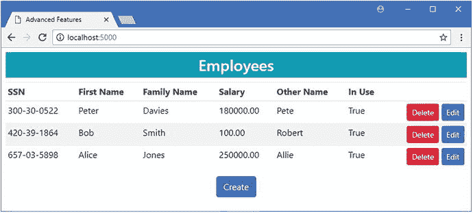
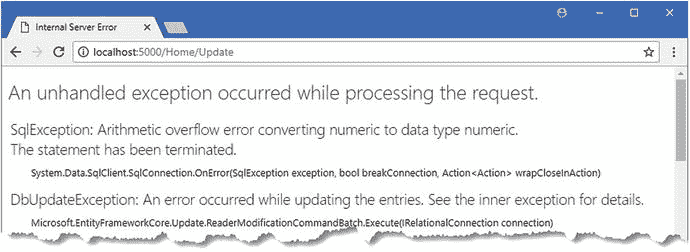
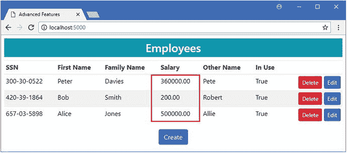
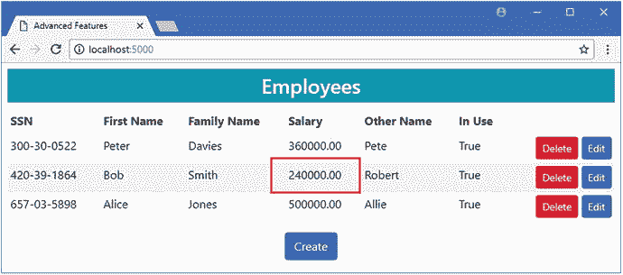
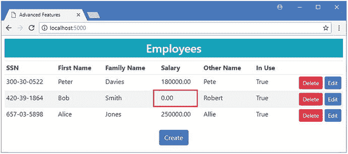
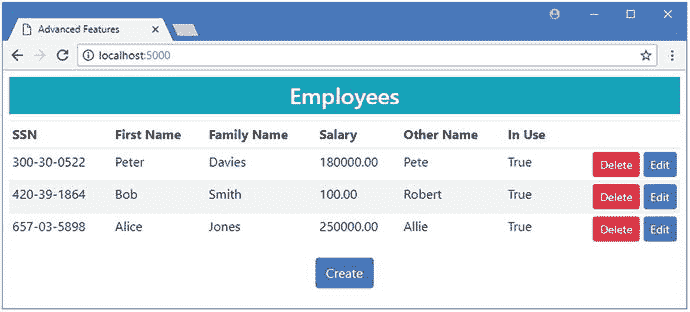
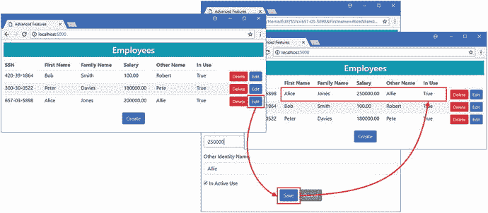
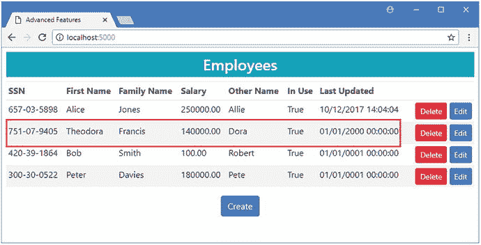
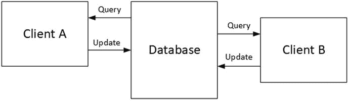
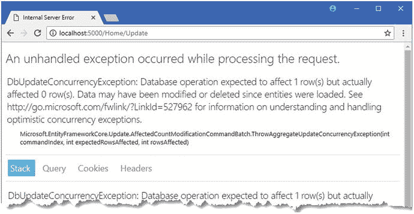

# 二十一、存储数据

在这一章中，我将继续描述 Entity Framework Core 提供的高级特性，重点是那些与添加或更新数据相关的特性。我将向您展示如何选择用于存储值的数据类型，如何格式化或验证值，如何对应用的其他部分隐藏数据值，以及如何检测多个客户端的并发更新。表 [21-1](#Tab1) 将本章放在上下文中。

表 21-1。

Putting Advanced Storage Features in Context

<colgroup><col> <col></colgroup> 
| 问题 | 回答 |
| --- | --- |
| 它们是什么？ | 这些特性允许您改变数据在数据库中的存储方式，覆盖传统的行为。这可以从选择特定的 SQL 类型到检测两个用户何时更新相同的数据。 |
| 它们为什么有用？ | 当您正在对现有数据库进行建模时，或者当您的应用具有使用标准功能无法轻松满足的特定需求时，这些功能会非常有用。 |
| 它们是如何使用的？ | 这些特性是通过模型类成员和流畅的 API 语句的组合来应用的。 |
| 有什么陷阱或限制吗？ | 其中一些特性改变了数据映射到数据模型对象的方式，如果不小心的话，会导致奇怪的结果。 |
| 有其他选择吗？ | 大多数项目可以使用标准的实体框架核心特性来存储数据。 |

表 [21-2](#Tab2) 总结了本章内容。

表 21-2。

Chapter Summary

<colgroup><col> <col> <col></colgroup> 
| 问题 | 解决办法 | 列表 |
| --- | --- | --- |
| 更改用于表示值的 SQL 数据类型 | 使用`HasColumnType`或`HasMaxLength`方法。 | 1–6 |
| 在将值提供给应用的其他部分或存储在数据库中之前，先处理这些值 | 使用支持字段 | 7–11 |
| 对应用的 MVC 部分隐藏数据值 | 使用阴影属性 | 12–15 |
| 设置默认值 | 使用`HasDefaultValue`方法 | 16–20 |
| 检测并发更新 | 使用并发令牌或启用行版本控制 | 21–30 |

## 为本章做准备

对于这一章，我将继续使用我在第 [19 章](19.html)中创建并在第 [20 章](20.html)中修改的 AdvancedApp 项目。为了准备这一章，我已经修改了`Home`控制器中的代码，如清单 [21-1](#Par5) 所示，将相关数据包含在由`Index`动作执行的查询中，并整理了`Update`方法，以便更新所有属性。

Tip

如果您不想遵循构建示例项目的过程，您可以从本书的源代码库中下载所有需要的文件，可以从 [`https://github.com/apress/pro-ef-core-2-for-asp.net-core-mvc`](https://github.com/apress/pro-ef-core-2-for-asp.net-core-mvc) 获得。

```cs
using AdvancedApp.Models;
using Microsoft.AspNetCore.Mvc;
using Microsoft.EntityFrameworkCore;
using System.Linq;

namespace AdvancedApp.Controllers {

    public class HomeController : Controller {
        private AdvancedContext context;

        public HomeController(AdvancedContext ctx) => context = ctx;

        public IActionResult Index() {
            return View(context.Employees.Include(e => e.OtherIdentity));
        }

        public IActionResult Edit(string SSN, string firstName, string familyName) {
            return View(string.IsNullOrWhiteSpace(SSN)
                ? new Employee() : context.Employees.Include(e => e.OtherIdentity)
                    .First(e => e.SSN == SSN
                        && e.FirstName == firstName
                        && e.FamilyName == familyName));
        }

        [HttpPost]
        public IActionResult Update(Employee employee) {
            if (context.Employees.Count(e => e.SSN == employee.SSN
                    && e.FirstName == employee.FirstName
                    && e.FamilyName == employee.FamilyName) == 0) {
                context.Add(employee);
            } else {
                context.Update(employee);
            }
            context.SaveChanges();
            return RedirectToAction(nameof(Index));
        }

        [HttpPost]
        public IActionResult Delete(Employee employee) {
            context.Attach(employee);
            employee.SoftDeleted = true;
            context.SaveChanges();
            return RedirectToAction(nameof(Index));
        }        
    }
}

Listing 21-1.Simplifying Code in the HomeController.cs File in the Controllers Folder

```

为了向用户显示`SecondaryIdentity`对象的细节，我对`Views/Home`文件夹中的`Index.cshtml`视图进行了清单 [21-2](#Par7) 所示的修改。我还借此机会删除了前一章中添加的一些内容，这些内容已不再需要。

```cs
@model IEnumerable<Employee>
@{
    ViewData["Title"] = "Advanced Features";
    Layout = "_Layout";
}
<h3 class="bg-info p-2 text-center text-white">Employees</h3>
<table class="table table-sm table-striped">
    <thead>
        <tr>
            <th>SSN</th>
            <th>First Name</th>
            <th>Family Name</th>
            <th>Salary</th>
            <th>Other Name</th>
            <th>In Use</th>
            <th></th>
        </tr>
    </thead>
    <tbody>
        <tr class="placeholder"><td colspan="7" class="text-center">No Data</td></tr>
        @foreach (Employee e in Model) {
            <tr>
                <td>@e.SSN</td>
                <td>@e.FirstName</td>
                <td>@e.FamilyName</td>
                <td>@e.Salary</td>
                <td>@(e.OtherIdentity?.Name ?? "(None)")</td>
                <td>@(e.OtherIdentity?.InActiveUse.ToString() ?? "(N/A)")</td>
                <td class="text-right">                        
                    <form>
                        <input type="hidden" name="SSN" value="@e.SSN" />
                        <input type="hidden" name="Firstname" value="@e.FirstName" />
                        <input type="hidden" name="FamilyName"
                            value="@e.FamilyName" />
                        <button type="submit" asp-action="Delete" formmethod="post"
                                class="btn btn-sm btn-danger">Delete</button>
                        <button type="submit" asp-action="Edit" formmethod="get"
                                class="btn btn-sm btn-primary">
                            Edit
                        </button>
                    </form>
                </td>
            </tr>
        }
    </tbody>
</table>
<div class="text-center">
    <a asp-action="Edit" class="btn btn-primary">Create</a>
</div>
Listing 21-2.Adding Content in the Index.cshtml File in the Views/Home Folder

```

接下来，在`AdvancedApp`项目文件夹中运行清单 [21-3](#Par9) 中所示的命令，删除并重新创建数据库。

```cs
dotnet ef database drop --force
dotnet ef database update
Listing 21-3.Dropping and Re-creating the Database

```

使用`dotnet run`启动应用，导航到`http://localhost:5000`，点击创建按钮，并使用表 [21-3](#Tab3) 中显示的值来存储三个`Employee`对象。

表 21-3。

The Data Values for Creating Example Objects

<colgroup><col> <col> <col> <col> <col> <col></colgroup> 
| severely subnormal 智力严重逊常 | 西方人名的第一个字 | 姓氏 | 薪水 | 其他名称 | 正在使用中 |
| --- | --- | --- | --- | --- | --- |
| 420-39-1864 | 上下移动 | 锻工 | One hundred thousand | 罗伯特 | 检查 |
| 657-03-5898 | 爱丽丝 | 琼斯 | Two hundred thousand | 艾莉 | 检查 |
| 300-30-0522 | 耗尽 | 戴维斯 | One hundred and eighty thousand | 银箱 | 检查 |

当你创建了所有三个对象后，你应该会看到如图 [21-1](#Fig1) 所示的布局。



图 21-1。

Running the example application

## 指定 SQL 数据类型

实体框架核心自动处理。NET 和 SQL 数据类型，无论是在代码优先项目的迁移中，还是在数据库优先项目的搭建阶段。数据库服务器并不总是支持相同的数据类型——或者以相同的方式实现它们——做出合适的类型选择是数据库提供者的责任。例如，这意味着针对两个不同数据库服务器的相同数据模型的迁移可能使用不同的 SQL 类型。

大多数提供程序使用相似的类型，但也有一些不同。表 [21-4](#Tab4) 显示了用于。NET 核心原语类型，是官方的 SQL Server 数据库提供者，也是最流行的 MySQL 提供者之一。

Caution

对于数据库提供程序的未来版本，这些映射可能会有所变化。创建迁移以明确确定提供程序使用的数据类型。

表 21-4。

The Database Provider Mappings for .NET Core Primitive Types

<colgroup><col> <col> <col></colgroup> 
| 。网芯型 | SQL Server 类型 | MySQL 类型 |
| --- | --- | --- |
| `int` | `int` | `int` |
| `long` | `bigint` | `bigint` |
| `bool` | `bit` | `bit` |
| `byte` | `tinyint` | `tinyint` |
| `double` | `float` | `double` |
| `char` | `int` | `tinyint` |
| `short` | `smallint` | `smallint` |
| `float` | `real` | `float` |
| `decimal` | `decimal(18,2)` | `decimal(65,30)` |
| `string` | `nvarchar(max)` | `longtext` |
| `TimeSpan` | `time` | `time(6)` |
| `DateTime` | `datetime2` | `datetime(6)` |
| `DateTimeOffset` | `datetimeoffset` | `datetime(6)` |
| `Guid` | `uniqueidentifier` | `char(36)` |

如果 Entity Framework Core 选择的类型不适合您，您可以更改用于存储值的 SQL 数据类型。此功能最常用于调整类型，以确保应用生成的值具有足够的精度，或者选择较小的数据类型来限制可以存储的值。

`Employee`类的`Salary`属性被表示为. NET `decimal`，SQL Server provider 将其映射到`decimal(18,2)` SQL 类型(表示小数点左边有 18 位数字，右边有 2 位数字)。这比我表达个人收入所需的更精确，在清单 [21-4](#Par18) 中，我已经告诉实体框架核心使用一个不太精确的类型，覆盖在第 [19 章](19.html)中创建第一个迁移时选择的默认类型。

Caution

实体框架核心不验证您指定的类型或最大长度，这意味着您必须确保您选择的类型和大小适合您的需求。

```cs
using Microsoft.EntityFrameworkCore;

namespace AdvancedApp.Models {

    public class AdvancedContext : DbContext {

        public AdvancedContext(DbContextOptions<AdvancedContext> options)
            : base(options) {}

        public DbSet<Employee> Employees { get; set; }

        protected override void OnModelCreating(ModelBuilder modelBuilder) {

            modelBuilder.Entity<Employee>()
                .HasQueryFilter(e => !e.SoftDeleted);

            modelBuilder.Entity<Employee>().Ignore(e => e.Id);
            modelBuilder.Entity<Employee>()
                .HasKey(e => new { e.SSN, e.FirstName, e.FamilyName });

            modelBuilder.Entity<Employee>()
                .Property(e => e.Salary).HasColumnType("decimal(8,2)");

            modelBuilder.Entity<SecondaryIdentity>()
                .HasOne(s => s.PrimaryIdentity)
                .WithOne(e => e.OtherIdentity)
                .HasPrincipalKey<Employee>(e => new { e.SSN,
                     e.FirstName, e.FamilyName })
                .HasForeignKey<SecondaryIdentity>(s => new { s.PrimarySSN,
                     s.PrimaryFirstName, s.PrimaryFamilyName });
        }
    }
}

Listing 21-4.Changing a Data Type in the AdvancedContext.cs File in the Models Folder

```

`HasColumnType`方法用于为使用`Property`方法选择的属性指定 SQL 类型。在清单中，我指定了类型`decimal(8,2)`，这将小数点左边的位数减少到 8。

Note

如果您不喜欢使用 Fluent API，您可以通过使用`Column`属性并提供一个`TypeName`参数:`[Column(TypeName = "decimal(8, 2)")]`来指定属性的 SQL 类型。

### 指定最大长度

如果您正在处理一个将使用数组数据类型存储在数据库中的值，例如`string`或`int[]`，那么您可以向 Entity Framework Core 提供关于您需要存储的数据量的指导，而不必显式选择 SQL 数据类型，这意味着您可以影响数据类型的选择，而不必做出特定于单个数据库提供者或服务器的决策。在清单 [21-5](#Par23) 中，我使用了 Fluent API 为由`SecondaryIdentity`类定义的`Name`属性设置了一个最大长度。

Note

如果您不想使用 Fluent API，可以通过用`MaxLength`属性修饰属性来指定最大长度。

```cs
using Microsoft.EntityFrameworkCore;

namespace AdvancedApp.Models {

    public class AdvancedContext : DbContext {

        public AdvancedContext(DbContextOptions<AdvancedContext> options)
            : base(options) {}

        public DbSet<Employee> Employees { get; set; }

        protected override void OnModelCreating(ModelBuilder modelBuilder) {

            modelBuilder.Entity<Employee>()
                .HasQueryFilter(e => !e.SoftDeleted);

            modelBuilder.Entity<Employee>().Ignore(e => e.Id);
            modelBuilder.Entity<Employee>()
                .HasKey(e => new { e.SSN, e.FirstName, e.FamilyName });

            modelBuilder.Entity<Employee>()
                .Property(e => e.Salary).HasColumnType("decimal(8,2)");

            modelBuilder.Entity<SecondaryIdentity>()
                .HasOne(s => s.PrimaryIdentity)
                .WithOne(e => e.OtherIdentity)
                .HasPrincipalKey<Employee>(e => new { e.SSN,
                     e.FirstName, e.FamilyName })
                .HasForeignKey<SecondaryIdentity>(s => new { s.PrimarySSN,
                     s.PrimaryFirstName, s.PrimaryFamilyName });

            modelBuilder.Entity<SecondaryIdentity>()
                .Property(e => e.Name).HasMaxLength(100);
        }
    }
}

Listing 21-5.Setting a Maximum Length in the AdvancedContext.cs File in the Models Folder

```

`HasMaxLength`方法用于指定最大长度，我用它为`Name`属性指定了最多 100 个字符。

### 更新数据库

更改数据类型或指定最大长度需要进行迁移以更新数据库。在`AdvancedApp`项目文件夹中运行清单 [21-6](#Par26) 中所示的命令，创建并应用一个新的迁移。

```cs
dotnet ef migrations add ChangeType
dotnet ef database update
Listing 21-6.Creating and Applying a Database Migration

```

如果您检查`Migrations`文件夹中的`<timestamp>_ChangeType.cs`文件中的`Up`方法，您将看到`HasColumnType`和`HasMaxLength`方法的效果。

```cs
...
protected override void Up(MigrationBuilder migrationBuilder) {
    migrationBuilder.AlterColumn<string>(name: "Name", table: "SecondaryIdentity",
        maxLength: 100, nullable: true, oldClrType: typeof(string),
        oldNullable: true);

    migrationBuilder.AlterColumn<decimal>(name: "Salary",table: "Employees",
        type: "decimal(8,2)",nullable: false, oldClrType: typeof(decimal));
}
...

```

我在清单 [21-4](#Par18) 中指定的数据类型可以容纳小数点前有八位数的数字。要查看当一个数字超过可用存储时会发生什么，使用`dotnet run`启动应用，导航到`http://localhost:5000`，并单击所显示项目之一的编辑按钮。将`Salary`字段的值更改为 100000000(1，后跟 8 个零)，然后单击保存按钮。实体框架核心将尝试更新数据库，但是由于`Salary`值的位数多于使用指定类型所能存储的位数，因此会报告一个错误，如图 [21-2](#Fig2) 所示。您遇到的具体错误将取决于不匹配的性质，但关键是您必须确保应用不会尝试(或允许用户尝试)存储数据库无法表示的值。



图 21-2。

Exceeding the available storage for a data value

## 验证或格式化数据值

在许多应用中，实体类只是提供对数据库中数据的方便访问的属性集合。但是，在某些情况下，提供对数据值的直接访问可能会出现问题，因为需要某种形式的处理或验证。

实体框架核心支持后台字段，后台字段将值存储在数据库中，但对应用的其余部分不可用，而是可以访问由属性调节的数据。通过演示，这更容易理解，在清单 [21-7](#Par32) 中，我已经更改了`Employee`类中的`Salary`属性，因此它不再提供对数据库中值的直接访问，而是使用一个后备字段。

```cs
using System;

namespace AdvancedApp.Models {

    public class Employee {
        private decimal databaseSalary;

        public long Id { get; set; }
        public string SSN { get; set; }
        public string FirstName { get; set; }
        public string FamilyName { get; set; }

        public decimal Salary {
            get => databaseSalary * 2;
            set => databaseSalary = Math.Max(0, value);
        }

        public SecondaryIdentity OtherIdentity { get; set; }

        public bool SoftDeleted { get; set; } = false;
    }
}

Listing 21-7.Defining a Backing Field in the Employee.cs File in the Models Folder

```

支持字段称为`databaseSalary`。支持字段必须具有与您想要处理的属性兼容的类型，在这种情况下，支持字段和`Salary`属性都使用`decimal`类型。通过使用后备字段，我可以重新调整`Salary`属性的用途，以验证或转换存储在数据库中的值。在清单中，`Salary`属性的 getter 返回后台字段值的两倍，setter 确保可以赋给后台字段的最小值为零，防止负值。

向实体类添加一个支持字段是不够的，因为实体框架核心将只是假设它应该继续使用`Salary`属性。在清单 [21-8](#Par36) 中，我使用了 Fluent API 来告诉实体框架核心关于后台字段以及应该如何使用它。

Note

支持字段只能使用 Fluent API 进行配置。没有支持此功能的属性。

```cs
using Microsoft.EntityFrameworkCore;

namespace AdvancedApp.Models {

    public class AdvancedContext : DbContext {

        public AdvancedContext(DbContextOptions<AdvancedContext> options)
            : base(options) {}

        public DbSet<Employee> Employees { get; set; }

        protected override void OnModelCreating(ModelBuilder modelBuilder) {

            modelBuilder.Entity<Employee>()
                .HasQueryFilter(e => !e.SoftDeleted);

            modelBuilder.Entity<Employee>().Ignore(e => e.Id);
            modelBuilder.Entity<Employee>()
                .HasKey(e => new { e.SSN, e.FirstName, e.FamilyName });

            modelBuilder.Entity<Employee>()
                .Property(e => e.Salary).HasColumnType("decimal(8,2)")
                .HasField("databaseSalary")
                .UsePropertyAccessMode(PropertyAccessMode.Field);

            modelBuilder.Entity<SecondaryIdentity>()
                .HasOne(s => s.PrimaryIdentity)
                .WithOne(e => e.OtherIdentity)
                .HasPrincipalKey<Employee>(e => new { e.SSN,
                     e.FirstName, e.FamilyName })
                .HasForeignKey<SecondaryIdentity>(s => new { s.PrimarySSN,
                     s.PrimaryFirstName, s.PrimaryFamilyName });

            modelBuilder.Entity<SecondaryIdentity>()
                .Property(e => e.Name).HasMaxLength(100);
        }
    }
}

Listing 21-8.Setting Up a Backing Field in the AdvancedContext.cs File in the Models Folder

```

我可以通过链接对现有的选择`Salary`属性的 Fluent API 语句的调用来进一步配置该属性，我在上一节中使用它来更改数据类型。我使用`HasField`方法配置支持字段，将字段的名称指定为参数。后备字段的使用方式通过调用`UsePropertyAccessMode`方法配置，从`PropertyAccessMode`枚举中指定一个值，如表 [21-5](#Tab5) 所述。

Tip

您不必使用`UsePropertyAccessMode`来配置支持字段，但这样做可以确保实体框架核心以您期望的方式使用字段，并使支持字段的用途对阅读您的流畅 API 语句的其他开发人员来说显而易见。

表 21-5。

The PropertyAccessMode Values

<colgroup><col> <col></colgroup> 
| 名字 | 描述 |
| --- | --- |
| `FieldDuringConstruction` | 这是默认行为，它告诉实体框架核心在首次创建对象时使用支持字段，然后对所有其他操作(包括更改检测)使用该属性。 |
| `Field` | 该值告诉实体框架核心忽略该属性，并始终使用支持字段。 |
| `Property` | 该值告诉实体框架核心始终使用属性并忽略支持字段。 |

选择正确的`PropertyAccessMode`值很重要，因为这个值会导致实体框架核心以完全不同的方式运行。在清单 [21-8](#Par36) 中，后备字段总是“真”值，所以我使用了`Field`值，这确保了实体框架核心在使用查询数据创建对象时直接将数据库中的值赋给后备字段，并在向数据库写入更新时使用后备字段值。

添加支持字段时，不需要对数据库进行任何更改，因为此功能只影响数据值映射到实体类的方式。要查看本部分更改的效果，使用`dotnet run`启动应用并导航至`http://localhost:5000`。当实体框架核心为`Employee`对象查询数据时，它将`Salary`列中的值分配给支持字段。当 Razor 视图枚举`Employee`对象时，它读取`Salary`属性的值，其 getter 返回存储在数据库中的双倍值，产生如图 [21-3](#Fig3) 所示的结果。



图 21-3。

Using a backing field to mediate access to values

要查看更改属性值对支持字段的影响，单击其中一个`Employee`对象的编辑按钮，并在 Salary 字段中输入 120000(十二万，不带逗号)。

我用`PropertyAccessMode.Field`值配置了支持字段，这意味着使用支持字段的值而不是属性来更新数据库。当实体框架核心执行变更检测时，用于更新数据库的是后台字段值，而不是`Salary`属性的 getter。为了确认这一点，从 Visual Studio 工具菜单中选择 SQL Server ➤新建查询，连接到数据库，并执行清单 [21-9](#Par43) 中所示的查询。

```cs
USE AdvancedDb
SELECT * FROM Employees
Listing 21-9.Querying the Database

```

查询结果显示，当实体框架核心更新`Employees`表中的`Salary`列时，使用了后备字段，如表 [21-6](#Tab6) 所示。

表 21-6。

The Database Results

<colgroup><col> <col> <col> <col></colgroup> 
| 姓氏 | 西方人名的第一个字 | severely subnormal 智力严重逊常 | 薪水 |
| --- | --- | --- | --- |
| 戴维斯 | 耗尽 | 300-30-0522 | One hundred and eighty thousand |
| 琼斯 | 爱丽丝 | 657-03-5898 | Two hundred thousand |
| 锻工 | 上下移动 | 420-39-1864 | One hundred and twenty thousand |

如果我使用了`FieldDuringConstruction`值，那么实体框架核心就会在更新数据库时使用`Salary`属性 getter 来获得一个值。

更新后的值仍然由应用的其余部分通过`Salary`属性 getter 读取，应用的其余部分仍然不知道支持字段。这反映在应用的 ASP.NET Core MVC 部分显示的视图中，如图 [21-4](#Fig4) 所示，它显示了存储在数据库中的值的两倍。



图 21-4。

Updating a value with a backing field

### 避免后备字段选择性更新陷阱

在实现不总是更新与之关联的后台字段的设置器时，必须小心。为了演示这个问题，我更改了`Salary`属性的设置器，这样它只更新偶数值的支持字段，如清单 [21-10](#Par48) 所示。我还更改了`Salary`属性的 getter，使它返回后台字段的未修改值，这将使问题更容易理解。

```cs
using System;

namespace AdvancedApp.Models {

    public class Employee {
        private decimal databaseSalary;

        public long Id { get; set; }
        public string SSN { get; set; }
        public string FirstName { get; set; }
        public string FamilyName { get; set; }

        public decimal Salary {
            get => databaseSalary;
            set {
                if (value % 2 == 0) {
                    databaseSalary = value;
                }
            }
        }

        public SecondaryIdentity OtherIdentity { get; set; }

        public bool SoftDeleted { get; set; } = false;
    }
}

Listing 21-10.Selectively Updating the Field in the Employee.cs File in the Models Folder

```

使用`dotnet run`启动应用，导航到`http://localhost:5000`，点击其中一个编辑按钮。在薪金字段中输入一个奇数，如 101，然后单击保存按钮。实体框架核心会用 0 更新数据库，而不是你输入的值，如图 [21-5](#Fig5) 所示。



图 21-5。

The effect of a selective backing field update

只有实体框架核心了解后台字段以及如何使用它们。在 ASP.NET Core MVC 应用中，MVC 模型绑定器也负责创建对象。当浏览器向控制器发送 HTTP POST 请求时，模型绑定器创建一个新的`Employee`对象，并使用用户发送的值设置属性。与实体框架核心创建一个`Employee`不同，模型绑定器忽略支持字段，并使用`Salary`属性的设置器来分配来自 HTTP 请求的值。但是 setter 忽略了 MVC 模型绑定器分配的值，因为它不是一个偶数。这意味着当`Employee`对象被移交给上下文对象以便实体框架核心可以执行更新时，支持字段具有其默认值(对于`decimal`值为零)。

避免这个问题的最好方法是编写总是更新其后台字段的 setters。如果这是不可能的，那么您可以查询数据库，以便 Entity Framework Core 创建一个具有现有值的对象，并将来自 HTTP 请求的值直接应用于它，如清单 [21-11](#Par52) 所示。

```cs
using AdvancedApp.Models;
using Microsoft.AspNetCore.Mvc;
using Microsoft.EntityFrameworkCore;
using System.Linq;

namespace AdvancedApp.Controllers {

    public class HomeController : Controller {
        private AdvancedContext context;

        public HomeController(AdvancedContext ctx) => context = ctx;

        public IActionResult Index() {
            return View(context.Employees.Include(e => e.OtherIdentity));
        }

        public IActionResult Edit(string SSN, string firstName, string familyName) {
            return View(string.IsNullOrWhiteSpace(SSN)
                ? new Employee() : context.Employees.Include(e => e.OtherIdentity)
                    .First(e => e.SSN == SSN
                        && e.FirstName == firstName
                        && e.FamilyName == familyName));
        }

        [HttpPost]
        public IActionResult Update(Employee employee, decimal salary) {
            Employee existing = context.Employees.Find(employee.SSN,
                employee.FirstName, employee.FamilyName);
            if (existing == null) {
                context.Add(employee);
            } else {
                existing.Salary = salary;
            }
            context.SaveChanges();
            return RedirectToAction(nameof(Index));
        }

        [HttpPost]
        public IActionResult Delete(Employee employee) {
            context.Attach(employee);
            employee.SoftDeleted = true;
            context.SaveChanges();
            return RedirectToAction(nameof(Index));
        }        
    }
}

Listing 21-11.Setting Values Directly in the HomeController.cs File in the Controllers Folder

```

我已经修改了`Update`方法，这样它就可以在数据库中查询现有的`Employee`对象，这给了我一个由实体框架核心创建的对象，它的后台字段被正确初始化。然后，我在`Salary`字段中分配用户指定的值，我通过向 action 方法添加一个`salary`参数来接收该值，如下所示:

```cs
...
public IActionResult Update(Employee employee, decimal salary) {
...

```

这为我提供了用户输入到 HTML 表单中的值，以便我可以将它赋给`Salary`属性。

```cs
...
existing.Salary = salary;
...

```

如果 setter 更新了后台字段，那么 Entity Framework Core 将检测到更改的值并更新数据库。如果 setter 丢弃了新值(因为在这种情况下它是奇数)，那么 Entity Framework Core 将不会检测到任何变化，并且存储在数据库中的原始值将被保留。

启动应用，导航到`http://localhost:5000`，重复在 Salary 字段中输入一个偶数(如 100)和一个奇数(如 101)的过程。这一次，当您保存更改时，奇数将被丢弃，但偶数仍将存储在数据库中，如图 [21-6](#Fig6) 所示。



图 21-6。

Avoiding setting a backing field to the default value for its type

## 对 MVC 应用隐藏数据值

有些类型的数据是执行数据库操作所必需的，但是不应该被应用的 MVC 部分访问，因为这些数据是敏感的，或者因为您希望将应用的焦点放在用户直接看到的数据上。在这些情况下，您可以使用影子属性，这些属性是在数据模型中定义的，而不是在表示该数据的实体类中定义的。

跟踪对象存储在数据库中的时间是影子属性最常见的用途，它提供的信息可能有助于诊断问题，但用户对此不感兴趣，不应通过应用的 ASP.NET Core MVC 部分公开。

Fluent API 用于创建阴影属性。在清单 [21-12](#Par63) 中，我在`Employee`类中添加了一个名为`LastUpdated`的影子属性。

Note

只能使用 Fluent API 配置阴影属性。没有支持此功能的属性。

```cs
using Microsoft.EntityFrameworkCore;

using System;

namespace AdvancedApp.Models {

    public class AdvancedContext : DbContext {

        public AdvancedContext(DbContextOptions<AdvancedContext> options)
            : base(options) {}

        public DbSet<Employee> Employees { get; set; }

        protected override void OnModelCreating(ModelBuilder modelBuilder) {

            modelBuilder.Entity<Employee>()
                .HasQueryFilter(e => !e.SoftDeleted);

            modelBuilder.Entity<Employee>().Ignore(e => e.Id);
            modelBuilder.Entity<Employee>()
                .HasKey(e => new { e.SSN, e.FirstName, e.FamilyName });

            modelBuilder.Entity<Employee>()
                .Property(e => e.Salary).HasColumnType("decimal(8,2)")
                .HasField("databaseSalary")
                .UsePropertyAccessMode(PropertyAccessMode.Field);

            modelBuilder.Entity<Employee>().Property<DateTime>("LastUpdated");

            modelBuilder.Entity<SecondaryIdentity>()
                .HasOne(s => s.PrimaryIdentity)
                .WithOne(e => e.OtherIdentity)
                .HasPrincipalKey<Employee>(e => new { e.SSN,
                     e.FirstName, e.FamilyName })
                .HasForeignKey<SecondaryIdentity>(s => new { s.PrimarySSN,
                     s.PrimaryFirstName, s.PrimaryFamilyName });

            modelBuilder.Entity<SecondaryIdentity>()
                .Property(e => e.Name).HasMaxLength(100);
        }
    }
}

Listing 21-12.Defining a Shadow Property in the AdvancedContext.cs File in the Models Folder

```

shadow 属性是通过使用`Entity`方法选择类，然后调用`Property`方法来定义的。这是与前面例子中使用的`Property`方法不同的版本。实参指定 shadow 属性的名称，type 形参用于指定其数据类型；清单 [21-12](#Par63) 中的语句中的 Fluent API 告诉实体框架核心有一个名为`LastUpdated`的`DateTime`属性。

Tip

您可以链接对类似于`IsRequired`的方法的额外调用来配置影子属性，就像配置任何其他属性一样。

向现有数据库添加影子属性需要迁移。在`AdvancedDb`项目文件夹中运行清单 [21-13](#Par67) 中所示的命令，创建一个名为`ShadowProperty`的迁移，并将其应用到数据库中。

```cs
dotnet ef migrations add ShadowProperty
dotnet ef database update
Listing 21-13.Creating and Applying a Migration

```

如果您检查已经在`Migrations`文件夹中创建的`<timestamp>_ShadowProperty.cs`文件的`Up`方法，您可以看到实体框架核心是如何为 shadow 属性建立一个列的，即使在`Employee`类中没有相应的属性。

```cs
...
protected override void Up(MigrationBuilder migrationBuilder) {
    migrationBuilder.AddColumn<DateTime>(
        name: "LastUpdated",
        table: "Employees",
        nullable: false,
        defaultValue: new DateTime(1, 1, 1, 0, 0, 0, 0, DateTimeKind.Unspecified));
}
...

```

### 访问阴影属性值

阴影属性可以通过 context 类访问。在清单 [21-14](#Par71) 中，我修改了`Advanced`控制器中的`Update`动作，这样当数据库发生变化时，就会给`LastUpdated`影子属性赋值。

```cs
...
[HttpPost]
public IActionResult Update(Employee employee, decimal salary) {
    Employee existing = context.Employees.Find(employee.SSN,
        employee.FirstName, employee.FamilyName);
    if (existing == null) {
        context.Entry(employee)
            .Property("LastUpdated").CurrentValue = System.DateTime.Now;
        context.Add(employee);
    } else {
        existing.Salary = salary;
        context.Entry(existing)
            .Property("LastUpdated").CurrentValue = System.DateTime.Now;
    }
    context.SaveChanges();
    return RedirectToAction(nameof(Index));
}
...
Listing 21-14.Updating a Shadow Property in the HomeController.cs File in the Controllers Folder

```

我在第 [12 章](12.html)中使用了`Entry`方法来访问实体框架核心变更检测特性，但是返回的对象也通过它的`Property`方法来访问影子属性。可以使用`CurrentValue`属性读取或设置影子属性的值，在清单中，我将当前时间赋给影子属性。

Note

阴影属性只能通过 context 对象来访问，这意味着即使您直接在控制器中使用 context，就像我在本例中所做的那样，MVC 模型绑定器也不能为任何阴影属性设置值，即使 HTTP 请求包含一个值。

### 在查询中包含阴影属性

静态`EF.Property`方法用于在 LINQ 查询中包含阴影属性，这意味着您可以将阴影属性合并到查询中。在清单 [21-15](#Par75) 中，我使用了`EF.Property`方法，通过 shadow 属性值对数据库中的对象进行排序。

```cs
using AdvancedApp.Models;
using Microsoft.AspNetCore.Mvc;
using Microsoft.EntityFrameworkCore;
using System.Linq;

using System;

namespace AdvancedApp.Controllers {

    public class HomeController : Controller {
        private AdvancedContext context;

        public HomeController(AdvancedContext ctx) => context = ctx;

        public IActionResult Index() {
            return View(context.Employees.Include(e => e.OtherIdentity)
                .OrderByDescending(e => EF.Property<DateTime>(e, "LastUpdated")));
        }

        // ...other actions omitted for brevity...
    }
}

Listing 21-15.Querying with a Shadow Property in the HomeController.cs File in the Controllers Folder

```

`EF.Property`方法接受被查询的对象和阴影属性的名称。有一个类型参数必须设置为用于在 Fluent API 语句中定义属性的类型。要查看 shadow 属性的使用，使用`dotnet run`启动应用并导航到`http://localhost:5000`。

编辑其中一个`Employee`对象，点击保存按钮，会看到它出现在表格的第一行，如图 [21-7](#Fig7) 所示。



图 21-7。

Using a shadow property to order objects in a LINQ query

## 设置默认值

当我在上一节中设置`LastUpdated`属性时，我负责在两个地方设置值:一次是当对象第一次存储在数据库中时，另一次是当现有对象被修改时。

当存储一个新对象时，我可以通过请求实体框架核心为`LastUpdated`属性设置一个默认值来删除其中的一个语句。为了设置`LastUpdated`属性的默认值，我在一个流畅的 API 语句中使用了`HasDefaultValue`方法，如清单 [21-16](#Par81) 所示。

Note

只能使用 Fluent API 指定默认值。没有支持此功能的属性。

```cs
using Microsoft.EntityFrameworkCore;
using System;

namespace AdvancedApp.Models {

    public class AdvancedContext : DbContext {

        public AdvancedContext(DbContextOptions<AdvancedContext> options)
            : base(options) {}

        public DbSet<Employee> Employees { get; set; }

        protected override void OnModelCreating(ModelBuilder modelBuilder) {

            modelBuilder.Entity<Employee>()
                .HasQueryFilter(e => !e.SoftDeleted);

            modelBuilder.Entity<Employee>().Ignore(e => e.Id);
            modelBuilder.Entity<Employee>()
                .HasKey(e => new { e.SSN, e.FirstName, e.FamilyName });

            modelBuilder.Entity<Employee>()
                .Property(e => e.Salary).HasColumnType("decimal(8,2)")
                .HasField("databaseSalary")
                .UsePropertyAccessMode(PropertyAccessMode.Field);

            modelBuilder.Entity<Employee>().Property<DateTime>("LastUpdated")
                .HasDefaultValue(new DateTime(2000, 1, 1));

            modelBuilder.Entity<SecondaryIdentity>()
                .HasOne(s => s.PrimaryIdentity)
                .WithOne(e => e.OtherIdentity)
                .HasPrincipalKey<Employee>(e => new { e.SSN,
                     e.FirstName, e.FamilyName })
                .HasForeignKey<SecondaryIdentity>(s => new { s.PrimarySSN,
                     s.PrimaryFirstName, s.PrimaryFamilyName });

            modelBuilder.Entity<SecondaryIdentity>()
                .Property(e => e.Name).HasMaxLength(100);
        }
    }
}

Listing 21-16.Configuring a Default Value in the AdvancedContext.cs File in the Models Folder

```

`HasDefaultValue`方法用于指定一个缺省值，当在数据库中创建一个新行时将使用这个缺省值。您可以在存储对象时通过为属性提供一个值来覆盖默认值，但是如果您不这样做，那么将使用传递给`HasDefaultValue`方法的默认值。

设置默认值需要新的迁移。在`AdvancedApp`项目文件夹中运行清单 [21-17](#Par84) 中所示的命令，创建一个名为`DefaultValue`的迁移，并将其应用到数据库中。

```cs
dotnet ef migrations add DefaultValue
dotnet ef database update
Listing 21-17.Creating and Applying a Database Migration

```

如果您检查已经在`Migrations`文件夹中创建的`<timestamp>_DefaultValue.cs`文件中的`Up`方法，您将会看到与`LastUpdated`列相关联的默认值已经被更改为 2000 年 1 月 1 日，这反映了清单 [21-16](#Par81) 中指定的日期。

```cs
...
protected override void Up(MigrationBuilder migrationBuilder) {
    migrationBuilder.AlterColumn<DateTime>(
        name: "LastUpdated",
        table: "Employees",
        nullable: false,
        defaultValue: new DateTime(2000, 1, 1, 0, 0, 0, 0, DateTimeKind.Unspecified),
        oldClrType: typeof(DateTime));
}
...

```

### 显示默认值

为了在应用的其余部分完成这个例子，我将向用户显示属性`LastUpdate`的值。在清单 [21-18](#Par88) 中，我通过修改`Employee`类将`LastUpdated`属性从一个影子属性提升为一个可以被应用的其余部分访问的属性。这不会改变属性的行为，只是意味着属性值不必通过上下文对象来访问。

```cs
using System;

namespace AdvancedApp.Models {

    public class Employee {
        private decimal databaseSalary;

        public long Id { get; set; }
        public string SSN { get; set; }
        public string FirstName { get; set; }
        public string FamilyName { get; set; }

        public decimal Salary {
            get => databaseSalary;
            set {
                if (value % 2 == 0) {
                    databaseSalary = value;
                }
            }
        }

        public SecondaryIdentity OtherIdentity { get; set; }

        public bool SoftDeleted { get; set; } = false;

        public DateTime LastUpdated { get; set; }
    }
}

Listing 21-18.Adding a Property in the Employee.cs File in the Models Folder

```

在清单 [21-19](#Par90) 中，我修改了`Home`控制器中的`Update`方法，删除了存储新对象时设置`LastUpdated`属性的语句，而是依赖默认值。

```cs
...
[HttpPost]
public IActionResult Update(Employee employee, decimal salary) {
    Employee existing = context.Employees.Find(employee.SSN,
        employee.FirstName, employee.FamilyName);
    if (existing == null) {
        //context.Entry(employee)
        //    .Property("LastUpdated").CurrentValue = System.DateTime.Now;
        context.Add(employee);
    } else {
        existing.Salary = salary;
        context.Entry(existing)
            .Property("LastUpdated").CurrentValue = System.DateTime.Now;
    }
    context.SaveChanges();
    return RedirectToAction(nameof(Index));
}
...
Listing 21-19.Disabling a Statement in the HomeController.cs File in the Controllers Folder

```

最后一步是向`Home`控制器使用的`Index`视图添加一列来显示`LastUpdated`属性的值，如清单 [21-20](#Par92) 所示。

```cs
@model IEnumerable<Employee>
@{
    ViewData["Title"] = "Advanced Features";
    Layout = "_Layout";
}
<h3 class="bg-info p-2 text-center text-white">Employees</h3>
<table class="table table-sm table-striped">
    <thead>
        <tr>
            <th>SSN</th>
            <th>First Name</th>
            <th>Family Name</th>
            <th>Salary</th>
            <th>Other Name</th>
            <th>In Use</th>
            <th>Last Updated</th>
            <th></th>
        </tr>
    </thead>
    <tbody>
        <tr class="placeholder"><td colspan="8" class="text-center">No Data</td></tr>
        @foreach (Employee e in Model) {
            <tr>
                <td>@e.SSN</td>
                <td>@e.FirstName</td>
                <td>@e.FamilyName</td>
                <td>@e.Salary</td>
                <td>@(e.OtherIdentity?.Name ?? "(None)")</td>
                <td>@(e.OtherIdentity?.InActiveUse.ToString() ?? "(N/A)")</td>
                <td>@e.LastUpdated.ToLocalTime()</td>
                <td class="text-right">                        
                    <form>
                        <input type="hidden" name="SSN" value="@e.SSN" />
                        <input type="hidden" name="Firstname" value="@e.FirstName" />
                        <input type="hidden" name="FamilyName"
                            value="@e.FamilyName" />
                        <button type="submit" asp-action="Delete" formmethod="post"
                                class="btn btn-sm btn-danger">Delete</button>
                        <button type="submit" asp-action="Edit" formmethod="get"
                                class="btn btn-sm btn-primary">
                            Edit
                        </button>
                    </form>
                </td>
            </tr>
        }
    </tbody>
</table>
<div class="text-center">
    <a asp-action="Edit" class="btn btn-primary">Create</a>
</div>
Listing 21-20.Adding a Column in the Index.cshtml File in the Views/Home Folder

```

要查看默认值，使用`dotnet run`启动应用，导航到`http://localhost:5000`，并单击 Create 按钮。填写表单字段，然后单击保存按钮；您将看到新对象被赋予了一个 2000 年 1 月 1 日的`LastUpdated`值，这是我在清单 [21-16](#Par81) 中使用的默认值，如图 [21-8](#Fig8) 所示。显示的日期将采用您系统的默认区域设置；图中显示的日期采用英国使用的格式。

Tip

如果在将`LastUpdated`列添加到数据库中的`Employee`表之前，您的数据库包含`Employee`对象，并且您尚未编辑这些对象，您将看到一个值为 Jan 01 0001 的`LastUpdated`，如图所示。这是因为默认值仅在创建新对象时应用。在创建`LastUpdated`列时，数据库中的现有数据被赋值为全零，这就是所显示的内容。



图 21-8。

Assigning a default value

## 检测并发更新

当用户编辑数据时，大多数 ASP.NET Core MVC 应用遵循一个查询-更新周期。在查询中从数据库中检索现有数据值，以向用户提供初始状态，然后使用任何更改进行更新。如图 [21-9](#Fig9) 所示，当有几个用户同时执行该循环时，这可能是个问题。



图 21-9。

Concurrent updates

客户端 A 和客户端 B 查询相同的数据并获得相同的值。客户端 A 执行更新，不久之后，客户端 b 也执行更新。

这可能会导致一系列问题，包括更新被悄悄覆盖，以及看似有效的更新出现异常。随着客户端继续处理不一致或不完整的数据，一些问题可能需要一段时间才能显现出来。

### 使用并发令牌

实体框架核心可以被配置为检查与对象相关联的值，以确保它在数据被读取后没有被更改。为该检查选择的属性称为并发令牌，当您不想(或者不能)对数据库进行更改以防止并发更新时，这种技术非常有用。在清单 [21-21](#Par100) 中，我已经配置了数据模型，使`Salary`属性成为更新`Employee`对象的并发令牌。

Caution

正如您将了解到的，并发令牌特性有一些严重的限制。如果您能够修改数据库，还有一个更好的选择，如下一节所述。

```cs
using Microsoft.EntityFrameworkCore;
using System;

namespace AdvancedApp.Models {

    public class AdvancedContext : DbContext {

        public AdvancedContext(DbContextOptions<AdvancedContext> options)
            : base(options) {}

        public DbSet<Employee> Employees { get; set; }

        protected override void OnModelCreating(ModelBuilder modelBuilder) {

            modelBuilder.Entity<Employee>()
                .HasQueryFilter(e => !e.SoftDeleted);

            modelBuilder.Entity<Employee>().Ignore(e => e.Id);
            modelBuilder.Entity<Employee>()
                .HasKey(e => new { e.SSN, e.FirstName, e.FamilyName });

            modelBuilder.Entity<Employee>()
                .Property(e => e.Salary).HasColumnType("decimal(8,2)")
                .HasField("databaseSalary")
                .UsePropertyAccessMode(PropertyAccessMode.Field)
                .IsConcurrencyToken();

            modelBuilder.Entity<Employee>().Property<DateTime>("LastUpdated")
                .HasDefaultValue(new DateTime(2000, 1, 1));

            modelBuilder.Entity<SecondaryIdentity>()
                .HasOne(s => s.PrimaryIdentity)
                .WithOne(e => e.OtherIdentity)
                .HasPrincipalKey<Employee>(e => new { e.SSN,
                     e.FirstName, e.FamilyName })
                .HasForeignKey<SecondaryIdentity>(s => new { s.PrimarySSN,
                     s.PrimaryFirstName, s.PrimaryFamilyName });

            modelBuilder.Entity<SecondaryIdentity>()
                .Property(e => e.Name).HasMaxLength(100);
        }
    }
}

Listing 21-21.Creating a Token in the AdvancedContext.cs File in the Models Folder

```

`IsConcurrencyToken`方法用于告诉实体框架核心，当它执行更新时，应该在查询中包含属性的现有值，以确保它没有改变。只有当实体框架核心在执行更新之前知道旧值时，才能使用并发令牌，这需要在 ASP.NET Core MVC 应用中做一些工作来处理由 MVC 模型绑定器创建的对象。

Tip

属性可以用来告诉实体框架核心使用一个属性作为并发令牌。

我不想因为不得不处理 setter 的影响而使这个例子变得不完整，setter 并不总是更新它所关联的后台字段。在清单 [21-22](#Par104) 中，我简化了`Salary`属性的设置器，这样它只需更新`databaseSalary`字段。

```cs
using System;

namespace AdvancedApp.Models {

    public class Employee {
        private decimal databaseSalary;

        public long Id { get; set; }
        public string SSN { get; set; }
        public string FirstName { get; set; }
        public string FamilyName { get; set; }

        public decimal Salary {
            get => databaseSalary;
            set => databaseSalary = value;
        }

        public SecondaryIdentity OtherIdentity { get; set; }

        public bool SoftDeleted { get; set; } = false;

        public DateTime LastUpdated { get; set; }
    }
}

Listing 21-22.Simplifying a Property Setter in the Employee.cs File in the Models Folder

```

为了给实体框架核心提供旧的`Salary`值来检查，我在`Home`控制器使用的`Edit.cshtml`视图中添加了一个隐藏的`input`元素，如清单 [21-23](#Par106) 所示。这将确保`Update`动作方法接收从数据库中读取的`Salary`属性的值。

```cs
@model Employee
@{
    ViewData["Title"] = "Advanced Features";
    Layout = "_Layout";
}

<h4 class="bg-info p-2 text-center text-white">
    Create/Edit
</h4>
<form asp-action="Update" method="post">
    <input type="hidden" asp-for="Id" />
    <input type="hidden" name="originalSalary" value="@Model.Salary" />
    <div class="form-group">
        <label class="form-control-label" asp-for="SSN"></label>
        <input class="form-control" asp-for="SSN" readonly="@Model.SSN"/>
    </div>
    <div class="form-group">
        <label class="form-control-label" asp-for="FirstName"></label>
        <input class="form-control" asp-for="FirstName"
               readonly="@Model.FirstName" />
    </div>
    <div class="form-group">
        <label class="form-control-label" asp-for="FamilyName"></label>
        <input class="form-control" asp-for="FamilyName"
               readonly="@Model.FamilyName" />
    </div>
    <div class="form-group">
        <label class="form-control-label" asp-for="Salary"></label>
        <input class="form-control" asp-for="Salary"/>
    </div>
    <input type="hidden" asp-for="OtherIdentity.Id"/>
    <div class="form-group">
        <label class="form-control-label">Other Identity Name:</label>
        <input class="form-control" asp-for="OtherIdentity.Name"/>
    </div>
    <div class="form-check">
        <label class="form-check-label">
            <input class="form-check-input" type="checkbox"
                   asp-for="OtherIdentity.InActiveUse"/>
            In Active Use
        </label>
    </div>
    <div class="text-center">
        <button type="submit" class="btn btn-primary">Save</button>
        <a class="btn btn-secondary" asp-action="Index">Cancel</a>
    </div>
</form>

Listing 21-23.Adding an Element in the Edit.cshtml File in the Views/Home Folder

```

为了确保实体框架核心能够使用原始的`Salary`值来执行并发检查，我向`Home`控制器上的`Update`动作添加了一个参数，以接收来自`input`元素的值，并将其应用于用于执行更新的`Employee`对象，如清单 [21-24](#Par108) 所示。

```cs
...
[HttpPost]

public IActionResult Update(Employee employee, decimal originalSalary) {

    if (context.Employees.Count(e => e.SSN == employee.SSN
            && e.FirstName == employee.FirstName
            && e.FamilyName == employee.FamilyName) == 0) {
        context.Add(employee);
    } else {
        Employee e = new Employee {
            SSN = employee.SSN, FirstName = employee.FirstName,
            FamilyName = employee.FamilyName, Salary = originalSalary
        };
        context.Employees.Attach(e);
        e.Salary = employee.Salary;
        e.LastUpdated = DateTime.Now;
    }
    context.SaveChanges();
    return RedirectToAction(nameof(Index));
}
...
Listing 21-24.Updating the Action Method in the HomeController.cs File in the Controllers Folder

```

要记住的最重要的事情是，在`Update`方法中查询数据库会破坏并发令牌的目的，因为查询将返回当前在数据库中的值，而不是在客户端请求用户一直在编辑的数据时存储的值。

在`Update`方法中，我创建了一个新的`Employee`对象，并使用隐藏的`input`元素的值来设置它的`Salary`属性。这使用用户开始编辑操作时的当前数据值来设置实体框架核心变更检测过程的基线。我使用`Attach`方法将`Employee`对象置于变更管理之下，并使用 HTTP POST 请求中收到的值来更改`Salary`属性。

这一系列步骤很笨拙，但它允许在 ASP.NET Core MVC 应用中使用并发令牌，当您看到这一特性如何工作时，它会更有意义。

使用并发令牌时不需要数据库迁移，因为它只影响实体框架核心发送的查询，而不影响数据库本身。使用`dotnet run`启动应用，导航到`http://localhost:5000`，单击表格中显示的一个对象的编辑按钮，更改工资值，然后单击保存按钮。

如果您检查由应用生成的日志消息，您将看到实体框架核心发送到数据库以执行更新的 SQL 命令。

```cs
...
UPDATE [Employees] SET [LastUpdated] = @p0, [Salary] = @p1

WHERE [SSN] = @p2 AND [FirstName] = @p3 AND [FamilyName] = @p4 AND [Salary] = @p5;

...

```

我突出显示的`WHERE`子句对更新进行了限制，使其仅适用于`Employees`表中具有特定组合主键和特定`Salary`值的行。如果另一个客户机修改了并发令牌，这将阻止更新的应用，因为没有任何行将匹配`UPDATE`语句的`WHERE`子句。实体框架核心检查`UPDATE`语句改变了多少行。如果更新了一行，那么它假设没有并发更新。如果没有行被更新，那么实体框架核心假定并发令牌已经被另一个客户端改变并报告错误。

要查看错误，打开第二个浏览器窗口并执行交叉更新:在两个浏览器窗口中单击同一个`Employee`的编辑按钮，在两个窗口中更改`Salary`值，并在两个窗口中单击保存按钮。第二次更新会失败，你会看到如图 [21-10](#Fig10) 所示的错误信息。



图 21-10。

A concurrency check failure

并发检查功能的限制是，每次更新都必须修改同一列来指示更改，并且每次更新都必须知道该列的更改指示了什么。在示例应用的情况下，这意味着更新必须修改`Salary`属性，以向其他客户端发出信号，表明已经发生了更改；仅影响其他属性的更新不会阻止并发更新。尽管存在这些问题，但是如果您不能修改数据库，并且能够确保客户端每次都会更新特定的属性，那么使用并发令牌还是很有用的。

Avoiding the Date Pitfall

您可能会认为可以通过使用`LastUpdated`属性来避免并发令牌的限制，该属性会在每次更新`Employee`对象时更新，并且不依赖于用户进行特定的更改。不幸的是，您必须确保 Entity Framework Core 将准确地查询存储在数据库中的值，并且日期会受到精度和格式的影响。`LastUpdated`值存储在数据库中，如下所示:

```cs
2017-11-10 09:11:42.3366667

```

但是当 Entity Framework Core 读取这些值并把它们解析成一个`DateTime`对象时，精度就丧失了，格式也会根据地区配置而改变。在最好的情况下，您会得到这样的值:

```cs
10/11/2017 09:11:42

```

当实体框架核心执行一个`UPDATE`时，`WHERE`子句中指定的日期值将与数据库中的值不匹配，并且没有匹配的记录。实体框架核心会认为并发检查失败，你会看到如图 [21-10](#Fig10) 所示的异常。

### 使用行版本检测并发更新

如果您的项目允许您对数据库进行更改，更可靠的替代方法是行版本，这是一个时间戳，当有更新时会自动更新，但存储方式不会导致格式差异。在清单 [21-25](#Par124) 中，我向`Employee`类添加了一个属性，该属性将用于行版本控制。

```cs
using System;

namespace AdvancedApp.Models {

    public class Employee {
        private decimal databaseSalary;

        public long Id { get; set; }
        public string SSN { get; set; }
        public string FirstName { get; set; }
        public string FamilyName { get; set; }

        public decimal Salary {
            get => databaseSalary;
            set => databaseSalary = value;
        }

        public SecondaryIdentity OtherIdentity { get; set; }

        public bool SoftDeleted { get; set; } = false;

        public DateTime LastUpdated { get; set; }
        public byte[] RowVersion { get; set; }
    }
}

Listing 21-25.Adding a Property in the Employee.cs File in the Models Folder

```

行版本控制是使用一个`byte`数组属性完成的，这避免了数据精度和格式的问题。在清单 [21-26](#Par127) 中，我添加了一个流畅的 API 语句来配置新的属性，以便它将被行版本特性使用。我还注释掉了将`Salary`属性配置为并发令牌的方法调用。

Note

您可以通过对行版本属性应用`TimeStamp`属性来告诉实体框架核心，这相当于使用 Fluent API `IsRowVersion`方法。

```cs
using Microsoft.EntityFrameworkCore;
using System;

namespace AdvancedApp.Models {

    public class AdvancedContext : DbContext {

        public AdvancedContext(DbContextOptions<AdvancedContext> options)
            : base(options) {}

        public DbSet<Employee> Employees { get; set; }

        protected override void OnModelCreating(ModelBuilder modelBuilder) {

            modelBuilder.Entity<Employee>()
                .HasQueryFilter(e => !e.SoftDeleted);

            modelBuilder.Entity<Employee>().Ignore(e => e.Id);
            modelBuilder.Entity<Employee>()
                .HasKey(e => new { e.SSN, e.FirstName, e.FamilyName });

            modelBuilder.Entity<Employee>()
                .Property(e => e.Salary).HasColumnType("decimal(8,2)")
                .HasField("databaseSalary")
                .UsePropertyAccessMode(PropertyAccessMode.Field);
                //.IsConcurrencyToken();

            modelBuilder.Entity<Employee>().Property<DateTime>("LastUpdated")
                .HasDefaultValue(new DateTime(2000, 1, 1));

            modelBuilder.Entity<Employee>()
                .Property(e => e.RowVersion).IsRowVersion();

            modelBuilder.Entity<SecondaryIdentity>()
                .HasOne(s => s.PrimaryIdentity)
                .WithOne(e => e.OtherIdentity)
                .HasPrincipalKey<Employee>(e => new { e.SSN,
                     e.FirstName, e.FamilyName })
                .HasForeignKey<SecondaryIdentity>(s => new { s.PrimarySSN,
                     s.PrimaryFirstName, s.PrimaryFamilyName });

            modelBuilder.Entity<SecondaryIdentity>()
                .Property(e => e.Name).HasMaxLength(100);
        }
    }
}

Listing 21-26.Adding a Row Version in the AdvancedContext.cs File in the Models Folder

```

行版本特性通过选择一个属性并调用`IsRowVersion`方法来配置。为了防止并发更新，在编辑操作开始时存储在数据库中的`RowVersion`属性的值必须包含在发送给客户端的 HTML 中，这样当用户提交一个变更时，`Update`方法就可以接收到该值，就像上一节中的例子一样。在清单 [21-27](#Par129) 中，我在`Edit.cshtml`视图中添加了一个隐藏的`input`元素，它包含了`RowVersion`属性的值。

```cs
@model Employee
@{
    ViewData["Title"] = "Advanced Features";
    Layout = "_Layout";
}

<h4 class="bg-info p-2 text-center text-white">
    Create/Edit
</h4>
<form asp-action="Update" method="post">
    <input type="hidden" asp-for="Id" />
    <input type="hidden" asp-for="RowVersion" />
    @*<input type="hidden" name="originalSalary" value="@Model.Salary" />*@
    <div class="form-group">
        <label class="form-control-label" asp-for="SSN"></label>
        <input class="form-control" asp-for="SSN" readonly="@Model.SSN" />
    </div>
    <div class="form-group">
        <label class="form-control-label" asp-for="FirstName"></label>
        <input class="form-control" asp-for="FirstName"
               readonly="@Model.FirstName" />
    </div>
    <div class="form-group">
        <label class="form-control-label" asp-for="FamilyName"></label>
        <input class="form-control" asp-for="FamilyName"
               readonly="@Model.FamilyName" />
    </div>
    <div class="form-group">
        <label class="form-control-label" asp-for="Salary"></label>
        <input class="form-control" asp-for="Salary" />
    </div>
    <input type="hidden" asp-for="OtherIdentity.Id" />
    <div class="form-group">
        <label class="form-control-label">Other Identity Name:</label>
        <input class="form-control" asp-for="OtherIdentity.Name" />
    </div>
    <div class="form-check">
        <label class="form-check-label">
            <input class="form-check-input" type="checkbox"
                   asp-for="OtherIdentity.InActiveUse" />
            In Active Use
        </label>
    </div>
    <div class="text-center">
        <button type="submit" class="btn btn-primary">Save</button>
        <a class="btn btn-secondary" asp-action="Index">Cancel</a>
    </div>
</form>

Listing 21-27.Adding an Element in the Edit.cshtml File in the Views/Home Folder

```

为了使用 POST 请求中包含的接收值，我更新了`Home`控制器的`Update`方法，如清单 [21-28](#Par132) 所示。

执行更新的技术与前一个示例基本相同，重要的是不要查询数据库中的当前`RowVersion`值，这会破坏并发性检查的目的。

```cs
...
[HttpPost]

public IActionResult Update(Employee employee) {

    if (context.Employees.Count(e => e.SSN == employee.SSN
            && e.FirstName == employee.FirstName
            && e.FamilyName == employee.FamilyName) == 0) {
        context.Add(employee);
    } else {
        Employee e = new Employee {
            SSN = employee.SSN, FirstName = employee.FirstName,
            FamilyName = employee.FamilyName, RowVersion = employee.RowVersion
        };
        context.Employees.Attach(e);
        e.Salary = employee.Salary;
        e.LastUpdated = DateTime.Now;
    }
    context.SaveChanges();
    return RedirectToAction(nameof(Index));
}
...
Listing 21-28.Using a Row Version in the HomeController.cs File in the Controllers Folder

```

请注意，在执行更新时，我不必更改`RowVersion`属性。数据库服务器将为每次更新生成一个新的`RowVersion`值，实体框架核心在`UPDATE`语句的`WHERE`子句中使用这个值。

最后，我需要为控制器使用的视图隐藏一个元素，这样软删除功能才能正常工作，如清单 [21-29](#Par136) 所示。

Tip

注意，我使用了`asp-for`标签助手来设置`input`元素的值。`RowVersion`属性类型是一个`byte`数组，tag helper 连接数组元素形成一个字符串，MVC 模型绑定器可以在后续的 HTTP POST 请求中解析这个字符串。

```cs
@model IEnumerable<Employee>
@{
    ViewData["Title"] = "Advanced Features";
    Layout = "_Layout";
}
<h3 class="bg-info p-2 text-center text-white">Employees</h3>
<table class="table table-sm table-striped">
    <thead>
        <tr>
            <th>SSN</th>
            <th>First Name</th>
            <th>Family Name</th>
            <th>Salary</th>
            <th>Other Name</th>
            <th>In Use</th>
            <th>Last Updated</th>
            <th></th>
        </tr>
    </thead>
    <tbody>
        <tr class="placeholder"><td colspan="8" class="text-center">No Data</td></tr>
        @foreach (Employee e in Model) {
            <tr>
                <td>@e.SSN</td>
                <td>@e.FirstName</td>
                <td>@e.FamilyName</td>
                <td>@e.Salary</td>
                <td>@(e.OtherIdentity?.Name ?? "(None)")</td>
                <td>@(e.OtherIdentity?.InActiveUse.ToString() ?? "(N/A)")</td>
                <td>@e.LastUpdated.ToLocalTime()</td>
                <td class="text-right">
                    <form>
                        <input type="hidden" name="SSN" value="@e.SSN" />
                        <input type="hidden" name="Firstname" value="@e.FirstName" />
                        <input type="hidden" name="FamilyName"
                               value="@e.FamilyName" />
                        <input type="hidden" name="RowVersion"
                               asp-for="@e.RowVersion" />
                        <button type="submit" asp-action="Delete" formmethod="post"
                                class="btn btn-sm btn-danger">
                            Delete
                        </button>
                        <button type="submit" asp-action="Edit" formmethod="get"
                                class="btn btn-sm btn-primary">
                            Edit
                        </button>
                    </form>
                </td>
            </tr>
        }
    </tbody>
</table>
<div class="text-center">
    <a asp-action="Edit" class="btn btn-primary">Create</a>
</div>
Listing 21-29.Adding an Element to the Index.cshtml File in the Views/Home Folder

```

行版本方法的缺点是它需要对数据库进行更改。在`AdvancedApp`项目文件夹中运行清单 [21-30](#Par138) 中所示的命令，创建并应用一个名为`RowVersion`的迁移。

```cs
dotnet ef migrations add RowVersion
dotnet ef database update
Listing 21-30.Creating and Applying a Database Migration

```

如果您使用两个浏览器窗口来执行交叉更新，您将会看到与图 [21-10](#Fig10) 所示相同的错误信息。不同之处在于，所有更新都会触发`RowVersion`值的变化。这意味着所有更新——不管它们修改的属性如何——都会导致可用于检测并发更新的更改。

## 摘要

在本章中，我描述了 Entity Framework Core 提供的控制数据库中数据创建或存储方式的特性。我解释了如何更改用于在数据库中存储属性的 SQL 类型，如何使用后备字段验证或格式化数据，如何对不希望应用的其他部分访问的数据使用影子属性，以及如何在对象存储在数据库中时设置默认值。在本章的最后，我向您展示了如何使用并发令牌和行版本特性来检测并发更新。在下一章中，我将描述删除数据的高级特性。